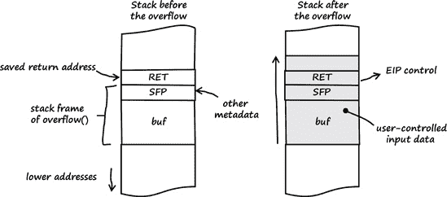

# 附录 A. 搜索技巧

本附录比正文更深入地描述了一些漏洞类别、利用技术和可能导致错误的一些常见问题。

# A.1 栈缓冲区溢出

缓冲区溢出是内存损坏漏洞，可以根据 *类型*（也称为 *生成*）进行分类。今天最相关的是 *栈缓冲区溢出* 和 *堆缓冲区溢出*。如果向缓冲区或数组中复制的数据多于缓冲区或数组能处理的，就会发生缓冲区溢出。就这么简单。正如其名所示，栈缓冲区溢出发生在进程内存的栈区域。栈是进程的一个特殊内存区域，它持有与过程调用相关的数据和元数据。如果在栈上声明的缓冲区中放入比缓冲区能处理更多的数据，相邻的栈内存可能会被覆盖。如果用户可以控制数据和数据量，那么就有可能操纵栈数据或元数据，以控制进程的执行流程。

### 注意

*以下关于栈缓冲区溢出的描述与 32 位英特尔平台（IA-32）相关*。

执行的每个进程函数都在栈上表示。这种信息的组织称为 *栈帧*。栈帧包括函数的数据和元数据，以及一个 *返回地址*，用于找到函数的调用者。当函数返回到其调用者时，返回地址从栈中弹出并进入指令指针（程序计数器）寄存器。如果你可以溢出一个栈缓冲区，然后覆盖返回地址为你选择的一个值，当函数返回时，你将控制指令指针。

利用栈缓冲区溢出有很多其他可能的利用方式，例如，通过操作函数指针、函数参数或栈上的其他重要数据和元数据。

让我们来看一个示例程序：

示例 A-1. 示例程序 *stackoverflow.c*

```
01    #include <string.h>
02
03    void
04    overflow (char *arg)
05    {
06        char  buf[12];
07
08        strcpy (buf, arg);
09    }
10
11    int
12    main (int argc, char *argv[])
13    {
14        if (argc > 1)
15            overflow (argv[1]);
16
17        return 0;
18    }
```

示例 A-1 中的示例程序包含一个简单的栈缓冲区溢出。第一个命令行参数（第 15 行）被用作调用 `overflow()` 函数的参数。在 `overflow()` 函数中，用户提供的数据被复制到一个固定大小为 12 字节的栈缓冲区中（见第 6 和 8 行）。如果我们提供比缓冲区能容纳更多的数据（超过 12 字节），栈缓冲区将会溢出，并且相邻的栈数据将被我们的输入数据覆盖。

图 A-1 说明了缓冲区溢出前后栈的布局。栈向下增长（向较低内存地址），返回地址（RET）之后是另一块称为*保存帧指针（SFP）*的元数据。下面是`overflow()`函数中声明的缓冲区。与向下增长的栈不同，填充到栈缓冲区中的数据是向较高内存地址增长的。如果我们为第一个命令行参数提供足够的数据，那么我们的数据将覆盖缓冲区、SFP、RET 以及相邻的栈内存。如果函数随后返回，我们控制 RET 的值，这使我们能够控制指令指针（`EIP`寄存器）。



图 A-1. 展示缓冲区溢出的栈帧

## 示例：Linux 下的栈缓冲区溢出

要在 Linux（Ubuntu 9.04）下测试示例 A-1，我编译时没有启用栈保护（见 C.1 节）：

```
linux$ `gcc -fno-stack-protector -o stackoverflow stackoverflow.c`
```

然后，我在调试器中启动了程序（有关 gdb 的更多信息，见 B.4 节），并提供了 20 个字节的用户输入作为命令行参数（12 个字节用于填充栈缓冲区，加上 4 个字节用于 SFP，再加上 4 个字节用于 RET）：

```
linux$ `gdb -q ./stackoverflow`

(gdb) `run $(perl -e 'print "A"x12 . "B"x4 . "C"x4')`
Starting program: /home/tk/BHD/stackoverflow $(perl -e 'print "A"x12 . "B"x4 . "C"x4')

Program received signal SIGSEGV, Segmentation fault.
`0x43434343 in ?? ()`

(gdb) `info registers`
eax            0xbfab9fac     −1079271508
ecx            0xbfab9fab     −1079271509
edx            0x15           21
ebx            0xb8088ff4     −1207398412
esp            0xbfab9fc0     0xbfab9fc0
ebp            0x42424242     0x42424242
esi            0x8048430      134513712
edi            0x8048310      134513424
`eip            0x43434343     0x43434343`
eflags         0x10246   [ PF ZF IF RF ]
cs             0x73      115
ss             0x7b      123
ds             0x7b      123
es             0x7b      123
fs             0x0       0
gs             0x33      51
```

我已经控制了指令指针（见`EIP`寄存器），因为返回地址被用户输入提供的四个`C`成功覆盖（四个`C`的十六进制值：`0x43434343`）。

## 示例：Windows 下的栈缓冲区溢出

我在 Windows Vista SP2 下编译了来自示例 A-1 的易受攻击程序，没有启用安全 cookie（`/GS`）支持（见 C.1 节）：

```
C:\Users\tk\BHD>`cl /nologo /GS- stackoverflow.c`
stackoverflow.c
```

然后，我在调试器中启动了程序（有关 WinDbg 的更多信息，见 B.2 节），并提供了与上面 Linux 示例中相同的输入数据。

如图 A-2 所示，我得到了与 Linux 下相同的结果：控制了指令指针（见`EIP`寄存器）。


图 A-2. Windows 下的栈缓冲区溢出（WinDbg 输出）

这只是对缓冲区溢出世界的简要介绍。关于这个主题有大量的书籍和白皮书可供参考。如果你想了解更多，我推荐阅读乔恩·埃里克森的《Hacking: The Art of Exploitation》，第 2 版（No Starch Press，2008 年），或者你可以在 Google 中输入*buffer overflows*并浏览在线上可用的海量资料。

# A.2 空指针解引用

内存被分为页。通常，一个进程、线程或内核不能从零页的内存位置读取或写入。示例 A-2 展示了由于编程错误导致引用零页会发生什么的一个简单例子。

示例 A-2. 使用未拥有的内存——一个空指针解引用的例子

```
01    #include <stdio.h>
02
03    typedef struct pkt {
04        char *  value;
05    } pkt_t;
06
07    int
08    main (void)
09    {
10        pkt_t *  packet  = NULL;
11
12        printf ("%s", packet->value);
13
14        return 0;
15    }
```

在示例 A-2 的第 10 行，数据结构 `packet` 被初始化为 `NULL`，而在第 12 行引用了一个结构成员。由于 `packet` 指向 `NULL`，这个引用可以表示为 `NULL->value`。当程序尝试从内存页零读取值时，这会导致经典的 *空指针解引用*。如果你在 Microsoft Windows 下编译此程序并使用 Windows 调试器 WinDbg（见第 B.2 节）启动它，你会得到以下结果：

```
[..]
(1334.12dc): Access violation - code c0000005 (first chance)
First chance exceptions are reported before any exception handling.
This exception may be expected and handled.
`eax=00000000` ebx=7713b68f ecx=00000001 edx=77c55e74 esi=00000002 edi=00001772
eip=0040100e esp=0012ff34 ebp=0012ff38 iopl=0         nv up ei pl zr na pe nc
cs=001b  ss=0023  ds=0023  es=0023  fs=003b  gs=0000             efl=00010246
*** WARNING: Unable to verify checksum for image00400000
*** ERROR: Module load completed but symbols could not be loaded for image00400000
image00400000+0x100e:
`0040100e 8b08            mov     ecx,dword ptr [eax]  ds:0023:00000000=????????`
[..]
```

当 `EAX` 的值为 `0x00000000` 时，访问违规发生。你可以通过使用调试器命令 `!analyze -v` 获取有关崩溃原因的更多信息：

```
0:000> `!analyze -v`
[..]
FAULTING_IP:
image00400000+100e
0040100e 8b08            mov     ecx,dword ptr [eax]

EXCEPTION_RECORD:  ffffffff -- (.exr 0xffffffffffffffff)
ExceptionAddress: 0040100e (image00400000+0x0000100e)
   `ExceptionCode: c0000005 (Access violation)`
  ExceptionFlags: 00000000
NumberParameters: 2
   Parameter[0]: 00000000
   Parameter[1]: 00000000
`Attempt to read from address 00000000`
[..]
```

空指针解引用通常会导致易受攻击组件崩溃（服务拒绝）。根据特定的编程错误，空指针解引用也可能导致任意代码执行。

# A.3 C 中的类型转换

C 编程语言在处理不同数据类型方面非常灵活。例如，在 C 中，将字符数组转换为有符号整数很容易。有两种类型的转换：*隐式* 和 *显式*。在像 C 这样的编程语言中，隐式类型转换发生在编译器自动将变量转换为不同类型时。这通常发生在初始变量类型与你要执行的操作不兼容时。隐式类型转换也被称为 *强制转换*。

显式类型转换，也称为 *类型强制转换*，发生在程序员明确编码转换的细节时。这通常使用强制转换运算符来完成。

这里是一个隐式类型转换（强制转换）的例子：

```
[..]
unsigned int user_input = 0x80000000;
signed int   length     = user_input;
[..]
```

在这个例子中，unsigned int 和 signed int 之间发生了隐式转换。

下面是一个显式类型转换（类型强制转换）的例子：

```
[..]
char       cbuf[] = "AAAA";
signed int si     = *(int *)cbuf;
[..]
```

在这个例子中，char 和 signed int 之间发生了显式转换。

类型转换可能非常微妙，并可能导致许多安全漏洞。许多与类型转换相关的漏洞是整数无符号和有符号之间转换的结果。以下是一个例子：

示例 A-3. 导致漏洞的有符号/无符号转换 (*implicit.c*)

```
01    #include <stdio.h>
02
03    unsigned int
04    get_user_length (void)
05    {
06        return (0xffffffff);
07    }
08
09    int
10    main (void)
11    {
12        signed int length = 0;
13
14        length = get_user_length ();
15
16        printf ("length: %d %u (0x%x)\n", length, length, length);
17
18        if (length < 12)
19            printf ("argument length ok\n");
20        else
21            printf ("Error: argument length too long\n");
22
23        return 0;
24    }
```

示例 A-3")中的源代码包含一个与我在 FFmpeg 中找到的相当类似的有符号/无符号转换漏洞（见第四章）。你能找到这个错误吗？

在第 14 行，从用户输入中读取一个长度值并存储在有符号整型变量`length`中。`get_user_length()`函数是一个占位符，总是返回“用户输入值”`0xffffffff`。假设这是从网络或数据文件中读取的值。在第 18 行，程序检查用户提供的值是否小于 12。如果是，屏幕上会打印出字符串“`参数长度正确`”。由于`length`被分配了值`0xffffffff`，而这个值远大于 12，所以看起来字符串不会打印出来。然而，让我们看看在 Windows Vista SP2 下编译和运行程序会发生什么：

```
C:\Users\tk\BHD>`cl /nologo implicit.c`
implicit.c

C:\Users\tk\BHD>`implicit.exe`
length: −1 4294967295 (0xffffffff)
argument length ok
```

如您从输出中看到的，第 19 行被达到并执行了。这是怎么发生的？

在 32 位机器上，无符号整型的范围是 0 到 4294967295，有符号整型的范围是-2147483648 到 2147483647。无符号整型值`0xffffffff`（4294967295）在二进制中表示为`1111 1111 1111 1111 1111 1111 1111 1111`（见图 A-3）。如果您将相同的位模式解释为有符号整型，则会在符号位发生变化，导致有符号整型值为-1。数字的符号由*符号位*表示，通常由*最高有效位（MSB）*表示。如果 MSB 为 0，则数字为正数，如果设置为 1，则数字为负数。


图 A-3. 最重要位（MSB）的作用

总结一下：如果将无符号整型转换为有符号整型值，位模式不会改变，但值将在新类型的上下文中被解释。如果无符号整型值在`0x80000000`到`0xffffffff`的范围内，则结果的有符号整型将变为负数（见图 A-4）。

这只是对 C/C++中隐式和显式类型转换的简要介绍。对于 C/C++中类型转换的完整描述及其相关安全问题，请参阅 Mark Dowd、John McDonald 和 Justin Schuh 的《软件安全评估的艺术：识别和避免软件漏洞》（Addison-Wesley，2007 年）。


图 A-4. 整数类型转换：无符号整型到有符号整型

### 注意

*我使用 Debian Linux 6.0（32 位）作为以下所有步骤的平台*。

# A.4 GOT 覆盖

一旦找到内存损坏漏洞，可以使用各种技术来控制易受攻击进程的指令指针寄存器。其中一种技术称为*GOT 覆盖*，通过操纵所谓的*全局偏移表（GOT）*中的一个条目来控制指令指针。由于这种技术依赖于 ELF 文件格式，它仅在支持此格式的平台上工作（如 Linux、Solaris 或 BSD）。

GOT 位于名为`.got`的 ELF 内部数据段中。它的目的是将位置无关的地址计算重定向到绝对位置，因此它存储了动态链接代码中使用的函数调用符号的绝对位置。当程序第一次调用库函数时，*运行时链接编辑器*（`rtld`）定位适当的符号并将其重定位到 GOT。每次对该函数的新调用都直接将控制权传递到该位置，因此不再调用`rtld`来处理该函数。示例 A-4 说明了这个过程。

示例 A-4. 用于演示全局偏移表（GOT）功能的示例代码（got.c*）

```
01    #include <stdio.h>
02
03    int
04    main (void)
05    {
06        int  i = 16;
07
08        printf ("%d\n", i);
09        printf ("%x\n", i);
10
11        return 0;
12    }
```

示例 A-4 中的程序调用了`printf()`库函数两次。我用调试符号编译了程序，并在调试器中启动了它（有关以下调试器命令的描述，请参阅第 B.4 节）：

```
linux$ `gcc -g -o got got.c`

linux$ `gdb -q ./got`

(gdb) `set disassembly-flavor intel`

(gdb) `disassemble main`
Dump of assembler code for function main:
0x080483c4 <main+0>:    push   ebp
0x080483c5 <main+1>:    mov    ebp,esp
0x080483c7 <main+3>:    and    esp,0xfffffff0
0x080483ca <main+6>:    sub    esp,0x20
0x080483cd <main+9>:    mov    DWORD PTR [esp+0x1c],0x10
0x080483d5 <main+17>:   mov    eax,0x80484d0
0x080483da <main+22>:   mov    edx,DWORD PTR [esp+0x1c]
0x080483de <main+26>:   mov    DWORD PTR [esp+0x4],edx
0x080483e2 <main+30>:   mov    DWORD PTR [esp],eax
`0x080483e5 <main+33>:   call   0x80482fc <printf@plt>`
0x080483ea <main+38>:   mov    eax,0x80484d4
0x080483ef <main+43>:   mov    edx,DWORD PTR [esp+0x1c]
0x080483f3 <main+47>:   mov    DWORD PTR [esp+0x4],edx
0x080483f7 <main+51>:   mov    DWORD PTR [esp],eax
`0x080483fa <main+54>:   call   0x80482fc <printf@plt>`
0x080483ff <main+59>:   mov    eax,0x0
0x08048404 <main+64>:   leave
0x08048405 <main+65>:   ret
End of assembler dump.
```

`main()`函数的反汇编显示了*程序链接表（PLT）*中`printf()`的地址。与 GOT 将位置无关的地址计算重定向到绝对位置类似，PLT 将位置无关的函数调用重定向到绝对位置。

```
(gdb) `x/1i 0x80482fc`
0x80482fc <printf@plt>: jmp    DWORD PTR ds:`0x80495d8`
```

PLT 条目立即跳转回 GOT：

```
(gdb) `x/1x 0x80495d8`
0x80495d8 <_GLOBAL_OFFSET_TABLE_+20>:   `0x08048302`
```

如果在之前没有调用库函数，GOT 条目会回退到 PLT。在 PLT 中，重定位偏移量被推送到堆栈，并且执行被重定向到`_init()`函数。这是`rtld`被调用以定位引用的`printf()`符号的地方。

```
(gdb) `x/2i 0x08048302`
0x8048302 <printf@plt+6>:       push   0x10
0x8048307 <printf@plt+11>:      jmp    0x80482cc
```

现在，让我们看看如果`printf()`被第二次调用会发生什么。首先，我在第二次调用`printf()`之前设置了一个断点：

```
(gdb) `list 0`
1    #include <stdio.h>
2
3    int
4    main (void)
5    {
6        int    i    = 16;
7
8        printf ("%d\n", i);
`9        printf ("%x\n", i);`
10

(gdb) `break 9`
Breakpoint 1 at 0x80483ea: file got.c, line 9.
```

然后，我开始运行程序：

```
(gdb) `run`
Starting program: /home/tk/BHD/got
16

Breakpoint 1, main () at got.c:9
9        printf ("%x\n", i);
```

在断点触发后，我再次反汇编了`main`函数，以查看是否调用了相同的 PLT 地址：

```
(gdb) `disassemble main`
Dump of assembler code for function main:
0x080483c4 <main+0>:    push   ebp
0x080483c5 <main+1>:    mov    ebp,esp
0x080483c7 <main+3>:    and    esp,0xfffffff0
0x080483ca <main+6>:    sub    esp,0x20
0x080483cd <main+9>:    mov    DWORD PTR [esp+0x1c],0x10
0x080483d5 <main+17>:   mov    eax,0x80484d0
0x080483da <main+22>:   mov    edx,DWORD PTR [esp+0x1c]
0x080483de <main+26>:   mov    DWORD PTR [esp+0x4],edx
0x080483e2 <main+30>:   mov    DWORD PTR [esp],eax
`0x080483e5 <main+33>:   call   0x80482fc <printf@plt>`
0x080483ea <main+38>:   mov    eax,0x80484d4
0x080483ef <main+43>:   mov    edx,DWORD PTR [esp+0x1c]
0x080483f3 <main+47>:   mov    DWORD PTR [esp+0x4],edx
0x080483f7 <main+51>:   mov    DWORD PTR [esp],eax
`0x080483fa <main+54>:   call   0x80482fc <printf@plt>`
0x080483ff <main+59>:   mov    eax,0x0
0x08048404 <main+64>:   leave
0x08048405 <main+65>:   ret
End of assembler dump.
```

PLT 中的相同地址确实被调用了：

```
(gdb) `x/1i 0x80482fc`
0x80482fc <printf@plt>: jmp    DWORD PTR ds:`0x80495d8`
```

被调用的 PLT 条目立即跳转回 GOT：

```
(gdb) `x/1x 0x80495d8`
0x80495d8 <_GLOBAL_OFFSET_TABLE_+20>:   `0xb7ed21c0`
```

但这次，`printf()`的 GOT 条目已更改：它现在直接指向`libc`中的`printf()`库函数。

```
(gdb) `x/10i 0xb7ed21c0`
0xb7ed21c0 <printf>:    push   ebp
0xb7ed21c1 <printf+1>:  mov    ebp,esp
0xb7ed21c3 <printf+3>:  push   ebx
0xb7ed21c4 <printf+4>:  call   0xb7ea1aaf
0xb7ed21c9 <printf+9>:  add    ebx,0xfae2b
0xb7ed21cf <printf+15>: sub    esp,0xc
0xb7ed21d2 <printf+18>: lea    eax,[ebp+0xc]
0xb7ed21d5 <printf+21>: mov    DWORD PTR [esp+0x8],eax
0xb7ed21d9 <printf+25>: mov    eax,DWORD PTR [ebp+0x8]
0xb7ed21dc <printf+28>: mov    DWORD PTR [esp+0x4],eax
```

现在如果我们改变 `printf()` 的 GOT 条目值，那么在调用 `printf()` 时就可以控制程序的执行流程：

```
(gdb) `set variable *(0x80495d8)=0x41414141`

(gdb) `x/1x 0x80495d8`
0x80495d8 <_GLOBAL_OFFSET_TABLE_+20>:   `0x41414141`

(gdb) `continue`
Continuing.

Program received signal SIGSEGV, Segmentation fault.
`0x41414141 in ?? ()`

(gdb) `info registers eip`
eip            `0x41414141`    0x41414141
```

我们已经实现了 `EIP` 控制。关于这种利用技术的实际例子，请参阅 第四章。

要确定库函数的 GOT 地址，你可以使用调试器，如前例所示，或者使用 `objdump` 或 `readelf` 命令：

```
linux$ `objdump -R got`

got:     file format elf32-i386

DYNAMIC RELOCATION RECORDS
OFFSET   TYPE              VALUE
080495c0 R_386_GLOB_DAT    __gmon_start__
080495d0 R_386_JUMP_SLOT   __gmon_start__
080495d4 R_386_JUMP_SLOT   __libc_start_main
`080495d8 R_386_JUMP_SLOT   printf`

linux$ `readelf -r got`

Relocation section '.rel.dyn' at offset 0x27c contains 1 entries:
 Offset     Info    Type            Sym.Value  Sym. Name
080495c0  00000106 R_386_GLOB_DAT    00000000   __gmon_start__

Relocation section '.rel.plt' at offset 0x284 contains 3 entries:
 Offset     Info    Type            Sym.Value  Sym. Name
080495d0  00000107 R_386_JUMP_SLOT   00000000   __gmon_start__
080495d4  00000207 R_386_JUMP_SLOT   00000000   __libc_start_main
`080495d8  00000307 R_386_JUMP_SLOT   00000000   printf`
```

## 注意事项

^([90])

* * *

^([90]) 关于 ELF 的描述，请参阅 TIS 委员会编写的 *《工具接口标准 (TIS) 可执行和链接格式 (ELF) 规范》*，版本 1.2，1995 年，见 [`refspecs.freestandards.org/elf/elf.pdf`](http://refspecs.freestandards.org/elf/elf.pdf)。
