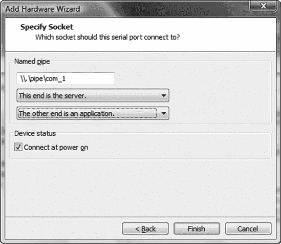

# 附录 B. 调试

本附录包含有关调试器和调试过程的信息。

# B.1 Solaris 模块化调试器（mdb）

以下表格列出了 Solaris 模块化调试器（mdb）的一些有用命令。有关可用命令的完整列表，请参阅*Solaris 模块化调试器指南*。^([91])

## 开始和停止 mdb

| 命令 | 描述 |
| --- | --- |
| `mdb` *`程序`* | 使用 *`程序`* 启动 mdb 进行调试。 |
| `mdb` *`unix.<n> vmcore.<n>`* | 在内核崩溃转储上运行 mdb（*`unix.<n>`* 和 *`vmcore.<n>`* 通常可以在目录 *`/var/crash/<hostname>`* 中找到）。 |
| `$q` | 退出调试器。 |

## 通用命令

| 命令 | 描述 |
| --- | --- |
| `::run` *`参数`* | 使用给定的 *`参数`* 运行程序。如果目标是当前正在运行的程序或是一个核心文件，mdb 如果可能将重新启动程序。 |

## 断点

| 命令 | 描述 |
| --- | --- |
| *`地址`*`::bp` | 在命令中指定的断点位置的 *`地址`* 处设置新的断点。 |
| `$b` | 列出现有断点的信息。 |
| `::delete` *`编号`* | 删除之前设置的由其 *`编号`* 指定的断点。 |

## 运行调试程序

| 命令 | 描述 |
| --- | --- |
| `:s` | 执行一条单条指令。将进入子函数。 |
| `:e` | 执行一条单条指令。不会进入子函数。 |
| `:c` | 恢复执行。 |

## 检查数据

| 命令 | 描述 |
| --- | --- |
| *`地址`*,*`计数格式`* | 在指定的 *`格式`* 中打印在 *`地址`* 处找到的指定数量的对象 (*`计数`*)；示例格式包括 B（十六进制，1 字节），X（十六进制，4 字节），S（字符串）。 |

## 信息命令

| 命令 | 描述 |
| --- | --- |
| `$r` | 列出寄存器和它们的值。 |
| `$c` | 打印所有堆栈帧的回溯。 |
| *`地址`*`::dis` | 将 *`地址`* 附近的内存范围作为机器指令转储。 |

## 其他命令

| 命令 | 描述 |
| --- | --- |
| `::status` | 打印与当前目标相关的信息摘要。 |
| `::msgbuf` | 显示消息缓冲区，包括所有直到内核恐慌的控制台消息。 |

# B.2 Windows 调试器（WinDbg）

以下表格列出了 WinDbg 的一些有用的调试器命令。有关可用命令的完整列表，请参阅 Mario Hewardt 和 Daniel Pravat 的*高级 Windows 调试*（Addison-Wesley Professional，2007）或 WinDbg 的文档。

## 开始和停止调试会话

| 命令 | 描述 |
| --- | --- |
| `文件` ▸ `打开可执行文件...` | 在文件菜单上点击**打开可执行文件**以启动新的用户模式进程并对其进行调试。 |
| `文件` ▸ `附加到进程...` | 在文件菜单上点击**附加到进程**以调试当前正在运行的用户模式应用程序。 |
| `q` | 结束调试会话。 |

## 通用命令

| 命令 | 描述 |
| --- | --- |
| `g` | 在目标上开始或继续执行。 |

## 断点

| 命令 | 描述 |
| --- | --- |
| `bp` *`地址`* | 在指定的 *`地址`* 处设置新的断点。 |
| `bl` | 列出现有断点的信息。 |
| `bc` *`断点 ID`* | 删除之前设置的指定 *`断点 ID`* 的断点。 |

## 运行调试程序

| 命令 | 描述 |
| --- | --- |
| `t` | 执行单条指令或源代码行，并可选地显示所有寄存器和标志的结果值。可以进入子函数。 |
| `p` | 执行单条指令或源代码行，并可选地显示所有寄存器和标志的结果值。不会进入子函数。 |

## 检查数据

| 命令 | 描述 |
| --- | --- |
| `dd` *`地址`* | 将 *`地址`* 的内容以双字值（4 字节）显示。 |
| `du` *`地址`* | 将 *`地址`* 的内容以 Unicode 字符显示。 |
| `dt` | 显示有关局部变量、全局变量或数据类型的信息，包括结构和联合。 |
| `poi(`*`地址`*`)` | 从指定的 *`地址`* 返回指针大小的数据。根据架构，指针大小为 32 位或 64 位。 |

## 信息命令

| 命令 | 描述 |
| --- | --- |
| `r` | 列出寄存器和它们的值。 |
| `kb` | 打印所有堆栈帧的回溯。 |
| `u` *`地址`* | 将 *`地址`* 附近的内存范围作为机器指令输出。 |

## 其他命令

| 命令 | 描述 |
| --- | --- |
| `!analyze -v` | 此调试器扩展显示有关异常或错误检查的大量有用信息。 |
| `!drvobj` *`DRIVER_OBJECT`* | 此调试器扩展显示有关 *`DRIVER_OBJECT`* 的详细信息。 |
| `.sympath` | 此命令更改调试器的默认符号搜索路径。 |
| `.reload` | 此命令删除所有符号信息，并在需要时重新加载这些符号。 |

# B.3 Windows 内核调试

为了分析第六章（第六章]) 和 WinDbg^([93])：

### 注意

*在本节中，我使用了以下软件版本：VMware Workstation 6.5.2 和 WinDbg 6.10.3.233*。

+   第 1 步：配置 VMware 虚拟系统以进行远程内核调试。

+   第 2 步：调整虚拟系统的 *boot.ini*。

+   第 3 步：在 VMware 主机上配置 WinDbg 以进行 Windows 内核调试。

## 第 1 步：配置 VMware 虚拟系统以进行远程内核调试

在我安装了 Windows XP SP3 VMware 虚拟系统后，我关闭了电源，并在 VMware 的命令部分选择了 **编辑虚拟机设置**。然后我点击了 **添加** 按钮以添加一个新的串行端口，并选择了如图 图 B-1 和 图 B-2 所示的配置设置。


图 B-1. 输出到命名管道



图 B-2. 命名管道配置

在成功添加新的串行端口后，我在“输入/输出模式”部分选择了“Yield CPU on poll”复选框，如图 图 B-3 所示。


图 B-3. 新串行端口的配置设置

## 第 2 步：调整虚拟机的 boot.ini 文件

我随后开启了 VMware 虚拟系统，并编辑了 Windows XP 的 *boot.ini* 文件，以包含以下条目（粗体项启用了内核调试）：

```
[boot loader]
timeout=30
default=multi(0)disk(0)rdisk(0)partition(1)\WINDOWS
[operating systems]
multi(0)disk(0)rdisk(0)partition(1)\WINDOWS="Microsoft Windows XP
 Professional" /noexecute=optin /fastdetect
`multi(0)disk(0)rdisk(0)partition(1)\WINDOWS="Microsoft`
 `Windows XP Professional - Debug" /fastdetect /debugport=com1`
```

我随后重新启动了虚拟系统，并在引导菜单中选择了新的条目 **Microsoft Windows XP Professional – Debug [调试器已启用]** 以启动系统，如图 图 B-4 所示。


图 B-4. 新的引导菜单选项

## 第 3 步：在 VMware 主机上配置 WinDbg 以进行 Windows 内核调试

剩下的只是配置 VMware 主机上的 WinDbg，使其通过管道连接到 VMware 虚拟系统的内核。为此，我创建了一个包含如图 图 B-5 所示内容的批处理文件。


图 B-5. 内核调试的 WinDbg 批处理文件

我随后双击批处理文件，将 VMware 主机上的 WinDbg 连接到 VMware Windows XP 虚拟系统的内核，如图 图 B-6") 所示。


图 B-6. 连接内核调试器 (WinDbg)

# B.4 GNU 调试器 (gdb)

以下表格列出了 GNU 调试器 (gdb) 的一些有用命令。有关可用命令的完整列表，请参阅 gdb 在线文档。94]

## 启动和停止 gdb

| 命令 | 描述 |
| --- | --- |
| `gdb` *`程序`* | 使用 *`程序`* 启动 gdb 以进行调试。 |
| `quit` | 退出调试器。 |

## 通用命令

| 命令 | 描述 |
| --- | --- |
| `run` *`arguments`* | 启动调试程序（带有 *`arguments`*）。 |
| `attach` *`processID`* | 将调试器附加到具有 *`processID`* 的运行进程。 |

## 断点

| 命令 | 描述 |
| --- | --- |
| `break <`*`file`*`:> function` | 在 *`file`* 中指定 *`function`* 的开始处设置断点。 |
| `break <`*`file`*`:> line number` | 在 *`file`* 中该 *`line number`* 的代码开始处设置断点。 |
| `break *`*`address`* | 在指定的 *`address`* 处设置断点。 |
| `info breakpoints` | 列出现有断点的信息。 |
| `delete` *`number`* | 删除之前设置的由其 *`number`* 指定的断点。 |

## 运行调试程序

| 命令 | 描述 |
| --- | --- |
| `stepi` | 执行一条机器指令。将进入子函数。 |
| `nexti` | 执行一条机器指令。不会进入子函数。 |
| `continue` | 继续执行。 |

## 检查数据

| 命令 | 描述 |
| --- | --- |
| `x/`*`CountFormatSize address`* | 根据指定的 *`Format`* 在 *`address`* 处打印指定数量的对象 (*`Count`*) 的 *`Size`*。Size: `b` (字节), `h` (半字), `w` (字), `g` (巨量, 8 字节)。Format: `o` (八进制), `x` (十六进制), `d` (十进制), `u` (无符号十进制), `t` (二进制), `f` (浮点), `a` (地址), `i` (指令), `c` (字符), `s` (字符串)。 |

## 信息命令

| 命令 | 描述 |
| --- | --- |
| `info registers` | 列出寄存器和它们的值。 |
| `backtrace` | 打印所有栈帧的回溯。 |
| `disassemble` *`address`* | 将 *`address`* 附近的内存范围作为机器指令输出。 |

## 其他命令

| 命令 | 描述 |
| --- | --- |
| `set disassembly-flavor` *`intel`*`&#124;`*`att`* | 将反汇编风格设置为 Intel 或 AT&T 汇编语法。默认为 AT&T 语法。 |
| `shell` *`command`* | 执行一个 shell *`command`*。 |
| `set variable *(`*`address`*`)=`*`value`* | 将 *`value`* 存储在由 *`address`* 指定的内存位置。 |
| `source` *`file`* | 从 *`file`* 读取调试器命令。 |
| `set follow-fork-mode` *`parent`*`&#124;`*`child`* | 告诉调试器跟随 *`child`* 或 *`parent`* 进程。 |

# B.5 使用 Linux 作为 Mac OS X 内核调试主机

在本节中，我将详细说明我执行的准备 Linux 系统作为 Mac OS X 内核调试主机的步骤：

+   第 1 步：安装古老的 Red Hat 7.3 Linux 操作系统。

+   第 2 步：获取必要的软件包。

+   第 3 步：在 Linux 主机上构建 Apple 的调试器。

+   第 4 步：准备调试环境。

## 第 1 步：安装古老的 Red Hat 7.3 Linux 操作系统

因为我所使用的苹果 GNU 调试器 (gdb) 版本需要低于 3 版本的 GNU C 编译器 (gcc) 才能正确构建，所以我下载并安装了一个古老的 Red Hat 7.3 Linux 系统.^([95]) 安装 Red Hat 系统，我选择了自定义安装类型。当被要求选择要安装的软件包（软件包组选择）时，我只选择了网络支持、软件开发以及 OpenSSH 服务器。这些软件包包括构建苹果 gdb 在 Linux 下的所有必要开发工具和库。在安装过程中，我添加了一个名为 `tk` 的无权限用户，其家目录位于 */home/tk* 下。

## 第 2 步：获取必要的软件包

在成功安装 Linux 主机后，我下载了以下软件包：

+   苹果公司自定义 gdb 版本的源代码.^([96])

+   来自 GNU 的标准 gdb 源代码.^([97])

+   一个适用于在 Linux 下编译的苹果 gdb 补丁.^([98])

+   XNU 内核的适当源代码版本。我准备了 Linux 调试主机来研究第七章（第七章。比 4.4BSD 更古老的错误])

+   苹果内核调试工具包的适当版本。我在 Mac OS X 10.4.8 上找到了第七章（第七章。比 4.4BSD 更古老的错误。

## 第 3 步：在 Linux 主机上构建苹果调试器

在我将必要的软件包下载到 Linux 主机后，我解压了两个版本的 gdb：

```
linux$ `tar xvzf gdb-292.tar.gz`
linux$ `tar xvzf gdb-5.3.tar.gz`
```

然后，我将苹果源树中的 *mmalloc* 目录替换为 GNU gdb 的目录：

```
linux$ `mv gdb-292/src/mmalloc gdb-292/src/old_mmalloc`
linux$ `cp -R gdb-5.3/mmalloc gdb-292/src/`
```

我将补丁应用到苹果的 gdb 版本：

```
linux$ `cd gdb-292/src/`
linux$ `patch -p2 < ../../osx_gdb.patch`
patching file gdb/doc/stabs.texinfo
patching file gdb/fix-and-continue.c
patching file gdb/mach-defs.h
patching file gdb/macosx/macosx-nat-dyld.h
patching file gdb/mi/mi-cmd-stack.c
```

我使用以下命令构建必要的库：

```
linux$ `su`
Password:

linux# `pwd`
/home/tk/gdb-292/src

linux# `cd readline`
linux# `./configure; make`

linux# `cd ../bfd`
linux# `./configure --target=i386-apple-darwin`
 `--program-suffix=_osx; make;`                      → `make install`

linux# `cd ../mmalloc`
linux# `./configure; make; make install`

linux# `cd ../intl`
linux# `./configure; make; make install`

linux# `cd ../libiberty`
linux# `./configure; make; make install`

linux# `cd ../opcodes`
linux# `./configure --target=i386-apple-darwin --program`
`-suffix=_osx; make;`                      → `make install`
```

要构建调试器本身，我需要将一些头文件从 XNU 内核源代码复制到 Linux 主机的 *include* 目录：

```
linux# `cd /home/tk`
linux# `tar -zxvf xnu-792.13.8.tar.gz`
linux# `cp -R xnu-792.13.8/osfmk/i386/ /usr/include/`
linux# `cp -R xnu-792.13.8/bsd/i386/ /usr/include/`
cp: overwrite `/usr/include/i386/Makefile'? `y`
cp: overwrite `/usr/include/i386/endian.h'? `y`
cp: overwrite `/usr/include/i386/exec.h'? `y`
cp: overwrite `/usr/include/i386/setjmp.h'? `y`
linux# `cp -R xnu-792.13.8/osfmk/mach /usr/include/`
```

然后，我在新的 *_types.h* 文件中注释了一些 typedef 以避免编译时冲突（见第 39 行，第 43 至 49 行，以及第 78 至 81 行）：

```
linux# `vi +38 /usr/include/i386/_types.h`
[..]
     38 #ifdef __GNUC__
     `39 // typedef __signed char           __int8_t;`
     40 #else   /* !__GNUC__ */
     41 typedef char                    __int8_t;
     42 #endif  /* !__GNUC__ */
     `43 // typedef unsigned char           __uint8_t;`
     `44 // typedef short                   __int16_t;`
     `45 // typedef unsigned short          __uint16_t;`
     `46 // typedef int                     __int32_t;`
     `47 // typedef unsigned int            __uint32_t;`
     `48 // typedef long long               __int64_t;`
     `49 // typedef unsigned long long      __uint64_t;`
     ..
     `78 //typedef union {`
     `79 //      char            __mbstate8[128];`
     `80 //      long long       _mbstateL;                      /* for alignment */`
     `81 //} __mbstate_t;`
[..]
```

我在文件 */home/tk/gdb-292/src/gdb/macosx/i386-macosx-tdep.c* 中添加了一个新的 `include`（见第 24 行）：

```
linux# `vi +24 /home/tk/gdb-292/src/gdb/macosx/i386-macosx-tdep.c`
[..]
     `24 #include <string.h>`
     25 #include "defs.h"
     26 #include "frame.h"
     27 #include "inferior.h"
[..]
```

最后，我使用以下命令编译了调试器：

```
linux# `cd gdb-292/src/gdb/`
linux# `./configure --target=i386-apple-darwin --program-suffix=_osx --disable-gdbtk`
linux# `make; make install`
```

编译完成后，我以 root 身份运行了新的调试器，以便在 */usr/local/bin/* 下创建必要的目录：

```
linux# `cd /home/tk`
linux# `gdb_osx -q`
(gdb) `quit`
```

之后，调试器就准备好了。

## 第 4 步：准备调试环境

我在 Mac OS X 下解压了下载的内核调试工具包磁盘映像文件（dmg），使用 `scp` 将文件传输到 Linux 主机，并将目录命名为 *KernelDebugKit_10.4.8*。我还将 XNU 源代码复制到调试器的搜索路径中：

```
linux# `mkdir /SourceCache`
linux# `mkdir /SourceCache/xnu`
linux# `mv xnu-792.13.8 /SourceCache/xnu/`
```

在 第七章 中，我描述了如何使用新构建的内核调试器连接到 Mac OS X 机器。

## 备注

^([91])

^([92])

^([93])

^([94])

^([95])

^([96])

^([97])

^([98])

^([99])

* * *

^([91]) 查看 *Solaris Modular Debugger Guide* 在 [`dlc.sun.com/osol/docs/content/MODDEBUG/moddebug.html`](http://dlc.sun.com/osol/docs/content/MODDEBUG/moddebug.html).

^([92]) 查看 [`www.vmware.com/`](http://www.vmware.com/).

^([93]) 查看 [`www.microsoft.com/whdc/DevTools/Debugging/default.mspx`](http://www.microsoft.com/whdc/DevTools/Debugging/default.mspx).

^([94)) 查看 [`www.gnu.org/software/gdb/documentation/`](http://www.gnu.org/software/gdb/documentation/)。

^([95)) 仍然有一些可用的下载镜像站点，您可以从那里获取 Red Hat 7.3 ISO 镜像。以下是一些，截至本文撰写时：[`ftp-stud.hs-esslingen.de/Mirrors/archive.download.redhat.com/redhat/linux/7.3/de/iso/i386/`](http://ftp-stud.hs-esslingen.de/Mirrors/archive.download.redhat.com/redhat/linux/7.3/de/iso/i386/)，[`mirror.fraunhofer.de/archive.download.redhat.com/redhat/linux/7.3/en/iso/i386/`](http://mirror.fraunhofer.de/archive.download.redhat.com/redhat/linux/7.3/en/iso/i386/)，以及 [`mirror.cs.wisc.edu/pub/mirrors/linux/archive.download.redhat.com/redhat/linux/7.3/en/iso/i386/`](http://mirror.cs.wisc.edu/pub/mirrors/linux/archive.download.redhat.com/redhat/linux/7.3/en/iso/i386/)。

^([96]) 您可以从 [`www.opensource.apple.com/tarballs/gdb/gdb-292.tar.gz`](http://www.opensource.apple.com/tarballs/gdb/gdb-292.tar.gz) 下载苹果定制的 gdb 版本。

^([97)) 您可以从 [`ftp.gnu.org/pub/gnu/gdb/gdb-5.3.tar.gz`](http://ftp.gnu.org/pub/gnu/gdb/gdb-5.3.tar.gz) 下载 GNU 的标准 gdb 版本。

^([98)) 苹果 GNU 调试器的补丁可以在 [`www.trapkit.de/books/bhd/osx_gdb.patch`](http://www.trapkit.de/books/bhd/osx_gdb.patch) 获取。

^([99)) XNU 版本 792.13.8 可以从 [`www.opensource.apple.com/tarballs/xnu/xnu-792.13.8.tar.gz`](http://www.opensource.apple.com/tarballs/xnu/xnu-792.13.8.tar.gz) 下载。
