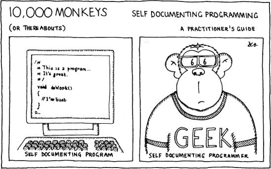
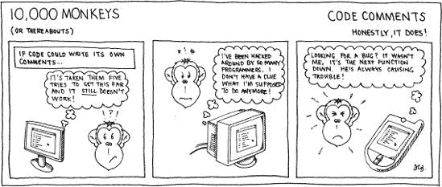
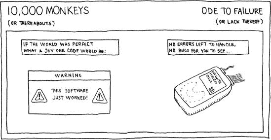

# 第一部分。代码面

程序员编写程序。这不需要天才就能想明白。但有一个更微妙的区别：只有优秀的程序员才会习惯性地编写优秀的代码。糟糕的程序员……*不会*。他们制造出的混乱需要比编写时更多的努力来修复。

你更愿意成为哪种人？

代码工艺从代码面开始；这是我们最喜欢的地方。我们程序员只有在沉浸在编辑器中，一行行地敲打出完美形成和执行良好的源代码时，才会感到最快乐。如果我们周围的世界在一阵布尔逻辑的烟雾中消失，我们会非常高兴。遗憾的是，现实世界不会走开——它似乎不愿意将自己局限在自身之内。

在你精心编写的代码周围，世界正处于混乱的变化状态。几乎每个软件项目都以其变化性为特征：不断变化的需求、不断变化的预算、不断变化的截止日期、不断变化的优先级和不断变化的团队。所有这些因素都使得编写优秀的代码变得非常困难。欢迎来到现实世界。

优秀的程序员在不受干扰的情况下自然会编写整洁的代码。但他们也有一系列的战斗策略来帮助他们在前线编写健壮的代码 *。他们知道如何保护自己免受软件工厂残酷现实的侵害，并编写能够经受住变化旋风的代码。

这就是我们在这里要探讨的内容。本节深入探讨了痛苦而实用的代码构建细节，编写源代码语句的螺丝和螺母。你将学习策略来帮助你在波涛汹涌的软件开发海洋中保持浮力，并挑战你提高代码编写技能。

这些章节关注以下问题：

第一章

防御性编程：当世界与你为敌时，如何编写健壮的代码。

第二章

优秀的展示：为什么它很重要以及如何展示代码。

第三章

为程序的部分选择清晰的名称。

第四章

自我文档化的代码。当你无法写出一整本小说时，解释代码的实际策略。

第五章

编写最合适的代码注释的有效技巧。

第六章

处理错误：如何管理可能出错的操作，以及出错时应该做什么。

这些构成了在混乱世界中编写良好代码的道路；它们是坚实的代码编写技巧，应该成为第二本能。如果你不编写清晰、易懂、防御性、易于测试和易于维护的软件，那么当你应该为软件工厂接下来会抛出的东西做准备时，你会被繁琐的代码相关问题所困扰。

# 第一章。防御

### *健壮代码的防御性编程技巧*

我们必须相互不信任。这是我们对抗背叛的唯一防御。

——田纳西·威廉姆斯

当我的女儿十个月大时，她喜欢玩木制积木。嗯，她喜欢和木制积木还有*我*一起玩。我会尽可能堆砌一个高塔，然后轻轻地推一下底部的积木，她就会让整个塔倒塌，并发出一声高兴的尖叫。我建这些塔不是为了它们的强度——如果那样做的话就毫无意义了。如果我真的想要一个坚固的塔，我会用完全不同的方式来建造。我会削平基础，从宽基开始，而不是仅仅快速堆叠积木，尽可能堆得高。

太多的程序员编写代码就像易倒的积木塔；轻轻一推底部，整个塔就会倒塌。代码层层叠加，我们需要使用确保每一层都稳固的技术，这样我们才能在此基础上构建。

# 向着优秀的代码迈进

代码看起来似乎能工作、*正确的*代码和*好的*代码之间有很大的区别。M.A.杰克逊写道：“软件工程师智慧的起点是认识到让程序工作与让它*正确*之间的区别。”（杰克逊 75）这里有一个区别：

+   写出大多数时候都能工作的代码很容易。你给它通常的输入集；它给出通常的输出集。但是给它一些意想不到的东西，它可能就会倒塌。

+   *正确的*代码不会倒塌。对于所有可能的输入集，输出都将正确。但通常所有可能的输入集非常大，难以测试。

+   然而，并非所有正确的代码都是*好的*代码——逻辑可能难以理解，代码可能很复杂，而且可能实际上无法维护。

根据这些定义，我们应该追求的是好的代码。它健壮、足够高效，当然，是正确的。工业强度的代码在接收到非寻常输入时不会崩溃或产生错误的结果。它还将满足所有其他要求，包括线程安全、时间约束和可重入性。

在自己舒适的家中编写这种好的代码是一回事，在一个精心控制的环境中。但在软件工厂的热潮中这样做就完全不同了，那里世界在你周围变化，代码库正在迅速演变，你不断地面临那些怪异的*遗留代码*——由早已消失的代码猴子编写的陈旧程序。当世界联合起来阻止你时，尝试编写好的代码！

在这个痛苦的环境中，你如何确保你的代码是工业强度的？*防御性编程*有所帮助。

虽然有许多构建代码的方法（面向对象的方法、基于组件的模型、结构化设计、极限编程等），但防御性编程是一种可以普遍应用的方法。它与其说是一种正式的方法论，不如说是一套非正式的基本指南。防御性编程不是万能的灵丹妙药，而是一种预防潜在编码问题的实用方法。

# 假设最坏的情况

当你编写代码时，很容易对它应该如何运行、如何被调用、有效的输入是什么等等做出一系列假设。你可能甚至都没有意识到自己已经做出了假设，因为这一切对你来说似乎都很明显。你可能会快乐地花几个月的时间编写代码，而这时这些假设在你的脑海中逐渐消失和扭曲。

或者，你可能会在产品即将在 10 分钟内出厂时，捡起一些旧代码进行关键的最后一刻修复。你只有足够的时间匆匆浏览其结构，你将假设代码是如何工作的。没有时间进行全面的文学批评，直到你有机会证明代码实际上正在做你所认为的事情之前，假设就是你拥有的全部。

假设会导致我们编写有缺陷的软件。做出假设很容易：

+   函数*永远不会*以那种方式被调用。我总是只会传递有效的参数。

+   这段代码将*始终*正常工作；它永远不会产生错误。

+   *没有人*会尝试访问这个变量，如果我只将其标记为*仅限内部使用*。

当我们进行防御性编程时，我们不应该做出*任何*假设。我们永远不应该假设*它不可能发生*。我们永远不应该假设世界会按照我们期望的方式运行。

经验告诉我们，唯一可以确定的事情是：你的代码*将*以某种方式，在某个时候出错。有人*会*做愚蠢的事情。墨菲定律是这样说的：“如果可以用错，它就会。”听听那个人的话——他是从经验中说的。1] 防御性编程通过预见这些事故，或者至少预先猜测它们——弄清楚代码每个阶段可能出错的地方，并加以防范，来防止这些事故的发生。

这是不是太偏执了？也许吧。但有点偏执并不会伤害到任何人。事实上，这很有道理。随着你的代码的发展，你将忘记最初做出的假设集合（真正的代码确实会发展——参见第十五章）。其他程序员不会了解你头脑中的假设，或者他们只是对你代码能做什么做出自己无效的假设。软件演变会暴露弱点，代码的增长会隐藏原始的简单假设。一开始有点偏执可以使代码在长期运行中更加健壮。

**关键概念**

*不要假设任何东西。未写出的假设会不断导致错误，尤其是在代码增长时*。

再加上这样一个事实：你和你用户都无法控制的事情也可能出错：磁盘满了，网络失败了，计算机崩溃了。坏事发生了。记住，实际上失败的不是你的程序——软件总是按照你告诉它的那样去做。真正的算法，或者可能是客户端代码，是引入系统错误的原因。

随着你编写更多的代码，并且以越来越快的速度工作，犯错的几率越来越大。如果没有足够的时间来验证每个假设，你就无法编写健壮的代码。不幸的是，在编程前线，很少有机会放慢速度，审视一下，仔细研究一段代码。世界变化得太快，程序员需要跟上。因此，我们应该抓住每一个减少错误的机会，而防御性实践是我们的主要武器之一。

* * *

^([1]) 爱德华·墨菲中士是一位美国空军工程师。他在发现一名技术人员系统地错误地将一整排设备颠倒连接后，提出了这个臭名昭著的法律。对称的连接器允许这种可避免的错误发生；之后，他选择了不同的连接器设计。

# 什么是防御性编程？

正如其名所示，防御性编程是谨慎、守卫的编程。为了构建可靠的软件，我们设计系统中的每个组件，使其尽可能自我保护。我们通过在代码中明确检查它们来打破未写明的假设。这是尝试防止，或者至少观察我们的代码以某种方式被调用时将表现出不正确行为的一种尝试。

防御性编程使我们能够及早发现小问题，而不是等到它们演变成大灾难时才被咬。过于常见的是，你会看到“专业”的开发者匆忙推出代码而不加思考。故事可能就像这样：


他们不断地被那些他们从未花时间验证的错误假设所困扰。这几乎不是对现代软件工程的宣传，但它却时常发生。防御性编程帮助我们从一开始就编写正确的软件，并摆脱*编写它*，*尝试它*，*编写它*，*尝试它*……的循环。使用防御性编程，故事看起来更像这样：


好吧，防御性编程并不能完全消除程序故障。但问题将变得不那么麻烦，更容易解决。防御性程序员捕捉到的是飘落的雪花，而不是被错误的大雪崩所掩埋。

防御性编程是一种预防方法，而不是一种治疗方法。将其与调试进行比较——在虫子咬人之后移除虫子的行为。调试完全是关于寻找治疗方法。

**防御性编程不是什么**

关于防御性编程有一些常见的误解。防御性编程不是：

**错误检查**

如果你的代码中可能出现错误条件，你应该检查它们。这不是防御性代码。这只是良好的实践——编写*正确*代码的一部分。

**测试**

测试你的代码不是防御性的。它是我们开发工作中的另一个正常部分。测试工具不是防御性的；它们可以证明代码现在是正确的，但不会证明它能够经受未来的修改。即使拥有世界上最好的测试套件，任何人都可以做出更改，并使其通过未经测试的审查。

**调试**

在调试期间，你可能需要添加一些防御性代码，但调试是在你的程序失败之后进行的。防御性编程是你为了*防止*程序一开始就失败（或者及早检测到失败，在它们以难以理解的方式显现之前，需要整夜调试）而采取的措施。

防御性编程真的值得麻烦吗？有赞成和反对的论点：

**反对的案例**

防御性编程消耗资源，包括你的和电脑的。

+   它会降低你代码的效率；即使是额外的少量代码也需要额外的执行。对于一个函数或类来说，这可能无关紧要，但当你有一个由 100,000 个函数组成的系统时，你可能会有更多的问题。

+   每项防御性实践都需要一些额外的工作。你为什么应该遵循其中任何一项？你已经有很多事情要做，对吧？只需确保人们正确使用你的代码。如果他们不这样做，那么任何问题都是他们自己的责任。

**案例**为

反驳论点是很有说服力的。

+   防御性编程可以为你节省大量的调试时间，让你有更多的时间去做有趣的事情。记住墨菲定律：如果你的代码*可能*被错误使用，它就会。

+   运行正常但稍微慢一点的代码，与大多数时候运行但偶尔会崩溃，散发出五彩斑斓的火花相比，要好得多。

+   我们可以设计一些防御性代码，在发布版本中物理移除，绕过性能问题。我们在这里考虑的大多数项目实际上并没有任何显著的额外开销。

+   防御性编程避免了大量安全问题——这是现代软件开发中的一个严重问题。更多内容将在后面讨论。

随着市场对更快、更便宜软件的需求增加，我们需要关注能够产生结果的技术。不要跳过前端额外的努力，这可以防止以后的痛苦和延误。

# 险恶的大千世界

有人说：“不要把可以由愚蠢解释的事情归咎于恶意。”^([2]) 大多数时候，我们是在防御愚蠢，防御无效和未经检查的假设。然而，确实存在恶意用户，他们会试图扭曲和破坏你的代码，以适应他们邪恶的目的。

防御性编程有助于提高程序安全性，防止这种故意的滥用。黑客和病毒编写者通常会利用马虎的代码来控制应用程序，然后编织他们想要的任何邪恶计划。在当今软件开发的世界中，这是一个严重的威胁；它对生产力、金钱和隐私的损失有着巨大的影响。

软件滥用者从利用小程序的小缺陷的机会主义者到花费时间故意试图非法访问你系统的硬核黑客都有。太多的无意识程序员为这些人留下了巨大的漏洞。随着网络化计算机的兴起，粗心大意的后果变得越来越严重。

许多大型开发公司终于开始意识到这个威胁，并开始认真对待这个问题，投入时间和资源进行严肃的防御性代码工作。实际上，攻击发生后很难再添加防御措施。我们将在第十二章中更详细地探讨软件安全。

## 防御性编程技术

背景介绍就到这里。这一切对在软件工厂工作的程序员意味着什么呢？

在防御性编程的范畴下，有许多常识性规则。人们通常在想到防御性编程时会想到**断言**，这是正确的。我们稍后会讨论这些。但还有一些简单的编程习惯可以极大地提高你代码的安全性。

尽管这些规则看起来是常识，但它们通常被忽视——这就是世界上大多数软件标准低的原因。只要程序员保持警觉并充分了解信息，更严格的安全和可靠的开发可以出人意料地容易实现。

接下来的几页列出了防御性编程的规则。我们将从宏观的角度开始，探讨高级防御技术、流程和程序。随着我们的进展，我们将填充更详细的细节，更深入地查看单个代码语句。其中一些防御技术是针对特定语言的。这是自然的——如果你的语言允许你自伤，你就必须穿上防弹鞋。

当你阅读这个列表时，评估一下自己。你目前遵循了多少条规则？你将现在采用哪几条？

## 采用良好的编码风格和可靠的设计

通过采用良好的编码风格，我们可以防止大多数编码错误。这自然与这一节的其他章节相吻合。简单的事情，比如选择有意义的变量名和恰当地使用括号，可以提高清晰度并减少错误未被注意到的可能性。

类似地，在深入代码之前考虑更大的设计规模是关键。“计算机程序的最佳文档是清晰的结构。”（Kernighan Plaugher 78）从一组清晰的 API 开始实现，一个逻辑的系统结构，以及定义良好的组件角色和责任，将避免在以后遇到麻烦。

## 不要急于编码

看到程序员快速编写函数，将其推入编译器检查语法，运行一次看是否工作，然后继续下一个任务的“击跑式编程”现象非常普遍。这种方法充满了危险。

相反，在编写每一行时都要思考。可能会出现哪些错误？你是否考虑了所有可能发生的逻辑转折？缓慢而细致的编程看似平凡，但实际上可以减少引入的错误数量。

**关键概念**

*欲速则不达。在输入时始终仔细思考你所键入的内容*。

某个 C 家族的陷阱会捕捉到快速编程者，那就是将`==`误写成`=`。前者是相等测试；后者是变量赋值。在没有帮助的编译器（或者关闭了警告）的情况下，不会有任何迹象表明程序行为不是你所期望的。

在匆忙进行之前，始终完成完成代码部分所涉及的所有任务。例如，如果你决定首先编写主流程，然后是错误检查/处理，你必须确保你有纪律去做这两件事。对于推迟错误检查并直接进入三个更多代码部分的主流程要非常小心。你打算稍后返回的意图可能是真诚的，但“稍后”可能很快就会变得非常晚，到那时你可能会忘记很多上下文，使得工作变得耗时且更加繁琐。（当然，那时可能还会有一些人为的紧急截止日期。）

纪律是一种需要学习和加强的习惯。每次你没有做正确的事情，你将来继续不做正确事情的可能性就更大。现在就做；不要把它留到撒哈拉沙漠的雨天。稍后做实际上需要*更多*的纪律！

## 信任无人

你的母亲曾告诉你不要和陌生人说话。不幸的是，良好的软件开发需要更多的怀疑和更少对人性本身的信任。即使是好意的代码使用者也可能在你的程序中引起问题；采取防御性措施意味着你不能信任任何人。

你可能会因为以下原因遇到问题：

+   **真实用户**意外地输入了无效的输入或错误地操作程序。

+   **恶意用户**试图有意识地引发不良的程序行为。

+   **客户端代码**使用错误的参数调用你的函数或提供不一致的输入。

+   **操作系统环境**未能为程序提供足够的服务。

+   **外部库**表现不佳，未能遵守你依赖的接口合同。

你甚至可能在某个函数中犯下愚蠢的编码错误，或者忘记了一些三年前的代码应该如何工作，然后错误地使用它。不要假设一切都会顺利，或者所有代码都会正确运行。在整个工作中设置安全检查。始终警惕弱点，并用额外的防御性代码来防范它们。

**关键概念**

*不要相信任何人。绝对任何人——包括你自己——都可能将缺陷引入你的程序逻辑。在证明它们有效之前，对所有的输入和所有的结果都持怀疑态度*。

## 为了清晰，而不是简洁，编写代码

当你可以选择简洁（但可能令人困惑）的代码和清晰（但可能令人厌烦）的代码时，使用看起来是意图的代码，即使它不那么优雅。例如，将复杂的算术运算分解成一系列单独的语句，以使逻辑更清晰。

考虑谁可能会阅读你的代码。它可能需要由初级程序员进行维护工作，如果他不能理解逻辑，那么他肯定会犯错误。复杂的结构或非同寻常的语言技巧可能证明了你对运算符优先级的百科全书式知识，但它实际上破坏了代码的可维护性。*保持简单*。

如果它无法维护，你的代码就不安全。在极端情况下，过于复杂的表达式可能导致编译器生成不正确的代码——许多编译器优化错误就是这样暴露出来的。

**关键概念**

*简单是一种美德。永远不要使代码比必要的更复杂*。

## 不要让任何人随意修改他们不应该修改的东西

内部的东西应该保持在内部。私有的东西应该被锁起来。不要在公共场合展示你代码的“脏衣服”。无论你多么礼貌地请求，如果有机会，人们 *都会* 在你不注意的时候摆弄你的数据，并且 *会* 尝试出于他们自己的原因调用“仅实现”例程。不要让他们这样做。

+   在面向对象的编程语言中，通过将其设置为私有来防止对内部类数据的访问。在 C++中，考虑使用“猫脸”（或 pimpl）惯用用法——这是一种常见的技巧，用于将类的内部结构排除在其公共头文件之外。（Meyers 97）

+   在过程式语言中，你仍然可以通过将私有数据封装在不可见类型后面，并为其提供定义良好的公共操作来使用面向对象（OO）封装概念。

+   将所有变量保持在最必要的紧密作用域内；当你不需要时不要全局声明变量。当它们可以是函数局部变量时，不要将它们放在文件作用域。当它们可以是循环局部变量时，不要将它们放在函数作用域。

**说“何时”**

*何时*进行防御性编程？你是当事情出错时开始吗？还是当你遇到你不理解的代码时？

不，这些防御性编程技术应该始终使用。它们应该成为第二天性。成熟的程序员已经从经验中学习——他们已经被咬了很多次，知道要设置合理的防护措施。

防御策略在你开始编写代码时更容易应用，而不是将它们添加到现有代码中。如果你试图在一天晚些时候强行加入这些内容，你将无法做到彻底和准确。如果你在出现问题后开始添加防御代码，你实际上是在进行调试——是反应性的，而不是预防性和主动性的。

然而，在调试过程中，甚至在添加新功能时，你会发现你想要验证的条件。添加防御代码总是好的时机。

## 全部启用警告进行编译

大多数语言的编译器在你伤害它们的感情时，会引用大量的错误信息。当它们遇到可能存在缺陷的代码时，如在使用 C 或 C++变量之前没有对其进行赋值时，它们也会发出各种*警告*。^[[3]) 这些警告通常可以单独启用和禁用。

如果你的代码充满了危险的结构，你会得到一页又一页的警告。遗憾的是，常见的反应是禁用编译器警告或者只是忽略这些信息。不要这样做。

*始终*启用你的编译器的警告。如果你的代码产生了任何警告，立即修复代码以平息编译器的尖叫。不要满足于在启用警告时无法静默编译的代码。警告存在是有原因的。即使你认为某个特定的警告不重要，也不要留下它，否则有一天它可能会掩盖一个真正重要的警告。

**关键概念**

*编译器警告可以捕捉到许多愚蠢的编码错误。始终启用它们。确保你的代码在启用警告的情况下静默编译*。

## 使用静态分析工具

编译器警告是你代码的有限*静态分析*的结果，这是一种在程序运行之前进行的代码检查。

可用的独立静态分析工具有很多，例如用于 C 语言的`lint`（及其更现代的衍生工具）和用于.NET 组件的 FxCop。你的日常编程流程应该包括使用这些工具来检查你的代码。它们能发现比单独的编译器更多的错误。

## 使用安全数据结构

或者，如果没有成功，请安全地使用危险的数据结构。

可能最常见的安全漏洞源于*缓冲区溢出*。这通常是由于对固定大小数据结构的粗心使用而触发的。如果你的代码在写入缓冲区之前没有先检查其大小，那么总是有可能写入到缓冲区的末尾之外。

这非常容易做到，就像这个小的 C++代码片段所展示的那样：

```
char *unsafe_copy(const char *source)
{
          char *buffer = new char[10];
          strcpy(buffer, source);
          return buffer;
}

```

如果`source`中的数据长度大于 10 个字符，它的副本将超出`buffer`预留内存的末尾。然后可能发生任何事情。在最好的情况下，结果是数据损坏——其他数据结构的某些内容将被覆盖。在最坏的情况下，恶意用户可能利用这个简单的错误在程序堆栈上放置可执行代码，并使用它来运行他自己的任意程序，从而有效地劫持计算机。这类漏洞经常被系统破解者利用——这是严重的事情。

避免这些漏洞被咬很容易：不要编写如此糟糕的代码！使用更安全的数据结构，这些数据结构不允许你破坏程序——使用 C++的`string`类这样的管理缓冲区。或者系统地使用对不安全数据类型的安全操作。上面的 C++代码可以通过将`strcpy`替换为`strncpy`（一个大小受限的字符串复制操作）来得到保护：

```
char *safer_copy(const char *source)
{
    char *buffer = new char[10];
    `strncpy`(buffer, source, 10);
   return buffer;
}

```

## 检查每个返回值

如果一个函数返回一个值，那么它有它的原因。检查这个返回值。如果它是一个错误代码，你*必须*检查它并处理任何失败。不要让错误默默地侵入你的程序；吞下错误可能导致不可预测的行为。

这同样适用于用户定义的函数以及标准库函数。大多数你发现的隐蔽错误都是在程序员未能检查返回值时出现的。不要忘记，一些函数可能通过不同的机制返回错误（即标准 C 库的*errno*）。始终在适当的级别捕获并处理适当的异常。

## 谨慎处理内存（以及其他宝贵资源）

要彻底，并在执行过程中释放你获取的任何资源。内存是这种被引用最多的例子，但并非唯一。文件和线程锁也是我们必须谨慎使用的宝贵资源。做一个好的管家。

不要忽视关闭文件或释放内存，因为你认为操作系统会在程序退出时清理你的程序。你真的不知道你的代码会运行多长时间，消耗所有文件句柄或消耗所有内存。你甚至不能确定操作系统会干净地释放你的资源——一些操作系统不会。

有一种观点认为：“不要担心释放内存，直到你知道你的程序首先能正常工作；只有那时才添加所有相关的释放。”只是说“不”。这是一种极其危险的做法。它会导致你在内存使用中犯许多错误；你*不可避免地*会忘记在某些地方释放内存。

**关键概念**

*对待所有稀缺资源都要表示尊重。谨慎管理它们的获取和释放*。

Java 和.NET 使用垃圾回收器为你完成所有这些繁琐的清理工作，因此你可以“忘记”释放资源。让它们掉到地上，因为运行时会不时地清理。这是一个美好的奢侈，但不要被虚假的安全感所迷惑。你仍然需要思考。你必须明确地删除你不再关心的对象的引用，否则它们不会被清理；不要意外地保留对象引用。较不先进的垃圾回收器也容易被循环引用（例如，A 引用 B，B 引用 A，但没有人关心它们）所欺骗。这可能导致对象永远不会被清理；这是一种微妙的内存泄漏形式。

## 在声明变量的地方初始化所有变量

这是一个清晰度问题。如果你初始化了变量，每个变量的意图都是明确的。依靠诸如“如果我没有初始化它，我就不关心初始值”这样的经验法则是不安全的。代码会演变。未初始化的值可能会在未来的某个时刻变成问题。

C 和 C++使这个问题更加复杂。如果你意外地使用了一个未初始化的变量，每次程序运行时你都会得到不同的结果，这取决于当时内存中的垃圾是什么。在一个地方声明一个变量，稍后分配它，然后更晚些时候使用它，这为错误打开了窗口。如果分配被省略，你将花费大量时间寻找随机行为。通过在声明时初始化每个变量来关闭这个窗口；即使值是错误的，行为至少是可预测地错误的。

更安全的语言（如 Java 和 C#）通过为所有变量定义一个初始值来避免这个陷阱。在声明变量时初始化变量仍然是良好的实践，这可以提高代码的可读性。

## 尽可能晚地声明变量

通过这样做，你将变量放置得尽可能靠近其使用位置，防止它混淆代码的其他部分。这也通过变量澄清了代码。你不必四处寻找变量的类型和初始化信息；附近的声明使其一目了然。

不要在多个地方重复使用相同的临时变量，即使每次使用都在逻辑上独立的区域。这会使代码的后期重构变得极其复杂。每次都创建一个新的变量——编译器会处理任何效率问题。

## 使用标准语言功能

在这方面，C 和 C++是噩梦。它们经历了许多不同的规范修订，其中一些较为隐晦的情况被留为特定实现的*未定义行为*。如今有众多编译器，每个编译器都有细微不同的行为。它们大多数是兼容的，但仍然存在很多可能导致错误的隐患。

明确定义你正在使用的语言版本。除非你的项目有要求（并且最好有一个很好的理由），*不要*依赖于编译器的怪异行为或语言的非标准扩展。如果语言中有未定义的区域，不要依赖于你特定编译器的行为（例如，不要依赖于你的 C 编译器将`char`视为`signed`值——其他人不会这样做）。这样做会导致非常脆弱的代码。当你更新编译器时会发生什么？当一个新的程序员加入团队而不理解这些扩展时会发生什么？依赖于特定编译器的怪异行为会导致以后出现*真正*微妙的错误。

## 使用良好的诊断日志工具

当你编写一些新的代码时，你通常会包含大量的诊断信息来检查正在发生的事情。这些诊断信息在事件发生后真的应该被移除吗？保留它们会在你需要重新访问代码时使生活变得更轻松，特别是如果它们可以在同时被选择性地禁用的话。

有许多诊断日志系统可供使用，以简化这一过程。许多系统可以在不需要时无额外开销地使用；它们可以被条件性地编译出来。

## 小心类型转换

大多数语言允许你将数据从一种类型转换为另一种类型（或转换）。这种操作有时比其他操作更成功。如果你尝试将 64 位整数转换为较小的 8 位数据类型，其他 56 位会发生什么？你的执行环境可能会突然抛出一个异常或默默地降低数据完整性。许多程序员没有考虑这类事情，因此他们的程序以不自然的方式运行。

如果你真的想使用类型转换，请仔细考虑。你对编译器说的是：“忘记你的类型检查：我知道这个变量的类型，你不知道。”你正在在类型系统中撕开一个大洞，然后直接穿过它。这是不稳定的地带；如果你犯任何错误，编译器会静静地坐在那里，低声咕哝，“我早就告诉你了。”如果你很幸运（例如，使用 Java 或 C#），运行时可能会抛出一个异常来让你知道，但这取决于你试图转换的确切内容。

C 和 C++在数据类型的精度方面特别模糊，因此不要假设数据类型可以互换。不要假设 int 和`long`具有相同的大小并且可以相互赋值，即使你在自己的平台上可以这样做。代码会迁移到不同的平台，但糟糕的代码会以糟糕的方式迁移。

## 细节说明

有许多低级别的防御性构建技术，这些都是合理的编码惯例和对现实世界健康怀疑的一部分。考虑：

**提供默认行为**

大多数语言都提供了`switch`语句；它们记录了`default`情况下的行为。如果`default`情况是错误的，请在代码中明确指出。如果没有发生任何操作，请明确在代码中说明——这样维护程序员才能理解。

同样，如果你编写了一个没有`else`子句的`if`语句，请停下来片刻，考虑你是否应该处理逻辑默认情况。

**遵循语言习惯**

这条简单的建议将确保你的读者理解你编写的所有代码。他们会做出更少的错误假设。

**检查数值限制**

即使是最基本的计算也可能导致数值变量溢出或下溢。请注意这一点。语言规范或核心库提供了确定标准类型容量的机制——使用它们。确保你知道所有可用的数值类型，以及每种类型最适合什么。

确认每个计算都是合理的。例如，确保你不会使用会导致**除以零**错误的值。

**const-***`正确`*

C/C++程序员应该对此非常警觉——这将使生活更加容易。尽可能地将一切设置为`const`。它做两件事：`const`修饰符充当代码文档，并且`const`允许编译器发现你犯的愚蠢错误。它阻止你修改受限的数据。

## 约束

我们已经考虑了我们编程时做出的假设集合。但我们如何将这些假设物理地纳入我们的软件中，使它们不再是即将出现的隐性问题？只需编写一些额外的代码来检查每个条件。这段代码充当每个假设的文档，使其明确而不是隐含。^[[4]) 在这样做的时候，我们正在将程序功能和行为的**约束**编码化。

如果约束被违反，我们希望程序做什么？由于这种约束将不仅仅是简单的可检测和可纠正的运行时错误（我们本应该已经检查并处理这些错误），它必须是程序逻辑中的缺陷。程序的反应可能性很少：

+   对问题视而不见，并希望不会因此发生任何问题。

+   现场罚款并允许程序继续（例如，打印诊断警告或记录错误）。

+   直接进入监狱；不要通过（例如，立即以控制或不受控制的方式终止程序）。

例如，用设置为零的字符串指针调用 C 的`strlen`函数是不合法的，因为指针将被立即解引用，所以后两种选择是最可能的候选。最合适的做法可能是立即终止程序，因为解引用空指针可能导致在未受保护的操作系统上发生各种灾难。

在许多不同的场景中都会使用约束：

**前置条件**

这些是在进入代码段之前必须成立的条件。如果前置条件失败，那是因为客户端代码中的错误。

**后置条件**

这些必须在代码块离开后仍然成立。如果后置条件失败，那是因为供应商代码中的错误。

**不变量**

这些是在程序执行达到特定点时始终成立的条件：在循环迭代之间、方法调用之间等等。不变量的失败意味着程序逻辑中的错误。

**断言**

关于程序在特定时间点的任何其他状态声明。

这里列出的前两项在没有语言支持的情况下实现起来很令人沮丧——如果一个函数有多个退出点，^([5]) 那么插入后置条件会变得混乱。Eiffel 支持核心语言中的前置和后置条件，并且还可以确保约束检查没有副作用。

虽然有些繁琐，但用代码表达的良好约束可以使你的程序更清晰、更易于维护。这种技术也被称为*设计合同*，因为约束在代码的不同部分之间形成了一个不可变的合同。

## **要约束的内容**

你可以用约束来保护多种不同的问题。例如，你可以：

+   检查所有数组访问都在范围内。

+   在解引用指针之前断言指针不是零。

+   确保函数参数有效。

+   在返回之前对函数结果进行合理性检查。

+   在操作对象之前证明对象的状态是一致的。

+   保护代码中任何可能写入注释*我们不应该到达这里*的地方。

这两个示例特别关注 C/C++。Java 和 C#有它们自己的方式来避免核心语言中的一些这些陷阱，其他语言也是如此。

你应该进行多少约束检查呢？每行都进行检查有些过于极端。就像许多事情一样，正确的平衡随着程序员经验的增长而变得清晰。是过多还是过少更好？过多的约束检查可能会掩盖代码的逻辑。 "可读性是程序质量的最佳单一标准：如果一个程序易于阅读，那么它可能是一个好程序；如果它难以阅读，那么它可能不是一个好程序。" (Kernighan Plaugher 76)

实际上，将前置和后置条件放入主要函数以及将不变量放入关键循环中就足够了。

## 移除约束

这种类型的约束检查通常只在程序构建的开发和调试阶段需要。一旦我们使用约束来确信（无论正确与否）程序逻辑是正确的，我们理想上会移除它们，以避免不必要的运行时开销。

多亏了现代技术的奇迹，所有这些都完全可能。C 和 C++ 标准库提供了一个通用的机制来实现约束—`assert`。`assert` 作为过程防火墙，测试其参数的逻辑。它被提供为开发者的警报，以显示程序的不正确行为，并且不应允许在面向客户的代码中触发。如果断言的约束得到满足，则执行继续。否则，程序将终止，并产生类似以下错误信息的消息：

```
bugged.cpp:10: int main(): Assertion "1 == 0" failed.

```

`assert` 被实现为一个预处理宏，这意味着它在 C 中比在 C++ 中更自然。有一些更符合 C++ 风格的断言库可用。

要使用 `assert`，你必须 `#include <assert.h>.` 你可以在你的函数中编写类似 `assert(ptr != 0);` 的内容。预处理器的魔法允许我们通过向编译器指定 `NDEBUG` 标志来在生产构建中删除断言。所有 `asserts` 都将被移除，并且它们的参数将不会评估。这意味着在生产构建中 `asserts` 完全没有开销。

与其说断言 `应该` 完全移除，不如说只是使其非致命，这是一个有争议的问题。有一种观点认为，在移除它们之后，你正在测试的是 *完全不同的* 代码片段.^([6]) 另一些人认为，断言的开销在发布构建中是不可接受的，因此必须消除。（但人们多久会分析执行来证明这一点？）

无论哪种方式，我们的断言都不能有任何副作用。例如，如果你错误地编写了：

```
int i = pullNumberFromThinAir();
assert(i = 6);**// hmm - should type more carefully!**
printf("i is %d\n", i);

```

断言在调试构建中显然永远不会触发；其值是 6（对于 C 来说足够接近 *true*）。然而，在发布构建中，`assert` 行将被完全移除，`printf` 将产生不同的输出。这可能是产品开发后期出现微妙问题的原因。保护调试代码中的错误非常困难！

容易想象出断言可能产生更微妙副作用的情况。例如，如果你 `assert`(`invariants()`);，而 `invariants()` 函数有副作用，那么很难发现。

由于断言可以在生产代码中移除，因此仅使用 `assert` 进行约束测试至关重要。真正的错误条件测试，如内存分配失败或文件系统问题，应在普通代码中处理。你不会希望从程序中编译掉这些内容！合理的运行时错误（无论多么不希望）应通过无法移除的防御性代码来检测。

Java 有一个 `类似` 的断言机制^([7])。它可以通过 JVM 上的控制来启用和禁用，并且会抛出异常（`java.lang.AssertionError`），而不是导致程序立即终止。.NET 在框架的 `Debug` 类中提供了断言机制。

**攻击性编程？**

*最好的防御就是进攻*。

—*谚语*

在撰写这一章时，我 wonder，*防御性编程的反面是什么？* 当然是*进攻性编程*！

我认识一些人，你可以称他们为进攻性程序员。但我想这不仅仅是对着电脑咒骂，从不洗澡那么简单。

逻辑上讲，进攻性编程方法会积极尝试*破坏*代码，而不是防御问题。也就是说，积极攻击代码而不是保护它。我称之为*测试*。正如我们将在第 132 页的"谁，什么，何时，为什么？"中看到的那样，当正确执行时，测试对你的软件构建有极其积极的影响。它极大地提高了代码质量，并为开发过程带来了稳定性。

我们都应该成为进攻性程序员。

当你发现并修复一个故障时，一个好的做法是在修复故障的地方插入一个断言。这样你就可以确保你不会再次被咬。至少，这会作为警告标志提醒未来维护代码的人。

C++/Java 编写类约束的常见技术是为每个类添加一个名为`bool invariant()`的单个成员函数。（自然，这个函数应该没有副作用。）现在可以在每个调用此不变量的成员函数的开始和结束处放置一个`assert`。显然，构造函数的开始或析构函数的结束不应有断言。（出于明显的原因。）例如，一个`circle`类的不变量可能检查`radius != 0`；这将是一个无效的对象状态，可能导致后续计算失败（可能是因为除以零错误）。

* * *

^([2]) 一些历史学家将这句话归功于拿破仑·波拿巴。现在有一个 guy，他对防御之道颇有了解。

^([3]) 许多语言（如 Java 和 C#）将此视为错误。

^([4]) 虽然如此，这并不能取代编写良好的文档。

^([5]) 关于函数*是否*应该有多个出口点，存在神学上的争论。

^([6]) 实际上，在软件开发和发布构建之间可能会有更多变化——例如编译器优化级别和调试符号的包含。这两者都可能对执行产生微妙的影响，并可能掩盖其他错误的迹象。即使在开发的最早期阶段，也应该与开发和发布构建一样进行测试。

^([7]) 它是在 JDK 1.4 中添加的，在早期版本中不可用。

# 简而言之

为围攻取水，加强你的防御！揉泥，踩灰浆，修补砖墙！

--纳胡姆 3:14

编写不仅正确而且优秀的代码很重要。它需要记录所有做出的假设。这将使其更容易维护，并且会减少错误。防御性编程是一种预期最坏情况并为此做好准备的方法。这是一种防止简单错误变成难以捉摸的 bug 的技术。

在防御性代码旁边使用编码约束会使你的软件更加健壮。像许多其他良好的编码实践（例如——见第 138 页的"测试类型"）一样，防御性编程是关于明智地（并且尽早）花一点额外的时间，以便在以后节省更多的时间、精力和成本。相信我，这*可以*拯救整个项目免于毁灭。

| 好程序员…… | 坏程序员…… |
| --- | --- |

|

+   关心他们的代码是否健壮

+   确保在防御性代码中明确捕捉到每个假设

+   希望对垃圾输入有明确的行为定义

+   在编写代码时仔细思考他们所写的代码

+   编写能够保护自己免受他人（或他们自己）愚蠢行为的代码

|

+   不愿意思考他们的代码中可能出错的地方

+   发布可能失败的代码以供集成，并希望其他人会将其解决

+   将有关他们代码如何使用的的重要信息锁在他们脑海中，随时可能丢失

+   对他们所编写的代码思考不多，导致软件不可预测且不可靠

|

# 另请参阅

第八章

*进攻性编程*——无需多言。

第九章

当错误突破你精心设置的防线时，你需要一个策略来收拾它们。

第十二章

防御性编程是编写安全软件系统的一项关键技术。

第十九章

你必须记录预先条件和后续条件；否则，任何人如何知道它们存在？如果你指定了任何约束，则可以添加防御性代码来断言它们。


# 激发思考

在第 463 页的"附录 A"部分可以找到对这些问题的详细讨论。

## 沉思

1.  你可以有*太多*的防御性编程吗？

1.  你是否应该在代码中为每个找到和修复的错误添加断言？

1.  断言是否应该在生产构建中条件性地编译为空？如果不是，哪些断言应该保留在发布构建中？

1.  异常是否是比 C 风格断言更好的防御性屏障？

1.  预先条件和后续条件的防御性检查应该放在每个函数*内部*，还是围绕每个重要的函数*调用*？

1.  约束是完美的防御工具吗？它们有什么缺点？

1.  你可以*避免*防御性编程吗？

    1.  如果你设计了一种*更好*的语言，防御性编程仍然有必要吗？你该如何做到这一点？

    1.  这是否表明 C 和 C++因为存在许多问题表现的地方而存在缺陷？

1.  你不需要担心编写防御性代码的代码类型是什么？

## 个人化

1.  你在键入每个语句时考虑得有多仔细？你是否不懈地检查每个函数的返回代码，即使你*确信*一个函数不会返回错误？

1.  当你记录一个函数时，你是否声明了前置和后置条件？

    1.  它们在函数功能的描述中是否总是隐含的？

    1.  如果没有前置或后置条件，你是否明确地记录了这一点？

1.  许多公司只是口头上提到防御性编程。你的团队推荐它吗？看看代码库——他们真的这样做吗？约束在断言中是如何编码的？每个函数中的错误检查有多彻底？

1.  你是否足够偏执？在过马路之前你是否会两边都看？你是否吃你的绿色蔬菜？你是否检查代码中的每一个潜在错误，无论可能性有多小？

    1.  完全做到这一点有多容易？你是否忘记了考虑错误？

    1.  有没有方法可以帮助你写出更全面的防御性代码？

# 第二章　最佳计划

### *源代码的布局和展示*

停止仅仅根据外表进行评判，做出正确的判断。

--约翰 7:24

编码风格一直是，现在是，并将继续是程序员（专业、业余和学生的）之间圣战的课题——不幸的是，激烈的分歧降级为仅仅互相叫骂。*我会让你看看你的愚蠢括号该放哪里*。

我曾经工作的第一家公司启动了一个过程来定义其内部编码标准。这些指南本应涵盖几种语言，定义共同的约定和最佳实践。几个月后，编译指南的小组仍在争论 C 语言中括号应该放在哪里。我不确定是否有人最终遵循了产生的标准。

为什么人们对此如此激动？正如我们将看到的，展示方式极大地影响了代码的可读性——没有人愿意与难以阅读的代码一起工作。展示也是一个非常主观和个人化的事情——*你*可能不喜欢让我兴奋的风格。熟悉带来舒适，而陌生的风格会让你感到紧张。

程序员对代码充满热情，因此展示方式会引发强烈的情感。

# 这有什么大不了的？

代码的布局和展示在现代大多数编程语言中都是一个问题。允许个人艺术表达的格式自由在 20 世纪 60 年代初随着 Algol 语言的出现而流行起来；之前可用的 Fortran 版本在格式上更为受限。从那时起，很少有语言偏离了这种自由形式的处理方法。

代码展示风格控制着许多事情；大括号的位置是最明显的^([1])，也许是最有争议的问题。代码风格的更广泛方面，如函数和变量命名的约定，与其他编码关注点（例如程序结构，例如*不要使用* *`gotos`*，或*只编写单入口、单出口函数*）相结合，以规定你编写程序的风格。总的来说，这构成了你的*编码标准*。

虽然在定义代码展示格式时有很多个人选择要做，但所有这些都是审美上的。按照定义，展示没有任何语法或语义意义；编译器会忽略它。

然而，代码的展示方式对代码质量有着实际的影响。程序员会根据代码的布局来解读其含义。它可以阐明并支持你的代码结构，帮助读者理解正在发生的事情。或者它可能会造成混淆、误导并隐藏代码的意图。不管你的程序设计得多好；如果它看起来像一团糟，那么使用起来将会很不愉快。但糟糕的格式化不仅会使代码难以追踪；它甚至可能实际上*隐藏*了错误。作为一个简单的例子，考虑以下 C 代码：

```
int error = doSomeMagicOperation();
if (error)
    fprintf(stderr, "Error: exiting...\n");
    exit(error);

```

布局显示了作者想要发生的事情，但当他看到代码实际运行时，他会感到惊讶。

由于我们是有责任感的工匠，致力于高质量的代码，我们努力追求清晰的展示。软件开发中已经有很多障碍；我们不应该让基本的代码展示成为其中之一。

* * *

^([1]) *大括号*是花括号（即{和}）的常见名称，这在 C 风格编程语言中非常常见。

# 了解你的受众

要编写有效的源代码，了解*你*向谁展示代码非常重要。如果你要让人困惑，你最好知道谁应该得到道歉。实际上，我们的源代码有三个受众：

**我们自己**

我的书法如此糟糕，有时甚至*我*自己都读不懂。除非我专注于清晰地写作，否则它几乎毫无用处。代码也是如此。你必须能够立即阅读你所写的内容，也许在多年后当你再次回到它时也是如此。谁能预料到会回到古老的（相对而言）COBOL 代码去修复 Y2K 错误？

**编译器**

编译器不在乎你的代码看起来如何，只要它没有语法错误。代码的*意图*完全被忽略。你可以写详细的注释来解释你希望函数做什么，但编译器不会告诉你指令是否实际上做了你注释中说的。只要它是有效的代码，你的开发环境就会满意。

**其他人**

这是最重要的受众，但往往是最少被考虑的。

所以你在一个团队中工作，但你是唯一会看到你代码片段的人，对吧？错。事情永远不会是这样。

你在家编写一些代码以娱乐自己；没有人会看到它。你不需要担心让它整洁，对吧？不，你不需要；但这对你有何好处？你并没有在培养让你成为专业人士的技能。这是在一个没有外部压力的项目上练习真正良好纪律的完美机会。这是一个养成良好习惯的机会。如果你在这里失败了，你在“真实”项目上没有纪律难道不是令人惊讶的吗？

你的源代码是一份文档，描述了你正在创建的程序。它需要清晰地供任何可能回来查看它的人阅读。这包括审计（代码审查）你所做的工作的人以及后来维护它的人。对那些不得不照顾你代码的人来说要友好——想象一下你自己站在他们的位置上。

我们根据我们的受众调整演示风格元素。受众如何影响我们布局代码？令人惊讶的是，我们最不关心的是编译器。它的任务是忽略所有不必要的空白，并专注于解释我们的语法。演示不是关于语法意义的，编译器可以处理我们抛给它的任何古怪布局。

相反，我们使用布局来强调代码对人类读者的*逻辑结构*。这是关于沟通的，越清晰越好。

**关键概念**

*了解你的源代码的真实受众：其他程序员。为他们写作*。

# 什么是好的演示？

正如你所见，好的演示不仅仅是整洁。整洁的代码确实给人留下高质量的印象，但代码可以是既整洁又具有误导性的。我们追求的是*清晰的布局*；代码结构必须通过缩进策略来*增强*，而不是被其隐藏。如果某个控制流程必然是复杂的，布局应该帮助你阅读代码。（如果你编写了一个不必要的复杂控制流程，你应该立即更改它。）

我们的代码布局必须传达意义，而不是隐藏意义。我建议以下作为衡量演示风格质量的好指标。

**一致**

缩进策略必须在整个项目中保持一致。不要在源文件中间改变风格。这不仅看起来不专业，还可能造成混淆，给人留下你的源文件实际上并不相关的印象。

单个演示规则应该是内部一致的。在大括号、括号等不同情况下的位置都应该遵循单一约定。缩进空格的数量始终相同。

Kernighan 和 Ritchie——C 的创始人——在强调良好缩进的重要性后说：“花括号的位置不太重要，尽管人们对此有着强烈的信念。我们已经选择了几种流行风格中的一种。选择一种适合你的风格，然后始终如一地使用它。”（Kernighan Ritchie 88）

**传统**

最好是采用目前在行业中广泛使用的其中一种主要风格，而不是发明你自己的缩进规则。你可以确信它对阅读你代码的其他人来说是可访问的。而且你不太可能让人感到恶心。

**简洁**

你能简洁地描述你的缩进策略吗？想想看。如果你这样做，除非某种情况，在这种情况下，如果你满足条件 *X*，那么你这样做；否则，你做另外一件事，这取决于……

某人最终可能需要扩展你编写的代码，并且应该以相同的方式进行扩展。如果不容易理解，那么这真的是一种有用的展示风格吗？

# 花括号准备

为了说明展示对源代码的影响以及选择特定风格所涉及的权衡，本案例研究调查了一个重要的与 C 相关的布局问题。通过观察这个简单区域的变化，我们将看到展示有多么重要，以及它对你的代码有多么深远的影响。

*花括号定位* 是花括号语言的一大关注点，尽管它实际上只是整个代码布局问题的一小部分。作为最直接可见的元素，它产生了大约 80% 的争议。其他语言也有它们自己的类似布局关注点。

有许多传统的花括号定位风格。你选择哪种取决于你的审美观、你编码的文化以及你习惯的什么。不同的风格在不同的环境中是合适的——考虑杂志文章与源代码编辑器（参见第 28 页的“展示得当”）。你可能更喜欢缩进风格，但在杂志上你被迫使用 K&R 以最大化利用印刷页面。

## K&R 花括号风格

*K&R* 风格是最古老的风味，由 C 的创始人 Kernighan 和 Ritchie 在他们的书《C 程序设计语言》中确立。因此，它通常被认为是“原始且最佳”的。它是由在小型屏幕上显示尽可能多的信息的需要所驱动的。它可能是 Java 代码的主要风格。

```
int k_and_r() {
    int a = 0, b = 0;
    while (a != 10) {
        b++;
        a++;
    }
    return b;
}

```

**优点**

+   占用空间小，因此你可以一次在屏幕上显示更多的代码

+   关闭的花括号与匹配的语句对齐，因此你可以向上扫描以找到被终止的结构

**缺点**

+   花括号没有对齐，所以很难在视觉上匹配它们

+   你可能不会注意到如果开括号超出了页面右边

+   代码语句看起来非常密集

## 缩进花括号风格

更宽敞的方法是所谓的“缩进”风格（有时称为“Allman”风格）。这是我个人最喜欢的风格。

```
int exdented()
{
    int a = 0, b = 0;
    while (a != 10)
    {
        b++;
        a++;
    }
    return b;
}

```

**优点**

+   清晰且不杂乱的结构

+   由于开括号是独特的，因此更容易扫描代码；这使得每个代码块更加明显

**缺点**

+   占用更多的垂直空间

+   当你有包含仅有一个语句的大量块时看起来很浪费

+   对于一些黑客来说，太像 Pascal 了

**良好的展示**

你如何展示代码取决于它将被阅读的上下文。比你想的上下文要多。当你阅读一些代码时，重要的是要欣赏推动其展示的力量。常见的代码栖息地包括：

**源编辑器**

这通常是代码的自然栖息地。它引发了程序员自动思考的所有展示问题。代码通常在计算机屏幕上阅读，通常是在某个专门的编辑器或 IDE 中。你通过滚动或导航到文件中特定感兴趣的地方。这是一个交互式世界——大多数情况下，你阅读代码是为了*进行修改*。这意味着代码必须具有可塑性。

编辑器可能有水平滚动条以处理长行，或者可能限制页面宽度并将它们换行。通常有语法着色来帮助理解。当你输入时，编辑器会为你执行一些格式化工作。例如，它智能地将光标定位在新行上。

**已发布代码**

除非你生活在一个孤独、孤立的小世界里，否则你将定期阅读已发布的代码。有大量的论坛：书籍和杂志中的列表、库文档中的片段，甚至新闻组中的帖子。这些格式是为了清晰，但也倾向于更紧凑的表示，因为空间并不便宜。行被垂直压缩以在短空间内放入最多的代码，并且它们被水平压缩以适应狭窄的打印边距。

这类代码往往省略错误处理以及与示例主要思想无关的任何内容。它只用于传达一个观点，而不是详尽无遗。

你可能永远不需要为这种媒体编写代码，但你肯定会看到很多（至少你在这本书中阅读代码片段）。你需要了解权衡和与正常代码的差异，这样你就不会无意中养成任何坏习惯。

**打印输出**

当你打印项目代码时，会遇到新的问题。列宽成为问题。你应该在打印前重新格式化，缩小页面并处理小字体，还是随意换行？没有语法着色来增强展示（除非你足够富有，可以拥有彩色打印机以及所有墨水），因此混乱的注释或被大注释块禁用的代码突然变得不那么明显。

虽然你可能永远不会打印出源代码的一页，但这些是你应该考虑的有效问题。

## 缩进括号风格

较不常见但仍然使用的是*缩进*风格。在这里，括号与代码缩进。它也被称为*Whitesmith*风格，因为早期 Whitesmith C 编译器的示例代码使用了它。

```
int indented()
    {
    int a = 0, b = 0;
    while (a != 10)
        {
        b++;
        a++;
        }
    return b;
    }

```

**优点**

将代码块链接到包含它们的括号

**缺点**

许多人不喜欢他们的模块与他们的支架相连接

## 其他支架样式

还有其他的。例如，*GNU*风格介于缩进和展开之间；括号放置在每个缩进级别之间的一半。还有混合风格；Linux 内核编码风格是 K&R 的一半，展开的一半。大多数 C#程序员也结合布局风格。如果你真的很古怪，你会喜欢这个：

```
  int my_worst_nightmare()
  {
int a = 0, b = 0;
while (a != 10) {
        b++;
        a++;
        }
return b;
  }

```

我看到了很多类似的超现实代码，我确信如果你尝试，你也能创造出同样噩梦般的规模。

**关键概念**

*识别你选择的语言的常见代码布局风格，并熟悉与每个风格一起工作。欣赏它们的优缺点*。

# 一种风格统治一切

在看到构成良好编码风格的因素、它所管辖的内容以及为什么它是必要的之后，你现在必须实际上选择一个。这就是战斗开始的地方。一个展示宗教的追随者与下一个布道者的冲突，导致程序员内战。但工匠从这些琐事中退后一步，采取更平衡的观点。

只要你的写作风格是好的，那就不重要是什么风格。而且争论它也没有意义。有不止一种好的风格；每种风格的质量和适用性将取决于上下文和文化。

**关键概念**

*选择一种单一的*良好*编码风格，并坚持下去*。

可以说，如果你的语言标准定义了唯一的正确展示风格，世界将会变得更好。毕竟，所有的代码看起来都会一样。争论将停止，我们都会转向更有用的事情。你可以拿起任何人的代码，立即掌握它。听起来很不错，不是吗？

反论是**竞争是一件好事**。如果我们有一个单一的垄断编码风格，谁又能说它是最好的呢？通过有多种编码风格，我们被鼓励去思考和改进我们应用风格的方式。这鼓励风格指南的改进。结果是：它让我们写出更好的代码。

然而，这种论点并不是允许你按照自己的特定风格编码的许可证。记住，好的展示是**传统**的——一个读者预期的布局。

**常见编码标准**

一些著名的编码标准通常被使用。

**Indian Hill**

这份著名文件的完整标题是“Indian *Hill 推荐的 C 风格和编码标准*”。它与美洲原住民站在土堆上无关；相反，它来自著名的 Indian Hill AT&T Bell 实验室。

**GNU**

*GNU 编码标准*非常重要，因为它们影响了大多数常用的开源或免费软件。你可以在 GNU 项目的网站上找到它们（[www.gnu.org](http://www.gnu.org)）。

**MISRA**

英国*汽车工业软件可靠性协会（MISRA）*为用 C 语言编写安全关键嵌入式软件定义了一套知名的标准。它包括 127 条指南，并且存在一些工具可以用来验证你的代码是否符合这些指南。这些指南更多地关注语言使用而不是代码布局。

**项目 foo**

世界上几乎每个项目都有自己的专属编码风格。只需进行一番搜索，你就能找到成千上万种。例如，Linux 内核有自己的指导方针，Mozilla 项目也是如此。

# 房屋风格（以及它们的应用）

许多软件公司都有一个内部（*房屋*）编码风格，它定义了代码的展示规则等。但为什么要麻烦——任何用良好风格编写的代码都易于阅读和维护。如果没有人会感到难以遵循，我们真的需要这个额外的官僚层级吗？

房屋风格*确实*重要且有用，原因有很多。如果每个人都唱同一首赞美诗（或许应该是*在同一个赞美诗上写*），那么所有源代码都将保持一致和统一。这有什么价值？它提高了代码质量，并使软件开发更安全。以下是方法：

+   任何在组织外部发布的代码都将整洁有序，看起来经过深思熟虑。一个项目中存在许多相互冲突的风格看起来既粗心又不够专业。

+   由于有共同的习语和方法论，公司可以确信程序是按照一定标准编写的。这并不能保证代码质量良好，但它确实有助于防止编写出糟糕的代码。

+   它弥补了工具的不足；不同方式设置的 IDE 之间会相互斗争，拆分代码，并通常破坏布局。一个标准提供了一个公平的起点（以及所有程序员共同的敌人）。

+   能够立即识别你同事代码的形状并快速进行适当的维护更改的吸引力是显而易见的。这节省了阅读时间，因此也节省了公司的钱。

+   由于程序员不会不断地重新格式化代码以适应他们个人的审美偏好，你的版本控制历史非常有用。如果弗雷德将伯特的代码格式化为“他的”风格，那么当你稍后查看差异时会发生什么？许多差异工具相当原始，现在会显示大量琐碎的空白和括号差异。

这些房屋编码标准是好事。即使你并不完全同意它们规定的规则——例如，如果你的缩进策略在你看来更漂亮、更容易理解——那也无关紧要。大家共享相同风格的好处超过了你需要遵守的负担。如果你不同意标准，你仍然应该按照它来工作。

**关键概念**

*如果你的团队已经有了编码标准，那么就使用它。不要使用你自己的个人风格*。

你可能会惊讶地发现，你的编码风格中有多少是从熟悉和实践中培养出来的。如果你使用公司风格一段时间，它很快就会变得习以为常，看起来非常正常。

如果你正在处理来自公司外部的代码，并且不符合你的公司风格，会发生什么？在这种情况下，编写符合该源文件现有风格的代码更有意义。（这就是为什么写一个易于遵循的风格很重要。）唯一的其他实际选择是将文件（以及任何其他文件）转换为你的公司风格。对于大多数现实世界的项目来说，这种做法并不可行，尤其是如果你不断地收到外部源代码更新。

遵守给定文件或项目的风格，在不冲突的情况下遵守你的公司风格，并牺牲你的个人偏好。不过，不要盲目地放弃你的风格；理解权衡利弊。如果你的公司没有公司风格，那就争取一个……。


# 制定标准

你被分配了一个任务，即制定一个目前尚无的代码展示风格。祝你好运！你可以确信，每个人都会对应该包含哪些内容有自己的看法，并且没有人会对最终结果完全满意。技术人员就是这样有帮助。

制定编码标准是一项微妙的工作，应该谨慎而坚定地处理。为什么？向一群程序员发布命令既不会使你或你的标准受欢迎。但如果你不强调它的重要性，程序员就不会接受它，并会继续以他们独特的方式编码。

这项任务的难度取决于团队中的人：

+   有多少程序员

+   他们作为个人是如何编码的

+   他们的编码风格有多相似

+   他们是否真的*想要*一个标准

+   他们是否愿意改变自己的风格

如果他们的编码风格已经相当相似，那么这项工作就会变得轻松。如果它们差异很大，你将面临一段颠簸的旅程。虽然人们很少就最佳风格达成一致，但他们通常会同意某些风格比其他风格更好。你必须旨在提供一套足够详细的布局指令，同时尽可能满足尽可能多的程序员——*并且*产生一些有助于他们作为团队更好地工作的东西。以下是针对这项艰巨任务的一些建议：

**这究竟是为了什么？**

首先要有一个明确的工作范围——编码标准是仅针对你的直接团队、部门还是整个公司？这将在你开发和实施它时产生重大差异。

记住：一个好的个人风格不一定适合整个程序员的团队。你正在创造的东西不应该只是满足你个人的审美偏好；它应该是一个能够统一团队代码并避免常见问题的标准。在制定标准的过程中，要牢记这个目标。

确定你打算达到的详细程度。这是否只是一个代码布局文档，还是也会涉及语言使用问题？最好是保持简单：写一个用于展示的文档和一个用于语言使用的不同文档。

**获得支持**

让团队中的每个人都参与进来，这样他们才会拥有它。如果程序员觉得自己做出了贡献，他们更有可能遵循标准。

+   在开始工作之前，让每个人都同意需要一个标准。确保团队理解代码一致性的好处和临时代码展示的危险。

+   如果你有多于几个程序员，不要试图通过委员会来设计标准。好吧，除非你首先把办公室里所有的锐器都藏起来。选择一个小团队来完成这项工作。

当标准接近完成时，与采用者小组进行审查。确保你有一个能够做出最终决定的主席，否则，一切都会因为 15 个程序员的宗教争论而停滞不前。

**产出成果**

最终产品应该是一个易于访问的文档，而不仅仅是一套模糊的共识惯例。你应该能够以后参考这个文档，并将新来者引向它。文档包含了一组规则，也许还有对更具争议性决策的说明。

**标准化最佳实践**

确保标准体现了团队当前的最佳实践——让他们知道他们正在做正确的事情。如果没有突然出现的东西，他们更有可能接受它。然而，如果你包括团队经验之外的随机惯例，他们可能会反抗。

**关注重点**

将你的精力集中在真正重要的事情上，这将使你的团队代码得到最大的改进。如果你只使用 C 语言，就不要试图为 C、C++和 Java 制定一个展示标准。

**避免热点**

如果这些罕见但繁琐的情况实际上不会带来太多差异，就留给个人品味。如果人们真的对`if`语句中拆分行的布局感到过分激动，那就放弃，让他们做他们想做的事情。

不要过于限制；如果违规行为有正当理由，允许规则被违反。

**分步骤进行**

一个明智的方法是逐步发展你的风格。首先就花括号布局和缩进大小达成一致。仅此而已。这已经足够困难了！一旦你有了这个基础，进步将会容易得多；任何变化都只是更多相同的事情。在某个时候，添加新规则可能不再值得，因为代码已经足够规范。

**制定采用计划**

明确了解如何采用这个编码标准。要现实。人们必须对它感到满意，否则他们不会使用它。采用必须基于某种形式的多数规则；如果弗雷德仍然认为当其他人都能妥协时，他的`switch`语句看起来更好，那么就“太糟糕了，弗雷德”。不过，不要被诱惑让它成为一个民主过程，那根本行不通。

不要用标准威胁人们，也不要因为不使用它而诱导惩罚。那不会受欢迎。相反，提供激励——即使只是代码审查中的公开赞誉。

最终，标准的采用取决于其引入的权威性。要么程序员自己授权它，要么过程得到管理层的支持。否则，就是浪费时间。

这听起来像是在试图说服一群小学生和睦相处、友好玩耍吗？有趣，不是吗……然而，你将跋涉过宗教的泥潭，在另一边出现，带着一种真正能改善你团队代码的房屋风格。一旦伤口愈合，这一切都将是值得的。

# 正义之战？

结束战争最快的方式就是输掉它。

--乔治·奥威尔

在代码布局上进行圣战是不切实际且浪费时间的行为；有更多重要的事情需要我们关注。但要注意——代码布局并不是编程社区中唯一的烫手山芋。你可以将其扩展到包括编辑器、编译器、方法、唯一真正的语言，^([2]) 以及更多。

这些小骚动已经持续了多年。它们将继续进行。而且没有人会*永远*赢。没有人会设法确立*正确*的答案，因为没有正确答案。这些争论只是一个人试图将自己的特定（精心形成的）观点强加给他人，反之亦然的机会。毕竟，我的观点*必须是*正确的，因为它是*我的*。这就像尝试编织意大利面——一开始很有趣，但很混乱，完全没有意义。通常只有不成熟的程序员才会参与。（老手们已经争论过了。）

要学习的关键点是：圣战是徒劳的。作为一名专业人士，你应该从这样的小争执中退出来。当然，要有经过教育的个人观点，但不要傲慢地假设它是正确的。

**关键概念**

*圣战*：说不。*不要参与。走开*。

* * *

^([2]) 这让我想起了几年前参加的一个 C/C++编程会议。一位演讲者展示了他的一项发现，即使用 Pascal 而不是 C，你可以得到更少的错误（更容易修复），而在 C++中，最难以修复的错误和数量众多的错误发生。反应是热烈的——每个人的羽毛都竖起来了！

# 简而言之

没有什么比成功的表象更成功。

--克里斯托弗·拉斯 ch

展示是区分好代码和坏代码的关键特征之一。程序员从代码的外观中汲取了很多东西，所以担心布局是正确的。在可能存在的任何公司编码标准指导下，能够敏感地布局代码以实现最大清晰度是一项重要的技能。

**寻找战斗**

代码布局不是程序员之间发生争执的唯一借口。有许多宗教主题，为了你的血压，你最好巧妙地避开。小心以下：

**我的操作系统比你的好**

. . . 因为它可以从手表扩展到外星母船，每个时代只需要重启一次，并且大多数操作只需要一个两个字母的命令。

但**我的**比你的好，因为你永远不会看到任何一段使用它的文本，它色彩搭配得体，而且连瞎猴子都能操作。任何你不能用它做到的事情，在大多数文明国家都是非法的。

**我的编辑器比你的好**

. . . 因为它能够识别超过一百万种不同的语法方案，可以编辑用象形文字写的文件，并且它的 400 个操作都可以用不到 10 个同时按键完成。你可以在桌面上使用它，从命令行，通过调制解调器，通过上升的主干道，以及通过 128 位加密的烟雾信号。

但**我的**比你的好，因为它可以与我的内衣集成，并且在我自己还没想出来之前就知道我想写什么。

**我的语言比你的好**

. . . 因为它实现了大多数主要政府的人工智能，并且足够聪明，能够将随意的手势解释为有意义的指令序列。

但**我的**比你的好，因为它允许你写俳句，并且用空白字符的组合来编码信息。

有理由假设经过精心布局的代码已经被精心设计。更有理由假设展示粗糙的代码并没有得到很多关注。但这个故事不仅仅是关于格式化源代码。

除了展示技巧之外，还有一些**态度**将好程序员和差程序员区分开来。道德很简单：**避免制造空洞的言论**。电脑会为你做这件事（我们不需要办公室供暖，因为我们的设备会散发出大量的热量）。了解你喜欢什么，并准备好为之辩护，以表达你的观点——但不要假设你必须赢，或者你必须是对的，而且无论如何都不要傲慢地做自己想做的事情。

| 好程序员 . . . | 差程序员 . . . |
| --- | --- |

|

+   避免无意义的争论，并对他人的观点敏感

+   足够谦逊，知道他们并不总是对的

+   了解代码布局如何影响可读性，并努力追求尽可能清晰的代码

+   即使与个人偏好相矛盾，也会采用房屋风格

|

+   闭关自守且固执己见——**我的观点是正确的**

+   就最琐碎的事情与人争论；这是证明他们优越性的机会

+   没有一致的个性化编码风格

+   在他人自己的风格中践踏他们的代码

|

# 参见

第三章

编码规范可能规定你如何创建名称。

第四章

良好的展示是编写自文档化代码的关键。

第五章

描述我们如何编写注释；一些注释的使用与源代码布局相关。


# 开始思考

关于这些问题的详细讨论可以在第 466 页的"附录 A"部分找到。

## 仔细思考

1.  你是否应该调整旧代码的布局以符合最新的代码风格？这是代码重格式化工具的有价值用途吗？

1.  一个常见的布局约定是在固定数量的列中拆分源行。这种做法的优点和缺点是什么？它有用吗？

1.  一个合理的编码规范应该有多详细？

    1.  对风格的偏离有多严重？为了不遵守它，应该截掉多少肢体？

    1.  一个标准可以过于详细和限制性吗？如果它这样做会发生什么？

1.  当定义一个新的展示风格时，需要多少项或案例来布局规则？还需要提供哪些其他展示规则？列出它们。

1.  哪个更重要——良好的代码**展示**还是良好的代码**设计**？为什么？

## 个人化

1.  你是否以一致的风格写作？

    1.  当你与其他人的代码一起工作时，你采用哪种布局风格——他们的还是你自己的？

    1.  你的编码风格有多少是由编辑器的自动格式化决定的？这是采用特定风格的一个充分理由吗？

1.  制表符：它们是魔鬼的作品，还是自切片面包以来最好的东西？解释原因。

    1.  你知道你的编辑器是否自动插入制表符吗？你知道你的编辑器的制表符停止位置吗？

    1.  一些**非常**受欢迎的编辑器使用制表符和空格的混合缩进。这会使代码的维护性降低吗？

    1.  一个制表符应该对应多少个空格？

1.  你有偏好的布局风格吗？

    1.  用一系列简单陈述来描述它。要完整。例如，说明你如何格式化`switch`语句和拆分长行。

    1.  需要多少个语句？这是你预期的吗？

    1.  你的公司是否有编码规范？

    1.  你知道它在哪吗？它是如何宣传的？你读过它吗？

        1.  如果是：它好吗？进行诚实的批评，并将你的评论反馈给文档所有者。

        1.  如果不是：它应该吗？（证明你的答案。）是否存在一个普遍的未写成的代码风格，每个人都采用？你能推动标准的采用吗？

    1.  是否有多个标准被使用，也许每个项目一个？如果是这样，项目之间是如何共享代码的？

1.  你遵循过多少种不同的布局风格？

    1.  你觉得哪个最舒服？

    1.  哪个定义得最严格？

    1.  有链接吗？

# 第三章。名字的意义

### *赋予事物有意义的名称*

当我使用一个词时，Humpty Dumpty 以一种相当轻蔑的语气说，它意味着我选择的意思——不多也不少。

--刘易斯·卡罗尔

古代文明知道，给某物命名就是对其拥有权力。这不仅仅是对占有的一种简单主张。有些人对名字的力量深信不疑，以至于他们永远不会将自己的名字告诉陌生人，因为他们害怕陌生人可能会用它来对他们造成伤害。

名字意味着很多。你可能不会因为它们而生活在恐惧中，但不要低估名字的力量。一个名称描述了：

**身份**

名字是我们对身份概念的基本组成部分。历史上有很多例子——甚至在公元前 2000 年之前，就有反映特定情况的具有意义的地名和被命名的孩子的圣经例子。在大多数文化中，女性在结婚时更改姓氏仍然是一种惯例，尽管一些女性选择不这样做的事实表明她们对自己的名字赋予了重要的意义。

**行为**

一个名称不仅促进身份，还暗示行为。显然，名称并不规定一个对象做什么，但它将影响你如何与之互动以及外界如何解释它。我们永远不会固定一个对象只有一个名称。在不同的环境中，我以不同的名字为人所知：我妻子叫我的名字，^([1]) 我女儿们知道我的名字，我在聊天室中使用的昵称，等等。这些名字表明了与我以及我扮演的角色不同的关系和互动。

**识别**

一个名称将某个事物标记为一个独特的实体。它将其从虚幻的概念提升到明确的现实。在有人给电起名之前，没有人会理解它是什么，尽管他们可能通过观察闪电或本杰明·富兰克林的演示而对它的效果有一些模糊的认识。一旦命名，它就成为了可以识别的独立力量，因此更容易进行推理。巴斯克文化认为，给某物命名证明了它的存在：*Izena duen guzia omen da* ——有名字的东西是存在的。（库兰斯基 99）

今天，命名已经成为一个价值数百万美元的产业，被小型公司、最大的跨国公司以及介于两者之间的所有企业所使用（成功率各不相同）。为了推出、重新命名和宣传产品，这些组织需要更新、更吸引人的名称。这些名称有助于建立产品和服务意识。

显然，名字具有极其重要的意义。

作为程序员，我们在命名我们的构造时拥有这种巨大的权力。一个命名不当的实体不仅可能是不方便的；它可能是误导的，甚至可能是危险的。作为一个非常简单的例子，考虑以下 C++代码：

```
void checkForContinue(bool weShouldContinue)
{

    if (weShouldContinue) abort();

}

```

参数名称显然是一个谎言，或者至少它的意义与你的预期相反。该函数将不会按预期执行，结果，你的程序将崩溃——一个由单个错误命名的变量引起的相当糟糕的结果。

*棍子和石头可以打断我的骨头，但名字永远不会伤害我*。这不是真的。

# 为什么我们应该好好命名？

我们需要仔细考虑我们赋予事物的名称。记住，编写源代码全部关于清晰的沟通。一个名称创建了一个理解、控制和掌握的渠道。适当的命名意味着*知道名称就是知道对象*。

好的名称真的很重要。人脑一次只能同时处理大约七条信息（尽管我相信我有一些缺陷插槽，减少了这种容量）。将所有关于程序的信息塞进你的大脑已经很困难了；我们不应该添加复杂的命名方案或要求晦涩的引用，使这项任务更加困难。

清晰的命名是精心制作的代码的一个显著特征。命名事物的能力是代码工匠的重要技能——他会努力编写易于阅读的代码。

**关键概念**

*学会透明地命名事物*——*对象的名称应该清楚地描述它*。

* * *

^([1]) 这取决于她当时的心情是好是坏！

^([2]) 这被称为*米勒数*，以乔治·A·米勒的心理研究命名。（Miller 56）

# 我们要命名什么？

在本章中，我们将花一些时间思考，作为程序员，我们如何命名以及如何命名。首先：*什么？* 在编写代码时，我们最常命名的事物是：

+   变量

+   函数

+   类型（类、`enum`s、`struct`s、`typedef`s）

+   C++命名空间和 Java 包

+   宏

+   源文件

这个列表绝对不是详尽的——我们还会为其他更高级别的实体赋予有意义的名称：状态机的状态、消息协议的部分、数据库元素、应用程序可执行文件等等。但这六个就足够开始了。

# 命名游戏

*如何*命名？每个这些项目的命名技术将取决于你正在遵循的任何编码标准。然而，尽管标准可能要求某些命名约定，但它不会足够具体，以指导程序每个部分的*适当*命名。

为了命名得好，在你为它想出一个名称之前，确切地知道你要命名的内容是至关重要的。如果你不知道你要命名的内容、它的用途以及它为什么存在，你怎么能给它一个有意义的名称？坏名字往往是理解不足的迹象。

**关键概念**

*良好的命名关键在于准确理解你要命名的内容。只有在这种情况下，你才能给出一个有意义的名称。如果你不能为某物想出一个好名字，你真的了解它吗，甚至它是否应该存在？*

在我们详细探讨我们创建的具体名称类别之前，了解推动我们选择名称的驱动力以及什么构成一个好名称是很重要的。接下来的几节将解释一个好名称的特质。

## 描述性

显然，一个名称必须是描述性的。这就是你用它来描述某物的目的。然而，常见到一些令人困惑的标识符，它们与它们描述的数据几乎没有相似之处。

即使是一个准确的名字也可能有限制。人们常常坚持他们对一个概念的最初印象，尽管有关于不要以貌取人的谚语。因此，通过仔细的命名传达正确的第一印象是很重要的。从没有经验的读者的角度选择名称，而不是从你内部的知识角度。

有时找到一个好的描述是困难的。如果你想不出一个好的名称，那么你可能需要改变你的设计。这是一个可能表明某些事情可能出错的迹象。

## 技术正确

现代编程语言对我们如何命名事物施加了一些规则。大多数允许大小写敏感的名称，不允许*空白字符*（空格、制表符、换行符），并且允许仅限字母数字字符加上某些符号（如下划线）。如今，标识符的长度没有明显的限制.^([3]) 尽管许多语言允许使用 Unicode 标识符，但出于简单起见，仍然常见的是从 ISO8859-1（ASCII）字符集中选择。

可能还有其他技术限制。C/C++标准保留了特定的名称范围：你不应该使用任何以`str`开头后跟小写字母或以下划线开头的全局标识符，或者在任何名为`std`的命名空间中的任何内容。了解这些类型的限制很重要，这样我们才能编写健壮、正确的代码。

## 习语性

仅仅因为一种语言允许某些字符组合并不意味着它们自动就是好的名称。清晰的名字遵循读者期望的约定：语言的*习语*。就像在自然语言中流利地使用取决于理解其习语一样，在编程语言中使用习语性用法也需要流利。

一些语言有单一的、常见的命名约定——庞大的 Java 库建立了一种难以忽视的先例——而 C 和 C++的收敛程度较低。有几个文化，每个文化都有自己的特点；标准库使用一种约定，Windows Win32 API 使用另一种。

**关键概念**

*了解你语言的命名规则。但更重要的是，了解你语言的习语。常见的命名约定有哪些？使用它们*。

## 适当

一个*适当*的名称在几个方面都取得了良好的平衡：

**长度**

要创建清晰、描述性的名字，我们必须使用自然语言单词。程序员有内置的缩写和缩短这些单词的冲动，但这会导致混乱、杂乱无章的名字。如果名字的含义不明确，那么名字的长短无关紧要。`a` 不能作为 `apple_count` 的现实替代。

**关键概念**

**命名时，优先考虑清晰度而非简洁性**。

然而，短变量名（甚至是一个字母）有其合理性：作为循环计数器。在**小**循环中，变量名如`loop_counter`不仅过于冗长，而且很快就会变得令人厌烦。

**关键概念**

**理解短名和长名之间的权衡——它们如何取决于变量的使用范围**。

**语气**

**名字的**语气**很重要。就像粗鲁的笑话不适合葬礼一样，不恰当的名字会破坏你代码的专业性。这是认真的吗？是的——愚蠢的名字会让读者怀疑原作者的能力。

避免使用像**blah**或**wibble**这样的玩笑名字，或者更大的技术陷阱**foo**和**bar**。它们很容易悄悄进入，虽然一开始可能很有趣，但后来只会造成混淆。（这些名字的对象通常是快速临时修补，寿命超过了预期。）显然，专业意味着在命名时不要使用咒骂。

**思考**

那么，所有这些**foo**和**bar**是怎么回事呢？这些词是一种技术幽默，毫无意义，却又充满目的。它们通常用作占位符来表示任意事物。你可能这样写：**对于某个变量** **`foo`**，**增加它的值** **`++foo`**；。

这些词通常成系列出现。有几个变体系列，但你将看到 *foo*、*bar* 和 baz **`相当**普遍。接下来是什么可能取决于命运的无常或你偏爱的任何技术传说。

这些词的词源有争议。有些人将其追溯到二战时期的军队俚语 FUBAR（Mucked Up Beyond All Repair）。不用说，你永远不应该在生产代码中使用这些名字。

**关键概念**

**始终第一次就给事物起一个好名字**。

****

^([3]) 请注意，C 语言的老版本将外部唯一链接限制在前六个字符，并且大小写**不一定**重要。当你编写代码时，你需要确切地了解你的代码目标是什么。

# **坚果和螺栓**

以下章节将探讨如何命名我们之前列出的每一类项目。即使你已经编程多年，这也是对命名约定广泛范围的 useful 回顾。

## 命名变量

如果一个变量不是一个电子实体，它将是你可以用手拿的东西，是物理对象的软件等价物。反映这种特性的名称通常将是名词。例如，GUI 应用程序中的变量名可能是`ok_button`和`main_window`。即使不对应现实世界对象的变量也可以给予名词名称；考虑`elapsed_time`或`exchange_rate`。

如果一个变量不是一个名词，它通常会被“名词化”成动词，例如，`count`。数值变量的名称描述了值的解释，如`widget_length`。布尔变量的名称通常是条件语句的名称，这是自然的，因为值将是真或假。

对于装饰成员变量以表明它们是成员而不是普通局部变量或（邪恶的）全局变量，面向对象的语言有许多约定。这是一种温和的匈牙利命名法，一些程序员认为它很有用.^([1]) 例如，C++成员通常以下划线开头，以下划线结尾，或以`m_`开头。第一种方法不太受欢迎，因为它有一定的风险，并且令人不快.^([5]) 此外，前导或尾随的下划线使得变量看起来不太自然。

一些程序员会在指针类型后加上像`_ptr`这样的后缀，在引用类型后加上像`_ref`这样的后缀。这是匈牙利命名法的另一种微妙渗透，而且它是多余的。变量是指针的事实隐含在其类型中。如果你的函数如此之大，以至于你认为这种装饰是有用的，那么它可能太大了！

另一种常见的变量命名实践是使用缩写作为简洁、有意义的名称。例如，你可能这样声明一个变量：`SomeTypeWithMeaningfulNaming stwmn(10);`。如果使用的范围较小，这种名称可能比冗长的变体更清晰。

区分类型名和变量名的约定通常是最好的。类型名通常以大写字母开头，而变量名则以小写字母开头。这样，看到变量声明如下：`Window window;`并不罕见。

**关键概念**

*采用有助于区分变量名和类型名的命名约定*。

**匈牙利命名法**

匈牙利命名法是一种有争议的命名约定，它通过在名称中编码有关变量或函数类型的信息，相信这将使代码更易于阅读和维护。它起源于 20 世纪 80 年代的微软，在公司的公共 Win32 API 和 MFC 库中得到广泛应用，这也是它受欢迎的主要原因。

它被称为匈牙利命名法，因为它是匈牙利程序员查尔斯·西莫尼（Charles Simonyi）首创的。它也被称为这样，因为变量名看起来就像是用匈牙利语写的：非 Windows 程序员会被像`lpszFile`、`rdParam`和`hwndItem`这样的超现实名称搞糊涂。

有许多细微不同且不完全兼容的匈牙利符号方言，这并没有帮助解决问题。

## 命名函数

如果一个变量像你可以用手拿的东西，那么 *函数* 就是你要做的——你不想永远拿着它。由于函数是一个动作，它的名字将最合理地是（或者至少包括）一个动词。以名词为名的函数不会很清晰；例如，`apples()` 这个函数做什么？它是返回苹果的数量，还是将某物转换为苹果，或者是从无到有地制造苹果？

有意义的函数名应避免使用单词 *be*、*do* 和 *perform*。这些是初学者试图有意识地包含动词（*这个函数*做*XXX* ...）的经典陷阱。它们只是噪音，不会给名字增加任何价值。

函数应该始终从用户的角度命名，将所有内部实现细节整洁地隐藏起来。（这就是函数的目的——它是一种压缩和抽象的层次。）幕后它是否在列表中存储元素，是否通过网络进行调用，或者构建一台新计算机并在其上安装文字处理器？如果用户只看到函数 count apples，那么这个函数应该被命名为 `countApples()`。

**关键概念**

*从外部视角命名函数，使用动作短语。描述逻辑操作，而不是实现*。

你可能唯一选择打破这条规则的时间是对于简单的查询函数，这些函数请求信息。对于这些访问器，你可以合理地根据请求的数据来命名函数。例如，参见本章第 9 个问题的答案 "Mull It Over" 部分，在第 478 页。

当你编写一个函数时，它应该有良好的文档（无论是规范还是使用某种文献编程方法）。然而，函数名仍然应该是函数所做事情的清晰陈述；它是函数契约的一部分。`void a()` 这个函数做什么？它可以是任何事情。

**大小写约定**

大多数语言禁止我们在标识符中使用空格和标点符号，因此我们采用一种将多个单词连接起来的约定。这些大小写约定引发了与永恒的圣洁编辑战一样多的程序员争吵。在现代代码中，你会看到一些常见的做法：

**camelCase**

camelCase 在 Java 语言库中广泛使用，也在许多 C++ 代码库中使用。之所以称为 camelCase，是因为其首字母大写类似于骆驼的驼峰，可能最早在 20 世纪 70 年代初的 Smalltalk 中使用。

**ProperCase**

这与 camelCase 非常相似，唯一的区别是第一个字母也大写。有时也称为 *PascalCase*。通常这两种约定会一起使用。例如，Java 类名使用 ProperCase，成员使用 camelCase。Windows API 和 .NET 方法使用 ProperCase。

**使用下划线**

这种风格的倡导者是 C++标准库的实现者（看看`std`命名空间中的所有名称）和 GNU 基金会。

还有许多其他形式。你能想到多少种？你可以从将正确的大小写与下划线混合开始，或者完全省略大写字母。

## 命名类型

你可以创建哪些类型取决于你使用的语言。C 语言提供了`typedef`，它是其他类型名称的同义词。你使用它们来提供更简单、更方便的名称。因此，一个`typedef`应该有一个清晰的名称。即使它只是一个函数体内的局部`typedef`，也应该有一个描述性的名称。

Java、C++和其他面向对象的语言深刻地基于新类型的创建（*类*）。C 语言也允许你定义复合类型，称为`struct`。就像好的变量和函数名对代码的可读性至关重要一样，好的类型名也是至关重要的。然而，对于命名类并没有太多严格的启发式规则，因为不同的类服务于不同的目的。

+   一个类可能描述了一些有状态的数据对象。在这种情况下，它的名称可能是一个名词。

    它可能是一个函数对象（一个*函数式对象*）或实现某些虚拟回调接口的类。在这里，名称可能是一个动词，可能包括一个公认的设计模式的名称。（Gamma 等人 94）

+   如果类是两者的组合，那么它可能很难命名，并且可能设计得不好。

    *接口类*（例如，具有纯虚拟函数的抽象 C++类或 Java 和.NET 中的`interface`）通常根据接口功能命名。像`Printable`和`Serializable`这样的名称很常见。.NET 添加了一个匈牙利标记，将所有接口名称前缀为`I`，结果产生像`IPrintable`这样的名称。

之前，我们讨论了在函数名中要避免的词汇；这里也有类似的陷阱。例如，`DataObject`是一个糟糕的名称：这个类可能确实包含数据，并且显然将被用来创建对象——这不需要重申。

**关键概念**

*避免在名称中使用冗余的词汇。特别是，在类型名称中避免以下词汇*：class、data、object 以及*type*。

确保你描述的是*数据类别*而不是*实际对象*。这是一个微妙但重要的区别。

**不良命名类别**

一个糟糕的类名可能会真正让程序员感到困惑。我曾经参与过一个包含状态机实现的程序。由于某些历史原因，每个状态的基础类被命名为`Window`，而不是像`State`这样的合理名称。这非常令人困惑，并且当一些程序员第一次看到它时，会让他们感到困惑。更糟糕的是，命令模式的基础类被命名为`Strategy`，但实际上并没有实现策略设计模式。要弄清楚发生了什么从来都不容易。更好的命名会为代码的逻辑提供一个清晰的路径。

## 命名命名空间

你会给专门用于整理名称的东西起什么名字？C++和 C#的`namespace`和 Java 的`package`就像袋子，主要起分组机制的作用。

它们还用于防止*名称冲突*。当两个程序员用相同的名称创建不同的事物，并且他们的代码被粘合在一起时，会发生什么任何人都可以猜测。最好的情况是代码无法链接；最坏的情况是会发生各种运行时破坏。将项目放入不同的命名空间可以避免污染全局命名空间的风险。这使得它们成为有价值的命名工具。

但仅凭命名空间本身并不能防止冲突；你的`utils`命名空间仍然可能与别人的`utils`冲突。为了解决这个问题，我们采用了一种*命名方案*。Java 定义了一个包名称的层次结构，就像互联网域名一样嵌套——你将代码放入你自己的唯一命名的包中。这巧妙地避免了冲突的问题。如果没有这样的约定，命名空间可以减少问题发生的可能性，但并不能消除。

当为命名空间选择名称时，选择一个描述内容关系的名称。如果它们都是库接口的一部分，那么就使用库的名称。如果内容是更大系统的一个单独部分，那么选择一个描述这个部分的名称；`UI`、`filesystem`或`controls`都是好的名称。不要选择一个冗余地暗示一组项目的名称——`controls_group`是一个不好的名称。

**关键概念**

*为命名空间和包命名时，应反映其内容的逻辑关系*。

## 命名宏

宏是 C/C++世界的核桃敲击大锤。它们是用于基本文本的搜索和替换工具，不尊重作用域或可见性。它们很无礼。然而，有些核桃没有它们是无法敲开的。

宏具有非常显著的影响，因此有一个非常成熟的传统，即以最明显的方式命名宏：使用大写字母。务必遵循这一点，不要将任何其他名称完全大写。这使得宏像突出的拇指一样显眼，这正是它们的目的。

由于它们是简单的文本替换工具，因此给宏命名时，要足够独特，以免在代码的其他地方出现。否则，将会发生混乱和破坏。

一个独特的文件或项目名称前缀在这里会有所帮助。宏名称`PROJECTFOO_MY_MACRO`比`MY_MACRO`更安全。

**关键概念**

*C/C++中的宏总是大写以使其突出，并且命名仔细以避免冲突。永远不要大写其他任何内容*。

## 命名文件

你的源文件名称可以对编码的容易程度产生真正的影响。一些语言有严格的文件名要求——Java 源文件名必须与包含的公共类名称相对应。另一方面，C 和 C++则比较宽松，没有任何限制。⁶

为了使选择文件名变得简单明了，每个文件应包含一个单一的概念单元。将更多内容放入一个文件中，从长远来看可能会带来麻烦。将你的代码拆分成尽可能多的文件；这不仅会使它们更容易命名，而且会减少耦合，使项目的结构更加清晰。

定义*小部件*接口的 C/C++文件应该命名为`widget.h`，而不是`widget_interface.h`、`widget_decls.h`或任何其他变体。你应该按照惯例，为每个`widget.h`配对一个匹配的`widget.cpp`或`widget.c`（参见第 50 页的"ALL THAT ENDS WELL"），该文件实现`widget.h`声明的任何内容。共享的基本名称将它们在逻辑上联系起来。这是既明显又符合惯例的。

在命名文件时，还有很多其他微妙但重要的问题：

+   注意大小写。一些文件系统无法正确处理大小写，在查找文件名时忽略大小写。但是，当移植到大小写*确实*重要的平台时，除非你仔细观察了大小写，否则你的代码将无法编译。也许避免被绊倒的最简单方法就是强制所有文件名都使用小写；正如他们所说，*如果你不能做得好，那就小心点*。（当然，这不会适用于 Java，Java 为其类和接口使用 PascalCase 命名风格。）

+   由于同样的原因，如果你的文件系统认为`foo.h`和`Foo.h`是不同的文件名，*不要*利用这一点。确保同一目录下的文件名在大小写之外还有所不同。

+   如果你在一个项目中混合使用多种语言，不要在同一个目录中创建`foo.c`、`foo.cpp`和`foo.java`。这会变得很混乱——哪个文件用于创建名为`foo.o`的目标文件，哪个用于创建名为`foo`的可执行文件？

+   尽量确保你创建的所有文件都有独特的名称，即使它们分布在不同的目录中。这样做可以更容易地推断出哪个文件是哪个。当你`#include "foo.h"`时，很明显你指的是哪个头文件。如果有两个文件具有相同的名称，那么对于代码库的新手来说可能会感到困惑。随着系统的增长，这个问题会变得更加严重。

    一种有效的方法是在逻辑文件名中添加一些路径信息。安排你的文件，以便你可以不混淆地包含`library_one/version.h`和`library_two/version.h`。

文件命名对编码的便捷性有严重影响。我曾经在一个 C++项目中工作，其中大多数文件名与类名完全匹配；类`Daffodil`在`Daffodil.h`中定义（为了保护无辜者，已更改名称）。然而，一些文件以*略微*不同的方式命名，通常是缩写，所以`HerbaciousBorder`被放在`HerbBdr.h`中。这使得找到正确的文件名来`#include`变得复杂且耗时。更不用说，`Daffodil`类的所有实现并不一定都在`Daffodil.cpp`中——其中一些可能在一个共享的`FlowerStuff.cpp`中，也许还在`Yogurt.cpp`中，没有任何合理的解释。正如你可以想象的那样，这使得找到特定的代码片段变得像噩梦一样。源代码浏览器在这种情况下有所帮助，但它们不能替代清晰、命名良好的代码。

* * *

^([1]) 当然，这种命名约定对类的公共 API 没有任何影响，因为你的所有成员变量都是私有的，对吧？

^([5]) 你不能以下划线开头，后面跟着大写字母的全局标识符。古老的 C 命名规则提出了许多这样的奇怪要求。

^([6]) 除了操作系统或文件系统强加的之外。

# 一个玫瑰，无论叫什么名字

命名游戏比你想象的要复杂得多，命名代码片段有很多考虑因素。主要的命名原则有哪些？

要发明一个好的名称，请遵循以下步骤：

+   保持一致性

+   充分利用内容

+   利用名称的优势

**皆大欢喜**

选择后缀对于文件命名至关重要。Java 的构建系统坚持要求源文件以`.java`结尾。C 和 C++编译器对后缀不敏感，但将头文件命名为`.h`是一种普遍的约定，不这样做就像是在你的眼睛上扎针。我们确实对缺乏严格定义感到一些痛苦；C++实现文件名有几种约定，如常见的后缀`.C`、`.cc`、`.cpp`、`.cxx`和`.c`++. 较不常见，但仍然存在，是 C++头文件后缀为`.hpp`。你的选择可能取决于编译器、个人偏好和/或编码标准。一致性是关键；选择一个文件后缀方案并始终如一地使用它。

我甚至在一个不支持文件名后缀的平台工作过。确定文件类型是一项复杂且混乱的业务。

## 保持一致性

这可能是最重要的命名原则。要*保持一致性*——不仅在你自己的工作中，而且在公司范围内的实践中。如果一个类的接口看起来像这样，我对其质量没有信心：

```
class badly_named : public MyBaseClass
{
public:
    void doTheFirstThing();
    void DoThe2ndThing();
    void do_the_third_thing();
};

```

当很多人一起工作时，很容易得到这样的代码——就像随机数生成器一样内部不一致。这通常是更严重问题的症状——可能是程序员没有尊重他们同时工作的代码的基本设计。这就是强制编码标准和中心设计文档可以大有帮助的地方。

命名一致性不仅限于大小写和格式，还在于你*创建*名字的方式。一个名字建立了一个隐含的隐喻。在整个程序或项目中，这些隐喻应该是统一的。你的命名方法应该是全面的。

**关键概念**

*选择一个一致的命名约定，并且始终如一地使用它*。

通过一致的命名，我们得到直观的代码，因此更容易工作，更容易扩展，也更容易维护。从长远来看，管理成本会大大降低。

## 利用上下文

每个名字在上下文中阅读时都应该完美合理。一个名字只会在其上下文中被阅读，所以你可以删除所有重复上下文信息的冗余部分。我们追求简洁、描述性的名字，没有不必要的负担。

这种上下文信息可能来自：

**作用域**

事物要么存在于顶级、全局作用域中，要么存在于某个命名空间、类或函数中。选择一个在该作用域中合理的名字。作用域越小、越具体，在其中创建名字就越容易，读者理解这个名字真正含义也就越容易。如果一个函数在`Tree`类中计算树上的苹果数量，那么它不需要被命名为`countApplesInTree()`。它的完全限定名将是一个明确的描述：`Tree::countApples()`。将事物放在你能够的最小（因此是最具描述性）的作用域中。

法语，像大多数其他罗曼语族的语言一样，有两种形式的“你”：*tu*和*vous*。你使用哪一个取决于你与你要称呼的人的熟悉程度。同样，你给变量取的名字可能取决于你使用它的上下文。你可能会在函数的公共声明中看到不同命名的变量，而在函数实现中则不同。

**类型**

每件事都有类型，你将知道那个类型是什么。一个名字不需要重申这个类型信息。（重申这一点正是匈牙利命名法的用途，也是为什么它经常受到诟病的原因。）

一个缺乏经验的程序员可能会将他的地址`string`变量命名为`address_string`。这个`_string`后缀有什么好处？没有，所以去掉它吧。

**关键概念**

*一个名字所需的细节取决于其上下文。在命名时利用上下文信息*。

## 利用名字的优势

名字中蕴含着力量——这种力量让你能够比仅仅使用语言的语法表达得更多。想想你如何可以使用类似的名字通过共同的词缀来分组事物。或者考虑如何通过在名字中包含这些信息来暗示函数参数是输入还是输出。

# 简而言之

在你的名字中，我会寄予希望，因为你的名字是好的。

--诗篇 52:9

我们的祖先早已知道，优秀的程序员也知道：给事物命名至关重要。好的命名不仅仅是为了美观，它们还能传达关于代码结构的更多信息。它们是帮助理解性和可维护性的基本工具。

我们之所以用高级语言编写代码，主要目的是为了沟通，而这种沟通是面向代码读者——其他程序员——而不是编译器。糟糕的命名可能会误导。名字确实有力量，经验丰富的程序员在命名代码的任何部分时都理解所涉及的权衡。

**通用的“应该做”和“不应该做”的事项**

我们可以将本章中的许多建议归纳为一些通用的“应该做”和“不应该做”的事项。*不要*创建以下类型的名字：

**晦涩难懂**

你可以通过多种方式创建难以解释的名字。首字母缩略词和缩写可能会显得相当随机，单个字母的名字也过于神奇。

**冗长**

避免简短的名字，但也不应该创建一个名为`the_number_of_apples_before_I_started_eating`的变量。这既不实用也不幽默。

**不准确或误导**

虽然看起来很明显，但请确保你的命名准确无误。如果某个东西与列表无关，就不要称其为`widget_list`。如果某个东西是组件的容器，就不要称其为`widget`。

拼写错误会引发一片混乱：*我以为这个变量叫做* *`ignoramus`*，*但我到处都找不到它*。*哎呀，它拼错了* *`ignoramous`*。唉。

**含糊不清或模糊**

不要使用可能被解释为几种不同含义的名字。除非非常清楚它代表什么，否则不要使用像`data`或`value`这样毫无希望模糊的名字。除非你真的需要，否则避免使用模糊的`temp`或`tmp`。

不要通过大小写或单个字符的变化来区分名字。要警惕听起来相似的名字。

不要随意创建与外部作用域中某个东西具有相同名称的局部变量。

**过于可爱**

那些性感的缩写，难以记住的巧妙缩写，以及对数字的解释性使用都应该避免。*i18n*，这是*国际化*的常见缩写，对于外行人来说听起来像是无意义的。

另一方面，*应该*创建清晰、具体、简洁、准确且无歧义的名字。*应该*使用常见的术语和参考框架。使用问题域中的词汇，并借鉴描述性设计模式的名字。（Gamma 等人 94）

| 优秀的程序员 . . . | 糟糕的程序员 . . . |
| --- | --- |

|

+   认识到命名的重要性，并尊重它们。

+   考虑命名，并为他们创建的每一件事选择合适的名称

+   在名称长度、清晰度、上下文等方面保持平衡

+   保持对整体图景的观察，这样它们的命名可以在整个项目（或多个项目）中保持一致

|

+   对他们代码的清晰度不太关心

+   产生*一次性*代码，这种代码易于编写但思考不足

+   忽略语言的天然习语

+   命名不一致

+   不要从整体上思考，未能考虑他们的代码片段如何融入整体

|

# 另请参阅

第二章

讨论编码标准，这些标准可能会指导你在命名时的选择。还讨论了*圣战*，匈牙利命名法无疑是其起因之一。

第四章

好的命名不能替代文档齐全的代码——但它们是代码文档的一个基本组成部分。


# 激发思考

以下问题的详细讨论可以在第 474 页的"附录 A"部分找到。

## 深思熟虑

1.  这些是好的变量名称吗？用*是*（解释原因，以及上下文），*否*（解释原因），或*无法判断*（解释原因）来回答。

    1.  `int apple_count`

    1.  `char foo`

    1.  `bool apple_count`

    1.  `char *string`

    1.  `int loop_counter`

1.  在什么情况下这些是合适的函数名称？你可能会期望哪些返回类型或参数？哪些返回类型会使它们变得没有意义？

    1.  `doIt(...)`

    1.  `value(...)`

    1.  `sponge(...)`

    1.  `isApple(...)`

1.  命名方案应该优先考虑代码的易读性还是易写性？你将如何使其中之一变得容易？

    1.  你会写多少次同一块代码？（想想看。）你会读多少次？你的答案应该能给出一些关于相对重要性的指示。

    1.  当命名约定冲突时，你会怎么做？比如说，你正在编写驼峰式 C++代码，并且需要进行 STL（使用下划线）库的工作。处理这种情况的最佳方法是什么？

1.  在你需要给出有意义的循环计数器名称之前，循环应该有多长？

1.  在 C 语言中，如果`assert`是一个宏，为什么它的名称是小写的？我们为什么应该给宏起名，使其突出？

1.  遵循你语言的标准库命名约定的优缺点是什么？

1.  你能否用完一个名称？在许多不同的函数中重复局部变量名称是否可以？使用会覆盖（并隐藏）全局名称的局部名称是否可以？为什么？

1.  描述匈牙利命名法的机制。这种命名约定的优缺点是什么？它是否在现代代码设计中有一席之地？

1.  我们看到许多包含作为*获取器*和*设置器*的成员函数的类；读取和写入某些属性的值。这些函数的常见命名约定是什么，哪一个最好？

## 个人化思考

1.  你在命名方面有多擅长？你已经遵循了多少这样的启发式方法？你是否会自觉地思考你的命名和这类规则，或者你只是自然而然地*做它*？在哪些方面你可以改进？

1.  你的编码标准是否提到了命名？

    1.  它是否涵盖了我们在这里讨论的所有情况？是否足够*充分*？它是有用的，还是只是表面的？

    1.  在编码标准中，有多少命名细节是合适的？

1.  你最近遇到的最糟糕的名字是什么？名字是如何误导你的？你会如何修改它们以避免未来的混淆？

1.  你是否需要在平台之间移植代码？这对文件名、其他名称和整体代码结构有何影响？

# 第四章 THE WRITESTUFF

### *编写“自文档化”代码的技术*

对写作的真正认真是两个绝对必要条件之一。不幸的是，另一个是天赋。

——欧内斯特·海明威

现代自组装（*flat-pack*）家具非常出色，即使是经验丰富的木匠也会感到敬畏和困惑。通常，它们设计得很巧妙，最终会变成你期望的样子。

在组装时，你必须依赖提供的说明——没有它们，你将建造出更多像现代艺术而不是家具的东西。说明的质量极大地影响了施工的难易程度。糟糕的说明会让你大汗淋漓，咒骂不已，并不断地拆解那些本不应该连接在一起的木块。

真遗憾，他们不再像以前那样制造东西了。

源代码也面临着类似的问题。诚然，他们不再像以前那样制造它了，但没有人真的*那么*喜欢穿孔卡片或 COBOL。更重要的是，没有好的说明来解释代码是如何组合在一起的，使用一些程序可能会让你大汗淋漓，咒骂不已，并不断地拆解那些本不应该连接在一起的代码片段。

创建好的代码意味着创建*良好文档化的*代码。我们编写代码的原因是为了传达一组清晰的指令——不仅是对计算机，也是对那些后来必须修复或扩展这些指令的可怜傻瓜。现实世界中的代码永远不会被写下来然后被遗忘。它将在软件产品的整个生命周期中被修改、扩展和维护。为此，我们需要说明，用户指南——文档。

关于编写代码的常见智慧是，你应该要么写大量的文档*关于*代码，要么在代码中写大量的注释*。

这两个想法都是无意义的。大多数程序员都讨厌文字处理器，对写太多注释感到厌烦。编写代码*确实是*一项艰苦的工作。编写文档不应该比这更辛苦。在软件工厂的热潮中，任何需要额外工作的事情往往都不会做。或者如果做了，也往往做得不好。

我见过软件系统依靠设计规范、实现笔记、维护指南和风格指南来支撑。不出所料，这种代码真的很令人厌烦。所有这些辅助文档的问题在于：

+   我们不需要额外的工作去做。编写文档需要花费很多时间；阅读它也是如此。程序员更愿意把时间花在编程上。

+   所有这些单独的文档都必须与任何代码更改保持更新。在一个大型项目中，这是一项巨大的工作量。常见的替代方案（从不更新任何文档）会导致危险的不准确和误导性信息。

+   一大堆文档难以管理。很难找到正确的文档，或者找到文档中可能分散在几个地方的信息。就像代码一样，文档也需要受到版本控制的约束，你必须确保你阅读的是与你在工作的源代码版本相对应的文档版本。

+   重要信息分散在单独的文档中很容易被忽略。如果它不在代码旁边，而且没有有用的提示，事情就会被忽视。

**关键概念**

*不要编写需要外部文档支撑的代码。这是脆弱的。确保你的代码在没有外部文档的情况下也能读得清楚*。

常见的替代方案——用详细的代码注释来编写代码文档——可能同样糟糕，甚至更糟。大量的详细注释会阻碍好代码。你最终会写出格式糟糕的文档，而不是一个好的程序。

我们如何避免这个噩梦？我们编写*自文档*代码。

# 自文档代码

这听起来是个好主意，不是吗？但什么是自文档代码？这个程序是自文档的：

```
10 PRINT "I am very small and very pointless"
20 GOTO 10

```

虽然这并不是什么值得骄傲的事情。一个更复杂、更有用的自文档程序需要大量的技能。计算机程序往往比编写它们更难阅读。任何使用过 Perl 的人都会理解这一点；它被描述为终极的一次性编写语言。确实，旧的 Perl 代码可能真的难以理解，但你可以在任何语言中编写晦涩的代码，而且这并不需要太多的努力。

完全且正确描述你代码的唯一文档就是代码本身。这并不意味着它是可能的最佳描述，但往往，它就是你所拥有的唯一文档。

因此，你应该尽一切可能使其成为好的文档，任何人都能阅读的文档。出于必要性，代码是除了作者之外更多的人必须能够理解的东西。编程语言是我们的交流媒介。清晰的沟通至关重要。有了清晰性，你的代码质量会提高，因为你不太可能犯错误（因为错误更明显），维护代码也更便宜——学习它所需的时间更少。

自文档化的代码易于阅读。它本身就可以理解，无需依赖外部文档。我们可以通过许多方式提高代码的清晰度。一些技术非常基础，自从我们学习编程以来就被我们熟知。其他技术则更为微妙，需要经验。

**关键概念**

*编写易于人类阅读的代码。简单。编译器能够应对*。

这里有一个例子，一个简单的函数，它离自文档化最远。你认为它做什么？

```
int fval(int i)
{
     int ret=2;
     for (int n1=1, n2=1, i2=i-3; i2>=0; --i2)
     {
         n1=n2; n2=ret; ret=n2+n1;
     }
     return (i<2) ? 1 : ret;
}

```

**不要以貌取书……**

一个自文档化的代码文件读起来就像一本好的参考书。这样的书结构严谨，分章节，布局合理。它从前到后、从上到下自然阅读，但也可以作为参考书直接查阅。我们的代码应该就是这样。让我们比较一下这些部分：

**引言**

一本书的引言解释了书中的内容，设定了基调，并解释了它如何融入更大的图景。源文件应该以代码注释头部开始。它解释了文件的内容，并指定了源文件属于哪个项目。

**目录**

尽管有人认为文件头部应该包含所有包含的函数列表，但我强烈建议不要这样做。它会迅速过时。然而，你可以使用大多数现代编辑器或 IDE 列出文件的内容（所有类型和类、函数、变量），为特定代码片段提供有用的指导。

**章节**

本书分为几个部分。源文件也可能分为主要章节；可能一个文件包含几个类或函数的逻辑组。这就是防波堤注释发挥作用的地方。过度的 ASCII 艺术通常是一件坏事，但这类注释有助于逻辑上分割文件，便于导航。

然而，要注意。在一个源文件中放入太多东西不是一个好主意。简单的文件/类一对一对应是最好的。大型、多用途的文件难以理解，也很难导航。（如果这条建议让你有太多的源文件，那么你需要改进更高层次的代码结构。）

**章节**

一本书的每一章都是一个自包含且命名良好的部分。源文件通常包含多个命名良好的函数。

**段落**

在每个函数中，你将把代码分组为语句块。初始变量声明将位于一个逻辑块中，通过空白行与后续代码隔开（嗯，至少在较老的 C 代码中是这样的）。这并不是一个语法问题，而是一种有助于你阅读代码的布局。

**句子**

句子自然对应于每个单独的代码语句。

**交叉引用和索引**

再次强调，这并不是你源文件标记的一部分，但一个好的编辑器或 IDE 将提供交叉引用功能。学习如何使用它们。

这是一个有趣的类比，但它对编写代码有什么区别呢？许多优秀的书籍写作技巧可以转化为优秀的代码编写技巧。学习它们可以使你的代码更具可读性。将代码分成部分、章节和段落。使用布局来强调代码的逻辑结构。使用简单、简短的代码语句——就像简短的句子一样，它们更易读。

这是一个现实例子；无数百万行生产软件中的代码看起来都像这样，而一线程序员因此遭受痛苦。相比之下，下面的代码**确实是**自文档化的。你只需阅读第一行就能大概了解它做了什么。

```
int fibonacci(int position)
{
    if (position < 2)
    {
        return 1;
    }
    int previousButOne = 1;
    int previous       = 1;

    int answer         = 2;

    for (int n = 2; n < position; ++n)
    {
        previousButOne = previous;
        previous       = answer;
        answer         = previous + previousButOne;
    }
    return answer;
}

```

你应该注意关于那个函数的一件事——注释的缺失。没有注释也很明显发生了什么。注释只会增加更多需要阅读的内容。它们会成为不必要的噪音，并使函数在未来更难维护。这很重要——因为即使是最小、最漂亮的函数**也**需要后续维护.^([1])

* * *

^([1]) 你是否弄清楚了这个第一个示例做了什么？这两个函数都在计算斐波那契数列中的值。你更愿意阅读哪一个？

# 自文档化代码的技巧

传统上认为编写自文档化代码需要添加大量的注释。良好的注释当然是一项重要的技术，但其中还有更多。事实上，我们应该通过编写不需要注释的清晰代码来**积极避免**注释。

以下章节列出了重要的自文档化代码技巧。你会注意到，它们与本书第一部分其他章节的内容相似。这并不完全令人惊讶——优秀的代码有许多重叠的特征；一种技术的益处将在代码质量的多个方面体现。

## 编写具有良好展示的简单代码

展示对代码的清晰度有巨大的影响。深思熟虑的布局传达了代码的结构；它使函数、循环和条件语句更清晰。

+   使你的代码中的“正常”路径明显。错误情况不应该混淆正常的执行流程。你的**if-then-else**结构应该有序排列（即，始终将“正常”情况放在“错误”情况之前，或者反之亦然）。

+   避免过多的嵌套语句。它们会导致需要长时间解释的复杂代码。常识认为每个函数应该只有一个并且**只有**一个出口点；这被称为**单入口单出口（SESE）**代码。但实际上，这对可读代码来说过于严格，会导致深层嵌套。我更喜欢我们之前看到的`fibonacci`示例，而不是这种 SESE 变体：

    ```
    int fibonacci(int position)
    {
        int answer = 1;
        if (position >= 2)
        {
            int previousButOne = 1;
            int previous = 1;

            for (int n = 2; n < position; ++n)
            {
                previousButOne = previous;
                previous       = answer;
                answer         = previous + previousButOne;
            }
        }
        return answer;
    }

    ```

    为了一个额外的`return`语句，我宁愿避免这种无谓的嵌套——它使得函数的阅读变得非常困难。函数逻辑中间的`return`是可疑的，但顶部的简单短路对函数的可读性有很大帮助。

+   谨慎优化代码，使其不再是基本算法的清晰表达。*永远*不要优化代码，除非你已经证明它*确实是*程序功能可接受的瓶颈。只有在那时才进行优化，并清楚地注释正在发生的事情。

## 选择有意义的名字

所有变量、类型、文件和函数名都应该是有意义的，而不是误导性的。一个名字应该忠实描述其所代表的内容。如果你不能有意义地命名某物，那么你真的理解它在做什么吗？你的命名方案应该是连贯的，以便没有令人不快的惊喜。确保变量只用于其名字所暗示的内容。

好的命名可能是我们避免无谓注释的最好方式。它们是我们在代码中接近自然语言表达性的东西。

## 分解为原子函数

你将代码分割成函数以及给这些函数命名的做法，要么可以为代码增加意义，要么完全剥夺其意义。

+   *一个函数，一个动作*。把这当作你的座右铭。不要编写复杂的函数，既做咖啡，又擦鞋，*还*猜测你最初想到的数字。在一个函数中，只做一项动作。选择一个明确解释该动作的名字。好的名字意味着不需要额外的文档。

+   最小化任何意外的*副作用*，无论它们看起来多么无害。它们需要额外的文档。

+   保持简短。简短的功能易于理解。如果你将复杂算法分解成带有描述性名字的小块，你就可以理解它，但如果它是一页上杂乱无章的代码，你就不能。

## 选择描述性类型

尽可能地，使用可用的语言特性来描述约束或行为。例如：

+   如果你正在定义一个永远不会改变的值，强制它为常量类型（在 C 中使用`const`）。

+   如果一个变量不应该包含负值，使用无符号类型（如果你的语言提供了的话）。

+   使用枚举来描述一组相关的值。

+   选择合适的类型。在 C/C++中，将大小放入`size_t`变量中，将指针运算的结果放入`ptrdiff_t`变量中。

## 命名常量

遇到一些看起来像 `if (counter == 76)` 的代码，会让你感到困惑。数字 76 有什么神奇的意义？那个测试的意图是什么？

这些所谓的*魔法数字*是邪恶的。它们隐藏了意义。编写

```
const size_t bananas_per_cake = 76;
...
if (count == bananas_per_cake)
{
    // make banana cake
}

```

要清晰得多。如果你在代码中大量使用常数`76`（抱歉，`bananas_per_cake`），你将获得额外的好处：当你需要更改香蕉与蛋糕的比例时，你只需要进行一次代码更改，而不是在项目中为每个`76`执行错误易发的搜索和替换。

**关键概念**

*避免使用魔法数字。使用有良好命名的常量代替*。

这同样适用于常量字符串和数字。质疑代码中 *任何* 文本的用途，尤其是当你多次使用它时——你能使用一个更易于维护的命名常量吗？

## 强调重要代码

让重要内容与平凡内容区分开来。将读者的注意力引向正确的位置。有许多编码机会可以做到这一点。

例如：

+   有助于排序类中的声明。公共信息应该放在前面，因为这是类用户需要看到的内容。将私有实现细节放在最后，因为它们对大多数读者来说不太重要。

+   在可能的情况下，隐藏所有非必要信息。不要让全局命名空间充斥着不必要的冗余。在 C++ 中，你可以使用 pimpl 习语来隐藏类的实现细节（Meyers 97）。

+   不要隐藏重要的代码。每行只写一个语句，并保持每个语句简单。你 *可以* 写出非常巧妙的 `for` 循环，将所有逻辑放在一行中，并用一系列逗号分隔，但这不容易阅读。不要这样做。

+   限制嵌套条件语句的数量。如果不这样做，重要条件的处理将被一系列的 `if` 和花括号所隐藏。

**关键概念**

*确保所有重要的代码都突出显示，并且易于阅读。隐藏客户端受众不关心的任何内容*。

## 分组相关信息

在一个地方呈现所有相关信息。否则，你不仅会让读者跳过许多障碍，而且还需要他通过 ESP 知道障碍在哪里。单个组件的 API 应该在一个文件中呈现。如果有如此多的相关信息，以至于一起呈现变得混乱，那么质疑代码的设计。

在可能的情况下，通过语言结构对项目进行分组。在 C++ 和 C# 中，我们可以在 `namespace` 内部对项目进行分组。Java 提供了 `package` 作为分组机制。相关的常量值可以在 `enum` 中定义。

**关键概念**

*有意地将信息分组在一起。使用语言特性来明确这种分组*。

## 提供文件头

在文件顶部放置一个注释块来描述其内容和所属的项目。这只需要一点努力，但可以产生很大的影响。当有人来维护该文件时，他们会很好地了解可以期待什么。

这个头文件可能很重要：大多数公司出于法律原因要求每个源文件都包含一个可见的版权声明。文件头通常看起来像以下这样。

```
/*********************************************************
 * File: Foo.java
 * Purpose: Foo class implementation
 * Notice: (c) 1066 Foo industries. All rights reserved.
********************************************************/

```

## 适当处理错误

在最合适的环境中处理任何错误。如果有磁盘 I/O 问题，你应该在访问磁盘的代码中处理它。也许处理这个错误意味着向更高层次抛出一个不同的错误（如“无法加载文件”异常）。这意味着在程序的每个级别，错误都是对在那个环境中问题的准确描述。不要在用户界面代码中处理硬盘损坏——这没有意义。

自文档化代码有助于读者理解错误从何而来，它的含义以及它对当时程序的影响。

**关键概念**

*不要返回无意义的错误。在每种情况下呈现适当的信息*。

## 编写有意义的注释

正如你所见，我们试图通过使用其他隐式代码文档技术来避免编写注释。然而，一旦你写出了尽可能清晰的代码，你需要注释剩下的部分。清晰的代码包含适量的注释。这个适量的注释是多少？

**关键概念**

*只有在你无法以其他方式提高代码清晰度时才添加注释*。

首先考虑所有这些其他技巧。更改名称或添加新的从属函数会使代码更清晰并避免注释吗？

**自我提升**

你如何提高编写自文档化代码的能力？让我们回到书籍写作领域，寻找一些线索。

提高写作技能的简单原则是：*如果你读得多，你将成为一个更好的作家*。批判性地阅读知名作者的作品会教你什么有效，什么无效。你将学会新的技巧和习语，以丰富你的工具箱。

同样，如果你阅读了很多代码，你将成为一个更好的程序员。如果你沉浸在 *良好* 的代码中，你很快就能在远处嗅出糟糕的代码。海关官员每天看到那么多护照，伪造的护照就像一个明显的痛处。即使是巧妙的模仿也会变得明显。当你对警告信号敏感时，糟糕的代码会变得更加引人注目。

通过这次经历，你自然会发现自己开始在代码中使用良好的技巧。你将开始注意到你编写糟糕的代码时；这会让人感到不舒服。

# 实际的自文档化方法

我们将通过比较两种特定的代码文档方法来结束本章。记住，这些方法是在我们刚刚看到的技巧之后出现的。Kernighan 和 Plaugher 说：“不要文档化糟糕的代码——重写它。”（Kernighan Plaugher 78）

## 文档化编程

*文档化编程* 是一种极端的自文档化代码技术，由著名的计算机科学家 Donald Knuth 提出。他写了一本以这个名称描述它的书。（Knuth 92）它是对传统编程模型的激进替代，尽管有些人认为 Knuth 职业生涯中的文档化编程阶段是一个大而遗憾的偏离。即使它不是编码的“唯一正确方式”，我们仍然可以从中学到一些东西。

文献化编程背后的想法很简单：你不是编写程序，而是编写文档。文档语言与编程语言紧密绑定。你的文档主要是对正在编程的*什么*的描述，但碰巧也能编译成那个程序。源代码是文档，反之亦然。

文献化的程序几乎像是一个故事一样编写；对于人类读者来说，它很容易跟随，甚至可能读起来很有趣。它不是为语言解析器排序或约束的。这不仅仅是一个带有反转注释的语言；这是一种反转的编程方法。文献化编程是一种全新的思维方式。

Knuth 最初在名为*WEB*的系统中混合了 TeX（一种文档排版标记语言）和 C。文献化编程工具解析程序文件，并生成格式化的文档或可以输入传统编译器的源代码。

当然，这只是另一种编程技术，就像结构化编程或面向对象编程一样。它不能保证高质量的文档。也就是说，这始终取决于程序员。然而，文献化编程将重点转向编写程序的描述，而不仅仅是编写实现它的代码。

文献化编程在产品的维护阶段真正发挥其作用。有了高质量的（以及数量的）文档直接在手，维护源代码变得容易得多。

文献化编程有许多有用的特性：

+   文献化编程将重点重新放在编写文档上。

+   这让你在编写解释和论证的同时，以不同的方式思考你的代码。

+   当你对代码进行更改时，你更有可能更新文档，因为它们方便地位于附近。

+   你可以保证整个代码库只有一个文档。你总是能够查看你正在工作的代码的正确版本——它就是你在工作的代码。

+   文献化编程鼓励包含通常在源代码注释中找不到的项目。例如：算法描述、正确性证明以及设计决策的合理性论证。

然而，文献化编程并不是万能的灵丹妙药。它有一些严重的缺点：

+   文献化的程序更难编写，因为大多数程序员并不觉得这样做很自然。我们往往不把代码看作是需要格式化的打印文档。相反，我们心理上模拟控制流和交互对象。

+   需要额外的编译步骤，这使得文献化的程序在操作时速度较慢。目前还没有真正好的工具支持。

    处理文学程序相当困难，因为编译器需要提取所有程序片段并按正确顺序重新组装它们。虽然按照任何顺序编写文档很方便，但 C 语言对代码的顺序有相当具体的要求；例如，`#includes` 必须首先出现。这导致了一些实际上的妥协。

+   你可能会记录一些实际上并不需要文档的代码。而另一种情况，即不记录大量简单代码，也经常发生。这已经不再是一个好的文学程序；你甚至可以不费那个功夫。

    当**所有内容**都在被记录时，你可能会在所有噪音中错过一些重要的文档。

+   Knuth 讨论了**程序员作为散文家**的观点。许多程序员可能连一篇论文都写不出来，但他们能写出最精致的代码。也许这些人是对规则的例外，但并不是每个优秀的程序员都能成为有能力的文学程序员。

+   将文档与代码紧密关联可能会出现问题。你可能已经冻结了代码以进行主要发布——不允许有任何更改——但你仍然需要更新文档。修改文档意味着修改源代码。现在你有了同一代码库的可执行版本和文档版本，你必须将它们结合起来：这是一个管理的噩梦。

后续章节将讨论软件规范；文学编程如何与规范相关？文学程序永远不会取代描述需要完成的工作的功能规范。然而，应该可以从这样的规范中开发出一个文学程序。文学程序实际上更多的是传统代码与设计和实现规范的结合。

## 文档工具

存在一种编程工具，它介于文学编程方法和编写外部规范之间。这些工具通过提取特别格式化的注释块来从你的源代码中生成文档。自从 Sun 将 Javadoc 作为 Java 平台的核心组件引入以来，这种技术变得特别流行。所有的 Java API 文档都是由 Javadoc 生成的。

为了准确了解其工作原理，我们将通过一个示例来探讨。确切的注释格式可能不同，但为了记录一个 `Widget` 类，你可能需要写一些像这样的内容：

```
**/**
 * This is the documentation for the Widget class.
 * The tool knows this because the comment started
 * with the special '/**' sequence.
 *
 * @author Author name here
 * @version Version number here
 */**
class Widget
{
public:
    **/**
    * This is the documentation for a method.
     */**
   void method();
};

```

文档工具将解析你项目中的每个文件，提取文档，构建一个包含所有信息的交叉引用数据库，并输出一个包含这些信息的漂亮文档。

你几乎可以记录你写的任何代码：类、类型、函数、参数、标志、变量、命名空间、包等等。有设施可以捕获大量信息，包括以下能力：

+   指定版权信息

+   记录创建日期

+   交叉引用信息

+   标记旧代码为已弃用

+   提供简短的摘要以供快速参考

+   提供每个函数参数的描述

可用的文档工具很多，既有开源的也有商业的。我们已经提到了 Javadoc；其他流行的工具包括 C#的 NDoc 和优秀的 Doxygen ([www.doxygen.org](http://www.doxygen.org))).

这是一种出色的文档方法，允许您在不编写单独规范的情况下，以合理的详细程度记录代码。您还可以轻松地在源文件中阅读文档，这可能会非常有帮助。

文档工具提供了许多好处：

+   与文献化编程一样，这种方法鼓励您编写文档并保持其更新。

+   获取可编译的代码不需要单独的步骤。

+   这种方法更自然，不需要大规模的调整或陡峭的学习曲线。虽然代码可以用来生成文档，但您不需要人为地使代码看起来像一本书，也不必担心繁琐的文本布局问题。

+   文档工具支持丰富的搜索、交叉引用和代码大纲功能。

然而，了解基于注释的代码文档的后果是很重要的：

+   与文献化编程不同，它实际上仅适用于 API 文档，而不是内部代码文档。您必须在语句级别使用常规注释。

+   由于文档注释的间隔，很难快速浏览源文件并了解其内容概览。您必须使用工具的概览输出。这可能格式得很好，但在您沉浸在代码编辑器世界中时查看可能不方便。

**关键概念**

*使用文献化的文档工具自动从您的代码生成文档*。

虽然这是一种编写文档的强大方式，但您仍然可以使用它编写出糟糕的文档。以下是一些有助于正确编写文档的有用启发式方法：

+   对于每个公开可见的项目，写上一句或两句描述；不要过度使用大量的文本。一大堆散文读起来很慢，而且难以更新。不要犹豫不决。

+   如果不清楚变量或参数的用途，请对其进行文档说明，但如果它们的名称已经很明显，则无需文档化。如果它们不增加任何价值，您不需要记录每一个细节。工具的输出仍然会包含这些项目，只是没有文本说明。

+   如果函数的一些参数用于输入，而另一些用于输出，请在它们的描述中明确这一点。很少有语言提供语法机制来表达这一点，因此您必须明确地记录它。

+   记录任何函数的前置条件和后置条件，可能抛出的异常以及函数的任何副作用。

# 简而言之

*写作的技巧是创造一个其他人在其中可以思考的语境*。

--Edwin Schlossberg

我们编写代码主要是为了沟通。没有文档的代码是危险的，几乎无法沟通。这是一个高维护问题。*差的*文档也好不到哪里去，要么误导读者，要么导致一个依赖外部解释的脆弱程序。

对于一段代码，我们通常拥有的唯一文档就是代码本身。使代码自我文档化并易于阅读可以在一定程度上解决这个问题。自我文档化的代码并非神奇出现，你必须仔细思考。结果是看起来像很容易编写的代码。

文档化编程是一种（相当极端）编写自我文档化代码的方法。另一种不那么极端的方法是使用文档工具。这些工具可以非常容易地生成 API 文档，但它们并不一定取代所有书面规范。

| 好程序员…… | 坏程序员…… |
| --- | --- |

|

+   努力编写清晰、自我文档化的代码

+   尽量编写最少的文档

+   考虑那些将维护他们代码的程序员的需求

|

+   为他们编写难以理解的意大利面代码而感到自豪

+   尽量避免编写任何文档

+   不关心更新文档

+   思考，“如果对我来说编写困难，那么对其他人来说也应该难以理解。”

|



# 参考信息

第三章

好的命名是编写自我文档化代码的有力工具。

**随口一提**

当你确实需要编写注释时，这是正确的方式。

第十九章

代码应该自我文档化，但出于许多原因，我们仍然需要单独的规范。

# 激发思考

在第 480 页的"附录 A"部分可以找到对这些问题的详细讨论。

## 深思熟虑

1.  将相关的代码分组可以使它们之间的关系变得清晰。我们如何进行这种分组？哪些方法最能体现这些关系？

1.  我们应该避免在我们的代码中使用*魔法数字*。零是魔法数字吗？你应该怎么称呼代表零的常量值？

1.  自我文档化的代码很好地利用上下文来传达信息。展示你是如何做到这一点的，并给出一个特定名称在不同函数中导致不同解释的例子？

1.  对于一个新手来说，能否完全理解一些自我文档化的代码是现实的吗？

1.  如果代码确实是自我文档化的，那么还需要多少其他文档？

1.  为什么除了原作者之外，更多的人必须理解任何一段代码？

1.  这个简单的 C 语言*bubblesort*函数可能需要一些改进。它具体有哪些问题？请写一个改进的、自我文档化的版本。

    ```
    void bsrt(int a[], int n)
    {
        for (int i = 0; i < n-1; i++)
            for (int j = n-1; j > i; j--)
                if (a[j-1] > a[j])
                {
                    int tmp = a[j-1];
                    a[j-1]  = a[j];
                    a[j]    = tmp;
                }
    }

    ```

1.  与代码文档工具一起工作会引发一些有趣的问题。你对这些有什么看法？

    1.  当你审查文档时，你应该进行*代码审查*，查看源文件中的注释，还是进行*规范审查*，查看生成的文档？

    1.  你将协议和其他非 API 问题的文档放在哪里？

    1.  你是否文档化了私有/内部函数？在 C/C++ 中，你将这种文档放在头文件还是实现文件中？

    1.  在一个大型系统中，你应该创建一个单一的、大的 API 文档，还是创建几个较小的文档，每个区域一个？每种方法的优点是什么？

1.  如果你正在处理一个没有良好文档的代码库，并且需要修改或添加新的方法或函数，提供有文档注释是否是一个好主意，还是应该保持它们未文档化？

1.  能否编写自文档化的汇编代码？

## 个人化

1.  你认为你遇到的最佳文档化的代码是什么？是什么让它如此？

    1.  这段代码是否有大量的外部规范？你阅读了多少？你如何确保在不阅读所有内容的情况下对代码有足够的了解？

    1.  你认为其中有多少是由于作者的编程风格造成的，又有多少是由于他或她遵循的任何 house style 或指南？

1.  如果你使用多种语言编写文档，你的文档策略在每种语言中是如何不同的？

1.  在你编写的最后一段代码中，你是如何使重要的内容突出显示的？你是否适当地隐藏了私有信息？

1.  如果你在一个团队中工作，其他人多久会来问你某个功能是如何工作的？你能通过更好的文档来避免这种情况吗？

# 第五章。一个简单的评论

### *如何编写代码注释*

注释是免费的，但事实是神圣的。

--查尔斯·普雷斯蒂奇·斯科特

注释很像意见。你可以自由地发表它们，但仅仅因为你发表了，并不意味着它们是正确的。在本章中，我们将花一些时间思考编写这些细节。编写注释比你想象的要复杂得多。

很可能在你被教授编程时，你首先学到的是如何编写注释。你被告知注释有助于代码的可读性，你很可能被鼓励写很多注释。但在这个游戏中，我们需要更多地考虑*质量*而不是*数量*。注释是我们的生命线，记忆的提醒，以及代码的指南。我们应该以应有的尊重对待它们。

我将我的语法高亮代码编辑器的注释设置为绿色显示。这样，当我加载源文件时，我就能立即感受到代码的质量以及它将有多容易工作。在正确的模式中散布的绿色比例让我对世界感到满意。相反，我会去厨房喝一杯浓咖啡，然后再继续。

注释可以使代码从糟糕变为优秀，从复杂难懂的逻辑泥潭变成清晰易懂的算法集。但让我们不要过分强调这一点——还有比注释更重要的事情要正确处理。当你真正写出了优秀的代码时，你的注释就像是蛋糕上的糖霜，精致地放置以增添美观和价值，而不是随意涂抹以掩盖所有的裂缝和瑕疵。

好的注释是一种避免让代码令人畏惧的策略。注释不是一种魔法添加剂，可以转变糟糕的代码为甜美的代码。

# 什么是代码注释？

不要跳过这一节！诚然，这是一个令人痛苦的开端。我们都知道代码注释是什么，对吧？但它的哲学性比你想象的要强。

从语法上讲，注释是编译器会忽略的源代码块。你可以放任何你喜欢的进去，比如你孙子的名字或者你最喜欢的衬衫的颜色；编译器在愉快地解析文件时，对此不会眨一下眼。[¹]

从语义上讲，注释是泥泞的小径和明亮的公路之间的区别。注释是对其所在代码的注释。你可以用它作为高亮工具，使特定的问题区域突出，或者作为头文件中的文档媒介。你可能使用注释来描述算法的形状，以帮助维护程序员（可能是未来的你），或者标记每个函数之间的空间，帮助你更快地浏览源文件。

注释的目标是面向人类读者，而不是计算机。在这个意义上，注释是编程墙中最以人为本的砖块。它们是精心塑造的砖块，而不是结构性的轻质砖。如果我们想提高注释的质量，我们需要看看并解决人类在阅读代码时真正需要的东西。

代码注释不是你应该放入代码中的唯一文档。注释不是规范。它们不是设计文档。它们不是 API 参考。[²] 然而，它们是一种非常有价值的文档形式，始终会物理地附加到代码上（除非有人恶意按下 DELETE 键）。它们的紧密邻近性意味着它们更有可能被更新，更有可能在上下文中被阅读。这是一个内部文档机制。

作为负责任的程序员，我们有责任做好注释。

* * *

^[1]) 当然，处理注释的东西会根据你使用的语言类型而有所不同。在 C/C++中，庞大的**预处理器**野兽在编译阶段开始之前吞噬注释。在其他语言中，编译器本身在标记源代码时会丢弃注释。在解释型语言中，你的密集注释可能会减慢执行速度，因为解释器必须跳过你所有孙子的名字。

^([2]) 嗯，除非你使用一种文献编程工具，这在第 66 页的"文献编程"中讨论过。

# 注释看起来是什么样子？

嗯，它们是绿色的，对吧？至少对我来说是这样的。

C 语言的注释在`/*`和`*/`之间成块出现，可以跨越任意多行。C++、C99、C#和 Java 增加了`//`之后的单行注释。其他语言提供了类似的*块*和*行*注释功能，但语法不同。

再次强调，这是基础性的主题。但是，不同的注释标记经常以微妙不同的方式使用。我们将随着讨论的进行看到例子。然而，任何巧妙利用微妙语法差异的注释方案都应该谨慎对待。

# 需要多少注释？

精力充沛的写作是简洁的。

--威廉·斯特伦克

我们需要关注注释的质量，而不是数量，因此，我们写的注释内容比注释的数量更重要。下一节将讨论这一点。

学生程序员被教导要写注释，而且要写很多。但是，注释过多确实存在——你可以在密集的文字森林中隐藏重要的代码部分。当你不得不花更多的时间阅读复杂的注释段落而不是实际需要阅读的代码时，代码质量就会受到影响。

我把这种技能比作成为一名优秀的音乐家。在乐队中演奏不是关于你能在每一个可能的机会制造多少噪音。你演奏乐器越多，整体的声音就越复杂，音乐就越糟糕。同样，过多的注释会使代码变得混乱。优秀的音乐家不需要思考，*我应该何时停止演奏，让其他人有机会？* 优秀的音乐家只在真正能增加价值的时候演奏。美在于空间。我们只有在真正需要的时候才应该写注释。

**关键概念**

*学会写足够的注释，但不要过多。重视质量，而不是数量*。

阅读你注释的人也能阅读代码，所以尽量在代码本身中尽可能多地记录，而不是在注释中。毕竟——注释有说谎的恶习。考虑你的代码语句是注释的第一层，并使它们自我说明。

编写得好的代码实际上不需要注释，因为一切都应该不言自明。像`f()`和`g()`这样的函数名大声呼唤着需要注释来描述它们，但`someGoodExample()`根本不需要注释。你可以看到它是一个好的示例函数名。

**关键概念**

*花费你的时间编写不需要大量注释支撑的代码*。

你写的注释越少，你写出糟糕注释的机会就越小。

# 我们在注释中放什么？

写作的高效源泉是明智的思维。

--贺拉斯

坏的注释比没有注释更糟——它们会误导读者。那么，你应该在注释中写些什么呢？以下是一些基本步骤来提高注释内容的质量：

## 解释为什么，而不是如何

这是一个关键点，所以请读这段话两遍。然后吃掉这一页。你的注释不应该描述*如何*程序工作。你可以通过阅读代码来看到这一点。毕竟，代码是代码如何工作的最终描述。而且它已经被写得清晰易懂，不是吗？相反，你应该专注于描述*为什么*某物被写成这样，或者下一个代码块最终实现了什么。

不断检查你是否在写`/* 从 GlbWLRegistry 更新 WidgetList 结构 */`或`/* 缓存小部件信息以供以后使用 */`。它们可能等同于同一件事，但后者传达了代码的意图，而前者只是告诉你它在做什么。

当你维护一段代码时，它存在的原因*为什么*会改变得比*如何*实现这个目的要少，这使得这种注释的维护要容易得多。

**关键概念**

*好的注释解释的是为什么，而不是如何*。

你也可以用注释来解释你为什么做出了特定的实现选择。如果你有两个可能的实现策略，而你决定选择其中一个，那么考虑是否值得添加一个注释来解释这个理由。

## 不要描述代码

无价值的描述性注释可能是明显的：`++i; // increment i`。它们也可能更微妙：一个关于复杂算法的冗长注释，然后是算法的实现。除非你正在记录一个没有它就无法理解的非常复杂的算法，否则没有必要费力地将代码用英语重新表述。那时，你可能更应该担心重写算法而不是注释。

**关键概念**

*遵守黄金法则*：一个事实——一个来源。*不要在注释中重复代码*。

## 不要替换代码

如果你看到一条注释表明某些内容可以通过语言本身强制执行（例如，`// 这个变量应该只由类 foo 访问`），那么考虑用具体语法来表示它。

如果你发现自己写了很多注释来解释一个复杂算法的工作原理，那就停下来。首先，为自己尝试记录正在发生的事情而鼓掌。但随后考虑是否可以通过更改代码或算法来使其更清晰。

+   也许你可以将代码拆分成几个命名良好的函数，以反映程序逻辑。

+   不要写注释来描述变量的用途；重命名变量。你本来要写的注释通常会告诉你变量的名字应该是什么！

+   如果你正在记录一个始终应该成立的条件，也许你应该写一个断言。

+   记住，你不需要过早地优化（从而使代码晦涩难懂）。

**关键概念**

*当你发现自己正在写密集的注释来解释你的代码时，退一步。有没有更大的问题要解决？*

## 保持实用性

一条好的注释通常需要经过几次迭代才能提升到质量等级，就像代码一样。确保你的注释：

**记录意外情况**

如果有任何代码片段是不寻常的、意外的或令人惊讶的，请用注释记录下来。当你后来回来，忘记了所有关于问题的事情时，你会感谢自己。如果有具体的解决方案，比如针对操作系统的问题，那么在注释中提及这一点。

这的另一面是，你不需要记录明显的事情。记住：**不要重复代码**！

**说出真相**

当注释不是注释时是什么时候？当它是谎言时。好吧，你永远不会故意写谎言，但很容易无意中引入错误信息，尤其是在修改已经注释过的代码时。后来的代码更改很容易使注释不准确；“与注释一起工作”在第 84 页描述了应对这种情况的策略。

**有价值**

一些俏皮而隐晦的注释可能很有趣，而且可能很小，但**不要**把它们放进去。它们会妨碍视线并造成混淆。避免使用粗俗的言语、只有你自己能理解的内部笑话，以及不必要的批评性评论——你永远不知道你的代码在一个月或一年后会在哪里，所以不要写那些可能会让你以后尴尬的注释。

**清晰**

你的注释是用来注释和解释代码的。不要含糊其辞。尽可能具体（而不必为每一行写一篇论文）。如果有人阅读你的注释后仍然不知道它的意思，那么你就已经使代码**更糟**并减慢了他们的理解速度。

**可理解**

你不需要在写的每个注释中都写完整的、语法正确的英语句子。然而，注释**必须**是可读的。单词的可爱缩写通常只会让读者感到困惑——尤其是如果英语不是他们的第一语言。

**关键概念**

*思考你在注释中写的内容；不要不用大脑就打字。在代码的上下文中再次阅读它。它包含正确的信息吗？*

**一个战争故事**

我曾经为一家拥有混合程序员的公司做过一些咨询工作：一些是英语母语者，一些是希腊语母语者。希腊人都能说一口流利的英语，但没有任何一个英语母语者能说希腊语（这并不奇怪）。

其中一位希腊程序员用希腊语写注释，当被礼貌地要求改变这种做法时，他拒绝了。英语程序员无法阅读这些注释，因为它们对他来说，字面上就是**全希腊语**！

## 避免干扰

注释的作用是阐明周围的代码，因此我们必须避免任何分散注意力的东西。注释应该只**增加价值**。避免包含以下内容的注释：

**过去**

我们不需要记录我们过去是如何做的。版本控制系统会做这件事。我们不需要在注释中看到旧的代码重现，也不需要看到对旧算法的描述。

**不想要的代码**

不要通过在注释中包围代码来删除代码。这很令人困惑。即使在*指挥官风格*（不穿裤子，没有调试器，没有`printf`）调试时，*也不要*在注释块中隐藏你需要删除的代码。使用 C 的`#ifdef 0` ... `#endif`或一些等效的结构。这些结构可以嵌套，并且意图更清晰（特别是如果你忘记回来整理的话）。

**ASCII 艺术**

避免使用 ASCII 艺术图片或任何试图以巧妙方式突出代码的东西。例如，这是一个坏主意：

```
aBadExample(n, foo(wibble));
`//             ^^^ //             My favorite //             function`

```

在具有可变宽度显示字体的编辑器中，这不会有意义。注释不应该增加维护工作量！

**块结束**

一些程序员会在每个控制块的末尾添加注释，例如在`if`语句的闭合括号后放置`// end if (a < 1)`。这是一种多余的注释形式；在真正理解之前需要将其过滤掉。块的底部应该与顶部在同一页上可见，代码布局应该清楚地显示其开始和结束。应避免所有额外的冗词。

# 在实践中

以下示例说明了这些注释原则。考虑以下 C++代码片段。不考虑惯用语的批评，它根本不清楚发生了什么。

```
for (int i = 0; i < wlst.sz(); ++i)
k(wlst[i]);

```

不好。这里有一些改进的空间，所以让我们改进。通过应用合理的布局规则和添加一些注释，可以使代码不那么晦涩：

```
`// Iterate over all widgets in the widget list`
for (int i = 0; i < wlst.sz(); ++i)
{
    `// Print out this widget`
    k(wlst[i]);
}

```

更好！现在代码片段的意图完全清晰。尽管如此，我仍然不完全满意。有了适当的功能和变量名，我们不再需要任何注释，因为代码本身就说明了：

```
for (int i = 0; i < widgets.size(); ++i)
{
    printWidget(widgets[i]);
}

```

注意，我没有将`i`重命名为更长的名字。它是一个具有非常小作用域的循环变量。将其命名为`loopCounter`可能是过度设计，并且可能会使代码*更难阅读*。

我们最终没有注释并不令人惊讶。记住 Kernighan 和 Plaugher 的建议：“不要记录糟糕的代码——重写它。”（Kernighan Plaugher 78）

# 关于美学的注释

你无疑已经听到过人们虔诚地宣扬如何格式化注释。我不会规定一种真正的格式化方式（没有这样的事情），但有一些重要的方面需要考虑。将这些视为根据你个人品味而不是作为严格规定的指南。

## 一致性

所有的注释都应该清晰且一致。选择一种特定的方式来布局你的注释，并在整个文档中使用它。每个程序员对美学的理解都不同，所以选择对你来说合适的方式。*确实*使用现有的风格指南，或者检查（好的）现有的代码，并遵循你看到那里的风格。

注释写作中的小格式问题可能看似微不足道——例如，每个注释是否应该以大写字母开头？然而，如果你的所有注释都是随机大写的，这会传达出代码缺乏连贯性的感觉，就像程序员在构建它时并没有真正仔细思考一样。

## 清晰的块注释

语法高亮编辑器很棒，因为它们有助于使注释突出。但不要过于依赖它们。你的代码可能来自单色打印件或在没有语法着色的编辑器中查看。注释工作仍然应该易于阅读。

一些策略可以在这里有所帮助，特别是关于块注释。将开始和结束标记（例如，C 和 C++中的`/*`和`*/`）放在它们自己的行上，使它们更加突出。在块注释的左侧放置一个边距字符也有助于使其看起来像是一个单独的项目：

```
`/*  * This is much more readable  * as a block comment in the midst  * of a whole pile of code  */`

```

这比替代方案要好得多：

```
 `/* a comment that might     span a few lines but without any margin character. */`

```

至少，对齐注释文本，使其不是参差不齐的一团糟。

## 缩进注释

注释不应该横穿代码并打断逻辑流程。保持它与周围代码相同的缩进级别。这样，注释看起来就像适用于代码的正确级别。我总是不得不仔细地看这样的代码：

```
void strangeCommentStyle()
{
    for (int n = 0; n < JUST_ENOUGH_TIMES; ++n)
    {
`// This is a meaningful comment about the next line.`
        doSomethingMeaningful(n);
`// But frankly, it's confusing the pants off of me.`
        anotherUsefulOperation(n);
    }
}

```

在没有花括号的循环中（这本身就不是个好主意），*不要*在单个循环体语句之前放置注释——这可能导致各种灾难。如果你想在其中添加注释，请将整个内容用花括号括起来。这是一个更安全的策略。

## 行尾注释

大多数注释都是单独成行的，但有时一个简短的单一行注释可以*跟随*一个代码语句。在这种情况下，将注释间隔开来，清楚地将其与代码区分开来是一个好的做法。例如：

```
class HandyExample
{
public:
    ... some nice public stuff ...
private:
    int appleCount;           `// End-of-line comments:`
    bool isFatherADustman;    `// Make them stand out`
    int favoriteNumber;       `// from the code`
};

```

这是一个使用注释布局来改善代码外观的好例子。如果每行末尾的注释直接跟在变量声明之后，它们看起来会参差不齐、杂乱无章，需要更仔细地阅读。

## 帮助你阅读代码

注释通常写在与它们描述的代码*上方*，而不是下方。这样，源代码就像一本书一样向下阅读。注释的作用是为读者准备即将到来的内容。

使用空白字符，注释有助于将代码分成“段落”。注释引入几行，解释它们打算实现的内容；然后是代码，接着是一个空行，然后是下一个块。这是一个如此常见的约定，以至于在注释之前有一个空行的注释感觉像是一个段落的开始，而夹在两个代码行之间的注释则更像是一个括号中的语句或脚注。

**关键概念**

*注释是代码叙述的一部分。以自然的方式使用它们*。

## 选择一种低维护性风格

选择一种低维护性的注释风格是明智的，否则你会在应该编写代码的时候浪费时间调整注释。

一些 C 语言程序员在左边缘创建带有星号列的注释块*和*右边缘带有星号的列。可以说这看起来非常漂亮，但调整这种边距内的段落文本所需的工作量是巨大的。当你本可以继续处理下一个任务时，你必须手动重新对齐右侧的所有星号。如果程序员使用了制表符，那么事情变得更糟：如果有人使用不同大小的制表符打开文件，他会想知道原始程序员在做什么——所有的星号看起来都非常丑陋且排列不当。

我们上面看到的行尾注释是一个需要一些努力的对齐示例。你愿意投入多少工作量取决于你。在美观的源代码和维护工作量之间总是有一个平衡。我想我更倾向于一点努力而不是丑陋的代码。

## 防波堤

注释通常被用作代码各部分之间的*防波堤*。这就是人们艺术感发挥作用的时刻；程序员使用不同的方案来区分主要注释（*这是代码的新部分*）和次要注释（*这描述了函数的几行代码*）。实现多个类的源文件可能在每个主要部分之间有类似的内容：

```
`/**************************************************************************  * class foo implementation  **************************************************************************/`

```

一些程序员在函数之间插入大块的注释艺术。有些人使用长单行注释作为规则。我只是在每个函数之间放置几行空白。如果你的函数非常大，以至于你需要视觉线索来看到它们的开始和结束，那么你需要修改你的代码。

避免使用这些大规则来强调每个可见的注释。否则，就没有什么会被强调。良好的缩进和结构，而不是令人印象深刻的 ASCII 艺术，应该将代码分组在一起。

话虽如此，精心挑选的防波堤注释可以帮助你快速在文件中导航。

## 标志

注释也可以用作代码中的内联*标志*。存在许多常见的约定。你会在仍在进行中的文件中看到`//XXX`、`//FIXME`或`//TODO`散布其中。好的语法高亮编辑器默认会突出显示这些注释。`XXX`用于标记有问题的代码或需要重工作的内容。`TODO`通常标记了以后返回的功能缺失部分.^([3]) `FIXME`表示已知有问题的内容。

## 文件头部注释

每个源文件都应该以一个描述其内容的注释块开始。这只是一个快速概述，一个前言，提供一些你总是希望一打开文件就显示的基本信息。如果存在这样的标题，那么任何打开文件的程序员都会对内容有信心；它表明文件是经过深思熟虑创建的，而不是仅仅作为一个新代码的垃圾场。

**关键概念**

*为每个源文件提供一个注释序言*。

有些人主张这个标题应该提供一个列表，列出文件中定义的每个函数、类、全局变量等等。这是一个维护灾难；这样的注释会迅速过时。这个文件标题**应该**包含的信息是文件的目的（例如，*实现 foo 接口*）和一个描述所有权和复制权利的版权声明。

如果在构建过程中自动生成了源文件，那么你必须安排这个文件接收一个注释标题，清楚地（用大写字母）说明它的来源。这将防止有人错误地编辑它，结果在下次构建时内容被重新生成。

标题**不应**包含容易过时的信息，如作者、修改者或文件最后修改的日期。这可能不会经常更新，并且会误导。版本控制会告诉你这些信息。它也不需要包含描述所有修改的源文件历史。这些信息存在于你的源控制系统中，不需要在这里重复。此外，如果你必须滚动 10 页的修改历史才能到达代码的第一行，那么文件就会变得难以工作。因此，一些程序员将其放在文件末尾，但这仍然会使文件变得不合理地大，加载缓慢，并且难以工作。

**恰当的注释**

我们在本章中关注的是**代码注释**，我们实际上在源代码中输入的内容。但不同类型的注释在邻近的牧场中觅食：

**签入/签出注释**

你的版本控制系统维护着项目生命周期中每个文件的修改历史。它将**元数据**与每个版本关联——至少是程序员提供的**提交注释**。如果它跟踪当前正在使用的文件，它也可能记录**签出注释**。你使用这些注释来描述你正在更改的内容，作为对后世的记录。

这样的注释非常有价值，应该仔细创建。它们应该是：

+   简短的（这样你可以快速浏览所有修改的日志）

+   准确的（不要弄错信息，否则历史就毫无价值）

+   完整的（这样你可以在不手动**diff**版本的情况下看到文件中发生的一切）

记录**更改了什么**和**为什么**，而不是**如何**更改。你可以使用文件修订差异来找出你如何修改了代码。

这就是关于过去的注释应该放的地方。这也是放置错误跟踪引用的正确位置。不要诱惑将属于这里的资料放入源代码注释中。记住：*一个事实——一个来源*。

**README 文件**

这些是存在于源代码文件旁边的目录中的纯文本文件。它们是有用的文档，介于正式规范和代码注释之间。它们通常包含实用信息，可能是关于每个文件做什么，或者关于文件层次结构的结构；它们基本上是简短的笔记。

README 文件往往要么是杂乱无章且思考不周，要么是维护不善且过时——这真是个遗憾。当你遇到一个 README 文件时，你自然会打开它，看看它包含哪些有用的信息。README 的存在表明有人在收集源文件时思考过；有一些值得记录的东西，有一些值得说的东西。

* * *

^([3]) 在使用`TODO`注释时要小心。你可能更愿意抛出一个`TODO`异常，这样就不会被忽略。这样，如果你忘记实现缺失的代码，你的程序将以定义良好的方式失败。

# 与注释一起工作

注释是在编写代码时使用的方便工具。但要注意不要滥用它们。

## 帮助你编写程序

一种常见的编写常规方法是在注释中首先构建其结构，然后填充每个注释行下面的代码。如果你这样工作，完成之后，你应该问问自己，剩余的注释是否仍然有用。根据刚才讨论的标准进行评估，并在必要时进行修改或删除。不要只是留下它们就继续前进。

另一种方法是手写编写新的常规程序，然后添加任何必要的注释。危险在于你可能会忘记完成这项工作，或者你可能不会写出最好的注释——现在几乎太清楚代码是如何工作的了。经验丰富的程序员会边走边注释。实践表明，你应该使用多少注释。

不要害怕使用我们之前看到的标志，如`TODO`，作为给自己标记的标记。这将避免忘记解决那些讨厌的小尾巴的尴尬。你可以轻松地在整个代码库中搜索这些注释，以找出还需要完成什么。

## 错误修复通知

一种常见但值得怀疑的注释实践是在修复错误的地方放置通知。你可能会在函数中间遇到这样的注释：

```
`// <bug reference> - changed to use blah.foo2() // method because blah.foo() didn't handle <some // condition> properly`
blah.foo2();

```

尽管这些注释的初衷是好的（帮助你了解开发过程中的变化），但它们往往弊大于利。要理解真正的问题，你不得不在你的错误跟踪系统中查找故障，并提取文件的上一版本来调查发生了什么变化。很少的错误修复需要这种阅读，所以新来者可能可以生活在无忧无虑的无知中。这些注释在开发的后期阶段和维护期间大量出现，并在源代码中散布旁白、过时信息和执行主线的干扰。

当你进行一个非显而易见的修复时，插入一个注释是有道理的——以防止后来修订代码的人重新引入错误。然而，在这些精心挑选的案例中，你实际上是在**记录意外**而不是放置一个错误修复通知。

**关键概念**

*注释应该活在**现在**，而不是**过去**。不要描述已经改变的事情，或者告诉某物曾经做过什么*。

## 注释腐烂

注释会腐烂。好吧，所有粗心维护的代码都会腐烂，获得丑陋的瑕疵，并失去原始的整洁设计。然而，注释似乎比任何其他代码腐烂得更快。它们与它们描述的代码脱节。这可能会非常令人烦恼。

**一个战争故事**

我曾经处理过一个包含注释“功能 A 和 B 尚未实现”的代码段。我需要这两个功能，所以我创建了它们。只有在完成之后，我才意识到功能 B**已经**实现了——我白费了力气——而且功能 A 是多余的，因为 B 的实现已经处理了它。如果做这个的程序员移除了错误的注释，我就不会浪费那么多工作了。

简单的解决方案是这样的：当你修复、添加或修改任何代码时，修复、添加或修改其周围的任何注释。不要只是摆弄几行代码然后继续。确保任何代码更改都不会使注释变成谎言。相应的，我们必须使注释易于更新，否则它们就不会被更新。注释必须与它们的代码部分清晰相关，不要放在晦涩难懂的位置。

**关键概念**

*当你修改代码时，保持其周围的注释不变*。

另一个坏习惯是留下注释掉的代码块。当你一年后回来，或者当任何其他程序员偶然发现它们时，这会令你困惑。如果你遇到一个注释块中的代码，你会想知道为什么它在那里。这是一个从未完成的修复吗？它仍然是一个正在进行的工作吗？这段代码从未工作过吗？其余的代码功能是否完整？

要么留下一个说明你为什么注释掉代码的便条，要么完全删除它——你总是可以从源代码控制系统中恢复它。即使你认为你只是暂时移除了一些代码，也给自己留个便条；你可能会忘记完成它。

## 维护和无用注释

当你浏览一个旧代码库时，最好不要删除你发现的任何无用注释，除非它们是直接危险的。把它们留作未来维护程序员的警告——它们提供了对周围代码（缺乏）质量的宝贵见解。当然，如果你实际上正在尝试改进那块代码，那么在改进过程中就重新编写注释！如果你发现一个**确实**是事实错误或误导性的注释，那么你应该在维护代码的过程中重新编写它。

学习有趣的区域标志，如`XXX`，并以尊重和谨慎的态度对待它们。同时注意那些被注释掉的输出语句。这些都是过去这里存在问题的明确迹象——要小心处理代码！

注意注释腐烂。仅仅因为注释说“这定义在 foo.c 中”并不意味着它现在是这样。始终相信代码，怀疑注释。

# In a Nutshell

主要写作是说已经看到的东西，这样它就永远不需要再说了。

--Delmore Schwartz

我们写了很多注释。那是因为我们写了大量的代码。学会写正确的注释类型非常重要，否则我们的代码可能会因为不适当和过时的注释而变得难以维护。

注释的重要性不亚于它们所注释的代码——你不能通过注释使糟糕的代码变得好。你的目标应该是无需注释的自文档化代码。

| 好程序员…… | 坏程序员…… |
| --- | --- |

|

+   尽量写一些真正优秀的注释

+   写出解释*为什么*的注释

+   专注于编写好的代码，而不是大量注释

+   写出有意义的、合理的注释

|

+   无法区分好注释和坏注释

+   写出解释*如何*的注释

+   如果注释只对自己有意义，那就没关系

+   用许多注释来加强糟糕的代码

+   在源文件中填充冗余信息（修订历史等）

|



# 另请参阅

第二章

代码布局和展示方案将影响你如何布局你的注释。

第三章

自我注释代码的另一个方面：选择好的名称。

第四章

讨论了*自文档化代码*，这是一种使大量注释变得不必要的策略。还描述了*文学编程*技术。

第十八章

版本控制系统保存文件历史，因此你不需要在注释中解释它。

# 激发思考

在第 485 页的"附录 A"部分可以找到对以下问题的详细讨论。

## 思考

1.  在以下类型的代码中，注释的*需要*和*内容*可能会有何不同：

    1.  机器语言（低级汇编语言）

    1.  Shell 脚本

    1.  单文件测试框架

    1.  大型 C/C++项目

1.  你可以运行工具来计算你的源代码行中有多少是注释。这些工具有多有用？这种对注释质量的衡量有多准确？

1.  如果你遇到一些难以理解的代码，哪种方法更好地增加可读性：添加注释来记录你认为正在发生的事情，还是用更具描述性的名称重命名变量/函数/类型？哪种方法最有可能更容易？哪种方法更安全？

1.  当你用代码注释块记录 C/C++ API 时，它应该放在声明函数的公共头文件中，还是放在包含实现的源文件中？每个位置的优缺点是什么？

## 个人化

1.  仔细看看你最近工作的源文件。检查你的注释。它真的好吗？（我打赌当你阅读代码时，你会发现自己做了一些修改！）

1.  你如何确保你的注释真正有价值，而不仅仅是只有你自己能理解的个人杂谈？

1.  你合作的人是否都按照相同的标准，以大约相同的方式进行注释？

    1.  谁最擅长写注释？你为什么这么认为？谁最差？这与这些个人的一般编码质量有多少相关性？

    1.  你认为任何强加的编码标准能提高你团队编写的注释质量吗？

1.  你是否在每个源文件中包含历史记录信息？如果是的话：

    1.  你是否手动维护它？为什么，如果你的版本控制系统会自动为你插入这些信息？历史记录是否保持得特别准确？

    1.  这*真的*是一种明智的做法吗？这种信息需要多频繁？为什么将它放在源文件中比放在另一个单独的机制中更好？

1.  你是否在其他人代码中添加你的首字母或以其他方式标记你做出的注释？你是否给注释加日期？你什么时候以及为什么这么做——这是否是一种有用的做法？有人找到别人的首字母和日期标记是否曾经有用过？

# 第六章 TO ERR IS HUMAN

### *处理不可避免的事情——代码中的错误条件*

我们知道，避免错误的唯一方法是检测它，而检测它的唯一方法是能够自由地询问。

--J. Robert Oppenheimer

在生活的某个时刻，每个人都会有这样的顿悟：*世界不会像你期望的那样运作*。我的一个一岁的朋友汤姆在爬一个四倍于他身高的椅子时学到了这一点。他期望能到达顶部。实际的结果让他惊讶：他最终掉进了一堆家具下面。

世界是破碎的吗？它是错误的吗？不。在过去几百万年中，世界一直在快乐地沿着自己的道路前进，并且看起来在可预见的未来将继续如此。是*我们的期望*是错误的，需要调整。正如他们所说：*坏事会发生，所以处理它*。我们必须编写处理真实世界及其意外方式的代码。

这尤其困难，因为世界*大部分*像我们期望的那样运作，不断地让我们陷入一种虚假的安全感。人类的大脑被设计来应对，有内置的安全措施。如果有人堵住了你的前门，你的大脑会处理这个问题，你会在撞上意外的墙之前停下来。但是程序并不那么聪明；我们必须告诉它们哪里有砖墙，以及它们撞上时应该做什么。

不要假设你的程序中的所有内容都会一直顺利运行。世界并不总是按照你预期的那样运作：你必须处理代码中所有可能出现的错误条件。这听起来很简单，但这个陈述会导致无尽的痛苦。

# 它从何而来

预期意外的事情，显示出一种彻底的现代智慧。

--奥斯卡·王尔德

错误会发生，并且将会发生。几乎所有操作都可能产生不良结果。它们与有缺陷程序中的 bug 不同，因为你在事先就知道错误可能会发生。例如，你想要打开的数据库文件可能已经被删除，磁盘可能随时会满，你的下一次保存操作可能会失败，或者你正在访问的 Web 服务可能目前不可用。

如果你没有编写代码来处理这些错误条件，你几乎肯定会遇到一个*bug*；你的程序不会总是按照你的意图工作。但如果错误很少发生，它可能是一个非常微妙的错误！我们将在第九章中探讨错误。

错误可能由于一千种原因之一发生，但它将落入以下三个类别之一：

**用户错误**

愚蠢的用户错误地操作了你的可爱程序。也许他提供了错误输入或尝试了绝对荒谬的操作。一个好的程序会指出错误并帮助用户纠正它。它不会侮辱他或以难以理解的方式抱怨。

**程序员错误**

用户按下了所有正确的按钮，但代码却出了问题。这是其他地方的一个错误的后果，是程序员引入的错误，用户对此无能为力（除了尝试在未来避免它）。这种错误（理想情况下）永远不会发生。

这里有一个循环：未处理的错误会导致 bug。而这些 bug 可能会导致你的代码其他地方出现进一步的错误条件。这就是为什么我们认为防御性编程是一个重要的实践。

例外情况

用户按下了所有正确的按钮，程序员也没有出错。命运的变幻无常的手指介入了，我们遇到了无法避免的事情。也许网络连接失败了，我们用完了打印机墨水，或者硬盘空间已经满了。

我们需要一个明确定义的策略来管理代码中每种类型的错误。错误可能通过弹出消息框检测并报告给用户，或者可能由中间层代码层检测并通过程序方式通知客户端代码。在这两种情况下，原则是相同的：无论是人类选择如何处理问题还是你的代码做出决定——*有人*负责承认并采取行动处理错误。

**关键概念**

*认真对待错误处理。你代码的稳定性依赖于它*。

错误由从属组件引发并向上传递，由调用者处理。它们以多种方式报告；我们将在下一节中探讨这些内容。为了控制程序执行，我们必须能够：

+   当出现问题时抛出错误

+   检测所有可能的错误报告

+   适当地处理它们

+   传播我们无法处理的错误

错误很难处理。你遇到的错误通常与你当时所做的事情无关（大多数属于“异常情况”类别）。它们也令人厌烦——我们希望专注于我们的程序*应该*做什么，而不是它可能出错的方式。然而，如果没有良好的错误管理，你的程序将会脆弱——建立在沙子上，而不是岩石上。一旦有风或雨的迹象，它就会倒塌。

# 错误报告机制

有几种常见的策略用于将错误信息传播到客户端代码。你可能会遇到使用其中每一种的代码，所以你必须知道如何使用每种方言。观察这些错误报告技术之间的比较，并注意哪些情况需要哪种机制。

每种机制对错误的*局部性*有不同的影响。如果错误在创建后不久被发现，则错误在*时间*上是局部的。如果错误在实际上表现的地方非常接近（甚至*就是*）被识别，则错误在*空间*上是局部的。一些方法专门旨在减少错误的局部性，使其更容易看到正在发生的事情（例如，错误代码）。其他方法旨在扩展错误的局部性，以便正常代码不会与错误处理逻辑纠缠在一起（例如，异常）。

最受欢迎的报告机制通常是架构决策。架构师可能会认为定义一个同质的异常类层次结构或一个共享原因代码的中央列表来统一错误处理代码很重要。

## 不报告

最简单的错误报告机制是*不麻烦*。在你想让你的程序以奇特和不可预测的方式行为并随机崩溃的情况下，这效果非常好。

如果你遇到错误并且不知道如何处理它，盲目地忽略它*不是*一个可行的选择。你可能无法继续函数的工作，但如果没有履行你的函数合同就返回，将会使世界处于未定义和不一致的状态。

**关键概念**

*永远不要忽略错误条件。如果你不知道如何处理问题，向调用代码发出失败信号。不要把错误扫到地毯下，寄希望于最好的结果*。

忽略错误的替代方案是在遇到问题时立即终止程序。这比在代码中处理错误要容易，但几乎不是一个经过良好设计的解决方案！

## 返回值

下一个最简单的机制是从你的函数返回成功/失败值。布尔返回值提供了一个简单的“是”或“否”答案。更高级的方法列举所有可能的退出状态，并返回相应的 *原因码*。一个值表示 *成功*；其余的表示许多不同的中止情况。这种枚举可以在整个代码库中共享，在这种情况下，你的函数返回可用值的子集。因此，你应该记录调用者可以期待的内容。

当这种方法对于不返回数据的程序有效时，将错误码与返回数据一起返回会变得混乱。如果 `int count()` 沿着链表向下遍历并返回元素数量，它如何表示列表结构的损坏？有三种方法：

+   返回一个包含返回值和错误码的复合数据类型（或称 *元组*）。这在流行的类似 C 的语言中相当笨拙，并且很少见。

+   通过函数参数传递错误码。在 C++ 或 .NET 中，此参数将通过引用传递。在 C 中，你会通过指针直接访问变量。这种方法既丑陋又难以理解；没有语法方式可以区分返回值和参数。

+   或者，预留一个返回值范围以表示失败。例如，`count` 可以指定所有负数作为错误原因码；它们本来就没有意义。负数是这种选择的常见选择。指针返回值可以赋予一个特定的无效值，按照惯例是零（或 `NULL`）。在 Java 和 C# 中，你可以返回一个 `null` 对象引用。

    这种技术并不总是有效。有时很难预留一个错误范围——所有返回值都同样有意义且同样可能。它还会产生副作用，减少成功值的可用范围；使用负值将可能的正值减少了一个数量级.^([1])

## 错误状态变量

此方法试图管理函数返回值与其错误状态报告之间的竞争。而不是返回一个原因码，函数设置一个共享的全局错误变量。在调用函数之后，你必须检查这个状态变量以确定是否成功完成。

共享变量减少了函数签名中的混淆和杂乱，并且根本不会限制返回值的数据范围。然而，通过单独通道发出的错误信号更容易被忽略或故意忽视。共享的全局变量还有讨厌的线程安全问题。

C 标准库使用`errno`变量采用这种技术。它具有非常微妙的语义：在使用任何标准库功能之前，你必须手动清除`errno`。没有任何东西会设置成功值；只有失败会触及`errno`。这是常见的错误来源，它使得调用每个库函数变得繁琐。更糟糕的是，并非所有 C 标准库函数都使用`errno`，因此它并不一致。

这种技术与使用返回值在功能上是等效的，但它有足够的缺点，以至于让你避免使用它。不要以这种方式编写自己的错误报告，并且在使用现有实现时要极其小心。

## 异常

异常是管理错误的语言功能；并非所有语言都支持异常。异常有助于区分正常的执行流程和*异常*情况——当函数失败且无法履行其合同时。当你的代码遇到它无法处理的问题时，它会立即停止并抛出一个*异常*——一个表示错误的对象。然后，语言运行时会自动向上回溯调用栈，直到找到一些异常处理代码。错误会落在那里，由程序来处理。

有两种操作模型，它们通过处理异常后发生的事情来区分：

**终止模型**

在捕获异常的处理程序之后继续执行。这种行为由 C++、.NET 和 Java 提供。

**恢复模型**

执行从异常抛出的地方恢复。

前者模型更容易推理，但它不提供最终控制权。它只允许*错误处理*（当你注意到错误时可以执行代码），而不是*故障纠正*（修复问题并再次尝试的机会）。

异常不能被忽略。如果没有被捕获和处理，它将传播到调用栈的顶部，通常会导致程序立即停止。语言运行时会自动清理，在回溯调用栈时。这使得异常成为一个比手工错误处理代码更整洁、更安全的替代方案。然而，通过糟糕的代码抛出异常可能会导致内存泄漏和资源清理问题。²]你必须小心编写*异常安全*的代码。侧边栏将更详细地解释这意味着什么。

**异常安全性的快速浏览**

弹性代码必须是*异常安全*的。无论遇到什么异常，它都必须正确工作（对于*正确*的定义，我们将在下面探讨），无论代码本身是否捕获任何异常。

*异常中立*的代码将所有异常传播到调用者；它不会消费或改变任何东西。这对于像 C++模板代码这样的通用程序是一个重要的概念——模板类型可能会生成各种异常，而模板实现者可能不理解。

异常安全性有几个不同的级别。它们是用调用代码的保证来描述的。这些保证是：

**基本保证**

如果一个函数中发生异常（由你执行的操作或另一个函数的调用引起），它将不会泄露资源。代码状态将是**一致的**（即它仍然可以正确使用），但它不一定留下一个已知的状态。例如：一个成员函数应该向容器中添加 10 个项目，但异常通过它传播。容器仍然可用；可能没有插入对象，可能所有 10 个都插入了，或者可能每隔一个对象就添加了一个。

**强保证**

这比基本保证要严格得多。如果一个异常在你的代码中传播，程序状态将完全保持不变。没有任何对象被改变，没有全局变量被更改，什么都没有。在上面的例子中，容器中没有插入任何内容。

**无异常保证**

最终的保证是最为严格的：即一个操作**永远**不能抛出异常。如果我们是异常中立的话，那么这就意味着该函数不能做任何可能抛出异常的其他事情。

你提供哪种保证完全取决于你。保证越严格，代码的可重用性就越广。为了实现强保证，你通常需要一系列提供无异常保证的函数。

最值得注意的是，你写的每个析构函数**必须**遵守无异常保证^([3])。否则，所有的异常处理赌注都失效了。在异常存在的情况下，对象析构函数会自动在栈回溯时被调用。在处理异常时抛出异常是不允许的。

处理异常的代码与引发异常的代码是不同的，并且可能相隔很远。异常通常由面向对象的语言提供，其中错误由异常类层次结构定义。处理器可以选择捕获一个相当具体的错误类（通过接受一个叶类）或一个更一般的错误类别（通过接受一个基类）。异常在向构造函数中传递错误信号时尤其有用。

异常不是免费的；语言支持会带来性能惩罚。在实践中，这并不显著，并且仅在异常处理语句周围表现出来——异常处理器减少了编译器的优化机会。这并不意味着异常有缺陷；与不做任何错误处理相比，它们的成本是合理的！

## 信号

信号是一种更极端的汇报机制，主要用于执行环境向运行中的程序发送的错误。操作系统会捕捉到许多异常事件，例如由数学协处理器触发的*浮点异常*。这些定义良好的错误事件通过信号传递给应用程序，这些信号会中断程序的正常执行流程，跳转到指定的*信号处理函数*。你的程序可能在任何时候接收到信号，代码必须能够应对这种情况。当信号处理函数完成后，程序将在被中断的地方继续执行。

信号是软件中断的等效物。这是一个 Unix 概念，现在在大多数平台上都提供了（基本版本是 ISO C 标准[ISO99]的一部分）。操作系统为每个信号提供了合理的默认处理程序，其中一些什么都不做，而另一些则通过整洁的错误消息终止程序。你可以用你自己的处理程序来覆盖这些处理程序。

定义好的 C 信号事件包括程序终止、执行挂起/继续请求以及数学错误。一些环境通过许多更多的事件扩展了基本列表。

* * *

^([1]) 如果你使用了`unsigned int`，那么可用的值的数量将增加 2 的幂次方，重用`signed int`的符号位。

^([2]) 例如，你可以在分配了一块内存后，在异常传播过程中提前退出。分配的内存将会泄漏。这类问题使得在异常面前编写代码变得复杂。

^([3]) 至少在 C++和 Java 中是这样的。C#愚蠢地将~X()称为析构函数，尽管它实际上是一个伪装的终结器。在 C#析构函数中抛出异常有不同的含义。

# 错误检测

你如何检测错误显然取决于报告它的机制。在实践中，这意味着：

**返回值**

你通过查看函数的返回码来确定函数是否失败。这种失败测试与调用函数的行为紧密相关；通过调用函数，你隐式地检查了它的成功。你是否有必要处理这些信息取决于你自己。

**错误状态变量**

在调用函数之后，你必须检查错误状态变量。如果它遵循 C 的`errno`操作模型，你实际上不需要在每次函数调用后都测试错误。首先重置`errno`，然后连续调用任意数量的标准库函数。之后，检查`errno`。如果它包含错误值，那么这些函数中的某一个失败了。当然，你不知道哪个失败了，但如果你不在乎，那么这是一种简化的错误检测方法。

**异常**

如果异常从一个从属函数中传播出来，你可以选择捕获并处理它，或者忽略它并让异常向上传播一个级别。只有当你知道可能会抛出哪些类型的异常时，你才能做出明智的选择。你只有在它被记录（并且你信任该记录）的情况下才会知道这一点。

Java 的异常实现将此类文档放置在代码本身中。程序员必须为每个方法编写一个*异常规范*，描述它可以抛出什么；这是函数签名的一部分。Java 是唯一强制执行这种方法的主流语言。你不能泄露不在列表中的异常，因为编译器执行静态检查以防止这种情况发生.^([4])

**信号**

检测信号只有一种方法：安装一个处理程序。没有义务。你也可以选择不安装任何信号处理程序，并接受默认行为。

当各种代码片段在一个大系统中汇聚时，你可能需要以多种方式检测错误，甚至在单个函数内部也是如此。无论你使用哪种检测机制，关键点如下：

**关键概念**

*永远不要忽略*任何可能报告给你的*错误。如果存在错误报告通道，它存在是有原因的*。

总是编写错误检测脚本是良好的实践——即使错误对其他代码没有影响。这使维护程序员清楚，你知道一个函数可能会失败，并且已经有意选择忽略任何失败。

当你让异常在你的代码中传播时，你并不是在忽略它——你*不能*忽略异常。你是在允许它被更高层次处理。在异常处理方面，这种哲学相当不同。关于如何记录这一点最合适，你应该写一个简单的`try`/`catch`块来重新抛出异常，你应该写一个注释声称代码*是*异常安全的，还是你应该什么都不做？我倾向于记录异常行为。

* * *

^([4]) C++也支持异常规范，但将其使用留作可选。出于性能和其他原因，避免使用它们是惯例。与 Java 不同，它们在运行时强制执行。

# 处理错误

热爱真理，宽恕错误。

--伏尔泰

错误会发生。我们已经看到了如何发现它们以及何时这样做。现在的问题是：你对它们怎么办？这是难点。答案在很大程度上取决于情况以及错误的严重性——是否有可能纠正问题并重试操作，或者是否可以继续进行。通常没有这样的奢侈；错误甚至可能预示着结束的开始。你能做的最好的事情是在其他事情出错之前清理并迅速退出。

要做出这种决定，你必须了解情况。你需要了解一些关于错误的关键信息：

**错误来源**

这与将要处理的地方截然不同。源是核心系统组件还是外围模块？这种信息可能包含在错误报告中；如果没有，你可以手动找出。

**你试图做什么**

什么引发了错误？这可能为任何补救措施提供线索。错误报告很少包含这类信息，但你可以从上下文中找出被调用的函数。

**为什么出错**

问题的本质是什么？你需要确切地知道发生了什么，而不仅仅是错误的一般*类别*。错误操作完成了多少？*全部*或*没有*都是很好的答案，但通常，程序会在这两种状态之间处于某种不确定的状态。

**错误发生时**

这是错误在时间上的局部性。系统刚刚失败，还是问题已经存在两小时终于被感觉到？

**错误的严重性**

一些问题比其他问题更严重，但一旦检测到，一个错误就等同于另一个错误——你不理解和管理问题就无法继续。错误严重性通常由调用者根据恢复或绕过错误的难易程度来确定。

**如何修复它**

这可能很明显（例如，插入软盘并重试）或不是（例如，你需要修改函数参数以确保它们一致）。更常见的是，你必须从其他信息中推断出这种知识。

给定这种信息深度，你可以制定一个策略来处理每个错误。忘记为任何潜在的错误插入处理程序将导致错误，并且可能是一个难以练习和难以追踪的错误——所以仔细思考每个错误条件。

## 当处理错误

*何时*处理每个错误？这可以与检测时间分开。有两种不同的观点。

**尽可能早**

在检测到每个错误时*立即*处理。由于错误是在其源头附近处理的，因此你保留了重要的上下文信息，使得错误处理代码更加清晰。这是一种众所周知的自文档化代码技术。在错误源头附近管理每个错误意味着在无效状态下通过更少的代码进行控制。

这通常是返回错误代码的函数的最佳选择。

**尽可能晚**

或者，你可以尽可能晚地推迟错误处理。这认识到检测错误的代码很少知道如何处理它。它通常取决于它被使用的上下文：在加载文档时报告的缺失文件错误可能在查找首选项文件时被静默吞没。

异常非常适合这种情况；你可以将异常传递到每一层，直到你知道如何处理错误。这种检测和处理之间的分离可能更清晰，但它可能会使代码更复杂。当你最终处理错误时，并不明显你是有意推迟错误处理的，而且也不清楚错误是从哪里来的。

理论上，将“业务逻辑”与错误处理分开是很好的。但通常你无法做到，因为清理必然与那种业务逻辑交织在一起，而且将两者分开编写可能更加复杂。然而，集中式的错误处理代码有优势：你知道在哪里查找它，并且可以将中止/继续策略放在一个地方，而不是分散在许多函数中。

托马斯·杰斐逊曾说过，“拖延胜于错误。”这里有一定的道理；错误处理的实际*存在*比处理错误的时间更重要。尽管如此，选择一个折衷方案，既足够接近以防止模糊和脱离上下文的错误处理，又足够远离以不使正常代码被迂回路径和错误处理死胡同所混淆。

**关键概念**

*一旦你足够了解错误以正确处理它，就立即在最适合的上下文中处理每个错误*。

## 可能的反应

你已经捕获了一个错误。你准备处理它。接下来你打算做什么？希望是进行正确的程序操作。虽然我们无法列出所有可能的恢复技术，但以下是一些常见的反应供你考虑。

**日志记录**

任何合理规模的项目都应该已经采用了日志记录设施。它允许你收集重要的跟踪信息，并且是调查棘手问题的入口点。

日志存在是为了记录程序生活中的有趣事件，以便你深入了解其内部工作原理并重建执行路径。因此，你遇到的所有错误都应该详细记录在程序日志中；它们是所有事件中最有趣和最有说明性的。目标是捕捉所有相关信息——尽可能多的上一列表中的信息。

对于可能预测灾难性灾难的非常隐蔽的错误，让程序“打电话回家”——发送其自身的快照或错误日志的副本给开发者进行进一步调查，可能是个好主意。

日志记录之后你要做什么是另一回事。

**报告**

一个程序只有在没有其他事情可做时才应该向用户报告错误。用户不需要被成千上万的小块无用信息轰炸，或者被一大堆无意义的问题困扰。只有在真正关键的时候才进行交互。当你遇到可恢复的情况时，不要报告。无论如何，记录下事件，但对此保持沉默。如果你认为将来他们可能会关心，提供一种机制让用户能够阅读事件日志。

有些问题只有用户才能解决。对于这些问题，立即报告问题是一个好的做法，以便给用户最好的机会来解决问题或者决定如何继续。

当然，这种报告取决于程序是否是交互式的。深度嵌入的系统预计可以自行处理；在洗衣机上弹出对话框是很困难的。

**恢复**

有时候，你唯一能做的就是立即停止。但并非所有错误都意味着灾难。如果你的程序保存文件，有一天磁盘会满，保存操作会失败。用户期望你的程序继续愉快地运行，所以要做好准备。

如果你的代码遇到错误并且不知道如何处理它，向上传递错误。很可能调用者有恢复的能力。

**忽略**

我只包括这一点以示完整。希望到现在你已经学会了蔑视忽略错误的建议。如果你选择忘记处理它，只是继续交叉手指，那么祝你好运。大多数软件包中的大多数错误都来自这里。忽略可能引起系统行为异常的错误不可避免地会导致数小时的调试。

然而，你可以编写代码，当出现错误时，你可以什么也不做。这是明显的矛盾吗？不。可以编写代码来处理不一致的世界，面对错误时可以正确继续——但这通常会很复杂。如果你采用这种方法，必须在代码中明确表示。不要冒险让它被误解为无知和不正确。

**关键概念**

*忽略错误并不能节省时间。你将花费更多的时间来解决糟糕的程序行为的原因，而不是编写错误处理程序*。

**传播**

当一个从属函数调用失败时，你可能无法继续，但你可能不知道还能做什么。唯一的选择是清理并向上传播错误报告。你有选择。传播错误有两种方式：

+   导出你被提供相同的错误信息（返回相同的原因代码或传播异常）。

+   重新解释信息，向更高一级发送更有意义的消息（返回不同的原因代码或捕获并封装异常）。

问问自己这个问题：错误是否与通过模块接口公开的概念相关？如果是这样，传播相同的错误是可以的。否则，将其重新塑造成适当的光环，选择在模块接口上下文中合理的错误报告。这是一种良好的自文档化代码技术。

## 代码影响

*给我看看代码!* 让我们花些时间调查我们代码中错误处理的影响。正如我们将看到的，编写不扭曲和扭曲底层程序逻辑的良好错误处理并不容易。

我们将要查看的第一段代码是一个常见的错误处理结构。然而，它并不是编写容错代码的特别明智的方法。目标是依次调用三个函数——每个函数都可能失败——并在过程中执行一些中间计算。找出这个结构的问题：

```
void nastyErrorHandling()
{
    if (operationOne())
    {
        ... do something ...
        if (operationTwo())
        {
            ... do something else ...
            if (operationThree())
            {
                ... do more ...
            }
        }
    }
}

```

从语法上讲，代码没问题；代码会正常工作。但从实际维护的角度来看，这种风格并不令人愉快。你需要执行的操作越多，代码嵌套得越深，阅读起来就越困难。这种错误处理方式很快就会导致条件语句变得一团糟。它并不能很好地反映代码的行为；每个中间计算都可以被认为是同等重要，但它们被嵌套在不同的层级。

**构建错误消息**

不可避免地，你的代码会遇到用户必须解决的错误。人工干预可能是唯一的选择；你的代码不能自己插入软盘或打开打印机。（如果它能，你将发大财！）

如果你打算向用户抱怨，有几个一般性要点需要记住：

+   用户思考方式与程序员不同，所以以*他们期望的方式*呈现信息。当显示磁盘上的可用空间时，你可能会报告`磁盘空间：10K`。但如果空间已满，零可能会被误读为正常——并且用户将无法理解为什么当程序说一切正常时，他无法保存文件。

+   确保你的消息不要太晦涩。你可能能理解它们，但你的电脑盲奶奶能理解吗？（即使你的奶奶不会使用这个程序——几乎肯定会有智力较低的人会使用。）

+   不要展示无意义的错误代码。没有用户知道面对`错误代码 707E`时该怎么做。然而，将这些代码作为“附加信息”提供是有价值的——它们可以被引用给技术支持，或者在网络上更容易地搜索到。

+   区分严重错误和普通警告。在消息文本中包含这些信息（可能使用`Error`：前缀），并在消息框中使用伴随图标强调。

+   只有当用户完全理解每个选择的后果时，才提出问题（即使是一个简单的问题，如*继续：是/否？*）。如果需要，解释它，并清楚地说明每个答案的后果。

你向用户展示的内容将由界面约束和应用程序或操作系统风格指南决定。如果你的公司有用户界面工程师，那么这是他们的职责来做出这些决定。与他们合作。

我们能避免这些问题吗？是的——有几个替代方案。第一个变体简化了嵌套。它在语义上是等价的，但它引入了*一些*新的复杂性，因为流程控制现在依赖于一个新的状态变量`ok`的值：

```
void flattenedErrorHandling()
{
    bool ok = operationOne();
    if (ok)
    {
        ... do something ...
        ok = operationTwo();
    }
    if (ok)
    {
        ... do something else ...
        ok = operationThree();
    }
    if (ok)
    {
        ... do more ...
    }
    if (!ok)
    {
        ... clean up after errors ...
    }
}

```

我们还增加了一个在出现任何错误后进行清理的机会。这足以清理所有失败吗？可能不够；必要的清理可能取决于我们在闪电击中之前在函数中走了多远。有两种清理方法：

+   在每次可能失败的运算之后进行一点清理，然后提前返回。这不可避免地导致清理代码的重复。你完成的工作越多，需要清理的也就越多，因此每个退出点都需要逐渐进行解包。

    如果我们示例中的每个操作都分配了一些内存，每个提前退出的点都必须释放迄今为止所做的所有分配。越往里，释放的次数就越多。这将导致一些相当密集和重复的错误处理代码，使得函数变得更大，更难以理解。

+   将清理代码一次性写在函数的末尾，但要写成只清理脏东西的样子。这样更整洁，但如果你在函数中间不小心插入了一个提前返回，清理代码就会被绕过。

如果你不太关心编写*单入口，单出口（SESE）*函数，接下来的例子就消除了对单独控制流变量的依赖.^([5]) 尽管如此，我们再次失去了清理代码。简单性使得这成为对实际意图的更好描述：

```
void shortCircuitErrorHandling()
{
    if (!operationOne()) return;
    ... do something ...
    if (!operationTwo()) return;
    ... do something else ...
    if (!operationThree()) return;
    ... do more ...
}

```

这种短路退出与清理要求的结合导致以下方法，尤其是在底层系统代码中尤为常见。有些人提倡这是被诟病的`goto`的唯一有效用途。我仍然不这么认为。

```
void gotoHell()
{
    if (!operationOne()) goto error;
    ... do something ...
    if (!operationTwo()) goto error;
    ... do something else ...
    if (!operationThree()) goto error;
    ... do more ...
    return;
error:
    ... clean up after errors ...
}

```

你可以使用 C++中的*资源获取即初始化（RAII）*技术，如智能指针，来避免这样的糟糕代码。（Stroustrup 97）这有一个好处，就是提供异常安全性——当异常提前终止你的函数时，资源会自动释放。这些技术避免了我们上面看到的大多数问题，将复杂性转移到单独的控制流中。

使用异常的相同示例如下（在 C++、Java 和 C#中），假设所有从属函数都不返回错误代码，而是抛出异常：

```
void exceptionalHandling()
{
    try
    {
        operationOne();
        ... do something ...
        operationTwo();
        ... do something else ...
        operationThree();
        ... do more ...
    }
    catch (...)
    {
        ... clean up after errors ...
    }
}

```

这只是一个基本的异常示例，但它展示了异常可以多么整洁。良好的代码设计可能根本不需要`try`/`catch`块，如果它确保没有资源泄漏并将错误处理留给更高层次。但遗憾的是，面对异常编写好代码需要理解本章范围之外的原理。

* * *

^([5]) 虽然这显然不是 SESE，但我认为先前的例子也不是。只有一个退出点，在最后，但人为的控制流模拟了提前退出——它*几乎可以*有多个退出。这是一个很好的例子，说明了受规则如 SESE 的约束可能导致糟糕的代码，除非你仔细思考你在做什么。

# 撒野

我们已经忍受了别人的错误很长时间了。是时候扭转局面，扮演坏人了：让我们引发一些错误。在编写函数时，会发生错误的事情，你需要通知你的调用者。确保你这样做——不要默默地吞下任何失败。即使你确信调用者面对问题不知道该怎么办，它**必须**保持知情。不要编写撒谎并假装正在做它没有做的事情的代码。

应该使用哪种报告机制？这主要是一个架构选择；遵守项目约定和通用语言习惯。在具有此功能的语言中，通常倾向于使用异常，但只有当整个项目使用它们时才使用。Java 和 C#实际上让你别无选择；异常深深地埋藏在它们的执行运行时中。C++架构可能选择放弃此功能，以与没有异常支持的平台或与旧 C 代码接口的便携性。

我们已经看到了从从属函数调用中传播错误的策略。我们在这里的主要关注点是报告执行过程中遇到的新问题。你如何确定这些错误是你的事，但在报告它们时，考虑以下因素：

+   你是否首先适当地清理了？可靠的代码不会泄露资源或使世界处于不一致的状态，即使在发生错误的情况下，除非它是**真的**不可避免的。如果你做了这两件事中的任何一件，你必须仔细记录。考虑如果这个错误再次发生，你的代码下次被调用时会发生什么。确保它仍然可以工作。

+   不要在错误报告中向外界泄露不适当的信息。只返回调用者理解并可以采取行动的有用信息。

+   正确使用异常。不要为不寻常的返回值抛出异常——罕见但不是错误的案例。只使用异常来表示函数无法满足其合同的情况。不要非习惯性地使用它们（即用于流程控制）。

+   如果你正在捕获在程序执行过程中不应该发生的错误，即真正的编程错误，考虑使用断言（见第 16 页的“约束”）。异常也是这个问题的有效选择——一些断言机制可以在触发时配置为抛出异常。

+   如果你可以在编译时提前提取任何测试，那么就这样做。你越早检测和纠正错误，它造成的麻烦就越少。

+   让人们难以忽视你的错误。给半点机会，有人**会**糟糕地使用你的代码。异常在这方面很好——你必须故意行动才能隐藏异常。

你应该注意哪些类型的错误？这显然取决于函数正在做什么。以下是在每个函数中你应该进行的通用错误检查清单：

+   检查所有函数参数。确保你得到了正确和一致输入。根据你的合同写得有多严格，考虑使用断言。 （提供错误的参数是违法的吗？）

+   检查在执行过程中的有趣点是否满足不变性。

+   在使用之前，检查所有来自外部源的数据的有效性。文件内容和交互式输入必须是合理的，不能有缺失的部分。

+   检查所有系统和其他从属函数调用的返回状态。

**规则的一个例外**

异常是一个强大的错误报告机制。使用得当，它们可以极大地简化你的代码，同时帮助你编写健壮的软件。然而，如果落入错误之手，它们则可能成为致命的武器。

我曾经在一个项目中工作，程序员们习惯于通过抛出异常来打破 `while` 循环或结束递归，将其用作非局部 `goto`。这是一个有趣的想法，当你第一次看到它时，它有点可爱。但这种行为不过是滥用异常：这不是异常习惯用法所用的。由于维护程序员没有理解通过一个复杂、神奇终止的循环的控制流，导致了一个以上的关键错误。

遵循你语言的习语，不要为了追求花哨而编写代码。

# 错误管理

将错误抛出和处理统一的原则是，无论错误在哪里显现，都要有一个一致的策略来处理失败。这些是管理程序错误发生、检测和处理的一般性考虑：

+   避免可能导致错误的事情。你能做的是保证一定能成功的事情吗？例如，通过事先预留足够的资源来避免分配错误。有了确保的内存池，你的程序不会受到内存限制。当然，这只有在你知道你需要多少资源的情况下才会有效，但你通常都知道。

+   定义程序或例程在异常情况下的预期行为。这决定了代码需要有多健壮，因此决定了你的错误处理应该有多彻底。一个函数能否默默地生成错误的输出，遵循历史上的 *GIGO* 原则？^([6])

+   明确定义哪些组件负责处理哪些错误。在模块的接口中明确指出。确保你的客户端知道什么总是会工作，什么可能会有一天失败。

+   检查你的编程实践：你什么时候编写错误处理代码？不要推迟到以后；你可能会忘记处理某些事情。不要等到开发测试揭示了问题才编写处理程序——这不是一种工程方法。

**关键概念**

*现在就编写所有错误检测和处理代码，就像你编写可能失败的代码一样。不要推迟到以后。如果你必须邪恶并推迟处理，至少现在就编写检测框架*。

+   当捕获错误时，你是否发现了症状或原因？考虑你是否已经发现了需要在此处纠正的问题根源，或者你是否发现了早期问题的症状。如果是后者，那么不要在这里编写大量的处理代码，而应该将其放入更合适（更早）的错误处理程序中。

* * *

^([6]) 即，*垃圾输入，垃圾输出*——给它垃圾，它会高兴地吐出垃圾。

# 简而言之

犯错误是人类的天性；悔改是神圣的；坚持是魔鬼般的。

--本杰明·富兰克林

人类会犯错误（但计算机似乎也很擅长这一点）。处理这些错误是神圣的。

你写的每一行代码都必须通过适当的和彻底的错误检查和处理来平衡。没有严格错误处理的程序将不会稳定。总有一天会发生一个难以捉摸的错误，程序将因此崩溃。

处理错误和失败情况是项艰巨的工作。它使编程陷入现实世界的平凡细节。然而，这是绝对必要的。你编写的代码中高达 90%处理的是异常情况。（Bentley 82）这是一个令人惊讶的统计数据，因此编写代码时*预期*将更多精力投入到可能出错的事情上，而不是那些可能正确的事情上。

| 优秀的程序员... | 次要的程序员... |
| --- | --- |

|

+   将他们的良好意图与良好的编码实践相结合

+   在编写主要代码的同时编写错误处理代码

+   在他们编写的代码中，*彻底*地处理，覆盖每一个错误可能性

|

+   以随意的方式编写代码，既不考虑他们正在做什么，也不进行审查

+   忽略在编写代码时出现的错误

+   最终会进行漫长的调试会话来追踪程序崩溃，因为他们从未首先考虑错误条件。

|

# 参见

第一章

在上下文中处理错误是许多防御性编程技术之一。

第四章

自文档化的代码确保错误处理是代码叙述的组成部分。

第九章

未处理的错误条件将表现为代码中的错误。这是如何消除它们的。（最好一开始就避免它们。）



# 激发思考

在第 487 页的"附录 A"部分可以找到对这些问题的详细讨论。

## 仔细思考

1.  *返回值*和*异常*是否是等效的错误报告机制？证明它。

1.  你能想到哪些不同实现的*元组*返回类型？不要局限于单一编程语言。使用元组作为返回值的优缺点是什么？

1.  不同语言中的异常实现有何不同？

1.  信号是一种老式的 Unix 机制。现在我们有像异常这样的现代技术，它们仍然需要吗？

1.  错误处理的最佳代码结构是什么？

1.  你应该如何处理在错误处理代码中发生的错误？

## 个性化

1.  你当前代码库中的错误处理有多彻底？这如何有助于程序的稳定性？

1.  你在编写代码时自然地考虑错误处理，还是觉得它是一种干扰，更愿意稍后再回来处理？

1.  去查看你最近（合理大小）编写的或参与工作的函数，并对代码进行仔细审查。找出每一个异常情况及潜在的错误情况。这些中有多少在你的代码中得到了处理？

    现在让其他人来审查它。不要害羞！他们发现了更多吗？为什么？这对你正在工作的代码有什么启示？

1.  你觉得使用*返回值*还是*异常*来管理错误条件更容易，更合理吗？你确定你知道编写异常安全代码涉及哪些内容吗？
