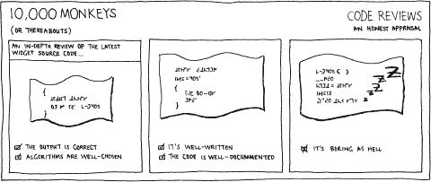
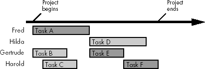

# 第五部分。过程的一部分

编写高质量的软件不仅仅是产出好的代码。显然，好的代码有帮助。有一点。但还有更多。好的软件是有意创造的；它需要规划、远见和稳健的战斗计划。我们将在下一节中确切地看到这个战斗计划的样子。然而，在我们集结部队之前，我们必须知道他们应该做什么。指向同一个方向是有帮助的。

本节探讨开发过程中的某些特定部分，我们为帮助有意创造优秀代码而安排的额外活动。我们将看到：

第十九章

如何编写和阅读软件规范。正确记录你将做什么，以及你已经做了什么的方法。本章展示了规范如何使你的生活更轻松，而不是让你感到烦恼。

第二十章

关于代码审查的讨论——这是一个重要的实践，确保你正在编写高质量的代码。

第二十一章

软件时间尺度估计——规划过程中的一个基本活动，但仍然是软件开发社区中的一种神秘的黑魔法。本章破除了一些估计的迷思，并提供了实际的建议，以便在一线使用。

软件工厂无情的压力不断驱使我们更快、更努力地工作。唯一的应对方式是学习更聪明的工作方式。我们需要采用这些实践中的每一个，以在最终决战中有一线机会。

# 第十九章。具体化

### *编写软件规范*

我从未知道任何麻烦是一小时的阅读不能缓解的。

--查尔斯·德·塞孔达

几乎所有值得使用的东西都有文档。你的 DVD 播放器有说明书。你的车有维护手册。合同有细小字。巧克力蛋糕有食谱。有书籍和杂志致力于人类所知的几乎所有追求。如果你的软件值得使用，它也应该有很好的文档。^[[1]

我们都知道我们给客户的经过仔细测试的软件需要文档。究竟需要多少文档是一个悬而未决的问题。办公套件的用户当然认为应该比出版商认为的更多。如果没有描述你的软件使用机制的说明书，无论它采取什么形式，人们都会错误地假设它能够做比它设计时要多的东西，或者用它来实现任何理智的程序员都不会想象的用途。

开发者在编码过程中同样容易犯同样的错误。就像最终软件产品需要文档一样，中间的开发步骤也需要文档。这是最终用户（通常）永远不会看到的文档。这些是程序将如何设计和构建的定义。这些是软件的*规范*。

编写和使用规范是实践程序员的重要技能。用英语（或任何其他自然语言）进行沟通与用代码进行沟通一样重要。²] 就像吃蔬菜和定期锻炼一样，规范对你的健康和软件都是有益的。然而，就像卷心菜和健身房一样，我们避免它们，感到内疚，然后后悔后果：我们最终得到的是不健康、松弛的软件开发。

传统的软件规范概念涉及一大块纸张，上面满是密集的文字、晦涩的表格和毫无意义的术语。这是一个非常令人沮丧的前景：一个需要比描述的代码更多维护努力的文档。开发者们永远生活在被迫与规范一起工作的恐惧之中。

但情况不必如此。如果正确使用，规范可以润滑开发过程。它们减少了开发风险，帮助你有效地工作，并使你的生活变得更加容易。在本章中，我们将探讨我们需要什么样的规范，它们应该包含什么内容，以及为什么现实与这个理想相差如此之大。

# 它们具体是什么？

用心去听教导，用耳朵去听知识的言语。

--箴言 23:12

规范是构成开发过程一部分的正式文件，提供内部软件文档。有许多不同类型的规范（我们很快就会看到），包含不同的信息，针对不同的受众。每一种都适合软件构建过程的特定阶段，从项目的构思到最终交付。我们使用它们来捕捉用户确切需要的内容（或者他们将要得到的内容，如果两者不同——通常是这样的），详细说明软件解决方案的架构、特定代码模块的接口、代码的设计和实现决策，等等。

规范可以帮助你更聪明地工作，并生产出更好的软件。但一个糟糕的规范可能会产生相反的效果。就像你的代码一样，软件规范的质量至关重要。好的规范和文档通常被视为理所当然，而差的规范会迅速变得令人厌恶；成为项目脖子上的一块磨石。

**关键概念**

*软件规范的存在及其质量对于软件开发过程至关重要*。

规范是团队间和团队内沟通的一种形式。我们已经看到，项目可能会因为缺乏沟通而失败。因此，我们应该利用规范作为沟通媒介——在适当的时候。（项目同样可能因为花太多时间写文档，而实际编写软件的时间不足而失败！）

随着项目规模的增加，规范变得越来越重要。这并不是因为规范在较小的项目中不重要，而是因为较大的项目有更多可以失去的东西——有更多的人缺乏沟通和协调，这将对软件开发过程的成果产生更大的负面影响。

**关键概念**

*规范是软件开发者的重要沟通机制。使用它们来捕捉必须不丢失或遗忘的信息*。

编写规范有助于使你的信息：

**更安全**

信息不是存储在人们的脑海中，那里可能会丢失、遗忘或错误地记住。将所有重要事实写下来，当人们离开项目时风险更小：信息损失将最小化，并且有一个坚实的基础来帮助任何接替的程序员快速上手。

详尽、完整的规范可以降低两个人做出不同假设的风险——这是两个分别创建的模块在首次集成时无法协同工作的经典原因。规范有助于防止微妙的错误。

**可访问**

所有信息都方便地记录在已知的位置。新加入项目的人只需阅读文档，就能了解每个组件的功能以及它们是如何协同工作的，无需在成为生产力之前在众多人的脑海中搜寻信息。

**更准确**

当所有信息都被收集和捕捉时，你更有可能发现问题，识别设计中的缺失部分，以及发现任何不幸的后果或副作用。你大脑中漂浮的几个零散的想法并不容易验证。

* * *

^([1]) 当然，这并不是制作糟糕界面的借口；它仍然必须易于使用且直观。

^([2]) 的确，迪杰斯特拉曾说过：“除了数学倾向之外，对本族语的良好掌握是合格程序员最重要的资产。”

# 规范的类型

每种类型的规范构成了软件流程中的一个中间关卡：开发过程不同部分之间的交接方法。例如，软件组件 API 的规范是由那些界定其功能和界面的团队编写的。程序员根据这个规范工作；它足够完整，可以实施所有代码。同样的规范是一份合同，详细说明了系统集成商如何将其整合到系统中，以及其他程序员如何使用它。它还描述了预期的行为，因此测试部门可以验证软件是否正确运行。

以这种方式，一个规格说明的输出自然地流入下一个内容的组成部分，在快速演变的软件中留下了一串文档。图 19-1 展示了这种文档轨迹的例子。我们看到，随着项目的成熟，生成了一系列自然的文档层次结构——每个子组件都有与整体项目相似的一组文档；其开发可以作为一个迷你项目来管理。

由于软件设计是一个迭代的过程，这不是信息单向流动（否则你将陷入瀑布方法的紧身衣——参见第 427 页的"瀑布模型")。随着你发现缺失的信息或需要调整软件设计，规格说明必须相应地进行更新。如果你的文档不可塑性和不可维护性，你的软件开发将受到影响。官僚主义的发展过程试图通过确保所有工作都按照规格说明执行来压制良好的软件开发，即使它已经 10 年之久了，并且完全过时。好的程序员认为他们的规格说明就像他们的代码一样可塑。

**图 19-1.典型的规格说明文档轨迹**

让我们来看看不同类型的软件规格说明，看看它们如何提升你的编码生活方式。不幸的是，在现实世界中，这些文档被许多人用不同的名字称呼。一个*需求规格说明*被不同的人称为*用户需求规格说明*和*功能约束规格说明*。

## 需求规格说明

如果在软件开发过程中发生崩溃，所有其他规格说明都消失了，那么这是你应该争取的文档之一。它是快乐软件开发游行中的领头羊，也是许多失败项目的绊脚石。这里的信息至关重要。它将让你保持理智。

项目的需求一开始通常是不清晰的；客户不能确切地告诉你他们的软件应该做什么（他们不是计算机专家，所以不知道）。这可能会引起各种问题，因此必须有一个单一的文档来明确指出你的软件应该做什么以及可接受实现的特性：*需求规格说明*。它详细列出（或者至少是适当的详细程度，这通常将是详细的）代码预期如何表现。它必须全面且明确地涵盖系统行为的重要、高风险、高价值领域。

需求通常被写成一系列编号的句子，每个句子包含一个单一的事实信息。例如：

> 1.3.5 用户界面应包含一个黑色矩形，其中以 13pt 的红色无衬线字体显示单词“不要慌张”。

对每个需求进行唯一编号可以在后续文档中轻松进行交叉引用，并帮助你将特定的设计或实现决策追溯到单个需求。

我们必须考虑：

**功能需求**

这些需求详细说明了程序必须执行的操作。例如：*必须处理 BMP 图像并将它们转换为 JPEG 或 GIF 格式*。

**性能需求**

这些需求显示了它必须工作的速度以及是否存在具有截止日期的操作。例如：*用户必须在每一秒内收到每个操作的反馈，并且所有操作必须在五秒内完成*。

**互操作性需求**

这些需求描述了它必须与之交互的其他软件、硬件和外部系统。例如：*必须支持与升级服务器的 HTTP 和 RS232 通信*。

**未来操作需求**

这些需求确定现在必须*提供*的功能，即使它们不是立即实现的。例如：*必须提供可定制的用户界面，以便用户可以自定义外观和感觉*。

这些需求分为两大类。*离散需求*是二元的。通过查看源代码可以轻松检查程序是否满足这些需求：将会有专门针对每个功能部分的代码块。你可以编写特定的测试来确保每个离散需求得到尊重。

*非离散需求*不太具体。仅通过检查源代码无法确定程序是否满足这些需求。这包括系统的所需容错性、服务器的所需正常运行时间、程序的平均故障间隔时间、其安全性或其可扩展性。这类需求可能非常重要，但验证起来却非常困难。

创建需求规范的过程会因公司而异，通常取决于项目特性和客户（他们的智慧和能力）。需求规范由市场营销团队、未来的产品焦点小组或*业务分析师*整理，其工作职责是理解问题领域并确定所需工作的范围。通常客户或客户的代表会参与其中。

客户必须同意并签署需求规范；它构成了软件开发者与其客户之间有效的合同。供应商同意交付一个功能符合这些要求的产品；客户同意为其付费。如果没有达成一致规范，客户可以随意拒绝产品，而开发者将白白浪费大量努力。遗憾的是，这是我多次看到的软件工厂中的常见问题，尤其是在客户不是技术专家且不知道一个好的软件解决方案是什么样子时。当请求的软件最终建成时，客户意识到它所要求的东西并不是它真正想要的：*用粉色重写它*。你回到了起点。这类事情经常发生；需求规范是你的保险政策。

很遗憾，许多软件开发工厂跳过了需求收集，或者没有给予它足够的重视。在软件设计开始之前，当然是在任何代码编写之前就达成一致意见是**至关重要的**。我们使用功能需求规范：

+   为了确保项目按计划并按时完成——通过防止（或至少减少）新功能的迟缓添加，这些新功能将推迟交付。

+   为了提高客户满意度——通过提前设定期望。

+   为了减少错误——通过限制**功能蔓延**，我们避免在最后时刻添加代码，这有助于避免令人恐惧的错误。

+   为了保持你的理智——没有需求规范，开发者会迅速失去头发。

根据你采用的开发方法类型，单一的整体需求规范可能在任何软件开发开始之前就编写好，或者它可能随着代码的编写而逐步开发。了解你的需求是如何从客户那里收集的，以及这如何影响你的代码开发方式。

**关键概念**

*软件需求必须尽早捕捉，以设定期望，防止功能蔓延，并减少开发者的焦虑*。

还要考虑你的**开发需求**：作为开发者，你必须拥有的东西，以便开发软件。例如，你可能需要一种特定的内部架构来提供足够的未来可扩展性，你需要版本控制来开发软件（这不是可选项）。其中一些可能合理地属于需求规范。

## 功能规范

可能是程序员最常使用的文档，*功能规范*描述了软件的可见行为。它源于并必须满足需求规范。一个项目中通常有几个功能规范：一个用于整体产品，然后为各个软件组件提供个别规范。

对于一个软件组件，功能规范包括对其公共接口的完整且明确的描述。这相当于列出模块 API 中的每个方法或函数，以及它们的用途和使用方法。它包含所有外部数据结构和格式的详细信息，以及所有对其他组件、工作包或规范的依赖。

这不仅仅是一份软件的用户指南。其中包含足够详细的说明，可以从它构建组件。两个团队可以阅读这份文档，并分别独立工作。尽管实现会有所不同，但两个组件的行为应该是相同的。

这个事实在实践中得到了利用：一些 NASA 的航天器使用五台计算机来完成一台计算机的工作；四台计算机独立开发并实施特定计算的任务规范。第五台计算机用于平均这四次计算的结果（或者决定是否有计算机与其他计算机有极大的差异）。

如果你正在编写没有功能规范的软件组件，首先自己编写一个。向所有相关方展示，以便他们可以同意你将构建的内容是足够的，这样在交付时他们就不会感到惊讶。

**关键概念**

*如果你的软件任务没有充分说明，不要开始编码，直到你写出一个功能规范，并且人们同意它是正确的*。

## 系统架构规范

*架构规范*描述了软件解决方案的整体形状和结构。它包括如下内容：

+   物理计算机布局。（是分布式客户端/服务器软件还是单用户桌面应用程序？）

+   软件组件化。（如何分割？我们需要编写哪些部分；哪些可以购买？）

+   并发性。（同时运行多少个线程？）

+   数据存储（包括数据库设计）。

+   系统架构的所有其他方面（冗余、通信通道等）。

在大量开发工作发生之前详细指定这些内容是很重要的。架构会影响开发的后期阶段；这里的错误或歧义将过滤到后期阶段，成为严重的缺陷。当然，没有什么是一成不变的：如果你发现架构规范中的缺陷，那么它必须得到修复，无论已经发生了多少工作。不要接受一个糟糕的架构规范作为你脖子上的磨石。然而，进行充分的架构设计是很重要的。我们在第十四章中详细讨论了软件架构。

## 用户界面规范

本文档包含有关用户界面的信息：它的外观和它将如何反应。这是我们向用户展示系统功能的方式。它可能描述了一个图形用户界面应用程序或基于 Web 的界面，一个可听电话菜单系统，一个盲文可访问性界面，或者一个简单的单 LED 显示屏。

有时用户的系统视图与光鲜亮丽的表面背后的实现非常不同。这里有两个例子：

+   一个高度网络化的系统可以部署在一个单独的盒子上，并隐藏在统一的用户界面后面。

+   可用的功能可以简化以方便使用或创建一个削减成本更低的版本。

UI 规范描述了界面约定和隐喻，并展示了用户如何看待功能交互。它由文本描述、图片和截图组成。它通常包含 UI 动作的*故事板*表示——每个 UI 状态的图片映射、其转换以及每个状态中显示的内容。它包括用户将看到的每个屏幕以及所有细节（即所有图形、字段、列表、按钮以及屏幕上的布局）。它还将详细说明每个操作的合理响应时间以及常见错误情况下的行为（这并不是详尽的——试图列举*所有*可能错误条件是一项实际上无休止的任务！）。

这项工作可能包括或导致一个*用户界面原型*。原型可以根据应用和测试审查的程度以不同详细程度和准确性制作；这取决于应用和将进行多少测试和审查。不可避免的是，在这个阶段，UI 设计是不完整的，但这是您第一次看到最终产品将是什么样子。虽然原型有助于设想界面将如何表现，但直到系统集成，UI 才能得到适当的审查和调整。

## 设计规范

*设计规范*（或*技术规范*）记录了一个组件的内部设计。它描述了功能规范将如何实现，或者已经如何实现。设计规范描述了所有内部 API、数据结构和格式。它应该详细说明所有关键算法、执行路径和线程交互。它描述了编程语言的选择以及构建代码所使用的工具。所有这些对于代码实现者和维护者来说都是关键信息。

许多重量级开发流程要求在实现之前生产设计规范；在编码开始之前进行审查，以防止工作走向死胡同。然而，在大多数软件开发工厂中，这个文档是与代码一起编写，或者是在代码编写之后。

这听起来是个好主意，但大多数设计规范都是浪费时间！它们需要持续维护以与所描述的代码保持同步。如果不加注意，它们会迅速腐烂，变得不准确和不完整——对粗心大意的读者来说可能是陷阱。因此，我建议您**不要编写设计规范**！

但等等，在您轻松出发之前，还有更多。用包含相同信息但更容易保持准确性的东西来替换它。*文献化编程工具*（参见第 66 页的"实用的自我文档方法"）是一种优秀的文档机制，可以通过从代码本身生成文档来替代重量级的设计规范。您只需要在特别格式化的代码块中提供任何额外的注释。

**关键概念**

*使用文献化编程工具编写您的技术文档。不要编写一个很快就会过时的文字处理文档*。

您不需要完整的生产代码就可以以这种方式使用文献化文档工具。您可以用同样的方式记录您打算的代码结构：模拟一些代码，然后运行工具。这会自动生成设计文档，充当原型验证概念代码，并且经过精心设计，可以演变成生产代码。

## 测试规范

*测试规范*描述了特定软件的测试策略。它展示了如何验证实现与功能规范的一致性，以便您知道软件何时可以发布。当然，这个任务的大小和范围取决于正在测试的内容：是单个软件组件、整个子系统、桌面应用程序还是嵌入式消费产品。

测试规范包含必须执行的每个测试的列表。每个测试都在一个*测试脚本*中详细说明：一系列运行测试的简单步骤，以及其验收标准和测试将运行的环境。这些脚本本身可以写在单独的文档中，也可以包含在这个文档中。

正如我们在第八章中看到的，许多代码级别的测试可以在代码本身中执行，并作为开发过程的一部分自动运行。这些测试与只能通过在最终环境中运行软件并使用脚本化人工输入才能执行的高级测试截然不同。

无论何时你可以为你的软件创建程序单元测试，都优先这样做，而不是创建冗长的测试规范。正如设计规范可以迅速过时一样，在代码级别编写的测试规范也会随着系统的发展而腐化。使用程序测试代码作为你的测试策略的文档——你可以像编写可读的正常代码一样轻松地编写可读的测试代码。自动化的测试周期也将迫使你保持测试与代码的一致性；如果你不这样做，你的测试将会失败！

**魔鬼的辩护士**

规范是昂贵的：阅读和编写它们需要时间和精力。它们需要额外的工作。所有这些文件*真的*都是必要的吗？是的，它们是——为了编写高质量的软件，你需要有意识地生成所有这些信息，然后将其记录在可以检索的地方，以便在需要时使用。规范鼓励我们遵循良好的开发实践——跟踪需求、执行设计和构建测试计划——我们已经看到它们如何促进沟通。

敏捷流程（参见第 433 页的“敏捷方法”）对编写规范的关注远低于其他方面，但它们并不提倡凭直觉编码。由于规范不会自己编写，很容易过时，并且需要额外的工作来维护，而程序员已经有很多事情要做，因此只编写必要的文件是明智的。我们应该始终避免冗长的程序障碍。*但是，你移除的任何规范都必须被等价的信息库所取代*。除非你有意用同等质量且包含相同信息的东西来替换它，否则不要跳过规范。

极限编程不会产生冗长的需求规范，但它通过一组等价的用户故事来捕捉所有需求，这些故事卡堆叠在一起。设计规范被摒弃：代码本身就是其文档。

敏捷实践也促进了测试驱动的*设计*，其中编码的测试作为代码及其行为的额外文档。这个完整且清晰的单元测试套件可以替代单个组件的测试规范，但很少适合验证最终产品是否符合其验证标准。

# 规范应包含什么内容？

每种类型规范的 内容自然非常不同。然而，任何规范中的信息必须包括：

**正确**

这可能看起来很明显，但绝对是至关重要的。一个错误的规范可能导致数天的徒劳无功。它必须保持最新，否则会变得极其误导：它会浪费读者的时间，造成混乱，并可能导致引入错误作为后果。

如果一个规范可以有多种解释方式，那么这个“规范”就不具体——它没有完成它的任务。两个读者可能会对模糊的信息有不同的解读，这不可避免地会导致不幸的后果。确保你的规范只能按照你的意图来解释。

文本必须不自相矛盾。当规范变得相当大时，确保一致性变得困难。当维护者（不同于原始作者）进行修改时，这是一个特别的问题——很容易在某个地方更改信息，而不会更改任何后续引用相同信息的部分。

规范应该仔细编写，以确保符合所有相关标准（例如，语言定义和公司编码标准）。它应该遵循你公司的文档标准/惯例，并使用任何现有的文档模板。

**可理解**

一个有效的规范应该易于阅读和理解。对每个读者来说都是有意义的。如果它过于技术化，只有工程师才能理解，那么非技术部门（如市场和管理工作）就不会觉得自己是受众的一部分，也不会仔细查看。问题只有在太晚的时候才会被发现。

像好的代码一样，最好的规范是从读者的角度而不是作者的角度编写的。信息组织得让新手也能理解，而不是让作者方便。布莱兹·帕斯卡曾道歉说：“我让这封信比平时更长，因为我缺乏时间让它更短。”好的写作是简洁的，不会在文字的墙壁后面隐藏主要观点。这确实需要更多的工作，并且会花费更多的时间，但如果结果是更容易理解，那么这是值得的。

在规范中，没有必要写一大堆无聊的散文。考虑使用一些工具来压缩它，使其更容易阅读。项目符号和编号列表、图表、标题和副标题、表格以及适度的空白可以帮助打断流程，帮助读者在脑海中构建材料的思维导图。

**完整**

规范应该是自包含和完整的。这并不意味着它应该包含所有可能的信息；引用其他相关文档是完全可接受的，只要引用准确（考虑你在引用中的文档修订）并且允许读者轻松找到该文档。

规范的详细程度应该远低于实现的详细程度；否则，它要么过于具体，要么过于密集而难以理解。人们倾向于忽略复杂的规范，因此它们变得被遗弃。在角落里腐烂，它们只会让那些没有意识到它们不再是权威的人感到困惑。

**可验证**

软件组件接口的规范将导致两个东西的产生：软件实现和用于验证它的测试工具。因此，规范的内容必须是可验证的。在实践中，这主要等同于正确、明确和完整。

**可修改性**

没有什么是一成不变的，无论是代码还是文档。如果规范需要更新（可能是为了纠正事实错误），那么这应该是容易的。一个铁定的规范可以防止世界在你脚下改变。然而，如果规范是错误的，那就毫无用处。文档必须是可编辑的（即，你应该能够访问源文件，而不仅仅是 PDF 副本），并且其发布和更新程序不应过于繁琐。

为了便于修改，文档必须精心结构化，并且不要超过绝对必要的范围。

**自我描述**

每个规范至少必须包含：

+   一个*封面*，清楚地显示文档标题、副标题、作者、修订号、最后修改日期和文档发布状态（例如，公司机密、在 NDA 下外部提供，或公开发布）。

+   文档的*简介*，提供对其目标、范围和目标受众的简要概述。

+   读者为了理解内容所需的所有相关*术语和定义*。（但不要对读者居高临下：如果你的受众是软件工程师，不要解释 RAM 代表什么。）

+   一组*参考*其他相关或交叉引用的文档。

+   一个列出所有重要修改和修订信息的*历史*部分。

**可追溯性**

应该有一个文档控制程序（类似于源管理系统）和一个中央文件存储库，其中所有文档都驻留。每个规范的发布版本都应该存档在存储库中，并且必须保持可访问，这样你就可以发现一年前你正在工作的规范版本；总有一天你会再次需要它。考虑使用版本控制系统——这是一个为任何类型的文件进行版本管理的优秀工具。

文档封面包含控制信息（版本号、日期、作者等），以便你可以检查你是否拥有最新的副本。

**关键概念**

*在编写规范时，思考其内容。选择一个受众能够理解的结构和词汇，并确保文档是正确、完整且自我描述的*。

# 规范编写过程

没有付出努力写下的文字，通常也是没有乐趣去阅读的。

--塞缪尔·约翰逊

现在我们知道了必须生成的规范类型以及它们应该包含的内容，我们已经准备好了。是时候写点东西了！规范编写过程很简单：

1.  选择合适的文档模板开始。这可能作为定义的项目开发过程的一部分提供。如果没有模板，可以基于现有的规范。

1.  编写文档。好吧，这是难点。你写的内容自然取决于规范类型。

1.  安排对文档进行审查。包括所有对该文档感兴趣的人。

1.  一旦达成一致（如果你的流程要求，正式签署），将带有版本号的副本放入文档存储库，并发布给适当的受众。

1.  如果有任何后续问题，提出规范变更请求，并确保你理解修改如何影响你的开发工作范围。如果不这样做，编码工作将翻倍，而没有人会注意到。

这是一个简单的列表程序，但做起来并不简单。很容易只关注第 2 步——我们跳过其余部分以简化生活。但没有这些其他行动，你没有创建一个正式可识别的文档；这可能会在以后造成问题。

在创作你的文学杰作时，请考虑以下规范编写指南。前几条与作者身份和你的艺术感相关：

+   写作通常在每份文档只有一个作者时效果最好。协调多个作者和适应不同的写作风格很难。如果你正在记录一个大型系统，那么将规范分成几个部分，并分别给每个人一份去单独工作。创建一个将这些部分联系在一起的伞状文档。

    与一些观点相反，在规范的前面只署一个人的名字根本不是自大的。有人需要为它承担责任——当工作做得好时得到表扬，当工作做得不好时受到责备。

    如果你显著扩展了别人的文档，不要因为自己被添加到作者名单而感到尴尬。但除非他的原始输入已被删除，否则不要从作者名单中删除任何人。

    **语言障碍**

    我讨厌定义。

    ——本杰明·迪斯雷利

    非常仔细地编写你的规范文本。与代码相比，英语语言充满了歧义和复杂性。以下这些*真正的*报纸标题仅展示了看似简单的英语陈述可以有多大的歧义：“被盗的画作被树发现”，“孩子们制作营养小吃”，“红 tape 拦住了新桥”，“医院被*7*英尺高的医生起诉。”

    规范是正式文档，它们不得闲聊或冗长；这往往会在一堵文字墙后隐藏重要的事实。非英语母语读者可能会感到困难。然而，简短的文档很难跟随。这是一个微妙的平衡，文档审查有助于确定正确的写作风格。

    正式文档以第三人称、现在时态编写。准确选择词语非常重要。在互联网 RFC 文档#2119 中定义了一个有用的惯例。这为协议规范（在需求规范中也非常有用）定义了以下关键术语：

    **必须**

    词语“必须”（或“应当”或“必须”）意味着以下定义是规范的绝对要求。

    **不得**

    词语*不得*（*或应不*）表示规范中绝对禁止。

    **应该**

    使用*应该*（或形容词*推荐*）来表示一个可选的要求——可能被忽略的行为，但只有在充分理解其全部影响并经过仔细考虑的情况下。

    **不应该**

    使用*不应该*（或形容词*不推荐*）来描述应避免的特定行为，除非有合理的理由选择它——再次，必须完全理解后果。

    **可能**

    使用*可能*（或形容词*可选*）意味着一个项目确实是可选的。实现者可以选择支持它或忽略它，但当应用于协议时，它必须与做出不同选择的另一个实现进行互操作。

    这是在人们写“可以”时应该经常使用的词。*可以*是规范和标准中常用词的错误用法；它是模糊的，并且根据读者的解释，可能会被理解为*必须*或*可能*。

+   作者必须是正确的人。市场营销部门不会编写你的功能规范；它提供需求。经理不会设计代码；具有正确技能和知识的开发者来做。作者必须能够写作——这是一种需要学习的技能，是一种需要锻炼的肌肉。

+   每个文档都必须有一个定义的*所有者*，该所有者对其负责。所有者可能不同于原始作者；现在主要作者已经离开，它可能是技术权威或文档的维护者。

这里有一些关于文档编写过程的提示：

+   有每种规范的最佳实践示例是好的。这将帮助作者了解他们在写作时应该期望什么。

+   规范的早期草稿应标记为草稿，并在免责声明中指出其不完整。这将防止人们错误地将其视为完整——他们现在还不能对你关于内容的内容抱怨（）。在文档内部维护一个不完整部分和开放问题的列表。

+   文档审查很重要：它检查内容是否正确且表述良好。这是一个获取他人对你决定的同意并因此赋予文档权威的机制。这对于发送到项目外的规范尤为重要：发送给客户或其他部门。

+   一旦你完成了规范，不要忘记它。保持其活力并更新。当设计阶段结束时，功能规范并不完整。需求不可避免地会变化，我们继续更多地了解系统的操作。在修订规范中捕捉所有这些。

# 我们为什么不写规范？

我不明白我在做什么。对于我想做的事情，我没有做，但我讨厌的事情我却做了。

--罗马书 7:15

在现实世界中，良好的规范往往因为缺失而引人注目。我们知道避免它们不是好的做法，所以匆忙的开发者会忽略它们的缺失，假装没有问题。在没有适当的需求或功能规范的情况下接受编码任务并不罕见。（这是一个必须通过持续抱怨、教育和滥用权力来克服的程序问题。）

但粗心大意的程序员回避自己文档编写的情况也同样常见。为什么会出现这种情况呢？我们反复遇到一些借口。开发者不编写规范的原因是：

+   他们不知道他们应该

+   他们忘记了

+   他们没有时间

+   他们有意识地决定不这样做，认为没有它们也能应付过去（“毕竟，谁会阅读规范呢？”）

这些理由都是站不住脚的。经验丰富的开发者如果规范是他或她工作的预期成果，那么他或她不应该犯前两个错误。

程序员喜欢编程，而不是撰写冗长的文档。大多数程序员没有良好的写作技巧；他们能写出优雅的代码，但英语却糟糕。他们试图避免编写规范并不足为奇：这是一项艰苦的工作，没有趣味，或者他们只是不喜欢做这件事。通常，这被视为一种浪费时间且并非真正必要的行为。或者他们认为，“谁会阅读规范呢？”

这种令人沮丧的想法——“没有人会阅读我那美丽的规范”——让许多程序员对将他们的思维火花转化为文字的想法望而却步。这可能也是真的：可能没有其他灵魂会阅读你的文学杰作。但那又如何呢？编写规范的行为迫使你动脑：这是一个非常重要的步骤。当然，一些大师可以边编码边产生优秀的工作。但大多数程序员，无论他们是否承认，都无法这样做。我们需要设计。首先，仔细地设计。然后，应该将这种设计捕捉下来：在文档中。可能，这份文档将仅供你一人阅读。但，如果有一天你听到更高的召唤，跑去做克罗地亚的僧侣，维护程序员如何能接手你的工作？规范将超越你。把它看作是你的遗产。

没有时间是你无法控制的唯一场景：有时编码任务摆在你面前，你真的没有足够的时间为它编写良好的规范。如果你没有时间编写规范，那么你可能也没有时间正确地编写代码。确保你清楚何时在正确地做事，何时在匆忙地编写代码而没有真正的纪律——那种代码根本不适合在生产版本中发布。

通过避免规范来节省时间几乎肯定是一种错误的经济行为；规范有助于*节省时间*进行沟通。当你编写规范时，你只需要描述程序的工作方式一次。如果你跳过这一步，至少同样数量的沟通仍然会发生，但基于临时性——在更长的时间内以更不控制的方式。这种沟通效率远低于前者，实际上会花费*更长*的时间，因为你将不得不反复解释相同的事情，每次对不同的受众都有所不同。

**关键概念**

*避免编写规范是危险且不专业的。如果没有足够的时间编写规范，可能也没有足够的时间编写代码*。

当然，很少有人会为他们的个人项目详细编写文档。这是一个适当地详细文档的极端例子。任何合理规模的项目（可能由源文件、模块、开发者或客户数量决定）确实需要规范支持。

# 简要概述

词语当然是人类使用的最强大的药物。

--鲁德亚德·吉卜林

它们不是软件开发者生活中最迷人的部分，但规范是我们代码编写常规的重要组成部分。学会有效地阅读和编写它们——以记录正确信息在正确位置的方式，这样可以节省时间和麻烦。但不要成为官僚主义的奴隶。

| 精通编程的人…… | 不擅长编程的人…… |
| --- | --- |

|

+   理解规范的重要性，并使用它们来简化他们的开发生活

+   了解所需的*适当*文档水平

+   想要提高他们的写作技巧并寻求反馈和练习的机会

|

+   在没有考虑设计、文档或审查的情况下，一头扎进代码任务中

+   他们不会考虑他们正在写的文本；他们产生的文档结构不清晰，难以理解

+   避免编写文档，认为它无聊且无意义

|

# 参见

第四章

*自文档代码*是一种有效的技术，有助于消除一些代码文档。好的代码易于使用且直观，不需要冗长的手册。

第十八章

考虑变更控制和备份策略，因为它们与你的代码一样重要，需要保护。

第二十章

就像你的代码一样，你写的任何文档都应该经过审查，以确保其正确性和高质量。

第二十二章

规范是软件开发过程中的一个基本部分，通常是开发阶段之间的关卡。

# 开始思考

这些问题的详细讨论可以在第 544 页的“附录 A”部分找到。

## 仔细思考

1.  一个糟糕的规范是否比没有规范要好？

1.  一个好的规范需要有多详细？

1.  在公司/项目中的所有文档都拥有统一的呈现风格是否很重要？

1.  你应该如何存储文档？例如，你应该提供它们的索引（按类型或按项目）吗？

1.  你应该如何进行规范审查？

1.  自文档化的代码会使得所有规范都变得无用吗？具体是哪些？

1.  如何让多个作者协作编写文档？

## 个人化

1.  谁决定你文档的内容？

1.  考虑你当前的项目。你是否有：

    1.  需求规范？

    1.  架构规范？

    1.  设计规范？

    1.  功能规范？

    1.  还有其他规范吗？

        它们是最新版本的吗？它们是完整的吗？你知道如何获取最新版本吗？你能访问历史修订版吗？

1.  你对文档进行版本控制吗？如果是，你是如何做的？

# 第二十章. 杀死审查

### *执行代码审查*

审查有一个比自杀更好的优势：在自杀中，你伤害了自己；在审查中，你伤害了其他人。

——乔治·萧伯纳

你是如何学习成为一名优秀的木匠的？你成为了一名木匠的学徒。你观察大师的工作，每天帮助他，逐渐承担更多责任，并从他的建议中学习。你不会毫无实际能力地盲目跳入，并期望立即完成高质量的木工作品。

在编码世界中，我们没有这样的版本，尽管编程既是一门手艺，也是一门工程学科（可能更多）。一个好的程序员通过亲身体验，发现哪些在现实生活中有效，哪些无效。这是书籍无法教给你的东西，而且只有少数幸运的人能从导师那里学到这些。*代码审查*几乎是我们大多数人能接近的理想。

代码审查（也称为*检查*或*走查*）类似于开源软件开发模式——为其他人提供一个结构化的机会来审视你宝贵的代码，以及让你检查他人的工作。它们促进了知识交流。但它们的主要目标是提高软件质量。它们帮助你在大灾难发生之前发现错误。

代码审查还有另一个微妙的优势：它们鼓励你对自己的作品承担更大的责任。当你知道代码不仅仅是为了让你自己查看，而是会被其他人查看、使用、维护和批评时，你的态度往往会改变。你不太可能做出那种快速且草率的修复，因为你永远没有时间去修订。代码审查带来的责任感提高了你的编码质量。它们有助于建立第 336 页上描述的“集体代码所有权”文化。

听起来不错，不是吗？让我们揭开盖子看看它们是如何工作的……

# 什么是代码审查？

审查将源代码置于显微镜下——真正旨在批评和验证它。这并不是为了嘲笑或针对作者，而是为了提高团队生产的软件质量。这个过程通常会产生一个必须修复的问题列表（列表的大小反映了你的编程技能质量！）。有时你会注意到现在不值得做的改进；将这些发现归入未来的经验。

我们寻找错误以及任何可以改进的代码。代码审查在几个层面上排除问题：

+   整体设计（我们检查算法和外部接口的选择）。

+   那种设计在代码中的表达（将其分解为类和函数）。

+   每个语义块中的代码（我们检查每个类、函数和循环是否正确，是否遵循适当的语言习惯，以及是否是实际的选择）。

+   每个代码语句（每个都必须遵循项目编码标准和最佳实践）。

代码审查可以是：

**个人**

作者仔细而系统地审查自己的工作，以确保其质量。不要将这与其他随意阅读自己代码的行为混淆；个人代码审查是一个更详细和复杂的工作。

**一对一**

你带着另一位程序员走一遍你的代码。当你在引导过程中，这位程序员检查逻辑并寻找错误。这些审查往往是非正式的，由作者驱动。因此，代码是从作者的角度来处理的：基于他们的假设，而不是从更客观的外部视角。

**正式**

涉及其他程序员会带来新的专业知识、更多经验和更多关注，从而改变审查的视角。因此，大规模的审查更难协调，需要更大的总体努力，但更有可能找出问题。在个人审查中深入挖掘是困难的；通常作者与代码过于接近，很容易忽略缺陷。

这通常发生在正式会议上，但也可以作为虚拟审查进行：在线上，没有物理会议。

在开发过程中的不同时间可以使用不同类型的审查。一对一的审查可能在整个代码开发过程中每天使用，作为修改提交到主源树之前的集成审查。正式审查通常在代码开发的后期进行，作为最终的软件质量审计。

除了正确的代码带来的明显好处外，审查还有其他有用的副作用。通过查看彼此的代码而产生的交叉授粉确保了整个项目中的编码风格更加统一。审查还传播了关于核心代码内部工作原理的知识，因此当人们离开项目时，信息丢失的风险更小（这是一个非常现实的问题——参见第 343 页的"团队关闭"）。

**关键概念**

*代码审查是检测和消除难以发现的错误、提高代码质量、强制集体代码责任以及传播知识的优秀工具*。

# 何时进行审查？

如果你没有受到批评，你可能没有做多少。

--唐纳德·H·拉姆斯菲尔德

在一个理想的世界里，每一块代码在发布之前都应该被仔细审查。根据卡内基梅隆大学软件工程研究所的数据，彻底的代码审查应该至少占用 50%或更多的编码时间（个人代码审查包含在这个统计数据中）。（Humphrey 98）这将比大多数现实世界项目愿意投入的时间更长。（^[1])

**关键概念**

*当我们编写系统时，我们需要问*是否*要审查代码，如果是的话，*具体*要审查哪部分代码*。

**审查替代方案**

有许多开发技术被争论为使正式代码审查变得多余。这些包括：

**结对编程**

当你在第 319 页描述的"IT'S ALL GOING PAIR SHAPED"中进行结对编程时，你的代码实际上是在实时被审查的。双倍的眼睛比一双更好，并且会发现许多许多更多的错误——因为它们被输入。然而，通过采用与实现工作在物理和情感上分离的审查者，代码审查可以捕捉到更多的问题。

**开源**

开放和自由地发布源代码允许任何人查看它，判断代码的质量，并修复问题。有些人称之为终极代码审查。然而，这实际上并不能保证任何人*会*检查源代码。只有真正受欢迎的开源项目才有积极维护的代码库。使你的代码开源不会立即带来类似代码审查的好处。

**单元测试**

这些方法是一种自动方式，表明修改没有降低你代码输出的*正确性*（参见第 144 页的"Look! No Hands!"），但它们并不能帮助提高代码语句的整体质量。你的代码可能是一团糟的意大利面，但如果它通过了单元测试，没有人会注意到。如果单元测试不够严格，错误仍然可能通过，无论怎样。

**不进行代码审查**

或者，你可以只是相信程序员能够正确地完成工作——毕竟这是他的工作。如果这是一个有效的策略，那么你甚至不需要测试代码。祝你好运！

这些方法本身都不能真正取代代码审查。也许将它们与特别有效的开发团队文化结合起来可以减少审查的必要性，但我还没有遇到过这样的情况。

## 是否进行代码审查

我们已经看到，错误是不可避免的，你可以确信你的代码中包含一些经典的错误。会有一些明显的缺陷你很快就能发现，还有许多更微妙的问题，只有一双没有先入为主的眼睛才能在审视代码时发现。原作者很难看到自己作品中的固有缺陷——因为他离代码太近，遭受着心理上的*认知失调*（参见 Weinberg 71）。如果你的代码有任何重要性（提示：它确实有，否则你不会写它），并且你关心其质量（提示：你确实关心，否则你就是一个耻辱），那么你*必须*进行代码审查。

不进行代码审查会大大增加错误滑入生产软件的机会。这可能会给你带来尴尬，大量的昂贵的返工和现场升级，在极端情况下，甚至可能导致你公司的财务崩溃。代码审查的努力与后果相比微不足道。根据 Humphrey 的说法，“学生在设计和编写代码时，每小时通常会注入 1 到 3 个缺陷，而在代码审查时每小时发现 6 到 12 个缺陷。”（Humphrey 97）

人们经常找借口来为避免审查辩护。他们说，“代码太大，无法全面审查，”或者“它太复杂；没有人能理解它——甚至尝试审查都没有意义。”如果一个项目能够调动足够的人时来编写一个大型程序，那么它也能找到足够的时间来审查它。如果代码太复杂，那么它迫切需要审查！实际上，它可能需要一些更彻底的措施。写得好的代码被分解成可以单独审查的自包含部分。

## 审查哪些代码

任何项目都会迅速产生大量的源代码。对于除了最严格的开发流程之外的所有情况，根本没有足够的时间来审查每一行代码。那么，你如何决定审查哪些部分呢？这并不容易。

你必须选择将最能从审查中受益的代码。这是最有可能出现错误或对系统正确运行至关重要的代码。你可以尝试以下策略：

+   选择核心组件中的核心代码片段。

+   运行分析器以查看 CPU 时间花费最多的地方，并审查这些代码部分。

+   运行复杂性分析工具，并审查最严重的违规代码。

+   针对已经显示出高错误数量的区域。

+   选择你不太信任的程序员编写的代码（代码审查的复仇！）。

最实际的方法可能是上述所有方法的混合。根据你对团队、代码库和当前系统特征（性能、错误数量等）的清醒评估，选择最佳的代码候选者。

**关键概念**

*仔细选择你将要审查的代码。如果你不能审查所有内容，就*明智地*选择审查候选者。不要猜测——你可能会浪费宝贵的时间*。

* * *

^([1]) 他们很少准备好在代码审查上投入任何时间，这是一个更严重的问题。

# 进行代码审查

我们坚持不懈做的事情会变得更容易，不是任务本身变得更容易，而是我们执行它的能力提高了。

--拉尔夫·瓦尔多·爱默生

仅仅*进行*代码审查是不够的。它本身并不能解决所有问题。你还需要确保你*正确地*进行审查。接下来的几节将描述如何做到这一点。

## 代码审查会议

最常见的审查设置（至少在高仪式的开发过程中）是正式的*代码审查会议*。有一个固定的议程（以确保不会忘记任何行动）和明确的结束（不一定是时间限制，而是确切地定义你要审查哪些代码，哪些不要审查——对此可能很容易产生混淆）。

下面描述了一个示例代码审查会议程序。

### 在哪里？

举行代码审查会议的最佳地点是在一个安静的房间里。审查者不应被打扰。应该有咖啡（以及那些必须喝的人的茶）。

一套联网的笔记本电脑和代码编辑器可能很有用，连接到投影仪的计算机也可能有用。老式的程序员发誓使用打印稿和笔纸笔记——脱离电脑屏幕可以帮助找到新的错误。这完全取决于你对树木和电力消耗的尊重程度。

### 何时？

显然，在双方都方便的时间。常识告诉我们，周五下午 5 点不是一个好时间。你需要投入大量时间，所以请确保你不会被打扰或分心。

如果代码太大，将审查分成几个单独的会议。你不能让人们连续几个小时坐在封闭的空间里，并期望他们的审查质量保持高水平。

### 角色和职责

代码审查会议成功的重要因素之一是参会人员。每位参会者应分配一个特定的角色；在小组中，人们可能会承担多个角色。这些角色包括：

**作者**

显然，编写代码的人应该参加审查，描述他们所做的工作，反驳不公平或不正确的批评，并听取（随后采取行动）有效的、建设性的反馈。

**审查员**

应仔细挑选审查员，选择有可用时间和技能进行审查的人。如果代码在其专业领域内或以某种方式参与其中，这会有所帮助。例如，库的编写者应被邀请审查使用该库的程序，以诊断错误的 API 使用。

应有适当数量的经验丰富的软件工程师在场。可能需要 QA 或测试部门的代表（见第 132 页的"QUALITY ASSURANCE"），以确保软件的质量和开发过程的质量。

**主席**

任何会议都需要一个主席，否则将会陷入混乱（见第 340 页的"MEETING YOUR FATE"）。这个人领导审查并指导讨论。他或她确保对话保持主题，会议不会偏离方向。任何不需要在会议中讨论的次要问题应由主席迅速线下处理。如果给程序员一半的机会，他们可能会讨论一个微小的技术细节数小时，而牺牲其他代码审查。

**秘书**

秘书负责记录会议纪要。这意味着记录所有出现的要点，以确保在审查后不会遗漏任何内容。如果有审查清单（见第 398 页的示例），秘书需要填写它。秘书的角色不应由担任主席的同一个人来履行。

在到达之前，每个人都应熟悉代码。每个人都必须阅读支持性文档（任何相关的规范等）^([2])，并且必须了解任何项目编码标准。组织会议的人应在会议通知中强调这些文档，以防止误解。

### 会议议程

组织代码审查会议：

+   作者表示他们的代码已准备好接受审查。

+   主席安排会议（预订合适的地点、设定时间，并召集正确的审查员团队）。

+   安排所有必需的资源（电脑、投影仪、打印件等）。

+   会议必须提前足够的时间召开，以便审查员做好准备。

+   在会议通知后，作者不能随意更改代码——这对审查员来说是不公平的。

代码审查会议的流程如下：

+   主席安排在会议前准备房间，以便审查能准时开始。

+   作者花几分钟（不超过！）时间解释代码的目的以及其结构的一些内容。这应该是先验知识，但令人惊讶的是，在这个最初阶段可能会捕捉到许多误解。

+   结构设计评论被邀请。这些评论与实现的结构有关——而不是代码语句级别。这可能包括将功能分解为类、将代码拆分为文件以及函数编写的风格。（是否足够防御性，是否有良好的测试？）

+   欢迎一般性代码评论。这些评论可能涉及一致的错误编码风格、设计模式的错误应用或错误的语言习惯。

+   代码被仔细地逐行或逐块审查，以寻找缺陷。要留意的事项将在稍后描述（在“代码完美”第 395 页）。

+   考虑了代码使用的多个示例场景，并调查了控制流。如果存在完整的单元测试套件（应该有），那么这些测试详细说明了要探索的所有场景。这有助于审查员覆盖所有执行路径。

+   秘书记录所有需要更改的内容（记录文件名和行号）。

+   记录可能渗透到更广泛代码库的任何问题，以便进一步调查。

+   当审查完成后，应商定一个后续步骤。可能的场景包括：

    **好的**

    代码没有问题，不需要进一步的工作。

    **重做并验证**

    代码需要一些重做，但不需要另一次代码审查会议。主席提名某人担任*验证者*。重做完成后，验证者将检查它与代码审查会议记录的对比。

    应为任何重做设定一个合理的截止日期，以便人们能够记住行动的细节和原因。

    **重做并重新审查**

    代码需要大量重做，并且认为有必要进行另一次代码审查。

记住，这里的目的是识别问题，而不是在会议期间修复它们。一些问题需要相当多的思考才能修复，这是审查结束后作者（或修改者）的工作。

在进行审查时，您可能会发现使用本章末尾的代码审查清单很有用。

## 集成审查

代码审查会议是一种高规格的审查方法。虽然工作量大，但无疑能发现许多否则可能被忽视的问题。

存在着其他不那么强烈的审查程序，它们提供了代码审查会议的大部分好处，但以更容易接受的方式呈现。可能最有效的是*集成审查*，它在新代码集成到主线代码分支时进行。

这可能发生在：

+   一段新代码*即将*被检查到源代码控制中

+   一段新的代码刚刚被检查到源代码控制中

+   一个代码包从功能开发分支合并到主发布分支

在这一点上，相关的代码被标记为需要审查，并选择了一位合适的审稿人：要么是负责该模块的人（代码集成者或维护者^([3]))，要么是一个*影子*（或*代码伙伴*），被分配在一对一的审查会议中验证作者的工作。

这些门控代码检查通常使用与源代码控制系统集成的软件工具实现。手动安排它们相当困难，通常被作为检查纪律：你不应该在代码经过同行评审之前进行检查。这种方法很难执行；在匆忙的最后时刻检查中，错误可能会被忽略。

实际的审查步骤通常比前面描述的会议要正式得多。审稿人扫描代码以检查它没有明显错误，测试它（可能审查可用的单元测试以确保它们有效），然后授权将其包含在主线中。只有在那时，代码集成者才会将经过验证的代码迁移到发布树中。对于更严肃的项目或在更敏感的时间（例如，在重大发布里程碑之前）这个审查步骤可能会变得更加严格——需要更多的眼睛和更多的努力。

由于审稿人和作者实际上不需要面对面地见面（尽管这样做是首选），这可以被认为是一种虚拟审稿过程。

* * *

^([2]) 自然，所有支持性文档在之前都已经被彻底审查过了。

^([3]) 将其与开源项目的维护者进行比较，维护者收集其他黑客提交的补丁，并将它们集成到主源代码树中，定期发布软件更新。

# 审视你的态度

以你希望别人对你做的事情去做。

--路加福音 6:31

代码审查需要建设性的态度——你需要以正确的思维方式进行审查，否则将不会成功。这双向起作用：对作者和审稿人来说都是如此。

## 作者的态度

许多人因为害怕代码审查会暴露他们的不足而回避它。不要这样做。让代码被审查是学习新技术的良好方式。你必须谦虚到承认自己并不完美，并愿意接受他人的批评。随着你从对工作的修改中学习，你的编码风格将会改进。

**疯狂中的方法**

代码审查是一种普遍认可的技术，自从人们将程序打孔到卡片堆中以来就已经存在了。我们已经详细探讨了两种审查程序，但还有许多细微的变体。编程团队选择一种审查机制来适应他们的成员和工作性质。（差的团队甚至不做代码审查。）

这里还有两种其他常见的审查方法：

**Fagan 审查**

这是一个备受推崇的正式审查流程，正如本章所述，由 Michael Fagan 在其《无缺陷流程》中定义。（Fagan 76）Fagan 强调了审查能力的重要性，并展示了如何提高审查技能。Fagan 审查识别了工作产品和创建该过程的问题。

**影子审查**

这是在结对编程和代码审查之间的一个中间地带。每个代码模块都有一个**主开发者**负责代码。还分配了一个**影子开发者**；定期地，影子开发者会与主开发者一起审查模块。随着设计的巩固，影子开发者会验证所做的决策。随着代码的完善，影子开发者会审查进度并提供建设性的建议。

在更正式的场合，影子审查员被赋予批准代码发布的权限。没有任何模块可以在影子开发者同意它准备纳入发布构建之前被集成。

**关键概念**

**没有人的代码是免于审查和同行审查的。积极邀请对你的代码进行审查**。

作为作者，不要对你的代码进行防御。有一种自然的倾向是将所有的批评都视为针对个人的，并认为这是对你能力的攻击。为了应对代码审查，你需要减少自我和个人的骄傲。理解没有人的代码是完美的：即使是最好的程序员的代码在代码审查中也会因为一些繁琐的小问题而受到批评。

这是指由 Gerald M. Weinberg 在 1971 年的著作《计算机编程心理学》中描述的**无我编程**：这是一个永恒的描述，它揭示了使审查工作有效的关键态度。（Weinberg 71）那些不害怕自己代码中的错误或他人发现这些错误的程序员将能够生成更好、更安全、更正确的软件。愿意让他人帮助找出你工作中的错误是高级程序员的一个基本属性。

当你处于热点位置时，尽量不要浪费他人的时间。在你将代码提交审查之前，先自己进行一次模拟审查。想象你正在向其他人展示你的工作。你会惊讶于你将过滤出多少小缺陷，这将帮助你更有信心地进行真正的审查。不要匆忙提交半成品代码，并期望他人帮你审查缺陷。

## 审查者的态度

在审查代码和提出批评时，你必须敏感。评论必须始终是建设性的，而不是为了归咎。不要对作者进行人身攻击。外交和策略很重要。将你的评论针对代码，而不是程序员；更愿意说“代码这样做……”……而不是“你总是这样做……”……。

代码审查是一个**同行过程**：每个审查者都被视为平等。资历并不重要，所有观点都被考虑。有趣的是，即使是经验最少的程序员在代码审查中也会有一些值得提及的内容。正如作者可以从审查中学习一样，审查者也可以。

随着时间的推移，你将进行许多、许多次审查（特别是如果你进行集成审查）。小心你的审查过程不要变成一项枯燥的任务；很快它就会变成一个无效的浪费时间的行为。保持对代码审查的积极态度。作为审查员，在每次审查中都要尽力提出有用的意见。有时这很容易；有时很难说出有趣的话。但通过强迫自己做出评论，你不会陷入简单的审查套路，成为一个对过程毫无贡献的应声虫。

**关键概念**

*代码审查的成功在很大程度上取决于作者和审查员采取积极的态度。审查的目的是共同改进代码，而不是分摊责任或证明实现决策的合理性*。

# 代码完美

当完美到来时，不完美就会消失。

--哥林多前书 13:10

我们还没有考虑哪种类型的代码会通过审查，哪种代码会失败。描述良好代码的外观超出了本章的范围——本书的前 15 章描述了高质量代码的重要方面。当我们寻找不良代码设计和寻找软件错误时，有一些反复出现的主旨。审查的代码必须：

**无错误**

错误是我们的大敌，是良好软件开发的天敌。我们必须对我们的工作质量有信心，并需要在开发过程中尽早找出错误。我们越早尝试找出问题，就越有可能找到并修复，从而减少成本和麻烦（参见第 157 页的“失败的经济学”）。

**正确**

代码必须满足所有相关标准和其要求。确保所有变量都是正确的类型（例如，没有数值溢出的可能性）。注释必须完全准确。代码必须满足任何内存大小或性能要求（特别是对于嵌入式平台尤为重要）。检查库的使用是否适当，以及所有函数参数是否正确。

代码经过验证，符合其要求和功能规范。其规范的内容被认为是正确的；如果不是这样，那么这项任务将是艰巨的！有时代码审查的评论可能会反馈到规范中（例如，需要澄清的地方），但这不是我们的目标——在代码审查中不要偏离讨论规范是否错误的话题；秘书应在会议记录中记录问题，审查应继续进行。

**完整**

代码必须实现整个功能规范。它必须经过满意地集成和调试，并通过所有测试套件。测试套件必须全面。

**结构良好**

检查实现的设计是否合理，代码是否易于理解，以及是否存在重复或冗余代码。寻找任何明显的“剪切和粘贴”编程，例如。

**可预测**

必须没有不必要的复杂性，也没有意外的惊喜。代码不应该自我修改，不得依赖于魔法默认值，并且不得包含可能导致无限循环或递归的微妙机会。

**健壮**

代码具有防御性。尽可能保护可检测的运行时错误（除以零、数值越界错误等）。所有输入都应该进行检查（包括函数参数和程序输入）。代码处理所有错误条件，并且是异常安全的。所有适当的信号都被捕获。

**数据检查**

在 C 风格数组访问时执行边界检查。避免其他类似隐秘的数据访问错误。多线程代码正确使用互斥锁以防止竞争条件和死锁。检查所有系统/库调用的返回值。

**可维护**

程序员在注释的使用上很明智。代码处于正确的版本控制之下。存在适当的配置信息。代码格式符合内部标准。编译时安静无声，没有虚假的警告。

**关键概念**

*如果你不知道好代码是什么样的，那么你就无法对别人的工作做出有效的判断*。

# 代码审查之外

审查过程对于生产任何高质量的项目至关重要，因此它不仅仅对源代码开发有用。类似的审查过程用于规范文档、需求列表等。

# 简而言之

批评比正确更简单。

--本杰明·迪斯雷利

代码审查是软件开发过程中的一个重要部分，有助于我们保持代码的高质量。正如学徒从传授的知识中学习一门手艺一样，代码审查传播知识并教授编码能力。作为一种更侧重于同行之间的活动，它们为作者和审查者提供了学习的机会。

编写代码以便进行审查。记住，这不仅仅是为了你自己阅读；其他人也必须能够维护它。作者对其工作的质量始终负责。一个好的程序员更关心编写优秀的代码，而不是自己的骄傲。

| 优秀的程序员 . . . | 次等的程序员 . . . |
| --- | --- |

|

+   想要代码审查并且对自己的代码质量有信心

+   接受他人的意见并从中学习

+   能够敏感且准确地评论他人的代码

|

+   害怕代码审查，害怕他人的意见

+   对批评反应不佳；他们具有防御性且容易受到冒犯

+   使用审查来展示他们相对于能力较弱的程序员的优势；他们的评论过于严厉且缺乏建设性

|

# 看这里

**第一章至第十五章**

本书的前几章描述了良好代码的重要方面。

第九章

对你代码中可能存在的错误类型的描述。

第十九章

代码将与它的*规范*进行审阅。规范还要求进行仔细的审阅。

# 清单

许多审阅过程涉及一个*清单*——在审阅过程中检查良好（可接受）代码特性的集合。如果你的代码不符合这些标准，那么它就没有通过审阅。这些清单在细节、长度和主题上有所不同。

以下代码审阅清单是一个示例。你可以用它来帮助你指导审阅工作。与一些清单不同，它并没有系统地列出每种可能语言中每个可能的问题；它只是帮助指导审阅过程并确定何时继续到下一个审阅步骤。

# 开动脑筋

这些问题的详细讨论可以在第 547 页的"附录 A"部分找到。

## 沉思

1.  需要的审阅者数量是否取决于被审阅的代码大小？

1.  哪些工具对代码审阅有帮助？

1.  你应该在运行源代码检查工具之前还是之后进行代码审阅？

1.  代码审阅会议需要哪些准备工作？

1.  你如何区分需要立即采取行动的审阅评论和那些可以在下一个项目中积累经验的评论？

1.  如何进行虚拟审阅会议？

1.  非正式代码审阅有多有用？

## 个人化

1.  你的项目进行代码审阅吗？它进行*足够的*代码审阅吗？

1.  你是否与任何被认为代码无需审阅的程序员合作？

1.  你的代码中有多少百分比曾经接受过代码审阅？

# 第二十一章。一根绳子有多长？

### *软件时间尺度估计的黑魔法*

我从不猜测。这是一个令人震惊的习惯——对逻辑能力具有破坏性。

--夏洛克·福尔摩斯（亚瑟·柯南·道尔爵士）

一根绳子有多长？或者，就我们的目的而言，一根绳子需要多长时间？这是一个简单的问题，但它并没有多少意义。

本章讨论的是*软件时间尺度估计*，这是专业程序员的重要技能。它是开发中的神秘黑魔法之一，更多地基于直觉而非科学，结果往往不准确。它很复杂，但软件开发过程中的一个基本部分，是每个程序员都必须学会做的事情。

软件工厂的规则必然受经济学的支配：资金的流动。时间估计很重要，因为软件开发的大部分成本是人力——程序员并不便宜。开发环境和硬件成本微不足道。为了制作一个软件产品，我们必须知道涉及的工作量，需要多少人去构建它，以及何时完成并准备好盈利。这告诉我们建设成本是多少。市场营销部门将预测销售收益。这两个预测将进行一场戏剧性的生死之战；财务分析师制定预算来评估项目是否具有财务可行性。

这是一件奇怪的事情，叫做“规划”，大多数程序员都不擅长。别担心：这就是为什么我们有经理。但如果你真的想玩得很好，你必须了解游戏规则。编写商业上成功的软件需要大量的预见性和规划。哦，还有钢铁般的神经。

为了构建一个开发计划，我们进行软件系统的高级设计，将其分解为组件，并估计每个组件编写所需的时间。很少有足够的时间来认真规划和设计每一个，所以这是一个非常粗略的科学。选择一个软件开发模型（参见第 425 页的“开发过程”），我们将估计汇总到一个计划中，分配给多个程序员，并使用这个计划来计算经济性。这个计划的质量显然基于时间估计的质量。灾难性的错误猜测可能导致财务灾难，所以这是一件重要的事情！

没有计划，你是在靠运气创造产品，而不是有目的地。估计是项目规划过程的一个组成部分——但这并不意味着它是项目规划者完成的！能够提供时间尺度信息的人是必须完成工作的程序员。那就是你！这是软件工厂生活中的商业现实的一部分。

# 黑暗中的一次刺杀

在任何公司，任何项目，任何时间点，软件时间尺度估计不过是基于教育的猜测——否则它们就不是估计了。猜测听起来并不太专业，对吧？但这是你能做的最好的：直到任务完成，你永远不会确切知道它需要多长时间，那时通常为时已晚，信息已经没有用了。^([1)]

估计的质量主要取决于你对被估计任务的了解程度。也就是说，你*真正*了解的程度，而不是你认为你了解的程度。这也取决于你有多少时间来创建估计，因此你可以在现实设计努力或可行性审查中投入多少努力。有了非常精确的规范，你可以在短时间内做出估计；有了模糊的规范，可能需要很长时间。一个合理、有根据的估计可能需要几个原型来调查实施选择——不同的选项可能会有截然不同的时间后果和固有的风险水平。

如果没有足够的时间来做这件事，你需要制定一个最坏情况的数字，开发工作不应超过这个数字。你投入的时间尺度估计的努力越少，你对这个数字的信心就越少，现实与估计之间的差异就越大。开发可能需要估计的一半时间，整个期限，甚至更糟——可能需要更多的时间。我们通过在开发计划中构建*应急计划*来管理这种风险，以平衡风险区域。你提供多少应急计划？你必须猜测！我们稍后会讨论这个问题。

**关键概念**

*软件时间尺度估计需要*有根据的猜测。*每个估计都应该伴随着你对它的信心度量*。

虽然好的估计是有理有据的，但糟糕的估计不过是黑暗中的一击。这是一个标准的工程问题，需要敏锐和灵活的管理。这已经是一个持续了数百年的工程问题。2 经理和规划者处理整个项目的估计。这*特别*困难。我们只看看估计单个编程工作。幸运的是，这并不特别困难，只是*真的*困难。

* * *

^([1]) 当然，除了作为基于未来估计的经验之外。

^([2]) 对于一个圣经上的例子，请参阅路加福音第十四章第二十八部分！

# 为什么估计如此困难？

我住在英国剑桥；我的家人住在布里斯托尔。软件时间尺度估计就像估计我拜访他们需要多长时间一样。如果有一个强风和没有交通，我可以告诉你开车需要多长时间。但是如果有道路施工或交通堵塞，如果我的车坏了，我出发晚了，或者我在高峰时段旅行，那么这个估计就变得不太可靠了。预见一些这些问题，我会承诺一个可能的到达时间窗口。我知道最佳行程时间；我对最坏情况有一个想法（我有过一些噩梦般的旅行）。我可以在两者之间判断一个预期的到达时间。然而，我永远无法完全考虑到不可预见的情况——如果我的车坏了，我就被困住了。在这种情况下，手机很有帮助：如果我会迟到，我可以打电话告诉我的家人把饭加热（最好是不要放在狗的碗里）。

软件开发过程遵循类似的模式。在规划软件时，需要考虑到可预见的潜在问题，管理第三方依赖，以及应对不可预见情况的需要。你可以为工作的一部分给出最佳情况下的开发时间，并需要考虑最坏情况的时间。当然，错误估计的影响不仅仅是家庭宠物的晚餐——它关系到项目的成功或失败，甚至可能影响你公司的偿付能力。

**最薄弱的环节**

不可预见的问题可能会在意想不到的地方让你陷入困境。最近，我的链接器无法处理我生成的可执行映像的大小，我需要离开去修复链接器，才能运行我的代码。开发时间超过了最初估计的三倍。

这开始让我们看到为什么估计开发任务的长度是如此困难且至关重要。有许多因素在共同作用，使得这项任务变得棘手：

+   有许多变量需要考虑。它们伴随着问题的固有复杂性、你的代码设计的影响以及必须适应的现有软件生态系统。其中一些变量可能每天都会发生变化。

+   需求会在你脚下发生变化，导致软件范围扩大。随着项目可行性的调查，新的问题和用户级需求以惊人的速度被挖掘出来。这使得估计工作变得复杂——你必须努力跟上这一切（参见第 371 页的"需求规范"，了解如何管理这些策略）。

+   如果不知道所有涉及的工作，你无法给出准确的估计。也许你需要重构现有库，因为它们提供的功能不足，或者重构以实现现有代码的安全扩展。如果你还没有发现这一点，那么你的估计将会太低。

+   很少有项目是从一张白纸开始的。在估计工作需要多长时间之前，你必须了解现有系统。在提交估计之前，你很少有时间正确地完成这项工作。

+   如果这项任务是一项以前从未尝试过的事情，那么确定它需要多长时间会更困难。你没有先前的经验可以据此进行估计。

+   许多项目依赖于第三方，而这些依赖关系可能会变得非常糟糕。依赖关系的来源可能是操作系统供应商、一个小但重要的代码库、外部规范，甚至是客户。你无法控制第三方交付；你的估计依赖于它按时交付。这增加了延迟的风险，必须仔细监控。

估计是困难的。但这并不能免除我们的责任。我们必须考虑到真正可预见的事情：就像道路施工或恶劣天气一样，我们可以合理地预期一些这些陷阱。你需要找到悲观、乐观以及——在中间某个地方——现实之间的正确平衡。

**关键概念**

*创建时间表估算是一项真正的困难任务。不要低估所涉及的工作量。欣赏做出糟糕估算的后果*。

故事还没有结束：不仅仅是做出估算很难。承受后果可能同样痛苦。

+   估算变成了合同，用于与客户设定交付时间表。一旦确定，这些日期就很难变动，一旦出错代价高昂。

+   按照别人的估算工作很难——如果你错过了截止日期，是不是因为你没有完成任务，或者估算错误？

+   在开发过程中经常会发现新的任务，需要对其进行核算并安排到时间表中，这会将其他所有事情都推后。同样，你只有在开发工作真正开始后才会发现规格问题。这些规格变更将影响所需的工作量，因此也会影响时间估算。

+   总是会有意料之外的问题。你可以通过稍微努力一些来保持进度，从而吸收小问题的冲击。这个月你不需要睡觉，对吧？但是大问题会带来大量的额外工作，并导致进度混乱。

+   估算只是又一项责任：你不仅要对创建的代码负责，确保它是优秀的、设计良好的、可维护的代码，还要按照你承诺的时间表交付它。可怜的程序员们啊！

# 压力之下

软件工厂不是一个合理的地方，给出乐观估算的诱惑很强。对于估算游戏新手来说，他们尤其容易受到压力。上面有压力要求承诺短时间表，以便我们可以赢得合同、宣布新版本、维持内部政治稳定等等。这是一个可以理解的、令人悲伤的现实；没有公司是孤立存在的，股东们希望得到鱼子酱和香槟。

但压力并不完全来自上面。它也来自程序员个人的骄傲。技术人员喜欢承诺乐观的时间表；我们是一群自豪于我们交付的内容和速度的人。认为“哦，这不应该花太多时间”是很诱人的。但是，快速代码修改或原型工作与完整、生产就绪的工作之间有很大的区别。我们的时间表必须基于现实，而不是基于希望的理想。

**关键概念**

*每个人都（包括你）都希望更短的开发时间表。不要自欺欺人，认为在给定的时间内技术上可能实现什么。当你必须交付生产代码时，不要承诺快速修改的时间表*。

我们必须意识到这种压力，并谨慎地做出反应。小心极端相反反应的危险。很容易成为一个悲观的末日预言家，想象任务会无限期地持续下去，并用愚蠢的大时间尺度估算来补偿。高估的真正危险是项目不可避免地会扩展以适应可用的时间！当有几天空闲时，你总会找到一些代码可以润色。

在一个理想的世界里，项目截止日期是在可行性审查之后确定的，该审查证明项目在合理的时间内是可行的。现实世界很少是这样的。相反，你会被给予一个截止日期（“圣诞节前发货”），然后你必须想出如何实现。如果工作不合适，你必须协商如何到达那里：删除功能、增加程序员、外包风险部分，或者可能提供带有更多功能的后续升级。有时这种规划更像是一项营销活动，而且相当有创意！

没有人说过这应该很容易。

**一个战争故事**

公司刚刚接到了其五年历史中最大、最重要的订单。这个订单是成败的关键。销售部门为了关闭这笔交易而奋力争取，同意了一个严格的客户截止日期：软件*必须*在年底前发货。合同签署后，每个人都互相拍手称赞。

但没有人有时间（或智慧）与技术人员协商以确保项目可行。它并不可行。经理们开始恐慌，但由于截止日期固定且功能集不变，他们能做的事情并不多。工程师们抱怨并挥舞着他们的项目计划，但被告知“只需让它适应。”他们日复一日地努力工作，深夜仍在工作，很快就筋疲力尽。每周他们都发现自己离那绝望乐观的进度越来越远。

在最后的巨大努力中，他们按期完成了代码，但随后被一个未预见的硬件问题绊倒，导致项目延期两个月。计划中没有任何应对这种灾难的应急措施。

项目失败了，工程师们疲惫不堪，神经紧张，客户也不满意。在下一个项目开始不久，大部分开发团队就辞职了。

# 估算的实际方法

随着对预言家和程序员的双重压力日益增加，我们如何满足期望？估算，就像许多其他技能一样，是你通过经验变得更好的东西。这不是老年人的游戏，但如果你不与进度和目标为背景工作，那么你在技能上就不会有所增长。熟能生巧。

在现实世界中，我们很少有机会进行实践项目或沙盒来实验时间估算。在从初级程序员到大师的道路上，你必须掌握这项技能！遗憾的是，没有神奇的公式或简单的食谱可以用来得出估算。但遵循这些简单的步骤将极大地提高你的准确性：

1.  将任务分解成可能的最小块，有效地进行系统设计的第一遍。

1.  当你达到适当的分辨率并且部分内容易于理解时，为每个块提供一个以人时或人日为单位的时间估算。

1.  一旦你估算出所有个别的时间范围，将它们并排放置，加总它们的持续时间， voilà：立即得到时间估算。

这种策略有效，因为你可以更容易地完全理解并准确估计一系列较小的活动，而不是一个庞大的任务。估算不应使用大于人日的大单位：这样的大型任务表明你还没有真正理解问题；你的估算根本不可靠。无情地将大型任务分解，直到你得到细粒度——可估算的——工作单元。

**关键概念**

*时间估算应针对小任务，这些任务的单独范围易于理解。测量应以人时或人日为单位*。

当然，开发工作通常可以在人们之间并行化；通过将其分解成小的、易于理解的部分，我们可以调整任务，并找出如何并行运行它们，从而提前完成日期。这成为一个项目规划问题。

设定合理的时间来做出估算。所需的高级设计不是立即的；不要假设时间可以轻易猜测。如果你没有基于先前经验或系统设计的依据，仅凭直觉做出估算，你只会欺骗自己。

考虑到将交付软件所需的所有活动至关重要。这意味着包括以下时间：

+   进行充分的深思熟虑的设计

+   所需的任何探索性工作或原型设计

+   实际的代码实现工作

+   调试

+   编写单元测试

+   集成测试

+   编写文档

+   你将在该期间进行的任何研究或培训

这个列表显示，与其他外围活动相比，编写代码所花费的时间比你预期的要少。编程不仅仅是编写代码；不要忘记在你的时间估算中包括测试和文档。它们是必不可少的。没有测试和文档，你将交付无法正常工作且无法修复的代码，因为没有人知道如何使用它。

不要试图计算*经过时间*（通过结合其他项目的干扰、阅读电子邮件、浏览网页、喝咖啡和回应生理需求）。这不可避免地会与实际花费在任务上的时间有很大不同。任务可能与另一个任务同时进行，或者被中断以腾出空间给另一个项目。我们在项目计划中处理这个问题（在 409 页的"The Planning Game"中描述）。

你的估算应该有多保守？你应该偏向乐观还是悲观？正确的答案是：估算必须是现实的。预测可能的问题并将它们考虑在内，但不要设想简单任务可能失败的 1,000 种方式，并以此作为给出膨胀估算的借口。不要为了掩盖自己的行踪或给自己更多打牌的时间而高估。我们的个人任务估算不能减轻所有可能出错的事情。风险应该在*项目层面*上管理；调度员将我们的估算纳入一个合理的计划中，并考虑适当的应急措施。

为了做出更准确的估算，考虑以下重要问题：

+   项目越具体、越明确，估算就越容易。你得到的是一个好的规范吗？

    没有规范，就没有可追溯性，每个软件包中涉及的大量工作都将被假设。两个人可能对项目范围有不同的假设，并在项目截止日期时期望不同的事情。严格的规范可以避免这个问题。

    即使按时交付错误的系统，其损害程度也可能与按时交付正确的系统一样严重。如果没有规范，就编写一个并得到任务利益相关者的批准。^[[3]] 至少，记录下你对工作所做的所有假设。

+   请求的功能越多，估算就越困难。尽量削减所有不必要的任务。一个优秀的方法是将软件的交付分阶段进行，为每个可交付的迭代提供估算。

    将估算信息反馈给上游。项目决策者可以据此平衡每个需求的重要性与其技术难度。查看哪些小型功能请求将加倍开发时间是有帮助的。

+   如果你没有完全理解整个问题，那么你将做出一个非常糟糕的估算。花时间了解软件必须做什么。如果你需要更多时间来做出估算，那么请要求，或者表明你对时间值的信心。永远不要猜测一个估算并希望它是正确的——如果你不能证明一个估算，那么不要给出它。

+   如果任务依赖于第三方输入，那么估计会更困难。谁负责追逐第三方以完成交付？你可能需要将这一点纳入你的开发估计中。获取第三方的估计交付日期，然后添加时间以将工作集成到你的代码库中（它永远不会“简单地插入”）。考虑你对第三方的信任程度，并包括适当的安全缓冲，以应对可能出现的问题。

+   不同的人将以不同的速度完成同一项任务。这是自然的；每个人都有不同的技能组合、经验水平、自信程度和相对的干扰数量（例如，争夺注意力的旧项目或家庭责任）。你需要评估你的工作效率，并对你即将着手进行的任务有一个良好的理解。估计是个人化的。

    **关键概念**

    *理解你是在为你要做的工作（在一个你非常了解的系统上）还是为别人要做的工作（可能需要先学习）创建估计*。

+   不要接受来自上面的压力，要保持乐观。不要承诺不切实际的时间表，认为如果你加班就能弥补。对那些说“它必须更快完成”的经理有一个适当的回应。

+   也许最重要的是，*永远不要事先计划加班*。

改善你的估计的一个简单方法就是寻求帮助。如果你不理解一个问题，那么找到理解它的人，并征求他们的意见。詹姆斯·苏罗维基的书籍《群体的智慧》描述了大型群体如何比少数精英更聪明。采取这种极端方法，让你们团队的所有开发者对计划上的所有任务给出粗略估计，然后取他们个人估计的平均值。这个估计可能不会偏离太远！

**关键概念**

*不要孤立地做出估计。征求其他人的意见以帮助改进你的估计*。

* * *

^([3]) 当然，这将占用你没有计划的时间！

# 规划游戏

几个孤立的时间尺度估计对任何人都没有用处。你必须将它们连接起来，并将它们转换成有用的东西：一个你可以用来管理开发进度的项目计划。根据他们各自的时间尺度估计，任务被安排在时间轴上，并分配给开发者。识别任务之间的依赖关系，并将其纳入计划中（显然，依赖的任务不能在它们的依赖完成之前开始）。最终结果是沿着水平轴运行的时间图，任务同时定位在其上，看起来就像图 21-1（经典*甘特图*的一个变体）。

**图 21-1. 一个甘特图**

项目规划是关于将任务分配给开发者和制定如何安排开发工作。但这只是游戏的一半。重要的是 *风险管理*——在不确定性和隐藏陷阱面前制定一个安全和合理的计划。

最安全的计划：

**减少** *`关键路径`*

这是单行任务，从项目的开始到结束追踪，在上述图中以较暗的块表示。任何这些任务的任何失误都将迫使所有依赖它的任务推迟，并推后最终截止日期。

根据定义，计划中始终存在一条关键路径。这正是让项目规划者头发变白的原因！我们的目标是提供最优的任务排列，以提供最短（或风险最小的）关键路径。

**不是大规模并行**

当尝试压缩大型项目时，标准的规划误解是投入更多的开发者可以加快进度。这很少有效。管理更多的人会带来额外的负担——有更多的沟通线路，更多的人需要协调，以及更多的故障点。这是 Brooks 的开创性论文“神话般的月份”（Brooks 95）的主题。

你不能过度并行化项目计划，也不应该并行化个别开发者。如果你让一个开发者同时面对两个任务，你不能期望他们以与这两个任务串行相同的时间完成。这听起来很明显，但在实践中经常发生：你可能会被要求支持一个旧项目，并同时开始另一个项目的开发工作。在任务之间切换会占用大量时间，这会降低你的整体效率。如果你将两个任务连续完成，那么你会更快完成（但可能无法满足你组织的业务需求）。

**不要太长**

过长的项目计划过于雄心勃勃。关键路径上的任何一点出现的小问题都可能危及整个项目。

这就是迭代和增量开发（参见第 432 页的“迭代和增量开发”）带来的好处，通过将大型开发计划分解成更小、风险更低的迭代，这些迭代可以更容易地管理。这使得计划更加动态；它实际上在每个交付点都会被重新创建。尽管这种方法本质上更安全，并且会在开发过程中较早地突出显示问题，但它因此涉及更多的工作。许多管理者不喜欢这种方法——他们喜欢那种无法偏离的前置瀑布计划的错觉。

好的计划不仅仅是将时间表估计并排在一起。它们考虑了软件工厂的现实情况，并建立了重要的风险降低结构。这包括：

**休假**

每个开发者分配的假期数量是提前知道的，并且必须纳入日程安排。我们还必须包括公共假日和圣诞节期间的任何公司关闭。平均而言，开发者每周休假半天。

**负荷**

要现实，计划必须考虑到正常的干扰（会议、培训、疾病等）。通常，每个开发者的计划负荷为 80%，以适应这些干扰。需求更高的人会被分配得更薄。你必须对此诚实，否则“受欢迎”的开发人员尽管努力工作，也会违背进度，并很快感到沮丧。

**应急**

这是重中之重。你必须考虑到即将出现的潜在问题，并为可能阻碍你与发布日期之间的不可预见灾难留出空间。这就是风险管理真正发挥作用的地方。

风险最好在项目层面管理，而不是在个人时间估计范围内。在开发计划中，我们可以通过在整个开发过程中进行明智的判断来容纳潜在的问题。另一种选择，即在计划上放置一系列悲观的估计，必然会导致结果大相径庭。

百万美元的问题：你应该增加多少应急时间？你不能简单地将计划乘以三，然后称之为应急时间！一个好的策略是为每个任务分配一个信心值。基于这个值，为最危险的任务在计划中提供额外的伪任务，作为“危险时间”。根据你的信心值，将其设置为原始任务长度的分数之一。

**集成**

一个组件完成编码和单元测试并不意味着任务已经完成。要预留足够的时间将所有组件粘合在一起，并测试整个系统是否按预期工作。这将需要调试，并且只有在组件相遇时才会出现的问题（例如性能问题或接口不匹配）。

**支持**

人们在一个组织中的时间越长，他们就越有可能被要求支持旧项目、回答现场的错误报告等。确保这一点被纳入他们的负荷中，并且他们随后要遵守计划，突出显示当其他项目要求他们更多时间时。

当关键人员被拉向各个方向时，项目会微妙地滑落。

**清理**

在计划结束时提供整理时间。在发布软件的战斗中，为了赶上截止日期，会牺牲一些角落。这被称为积累*技术债务*。尽管我们宣扬良好的设计和编码实践，但这并不一定是邪恶的；它相当实用。然而，你必须留出时间来整理和维护一个良好、干净的代码库。否则，下一个开发迭代将在一个破损、杂乱的代码库上构建。如果这个问题得不到解决，这不断增加的短期修补将变成程序员们的负担。

将这项练习视为*之前*工作的一部分（尽管发生在发布截止日期之后），而不是下一项工作的开始。偿还因项目而产生的债务。

永远不要将这些整理工作视为可选的额外任务；它们是项目的重要组成部分。在软件工厂的繁忙世界中，放在日程表末尾的可选任务根本不会发生。小心保护这些任务。

**关键概念**

*创建将使您的代码库保持干净的开发时间表。计划偿还您的技术债务*。

对项目规划的深入调查超出了本书的范围；这是一个庞大而复杂的任务。但是，理解基本原理是非常重要的。你必须能够根据计划开发软件，并且必须理解计划背后的理由，才能真正理解你所要做的任务。

存在许多规划模型：这些是做出有根据的猜测的正式方法。*程序评估和审查技术（PERT）* 是一种经典的规划方法，由美国海军在 20 世纪 50 年代开发。它就像我开车去布里斯托尔时的到达时间计算。对于每个任务，你估计三个时间，对应于满足交付日期的不同可能性：最佳情况、最坏情况和可能情况。这涉及到一个确定关键路径并计算最佳和最坏情况项目完成时间的调度程序。每个任务估计之间的差距越大，与该任务相关的风险就越大。可能需要更仔细的管理，或者分配给更有经验的团队成员。

Boehm 的*构造性成本模型（COCOMO）*始于 1981 年，是基于对真实软件项目分析的一种估算模型。它已演变为*COCOMO II*，更准确地反映了现代软件项目的本质。（Boehm 81）*受控环境中的项目*（以其相当牵强的缩写*PRINCE*而闻名）是项目管理形式中体现的经典英国官僚主义；如果它能强制排队，它就会！^([4]) 它的范围是整个项目生命周期，从开始到结束。PRINCE 规划过程包括七个步骤，涵盖设计计划、估算和调度，到计划完成。它也经历了演变，变成了一种富有想象力的方法，称为*PRINCE2*。

* * *

^([4]) 排队是英国人喜爱的消遣方式，就像喝茶和打板球一样。

# 保持进度！

一个项目是如何推迟一年的？……一天又一天。

--弗雷德里克·P·布鲁克斯小

当工作进度滞后，项目截止日期临近时，工程师们非常努力地工作，却很少得到认可。在疯狂地赶工以按时推出可接受的产品时，严格的测试想法被挤掉了。不良的估计是这种软件杂技秀的主要原因。它们助长了管理者对开发工作难度的错误假设，因为他们根本不知道最初的进度计划是错误的。因此，当我们做出估计时，确保其准确性是至关重要的.^([5])

**一切关乎规划**

开发团队变得相当庞大，我们的工作空间变得非常拥挤。经过一番努力，找到了一个新的办公室，周五团队被告知我们将在周一在新地点工作。周末，所有的电脑、服务器、电缆、路由器、打印机——所有东西——都会被搬运到货车上，运送到新地点。我们被告知这将无缝进行，并且周一早上一切都会准备就绪。

周一早上，我们到达新办公室，果然一切都已经设置好，并且运行得完美！所有的 IT 基础设施都已经安装。服务器已经上线并完全运行。每个人的工作空间都已经设置好。这是一项真正的艰巨努力。

但有一个小问题：没有椅子。一个也没有。它们在搬迁计划中不知怎么被遗忘了，丢失了，而且在哪里都找不到！我们三天没有椅子可用。

那才是真正的规划。

对于软件任务的现实估计，有一些关键的方法可以保持进度并防止这种最后一刻的挤压：

+   在开始一项新任务时，检查分配的时间表是否真的*可行*——尤其是如果你没有自己做出估计的奢侈。即使你做出了估计，也要先验证它。不要一头扎进代码编辑器，*希望*能按时完成；确保你真的能够交付。提前进行一点理智的检查可以让你避免后来的痛苦和尴尬。

+   参考进度表——这很重要。持续关注你与计划时间的差距。写下你的时间表，并随身携带。为任何在主要软件计划中未考虑的中间任务添加个人估计，并将自己作为一个迷你项目来运行。如果你达到了内部里程碑，你就有更大的机会与外部可见的时间表保持一致。反复审查你的清单——至少每天一次。

    如果你发现你无法按时完成，尽可能早地让这个事实为人所知，以便调整计划。就像我旅行到布里斯托尔时提前打电话一样，最好是尽快公开这个事实。如果预见到了超出的可能性，那么可以做出不同的调度决策，以最小化超出的影响。

    实际上这种情况发生的频率太低了。如果一个重要的项目有五个程序员必须都报告他们的进度，那么没有人愿意成为第一个承认落后于进度的人。这被称为“进度鸡游戏”。结果是似乎一切都很顺利，但突然项目严重延误。它是一天天地晚下去的，但没有人愿意承认。打破这个循环，尽早发出警告。

    **关键概念**

    *持续监控你的进度与计划的对比。这样你就永远不会惊讶于你的任务已经落后了*。

+   做必要的工作，不要多做。添加那个可爱的额外功能可能很有趣。但不要这么做。有更重要——计划中的——事情要做。如果现在并不真的需要，请要求将重要的额外任务安排在以后。在我前往布里斯托尔的路上，选择一条不恰当的路线将会真正推迟我的到达时间——即使这是一段美丽的风景之旅——所以我选择合理的直线路线按时到达。

+   谨慎的设计利用模块化往往可以减少组件依赖，从而减少进度延误和任务在时间表上集中带来的不良影响。尽早就组件接口达成一致，并提供占位组件，以便在构建系统的其他部分时继续开发。

+   编写良好的代码，并附有一套彻底的单元测试。作为熟练的工匠，这一点应该是显而易见的！这有助于极大地减少调试和维护时间。

    不要忘记在编码完成后留出时间来彻底地进行文档编写和测试。不要在计划最后几天进行最后的编码冲刺。你需要时间来证明你的代码是可行的。否则，你会在调试中超出截止日期。如果你没有时间完成所有这些工作，请说明并请求延长时间表。不要跳过这些事情——它们会在以后咬你。

+   注意变化的需求和规范，并跟踪这些变化将如何影响你的时间表。如果是一个不利的变化，立即报告。不要默默吸收功能变化。

+   对干扰要严格。除非计划中有安排，否则不要处理其他任务。学会对旧项目、其他部门的额外工作以及电话和电子邮件的干扰说“不”。

    防止这些外部干扰，即使是看似无害的短暂干扰；它们实际上会降低你工作的质量。进入“状态”需要时间，这是那种你的心思专注于任务，代码从指尖自由流淌的地方（心理学家称之为“心流”）。即使是短暂的干扰也会打断这种有效性，当你回到工作状态时，你必须花费更多时间重新进入状态。中断的影响可能超过其持续时间的三倍。（DeMarco 99）

    培养一种有利于完成工作的开发文化。尊重彼此的思考和工作空间：一个人的思考和工作的时机。确保每次会议都是必要的——不要把开发者拉进随意的、浪费时间的小聚会。

+   保持积极和乐观的态度。相信项目注定失败是确保它在现实中发生的好方法。

* * *

^([5]) 5 具有讽刺意味的是，良好的估计也可能导致这个问题。DeMarco 和 Lister 讲述了一个真实的事件，其中项目负责人报告他们对项目按时按预算完成的 100%信心。（DeMarco 99）管理人员对这意外的好消息感到惊讶，因此决定提前截止日期！无论工程师多么优秀，你都可以构建一个更好的经理来破坏他的或她的辛勤工作！

# 简而言之

幸运是懒惰的人对工人成功的估计。

--匿名

时间尺度估计和规划有助于我们开发商业上成功的软件。然而，没有严格的方法可以准确确定软件时间尺度值。这就是为什么它是*估计*。

努力提高你的估计技巧，并警惕可能破坏你整洁开发计划的问题。学习如何按计划工作，并识别你的计划何时不切实际。

| 精通编程者 . . . | 不擅长编程者 . . . |
| --- | --- |

|

+   通过考虑开发过程的各个方面，基于合理的组件分解来创建良好的时间尺度估计

+   努力编写经过测试且具有完整文档的代码，并在适当的时间尺度内正确集成

+   早期突出时间尺度问题，以便可以处理

|

+   仅基于直觉和直觉产生有希望的估计

+   可以在他们的时间尺度估计内编写一些代码，但不会产生生产质量、无错误的代码

+   认为承认时间尺度问题是软弱的表现，并疯狂地努力追赶，当他们失败时，看起来既愚蠢又疲惫

|

# 参考内容

第十三章

良好的时间尺度估计只能基于良好的初始代码设计。

第十九章

制定估计需要明确的工作范围，这必须在*规范*中明确捕捉。

第二十二章

开发方法确定任务如何组合并放置在项目计划中。

# 开动脑筋

关于这些问题的详细讨论可以在第 550 页的"附录 A"部分找到。

## 沉思

1.  你如何拯救一个滑落的项目并将其重新纳入正轨？

1.  在可行性或规划工作开始之前，被强加截止日期的正确反应是什么？

1.  如何确保开发计划真正有用？

1.  为什么不同的程序员工作效率不同？你如何在计划中反映这一点？

## 个人感悟

1.  你参与的项目中有多少是按计划完成的？

    1.  对于那些成功的人来说：是什么因素促成了规划工作的成功？

    1.  对于那些失败的人来说：主要问题是什么？

1.  你的时间估计有多准确？你通常偏离目标有多远？
