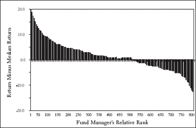

**第十章**

**《醉酒的漫步》**

**1814 年，在牛顿物理学的巨大成功达到顶峰之际，皮埃尔-西蒙·拉普拉斯写道：**

如果一个智能体在某一时刻知道所有自然界的力量以及每个构成物体的位置；如果这个智能体足够强大，能够将这些数据进行分析，那么它就能在同一个公式中包含宇宙中最大天体的运动和最小原子的运动：对于这个智能体来说，没有什么是不确定的，未来，就像过去一样，会呈现在它的眼前。¹

拉普拉斯表达了一种被称为决定论的观点：即现在的世界状态精确地决定了未来的展开方式。

在日常生活中，决定论意味着一个我们的个人品质和任何给定情况或环境的属性直接且明确地导致精确后果的世界。这是一个有序的世界，在这个世界里，一切都可以预见、计算、预测。但为了使拉普拉斯的梦想成为现实，必须满足几个条件。首先，自然定律必须规定一个确定的未来，我们必须知道这些定律。其次，我们必须能够获取完全描述感兴趣系统的数据，不允许有未预见的因素。最后，我们必须拥有足够的智慧或计算能力，能够根据当前的数据决定定律认为未来将保持什么。在这本书中，我们考察了许多有助于我们理解随机现象的概念。在这个过程中，我们获得了对各种具体生活情况的洞察。然而，仍然存在一个更大的图景，即随机性在多大程度上影响了我们生活中的位置，以及我们能够多好地预测我们将走向何方的问题。

在从文艺复兴晚期到维多利亚时代研究人类事务的过程中，许多学者分享了拉普拉斯对决定论的信仰。他们感觉像高尔顿一样，认为我们的人生道路严格由我们的个人品质决定，或者像凯特莱特一样，他们相信社会的未来是可以预测的。他们常常受到牛顿物理学的成功启发，并相信人类的行为可以像自然界中的其他现象一样可靠地预测。对他们来说，日常世界的未来事件应该像行星轨道一样，严格由当前的状态决定。

在 20 世纪 60 年代，一位名叫爱德华·洛伦兹的气象学家试图利用他那个时代的最新技术——一台原始的计算机——在有限的天气领域内实施拉普拉斯的计划。也就是说，如果洛伦兹向他的嘈杂机器提供有关他理想化地球在某个特定时间的气象条件的数据，那么它将利用已知的气象学定律来计算并打印出代表未来时间天气条件的数字行。

有一天，洛伦茨决定要将一个特定的模拟扩展到更远的未来。他不想重复整个计算过程，于是决定从计算中途开始，采取捷径。为了实现这一点，他使用了早期模拟中打印出来的初始条件数据。他预期计算机将重新生成之前模拟的剩余部分，并将其进一步推进。但出乎意料的是，他注意到一些奇怪的现象：天气的发展轨迹与之前不同。新的模拟并没有复制之前模拟的结尾，而是大幅度偏离了。他很快意识到原因：在计算机的内存中，数据存储到小数点后六位，但在打印输出中，它们只被引用到小数点后三位。因此，他提供的数据有细微的偏差。例如，像 0.293416 这样的数字在打印输出中可能简单地显示为 0.293。

科学家通常假设，如果一个系统的初始条件略有改变，那么该系统的演变也会略有改变。毕竟，收集天气数据的卫星只能测量到小数点后两三位参数，因此它们甚至无法追踪像 0.293416 和 0.293 之间的如此微小的差异。但洛伦茨发现，这样的小差异会导致结果发生巨大变化。²这一现象被称为蝴蝶效应，基于这样的暗示，即如此微小的气候变化，以至于可能是由一只蝴蝶拍打翅膀引起的，可以对随后的全球天气模式产生重大影响。这种观点可能听起来很荒谬——相当于你某天早上多喝的那一杯咖啡可能导致你生活中发生深刻的变化。但实际上，这种情况确实会发生——例如，如果你多花的时间导致你在火车站偶遇未来的妻子，或者错过被一辆闯红灯的汽车撞到。事实上，洛伦茨的故事本身就是一个蝴蝶效应的例子，因为如果不是他做出了使用捷径扩展计算的决定，他就不会发现蝴蝶效应，这一发现激发了一个全新的数学领域的诞生。当我们仔细回顾我们生活中的重大事件时，能够识别出这样的看似微不足道的随机事件，这些事件导致了巨大的变化，这种情况并不少见。

人类事务中的决定论由于几个原因而未能满足拉普拉斯所提到的预测性要求。首先，据我们所知，社会并不是像物理学那样由确定和基本定律所统治。相反，人们的行为不仅不可预测，正如卡尼曼和特弗斯反复展示的那样，而且往往是非理性的（即我们采取的行动与我们的最佳利益相悖）。其次，即使我们能够发现人类事务的规律，就像凯特莱特试图做的那样，也不可能精确地了解或控制生活的环境。也就是说，就像洛伦茨一样，我们无法获得进行预测所需的精确数据。第三，人类事务如此复杂，以至于我们即使理解了规律并拥有了数据，也怀疑我们能否进行必要的计算。因此，决定论对于人类经验来说是一个糟糕的模型。或者，正如诺贝尔奖获得者马克斯·玻恩写道，“机会比因果关系是一个更基本的概念。”³

在对随机过程进行科学研究时，醉酒汉的漫步是一个原型。在我们的生活中，它也提供了一个恰当的模型，因为就像花粉颗粒在布朗流体中漂浮一样，我们不断地被随机事件推向这个方向或那个方向。结果，尽管在社会数据中可以找到统计规律性，但特定个人的未来是无法预测的，而且对于我们的特定成就、工作、朋友、财务状况，我们都比许多人意识到的更多依赖于机会。在接下来的几页中，我还将进一步论证，在所有除了最简单的现实生活努力之外，不可预见或不可预测的力量是无法避免的，而且这些随机力量以及我们对它们的反应构成了我们生活中独特路径的很大一部分。我将通过探讨那个想法的一个明显矛盾来开始我的论证：如果未来真的是混沌和不可预测的，那么为什么在事件发生后，它往往似乎我们应该能够预见它们？

在 1941 年秋季，日本袭击珍珠港前的几个月，东京的一个特工向檀香山的一个间谍发送了一个令人担忧的请求。⁴ 请求被截获并送到了海军情报办公室。它经过官僚机构的层层传递，于 10 月 9 日以解码和翻译的形式抵达华盛顿。信息要求檀香山的日本间谍将珍珠港划分为五个区域，并就这些区域内的船只进行报告。特别关注的是战列舰、驱逐舰和航空母舰，以及多艘船只同时停泊在同一码头的信息。几周后，又发生了另一件奇怪的事情：美国监视舰失去了第一和第二日本舰队所有已知航空母舰的无线电通信，因此也失去了它们位置的任何了解。然后在 12 月初，夏威夷第十四海军区的作战情报单位报告说，日本人在一个月内第二次更改了他们的呼号。呼号，如 WCBS 或 KNPR，是识别无线电传输来源的标识。在战争中，它们不仅向盟友，也向敌人揭示了来源的身份，因此它们会定期更改。日本人习惯于每六个月或更长时间更改一次。在三十天内更改两次被视为“为大规模行动做准备的一步。”这次更改使得在接下来的几天里识别日本航空母舰和潜艇的位置变得困难，进一步混淆了无线电静默的问题。

两天后，发送到香港、新加坡、雅加达、马尼拉、华盛顿和伦敦的日本外交和领事机构的消息被截获并解码。它们要求外交官立即销毁大部分密码和密文，并烧毁所有其他重要机密和秘密文件。大约在同一时间，联邦调查局也截获了从夏威夷日本领事馆的厨师打给檀香山某人的电话，电话中厨师激动地报告说那里的官员正在烧毁所有主要文件。陆军情报部门主要单位的助理负责人乔治·W·比克内尔上校在准备与陆军夏威夷部门负责人共进晚餐时，将截获的一条消息带给了他的上司。那是 12 月 6 日星期六的下午晚些时候，袭击的前一天。比克内尔的上司考虑了五分钟的信息，然后将其摒弃，并去吃饭了。当从后视镜来看这些事件如此凶兆重重时，为什么知道这些信息的人没有预见到袭击的到来呢？

在任何由一系列事件组成且每个事件都带有一定不确定性的复杂事件链中，过去和未来之间存在着根本的不对称性。自从玻尔兹曼对其负责流体特性的分子过程进行统计分析以来，这种不对称性一直是科学研究的主题（参见第八章）。例如，想象一个染料分子在水中漂浮。这个分子就像布朗颗粒中的一个，会进行醉酒者的漫步。但即使这种无目的的运动也会在某些方向上取得进展。例如，如果你等待三个小时，分子通常会从起始点移动大约一英寸。假设在某个时刻，分子移动到一个具有显著位置，并最终引起我们的注意。就像珍珠港事件之后许多人所做的那样，我们可能会寻找那个意外事件发生的原因。现在假设我们深入探究分子的过去。实际上，假设我们追踪了所有碰撞的记录。我们确实会发现，最初是水分子的一次碰撞，然后是另一次碰撞，推动了染料分子从那里到这里的曲折路径。换句话说，从后视镜中，我们可以清楚地解释为什么染料分子的过去发展成这样。但是，水中还含有许多其他水分子，它们*可能*是与染料分子发生相互作用的水分子。因此，要事先预测染料分子的路径，我们就必须计算所有那些可能重要的水分子路径和相互作用的数量。这将涉及到几乎无法想象的数学计算，其范围和难度远远超过理解过去所需的碰撞列表。换句话说，即使事后相对容易理解，但在事先预测染料分子的运动实际上是几乎不可能的。

这种基本的不对称性是为什么在日常生活中，即使我们当时无法预测，过去的事情往往显得很明显。这就是为什么天气预报员可以告诉你三天前冷锋为何这样移动，昨天暖锋为何那样移动，导致你的浪漫花园婚礼下雨，但同样的预报员在预测三天后锋面的行为以及提供你准备那个大帐篷所需的警告方面却不太成功。或者考虑一下下棋。与牌类游戏不同，象棋不涉及任何明确的随机元素。然而，由于双方玩家都无法确切知道对方下一步会做什么，因此存在不确定性。如果玩家是专家，在游戏的大部分时间里，可能可以看到几步未来的走势；如果你看得更远，不确定性会加剧，没有人能够有信心地说出游戏将如何结束。另一方面，回顾过去，通常很容易说出每个玩家为何做出这样的移动。这同样是一个难以预测未来的概率过程，但过去却容易理解。

同样，股市也是如此。例如，考虑一下共同基金的表现。正如我在第九章中提到的，在选择共同基金时，查看过去的表现是很常见的。事实上，回顾过去时，很容易找到漂亮的、有序的模式。这里，例如，是一个关于 1991-1995 年五年期间 800 位共同基金经理表现的图表。

1991-1995 年五年期间顶级共同基金的业绩与排名。

在垂直轴上绘制的是相对于该组平均基金的基金收益或损失。换句话说，0%的回报率意味着该基金在这五年期间的业绩是平均的。在水平轴上绘制的是管理者的相对排名，从第 1 名表现者到第 800 名表现者。要查找给定五年期间第 100 位最成功的共同基金经理的表现，你需要在图表上找到对应于水平轴上标记为 100 的点。

毫无疑问，任何分析师都可以给出许多令人信服的理由来解释为什么这里代表的高级管理人员成功了，为什么低级管理人员失败了，以及为什么曲线应该呈现这种形状。无论我们是否花时间详细跟踪这种分析，选择过去五年表现低于平均水平 10 个百分点的基金而不是表现高于平均水平 10 个百分点的基金的投资者寥寥无几。回顾过去，很容易构建这样的漂亮图表和整洁的解释，但这种事件逻辑图只是事后诸葛亮，对未来事件预测的相关性很小。例如，在第十章的图表中，我比较了同一基金在*初始*五年期的表现，以及*下一个*五年期的表现。换句话说，我维持了基于 1991-1995 年期间的排名，但显示了基金在 1996-2000 年期间实现的回报。如果过去是未来的良好指示，那么我在 1991-1995 年期间考虑的基金在 1996-2000 年期间应该有或多或少相同的相对表现。也就是说，如果赢家（图表左侧）继续比其他人做得更好，而输家（图表右侧）做得更差，那么这个图表应该几乎与上一个相同。相反，正如我们所看到的，当外推到未来时，过去的顺序消失了，图表最终看起来像随机噪声。

人们系统地未能看到机会在创业成功以及像股权基金经理比尔·米勒这样的人成功中所扮演的角色。我们不合理地相信过去的错误一定是无知或不称职的结果，并且可以通过进一步学习和提高洞察力来纠正。这就是为什么，例如，在 2007 年春季，当美林证券的股票交易价格在每股 95 美元左右时，其首席执行官 E.斯坦利·奥尼尔可以被赞扬为承担风险的天才，而在 2007 年秋季，信贷市场崩溃后，被嘲笑为承担风险的牛仔，并且很快被解雇。我们自动给予超级商业巨头、政治家和演员以及任何乘坐私人飞机的人以尊重，好像他们的成就必须反映独特的品质，这些品质不是那些被迫吃商业航班食物的人所共有的。我们对那些声称有记录证明专业知识的政治评论家、金融专家和商业顾问的过于精确的预测过于自信。

1991-1995 年间顶级基金在 1996-2000 年的表现。

我熟悉的一家大型出版公司费尽心思为其教育软件部门制定了为期一年、三年和五年的计划。这里有高薪顾问、漫长的市场营销会议、深夜的财务分析会议，以及长时间的异地下午会议。最终，直觉被转化为声称具有数位精度公式的公式，而大胆的猜测则被编码为可能的成果。当第一年某些产品没有达到预期销量，或者其他产品销量超出预期时，找到了原因，并相应地责备或表扬了适当的员工，仿佛最初的预期是有意义的。第二年，两个竞争对手引发了一系列不可预见的价格战。接下来的一年，教育软件市场崩溃。随着不确定性的加剧，三年计划从未有机会成功。而五年计划，就像钻石一样磨光和精确，从未与业绩进行比较，因为那时该部门几乎所有人都已经转向了更广阔的天地。

历史学家，他们的职业是研究过去，对事件以可预测的方式展开的想法持谨慎态度，就像科学家一样。事实上，在历史研究中的必然性幻觉具有如此严重的后果，以至于这是保守派和社会主义历史学家可以达成共识的少数事情之一。例如，社会主义历史学家理查德·亨利·托尼（Richard Henry Tawney）是这样说的：“历史学家通过将那些取得胜利的力量拖入显眼的位置，将那些被他们吞没的力量推入背景，给人一种必然性的外观。” ⁵ 获得罗纳德·里根总统自由勋章的历史学家罗伯塔·沃尔斯泰特（Roberta Wohlstetter）是这样说的：“当然，事件发生后，信号总是清晰可见的；我们现在可以看到它预示了什么样的灾难。……但在事件发生之前，它是模糊的，充满了相互矛盾的意义。” ⁶

在某种意义上，这个想法被一个陈词滥调所概括，即事后诸葛亮总是看得清清楚楚，但人们往往表现得好像这个谚语并不成立。例如，在政府中，每次悲剧发生后都会进行一场本应知道的指责游戏。在珍珠港事件（以及 9/11 袭击）的情况下，当我们回顾导致袭击的事件时，它们显然指向了一个明显的方向。然而，就像染料分子、天气或棋局一样，如果你在事件发生之前就开始追踪事件并向前追溯，必然性的感觉会迅速消失。首先，除了我引用的情报报告之外，还有大量的无用情报，每周都会带来新的、有时令人担忧或神秘的电报、记录和副本，这些后来证明是误导性的或不重要的。即使我们专注于事后看来重要的报告，在袭击之前，每个报告都存在一个合理的替代解释，这个解释并没有指向对珍珠港的突袭。例如，将珍珠港划分为五个区域的要求在风格上与其他发送给巴拿马、温哥华、旧金山和俄勒冈州波特兰的日本特工的要求相似。无线电联系中断也不是闻所未闻的事情，过去常常意味着战舰在家域内，通过电报陆地线路进行通信。此外，即使你相信战争正在扩大，许多迹象都指向其他地方的袭击——例如菲律宾、泰国半岛或关岛。当然，与染料分子遇到的水分子相比，没有那么多误导性的线索，但足以模糊对未来的清晰视野。

在珍珠港事件之后，美国国会七个委员会深入调查了军事为何错过了所有即将到来的攻击“迹象”的过程。例如，陆军参谋长乔治·马歇尔将军就因为 1941 年 5 月给罗斯福总统的一封备忘录而受到严厉批评，他在备忘录中写道：“由于瓦胡岛有坚固的防御、驻军和物理特性，被认为是世界上最强大的堡垒”并安慰总统说，如果发生攻击，敌军将在“距离目标 200 英里以内被拦截……通过所有类型的轰炸。”马歇尔将军并非傻瓜，但他也没有水晶球。随机性的研究告诉我们，水晶球式的对事件的看法是可能的，但遗憾的是，只有在事件发生后才能实现。因此，我们认为自己知道为什么一部电影受欢迎，一个候选人赢得了选举，一场风暴来袭，股票下跌，一支足球队输球，新产品失败，或者疾病恶化，但这种专业知识在意义上是空洞的，因为它在预测何时一部电影受欢迎，一个候选人将赢得选举，一场风暴来袭，股票将下跌，一支足球队将输球，新产品将失败，或者疾病将恶化方面几乎毫无用处。

编造解释过去的故事或对未来的可疑情景感到自信很容易。这种努力中存在陷阱并不意味着我们不应该进行这些努力。但我们可以努力使自己对直觉错误免疫。我们可以学会以怀疑的态度看待解释和预言。我们可以专注于对事件的反应能力，而不是依赖预测它们的能力，专注于灵活性、自信、勇气和毅力等品质。我们还可以更加重视我们对人们的直接印象，而不是他们吹嘘的过去成就。通过这些方法，我们可以抵制在我们自动决定性框架中形成判断。

1979 年 3 月，另一系列著名的未预见到的事件发生了，这一次是在宾夕法尼亚州的一家核电站。⁷ 这导致了反应堆部分熔化，其中核反应发生，威胁向环境释放令人担忧的辐射剂量。事故始于一杯左右的水从称为抛光机的过滤器的一个泄漏的密封处流出。泄漏的水进入了一个气动系统，该系统驱动电站的一些仪器，触发了两个阀门。触发的阀门切断了冷水流向电站的蒸汽发生器——这是负责从反应堆核心产生的核反应中移除热量的系统。随后启动了应急水泵，但两天前维护后，其两条管道中的每个阀门都处于关闭位置。因此，水泵在向一个死胡同泵送水，毫无用处。此外，压力释放阀也失败了，控制室中的仪表也失败了，该仪表本应显示阀门没有工作。

单独来看，每一次的失败都被认为是既普遍又可接受的。抛光机问题在工厂里并不罕见，通常也不太严重；在一个核电站中，数百个阀门定期被打开或关闭，有些阀门处于错误位置并不被认为是罕见或令人担忧的；而且压力释放阀已知有些不可靠，在至少其他十一座核电站中有时会失败而没有造成重大后果。然而，将这些失败串联起来，这座电站似乎就像是由基科斯克警探管理的。因此，在三里岛事件之后，出现了许多调查和大量的责任归咎，以及一个非常不同的后果。这一系列事件促使耶鲁社会学家查尔斯·佩罗（Charles Perrow）提出了一个新的事故理论，其中规定了本章的核心论点：在复杂系统中（其中包括我自己的生活），我们应该预期通常可以忽略的微小因素有时会偶然导致重大事件。⁸

在他的理论中，佩罗认识到现代系统由成千上万的部件组成，包括可能犯错的决策者，它们以类似于拉普拉斯原子的方式相互关联，无法单独追踪和预测。然而，人们可以赌的是，正如执行醉酒者漫步的原子最终会到达某个地方一样，事故最终也会发生。被称为正常事故理论，佩罗的教义描述了这是如何发生的——事故如何在没有明显原因、没有那些企业或政府委员会寻求的明显错误和不称职的恶棍的情况下发生。但尽管正常事故理论是关于为什么不可避免地有时事情会出错的理论，但它也可以反过来解释为什么不可避免地有时事情会顺利进行。因为在复杂的项目中，无论我们失败多少次，如果我们继续尝试，我们通常有很大的机会最终会成功。事实上，像 W. Brian Arthur 这样的经济学家认为，微小的因素的巧合甚至可以使没有特别优势的公司主导其竞争对手。“在现实世界中，”他写道，“如果几家规模相似的公司同时进入市场，一些小的偶然事件——意外的订单、与买家的偶然相遇、管理层的异想天开——将有助于决定哪些公司获得了早期的销售，随着时间的推移，哪些公司最终占据了主导地位。经济活动是由单个交易决定的，这些交易太小，无法预见，而这些小的‘随机’事件可能会随着时间的推移通过正反馈积累并放大。”⁹

社会学研究者也注意到了同样的现象。例如，有一组研究者研究了社会学家所说的文化产业——书籍、电影、艺术、音乐——中消费者的购买习惯。那些领域的传统营销智慧是，成功是通过预测消费者偏好来实现的。在这种观点中，管理者最有效率的做法是研究像斯蒂芬·金、麦当娜或布鲁斯·威利斯这样的东西是什么吸引了如此多的粉丝。他们研究过去，正如我刚才所论证的，他们没有困难地提取出他们试图解释的任何成功的理由。然后他们尝试复制它。

这就是市场中的决定性观点，在这种观点中，主要是由个人或产品的内在品质决定了成功。但还有另一种看待它的方式，即非决定性观点。在这种观点中，有许多高质量但鲜为人知的书籍、歌手、演员，而某个或某个人之所以脱颖而出，很大程度上是由于随机和微小的因素——即运气。在这种观点中，传统的管理者只是在原地打转。

多亏了互联网，这个想法得到了测试。测试这个想法的研究人员专注于音乐市场，其中互联网销售正在占据主导地位。为了他们的研究，他们招募了 14,341 名参与者，要求他们听、评分，如果他们愿意，下载他们未曾听过的 48 首歌曲。¹⁰ 其中一些参与者也被允许查看每首歌曲的流行数据——也就是说，查看有多少其他参与者下载了它。这些参与者被分为八个独立的“世界”，并且只能看到他们自己世界中的人的下载数据。所有世界中的艺术家开始时都是零下载，之后每个世界独立发展。还有一个第九组参与者，他们没有看到任何数据。研究人员使用这个后一组隔离听众的歌曲流行度来定义每首歌曲的“内在质量”——也就是说，在没有外部影响的情况下它的吸引力。

如果世界的决定性观点是正确的，那么相同的歌曲应该在每个八个世界中都占据主导地位，并且这些世界的流行排名应该与由孤立个体确定的内在质量相一致。但研究人员发现正好相反：不同世界中个人歌曲的流行度差异很大，而且内在质量相似的不同歌曲在流行度上也有很大的差异。例如，一支名为 52metro 的乐队的一首名为“Lockdown”的歌曲在内在质量上排名第 26，但在一个世界中是排名第一的歌曲，在另一个世界中则是第 40 名。在这个实验中，由于一首歌或另一首歌偶然在下载中取得了早期优势，它的看似流行度影响了未来的购物者。这在电影行业中是一个众所周知的现象：当电影观众事先听到电影有多好时，他们报告说更喜欢这部电影。在这个例子中，小的机会影响产生了滚雪球效应，对歌曲的未来产生了巨大影响。再次强调，这是蝴蝶效应。

在我们的生活中，通过显微镜般的细致观察，我们也能看到，许多重大事件如果不是因为一些微不足道因素的随机结合，比如偶然遇到的人，随机出现的就业机会，结果可能会完全不同。例如，考虑一下这位演员，从 20 世纪 70 年代末开始，他在曼哈顿第四十九街的五层公寓里住了七年，努力为自己赢得名声。他在百老汇外演出，有时距离很远，还在电视广告中工作，尽其所能地争取注意，建立事业，并赚取足够的钱在餐厅偶尔享用牛排，而不用在结账前逃之夭夭。像许多其他有抱负的人一样，无论这位有抱负的演员多么努力地争取合适的角色，做出正确的职业选择，并在他的行业中脱颖而出，他最可靠的角色始终是他另一个职业中的角色——酒吧招待。然后在 1984 年夏天的一天，他飞往洛杉矶，要么是去参加奥运会（如果你相信他的公关），要么是去拜访一个女朋友（如果你相信《纽约时报》）。无论哪个说法准确，有一点是明确的：访问西海岸的决定与表演关系不大，而与爱情，或者至少是体育之爱有很大关系。然而，这证明是他做出的最好的职业决定，很可能是他一生中做出的最好的决定。

这位演员的名字是布鲁斯·威利斯，当他身处洛杉矶时，一位经纪人建议他参加几场电视试镜。¹¹ 其中一场是在选角进入最后阶段的电视剧。制片人已经有一份心目中的决赛选手名单，但在好莱坞，除非合同上的墨水干了，诉讼结束，否则没有什么是最终的。威利斯获得了试镜机会，并成功获得了角色——那就是与西比尔·谢泼德搭档的新 ABC 电视剧《月光下的阴影》中的男主角大卫·艾迪生。

很可能有人会相信，威尔士（Willis）是显而易见的选择，超过名单顶端的 X 先生，当新来者到达时，而其余的，正如人们所说，就是历史。既然事后我们知道《月光光》（Moonlighting）和威尔士都取得了巨大的成功，很难想象看到威尔士的好莱坞决策者们除了点燃雪茄庆祝他们卓越的发现，并烧毁他们现在过时的决赛名单之外，还会做些什么。但实际在试镜会上发生的事情更像是当你让孩子们出去买一加仑冰淇淋，而两个想要草莓味，第三个却要三倍巧克力布朗尼时的情景。网络高管们为 X 先生争斗，他们认为威尔士看起来不像一个严肃的主角。作为《月光光》的执行制片人，格伦·卡隆（Glenn Caron）为威尔士辩护。回顾过去，很容易将网络高管们视为无知的小丑。根据我的经验，电视制片人经常这样做，尤其是在高管们听不见的时候。但在我们做出选择之前，考虑一下这个：电视观众最初同意高管们平庸的评估。《月光光》于 1985 年 3 月首播，收视率很低，整个第一季的表现都相当平庸。只有在第二季，观众们才改变主意，这部剧才成为一部大热门。威尔士的魅力和成功似乎直到他突然成为明星之前都是不可预见的。这个故事可能被归咎于疯狂的好莱坞，但威尔士的成功之路并不罕见。被随机冲击和意外后果所打断的道路是许多成功人士的道路，不仅在他们的职业生涯中，也在他们的爱情、爱好和友谊中。事实上，这与其说是例外，不如说是规则。

最近我正在看深夜电视，另一位明星，虽然不是娱乐界的，出现在一个访谈中。他的名字叫比尔·盖茨（Bill Gates）。尽管主持人以其讽刺的方式著称，但对他似乎特别恭敬。甚至观众似乎都在盯着盖茨看。原因，当然，是因为连续十三年，《福布斯》杂志将他评为世界上最富有的人。事实上，自从创立微软以来，盖茨每秒钟赚了超过 100 美元。因此，当被问及他对互动电视的愿景时，每个人都怀着极大的期待等待他发表意见。但他的回答很普通，并不比我从其他 dozen 计算机专业人士那里听到的任何东西更有创意、更巧妙或更有洞察力。这让我们回到了这个问题：盖茨每秒钟赚 100 美元是因为他像神一样，还是因为他每秒钟赚 100 美元才像神一样？

在 1980 年 8 月，当一群在秘密项目上工作的 IBM 员工飞往西雅图与年轻的计算机企业家比尔·盖茨会面时，比尔·盖茨正在经营一家小公司，而 IBM 需要为其计划中的“家用电脑”开发一个程序，即操作系统。关于随后发生事件的回忆各不相同，但大致情况如下：¹² 盖茨表示他无法提供操作系统，并将 IBM 的人推荐给了数字研究公司（Digital Research Inc.）的一位著名程序员，名叫加里·基尔代尔（Gary Kildall）。IBM 与基尔代尔的谈判并不顺利。一方面，当 IBM 出现在 DRI 的办公室时，基尔代尔的当时妻子，公司的业务经理，拒绝签署 IBM 的非公开协议。IBM 的使者再次来电，这次基尔代尔与他们见面了。没有人确切知道那次会议中发生了什么，但如果达成了非正式协议，它并没有持续下去。大约在这个时候，IBM 的一名员工杰克·萨姆斯（Jack Sams）再次见到了盖茨。他们都知道另一个可用的操作系统，这个系统根据你询问的人不同，可能是基于或受到基尔代尔启发的。据萨姆斯说，盖茨说：“你是想要……[那个操作系统]，还是想要我帮你弄？”萨姆斯显然没有意识到其中的含义，回答说：“当然，你弄吧。”盖茨确实以 5 万美元（或者据某些说法，稍多）的价格，做了一些修改，并将其重新命名为 DOS（磁盘操作系统）。显然，IBM 对其新想法的潜力信心不足，以低廉的每份副本版税费率从盖茨那里获得了 DOS 的许可，让盖茨保留了权利。DOS 并不比，比如说，苹果的 Macintosh 操作系统更好——许多计算机专业人士，包括大多数，都会认为它更差。但 IBM 用户基础的不断增长鼓励软件开发者为 DOS 编写软件，从而鼓励潜在用户购买 IBM 机器，这种情况反过来又鼓励软件开发者为 DOS 编写软件。换句话说，正如 W. Brian Arthur 所说，人们购买 DOS 是因为人们正在购买 DOS。在计算机企业家流动的世界里，盖茨成为了脱离群体的一员。但如果没有基尔代尔的缺乏合作精神、IBM 的缺乏远见，或者萨姆斯和盖茨的第二次相遇，尽管盖茨拥有任何先见之明或商业洞察力，他可能只是另一个软件企业家，而不是世界上最富有的人，这也可能是为什么他的愿景看起来就像另一个软件企业家一样的原因。

我们的社会可能会迅速将富人捧成英雄，将穷人贬为羊。这就是为什么房地产大亨唐纳德·特朗普，尽管他的广场酒店破产，他的赌场帝国两次破产（1994 年投资他赌场公司的 1 万美元股东在 13 年后只得到 636 美元），¹³ 仍然敢于主演一档极为成功的电视节目，在该节目中他评判有抱负的年轻人的商业洞察力。

显然，将聪明才智与财富成比例分配是一种错误。我们无法看到一个人的潜力，只能看到他的或她的成果，所以我们常常通过认为成果必须反映个人来误判他人。生活的正常事故理论表明，行动与奖励之间的联系并非随机，而是随机影响与我们的品质和行动一样重要。

在情感层面上，许多人抵制随机影响重要性的观点，即使他们在智力层面上理解这一点。如果人们低估了机会在巨头职业生涯中的作用，那么他们是否也在贬低其在最不成功的人生活中的作用？在 20 世纪 60 年代，这个问题激发了社会心理学家梅尔文·勒纳调查社会对穷人的负面态度。¹⁴ 勒纳意识到，“如果人们相信他们所做的事情与所获得的奖励之间存在随机联系，那么很少有人会参与长期活动，”¹⁵ 勒纳得出结论，“为了他们自己的精神健康，”人们高估了从成功中推断能力程度。¹⁶ 换句话说，我们倾向于认为电影明星比有抱负的电影明星更有才华，并认为世界上最富有的人也必须是世界上最聪明的。

我们可能认为我们不会根据人们的收入或外在的成功迹象来判断他们，但即使我们确信一个人的薪水完全是随机的，许多人也无法避免做出直观的判断，认为薪水与价值相关。梅尔文·勒纳通过安排受试者坐在一个小暗室里，面对一面单向镜来考察这个问题。¹⁷ 从他们的座位上，观察者可以看到一个小明亮的房间，里面有一张桌子和两把椅子。观察者被引导相信，两个工人，汤姆和比尔，将很快进入房间，一起工作十五分钟，解开乱序词。然后，观看窗口前的窗帘被关闭，勒纳告诉观察者他将保持窗帘关闭，因为如果他们能听到但不能看到工人，实验会进行得更好，这样他们就不会受到他们外表的影响。他还告诉他们，由于他的资金有限，他只能支付给其中一个工人，而这个工人将被随机选择。当勒纳离开房间时，一名助手打开了一个开关，开始播放录音带。观察者相信他们正在幕后听汤姆和比尔进入房间并开始工作。实际上，他们正在听汤姆和比尔阅读一个固定的剧本的录音，这个剧本被构建得使得，通过各种客观指标，他们每个人似乎在任务上同样熟练和成功。之后，观察者不知道这一点，被要求对汤姆和比尔在努力、创造力和成功方面的表现进行评分。当汤姆被选中接受报酬时，大约 90%的观察者认为他做出了更大的贡献。当比尔被选中时，大约 70%的观察者认为他更高。尽管汤姆和比尔的表现相当，而且观察者知道报酬是随机分配的，但观察者认为得到报酬的工人比那些免费工作的人要好。唉，正如所有那些为了成功而着装的人都知道的那样，我们很容易被别人赚到的钱所欺骗。

一系列相关研究从工人的自身角度出发，调查了相同的效果。¹⁸ 每个人都知道，那些拥有合适的社会和学术背景、优雅的头衔和薪酬的老板，有时会把自己的想法看得比下属的更重要。研究人员想知道，那些仅仅通过偶然机会赚更多钱的人，是否会表现出同样的行为？即使是未获报酬的“成功”，是否也会让人产生优越感？为了找出答案，研究人员让志愿者成对合作完成各种无意义的工作。例如，在一个任务中，一张黑白图像被短暂展示，受试者必须判断图像的顶部或底部包含的白的比例更大。在每项任务开始之前，随机选择一位受试者，让他比另一位受试者获得更多的报酬。当这个信息没有公开时，受试者之间合作得很和谐。但当他们知道各自能获得多少报酬时，高薪受试者对合作伙伴的输入表现出比低薪受试者更多的抵抗。即使是随机的薪酬差异，也会导致对技能差异的逆向推断，从而产生不平等的影响。这是个人和办公室动态中不可忽视的一个因素。

但这个问题的一面更接近 Lerner 工作的原始动机。Lerner 与一位同事一起询问，人们是否倾向于认为那些不成功或遭受苦难的人应该得到他们的命运。¹⁹ 在那项研究中，一组女大学生聚集在等候室里。几分钟过后，其中一位被选中并被带出去。这位学生，我将她称为受害者，实际上并不是测试对象，而是实验者事先放在房间里的。剩下的受试者被告知，他们将观察受害者完成一项学习任务，并且每当她做出错误反应时，她将受到电击。实验者调整了一些据说可以控制电击强度的旋钮，然后打开了视频监视器。受试者看着受害者进入相邻的房间，被绑在“电击装置”上，然后尝试学习成对的无意义音节。

在任务过程中，受害者因为回答错误而收到了几次显然痛苦的电击。她用痛苦的呼喊来表达她的痛苦和苦难。实际上，受害者是在表演，监视器上播放的是预先录制的带子。起初，正如预期的那样，大多数观察者报告说，他们同伴的不公正的苦难让他们极度不安。但随着实验的进行，他们对受害者的同情开始减弱。最终，观察者，无能为力帮助，开始贬低受害者。受害者遭受的痛苦越多，他们对她的看法就越低。正如勒纳所预测的那样，观察者需要从因果关系的角度来理解这种情况。为了确保没有其他动态真正在起作用，实验用其他组受试者重复进行，他们被告知受害者将因她的痛苦而得到很好的补偿。换句话说，这些受试者相信受害者受到了“公平”的对待，但其他方面却面临着相同的情景。那些观察者并没有发展出对受害者持负面看法的倾向。不幸的是，我们似乎无意识地对社会中处于底层的人持有偏见。

我们在生活中错过了随机性的影响，因为我们评估世界时，往往只看到我们期望看到的东西。实际上，我们通过成功程度来定义才能的程度，然后通过注意到相关性来加强我们对因果关系的感受。这就是为什么尽管一个极其成功的人和不太成功的人之间在能力上可能只有微小的差别，但他们通常在人们眼中的看法却有很大的不同。在《兼职警察》上映之前，如果你被年轻的酒吧招待布鲁斯·威利斯告知他希望成为一名电影明星，你不会想，“哇，我真的很幸运有机会一对一地与一个魅力四射的未来名人聊天，”而更可能想的是，“嗯，好吧，现在只要确保不要在苦艾酒上喝得过多。”然而，节目成为热门的那天，每个人都突然将布鲁斯·威利斯视为一个明星，一个拥有吸引观众心弦和想象力的特殊才能的人。

期望的力量在心理学家大卫·L·罗森汉多年前进行的一项大胆实验中得到了戏剧性的展示。²⁰在该研究中，八名“假病人”分别预约了不同医院的其中一家，然后在入院办公室抱怨他们听到了奇怪的声音。假病人是一个多样化的群体：三名心理学家、一名精神科医生、一名儿科医生、一名学生、一名画家和一名家庭主妇。除了声称单个症状、报告虚假姓名和职业外，他们所有人都以完全诚实的态度描述了自己的生活。他们对我国心理健康系统的时钟般运作充满信心，一些受试者后来报告说，他们担心自己的明显理智会被立即察觉，从而给自己带来极大的尴尬。他们不必担心。除了一个人外，其他人都被诊断为精神分裂症入院。剩下的患者被诊断为躁郁症精神病。

入院后，他们都停止了模拟任何异常症状，并报告说声音消失了。然后，如罗森汉之前所指示的，他们等待工作人员注意到他们实际上并不疯狂。没有一位工作人员注意到这一点。相反，医院工作人员通过疯狂这一视角来解释假病人的行为。当观察到一名患者正在写日记时，护理记录中注明“患者参与写作行为”，将写作视为精神疾病的迹象。当另一名患者在遭受看护人员的虐待时爆发，这种行为也被假设是患者病理的一部分。甚至在大食堂开门供午餐前到达也被视为疯狂的症状。其他患者对正式的医疗诊断不以为然，会经常用类似“你并不疯狂。你是一名记者……你正在检查医院。”这样的评论挑战假病人。然而，假病人的医生却写下这样的笔记：“这位 39 岁的白人男性……在亲密关系中表现出相当大的矛盾心理，这种矛盾心理始于儿童早期。与母亲的温暖关系在青春期冷却。与父亲的疏远关系被描述为非常强烈。”

好消息是，尽管假病人有可疑的写作习惯和提前吃午餐的习惯，但他们被认为对自己或他人没有危险，平均住院十九天后被释放。医院从未发现这种诡计，当后来被告知发生了什么时，否认这种情况是可能的。

如果容易受到期望的影响，那么利用期望也同样容易。这就是为什么好莱坞的奋斗者们努力让自己看起来并不在挣扎，为什么医生们穿着白大褂，把各种证书和学位挂在办公室墙上，为什么二手车销售员宁愿修复汽车外部的瑕疵，也不愿投入资金进行发动机维修，以及为什么教师们平均会给“优秀”学生提交的家庭作业比“弱”学生提交的相同作业更高的分数。²¹ 市场营销人员也知道这一点，并设计广告活动来创造并利用我们的期望。其中做得非常有效的一个领域是伏特加市场。根据美国政府定义，伏特加是一种“无特定性格、香气、味道或颜色”的中性烈酒。因此，大多数美国伏特加并非起源于那些像创造葡萄酒那样充满激情、穿着法兰绒衬衫的男性，而是起源于像农业化学品供应商阿彻丹尼尔斯米德兰这样的企业巨头。伏特加蒸馏者的工作不是培养一种赋予精细微妙风味的陈酿过程，而是接受这些供应商提供的 190 度工业废料，加水，并尽可能多地*减少*味道。然而，通过大规模的形象塑造活动，伏特加生产商已经成功地创造出了非常强烈的差异化期望。因此，人们相信这种按其*定义*无特定性格的酒，实际上各品牌之间差异很大。此外，他们愿意根据这些差异支付大量金钱。为了避免被认为是一个无味的粗人，我想指出有一种方法可以测试我的胡言乱语。你可以排列一系列伏特加和一系列伏特加专家，进行盲品测试。碰巧，《纽约时报》就是这样做的。²² 而且在没有标签的情况下，像 Grey Goose 和 Ketel One 这样的高级伏特加并没有表现得那么好。事实上，与常识相比，结果看起来是随机的。此外，在品尝的 21 种伏特加中，最便宜的小酒馆品牌 Smirnoff 名列榜首。如果我们所有的判断都能免受期望的影响，仅基于相关数据，我们对世界的评估将会完全不同。

几年前，《伦敦星期日泰晤士报》进行了一项实验。其编辑们提交了两部获得布克奖（世界上最具声望和影响力的当代小说奖）的开篇章节的打印手稿给二十家主要出版商和代理人。²³ 其中一部小说是 V. S. 纳伊帕尔的《在一个自由的国家》，他获得了诺贝尔文学奖；另一部是斯坦利·米德尔顿的《假日》。可以安全地假设，如果收件人知道他们在读什么，他们会对这些备受赞誉的小说大加赞赏。但提交的手稿被当作有抱负的作者的作品，没有出版商或代理人似乎认出它们。这些非常成功的作品表现如何？除了一个例外，所有回复都是拒绝。例外是一位伦敦文学代理人表示对米德尔顿小说的兴趣。这位代理人关于纳伊帕尔的书的评论是：“我们……认为它相当原创。然而，最终我恐怕我们并没有足够热情去进一步推进。”

作者斯蒂芬·金在担心公众不会像他那样快速地接受他的书籍时，无意中进行了类似的实验。他化名理查德·巴赫曼写了一系列小说。销售数据显示，即使没有名字，斯蒂芬·金也不是斯蒂芬·金。（在作者真实身份最终公之于众后，销量显著提升。）遗憾的是，金没有进行相反的实验：将那些挣扎中的作家未发表的优秀手稿用他的名字作为封面。但如果连斯蒂芬·金没有名字就不是斯蒂芬·金，那么我们其他人，当我们的创意作品受到低于国王般的待遇时，可能会从知道质量差异可能没有一些人让我们相信的那么大中找到安慰。

多年前在加州理工学院，我的办公室在一位名叫约翰·施瓦茨的物理学家的办公室附近。他得到的认可很少，在几乎单枪匹马地维持一个被贬低的理论——弦理论——十年中遭受了十年的嘲讽，弦理论预测空间比我们观察到的三维有更多维度。然后有一天，他和一位同事取得了技术突破，由于这里不需要我们关心的原因，额外的维度突然听起来更可接受。自从那时起，弦理论一直是物理学中最热门的东西。如今，约翰被认为是物理学界杰出的资深人士之一，但要是他让那些默默无闻的岁月影响了他，他将成为托马斯·爱迪生观察到的“许多生活中的失败者是那些没有意识到他们在放弃时离成功有多近的人”的例证。²⁴

我认识的另一位物理学家有一个故事，与约翰的故事惊人地相似。他碰巧是约翰在加州大学伯克利分校的博士导师。这位物理学家被认为是他们那一代最杰出的科学家之一，他在一个被称为 S 矩阵理论的研究领域是领导者。像约翰一样，他固执地坚持自己的理论，在其他人放弃之后，他仍然继续研究了几年的时间。但与约翰不同的是，他没有成功。正因为他的不成功，他在许多人眼中结束了自己的职业生涯，被认为是一个怪人。但在我看来，他和约翰都是杰出的物理学家，他们有勇气在没有立即突破的承诺下工作——对一个已经过时的理论进行研究。正如作者应该根据他们的写作而不是他们的书籍销量来评判一样，物理学家——以及所有努力实现目标的人——应该更多地根据他们的能力而不是他们的成功来评判。

将能力与成功联系起来的绳子既松又弹性。很容易看到成功书籍中的优点，或者看到未发表的稿件，便宜的伏特加，或者在任何领域挣扎的人们似乎有所欠缺。很容易相信那些起作用的想法是好的想法，那些成功的计划是精心设计的，而那些不起作用的想法和计划是构思不当的。而且很容易将最成功的人捧为英雄，对最不成功的人不屑一顾。但能力并不能保证成就，成就与能力也不成比例。因此，始终记住等式中的另一个术语——运气的作用是很重要的。

将任何领域的最成功的人视为超级英雄并不是什么悲剧。但当对专家或市场的判断而不是对自己的信念导致我们放弃，就像约翰·肯尼迪·图尔在出版商反复拒绝他的遗作《傻瓜联盟》的手稿后自杀一样，这就是一个悲剧。因此，当被诱惑根据一个人的成功程度来评判他时，我喜欢提醒自己，如果他们重新开始，斯蒂芬·金可能只是一个理查德·巴赫曼，V.S.奈保尔可能只是另一个挣扎的作家，而某个地方可能游荡着比尔·盖茨、布鲁斯·威利斯和罗杰·马里斯等人的同等人物，他们并不富有和著名，他们没有得到财富杂志赋予的正确突破产品或电视节目或年份。我所学到的最重要的是，要继续前进，因为最好的消息是，既然运气确实起着作用，成功的一个重要因素*确实*在我们自己的控制之下：击球次数，所尝试的机会次数，所抓住的机会次数。即使是一个倾向于失败的钱币有时也会落在成功的面上。或者，正如 IBM 先驱托马斯·沃森所说：“如果你想成功，加倍你的失败率。”

在这本书中，我试图介绍随机性的基本概念，说明它们如何应用于人类事务，并表达我的观点，即我们在对事件的解释、期望和决策中很大程度上忽视了随机过程的影响。仅仅认识到随机过程在我们生活中的普遍作用可能只是一个顿悟；然而，随机过程理论的真正力量在于，一旦我们理解了随机过程的本质，我们就可以改变我们感知周围事件的方式。

心理学家大卫·罗森汉写道：“一旦一个人被贴上异常的标签，他所有的其他行为和特征都会被那个标签所影响。”²⁵ 同样，这也适用于成名，以及许多其他成功的标签和失败的标签。我们根据人们的结果来判断他们和他们的倡议，并期望事件发生有好的、可理解的原因。但我们对必然性的清晰愿景往往只是错觉。我写这本书的信念是，面对不确定性，我们可以重新组织我们的思维方式。我们可以提高我们的决策技能，并驯服一些导致我们做出不良判断和选择的偏见。我们可以试图理解人们的品质或情境的品质，而不仅仅是他们所取得的结果，并且我们可以学会通过可能产生的潜在结果范围来判断决策，而不是通过实际发生的结果来判断。

我的母亲总是警告我不要认为自己能够预测或控制未来。她曾经讲述了一个让她坚信这一信念的事件。这件事涉及到她的妹妹，萨比娜，尽管自从她最后一次见到萨比娜已经过去六十五年了，她仍然经常提起她。萨比娜当时十七岁。我的母亲，就像年幼的兄弟姐妹有时崇拜他们的哥哥姐姐一样崇拜她，当时十五岁。纳粹入侵了波兰，我的父亲来自城镇的贫民区，加入了地下组织，正如我之前所说的，最终被送到了布痕瓦尔德集中营。当时还不认识他的母亲来自城镇的富裕地区，最终被送到了一个强制劳动营。在那里，她被分配了护士助理的工作，照顾患斑疹伤寒的病人。食物稀缺，死亡随时可能发生。为了帮助保护我的母亲免受随时存在的危险，萨比娜同意了一个计划。她有一个朋友是犹太警察的一员，这个群体通常被囚犯所厌恶，他们执行德国人的命令并帮助维持营地的秩序。萨比娜的朋友提出与她结婚——只是名义上的婚姻——这样萨比娜就可以获得他职位所提供的保护。萨比娜认为这些保护也会延伸到我的母亲身上，于是同意了。一段时间内，这个计划奏效了。然后发生了一些事情，纳粹对犹太警察产生了反感。他们将一些军官及其配偶送到了毒气室，包括萨比娜的丈夫和萨比娜本人。现在，我的母亲比和她在一起的时候多活了许多年，但萨比娜的去世仍然困扰着她。我的母亲担心当她去世后，将不再有任何迹象表明萨比娜曾经存在过。对她来说，这个故事表明制定计划是没有意义的。我并不认同。我相信如果我们有清醒的认识，制定计划是很重要的。但更重要的是，我的母亲的经历教会了我我们应该识别和珍惜我们所拥有的好运，并认识到那些有助于我们成功的随机事件。它也教会了我接受可能给我们带来悲伤的随机事件。最重要的是，它教会了我珍惜没有坏运气，没有可能让我们倒下的事件，没有疾病、战争、饥荒和事故，这些还没有或尚未降临到我们身上。
