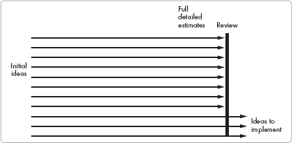
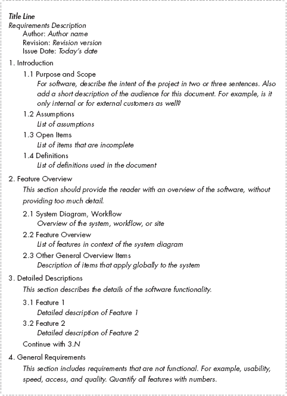
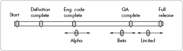
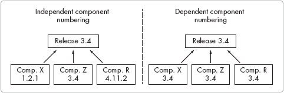
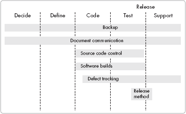

# 第二部分。产品和科技

第五章

第六章

第七章

第八章

本书本节涵盖了产品和科技，这两个领域是公司知识产权的核心。优越的产品定义导致优越的产品，良好的技术工具和方法能够实现更快的高质量结果。了解如何平衡产品和科技是有效开发管理的一个秘密。

# 第五章。定义产品

在本质上，*产品定义*不是一个知识或资源问题；它是一个*关系*问题。当你和你的开发团队与市场营销人员和客户建立强大的关系时，定义产品变得简单得多。与其他团队成员进行开放和定期的沟通可以帮助你将开发目标与公司目标对齐。此外，在公司各部门之间以及公司与客户之间建立信任可以导致对最合适的产品定义达成更快的共识。

在市场营销和开发团队之间，最困难的关系紧张往往发生。在这些团队之间建立积极的关系可能具有挑战性，因为市场营销和工程人员扮演的角色非常不同。市场营销的职能是理解客户需求并承诺提供满足这些需求的解决方案。

工程的角色强调构建产品的实际方面，以及构建后对其进行支持。如果两个团队能够建立强大的关系，他们可以共同制定最佳和最平衡的解决方案来满足客户和公司的需求。

本章介绍了定义产品的基础知识。您将了解关键关系，研究创建产品定义的示例流程，了解产品定义中包含的内容，并了解一些原型设计和如何使用模板来帮助定义产品的知识。此外，您还将了解产品是如何组合起来的，以及关系中的不同合作伙伴如何看待产品。

# 产品定义流程

制定一个精细的产品定义可能对许多公司来说是一个挑战，原因有几个：可选方案的数量超出了公司的构建能力，信息不足，以及市场营销和工程之间的联系薄弱。然而，如果市场营销和工程团队能够改善关系，他们可以通过高级审查和快速成本评估的过程共同定义产品。

制定一个联合和协作的定义并不一定意味着在产品定义中工程和营销有完全重叠的责任和权限。一些公司把最终决定权交给工程部门，而另一些公司则让营销部门担任主导角色。当营销团队实力强大时，以营销为主导的方法通常效果最佳。在任何情况下，合作行为都能产生最佳结果。

在初始产品定义过程中，营销和工程部门之间的简短每日讨论可以促进更快地确定最佳追求选项。这种每日讨论变成了一种*持续的对话*，允许对需求和最终定义进行迭代优化。团队可以分阶段分析功能成本、时间表和定义——无论是快速概述、中级水平审查还是更全面的定义审查。在每一个阶段，团队都会通过深思熟虑的分析和数据收集来选择和排除选项。

理想情况下，营销/工程评估的工作流程如下：首先，工程部门与营销部门合作，对产品的大小和范围进行初步快速估算。接下来，两个团队就如何缩减清单达成一致。剩余的项目将进行更详细的分析。然后，这个过程会重复进行，直到两个团队就最终的产品定义、成本和时间表达成一致。图 5-1 展示了这一筛选过程。

**图 5-1. 筛选初始产品想法以产生最终选择**

如果营销和工程团队之间没有建立信任关系，那么流程中的步骤将会退化。例如，如果营销部门将工程部门提供的初步快速估算视为完全承诺，并施压要求工程部门满足这些承诺，工程师可能会停止提供快速估算。工程师基于有限的信息创建快速估算；这些估算不适合用于准确的预算和排程，但足以确定初始方向的成本范围。提供成本范围作为快速估算强调了其中的不确定性，但分析不足以用于创建准确的项目排程。

一旦不信任破坏了工程和市场营销之间的关系，就会随之出现图 5-2 中所示的高昂过程。在这种情况下，双方都将对话视为小型合同，消除推测性讨论。所有特性和项目想法在工程提供任何类型的估计之前都需要进行广泛的评估，并且工程投入大量时间进行精确、深入的估计。市场营销在向工程展示每个想法之前，必须投入更多时间来完全定义每个想法。最糟糕的是，工程在向市场营销展示之前，必须为*所有*选项创建详细的估计。

**图 5-2. 浪费的选择过程**

为什么这么多公司选择如此浪费的产品定义方法？过去的不良行为通常会导致防御性的关系。如果过去工程基于初步想法快速提供估计，而市场营销坚持将这些数字视为最终数字，那么工程在将来提供快速估计的动机很小。

然而，在采用成功的方法进行操作时，工程和市场营销可以收集更多信息，并细化将要实施的想法的定义。图 5-3 说明了与细化定义相关的信息金字塔。每一层都反映了更多产品信息。

精细的定义从*顶层*开始，关注客户的需求。随着定义过程的继续，市场营销和工程将提供更详细的产品描述：详细的需求、高级实现描述、详细的概念模型和原型，然后是功能规范。然后工程考虑产品架构，检查产品构建的要求，并准备其功能和用户界面的详细描述。最后，工程和市场营销共同完善产品提供的完整定义。

**图 5-3. 定义清晰度与细节量**

该过程具有挑战性，因为团队必须基于不完整的信息做出产品决策。决策涉及在功能、时间表、资源和实施方法之间的权衡。做出明智的*初步*决策需要在不等到开发构建产品之前，彻底分析需要构建的内容。如果关于特定功能的技术可行性出现疑问，应请资深工程师在构建软件之前为这些技术领域创建简单的原型。原型将在稍后详细讨论。

# 产品定义内容

在努力定义产品时，创建一个概述产品规范的文档，并在与市场和客户合作以细化焦点时继续更新此文档。草图和笔记可能对初步讨论有用，但它们不会提供足够的前期数据，因为您需要根据要求进行修订和改进。

小公司从简短、简洁的定义中受益，而不是从正式的规范中受益。与其创建一个复杂且耗时创建和维护且难以阅读的规范，不如在考虑可读性和思想共享的情况下创建产品定义。

简单的定义可以提高开发敏捷性。遵循以下一般指南：

+   保持文档简短且易于阅读。关注功能的高级定义，不要详细阐述具体细节。定义的简洁性有时可能需要与市场和其它团队协商文档的性质。过于复杂的文档会使文档在审阅时难以阅读。

+   避免在定义中添加实施细节，因为它们不会为解决方案提供清晰性，并且可能在您考虑如何满足客户需求时限制您的选择。

+   保持文档布局的可读性。避免需要为每个声明进行标签和编号的正式模板。

+   将图片作为书面定义的焦点。如果只提供文本，审阅者可能难以想象顶层系统定义。图表可以用来阐明复杂的概念，并作为系统持续讨论的催化剂。

+   通过先从概述信息开始，然后解释较低级别的细节来分层讨论。概述信息为产品提供上下文，包括受众、最重要的目标和解决的问题。工程师通常从开始到结束线性地描述系统。对于非技术或甚至不熟悉的读者，概述提供了上下文，使得较低级别的细节更容易理解。

+   将用户界面原型作为产品定义的一部分进行创建，并在需求文档中选择性使用它们。页页的屏幕截图并不能增加上下文或价值。

+   考虑使用用例来定义产品的各个部分。一个*用例*描述了用户为达到特定目标使用产品所采取的所有步骤。用例补充并明确了产品定义，但不应该被视为完整的规格说明。

+   使需求可测试且无歧义。避免需要解释或 QA 无法衡量的词语。不属于功能需求的需求属于这一类别。例如，不要说您的产品需要*快速响应，高速*和*支持大数据集*。更好的定义是*使用我们标准硬件，所有屏幕上的响应时间不超过 2 秒*，*翻译数据速率至少为每秒 1.5MB*，和*支持 5 亿用户记录的数据集*。创建无歧义和可测试的需求并不意味着规格说明必须是正式和广泛的。只需确保您所指定的内容是清晰且值得的。“良好的质量”是不够的。

+   使用需求定义模板来组织您的需求文档。模板以一致的方式组织文档中的信息，为阅读您公司的人提供了一个易于理解的上下文。一个好的模板可以帮助您避免遗漏重要主题，如果它正确地列出了所需的所有信息类型。最好的模板被团队视为实用且有用——而不仅仅是填写以取悦管理层的形式。

存在许多用于需求定义的优秀模板。在选择适合您需求的模板之前，请先审查多个模板。图 5-4 展示了示例模板。（对于此模板，说明文字以斜体表示。您应将所有斜体字替换为您项目所需的信息。）

在定义产品时，优先考虑需求。如果您在早期与市场营销讨论优先级，产品定义将更加顺畅，您可以避免需要再次与市场营销确认以澄清问题。为*敏捷*和*迭代*过程建立优先级，因为它们允许您在设计中进行权衡。它们还有助于项目规划，让您能够更早地组织精力集中在最高优先级的项目上。首先完成最高优先级的功能将最小化在计划变更或时间表缩短（由于业务需求变化）时出现的问题。

# 整体产品概念

客户需要提供满足他们需求的全套解决方案的产品。软件开始解决客户的问题，但在几个方面往往不足。它必须满足客户的期望；它应该提供灵活的选项；它应该包括 API 或其他互连，以便它可以与其他系统集成；并且它应该包括支持性服务，例如访问受过培训的客户服务中心人员、专业培训和现场支持。在所有这些领域提供解决方案的软件被称为*完整产品*提供。

**图 5-4. 样本需求模板**

在定义产品时，要考虑整个产品概念，而不仅仅是产品特性。考虑客户的需求，并思考他们如何做出购买决策。您产品的特性以及支持性基础设施是否满足客户需求？如果不满足，添加新特性可能只是部分答案；您可能还需要考虑添加与其他系统的新接口，以便产品在各种环境中更容易部署。

### 注意

*您可以通过阅读 Geoffrey A. Moore 的《跨越鸿沟》或 Theodore Levitt 的《营销想象力》来了解更多关于整个产品概念的信息*。（见“附加阅读”中的附加阅读。）然后带着这个概念与营销团队讨论您的产品定义*。

# 使用原型定义产品

营销团队对产品定义的第一次尝试提供了客户需求的概述视图。然而，这个定义对于工程团队构建产品来说细节不足；还需要几层额外的信息来帮助您构建解决方案。工程团队必须创建产品的*用户界面（UI）*、*应用程序编程接口（API）*和*业务逻辑*的工作定义。创建这些工作级定义最昂贵的方式是让个别工程师决定如何构建软件，构建它，然后将结果展示给营销团队。这种方法不可避免地会导致几个昂贵的返工周期。更好的方法是，在产品定义的关键领域投入必要的时间，并与营销团队合作，直到就产品定义达成一致。

在产品被充分定义之后，向营销和客户展示一系列原型以及新想法，将允许进行几个快速审查周期，并最终得到更好的产品。

## 原型概述

工程师希望交付能够解决客户问题的软件，而不仅仅是基于市场营销需求文档构建的代码。通常，市场营销部门和客户无法提供最佳解决方案的详细定义。他们需要体验原型来欣赏和理解他们对各种选择的喜好和厌恶。原型允许客户“触摸和感受”产品，帮助他们做出明智的决定。没有原型，实现清晰的产品定义可能需要漫长的试错过程。

原型对于从客户和市场营销人员那里获取信息非常有帮助。这个过程仅从开发团队创建的第一个原型开始——开发团队将收集反馈并改进原型，直到市场营销部门和最终客户对结果满意。反馈和原型改进周期使你能够有效地定义产品。它还能保护你免于在错误的发展道路上浪费太多时间。

你可以使用多种技术来创建原型。可以将界面纸草图以不同的顺序展示给客户，以描述概念。更好的是，你可以使用基于软件的工具来创建与最终软件相似的界面。许多这样的工具专门设计用于创建快速原型，使你能够定义一个既易于访问又易于分发给他人进行反馈的原型。本章讨论了一些示例系统。

在你创建原型后，与市场营销部门和客户以及其他团队一起对其进行审查。与质量保证、客户服务和运营团队交谈；他们可以提供关于产品定义原型如何影响公司其他部分的见解，并帮助你定义改进产品的途径。

## 快速敏捷的方法

限制创建原型的耗时，以便以后更容易考虑替代方法和变化。此外，避免创建昂贵的原型，因为高昂的成本可能会使开发者不太可能调查替代方法。

鼓励工程师不要花费超过几天时间创建每个原型。一个花费很多天创建原型的开发者可能不愿意对其做出重大更改。开发者也可能被诱惑将原型变成产品本身，这是一个糟糕的想法。

原型通常在您从中学到所需知识后就会被丢弃——这是限制在原型上投入资源的原因之一。丢弃原型将防止您被快速构建中固有的缺陷所困扰。因此，您应该阻止或禁止在产品代码中重用原型代码。如果原型测试了概念的技术可行性，并且工程师必须用最终产品的语言编写它，请要求工程师不要使用原型代码。让她从头开始构建应用程序，因为基于原型代码构建产品会损害其长期质量。

### 警告

*始终丢弃原型。不要在产品中使用原型代码*。

最后，向所有相关人员明确指出原型不是**产品**，以避免与原型相关的任何不必要的正面或负面期望。

## 可点击用户界面原型

使用**可点击原型**，用户可以点击并导航 UI 屏幕。可点击原型应没有任何与任何可点击按钮相关的功能或功能。它们唯一的目的是让客户测试 UI。通过实验可点击原型，客户可以了解计划系统的导航和工作流程。

许多商业 UI 原型工具可供使用。以下是一些流行的快速原型商业工具的示例。

Microsoft Visual Basic

Visual Basic 拥有出色的拖放界面，您避免了在原型之上开发最终产品的诱惑，因为大多数商业程序都不是用 Visual Basic 编写的。[`msdn2.microsoft.com/en-us/vbasic/default.aspx`](http://msdn2.microsoft.com/en-us/vbasic/default.aspx)

Microsoft Visio

Visio 允许您创建可以链接到图标以构建可点击 UI 原型的页面。[`office.microsoft.com/en-us/visio/default.aspx`](http://office.microsoft.com/en-us/visio/default.aspx)

Adobe Dreamweaver

通过使用 Dreamweaver 的 HTML 编辑器，您可以创建一个高度可移植的 UI 模拟，人们可以在任何网络浏览器中加载。[`www.adobe.com/products/dreamweaver/`](http://www.adobe.com/products/dreamweaver/)

Axure RP

Axure RP 是一个快速原型工具，可以创建 HTML 页面或可执行文件，您可以轻松地将它们分发给客户进行审查。[`www.axure.com/`](http://www.axure.com/)

您还可以使用通常不被视为原型工具的系统来创建原型，例如 Microsoft Word、PowerPoint、Excel 或 Adobe Acrobat。使用这些工具，您可以生成一系列屏幕来表示各种工作流程。

## 用户界面设计

在产品生命周期早期创建用户界面设计。无论如何，不要等到产品发货后再去改善用户界面！如果不承担重大成本并给客户造成混乱，将无法进行重大更改。许多没有用户界面经验的工程团队设计界面是基于易于实现而不是易于使用。由于界面是主要的客户接触点，一个糟糕的界面可能会让客户对产品感到不满，即使产品的其他部分很优秀。

如果产品需要特别具有挑战性的用户界面设计，请雇佣人类因素工程师或可用性工程师来帮助完善界面。这些专家了解人们如何使用软件，并可以帮助您使产品易于使用。他们的意见可以大大提高产品并提升客户对产品和公司的满意度。

人类因素工程师和可用性工程师通常不是小型公司的雇员，因为他们通常没有足够的工作来证明全职雇佣的合理性。雇佣一个可用性顾问可能成本高昂，但这是一项值得的投资，优秀的可用性工程师物有所值。咨询工程师可以迅速为新用户界面设计出优秀的解决方案，并评估现有的用户界面。

# 与营销建立关系

工程和营销之间的合作安排和良好关系可以帮助两个团队共同拥有产品定义、路线图和交付。实际上，他们*应该*共同拥有这些。与营销的良好关系将帮助您作为开发经理做得更好，通过更好的定义提高您公司产品的质量，并使在项目期间出现的问题更容易得到解决。

在一开始就与营销部门取得联系，建立信任关系。以鼓励营销和开发团队之间相互信任和合作为行为准则。通过定期沟通——每天或至少每周几次——来帮助建立伙伴关系，增进彼此对对方工作方式和特定需求的了解。您团队与营销的关系将由您如何处理失败来定义，就像您如何处理成功一样。伙伴关系意味着共同的成功和失败。当伙伴关系取得成功时，您可以分享荣誉。当项目的一部分失败时，您可以共同接受失败，而不是试图最小化自己的角色或责怪另一方。

要成为营销的强大伙伴，您应该了解基本的市场营销概念，包括产品需求是如何由营销定义的，项目是如何包装的，以及单一产品提供如何服务于各种类型的客户。通过阅读书籍或报名参加入门级市场营销课程，花时间了解市场营销的科学和艺术。

尽管在许多小公司中，市场营销和工程是产品定义的主要来源，但其他团队也参与了产品定义。确保你与运营、销售、质量保证和财务部门建立关系。如果没有其他团队的支持，即使与市场营销部门有很好的关系也可能导致公司对任何计划的支持不足。理解其他团队的关切并寻求他们的意见将加强你团队在整个公司的关系。

## 避免糟糕的关系

你可能会感到惊讶，但市场营销和工程团队之间的关系有时可能是对抗性的。在产品定义、功能集、成本和交付时间表方面，市场营销和工程之间存在一种自然的推拉张力。市场营销团队通常会抱怨工程部门交付的产品晚于预期，并且缺少功能。开发团队会抱怨市场营销人员不断改变关于要包含哪些功能的想法，或者在没有与工程部门讨论的情况下向客户做出功能承诺。

指责和防御性行为会迅速侵蚀工作环境并减缓产品开发，因为每个团队在回应其他团队的关切之前都会要求进行更全面的分析，正如本章前面所讨论的。无法合作的市场营销和工程团队可能会使产品开发过程变得如同噩梦。像“我们必须再增加一个功能，但你不能改变时间表”这样的游戏可能会让两个团队都感到沮丧，破坏产品定义过程，并破坏士气。

**政治与生产力**

我合作的市场营销人员有一长串他想要的东西。为了帮助进行初步筛选，我根据粗略的定义对所有项目进行了快速量级估算。我们同意我们会重新审视那些感兴趣的项目，弄清楚细节，然后进行估算。对每个项目进行详细估算会花费太多时间，并且需要更多的时间来定义。

市场营销副总裁介入并选择了他想要的物品。他坚持认为快速估算就是最终估算，并且他会基于这些估算来制定最终计划。由于公司的政治因素，说“不”不是一个选择。这位副总裁的行为错误地改变了工程与市场营销合作的动力。工程部门将不会为市场营销进行快速估算。

——工程经理

## 保持市场营销和工程团队在一起

市场营销和工程团队应该位于同一设施内，以鼓励合作并产生最佳的产品定义。当团队办公室位于同一地区时，团队可以更好地沟通并建立信任。当团队可以轻松交谈并定期分享他们的想法时，创建联合产品定义的机会就会增加。

相反，将市场和工程分开到两个不同的设施中可能会使得建立良好的产品定义所需紧密的工作关系变得困难。在远程团队中，人们错过了有助于建立信任关系的偶然交流机会。他们更多地通过文档、电子邮件和正式会议进行沟通。白板讨论，在产品定义过程中可能很有价值，但当团队位于不同地点时，设置起来会感到尴尬。

## 建立平衡关系

建立市场和工程之间良好关系最重要的要求之一是*平衡*。你应该能够在拒绝市场请求时，不会使这个决定被视为拒绝。分歧不必导致市场经理要求 CEO 强迫你做出决定。如果你经常发现自己处于无法说*不*的情况，也许你应该对新职位说*是*。

在拒绝市场请求之前，考虑可能用*可能*或*是*回答的替代选择。如果你为市场的请求提供选项，你可以改善协作关系，并共同努力寻求最佳解决方案。

当寻找积极的替代方案时，考虑这些选项：在产品路线图中稍后添加新功能或新产品，用新请求交换计划的功能集，或推迟计划发布以添加新功能。在任何情况下，都要确保你能支持你提出的替代解决方案。

# 产品客户认知

客户对产品的认知从未真正符合现实。就这一点而言，市场和销售的认知通常也不符合现实。甚至工程的认知也不总是符合现实。

为了帮助您理解这个概念，研究图 5-5，它提供了一个包含一些有趣的认知不匹配的维恩图，突出了经典问题区域。三个认知圆圈显示了所有可能发生的与期望不匹配的不同情况。每个情况都用字母标记。分别检查每个重叠情况，以查看认知不匹配的潜在问题和解决方案。

**图 5-5. 客户认知，内部认知和工程认知**

A: 对齐

我们都以相同的方式感知相同的事物。认知可能符合现实。对于这些特性，产品按设计工作，客户期望与产品相符。微笑。这是好事。

B: 自欺欺人

销售和营销认为产品提供了不存在的功能。幸运的是，客户并不了解这些虚构的功能。工程、销售和营销之间的沟通越好，这种误解发生的可能性就越小。如果工程和营销在开发过程中经常沟通，他们应该对功能集保持一致。良好的文档和良好的销售培训将使销售团队能够跟上进度。如果销售的理解不完整，员工向客户提供了错误的信息，他们已经造成了一个更大的问题，即案例 C。

C: 缺陷、遗漏或过度销售

在这种情况下，销售的产品与工程构建的产品不匹配。这种不匹配的原因可能是产品缺陷、文档问题，或者销售故意过度销售产品。

*过度销售*发生在销售告诉客户产品包含了一个实际上并不存在的特性时。一些销售人员为了促成销售，然后会施压工程师快速添加这个特性，以避免给公司带来尴尬。

缺陷和遗漏的情况是直接纠正的：要么纠正代码，要么更改文档以匹配所交付的内容。如果销售人员故意过度销售产品，营销和高级管理层应当采取纠正措施，以避免未来再次发生这种情况。让单个销售人员在没有工程、营销和管理积极参与的情况下定义产品方向，将会破坏长期的产品规划并损害公司。

D: 伟大的期望

客户认为产品做了它实际上并没有做的事情，即使贵公司没有告诉客户该特性受支持。这种情况发生在客户对产品做出了无根据的假设时。良好的面向客户的文档、营销资料和客户适当的培训应将此问题降至最低。

E: 隐藏能力

在这种情况下，产品包含了未记录的特性，这些特性可能是软件构建过程中的无意产物。开发团队可能对这些能力并不知情。有时工程师可能会故意添加这样的特性而不进行记录。隐藏能力在没有被客户意识到并利用的情况下可能是良性的。

隐藏能力应当被记录，并且其原因应当被调查。如果代码的无意副作用创造了这种能力，它应当被记录为特性或者被禁用。如果这种能力是故意的但未经许可添加的，应当与添加该能力的工程师沟通，以防止未来再次发生此类情况。

F: 代码产物和不受支持的功能

一个 *遗物* 描述了一种非预期行为，并覆盖了系统的一些不寻常和意外的案例。这种行为或隐藏功能并非有意包含在产品中。它不会出现在你的测试系统中，对你来说是未知的。

当客户发现代码遗物或不受支持的功能时，可能会出现大问题。客户可以利用意外的代码遗物效应影响他们的系统，由于贵公司不支持该遗物，它可能不会出现在下一个新版本中，从而让客户在未来失去该选项。

理解客户使用模型有助于你识别和避免此类问题。与客户交谈，了解他们如何使用产品，以帮助识别不寻常和未计划的使用。理想情况下，绘制客户使用模型。了解您的客户如何使用产品。

当工程师在发布中添加未经记录和未计划的功能时，可能会出现不受支持的功能——也许工程师想尝试一个巧妙的主意。一些客户服务和支持技术人员可能会听说这个功能，并告诉客户它是合法的，因为他们想帮助客户解决问题。为了避免未计划的功能，告诉开发团队未经批准添加功能是不可接受的。下一节将更详细地讨论这个案例。

G: 错失的机会

在这种情况下，客户对产品的某个功能一无所知，因为公司以某种方式错过了描述该功能并提高产品销售潜力的机会。你可以通过全面记录所有功能并对销售人员进行最重要的功能培训来避免这种情况。保持面向客户的文档更新，以避免在未来创造错失的机会。

## 惊讶！未计划的功能

在产品中找到工程师未经你知晓添加的功能是一个令人不快的惊喜。工程师会在产品代码中添加未计划的功能，主要有三个原因，所有这些都不被接受：

+   工程师想取悦某人（一个客户、客户服务代表或高级经理），但知道管理层不会批准这个功能。

+   工程师认为他比其他人更懂得如何。

+   工程师想尝试一个新功能，但又不想请求添加到产品中的许可。

构建未经批准的功能可能会延迟必需功能的实施，并可能损害你的产品。在某些情况下，这些未经批准的功能可能会因为开发时间不足而迫使必需功能无法发布。未计划的功能也可能导致产品的不一致性，因为通常工程师只会在一个产品部分中实现它们。这些功能通常不符合整体产品定义或策略。它们还可能给 QA 和文档团队带来大问题，因为隐藏功能的行性行为与文档中记录的行为不同。最后，将未经批准的功能添加到产品中表明工程师对公司的其他人的不尊重。

一个小的“后门”功能可能会增加客户的即时价值并取悦客户。然而，如果客户试图在软件套件的另一个部分使用这个功能，却发现它不受支持，他们可能会感到不满：这个惊喜功能将成为你公司的一个大问题。当客户表达不满时，你可能会被迫匆忙提供对该功能的支持。在产品发布后完成对功能的支持可能比在开始时创建该功能并提供支持贵 10 倍。突然之间，这个小的变化已经打乱了你的公司接下来的几个发布版本，并可能影响其未来的收入。

如果工程师向产品代码中添加未经批准的功能，请将她叫到一边，并指导她关于她的行为对产品和公司的影响。在与负责的工程师交谈时，请记住，你的目标不是压制创新，而是鼓励在实施之前对关键功能进行团队讨论。

**最佳意图**

一位客户服务员工向一位正在我们系统某部分工作的工程师提出了一个功能请求。这位工程师认为这是一个不错的变化，因此他没有告诉任何人就实施了它。当发布出来时，客户服务人员向关键客户介绍了这个功能，客户们开始使用它。一些客户非常喜欢这个功能，并开始广泛使用它。客户建立了与这个功能相关的数据文件。

然而，两位关键客户很快发现产品在所有区域都不支持这个功能。这对他们来说是一个大问题，他们开始大声抱怨。作为大客户，他们推动我们改变发布策略以支持这一变化。全面支持这个功能并不便宜；我们不得不将其作为一个快速计划发布的版本实施。这使其他客户感到不满，并影响了我们支持其他关键新功能的能力。这个未计划的功能真的让营销团队感到不安。从现在开始，我制定了明确的规则，要求工程师在没有批准的情况下不得添加任何功能。

——产品开发经理

# 在 Alpha 版本中改进产品

你可以在产品的*alpha 版本*（软件的早期版本，专门创建和发布以征求客户反馈）期间有效地改进产品定义。你可以识别出那些知道 alpha 软件尚未准备好用于生产使用但仍希望为其定义做出贡献的合作伙伴客户。选择对您的产品充满热情的现有客户将最小化您的风险并提高您的结果。

要在 alpha 版本中取得成功，你需要积极推动客户的评估。一个*被动的 alpha 版本*，其中你向客户发送软件然后等待他们的评估，将不会产生你所需要的反馈。相反，与你的 alpha 评审员安排评估时间，这样你就可以在他们使用产品时直接从他们那里获得反馈。如果测试人员是远程的，安排定期的会议来讨论他们对产品的印象。alpha 版本的目标不是识别错误，而是征求整体产品定义、工作流程和功能的理念缺陷，这些缺陷会降低产品的价值。（第六章讨论了使用 alpha 版本的实际方面。）

# 理解现有产品的组成

产品定义并不仅限于初始发布。定义产品的未来需要清楚地了解产品*的现状*。因为你可能没有参与产品定义过程的开始，你可以退后一步，对产品及其功能进行快照视图，以阐明任何问题区域。理解现有产品还需要你检查“内部”的代码和构造细节。

客户根据其功能和满足需求的能力来审视产品。然而，在产品内部，每个产品都可能由软件包装（围绕产品可执行文件和库的包装，使其易于解包、安装、设置和使用）、多个代码可执行文件、数据文件和数据库组成。小型公司往往没有正确维护产品的“内部引擎”文档。

如果在过程中构建了许多可执行文件并且人员发生了变动，那么解开哪些软件模块包含在哪个外部产品中可能会很困难。在少数情况下，工程师在构建或打包过程中创建了代码组件的层次结构，这使得产品组成难以整理。

对于具有许多不同组件的软件服务，追踪客户使用哪些组件以及管理员使用哪些组件可能是一项复杂任务。有时组件包含在软件构建中，但已不再使用。如果产品在市场上拥有悠久的历史，你应该与多个工程师、QA 和运营人员交谈，以确定产品组成。

在某些情况下，您的公司可能为了满足特定客户的需求而严重定制了产品。如果开发团队没有记录这些定制细节，那么在维护或更新产品时，确定产品哪些部分对哪些客户重要就变成了一个巨大的问题。

三个案例历史说明了不明确的产品定义映射到代码的问题。在所有情况下，都需要大量工作来就定义产品并记录结果达成一致。

案例 1：许多兼容模块

公司 A 的产品提供包含超过 150 个不同的模块，这些模块是在十年间开发的。运营团队将这些模块构建成一个层次结构；结果是几十种不同的产品提供，具有重叠的模块。构建某些产品需要七级分组层次。直到构建和包装产品的人员对它们的实际内容不清楚，这个层次和分组才逐渐建立起来。

解决这个问题需要获取市场描述、许可描述以及自制包装文件。开发经理编写了一个程序，将组件映射到产品上，并识别重叠和许可问题。结果发现，存在许多冲突，包括许可重复。这个过程简化了许可和包装的重组，并识别出一些包装中意外包含的额外软件。这导致公司损失了收入，因为关键产品是在每次发货时被赠送而不是销售。

案例 2：过多的定制代码

公司 B 创建了许多不同的产品和服务提供。不幸的是，没有人记录它们以及定价和构造信息。管理层对各种提供的产品没有清晰的愿景，销售将提供的产品视为完全定制的工作，并未努力解决与此方法相关的流程和成本问题。

市场营销、工程和管理团队通过定义每个产品的内容、构造和定价，然后发布结果来解决这一问题。他们制作了一个标准定价电子表格，要求每个人都使用。这降低了每个新客户都需要昂贵的新开发的需求。它还简化了吸引新客户的过程。

案例 3：未记录的系统与遗留代码

公司 C 提供 *软件即服务 (SaaS)*，允许客户通过 API 访问软件。该系统包括多个模块，它们相互通信并驻留在不同的服务上。为了使情况复杂化，公司已经经历了系统的几个不同版本，并且遗留代码仍然存在于生产代码中。由于很少有人理解包括所有元素的大图景，因此不同员工对产品的组成提供了不同的答案。

在与运营和工程人员交谈后，工程经理编写了一份高级总结，展示了不同的模块以及它们如何与系统相对应。经理创建了一个详细的系统图，显示了各种服务器以及部署到每个服务器上的模块，包括仅由运营使用的模块。团队使用这份总结进行未来的测试和规划，这有助于识别需要从系统中移除的模块，从而降低维护成本。

在所有这些情况下，核心问题是尽管产品的构建随着时间的推移而改变，但公司里没有人推动这些选择或记录它们。开发管理需要积极与市场营销合作来定义产品组成并保持内部文档更新。产品组成问题可能看起来不太可能成为问题，但它们确实在小公司中经常发生。

# 附加阅读

下面是本章所涉及主题的一些附加阅读材料：

| *跨越鸿沟*，作者：杰弗里·A·摩尔（柯林斯出版社，2002 年） |
| --- |
| *在半数时间内开发产品：新规则，新工具*，作者：普雷斯顿·G·史密斯和唐纳德·G·雷因特森（约翰威利出版社，1997 年） |
| *为软件开发者进行有效原型设计*，作者：乔纳森·阿诺维茨、迈克尔·阿伦特和内文·伯格（摩根考夫曼出版社，2006 年） |
| *市场营销基础：全球管理方法*，作者：E·杰罗姆·麦卡锡和威廉·佩雷罗（麦格劳-希尔出版社，2005 年） |
| *软件需求*，作者：卡尔·E·威格尔斯（微软出版社，2003 年） |
| *市场营销想象力*，作者：西奥多·M·莱维特（自由出版社，1986 年） |
| *程序员的用户界面设计*，作者：乔尔·斯波尔斯基（阿普雷斯出版社，2001 年） |
| *在新产品中获胜：从想法到上市加速过程*，作者：罗伯特·G·库珀（基础书籍出版社，2001 年） |

# 第六章。推动发布

一个明确且完善的发布流程对于将公司的软件产品交付给客户至关重要。事实上，你用来交付代码的方法并不像你用来*准备*代码的发布流程那样重要。一个薄弱的发布流程不仅会给产品交付带来延误和不可预测性，还可能导致产品质量低下和公司形象受损。

小公司往往因为管理层没有意识到明确计划的价值而拥有薄弱的发布流程。公司的发布流程并不被认为像产品开发和销售那样重要。尽管发布流程不会影响公司的*短期*财务状况，但忽视其重要性可能导致不理智的方法，例如从开发人员的计算机上通过电子邮件将产品的可执行文件发送给客户。

一个未计划的、“临时”的发布将负面地影响公司的**长期**底线。过去临时发布造成的问题在公司开始增长时最为明显。临时发布是不可重复的，它们**不可能长期支持**，并且容易出错。如果一个发布不可重复，那么在需要重新创建和修复早期发布代码时，就会导致问题，这通常发生在支持使用较旧版本产品的客户时。其次，由于交付的随意性，临时发布很难甚至不可能得到支持。在某些情况下，工程师可能会在本地机器上构建代码副本，而不是从源代码库中获取副本，这使得很难知道哪些内容最终落入了哪个客户手中。第三，临时发布容易出错，因为它们没有经过必要的测试、文档化和标记，以确保发布具有高质量且可支持。

与糟糕的发布计划相关的其他问题可能会给小型公司带来噩梦：糟糕的发布命名可能导致内容错误；发布可能在没有解决客户问题计划的情况下发货；客户可能会因为交付的发布是意外的，并且他们没有被告知其内容而感到不满。

# 发布计划

发布计划过程中最被低估的方面可能是其加强或削弱公司价值观和形象的能力。随着时间的推移，您的发布应该与公司的长期愿景相匹配，无论是从战略还是企业形象的角度来看。例如，如果您希望公司和其产品因其高质量而闻名，发布计划应该支持高质量的发布。如果您希望以快速创新而闻名，发布应该是创新且频繁的。

发布计划还涉及提前考虑发布类型和性质。例如，您可能决定工程团队不会提前计划补丁发布，因为发布将仅用于修复严重问题。然而，工程团队可以计划这些发布的快速交付。提前规划每种类型的发布将更好地为团队准备不可避免的变化和惊喜。制定发布策略比让发布“自然发生”要好得多。

将发布时间表和相关早期发布策略视为发布计划的一部分。然后，在制定好指南后，您可以建立发布标准和流程，以创建更高效、质量更高的发布。

## 发布时间表

您公司的*发布时间表*是匹配您的发布策略与公司整体策略和产品愿景的最具影响力的部分。一个清晰的时序表允许制定更现实的发布计划，并使您的公司能够建立适当的客户期望。另一方面，不规划发布时间表意味着您的结果将是可变的、不可预测的，并且可能无法传达您希望客户看到的形象。与营销团队合作制定时间表，并与高管团队审查以生成实施该时间表的输入和支持。

### 备注

*本节旨在介绍发布时间表和计划时间表。发布计划需要理解第十二章第十二章、第十三章第十三章、第十四章第十四章和第十五章第十五章中涵盖的几个主题*。

您的发布时间表策略也将定义您将创建的发布类型以及它们发生的时间指南。在定义发布时间表时，考虑客户的需求和公司希望的市场形象。例如，如果您的产品复杂且客户希望每年只升级一次版本，则计划每年进行一次主要发布和间歇性进行的可选次要发布。在另一个极端，某些产品市场竞争激烈且变化迅速；可能需要每季度或更频繁的发布。

考虑发布的最短实际时间。例如，如果发布需要四周的测试和两周的审批周期，发布之间必须超过六周。或者，如果您正在构建可以在一天内测试的托管产品，您的策略将受到较少的时间表限制。

此外，如果您的核心产品可以针对单个客户进行定制，您可能比通用发布更频繁地发布定制版本。另一个考虑因素是客户需要提前多久得知即将发布的消息。例如，如果客户在新的软件发布和可用之前需要四周的通知，那么少于四周的开发周期是没有意义的。

在您创建整体发布策略后，考虑您未来 6 到 12 个月的短期计划。在此期间，您可以规划以下期望：

+   主要发布的数量

+   次要发布的数量

+   定制发布

+   补丁的期望

+   正常发布周期不包括的工作期望

在考虑这些预期的情况下，您可以规划和编号短期发布。在分配大致时间表时，允许您的日程安排中留有空白，以应对意外问题和补丁创建。如果您不包括应对意外的时间，您将习惯性地在发布产品时迟到。确保您与市场和其它团队就时间表的灵活性达成初步协议。如果产品发布日期需要严格的、不可移动的日期，增加缓冲时间以允许未知事件和机会的发生。

在规划接下来的几个版本时，考虑每个发布周期的开始和结束日期。只考虑结束日期的发布可能会在计划单独并行发布努力时出现资源重叠的问题。通过规划每个计划发布的开始和结束时间，您可以确定资源冲突可能发生的时间和地点。

最后，在为下一个主要版本制定计划之前，考虑该版本的里程碑。如果您计划发布日期时没有考虑测试、审批、客户检查点、alpha 发布或 beta 发布，您将不得不稍后进行调整。

接下来，我们将更详细地探讨早期发布策略及其对发布时间表的影响。

## 早期发布策略

*早期发布策略* 是一种向客户提供产品预发布版本的方法，旨在改进产品定义并最小化在生产或后期生产中揭露问题的风险。公司使用许多不同的预发布方法，但本书采用以下定义：

Alpha 发布

*alpha 发布* 是向少数客户提供的早期产品代码，这些客户可以测试产品的功能和概念，并提供反馈。此代码通常只经过工程或 QA 的有限测试，可能尚未完成所有功能。客户应预期质量较低，因为 alpha 代码尚未准备好用于生产。

测试版发布

*beta 发布* 是向少数客户提供的早期产品代码，通常包含最终产品的预期功能，但尚未完全测试。与 alpha 发布一样，希望客户能对产品功能和概念提供反馈。此外，由于代码经过了更多测试，客户通常可以将其用于实际应用，这有助于他们提供关于实施问题或遗漏的早期反馈。客户对质量的期望因公司交付 beta 发布的历史而异。

限量发布

*限量发布* 是在广泛发布之前向少数友好客户提供的完整、生产就绪的产品发布，目的是识别严重问题。

图 6-1 展示了公司在发布周期的不同阶段可能如何使用这些不同的发布策略。虽然该图显示了里程碑图，但它并不暗示任何特定的流程。

**图 6-1. 发布类型：alpha、beta 和有限**

这些方法中的每一种都提出了不同的风险和回报。与市场营销部门一起审查所有三种发布方法，并共同决定哪些风险适合你们公司。所有早期发布都会给市场营销和开发带来成本，这将减缓完整发布的交付。

### Alpha 发布版本

Alpha 发布版本允许客户在产品代码仍然相对容易更改的生产周期早期提供有用的反馈。此外，客户可以帮助你找到在 QA 投入大量时间审查代码之前就可以纠正的问题。

然而，alpha 发布版本存在两个显著问题：首先，客户对发布版本往往有不切实际的高期望。当现实不符合这些期望时，客户可能会对软件产生负面印象，可能不愿意使用生产版本。为了最小化这类问题，你应该在 alpha 发布版本中向客户正确描述 alpha 代码的状态。同时考虑添加一个启动屏幕，突出显示这是一个 alpha 发布版本，包含 alpha 代码。这有助于最小化可能发生的问题，例如，如果主要客户联系人将代码传递给公司其他人而没有传递免责声明。

当客户在生产环境中使用 alpha 发布版本时，会出现第二个问题。有时，一些缺乏耐心的客户会不顾他们之前同意不这样做的事实，将他们的生产数据运行在 alpha 或 beta 代码上。然后，当 alpha 或 beta 代码出现严重问题时，这些客户会要求立即修复和数据恢复。常见的理由是：“新功能如此关键，我们急需它。”你可以通过禁用或限制 alpha 发布版本的功能来防止客户在生产环境中使用它，从而避免这个问题。不幸的是，这并不总是可能的，因为某些 alpha 测试需要在大数据集上使用产品。

### 警告

*如果客户有滥用 alpha 发布版本的历史，考虑只给他们提供 beta 或有限发布版本，或者不要让该客户参与早期发布计划*。

总体而言，alpha 发布版本是有用的，但在发布 alpha 代码之前，请考虑风险并努力将其最小化。

### Beta 发布版本

测试版发布的目标是在客户使用代码时提前通知问题，并获取对新功能的反馈。然而，根据测试版反馈对代码进行更改可能需要调整生产计划，因为测试版代码版本通常在发布周期接近结束时发送给客户——在 QA 完成测试之前。

测试版发布面临着与 alpha 版本发布相同的风险，但由于 QA 完成了更多的产品测试，所以质量风险低于 alpha 版本。在测试版发布中，额外的 QA 测试减少了代码故障让客户失望的可能性。这也提供了一个更合适的机会，在真实客户环境中测试代码，以确定客户是否能发现任何预发布问题。确保你的客户对 beta 代码的有效用途和相关的风险有清晰的理解。为了提高你的测试版结果，工程团队应该让客户了解代码的真实状态，并设定适当的期望。

### 有限发布

有限发布与 alpha 和 beta 版本发布不同，因为代码已经准备好发货。有限发布的目标是在出现问题时降低广泛可见性的风险。因此，有限发布只发送给*友好*的客户。如果发布后发现的错误或问题修复成本高昂，特别是如果客户的安全或数据处于风险之中，这种方法效果很好。

因为代码中的问题还没有影响到所有客户，且代码已经准备好投入生产，所以有限发布是一种降低风险的技术。如果有人发现了一个大问题，只有少数用户会感到不高兴，而不会影响到你的整个用户群。与全面发布相比，这种情况要好，因为团队可以直接关注更少的客户。如果客户发现问题，发布团队可以尽快创建补丁。

这种方法的最大缺点是只有少数客户会审查代码；大多数客户几周后才能获得新的最终软件。有限发布还会增加软件开发的整体成本，因为在有限发布期间，开发团队并没有完全专注于下一个版本。

## 规划产品生命周期结束

小公司可以从创建一个**产品生命周期结束**流程中受益——即淘汰产品的流程。一开始规划这个阶段可能看起来有些奇怪。大多数小型软件经理会想，“我们刚刚创建了我们的产品线，为什么还要考虑淘汰其中的一部分？产品生命周期结束是大型公司关心的问题，不是我们。”然而，在小型公司中，由于倾向于尝试多种不同的解决方案，生命周期结束问题可能会**更早**出现。而且，每个软件产品都有持续的成本，这是小型公司最难以承担的。良好的产品淘汰计划的实际好处包括提高客户满意度、降低支持客户基础的内部成本，以及如果公司能够从生产中移除无利可图的产品，则可以提高利润。

您如何实际实现这些好处？在您规划下一个版本时，回顾您的产品，并考虑淘汰的候选产品。从工程角度来看，一个好的候选产品可能是平台过时或过时的软件。在此情况下，“平台”包括硬件、操作系统，甚至第三方软件包。从市场营销的角度来看，淘汰的关键因素是客户使用和收入。客户群体小、存在重大技术问题以及未来潜力有限的产品可能是淘汰的好候选。

诚然，淘汰产品可能会让一些仍在使用它的客户感到不满，但有时支持该产品的成本超过了客户和公司的价值。您和您的团队处于最佳位置，可以确定与持续构建、测试、支持和维护相关的成本。您也最适合确定技术缺陷，这又提出了另一个重要观点：有时开发部门需要主动提出淘汰产品的议题。然而，工程师的评估必须认识到并平衡技术上的不满和产品生命周期结束对业务的影响。

当您在内部达成一致意见，决定淘汰产品时，创建一个产品生命周期结束流程。这个流程可以确保您不会错过可能导致客户出现问题、使公司损失金钱、使客户损失金钱以及损害您在客户眼中的形象的步骤。为此流程考虑的主要步骤包括以下内容：

理解客户影响

市场和销售部门可以做一些前期工作，以确定淘汰产品是否会影响到现有客户。考虑为这些客户提供支持产品中的替代解决方案。

审查合同和法律义务

确定合同或法律问题是否会影响产品的淘汰。在产品淘汰后，可能存在一些法律问题，这些法律问题规定了您需要维护客户数据的时间长度。

制定计划和时间表

当您确定要停用的产品时，制定时间表并与市场团队协商计划。此计划应描述从生产中移除产品的步骤和日程。

与客户沟通

一旦决定退役产品，就立即通知客户。如果可能，直接与客户交谈，并书面跟进。

规划步骤

您的停用计划应与发布日程保持一致，以便在正常发布期间移除产品。它还应包括以下与发布相关的步骤，以将其作为支持产品移除：

+   从工程软件构建中移除产品

+   从发布媒体或平台中移除代码

+   从包装和发布软件中移除代码

+   在发布说明中传达产品停用事件

返回客户数据

许多系统都与客户数据相关联。自然地，您需要一种方法将数据返回给客户。工程部门应确定现有客户迁移到另一个可用产品的路径，以改善并维持客户的好感。

删除或存储客户数据

在您退役产品并发送客户数据后，该计划需要说明客户数据是永久存储还是删除。

**产品停用**

我的公司有一个面向生产服务器的客户自定义报告界面。当我加入公司时，我发现这个产品没有规范，也没有经过适当的测试，大型客户报告可能会使整个系统变慢。

我最初考虑了测试和维修，但发现预计成本会很高。与市场营销团队合作，我们接下来考虑了产品的使用情况，并听说使用率很低。

根据产品市场营销的协议，我们将该产品列为停用候选。市场营销调查了我们的客户。他们发现客户偶尔会使用它。不幸的是，有一位客户喜欢它。我们决定停用该产品，并努力创建标准报告以满足这位客户最常见的使用需求。

由于我们是一家小公司，该产品的停用发生在初始讨论三个月后。这个决定减少了测试负担，对于那个产品来说负担很重。它还防止了未来可能出现的质量问题，因为该产品存在重大的质量问题。总的来说，这证明是一个好的公司决策。

—工程总监

总体而言，规划产品停用解决了许多潜在问题，并改善了客户对公司的态度，即使他们对停用决策感到不满。

# 发布流程

*发布流程*描述了在开发完成后发布产品所需的步骤。它是整体产品开发过程中的一个单独步骤。要开发发布流程，首先考虑流程目标。内部发布需要明确且一致地命名。流程需要支持客户就关键问题（如时间表和功能）进行沟通。它还需要可重复，必须最小化发布错误，并且必须有一个审查和改进机制。

让我们先看看发布标准，然后再讨论如何定义发布流程。

## 发布标准

*发布标准*定义了一个成功的发布应该是什么样的。它回答了古老的疑问：“我们到了吗？”提前知道你期望在发布中包含哪些内容——在功能、时间、流程步骤和质量方面——将帮助你引导团队走向成功，同时监控进度。如果这些标准在团队中得到了共识，也可以最大限度地减少提前发布产品的压力。

没有发布标准时经常出现的问题是“隧道视野”。没有对*完成*的发布进行定义，工程团队将只关注交付日期。发布将包括接近交付日期可用的内容，而对功能和质量的关注较少。

发布标准可以也应该针对每个公司都是独特的。例如，一个产品和形象需要高质量的公司将制定出高最低质量标准的发布标准；一个强调客户满意度的公司应该制定出在发布前要求适当客户沟通的发布标准；而一个强调易用性的公司应该制定出在产品发货前要求客户特定批准率的发布标准。

在设定发布标准之前与营销团队合作并考虑你的业务需求是明智的。确保你对这些标准有公司层面的支持将帮助团队在发布临近时压力之下做出良好的决策。

要设定发布标准，考虑以下问题：

+   对于一个发布，最低的可接受质量标准是什么？

+   每种类型的发布所需的最低测试是什么？（例如，补丁发布可能具有不同的测试标准。）

+   在发布前后需要什么样的客户沟通？

+   在紧急发布中应该完成的最少工作是什么？（紧急发布是指必须立即创建以防止对客户或你的业务造成重大损害的发布。）

+   对于一个发布，最低的可接受客户数据兼容性水平是什么？

+   最大的延迟时间是多少，不会对客户造成重大损害？

+   您的公司最早能在什么时候发布软件？（对于某些业务，提前发布基于服务器的软件可能会干扰那些可能计划在特定日子进行更改的客户。）

+   在发布前，需要多么详细地描述功能？是否有空间在不受干扰的情况下进行后期功能集修改？

在考虑所有这些标准时，请注意不要过度定义发布的最低标准。当然，管理层希望所有类别都是最好的，但从实际的角度来看，这是不可能的。更好的做法是强调发布标准的一个方面，并对其设定更高的标准，而对其他方面的发布设定更宽松的标准，以便在决策中提供一些灵活性。

在确定发布标准后，定义发布流程将简化发布组合的机械操作，并使估算和自动化发布更容易。

## 流程步骤

在心中牢记这些主要目标，设计*发布流程*时考虑几个重要的步骤。将这些步骤整合到主要开发过程中。

最终发布命名和编号

工程和市场共同定义最终发布名称和发布内容。通常，在产品开发之前，市场和工程就发布命名达成一致，但名称和编号的最终确定发生在周期接近结束时，因为可能需要更改。

提前客户发布通知

市场应提前通知客户发布情况，以便他们可以计划实施新产品，并在产品到达时不会感到惊讶。尽可能早地提供任何作为发布一部分的平台更改的发布通知。客户可能需要更改使用或硬件以支持您的发布，如果他们太晚得到通知，无法进行无痛苦的过渡，将会感到不满。这也会影响客户的预算流程。

客户发布信息

工程和市场应根据发布情况创建适当的客户文档——通常是现有文档的更新。这些文档可以包括发布说明、营销发布通讯、产品手册、新闻稿以及任何价格或服务级别变化。工程部门应与市场部门一起审查最终的发布更改，并检查营销材料以查看后期更改的影响。

发布说明

文档团队应生成发布说明，以高级概述的形式描述发布中包含的内容。这些说明描述了与当前版本相比的发布中的更改。

通知客户他们报告的缺陷的状态

客户想知道他们报告的缺陷是否包含在他们的内部计划中的发布中。发布流程应要求客户服务向个别客户提供他们报告的问题相对于发布的状况。许多软件公司因为涉及的时间而避免这样做，但提供缺陷解决说明可以大大提高客户的好感。客户会感激你对他们需求的响应。当客户群很大时，一个可接受的替代方法是包括在发布说明中作为一部分的选定缺陷解决列表。然而，对于小型成长型公司中常见的较小客户群，考虑个性化的方法。

内部培训

工程、客户支持和市场营销需要确保直接与客户合作的任何员工都接受了新发布的适当培训。

产品发布

在这一点上，发布工程师将软件提供给客户。软件的物理发布可以通过光盘、新的下载设置或通过将服务器软件切换到新版本来实现。务必记录和自动化发布步骤。发布流程文档应具体描述源文件、配置文件和可发布文件的位置。它还应提供足够的细节，以便团队能够执行产品发布。

发布确认

市场营销应在发布后立即通过电子邮件通知客户产品的发布。

发布后审查

发布后，举办一个审查会议，讨论发布周期中发生的问题以及改进下一次发布的方法。

发布后跟踪

QA 应该在发布后跟踪缺陷数量和客户电话数量。了解客户关注的问题将有助于改进代码或文档。

## 发布后审查

*发布后审查*是回顾上次发布、提出改进未来性能的建议以及提高团队士气的机会。审查会议应包括开发团队以及参与发布周期的其他团队：例如市场营销、客户服务和 QA。非正式的一小时会议可能就足够了。会议应涵盖以下要点：

+   在这次发布中，哪些方面做得好，我们应该继续这样做？

+   出现了什么问题，我们有什么不同之处可以改进？

+   我们应该更早识别哪些风险，我们如何在下一次识别它们？

+   我们如何优先处理遇到的问题？

+   我们可以识别哪些解决方案？

对于持续超过九个月的长期发布周期，一至两小时的几次发布后审查会议可能会有所帮助。这些会议需要大量的准备，每个人都应该意识到这一点。为每次会议制定议程，并要求所有参与者带着对议程的想法做好准备。此外，安排一个带有白板的会议室，并标出与发布相关的通用问题类别，以帮助人们在会议期间产生想法。

为了在会议开始时激发思路，分发大号便利贴并要求参与者写下问题或难题，每人一张便利贴写一个问题。每个人可以一次提出一个问题并简要说明。然而，这不是详细讨论的时候——这是关于收集思想和观点。在房间里从一个人走到另一个人，确保每个人，包括安静的小组成员，都有机会发言。

根据会议的时长，与会者可以在会议结束时或在第二次会议上对问题进行优先排序。在将类似问题分组后，要求团队为重要的悬而未决问题设定优先级。在优先排序结束后，将结果写下来，以突出问题和优先级，并将此信息发送给所有参与者。然后要求小组为下一次会议准备讨论最高排名问题的潜在解决方案。在后续会议上，每个人可以提出最高优先级问题的解决方案，使用便利贴总结每个想法为一个句子。在每个人都有机会提出自己的观点之前，避免对单个主题进行长时间的讨论。深入的讨论可以在之后进行。

在解决方案会议之后，列出主要问题和它们的解决方案。然后要求团队成员审查结果并提供额外的想法。选择可以解决的问题，并让团队了解改进的计划。任何无法直接解决的问题都可以与执行团队讨论。较大的、昂贵的解决方案可能需要你编写一份商业案例来证明成本和努力的合理性。无论大小，都要尽最大的努力解决重要问题，并告知人们哪些问题你没有解决以及原因。

要全面并跟进发布后审查中产生思想和解决方案。进行简短的审查而没有后续跟进可能比没有审查更糟，因为对问题的忽视可能导致员工的不满和认为问题永远不会得到改善的信念。

# 发布版本标识

软件命名和版本编号可能看似无关紧要，但小型公司往往因为未能正确标识其发布版本而遇到困难。标识不清的发布版本会导致因以下可能后果而浪费时间和精力：

+   工程师将代码添加到错误的发布版本中。

+   营销向客户发送有关发布中包含内容的错误信息。

+   由于发布标识不正确，QA 和工程师发现很难追踪错误。

+   没有人知道哪个客户拥有哪个版本。

### 注意

*这个问题在小型公司中如此普遍，以至于本章提供了对产品编号问题和实践的扩展讨论*。

虽然大公司通常应用一个定义良好的版本编号序列，但小公司往往使用不一致的版本标识符。通常，第一个标识符是基于功能集的发布名称。例如，可以是“数据库吞吐量发布”或“客户 ABC 支持发布”。

随着你的公司在发布几个版本后，出于几个原因，需要以独特且信息丰富的方式标识每个发布的需求增加。报告问题的客户需要一个清晰的版本号来参考。开发需要知道即将发布的哪个版本将获得哪些关键功能。工程和 QA 都需要知道在哪个版本中发现了哪些错误，以便正确解决每个问题。

清晰的发布标识符也使得缺陷修复计划更容易，因为你可以将单个缺陷分配给特定的未来发布。它们还有助于文档团队汇总发布说明。所有这些原因都应该促使你在公司成长早期就采用有效的发布命名方法。

## 三数字发布 ID

人们如何对数字做出反应有很多心理学因素——版本号 17 可能意味着开发者从未正确处理过，不得不持续发布主要版本，而当一个主要的新版本发布时，公司会将其重命名为新的名称，如*版本 2.0*。大多数软件都经历了快速的增长周期和持续的使用，一个常见且简单的编号方法使用由点分隔的三个数字，后面跟着一个构建号。这里称之为*三数字发布标识*（或*发布 ID*）。使用这种方法，一个示例发布号可能看起来像*3.5.2 构建 13*或*3.5.2 B13*（见图 6-2）。

**图 6-2. 版本号示例**

第一个数字是*主要发布号*，有时也称为*营销号*。这个数字每年最多增加一次，对于大多数项目来说，它很少会进入十几，因为客户认为版本号如*17.0.1*对于他们的目的来说太旧、过时了——他们期望有一个新的主要版本而不是更新旧版本。对于拥有许多发布的长期产品，营销通常通过一次大规模的产品推广来重命名产品，而不是发布新的版本号。成熟的产品不会进行未来的主要发布，只有小版本，这限制了第一个数字。

第二个数字定义了**次要版本号**，它代表功能变更而不是对系统的重大变更。次要版本在一年中定期发布。起始值可以是**0**或**1**，但应保持一致。

第三个数字，**补丁版本号**，在现有版本中修复（通过补丁）一个小缺陷时发生变化。这个数字可以从**0**或**1**开始，但应保持一致。

**构建号**跟踪发布周期中的软件可执行版本。出于方便起见，大多数构建系统都会在每个新的可执行版本上自动增加构建号。一个发布周期的开发需要创建多个构建，然后工程和 QA 团队对它们进行评估和测试。通过这种迭代过程，构建号唯一地标识了最终构建与早期构建之间的区别。

这些示例有助于说明如何将数字应用于一系列发布：

+   1.0.0 B104：初始版本

+   1.1.0 B99：具有显著变更的次要版本

+   1.2.0 B57：具有显著变更的另一个次要版本

+   1.2.1 B12：对 1.2.0 的补丁版本发布

+   1.2.2 B9：对 1.2.1 的补丁版本发布

+   2.0.0 B89：对首次发布的重大升级

+   2.0.1 B14：对 2.0.0 的补丁版本发布。

## 补丁版本发布

虽然发布编号系统允许发布补丁版本，但它不应**鼓励**这样做。这是一个重要的区别。将补丁版本视为承认错误，而不是快速添加另一个功能的快速机会。市场营销可能会给工程团队施加压力，要求在补丁版本中添加一个关键功能，但抵制这种诱惑将允许所需的补丁快速发布，并进行适当的测试。添加新功能应始终将版本移动到次要版本类别，这需要更多的测试和时间来确保适当的质量。

补丁版本发布确实需要进行完整的回归测试，以确保补丁不会使产品失败。因此，与常规版本相比，补丁版本的成本效益较高。

一些公司避免发布补丁版本，而是将许多补丁问题打包到一个快速创建的次要版本中。这种方法可能有效，但前提是次要版本发布得足够频繁，以至于您的客户不会遭受持续的问题。

## 组件编号与发布编号的比较

软件发布通常包括客户使用的多个组件或产品。在多组件发布中，一些组件与其他组件交互，因此需要同时发布。如何标记发布组件的选择既是市场营销也是工程决策，因为它对客户感知、客户服务、缺陷跟踪和工程缺陷调查有影响。在您的公司在起步阶段时，考虑与不同组件命名策略相关的问题，而不是等到公司处于成长阶段。4] 一个深思熟虑的组件命名约定允许您跟踪依赖的部分，并在内部与客户讨论中使用这些名称。

发布中每个可查看的客户组件都需要一个唯一的标识符。一种方法是在组件更改时允许组件保持单独的编号，然后将它们捆绑到发布中。另一种方法是不管组件是否更改，都为发布中的所有组件分配相同的发布编号。

图 6-3 展示了两种常见的方法——独立组件编号和与发布匹配的依赖组件编号。

**图 6-3. 组件编号的两种方法**

*独立组件编号* 允许每个组件使用不同的编号。在这种方法中，编号只有在组件更改时才会增加。然而，在将来追踪过去发布的组件可能会有困难。必须公开一个显示映射的表格，并保持其最新状态，以便代码开发团队可以轻松地识别特定用户报告问题的源版本。仅依赖源控制系统来跟踪这是糟糕的策略，并且容易出错——而且耗时。

*依赖组件编号* 将组件与发布编号相匹配。即使没有代码更改，所有模块的编号都会升级到发布编号。这种方法使得跟踪每个发布中包含哪些模块中的更改变得容易得多。使用常见的发布编号确定每个发布中缺陷的历史要容易得多。

## 版本间编号

在版本间编号有几个不同的驱动关注点。大多数软件消费者期望版本号是连续的。开发组织通常在开发对每个版本的内容没有明确想法之前就分配版本号。

早期版本编号可能导致连续版本编号的问题。早期版本编号反映了计划中的未来发布顺序。最初发布编号的意图是按顺序发布，但这并不总是行得通。

图 6-4 展示了发布编号不按顺序的例子。在发布 2.3.4 的开始，计划是首先发布 2.3.4，然后是 2.3.5。在这种情况下，开发延迟了 2.3.4 的发布，而 2.3.5 按计划发货。在发布 2.3.5 之后，开发发布了编号 2.3.4，现在编号顺序混乱了。

一家公司可以忍受发布顺序混乱；然而，另一种方法是重新编号未来的发布，以便编号始终顺序排列。顺序编号避免了在几个月或几年后，不可避免地，过去发布中出现问题时的混淆。参考图 6-4，当计划的 2.3.4 发布在 2.3.5 之前没有发布时，您应该将编号 2.3.4 作为非发布编号退役，并用下一个增量编号 2.3.6 重命名。不要在最终交付相对于其他发布的位置明确之前增加编号。对于这个例子，时间线将看起来像图 6-5 中所示的那样。在重新编号发布时有一个注意事项：确保文档和源代码标识符使用新编号。

**图 6-4. 在项目开始时固定的发布编号**

**图 6-5. 发布编号在发布时总是顺序的**

## 为绅士农夫的软件

为了了解组件编号的幽默横截面挫折，请阅读以下示例。

### 注意

*所有名称都是虚构的。任何与真实名称或公司的相似之处都是巧合*。

您拥有一家软件公司，Givemeabreakfarming Software, Inc.，该公司为那些想经营小型、兼职爱好农场但没有太多农业经验的人编写软件。您生产了一系列产品。主要产品是 FarmingBreak，您还提供辅助程序以帮助特定活动和作物：CowBreak、CornBreak 和 WheatBreak。客户必须购买主程序 FarmingBreak 才能使用任何辅助程序。在第一次发布后，您的所有产品都编号为 1.0。每个产品的版本号都显示在产品的用户界面上。

CowBreak 产品被匆忙发布，功能集较弱，因此您在第一次发布四个月后提供了升级版本。在规划下一个发布时，您意识到您有一个编号选择。您可以执行以下操作之一：

+   将所有项目升级到版本 1.1 并重新编译所有模块以匹配。

+   只将 CowBreak 升级到 1.1，而将其他产品的编号保持在 1.0。

你决定走捷径，只修改 CowBreak。这避免了需要将所有产品的版本号提升到 1.1，然后向客户解释没有任何变化。

在稍后，你将达到 WheatBreak 升级发布的另一个决策点。你应该称之为 1.1 还是直接跳到 1.2？你决定称之为 1.1。发布后不久，发现了一个重大问题，因此你必须发布一个补丁。补丁发布后，WheatBreak 的版本号变为 1.1.1。

你再次修改 CowBreak 并将其命名为 1.2，以添加主要乳制品功能。

随着你的业务发展，你规划了一次 FarmingBreak 的发布，你决定将其称为版本 1.1。然而，你必须更改数据库，并且所有产品都需要重新编译到新版本，因此你提高了它们的版本号。现在你有 FarmingBreak 1.1，WheatBreak 1.2，CowBreak 1.3，和 CornBreak 1.1。对于新客户来说，这并不构成大问题——你只需发送他们软件的最新版本，无论版本号是多少。

几年后，你的产品版本号如下：FarmingBreak 1.8，WheatBreak 1.9.2，CowBreak 1.4，CornBreak 1.5.3，和 SoyBreak 1.1.3。在这段时间里，你进行了一次数据库变更，该变更与旧版本不兼容。一位客户打电话来报告 FarmingBreak 1.5 中存在的问题，你记得之前在 FarmingBreak 1.6 中已经修复了这个问题。该客户还拥有 CornBreak 1.3.1 和 SoyBreak 1.1。你同意给他发送更新版的 FarmingBreak 副本，但你记不清楚他的其他产品是否兼容。此外，他不想升级到你的最新版本，因为他听说这些版本运行缓慢——这排除了简单解决方案。此时，你手头没有版本兼容性信息，无法轻易判断哪些版本是兼容的，因为你没有保持所有产品版本号的同步。为了解决这个问题，你整夜未眠，翻阅你的笔记，直到你能弄清楚哪些版本号与客户的发布版本相对应。然后你重新创建这些版本并发送给客户，因为你只保存了源代码，而没有保存编译后的副本。

发誓要清理一些你的错误，当你对 FarmingBreak 进行一些重大升级时，你将所有产品的版本号提升到 2.0，并存档了代码副本。从现在起，你将保持产品版本号的同步，这样你就不需要保留功能笔记。版本 2.0 是一个成功。

在成功在握的情况下，你向媒体宣布，版本 2.1 将在六个月内发布。宣布两个月后，你的市场营销团队（是的，你的公司已经成长）坚持认为 CucumberBreak 必须在一个月内立即发布，以应对强大的竞争对手。现在你遇到了问题：如果你将 CucumberBreak 版本称为 2.1，那么你的主要发布版本将不得不成为 2.2，但你已经宣布它是 2.1，并且已经使用这个数字进行了所有内部规划。嗯……也许你太快地跳到了同步编号。你决定保持**主要发布**名称为 2.1，但允许发布组件的编号与发布不同步。从现在开始，你将仔细记录组件的功能。

* * *

^([4]) 请参阅本书的引言部分，了解各种公司阶段的定义。

# 额外阅读

本章节中提到的主题，以下是一些额外的阅读材料：

| *《构建大师：微软的软件配置管理最佳实践》，作者：Vincent Maraia（Addison-Wesley Professional，2005）* |
| --- |
| *《管理它！：现代实用项目管理指南》，作者：Johanna Rothman（Pragmatic Bookshelf，2007）* |
| "软件发布生命周期"，来自维基百科，[`en.wikipedia.org/wiki/Software_release_life_cycle`](http://en.wikipedia.org/wiki/Software_release_life_cycle) |
| *《软件发布方法论》，作者：Michael E. Bays（Prentice Hall，1999）* |

# 第七章。评估你的工具和方法

现代软件开发需要使用一系列关键工具和方法来保护知识产权、生产高质量的代码和高效地管理运营。虽然大公司可以承担一个庞大的支持团队来维护工具和强制使用特定的方法，但小型公司通常没有这样的奢侈。

如果未能保护公司的**知识产权**，就是在拿公司的资产和股东价值进行赌博。**知识产权**不仅指公司的代码，还包括产品的构建和发布方式、想法和数据、跟踪缺陷（错误）及缺陷数据，以及创建的技术文档。小型公司价值的重要组成部分是知识产权。如果公司正在出售，购买公司会将知识产权视为报价的一部分。如果你没有妥善维护公司的知识产权，那么买家会看到更少的价值，并为你的公司提出更低的价格。

为了保护你的知识产权，以及最终的公司价值，至少在以下领域审查你的工具和使用的各种方法：

> 数据备份 应采取系统化和自动化的方法，定期创建数据的安全二级备份副本。
> 
> 文档可用性 提供一种简单的方法，使所有技术产品和文档易于内部使用。
> 
> 源代码控制和配置管理 在开发和开发之后跟踪和存档源代码文件，并将文件集标识为定义的版本。
> 
> 软件构建 控制软件源创建客户端可使用的可执行代码的方式。
> 
> 问题跟踪 使用适当的技术跟踪缺陷（错误）及其修复。
> 
> 发布方法 采用适当的方法和技术发布您的软件。

在您的整体软件开发流程和实践中，考虑*工具和方法*。图 7-1 展示了这种交互。*备份*和*文档沟通*涵盖了整个软件发布周期。*源代码控制*和*软件构建*在代码开发期间以及直到开发发布产品时适用。*问题跟踪*跟踪在任何时候发现的问题。*发布方法*描述了将产品提供给客户的过程。

本章详细描述了在软件发布周期中使用的不同工具和方法，包括个体和细节。尽管一些考虑可能看起来很常规，但深入挖掘可以帮助您发现隐藏的风险和改进的机会。

**图 7-1. 软件发布周期中使用的工具和方法**

# 知识产权备份

*备份机制* 为您公司的知识产权提供了第一层保护。如果没有备份机制，如果知识产权存储在您的服务器磁盘驱动器上，它可能会瞬间消失，因为磁盘驱动器可能会因为多种原因而损坏。此外，如果没有安全的备份，您可能会因为火灾、恶意黑客或恶意员工而丢失知识产权。开发经理必须确保存在备份机制，或者立即指导其创建。如果单独的 IT 组织备份您的知识产权，您应该审查该组织的备份策略。通常您会惊讶地发现，您的重要数据并不是他们备份策略的一部分。

对于文件备份，有几项最佳实践被推荐。您可以根据成本和人员需求定制这些实践以满足您公司的需求：

+   文件完整副本存储在永久媒体（例如磁带或 CD）上，不会被覆盖。

+   完整副本会定期存储在异地位置。

+   用户会被告知哪些文件系统部分已备份，以便他们可以适当地存储他们的关键数据。

+   备份副本每天都会制作。公司通常无法承受丢失超过一天的数据。

+   使用源代码控制和配置管理工具，并对存储库进行备份。为了有效，这需要团队纪律，因为团队需要经常将文件检查到存储库中。

+   定期测试从备份中恢复文件。否则，系统管理员在灾难发生后可能会发现不完整或无法使用的备份。备份问题常见的原因为备份日志中的忽略错误消息、意外机械设备故障以及备份列表中遗漏所需文件。至少每季度测试一次备份。

### 警告

*灾难发生后发现的备份失败是常见现象，因此补救措施需要反复强调：定期通过将备份文件恢复来测试其可行性*。

可以使用多种不同的备份方法，这些方法在复杂性、成本、风险、实施时间和恢复数据时间方面有不同的权衡。你的选择将取决于你如何确定这些需求在公司中的相对平衡。常见的备份方法考虑因素包括以下内容：

+   需要包含在备份中的磁盘空间量

+   备份媒体的选择

+   备份过程中的自动化程度

+   设备的易用性与购买和人员时间的相关成本

+   备份的规律性

+   备份媒体的存储位置

+   定期选择完整备份或部分备份

## 备份频率

常用的三种备份频率方法包括：

+   每日完整备份

+   每周完整备份，加上从上一次完整备份开始的每日差异备份

+   每月完整备份，加上每周差异备份和每日增量备份

公司还会使用这些方法的变体。图 7-2 展示了这些方法。

**图 7-2. 三种备份方法**

这些方法在管理员时间和备份媒体空间与数据恢复的便捷性和可用性之间进行权衡。*每日完整备份* 需要最多的备份媒体和潜在的最多操作员时间，具体取决于执行备份的设备。然而，完整备份方法允许你使用存储的单日备份来恢复文件，而其他方法不允许这样做。你应该从这种方法开始。当备份时间变得过长时，尝试差异备份。

*从上一次完整备份开始的每周完整备份加上每日差异备份* 在一周内所需时间比完整备份少。然而，在某些情况下，你可能需要两个备份媒体来源来恢复多个文件。恢复过程中额外的努力和所需时间形成了一个需要攀登的“努力之坡”，以便恢复文件。这种额外的努力可能会使备份管理员在寻找意外丢失的文件版本时变得缓慢或犹豫不决。这种方法适用于处于成长阶段的公司。

*每月一次完整备份，每周一次差异备份和每天一次增量备份*需要的备份媒体数量和管理员工作量最少。然而，可能需要一系列磁带来恢复一组文件。设置每周差异备份以涵盖自每周备份以来（而不是上一次每周备份）更改的所有文件。除非您必须备份大量数据且备份能力有限，或者您不关心正常业务运营中文件恢复所需的时间，否则请避免此方法。

如果完整或完整加增量备份似乎不适合您的状况，您可以使用其他关于备份频率和数据量的策略。例如，备份管理员可以修改方法，每隔一天进行一次完整备份。这将节省备份时间，但将损失风险增加到两天的工作量而不是一天的工作量。或者，管理员可以执行增量备份，仅覆盖单日的变化。例如，将周五的增量备份设置为仅覆盖周五更改的文件，而不是自上次完整备份以来发生的所有更改。恢复到周五的状态将需要最后的完整备份媒体以及该周创建的所有增量备份。然而，采用这种方法，每周的每日备份将花费更少的时间。这种修改是以管理员时间为代价，以降低恢复文件的成本。

通常，当你刚开始时，你应该选择最简单的备份和恢复方法——可能是前两个选项之一。随着数据的增长，考虑其他策略，并考虑更改您的备份设备以最大限度地减少管理员的工作量。然而，不要在重要信息的适当备份上节省开支，因为备份需要太多时间。

## 异地副本

无论您选择哪种备份方法，您都应该定期将备份副本移至异地另一个位置。您选择的备份计划反映了努力和风险的权衡。在风险方面，考虑您的公司能够承担多少天的发展工作作为灾难恢复的一部分。在努力方面，考虑您的公司可以承担多少时间来制作额外的副本并将它们移至异地。

由于磁带可能需要用于恢复丢失的文件，请考虑为将磁带运送到异地而花费的时间。每晚为现场和异地备份创建副本是一种昂贵且耗时的方法。大多数小型公司采用交替现场和异地存储其完整备份副本的简单方法。这种方法并不昂贵，但当你需要恢复存储在异地备份中的文件时，会使文件恢复变得更加困难。

一些客户可能会要求你保留产品代码的异地副本。此外，一些客户合同可能要求*软件托管*（与第三方定期存档源代码）。客户要求软件托管是为了最小化他们的风险；如果你的公司失败，客户将收到源代码的副本。这项要求迫使定期对源代码的部分进行完整备份，除了常规备份之外。

大多数小型公司寻找简单的异地备份解决方案。如果你假设灾难只会损坏你的物理设施，那么将副本移出设施将是足够的。媒体应存放在商业备份存储设施或同一城镇的第二个建筑中——而不是在管理员家中。如果该人离开公司（或国家），将备份媒体存放在个人家中可能会成为问题。

要创建你的异地备份，你可以每天为每个备份创建一个额外的副本，但这将加倍你的每日备份时间。相反，从你的常规流程中异地进行完整备份。如果你需要快速访问你设施中的备份文件，考虑制作异地备份介质的副本。

## 磁盘仅备份

一些系统管理员使用一种危险的备份做法，即定期将磁盘文件镜像复制到另一个磁盘，覆盖最后一个副本。当作为唯一的备份机制使用时，这种方法存在许多弱点：

+   损坏的源文件可能会损坏备份副本，而永久记录并不存在。

+   一个不满的员工可以更改数据。备份文件将存储管理员定期创建的问题代码的副本，但不会创建永久记录。

+   有时，硬件确实会出故障。尽管可能性不大，但两个磁盘都可能会损坏，从而销毁你所有的文件。

+   用户可能会意外删除文件。如果你在管理员制作备份镜像后发现丢失的文件，你无法恢复该文件。

+   磁盘到磁盘的备份通常使用现场磁盘进行。因此，如果灾难袭击你的建筑，你将失去一切。

通常，避免仅使用磁盘备份的方法，即你先镜像你的数据，然后覆盖镜像。如果你需要恢复几周前删除的文件，这不会有所帮助。相反，备份到永久或稳定的介质。只有当定期制作并保存不同的镜像，并在永久介质上保留完整备份时，磁盘到磁盘的备份才能在成本和时间上有效。

# 创建和管理开发文档

你可以通过使开发文档易于创建和通过维基、内部网或内容管理系统访问来提高开发团队的效率。这将鼓励文档的创建和使用。如果没有系统，将导致创建和共享的文档最少。

不幸的是，由于缺乏兴趣以及其缺失似乎不是立即问题，许多经理在公司启动阶段忽略了文档。小型团队能够轻松跟踪内部文档，但随着团队和产品线的增长，由于文档和版本的数量增加，跟踪所有内部文档变得困难。当没有文档存储库或文档创建者不再在公司时，定位六个月前项目的最新版本需要考古学家的技能和耐心。

没有开发文档，培训新人的任务很困难。缺乏文档也浪费了当前团队的时间，因为他们试图找到不存在的信息。随着个别工程师存储必要的信息，缺乏多样化的信息在关键工程师不可用时形成瓶颈——开发可能会停滞。

小型公司的开发环境通常快速连续发布许多项目；你不能期望开发者记住几个月前项目的细节。糟糕的文档成本可能在几个月或几年后显现，当开发者急需信息时。试图理解他人的代码可能已经足够困难；试图理解特定设计决策的动机几乎是不可能的。

开发文档除了功能规范外，还涵盖了许多主题。以下是一个考虑的类别样本列表：

+   产品定义文档和规范

+   技术背景信息

+   内部设计文档

+   客户系统架构

+   数据文件格式信息

+   数据库设计架构

+   流程定义

+   应用程序编程接口（API）描述

+   时间表

你可以使用各种方法使小型公司内部文档可用。简单的方法包括将主要副本保存在工作机器的本地目录中，将文档副本通过电子邮件发送给需要的人，在共享目录中创建副本，以及创建内部网络页面和链接。

然而，所有简单的方法都有缺点。文档提交者可以在许多类别中放置文件，而团队可能难以找到所需的信息。此外，当开发者找到信息时，她可能无法确定她找到的是否是最新版本。在某些方法中，打开文档需要多次点击鼠标。简单的方法限制了可接受的文件或文本格式，并且不允许同时编辑。最后，简单的方法不提供受限访问级别，因此每个人都可以访问所有文档。

一个合理的解决方案是使用 MediaWiki ([`www.mediawiki.org/`](http://www.mediawiki.org/)) 等工具设置一个维基。维基易于使用，但创建和编辑维基页面并不总是“所见即所得”，或 WYSIWYG——它可能涉及从其他文档中剪切、粘贴和格式化信息到维基的多步骤过程。维基还需要一个管理员来设置和维护网站。

*内容管理系统*为每个人提供了一种访问和编辑文档的方法。有许多优秀的开源系统可供选择，例如 Plone ([`plone.org/`](http://plone.org/)) 是一个很好的例子。同样，也存在一些优秀的商业系统，如 Microsoft Project Server。

然而，好处通常超过成本，因为一个好的系统将：

+   允许轻松搜索文件

+   为不同的账户组允许不同的访问级别

+   使所有文件类型的文件上传变得简单

+   使阅读文档变得容易，只需单击一次即可打开并立即查看文档

多种商业和开源工具可用于创建协作网站。选择合适的内容管理工具、设置并维护它构成了一个主要项目。此外，内容系统管理员需要时间来设置系统和组织数据。您需要指派一个人来推动这个过程。

所有数据存储系统都需要一个 *园丁* 来保持其组织。没有持续的维护，系统中的数据会迅速变得“杂草丛生”和过时。随着数据量的增长，管理员将根据需要重新组织布局，并管理或存档变得过于陈旧的数据。

# 源代码版本控制

*源代码版本控制（SCV）*软件允许您保存和检索不同文件的多个版本，标记文件组，并以直接的方式检索所需的文件版本。SCV 软件允许开发工程师团队协作工作，有效地共享一组公共源文件的使用。SCV 软件充当交通警察以避免文件冲突，并作为档案管理员来跟踪哪些文件对应于哪个产品版本。

SCV 软件支持定义源代码文件集的 *命名版本*。使用 SCV 软件，您可以稍后重新创建代码的命名版本。SCV 软件还有助于管理当两个开发者同时想要使用同一文件时的冲突。工程师可以保留，或 *锁定* 文件以进行编辑，防止其他工程师在锁定期间修改该文件。没有 SCV 锁定，一个正在处理文件的工程师可能会发现她的更改被另一个修改相同特定源文件的工程师覆盖。

### 警告

*审查您系统的文件检查出和锁定默认行为。工程师的一个常见问题是假设他们在从存储库检查文件时已经锁定文件，但许多系统的默认行为是在特定请求时才锁定文件。仔细选择和配置您的工具以实现所需的行为，然后培训您的团队正确使用这些工具*。

或者，第二个工程师可以在源文件的副本上做出更改，并在锁定释放后使用 SCV *合并*功能将他的更改与第一个工程师的更改合并。较新的 SCV 系统具有有效的合并系统，允许在最后检查代码的工程师的审查下，正确地合并对同一文件的两组更改。

### 警告

*不幸的是，在某些 SCV 系统中，文件合并可能会出错或混淆，从而有效地损坏生成的文件。在某些情况下，代码部分或错误修复可能会被意外地从源文件中删除，而合并工程师没有清楚地检测到。工程师需要仔细检查源文件，以确保合并得到了妥善处理*。

虽然 SCV 系统在软件公司中根深蒂固，但管理层很少为它们的使用定义最佳实践。为开发团队制定最佳实践以最大限度地减少错误和潜在的团队摩擦是一个好主意。以下是一些实践。

对于单存储库系统：允许个人检查文件。

这种方法意味着一次只能由一个工程师检查文件以进行修改，从而避免了代码合并的潜在问题。自动代码合并可能会引起问题，你可能直到发布后才能看到，因为它可能会意外地、无声地从系统中删除早期的修复。另一种选择是，在多个工程师需要协作的情况下，要求手动合并文件。如果开发者必须手动合并文件，他可以仔细检查合并的代码部分。如果它们重叠，开发者可以创建一个新的代码版本，以适当的方式合并两组更改。即使进行仔细的合并，合并后的代码也常常会有意外的行为，因为每个工程师都是基于之前的内容构建他的代码，而没有考虑到其他人的更改。

在规划工作时，要求开发者提前检查他们需要工作的代码部分，并建立一个避免编码冲突的流程。开发者可以相互协作，清楚地沟通他们在代码中的工作位置，并考虑他们检查共同文件的时间长短。

### 备注

*此建议不适用于设计为无需单个主存储库的系统，如 Git*。

对于单存储库系统：锁定破坏应该很少发生。

打破其他工程师文件的锁定是不良做法。需要锁定文件的工程师应首先请求锁的持有者提交她的工作。打破另一个工程师的文件锁定会迫使她将她的更改合并到你的文件中。手动合并耗时且容易出错，自动合并则更容易出错。这两种类型的合并通常会导致难以发现的错误，并可能导致错误修复被意外遗漏。

### 注意

*本建议不适用于设计为无需单个主存储库的系统，如 Git*。

注释文件提交说明应具有描述性和实用性。

应始终要求所有代码提交都有注释。注释应具有描述性——仅仅添加“修复了错误”对任何人都没有帮助。描述缺陷编号以及更改的代码部分，使注释对其他团队成员和 QA 有用。描述性注释在追踪缺陷以及回归行为变化时特别有用。

使用宏变量来简化构建标识。

随着新构建的创建和文件的提交，代码中的键名和数字会发生变化。大多数源代码控制系统都有宏语言，允许在提交时轻松地将文本替换到文件中。常见的宏项目示例包括产品名称、发布版本、构建日期、构建编号、版权年份、法律免责声明和版本号。应要求开发团队使用宏功能。

使用宏名称使得在全局信息发生变化时保持源文件更新变得简单得多。例如，用户界面可以向客户显示产品版本号，使他们能够将问题与特定的代码版本关联起来。宏消除了在代码中手动检查版本号的必要性。

### 注意

*存在其他自动标记代码版本的方法，包括使用构建和发布系统来更新编号*。

在开发初期阶段的公司并不总是使用源代码控制系统，尤其是如果只有一到三名工程师在岗，并且他们经常沟通并维护单独的文件。随着这些公司向团队添加开发者，他们可能会因为设置和使用 SCV 系统所涉及的额外努力而抵制使用 SCV 系统。初创工程师可能会因为文化原因抵制 SCV 系统，因为他们喜欢“快速而松散”的工作方式。在这种环境中，你需要提供仔细的准备和系统的介绍。让工程师参与讨论，并指出当新工程师无意中踩到别人的工作时，“快速而松散”的成本以及恢复旧版本代码的困难。

SCV 包在质量、复杂性和范围方面差异很大。一些工具与信息报告、错误跟踪和构建系统紧密集成。在确定使用哪个包之前，至少调查三个包。

# 软件构建方法和时间

*软件构建方法*是你用于提取所需版本的源文件、创建一个或多个可执行版本的代码，并将其存储在适当位置以供使用的方法。标准化的软件构建方法确保一组源文件编译成相同的程序，从而避免了手动创建程序可能出现的潜在错误。通常，构建方法与源代码控制工具交互。

在小型公司中，软件构建方法通常是从临时设计开始的。不同的程序有不同的构建方法，因为这些方法是由不同的工程师在不同时间创建的。临时设计通常存在问题，而且很少有人知道如何使用它们。可能只有一个工程师知道如何构建某些程序的可执行文件。

你必须确保每个产品的构建过程都被*记录下来*并由第二位工程师*成功测试过*。通常，让第二位工程师走一遍构建代码的步骤可以确保说明是正确的。通常，说明的创建者会省略细节或犯错，因为她对过程太熟悉了。要求负责构建的工程师列出可能发生的一些常见问题和这些问题的潜在解决方案。

当构建定期进行时，生产力也会受到影响。大多数小型公司最初是按需创建构建的。随着团队规模的扩大，构建冲突会发生，两个工程师试图同时构建代码集，但使用不同的文件。在这种情况下，定期构建变得至关重要。

*每日构建*效果最佳，尽管开发过程可能不会那么频繁地构建软件。在一些公司，每日构建实际上相当于每晚进行的*夜间构建*。使用每日构建，构建管理员可以每天发现文件签入错误，而不是在开发周期后期。此外，团队不会推迟构建以添加更多功能或代码——在每周或更不规律的构建中，团队可能会诱使推迟每周构建以适应最后时刻的变化。过了一段时间后，团队也会发现代码集成问题，这使得调试和修复变得更加困难。

在工作时间构建软件比夜间构建有优势。白天构建允许团队立即看到问题，以便创建问题的开发者可以快速修复。在夜间构建中，创建问题的开发者可能直到早上较晚才回来工作，这会让其他开发者承担清理问题的任务或无所事事地等待开发者的归来。

无论是有夜间的还是日常的构建，都应该让创建问题的开发者负责及时修复它。破坏构建会破坏团队的势头，并给项目带来延误。由于开发者可以在自己的本地账户中执行试验编译和测试，所以他们很少有理由破坏构建。

### 注意

*最佳做法是在项目开始时由构建管理员配置开发沙盒，以确保布局和版本的统一性。不匹配的沙盒可能导致代码检查后构建失败*。

随着代码的日益复杂和团队的扩大，你应该雇佣一个人来控制和监控日常软件构建：一个构建工程师。构建工程师构建软件，维护构建工具，并审查前一晚的构建问题。要求构建工程师追查构建问题，直到它们得到解决。

总结来说，你应该从临时的构建系统过渡到一个可重复的系统，该系统定期运行。不要等到公司处于增长模式时才建立系统。记录这个系统，并培训一个替代工程师来理解它是如何工作的。最后，将构建系统视为你开发基础设施的重要组成部分。

# 软件发布流程

软件发布流程描述了将软件交付给客户所需的工具和方法。发布流程将可执行文件和支持文件移动到发布位置。该流程可能包括对数据库的自动更改、为多个服务器创建多个文件镜像，以及更改文件属性，以确保它们在生产机器上正确运行。

由于软件分发模式差异很大，发布流程也各不相同。流程的机制包括客户从网站下载、CD 分发或文件复制到客户可接受的服务器。

与许多过程一样，小型公司的软件发布流程通常是临时的。随着软件和产品线的日益复杂，发布错误的频率也会增加，因为每次发布通常是对基本主题的微小变化，这为打字错误或对使用发布所需内容的错误假设提供了机会。

在许多小型公司中，只有一个人知道如何发布产品——发布软件是一项不受欢迎的任务，对许多工程师来说也不有趣。如果工程师正确发布代码，没有人会注意到；如果工程师出错，每个人都会抱怨。使发布工作对工程师更有吸引力是困难的，但感谢工程师的努力总是值得的。一般来说，将发布知识在团队中传播，并使其尽可能简单。确保发布工程师清楚地记录流程，并且至少有其他两个人了解发布流程。

你应该尽可能自动化发布过程。发布自动化可以简单到 shell 脚本，或者你可以包括更复杂的脚本或商业程序。在所有情况下，自动化不仅缩短了发布时间，而且减少了发布错误。严重的发布错误可能需要几天的时间来进行工程工作和恢复时间。

随着公司的发展，除了工程团队之外的其他团队可以接管发布过程，例如 IT 或运营小组的成员。然而，没有分配给你的团队发布任务并不意味着你可以忽视相关的问题。与其他团队的管理者合作，改进发布工作流程。一些额外的工程努力可以为公司整体节省成本。

**错误的顺序，正确的指令**

我们公司有一位单独的发布工程师，在夜间服务器不太繁忙的时候发布软件。工程团队会创建一套发布指令，QA 会进行测试，然后发布工程师会执行以发布软件。

在一次发布中，发布工程师按照错误的顺序执行了发布指令。这导致产品数据被错误地更新。几名工程师工作了三天来修复这个问题，因为他们不得不编写定制的 SQL 脚本来纠正它。

——工程总监

# 缺陷跟踪系统

缺陷跟踪软件记录了公司软件产品的问题和增强请求。有许多不同的商业和开源工具，具有不同的功能集。鉴于该软件的显著功能，你应该选择一个可用的工具，而不是创建自己的临时工具。

缺陷跟踪程序是质量保证过程的一个必要部分。请注意，缺陷跟踪只是整个质量保证过程的一部分，它包括单元测试、测试计划、测试覆盖范围的追溯性以及缺陷的记录、评估、修复和验证。花时间考虑你的工具选择，基于它们如何支持你想要实施的质量保证过程。在考虑可能影响你选择的缺陷系统时，一些常见问题如下：

> 成本 如果缺陷跟踪系统按人收费昂贵，将其部署到公司所有人可能看起来并不划算。
> 
> 工作流程的可配置性 一些系统在更改内置缺陷工作流程方面的能力非常有限，这会迫使你匹配它们的流程。
> 
> 数据收集 一些系统不允许你更改每个步骤收集的数据，或者对每个步骤中用户输入的数据设置输入限制。
> 
> 远程访问系统在允许远程访问和漏洞进入方面的能力各不相同。如果你有在国际上共同开发同一产品的开发团队，这可能会成为一个大问题。
> 
> 报告 管理者看到正在发生的事情的能力取决于获取系统数据的报告的灵活性。报告功能差异很大。
> 
> SVC 集成 与源代码控制系统的集成可以简化将错误与代码关联的过程。

小公司往往以马虎和可变的方式使用缺陷跟踪工具，导致浪费努力和质量问题。以下是一个关于滥用缺陷跟踪工具的幽默前十大列表。务必避免这些策略：

1.  当开发完成修复并将缺陷工单分配回提交者进行审查时，提交者没有审查和“关闭”缺陷报告。

1.  报告的问题被分配的工程师忽略，因为没有存在对工程师进行催促的流程。

1.  提交者输入了一个措辞如此糟糕的缺陷，以至于没有人能够弄清楚问题，或者甚至是否存在问题。当被问及时，提交者已经不记得他关心的是什么了。

1.  缺陷提交描述了一个缺陷报告中十个不同的问题，这使得工程师几乎无法关闭工单或单独追踪任何问题。

1.  缺陷提交者给问题分配了一个不正确且不寻常的状态，使得缺陷无法追踪。

1.  提交者将核心转储错误信息输入到缺陷系统中，但没有包括任何解释。

1.  提交者的完整缺陷报告说“软件坏了。”

1.  系统管理员开启了缺陷系统的电子邮件功能，使得电子邮件回复自动记录到缺陷系统中——包括电子邮件链中的所有回复消息。经过几次交流后，缺陷变得巨大且几乎无法阅读。

1.  支持团队成员将一份 50 页的客户电子邮件链粘贴到缺陷工单中，没有任何解释：“这位客户对某事感到不满，但天哪，我实在无法弄清楚。”

    （掌声，请……）

1.  提交者将日程提醒笔记写入缺陷系统，因为她认为有人会真正阅读缺陷报告。

在所有潜在的滥用缺陷报告系统的途径中，通常需要有人为干预。如果没有对缺陷跟踪系统中的数据进行强制执行和审查，那么就会存储大量的垃圾数据，人们会忽略较老的缺陷。确保缺陷工具与其相关的流程清晰，并强制执行该流程。强制执行流程的一个好方法是有一个看门人或园丁负责缺陷数据（而非系统本身）的健康状况。

作为缺陷系统流程的一部分，定义并强制执行*解决说明*的标准。解决说明描述了缺陷是如何解决的，对提交者有用，但在缺陷分析和项目结束审查中也很有帮助。培训使用缺陷跟踪系统的其他团队，包括客户服务、销售、市场营销、技术写作以及任何顾问。未能培训人员会导致在开发过程中处理人们错误提交的缺陷时产生额外的工作量。

总结来说，首先确保你的团队有一个可用的缺陷报告系统，然后确保你的团队有一个适当的过程来使用它。监控使用情况，并将违规者引荐到适当的纠正机构。最后，参考第十七章以获取更多关于错误跟踪和记录的信息。

# 选择合适的发展工具

在你已经审查了工具和方法的所有基础知识之后，你可以选择至少一个替代系统。幸运的是，在许多小型公司中，开发经理可以指导开发工具的选择。拥有这个选择让你能够根据需求的变化灵活地更改和重新配置系统。在大型公司中，情况可能并非如此。

创业公司的经理们通常基于两个标准来选择工具：熟悉度和价格（最好是免费的）。然而，一个深思熟虑的选择将防止公司在成长和产品起飞时出现未来的问题。

不要让价格成为你选择仅从免费、开源工具中选择的唯一驱动因素。在排除购买商业工具之前，先确定你的长期需求。由于后来更换工具的成本通常非常高，仅基于短期财务考虑选择工具有时会导致几年后出现痛苦的开发问题。如果价格必须是一个决定性因素（也就是说，实际上没有钱可花），那么在有钱时提前制定一个过渡策略到理想工具。

**自上而下的工具选择**

许多大型公司不会给工程管理提供工具选择权。他们有多层管理层次和许多不同的项目。一位高级技术经理（与个人开发者分离）将选择工具。工具的选择通常反映几个因素：价格、技术特性、处理公司最大和最复杂项目的能力，以及在不同部门中常用的工具。

然而，如果你的团队目前没有使用新选定的工具、库或数据库之一，那么你将被迫将你的软件转换为新的工具，无论这对业务是否有意义。

工具供应商在选型过程中可能会施加较大的压力。供应商可能会提供低廉的入门价格、免费的第一年许可证、捆绑软件，或者承诺未来的特殊功能。在考虑这些激励措施时，要求为未来的购买提供更长期的价格保证——理想情况下，五年。除非功能描述（连同交付日期）包含在购买合同中，并附带违约条款，否则不要将未来功能的承诺纳入你的决策过程。一旦交易完成，你可能会看到供应商的优先级发生变化。

小型供应商可能对将产品销售给你特别感兴趣，因为他们可以将你的公司作为参考账户，获得一次销售，并且随着公司规模的扩大，有潜力自动获得未来的销售。相比之下，大型供应商可能不会那么积极，因为他们的销售重点可能是愿意一次性购买大量工具的大公司。作为选择者，你可能会对另一个试图取得成功的中小企业产生共鸣和同情；然而，在做出决定时要认识到这种影响。不要仅仅为了帮助另一个中小企业而做出错误的选择。

一旦开发组织使用了一个工具，更换它可能会很昂贵，因为与迁移数据和重新培训团队相关的成本。为了做出最佳选择，创建一个比较这些领域的工具选项的表格：

> 初始成本 考虑初始销售价格和安装成本。
> 
> 对生产效率的影响 评估由于系统效率更高和错误更少而节省的工资时间。
> 
> 重复性成本 当你添加更多用户时，考虑一下人均成本会发生什么变化。一些产品对小型团队有较低的入门费率，但随着公司规模的扩大，人均成本可能会变得很高。在原始交易中将重复性成本固定下来，可以帮助你了解未来的情况。
> 
> 维护成本 考虑工具将需要的劳动力和维护工作。一些工具需要半职或全职员工来维护一个较大的团队。
> 
> 与其他工具的集成 了解工具是否与其他工具很好地集成——例如，考虑缺陷工具是否与源代码控制集成，以及源代码控制程序是否与正在使用的集成开发环境（IDEs）集成。
> 
> 成长后的系统性能 考虑团队规模扩大后系统的性能将如何。
> 
> 远程开发 了解系统是否能够处理远程工作的用户。如果需要，考虑其在海外不同开发中心的有效性。
> 
> 易用性 考虑工具的学习和使用难度。
> 
> 数据安全 工具是否能够安全地管理你的数据，以防止数据丢失或意外泄露？
> 
> 数据访问 了解数据是否可以合理地导入和导出，这允许未来的迁移和与其他工具的集成。

工具熟悉度可能在选择过程中成为另一个陷阱。许多人会选择团队成员已经熟悉的工具，而不是冒险尝试新事物。熟悉工具的好处是减少培训时间——至少对于选择工具的人来说是这样。然而，基于一个人的熟悉度选择一个较差的工具可能会导致团队不满，因为其他团队成员将不得不忍受工具的问题。工具变化如此之快，选择一个已知的工具可能会导致选择一个过时的工具。相反，花时间调查其他选项，而不仅仅是选择你熟悉的东西。

时间压力经常迫使经理在完全评估产品之前做出决定。将工具选择的研究和推荐委托给一位感兴趣的资深工程师可以改善选择过程。委托研究对你和团队都有好处，因为它有助于建立信任：你将向团队表明，你信任他们代表公司的利益以及他们自己的利益。相比之下，如果在不涉及工程师的情况下选择工具，工程师可能会做出负面反应。

要求工程师在做出推荐之前至少深入调查至少三个工具。深入调查需要使用真实数据在团队面临的真实问题上尝试该工具。这将确保工具不仅表面上符合团队需求，而且在实践中也符合。

一旦选择了工具，让选择该工具的工程师成为该工具的倡导者。他应该帮助其他工程师进行过渡，回答问题，并监控工具的使用。让选择工程师积极使用工具将使他了解其问题并调查潜在解决方案。他的信誉将更多地受到考验，以使工具成功，他更有可能确保他的同事对选择感到满意，因为他必须与他们每天一起工作。

# 额外阅读

这里有一些关于本章所讨论主题的额外阅读材料：

| *《构建大师：微软的软件配置管理最佳实践》，作者文森特·马拉亚（阿迪生-韦斯利，2005 年）* |
| --- |
| “缺陷跟踪工具”，[`www.testingfaqs.org/t-track.html`](http://www.testingfaqs.org/t-track.html) |
| DMOZ 开放目录项目网站，[`www.dmoz.org/`](http://www.dmoz.org/) |
| *《软件发布方法》，作者迈克尔·E·贝斯（普伦蒂斯·霍尔，1999 年）* |

# 第八章。评估你的技术

早期评估你的技术基础有助于你避免后期产生危机的问题。作为开发经理，你被委托并期望始终保持技术处于良好状态。如果你未能做到这一点，遇到的任何严重问题都可能导致你在压力下做出糟糕的决定。最好是尽早、深入地了解你的技术，在你面临重大问题之前。

要了解你们公司的技术，你必须评估多个关键领域。不幸的是，在小型公司中，全面的技术评估并不总是首要任务。以下列表涵盖了管理不完全审查的一些最常见的技术领域：

|   |   |
| --- | --- |
| 系统文档 | 系统 API |
| 系统可扩展性 | 安全性 |
| 失效模式 | 数据报告和分析 |
| 错误处理和信息 | 国际支持 |
| 软件系统灵活性 | 测试工具 |
| 第三方包 |   |

在评估你的技术时，考虑迄今为止所做的选择的完整性、质量和长期影响：关于完整性，考虑所有现有的关键技术；关于质量，考虑正在使用的技术是否可靠以及是否采用当前最佳实践。本章提供了对每个技术领域考虑因素的扩展讨论。

# 系统文档

许多小型和成长中的公司由于多种原因，包括对这项工作缺乏兴趣、追求短期目标带来的压力、定义的变化以及感知到的需求不足，没有充分记录他们的软件或系统。大多数工程师想编写代码，而不是技术文档。在小公司中，由于下一个交付总是近在咫尺，时间压力可能相当大。定义的变化使得保持文档更新变得困难。而且，需求并未被感知到：高级架构师对系统有详细的了解，所以他为什么还要为其他人编写文档，当他可以解释它的时候？

良好的系统概述文档至关重要。没有它，你们的公司将面临长期问题和失去的机会。新工程师需要作为他们初始培训的一部分，了解系统的技术概述。此外，随着开发团队对系统进行更改，如果没有适当的概述图纸和描述，他们可能看不到他们更改的深远影响。文档也很重要，因为你们不断发展的公司最终可能会面临客户或认证机构（例如，金融世界的持卡人信息安全管理计划，或 CISP）的审计。审计通常需要系统文档。最后，如果另一家公司想购买你们的公司，它将作为尽职调查的一部分审查你们的技术文档。

记录你们系统的第一步是创建一个*系统概述图*。你可以通过采访开发团队成员以及可能从任何现有的部分文档中获取信息来获取所需的信息。创建这个图作为有用的工作文档，而不仅仅是销售演示中的花哨内容。正确且详细地总结软件和系统。通过重新排列布局以最小化交叉或重叠线条的数量来组织图表，以便于理解。通过仅使用几种框尺寸和几种类型的符号来使其视觉上保持一致。最后，清晰且一致地标注路径和内容。

在创建概述图之后，检查系统文档的详细程度。过少的细节提供很少的实用性，而过多的细节则使文档难以使用和维护。通过提出以下问题来审查文档，以确保你包含了足够的信息：

如果你们团队中的两个人离职了，你们的文档是否足够完整，以支持培训新工程师？

同时有多人离开公司是一种常见现象。喜欢在初创公司工作的人可能会寻找下一个机会，并邀请同事加入他们。

文档是否足够完整，以至于移除团队成员不会影响运营？

团队中没有人应该如此关键，以至于失去他或她会导致生产崩溃。你应该能够在不失去太多地步的情况下处理人员变动。

文档是否能够满足可能对购买贵公司感兴趣的公司？您的文档是否支持合理的估值？

当有人对收购贵公司感兴趣时匆忙创建文档并不会产生好的工作成果。从买家的角度来看，软件公司的企业价值很大一部分是其知识产权。未能构建详细的文档可能会影响公司的收购价格。

文档是否提供了准确、最新的技术文档，以便客户能够理解如何将他的系统与贵公司的软件集成？

一个定义不清的应用程序接口（API）或糟糕的集成文档会令客户沮丧，并消耗宝贵的发展时间。

在考虑系统文档时，不要止步于高级系统图。考虑所有接口方向，包括控制文件、API 和错误消息。考虑描述系统如何组合在一起，以及包含客户使用模型。考虑在考虑文档时考虑风险。如果只有一个工程师是产品重要方面的专家，那么这位工程师需要记录这些功能。

推荐的系统文档的最小列表包括以下内容：

| 系统概述 |
| --- |
| 突出问题^([5]) |
| 系统架构的详细描述 |
| API 描述和用法 |
| 错误处理，包括案例和消息 |
| 控制文件格式 |
| 国际化支持描述 |
| 数据库模式 |
| 使用的技术和库列表 |
| 所有产品部件的构建说明 |
| 所有模块的打包和发布说明 |
| 支持系统的流程 |

* * *

^([5]) 要成为突出问题，该问题应该具有对产品产生明显影响的潜力。描述应解释影响以及为什么该问题尚未解决。

# 系统可扩展性

*系统可扩展性*描述了程序或系统在用户和数据量显著增加时保持可接受性能的能力。可扩展性意味着随着使用量的增加，系统的可用性和速度不会显著下降。显然，在某个层面上，所有系统都会失败，但设定一个合理的最大预期使用量，并知道软件可以处理这个量，这就是可扩展性的全部内容。

当一家年轻的公司开始开发新项目时，开发首先集中在创建核心功能上，可扩展性通常被放在次要位置。团队可能会在某个时候考虑系统的可扩展性，但由于涉及的成本和时间，这个目标通常不会被分析、监控或正确测试。很少有公司进行足够的测试来生成不同使用量下的准确扩展模型。

然而，忽视可扩展性会给公司带来巨大的风险因素。（你注意到这里有一个主题了吗？）如果系统在达到峰值负载时失败或变慢，可扩展性问题可能会使公司陷入困境。例如，如果没有适当的可扩展性设计和测试，对高可用性要求高的系统在高负载下可能会失败，有时是以意想不到的方式。这些故障可能导致客户流失，甚至如果您的公司保证系统可用性，还可能导致直接的经济损失。

一个详细的*系统图*为检查系统可扩展性提供了一个很好的起点。该图应显示整个系统的硬件、应用程序和软件——足够详细的整个系统概述，以便进行分析。如果您有可靠的测试数据，您可以从详细的图中创建一个扩展模型。如果您还没有测试数据，该图可以指导您进行所需的测试，并帮助您识别潜在的故障点。

可以使用各种方法和工具来评估系统，包括 IT 商店使用的商业软件包、建模程序，甚至 Excel 电子表格。您选择的方法取决于系统的复杂性。如果您有适当的数据，可以使用电子表格成功构建简单系统的可扩展性模型。对于复杂系统，系统建模工具是更好的选择。

单独的分析并不能保证系统的可扩展性；您还必须创建一个测试实验室，以实际体验系统如何表现。由于大多数现代系统在数据层发现最大的延迟，高级数据库工程师通常运行实验室并执行分析。

可扩展性对开发团队来说是一个持续的问题，需要团队在开发新代码时保持警惕。没有接受数据库扩展培训的工程师很容易创建会减慢系统速度的查询。经验最丰富的数据库查询工程师可以在代码审查过程中审查所有数据库查询。在设计阶段发现并修复问题比在测试实验室中发现问题要便宜得多。

# 失效模式

当您的软件或系统以您未预料到的方式失败，并且软件无法直接恢复时，就会发生*失效模式*。*失效模式分析*涉及对程序或系统可能失败的一般方式的系统分析。小型公司开发团队通常不会系统地检查他们的产品或服务如何崩溃。相反，大多数人等待故障发生，然后修补系统以修复它。

小型公司的开发者通常专注于让产品工作，而不是寻找可能导致其失败的因素。破坏产品是质量保证的工作。然而，QA 团队没有深入到代码内部所需的洞察力来执行适当的风险分析。工程师自己需要分析每个产品或系统的风险和故障模式。

故障模式审查必须从整体和部分来审视系统。故障可能发生在组件中或几个组件的交互中；一些单个组件可能没有明显的故障问题，但它们与其他组件的交互可能导致系统崩溃。此外，审查还必须考虑意外客户数据或使用方式如何影响系统，包括异常数据的影响、数据流过载、数据大小问题、数据速率问题和时间问题。

外部异常事件也可能导致系统出现问题，应该进行研究。以系统图作为参考点，提出一系列可能发生的问题，例如以下问题：

+   如果第三方供应商不提供所需带宽会发生什么？

+   如果有人切断电缆或机器出现故障会发生什么？

+   如果系统丢失数据，其恢复机制是如何工作的？

+   可以识别出哪些同步问题？

+   如果错误数据进入系统会发生什么？

+   系统如何响应错误顺序提供的数据？

+   系统将如何检测未授权的访问？

**故障模式**

我加入的公司有一个复杂的系统，用于在两个不同的数据集之间同步数据。该系统有一个每月发生几次的同步问题。当这种情况发生时，工程师会直接在数据库中修复问题。

在审查系统的风险因素时，我开始询问有关这种故障模式的问题，并感到担忧。在特定条件下，故障率可能会很高——它需要一个系统问题和操作团队对系统监控的失败。架构师认为他们永远不会看到这个问题，因为它要求系统问题必须被操作团队长时间未监控。系统有实时监控，所以他相信这种情况不会发生。随着公司计划在未来一年增加系统流量，我坚持认为我们应该在下一个版本中解决这个问题。

在发布几个月后，熔断系统出现了故障，导致一个关键系统组件停止工作。运维团队在六个月前没有工程团队的知情下关闭了这台服务器的监控，因为监控代码给出了太多的误报。当我们发现这个问题时，不正确同步的数据已经远远超出了我们手动修复的范围。幸运的是，自动修复机制进行了修正并保持了系统的运行。我们离业务完全崩溃只差一个系统冗余。

——软件经理

根据故障可能造成的潜在问题来扩展分析。虽然可以使用密集的故障模式分析方法，但大多数产品需要更少的检查，除非故障可能对客户造成极端的不利影响。

要求对故障模式进行系统分析将提高你产品或系统的可靠性。作为经理，要求对每个系统的重大发布进行一次分析。在开发周期的早期进行此分析，并对发现的任何问题采取行动。

# 错误处理和消息传递

*错误处理* 和 *消息传递* 关注的是你如何处理系统合理预期的使用问题。错误处理发生在系统的正常操作中，并允许继续使用。它与故障模式不同，因为故障模式代表系统或产品故障的情况，其中系统操作 *中断*。在故障模式下，通常需要人工干预来恢复。在错误处理中，处理是常规的，是正常产品使用的一部分。错误消息描述了在检测到错误时发送给用户的消息，有时也用来描述所有的错误处理。

错误处理是在产品创建时设计的。当工程师看到导致可检测错误的用例时，她会在代码中创建一个异常情况来处理它，并通知用户问题。然而，开发团队通常在初始创建后不会检查这些消息，导致许多错误消息未经测试和忽略。

年轻公司的开发团队很少记录错误条件，因为缺乏错误文档不会阻碍销售，也不会导致短期问题。然而，不记录错误条件会留下测试漏洞，并使故障模式在错误处理过程中发生的机会。例如，一个未经测试的警告消息在被激活时可能导致程序失败或数据库损坏。除了早期识别问题外，记录错误条件有助于质量保证测试工作，并简化软件的国际化。了解错误条件也将支持风险评估。鉴于所有这些好处，最好在公司进入增长阶段之前创建错误文档。

### 注意

*良好的标准实践是让质量保证（QA）测试所有错误处理，并在开发期间能够运行单元测试。QA 对错误条件的仔细检查可以帮助记录条件，以及发现可能出现在错误解决代码中的关键故障*。

要创建错误文档，请从您的开发团队请求系统中所有错误短语的列表。要求团队识别目前尚未与文本消息关联的错误条件。使用这些信息通过创建日志文件记录来改进产品的错误处理。这可以提高您的测试，因为您可以为激活这些错误条件创建有针对性的测试用例。文档应涵盖一般错误模式、错误显示和错误恢复。此外，还应记录只有您的产品系统管理员才能看到的错误条件。这些条件在测试中通常被忽视。

审查错误消息的合理实践也是有用的。由于开发者首先关注成功的流程，他们可能不会花太多时间思考不成功的流程。对于不成功的流程，开发者应考虑以下方面：

是否存在恢复路径以解决客户的问题？

一个好的恢复路径应将用户带回问题发生的位置，尽可能保留输入的数据，以便客户可以尝试以不同的方式或至少保存他的数据。

错误消息是否提供了黑客可以利用来入侵系统的信息？

例如，当出现致命缺陷时，消息是否提供了数据元素列表？

如果发生多个错误，系统是否分别列出每个错误的消息？每个消息是否提供了有用的信息？

一个有用的消息应清楚地描述问题；提供如果客户无法解决，将有助于开发人员解决问题的数据；并提供代码中问题的位置，而不是通用的“它坏了。”

# 软件系统灵活性和可维护性

*系统灵活性*描述了通过添加新的功能集和能力来扩展产品的容易程度。另一方面，*系统可维护性*描述了编码错误修复和添加小功能时的容易程度。这两者都取决于创建代码所使用的架构和技术，以及代码的最终质量。

当工程团队在构建产品代码时考虑到灵活性和可维护性，公司就能获得长期的企业优势。灵活的代码可以是产品成功的关键因素，因为成本和上市时间对小型公司至关重要。具有可维护的代码，特别是当其他人而不是作者进行工作时，可以降低代码的整体工作成本，这可能意味着在竞争激烈的市场中，成长中的公司在成功与失败之间的区别。了解代码的状态将使你能够对对产品进行重大更改的成本做出更好的预测。

作为工程团队的负责人，你需要了解你公司代码的灵活性和可维护性方面。这些因素影响短期和长期规划：短期内，可维护性和灵活性影响维修成本。长期来看，可维护性和灵活性影响你何时翻新或替换当前代码的决定。

许多小型公司缺乏对代码如何在整个系统中重用的远见。由于客户数量有限，获得适当的输入来规划未来可能具有挑战性。如果团队专注于快速交付，程序员通常会重新发明类似的代码，而不是确保代码提供最大程度的重用。然而，这种方法却会导致维护噩梦，因为代码现在包含许多类似功能的多个版本。随着产品的变化和增长，对功能进行的更改将需要更多的努力，因为每个不同版本的函数都需要进行修改。由于开发者以不同的方式实现函数，对两个类似函数进行一次更改的成本可能比从开始合并函数代码的成本高出两倍以上。

软件维护问题随着时间的推移而积累，有时因为它们在总工作量中的增量很小，所以可能没有被发现。

然而，当它们因为显著更慢的开发努力和更多质量问题而变得更加重要时，恢复的难度可能太大，难以轻易解决。

考虑以下两个案例，这些案例是在野外观察到的，与代码的灵活性和可维护性相关：

工程团队构建软件以最小化成本，但打算在特定时间替换软件。

在以这种方式构建系统之前，工程团队应该与执行团队测试这个假设。不要让公司对快速构建但难以修改的系统感到惊讶。相反，在做出这个选择之前，让执行团队知道并获得他们的支持。

新客户由工程团队通过复制旧代码并对其进行定制来支持，以满足客户的需求。

这提供了短期提升但长期灾难。与复制和定制相关的问题并不能证明为新客户提供快速支持是合理的。应用程序的维护成本随着每个副本的增加而增加。开发团队为改善一个客户的代码库所做的更改不能移植到另一个客户的代码库；这种情况会阻碍您的产品开发，并将您的努力转化为定制编码。

关于灵活性和可维护性，您需要做出有意识的选择，并获得执行团队的认可，并且您应该继续关注您产品的状态。对于灵活性和可维护性问题，没有“一刀切”的解决方案。不同的产品路线图对软件何时进行彻底改造或更换有不同的要求和期望。

# 系统中集成的第三方包

在大多数小型软件公司中，开发团队将第三方代码集成到产品中，因为这可以缩短开发时间。您需要出于以下原因识别和记录这些包：

+   潜在的投资者将要求这部分信息作为尽职调查的一部分。

+   外部安全审计将需要第三方包使用列表。

+   如果供应商提高其费率，第三方包可能会增加您的产品成本。

+   第三方包供应商可以更改许可要求，这使得满足您的目标和许可要求变得困难。

+   第三方包可能会影响您产品的质量。

+   您修改过的第三方包可能会增加持续成本，因为供应商可能会提供该包的后续版本，这意味着您将不得不再次修改您的代码。

+   第三方供应商可能会倒闭或停止对包的支持，给您留下一个重大问题。

要确定系统中包含哪些包，请要求系统架构师创建一个列表。（如果不存在文档，请不要感到惊讶。）将列表转化为一份一页的摘要，并将其提供给开发团队进行审查。然后，要求团队识别潜在的风险，包括随着产品使用量的增长可能出现的风险。例如，风险包括可扩展性问题、质量担忧和整体效用。

一旦您记录了第三方包的列表，请指派一名高级工程师来维护这个列表，并使其易于获取。这有助于避免在最后一刻试图汇总信息时出现危机，并使团队思考将新包集成到产品中的影响。

分析现有系统中的第三方代码确实揭示了“自制与购买”决策的过程。考虑到第三方代码可能带来的所有潜在问题，为什么还要使用它呢？对于大多数小型公司来说，资金有限，因此快速将产品推向市场是一个关键目标。实现这一目标的最佳策略是只创建那些目前尚未作为第三方包提供的产品的部分，而购买其余部分，但只有在商业案例合理的情况下。在审查商业案例时，你应该考虑本节中提出的所有问题，以及与购买和集成相比的成本和时间。一个很好的经验法则是：当成本和时间低于或接近等于构建选项时进行购买。

# 系统应用程序编程接口

小型公司的开发团队通常对系统应用程序编程接口（API）的文档不足。API 允许客户和其他公司通过数据或软件接口与您的产品或系统进行通信。大多数现代程序都使用 API，因为它提供了巨大的灵活性和速度优势。

客户经常抱怨，因为不完整的文档迫使他们对产品 API 的工作方式做出假设。这可能导致客户的工作浪费，并要求更改实现。不完整的文档也会将成本转回到您的公司，因为您的开发和支持团队必须回答有关正确使用的问题。一个文档不佳的 API 可能也没有经过完全测试，这会让您的客户发现问题，尤其是在使用较少的功能时。

审查当前的 API 规范，以确保它清楚地说明了合法数据值、数据元素的交互、错误条件和错误处理。如果文档需要更多信息，请要求工程师和文档编写者填补空白。如果您在公司进入增长阶段之前创建了一个坚实的 API 定义，您的公司将避免与不满意的合作伙伴和客户（以及支持他们的成本）相关的严重问题。

API 文档需要的不只是接口描述——它还需要精心挑选的使用案例示例。在没有使用案例示例的情况下提供 API 描述，就像给某人一本外语字典并期望他们学会这门语言一样。使用案例应该说明您期望客户将其与产品集成以解决其问题的常见用法。如果您继续更新描述，随着更多客户使用您的产品，API 文档可以成为技术销售中的积极资产。

# 安全性

尽管许多工程师认为产品使用安全是 IT 或运营团队的任务，但工程团队应在创建安全产品中发挥主要作用。因此，你必须将安全作为开发过程中的一个重要部分。最有效的方法是在程序员编写代码和 QA 测试代码时审查安全元素。

当发生某些驱动事件时，安全性往往成为优先考虑的开发问题——客户在购买产品前询问安全问题，认证机构要求进行安全审计，或者黑客入侵系统。不要等到驱动事件发生才行动。相反，在要求之前就确保你的产品安全，无论是通过雇佣外部顾问还是将项目分配给团队成员。无论你的选择是什么，都要从工程和 QA 团队中选出一个成员作为各自团队的安全专家。然后要求他们花时间学习安全实践和测试方法。

软件安全需要在每个开发周期中持续关注。通过指派软件工程师在 QA 测试代码之前审查代码中的安全漏洞，你可以更早地发现问题，并以较低的成本和时间影响提高安全性。在开发后期发现的安全漏洞可能非常昂贵。

在你的系统中将安全作为优先事项需要你采取额外措施。考虑获取适合你产品或系统的安全分析工具，并在每个版本中使用它们。在关键系统中，使用安全顾问审查你的系统并识别问题。额外的成本总是可以通过在产品发布前识别出的问题来证明是合理的。

在确定为安全工作分配多少预算时，考虑安全故障的类型、每种故障的成本以及每种故障的概率。这些成本将根据产品支持的行业类型和产品的性质而有很大差异。制定一个开发计划，确保在安全上投入足够的资金，将故障概率乘以成本降低到合理的水平。

大多数公司在构建安全产品或系统上投入的时间和精力都不够。更重要的是，所花费的努力往往在开发周期的错误时间——在测试或发布后恢复期间。但在构建的系统中进行测试和修复安全漏洞非常昂贵，有时甚至不可能。作为一种做法，在设计之初就建立安全要求，并确保在设计过程中考虑和审查它们。

不要等到审计或黑客迫使你采取行动，因为你的团队在软件构建后改进安全性的问题将会更大。认真对待软件安全，因为不良安全造成的损害可能无法修复。

# 数据报告与分析

许多公司的产品存储客户数据，尤其是如果公司提供基于网络的托管服务。小型公司系统通常将客户数据存储在数据库中，团队从该数据库设计 SQL 查询，允许程序代码访问数据。除了允许程序员在数据库中输入和修改数据外，许多产品还包括数据报告功能，这通常是通过单独的模块或通过购买的报告软件包添加的。

简单的数据库方法可以很好地帮助产品起步。然而，随着客户基础的增长或查询量的显著增加，系统会变慢。如果这种情况发生得很快，你产品的发布周期可能不足以在问题变得严重之前纠正它。

调查你产品的查询速度，并估计可能出现的速度问题所在。同时，估计可能的客户量增加和时机。如果你提前这样做，当速度可能成为问题时，你将有所准备。通常，当公司进入增长阶段时，查询速度会成为一个问题。你可以通过仔细审查和测试实验室中的 SQL 查询来最小化速度问题，但这只能走这么远。覆盖数月或数年数据的报告会随着时间的推移而变慢。一般来说，当报告显示时间超过 10 秒时，客户会对等待感到不满。

报告中显示的数据库信息可能会随时间变化。客户发现看到他们两个月前的数据从系统两个月前的报告变化感到不安。变化发生是因为显示报告的算法改变了，或者是因为底层数据的一部分发生了变化。底层数据变化的例子可能是客户错误创建并关闭的账户的移除。这些不一致可以通过几种方式处理：通过让客户了解过去数据的波动性并获得他们的接受；即使数据包含错误，也限制对过去数据的任何更改；通过修改数据库或业务逻辑，使报告看起来没有变化；或者使用数据仓库。尽管数据仓库很昂贵，但在数据一致性和速度方面，它可以是一个很好的解决方案。

## 数据仓库

*数据仓库* 存储了在固定时间间隔内对数据的快照，目的是为了提供快速访问和响应的一致性。常见的快照间隔是每日、每周或每月，这取决于数据和客户需求。数据仓库是一种昂贵但有效的提高数据报告的方法。

创建数据仓库需要您提前决定要积累哪些数据，如何积累，以及如何报告。虽然您可以在数据仓库建成后添加报告，但最初的规划应该满足您的长期需求。在仓库建成后添加的任何更改都不会立即变得有用，因为数据必须积累到足够重要的程度才能在报告中衡量。由于创建数据仓库有许多陷阱，因此在采取这种方法之前，您应该聘请有数据仓库创建经验的人。设置仓库需要数据库和 IT 经验。

数据仓库也解决了数据变化的问题。因为仓库会捕捉用于生成报告的数据快照，所以即使底层数据发生变化，显示的数据也不会改变。例如，月度历史数据只有在再次运行该月的生成例程时才会改变。这在计算某些展示数据公式的公式必须随时间变化，但新公式不适用于旧数据时尤其有用。另一方面，对于想要将更改回溯到过去时间的客户，数据仓库提供了一种以受控方式执行此操作的手段。在运行更新仓库的程序之前，可以对这种更改进行分析并应用适当的业务逻辑，以确保更改正确且在业务需求适当的时候进行。

数据仓库比纯数据库方法贵一个数量级，并且设置和维护耗时。

在构建之前，确保从业务角度证明仓库的需求是合理的。以下原因表明创建数据仓库是一项昂贵且耗时的任务：

+   数据仓库通常需要您获取额外的硬件。

+   数据仓库需要重写所有报告并创建一个生成汇总数据的程序。

+   数据仓库需要持续维护。

由于成本和时间延迟，请在公司进入增长阶段之前规划数据仓库，以最小化中断。等到数据访问成为问题再等待，公司将没有足够的时间来解决问题，因为构建数据仓库可能需要六个月或更长时间。

# 国际支持

许多网络应用程序和一些桌面应用程序需要*国际支持*，这意味着不仅仅是将英文文本翻译成另一种语言。这通常需要重新思考并重新设计软件的部分。除了语言支持外，其他问题还包括用户界面的变化，由于客户或业务实践的不同而导致的流程变化，与网站使用或保证相关的法律问题，以及如果您销售产品或产品涉及金钱，货币问题。

在大多数美国初创公司中，开发构建的第一个产品仅支持英语市场。对其他国家和语言的支援通常是从销售机会而不是技术计划中产生的。临时的国际化可能导致开发以及整个公司因意外成本、缺乏所需的专业知识和开发延迟而出现重大惊喜。

将国际支持视为一个主要版本。认识到国际化您的产品将增加您的运营成本，并会在未来增加发布延迟。您可以在公司成长阶段实施国际化，但提前规划可以节省您未来的麻烦。

### 备注

评估国际化的成本需要详细的审查。附录 B 通过提供关于国际化的提问以及开发期间要考虑的选项来涵盖国际化问题。它还包括在网站上实施国际化时的最佳实践概述。

# 看大局

本章涵盖了需要充分审查的许多技术领域。试图使所有领域都达到理想状态可能并不实际。事实上，对于大多数企业来说，不同的领域在重要性上有所不同。一种好的方法是审查所有技术领域，并评估哪些是糟糕的，哪些是可以容忍的，哪些是优秀的。然后，将糟糕的领域提升到至少可以容忍的水平。这将通过最少的投资来最小化您的技术风险。

# 额外阅读

这里有一些关于本章所讨论主题的额外阅读材料：

文档

《使用 UML 开发软件：面向对象分析与设计实践》，作者：贝恩德·奥斯特里希（Addison-Wesley Professional，2002 年）

《技术写作的艺术》，作者：卡罗尔·罗森布拉姆·佩里（Blue Heron Publishing，1991 年）

“软件文档”，来自维基百科，[`en.wikipedia.org/wiki/Software_documentation`](http://en.wikipedia.org/wiki/Software_documentation)

可扩展性

“可扩展性”，来自维基百科，[`en.wikipedia.org/wiki/Scalability`](http://en.wikipedia.org/wiki/Scalability)

风险因素

《管理它！现代实用项目管理指南》，作者：乔安娜·罗瑟曼（Pragmatic Bookshelf，2007 年）

《与熊共舞：软件项目风险管理》，作者：汤姆·德马克和蒂莫西·利斯特（Dorset House Publishing，2003 年）

系统 API

[`lcsd05.cs.tamu.edu/slides/keynote.pdf`](http://lcsd05.cs.tamu.edu/slides/keynote.pdf)，“如何设计一个好的 API 以及为什么它很重要”，作者：约书亚·布洛克，提供了关于 API 的良好总结性讨论。

错误处理

《代码大全：软件构造实用手册》，作者：史蒂夫·麦科伦（Microsoft Press，2004 年）

《实用程序员：从工匠到大师》，作者：安德鲁·亨特和戴维·托马斯（Addison-Wesley Professional，1999 年）

安全性

*《安全编码：原则与实践》，作者：Mark G. Graff 和 Kenneth R. Van Wyk（O'Reilly，2003 年）*

*《确保 Java 安全：与移动代码的商业实践》，作者：Gary McGraw 和 Edward W. Felten（Wiley，1999 年）*

*《安全工程：构建可靠分布式系统的指南》，作者：Ross J. Anderson（Wiley，2008 年）*

[`www.pcisecuritystandards.org/`](https://www.pcisecuritystandards.org/), PCI 安全标准委员会网站专注于账户数据保护

[`www.cert.org/cert/information/developers.html`](http://www.cert.org/cert/information/developers.html), CERT 为开发者提供编码标准信息

数据报告

*《数据仓库生命周期工具包》，作者：Ralph Kimball, Margy Ross, Warren Thornthwaite, 和 Joy Mundy（Wiley，2008 年）*

国际化

*《开发国际化软件》，作者：国际博士（Microsoft Press，2002 年）*

*《最大化软件开发投资回报率》，作者：Vijay Sikka（Auerbach，2004 年）*
