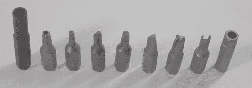
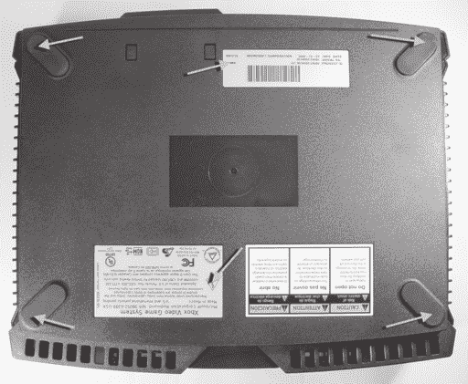
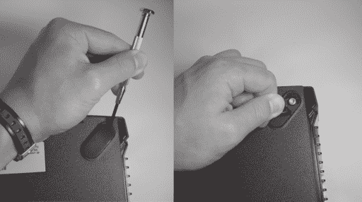
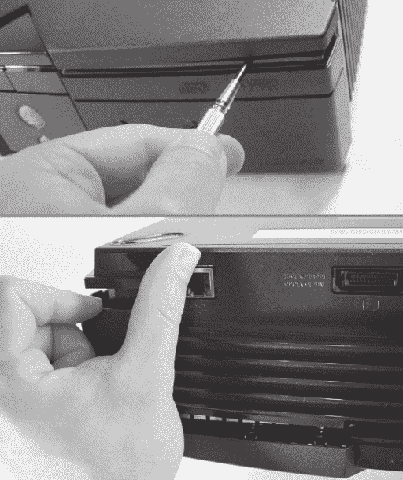
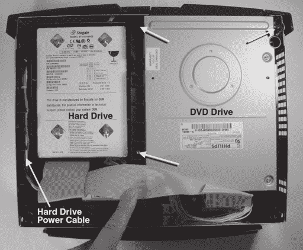
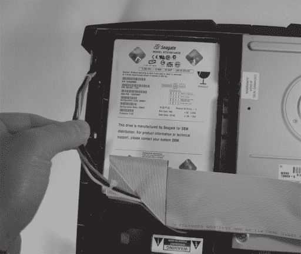
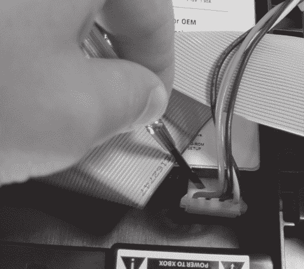

# 第一章：-

作废保修

## **行业工具**

由于一些项目需要复杂的工具，硬件破解可能一开始看起来令人畏惧。幸运的是，大多数基本项目只需少量投资工具，相当于一到两款视频游戏的价格。附录 A，“如何获取设备”，包含了一些建议的入门工具和订购这些工具的说明。

本章将讨论您进行严肃硬件破解所需的基本工具，包括打开工具、连接和拆卸电子组件、诊断和探查电路以及设计电路板。在这些工具中，前两种优质版本可以以相当合理的价格购买。诊断和测试工具，如示波器和逻辑分析仪，价值连城，但您会发现这些工具非常沉重，它们将是一笔巨大的投资。至于电路板设计工具，一些最好的工具可以以令人惊讶的实惠价格获得。

本章将以逐步的图文教程结束，介绍如何打开 Xbox。更有经验的硬件破解者可以跳过接下来的几章。

### **打开工具**

破解任何事物的第一步是取下盖子。大多数电子产品只需一套十字和一字螺丝刀就可以打开，但最有趣的盒子将需要一套特殊的安全位。

**图 1-1:** 安全位点的选择。从左到右：任天堂 4.5mm，安全六角，标准六角，离合器，罗伯逊或方形，三翼，扭矩，扳手，以及安全艾伦或六角。

图 1-1 展示了一些常见的安全位点的阵容。令人惊讶的是，安全位套装既实惠又容易获得。MCM 电子（www.mcmelectronics.com）销售一套 105 件的安全位套装（MCM 订单号 22-3495），价格不到二十美元，一套 32 件套装（MCM 订单号 22-1875），价格不到十美元。它们物有所值。任天堂安全位单独销售。您可以用几美元购买到用于任天堂 Gamecube 的大任天堂安全位（MCM 订单号 22-1150，“4.5mm 安全位”）。位的小版本（MCM 订单号 22-1145，“3.8mm 安全位”）也用于较老的任天堂系统和它们的游戏卡带。

Xbox 使用标准六角（六角星）T10、T15 和 T20 尺寸的位。这些位相当常见，可以在 Home Depot 等五金店购买。您还可能发现一个磁性的延长位夹手很方便，可以用来接触到 Xbox 中硬盘和 DVD 驱动器周围的几个狭小空间。

拆卸设备盖子时不要使用过大的力量。如果你认为你已经取下了所有的螺丝，但盖子仍然卡住，最可能的情况是你遗漏了一个螺丝，或者你需要按下一些摩擦锁卡扣。此外，许多时候螺丝隐藏在设备底部的橡胶脚垫下，或者在一个标签下面。要找到被标签遮挡的螺丝，请用力摩擦标签的表面。你会在有螺丝的地方感觉到一个软点。（打破这样的标签以访问螺丝会立即使设备的保修失效，但不必担心：大多数设备都是设计用来维修的，所以简单地移除盖子很少会造成任何损坏。）

有时，你会遇到一种顽固的组装件，它拒绝分开。如果盖子或面板在边缘处弯曲打开，或者看起来有些自由移动，那么可能有一个某种类型的摩擦锁固定着盖子。摩擦锁通常是卡扣和槽结构，设计得使得插入卡扣比取出它容易得多。在这种情况下，通过观察外壳似乎卡住的地方找到卡扣，然后用一把小平口螺丝刀轻轻推压卡扣，同时轻轻向上拉外壳。如果有多个这样的卡扣，插入一个楔子，比如另一把螺丝刀或一个回形针，以防止在打开其他卡扣时卡扣重新锁定。

如果你施加了坚定的压力，盖子或面板仍然几乎不动，它可能也用粘合剂固定，甚至可能焊接关闭。例如，“墙式电源适配器”（你直接插入墙插座的方形黑色盒子）通常就是这样密封的。拆解这样的设备可能意味着你永远无法将其重新组装成原来的形状。

### **安装和拆卸组件的工具**

电子组件通过*焊接*固定在板上。焊接时，一种称为焊料的低熔点合金被加热并流动到要连接的金属周围。焊料和金属形成局部合金。一旦接头冷却，组件就电学和机械地连接在一起。

焊接的基本工具包括烙铁、焊料、助焊剂和吸锡线。（对于涉及细间距组件或小零件的工作，一对细尖镊子也非常有用。）烙铁是一种手持工具，由加热元件和尖端组成；尖端用于通过传导或直接接触熔化焊料合金，而其他工具则使用热气体或强烈的红外辐射。所需烙铁尖端的类型取决于具体情况。例如，扁平的“凿形”或“圆锥形凿形”尖端在焊接大多数小型表面贴装组件时表现更好。

焊锡铁也有很多不同的等级。最便宜的焊锡铁大约十美元，带有大而笨重的尖端，没有温度控制；它们只能加热到尽可能高的温度。更好的焊锡铁价格更高，并配备一个传感器，可以主动调节尖端温度。温度调节使工具的动作更加一致，并延长尖端的使用寿命。更好的焊锡铁还提供更广泛的尖端选择，可能包括非常细小的尖端，适合用于今天大多数电子产品中发现的微小组件。对于轻度使用，一把质量好的直接插拔焊锡铁和良好的尖端就足够了。然而，如果你计划制作电路板并真正深入硬件黑客领域，投资一个高质量的温度控制焊锡铁，如 Weller WTCPT 或 Weller WES50，价值一百美元是非常值得的。

焊锡种类繁多。对于大多数用途，一种无清洁剂或可水清洁的焊剂芯的共晶 Pb-Sn 合金焊锡线就足够了。共晶合金是理想的选择，因为它们可以直接从液态转变为均匀的固态。Kester 是焊锡的主要制造商；他们的标准焊剂芯线焊锡，245 号和 331 号配方，都相当不错。245 号配方使用无清洁剂焊剂，但如果你愿意，可以用一些异丙醇和棉签去除残留物。331 号配方具有比 245 号更广泛适用材料的焊剂芯。然而，使用 331 号焊锡后，你需要尽快用水清洗电路板，否则焊剂残留物会变得粘稠，并可能干扰电路操作。许多分销商销售 Kester 焊锡；例如，Kester 24-6337-8802（25 号线的 1 磅卷装 245 号焊锡线）是 DigiKey（www.digikey.com）的零件号 KE1410-ND。大多数 Radio Shack 销售的焊锡也相当适合焊接，尽管他们的焊锡往往会留下粘稠的黑色残留物，需要用有机溶剂进行清洁。

焊锡也可以是膏状，其中包含悬浮在助焊剂矩阵中的微小焊锡球。当连接细间距表面贴装组件时，焊锡膏非常有用。（更多信息请参阅附录 B，“焊接技术”。）

如果焊点难以形成，焊剂就是万能的。始终备有一些焊剂。当焊点无法正确形成时，通常在焊点直接滴上一小滴焊剂就可以解决问题。焊剂也有各种形式的膏状和液体，每种都需要不同的清洁方法。一种方便的焊剂应用解决方案是焊剂笔，例如 Kester 83-1000-0951，一种 951 无清洁焊剂笔。您可以从 Digi-Key 购买这种焊剂笔，零件号为 KE1804-ND，只需几美元。Radio Shack 还出售一种装在管子里的焊剂膏，但他们的膏状物很脏，需要清洁。最后，脱焊线对于清理可能犯的任何焊接错误或混乱非常有用。脱焊线是一种细铜线编织物，通常带有干焊剂。使用时，将其放在烙铁和您想要清理的焊点之间；一旦编织线变热，焊点上的多余焊料就会吸进脱焊线的毛细管中。尽管编织线可能已经预先涂有焊剂，但在使用前在编织线上滴上一滴焊剂仍然有助于这个过程。Chemtronics 生产了一系列优质的脱焊线；一个例子是 Chemtronics 60-3-5“无清洁焊料吸管”（Digi-Key 零件号 60-3-5-ND）。

我在第二章的开头讨论了基本的焊接技术，在那里您将学习如何在 Xbox 的前面板上安装蓝色 LED。

### **测试和诊断工具**

电子测试设备的形式与电子产品的种类一样多。对于初学者来说，基本“必备”工具是数字多用表。在过去的几年里，数字多用表（DMMs）的功能越来越强大，价格也越来越实惠；一个典型的单元可以测量电阻、电压、电流、电容、二极管极性和连续性，价格大约为五十美元。Radio Shack 和 Jameco（www.jameco.com）都提供了一系列合理的入门级多用表。（附录 A，“在哪里购买您的黑客工具”中有一些建议的入门级多用表。）

对于基本的修改和套件建设项目，数字多用表（DMMs）在检查短路连接以及检查电路在施加电源前后基本健康状况时非常有用。当您感觉可能已经弄错了焊点连接时，DMM 的连续性模式可能会有所帮助。在连续性模式下，当测试探针之间存在低电阻路径时，DMM 会发出声音。因此，连续性功能对于验证焊点的完整性以及检查相邻连接的短路都很有用。您不应使用连续性模式来检查电源短路，因为一些电路板在电源和地之间可能会有足够低的电阻（大约十欧姆）以触发连续性声音。因此，在向任何新修改或构建的电路板施加电源之前，使用电阻测量模式进行检查并确保电源线上没有死短路（零欧姆的电阻）。

对于逆向工程和更高级的项目，你需要的基本工具是一个示波器和有时还需要一个逻辑分析仪。示波器对于捕捉电波形的详细形状非常有用。人们可以用示波器诊断时序、噪声和干扰问题。

示波器的基本定义特征是它可以同时显示的通道或波形数量，以及它的最大电气带宽。高质量的示波器通常有四个通道和超过 500 MHz 的带宽；折扣或二手示波器通常只有两个通道，可用带宽在 20 MHz 到 100 MHz 之间。所有示波器的首要限制是它们只能显示电波形的一个短段。

逻辑分析仪对于捕捉大量数字数据非常有用。它们在捕捉波形形状的能力和广泛的数据分析和记录能力之间进行权衡。逻辑分析仪对于诊断复杂的数字总线和电路非常有用。逻辑分析仪的基本定义特征是它可以采样的数字通道数量、最大采样速率和最大采样深度。一个典型的现代逻辑分析仪可能有几十个通道，采样速率在几百兆赫兹，采样深度为几兆字节。逻辑分析仪中发现的其它特性包括可编程触发算法和检测毛刺或短脉冲的能力。

不幸的是，新示波器或逻辑分析仪的平均价格在几千到几万美元之间。好消息是，大多数项目不需要最新的测试技术，因此你可以使用二手设备。Swapfests 是购买便宜旧示波器或分析仪的好地方；eBay 也时不时有一些不错的交易。如果你必须在购买示波器和逻辑分析仪之间做出选择，我建议先购买示波器；逻辑分析仪远不如示波器灵活，而且通常更贵。示波器可以诱导捕捉一定量的逻辑数据，而逻辑分析仪永远不能用来测量模拟波形。此外，使用 FPGA 和定制板构建自己的家用逻辑分析仪比构建同等质量的示波器要容易得多。家用逻辑分析仪可以相对便宜地构建以在高性能、高速应用中工作。（第八章描述了我是如何构建一个家用逻辑分析仪来监听 Xbox 中一个关键高速总线的。）

在紧急情况下，可以用大约五十美元的 Radio Shack 零件构建一个非常简单的数字迹线捕获设备。有一次，我需要捕获 PS/2 键盘端口上的数据，但我没有测试设备，我需要立即捕获数据。一个带有几个条形图 LED 的面包板，这些 LED 连接到一组 8 位寄存器（74HCT574），并通过移位数据连接，这解决了问题——所有这些组件都是在 Radio Shack 购买的。实际设计相当简单，但由于其用途非常有限，我将省略细节。重点是您可以自己构建用于捕获数字数据的设备——在花费几千美元购买逻辑分析仪之前，这是一个值得考虑的事情。

### **设计工具**

任何黑客收藏中最后需要的一组工具是一套用于 PC 板和 FPGA 的电子设计工具。PC 板和 FPGA 设计的内容在附录中有讨论，但在这里值得提一下，这些工具的高质量版本几乎可以免费获得。因此，一个人可以用不到 Xbox 的成本设计并构建一个完整的电路板，包括复杂的可重新配置的硬件组件——这还包括设计和构建工具的成本。

以前，PC 板设计是一个非常昂贵的提议；工具可能需要花费数千美元，而简单的板制造运行可能需要花费几百美元。如今，一个新手可以用不到七十美元的总价制作一个简单的板。对于 PC 板设计工具，Altium，以前称为 Protel，销售一款名为 CircuitMaker2000 的工具。虽然我并没有广泛使用 CircuitMaker2000，但我的第一印象是它非常类似于 Altium 现在已停产的 Protel 99SE。您可以从 http://www.circuitmaker.com 下载免费的 30 天试用版或他们的免费学生版（有限制），这对于第一个设计项目来说非常完美。一旦您使用免费工具设计出您的第一块板，您可以使用 Sierra Proto Express（http://www.sierraprotoexpress.com）等供应商进行制造，每块板大约 30 美元（截至本文撰写时，最低订单为两块板）。正如您所看到的，价格不再是严重的障碍，我鼓励您尝试使用您自己的定制印刷电路板构建一个或两个项目。

## **静电：电路杀手**

静电，也称为静电放电（ESD），是集成电路的噩梦。现代集成电路对 ESD 特别敏感；只需几伏电压就能摧毁一个裸露的晶体管。由于你只有在百伏或千伏范围内才能感觉到静电放电，因此你可能会在不自知的情况下摧毁这些设备。

好消息是，大多数芯片都采用特殊结构来帮助它们更耐静电放电。尽管如此，最好还是不要主动参与测试它们。为了中和你身上的静电，在触摸电路板或芯片之前，总是要触摸一个接地金属 ic 物体。正确连接到家用电源插座上的计算机外壳上的裸金属是一个好的起点。

穿戴几乎在任何电脑店都能买到的防静电手腕带，可以最大限度地降低因静电放电而损坏 Xbox 的风险。为了有效，手腕带必须连接到一个接地物体上。

如果你喜欢冒险，在未铺设地毯的混凝土地板上赤脚工作也可以让你接地。裸露的混凝土地板出奇地导电，以至于如果你长时间接触不正确连接的插座中的电子设备，可能会受到电击或烧伤。亚麻地板和硬木地板也可以作为有效的接地点，具体取决于地板上使用的瓷砖或蜡的类型。可以应用特殊的导电蜡或喷雾，以确保地板具有足够的导电性。

FPGAs — 场可编程门阵列 — 是经济实惠的硅原型设计解决方案。FPGA 由大量门和存储元件组成，具有可编程互连。因此，FPGAs 可以实现各种数字设备，仅限于 FPGA 的门和线容量。较大的 FPGA，容量可达数百万门，可以包含整个系统，包括微处理器和外设。FPGAs 也非常经济实惠：一个拥有 10 万个门的 Xilinx Spartan II FPGA 在单件购买时大约需要 20 美元。而且更好的是，你可以免费获得 Xilinx FPGAs 的无限制设计和综合环境！Xilinx 有一个名为“ISE WebPack”的免费产品，可以从他们的网站（www.xilinx.com）获取，包括 Verilog 和 VHDL 综合、HDL 测试平台生成和电源分析软件等功能。Verilog 是一种类似于 C 的硬件设计语言；可以将其视为严格类型化、多线程的 C。这对希望涉足硬件的软件黑客来说是个好消息。甚至还有开源硬件设计社区，如 www.opencores.org，你可以免费下载微处理器和其他有趣数字组件的代码。

## **拆解 Xbox**

现在我们已经讨论了一些你需要用于破解的工具，让我们来实际破解一下。破解 Xbox 的第一步是打开盒子。以下是你需要用来取下盖子的工具：

+   T10 和 T20 六角星形螺丝刀位

+   用于螺丝刀的柄

+   防静电安全装备（见“静电：电路杀手”）

+   小型平头螺丝刀（有帮助，但不是必需品）

### 注意

在你开始拆卸 Xbox 之前，请记住以下几点：首先，拆卸东西时总会有一些永久损坏的风险，拆卸 Xbox 将使你的保修失效。其次，在继续之前，务必阅读整个部分。第三，享受乐趣。

### 第一步：安全第一

**拔掉 Xbox 的电源插头。如果 Xbox 未拔掉电源插头，你可能会暴露在危险、甚至致命的电压下。**

### 第二步：拆卸外壳螺丝

将 Xbox 翻转过来，检查底部。有六个螺丝将外壳的上半部和下半部固定在一起，它们都隐藏在标签或橡胶脚垫下面。图 1-2 展示了所有螺丝的位置。

橡胶脚垫用强力粘合剂粘贴在 Xbox 上。移除脚垫通常需要一字螺丝刀的一点点帮助。图 1-3 展示了这一过程。一旦你撬起橡胶脚垫的一边，尽可能均匀地将其撕下，以保留脚垫上的粘合剂背衬。如果你小心操作，你可以在稍后重新安装脚垫，尽管经过几次拆卸循环后，粘合剂会失去粘性。作为替代，你可以在任何五金店购买橡胶脚垫，并在你在光滑或易刮伤的表面上使用 Xbox 时将其安装上。

使用 T20 尺寸的 Torx 螺丝刀拆卸橡胶脚垫下的四个螺丝。螺丝相当长，但螺纹较短，所以拆卸应该很快。

最后两个螺丝隐藏在序列号标签和产品认证标签下面。图 1-4 展示了这些螺丝的位置。

**图 1-2**：Xbox 外壳螺丝的位置。这是 Xbox 底部的视图。

**图 1-3**：使用小一字螺丝刀撬起 Xbox 橡胶脚垫的一边，然后小心地将其撕下。

为了找到它们，用手指在螺丝应该的大致区域上用力摩擦。标签会在螺丝孔上略微凹陷。用螺丝刀的尖端刺穿标签，并滑动或旋转螺丝刀，直到它卡在螺丝孔中，然后继续拆卸螺丝。如果你在意标签的美观完整性，在拆卸螺丝时按住标签，否则标签可能会被撕下或撕裂。

**图 1-4**：被序列号和产品认证标签隐藏的螺丝位置。

### 提示

**请准备一个小托盘或塑料袋来存放你的螺丝，以免丢失。固定 Xbox 的螺丝相当独特，你可能在当地的五金店难以找到合适的替代品。**

### 第三步：拆卸顶部盖板

到目前为止，你应该已经卸下了六个相同的长螺丝。将 Xbox 翻转过来，用双手的掌心轻轻握住盒子两侧，并尝试轻轻摇晃以取下盖子。如果盖子不能通过这种方法取下，你可能需要用手指从后面“撬动”机箱来“开始”盖子。在某些罕见情况下，你也可能需要从前面用螺丝刀撬动，但当你这样做时一定要小心和温柔。图 1-5 展示了你可以用来帮助拆卸机箱的一些点。

不要强行取下机箱盖。如果上述撬动方法对机箱盖没有进展，自本书出版以来可能已经添加了额外的螺丝。尝试通过触摸 Xbox 背面的标签来定位这个螺丝。

**图 1-5**：一些可以撬开顽固盖子的地方。

### **步骤 4：移动硬盘驱动器**

现在你已经进入内部，你应该能看到两个安装在黑色塑料载体上的硬盘驱动器。为了访问主板，你需要移动（不一定拆除）硬盘驱动器。你不需要断开驱动器线缆，但你需要卸下硬盘载体。

三个 T10 Torx 螺丝固定着载体。图 1-6 展示了这些螺丝的位置。其中一个位于机箱后部的灰色 IDE 扁平电缆下方，另外两个位于机箱前部驱动器表面下方约一英寸处。你可能需要手电筒或直接的上层照明来看到这些凹槽螺丝。

如果你的螺丝刀没有磁化位持器，凹槽螺丝可能会有些挑战，因为位会在你将其定位在螺丝上时滑出。位也足够小，可以进入螺丝和塑料载体之间的空间。即使你认为你已经卸下了螺丝，但硬盘载体仍然很紧，你需要再次检查以确保它们实际上已经卸下。你应该能够稍微抬起载体而不需要施加过多力量。

**图 1-6**：三个硬盘载体螺丝的位置。注意，为了拍照，灰色 IDE 扁平电缆被抬起了。左侧的盒子是硬盘，右侧的盒子是 DVD 驱动器。

一旦你卸下了螺丝，你需要松开硬盘电源线，否则它会干扰硬盘载体的拆卸。电源线是连接到硬盘外部的黑色、黄色和红色线缆束。硬盘是图 1-6 中左侧的设备。它被固定在载体边缘的凹槽中。轻轻地拉出线缆，使其在线缆上留出几英寸的松弛。图 1-7 展示了完成后的松弛程度。

一旦电缆松开，您就可以将硬盘从其存储位置取出。将硬盘向上抬起，并将其放在 DVD 驱动器上。用双手将 DVD 和硬盘从机箱中取出，并将它们向外折叠，如图 1-8 所示，使它们悬挂在侧面。连接驱动器的电缆应该可以轻松折叠，没有阻力。（请注意从 DVD 驱动器后面来的黄色电缆；如果不小心，它很容易从插座中拔出。）

您现在可以清楚地看到 Xbox 主板和电源，而无需断开任何驱动器。这种布局在测试任何硬件修改后的 Xbox 时将非常有优势。

**图 1-7**：从固定槽中释放硬盘电缆。一旦释放，您应该在电缆上留有大约几英寸的松弛。

**图 1-8**：光盘驱动器的位置，保留电气连接以进行测试和实验。

**始终注意电源；如果接触它，可能会** **伤害或杀死你**。记住，只要 Xbox 连接上电源，它就是“活”的，即使 Xbox 已经关闭。此外，请注意硬盘驱动器和 DVD 驱动器的底部在 Xbox 内部作为空气通道有次要用途。长时间运行 Xbox 时驱动器在侧面关闭可能会导致 Xbox 过热。同样，请注意 CPU 和 GPU 上的大型铝制散热片。当 Xbox 运行时，它们可能会变得非常热——可能热到足以烧伤你。

在下一章的项目（更换 Xbox 前面板上的 LED）中，您不需要断开硬盘驱动器，尽管这样做更好。这可以防止您在操作 Xbox 机箱时对电缆施加不必要的压力。

### **步骤 5：移除光盘驱动器（可选）**

在许多情况下，您会发现完全移除光盘驱动器对您的硬件来说更方便、更安全。

要这样做，首先从 Xbox 主板上拔下灰色的 IDE 串行电缆。接下来，从主板上拔下连接到 DVD 驱动器的黄色离散线电缆。这条黄色电缆为 DVD 提供电源，并将 DVD 驱动器托盘的状态信息传递给主板。不要猛拉黄色离散线电缆中的任何单根线，否则可能会从电缆头中拔出线。移除电缆的首选方法是握住白色连接器并拉；然而，如果您的手指不够小，无法进入狭小的空间，您可以握住整束电线并轻轻拉出连接器。将 DVD 驱动器放在一边。

接下来，拔掉硬盘的电源连接器。你会发现连接器在硬盘上非常牢固地固定着。如果你直接拉扯连接器，当连接器从驱动器上脱落时，你可能会因为外壳的锐利边缘而受伤。为了避免受伤，使用一把小型的平头螺丝刀轻轻撬开连接器，如图 1-9 所示。

现在，你可以完全移除磁盘驱动器组件。灰色 IDE 扁平电缆仍然跨越着独立的驱动器单元；如果你愿意，可以移除它们，但记住其方向，以便稍后可以将驱动器重新连接到 Xbox。

### **重新组装 Xbox**

现在你已经拆开了 Xbox，跳到下一节，看看你可以尝试的一些有趣的项目。完成之后，阅读本节了解如何重新组装你的 Xbox 的注意事项。

**图 1-9**：使用平头螺丝刀撬开硬盘电源连接器。

在将任何东西连接到 Xbox 之前，将其倒置并轻轻摇晃以确保没有松动的螺丝或你可能不小心掉入 Xbox 的部件。松动的螺丝将意味着你的游戏机寿命终结，并且可能存在火灾隐患，所以如果你有任何疑问，这是一个值得检查的步骤。

重新组装你的 Xbox 的第一步是重新连接磁盘驱动器。如果你遵循了上一节中的程序，你的 DVD 驱动器和硬盘驱动器应该已经通过灰色 IDE 扁平电缆连接好了。如果没有，将电缆上褶皱最少的一端连接到硬盘上，然后将电缆的中间连接器连接到 DVD 驱动器上。电缆只能按一个方向连接；注意连接器上的凸起和驱动器连接器上的凹槽位置。

将灰色 IDE 扁平电缆剩余的自由端插入 Xbox 的主板。电缆只能按一个方向插入主板；注意 IDE 插头中间的凸起和主板插座上的凹槽。现在，将黄色 DVD 电缆连接到 Xbox 主板。这条电缆也只能按一个方向插入主板连接器，电缆上也有凸起，主板插座上也有相应的凹槽。现在，将 DVD 驱动器放入 Xbox 中。通过观察 Xbox 标志的 DVD 驱动器托盘相对于外壳边缘的位置来检查它是否平整和水平。你可能需要尝试将驱动器放置几次，直到它放置得恰到好处。如果你对各个部件的方向感到困惑，可以使用灰色 IDE 扁平电缆的褶皱来帮助引导你。

你几乎完成了。将硬盘驱动器放入 DVD 驱动器旁边的位置。再次提醒，这个驱动器可能需要稍微调整一下，才能使其平稳地放置到位。驱动器应该与 DVD 驱动器保持水平，并与 Xbox 外壳周围的金属 EMI 辐射屏蔽边缘齐平。将硬盘驱动器的电源线穿过驱动器托盘上的固定凹槽，并将其插入硬盘。您需要在连接器上施加相当大的力量以创建牢固的连接；当连接器完全接合时，您应该会感觉到轻微的“咔哒”声。最后，将灰色 IDE 扁平电缆穿过驱动器支架上的原始固定钩。

到目前为止，插上 Xbox、连接到电视并检查 Xbox 是否能正常启动是个好主意。您可以在不盖盖子的情况下无限期地运行 Xbox，因为所有由驱动器支架底部和 DVD 驱动器形成的冷却通道都已就位。如果驱动器没有正确连接到 Xbox，控制台仍然可以启动，但会显示一条消息，说明您的控制台需要服务。如果出现此消息，请仔细检查您的连接。

现在是时候将驱动器固定到位了。此时，您应该有九个螺丝：三个短的 T10 驱动器螺丝用于驱动器支架，以及六个长的 T20 驱动器螺丝用于外壳盖。如果您丢失了几颗螺丝，或者多了几颗，请不要慌张。即使缺少一两颗螺丝，Xbox 仍然可以保持在一起。按照拆卸它们的相反顺序安装螺丝和外壳盖。（如果您需要提醒它们的位置，请参考本节前面的图片。）

一旦安装好外壳盖，您就可以再次使用 Xbox 了！
