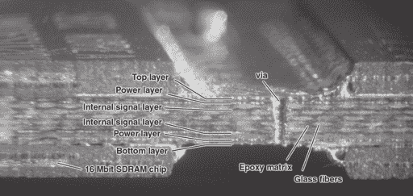
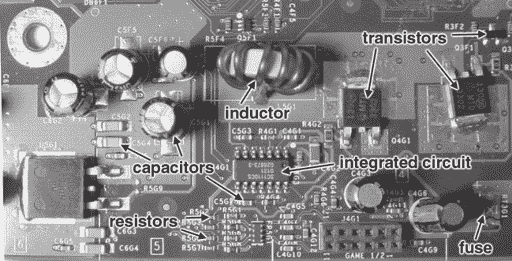
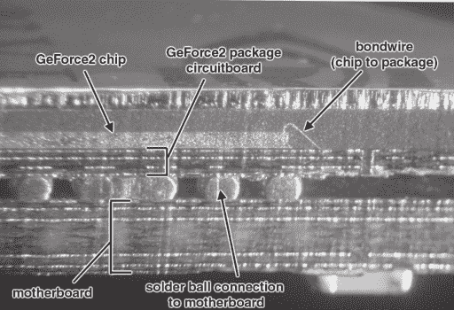
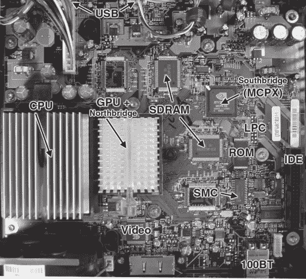
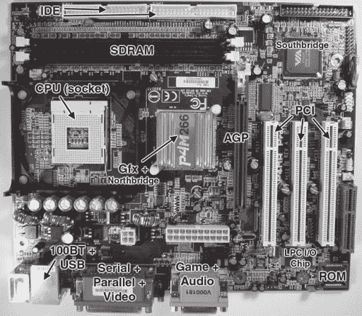

# 第二章 -

在盒子里思考

反向工程可以被认为是一项极具挑战性但同样非常有益的游戏。要想获胜，你需要一点技巧和一点运气。就像任何游戏一样，为了提高你的技能，你只需要不断练习，不断练习，不断练习。

作为黑客技能构建的第一步是培养对材料的直觉。在硬件方面，了解事物的一个好方法是取下所有设备的盖子，试图弄清楚所有组件是什么，以及它们可能做什么。从零件供应商如 Digi-Key、Jameco 或 Newark Electronics 订购纸质目录，并在空闲时间翻阅页面也是有帮助的。起初，阅读零件目录可能感觉就像阅读字典一样，但随着你看越来越多的电路板，你将逐渐发现一切都有意义。

反向工程师的下一个最有力的工具是模式匹配。所有硬件工程师都受到相同自然法则的约束，所有硬件工程师都使用相同类型的构建模块。工程师们还喜欢模块化和重用现有设计。因此，单个设计模式可以在许多设计中找到。识别设计模式将使你能够在不识别单个零件编号的情况下确定电路的功能。同样，即使没有正式的电气工程培训，也可以在反向工程中走得很远。

反向工程师的最终工具是实验。当直觉和模式匹配无法揭示电路的秘密时，就必须求助于探测和扰动系统，并试图根据观察到的响应推断功能。虽然实验可能会导致硬件损坏，但可以安慰自己，大多数消费级硬件在设计时都是为了满足制造要求而可以进行探测和测试的。此外，在 Xbox 的情况下，可以稍微安慰自己，因为新的 Xbox 相对便宜。提前购买两个盒子，将其中一个作为“牺牲品”使用，有助于消除可能对在硬件上进行激进实验的心理障碍。

本章将向您介绍反向工程的基础知识，重点关注基本技术，如通过阅读电路板来培养直觉，以及一些关于模式匹配和识别基本设计模式等中级技术的介绍。

## 阅读电路板

当你取下典型电子设备的盖子时，首先看到的是电路板。通常呈绿色或棕色，这种多层铜、玻璃纤维和环氧树脂三明治包含在其走线中的精确原理图网络表。换句话说，通过跟随走线，可以确定每个组件是如何连接的。组件的放置和走线的布局也包含可以揭示设计师思维过程的线索。

### 电路板基础知识

一个典型的电路板由几层图案化的铜层组成，这些铜层被涂有环氧树脂的薄层玻璃纤维隔开。原始电路板的颜色是白色或浅棕色，带有铜迹；然而，几乎所有电路板都被涂上一层薄薄的聚合物，称为*阻焊层*，这使电路板呈现出熟悉的绿色。熔融的焊料不会粘附在阻焊层上，因此在生产过程中，多余的焊料不会粘附在板上造成短路。阻焊层有供组件连接的开口。这些开口通常呈现出银色，这是因为涂有薄层锡或焊料的镀层，这可以防止铜氧化并增强可焊性。

在阻焊层之上通常有一层白色字母，被称为*丝网印刷层*。电路板上的每个组件在丝网印刷层上都有一个轮廓和唯一的标识符。这个标识符使得人们能够快速地将电路板上的组件与原理图上的组件关联起来。你可以使用这个标识符来帮助根据组件命名方案猜测组件的功能。表 2-1 总结了 Xbox 中使用的组件命名方案。

### 小贴士

Xbox 主板在丝网印刷层沿边缘印有一个方便的坐标系。在组件面，坐标从 A 到 G 沿侧面，从 1 到 8 沿顶部和底部。板的反面沿侧面有 M 到 V 的坐标。请注意，字母 I、O、Q 和 S 被跳过，因为它们可能与数字 0、1 和 5 混淆。Xbox 主板上的组件标识符使用这个坐标系进行编码；因此，J7D1，即 LPC 调试端口，可以在顶部坐标 7D 处找到。这本书将经常使用这个坐标系以及组件标识符来指代特定的组件。

通过称为*过孔*的铜填充孔连接布线层。由于电路板的成本随着层数的增加而增长，大多数消费电子产品都设计成将层数保持在最低。收音机和音频放大器通常使用单面板，而最新的 PC 主板可能有六层或八层。Xbox 主板有四层。最上面的两层专门用于在芯片之间传输信息，而内层的两层专门用于供电。Xbox 主板乍一看会显得不透明，因为内层的供电层基本上是铜的实心板。对于逆向工程来说，好消息是我们可以通过简单的视觉检查追踪 Xbox 主板上的每个连接，因为所有信号层都在不透明的供电层之外。Xbox 的设计与将两个或四个信号层埋在供电层内的主板形成对比。埋藏的信号层可能会使信号追踪变得困难。（请注意，将信号埋在供电层内的决定通常不是由安全性驱动的，而是由电信号如何在电路板层之间交互的物理特性决定的。）

| 设计符 | 组件类型 |
| --- | --- |
| C | 电容 |
| R | 电阻 |
| U | 集成电路或晶体管 |
| L | 电感器 |
| RP | 电阻器组 |
| Q | 晶体管 |
| CR | 二极管 |
| J | 连接器或跳线 |
| RT | 可重置保险丝 |
| Y | 晶体 |

**表 2-1**：Xbox 组件命名方案。

跟踪信号相当容易。从源组件与板子的连接开始，跟随铜迹。如果轨迹与一个圆相交，那么信号很可能在板的另一侧继续。如果一个轨迹结束且没有连接到板的另一侧，那么轨迹很可能连接到其中一个电源平面。

**图 2-1**：典型电路板的横截面。

### 尝试一下

尝试在 Xbox 主板上追踪一些信号。在 Xbox 主板上，看看连接器 J8C1，位于 8C 区域的 40 针 IDE 连接器。IDE 连接器几乎所有的信号都通过一些电阻器组连接到主板上的一个芯片 MCPX。你能对那个芯片得出什么结论？注意，从 IDE 连接器出来的某些轨迹意味着来回移动。这是一种尝试确保所有电线长度相同的技巧。参见“为什么电路板轨迹到处都是蜿蜒曲折？”的侧边栏以获取更多解释。

### 组件

现在你已经有点经验追踪信号了，是时候学习一些基本元件的外观了。元件被分类为无源和有源。粗略地说，无源元件不能放大信号，所以它们通常只有两个引脚。有时多个无源元件会被封装在一起，所以一个无源元件的封装将会有多个引脚。无源元件包括电容器、电阻和电感。Xbox 主板上的最常见无源元件是电容器。电容器以电荷的形式储存能量；在 Xbox 中，它们主要用于平滑 CMOS 数字逻辑开关产生的局部电源波动，并抑制高频噪声。

**图 2-2**：Xbox 中的典型无源元件。

## 为什么电路板上的走线到处蜿蜒？

在查看了几块电路板之后，你可能会开始注意到电路板上的走线往往四处蜿蜒，有时在连接到目的地之前来回几次。当一条直线走线就能解决问题时，这似乎是多余的。然而，你很少会在电路板上找到一个由设计师随意放置的结构。实际上，大多数高端电子设备中信号的传播速度，大约是光速的四分之一，与信号到达目的地的所需时间相比是慢的。例如，在一个 1 GHz 处理器（1 GHz 的每个时钟周期是一个十亿分之一秒的持续时间，即一纳秒）的一个时钟周期内，信号在电路板上只能传播 3 英寸。因此，如果走线长度差异很大，从同一芯片出发的两个信号将到达目的地的时间会有很大差异。为了解决这个问题，设计者会在较短的走线上添加额外的弯曲，使得走线的有效长度与较长的走线相同。

在 Xbox 主板上发现的其它大型无源元件包括电感和电阻。Xbox 主板上发现的粗线绕制的*环形*（甜甜圈形状）电感都是电源子系统的组成部分。电感以磁通的形式储存能量。电感的电气特性与电容互补。在电感与电容之间加入晶体管开关的组合被用来构建非常高效的电源调节器。Xbox 主板上的大多数电阻要么用于吸收信号轨迹终端的过剩能量，要么用于将电线偏置到特定的逻辑电平。

你可以通过两种方式在 Xbox 主板上识别被动组件。第一种是通过封装的形状。由于被动元件的基本种类很少，因此封装形状识别是可行的。图 2-2 展示了你可能在 Xbox 主板上看到的电容器、电感器和电阻器的图片。第二种方法是读取主板旁边组件的标签，并通过参考设计符推断组件的功能，以表 2-1 作为指南。

活性组件可以放大信号，并且有三个或更多引脚。最简单的活性组件是晶体管，有三个偶尔四个引脚（有时离散的“MOSFET”晶体管有一个明确的第四个“体”端子）。最复杂的活性组件是集成电路，如 CPU 和内存芯片，有数百甚至数千个引脚。集成电路有多种封装形式，有时连接隐藏在封装下面，就像球栅阵列（BGA）封装那样。Xbox 主板上的图形芯片 MCPX 和 CPU 使用 BGA 封装。图 2-3 显示了 BGA 器件的横截面，揭示了下面的隐藏连接。

**图 2-3**：BGA 封装部件（GeForce2）在主板上的横截面视图。

## **这些电阻器和电容器在数字电路板上都起什么作用**？

你会在许多电路板上注意到的一个主题是电阻器和电容器的数量很多。电容器无处不在，因为它们有助于将噪声降至最低并稳定电源电压。它们是必需的，因为用于分配电源的铜平面有少量电阻和电感。当大量电流通过电源时，这些小的寄生参数可能会引起大问题。电容器的精确放置和选择被认为是一种有点像黑艺术的技巧。如果你在操作电路板时不小心碰掉了其中一个微小的、沙粒大小的电容器，你可能会设法不更换它就能解决问题。然而，考虑到这种类型的缺陷，你最可能遇到的问题是间歇性的可靠性问题。

虽然电容器无处不在，为所有组件提供局部能量存储，但电阻器则移除多余的能量。主板上的快速信号携带大量能量，如果能量没有被电阻器以受控的方式在接收端消耗，信号能量将反射回发射端并引起问题。这种现象与体育馆中的声音类似。当你在一个空荡荡的体育馆里说话时，会有回声。如果你说话太快，人们将无法理解你，因为回声会开始干扰你的说话。然而，如果你用泡沫覆盖体育馆的墙壁，回声将被泡沫吸收，你可以不受回声干扰地说话。

电阻就像您会放在墙上以吸收回声的吸音泡沫，这样电路就可以以高速相互通信。与大多数电容器不同，如果您在玩耍时不小心敲掉这些电阻之一，您将不得不更换它才能使电路正常工作。这些“终止电阻”通常封装在四个或八个一包，所以它们看起来几乎像小型集成电路。您可以通过它们的光滑、略微凸起、白色边框以及它们附近有“RP”参考设计符前缀来区分电阻组件。在追踪通过电阻组件的信号时，可以相当安全地假设信号是直线流动的，因此一侧的连接会直接穿过到另一侧的引脚。

识别特定集成电路的功能比识别无源器件的功能更具挑战性。功能相同的硅可以购买成各种包装，外观可能非常不同。在某些情况下，您可以通过观察设备连接到什么或其外观来猜测设备的功能，但最可靠的方法是从芯片上读取部件编号并在网上查找。（通常，部件会有某种标志或部件编号前缀来标识制造商，您可以通过访问制造商的网站来找到更多关于该设备的数据。）如果您不认识标志或部件编号前缀，以下列出的服务可以帮助您查找部件功能。

1. www.findchips.com 可以接受部件编号或部件编号的一部分，并搜索多个分销商的库存以找到匹配项。大多数常见部件都会在 FindChips 上显示，提供的链接通常会不仅包含部件的简短描述，还包括定价和订购信息。

2. www.google.com 索引了网络上的所有内容，部件编号也不例外。如果您在标志字母加上描述性术语（如“半导体”）进行查询，Google 还可以帮助您找到制造商的网站。在制造商的网站上，您可能需要找到隐藏在网站中的专用部件搜索引擎，或者访问半导体产品子页面来进行部件编号查找。公司网站首页上的搜索功能有时可以找到部件编号，但更常见的是它只索引无用的公司营销页面。

3. 如果上述服务都无法帮您找到所需部件，尝试去掉部件编号中的一些前缀和后缀。以我们的 M29F080A 为例，仅查询部件编号 29F080，就能将您带到多个制造商的网页上，这些制造商生产的部件在功能上与意法半导体（STMicroelectronics）的部件兼容。

**图 2-4**：典型 IC 部件编号的解剖图。该图是 Xbox 主板 U7D1 位置芯片的卡通图。

### 尝试一下

**让我们尝试查找一个 Xbox 部件编号。定位 Xbox 主板上的 U7D1。图 2-4 展示了你可能会找到的内容。部件编号通常是芯片上最长的数字，通常以一到两个字母开头。内存芯片和处理器在部件编号后也经常有一个速度等级或质量后缀。此外，几乎所有芯片都有一个*日期代码*。日期代码** **通常是格式为 YY-WW 的四位数字，其中 YY 是芯片制造的年份，WW 是工作周。在我们的例子中，我们的 M29F080A 部件是在 2001 年的第 41 周在新加坡制造的，并且有一个** **速度等级为 70N1。剩余的数字 5881K 是一个** **批号，其含义因制造商而异，但通常将芯片与特定的硅晶圆或硅晶圆批次的跟踪号在制造设施中联系起来。**

**“ST”标志表示该芯片的制造商是** **STMicroelectronics**，幸运的是，通过 Google 搜索或猜测，可以快速找到该** **制造商的网站，因为公司的网址很简单** www.st.com**。** **将部件编号 M29F080A 输入主页上的搜索字段，可以直接进入包含该部件详细数据表和描述的搜索结果** **——这是一个 8 兆位的统一块单电源 FLASH ROM。**

### 测试点

几乎所有消费电子产品的电路板都设计了结构，以加快在工厂中对成品板进行测试。这些“测试点”存在是为了应对制造缺陷的遗憾现实。Xbox 在测试点和制造缺陷方面也不例外。Xbox 主板的底部布满了数百个测试点——微小的银色圆圈——允许接触探头访问 Xbox 中几乎每一个有趣的信号。这些测试点对逆向工程师和希望修改硬件的人来说是一份受欢迎的礼物，因为它们提供了对可能需要显微镜和稳定手部操作的信号的轻松访问。

在制造线上，使用一种称为“钉床测试器”的设备一次性对所有测试点进行探测。这个名字很贴切，钉床测试器由数百个弹簧加载的“跳针”结构组成。将主板对准测试台并用机械冲头或真空夹具夹紧。同样，你可以利用测试点通过跳针对 Xbox 主板进行无焊点修改。你需要自己制作电路板（见附录），但结果将是一个只需拧紧螺丝即可安装的板子——*无需焊接！*

## Xbox 架构

在深入研究模式匹配示例之前，我们需要一个模式参考。让我们利用这个机会研究 Xbox 内部架构作为模式参考，并最终将 Xbox 架构与 PC 和另一款游戏机进行比较。

### 高级组织

Xbox 的 CPU 是一款运行在 733 MHz 的 Pentium-III 级处理器。CPU 上的“S-Spec”数字与移动赛扬的数字最为接近。CPU 通过标准的 P6 133 MHz 前端总线（FSB）连接到一个图形处理单元（GPU）和一个由 nVidia 称为 NV2A 的北桥组合芯片。它在 PC 上的最接近的相对者是 nVidia 的 nForce IGP 芯片。由于北桥逻辑和 GPU 集成在单个芯片中，CPU 和图形处理器可以共享一个共同的内存池。这被称为“统一内存架构”（UMA）。与传统分割视频/主内存架构相比，UMA 在构建成本上更低，因为它消除了专用的视频内存。然而，UMA 在某些情况下性能较低，因为它在主处理器和图形处理器之间引入了内存访问竞争。为了缓解一些这种竞争，系统内存经常被分成多个银行。例如，nForce IGP 将内存分成两个银行，这两个银行可以通过交换网络独立地由 GPU 和 CPU 访问。

**图 2-5**：Xbox 的高级架构视图。

**图 2-6**：带有主要组件标签的 Xbox 主板的照片。

GPU 通过一个称为 HyperTransport 的高速、窄总线连接到一个名为“MCPX”的厨房水槽芯片。MCPX 集成了南桥芯片以及几乎所有 Xbox 的外设，包括 USB 控制器、传统的引导 ROM 接口、杜比数字音频处理器、IDE 控制器、以太网控制器以及系统管理功能的接口。

Xbox 中所有主要模块的连接性如图 2-5 所示，图 2-6 展示了这些模块在实际 Xbox 主板上的位置。

### 功能细节

以下章节简要概述了构成 Xbox 架构的各个部分。我们特别关注理解如何逆向工程 Xbox 安全机制所需的细节。

#### CPU

CPU（中央处理单元）是传统计算机的计算核心。CPU 架构是一个值得单独成书的话题，因此我们只涵盖理解如何逆向工程 Xbox 所需的内容。特别是，我们将探讨如何控制 Xbox CPU。

CPU 读取存储在内存中的指令序列——程序——这些指令告诉 CPU 执行各种计算或基于可用数据进行决策。指令以称为*操作码*的数字形式存储在内存中。操作码以*操作数*作为参数。程序员在编写低级机器代码时使用字母表中的助记符，这样他们就不必记住数百个操作码数字。例如，一种字宽减法指令的操作码为 0010.1000（二进制）或 0x28（十六进制），助记符为“SUB”。所需的减法操作码取决于减数数据的源和宽度。跟踪所有操作码到操作数的规则是令人压倒性的，因此将助记符和操作数转换为指令编号的过程是通过一个称为*汇编器*的程序来完成的。同样，将指令编号转换回助记符的过程是通过反汇编器来完成的。值得注意的是，大多数程序不是用汇编语言编写的；通常使用高级语言，如 C。这些高级语言使用编译器转换为机器指令。将机器指令自动反编译回高级语言可能很困难，因为编译过程——特别是优化编译——丢弃了原始源代码中包含的大部分高级结构信息。

处理器通过一个*指令指针*(IP)跟踪正在执行的指令。在某些情况下，IP 也被称为*程序计数器*（PC）。IP 通常一次前进一个指令，除非遇到分支指令。分支指令给程序提供了一个机会，通过检查 CPU 内部的数据并根据检查结果跳转到新位置来做出决策。*理解指令指针的移动是逆向工程 Xbox 的核心部分*。能够操纵 IP 等同于控制 Xbox 能做什么和不能做什么。Xbox 软件架构中实施的安保措施试图保证 IP 始终只执行微软批准的代码，在运行之前总是通过密码学验证代码的真实性。

## 二进制和十六进制数

数字电路使用 1 和 0 来表示数字。这种二进制，“基数-2”的表示法反映了电气信号用于表示数字的方式：使用两个电压范围来定义一个逻辑状态或另一个状态。可以构建使用超过两个电压级别来表示信息的电气系统，但这会以功率和复杂性的代价为代价。例如，现代调制解调器使用多个电压级别和相位信息来在单个时间单位内表示多个数据位。

二进制中的数字组成和算术遵循我们熟悉的十进制（“基-10”）表示法相同的规则。在十进制中，0 用作占位符，以记住何时一个数字溢出。例如，比 9 多 1 的数字会导致溢出，因为没有比 9 大的单个数字。因此，数字 10 记录了最右边的十进制位置发生了一次溢出。同样，在二进制中，比 1 多 1 是 10，因为二进制中最大的单个数字是 1。

因此，在十进制中，一个四位十进制数 d[4]d[3]d[2]d[1] 的值可以分解为：

d[4] * 10³ + d[3] * 10² + d[2] * 10¹ + d[1] * 10⁰ = d[4] * 1000 + d[3] * 100 + d[2] * 10 + d[1] * 1

同样，一个四位二进制数 b[4]b[3]b[2]b[1] 可以分解为：

b[4] * 2³ + b[3] * 2² + b[2] * 2¹ + b[1] * 2⁰ = b[4] * 8 + b[3] * 4 + b[2] * 2 + b[1] * 1

例如，数字 1010 = 1*8 + 0*4 + 1*2 + 0*1 = 10 十进制。

直接跟踪二进制中的数字会很快变得繁琐；例如，要表示十进制 968，你需要十个二进制位。为了节省屏幕空间，二进制数被转换为八进制或十六进制。八进制格式，或“基-8”，在计算机的早期阶段很受欢迎，但现在已经变得很少见。十六进制，或“基-16”，是事实上的数字系统。十六进制中有 16 个数字，所以与十进制数字 10 到 15 对应的十六进制数字由字母 A 到 F 表示。表 2-2 总结了前 16 个正整数之间的二进制、十进制和十六进制转换。

为了区分十六进制数和十进制数，许多人使用 C 语言约定，其中 0x[number] 表示一个十六进制数，而 [number] 默认是一个十进制数。在 C 语言中没有类似的标准可以借鉴，因此有些人使用 Verilog 标准，[digits]’b[number]，其中 [digits] 是二进制数的位数。在一系列 1 和 0 后的“b”后缀，例如 1010.1100.1110b，也用来表示二进制数。注意如何使用“.”将二进制位分组为四位的集合；这有助于将二进制数心理转换为十六进制：0xACE。

| 二进制 | 十进制 | 十六进制 |  | 二进制 | 十进制 | 十六进制 |
| --- | --- | --- | --- | --- | --- | --- |
| 0000 | 0 | 0 |  | 1000 | 8 | 8 |
| 0001 | 1 | 1 |  | 1001 | 9 | 9 |
| 0010 | 2 | 2 |  | 1010 | 10 | A |
| 0011 | 3 | 3 |  | 1011 | 11 | B |
| 0100 | 4 | 4 |  | 1100 | 12 | C |
| 0101 | 5 | 5 |  | 1101 | 13 | D |
| 0110 | 6 | 6 |  | 1110 | 14 | E |
| 0111 | 7 | 7 |  | 1111 | 15 | F |

**表 2-2**：二进制、十进制和十六进制转换表。

CPU 的核心是一个称为寄存器文件的小型但非常快速的内存。每个处理器时钟周期，可以写入和读取多个数据到寄存器文件。来自寄存器文件的数据被送入一个称为算术逻辑单元（ALU）的执行单元。ALU 计算的功能由从内存中取出的指令控制。一旦数据被 ALU 处理，它既可以写回寄存器文件，也可以存储到内存中。

几乎每个现代 CPU 的一个重要性能特性是内存访问加速器，称为*缓存*。缓存是小型、快速的内存，存储 CPU 核心未来可能使用的数据和指令片段。缓存比寄存器文件慢，但比主内存快；同样，缓存存储的数据比寄存器文件多，但比主内存少。

需要注意的 Xbox CPU 缓存的一个重要特性是它是一个写回缓存。写回缓存允许 CPU 内部存储的数据副本与主内存中的数据不同步。这种时间差异可能会使仅通过观察外部内存流量来追踪 CPU 执行变得复杂。缓存内存还可以被安全例程利用，以隐藏中间计算结果，防止观察内存总线的人看到。

#### **北桥和南桥**

Northbridge 和 Southbridge 这两个术语是 PC 架构的行话。它们指的是几乎每个 PC 中都存在的两个基本支持芯片。北桥芯片将 CPU 连接到主内存以及任何高性能扩展总线，如 AGP 和 PCI。南桥芯片挂在北桥芯片上，包含典型 PC 中发现的全部额外外围设备——并行、串行、USB、鼠标、键盘、IDE 控制器、音频编解码器等。将 PC 架构分为这三个主要模块——CPU、北桥和南桥——使 PC 设计者能够混合搭配不同类型的内存架构与多样化的处理器和外围设备。

北桥和南桥芯片组之间的连接因芯片组而异。在 Xbox 的情况下，采用了一种高性能、窄并行总线，称为 HyperTransport，作为北桥和南桥芯片功能等效部分的连接。总线在每个方向上只有 8 位宽，但以 200 MHz 的频率运行，并且在每个时钟沿采样数据，因此每个方向的有效峰值传输率为 400 Mbytes/second。北桥芯片通过一个称为前端总线（FSB）的总线连接到 CPU。在 Xbox 的情况下，FSB 是一个 133 MHz 的 64 位总线，使用 AGTL+逻辑电平。

在逆向工程中，了解和理解芯片之间连接的类型至关重要，因为连接类型将决定拦截各个组件之间传输的数据有多困难。关于相对容易接入的总线——HyperTransport 总线——的细节将在第八章“逆向工程 Xbox 安全”中讨论。

在 Xbox 中，南桥芯片是由 nVidia 设计的，称为 MCPX；它是 nVidia nForce MCP 多媒体和通信处理器的衍生产品。北桥芯片也是由 nVidia 设计的，称为 NV2A GPU。北桥和南桥芯片都是由 TSMC（台湾半导体制造公司）制造的。NV2A 结合了 GPU（图形处理单元）和大多数北桥芯片中发现的传统内存和扩展总线控制器。如前所述，将图形处理器和北桥结合在一起允许系统设计者将图形内存合并到主内存中，虽然会付出一些性能代价。

#### **RAM**

Xbox 主板使用 64 MB 的 DDR SDRAM 作为主内存。DDR SDRAM 代表双数据速率同步动态随机存取存储器。通过结合同步和 DDR 技术，Xbox 主内存的总带宽达到 6.4 吉字节/秒。RAM 基本上是一个由 CPU 索引的信息表。RAM 中的每个位置都有一个唯一的索引号，称为其地址，正如“随机访问”这个名字所暗示的，在 RAM 中对数据访问的顺序没有限制。¹

“动态”一词用于需要不断刷新以保持数据完整性的 RAM。例如，Xbox 中使用的 RAM 必须每秒大约读取和写入每个位置三十次。性能代价并没有听起来那么糟糕，因为现代 DRAM 芯片中内置了特殊硬件，有助于优化这个过程。

“同步”前缀意味着在 DRAM 内部，数据访问的过程被分解成一系列步骤。这些步骤中的每一个都是独立的，并且可以并行发生，因此可以同时处理多个数据请求。一个称为时钟的外部时序信号用于同步数据访问请求在 DRAM 内部各个步骤中的移动。因此，数据访问请求就像水流过管道一样流经每个步骤，这种技术也被称为流水线。同步 DRAM 比其前辈具有更高的带宽吞吐量，因为流水线允许一次处理多个请求。然而，从首次向 SDRAM 发出访问请求到数据最终出现在输出端所需的时间——即访问延迟——并不会因为流水线而得到改善。

“双数据速率”这一术语指的是同步数据相对于同步时钟的传输方式。时钟波形由高和低信号的重复模式组成。在传统系统中，数据仅在时钟波形的低到高转换时传输。在 DDR 系统中，数据在低到高和高到低转换时都进行传输。因此，对于相同的时钟频率，可以传输两倍的数据量。DDR SDRAM 供应商引用的 DDR266 等性能助记符指的是传输速率，因此实际的时钟速度是性能助记符的一半，在本例中为 133 MHz。

#### ROM

每台计算机都需要某种持久或非易失性存储器来存储启动程序或引导程序。上面讨论的 DDR SDRAM 不适用于此应用，因为当断电时，DDR SDRAM 中的所有数据都会丢失。当前版本的 Xbox 使用闪存 ROM 来存储即使在断电时也需要持久的数据。ROM 代表只读存储器，而 FLASH 指的是一种特定的可电子重新编程的存储元件。在 PC 中，FLASH 风格存储器很方便，因为最终用户可以重新编程以修复引导代码中的错误。然而，在 Xbox 中，用户对闪存 ROM 的编程是故意禁用的。编程所需的写信号通过省略位于 Xbox 主板背面组件位置 R7R4 处的跳线来断开（有关更多信息，请参阅侧边栏标题为“启用 FLASH ROM 编程硬件”）。在 Xbox 的情况下，FLASH 的可重新编程性主要被用作微软在开发和生产过程中的便利。很可能在几个月后，一旦微软认为其引导程序和内核已经准备好刻录成石（或硅，视情况而定），Xbox 将使用更便宜的硬连线“掩模 ROM”。

引导 ROM 在逆向工程任何计算机中都起着至关重要的作用，因为它包含负责初始化整个系统的关键代码。在 Xbox 的情况下，引导闪存 ROM 扮演着更加关键的角色，因为它部分负责实施严格的软件安全系统。闪存 ROM 在安全系统中的确切作用将在稍后解释，但当前需要记住的重要一点是，闪存 ROM 控制 Xbox 中硬件的初始化，并包含初始操作系统内核映像。

## 启用 FLASH ROM 编程硬件

为了防止在系统内进行 FLASH ROM 编程，微软断开了信号，修复这一问题的过程相对简单。FLASH ROM 写入信号是通过省略位于 Xbox 主板底部 7R 区的单个电阻器，组件编号 R7R4，来断开的。您可以在电阻器的两个银色焊盘之间焊接一段电线，或者甚至可以用大量的焊锡直接连接这两个焊盘。请注意，尽管通过此修复已启用 FLASH ROM 编程，但您仍然没有实际进行重新编程的程序。由于微软实施的加密软件安全系统，运行此类程序是一个更大的挑战。

#### 些零碎事项

Xbox 拥有一个名为系统管理控制器（System Management Controller，简称 SMC）的小型 8 位协处理器。SMC 是一个完整的微型计算机，包含 RAM、ROM 和处理器，全部封装在一个单一组件中。SMC 内部的处理器使用的是 PIC（外围接口控制器）架构，该架构最初于 1975 年在哈佛大学开发，并由通用仪器公司进行商业化改造。亚利桑那微芯片技术公司（现称为 Microchip Technology，网址：www.microchip.com）于 1985 年收购了 PIC 产品线，并自此开始销售。SMC 可在 Xbox 的 7B 区找到，其参考设计号为 U7B2。SMC 监控 Xbox 前面的电源按钮，因此即使 CPU 关闭，SMC 也必须运行。因此，Xbox 电源具有一个低电流的 3.3V “待机”电源线，当 Xbox 连接电源时始终处于活跃状态。SMC 还负责控制 Xbox 电源按钮周围的灯光，并控制 DVD 弹出机制。最后，SMC 还有一个监控 CPU 健康的功能，并在 CPU 崩溃时重启 CPU。如果您想在 Xbox 上运行自己的操作系统，必须禁用 SMC 监控功能。SMC 通过 MCPX 通过一个称为 I2C 的 1 位串行接口与 CPU 通信。

Xbox 的另一个重要特性是 LPC 调试端口。LPC 调试端口是一个 4 位宽的 33 MHz 总线。LPC 代表“低引脚计数”，它最初是为了通过一个简单的中间转换芯片将大量慢速的旧设备（如键盘、串行端口、并行端口和引导 ROM）连接到南桥芯片而设计的。LPC 调试端口可能是微软的硬件承包商为了制造测试目的而提供的。当 Xbox 接近生产最后阶段时，LPC 调试端口用于在 Xbox 主板上加载一个执行测试、诊断和烧录的程序。LPC 调试端口将在第十一章中更详细地讨论，但你现在需要知道的重要事情是，可以通过连接一个符合 LPC 规范的 ROM 设备并短路 FLASH ROM 上的一个数据引脚（D0）到特定的电压（零伏特）来强制 Xbox 通过 LPC 调试端口读取其初始引导 ROM 映像。这可能是在知道如何绕过保护 Xbox 的保密引导代码的情况下强制 Xbox 启动你自己的代码的最简单方法。

## 模式匹配

现在我们已经熟悉了 Xbox 架构，我们有一个参考点，可能是最强大的逆向工程工具之一——模式匹配。通过仅仅观察各个部分的连接性、位置和形状来对各种部件的功能做出有根据的猜测，是成为一名优秀的逆向工程师的第一步。为了展示模式匹配的力量，我们将比较 Xbox 主板与 PC 主板以及任天堂 Gamecube 主板。

学习大量模式是成为优秀模式匹配者的最佳方式。我拆解了我购买的每一件设备，并仔细研究电路板，试图通过“阅读”电路板来学习其他设计师知道的内容。每个电路板都讲述着其设计过程的故事；很少会遇到没有一些预定目的的奇特电路特性。

### 警告

**在拆卸任何电子设备时，务必首先拔掉电源插头，并等待一分钟，以便电源中的大电容上的电荷消散。此外，务必使用第一章中描述的适当的静电控制措施！**

### 比较：Xbox 与 PC

Xbox 与 PC 的相似性对黑客来说是个福音，因为 PC 平台非常详细地记录了。Xbox 中的每个部件在典型的 PC 中都有一个对应部分，因此几乎任何高级问题都可以通过阅读类似 PC 部件的资料来解答。因此，仔细研究 Xbox 主板与标准 PC 主板之间的相似性是有益的。另一个好处是，本书中的许多信息将直接适用于 PC，因此你可以轻松地将从破解 Xbox 中学到的知识应用到大量情况中。

Xbox 最接近的亲属是基于使用统一内存架构的芯片组系统，例如 nVidia 的 nForce 或 Via Technology 的 ProSavageDDR。前一小节中展示的架构图是通过阅读 Xbox 的发布规范和 nVidia 网站上关于 nForce 芯片组的资料得出的。在本节中，我们将比较 Xbox 与基于 Via Technology ProSavageDDR 的 P4M266 主板。在这里，Xbox 与非 nVidia 芯片组主板进行比较，以强调 Xbox 与 PC 的广泛相似性。

图 2-7 展示了一块 PC 主板的图片，即 Via P4M266。尽管芯片组由不同的厂商制造，但 P4M266 与 Xbox 之间的相似性非常明显。前一小节中涵盖的所有内容几乎都适用于这块 PC 主板。主要的不同之处在于一些杂项端口和连接器，以及存在 PCI 和 AGP 高性能扩展端口。由于所有传统外围设备都直接由一个 LPC 多 I/O 芯片实现，因此 Via P4M266 缺少一个明确的 LPC 调试连接器。

**图 2-7**：带有集成图形的 P4M266 主板。

### 对比：Xbox 与 Gamecube

任天堂 Gamecube 与 Xbox 相比非常有趣。Gamecube 是一款与 Xbox 相同目的——游戏——设计的机器，但设计理念却大相径庭。Xbox 和 Gamecube 都采用了相同的总体架构——一个 CPU、一个图形协处理器、一些内存和一些支持芯片——但相似之处到此为止。Gamecube 的设计体现了对细节和成本的严格要求。Gamecube 的主板小巧简单，组件数量保持在最低限度，散热和热设计非常简单。Gamecube 主板上的大部分 PCB 线路的整洁、直线布局反映了几乎每个 IC 都是专门为 Gamecube 定制的这一事实。因此，Gamecube 是一个比 Xbox 更经济的构建平台。

可以通过从任天堂提供的基本营销信息中推断每个芯片的功能来识别 Gamecube 的整体组织结构。由于 Gamecube 使用了大量在标准 PC 中没有对应部件的定制组件，因此很难推断 Gamecube 的架构细节。根据主板上的走线模式，人们可能会认为位于主板中央的大芯片“Flipper”芯片相当于 PC 中集成图形北桥芯片。这几乎是正确的。一个关键的区别是，尽管 Flipper 芯片将内存控制器和图形控制器组合到一个单一封装中，但图形功能仍然有自己的专用内存，该内存建在同一芯片内部。这种组织结构允许图形引擎使用非常高性能的内存，但代价是内存的体积比使用片外内存要小。片上内存体积较小的问题部分通过使用极快的片外内存得到补偿。

Gamecube 不像 Xbox 那样使用 DDR SDRAM；相反，它使用一种称为 1-T SRAM 的内存。1-T SRAM 是模拟一种称为静态 RAM（SRAM）的非常快速内存类型的 DRAM 内存。SRAM 的随机访问延迟比 DRAM 低得多，而且它们也不需要像 DRAM 那样每秒刷新 30 次每个内存单元。DRAM 如何伪装成快速 SRAM 背后的实际魔法相当复杂，超出了本书的范围，但您可以在 1-T SRAM 制造商的网站上找到更多信息，网址为 www.mosys.com。

**图 2-8**：Gamecube 主板及其电源调节卡。主板的大小大约是 Xbox 主板的一半。

Gamecube 还有另一块内存，称为 ARAM，其速度比 1-T SRAM 慢，用于存储不需要高带宽访问的音频样本等。拥有不同的内存架构意味着 Gamecube 可以从每个子系统中获得更一致的性能，这对于将帧延迟保持在最低非常重要。然而，权衡的是，Gamecube 可能更难编程，而且对多个内存部件的管理不当可能导致性能问题。

Gamecube 与 Xbox 之间的另一个重要区别是，Gamecube 的功耗比 Xbox 低得多。一开始，功耗可能看起来并不重要，因为这两款游戏机都设计成可以插入电源插座，但 Gamecube 较低的功耗需要更少的传热组件和更小的电源来使用，从而节省成本。图 2-8 包含了一张 Gamecube 电源调节器的图片供参考；电源调节器的体积只是 Xbox 电源供应器加上 Xbox 主板上的本地开关调节器体积的一小部分。

公平地说，请注意，Gamecube 确实有一个小型的外部交流电转直流电转换器，而 Xbox 则直接将市电接入游戏机。此外，电子元件在较高温度下会更快地退化，正如阿伦尼乌斯定律所描述的。例如，将工作温度提高 10 摄氏度大约可以将元件的故障率翻倍。因此，由于 Gamecube 产生的热量较少，并且其热管理系统与 Xbox 相当，甚至更好，所以 Gamecube 在多年后应该比 Xbox 更可靠。

最后，值得注意的是，Gamecube 在各个地方都使用了专有的 I/O 接口。游戏光盘格式是一种迷你 DVD 格式，DVD 读取器通过专有连接器连接到主板。使用较小的 DVD 媒体可以让任天堂减少数据查找的延迟，这意味着更短的加载游戏时间。游戏控制器和存储卡也使用专有信号格式。Gamecube 中的所有东西在某种程度上都类似于我们熟悉的 PC，但没有任何东西在设计上直接被采纳而不做任何改变。

除了优化 Gamecube 的制造性和成本外，主要使用专有芯片和标准使得该游戏机比 Xbox 更难以逆向工程。例如，注意在图 2-8 中，Gamecube 中没有明显的 ROM 芯片。因此，为了开始查看 Gamecube 代码，必须在一个主板上某个芯片中搜寻并提取一个隐藏的 ROM！这是少数几个通过隐蔽性实现安全性的情况之一。即使 Gamecube 上没有任何安全措施，尝试将自定义代码烧录到任天堂的 DVD 格式上的成本和努力对于个人爱好者来说也是不值得的。

* * *

¹ 实际上，SDRAMs 由于性能原因，对内存访问模式（如页面模式和突发模式）可能有一些限制。"随机"这个名称是为了区分 RAMs 和采用严格排序规则访问数据的先进先出（FIFO）和后进先出（LIFO）风格的存储器。
