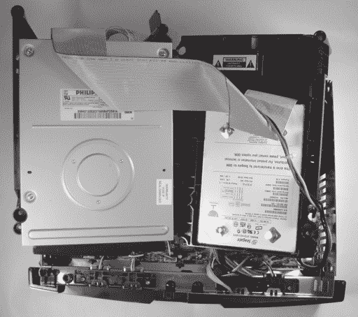
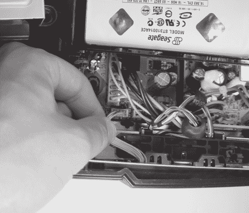
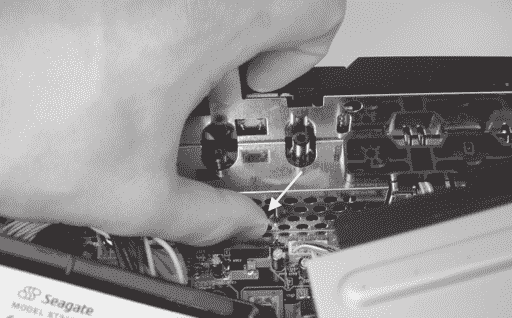
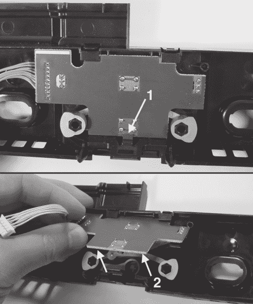
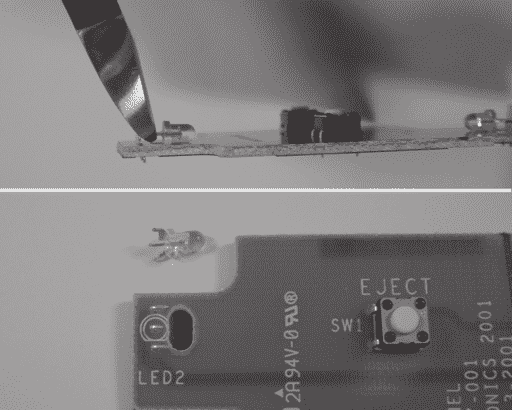
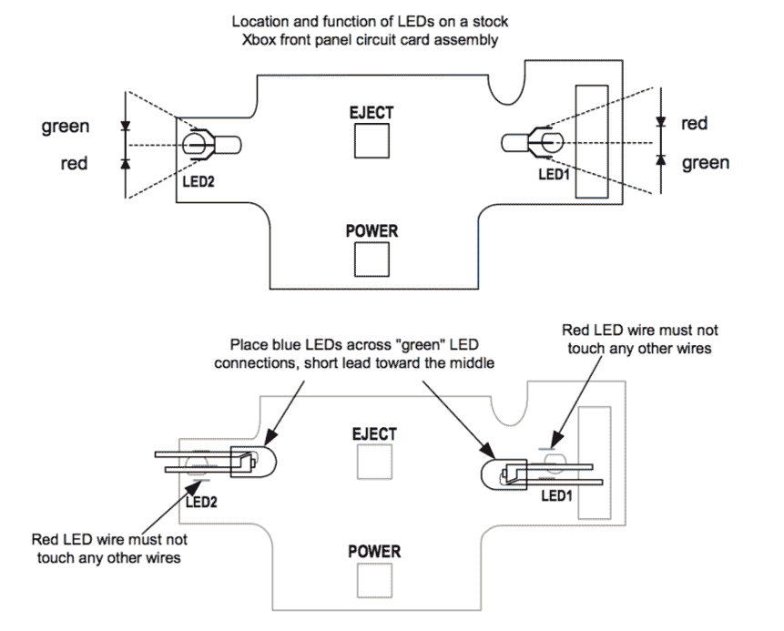
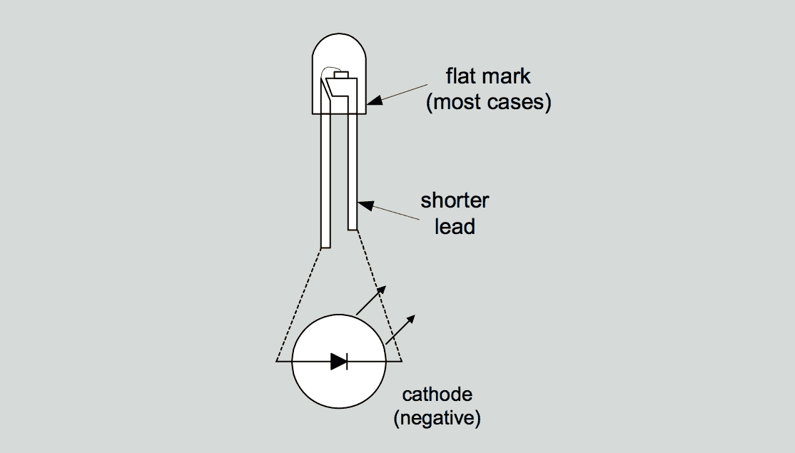
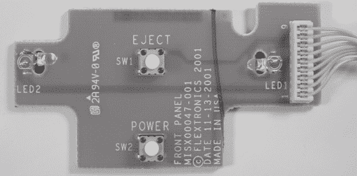

# 第三章 -

安装蓝色 LED

现在你已经拆下了你的 Xbox 外壳，是时候做一些入门级项目了。接下来的章节将指导你进行一些基本的修改和维修，这些你可以在你的 Xbox 上完成。这些项目是为那些对硬件黑客经验很少或没有经验的读者设计的。更高级的 Xbox 主题可以在后面的章节中找到。

在本章中，你将学习如何将 Xbox 前面板上的通常为绿色的 LED 更换为蓝色 LED。这个项目需要的焊接很少；大部分的工作在于拆卸前面板和 LED 电路组件。让我们开始吧！

### 注意

****

**标准的 Xbox 使用绿色/红色组合 LED，但红色 LED** **仅用于指示错误状态。本章中描述的程序将把你的 Xbox 前面板** **指示灯转换为仅蓝色 LED。合适的替代品将是蓝色/红色组合 LED（T-1，3 毫米直径透镜）。然而，它们很难找到，所以这里的说明不会使用它们。说明将提供必要的背景知识，以便如果你愿意，你可以即兴发挥并融入你自己的 LED 解决方案。**

## **你需要什么**

以下是你完成此项目所需的设备清单：

• 带细尖头的低功率烙铁

• 焊锡

• 焊剂和烙铁头清洁剂（可选）

• 小型平头螺丝刀

• T-10 位托克斯驱动器

• 两个低压（3 伏特）的 T-1（3 毫米）外壳蓝色 LED

• 在焊接过程中固定部件的遮蔽胶带

你可以使用你喜欢的任何颜色的 LED，但它必须在约 3 伏特的电压下打开，并具有 T-1 风格的壳体。购买 LED 时请注意，因为许多蓝色和白色 LED 仅被评定为在 5 伏特下工作。这里使用的 LED 是 Lumex SSL-LX3044USBC，你可以通过 Digi-Key（www.digikey.com）购买；零件编号为 67-1747-ND。（对于预算有限的用户，Digi-Key 可以通过美国邮政服务的一等邮件发送 LED。请注意，通过 Digi-Key 的订单低于 25 美元时，将收取 5 美元的手续费。）

如果 Digi-Key 的最小订单限制对你来说是个问题，Mouser Electronics（www.mouser.com）也有一系列蓝色 LED，而且他们没有最低订单要求。一个例子是 Kingbright 蓝色 LED，带有一个水清透镜的 T-1 外壳；Mouser 库存编号为 604-L7104PBC/H，这是亮度更高、电压略高的版本，或者 604-L7104QB/D，这是一个在较低电压下运行但亮度较低的版本。

如果你希望同时保持错误状态 LED 的功能，你也可以使用双色 LED。Xbox 需要一个带有三个引脚的 T-1 外壳的共阴双色 LED。不幸的是，带有蓝色元素的较小 T-1 外壳的双色 LED 很难找到。

## **拆卸 Xbox 前面板**

Xbox 前面板是由 ABS 塑料模压而成的部件，用四个 T-10 六角螺钉和三个模压摩擦锁固定。前面板中的电子设备通过一个九线连接器连接到 Xbox 主板，该连接器穿过金属电磁干扰屏蔽上的一个孔。

按照第一章中的说明打开 Xbox。抬起并移动硬盘驱动器和 DVD 驱动器，使其向上并向后移动，以便露出 Xbox 主板的前边缘。你不需要解开任何硬盘驱动器的电缆。图 3-1 说明了这些步骤后你的 Xbox 应该看起来是什么样子。

**图 3-1**：将光盘驱动器放置，以便露出主板的前边缘。

### 注意

较旧的 Xbox 型号在 Xbox 前面附近将有一个垂直安装的 PC 板。可以通过握住板子并将其从插座中拔出移除该 PC 板。你可能发现移除垂直安装的 PC 板有助于释放前面板中间的摩擦锁。完成工作后，不要忘记更换 PC 板！

拆下固定前面板组件的四个螺丝（见图 3-2）。

按照图 3-3 所示从 Xbox 主板上拆下前面板线连接器。连接器只需要稳定而有力的力量。（不要猛拉连接器，以免损坏电线。）

****

**图 3-2**：前面板组件上四个固定螺丝的位置。

现在是棘手的部分：摩擦锁。摩擦锁是由塑料制成的钩子，用于固定部件。钩子的形状使得插入容易，但取出困难。释放摩擦锁通常需要在塑料上弯曲或推压。

**图 3-3**：从 Xbox 主板上拆下前面板线连接器。

三个摩擦锁固定前面板：一个在前面板的每个边缘，一个在中间穿过金属电磁干扰屏蔽。首先，使用如图 3-4 所示的薄刃平头螺丝刀松开边缘的摩擦锁。这些锁非常紧，你可能需要分段释放，从顶部开始。将螺丝刀尖端插入面板和主箱体侧面的空间中，直到感觉到轻微的松动。移开螺丝刀并重复在箱体底部附近的过程。你可能需要尝试几次才能使锁释放。不要对箱体施加过多力量，以免划伤或损坏塑料。当前面板的边缘自由时，你将能够将其从箱体中弯曲出来。对两个边缘重复此过程。

**图 3-4**：使用平口螺丝刀松开边缘摩擦锁。 (1) 从顶部开始工作，向下移动； (2) 一旦面板松动，它应该从机箱向外弯曲。

一旦两边都松开，向上拉中间的摩擦锁（如图 3-5 所示），前面板应该弹出。

一旦前面板松开，将前面板线连接器穿过金属电磁干扰屏蔽的孔，并将面板平放在桌子上，外表面朝下。

**图 3-5**：拇指正在按中间的摩擦锁。

## **拆卸前面板电路板**

Xbox 的前面板组件包含一个小电路板，用一个摩擦锁固定片固定，如图 3-6 所示。用手指或螺丝刀按摩擦锁并从前面板的托架上拉出前面板电路板组件。

将电路板组件平放在桌子上，绿色面朝下。你应该能看到两个清晰的 LED 和两个扁平的按钮开关。

**图 3-6**：将印刷电路组件从前面板中取出。 (1) 使用螺丝刀向下按摩擦锁卡扣（如有必要）， (2) 然后将组件从前面板中取出。

## **安装蓝色 LED**

现在电路板组件已被移除，是时候安装蓝色 LED 了。这需要一些焊接，所以请插入电烙铁并让它预热。请注意，使用细尖烙铁和使用烙铁头清洁剂在焊接前清洁烙铁头非常重要。如果您需要这些物品中的任何一项，请参阅附录 A，“如何获取您的黑客工具”，您只需花费比视频游戏稍多的费用就可以装备自己。

使用平口剪线钳移除两个现有的 LED。尽可能保留从 LED 中伸出的金属腿，因为您稍后需要用它们来安装蓝色 LED。图 3-7 显示了完成后的电路板应该看起来是什么样子。

**图 3-7**：从电路板组件上剪下现有的 LED。 (顶部) 尽可能靠近机箱剪下 LED； (底部) LED 已被移除。使用此程序移除两个 LED。

为了帮助焊接，用一块胶带将电路板固定在平坦的表面上，使其不会移动。将蓝色 LED 放置在电路板组件上的旧 LED 的金属短柄上，使其腿接触。 (图 3-8 展示了如何识别 LED 的极性和它们在电路板组件上的正确方向。如果您不确定如何识别 LED 的极性，请参阅侧边栏“LED 的解剖结构”。)

使用胶带将 LED 的透镜部分固定到位，以免在焊接时滚动。你需要弯曲或切割将安装在电路板右侧的 LED 的引脚，因为黄色线连接器会挡住。

### 警告

**请注意 LED 的正负极。如果你将 LED 反向安装，将不会发出光线。如果你不确定如何识别 LED 的正负极，请参阅侧边栏** **关于 LED 的解剖结构**。**

**图 3-8**：蓝色 LED 在前面板电路板组件上的放置。注意电路板两侧 LED 颜色的反对称。

图 3-8 还说明了库存 Xbox LED 的正负极和功能。鼓励勇于尝试的读者进行创新，安装多个 LED 或表面贴装 LED 组件，以尝试获得更多颜色和功能。通过首先打磨 LED 的边缘，可以安装比 Xbox 中使用的 T-1 包装略大的 LED。

一旦你检查了 LED 的正负极并确认两个 LED 的短引脚都紧贴着原始 LED 的中心引脚的残留部分，就可以将 LED 焊接到位。图 3-10 显示了 LED 焊接到位的情况。（如果你以前从未焊接过，你可能需要在继续之前阅读附录 B，“焊接技术”。）

在使用烙铁之前，熔化一小段焊锡丝以验证尖端是否足够热。如果烙铁足够热，焊锡丝应立即熔化。如果烙铁太冷，你将无法形成良好的接头，并且有损坏电路板的风险。

将烙铁尖端对准蓝色 LED 的引脚，并将引脚推入电路板组件上的金属短柄。当引脚加热时，将一小段焊锡丝涂在蓝色 LED 引脚与金属短柄相交的点。熔融焊锡的表面张力应使焊锡润湿蓝色 LED 的引脚和电路板组件上的金属短柄。如果这种情况没有发生，请取下烙铁，并在接头处涂上一点助焊剂，然后再次尝试。

## **LED 的解剖结构**

LED，或称为发光二极管，是极化设备，只允许电流单向流动。这意味着如果反向安装，它们将不会工作。图 3-9 说明了 LED 的解剖结构。LED 包装侧面的较短的引脚，带有小平面的是阴极。为了使 LED 工作，阴极必须连接到一个比另一个引脚（阳极）更负的电位。

**图 3-9**：LED 的解剖结构。

不同的 LED 在点亮时需要的正向电压不同。红色 LED 通常需要 1.7 伏，绿色 LED 需要大约 2.1 伏，蓝色 LED 需要 3.5 伏及以上。早期的蓝色 LED 需要接近 5 伏的正向电压，但随着技术的进步，它们的电压已经降低，使得它们更容易集成到电池供电和低压电子设备中。在为这个项目购买 LED 时，请注意所需的正向电压。如果你安装了一个 5 伏的蓝色 LED，由于 Xbox 驱动器产生的最大正向电压大约为 3 伏，其光输出将会非常暗淡。

不要将烙铁尖端长时间对准金属短柄，否则会熔化固定短柄的焊锡。当你看到短柄的焊锡连接到板上开始自由摆动时，你就知道短柄的焊锡连接已经熔化。如果发生这种情况，将烙铁尖端对准板，并慢慢将烙铁尖端移开。移动尖端可以防止短柄被烙铁拉出。等待短柄冷却，并将短柄弯回到原位。

**图 3-10**：将 LED 焊接到位。注意电路板和 LED 是如何使用遮蔽胶带固定在原位的。

一旦你将两个 LED 上的所有四个连接点焊接好，将多余的 LED 引脚剪成尽可能短，但不要剪断金属短柄。完成的电路板应类似于图 3-11。

****

**图 3-11**：完成的电路板组装。

## **重新组装前面板**

通过将顶部边缘对齐到固定夹下，并推动卡片进入摩擦锁，将电路板组装重新卡回到前面板。

现在，取下完整的前面板组装，并将其与 Xbox 匹配。首先，将线连接器通过电磁干扰屏蔽的原始椭圆形孔穿过去。然后，将前面板推入 Xbox，所有三个摩擦锁应该会自动卡到位。

将前面板线连接器重新连接到 Xbox 主板上。该连接器的形状使得只能按一个方向插入，但连接器模具中使用的塑料较软，如果你用力过猛，可能会反向插入，这可能会对其造成不可逆的损坏。通过将板上的缺失引脚与连接器端头上的缺失电线对齐，如图 3-12 所示，来验证正确的方向。

如果你有一个较旧的 Xbox，通过将其推入插座来重新连接垂直电路板组装。这个电路板是 Xbox 游戏控制器的接口卡，所以你肯定希望它安装正确。

现在，你已经准备好测试你刚刚修改的前面板组件。将磁盘驱动器放入其托盘，并验证它们的电源线和扁平电缆连接是否牢固。插入 Xbox 电源，你应该会看到 Xbox 前面板发出的蓝色光芒。（如果你没有看到预期的效果，不要慌张。下一节“调试”提供了对一些可能问题的解决方案。）

一旦你对 Xbox 的修改满意，关闭 Xbox 并更换前面板组件上的四个固定螺丝。（你需要再次移除磁盘驱动器以访问螺丝孔。）更换磁盘驱动器，再次开启 Xbox 以验证一切正常，然后按照第一章所述重新组装 Xbox 的其余部分。

**图 3-12**：前面板线连接器的方向特性。箭头指示空极化针的位置。

## **调试**

有时事情会出错。根据我的经验，事情出错的情况比不出错的情况更为常见。如果某件事不工作，最重要的是不要慌张！保持冷静，观察出错的情况，并尝试推测故障的原因。为了参考，表 3-1 包含了一列常见问题和它们可能的原因。附录 E，“调试：提示和技巧”包含了对调试技术的更深入讨论。

| 问题 | 可能的原因 |
| --- | --- |
| Xbox 无法开启。 | • 前面板线连接器未正确插入。• Xbox 未插入。• 前面板线连接器损坏，或前面板电路板组件损坏。 |
| Xbox 已开启并正常工作，但 LED 灯不亮或只有围绕弹出按钮的一半灯圈亮起。 | • 安装了一个或多个 LED 灯方向错误。• 安装了一个或多个 LED 灯在红色 LED 的金属支架上，而不是绿色 LED 的金属支架上。通过在不插入视频线的情况下开启 Xbox 来验证这一点。这将导致 Xbox 向红色和绿色 LED 发送闪烁信号。 |
| Xbox 已开启并按顺序通过初始动画，但控制台指示需要服务。 | • 硬盘或 DVD 连接器已松动。验证灰色扁平电缆接头是否已完全插入每个驱动器，以及每个驱动器的电源连接器是否已完全插入。在较老的 Xbox 型号上，检查垂直游戏控制器接口板是否已正确重新安装。 |
| Xbox 已开启，但游戏控制器无响应。 | • 在较老的 Xbox 型号上，检查垂直游戏控制器接口板是否已正确重新安装。 |
| Xbox 已开启，但 DVD 无法弹出。 | • 验证前面板和 Xbox 主板之间的线连接器是否已正确插入。• 验证 DVD 电源连接器是否已正确插入。 |

**表 3-1**：安装蓝色 LED 的调试指南。
