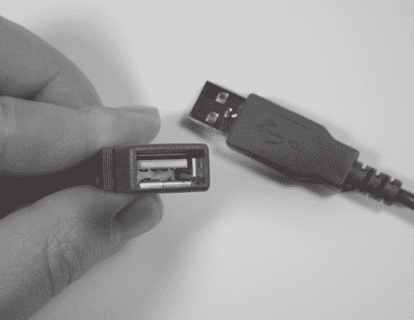
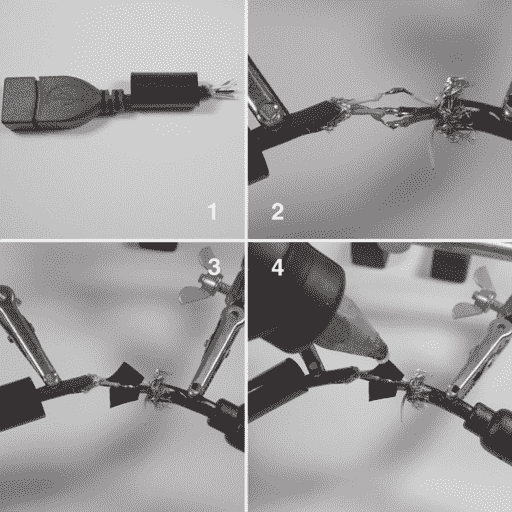

# 第四章 -

构建 USB 适配器

线缆制作是硬件黑客活动的一个必选部分。在硬件上进行的许多修改和实验都需要定制线缆来适应您现有的连接器。

在本章中，您将学习如何为 Xbox 构建 USB 适配器线缆，这在大多数零售店中不可用（尽管一些在线供应商，如 Lik-Sang（www.lik-sang.com）确实提供此商品）。USB 适配器允许标准 USB 集线器、键盘和鼠标连接到 Xbox，用于运行 Linux。（本章以教程的形式介绍了稳健线缆构建的基础；经验丰富的硬件黑客可以自由地浏览或跳过此部分。）

## **起始材料**

此项目需要以下材料：

• 一个 Xbox 游戏控制器断开连接线替换件或游戏控制器延长线。（见图 4-1。）

• 一个 USB 类型 A 延长线或 USB 类型 A 母座。（USB 类型 A 母座的图片见图 4-2。）

• 焊锡枪、焊锡和助焊剂。

• 一个斜口钳和剥线器。

• 电胶带。

•（可选）3/8 英寸热缩管和热胶。

•（可选）第三只手焊接辅助工具。

本章的逐步描述使用的是断开连接线替换件（可在任何视频游戏零售商处购买），以及 USB 延长线。如果您想使用其他东西，请参阅附录 F，“Xbox 硬件参考”，了解 Xbox 使用的各种连接器的引脚排列。

**图 4-1**：（左）Xbox 游戏控制器延长线。（右）Xbox 断开连接线。

**图 4-2**：USB 类型 A 母座。

## **策略**

在构建 Xbox USB 适配器线缆时，基本思路是将 Xbox 断开连接线和 USB 延长线各剪成两半，并将两条线的适当端连接起来。幸运的是，USB 兼容线缆有一个标准的接线代码。红色是+5V 电源，黑色是地线，白色是数据（-），绿色是数据（+）。为了将线缆连接起来，只需将相同颜色的线连接在一起。（注意，Xbox 线缆将有一个额外的黄色线，它携带复合视频同步信号的副本，用于光枪类型游戏接口。这个额外的黄色线可以安全忽略。）本章将逐步指导您连接电线和密封线缆。

### 警告

**一些 USB 线缆制造商不遵守标准 USB 接线代码。最常见的是将白色和绿色线反接，尽管偶尔会完全忽略颜色代码。始终使用万用表验证您的 USB 延长线实际上符合 USB 颜色代码是一个好主意。**

## **实施**

首先，在 Xbox 断开电缆靠近（大约 2 英寸）Xbox 连接器端的地方剪断，并在 USB 延长电缆靠近母接头端的地方剪断。丢弃 USB 延长电缆的公头部分和带有较小连接器的 Xbox 电缆的一半。

接下来，使用斜口钳在每个电缆的绝缘层上切出 1/2 英寸的缝隙，如图 4-3 中的框架 1 所示。将绝缘层剥开以露出电线，这些电线将由编织金属屏蔽和一些金属箔保护。将金属编织和箔剥开，并剪掉多余的绝缘和屏蔽。将红色、绿色、白色和黑色电线的末端剥去，使大约 1/8 英寸的裸导体露出。（不要剥去 Xbox 断开电缆中的黄色电线。）将导体的裸露末端浸入一些焊锡膏中。（见图 4-3。）

如果你担心适配器电缆组件的坚固性或安全性，将一段 1-1/4 英寸的热缩管套在电缆上。（这段管子将被套在裸露的焊点上，并用热胶填充以形成坚固的连接。）屏蔽不是必需的，但没有热缩加固的电缆将不那么坚固；如果反复弯曲或拉伸，它将容易断裂。

按照图 4-4 所示，继续电缆构建过程，将相同颜色的电线焊接在一起。在焊接时，让朋友帮助你固定电缆，或者使用带有鳄鱼夹的“第三只手”工具（Jameco 订单号 26690）来固定电缆。所有的焊点都应该看起来光滑且闪亮。对每个焊点进行一次稳固的拉扯，以验证焊锡连接良好。用一小段电工胶带缠绕在开放的焊点上，以防止暴露的焊点短路在一起。在继续到下一步，即焊点将被**永久**封装之前，**测试**电缆。

**图 4-3**： (1) 在电缆绝缘层上切出缝隙，(2) 将绝缘层剥开以露出内部的电线和屏蔽。 (3) 剪掉多余的屏蔽和绝缘层，并从电线末端剥去 1/8 英寸。 (注意右侧 Xbox 连接电缆中的黄色电线没有被剥去。) (4) 最后，将剥开的电线末端浸入焊锡膏中。

一旦电缆经过测试并确认良好，就是时候在焊点上放置坚固的封装以进行机械加固，如图 4-5 所示。在开放的焊点上放置几滴热胶以固定它们，防止它们相互短路，然后将热缩管套在焊点上，然后在管子的两侧填充热胶。管子应该因胶的热量而收缩，并在焊点周围形成坚固的、永久的封装。（热胶还起到对焊点的应力缓解作用，因此电缆在大多数正常操作情况下将是坚固的。）

**图 4-4**: (1) 在焊接之前，将一段热缩管套在电缆上。 (2) 将电线焊接在一起，颜色对应颜色。 (3) 用绝缘胶带缠绕电线，以防止短路。测试电缆。 (4) 在测试好的电缆上涂上少量热胶，以固定绝缘胶带和电线，为下一步做好准备。

虽然没有热胶和热缩管处理，电缆仍然可以完全正常工作，但如果您没有这些物品，您仍然可以通过小心地将绝缘胶带缠绕在各个接合处作为临时机械加固来提高连接的稳定性。

现在您已经完成了 USB 到 Xbox 游戏端口适配器的制作，第十一章和第十二章描述了一些在 Xbox 上安装 Linux 所必需的步骤，这样您就可以使用您的新适配器了。

**图 4-5**: (1) 将热缩管滑过接合处，并开始用热胶填充管子。 (2) 热胶会使热缩管收缩。 (3) 最终产品是一个永久性的防护套，可以抵抗大多数损坏。 (4) 最终产品的图片，显示了 Xbox 和 USB 电缆的末端。
