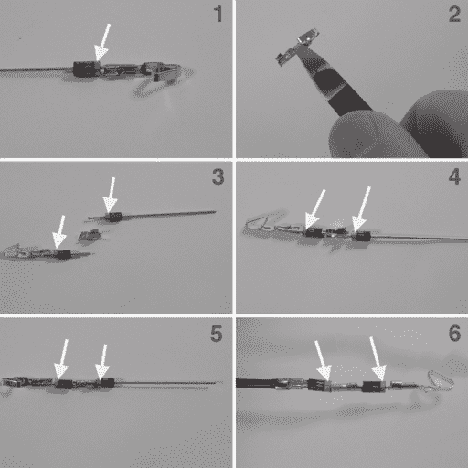
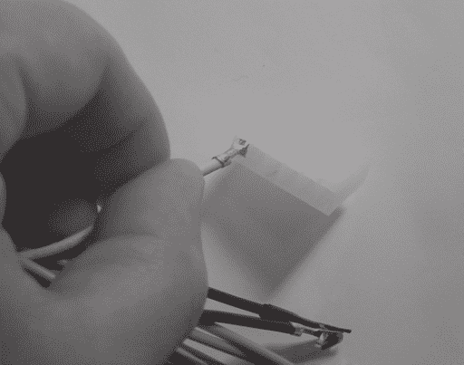
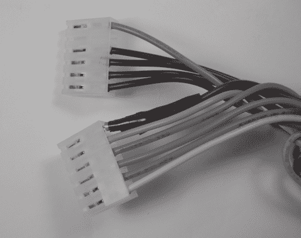
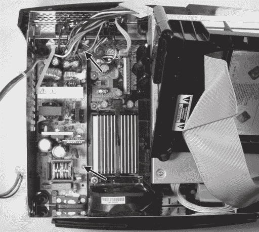
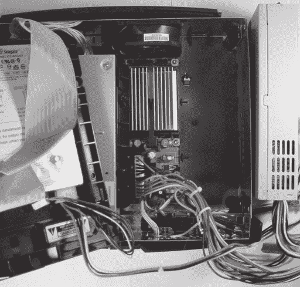

# 第五章 -

更换损坏的电源

在不幸（而且令人惊讶地常见）的情况下，如果 Xbox 在三个月保修期结束后损坏，唯一官方的修复方法是向微软支付维修费用。即使是简单的修复也可能超过一百美元，大约是控制台原始购买价格的一半。因此，我收到了许多来自询问如何修复损坏的电源和硬盘的人的电子邮件。

不幸的是，更换损坏的硬盘需要克服 Xbox 的安全系统，因为有一个独特的密钥用于锁定 Xbox 主板到特定的硬盘。安装新的硬盘需要一种可以重新编程或绕过硬盘锁的 modchip。此外，还需要一份工厂预装 Xbox 软件的副本，即使是为了维修目的，分发或复制也是非法的。因此，Xbox 硬盘更换的话题过于敏感，不适合在本文中讨论。鼓励读者在网上搜索有关更换硬盘的众多常见问题解答。

另一方面，Xbox 使用的电源与标准 PC 使用的电源非常相似。您可以在许多网站上购买确切的 Xbox 电源替换件，例如 Llama.com（www.llama.com/xbox/Repairs/repairs.htm）、XboxRepair.com（www.xboxrepair.com）和 Firefly-HK（www.firefly-hk.com），或者您可以尝试使用标准 PC 电源自己组装一个！

考虑到电源故障的频率，我将向您展示如何将标准 PC ATX 电源适配到 Xbox。本节中描述的方法不需要焊接，但需要额外翻转一个开关来开启 Xbox。附录 C，“进入 PCB 布局”，描述了一个简单的项目，您可以通过它来获得无需额外电源开关的便利。当然，直接更换电源比适配电源的教育价值要小。如果您决定将 ATX 电源适配到 Xbox 使用，您将学习如何制作压接电缆，以及了解一些电子理论以及 Xbox 的工作原理。

将标准 PC ATX 电源适配到 Xbox 的另一个原因是为控制台提供额外的电源。原始设备制造商（OEM）或“标准”Xbox 电源只能提供刚好足够的电力来满足 Xbox 的需求。将额外的驱动器或风扇连接到未经修改的 Xbox 可能会导致 OEM Xbox 电源过载并烧毁。

注意，截至本文撰写时，Xbox（在 Xbox 破解社区中被称为“v1.2”）发布了一个新的硬件版本，它似乎有一个标准的 ATX 电源连接器，而不是本章后面描述的专有 Xbox 电源连接器。在继续进行适配程序之前，请检查您的 Xbox 电源连接器是否与本章中描述的连接器匹配。本章中假设的 Xbox 电源连接器在一行中有十二个引脚，而较新的 Xbox 电源连接器有 20 个引脚，排列成两行，每行十个。此外，尽管最新的 Xbox 硬件版本有一个类似 ATX 的连接器，但它不一定与标准 ATX 电源电学兼容。在尝试将标准 ATX 电源与具有新 ATX 类似连接器的 Xbox 连接之前，测量电源连接器上的电压并与 ATX 规范（www.formfactors.org/developer/specs/atx/atx2_1.pdf）进行比较是明智的。

### 警告

****

**更换电源可能会暴露您于危险电压。在移除电源之前，始终从电源插座上拔下 Xbox，并等待一分钟以使储存的电荷消散。此外，不正确的更换电源可能导致控制台永久性甚至爆炸性的损坏。只有当您确信电源已放电并关闭，并且您愿意承担进一步损坏控制台的风险时，才执行此程序。**

## **诊断损坏的电源**

如果您的 Xbox 在开机时遇到问题，您必须首先诊断问题并找到故障源。如果故障实际上在控制台或电源插座内部，更换电源是没有用的。执行以下诊断步骤以验证 Xbox 电源确实是问题所在，而不是其他原因。

1.  通过将灯泡插入插座来验证电源插座是否正常工作。使用至少 100 瓦的灯泡以准确模拟 Xbox 的负载。

1.  视觉检查电源线是否有弯曲或割痕。

1.  确认电源线插头已牢固地插入 Xbox 电源插座，并且尽管进行了这些检查，Xbox 仍然无法开机。

1.  视觉检查 Xbox 内部是否有烧焦痕迹或破裂的电容器。如果主板上可见烧焦痕迹，您可能需要更换 Xbox 主板（即购买新的 Xbox）。如果电源上有烧焦痕迹，很可能是电源损坏了，您可以开始更换它。（请注意，电源故障也可能损坏主板，因此更换电源后，Xbox 可能仍然无法工作。）

1.  确认主电源连接器和前面板电路组件连接器都已牢固安装。（前面板电路组件连接器的位置在第三章“安装蓝 LED”的图 3-3 中说明。）Xbox 的电源开关通过前面板电路组件连接器连接到主板。

1.  当 Xbox 关闭但仍然连接时，使用电压表来验证 3.3V 待机电压（3.3VSB）是否在规范范围内。通过从靠近前面板的端子开始，探测电源连接器中的第六根线来测量 3.3VSB，以及电源连接器上的任何一根黑色线。你可以通过将电压表探针的尖端插入电源线和电源连接器之间的空闲空间来测量电源电压。（主板电源连接器体内的电源线周围有一个金属环。）如果 3.3VSB 的值不在 3.14 到 3.47 伏之间，你可能需要更换电源。

1.  按下 Xbox 上的电源按钮以将其“开启”（假设电源损坏，Xbox 可能不会做太多）。如果电源发出噪音或冒烟，请拔掉盒子并继续更换电源。如果盒子看起来已经没有反应，请测量电源输出的每个主要电压。黄色线应有 11.4 到 12.6 伏的电压；红色线应有 4.8 到 5.25 伏的电压；橙色线应有 3.14 到 3.47 伏的电压。（所有这些电压都是以黑色线为参考的。）此外，检查 Power OK 信号（位于 12 号引脚，即离前面板最远的引脚）的电压是否高于 3.1 伏。

如果上一页列表中的所有项目都检查无误，那么问题很可能不在于你的电源。接下来需要检查的是电源开关的电学和机械完整性（参见第三章了解如何移除带电源开关的电路板）以及主板的性能。然而，如果你确实观察到了电源故障的迹象，请继续阅读。

## **更换电源**

更换 Xbox 电源的整体策略是将标准 PC ATX 电源适配到 Xbox 上。以下是你将需要的设备列表：

• **标准 ATX 电源。** 1U 电源可以适应 Xbox 机箱的尺寸，但它可能稍微高一点，无法完全关闭机箱。

• **（可选）ATX 主板电源线延长线。** 电源线延长线可以通过多个供应商购买，包括 PC Power and Cooling www.pcpowerandcooling.com）。修改延长线以适应 Xbox 而不是 ATX 电源线的电缆，允许你在准备丢弃 Xbox 后，在标准 PC 上重复使用电源。

• **压接工具。**Molex 通用压接工具（Digi-Key 零件号 WM9999-ND）强烈推荐，但价格略高（约 35 美元）。可以购买更便宜的压接工具，如 Jameco 159265，价格大约是三分之一，但使用起来更令人沮丧，并且可能需要在压接处使用焊锡以达到所需的连接强度。

• **一个 12 位置 0.156 英寸间距的连接器外壳**（即 Digi-Key 零件号 WM2313-ND）**或**两个堆叠的 6 位置 0.156 英寸**间距的连接器外壳**（即 Jameco 零件号 104731）。这个外壳用于 Xbox 电源连接器的替换。

• **13 个 0.156 英寸间距的压接端子用于电源连接器**（即 Digi-Key 零件号 WM2313-ND 或 Jameco 零件号 78318）。

• **两个封装为 DO-41 的 1N4001 或更好的硅整流二极管**（即 Digi-Key 零件号 1N4001DICT-ND 或 Jameco 零件号 35975）。

• **剥线钳。**任何可以处理 18 号线的剥线钳都适用。

• **剪刀。**任何斜口剪刀都适用。

• **绝缘胶带。**

## **使用二极管降低电压**

Xbox 需要+3.3V 的备用电源电压，但 ATX 电源只输出+5V 的备用电源电压。解决这个问题“正确”的方法是使用一个精确地将+5V 转换为+3.3V 的稳压器，但这个修改的目标是用最少的焊接来替换电源。

另一种解决方案是使用两个二极管将+5 伏电源降低到“足够接近”的+3.6 伏电源。我们可以这样做，因为二极管两端的电压与通过二极管的电流成对数比例。换句话说，对于大多数电流，二极管两端的电压几乎是恒定的。结果发现，硅二极管几乎均匀地具有大约 0.7 伏的正向电压降，所以两个串联起来会降低 1.4 伏。

在这个修改中使用的二极管，1N4001，只能传导 1 安培的电流，所以不要在其他需要大量电流的应用中使用这个技巧。幸运的是，Xbox 的备用电源只需要非常小的电流，因此烧毁二极管不是问题。

最后一点，二极管降低的电压会随着通过它的电流量的变化而略有波动，所以不要在需要精确调节电压的应用中使用这个技巧。在 Xbox 应用中，我们稍微提高了电压，但幸运的是，从这个电源供电的数字逻辑可以容忍这种条件。

### **策略**

标准 ATX 电源的接口与 Xbox 电源的接口非常相似。Xbox 需要+3.3V、+5V、+12V、一个+3.3V 待机电源，以及两个控制信号，“电源 OK”和“电源开启”。电源 OK 信号表示电源输出的电源稳定且正确调节，而电源开启信号是 Xbox 发送的控制信号，用于打开和关闭电源。典型的 ATX 电源有+3.3V、+5V、+12V 输出，足以运行 Xbox，并且它还有一个与 Xbox 主板兼容的电源 OK 信号。然而，ATX 电源产生的是+5V 待机电压而不是+3.3V 待机电压，电源开启信号与 Xbox 的极性相反。这两种不兼容性可以通过不需要焊接的方式解决。使用两个串联的二极管将+5V 待机电压降低到略低于+3.6V 的电压。ATX 电源的电源开启信号默认为“开启”，因此即使控制台关闭，电源也会保持开启状态。这对控制台的电子设备来说没有问题，但可能从美学上令人不安。附录 C，“进入 PCB 布局”，描述了一个你可以实施的示例设计，以更优雅的方式避免这些不兼容性。然而，附录中概述的设计将需要你在焊接和电路板设计上投入一些努力。

## **步骤**

替换 Xbox 电源的步骤分为两部分：

1.  将标准 ATX 电源线修改为 Xbox 电源线。

1.  移除旧电源并安装新电源。

### **构建 Xbox 电源线**

首先切断现有 ATX 电源的主板连接器，如图 5-1 所示。你可以选择使用 ATX 主板电源延长线进行此修改，这样你可以保留电源上的 ATX 电源连接器以供将来使用。两种选项的步骤是相同的，但本章中的图片是使用 ATX 主板延长线拍摄的。

现在，将压接端子连接到以下电线，ATX 线缆中的十根，如图 5-2 所示：

• 一根黄色电线

• 三根红色电线

• 一根橙色电线

• 四根黑色电线

• 一根灰色电线

如果你使用的是较便宜的压接工具，可能难以制作足够坚固的压接连接。在这种情况下，通过将压接端子焊接在电线上来完成连接。焊接时使用大量的热量，否则焊锡将无法完全渗透到电线和压接端子中。电烙铁应在施加焊锡前后的约五秒钟内与接头接触。

在紫色线（+5V 待机线）上，将两个二极管串联连接到线的末端和压接端子之间。图 5-3 中所示的过程使用压接端子的部分来连接二极管，因此不需要焊接。（注意：二极管是有极性的设备：如果安装方向错误，它们将不会导电。二极管应安装时，其阴极（带涂层的末端）朝向主板。）

**图 5-1**：从 ATX 电源电缆上切断连接器。

接下来，用绝缘胶带缠绕 ATX 电缆上所有未使用的电线，以防止任何意外短路损坏电源和可能的游戏机 Xbox。务必也将二极管用绝缘胶带缠绕好。（见图 5-4。）

最后，将完成的压接端子插入 0.156 英寸的连接器外壳。当压接端子完全且正确地插入时，它们将锁定在外壳内。（见图 5-5。）按照表 5-1 中指定的顺序插入电线。

一些供应商不销售较大的 12 位连接器外壳。在这种情况下，使用两个六位连接器外壳，并特别注意您选择的堆叠连接器的顺序。此外，注意 1 号引脚相对于连接器极化唇的位置。当极化唇在左侧且您从插入电线的侧面观察连接器时，1 号引脚位于连接器的顶部。由于很容易颠倒连接器并以此方式反转，因此使用现有的 Xbox 连接器作为参考。黄色、红色、橙色和黑色电线应相互对齐。

**图 5-2**：将压接端子连接到线的末端。（1）从线的末端剥去大约 1/8 英寸的绝缘层。（2）如有必要，从固定带中取出一个未使用的压接端子。（3 和 4）将电线插入压接端子，使 1/16 英寸的绝缘层位于较长的压接指之间。（5）压接绝缘部分（较长的压接指部分）。（6）显示仅压接绝缘部分的电线。（7）压接导体部分的压接指。（8）完成的压接端子。导体压接端子应紧密折叠在裸露的导线上以获得良好的接触。通过牢固地拉扯端子端来测试压接连接。

**图 5-3**：在紫色线的末端和进入电源连接器的压接端子之间串联连接两个二极管。箭头指示涂在二极管末端极化线的正确方向。此过程将消耗总共三个压接端子。（1）将一个二极管用极化带靠近压接端子的方式连接到压接端子上。（2）将压接端子剪成两半以去除叶片接触。（3 和 4）将二极管放置在切断的连接器的压接部分内，注意二极管的极性。（5）压接后的二极管。（6）使用第二个切断的压接端子，按照相同的程序将二极管连接到紫色线的末端。

在完成电源电缆组装后，**仔细检查您的作品**，因为任何错误都可能导致控制台永久且不可修复的损坏。图 5-6 显示了完成后的连接器组装应该看起来像什么。如果有的话，您可能希望使用电缆扎带将未使用的电线捆绑起来，以免妨碍并意外短路或损坏。

**图 5-4**：将未使用的电线和二极管用绝缘胶带包裹起来，以防止意外短路。

**表 5-1**：连接 ATX 电源线缆到 Xbox 电源连接器的接线表（从线缆入口侧查看，极化肋位于左侧）。

**图 5-5**：将压接连接器插入连接器引脚。

**图 5-6**：最终电缆组装。

**图 5-7**：两个电源安装螺丝的位置。

### **安装备用电源**

现在我们已经准备了一个备用电源，我们必须更换旧的、损坏的电源。首先，按照第一章“取消保修”中所述，拆下 Xbox 机箱的顶部，然后断开硬盘电源连接器，将硬盘从机箱中取出。您不需要断开连接到硬盘的灰色 IDE 电缆。

### 注意

**在此阶段，请确认 Xbox 已拔掉插头，并且它** **已有机会至少静置一分钟以消散电源中储存的电荷**。在插上电源的情况下或在拔掉电源后不久工作在 Xbox 上，极其危险。如果在此电荷消散之前您用裸手触摸电源的任何部分，Xbox 将提供令人讨厌的、可能致命的电击。

1.  通过握住整个电源线束并用手抓住电缆的同时向下按住盒子，拔掉 Xbox 电源连接器。注意在拔出电缆时机箱的尖锐金属边缘和散热器。

1.  拆下固定 Xbox 电源的两个 T-10 托克斯螺丝。（见图 5-7。）

1.  首先抬起电源的一端，使其靠近 Xbox 的前端，然后将电源从 Xbox 机箱中取出。

1.  将你创建的电缆与 Xbox 电源线缆进行比较，确保极化肋对齐。红色、黄色、橙色和黑色线应在这两个连接器之间对齐。（此检查将有助于确保你不会因为电缆的接线错误而损坏 Xbox。）

1.  将你的 ATX 电源线缆组件插入 Xbox 电源连接器。黄色线应与 Xbox 前面的最近端引脚对齐。记住，没有任何东西可以阻止你将电源线插入偏移一个或两个引脚。如果你在电源连接器上看到裸露的引脚，那么你已将电缆插入一个引脚偏移。请务必检查此情况，因为这可能会永久损坏 Xbox 硬件和/或电源。

1.  将 Xbox 硬盘驱动器插入 ATX 电源的一个磁盘驱动器电源连接器。硬盘驱动器使用与标准 PC 磁盘驱动器电源连接器相同的连接器，因此无需修改。

1.  检查是否有电线短路到机箱或卡在冷却风扇的叶片中。现在，你可以开启 Xbox 的电源了。

### **使用替换电源**

大多数 ATX 电源都带有电源开关。将此开关设置为关闭，然后插入 ATX 电源，然后打开电源开关。此时，ATX 电源将给 Xbox 供电，即使 Xbox 的系统控制器认为盒子是关闭的。因此，Xbox 内部的冷却风扇应该开始旋转。现在，按下 Xbox 前面的电源开关。此时，Xbox 应该正常启动。如果是这样，恭喜你！

### 谨慎

**某些 Xbox 版本缺少 GPU 散热风扇。** **如果你的 Xbox 主板没有直接安装在芯片上的风扇，那么你就拥有这样的 Xbox。** **缺少 GPU 散热风扇的 Xbox 在某些条件下容易过热，并且必须将磁盘驱动器安装在主板上以实现可靠的长期运行。磁盘驱动器的底部形成了一个空气通道系统，引导空气从 Xbox 主机箱风扇流过 GPU 散热器。（你的 ATX 电源线缆将防止磁盘驱动器与机箱平齐安装，但这不是空气通道的主要问题。）**

**图 5-8**：使用修改后的 ATX 电源延长线缆连接到 Xbox 的 1U 瘦型 ATX 电源。

当你准备关闭 Xbox 时，你可以简单地翻转 ATX 电源上的电源开关。或者，你可以使用 Xbox 前面的电源开关首先关闭 Xbox 的电源，然后关闭 ATX 电源。

### **调试技巧**

如果更换电源后 Xbox 没有正确启动，请使用本章开头“诊断损坏的电源”部分中的清单测试你的电源线缆。你可能会遇到的最常见问题是糟糕的压接连接或连接不良或不当的二极管。糟糕的压接连接也可能导致间歇性操作，即 Xbox 可以启动但经常崩溃。

如果 Xbox 可以启动，但在启动过程中由于某种原因停止，请参阅第三章末尾“调试”部分的表 3-1，以获取可能的问题及其原因列表。附录 E，“调试：提示和技巧”包含对调试技术和方法的更深入讨论。

如果 Xbox 运行正常但偶尔会崩溃，你可能有一个没有 GPU 散热风扇的 Xbox。请参阅面对页上的警告说明，描述了这个问题。要解决这个问题，你可能需要添加一个额外的风扇，或者用一张纸和一些粘性胶带增强现有的通风系统。
