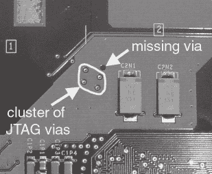

# 第六章 -

最佳 Xbox 游戏：安全黑客

在修改和调整 Xbox 硬件之后，下一步是控制 Xbox 硬件。不幸的是，获取硬件控制并不像人们想象中那么容易。Xbox 的设计者投入了大量精力来确保硬件免受复杂的软件攻击以及大多数简单的硬件攻击。Xbox 的安全机制是其数字版权管理架构的产物。

### 注意


从原则上讲，将硬件应用于“合理使用”目的，例如运行自己的自制程序，不应是非法的。然而，合理使用、受保护硬件以及相对较新的版权控制规避法律之间的关系仍然不明确。第十二章“警告黑客”详细讨论了黑客攻击的法律问题。

有许多方法可以绕过 Xbox 的安全措施。在本章和第八章“逆向工程 Xbox 安全”中，我讲述了我的冒险经历，绘制了 Xbox 安全系统的地图。我不仅讲述了成功之处，还讲述了遇到的失败，以便你能从我的经验中学习。第九章“偷偷进入后门”解释了其他人用来绕过 Xbox 安全措施的一些方法。第七章“安全简明指南”提供了欣赏第八章和第九章所需的背景知识。

## **与偏执设计的初次接触**

当 Xbox 在 2000 年春季发布时，兴奋的波纹席卷了硬件爱好者社区。这种兴奋的原因不仅仅是 Xbox 的游戏潜力，还有它作为高性能、网络连接的 x86 架构 PC 在 300 美元的实惠价格上的潜力。几个月后价格下调，Xbox 的价格已经降至 200 美元以下。Xbox 与 x86 PC 的相似性意味着理论上大量现有的应用程序和专业知识可以轻松移植到游戏机上。

我第一次看到 Xbox 是在 2001 年 11 月底，当时我的女朋友（现在是未婚妻）把它作为早起的圣诞礼物给了我。我立刻开始着手。为了控制 Xbox 硬件，首要任务是提取引导 ROM 并分析其内容：回想一下第二章关于 Xbox 架构的讨论，Xbox 的引导 ROM 包含了建立 Xbox 操作环境所需的所有代码。

### **窃取 ROM**

Xbox 使用的 ROM 类型是一种称为 FLASH ROM 的电气可擦写和可编程品种。FLASH ROM 通常有几种封装类型，Xbox 使用的是最受欢迎的封装之一，即 TSOP（薄型小外形封装）。它位于 Xbox 主板顶部的 U7 区域，该部件的参考设计符为 U7D1。TSOP 封装非常容易识别，因为它是非常少数的矩形封装之一，只有封装的窄边上有引脚。大多数其他封装将引脚放在长边或所有边上以最大化连接性，但 FLASH ROM 的每平方硅的 I/O 要求相对较低。通过在搜索引擎上快速检查基础部件编号 29F080，可以验证这个部件确实是一个 8 Mbit FLASH ROM。

有几种技术可以用来读取（*snarf*）FLASH ROM 的内容。无焊接的方法是购买一个可以夹在 FLASH ROM 上的测试夹具，通过测试夹具供电并控制 ROM，同时关闭 Xbox 的其他部分来读取其内容。为此目的，可以从 Emulation Technology，www.emulationtechnology.com 购买合适的测试夹具。（测试夹具覆盖方法有几个问题，最大的问题是可能会永久损坏通过测试夹具供电的连接到 FLASH ROM 的芯片。然而，在 Xbox 的情况下，这似乎不是一个问题，尝试这种方法的人也取得了成功。¹ 我最初没有采用这种方法，因为我不想冒险损坏主板，而且我负担不起完成这项工作所需的 300 美元的测试夹具。）

另一种巧妙的方法是将电线焊接到 FLASH ROM 周围的测试点上，以监听 Xbox 读取 ROM 内容的过程。监听可以通过将电线连接到可以与 ROM 接口的定制板，或者使用逻辑分析仪捕获 Xbox CPU 访问数据时的情况来实现。后者也被成功使用，实际上，通过这种方法还发现了 Xbox 引导序列中的几个后门。² 我也没有选择使用这种方法，因为我第一次得到 Xbox 时没有逻辑分析仪，而且将所有电线焊接到位可能非常繁琐、困难且容易出错。我的方法更传统：只是移除 FLASH ROM 并将其放入 ROM 读取器中。我还将插座放置在主板上，这样将来移除和编程 ROM 将非常快速和可靠。


**图 6-1**：使用夹子式焊接铁移除 Xbox FLASH ROM。

如果你有合适的工具，以保持其细针完整性的方式移除 FLASH ROM 很简单，如果没有合适的工具，几乎是不可能的。关键是同时加热 FLASH ROM 的所有针；一旦达到均匀加热，FLASH ROM 就会直接从主板上脱落。显然，标准的铅笔式烙铁无法同时加热所有针。适用于这项工作的正确工具是图 6-1 中所示的“钳子”或“镊子”式烙铁。这些烙铁有两个加热元件，因此可以同时加热芯片的两面。此外，烙铁必须有一个足够宽的桨形尖端，以便一次性加热芯片的整个长度。

具有这些功能的烙铁可能相当昂贵（数百美元），但这是一个值得的投资，因为它在各种情况下都很有用。我使用的是 Ersa SMT Unit 60A 烙铁，我在交易会地板上以折扣价购买，通过在完成学位的同时接一些额外的电路板组装工作，它很快就赚回了成本。通过 Jameco（#168410）可以购买到 Xytronic 生产的更经济实惠的烙铁，大约 70 美元，但我没有使用过它，因此无法对其质量作出保证。另一种非常简单直接的方法是使用附录 B 中描述的脱焊合金。（请注意，适合 ROM³的合适插座相对便宜——低于 20 美元——尽管安装它确实需要稳定的手和某种类型的放大设备。）

一旦 ROM 被移除，其针被清洁和检查后，其内容就可以在 ROM 读卡器中读取。当然，可以购买 ROM 读卡器，但自己动手制作总是一次很好的学习经历。你可以在我的网站上了解一些我制作的 ROM 编程器，网址为 http://www.xenatera.com/bunnie。我的原始 Flashburner⁴编程器是一个简单易懂且易于构建的设备，比其第二次修订⁵更容易理解，但功能较弱。

然而，如果你的目标是尽可能快地读取 ROM，只需直接购买 ROM 读卡器即可。一个好的 ROM 读卡器是任何严肃硬件黑客工具箱中的必备工具。Needham 的电子产品（http://www.needhams.com）生产了一系列适合各种预算的优秀的 ROM 编程器/读卡器。

### **与微软的遭遇**

在提取 ROM 内容之后，下一步是将其内容与同行黑客分享以进行分析。或者不是吗？在我将 ROM 内容发布到我的网站后的十二小时内，我接到一位微软工程师的电话，他礼貌地要求我将其版权内容从我的网站上删除。当然，我立即从我的网站上删除了他们的内容；我本应该在最初发布时就意识到这一点。

这第一次与微软的接触是一个令人清醒的警告，表明逆向工程 Xbox 不会像其他任何家用电器的逆向工程项目一样。有法律保护逆向工程的某些方面，还有大量版权法保护知识产权（IP）所有者。在尊重微软权利的同时合作逆向工程 Xbox 是一个法律雷区。

一方面，微软应该能够投资于一个产品并承担风险以期望获得利润。然而，法律并不保证盈利。例如，像微软那样以巨大亏损出售游戏机，希望通过销售软件来弥补损失（作为“亏损领导者”），这是一个风险很大的提议，法律也没有保证微软最终必须盈利。另一方面，我们作为黑客有权利使用自己辛苦赚来的钱购买的硬件（“合理使用”），如果微软想以大幅折扣向我们销售 PC，那也无可厚非。我们是否购买足够多的游戏（大约十个或更多）来弥补微软在 Xbox 上的损失，完全取决于微软的商业和营销策略。

在我看来，微软的大额亏损与收入比是这个行业的异常现象。索尼和任天堂在游戏机硬件成本上大致收支平衡。此外，手机提供商经常以与 Xbox 相当的成本亏损销售手机，但要求订阅者签订合同以确保手机的成本得到补偿；违约意味着终止费用。这可能反映了微软对 Xbox Live 业务模式的信心。

在所有这些中间，是加密版权保护机制和公平使用权的相互作用。结果是，Xbox 广泛使用加密来执行版权保护和游戏机使用政策，这把我们带到了 1998 年的《数字千年版权法案》（DMCA），这是一部相对较新、未经检验的法律。由于缺乏既定的法院先例和法律条款之间的许多灰色地带，作为黑客的你必须评估你可能会面临的风险。第十二章“黑客警告”更详细地探讨了新世纪黑客的法律问题。

**分析 ROM 内容**

虽然被微软拒绝，但 ROM 内容仍在手中，我继续分析 ROM 内容。人们可能会预期引导 ROM 包含硬件初始化程序，随后是加载操作系统的指令，以及可能还有操作系统代码本身。但应该从哪里开始呢？

ROM 内部的程序可以想象成一团线球：一旦找到线的起点，就只是时间和毅力的问题，直到你将线球完全解开到核心。

幸运的是，英特尔对 Xbox 的 Pentium 处理器的起点进行了非常详细的文档记录。在开机时，处理器从特殊硬连线位置开始运行代码，这个位置被称为*复位向量*。这个复位向量位于地址 0xFFFF.FFF0，接近内存的顶部。让我们看看这个位置包含的数据（以十六进制表示）：

0xFFFF.FFF0 EBC6 8BFF 1800 D8FF FFFF 80C2 04B0 02EE

```

// key initialization routine
  unsigned char K[256]; // 0xFFFFC80 in flash
  unsigned char S[256]; // 0x10000 in SDRAM

  for( i = 0; i < 256; i++ ) {
    S[i] = i;
  }
  j = 0;
  for( i = 0; i < 256; i++ ) {
    // RC-4 would do j = (j + K[i] + S[i]) % 256
    j = (j + K[i] + S[j]) % 256;
    // swap S[i], S[j]
    temp = S[i];
    S[i] = S[j];
    S[j] = temp;
  }

  // decryption routine
  unsigned char cipherText[16384]; // 0xFFFFA000 in FLASH
  unsigned char plainText[16384];  // 0x400000   in SDRAM

  for( index = 0x4000, i = 0, k = 0; index > 0; index— ) {
    // xbox version
    t = (S[i] ^ cipherText[k]) % 256;
    plainText[k] = t;

    // swap( S[i], S[t] );
    temp = S[i];
    S[i] = S[t];
    S[t] = temp;
    i = (i + 1) % 256;
    k++;
  }

```

**列表 6-1**：在 FLASH ROM 中找到的虚拟加密算法的反汇编。

前两个字节，EBC6，是一个跳转到位置 0xFFFF.FFB8 的跳转指令。第一个字节，EB，是“跳转，短，相对，相对于下一条指令的位移”的特定操作码；第二个字节，C6，是跳转的 8 位有符号偏移量。换句话说，处理器首先做的事情是跳转到另一个位置——这是每个引导程序都会做的事情，因为你在复位向量中只有 16 个字节的运行空间，一旦超出内存的高端就会崩溃。由于这段代码对于复位向量来说是典型的，因此为了教育目的，可以在这里重新打印代码。

下一段代码是一段初始化处理器 GDT（全局描述符表）和 IDT（中断描述符表）状态的代码。GDT 和 IDT 设置了处理器的内存管理方案和中断处理方案。你不需要确切了解这些寄存器的作用，但如果你有兴趣，英特尔“IA-32 Intel 架构软件开发者手册，第 3 卷：系统编程指南”详细解释了这些寄存器的功能。这本手册可在英特尔开发者网站上找到，网址为 http://developer.intel.com。

在设置这些寄存器之后，处理器被切换到保护模式，并跳转到 0xFFFF.FE00——一个位于内存顶部的 512 字节以下的区域——从这里开始事情变得有趣起来。在一段设置段寄存器的简短代码之后，一个名为*jam 表解释器*（在 Xbox 社区中也称为 X-Code 解释器）的程序被执行。jam 表是行业术语，指的是包含读取、写入和简单决策操作码的值表，用于硬件初始化的上下文中。初始化一个典型的 PC 需要数百个操作，而 jam 表有助于处理这种复杂性，而不会使核心初始化代码库膨胀。使用 jam 表也有助于使初始化更加灵活，能够处理用户可配置的硬件参数，例如安装的内存类型和数量。在 Xbox 的情况下，jam 表解释器从接近 FLASH ROM 底部的位置开始获取 jam 表操作码。（请记住，jam 表解释器实现的操作码非常强大；可以使用 jam 表操作码从 Xbox 的任何位置写入和读取数据。）

一旦终端操作码被干扰表解释器执行，处理器清除 MTRRs（内存类型范围寄存器，用于声明内存各个区域的缓存能力）并开始解密从 0xFFFF.A000 开始的 16 kB 内存区域。用于解密这个内存区域的密码看起来非常类似于 RC-4，但有细微的差异。列表 6-1 显示了使用 Data Rescue 公司的一个工具 IDA Pro 将密码反汇编成 C 代码，这个工具将在接下来的几章中详细介绍。

由这个密码解密的数据实际上是一块在解密过程结束时执行的代码，但这里出了很大的问题。解密后的代码是垃圾。它不起作用。

## **内存地址解码技巧**

存在许多技巧可以使内存区域在某些方面看起来与它们的物理表示不同。与 Xbox 引导序列分析相关的两个技巧是别名和覆盖。

当两个地址指向相同的内存位置时，内存位置被别名化，通常通过忽略一些地址位来实现。为了说明别名化，考虑一个使用 3 位地址的系统。在 3 位系统中，只有 8 个唯一的地址是可寻址的：000、001、010、011、100、101、110 和 111。现在假设你有一个有四个位置的内存；它只需要两个位来区分这四个位置：00、01、10 和 11。如果你使用我们的 3 位地址方案与这个四位置内存通信，必须忽略一个地址位。如果忽略最高位，那么地址 000 和 100 都将映射到内存中的位置 00。换句话说，位置 00 被别名化为地址 000 和 100。

内存覆盖是一种技术，其中使用带外信息来选择不同内存银行的内存。假设我们希望有一个秘密内存银行。为此，我们在公共和秘密内存之间插入一个选择器，以及 CPU。这个选择器可以选择向 CPU 提供来自秘密内存或公共内存的数据，如图 6-2 所示。因此，控制地址选择器的程序也控制着谁可以访问秘密块。如果计算机启动并运行位于秘密内存银行的代码，秘密代码区域的程序可以使用这种机制通过在运行公共内存中的程序之前将选择器设置为指向公共内存来隐藏自己。


**图 6-2**：内存覆盖以隐藏秘密区域。

此外，干扰表操作码似乎已被损坏。这一现象得到了其他正在解决这个问题黑客的证实，因此排除了代码转换错误。显然，Xbox 远不止表面看起来那么简单。

开始出现理论和谣言来解释这种奇怪的行为。一些流行的理论包括：

• **地址和/或数据线打乱。** 在某个地方，地址或数据线被某种 1:1 映射函数反转或排列。打乱函数可以作为初始化过程的一部分编程到芯片组中，这样初始启动块就会像明文一样读取，而其余的数据会被打乱。

• **二级加密处理器。** Xbox 上的另一个处理器实际上在处理 Xbox 的初始化，而 ROM 中的启动代码是无效的。

• **处理器中的启动代码。** 处理器实际上是由处理器芯片上的代码块初始化的，而 ROM 中的启动代码是无效的。

• **芯片组中的启动代码。** 处理器功能与标准 Pentium 相同，但芯片组包含覆盖 ROM 中无效代码的启动代码。

对于几乎所有这些理论，唯一证明或反驳它们的方法是在硬件上执行实验。例如，为了确保系统管理控制器（SMC，一个在 Xbox 插入时始终开启的 8 位自包含处理器）在机器的安全启动序列中没有发挥作用，黑客捕捉了所有 SMC 引脚上的波形，并将它们与如果 SMC 在机器初始化中发挥关键作用时预期的事件序列进行了分析。

来自一位黑客的关键观察是，即使在 0xFFFF.FFF0 处的重置向量代码被更改后，Xbox 也能完美启动。人们可能会预期，如果处理器在 0xFFFF.FFF0 处执行的第一条指令被破坏，那么机器会崩溃。然而，机器运行得毫无故障。这一观察通过一系列实验得到了验证，在这些实验中，有意破坏了 FLASH ROM 的各个部分。结果显示，破坏 FLASH ROM 中意外大的区域对 Xbox 的启动没有影响。特别是，从 0xFFFF.FE00 到 0xFFFF.FFFF 的整个启动初始化序列可以被清除，而 Xbox 仍然可以正常启动。

这个发现本身强烈支持了 FLASH ROM 中存在无效启动块的理论。然而，关于真正的启动代码存储在哪里的问题仍然存在。有三个选项：在二级加密处理器中、在处理器中以及在芯片组中。基于没有芯片在主板上足够强大或足够活跃，足以在启动时扮演加密处理器的角色，因此排除了二级加密处理器的理论。将启动块存储在处理器中也被认为比将启动块存储在芯片组中可能性更小。

这种分析的理论依据是芯片制造的经济性。Pentium III 处理器非常复杂，包含许多手工制作的模块，要将安全引导块集成到硅片中需要大量的工程资源，以及大约 25 万美元的前期投资，仅用于生产定制硅片的掩模。此外，有传言称微软最初为 Xbox 选择了 AMD 处理器，但在最后一刻改用了英特尔。如果定制模块集成到处理器核心中，微软就不可能如此轻易地在 CPU 供应商之间切换。另一方面，nVidia 的芯片组是使用硅编译器模块化设计的，因此技术上更容易添加像安全引导块这样的瑕疵。此外，Xbox 中的芯片组是专为微软定制的 nForce，专门针对英特尔前端总线（FSB）。因此，添加安全引导块的成本可以并入分配给此类项目的工程资源和掩模集。

在假设真实引导代码位于芯片组中一个秘密的 ROM 覆盖层中的理论指导下，剩余的挑战是要确定代码存储在哪个芯片（北桥或南桥）中，以及如何提取这个秘密 ROM。以下是一些提取秘密 ROM 的策略：

• **在 Pentium 上使用 JTAG“边界扫描”功能**，试图捕获初始引导代码。JTAG 是一种诊断总线，允许你通过一个特殊的串行端口读取和设置芯片上每个引脚的状态。它是一个非常强大且多功能的调试工具。

• **探测处理器前端总线（Front Side Bus）**，试图捕获引导代码进入处理器时的状态。

• **安装内存嗅探器**，试图捕获写入内存的解密数据流。

• **使用显微镜**从芯片表面读取安全引导区域的内容。

• **探测南桥和** **北桥**芯片之间的总线，试图捕获芯片组发送给处理器的引导代码。这只有在引导数据存储在南桥芯片的某个地方时才会有效。



**图 6-3**：缺少 JTAG。注意填充的铜区域（较亮区域）中有一个孔，那里原本有一个通孔。这是由于在最后时刻对电路板布局进行了更改，而没有重新计算填充区域的结果。

这些理论中的任何一个都不容易测试，因此随着沮丧的黑客放弃尝试破解 FLASH ROM 映像，Xbox 破解的努力逐渐放缓。如果不是一群坚定的黑客给我鼓励，我可能也会成为那些放弃者之一（毕竟，我还有一篇博士论文要在几个月内完成）。2001 年 12 月的圣诞节假期，我通过 IRC 频道和网页论坛与我的黑客朋友们保持联系。来自世界各地和各行各业的黑客充斥着 Xbox 破解的 IRC 频道，我从他们那里学到了很多，并且乐于与他们交流他们的各种经历，无论是技术上的还是个人方面的。

尽管我决心在 1 月份写完我的博士论文并避免 Xbox 破解，但我仍然被 Xbox 所采用的复杂安全机制所吸引。随着时间的推移，需要一位硬件专家加入在 IRC 频道上闲逛的小组核心黑客的需求变得越来越明显。到了 1 月底，我听到的关于 Xbox 安全方案的报告太有趣了，无法忽视。

我购买了一个二手 Xbox，并开始使用热风枪拆除它的所有关键部件。拆解 Xbox 有很多用途。首先，移除芯片暴露了 Xbox 上所有的痕迹和连接，这样我就可以轻松地用万用表的通断测试模式追踪芯片之间的连接。其次，我能够将所有有趣的芯片放入热酸浴中，去除它们的塑料封装，以便在显微镜下进行分析。最后，购买一个 Xbox 并将其完全拆解，在探测和修改一个工作 Xbox 时给了我一种内心的平静。（逆向工程就像园艺。如果你试图保持双手和膝盖干净，那么种植花园会更具挑战性，所以你不妨放下这些，开始与泥土为伍。）

Xbox 拆解的结果揭示了微软为防止硬件黑客攻击所采取的一些措施。例如，我首先检查了 Pentium CPU 上的 JTAG 连接。所有的 JTAG 信号都方便地连接到处理器附近的一组易于接触的电阻上，除了一个，那就是 TRST#信号。TRST#在初始化 JTAG 接口中起着关键作用。有趣的是，TRST#被连接到内部接地平面，在一个难以接触的区域，永久地禁用了 JTAG 机制。进一步检查 Xbox 主板揭示了 TRST#信号在最后一刻被移除的线索。（最大的线索是一个缺失的通孔，它位于一个电源迹线上的孔，大小正好适合一个通孔，该通孔位于一组专门用于 JTAG 信号的通孔簇附近，如图 6-3 所示。）

对于提取秘密 ROM 的 JTAG 方法来说，另一个打击是英特尔 JTAG 扫描码是专有的。将这些代码逆向工程到我可以用来提取秘密启动数据的地步是一个重大的项目。

放弃了 JTAG 方法后，提取秘密 ROM 的下一种方法是剥去 CPU、GPU 和 MCPX 的封装，用显微镜检查裸芯片并寻找任何候选的 ROM 结构。通过将芯片浸泡在冒烟的热硫酸中来去除封装或“去封装”。（我不建议在家尝试这种方法；有一次我不小心把有毒的腐蚀性溶液洒了一身，幸运的是，我的防护装备被消耗掉了，而不是我的皮肤。冒烟的硫酸比燃烧的火焰消耗有机材料更快。）冒烟的硝酸也非常有毒和危险，也可以使用。虽然我自己没有尝试过，但报告显示，冒烟的硝酸在去除环氧封装方面更有效，尤其是在需要选择性去除封装的情况下。

使用传统可见光显微镜进行人工检查的方法提供了一些希望；然而，该技术受限于光的物理特性。即使是最好的可见光显微镜技术也无法分辨 150 纳米的晶体管，因为光的最短波长是 450 纳米（对应蓝色）。我原本希望秘密代码会存储在芯片上，使用传统的阵列 ROM 结构，金属线路定义的 1 或 0 刻入顶层金属层，这些可以通过光学显微镜识别。使用硬连线 ROM 结构是出于成本的考虑：FLASH ROM 和基于熔丝的 PROM 需要额外的加工和制造步骤，这可能会显著增加系统的成本，而使用顶层金属层则是出于设计者风险管理方面的考虑。顶层金属层是最粗糙的层（粗糙到光学显微镜可能可以分辨它们），因此如果 ROM 代码中存在错误，它们是最便宜的层之一。此外，在初始启动过程中，顶层是最容易使用芯片修复机（称为 FIB 机，即聚焦离子束机）切割和跳线的。不幸的是，在显微镜下快速查看芯片时，并没有发现这样的结构。

在这个阶段，提取秘密 ROM 的唯一选择是探测活着的 Xbox 硬件，试图在代码加载到 Xbox 处理器时捕获它。在上桥芯片和 FLASH ROM 上游监听代码意味着探测前端总线、北桥-南桥总线或主内存总线。我们将在下一章简要介绍基本安全概念之后，在第八章讨论执行这些探测方法的权衡。

* * *

¹ 安迪·格林有一个优秀的页面，记录了他使用测试夹具方法的经历，请访问 http://www.warmcat.com/milksop/milksop.html。

² Visor 在 http://www.xboxhacker.net/visor/aXventure1.txt 上记录了他使用逻辑分析仪窃听方法的经历。

³ 模拟技术公司（http://www.emulation.com）生产了一系列价格合理的插座，适用于此类用途。针对 Xbox 的具体型号是 S-TS-SM-040-A。

⁴ http://www.xenatera.com/bunnie/proj/flashburn/fb.html

⁵ http://www.xenatera.com/bunnie/proj/fb2/

⁶ 对于对超级计算机架构、数据与线程迁移、容错性、高速低延迟网络或大规模多线程机器感兴趣的人，请查看我的论文，链接为 http://www.xenatera.com/bunnie/phdthesis.pdf。
