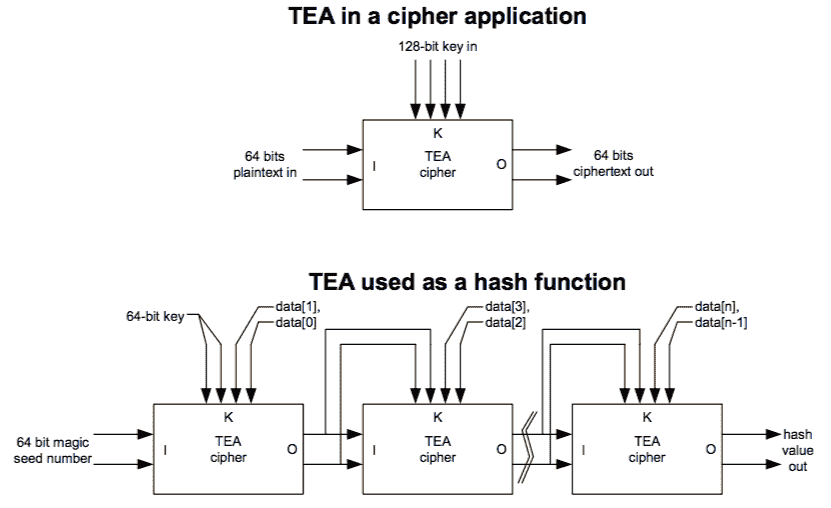
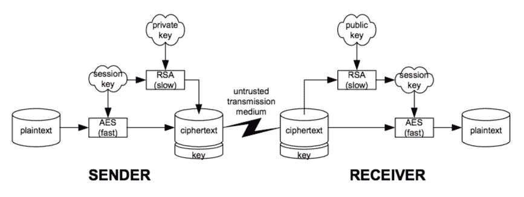
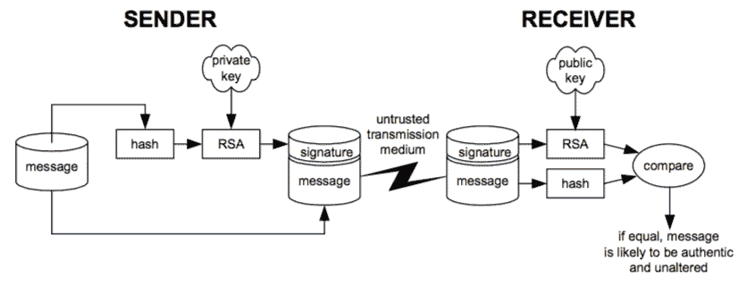

# 第七章 -

安全简明指南

黑客攻击 Xbox 需要除了硬件和固件黑客攻击之外的安全黑客攻击，正如你在上一章中发现的那样。我们将探讨在像游戏机这样平凡的事物上添加复杂安全性的可能动机，然后我们将深入了解理解和欣赏 Xbox 安全机制所需的基本原理和算法。

## **谁需要安全，毕竟？**

游戏机对大多数人来说只是一个玩具：它成本低廉，属于消费电子产品。为什么微软要费这么大的劲来确保他们的系统安全？在安全黑客游戏中，了解安全者的动机通常有助于发现可以利用的弱点。

密码学不是安全。密码学是实现安全的一种手段，但真正的安全涉及整个系统架构，包括最终用户。正如凯文·米特尼克在最近的 Slashdot 访谈中所说，“……安全不是可以现成购买的产品，而是由政策、人员、流程和技术组成的。”¹我相信安全从根本上讲是一个社会概念。在实践中，你可以打开窗户，但锁上门，人们不会仅仅通过窗户走进来或撬锁，尽管这两项任务相对简单。锁着的门和开着的窗户之所以有效，是因为锁着的门主要是一种象征性的措施；它迫使入侵者做出违反规定的自觉行为才能进入房屋，而这本身就足以将罪犯与好人区分开来。索尼的 PlayStation 游戏机就是一个很好的前门锁安全例子。他们用来复制保护游戏的方法很简单，不涉及密码学，而且可以通过安装便宜且容易的硬件修改来轻松绕过。尽管如此，销售数据显示购买 PlayStation 游戏仍然很流行；前门锁是有效的。

微软采用了前门锁式安全的一种变体。Xbox 游戏使用的是（到目前为止）不可复制的 DVD-9 格式，这是一种单面双层媒体格式。另一方面，用户可写的 DVD 总是采用 DVD-5 格式，这是一种单面单层媒体格式。由于制作能够在不影响另一层完整性的情况下烧录单层的写入系统很困难，因此 DVD-9 兼容的刻录机可能不会很快出现。因此，通过在 DVD-9 盘的两层之间分配安全数据，并要求游戏可执行文件来自 DVD-9 媒体，微软对其视频游戏实施了一种相当有效的“前门锁”。通过巧妙地要求 DVD-9 格式，微软几乎迫使任何潜在的盗版游戏者进入一个需要某种硬件修改的领域。

那么，微软为什么要冒险在 Xbox 上投资如此复杂的加密方案呢？微软的主要动机真的是为了遏制盗版吗？实际上，Xbox 安全系统其余部分——安全引导扇区、签名可执行文件、信任关系和加密/认证网络协议——的主要理由可能并不在于反盗版措施。

所有这些安全措施的一个可能动机是为了防止将 Xbox 游戏机用于除游戏以外的任何目的。Xbox 游戏机处于一个独特的位置，它几乎是一个 100% 的库存 PC。与 Gamecube 和 Playstation2 不同，有一大批软件似乎应该在 Xbox 上运行，只要进行适当的 BIOS 编程。更糟糕的是，与竞争对手相比，微软在游戏机硬件上的亏损要多得多。有些人估计，其亏损可能高达每台 200 美元，假设最新的零售价为 199 美元。因此，对微软来说，确保它不是在销售补贴的 GNU/Linux 硬件盒很有兴趣。然而，这甚至可能不是微软的主要目标。Xbox 的 64 MB 主内存、没有键盘或鼠标以及相对较慢的处理器（按照今天的标准），使得它不如 2002 年晚些时候在沃尔玛出售的 200 美元 Microtel PC 有吸引力。此外，微软财大气粗；如果 Xbox 在市场上取得成功，并且销量超过索尼的 Playstation2，微软只需承担数十亿美元的初期亏损——与它坐拥的大约 400 亿美元现金储备相比，这个数字相对较小。因此，Xbox 安全性的关键任务可能不是防止替代游戏机使用或阻止盗版。

也许 Xbox 复杂安全性的真正原因是为了确保 Xbox Live 的成功，这是微软的在线游戏服务。微软的市场炒作和公关声明表明，它正在押注 Xbox Live 的成功来推动硬件销售。此外，Xbox Live 是一项订阅服务，从其推出之日起，用户将不得不支付每月费用。如果微软能让其订阅者对 Xbox Live 上瘾，那么突然之间，Xbox 业务看起来非常有利可图，即使在前端硬件上损失了大量资金。当然，关键是要让 Xbox 用户对 Xbox Live 上瘾。被誉为“在线游戏的迪士尼乐园”，Xbox Live 的目标是提供执行良好且公平的游戏体验。Xbox Live 的价值主张的核心是没有任何作弊者。为了确保没有人作弊，用户必须被迫通过 Xbox Live 维护的注册表进行身份验证，并且他们的游戏状态必须保持安全且不可修改。此外，游戏软件必须未经修补。更重要的是，只需要少数几个作弊者就能破坏整个用户群体的游戏体验。如果你把企业的成功赌在数百万二十多岁的硬核男性玩家身上，他们分布广泛，具有一定的计算机知识，那么你面临的几率是相当不利的。硬件必须可信，网络连接安全，可执行文件必须签名并密封。

硬件必须可信这一说法值得反复强调。考虑到用户基础不可信，与客户建立信任关系的唯一途径是确保每一件硬件中都有一个信任的种子。因此，微软必须在每个客户端中包含一块防篡改的硬件，以实现某种形式的证明。证明是指能够证明某些数据，例如玩家的身份或游戏状态，实际上是由未受污染的软件和硬件生成的。防篡改的硬件不必直接实现证明功能，但它必须至少确保在证明之前系统处于可信状态。

确保硬件可信任有许多方法。最简单的方法是使整个硬件物理上安全。自动取款机（ATM）是物理安全的硬件的典型例子。密封在厚金属板中，并覆盖有入侵传感器，很难物理穿透和修改 ATM 的硬件。然而，虽然这种方法有效，但对于游戏机来说，这是一个不切实际且昂贵的解决方案。一个更经济的方法是使用一小块可信任的防篡改硬件，可以对系统其余部分进行“测量”。这类测量通常通过使用加密哈希函数来完成。如果所有这些信任度量都与预期值相符，那么可以得出结论，整个系统是可信任的。

我说“可能”，因为这个方案仍然容易受到中间人攻击，黑客会向测量查询发送伪造的有效数据。中间人攻击指的是一类攻击，其中攻击者可以自由修改和控制两个当事人之间传递的信息。由于中间人弱点，使用极其复杂的防篡改模块进行系统测量是没有意义的。一个封装的硅芯片可能就足够了，因为通常更容易拦截和伪造在印刷电路板上传输的测量数据，而不是穿透芯片的环氧封装并修改芯片的电路。

信任度量系统可以使用一次测量方法实现。从处理器的冷启动序列开始，每一段代码在执行前都会进行信任度测量。如果处理器从未执行过不受信任的代码，那么还有什么不信任的呢？这个方案需要一个非常简单的防篡改硬件模块——一个防篡改的只读存储器（ROM），它存储着冷启动代码，作为信任的“种子”。用于测量和验证过程的加密类型通常是哈希和公钥加密的组合。在这个应用中，公钥加密更受欢迎，因为生成有效代码段所需的私钥只由硬件供应商保密保存。再次强调，这个方案容易受到许多中间人攻击，以及纯加密攻击和对系统实现的攻击。

## **密码学简明指南**

> **cipher** ( *n*): **1 a**: 零 **b**: 没有重量、价值或影响力的人 : 非实体。**2 a**: 转换文本以隐藏其意义的方法——与“code”²比较

密码本身并不提供安全性。更具体地说，只有当密钥安全、算法强大且系统中没有后门时，密码才提供安全性。如果有人给你一个用强大密码加密的 CD-ROM，并把你锁在一个填充的房间里，超级计算机可能在你解密 CD-ROM 之前就会发生超新星爆炸。另一方面，如果你能够观察并探测到机器在加密 CD-ROM 时的操作，那么加密就毫无意义了。你可以通过监听键盘来获取加密密钥。或者，你可以转储计算机内存的内容，从而在不了解密钥的情况下获得明文。

Xbox 的情况与后者类似。最终，Xbox 必须访问和运行在有效磁盘上提供的程序。此外，Xbox 中使用的 Pentium CPU 无法区分授权指令和未授权指令。最后，用户可以完全访问探测和修改 Xbox 硬件。因此，即使 Xbox 使用强大的密码，密钥的安全性也值得怀疑，系统中可能存在后门。

本节将简要介绍 Xbox 中使用的加密算法种类。我们将关注这些算法的实际影响和实现问题。为了理解 Xbox 安全系统中的可用攻击，您需要了解这些算法。

### 注意


**我并不假装要讨论密码学的理论方面；那些超出了我的能力，也超出了本书的范围。相反，我将有兴趣的读者推荐到布鲁斯·施奈尔（Bruce Schneier）的优秀著作《应用密码学》（John Wiley & Sons）；我大部分关于密码学的知识都来自这本书。对于已经熟悉密码学的读者，应该能够快速浏览或跳过本章的剩余部分。**

### **密码学算法类别**

Xbox 中使用了几个重要的密码学算法类别。这些包括：

• 散列

• 对称加密

• 公钥加密

*散列*有多种类型。密码学散列用于总结或“摘要”大量数据。这个总结是一个固定长度的数字，通常长度在 100 到 200 位之间，而源数据几乎可以是任何大小。散列最重要的特性是它是一个单向计算。换句话说，计算散列很容易，但要推导出具有相同散列摘要的数据序列或从散列中确定有关原始数据的任何信息是非常困难的（参见侧边栏“非常困难的问题”以了解这究竟意味着什么）。

哈希函数抵御找到两个哈希值相同的序列数据的强度被称为其*抗碰撞性*，一般来说，一个好的 n 位哈希函数需要大约 2^n/2 个随机数据序列进行哈希和比较，以引起碰撞。由于哈希函数被设计得非常容易计算和具有很高的抗碰撞性，因此它们常用于检测在大型安全数据区域中是否有位发生变化。对于许多应用来说，只需包含消息的加密哈希值，而不是花费计算努力加密整个消息，就足够了。

*对称加密*是那些加密和解密密钥可以很容易地从对方推导出来的算法。大多数情况下，加密和解密密钥是相同的。对称加密使用*混合函数*将*密钥调度表*与经过某些*密码函数*处理过的数据进行组合。这种混合可能在单个数据块上重复多次，如在分组密码中，或者可能只发生一次，如在流密码中。对称加密中的所有基本函数在计算上都很简单，因此对称加密是加密大量数据的首选方法。

混合函数的典型例子有异或（XOR）、模加和模乘。最简单的函数是异或，它具有任何数与自身进行异或运算结果为零的性质。异或运算通常用符号⊕表示。异或运算也具有所有通常的算术性质（交换律、结合律、分配律等），因此

(A ⊕ B) ⊕ B = A ⊕ (B ⊕ B) = A ⊕ 0 = A

因此，如果 A 是消息，B 是密钥，(A ⊕ B)将是密文，通过再次对 B 进行异或运算，可以简单地恢复明文。

*密钥调度表*是一种算法，它将一个相对较短的关键字扩展到一系列较长的位上。密钥调度表用于帮助将密钥数据扩散到更大的数据块上，以掩盖密文与密钥之间的关系。

## **非常困难的问题**

密码函数都是基于数学算法的，给定所有操作数时，其结果容易计算，但给定仅结果时，其操作数却非常难以计算。密码函数的安全性正是给定仅结果时计算这些操作数的难度。让我们花一点时间来探讨什么是非常困难。

以对称加密算法 AES 为例。它使用 128 位密钥，到目前为止，它对所有已知的分析性密码攻击都表现出强大的抵抗力，例如差分和线性密码分析。当我提到它对分析 X 有抵抗力时，我的意思是使用暴力搜索恢复密钥或明文至少需要与使用分析 X 一样多的操作。暴力搜索是指我使用一个非常快的计算机，尝试所有 2¹²⁸可能的密钥，以恢复原始数据。今天大多数常用的加密算法都对所有已知的密码分析技术有抵抗力，所以重要的是要了解暴力破解攻击的强度。

实际上，像 DES 这样的旧算法，一个 56 位的加密算法并不是一个很难的问题。使用 FPGA（现场可编程门阵列）构建一个能够以大约 2²²密钥/秒/美元的经济效益破解密钥的机器相当容易（2²²大约是四百万）。请注意，这个数字随着时间的推移以与摩尔定律相当的速度增加。今天，如果你愿意等待大约一周的时间来破解每个密钥，你就可以以一辆好车的价格来恢复它们。让我们希望银行不要使用 DES 来加密他们的账户数据！

DES 的继任者 AES，是一种可以使用 128 位、192 位或 56 位密钥的加密算法。这些密钥足够大，以至于被认为是无法通过暴力破解攻击（即一个非常困难的问题）来攻破的。根据 NIST（http://csrc.nist.gov/encryption/aes/aesfact.html）发布的 AES 问答，一个足够强大的机器，每秒通过暴力破解恢复一个 DES 密钥（平均每秒尝试 255 个密钥），仍然需要 149 万亿年的时间来恢复一个 128 位的 AES 密钥。我最喜欢的关于 256 位密钥对抗暴力破解攻击强度的分析来自布鲁斯·施奈尔的《应用密码学》。在他的书中，他使用了一个基于破解 256 位密钥所需能量的论点。结果是，即使是一个热力学上理想的计算机，也需要超过我们太阳年能量的 32 倍才能计算出 2¹⁹²，更不用说做任何有用的事情了。（我必须强调，所有这些都假设最有效的攻击是暴力破解。谁知道呢，也许有人会发现算法中的弱点，可以用来发起更有效的攻击。新的分析技术不断被发明，逐渐削弱了加密算法的强度。）

相反，公钥加密算法基于各种难以逆转的数学运算，例如素数乘法和模幂运算。因此，许多公钥加密算法的密钥空间很稀疏，所以需要更多的密钥位才能达到与对称加密算法相当的安全性。例如，RSA 公钥加密算法的密钥长度通常有几千位长。

RSA 公钥长度与对称密钥长度之间的确切相关性尚不清楚。RSA 的安全性被认为是大素数乘积分解的难度；然而，可能还有其他尚未发现的算法攻击。即便如此，分解大素数乘积的有效难度不仅因计算技术的进步（摩尔定律）而降低，还因数论方面的进步而降低，例如二次筛和一般数域筛法的发明和改进。1999 年 8 月，一组研究人员使用数域筛法在 7.4 个月内分解了一个 512 位的素数，包括设置分解运行所需的时间¹。此外，新技术如量子计算有望在多项式时间内实现素数的分解。然而，我并不抱有太大希望；关于是否能够构建足够大的量子计算机来分解有趣的素数，目前仍存在争议。截至今天，RSA Security，Inc.建议大多数企业使用 1024 位的密钥长度，对于“极其宝贵的密钥”则建议 2048 位²。布鲁斯·施奈尔在《应用密码学》的第二版中估计，2304 位的公钥长度提供了相当于 128 位对称密钥的安全性，而 1792 位的公钥长度则相当于大约 112 位的对称密钥。

当你阅读有关 Xbox 安全方案的内容时，请记住这些关于使用暴力破解法破解这些安全方案可能有多困难的基本指南。一次又一次，黑客论坛和公告板上贴出消息询问：“我们为什么不为这些密钥启动分布式密钥搜索工作？”现在你知道答案了。

¹ http://www.rsasecurity.com/rsalabs/challenges/factoring/rsa155.html

² http://www.rsasecurity.com/rsalabs/faq/3-1-5.html

在对称分组密码中使用的典型加密函数由一组精心设计的替换、置换、压缩和扩展组成。这些函数的作用是混淆和扩散明文。加密函数任何一部分的细微变化通常都会对密码的安全性产生深远的影响。

在对称密码中，加密和解密密钥密切相关，这使得它们在特定的安全应用中难以使用。例如，如果我想将加密文档分发给一个邮件列表，那么邮件列表上的每个人如果能够阅读文档，就必须有效地知道我的加密密钥。此外，与远程方建立联系也很困难，因为我在某个时候必须向他们传输密钥。有人观察传输介质可能会窃取密钥并读取、伪造和修改所有后续消息。

*公钥密码*是使用不同密钥进行加密和解密的算法。因此，它们也被称为非对称密码。公钥密码的一个主要优点是其中一个密钥可以保密。这允许与不受信任的用户进行数据交换，而不给不受信任的用户伪造或读取其他受保护内容的能力。公钥算法的缺点是它们通常需要更复杂的计算，因此比对称密码慢。公钥密码也倾向于需要更长的密钥才能达到等效的安全性。因此，如果需要交换大量数据，通常使用公钥密码来加密用于加密大量数据的对称密码的密钥。这个对称密码密钥可以针对每次交易是唯一的，因此它通常被称为“会话密钥。”

#### **SHA-1 散列**

SHA-1 是联邦政府在 FIPS 出版物 180-1（http://www.itl.nist.gov/fipspubs/fip180-1.htm）中推荐的安全散列算法。由 NSA 设计，基于 Ronald L. Rivest 的 MD4 消息摘要算法，SHA-1 可以处理长度小于 264 位的任何消息，并生成 160 位的输出。SHA-1 散列算法从确定性的 160 位种子状态开始；这个状态在四个回合中与 512 位的消息数据块混合。每一轮由一系列非线性函数、旋转、移位和异或操作组成。每一轮的结果被用来作为下一轮计算的种子。一般来说，需要生成 280 个随机消息，进行散列和“同时”比较，以找到具有相同散列值的两个消息（即散列冲突）。找到具有相同散列值的两个随机消息被称为“生日攻击”，这个名字来源于被称为“生日悖论”的概率现象：在 23 人的房间里，两个人共享同一生日的机会超过 50%。另一方面，需要生成 2160 个随机消息，进行散列和比较，以找到散列值与特定消息相同的消息。因此，散列函数的强度在很大程度上取决于其使用方式。

```

void encipher(unsigned long *const v,unsigned long *const w,
               const unsigned long *const k)
{
  register unsigned long
           y=v[0], z=v[1], sum=0, delta=0x9E3779B9,
           a=k[0], b=k[1], c=k[2], d=k[3], n=32;

  while(n—>0) {
     sum += delta;
     y += (z << 4)+a ^ z+sum ^ (z >> 5)+b;
     z += (y << 4)+c ^ y+sum ^ (y >> 5)+d;
  }

   w[0]=y; w[1]=z;
}

```

**列表 7-1**：TEA 算法在 ANSI C³ 中

#### **TEA**

TEA，或小型加密算法，是由剑桥大学计算机实验室的 David Wheeler 和 Roger Needham 开发的。（开发者有一个关于 TEA 的网页 http://vader.brad.ac.uk/tea/tea.shtml；这里展示的大部分材料都是从该页面上获取的。）

如其名所示，TEA 是一个紧凑、快速的加密算法，适合加密实时数据流和处理器性能和存储空间紧张的应用。TEA 有一个 128 位的密钥，它一次操作 64 位数据，并且它的每个 32 轮都只使用位移、XOR 和加法。（该算法，如列表 7-1 和图 7-2 所示，是针对 32 位通用处理器优化的。）



**图 7-1**：TEA 密码的使用场景。


**图 7-2**：TEA 的内部结构。此图描述了 TEA 的单轮，它被重复 32 次以完成整个密码。密钥调度在右侧的框中描述，用于作为密码和哈希函数。

人们认为，当用于加密和解密数据时，bantam TEA 算法相当安全。然而，在 Xbox 中并没有使用 TEA 进行加密；实际上，它通过在修改后的 Davies-Meyer 模式下运行密码，作为哈希函数使用。要哈希的区域被分为 64 位块。这些源数据块被用作 TEA 密钥输入的一半。密钥输入的另一半来自前一个 TEA 操作的结果，第一个 TEA 操作使用一个魔术数字作为其输入。

结果是一个 64 位的哈希函数，如图 7-1 所示。这个哈希函数对生日攻击比较脆弱，尤其是在 TEA 的计算效率下，平均只需要测试 2³²个消息对来找到碰撞。尽管生日攻击在 Xbox 的使用场景中不适用，但 Xbox 运行哈希两次，每次使用不同的魔术数字种子，并将结果连接起来生成一个单一的 128 位哈希值——这可能是为了防止暴力攻击。

不幸的是，TEA 在其密钥调度中有一个弱点：每个 TEA 密钥都有四个相关密钥。换句话说，对于每个密钥，你可以生成三个其他密钥，这些密钥使用相同的输入数据产生相同的密文结果。相关密钥生成就像补全密钥位的对（位 31 和 63 是一对，位 95 和 127 是另一对）。这使得 TEA 不适合用作哈希函数，这个弱点在 John Kelsey、Bruce Schneier 和 David Wagner 撰写的论文“IDEA、G-DES、GOST、SAFER 和三重 DES 的密钥调度密码分析”中得到了很好的记录，这篇论文是在多年前的 CRYPTO 1996 会议上提出的。这个弱点后来被 Andy Green 领导的一个团队利用，以破解 Xbox 安全方案的第二个版本。

#### **RC-4**

RC-4（罗恩的代码或 Rivest 密码 4）是由罗恩·里韦斯特提出的一种可变密钥长度的流密码。RC-4 的核心是密钥流生成器。它可以被认为是一个密码学伪随机数生成器（CPRNG）。CPRNG 的输出逐字节与明文流进行 XOR 运算以生成密文。解密以类似的方式完成。简单来说，生成器通过一个值（密钥）进行“初始化”，该值最长可达 256 字节（2048 位）。如果密钥短于 256 字节，它将被重复以填充 256 字节，然后作为种子使用；这允许密钥长度可变。在 Xbox 中，密钥长度为 16 字节（128 位），因此该加密算法被称为 RC-4/128。

```
typedef struct rc4_key {
  unsigned char state[256];
  unsigned char x;
  unsigned char y;
} rc4_key;

void prepare_key(unsigned char *key_data_ptr, int key_data_len,
                rc4_key *key) {
  unsigned char swapByte, index1, index2;
  unsigned char* state;
  short counter;

  state = &key->state[0];
  for(counter = 0; counter &lt; 256; counter++)
    state[counter] = counter;
    key->x = 0;     key->y = 0;
    index1 = 0;     index2 = 0;
  for(counter = 0; counter &lt; 256; counter++) {
    index2 = (key_data_ptr[index1] + state[counter] +
              index2) % 256;
    swap_byte(&state[counter], &state[index2]);
    index1 = (index1 + 1) % key_data_len;
  }
}

void rc4(unsigned char *buffer_ptr, int buffer_len, rc4_key
        *key) {
  unsigned char x, y, xorIndex;
  unsigned char* state;
  short counter;

  x = key->x;     y = key->y;

  state = &key->state[0];
  for(counter = 0; counter &lt; buffer_len; counter ++) {
    x = (x + 1) % 256;
    y = (state[x] + y) % 256;
    swap_byte(&state[x], &state[y]);
    xorIndex = state[x] + (state[y]) % 256;
    buffer_ptr[counter] ^= state[xorIndex];
  }
  key->x = x;     key->y = y;
}

```

**列表 7-2**：RC-4 的 C 语言代码，来自原始 Usenet 帖子。⁴

RC-4 被认为是一种强大的加密算法，尽管在密钥调度算法中存在一些已知的弱点，这些弱点可以在设计不良的加密系统中被利用，例如 WEP。斯科特·弗卢勒、伊齐克·曼丁和艾迪·沙米尔在题为“RC4 密钥调度算法的弱点”的论文中记录了这些弱点，该论文是在 2001 年第八届密码学选区年度研讨会（8 月）上提出的。这些弱点中没有任何一个可以应用于 Xbox 对 RC-4 的实现。

然而，在 Xbox 安全性的第一版中，RC-4 的使用方式存在一个潜在问题。RC-4 在 Xbox 上用于加密一系列 x86 代码，并且对解密后的代码没有进行任何显著的检查以确保明文的完整性。这意味着密文中的变化将导致 Xbox 执行的代码发生变化。关键是找出密文中导致代码有意义修改的变化。由于 RC-4 一次加密一个字节，而 x86 操作码可以短至一个字节，因此通过变异密文最多需要 2⁸ = 256 次迭代来“暴力破解”一个指令到单个已知位置。

确定要暴力破解的位置可能很棘手，但我怀疑通过变异密文位并观察指令提取模式的改变，即使开启缓存，也能推导出大量信息。目标将是尝试识别跳转操作码操作数的位置，并修改跳转目标，使得受保护程序跳入内存中的非受保护区域。这个过程类似于玩经典的桌面游戏“战舰”。记住，攻击如此简单，猜测一个千字节代码只需要最多 218 次迭代。通过在主机计算机上运行的控制脚本将逻辑分析仪与 ROM 仿真器集成，可以自动化猜测过程。

RC-4 背后的历史实际上非常有趣。RC-4 是在 1987 年由 Ron Rivest 发明的，并被 RSA Security 公司作为商业机密保留，直到 1994 年通过一个匿名帖子发布到一个密码朋克邮件列表（见列表 7-2）。由于 RC-4 的简单性和健壮性，它被广泛应用于多个应用中，包括 WEP、SSL、SQL 和 CDPD。尽管 RC-4 的源代码广泛分发且众所周知，但该加密算法仍然是 RSA Security 的知识产权。在没有首先从 RSA Security 获得许可的情况下，我不建议将其集成到商业产品中。



**图 7-3**：使用会话密钥的 RSA。



**图 7-4**：RSA 用于实现数字签名。

#### **RSA**

RSA 是由 Ron Rivest、Adi Shamir 和 Leonard Adleman 在 1977 年设计的一种公钥算法。在公钥算法中，使用两个不同的密钥，即公钥和私钥。正如它们的名称所暗示的，私钥必须保密，而公钥可以自由分发。RSA 背后的数学原理在标题为“RSA 算法”的侧边栏中简要描述。您不需要理解 RSA 背后的数学细节，就可以理解 RSA 在 Xbox 环境中的应用。

目前认为，在超过约一千位长度的密钥上对 RSA 进行暴力攻击是不可行的。同时请注意，对 RSA 如何集成到加密系统中不能过于轻率。存在一些针对使用 RSA 的协议的攻击，例如诱使私钥持有者签署精心设计的消息，然后可以使用这些消息推导出签名者的私钥。

使用 RSA 加密消息就像在消息上调用 RSA 一样简单。然而，RSA 加密是在消息块上进行的，这些块太短，加密过程也太慢，以至于对于大多数消息来说不实用。因此，RSA 通常用于加密一个单次使用的随机密钥，称为会话密钥，然后使用这个会话密钥加密大量消息。这个过程在图 7-3 中进行了说明。

除了加密之外，RSA 还支持数字签名。数字签名允许在不安全介质上交换消息的各方保证消息没有被伪造且未被修改。消息不必被加密。一个典型的数字签名协议的工作方式如下：发送者计算要发送的消息的哈希值。然后，使用发送者的私钥加密这个哈希值，并将其与消息明文一起包含。接收者使用发送者的公钥解密加密的消息哈希，并将其与接收到的消息的本地计算的哈希值进行比较。如果与消息一起发送的解密哈希值和本地计算的哈希值一致，那么接收者可以得出结论，该消息是真实的且未被篡改。这个过程在图 7-4 中进行了概述。

## **RSA 算法**

RSA 算法于 1983 年由麻省理工学院获得专利，并独家许可给 RSA 数据安全公司。RSA 算法的专利已于 2000 年 9 月到期。因此，今天 RSA 可以在任何应用中免费使用。现在互联网上可以找到许多使用 RSA 的出色教程和教育示例。使用关键词“RSA 算法”进行谷歌搜索，以找到其中的一些示例。

RSA 算法如下（改编自 http://world.std.com/~franl/crypto/rsa-guts.html）：

1. 找到两个大（数千位长）的质数，“P”和“Q”。

2. 选择“E”，使得 1 < E < PQ，并且 E 与(P-1)(Q-1)互质。E 不必是质数，但它必须是奇数。**E 和 PQ 的这对组合是公钥**。

3. 计算“D”，使得(DE - 1)能被(P-1)(Q-1)整除。这可以通过找到一个整数 X，使得 D = (X(P-1)(Q-1) + 1)/E 是一个整数来实现。**D 是** **私钥**。

4. 明文“T”使用以下函数进行加密

C = (T^E) mod PQ

5. 使用以下函数解密密文“C”

T = (C^D) mod PQ

注意 T < PQ。大于 PQ 的消息必须分解成一系列较小的消息，而非常短的消息必须用精心选择的值填充，以防止字典攻击等问题。

如果这个协议听起来很复杂，那么它确实很复杂。有很多地方可能会出错。接收者可能拥有发送者公钥的虚假副本。发送者的私钥可能已被泄露。哈希可能存在弱点。在对抗性环境中使用数字签名需要在系统设计的所有层面上注意细节。

在 Xbox 中，数字签名用于控制控制台程序的发行和销售。微软实际上控制着消息的发送者和接收者。接收者——Xbox 控制台——被编程为只能运行由微软数字签名的程序。在理想的世界里，这保证了微软对谁可以在控制台上运行程序或不能运行程序有最终决定权，黑客无法修改游戏以插入病毒、特洛伊木马或后门。保存的游戏也使用加密进行密封，因此，名义上不可能通过修补可执行文件或提高角色统计数据来破解游戏并作弊。

显然，破解 Xbox 游戏机的关键问题在于其数字签名系统的实现。Xbox 使用 SHA-1 散列和 2048 位 RSA 密钥，这使得成功暴力破解攻击的可能性非常非常小。当然，如果你从未尝试过，概率为零，但成功的几率对你来说很小（参见侧边栏“非常困难的问题”）。你尝试赢得彩票的机会可能会更大。这绝非偶然；私钥的发现将使游戏复制变得简单，开发者不必向微软支付版税（从法律上讲，他们可能负有义务，但没有技术上的理由阻止他们）。鉴于这个密钥可能对微软价值数十亿美元，很可能没有单个人类知道完整的密钥，因为橡皮管（殴打）和绿纸（贿赂）密码分析技术对人类来说通常非常有效。（如果你试图保护极其宝贵的秘密，不要低估真正的“暴力破解”！）像 BBN 的 SignAssure™证书管理机构这样的产品确保了高价值密钥的物理安全，并实施了需要多个可信用户激活机器的秘密共享方案。

如前所述，存在一些针对 RSA 的已知可行攻击，但并非所有这些攻击都适用于 Xbox 场景，因为它们依赖于用户群体或需要选择密文。此外，弱点列表是广为人知的，大多数数字签名实现都采取了适当的对策来保护免受此类攻击。

#### **图片的其余部分**

一个有效的安全系统需要良好的密钥管理、强大的协议，以及对于 Xbox 来说，除了强大的加密和散列算法之外，还需要物理安全。

密钥管理可能是任何安全架构师面临的最困难系统实现任务之一。最终，解密密钥需要落入用户手中。用户界面必须设计得让经过最少培训的普通用户不会意外泄露密钥信息。随着加密算法的增强，攻击的最简单途径越来越多地是通过用户。通过监控视频进行监听、社会工程学，甚至分析键盘按键时产生的声音模式作为密码，可能会在单位努力中获得关于通行证的信息，这比密码分析更有可能。公钥密码学部分解决了密钥分发的问题，但公钥指纹应该亲自比较，以排除中间人攻击的可能性。公钥密码学也不能防止有人物理访问客户端机器，从而监听解密后的输出。

此外，协议攻击发现了在处理密钥和数据的方式，或者在强加密算法的使用方式中存在的弱点。对 RC-4 的 WEP 攻击以及 Mike Bond 和 Ross Anderson 对 IBM 4758 密码处理器的攻击都是协议攻击的例子。潜在协议攻击的红旗是实施向后兼容性措施的系统和由那些主要工作不是密码安全工程师实施的系统。

最后，在像 Xbox 这样的系统中，其中一个目标是建立一个可信赖的客户端，后门和缓冲区溢出攻击也是对机器信任状态的有效攻击。没有广泛使用的商用处理器在指令流或数据标签中嵌入执行权限。处理器盲目地执行任何它被指示跳转的代码，无论这种跳转是通过瞬时的硬件故障还是通过恶意放置的代码引起的。机器状态的周期性散列可以用来弥补这种不足，但即便如此，状态检查也可能被欺骗。

如本章开头所讨论的，建立客户端的信任状态还需要一个防篡改的硬件部件来携带信任的种子。物理安全必须足够，使得一次破坏安全变得不经济，并且足够强大，以至于一次安全破坏不会使对其他控制台进行简单攻击变得容易。在下一章中，将讨论设计物理安全时的权衡以及微软为此做出的决策。

本章的寓意是，安全需要设计良好的**系统**。尽管加密算法已经足够强大，使得暴力攻击变得无关紧要，但系统的复杂性却在增加。这种复杂性增加了可行协议或后门攻击的可能性，但几乎没有帮助用户免受更传统的窃听、橡皮管攻击和用户错误攻击。

* * *

¹ http://interviews.slashdot.org/article.pl?sid=03/02/04/2233250&mode=nocomment&tid=103&tid=123&tid=172

² Merriam-Webster 在线词典 (www.webster.com)。

³ 代码来自 http://vader.brad.ac.uk/tea/source.shtml#ansi

⁴ 代码来自 http://www.cc.jyu.fi/~paasivir/crypt/rciv/rc4article.txt。对空白进行了轻微的修改，以便全部内容都能适应一页。交换字节函数的定义也没有包含，但你可以通过其名称猜测其功能。
