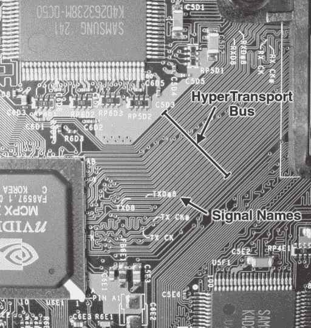
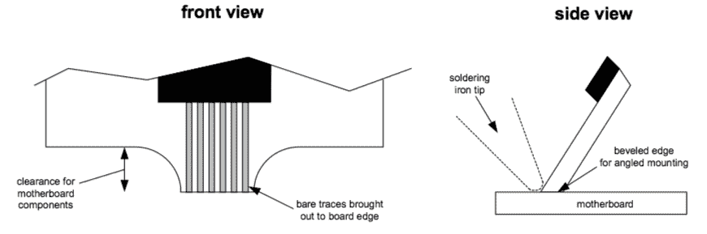

# 第八章 -

反向工程 Xbox 安全性

在本章中，我将描述我是如何击败了第六章中首次遇到的 Xbox 安全系统的初始生产版本。该安全系统是在分析 FLASH ROM 并意识到真正的硬件初始化和引导映像解密序列以某种方式隐藏在 FLASH ROM 之外后发现的。第七章介绍了一些基本的加密概念，这些概念将有助于理解本章的内容。

## **从硬件中提取秘密**

如第六章所述，Xbox 中的隐藏引导代码可以通过监听以下总线之一来恢复：（1）前端总线（FSB），（2）主内存总线，或（3）北桥-南桥连接。

Xbox 中使用的 Pentium 处理器的前端总线（FSB）格式在 Intel 开发者网站上可用的 Pentium III 处理器数据表中进行了记录。FSB 是一个双向 64 位数据总线，大约有五十个地址和控制信号，所有信号都以 133 MHz 的速度运行。总线使用一种称为 AGTL+的信号约定。由于信号数量众多且物理形式因素具有挑战性，监听此总线是一个昂贵且困难的做法。可行的方案包括：（a）使用价值数千美元的特殊仿真器断开插座来安装处理器，或（b）反向工程 Xbox 主板上的每个 FSB 迹线的含义，并在几乎每一个信号上焊接一段短探针线。此外，还需要一个支持 AGTL+信号的逻辑分析仪。所有这些因素的结合使我不得不在其他地方寻找监听的起点。

我们下一个监听候选者，主内存总线，是一个 128 位数据总线，带有地址和控制信号，以 200 MHz 的双倍数据速率（DDR）时钟运行。内存总线使用一种称为 SSTL-2 的信号约定。（通过阅读三星 K4D263238M 内存部件的数据表，可以推断出此总线的详细信息，该数据表可在三星电子网站上找到。）尽管速度更高，但由于 Xbox 主板中设计了空（备用）内存足迹，监听主内存总线可能比监听处理器 FSB 更容易。

一个相对便宜的标准 100 引脚 TQFP 适配器（薄型四边扁平封装，一种具有 100 个鹤嘴形引脚的矩形芯片封装）可以被焊接在空白的内存焊盘上。这些适配器将提供方便的探针点，用于连接逻辑分析仪。这种方法的问题是你只能捕获写入主内存的数据。解密密钥通常是只读数据，只读数据将直接从隐藏的引导只读存储器进入处理器缓存，而不会存储到主内存中。一旦处理器处理完包含密钥的缓存行，它将被覆盖，因此密钥永远不会离开处理器的物理边界。

## **关于高速信息传输的更多信息**

在计算机总线上窃听和修改数据是一种强大且难以防御的技术。为了理解如何窃听，你需要了解一些关于数字信息如何在计算机内部传输的背景知识。

信号标准主要有两大类：单端和差分。在导线上传输数字信息需要将其转换为物理量，如电压和电流。传统上，信号是以相对于一个称为“地”的公共参考电势测量的电压来定义的。这种信号被称为单端或非平衡信号。不幸的是，地参考点的概念仅在信号相对于其传播时间变化缓慢时才有效。实际上，每一个电势的变化都伴随着电流的流动。自然法则要求电流守恒，即对于每一个方向的电流流动，必须有相反方向的电流流动。在单端信号中，反向电流，也称为返回电流，必须通过“地”返回。在非常高的速度下，电流的返回路径不一定与信号电流的路径相同。这种不平衡导致信号失真。

差分信号通过使用两根线来传输信号，其中一根用于信号电流，另一根用于显式的返回电流路径，以此来解决上述问题。差分方法允许信号和返回路径被布置得相互跟踪，确保电流的流动保持平衡。结果是，以两倍线数为代价，得到了一个更健壮的信号传输系统。

一种将电压解释为逻辑值的特定标准称为信号约定。在晶体管性能如此之差的时期，发明了值得尊敬的 TTL 和 3.3V CMOS 信号约定，那时需要大的信号波动。最近，许多新的甚至旧的信号约定正在变得越来越受欢迎，如 SSTL（串联假负载终止逻辑）、GTL（枪式收发器逻辑）、LVDS（低电压差分信号）和 PECL（伪发射极耦合逻辑）。这些高速信号约定解释了电波相对于数据传输速率传播得较慢的事实。它们还解释了电波携带的能量必须在旅程结束时耗散，否则能量将反射并干扰入射波的事实。

在高速应用中，为了强调这些波相对于信号转换时间（信号在“1”和“0”状态之间转换所需的时间）传播得较慢，通常将电线称为“传输线”。（请注意，速度比较是相对于信号的转换时间进行的，而不是其粗略的信号频率。）一个常见的错误是认为由于信号的时钟频率较慢，可以忽略传输线效应。即使每年只有一个转换，如果该转换的持续时间仅为皮秒（一万亿分之一秒），问题仍然可能发生。

对于新手来说，好消息是来自 Xilinx 等供应商的最新 FPGA 带有对几乎所有广泛部署的信号标准的内置支持。另一个好消息是信号标准正变得越来越有文档记录。例如，Xilinx FPGA 数据表说明了每个支持的信号标准所期望的终端电阻的位置和值。通过遵循数据表和应用说明中的推荐做法，您可以使用 FPGA 监听广泛的信号。只需记住将您的监听探头尽可能保持短，您就不会出错。

第三种潜在的监听候选者是北桥到南桥的连接，这是一对单向、8 位宽的差分总线，每个总线只有一个控制信号和一个时钟信号。该总线使用 HyperTransport 信号约定，以 DDR 时钟频率 200 MHz 运行。总线的信号约定是从 nVidia 网站上关于与 Xbox 芯片组紧密相关的 nForce 的公开可用信息中推断出来的。使用示波器进行了一些测量，并与 HyperTransport 联盟网站上可用的开放 HyperTransport 规范进行了交叉验证，以验证假设 HyperTransport 信号约定确实在使用。

HyperTransport 总线在 Xbox 主板上实现，所有信号都是并行且均匀分布的，这个决定可能是由总线的高运行速度所驱动的。这使得总线成为窃听的理想目标，除了它运行在如此高的数据率之外。在如此高速率运行的总线上窃听需要特别注意窃听轨迹的长度（以保持信号的完整性），并且还需要一个相当昂贵的逻辑分析仪或定制的分析电路。

最终，北桥-南桥连接被选为第一个窃听的总线，因为它拥有的线缆数量最少，因此需要的焊接量也最少。北桥-南桥连接只有十个独特的信号，而 FSB 和主内存各有大约一百个信号。焊接大量连接不仅消耗大量时间，而且由于焊桥或损坏的轨迹，还大大增加了硬件故障的风险。因此，最小化焊接连接的数量可以最小化对主板的附带损害风险。

### **窃听高速总线**

我在 2002 年 1 月下旬承诺采用 HyperTransport 窃听方法。这种方法存在一些重大的技术问题：

• 在不破坏信号完整性的情况下窃听高速差分总线

• 寻找或构建一个能够跟上 HyperTransport 总线 400 MB/s 数据率的日志工具

• 确定主板上的差分 HyperTransport 总线轨迹的极性和比特顺序

#### **在预算内挖掘总线**

前两个问题紧密相连。高速总线分析和日志工具通常具有专有接口，这需要为 Xbox 主板定制适配器。最后一个问题，确定比特极性和顺序，只需要在数据记录器连接并运行后进行大量的后处理和数据整理。

HyperTransport 是一个获得行业认可的开标准，这意味着市场上可以找到适用于总线的现成协议分析仪和日志工具。一个例子是 FuturePlus 的 HyperTransport 协议分析仪。不幸的是，这个协议分析仪在开展工作时的价格超过了 25,000 美元。此外，协议分析仪需要目标板特别设计以适应协议分析仪的接口模块。

与其购买协议分析仪并投入时间和精力来适应它在 Xbox 上的使用，我构建了自己的简化版。这项任务可行，因为 HyperTransport 协议相当简单。Xbox 对 HyperTransport 的实现使用了两个 8 位单向总线，一个用于发送，一个用于接收。每个总线都与其相关联一个时钟和一条选通线。信号标准要求在时钟的每个边缘上呈现有效数据。新数据包的开始由数据线离开空闲状态来指示。选通线区分命令和数据包。所有其他总线典型的边带信号，如地址、读写控制、芯片选择和中断线，在 HyperTransport 中都是通过带内命令包来处理的。因此，只需要十个差分信号（二十根线）就可以监听总线——这对黑客来说是个好消息。

HyperTransport 协议足够简单，但如何找到既能物理连接到 Xbox 总线又能跟上 400 MB/s 速度的东西呢？构建这个 HyperTransport 总线分接的理想工具是一个 FPGA。然而，在当时，没有 FPGA 能够跟上高速数据率，更重要的是，没有经过供应商认证可用于 HyperTransport 的 FPGA。理论上，Xilinx Virtex-II FPGA 适用于这个应用，但该产品刚刚推出，设备价格昂贵且难以获得（如今，你可以以不到一百美元的价格购买低端 Virtex-II FPGA）。当时我手头最好的 FPGA 是一个 Xilinx Virtex-E FPGA，我之前将其设计到我的论文原型超级计算机网络路由器中。该网络路由器板使用 CTT（中心抽头终止）信号为其网络接口，并且板上还配备了一个 Intel StrongArm 处理器，用于配置、控制和调试目的。

因此，挑战归结为如何将 HyperTransport 信号与 CTT 信号接口，以及如何从本意不用于这些速度的 FPGA 中榨取 400 MB/s 的性能。

结果表明，HyperTransport 信号约定与更常见的 LVDS（低电压差分信号）约定非常接近，该约定在 TIA/EIA-644 标准中指定。HyperTransport 驱动器通常创建一个中心在 600 mV 共模电压周围的 600 mV 差分摆幅的信号。另一方面，LVDS 接收器可以理解具有大于 100 mV 差分摆幅和 50 mV 至 2.35 V 之间任何共模电压的数据。因此，LVDS 接收器可以直接与 HyperTransport 驱动器兼容！（尽管 Virtex-E 支持直接连接到 LVDS 信号，但我无法利用这一点，因为我拥有的 Virtex-E 部件已经被设计进了一个为 CTT 信号硬连线的系统中。）如果你正在设计自己的分接板，最佳方法将是使用 FPGA 的本地 LVDS 功能，而不是这里描述的破解方法。此外，LVDS 接收器必须非常靠近 Xbox 主板，以避免损坏目标信号。长电缆会从线上耗散能量，并引入可能使系统停止工作的噪声和反射。

## **关于驱动信号到 HyperTransport 的思考？**

本章描述的窃听应用只需要一个 HyperTransport 接收器。像“中间人”攻击这样的应用则需要一种可以覆盖 HyperTransport 信号并插入一个或两个错误比特的设备。这样的设备是可行的，因为 HyperTransport，就像 LVDS 一样，使用电流模式驱动器。换句话说，驱动器被设计成只将一定量的电流驱动到线上，而不考虑它产生的电压。在正常情况下，这工作得非常好，因为线的阻抗根据欧姆定律将电流转换成电压。然而，电流可以相加并相互抵消。一个对抗性的差分驱动器可以连接到 HyperTransport 线上，并施加一个过驱动电流来抵消预期的信号。这种过驱动可以使用 Xilinx Virtex-E 和 Virtex II 等 FPGA 中提供的灵活、可编程的 I/O 来实现。

这种总线覆盖设备的简单应用之一将是修改重置向量的目的地，当它被发送到 CPU 时，这样你就可以控制 Xbox。重置向量的目的地编码在一个单字节中，该字节位于 0xFFFF.FFF0 处的“跳转”操作码之后。重置向量很可能在重置去激活后以确定性的时钟数被传输，因此这个攻击的定时元素可以只是一个由 HyperTransport 总线时钟时钟并由重置信号同步的计时器。这种“中间人”攻击甚至可以击败加密安全的公钥引导块实现。

解决将 HyperTransport 信号传输到 FPGA 问题的方案是使用信号转换芯片。LVDS 是电信系统中广泛使用的 LCD 面板接口和背板的标准，因此有大量的低成本 LVDS 到 CMOS 转换器可供选择。当然，所需的信号约定是 CTT，但仔细观察后发现，将 CMOS 驱动器连接到 CTT 接收器实际上并不成问题。CTT 是一种电流模式信号约定，它将+8 mA 或-8 mA 电流驱动到 1.5 伏特终止的 50 欧姆传输线。接收器是一个差分放大器，它将参考终止电压与传输线电压进行比较。在 Virtex-E 中，CTT 接收器放大器被指定在接收电压相对于参考电压上下波动超过 200 mV 时工作。大多数驱动 CTT 终止线的 CMOS 发射器在向 50 欧姆负载提供或吸收 8 mA 电流时都不会有问题。此外，CMOS 发射器应该没有问题驱动连接到固定电压的电线。因此，标准的 LVDS 到 CMOS 转换器芯片可以用来将 Xbox 主板上的 HyperTransport 信号传输到我为我的论文之前构建的板上。我选择的芯片是德州仪器的 SN65LVDS386，你可以在德州仪器的网站上找到该芯片的数据表。

通过 Xbox 主板上的 HyperTransport 总线使用的整洁布局，将 LVDS 到 CMOS 转换器芯片连接到板上变得非常简单。图 8-1 展示了 HyperTransport 总线布局的样子。注意所有电线是如何平行运行的，以及它们是如何均匀分布的。一些电线，如时钟（TX CK/TX CX* 和 RX CK/RX CX*）和选通线（TXD8/TXD8* 和 RXD8/RXD8*），甚至被标记了极性标记！这种简单的布局使得使用易于设计的分接板成为可能。

分接板仅包含 LVDS 到 CMOS 转换器芯片、一些电源调节电路，以及一组直接延伸到板边缘的线路，这些线路的间距与 Xbox 主板上的 HyperTransport 总线相同。为了实现相同的间距和便于对齐及安装，我使用数字卡尺测量了这些线路的尺寸。图 8-2 展示了 HyperTransport 总线线路的尺寸。



**图 8-1**：Xbox 主板上的 HyperTransport 总线布局。

测量有点棘手。我的方法是测量总总线宽度，然后将宽度除以走线和空间的数量，以获得平均预期的间距和走线宽度。然后我用 PCB CAD 程序布置这些走线，并在 1:1 的比例下将布局打印在纸上。我比较了打印的走线与电路板上的走线，并手动进行了一些调整。（请注意，许多打印机都有一些小的缩放误差，所以如果你尝试这样做，通过打印出几条已知长度的长线并测量它们来校准自己。打印机在水平和垂直轴上可能会有不同的缩放误差，所以务必在两个方向上打印线条。）


**图 8-2**：Xbox 主板上的 HyperTransport 总线走线的尺寸。1“mil”等于 1/1000 英寸或 25.4 微米。

使用合适的软件设计自己的电路板相当容易。你可以通过阅读附录 C，“进入 PCB 布局”，了解更多关于如何制作自己的电路板的信息。

一旦组件选择过程完成，HyperTransport 插针和信号转换电路板的设计和布局仅花了几个小时。电路板设计的示意图可以在图 8-6 中看到。然后，通过互联网下的订单来制造电路板。许多电路板制造商提供经济实惠、快速周转的电路板制造服务，这些服务通过电子邮件或 ftp 上传接受 Gerber 文件格式的电路板设计。在这种情况下，我五天内制作了两块电路板，每块电路板的价格为 33 美元（有关如何制作自己的电路板更多信息，请参见附录 C，“进入 PCB 布局”）。这个价格仅包括将电路板切割成方形部件的费用。然而，我需要电路板带有 HyperTransport 插针的一侧具有特殊形状，以便在不干扰 Xbox 主板上的现有组件的情况下安装电路板。我还需要电路板的配对边缘被斜切，这样电路板就可以以轻微的角度安装，简化将插针电路板焊接到主板上的任务。我使用砂光带手动雕刻边缘，使其符合图 8-3 中描述的形状。在雕刻时，电路板必须以使砂光带的磨料带首先接触电路板的走线侧的方式进行定位，以防止砂光带撕裂电路板上的铜走线。在使用砂光带雕刻像插针电路板这样的小电路板时要小心——砂光带同样可能意外地雕刻你的手指。

**图 8-3**：HyperTransport 插针电路板边缘的形状。

在雕刻斜边之后，所有部件都被焊接到了电路板上。（参见附录 B，“焊接技术”。）

完成的测试板现在必须固定到 Xbox 主板上。这一关键步骤可能是最困难的一个。首先，使用细砂纸去除 Xbox 主板上的绿色焊膏，露出目标焊线的亮铜色。然后，这些焊线被涂上助焊剂，并使用热烙铁尖端涂上一层薄薄的焊锡。

我用于将测试板固定到主板上的步骤在图 8-4 中展示。准备好的测试板使用一根细线（30 AWG）焊接在测试板上的一个焊线和主板上的一个焊线之间，以大约的位置和角度固定在主板上。搭接线仅作为临时辅助工具，用于固定板子，将被移除，因此如果线桥接多个焊线无关紧要。一旦线被固定，我小心地调整了测试板在主板上的位置，加热线以释放其连接，避免抬起任何铜线。 （我使用显微镜帮助确定最佳对齐。）一旦我对板子的位置满意，我就将强环氧树脂涂在板接缝上，以固定所有部件。环氧树脂应该固化并形成一个刚性、坚固的接缝。（请注意，某些环氧树脂如果应用不当会固化成凝胶；这是不可接受的，因为接缝的整个机械完整性必须来自环氧树脂，而不是焊缝。）我使用了 Miller-Stephenson 环氧树脂配方 907，它固化后足够坚固，我可以通过测试板提起 Xbox，而不会干扰测试连接。


**图 8-4**：测试板焊接步骤。


**图 8-5**：安装在 Xbox 主板上的 HyperTransport 测试板。

环氧固化后，我移除了用于固定测试板的临时搭接线，并用一小块焊锡膏和助焊剂清理了裸露的焊接线。将测试板焊接线焊接到裸露的主板焊接线上的最后一步现在与将任何表面贴装组件焊接到板上的步骤没有区别；附录 B 中描述的大多数标准技术可以直接应用于这种情况。图 8-5 显示了最终组装的外观。

#### **构建数据记录器**

监听 HyperTransport 总线面临的第二个挑战是获取或构建一个能够跟上总线 400 MB/s 数据率的记录设备。考虑到我的预算，我决定我的唯一选择是构建一个记录器，因为购买任何足够性能的工具都远远超出了我的预算。


**图 8-6**：HyperTransport 测试板的电路图。

在构建记录设备时，我决定使用一个集成在我之前构建的板上的 Virtex-E FPGA。然而，使用 Virtex-E FPGA 的一个问题是 FPGA 的性能（如数据手册中指定）不足以跟上 HyperTransport 总线。幸运的是，FPGA 可以很好地超频，因为它们的制造公差非常保守，并且因为 FPGA 性能主要受可配置布线织物中的信号传播延迟的限制。因此，可以通过软延迟线和选择性地反转时钟手动识别和补偿一些关键性能限制路径。最敏感的性能块可以手动放置以优化延迟，而编译器和自动放置和路由工具处理电路的非关键部分。图 8-7 显示了用于在 HyperTransport 总线上捕获数据的整体设计。


**图 8-7**：Xilinx Virtex-E FPGA 中构建的数据记录器框图。

在概念上，设计相当简单：从 HyperTransport 总线上取下高速数据，并将其时钟输入到四分之一的时钟的四相中，创建一个速度慢四倍但宽度增加四倍的数据流。这使所有手动放置和调整仅限于前几个输入触发器。接下来，使用一组延迟和旋转器重新对齐数据，并将数据逐个存储在先进先出（FIFO）内存中。触发 FIFO 捕获开始的信号由一个计时器比较器生成，该比较器从第一次复位开始计数。可以通过连接多次运行的结果来捕获长时间的数据窗口，每次运行的捕获触发点都比前一次延迟。对触发电路的后期优化是“不存储零”（DNSZ）功能。在 DNSZ 模式下，由所有 0 组成的数据不会存储在 FIFO 中。这有助于剔除 HyperTransport 总线上的所有空闲数据。结果数据轨迹是一系列带时间戳的 32 位字。

FPGA 数据记录器设计中最困难的部分是在输入路径上校准延迟。延迟校准是通过使用示波器探测 HyperTransport 总线上的一个小数据窗口来完成的。通过调整线延迟和字节宽度的旋转，直到探测到的数据与日志数据匹配。这个过程得益于在空闲时间内，每几百微秒在总线上重复一个常见的命令序列，这作为校准参考。

#### **确定总线顺序和极性**

在记录数据后的最终挑战是确定 HyperTransport 总线上的信号顺序及其极性。请注意，虽然 Xbox 主板上 HyperTransport 总线的两个最重要的信号为我们标注了标签，但剩余的八条数据线具有模糊的极性和位顺序。

八个数据信号的正确极性是通过观察空闲总线数据位模式确定的。HyperTransport 总线大部分时间处于空闲状态，因此这并不困难。如果空闲模式应该是全 0，那么任何显示为 1 的位位置其极性被反转。这通过在 FPGA 上适当线路上插入一个反转项在硬件中得到了纠正。

然而，确定正确的位顺序要困难得多。在假设通过 HyperTransport 总线传入的数据大部分来自 FLASH ROM 的情况下，按字节逐字节进行了 1 的计数。理论上是总线顺序是一个纯排列，这意味着字节中二进制 1 的数量在 FLASH ROM 数据和由记录器捕获的数据之间保持不变。将 1 的计数模式并排放置以识别 FLASH ROM 和记录数据之间对应候选区域的模式。幸运的是，HyperTransport 总线上的前几个字是位于 FLASH 内存底部的芯片组特定初始化，因此找到正确对齐的模式并没有花费太多时间。每个 ROM 和记录器的字节集被列出，并且，借助一个简短的 C 程序，位列被转置，直到找到一个使所有行值匹配的顺序。

## **解读捕获的数据**

现在已经提取了有效的数据跟踪，但问题仍然是解读其含义。在这样做之前，让我们回顾一下我们目前收集到的数据。

• **时间相关性。** 在宏观尺度上，记录的数据应该与预期的初始化事件序列有强烈的时间相关性：首先是干扰表初始化，然后是解密步骤，接着是从 RAM 执行。日志跟踪中对应于这些每个事件的区域可以通过观察大爆发活动发生的时间，然后是寂静区域来确定。

• **事务长度。** 由于 Pentium 处理器既有数据缓存也有指令缓存，因此 HyperTransport 总线对 FLASH ROM 或隐藏引导 ROM 的所有获取都应该以偶数长度的流量爆发到来。

• **保证顺序。**收集的数据带有时间戳，并且按时间顺序排列，因此如果能够在数据日志中识别出重置向量的第一个指令，就可以推断出其余指令的位置和结构。最初，我忽略了检查通过 HyperTransport 总线传输的数据的宏观组织结构，这给我带来了一些麻烦。图 8-7 中记录机器的简化框图表明，每当 HyperTransport 总线重置时，记录 FIFO 都会重置。这听起来是个不错的主意，然而我最初错误地假设 HyperTransport 总线在施加电源时只会重置一次。实际上，HyperTransport 总线在初始化跳转表步骤后会重置第二次。因此，当我最初开始查看跟踪时，我看到的只是加密数据和一些零散的代码，这些代码都无法以任何逻辑方式与引导向量对齐。

想象一下那有多令人失望！我退后一步，用示波器观察了 HyperTransport 总线事件，时间刻度设置为每分度毫秒。我发现有一个较早的重置脉冲，调整触发机制只捕获第一个脉冲后，引导指令就很容易识别了。在秘密 ROM 中的 0xFFFF.FFF0 地址处的十六字节恰好与 FLASH ROM 中的相同十六字节相同。从那时起，我通过进行大量的跟踪和反汇编，并做好记录，跟踪程序计数器的当前值，以便将每个指令块放置在内存中的正确位置。每个缓存行读取由 16 或 32 个连续的字节组成，这导致了一个独特的数据记录器时间戳模式，有助于逆向工程过程。经过几小时的筛选，我收集了足够的代码输入到反汇编器中。（有关我使用的反汇编器的更多信息，请参阅软件分析工具的侧边栏。）

## **更多行业工具：软件分析工具**

在你的黑客经验中，不可避免地会在某个时刻遇到需要反汇编一些汇编语言代码的需求。2002 年 1 月，当我正在逆向工程 Xbox 安全系统时，一些软件黑客向我介绍了一个用于这项工作的优秀工具。这个工具由 Ilfak Guilfanov 开发，名为“IDA Pro”，由 DataRescue Corporation（http://www.datarescue.com/idabase/）销售。IDA Pro 不仅能够反汇编 x86 代码，还能反汇编大量嵌入式处理器的代码。IDA Pro 输出的质量也非常高：代码段会自动标注和整理以提高可读性。IDA Pro 还提供了一系列实用且有趣的功能。我最喜欢的功能之一是能够自动匹配代码库签名与函数调用，以及能够通过按下一个键来跟踪跳转。

在代码分析期间，另一个非常有用的工具是 HackMan。HackMan 是 TechnoLogismiki 公司（http://www.technologismiki.com/hackman/）的免费软件。它本质上是一个“十六进制编辑器”，即一个允许你直接操作二进制数据的文件编辑器，但它有很多独特的功能，远超简单的编辑。例如，HackMan 内置了解码器。解码器不如 IDA Pro 强大，但它与十六进制编辑器是交互式的。这使我能够在追踪数据日志的同时，快速测试候选缓存行是否为有效代码，并组装秘密 ROM 的最终二进制图像。

在进行了一些数据处理，并得到了一些在线黑客朋友的很大帮助后，我们确定所使用的密钥是 RC-4/128。RC-4 是一种对称密钥，密钥必须存储在 Xbox 的某个地方，但我很难在数据流中识别出密钥。看起来密钥跨越了与当时我无法定位的代码片段共享的缓存行提取。

随着夜晚的深入，我厌倦了盯着十六进制数字，决定尝试一种本不应该奏效的方法。我将 RC-4 解密程序改编成使用从数据日志中的滑动窗口中导出的密钥来解密 FLASH ROM 中的目标图像。这是一个相当蛮力式的方法，因为它需要成千上万次的解密（日志中的每一个字节都需要一次）来搜索整个数据流。我通过将 RC-4 解密程序的输出输入到直方图程序来自动化这个过程。如果密钥不匹配，输出应该是统计上的“白色”。换句话说，输出直方图应该显示所有值对于非匹配密钥来说概率大致相等。然而，如果密钥是正确的，直方图应该是有偏的，某些值比所有其他值更受欢迎。

最终，我在大约凌晨 5 点完成了程序，trykeys，用于执行这种蛮力搜索。我疲惫不堪，眼睛模糊，决定在结束这一天的努力之前先测试一下程序。想象一下，当我看着程序处理候选数据流时的惊讶表情：

```
$ ./trykeys.exe ms4.bin binout.full
.............................................................
.....................found possible key combo: avg 96, min 5,
offset 8745..................................................
..............................................................
```

FLASH ROM 映像被命名为 ms4.bin，二进制数据记录器跟踪文件被命名为 binout.full。trykeys 程序已经识别出一个在统计上不同的直方图（平均值为 96，最小桶高度为 5），这是通过使用起始偏移量为 8745 的数据作为测试密钥来解密 ROM 映像的结果。然后，我从数据流中隔离出候选密钥，并使用该候选密钥分析了解密后的输出。输出看起来像是真实的、有效的代码。我在一个隐藏的引导扇区中找到了这个密钥，它存储在南桥芯片中！几天后，在休息并补上我的学校作业之后，我完成了对数据流的适当分析，并拼凑出了整个秘密引导扇区的映像。

拿到秘密引导代码的 RC-4 密钥后，我有能力生成任何 Xbox 都能接受的 FLASH ROM 映像。这意味着，通过仅仅覆盖或替换 Xbox 主板上的 ROM，就可以违反 Xbox 的整个信任机制。这是通过使用微软提供的测试结构来覆盖制造过程中的 FLASH ROM 以进行测试和诊断来实现的。Xbox 必须以每秒一个的速度下线，因此微软设计了一套快速连接测试点，以实现 FLASH ROM 覆盖。能够引导到替代 ROM 映像对于使用原生 Xbox CPU 运行生产测试程序非常有价值。Xbox LPC 接口实现的物理结构允许用户以及微软的合同制造商在不进行任何焊接的情况下安装设计良好的 FLASH ROM 覆盖设备。

## **黑客的法律挑战**

回顾起来，破解 Xbox 在技术上不如在社会和法律上具有挑战性。在从南桥芯片中提取出密钥之后，我在麻省理工学院人工智能实验室与我的研究导师，汤姆·奈特教授，会面，讨论我的研究结果。我的导师指出，我的工作可能违反了 DMCA，因此在发表之前，我们联系了麻省理工学院的法务部门寻求咨询。麻省理工学院法务部门最终回应说，DMCA 使得这个案例风险太高，我必须以个人身份发表，尽管我的工作是在麻省理工学院作为我的计算机架构研究的一部分进行的。我感到绝望，认为我永远负担不起律师费用，也永远无法发表我的研究结果，但随后哈尔·阿贝尔森教授将我介绍给了电子前沿基金会（EFF）。结果，EFF 的李天和刘乔以及波士顿学院被分配来帮助我发表我的工作。随后几个月进行了深思熟虑和定位。这是一场在两个前线进行的战斗：我们必须说服麻省理工学院接受这项工作，同时试图安抚微软。经过四个月的斗争，在微软对我的工作进行了鼓励性的审查，以及我的实验室同事和教授们的压倒性支持下，麻省理工学院最终屈服了。麻省理工学院决定，我可以作为麻省理工学院的学生发表我的工作，而不是作为一个独立实体。五个月的法律僵局的结果是，一份人工智能实验室技术备忘录，随后在 2002 年 8 月于嵌入式系统加密硬件（CHES）会议上的学术展示。

虽然这个故事的结果可能很愉快，但如果不是我的导师、我的实验室以及 EFF 的杰出律师们的支持，事情可能会非常不同。DMCA 在流氓黑客和合法研究人员之间划了一条模糊的界限；或许没有麻省理工学院的背书，我就无法满足 DMCA 的研究豁免条件，我的研究可能永远不会发表，或者即使发表了也可能遭到微软的质疑。言论自由适用于所有人，而不仅仅是那些有幸坐在著名学术机构象牙塔中的人。还有无数其他人也在研究 Xbox 并取得了出色的成果，但他们的声音将永远在 DMCA 的幕后保持沉默。

显然，绕过 Xbox 中使用的信任机制具有棘手的法律含义。虽然我的主要意图是满足我的好奇心，其次是在 Xbox 上运行我自己的代码，行使我的公平使用权，但其他人有复制游戏和修改以及重新分发微软的版权内核代码的愿望。因为加密算法对它的应用是盲目的，提取 RC-4 密钥使得所有应用程序都平等。因此，我联系了电子前沿基金会（EFF）以帮助我解决法律问题。法律程序是缓慢而沉重的。我在 2002 年 2 月提取了密钥，直到几乎 6 月才被允许在适当的学术论坛上公布我的研究结果。

我从未经历过如此多的争议集中在 128 位上。1998 年的《数字千年版权法》（DMCA）永远改变了硬件黑客的格局。逆向工程曾经是一项受保护的行动，被认为是使市场健康和具有竞争力的因素之一。现在，在家中私底下对加密安全系统进行篡改和绕过，以行使您的公平使用权，可能会让您面临数千美元的罚款和诉讼。我强烈建议您阅读第十二章，“警告黑客”，以便了解您的法律权利和责任。

## **模糊安全**

微软在 Xbox 第一版安全中使用的技巧是模糊安全的绝佳例子。为了防止人们分析 ROM 内容或创建自己的 ROM，使用了强大的加密算法 RC-4/128 来加密 ROM 镜像。然而，RC-4/128 是一种对称加密算法，这意味着 Xbox 必须包含一个也可以用作加密密钥的解密密钥。这个解密/加密密钥是隐藏在秘密引导 ROM 中的重要信息。隐藏这个密钥是模糊安全：一旦找到密钥，加密算法就变得无关紧要，所有安全都会丧失。

真正的安全需要用户能够访问 Xbox 的每一块零件，但仍无法加密他们自己的有效 FLASH ROM 镜像。这意味着必须将某些秘密保存在 Xbox 之外。公钥加密就是为了这种场景而发明的。如果微软使用公钥加密算法来加密或签名 Xbox 引导代码，那么知道安全引导 ROM 的全部内容将毫无用处，因为主要秘密，微软的私钥，仍然安全地保存在华盛顿雷德蒙德某个保险库中，我们无法触及。

然而，也有积极的一面。下一章将介绍我同事的研究成果，其中许多成果包括在 Xbox 初始化序列中发现后门。这些后门允许你在 Xbox 上运行自己的代码，而无需启用访问微软的版权作品，也无需启用游戏复制。下一章还将介绍 Xbox 安全版本 1.1，该版本在英国的 Andy Green 仅用几天时间就破解了。
