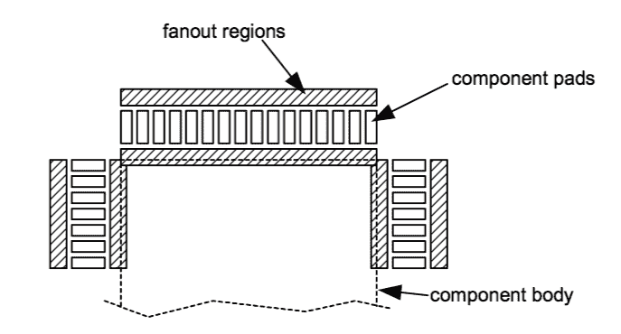

# 附录 C -

进入 PCB 布局

本附录将介绍 PCB 设计和布局过程，并概述你为实现设计目标可能需要的工具，包括针对预算有限的产品和技术。我通过展示一些简单的设计来帮助你开始你的硬件冒险。

## **哲学和设计流程**

印刷电路板是硬件黑客的画布，CAD 工具是画笔。像任何工程或艺术学科一样，在印刷电路板设计和布局方面建立专业水平需要实践。幸运的是，低成本 PCB 原型制作服务和免费（或几乎免费）的 CAD 工具使得 PCB 设计和布局成为一种既经济又容易接触的爱好。

PCB 的设计和布局是两个紧密相连的任务。在设计布局的各个阶段，都需要进行权衡取舍。有时一个组件可能无法安装，或者某个部件可能不可用，这时你将不得不修改原理图设计以适应这种短缺。在其他时候，你可能需要进行高级设计变更，或者发现一个错误，PCB 将需要更新以反映这些变更。根据我的经验，快速完成成功的 PCB 设计的关键在于在设计各方面保持灵活性。

### **细化你的想法**

PCB 设计过程始终从你的想法开始。你需要做的第一件事是清楚地了解你试图构建的内容。你前期了解的越具体，设计过程就会越容易。你应该有一个关于最终板子大小、成本以及当然是什么功能的想法。我总是发现绘制草图很有帮助，在大型项目中，编写设计文档来帮助我组织和记录我的想法也很有用。

对于前几个设计，最困难的步骤之一将是确定一个想法，因为你不知道有哪些类型的元件可以用来实现你的想法，以及你将不得不设计哪些现实世界的约束。开始的最佳方式是找到一个与你想法非常相似的想法，并在此基础上构建你的想法。（许多芯片制造商提供免费的应用说明和设计样本，这是一个很好的起点。）另一种定义你的想法的方式是学习现有产品：如果你想制作一个闹钟，拆解一个现有的闹钟看看它是如何制作的。

### **原理图捕获**

一旦你有了你的想法，你需要创建一个*原理图*。原理图是你想法的符号表示，以一系列元件符号和虚拟线表示。

大多数原理图捕获软件都附带一个元件库，以帮助加速原理图捕获过程。然而，如果您在库中找不到所需的元件，您将不得不自己构建原理图符号。所有原理图符号都与 PCB 组件封装相链接，这是 PCB 板上与组件配合的铜质图案。

错误的一个常见来源是没有检查符号与封装之间的链接：16 引脚 DIP 封装不适合 16 引脚表面贴装连接器，而大多数设计工具无法区分这两者。因此，请确保您的封装分配都是正确的，并且对原理图符号进行双重和三重检查。特别是，始终检查和重新检查电源引脚，因为它们可能引起最困难和最具破坏性的错误。考虑让朋友也检查符号，以避免重复错误或无意中让错误通过。（对于简单的元件，这种冗余可能听起来很愚蠢，但对于有数百甚至数千个引脚的元件，在检查过程中你的大脑可能已经变成了一团糟，这时这种冗余变得绝对必要。）

从一开始就注重细节是捕获原理图最重要的技能，这可以让你避免后期遇到令人头疼的故障。每个组件上的每个引脚都有其存在的理由，如果任何引脚未连接，你应该理解为什么这样做或那样做是不合适的。为此，阅读产品数据表，包括每一页和脚注。不要忽视需要上拉电阻来设置启动条件、电容来滤波或稳定系统等细节，否则你很可能会遇到更多令人沮丧的故障。

**图 C-1：** 从想法到成品的设计过程。

设计规则检查器有助于发现原理图中的某些错误，但它们执行的检查通常非常基础，因此只能捕获最明显的错误。典型的检查可能包括捕获重复的元件标识符、悬空网络和浮动输入。

除了传统的设计规则检查器之外，你还可以设计自己的简单检查。例如，许多设计工具*不*执行“网表奇偶校验”，这可以通过使用 Perl 脚本或电子表格程序相对容易地生成。网表奇偶校验是一种启发式检查，它统计连接到每个网表的组件数量，然后按连接数量排序。排序列表顶部的“单引脚网表”几乎总是原理图捕获期间出现的打字错误（拼写错误的网表名称）的指示。快速浏览整个排序列表可能会有所帮助，以确保所有信号组具有相同数量的连接。大多数信号总线与总线中每个信号连接的数量相同。你可以在一个下午创建一个工具，使你的原理图捕获程序能够进行网表连接计数检查，通过找到它将捕获的错误，你无疑将节省无数的时间和金钱。

在将原理图导出到板级布局工具之前，你应该对原理图物料清单中的所有部件进行排序。通常，关键部件可能会出现短缺，这时原理图捕获需要重新设计以应对短缺。通常，更改组件封装分配是唯一必要的重新设计。修改原理图设计以应对制造商的短缺，可以避免在完成的板级布局上做出更改的困难任务。

### **板级布局**

板级布局程序的输入是一个带有组件封装信息的网表。网表是每个组件和引脚及其连接的中间表示。网表提取是一个高度自动化的过程，但将原理图符号与 PC 板封装相关联并不总是得到很好的管理。

符号到封装相关联的困难源于单个部件的多种封装选项。例如，晶体管的符号可以同样表示一个微小的 SOT-23 封装设备或一个巨大的 TO-3 封装设备，确保在网表提取期间选择正确的封装取决于你。始终在组件放置在原理图中时检查隐含的封装*，而不是在网表转换期间一次性检查，或者更糟糕的是，在放置或最终设计审查期间检查。

一旦你有了完成的网表，你就可以进行板级布局了。

板布局程序的另一个外部输入是设计规则。设计规则由板制造公司设定，包括最小走线宽度、最小走线间距、最小孔径、最小通孔环和电源及布线层的数量。具体的设计规则取决于你选择的过程，而这又取决于你能承担的费用。最佳工艺可以提供 2 密耳（1 密耳等于 1/1000 英寸或 25.4 微米）细的走线，以及直径大致相同的激光钻孔盲孔/埋孔，但制造费用远远超出了典型爱好者预算的不到一百美元。更典型的爱好者工艺具有 6 密耳的走线/间距设计规则，以及 15 密耳的最小完成孔径，采用两层或四层铜。（你可以在附录末尾找到板制造公司的列表。）

板布局包括两个阶段：放置和布线。智能组件放置将大大简化布线任务。一般来说，目标是放置所有组件，以使连接尽可能短，使用尽可能少的通孔，以最小化噪声、延迟和信号损失。某些组件的放置，如连接器、开关和电源组件，受到很好的约束，给你留下的选择很少。对于其余的组件，对设计的理解将帮助你确定哪些组件应该获得最佳的放置。

完成放置后，以 1:1 的比例打印设计，并通过将实际组件填充到打印布局中来验证组件是否适合其相应的焊盘。如果你打算使用带有组件的插座，务必使用插座来验证 1:1 的绘图，因为插座比组件本身需要更多的空间。这项检查确保你所有组件都采用了正确的封装类型，所有组件轮廓都是正确的，并且每个组件之间有足够的间隙，以便于组装。在 1:1 的绘图上还需要检查所有连接器的方向和引脚排列，因为很容易颠倒连接器或在使用电路板上的错误性别焊盘。在处理芯片时也要小心，尤其是那些具有细间距表面贴装引脚的芯片。确保不要弯曲引脚，并遵守正确的静电控制协议。

### **一般放置和布线** **指南**

这里有一些放置和布线指南的简短列表。记住，这些只是一般建议，无疑会有一些情况不适用。

#### **在表面贴装器件上留出通孔扇出空间** **指南**

与曾经是事实标准的旧式通孔元件相比，表面贴装元件提供了更大的密度优势。然而，表面贴装元件仍然需要通孔过孔来实现布线，尤其是在复杂和/或自动布线设计中。这些布线过孔被称为“扇出”过孔，用于 SMD 焊盘。图 C-2 和图 C-3 展示了在表面贴装元件上使用扇出过孔的应用。

#### **解耦电容器完美地安装在** **SMD 焊盘** **下**

在典型的数字设计中，最常见的无源元件是解耦电容器。这些微小的电容器无处不在，如果它们放置不当，可能会消耗宝贵的布线和过孔扇出空间。如果你愿意创建双面表面贴装板，解耦电容器可以放置在目标元件焊盘相对的板面上。通过将这些元件放置在元件焊盘空间下方，你不会消耗任何过孔扇出区域。实际上，一个放置得当的解耦电容器可以共享元件电源引脚使用的电源走线。图 C-2 左下角的视图清楚地说明了这一技术。（在某些特殊情况下，你可能不想这样做，下一节将说明。）

****

**图 C-2**: 电路板布局的四个视图。从左上角开始，顺时针方向：带有元件的制造电路板；PCB 布局程序中的顶层电路板视图；PCB 布局程序中的所有层电路板视图；仅顶层和底层视图，展示了双面 SMT 布局。

**图 C-3**: SMD 元件焊盘周围的扇出区域。

#### **了解你的特殊走线**

关于数字电路板布局的好消息是，大多数走线不需要太多思考，与典型的模拟板不同。坏消息是，如果你没有正确地完成其余的走线，你的板将表现出奇怪且令人沮丧的行为，这将很难调试。因此，这些特殊走线的布线有点像一门黑艺术。本节仅提供了一些应对这些特殊走线的指南，但我鼓励感兴趣的读者寻找一本专门介绍板级布局的书籍，以真正学习和欣赏这些技术。我推荐的两本书是威廉·J·达利和约翰·W·波尔顿合著的《数字系统工程》（剑桥大学出版社），以及霍华德·W·约翰逊和马丁·格雷厄姆合著的《高速数字设计：黑魔法手册》（Prentice-Hal PTR）。

通常，在布线电路板时需要特别注意的走线类型包括：

+   电源走线

+   时钟参考（时钟）走线

+   高速走线

+   模拟/混合信号走线

作为一般规则，电源走线应比平均信号走线更粗，尤其是如果您正在使用提供窄（约 5 毫英寸）走线宽度的高端制造工艺。电源走线需要加粗以抵消电阻加热和寄生电感。窄电源走线，尤其是在关键电源分配点附近，会像电阻一样发热，导致供电电压下降到引起电路不确定故障的水平。

电源走线的适当尺寸取决于铜的厚度。典型的板使用“1 盎司铜”，厚度为 1.35 毫英寸（一平方英尺 1.35 毫英寸厚的铜箔重一盎司）。在 1 盎司铜中，外部 12 毫英寸宽的走线需要通过 1 安培的电流，温度上升 10 摄氏度。对于类似的电流处理能力，埋层需要更粗的走线。

在层与层之间布线电源走线时，请记住，过孔也有电阻。单个过孔不足以连接层之间的关键电源走线。关键电源走线应在层之间通过多个过孔连接，以降低寄生电阻和电感。多层上的分布式电源平面也应广泛分布过孔，以确保保持共同电位。

### 注意

**在高性能或低噪声应用中，在去耦电容器和电源引脚之间放置** **过孔可能对** **布线便利性** **的电学完整性代价过高**。过孔会干扰高速（数百兆赫兹）电波的传播。因此，**在这些应用中，去耦电容器的最佳位置是在元件引脚和电源** **过孔之间**。

定时参考信号包括时钟和选通信号。许多存储设备需要具有敏感定时要求的异步控制选通信号。这些信号应按与终止策略一致的方式进行正确终止和布线，通常采用“菊花链”布线。菊花链布线没有分支，因此信号波前只有一条路径可以传播。

电信号在电路板上的传播速度约为光速的四分之一，或约每纳秒三英寸。因此，高速走线必须具有匹配的长度，否则信号可能会相对于定时参考出现显著的时间相位差。通过延长较短的走线到最长走线的长度来匹配走线长度。通过使用蜿蜒的走线来延长走线长度，这些走线蜿蜒曲折，增加了走线的有效长度，而不改变走线端点的位置。

模拟和混合信号布线远远超出了本附录的范围。在一个普通爱好者的数字设计中，大部分模拟电路将被隔离在电源部分。对于特定电源组件的特殊布局要求通常在组件的数据表中得到了很好的记录。

请记住，电气信号是懒惰且杂乱的：信号电流总是沿着阻力最小的路径流动，并且信号会耦合到相邻的迹线中。此外，电流必须守恒，因此每个信号电流路径都必须有一个返回电流路径，无论它是明确的还是隐含的。在你布线电路板上的任何模拟部分时，请记住这些简单的规则。

#### **电路板是优秀的散热器**

当布线高功率组件，如电源调节器和高性能微处理器时，请记住电路板上的铜是一种极好的导热材料。在特定条件下，通过简单地布设一个连接到目标部件的热连接或接地引脚的大面积铜区域，你可以节省一个散热器。如果你使用的是带有电源平面的多层板设计，请使用多个过孔来帮助将热量传导到内部层。

电路板的散热能力在手装配过程中也可能是一个麻烦。铜的良好导热性使得加热同时连接到大面积铜区域上的组件引脚变得困难。当将低功率组件连接到电源平面时，请考虑使用带有*热缓解*的过孔。热缓解是在过孔连接到电源平面时的一系列小间隙，它可以减少热导率，而不会显著影响连接的电气性能。（请注意，在铜区域周围大量密集的热缓解电源过孔可能导致未连接或连接不良的铜岛。）

#### **为每一层** **建立首选布线方向**

为每一层建立主导布线方向可以简化密集板布线。例如，使顶层成为水平布线层，底层成为垂直布线层。如果你需要在位于板对角线两侧的两个组件之间布线，首先在顶层运行一条水平迹线，然后在底层运行一条垂直迹线以连接这两个组件。例如，仅在板的顶层直接运行一条对角线迹线的替代策略，将使板两半之间的整体布线可行性减少一半：现在从一半到另一半的唯一方法就是通过底层。

对于这个规则的特殊情况是可以接受的，尤其是如果你必须做出信号完整性与布线可行性的权衡。

#### **堆叠具有正交层的电路板**

在确定每层的首选布线方向后，堆叠层以确保没有两层具有平行的首选布线方向。这种正交性有助于将层间信号的干扰降至最低。如果你有电源层，尝试在信号层之间堆叠它们，以帮助屏蔽信号层之间的干扰。

#### **在双层板上，使用手指布** **电源**

在双层板上，通常很容易将电源和地线作为环绕板外部的环形布线。这不是一个理想的情况，因为环形会剥夺板的核心，并增加了形成大型寄生电流环的可能性，这将降低电路性能。相反，使用交错和/或堆叠的电源手指。这些手指将确定每层的占主导地位的布线方向，应该在布线任何信号之前布局。

#### **使用自动布线器的提示**

自动布线器是一把双刃剑：它们可以节省数小时的布线时间，但它们也可能导致数小时的令人沮丧的问题。使用自动布线器的第一条规则是永远不要让它工作在你的电路板设计文件的唯一副本上。相反，创建设计的一个副本，并让自动布线器在副本上施展其魔法。

第二条规则是在将自动布线器应用于最终设计之前，使用简单的测试设计来学习自动布线器的缺陷。自动布线器通常存在关键的缺陷或限制，在使用工具之前必须了解这些缺陷。在学习自动布线器的缺陷时，特别关注它如何处理锁定轨迹、填充多边形和尴尬的轨迹尺寸。一些自动布线器实际上会移除锁定轨迹（手动放置并标记为不可移动的轨迹），而其他则忽略它们或在它们存在时无法正常工作。如果你在开启自动布线器之前花费数小时布置关键电源和时序网络，这可能会特别令人沮丧。

最后，不要指望自动布线器能够完全布线一个复杂的电路板。自动布线器在快速布线电路板的前 90%时非常出色，但随着电路板变得更加拥挤，它们会变得非常缓慢。请注意，组件放置的细微变化可能会使自动布线器失效。许多自动布线器在没有特殊注释或理想组件放置的情况下，不会识别总线或直通连接。

## **CAD 工具**

过去几年中，电路板设计工具的价格显著下降。我用于电路板设计的最常用工具是 Protel 99SE。（我尚未购买更新的版本，即 Protel DXP。）Protel 是一个高度集成的工具，包括原理图捕获、仿真、库管理以及带有设计规则检查和自动布线的电路板布局，所有这些功能都集成在一个工具中。（似乎每次软件发布都会将一些新功能集成到设计环境中，无论好坏。）

您可以从他们的网站 www.protel.com 下载 Protel 软件的 30 天全功能演示版。虽然该产品的完整许可证价格在数千美元，但这与其他提供相同深度功能和数量功能的软件包相比仍然具有竞争力。其他高端 PCB CAD 供应商包括

Mentor (PADS), Cadence (OrCAD), and Altium (P-CAD)。有趣的是，Altium 还拥有 Protel 软件套件。

如果您是初学者，想做一些随意的板级布局，一些板级制造公司提供免费的全功能捕获设计工具。ExpressPCB（www.expresspcb.com）为使用其制造服务的客户提供免费的原理图捕获和 PCB 布局工具。他们的工具功能齐全，但在设计规则检查和实际复杂性方面略显局限。然而，ExpressPCB 是初学者的绝佳入门工具，能够实现几乎任何周末硬件项目。

在提交任何用于生产的完成设计之前，使用第三方文件查看器预览您的导出文件，以帮助保护您的制造投资免受设计工具中的错误影响。用于板级制造的常见文件格式是“Gerber”文件格式。我信任的一个优秀的免费 Gerber 预览器是由 Graphicode（http://www.graphicode.com/）制作的。

## **板级制造公司**

板级制造公司的能力范围与 CAD 工具一样广泛。一些公司只做大型生产订单，而其他公司通过服务快速原型和爱好者市场赚取生计。以下是我最喜欢的几家板级制造公司，以及它们基本服务的简要描述。

### **Sierra Proto Express**

位于加利福尼亚州圣何塞的 Sierra Proto Express 提供了一些最具竞争力的快速原型制作率。截至本文撰写时，Sierra Proto Express 提供了一系列“无触点产品”工艺。这些制造工艺有严格的设计规则要求，但价格非常实惠。例如，您可以在四天内以每块 34 美元的价格（最小订单为两块）制作双层电路板，或者以每块 51 美元的价格（最小订单为两块）在四天内制作四层电路板。这些价格提供的工艺技术是 6 mil 迹/空间设计规则和 15 mil 完成的孔径大小。Sierra Proto Express 还提供更快周转时间的工艺，迹宽低至 5 mils，完成孔径大小为 10 mil。有关更多信息，请访问 www.sierraprotoexpress.com。

### **Data Circuit Systems**

数据电路系统（Data Circuit Systems），也位于加利福尼亚州圣何塞，是我首选的供应商，用于需要激进的设计规则或与较便宜快速制造公司提供的选项不太匹配的特殊加工选项的设计。他们网站上的全面“工艺能力调查”（可在其网站上下载）内容详尽且书写清晰，因此减少了在设计规则解释中的猜测工作。他们还对您提交的设计进行了一系列相当严格的工厂检查，这些检查通常可以发现可能导致后期问题的细微布局错误。我发现他们的员工既熟练又友好，尽管他们的价格略高于大多数工程原型制造商，但他们的详细记录的工艺和设计规则检查有助于降低激进设计的风险，最终额外的成本可能是值得的。请访问 www.datacircuits.com。

### **先进电路**

科罗拉多州奥罗拉的先进电路（Advanced Circuits，www.4pcb.com）在其网站上提供即时报价功能。仅此一项功能就使他们成为适合中等复杂度的板子的好选择，这些板子不符合任何折扣或快速制造工艺指南。您可以使用即时报价功能来优化您的实施技术选择以降低价格。此外，他们经常提供折扣和快速制造特价。

### **阿尔伯塔印刷电路**

阿尔伯塔印刷电路（AP Circuits），位于加拿大阿尔伯塔省，是原始快速原型 PCB 制造商之一，提供快速服务。他们提供的 P1 工艺是一个基本的工艺，没有阻焊膜或丝印。因此，在组装阶段，由于焊料容易到处流动，很难执行细间距表面贴装设计。然而，他们将以难以置信的价格，在一天内完成 P1 工艺的板子并发货，没有任何最低订单要求。撰写本文时，生产运行的基准费用约为 45 美元，加上基准费用之上的每平方英寸约 0.65 美元的费用。该技术是 8 密耳的走线/间距，最小钻孔尺寸为 20 密耳（如果您想坚持最便宜的工艺选项，则为 28 密耳）。AP Circuits 非常适合需要在紧迫的时间和严格的预算下完成的板子，尤其是如果您使用的是无需阻焊膜即可轻松组装的通孔或粗 SMT 组件。请访问 www.apcircuits.com。

## **入门项目**

在第五章“更换损坏的电源”中，您将学习如何用标准 ATX 电源替换 Xbox 电源。唯一的问题是，Xbox 和标准 ATX 电源之间的电源信号极性是相反的。章节中提出的解决方案是始终保持电源开启，并通过首先开启电源然后按下 Xbox 的电源按钮来开关 Xbox。

设计和布局一个能够使您反转电源信号极性的板子相当容易，这样您就可以仅通过 Xbox 的前面板来控制 Xbox 的电源状态。您还可以正确调节待机电源，而不是使用两个二极管。这样的板子将包括一个反相器芯片，例如 74HCT04，和一个稳压器，例如 LM317K。LM317K 是一个可调稳压器，可以将 ATX 电源提供的+5V 待机电压降低到 Xbox 要求的+3.3V 待机电压。本板的一个示例原理图如图 C-4 所示。

连接到该板的选择由您决定。最简单的解决方案就是直接使用孔位并焊接电线通过孔位。该板上只有五个连接点。其中三个连接到电源：+5VSB（紫色）电线、一个地线（黑色）电线和电源开启输出（绿色）电线。剩下的两个，+3.3VSB（电源连接器的第 6 针）和电源输入（电源连接器的第 11 针），连接到 Xbox。

在安装您完成的板子之前，务必测试稳压器的电压输出。很容易出错电阻值或引脚交换，这两种情况都可能导致 Xbox 进入危险的高电压状态。另外，在永久安装板子时，务必确保板子的底部和顶部与 Xbox 外壳或其他 Xbox 组件的意外接触绝缘。

**图 C-4**：ATX 电源替换适配器板的示例原理图。电阻 R1 和 R2 设置稳压器 U1 的输出电压为+3.3V。
