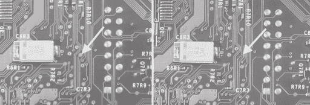
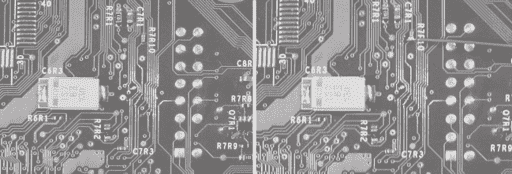

# 附录 E -

调试：提示和技巧

## **不要慌张！**

提高你的调试技能与提高你的设计技能一样重要，甚至更为重要。最重要的单一建议是永远不要慌张：随机地调整和更改东西只会引入比解决的问题更多的不确定性和错误。

当你能够完全了解一个系统以及一个正常工作系统的预期状态时，调试就变得简单了。只需将观察到的状态与预期状态进行比较，就能阐明出了什么问题。不幸的是，现实世界很少是这样运作的。芯片是黑盒子，唯一能够了解芯片内部状态的方法是通过其引脚。许多信号也太难直接测量或记录。此外，制造商提供的规格说明书通常很模糊或难以解释。因此，调试的真正艺术在于在缺乏可见性和全面系统知识的情况下，将一系列症状追溯到根本原因。

### **理解系统**

在没有首先了解你试图调试的内容之前尝试调试一个系统，就像在没有日语知识的情况下尝试阅读日本漫画一样。你可以在表面层次上弄清楚谁是坏人谁是好人，但你会在确切地弄清楚漂浮的猫与所有这一切有什么关系时感到非常困惑。为了完全理解情节，你需要一本日语词典以及大量的时间和耐心。同样，基本的电子原理和直觉会带你到一个大致知道可以期待什么的地步，但真正的启迪只有在阅读了组件数据表之后才会到来。你对一个系统了解得越多，就越容易找出事情出错的原因。在阅读更多关于系统的内容时，记下笔记，并思考如果出了问题，问题可能会以什么方式表现出来。看到其他与你试图修复的系统相似的系统也有帮助，理解操作理论也有帮助。

### **观察症状**

缺陷通过症状表现出来，你必须通过观察几个症状并推断出罪魁祸首来推断根本原因。一个本应显示控制台视频输出的电视出现空白屏幕就是一个症状的例子。你的电视屏幕可能空白的原因有很多，比如损坏的视频线、损坏的电视、损坏的视频连接器、损坏的视频源、视频源中的空白媒体，甚至系统缺乏电力。一般来说，你应该观察至少两个、最好是三个与原因一致的症状，在得出你已经找到了根本原因的结论之前。记住，最具有说明性的症状往往不是明显的外在表现，可能需要测量或实验来找到它们。在我们的空白电视屏幕的例子中，我们的测量方法很简单，就是看看电视上的电源灯是否亮起，或者在没有视频的情况下电视是否发出声音。

调试的基本策略是从一个明显的症状开始，隔离系统的各个部分，以确定哪个部分是症状的直接原因。直接原因被定义为直接影响观察到的症状的东西。电视上视频故障的直接原因可能是没有信号输入电视、电视损坏或电力不足；非直接原因可能是你的视频源中的硬件故障或月亮的相位。换句话说，给定症状 A，考虑所有可能的直接原因 X、Y 和 Z，然后测试每个以确定哪个是实际原因。一旦你隔离了问题，考虑可能导致它失败的原因，并重复这个过程，直到你发现了*根本原因*。

通过使用已知良好的参考，可以简化故障原因的隔离。在我们的例子中，你可以通过给电视输入来自已知良好 DVD 播放器的信号来排除电视作为故障源的可能性。为了使已知良好参考实验有效，你必须保持所有东西不变，除了你用参考替换的部分。将良好的 DVD 播放器插入电视上控制台的不同输入，只会告诉我们电视的显示部分是正常工作的。从控制台输入到电视的路径没有被测试。正确执行实验的方法是将 DVD 播放器插入控制台使用的视频输入。

这种偏执或对系统的固有不信任在追踪微妙的硬件故障时变得非常重要。不要假设任何可能影响你所观察系统的因素，永远不要忽视任何无法解释或不一致的行为，即使它是间歇性的。例如，有时系统会在你触摸电路板上的某个位置或挥动手臂靠近某个区域时正常工作或损坏；有时系统在开机后的一段时间内会表现出不同的行为。将此类观察结果归咎于异常或微不足道的事件是很诱人的，但事实是它们确实发生了，并且必须有解释。一个具体的例子是触摸电路板并观察系统状态的变化。你在哪里触摸的？你是如何触摸的？你的手是湿的还是干的？当你触摸电路板时，你的身体就像一个小电容和一个大电阻。这可能会稍微减慢信号或放电高阻抗节点，如未连接的数字输入。如果你用力按下板子，你可能会以某种方式弯曲板子，从而改变断裂的轨迹或不良焊点的电气特性。

有些症状经常被错误地解释为原因。烧毁的轨迹或损坏的组件通常是问题的症状，而不是原因。换句话说，电路中其他地方的故障通常负责组件的故障。组件自发故障是一个相对罕见的事件。假设你正在调试一个损坏的立体声音响。你闻到从立体声音响中传来的烧焦气味，并看到一个大电阻因过热而变黑。很可能如果你只是更换那个电阻，替换的电阻也会再次烧毁。真正的可能原因可能是一个短路晶体管或损坏的电源电路，但这些并不像烧毁的电阻那样明显。

另一种强大的观察技术是将已知良好的系统进行比较。如果你正在尝试调试一个损坏的设备，找到一个正常工作的设备，并比较两个设备之间的电压和其他操作特性。如果你正在尝试调试你自己的自制系统，如果可能的话，构建电路的模拟，或者找到一个具有类似设计的电路。你可以使用这些已知良好的系统来快速隔离异常行为。此外，你可以以可控的方式在已知良好的样本中诱导故障，以检查你是否真正找到了问题的根本原因。这种技术特别适用于模拟系统。

## **常见故障**

家庭自制的项目中，硬件故障最常见的原因是焊接不良和极化元件安装不当，例如电容器、二极管、集成电路和连接器。此外，连接器尤其臭名昭著，因为它们承受了最多的物理滥用，而且仅通过视觉检查通常很难确定连接器是否处于良好状态。以下是一份常见故障的清单，按流行程度大致降序排列。

1.  **不良的焊接点。** 这包括冷焊点、桥接和遗漏的焊点。仔细的视觉检查可以捕捉到许多不良焊点的实例。所有焊点之间的焊料应看起来光滑闪亮，并且焊料应在电路板焊盘和元件引线上显示出湿润的弯月面。好的和坏的焊点图片可以在附录 B：焊接技术中找到。通过轻轻拖动一根硬线，如镊子尖端或回形针，沿封装长度拖动引脚，也可以快速识别许多表面贴装封装上的不良焊点。连接不良的引脚会略微弯曲。弯曲电路板也可以帮助揭示不良焊点。在其他情况下，您可能需要使用万用表来验证焊点的质量。（如果您在焊接元件时有过混乱的经历，请在检查之前用棉签蘸取少量异丙醇清洁电路板。）最后，记住眼见为实：使用放大镜帮助您的检查。中功率显微镜是首选，但任何固定放大镜（如绘图灯上找到的）或珠宝商使用的环形放大镜都将极大地帮助。

1.  **不正确的元件值。** 当类似外观但值不同的元件意外安装在电路板上时，就会发生不正确的元件值。这对于表面贴装无源元件尤其成问题，因为它们通常未标记或标记不明显。请记住，正确测试元件值的方法是将其从电路板上取下，然后进行测试。通过在组装过程中非常小心和有系统地存储您的元件在清晰标记的袋子或盒子里，可以避免在电路板上放置错误元件。

1.  **不良的连接器。** 这包括反向安装的连接器，或者更糟糕的是，设计时使用了错误的引脚分配。注意引脚 1 的位置和连接器使用的编号系统。一些连接器使用之字形引脚编号系统，而其他连接器使用圆形引脚编号系统。手工组装线对板连接器也很困难。检查所有电线与连接器接触点接口的地方，以查找不良的压接、过多的绝缘或不良的焊点。在最坏的情况下，使用电压表来验证连接器的连续性。

1.  **未阅读数据表导致的配置疏忽**。复杂的芯片通常支持多种操作模式，这些模式通过将一组引脚连接到高或低逻辑电平来选择。芯片还经常需要外部电阻来加载或偏置引脚以实现正常操作。有时芯片还需要电容、电阻和电感网络来稳定内部功能。请记住，未使用的输入通常需要连接到固定电压才能正常工作，因此不要因为不使用某些功能而忽略数据表的部分内容。

1.  **设计问题或实现问题**。有时错误是由明显的设计错误或正确原理图与板布局之间的转换问题引起的。转换问题通常是由于在指定原理图网络名称时出现错误，或者由于原理图符号上的隐含电源名称。隐含电源名称通常在数字组件中出于方便而使用，但可能会在设计使用多个电源电压的电路时引起重大问题。这些类型的问题可以通过附录 C 中描述的启发式网表检查程序在布局之前捕获。高速设计规则违规代表另一种实现问题。在 25 MHz 或更高频率下运行或具有快速边沿率（< 5 ns）的电路需要特别注意电气阻抗和传输线终止。

1.  **电源电压超出规格**。尽可能在接近使用点的位置测试电源电压，因为电线会降低实际交付的电压。在某些情况下，电路本身没有问题，只是电源无法提供足够的电流来运行你的设计。还要检查电源电压随时间的变化。电源上的过多噪声会导致问题，并且使用大量高速 CMOS 逻辑的系统可能会有非常苛刻的电流消耗变化，这可能导致电源电压出现短暂的下降和峰值。

1.  **损坏或损坏的 PC 板走线**。如果你手动组装了电路板并且你在安装组件时遇到麻烦，这可能会成为一个问题。组装过程中的过热可能导致走线从电路板上抬起。此外，了解你的板供应商。一些板供应商（尤其是快速周转的折扣原型供应商）不会对你的电路板进行完整的网表电气测试。寻找过度蚀刻的走线，这些走线已经超出公差范围变薄，并检查每个通孔周围是否有银色的光环。有时在板钻孔过程中钻头定位不当或角度不正确，误钻的孔最终会中断电气连接。

1.  **闩锁效应或电源时序问题**。闩锁效应是一种潜在的灾难性现象，在芯片的衬底中，电源和地之间会形成一个寄生短路。闩锁效应是由向衬底注入电流触发的。在混合电压系统中，如果施加的输入电压高于芯片的电源电压，这种情况可能会发生。在许多情况下，闩锁效应伴随着芯片过热，可能导致芯片永久性损坏。首次启动系统时，建议使用电流表来监测系统消耗的电流量，并触摸所有组件以检查是否有任何组件过热。如果一个组件进入了闩锁状态，你通常会观察到数百毫安的过量电流消耗。

1.  **热问题**。这是线性电压调节器和高功率数字电路的主要问题。验证所有高功率组件是否正确散热，以及散热器在接触芯片封装的电气活动部分时是否正确隔离。

1.  **意外短接到裸铜**。这是连接器和芯片的问题，它们的底部有暴露的金属区域，这些区域可能会跨越到板上的暴露区域，如通孔。这同样也是使用螺丝固定板的位置附近的问题。金属螺丝的头部可能会意外接触到放置在螺丝孔太近的通孔。

1.  **板上的污染**。这个问题是由板上的焊膏残留物或其他工艺残留物引起的，这些残留物会导致低电流泄漏路径。一些焊膏残留物具有不可忽视的（小于一兆欧姆）电阻，这可能会影响高阻抗电路，如慢时间常数 R-C 网络。

1.  **测试设备故障**。如果你使用二手或旧测试设备，这尤其是一个问题。测试探针随着时间的推移会形成弯折和校准故障，所以有时你在示波器上看到的糟糕信号实际上是坏测试探针或探针接地选择不当的结果。将测试设备校准到已知良好的信号，以消除测试设备问题。

1.  最不可能的问题是**坏芯片或故障组件**。组件制造商会竭尽全力确保发送给你的部件是功能性的。简单的到中等复杂部件的典型故障率以百万分之一计算。通常，我们喜欢想象我们问题的原因是制造商的坏芯片，但几乎不是这种情况。通常，如果发现坏部件，该部件可能是在加工过程中（粗心处理或组装问题）或电路中其他地方的设计问题导致的损坏，这些设计问题导致了观察到的故障。

## **从移除的迹线或焊盘恢复**

在电路板上抬起或撕裂铜走线是尝试使用飞线安装售后改装的人常见的问题。这种铜箔走线的分层通常是由烙铁过热引起的。另一个常见的原因是在线已经焊接在电路板上后，在剥离线端绝缘层时拉扯连接的改装线。幸运的是，通常很容易从这个问题中恢复过来。

### **提示**

**最佳方案是预防。不要使用功率过大的烙铁在电路板上工作。建议使用温度控制的烙铁，但一个低功率（15 瓦）的烙铁也可以使用。此外，如果焊料似乎没有粘到板上，停止加热。相反，在板上和线上涂一点助焊剂，并用烙铁尖端养护剂或用蒸馏水湿润的海绵清洁烙铁尖端（自来水含有可能损坏烙铁尖端的化学物质）。这将提高可焊性，因此你不需要施加太多热量或力量来形成连接。**

当你看到电路板上的走线或焊盘抬起时，首先要做的是停止！不要使问题进一步恶化；你能做的最糟糕的事情就是继续拉线，导致整个走线剥落。如果线仍然连接，通过轻轻触摸烙铁到接头并让线脱落来移除线。图 E-1 展示了这样的灾难场景。

**图 E-1**: 左边，箭头指向正在焊接的原始焊盘。右边，焊盘因过热和过度用力而脱落。

从断裂的走线中恢复的策略是移除阻焊膜，用跳线修复走线，并沿着走线找到附近的元件或通孔作为焊接的替代点。

移除焊膏后，会露出底层的铜迹。可以将一小段跳线焊接到这些裸露的迹线上，以修复由于断裂的迹线造成的断路。裸露区域也便于使用通断测试仪找到一个跳线的替代连接点。可以使用细砂纸（200 目或更细）或用锋利的爱好者刀片刮除焊膏。在移除焊膏时，要小心不要抓到断裂的迹线碎片，以免进一步撕裂电路板的迹线。焊膏移除后，用温和的溶剂，如酒精棉签清洁该区域。然后，在该区域涂上一层非常薄的焊膏，并用干净的烙铁头沿着暴露的迹线擦拭。少量的焊膏会从烙铁头吸到电路板上，并覆盖迹线，防止裸露铜氧化。如果烙铁头太干净，可以在上面滴一滴焊膏，轻轻地在湿海绵上擦拭烙铁头，然后再次尝试。不要尝试在烙铁头尖端用熔化的焊膏球来镀锡迹线。过多的焊膏会导致短路。（注意，焊膏对于在迹线上获得均匀、薄层的焊膏至关重要。不要省略焊膏的应用。）图 E-2 展示了镀锡前后迹线的样子。

**图 E-2**：左，使用细砂纸移除焊膏后的区域。右，镀锡（重新调整以供焊接）后的区域。

在这个阶段，你可能想使用一个通断测试仪来确定一个用于连接你的修改线的替代点。大多数万用表都带有可听见的通断测试仪功能。当选择此功能时，当探针之间的电阻非常低时，万用表会发出声音。

线路孔和元件引脚都是很好的替代连接点。如果你决定使用线路孔，你必须刮除焊膏并处理线路孔，然后再连接修改线。图 E-3 展示了使用通断测试仪寻找替代焊接点。记住，有时你可能需要通过几个线路孔来找到最佳的替代连接点。

**图 E-3**：使用通断测试仪寻找替代连接点。在这种情况下，R7R10 是一个很好的替代点。

下一步是将一段短跳线连接到断裂的线路。在断裂线路的区域施加更多焊剂。剪一段细线（约 30 号线径），长度大约与问题中的间隙相同。将线放在间隙上，利用焊剂的粘性帮助放置过程。用镊子固定线，并用烙铁加热，直到两侧都粘附到断裂线路的边缘。用镊子轻轻推动线，以确认线是否到位；线不应移动。同时，使用万用表检查相邻线路的短路。如果发现短路，只需加热跳线，直到它从板上脱落，然后再次尝试。图 E-4 展示了修复后的线路外观。

最后，将修改线连接到之前用万用表发现的备用焊接点。

**图 E-4**：左侧，已安装跳线覆盖损坏的线路。右侧，修改线已成功连接到备用焊接点。
