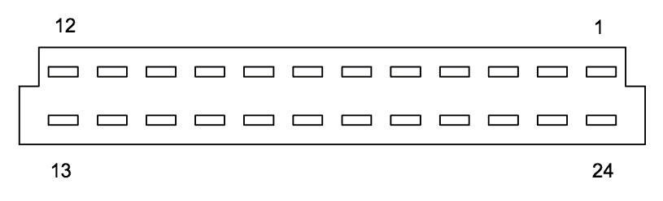
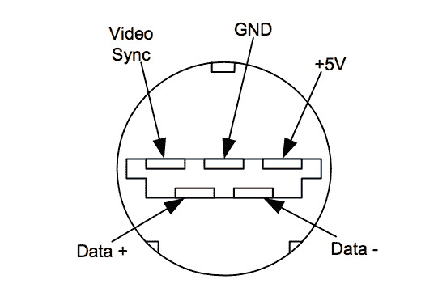
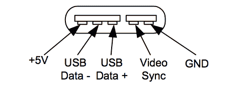
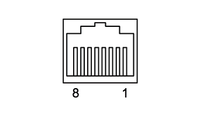
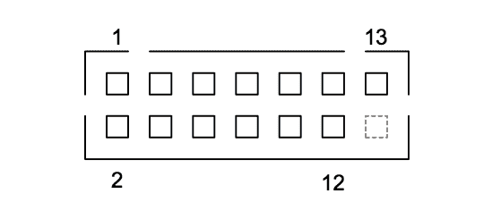

# 附录 F -

Xbox 硬件参考

本附录总结了 Xbox 硬件中使用的所有主要连接器的引脚排列。

## **电源引脚排列**

Xbox 使用的电源是一个最大 96 瓦的开关电源，峰值脉冲能力为 160 瓦，但不超过 10 秒。微软从多个供应商那里购买这种电源，包括 Delta Electronics, Inc.（www.deltaww.com）。Delta 的电源用于美国 Xbox，您可以通过他们的网站或通过网络搜索找到该部件的数据表。

| 引脚 | 描述 | 线色 |
| --- | --- | --- |
| 1 | +12V | 黄色 |
| 2 | +5V | 红色 |
| 3 | +5V | 红色 |
| 4 | +5V | 红色 |
| 5 | +3.3V | 橙色 |
| 6 | +3.3V 待机 | 棕色 |
| 7 | GND | 黑色 |
| 8 | GND | 黑色 |
| 9 | GND | 黑色 |
| 10 | GND | 黑色 |
| 11 | 开机 | 白色 |
| 12 | 电源 OK | 蓝色 |

**表 F-1**：主要电源连接器引脚排列。线色可能因您 Xbox 中使用的具体电源型号而略有不同。此表适用于 Delta DPSN-96AP A 版本电源。

| 描述 | 线色 |
| --- | --- |
| +12V | 黄色 |
| GND | 黑色 |
| GND | 黑色 |
| +5V | 红色 |

**表 F-2**：硬盘电源连接器引脚排列。

## **视频连接器引脚排列**

视频连接器引脚排列有点神秘，因为当对其进行探测时，其中一些信号没有明显的或可识别的信号模式，并且因为单个连接器支持多种显示模式。有几个网站发布了视频连接器的引脚排列，但将发布的信息与测量结果进行交叉检查时，发现了一些差异。我在这里尽力将来自 XboxHacker BBS 和 Sourceforge.net 上的 ucon64 网页上的两个单独帖子拼凑起来并加以协调。原始帖子可以在 http://www.xboxhacker.net/index.php?do=article&id=10&page=1 和 http://ucon64.sourceforge.net/ucon64misc/conn.html 找到。XboxHacker BBS 网页上列出了由 MODE1-3 信号可选择的八个视频模式的定义。我的测量结果表明，所有复合视频和音频信号映射都是正确的，但我无法验证 Xboxhacker BBS 帖子中给出的 SDTV、HDTV 和 RGB 映射。如果任何这些信号有误，我提前表示歉意。

注意，Xbox 连接器上的 12 号和 24 号引脚有较长的引脚，这表明它们用于在热插拔事件期间向连接到视频连接器的外围设备供电。较长的引脚允许在外围设备在 Xbox 通电时连接的情况下，在外围设备电路接收到信号之前先上电。这有助于防止外围设备芯片内部可能出现的称为*闩锁效应*的潜在破坏性情况。

**图 F-1**：从外部查看 Xbox 音频-视频连接器。

| 引脚 | 信号名称 | I/O | 备注 |
| --- | --- | --- |
| 1 | 右音频 | 出 | 音频输出，右声道 |
| 2 | GND | 电源 |  |
| 3 | SPDIF | 出 | 索尼/飞利浦数字接口（S/PDIF）音频输出 |
| 4 | VSYNC | 出 | 垂直同步（VGA 输出模式） |
| 5 | GND | 电源 |  |
| 6 | GND | 电源 |  |
| 7 | GND | 电源 |  |
| 8 | GND | 电源 |  |
| 9 | Pb / B | 出 | Pb 用于 HDTV 模式，蓝色用于 RGB 模式 |
| 10 | GND | 电源 |  |
| 11 | Y/G | 出 | Y 在 SDTV 和 HDTV 模式中，RGB 模式中的绿色 |
| 12 | GND | 电源 | 有较长的引脚用于热插拔 |
| 13 | CVIDEO | 出 | 复合视频输出。 |
| 14 | GND | 电源 |  |
| 15 | C / Pr / R | 出 | C 在 SDTV 中，Pr 在 HDTV 中，RGB 模式中的红色 |
| 16 | GND | 电源 |  |
| 17 | STATUS | 出 | SCART（Syndicat des Constructeurs d'Appareils Radio Recepteurs et Televisions）状态引脚 |
| 18 | MODE3 | 入 | 视频输出模式选择引脚 3 |
| 19 | MODE2 | 入 | 视频输出模式选择引脚 2 |
| 20 | MODE1 | 入 | 视频输出模式选择引脚 1 |
| 21 | HSYNC | 出 | 水平同步（VGA 输出模式） |
| 22 | GND | 电源 | 左声道音频电缆屏蔽 |
| 23 | 左音频 | 出 | 音频输出，左声道 |
| 24 | +5V | 电源 | +5V 电源，有较长的引脚用于热插拔 |

**表 F-3**: 视频连接器引脚配置。

表 F-3 中用于 Xbox 视频连接器的引脚编号如图 F-1 所示。Xboxhacker 衍生的引脚配置和 ucon64 衍生的引脚配置在编号方案上存在分歧，因此我选择了一个介于两者之间的编号方案。有趣的是，图 F-1 中的引脚 24 映射到 Xbox 视频连接器上的一个方形焊盘，这表明我在这里为连接器选择的编号方案与制造商的编号方案不一致（方形焊盘通常表示引脚 1，而圆形焊盘表示所有其他引脚）。这不应影响表格的正确性，因为引脚编号方案是任意的，只需与引脚定义表保持一致。

## **USB 连接器引脚配置**

Xbox 使用 USB 衍生版本用于游戏控制器端口。Xbox 前面有四个游戏控制器端口，它们都具有相同的引脚配置，如图 F-2 所示。

**图 F-2**: 从 Xbox 机箱外部观察到的游戏控制器引脚配置。

“视频同步”信号是一个 3.3V CMOS 或 TTL 兼容信号。它是一个基本 15.734 kHz 正极性脉冲串，与复合视频输出的水平线时间同步，每个视频场开始时有一个较长的脉冲。该信号使指向电视屏幕的外设，如光笔或用于射击游戏的激光枪，能够导出位置信息。

游戏控制器通过一个中间断开式连接器连接到 Xbox。这个断开式连接器的目的是在电缆绕在用户脚上时，通过拖拽或猛拉来防止控制台损坏（尤其是硬盘损坏）。图 F-3 展示了这个断开式连接器的引脚排列。

**图 F-3**：从正面朝向靠近 Xbox 的连接器方向看，游戏控制器断开式引脚排列。

Xbox 游戏控制器具有两个用于内存卡、麦克风和其他外围设备的扩展插槽。这些插槽还提供 USB 兼容接口。游戏控制器包含一个 USB 集线器（Atmel AT43USB401 集线器芯片），它将传入的 USB 信号重复发送到扩展插槽。图 F-4 展示了扩展连接器的引脚排列。

**图 F-4**：从面向上方的按钮朝向游戏控制器插槽看，游戏控制器扩展插槽的引脚排列。

## **以太网连接器引脚排列**

Xbox 上的以太网端口是一个标准的 10/100 基带-TX 交叉对 RJ-45 连接器。表 F-4 中的引脚排列和颜色基于 EIA/TIA 568B 标准。图 F-5 展示了连接器的引脚编号。

| 引脚 | 描述 | 线色 |
| --- | --- | --- |
| 1 | 发送 + | 橙色条纹 |
| 2 | 发送 - | 橙色 |
| 3 | 接收 + | 绿色条纹 |
| 4 | 未连接 | 蓝色 |
| 5 | 未连接 | 蓝色条纹 |
| 6 | 接收 - | 绿色 |
| 7 | 未连接 | 棕色条纹 |
| 8 | 未连接 | 棕色 |

**表 F-4**：以太网 10/100 RJ-45 引脚排列。

**图 F-5**：从外部朝向 Xbox 后面板看，Xbox 以太网连接器的引脚排列。

## ATA 连接器引脚排列

Xbox 使用标准的先进技术附件（ATA）总线与其硬盘和 DVD 驱动器通信。ATA 总线通常（但技术上不正确地）被称为 IDE（集成驱动器电子）总线。今天的大多数驱动器都符合 IDE 风格；例如，SCSI 驱动器也具有集成驱动器电子。然而，多年的（误）使用已经使 IDE 这个术语与 ATA 总线同义。

表 F-5 给出了在 Xbox 主板上向下看连接器时，从 Xbox 后背朝向观察者（连接器应在右手边）看到的 ATA 连接器的引脚排列。注意引脚编号是如何交错排列的，所有奇数引脚在一侧，偶数引脚在另一侧。

| 引脚 | 名称 | 备注 |  | 引脚 | 名称 | 备注 |
| --- | --- | --- | --- | --- | --- | --- |
| 1 | 复位 |  |  | 2 | 地 |  |
| 3 | 数据 7 |  |  | 4 | 数据 8 |  |
| 5 | 数据 6 |  |  | 6 | 数据 9 |  |
| 7 | 数据 5 |  |  | 8 | 数据 10 |  |
| 9 | 数据 4 |  |  | 10 | 数据 11 |  |
| 11 | 数据 3 |  |  | 12 | 数据 12 |  |
| 13 | 数据 2 |  |  | 14 | 数据 13 |  |
| 15 | 数据 1 |  |  | 16 | 数据 14 |  |
| 17 | 数据 0 |  |  | 18 | 数据 15 |  |
| 19 | 地 |  |  | 20 | 键 | 用于极化的空白引脚 |
| 21 | DMARQ | DMA 请求 |  | 22 | 地 |  |
| 23 | DIOW- | I/O 写 |  | 24 | 地 |  |
| 25 | DIOR- | I/O 读 |  | 26 | 地 |  |
| 27 | IORDY | I/O 就绪 |  | 28 | CSEL | 电缆选择 |
| 29 | DMACK- | DMA 确认 |  | 30 | 地 |  |
| 31 | INTRQ | 中断请求 |  | 32 | IOCS16- | 16 位 I/O |
| 33 | DA1 | 设备地址位 1 |  | 34 | PDIAG- | 通过诊断 |
| 35 | DA0 | 设备地址位 0 |  | 36 | DA2 | 设备地址位 2 |
| 37 | CS0- | 芯片选择 0 |  | 38 | CS1- | 芯片选择 1 |
| 39 | DASP- | 设备活动/从设备存在 |  | 40 | 地 |  |

**表 F-5**：ATA 连接器引脚排列。

## **DVD-ROM 电源连接器**

Xbox 使用专有的 DVD-ROM 电源连接器。这个连接器不仅提供电源，还携带一些控制和状态信号。这些信号传达有关驱动器和驱动器托盘状态的信息。这里给出的引脚排列来自 Xboxhacker BBS，基于此引脚排列的原始帖子可以在 http://www.xboxhacker.net/forums/index.php?act=ST&f=5&t=1025&s=0755f2b600975b776552f93d0730e4b1 找到。

**图 F-6**：DVD-ROM 电源连接器引脚编号，从向下看 Xbox 主板的角度看。

从向下看 Xbox 主板的角度看，连接器引脚编号可以在图 F-6 中找到，引脚排列在表 F-6 中。

| 引脚 | 名称 | 注释 | 引脚 | 名称 | 注释 |
| --- | --- | --- | --- | --- | --- |
| 1 | 12VDC | +12 伏电源 | 2 | 5VDC | +5 伏电源 |
| 3 | GND | 电流返回，参考 | 4 | EJECT- | 活动低托盘弹出 |
| 5 | TS0 | 托盘状态 0 | 6 | TS1 | 托盘状态 1 |
| 7 | TS2 | 托盘状态 2 | 8 | ACTIVITY- | 磁盘寻道/数据传输 |
| 9 | 12VDC | +12 伏电源 | 10 | 5VDC | +5 伏电源 |
| 11 | GND | 电流返回，参考 | 12 | GND | 电流返回，参考 |
| 13 | 键 | 未连接 |  |  | 用于极化的空白 |

**表 F-6**：DVD 电源连接器引脚排列（在主板上查看）。

## **LPC 连接器**

Xbox 具有基于 LPC（低引脚数）总线的调试和测试端口。这个总线最初由英特尔定义，用于与南桥芯片组一起使用，以减少引脚数，从而降低成本，同时保持对传统 PC I/O 功能的支持。这些传统 I/O 功能曾经位于几乎灭绝的 ISA 总线上，包括键盘、鼠标、串行端口、并行端口和引导 ROM。英特尔对 LPC 总线的规范可以在 http://www.intel.com/design/chipsets/industry/25128901.pdf 找到。

LPC 调试连接器特别重要，因为它可以用来向 Xbox 提供备用 ROM 映像，以防内置 ROM 缺失或损坏，以至于 ROM 看起来缺失或空白。这个特性可以并且已经被用来制作易于安装的备用引导 ROM。

Xbox LPC 调试连接器的引脚排列似乎基于英特尔的可安装 LPC 调试模块设计指南，http://www.intel.com/technology/easeofuse/LPC_mod_spec72.pdf，并有一些小的修改，如表 F-7 中所述。特别是，针 16 的功能不清楚，因为其配对的针 15 被重新分配为 Xbox 主板上的电源针。针 15 作为电源针的分配是通过分配给该针的粗线迹和附近的去耦电容器推断出来的。如果针 15 打算用作永久高 SPDA1 信号，那么将使用没有电源调节的较窄线迹。

| 引脚 | 名称 | 注释 | 引脚 | 名称 | 注释 |
| --- | --- | --- | --- | --- | --- |
| 1 | LCLK | 33 MHz 时钟 | 2 | VSS | 电流返回 |
| 3 | LFRAME# | 开始，LPC 事务结束 | 4 | KEYWAY | 空白用于极化 |
| 5 | LRST# | LPC 复位 | 6 | VCC5 | +5V 电源 |
| 7 | LAD3# | 复用地址/数据 | 8 | LAD2# | 复用地址/数据 |
| 9 | VCC3 | +3.3V 电源 | 10 | LAD1# | 复用地址/数据 |
| 11 | LAD0# | 复用地址/数据 | 12 | VSS | 电流返回 |
| 13 | SCL | I2C 串行时钟 | 14 | SDA | I2C 串行数据 |
| 15 | VCC3 | +3.3V 电源（在英特尔规范中为 SPDA1） | 16 | SPDA0 | 串行 EEPROM 设备的地址选择（？）。 |

**表 F-7**：LPC 连接器引脚排列（主板视图）。

## **风扇连接器**

Xbox 中的风扇连接器是一个三针接头，其中针 1 和针 3 连接到温度调节的脉冲宽度调制（PWM）风扇速度控制器，而针 2 连接到+12 伏电源。

## **前面板连接器**

Xbox 的前面板功能，即闪烁的 LED、电源开关和弹出开关，通过前面板连接器连接到 Xbox 主板。此连接器的引脚排列如表 F-8 所示。引脚排列反映了从上方查看 Xbox 主板上的连接器引脚编号。

| 引脚 | 注释 | 引脚 | 注释 |
| --- | --- | --- | --- | --- | --- |
| 1 | 地 | 2 | 开关电源 |
| 3 | 地 | 4 | 弹出开关 |
| 5 | 绿色 LED | 6 | 红色 LED |
| 7 | 红色 LED | 8 | 绿色 LED |
| 9 | 未连接但已布线 | 10 | 无针（极化） |

**表 F-8**：前面板连接器（主板视图）。

**$24.99 ($34.99 CDN)**

**货架位置：** PC 硬件/通用

***获取*** **在微软之前破解 Xbox！***

qANQR1DBwU4DiyVm0iq7P8gQB/9IoylwNnOxHExELKfHCTyOxX1m/eKe3+bgN/kc

afpcdG1BR0ZV3degJhP2ru8h58Tw/MLU+h+jMYPUOCulwRAMyhxqX+0K1fU0oNAd

1UKi0e8sju0mks0XXzEOXNpM6BO8L90/NCSUTWPBUMgR6/KtezsFJUDAIOlxVuBX

IpN1x+6A3O6Tayrg0+Qp+hD3FDRSIVKoD/uiaCnxkp5wxXh3JPRU3JMHWtUcwsr2

ThN1xhandO6Tn gg0dep+hDhackingKwas iaCcekledxby3JheUoriginalwsr2

这本关于破解的实用指南因原始出版商担心 DMCA 相关诉讼而被取消。在作者自行出版书籍（在此期间他直接销售了数千本）之后，*破解 Xbox* 现由 No Starch Press 出版。

*《破解 Xbox》* 从几个硬件修改的逐步教程开始，这些教程教授基本的黑客技术和必要的逆向工程技能。它进一步讨论了 Xbox 的安全机制和其他高级黑客主题，强调计算机安全和逆向工程的重要主题。本书包括许多实用指南，例如如何获取黑客工具、焊接技术、调试技巧以及 Xbox 硬件参考指南。

*《破解 Xbox》* 面临着当今黑客所面临的社会和政治问题，并通过与几位大师级黑客的访谈，向读者介绍了背后的人。它探讨了今天对合法逆向工程活动的法律挑战可能产生的潜在影响，这些问题在电子前沿基金会（EFF）的 Lee Tien 所贡献的一章中得到了进一步探讨，该章节讨论了黑客的权利和责任。本书以对安全 PC 平台最新趋势和漏洞的讨论结束。

赶快购买 *《破解 Xbox》*，以免微软先下手为强！

VurrRyVnZ6EetM *Hacking* yD *h* i *Xbox* xbEforeaMicrosoft BOesDPGWrkhbxfH

VDsdRyVDZ6E0sMGl2Qe9/yDriFn2RJx1E1bmoaSd/+Va3UfEBOXBDPGWrkhbxfH

5+zS6m6B4sG3p+2veuIZSN3CTfHRWCbAjcmYWokhHUN+p2VOpeTit7w08cEqMjDc

/du9x6CkPyxGMcL4EwVpNLf3PO6nCevVNRk18pSq64ICUgtRFqmc+JXCg+UZO2Mi

ISBN 1-59327-029-1

5 2 4 9 9>

9 781593 270292

***THE FINEST IN GEEK ENTERTAINMENT™***

www.nostarch.com
