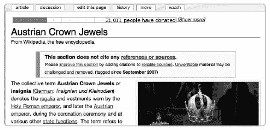

# 第一章. 维基百科有什么？

维基百科很大。你简直无法相信它是多么庞大，多么巨大，多么令人难以置信。即使你只阅读维基百科文章的标题，也需要一个月的大部分时间，不间断地浏览它们。如果你尝试用微软百科全书或任何传统百科全书做同样的事情，你可以在大约一天内完成，还有时间吃饭、洗澡，然后上床睡觉。如果你连续阅读维基百科的**全部**内容，需要超过两年时间——然后你还得从头开始，因为在此期间，大多数页面都会发生变化。

维基百科中已有超过两百万篇文章。该网站仍在以惊人的速度增长，因此当你阅读这篇文章时，这个总数无疑会比我们撰写时要高得多（见图 1-1). 到 2008 年初，英语维基百科的估计词汇量超过 96 亿个字，相当于超过 1700 本《战争与和平》（在标准英文翻译中约有 560 万个字）。^([1]) 平均每月增加 2000 万到 4000 万个字，或者 35 到 70 本《战争与和平》——或者说每天每 12 小时就会增加一本，全天候，连续不断。


**图 1-1. 维基百科随时间增长的趋势**

这种巨大的增长自维基百科开始以来一直在发生。一些统计数据还显示，自 2005 年以来，该网站的增长速度最快，因为维基百科的主流人气开始上升：

+   该网站于 2001 年 1 月 15 日启动。

+   到 2004 年 4 月，仅英语维基百科就有 25 万篇文章。

+   到 2005 年 3 月，英语维基百科的文章数量超过了 50 万。

+   一年后，即 2006 年 3 月 1 日，英语维基百科超过了 100 万篇文章的里程碑。

+   到 2006 年底，英语维基百科的文章数量超过 150 万，平均每天增加约 1700 篇新文章。

+   文章总数在 2007 年 9 月超过了 200 万。

+   到 2008 年 8 月，文章数量超过 250 万。此时，每周的文章增长速度达到 1 万篇。

在同一时期，其他语言的维基百科也经历了巨大的增长；参见第十五章了解更多关于这些项目的信息。

维基百科从未设定过文章数量的目标；只要符合维基百科的标准，任何贡献都会被保留在百科中。平均而言，维基百科的文章仍然相当简短，比如说 500 字，但随着时间的推移，文章也会逐渐增长。

英语维基百科中超过两百万篇文章，涵盖了几乎所有可以想象的主题：从基本科学主题的详细解释到流行电视节目集的同样详细的阐述。有关于铁路机车、编程语言、各种类型的人、抽象概念以及世界各地城市和镇的文章。发现维基百科中的内容是探索网站的一大乐趣。

这第一章将通过以下方法介绍百科全书：

+   描述在维基百科中找到的内容。（如果你被维基百科错综复杂的设置搞得不知所措，第三章将讨论在网站上导航的好方法，并解释如何通过搜索和浏览来查找内容。）

+   通过概述主题包含的标准、覆盖主题的风格和其他内容政策来解释百科全书旨在包含的内容类型。一旦你了解了管理内容的政策和指南，你就可以开始了解维基百科的*风格*——那些表明文章是否由优秀编辑修改的细节。（第四章将更详细地解释如何评估文章的质量。）

    **什么是文章？**

    在这个语境中，“文章”被定义为包含百科全书信息的维基百科页面。技术上，文章计数仅衡量那些不是死胡同（这意味着它们至少包含一个指向另一个维基百科文章的内部链接）且不是*重定向*（简单地自动将你带到另一个文章的页面）的内容页面。文章计数还忽略了大量其他类型的页面，这些页面并不专注于内容（行政、内部、图片描述和社区页面，在非文章页面类型的“非文章内容”中详细描述）。到 2008 年中旬，计算所有这些其他页面使得维基百科的总页面数超过了 1300 万。

+   总结维基百科中不包含百科全书文章的部分，并解释如何区分文章和其他类型的页面。

本章提供的基本信息将为理解如何在第二部分中描述的编辑维基百科，以及如何在第三部分中描述的参与网站社区奠定基础。

维基百科涵盖了普通百科全书、专业百科全书和年鉴中找到的每一个主题，以及许多这些传统参考书中没有涵盖的主题。这在一定程度上是因为维基百科不受传统出版经济学的限制；它不需要支付作者费用或花钱在纸张上。（维基百科受其志愿者判断的限制：它不会接受任何文章。实施了几项包含政策。）

### 注意

*维基百科社区的最高宗旨是创建和改进文章，并免费分发它们*。

**里程碑**

人们一直对维基百科的*里程碑*感兴趣——即维基百科文章数量超过某些整数倍的时刻。围绕猜测五十万和一百万篇文章的里程碑日期，形成了友好的赌局。在撰写本文时，五百万和一千万篇文章的赌局正在进行，猜测维基百科达到这些里程碑的确切日期。（奖品是广泛的对你非凡猜测技能的认可。）请参阅[[Wikipedia:Pools]]。

实际上，第 100 万篇文章是在 2006 年 3 月 1 日创建的，是关于苏格兰一个火车站的条目[[Jordanhill (railway station)]]. 数百人在 IRC 频道和维基百科上倒数，看哪一篇新文章会成为第 100 万篇。许多编辑焦急地等待发布的机会；在同一秒钟内，就有超过一百篇文章被贡献出来。甚至有主要媒体对此事件进行了报道；请参阅[`wikimediafoundation.org/wiki/Press_releases/English_Wikipedia_Publishes_Millionth_Article`](http://wikimediafoundation.org/wiki/Press_releases/English_Wikipedia_Publishes_Millionth_Article)。第 200 万篇文章是在 2007 年 9 月 9 日创建的。在有些混乱的情况下，关于西班牙电视喜剧的条目[[El Hormiguero]]被认定为可能是第 200 万篇文章。

**受众和水平**

所有文章都应表述清晰，易于一般读者理解，但维基百科也欢迎需要背景知识才能完全理解的专家文章。然而，这些文章应包括为普通读者提供背景信息。

在罕见的情况下，关于一个主题存在两篇文章——一篇提供全面图景的坚定不移的文章，以及一篇面向非专业人士的更易理解的“介绍”文章（例如，[[Introduction to entropy]]）。请参阅[[Category:Introductions]]。

文章在长度、细节和全面性方面差异很大。大多数维基百科文章最初都是以*概要*（非常简短的摘要）的形式开始的，并由几位编辑逐渐构建成更全面的处理方式。概要是不完整的——按定义，它们缺少一些关键内容——但它们通常很有用且写得很好。大约 70%的维基百科文章仍被归类为概要。

剩余的 30%文章（可能超过五十万篇）是对某一主题的更深入、更全面的处理。这些文章可能与传统百科全书中的最佳作品相媲美，甚至超越。一篇高质量的条目包括众多来源和参考文献、图片或图表，以及对该主题的完整和清晰解释。

# 文章类型

你想知道维基百科是如何找到足够的话题来填充两百万篇文章的吗？以下是一些（但绝不是全部）包含的内容类型：

**传统百科全书主题**

你可以找到所有你可能从通用百科全书如*Encyclopaedia Britannica*中期望的内容类型。关于科学、历史事件、地理、艺术和文学的文章都包括在内。

**人物**

没有任何职业或群体被限制或强调，尽管为了使某人符合文章资格，该人必须在其主要活动领域内是**知名**的，也就是说，在该领域内广为人知。一旦满足这一标准，你就可以写关于任何人的文章：艺术家、音乐家、科学家、历史人物、作家、运动员、政治家、君主等等。（然而，人们被鼓励不要写关于自己的文章。）维基百科传记项目（[[Wikipedia:WikiProject Biography]])跟踪传记文章；截至 2007 年底，有近 40 万篇文章被列为传记，占维基百科的近 20%（参见图 1-2

**图 1-2. 2007 年 8 月维基百科内容的一个表示：7.2%的文章是关于地点；3.4%关于专辑和单曲；3.0%关于生命树动物学；1.6%关于电影；10.8%关于在世人物；8.9%关于其他传记。消歧义（dab）页面占维基百科的 4.2%。两万篇文章代表了维基百科的 1%。这些数据由荷兰维基百科用户尤金·范德皮尔整理。**

**计算机软件和硬件**

考虑到维基百科的编写方式，你可能会期待看到一些关于计算机的文章，而且你的预期是正确的——有数千篇文章是关于编程语言、软件、硬件和计算机科学理论的。

**交通**

维基百科受到了交通爱好者的喜爱。有数千篇文章是关于火车站、运河、机场和其他交通网络细节的。例如，关于明尼苏达州 2007 年 8 月 1 日坍塌的州际公路桥[[I-35W 密西西比河桥]]的文章，在事件发生一年多前就已经创建。

**当前事件**

尽管该网站不支持原创报道，但在重大新闻事件发生时，维基百科会迅速更新。自从对[[2004 年印度洋地震]]及其相关海啸的即时报道以来，当前事件报道一直具有重大影响力（这篇文章在其最初的 48 小时内就有超过 1000 次编辑）。关于该网站上当前事件的更多信息，请参见第三章。

一些页面主要是**导航性**的。这些页面的存在是为了指向其他维基百科页面。以下三种导航页面特别值得注意：

**列表**

链接列表是维基百科的一个定义性特征。想要找到关于埃尔维斯·普雷斯利的歌曲列表？没问题——它就在[[关于或引用埃尔维斯·普雷斯利的歌曲列表]]。列表可以关于几乎任何主题；尽管像任何内容一样，它们理想上应该有参考文献。事实上，[[女性网球运动员列表]]是维基百科上最早创建的页面之一。列表是可浏览的；从[[主题列表]]开始，你可以找到关于……几乎所有事物的列表。（参见第三章，了解我们的一些最爱。）

**消歧义页面**

这些页面包含一系列链接，指向可能具有相似名称的文章。例如，维基百科页面[[Orange]]链接到关于橙色、水果、橙碗、荷兰奥兰治王室以及众多其他页面的文章（参见图 1-3）。由于当不同主题共享一个名称时，无法预知你可能在寻找哪种含义，因此这些**消歧义**页面汇集了所有可能的选择。这些页面对于传记性姓名特别有用：如果在某些研究过程中，你只遇到一个姓氏，尝试查找该姓氏的维基百科页面。它可能会迅速为你提供一系列可供选择的人物。

![消歧义页面 [[Orange]]](tagoreillycom20090804nostarchimages315802.png.jpg)

**图 1-3. 消歧义页面 [[Orange]]**

**重定向**

这些页面只是自动将你从一个页面标题带到另一个页面标题。你实际上不会直接看到这些页面，但它们被广泛用于不同的拼写、姓名的变化以及任何可能存在关于确切文章标题混淆的情况。重定向不计入官方文章数量，但列表和消歧义页面当然计入。

**进一步阅读**

[`en.wikipedia.org/wiki/Special:Statistics`](http://en.wikipedia.org/wiki/Special:Statistics) 提供当前文章数量的自动生成的统计数据页面

[`en.wikipedia.org/wiki/Wikipedia:Statistics`](http://en.wikipedia.org/wiki/Wikipedia:Statistics) 包含其他统计数据和解释的页面

[`meta.wikimedia.org/wiki/Milestones`](http://meta.wikimedia.org/wiki/Milestones) 项目的历史里程碑列表

[`en.wikipedia.org/wiki/Wikipedia:What_is_an_article?`](http://en.wikipedia.org/wiki/Wikipedia:What_is_an_article?) 描述文章是什么的常见问题解答页面

[`en.wikipedia.org/wiki/Wikipedia:Wikipedia's_oldest_articles`](http://en.wikipedia.org/wiki/Wikipedia:Wikipedia's_oldest_articles) 一些维基百科最古老的文章列表

* * *

^([1]) 此图基于对[`en.wikipedia.org/wiki/Wikipedia:Size_in_volumes`](http://en.wikipedia.org/wiki/Wikipedia:Size_in_volumes)上尺寸估计的参考，该页面还指出维基百科相当于 725 卷的*大英百科全书*。

# 文章和内容收录政策

当人们得知任何人都可以向维基百科添加内容时，他们通常会假设任何类型的内容都可以以任何方式添加。但事实上，在维基百科上的编辑和写作受到一系列规则或*政策*（这些在第十三章中进行了全面讨论）的约束。

与传统百科全书一样，维基百科并不接受任何内容，尽管其收录政策比大多数百科全书都要宽泛得多。只有符合特定标准的文章才会保留在维基百科上。

维基百科试图通过制定和遵守一般内容政策，而不是提前创建一个批准主题的清单，来过滤掉非百科全书性质的内容。可以添加到百科全书的内容不是预先确定的，而是根据在早期制定的一些基本原则来决定。

政策决定了可接受的主题类型以及处理这些主题的方式。如果得到正确执行，政策旨在无论主题多么有争议，都能得到公平对待。如果政策无法遵守——例如，如果关于某个主题没有可靠的来源——那么为该特定主题创建一篇优秀的维基百科文章可能会失败。然而，无论个人是否喜欢该主题本身，都不应该影响是否包含该文章。换句话说，维基百科上出现的内容的唯一限制是是否可以撰写一篇符合所有内容政策的文章。

没有特定的人负责决定一篇文章是否适合维基百科。相反，贡献者直接将新页面提交到网站上，并且它们立即上线，无需中间人。其他贡献者随后会审查这些文章。每天都有大量新文章被删除，但符合内容政策的新的内容被保留。（有关如何开始撰写新文章，请参阅第六章，有关文章是如何被删除的，请参阅第七章。）一篇新文章也可能被编辑得相当激进，以便使其更适合保留。如果一个编辑插入违反政策的内容，或者删除符合政策的内容，那么他并没有推进项目目标。

虽然对这些政策普遍存在广泛的共识，但它们（就像维基百科上的所有事物一样）依赖于编辑实际上应用它们。如果你发现似乎违反这些指南的内容，这通常意味着还没有人着手修复它。

## 核心政策：V、NOR 和 NPOV

三项政策对于维基百科的运作至关重要，没有它们，百科全书将无法辨认（或不存在）。这些核心政策是可验证性（V）、无原创研究（NOR）和中立观点（NPOV）。总的来说，它们构成了内容创建和编辑的框架，这些内容是每天根据没有自上而下的编辑控制来进行的。

从一开始，维基百科就致力于中立观点（NPOV）。这项政策类似于记者所说的*报道中的客观性*。

随着时间的推移，贡献者变得更加坚定地排除猜测和谣言，因此维基百科需要一项促进事实核查的政策。这一原则现在被表述为*从可靠来源的可验证性*。

随着维基百科的日益流行，还有一个基本需求，即防止维基百科被用作一个讲台来传播某人刚刚想到的新想法（委婉地称为*原创研究*）。无原创研究（NOR）政策规定，在维基百科中记录之前，观点和事实必须由第三方在其他地方预先发表。

**政策的重要性**

大多数维基百科的政策最初是解决争议或其他问题的临时解决方案。由于它们在这些有争议的领域工作得很好，并且证明是稳健的，因此它们在整个百科全书范围内得到了普及。这些政策的实际应用可以有一些解释，但如果一个维基百科贡献者在理论上与这些政策有重大分歧，那么这位贡献者可能不会在维基百科上感到快乐。

**政策与指南**

在*政策*和*指南*之间有一个区别。政策是强制性的，而指南是建议性的。指南是更复杂的规则，有助于保持维基百科的高质量。三个核心内容政策由一系列相关的指南支持，这些指南将在我们继续前进的过程中讨论。这些指南包括知名度的概念和定义维基百科覆盖范围边界的各种原则。

在概述中，每项主要政策似乎都足够简单。它们的影响展开则是另一回事。想象一下，如果你能的话，一篇关于摇滚乐队且对药物滥用和直白歌词持*中立*态度的文章，只报道了关于被毁坏的酒店房间和 Smashing Pumpkins 乐队的影响的*已发布文件*，并且像任何博士论文一样，在脚注中*引用其参考文献*。你几乎接近了维基百科特有的声音。

## 理解政策

*可验证性*（[[维基百科:可验证性]]，快捷键 WP:V）意味着你应该始终能够通过使用文章中引用的可靠外部来源来验证维基百科文章的内容是真实的。可验证性政策的存在是为了使维基百科更加准确。误记的事实、随意写作和八卦不应包含在文章中。

在一篇完美的文章中，任何主要的事实陈述都可以追溯到维基百科之外的一个来源，无论信息是由匿名编辑（是否为该领域的专家）添加的。维基百科中的参考文献是明确引用的，这与许多传统百科全书不同。那些作品是由小组成员撰写的，但由于维基百科对所有希望贡献的人开放，即使是匿名贡献，因此相应重要的是确保文章的陈述可以通过可靠的外部来源得到证实。

如果一个主题从未被任何可靠第三方讨论过，可验证性政策规定，维基百科不应有关于该主题的文章。撰写文章应推迟到在维基百科外部发布更好的来源。 （缺乏已发布的来源也可能表明该主题只对少数人感兴趣；参见其他指南中的“其他指南”。）

在实践中，能够验证来自其他来源的信息非常有用，即使在表面上看似微不足道的问题上也是如此。当一篇文章提供了来源列表时，它成为进一步研究的便捷起点。

除了对读者有益外，可验证性政策还通过为维基百科编辑提供一个明确的提问来简化事情，以便在评估文章质量时使用：*这个陈述是否反映在外部来源中？*

尽管可验证性是一个核心政策，但它尚未得到完全实施，成千上万篇文章被标记为未引用（见图 1-4)。可验证性被作为一个普遍原则应用。在实践中，编辑验证一个陈述的能力可能取决于，例如，能否访问一个良好的图书馆（这在许多发展中国家是一个主要问题）。只有当理论上至少可能检查其准确性时，才应包括一个事实；对于重要的真实陈述，随着时间的推移几乎总能找到来源。



**图 1-4. 这是未引用任何来源的文章模板信息，这是遵守可验证性政策的关键部分。这些信息旨在警告读者并提醒编辑文章尚未完成**。

你肯定会在维基百科上看到未引用的内容。其中一些内容之所以没有来源，仅仅是因为引用是项艰巨的工作，而维基百科仍在不断进步。但是，有些内容明显违反了可验证性的理念（例如，任何有争议且引用不当的内容，或者真的无法引用的内容，如私人对话中说过的话）。这些材料可能会受到质疑，并最终被删除。（关于引用风格和来源的更多讨论，请参阅第六章)。

*无原创研究* ([[维基百科:无原创研究]], 快捷键 WP:NOR) 意味着维基百科文章中的所有概念和理论都应该基于先前发表的账目和想法。维基百科文章不应包含原创想法、结论、描述或事实的解释。也不应包含编辑的个人观点、政治意见或对已发表材料的任何未发表的分析。

如果你有一些创新的想法要表达，维基百科并不是向公众展示这些想法的正确地方。换句话说，如果你已经进行了一个实验，思考了一个哲学论点，或者发展了一个数学证明——恭喜你！但是，除非你的工作已经发表在其他地方（理想情况下是在同行评审和学术来源中），否则这些内容不属于百科全书。

**可靠来源**

不可避免地，在项目中关于什么是可靠来源的讨论很多；这种讨论逐渐产生了一个名为*可靠来源*（该指南明确了可验证性政策）的指南。它列出了各种可能的来源类型，自然包括传统的学术书籍和文章。某些网站是合格的，但自出版来源，如博客通常不算。虽然来源批评（对来源声誉的挑剔）主要应留给特定领域的专家，但指南的意义是显而易见的：维基百科旨在生产准确、严肃的参考材料，因此，它依据的事实来源必须尽可能有信誉。参见[[维基百科:可靠来源]]（快捷键 WP:RS）。

“无原创研究”政策的最初动机是为了防止持有非传统个人理论的人利用维基百科来吸引对其思想的关注。如今，“无原创研究”被一致用来反对包含那些并非疯狂但过于新颖、不适合维基百科的材料。如果怀疑文章中的材料来自编辑的个人经验，而不是可验证的来源，文章也可能被标记为可能包含原创研究（参见图 1-5）。


**图 1-5. 文章模板消息，表明对违反“无原创研究”政策的担忧**

NOR 还意味着编辑不应被诱惑提供历史解释或得出结论，即使它们看似显而易见，也不应引用支持外部来源给出相同解释。一个后果是，历史文章往往不以对人物或事件的总体评估总结。可以引用历史学家的结论，但如果两位历史学家意见不一致，不应有作者试图调和观点；应给出双方观点，让读者自行得出结论。事实中可能存在某种模式，但这不是维基百科向世界揭示的。如果其他人指出这一点，可以提及并归功于他们。

可验证性、可靠来源和“无原创研究”显然有共同之处。在维基百科中，事实和观点都必须基于和参考已经发表的外部信息和思想。目前正在进行讨论，是否可以将这些原则概括为*归属*这一概念下。

*中立观点*（[[维基百科:中立观点]]，快捷键 WP:NPOV）意味着关于特定主题的所有观点都应得到公平的呈现。中立观点是维基百科上最古老、最受尊敬、最核心的政策之一。中立的文章不提出任何立场，通过提供其主题的良好概述来专注于向读者提供信息。它公正、准确，并通过报告存在分歧的主要观点来处理有争议的问题。

从读者的角度来看，中立性的效果应该是这样的：关于有争议的主题的文章，例如不同群体对历史事件有不同的看法，不应透露文章作者在问题上的立场。在几乎所有情况下，这样的文章都将由一群编辑共同完成，他们的观点不应显现出来。尽管之前给出了摇滚乐队的例子，但还有一些更严肃的主题，在这些主题上保持中立观点并不容易应用。考虑对奴隶制、共产主义、爱尔兰历史或堕胎的中立处理。每个问题都必须谨慎处理，给予故事的所有方面适当的权重。对对立意见的讨论应保持无同情或偏见的语气，无论主题如何。

中立的文章也应该是全面的，尽管它们不必包罗万象。所有重要的观点都应提供或概述。特定观点流行的原因应以公平的总结给出，但文章中的整体表达不应有偏见。中立观点并不意味着少数派观点必须以与多数派观点相同的覆盖面来撰写，尤其是在它们被接受的程度存在很大差异的情况下；观点应按比例撰写。对于像“地球是平的”这样的小众观点，可以简要处理，或者在某些情况下，如果低于维基百科自然关注阈值，可以省略。没有“平等时间”的教条。事实上，无论观点在外部接受程度如何，都给予所有观点平等覆盖本身就是一种编辑行为。同样，对于文章中强调的事实或事件也是如此；丑闻、谣言或阴谋理论可以包括（如果来源适当），但不应该给予不合理的头条地位。维基百科不是小报新闻。

使用中立观点，可以处理各种争议。文章不应直接在文本中包含观点：“可口可乐比百事可乐好得多”是错误的方法。相反，陈述应该是中立的、间接的、准确的和具体的。例如，可以写“根据 2006 年《口味测试者月报》发表的一项口味测试者调查，52%的口味测试者认为可口可乐比百事可乐好”，并附上所引用文章的完整引用。（顺便说一句，这是一个虚构的引用。有关一些真实的引用，请参阅[[新可口可乐]]。）当然，中立性也排除了所有基于选择性引用的宣传活动技巧。

当来源在事实上有分歧时，NPOV 也提供了帮助。编辑们经常面临历史记录或事实问题上的矛盾；例如，是否人 X 是 Y 的侄子还是儿子。两种说法都可以包括。根据可验证性和中立观点原则，这个有争议的事实点应该以“来源 A 说 X 是 Y 的侄子，而 B 说 X 是 Y 的儿子”的形式出现，并附上参考文献。根据无原创研究政策，这个问题应该就此搁置，如果来源 C 发布了一些新的证据，那么这些证据应该随后被添加。Wikipedia 不是一个法庭，不能做出裁决，编辑们不应该试图自己找出“正确”的答案；文章可以简单地以公平和适当的方式呈现证据，供读者考虑。

遵循 NPOV 意味着广告、新闻稿和其他促销材料不受欢迎于 Wikipedia，因为这些本质上是非中立的。这听起来可能相当明显，但它也影响了社区对其他来源的接受。例如，来自公司或学校的促销网站上的文本，这些文本经常被用作来源，通常是不可中立的，在引用之前应仔细考虑。

除了使广告变得不可接受之外，NPOV（中立观点）也是强烈劝阻编辑们撰写关于自己或其组织文章的主要原因。除了基本的 factual corrections（事实修正）之外，对自己保持中立实际上是非常困难的。（也请记住，文章中的任何陈述，即使是你像自己的生命一样熟悉的话题，都需要引用外部来源以支持，因为可验证性和无原创研究原则。Wikipedia 永远不应该用于宣传。）

**编辑丑闻**

一些对 NPOV 政策的违反已经引起了广泛关注；例如，发现某位政治家的工作人员正在编辑该政治家的传记，使其更加有利，并删除了令人不适的事实。自然，这违反了中立观点政策。2006 年 1 月 27 日，《洛厄尔太阳报》报道了关于一位美国政治家、众议员马蒂·米汉的维基百科文章。报道称，一位匿名编辑，其 IP 地址追踪到众议院办公室，一直在努力删除提及这位国会议员违反任期限制承诺的内容。这随后成为全国性新闻故事。

所有内容政策，尤其是 NPOV，都会影响维基百科的风格和其文本的措辞。关于 NPOV 的争议通常最终会出现在文章的讨论页面上（在第四章中讨论“理解与评估文章”）；如果关于某个主题的证据有激烈的辩论，编辑可能会将文章标记为涉及 NPOV 争议（参见图 1-6）。


**图 1-6. 文章模板消息，表示对标记文章没有中立观点的担忧**

## 其他指南

除了上一节中讨论的三个核心政策外，还有一些其他指南有助于确定维基百科中包含的内容。

### 显著性

维基百科应仅涵盖由可靠、独立的二手资料确定的在现实世界中被认为值得注意的主题。显著性有助于设定一个基本水平，以防止维基百科变成其他不是百科全书的东西。在实践中，缺乏显著性是认为某个主题不适合维基百科文章的最常见原因。

这个概念与“名声”、“重要性”或“流行”不同，但这确实意味着不应该有关于只有极少数人感兴趣或地方性兴趣如此之小以至于没有出版物关于它们的主题的文章。换句话说，文章不应该关于你的宠物或你的房子（除非这些特别知名并且之前已经有过相关写作）。

显著性容易从表面上去思考，但在抽象层面上应用或清晰定义却很困难。对显著性的感觉需要对该领域内主题相对重要性的实际感知，同时也需要一种学术上的感知，即哪些类型的来源决定了显著性。百科全书编纂者必须权衡一个主题上可获取信息的广度和质量。以一个例子来说，英格兰的爱德华五世国王，塔楼中的王子之一，他的统治因叔叔理查德三世的登基而中断，他显然是显著的，尽管关于他和他命运的许多写作都是推测性的。

部分原因是因为这种模糊性，显著性的争议性和可辩论性比可验证性、无原创研究和中立观点更为突出，但它也与这些政策密切相关。关于它的争论在抽象层面上可能是复杂的，但在实际操作中，随着时间的推移，非显著性的文章会被从维基百科中删除。

已经为各种有争议的领域设立了单独的显著性指南，例如演员和女演员、网站、公司、音乐团体、电子游戏等等；这些指南可以通过主显著性页面上的链接找到。许多这些指南都是为了帮助强化维基百科不是一个推广服务的理念，并且大多数都依赖于是否存在可靠的二手来源以及一个主题上可用的文档数量。例如，如果爱丽丝有一个每天有数千次点击的网站，但没有人曾在任何出版物中写过它，那么鲍勃很可能无法写一篇关于爱丽丝网站的维基百科文章，这篇文章不会被其他编辑删除，也不会因为非显著性而被简短地评论为“nn”。

类似地，假设卡拉希望写关于她最喜欢的乐队，这个乐队在当地很受欢迎，但没有主流音乐媒体的报道。不仅写一篇中立的文章很困难，而且也没有可靠的已发布来源供卡拉使用（即使她首先了解乐队的病史）。

就像之前的例子一样，显著性应该与每一篇单独的文章相关联，而不是整个主题类别。一些音乐团体无疑是显著的，一些公司和一些电子游戏也是如此；而另一些则不是。显著性的指南有助于区分这些。

另一方面，关于显著性的想法存在固有的问题，这导致了多年来关于如何措辞和应用指南的许多持续辩论。以下是一些关于显著性的注意事项，需要记住：

+   显著性可能是短暂的。有些主题的兴趣是短暂的，例如互联网迷因和“因出名而出名”的类别中的名人。

    **关于显著性**

    知名度是由全世界评判的，而不是由维基百科编辑做出个人判断。如果全世界独立于主题的多个人员都付出了努力，创作并发布了关于该主题的非平凡作品，那么他们显然认为它是知名的。维基百科只是反映了这种判断。（改编自 [[User:Uncle G/On notability]])

+   知名度并不等同于有一个粉丝或有人花时间深入研究一个主题；必须有多个独立来源。

+   任何给定主题在英语中可获得的文献的可用性可能会扭曲对知名度的看法；特别是，传记事实的获取是不均匀的，导致系统性偏见，这将在第十二章（hw-wkpd-wk_15.html "第十二章. 社区和沟通"）中讨论。

+   知名度并不等同于区别。它可能源于丑闻或参与争议，以及诸如写书等公认的工作。

+   某个领域的知名度并不等同于声誉。例如，维基百科会包括那些现在已失去信誉但出于某种原因而闻名的人，但会省略那些只是不太知名的扎实科学家。

关于最后一点，假设如果没有维基百科文章，主题就不知名，这是明显有缺陷的。维基百科是一个正在进行中的作品，许多有价值的潜在文章尚未撰写。

总结来说，在没有良好来源的情况下撰写可验证的文章是一项没有稻草的砖块练习，来源的有无有助于确定知名度。考虑知名度有助于保持项目的百科全书性质。应用中的知名度指南可能仍然倾向于包含，偏向于那些在其他地方有良好记录的较小主题。这是政策演变的一个自然后果，使得可靠来源变得日益重要。

**不要写的内容**

有些文章主题几乎总是坏主意。例如，你可以安全地假设以下任何一种关于或描述的文章都属于不必要的文章类别：

+   你或你所在的组织

+   你的乐队，只卖出了一张专辑的 47 张（即使你认为会卖出 48 张——或者可能是 49 张！）

+   你和你的朋友们在学校某一天编造的宗教或语言

+   你居住的街道（除非它在《大富翁》棋盘上）

+   宝可梦电子游戏系列中的 56 个不同区域中的任何一个

+   你的公寓楼

+   只有你自己尝试过的一次特技或技巧，可能还失败了

+   你自己制作的任何一部电影，其观看人数从未超过你地下室能容纳的人数

来自 [[Wikipedia:List of really, really, really stupid article ideas that you really, really, really should not create]]（快捷方式 WP:DUMB）。对于更严肃的版本，请参阅 [[Wikipedia:List of bad article ideas]]（快捷方式 WP:BAI）。

### 版权材料

就像在其他提交写作的出版物和组织中一样，抄袭是不被允许的。此外，提交给维基百科的任何材料都必须特别许可在 GNU 自由文档许可（GFDL）下，这是一个“免费许可”（见第二章)，与传统版权不同。这个许可意味着任何人都可以在满足某些条件的情况下，无需请求许可就重新使用和重新分发维基百科的内容，用于任何目的；维基百科的内容可以在其他网站上使用，甚至可以印刷出版。

由于这些原因，从其他地方获取的材料通常不应出现在维基百科上。你不应该从互联网或其他地方复制文本或照片，并在维基百科上重新发布，除非得到明确的许可；复制任何非公共领域或未明确许可为免费使用的作品是版权侵权。

此外，那些最初并非为维基百科编写的材料（例如论文）通常不符合其他内容指南。在几乎所有情况下，最好是重新撰写文章。

### 非百科全书内容

一些*非百科全书内容*不适合维基百科，但在其他姐妹维基媒体项目中可能受到欢迎。例如，单词的定义（没有支持百科全书信息）超出了维基百科的范围。描述此类文章的术语是*dicdef*，即*词典定义*的缩写。仅词典定义不足以构成维基百科文章。然而，词典定义在维基词典中非常受欢迎，维基词典是维基媒体的一个免费词典项目。

事件的原版报道也不是维基百科的一部分。你可能目睹了一个事件，但直接将你所知道的事件写入百科全书可能违反了“无原创研究”或“可验证性”政策。维基百科必须等待主流媒体报道事实，然后才能整理。另一方面，原始报道是维基新闻的使命的一部分，维基新闻是一个公民新闻项目。

同样，一篇“如何做”的文章可能不是百科全书式的，但在维基教科书中却很合适，维基教科书是维基媒体的一个旨在编写免费教科书的计划。

原始来源文件（例如，柯勒律治的《古舟子咏》）不受欢迎在维基百科上，但这是因为原始资料属于维基源。

这些姐妹项目在第十六章中有详细描述。

## 维基百科不是什么

有时从负面角度思考内容收录指南是有帮助的。以下是对维基百科不是什么的基基本共识（改编自[[维基百科:维基百科不是什么]], 快捷键 WP:NOT）。综合这些声明，有助于定义应用于维基百科内容的边界。它们也存在于政策指南中更长的表述形式中。

**维基百科不是一个信息杂烩，不是一个目录，也不是一个词典。**

它是一个百科全书（最好是全面的），其中使用诸如知名度等标准来筛选条目。例如，一个名为[[以“Lemon”开头的乐队列表]]的文章正是其标题所暗示的：一个简单的列表，没有分析或背景，只列出了 Lemonheads、Lemon Jelly 和其他一些乐队。这篇文章很快就被删除了。维基百科上的文章应该有一定的目的。它们应该提供一些可识别为“信息”的内容，关于一些可识别为“主题”的内容。

在类似的意义上，维基百科并不力求成为一个“名人录”或已发表作品的目录。家谱和其他家族历史不会被存储在维基百科上，因为许多家族历史被认为是“杂乱无章的”：与某个知名人士有关联并不使一个人变得知名（皇室家族和其他继承原则重要的例外）。

**维基百科不是一个纸质百科全书。**

尤其是维基百科无需担心印刷成本或物理上的不便。它无需缩短或筛选文章以节省空间。只要有钱购买服务器和带宽，就没有物理上的增长限制。

对于覆盖范围的影响是重大的：“不值得包含”的决策不必经常做出。这也是维基百科模式与早期百科全书相比发生重大变化的原因之一。只要文章符合网站的其他指南，可以包含专业或较小的文章。维基百科没有对应该包含哪些人类知识分支有固定的限制。

**维基百科不是一个原创思想的出版者，也不是一个讲台。**

这重申了“无原创研究”的政策：维基百科不感兴趣个人论文。实际上，它不是一个发表个人或政治观点的好平台。如果你想要在网上发表自己的名字和观点，许多免费网站和博客提供商可供选择。对产品、公司和其他个人观点的评论——无论正面还是负面——同样不受欢迎于维基百科文章中。这些内容更适合放在专门用于评论的网站上。

**维基百科不是一个镜像，不是一个文件库，不是一个博客，不是一个网络空间提供商，也不是一个社交网站。**

这可能看起来像是一个奇怪的观点，因为它不是针对维基百科的文章，而是针对其*用户页面*，即编辑为自己的工作空间创建的页面。（我们将在第十一章中介绍用户页面。）任何人都可以来创建一个用户页面，但维基百科只提供这个工作空间，以便编辑能够识别自己并更有效地协作——而不是备份无关文件、发布博客或寻找潜在伴侣。维基百科是一个具有非常特定目的的项目——创建和分发百科全书。它不是一个用于存储其他无关信息的有用网络应用。

**维基百科不是水晶球。**

这是一条关于发布关于未来事件谣言和猜测的警告，例如关于正在制作的电影的八卦。如果还没有发生，那么它就不是维基百科的内容（尽管与所有指南一样，这应该用常识来解释：这并不意味着只有在开幕式开始时才能开始撰写 2012 年夏季奥运会的文章）。

**维基百科不受审查。**

条目旨在面向一般和受过教育的成年读者，维基百科既不简化，也不是为了满足儿童的需求或保护而编纂的。虽然内容旨在客观真实，但也坦率，对人类性别的描述广泛。宗教与其他内容一样对待。百科全书中的某些图片可能令人不安或震惊。

因此，某些内容可能被认为对年幼儿童不适当或冒犯性。可以理解，这种缺乏审查可能引起困扰——有数百篇文章涉及许多人不愿思考的话题。考虑到目标是成为所有人类信息的存储库，由来自世界各地真正多元化的群体撰写，这是不可避免的。并且鉴于中立观点和可验证性的政策，维基百科经常是关于有争议或可能冒犯性话题信息的优秀来源。

### 注意

*维基百科，然而，绝对不应该包含任何针对个人的诽谤内容。[[维基百科：在世人物的传记]]（快捷方式 WP:BLP）为关于人物的条目设定了严格的收录条件。可验证性和中立观点适用于所有主题，并在可能影响真实生活的情况下得到严格执行。不幸的是，如果你确实感到被诽谤，请转到帮助，我的文章有误！获取具体的投诉建议*。

**无蓝笔，无言论自由**

“不审查主题”并不意味着可以忽略其他关于网站互动的行为准则和包含政策。尽管宽容在维基百科上被高度重视，但在政策中没有任何关于言论自由的内容。该网站被设计为一个百科全书项目，而不是一个普通论坛。

**维基百科不是静态的。**

文章永远不会一成不变。百科全书是一个开放性的、不断进行中的作品，维基百科的文章按定义总是临时的。即使是最好的文章也不被认为是不再需要改进的。这种态度反映了一种共同的观点，即知识本质上是一种动态和不断扩展的东西，而不是固定不变的。

这个最后一点通常没有明说，但它至关重要。总是可以进行更改，文章总是可以改进，总有其他事情要做。

**进一步阅读**

[维基百科：中立观点](http://en.wikipedia.org/wiki/Wikipedia:Neutral_point_of_view) 中立观点政策

[维基百科：不原创研究](http://en.wikipedia.org/wiki/Wikipedia:No_original_research) 不原创研究政策

[维基百科：可验证性政策](http://en.wikipedia.org/wiki/Wikipedia:Verifiability) 可验证性政策

[维基百科：显著度](http://en.wikipedia.org/wiki/Wikipedia:Notability) 显著度指南

[维基百科显著度指南分类](http://en.wikipedia.org/wiki/Category:Wikipedia_notability_guidelines) 有关特定主题的各种显著度指南

[维基百科：可靠来源](http://en.wikipedia.org/wiki/Wikipedia:Reliable_sources) 判断可靠来源的指南

[维基百科：维基百科不是什么](http://en.wikipedia.org/wiki/Wikipedia:What_Wikipedia_is_not) 维基百科不是什么的政策

# 非文章内容

维基百科上的所有页面分为两种类型：大约两百万篇文章构成了百科全书的内容，但还存在一百万个项目相关的页面。这些页面是什么？如果你只是查找一些内容，你会看到它们吗？如果你在使用搜索引擎时发现了它们，你应该忽略那些搜索结果吗？

维基百科的读者应该认识到，一些维基百科页面不是文章，但他们不需要对非文章页面有任何特定的理解，可以自由忽略它们。另一方面，参与的编辑应该了解不同类型的页面——它们的目的以及它们如何帮助润滑维基百科的运作。与项目相关的和行政页面可能不如文章那样引人注目，但在理解网站上实际发生的事情时，它们同样重要。

## 非文章页面的类型

这些额外的页面有多种类型。非文章页面致力于维基百科的管理、文章内容的讨论、技术基础设施、图像描述以及维基百科社区。

虽然它们不如文章广为人知，但其中两种页面类型——讨论页面和用户页面——实际上是开始参与维基百科最容易的地方。

**讨论页面**

每篇文章都配有一个*talk page*（也称为*讨论页面*），通过点击屏幕顶部的讨论标签访问。在这里，编辑会就文章内容提出问题、提出更改、向其他编辑显示通知，并讨论技术问题（如文章的标题以及文章是否应该分成几部分或与其他文章合并）。

每个讨论页面仅用于讨论与之链接的文章。尽管名称如此，但讨论页面并不是对文章主题进行一般讨论的论坛。

讨论页面几乎附属于每一个非文章页面。 (关于维基百科政策的讨论往往比关于单个文章的讨论范围更广，但仍然与附页的主题有一定关联。)

关于更多关于讨论页面的信息，请参阅第第四章, 第十一章, 和 第十二章。

**用户页面和用户讨论页面**

*用户页面*是供个别编辑（用户）以他们认为合适的任何细节来描述自己的。按照惯例，它们被留作一个私人空间，供编辑工作。通常，编辑会列出他们参与的项目和所工作的文章。

*用户讨论页面*，就像文章讨论页面一样，可以通过点击屏幕顶部的标签访问。为了相互沟通，编辑会在用户讨论页面上留下笔记。每当有人在您的用户讨论页面上留下笔记时，维基百科的软件会通知您。（您可以在第十一章中找到更多关于设置用户页面和留言的信息。）

其他类型的页面通常用作参考和项目协调页面。

**政策页面和指南**

这些页面提供了关于编辑内容和与其他志愿者互动的指导。政策和指南规定了编辑的风格指南、内容包含政策、解决争端的程序以及更多内容。政策将在第十三章中进一步描述。

**社区讨论、程序和项目页面**

这些页面是社区讨论提案和协调编辑项目的场所。常规程序，如删除讨论，通常基于政策，并在特殊程序页面上执行。这些过程将在 第七章 中更详细地描述。在维基百科中，“社区”的含义往往根据上下文而变化——毕竟，该网站对所有来者开放——但通常足够的是，它意味着参与这些公开论坛讨论的人。

**帮助页面**

这些页面包括编辑语法、技术流程和最佳实践的文档，并在本书中有所引用。

**图片描述页面**

每张图片都配有一个图片描述页面。这些页面存在是为了提供图片的文本描述（*元数据*）。

**MediaWiki 生成的特殊页面和管理页面**

这些是由 MediaWiki 软件动态生成的页面，作为实用工具而不是可编辑页面。它们用于特殊列表和基本页面，例如账户创建页面。

## 命名空间

每种类型的页面都通过一个前缀与其他类型（包括文章）区分开来；例如，讨论页面以前缀 *Talk:* 开头。这防止了类似名称的页面之间的“冲突”，例如，[[排序]] 是关于 *排列物品过程* 的百科全书文章，而 [[帮助:排序]] 则不是百科全书文章，而是提供关于某些维基百科页面上可排序表格的技术帮助。

每个前缀实际上是一个指示符，表明页面位于特定的命名空间内。（*命名空间* 是不同类型内容的一种容器。）例如，在这个完整的维基百科 URL

```
http://en.wikipedia.org/wiki/Talk:Benjamin_Franklin
```

*Talk* 表示页面存在的命名空间，而 *本杰明·富兰克林*，与命名空间用冒号（:）分隔，是页面的名称。如果您在内部链接到这个 URL，您将使用命名空间和页面名称的组合来正确地指明您所指的页面：[[Talk:本杰明·富兰克林]]。

存在于所谓的主或文章空间命名空间中的文章没有前缀：

```
http://en.wikipedia.org/wiki/Benjamin_Franklin
```

*本杰明·富兰克林* 是全名；没有前缀表明该页面是百科全书文章。

维基百科中所有其他类型的内容都存在于其他命名空间中，这些命名空间用 19 个可能的前缀之一表示。在标题前看到前缀告诉您该页面可能是网站社区或管理的一部分（因此不受与文章相同的内容指南的约束）。

命名空间还提供上下文并指明页面包含的内容类型。例如，帮助页面包含技术文档，而不是（比如说）百科全书文章或政策。

尽管同一命名空间中的两个页面不能共享标题，但页面可以在不同的命名空间中存在相同的“名称”。例如，文章[[Phoebe]]是关于个人名字的，是网站百科全书内容的一部分。它与存在于用户命名空间并描述使用此名称作为化名的编辑器的页面[[User:Phoebe]]完全不同。

在百科全书内容与维基百科社区页面之间，界限非常清晰，并且使用命名空间来划分。在维基百科上的实现中，社区命名空间并不总是与单一特定类型的内容完全对应。例如，虽然只有用户页面在用户命名空间中，你可能会在维基百科命名空间中找到各种页面，如技术文档、社区项目和政策。然而，所有这些页面都将与维基百科的运行有关。

**命名空间中的所有页面**

要扫描一个命名空间中所有页面的列表，请点击左侧侧边栏工具菜单中的“特殊页面”。在出现的列表顶部是条目*所有页面*。点击它，会出现一个下拉菜单（用于选择命名空间）和一个搜索框。命名空间列表将从你在搜索框中输入的拼写开始，这一点非常重要，因为几个命名空间包含数百万个页面。（改编自[[Wikipedia:Tip of the day/October 25, 2006]]）

### 命名空间列表

维基百科有 20 个内置的命名空间。它们成对出现（例如，用户和用户 _ 讨论）；包括主命名空间在内，有九个这样的对，主命名空间中页面名称没有前缀，还有两个特殊命名空间，特殊和媒体。在链接到页面时必须保留命名空间前缀。前缀始终位于页面名称之前，并用冒号与页面名称分隔。

**MediaWiki**

维基百科使用 MediaWiki 软件运行，因此所有在 MediaWiki 上运行的维基百科都有这些命名空间。维基百科添加了两个在其他维基百科上不存在的自定义命名空间（门户和门户 _ 讨论），并且有维基百科和维基百科 _ 讨论命名空间，这些命名空间在其他维基百科上可能被适当地重命名。

仅供参考，以下是一些存在的命名空间：

+   *主要*或文章命名空间没有特殊的前缀。这个命名空间是所有常规文章（所有百科全书“百科全书”部分）所在的地方。在这个命名空间中的页面可以通过其名称直接进行内部链接：[[*pagename*]]。

+   *维基百科* 命名空间可以称为 *项目页面* 命名空间。它用于专门关于运行维基百科和与项目相关的元级别主题的页面。例如，社区门户可以在[[维基百科:社区门户]]找到，它是一个维基百科社区聚集的地方；[[维基百科:统计]]及其讨论页面[[维基百科 _talk:统计]]用于描述和讨论项目的统计数据。政策、程序、指南、社区项目和许多帮助页面都存在于维基百科命名空间中。维基百科命名空间有时可以缩写为 WP，以便设置快捷方式。例如，[[WP:ARB]]重定向到[[维基百科:仲裁委员会]]。

+   *用户* 命名空间指的是用户页面或由个别编辑者设置的页面，用于描述自己，例如，[[用户:Jimbo Wales]]。按照惯例，当你注册用户名时，你的用户页面是可用的。

+   *帮助* 命名空间指的是使用和编辑维基百科的基本文档和帮助页面。这些的简称是 *帮助:*。大多数项目文档页面都在这里或维基百科命名空间中。

+   *分类* 命名空间是熟练使用维基百科的重要组成部分；我们在第三章和第八章中详细讨论了分类。

+   *图片* 命名空间以 *图片:* 开头，用于描述和归属图片（例如，[[图片:White shark.jpg]]）。如果你将任何图片或其他媒体文件上传到维基百科，将会创建这些页面之一。*媒体* 命名空间以 *媒体:* 开头，用于直接链接到媒体文件，而不是其描述页面。详细信息请参阅第九章。

+   *模板* 命名空间以 *模板:* 开头，并且仅用于那些被内嵌或替换到文章中的模板。你可以在第九章中找到更多关于模板的信息。

+   *门户* 命名空间用于收集特定主题文章的门户页面；这是维基百科特有的，并不适用于 MediaWiki。更多关于门户的信息，请参阅第三章和第七章。

+   *Talk* 命名空间包含所有讨论页面。除了特殊页面外，每个命名空间都有一个相关的 Talk 命名空间，通过在正常命名空间前缀后添加 *talk:* 来指定。在这本书中，我们使用下划线来书写这些复合名称以保持清晰，但您始终可以使用空格。与主要文章命名空间相关联的 Talk 命名空间仅使用前缀 *Talk:*，例如，[[Talk:Mathematics]]。然而，与用户命名空间相关联的 Talk 命名空间具有前缀 *User_talk:*。类似地，维基百科命名空间的讨论页面位于 Wikipedia_talk 命名空间中，因此 [[Wikipedia:No original research]] 的讨论页面在 [[Wikipedia_talk:No original research]]。通常，Talk 命名空间中的页面用于讨论其对应页面的更改；然而，User_talk 命名空间中的页面用于为特定用户留言。User_talk 命名空间是特殊的，因为，每当用户的讨论页面被编辑时，该用户（如果已登录）将立即看到一条消息通知他们有新消息。

+   *Special* 命名空间指的是网站软件根据需求自动创建的页面。这些页面不能以常规方式编辑，通常是工具或自动生成的变量列表，例如网站上的所有页面列表。有关列表，请参阅[[Help:Special page]]。 

+   *MediaWiki* 命名空间用于定义一些网站消息以及一些其他区域，以定义在维基百科上使用的快捷方式和其他文本字符串（例如，[[MediaWiki:Disclaimers]]）。这些页面通常不允许用户编辑。

**进一步阅读**

[`en.wikipedia.org/wiki/MediaWiki#Namespaces`](http://en.wikipedia.org/wiki/MediaWiki#Namespaces) 一篇关于 MediaWiki 的文章，其中对命名空间有很好的解释

[`en.wikipedia.org/wiki/Wikipedia:Namespace`](http://en.wikipedia.org/wiki/Wikipedia:Namespace) 命名空间的帮助页面

[`en.wikipedia.org/wiki/Help:Special_page`](http://en.wikipedia.org/wiki/Help:Special_page) 每个特殊命名空间页面的描述

# 摘要和下一步阅读内容

维基百科包含令人惊叹的体积和惊人的内容多样性，从传统的百科全书主题到关于流行文化和技术主题的文章。

即使如此，每个维基百科文章都必须满足与网站使命相关的几个标准。最重要的标准是三个核心政策：可验证性（V）、无原创研究（NOR）和中立观点（NPOV）。一些进一步的指南和主要政策的推论，特别是显著性的指南，有助于定义您在维基百科中应该找到的内容以及哪些类型的文章是可接受的。

尽管现在英语维基百科中已有超过两百万篇文章，但关于该网站管理和社区的内容页面更多。这些页面，都不是维基百科的*百科*部分，包括讨论（或谈话）页面；用户和用户谈话页面；政策、程序和帮助页面；项目管理和社区讨论页面；图片描述页面；以及 MediaWiki 生成的与网站相关的特殊页面。所有这些不同类型的页面都通过命名空间区分开来，命名空间通过与页面名称分开的冒号前的前缀来指示。文章位于主要或文章命名空间中，没有特殊的前缀。

在下一章中，我们将讨论维基百科的起源以及三个截然不同的历史线索——维基、百科全书和自由软件——如何汇聚在一起影响网站的发展。跳转到第三章以探索维基百科的结构，学习更好的搜索和浏览网站的方法，或者跳转到第四章以了解如何评估单个文章。
