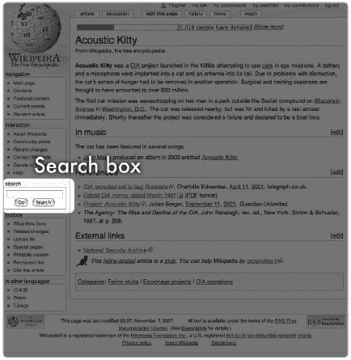
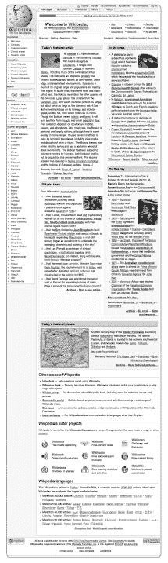
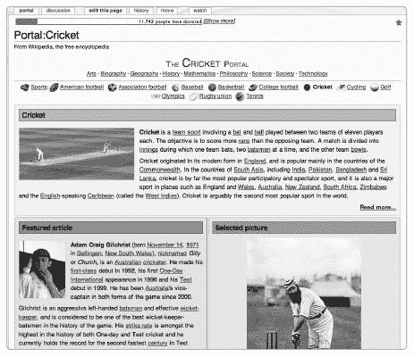
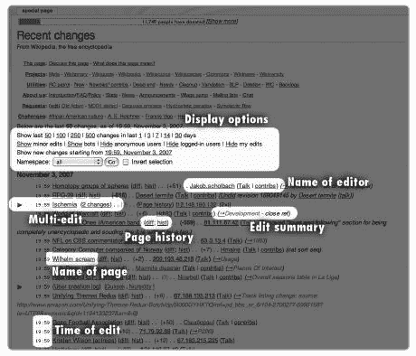
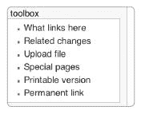
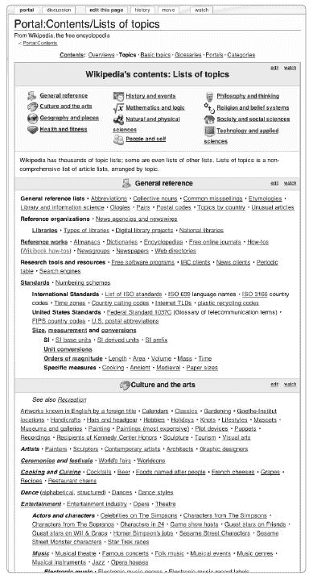

# 第三章.寻找维基百科的内容

考虑到维基百科的庞大，找到你确切想要的东西可能是一个挑战。幸运的是，搜索是一种强大的技术。本章将解释如何有效地搜索维基百科。

但搜索特定信息并不是使用维基百科的唯一方式。与印刷书的章节不同，维基百科的文章并没有任何特定的顺序；相反，它们可以根据主题和其他许多方式捆绑在一起。这种分组使得随意浏览维基百科变得非常有趣，并促进了偶然的发现：填补一个主题背景的理解通常是无痛的，一个主题可以以令人惊讶和愉快的方式引出另一个主题。

不论你是为了娱乐还是为了严肃的学习而阅读维基百科，掌握一些关键的研究和导航技巧将帮助你最大限度地利用你的时间。因此，本章还将描述为浏览而建立的（门户、类别和列表）关键结构，并解释一些基本的导航工具，包括网站左侧侧边栏上的链接。

如同往常一样，本章将向您展示如何查找这里仅简要介绍的主题的详细和最新解释。

# 搜索维基百科

如果你正在寻找一个特定的主题、名称或短语，直接在网站上搜索是开始的方式。维基百科的搜索功能就像查阅百科全书的索引卷，但没有那种乏味。在最好的情况下，你只需几秒钟就能回答一个查询。

当你在维基百科上搜索时，你正在利用一种强大的技术组合——百科全书的有机增长和能够即时筛选数亿文字的能力。

维基百科搜索引擎不仅搜索所有两百万篇文章的标题，还包括它们的全文。搜索引擎还包括替代文章标题（*重定向标题*）。（此外，我们还将解释如何搜索不是文章的维基百科页面。）搜索引擎基于当前数据库运行，因此它甚至可以找到最新的文章。

如果搜索没有找到任何结果，维基百科可能并没有让你失望。有时找到你想要的东西可能需要坚持不懈。你可以使你的搜索更加专注、广泛或强大。了解网站的结构和规范文章命名的惯例也将使你的搜索更有价值。

最后，搜索并不涵盖所有情况。例如，你可能怀疑自己使用了错误的拼写。你可能正在寻找一个你会在上下文中认识但记不起来的医学术语。或者你可能想知道与特定学术领域相关的主题。在这些情况下，你可以从浏览类别和门户开始，正如在 Browsing by Topic 中描述的那样。

## 基本搜索

搜索很简单：首先找到位于左侧边栏中间的搜索框（见图 3-1)，或者转到[[特殊:搜索]]。在搜索框中输入你的关键词，然后点击两个按钮之一：前往或搜索。

点击前往（或直接按回车键）会直接带你到标题与输入的词完全相同的文章。

如果没有文章标题包含搜索词，则会显示包含搜索词在标题或正文中的文章列表。在这里，你可以选择再次搜索，使用维基百科搜索引擎或外部搜索引擎。（你还会看到一个*红色链接*来创建一个与你搜索的标题完全相同的文章；我们将在第六章中讨论这一点。）



**图 3-1. 维基百科搜索框**

如果你点击搜索而不是前往，就会显示包含你的搜索词在标题或正文中的文章列表。文章按以下顺序列出：

1.  标题包含你的搜索词的文章

1.  全文包含你的搜索词的文章

重定向和消歧义页面也可能被列出；这些页面可以指引你到适当的文章。

前往按钮在你能够猜到你要找的文章标题时很有用。如果你不确定确切的标题或正在搜索不太常见的术语，搜索按钮可能是一个更好的选择。

有时“前往”搜索不会到达你期望的地方——尤其是当涉及重定向时！复数搜索词可能特别有问题，因为文章标题通常使用单数形式。例如，没有标题为“Beatle”的文章——如果你输入“Beatle”，你将被重定向到[[The Beatles]]。但搜索“Rolling Stone”不会带你到[[The Rolling Stones]]；它带你到[[Rolling Stone]]，这是一篇关于杂志的文章。[Trogg]与[[The Troggs]]无关，而是重定向到[[Sonic the Comic 中的角色列表]]。谁知道呢？如果你被重定向，一个通知将出现在文章标题下的括号中。如果你没有得到你期望的结果，全文搜索可能有助于你找到你想要的文章。（有时文章会很有帮助地指引你到具有类似名称但不相关的文章。）

### 改变搜索方式

如果你找不到关于某个主题的文章，但你确信它必须存在于维基百科中，请尝试使用不同的关键词进行全文搜索。例如，标题为[[美国国旗]]的文章也可以称为[[美国旗]]、[[美国的旗帜]]或任何类似的一打事物。你通常会重定向到正确的文章——但并不总是如此。重定向只会将你带到维基百科最受欢迎和最发达区域的相关文章，因此搜索同义词也很重要。

搜索关于人物的文章可能特别棘手。传记文章的标题应根据[[Wikipedia:Naming Conventions]]（命名惯例，快捷方式 WP:NAME）进行标准化（*名，姓*），但在实践中往往有所不同，尤其是如果名字包含首字母缩写。如果您正在寻找非虚构作家 John Karl Doe，请首先搜索*John Doe*，但也搜索*Doe, John*以及*J.K. Doe*，*J. Doe*和*Doe, J*。贡献者也会将他们自己的引用风格带到网站上，这可能会颠倒或缩短名字，或者可能会出现错误（如*Carl*代替*Karl*）。最终，您可能需要坚持不懈地找到[[John C. Doe]]这篇文章，也许是通过*Doe, JK*的重定向。对于不太常见的名字，仅搜索姓氏可能就能找到您想要的内容，并在最后节省大量时间。这种技术对于音译名字或具有多个历史拼写的名字尤其适用。

**强大变体搜索**

一个特别有组织的研究人员可以在文字处理程序中编制一个标题变体列表，然后将每个变体复制并粘贴到维基百科的搜索框中。如果您正在寻找关于 Willie "The Lion" Smith 的文章，您可能会搜索*Willie Smith, Willy "The Lion" Smith, Willie the lion Smith, W. Henry Smith, William Henry Joseph Bonaparte Bertholoff Smith*，以及您能想到的其他任何内容。您还可以将此列表用于外部搜索引擎。

### 搜索运算符

使用全文搜索，您可以通过将短语放在引号中来搜索完整的短语：

```
"in the nick of time"
```

将短语放在引号中仅返回包含*确切地*您输入的内容的结果：所有单词的顺序与您输入的顺序相同。另一方面，如果您不使用引号，搜索将找到包含——在某个地方——每个这些单词的每一篇文章。

您可以在短语搜索后添加额外的单词；例如，

```
"Benjamin Franklin" lightbulb
```

返回包含短语*Benjamin Franklin*和单词*lightbulb*的所有文章。

要排除搜索结果中的某个单词，请在该单词前加上一个减号；例如，

```
benjamin -franklin
```

返回包含*Benjamin*但不包含*Franklin*的所有文章。

当搜索长短语、带通配符的短语和包含布尔运算符（即使用*和*、*或*、*不*结合术语或短语）的短语时，请使用外部搜索引擎，如“外部搜索引擎”中所述。外部搜索引擎。

### 搜索其他命名空间

默认情况下，搜索功能仅搜索文章——这意味着它只搜索主命名空间中的页面。但您也可以搜索其他命名空间（即非文章维基百科内容）。以下是方法：

1.  对您的术语进行全文搜索。出现一个结果页面。

1.  在结果页面的最底部，一组复选框允许你指定要搜索的命名空间（例如，你可以搜索用户页面或讨论页面或两者都搜索）。你可以搜索任何命名空间的组合。勾选你想要搜索的页面类型，然后点击“搜索”按钮。

如果你经常搜索非文章命名空间，你可以通过更改用户偏好设置中的默认搜索选项来自动将它们包含在你的搜索中，在登录状态下位于右上角。

### 一些特殊搜索

维基百科的搜索功能还有其他用途。

**搜索图像或其他媒体**

与文本不同，搜索引擎无法解析图像。但它们可以用文本描述和其他元数据标记，这些数据本身可以搜索。

维基百科从维基媒体共享资源中获取了许多图像。在共享资源中搜索图像很容易，因为那里的图像被全面分类和用文本索引。 Commons 项目在第十六章中有所描述。

你还可以搜索维基百科的图像命名空间，尽管这个命名空间也包含（出人意料地）其他类型的媒体，如音频文件。参见上一节，“搜索其他命名空间”。再次强调，搜索图像命名空间实际上是在搜索图像附带的文本，而不是图像本身。

**搜索来自维基百科到外部网站的链接**

你可以找到包含在维基百科中的任何指向其他网站的“出站”链接。转到[[特殊:链接搜索]]并输入你想要搜索的 URL。（例如，键入*whitehouse.gov*会返回所有链接到白宫网站的维基百科文章。）

### 搜索问题和一些替代方案

维基百科的全文搜索有一些限制，包括以下内容：

**大小写敏感性**

维基百科文章的标题是区分大小写的；例如，标题为[[US]]的文章与标题为[[Us]]的文章不同。

这意味着如果你使用“Go”按钮进行搜索，除非你使用与文章标题完全相同的首字母大小写，否则你可能不会直接进入你输入的文章！（有关详细信息，请参阅[[Wikipedia:Naming conventions (capitalization)]], 快捷键 WP:CAPS。）

然而，如果“Go”按钮没有产生任何结果，搜索引擎将默认进行全文搜索，这种搜索不区分大小写，因此你仍然应该能够找到相关的文章。此外，在许多情况下，已经创建了重定向来解决这个问题。

**撇号**

包含撇号的单词（如名字*Mu'ammar*）只有在搜索中包含撇号时才能找到。（一个例外：以*'s*结尾的单词也可以通过搜索不带撇号且不带*'s*'的单词来找到。）

**特殊字符**

搜索包含特殊字符（如重音符号和变音符号）的单词可能会出现问题。在维基百科上，任何带有*变音符号*的字符（例如，*Odiliënberg*中的*ë*）可能存储为一个字符（在这种情况下，*ë*）或一个 HTML 实体（*&euml;*）。如果标题用 HTML 编码，它可能不会出现在简单的搜索中——例如，您可能很难搜索*Odilienberg*或*Odiliënberg*。如果出现这种情况，尝试搜索标题的一部分，例如仅搜索*Odili*。

如果这些问题看起来很令人畏惧，请记住，只要有点巧妙，您就可以使用谷歌等搜索引擎来替代维基百科的内置搜索引擎（见下一节）。外部搜索引擎不受内置搜索引擎问题的困扰。每次您的搜索结果为空时，请尝试使用外部搜索引擎进行搜索。

## 外部搜索引擎

您也可以使用普通搜索引擎（如谷歌）找到维基百科页面。

大多数搜索引擎允许您将搜索结果限制在特定网站的页面。如果您将结果限制在维基百科的页面，外部搜索引擎可以替代维基百科内置的搜索引擎。

要使用谷歌搜索维基百科，请输入

```
site:en.wikipedia.org "high and low"
```

输入谷歌的搜索框中。

这个搜索有两个部分。第一部分，[site:en.wikipedia.org](http://site:en.wikipedia.org)，告诉谷歌只搜索以[en.wikipedia.org](http://en.wikipedia.org)开头的页面，这意味着所有英语维基百科的页面。（使用[site:wikipedia.org](http://site:wikipedia.org)来搜索所有语言的维基百科。）第二部分——“高和低”——是一个普通的谷歌短语搜索。

现在点击搜索按钮。结果页面显示了包含短语*高和低*的每一篇维基百科文章，包括同名日本电影以及封建时代的高、中、低司法概念。

您不必使用谷歌；您可以使用任何能够将结果限制在维基百科页面上的搜索引擎。例如，上面的搜索短语在雅虎和谷歌中效果一样好。

维基百科也在搜索框旁边有一个下拉菜单，允许您选择除了*MediaWiki Search*之外的外部搜索引擎来使用。截至 2008 年中，可用的搜索引擎包括谷歌、雅虎、Windows Live、Wikiwix 和 Exalead。有关搜索的更多信息，请参阅[[Wikipedia:Searching]]（快捷键 WP:SEARCH），其中提到了许多其他可能性。例如，为搜索维基百科而设计的其他搜索引擎包括 LuMriX、WikiWax（不要与 Wikiwix 混淆）、Qwika 和 Wikiseek。LuMriX 和 WikiWax 在您输入时会建议文章标题，就像索引一样。Qwika 是一个通过使用机器翻译在跨语言中搜索维基百科的搜索引擎。Wikiseek 在维基百科文章中进行搜索，并将结果分组到广泛的类别中。

[[维基百科:搜索]]也描述了插件，这些插件允许你通过你的网络浏览器界面搜索维基百科。

### 何时使用外部搜索引擎

有几种情况，使用外部搜索引擎而不是站内搜索是个好主意：

+   当维基百科的服务器特别紧张时，站内搜索有时会被禁用。如果你在搜索被禁用时尝试使用搜索引擎，你将看到一个指向外部搜索引擎的链接列表。

+   你可能更喜欢使用熟悉的搜索界面。

+   外部搜索引擎通常在结果页面上为每篇文章提供简短的预览。

+   你可能需要执行一个复杂的搜索，这可能很难或无法使用维基百科内置的搜索引擎完成。

+   默认情况下，外部搜索引擎搜索所有维基百科命名空间，这使得找到相关的政策、类别或图片页面更容易。

**使用 Firefox 的搜索**

如果你使用 Firefox 网络浏览器，你可能知道你可以直接从 Firefox 右上角的搜索框中搜索谷歌。你也可以使用这个搜索框搜索维基百科。点击搜索框左侧的搜索引擎图标（默认情况下这是一个谷歌*G*图标）以获取一个可用的网站下拉列表，并选择维基百科的*W*。然后你可以直接从你的浏览器中搜索英语维基百科。（如果图标不存在，点击列表底部的“管理搜索引擎”，然后点击“获取更多搜索引擎”链接，在那里你可以按照指示添加新的搜索引擎。）

### 何时不使用外部搜索引擎

搜索引擎并非魔法。为了找出网站说了什么，它们会发送出称为*蜘蛛*的计算机程序，这些程序在互联网上四处爬行，解析网页内容，就像人一样（尽管当然要快上百万倍），然后将信息带回搜索引擎。

这意味着如果有一个网页是最近创建的，谷歌可能无法找到它。新的维基百科文章有时需要几天或几周才能出现在外部搜索引擎中，但维基百科的内置引擎可以在它们创建后几分钟内找到它们。

类似地，如果一个网页最近有所更改，谷歌可能会“记住”该网页的过时版本，而不是当前版本。例如，如果凯瑟琳大帝的去世刚刚被添加到维基百科的[[马桶相关伤害]]文章中，那么谷歌搜索可能找不到该页面。相反，如果[[油条]]文章中刚刚移除了单词*breakfast*，那么如果谷歌在*breakfast*被移除后尚未解析该文章，搜索*will*将会返回油条文章。但一旦你点击谷歌链接到该文章，单词*breakfast*将无处可寻。在这种情况下，你可能需要调查文章的历史记录，以发现你的搜索词被移除的情况。

**何时以及如何从谷歌搜索中排除维基百科**

就像你可以排除所有非维基百科的页面一样，你也可以排除所有来自维基百科的页面。只需添加

```
-site:http://en.wikipedia.org
```

添加到你的谷歌搜索中。（别忘了减号！）

例如，你可能想找到文章中提出的声明的来源。你可能想确保维基百科上的文本没有被从另一个网站剽窃。或者你可能已经熟悉了维基百科关于某个主题的所有内容，并想找到新的来源。

```
site:en.wikipedia.org "catherine the great" toilet
```

```
site:en.wikipedia.org salted fried chinese breakfast dough
```

**进一步阅读**

[`en.wikipedia.org/wiki/Special:Search`](http://en.wikipedia.org/wiki/Special:Search) 维基百科的搜索框

[`en.wikipedia.org/wiki/Wikipedia:Searching`](http://en.wikipedia.org/wiki/Wikipedia:Searching) 搜索概述

[`en.wikipedia.org/wiki/Wikipedia:Go_button`](http://en.wikipedia.org/wiki/Wikipedia:Go_button) 关于“前往”按钮

[`en.wikipedia.org/wiki/Wikipedia:Tools#Searching`](http://en.wikipedia.org/wiki/Wikipedia:Tools#Searching) 为使搜索更便捷而开发的工具和插件集合

[`en.wikipedia.org/wiki/Wikipedia:Naming_conventions`](http://en.wikipedia.org/wiki/Wikipedia:Naming_conventions) 文章命名规范的策略

# 进入维基百科的方式

在维基百科中漫无目的地漫游是强制性的、上瘾的，并且浪费时间。但这也是体验网站最愉快的方式之一。作为一名编辑，你不可避免地会在每个角落都发现一些可以添加或改进的地方。

但有目标的维基百科浏览也可以很有用和有趣。本节探讨了探索网站的一些更结构化的方法，从维基百科的前门开始。

## 欢迎来到主页面

主页面 ([`en.wikipedia.org/wiki/Main_page`](http://en.wikipedia.org/wiki/Main_page)) 是许多访问维基百科的访客看到的第一个页面，它作为进入维基百科众多社区的门径。它也每天更新新的内容。因此，主页面是一个开始一般性调查或开始浏览网站大部分区域的好地方。

### 注意

*如果你在[`wikipedia.org/`](http://wikipedia.org/)，这是一个通向维基百科所有不同语言版本的门户，你只需点击一下就可以到达英语维基百科的主页面。此外，如果你在英语维基百科的任何页面上，你只需点击左上角的维基百科标志或侧边栏中称为*主页面*的链接即可。*

### 导航主页面

主页内容密集，可能会让人感到不知所措(图 3-2)。在顶部，一个标题欢迎你来到维基百科，并提供了自动的文章计数——在撰写时为 2,428,969 篇。点击这个数字会显示更多关于维基百科的统计数据。标题的右侧，你可以找到通向广泛学术主题的链接，如历史和数学。（见“进入百科全书的大门”，下一节。）

在标题下方，你可以找到链接到简介信息。*概述*和*问题*将为你提供关于该网站的基本信息；*编辑*将带你到维基百科教程，这是一次很好的基本编辑技巧的实践。*帮助*链接到广泛的帮助页面（此链接与左侧侧边栏上的帮助链接相同）。

### 进入百科全书的大门

如果你有一个广泛的主题领域，注意右上角的链接组：

+   艺术

+   传记

+   地理

+   历史

+   数学

+   科学

+   社会

+   技术

+   所有门户



**图 3-2. 维基百科的主页，摄于 2007 年 9 月 12 日**

点击这些链接中的任何一个，你将来到一个门户。正如维基百科的首页是整个百科的入口，一个*门户*是特定主题的入口，提供精选的文章、相关链接以及找到对该特定主题感兴趣的编辑的方式。

### 备注

*这里列出的门户比这里的多得多。最后的链接，所有门户（或[[门户:门户列表]]），揭示了广泛主题范围的门户。[[分类:门户]]是探索门户的另一种更层次化的方式*。

门户是探索维基百科主题覆盖范围的可访问和用户友好的方式。门户也是一个*项目*，吸引着成群的维基编辑，他们帮助美化并维护该主题领域的文章，更不用说门户页面本身了。（门户中的文章是人工精选的，通常准确且有趣。）大多数门户都包含对该主题的介绍；精选的文章、传记和图片；以及链接到任何相关的 Wiki 项目和编辑合作。

### 备注

*门户起源于波兰语和德语维基百科。在 2005 年初，这个想法被引入到英语维基百科；同年稍晚，一个特殊的门户命名空间被创建。因此，门户页面被认为是组织页面，类似于主页，而不是独立的文章*。

一些门户主题很广泛，而另一些则非常具体。例如，有一个科学门户[[门户:科学]]，还有一个板球运动的门户[[门户:板球]](图 3-3)。



**图 3-3. 特色门户的示例：板球门户**

### 日常内容

在主页标题下方，您会发现五个每天更新的部分：今天的特色文章、新闻动态、你知道吗……、这一天……和今天的特色图片。每个部分都提供了维基百科上可用的广泛内容的品尝。

**今天的特色文章**

*特色文章* 是一个精选群体，代表了维基百科的一些最佳内容。为了被称为 *特色*，一篇文章必须通过一个严格的过程，这个过程只允许大约每千篇文章中有一篇。（见“特色文章”[特色文章）。）

每天都会在这里摘录一篇特色文章的一部分（通常是第一段）。要阅读文章的其余部分，请点击文章标题或摘录末尾的“更多”链接。

**新闻动态**

本节包含了一系列关于时事的文章。这些文章通常涉及国际关注的突发新闻故事。

关于当前事件的文章往往更新迅速（维基百科的新闻室是全球几千人在电脑显示器前）。请注意，然而，这些文章不应包含原创报道；为此，请访问维基新闻项目（见第十六章）。

**维基百科上的新闻在哪里？**

维基百科不会在“新闻”和“非新闻”文章之间划清界限。当前事件和新发展不断整合到现有文章中，或从较旧的文章中生成新的文章。关于重大当前事件的新文章与关于历史人物的文章处理方式没有不同。要在一个地方查看当前新闻，请访问[[门户：当前事件]]，那里的新闻故事被整理（附带适当的链接到百科全书）；当前事件门户右侧的侧边栏列出了关于突发事件和新闻人物的维基百科文章。

剩下的三项日常内容相对不那么庄重。

**这一天……**

本节包含了一系列值得注意的周年纪念。（对于发生在其他日期的事件，请点击“更多周年纪念……”链接。）

**你知道吗……**

本节突出了在过去五天内创建或大幅扩展的文章中的随机事实。（你知道吗……是在[[维基百科：你知道吗]]（Wikipedia:Did you know），快捷方式 WP:DYK，那里您可以提出从新文章中包含的事实。）

**今天的特色图片**

本节包含从维基百科最佳内容中精选的照片或图像。

### 构建主页

在某些方面，主页就像维基百科上的其他页面：深入探索，你会发现人们正在工作。和网站的其他部分一样，主页由一群热心的志愿者编辑维护，他们定期更新每个部分。

但即使与其他维基百科页面相比，主页也非常不寻常：

+   它接收着不断的流量洪流，平均每小时超过 10 万次点击。由于这个和其他原因，主页是少数几个不允许所有人编辑的页面之一（参见谁可以编辑什么？）。

+   每个每日内容部分都是独立于页面其他部分构建和更新的。然后主页使用模板将这些部分汇集在一起。（参见使用模板）。

+   因此，主页的页面历史记录不跟踪其每日变化，这与大多数维基页面不同（参见文章历史中的“文章历史”）。

+   大多数维基百科页面都标有最近编辑的日期和时间，但主页不是。

如果你想对主页提出建议，并了解更多关于其编辑和维护的信息，请参阅相应的讨论页面[[讨论:主页]]。主页的每个部分都从讨论页面链接，你可以在那里提出新的每日内容建议。

**时间旅行**

如果你曾经想过要向前推进时间，你总是可以提前查看明天的主页[[主页/明天]]。错过了一天或想回到过去？试试[[Wikipedia:Main Page alternative (yesterday)]]。

### 免责声明、许可和隐私

滚动主页，你会找到链接到其他有用部分的链接，包括链接到维基百科的帮助和社区区域以及姐妹项目。之后，你会找到链接到其他语言的维基百科；这些链接只是总数（现在超过 200 种）语言中的一小部分。

在页面的底部，即*页脚*，它在每个页面上都会重复出现，包含了一系列免责声明和版权信息链接。特别是通用免责声明值得阅读。它声明*维基百科不保证信息的有效性*——也就是说，该网站不承诺在任何方面都是正确的、事实的或真实的。仅将维基百科作为快速参考使用。请务必核实任何重要信息——尤其是法律或医疗建议，以及用于家庭作业的信息。通过接受免责声明，您接受对从维基百科获取的信息可能进行的任何使用承担责任。

虽然这个免责声明听起来很严重，但实际上并不罕见。许多通用百科全书都声明不承担任何责任；维基百科只是比大多数百科全书更强调这一点。使用常识是关键，如果您能接受其局限性：该网站是一个正在进行的工作，单个文章的质量可能会有所不同（关于评估单个文章的更多内容将在下一章中讨论）。

在页脚中，您还可以找到一个链接到 GNU 自由文档许可证，或 GFDL，这在第二章中有所描述；这个许可证是所有维基百科内容发布的许可证。理解 GFDL，或者至少其最基本的影响，对于贡献者来说很重要，因为您所贡献的任何内容（从校对到整篇文章）都将置于这个许可证之下。作为读者，您只需要知道，如果您以特定方式注明来源，就可以重新使用内容。Wikipedia:版权，也链接到页脚，将告诉您在 GFDL 下您保留的权利以及维基百科的版权状态。

隐私政策解释了您在维基百科上的隐私以及收集了哪些关于您的信息（通常是一个会话 cookie）。不会收集或出售贡献者的个人信息。然而，新来者经常误解两个关键点。首先，维基百科保留网站上所有交易的*永久*记录：每个评论和编辑都将永远保存。其次，如果您未登录就进行编辑，您将公开披露您的 IP 地址，其他人可能能够追踪它。未登录的编辑在“匿名”编辑的意义上只是您的名字没有被附上。为了更私密，您应该注册一个账户。由于维基百科的极大知名度，您不应该急于在网站上披露任何个人信息。在维基百科上使用您的真实姓名是可以的（本书的作者就是这样做的），但您应该了解其含义；利弊在第十一章中讨论。

最后，页脚包含一个链接到维基媒体基金会，这是维基百科的母组织。页脚通常还会显示一个日期和时间戳，告诉您正在查看的页面最后编辑的时间。

## 普遍存在的侧边栏

维基百科上的每一页都由三个不变的元素组成：

+   顶部文章标签（见第四章)

+   底部的网站信息

+   左侧边栏（见图 3-4)

**MediaWiki**

这些元素由运行维基百科的 MediaWiki 软件提供。您也会在其他网站上看到这些元素的版本，包括维基百科的姊妹项目和完全独立的维基。

这一节探讨了侧边栏。侧边栏为读者和编辑提供了一个方便的导航菜单，并提供其他必要工具和链接。

在英语维基百科上，侧边栏包含五个部分：导航、互动、搜索、工具箱和语言（尽管最后一个部分并不总是出现）。


**图 3-4. 左侧边栏包括五个链接到工具和各种导航页面的部分。**

### 导航

导航提供了四个链接到主要目录页面，以及一个链接到一个随机选择的文章：

**主页**

如预期的那样，这个链接指向主页。（您也可以点击上方稍高的维基百科标志来到达那里。）

**目录**

一本书的目录列出了其章节的打印顺序。维基百科没有特定的顺序，因此其内容页提供了多种不同的方式，通过主题导航维基百科。

**特色内容**

这一节展示了维基百科社区认为特别优秀的文章、图片和其他内容。

**当前事件**

这一节汇集了与当前新闻相关的文章。

**随机文章**

点击这个链接就像翻开一本书的任意一页。每次点击链接都会带您到一个不同、随机选择的维基百科文章。

随机浏览对任何人来说都可能很有趣。新读者可以了解维基百科的内容范围，编辑可以发现需要修复的忽视文章，尽管一些编辑更喜欢更系统的方法（参见第七章）。

### 互动

这一节中的链接帮助您了解更多关于维基百科的信息，或者作为编辑与网站互动：

**关于维基百科**

这个链接带您到一个项目的概述，旨在帮助新来者定位自己。关于维基百科还链接到其他常见问题解答和帮助页面。

**社区门户**

这个页面帮助维基百科的贡献者进行沟通、协作和交流。社区门户也是了解当前现场发生事件的绝佳地方。（参见第十二章。）

**最近更改**

这个页面显示了维基百科上实时进行的所有编辑。这个页面是下节详细介绍的要点。

**联系维基百科**

这可能是侧边栏中命名最不准确的一个链接。联系页面主要致力于常见的投诉及其解决方案，因为当然，没有中央权威负责每个维基百科文章。[[维基百科:问题]]（快捷键 WP:Q）指向其他可能找到答案的地方。对于大多数问题，最好是前往处理你感兴趣主题的 WikiProject 或社区论坛，以追踪处理你感兴趣问题的活跃编辑组（见第十二章了解如何找到社区讨论论坛）。

联系页面确实提供了一些用于媒体查询、法律问题和其他关注的电子邮件地址。这些地址连接到一个由选定数量志愿者组成的电子邮件系统（开源票务请求系统，或 OTRS）。每周都有数百个来自公众关于维基百科各方面的问题通过 OTRS。回复通常迅速且礼貌，但在志愿者有大量问题积压时可能会延迟。

**向维基百科捐款**

该页面提供了一个表格（以及一个呼吁），鼓励人们通过信用卡、支票或其他方式向运营维基百科的基金会捐款。（它还宣传维基百科主题商品和维基百科 DVD。）维基百科没有财力雄厚的赞助人；其资金大部分来自持续的小额私人捐款。如果你喜欢维基百科，考虑捐助以帮助其保持在线。

注意，捐赠页面并不位于维基百科网站上。要从那里返回维基百科，请使用浏览器的前进按钮。

**帮助**

帮助页面带您进入一个针对所有经验水平维基百科读者和编辑的全面索引。许多这些基本帮助页面都值得一读，以了解网站概览，如果你对如何做某事有具体问题，这些页面也是一个很好的开始地方。

注意主帮助页面顶部的链接。术语表和速查表为编辑提供了快速答案，而教程则是对编辑页面的一次友好介绍。当然，如果你从头到尾阅读这本书，你可能不需要阅读它！

### 最近更改

在侧边栏的交互部分中间，有一个链接到维基百科上最重要的页面之一。最近更改是一个持续更新的列表，列出了对维基百科所做的每一个编辑，从最近的开始（见图 3-5）。

这个编辑列表使用与单个文章编辑历史相同的格式（见第四章)：每个新的编辑占据一行。

探索最近更改页面可以让你对任何特定时刻维基百科上发生的事情有一个感觉。经验丰富的编辑者甚至可能对网站的整体氛围有所感知。但以这种方式使用最近更改页面有点像通过查看美国卫星照片来预测总统选举。每分钟都有数百次编辑发生，所以任何给定时刻查看此页面只能提供对维基百科更广泛运作的极小窗口。

然而，最近更改的*概念*是维基百科透明协作哲学的关键部分：任何人都可以看到对网站所做的任何更改。维基百科上的所有工作都是开放的；没有“隐藏的部分”。每次编辑都会显示在最近更改页面上，即使它在一秒钟内闪过。

实际上，最近更改页面主要用于检测一旦发生的破坏性编辑（如故意的不准确、大量文本删除和其他破坏行为）。一些编辑者作为志愿者安全员，使用自动化工具帮助他们更有效地筛选最近更改，以便找到并修复这些编辑（见第七章). 在页面顶部，主要更改列表上方，您会找到两组链接。第一组（项目、工具、关于我们、请求和挑战）是社区工具和帮助页面，本书中会单独讨论。



**图 3-5. 最近更改显示**

第二组设置——从*以下是最后 50 次更改*开始——控制着最近更改的显示方式。您可以更改列出的编辑数量，隐藏匿名贡献者所做的编辑，等等。默认情况下，会显示小编辑，但不会显示机器人自动进行的编辑。

您还可以监视新页面的创建；请参阅[[特殊:新页面]]。

### 搜索框

回到侧边栏，正中间您会找到搜索框。这就是您输入用于搜索英语维基百科的术语的地方。点击“前往”按钮以查找您输入的确切标题的文章；点击“搜索”按钮以搜索所有文章全文中的单词出现情况。请参阅“搜索维基百科”部分搜索维基百科。

**最近更改营**

这次会议是关于维基的。它的名字指的是几乎每个维基软件包都提供最近更改功能的事实。这是技术中最容易识别的部分之一。有关会议的更多信息，请参阅[`www.recentchangescamp.org/`](http://www.recentchangescamp.org/)。

### 工具箱

侧边栏的工具箱部分（参见图 3-6)包含几个实用工具，这些工具可以为您提供更多关于您正在查看的页面的信息，使您能够将页面放入更广泛的环境中，或者以其他格式查看页面。



**图 3-6. 侧边栏工具箱部分的特写**

### 注意

*这些针对特定文章的实用工具中包含两个不协调的链接——上传文件和特殊页面。我们将在本节末尾讨论这些链接*。

“链接到此”列出了所有链接到您正在查看的维基百科页面的页面。（例如，[[中央情报局]]和[[Acoustic Kitty (专辑)]]都链接到[[Acoustic Kitty]]。）如果您研究的是不太主流的领域，您会开始重视这个工具（参见第四章）。

相关更改列表列出了所有链接到您正在查看的页面的任何页面的最近编辑。使用此链接可以跟踪特定主题区域的活跃情况，或检查相关文章中是否发生了破坏行为。

打印版是您正在查看的页面的打印版；例如，一些维基百科格式被移除，外部 URL 被展开，侧边栏被移除，字体不同。如果您的网络浏览器是最近几年制作的，您永远不需要使用此链接：即使您在查看标准页面时点击打印，您的浏览器也会将此打印版发送到打印机。

由于维基百科文章的变化不可预测，链接到它们可能会出现问题；有人可能会点击您的链接，却发现文章版本与您看到的不同。（这个问题在高流量页面上尤其严重，这些页面可能每隔几分钟就会被编辑。）当您点击“永久链接”时，您将被带到文章当前显示的时间戳快照。此 URL 上的文本将永远不会改变，因此您可以放心地链接到它或引用它。（您还可以从页面历史记录中链接到文章的任何先前版本；每个页面的每个版本都有一个唯一的 ID 号码。）

“引用此页”为正在查看的文章提供了一个方便的、适当的参考文献（带有永久链接），可以轻松地将其剪切并粘贴到参考文献列表中。您可以使用各种参考文献风格生成参考文献，包括 MLA 风格、APA 风格、BibTex 等。

如果您正在查看用户页面而不是文章或项目页面，您将看到两个额外的链接：用户贡献和，如果编辑已启用电子邮件联系，则发送电子邮件给此用户。用户贡献将带您到该用户（或该 IP 地址）所做的所有编辑的列表。发送电子邮件给此用户将带您到一个表单，您可以在其中发送电子邮件给编辑，而无需透露其电子邮件地址。

最后两个链接用于更高级的使用。在图片可以在维基百科上显示之前，它们必须上传到该网站。上传文件将带您到一个表单，用于向维基百科添加图片和其他文件。（有关完整说明，请参阅第九章。）

最后，特殊页面链接可以访问特殊命名空间中的页面列表。与维基百科上大多数页面不同，这些页面是不可编辑的；相反，每次您访问它们时，它们都会自动生成。其中一些，如我的偏好设置和我的观察列表，是为您定制的，并且仅在您登录时有效。（然而，您可以通过更简单的方式找到这两个页面；如果您已登录，它们也位于页面右上角。）大多数特殊页面包含高级用户的工具，并将在此书的相关章节中按主题进行讨论。

### 语言

如果侧边栏存在最后一个部分，它将包含链接到您当前在其它语言维基百科中查看的文章版本。例如，当查看英文文章[[宇航员]]时，如果您点击语言部分中的西班牙语链接，您将转到西班牙语维基百科的[[Astronauta]]文章。（语言链接应按语言名称字母顺序排列。图 3-7）


**图 3-7. 主页的语言部分：每个链接都会带您到另一种语言维基百科的主页。**

由其他语言的使用者撰写的文章在重点和视角上通常有所不同。但即使您是单语者，浏览其他语言的文章也可以是寻找图片的好方法。

这些链接有时被称为*跨语言链接*（有关更详细的讨论，请参阅第十五章）。出现的语言链接取决于哪些维基百科包含有关该主题的文章。即使存在其他语言的匹配文章，编辑也必须首先将其添加为跨语言链接，它才会出现在语言列表中。

**进一步阅读**

浏览

[`en.wikipedia.org/wiki/Main_Page`](http://en.wikipedia.org/wiki/Main_Page) 维基百科的入口和主要门户

[`en.wikipedia.org/wiki/Portal:Current_events`](http://en.wikipedia.org/wiki/Portal:Current_events) 最新事件和新闻的当前事件门户

[`en.wikipedia.org/wiki/Portal:List_of_portals`](http://en.wikipedia.org/wiki/Portal:List_of_portals) 所有门户列表

了解更多

[`meta.wikimedia.org/wiki/List_of_Wikipedias`](http://meta.wikimedia.org/wiki/List_of_Wikipedias) 所有语言的维基百科完整列表

[`wikimediafoundation.org/wiki/Privacy_policy`](http://wikimediafoundation.org/wiki/Privacy_policy) 隐私政策

[`en.wikipedia.org/wiki/Wikipedia:General_disclaimer`](http://en.wikipedia.org/wiki/Wikipedia:General_disclaimer) 一般免责声明

侧边栏链接

[`en.wikipedia.org/wiki/Special:Recentchanges`](http://en.wikipedia.org/wiki/Special:Recentchanges) 最近更改

[`en.wikipedia.org/wiki/Special:Random`](http://en.wikipedia.org/wiki/Special:Random) 随机文章生成器

[`en.wikipedia.org/wiki/Wikipedia:Random`](http://en.wikipedia.org/wiki/Wikipedia:Random) 在另一个命名空间中找到随机文章

# 超文本的乐趣

本节探讨了维基百科页面以多种方式组合在一起。例如，页面可以以下列方式分组：

+   非正式地按主题

+   按日期

+   进入分层分类（*类别*）

+   通过格式（例如，您只能浏览高质量的特色文章）

+   您喜欢的方式！如果您从一个文章跟随链接到另一个文章，您就创建了自己的“文章组”——您自己的个人故事。

## 超文本入门

书面语言已经存在了数千年，但其格式已经多次改变。石雕既昂贵又耗时（而且绝对不便于携带），因此主要用于官方国家目的。中世纪的学者在珍贵的动物皮上写作，他们定期将其刮干净并覆盖上新文本。印刷机使书面文本变得容易负担得起且易于获取。

当今，写作以许多格式流传，每种格式都有其自己的做事方式。例如，报纸文章措辞紧凑以降低印刷成本，并且最重要的信息被放置在文章的开头，这样您就可以在任何地方方便地停止阅读。

如果您是成年人，书籍是第二本能。某些假设，例如小说的页面以特定的顺序出现或现存数百万份的《理智与情感》都包含基本相同的文本，已经根深蒂固，几乎不值得一提。

但维基百科违反了许多这些假设。它是一种新的媒介，具有自己的优势、劣势和惯例。

互联网——以及维基百科——最显著的特征是*链接*：带你去其他地方的文字，传统上带有下划线和蓝色。早期的信息理论家称链接为“超文本”，这个术语已经成为描述互联网与印刷文字不同的方式的统称。

在维基百科上，“超文本”是什么意思？

+   维基百科的文章可以按任何顺序阅读。

+   维基百科的文章不需要从头到尾阅读。在单个浏览会话中，你可以从十个相关文章中阅读十个不同的段落；实际上，这种浏览方式通常是*最佳*的信息收集方法。

+   维基百科的文章可以以多种方式分组，并且这些组可以重叠。

**超文本**

维基百科不是第一个超文本百科全书，但它的超文本拥抱是全面和根本的。如果一个维基百科文章没有被其他任何文章链接，它被称为*孤儿*，并被放置在特殊的清理类别中。

文章中的任何单词、名字或术语都可以链接到关于该概念的文章。作为读者，这种做法的实际效果是你可以随时从一个文章跳转到另一个文章。你不受作者对主题逻辑流程或任何特定文章中背景信息量的限制。如果你对某个概念不熟悉，你可以轻松地参考关于该概念的文章。

更普遍地说，超文本意味着维基百科上的*每一页都引用（链接到）其他页面*——当然，每一页也被其他页面链接。理解维基百科页面之间是如何链接的对于浏览维基百科至关重要。

由于有如此多的方式来探索相关主题，维基百科非常适合快速了解你不太了解的主题——甚至是你不知道自己不知道的领域。（搜索可能会引导你到一个特定的文章，但那个文章本身可以成为跳转到另一个主题的起点。）

## 三种类型的链接

维基百科上有三种类型的链接。

**内部链接**

这些链接从一个维基百科页面链接到另一个页面。点击链接将带你到被链接的维基百科页面。内部链接（也称为*维基链接*）是蓝色的。你会在文章和其他页面的文本中看到内部链接。

当你在编辑文章时，你可以通过将一个词用双括号包围来创建一个内部链接。（参见第五章）

+   带括号的数字 ([3])

+   普通单词或句子链接到外部网站

外部链接通常出现在文章的外部链接部分底部，但它们可以出现在文章文本的任何地方。

**使用标签浏览**

这种功能，由大多数当代浏览器提供，是严肃研究的好选择。在阅读文章时，通过在新标签页中打开内部链接，您可以为您遇到的每个不太熟悉的术语添加一个新标签页。在第一次浏览一些不熟悉的主题之后，您的标签页将构成一套详细的维基百科笔记。

## 按主题浏览

使用随机文章链接很有趣，但如果您有工作要做，您需要一种方法来查找特定文章（除非您的研究领域是在线百科全书的动态）。使用搜索是查找维基百科文章最知名的方法，但还有其他方法可以帮助您了解一个主题。例如，您可以

+   浏览文章列表

+   访问主题门户

+   导航分类

### 文章列表

大多数维基百科文章都有传统的段落结构，但有些文章的形式是列表。每个列表项通常都链接到其自己的文章。因此，每个列表都成为其主题领域的微型索引。

维基百科是通过协作一块一块拼凑起来的。它依赖于足够大胆的贡献者将新信息滑入看起来完整的文章。在这种情况下，列表对新作家来说特别受欢迎：在“这是一个项目列表”和“这个列表是由一群不同的人编写的”之后，下一个合乎逻辑的想法通常是“我可以在列表末尾添加另一项。”

因此，维基百科中充满了各种列表，索引了令人难以置信的大量主题。有些维护得很好，相当完整，有些则更加非正式和业余。有时它们定义了一个意想不到的主题，例如 [[关于或引用猫王的歌曲列表]]），或者提供了一个熟悉主题的新视角，例如 [[按地点分组的商业客机事故和事件列表]]）。较小的列表也存在于普通的段落风格文章中。



**图 3-8. 主题列表页面**

### 注意

*列表有助于维基百科扩展，因为它们鼓励创建红链——指向尚未编写的文章的链接*。

当然，列表可以分组。它们可以按时间顺序、按主题或按注释组织。许多列表可以通过主内容页面访问，该页面链接在全局侧边栏上。内容页面上的可用链接包括[[学科列表]]，它提供了一个按学科（如工程）提供的广泛概述文章的列表；这些文章反过来又链接到更详细的文章。[[概述列表]]具有类似的功能：它展示了一个主题领域（例如，哲学）中的许多文章，这些文章对该领域进行了概述。列表的最高级页面是主题列表页面，它是一个列表文章的目录。

**列表政策**

合理的独立列表应该受到政策的规范（参见[[Wikipedia:Lists]]，快捷键 WP:LIST），但维基百科的政策，就像网站上许多其他内容一样，很少是静态的。一般来说，新的列表不应该推进一个论点，并且“无聊”的列表是不被鼓励的，尽管过去存在许多（例如，一个估计智商的列表，包括贝多芬和麦当娜）。列表受到可验证性政策的约束：拥有一个[[天才列表]]的问题在于天才的验证。参见[无原创研究]和[[可验证性]]。

从列表中继续的一个有趣的方法是点击左侧边栏中的相关更改。相关更改是任何当前页面链接到的文章的最近更改列表，在列表文章的情况下，包括该列表中的所有条目。如果你在寻找在你感兴趣领域工作的编辑，这是快速联系的一种方式。

你确实需要过滤掉一些噪音：相关更改显示了从给定页面链接的所有页面的更改。如果你将其应用于[[冰川列表]]，你可能会发现[[冰川]]、[[内华达山脉]]或[[乞力马扎罗山]]的编辑，以及一些不太相关的文章，如[[阿根廷]]和[[2007]]的编辑。对于某些列表，相关更改不是一个实用的处理方式。

**我们最喜欢的列表**

+   [[百科全书列表]]

+   [[未解决问题列表]]

+   [[冰川列表]]

+   [[词汇表列表]]

+   [[化学时间线]]

+   [[包含 Q 但不跟 U 的英语单词列表]]

+   [[最古老持续居住城市列表]]

+   [[物质状态列表]]

+   [[漫画书超级力量列表]]

+   [[历史大象列表]]

+   [[树木列表]]

+   [[MacGyver 解决问题的列表]]

+   [[不寻常的单位列表]]

新的列表不断被创建。但一些现有的列表正在被淘汰，以支持*类别*（一个更严格、自动化的分类方案；参见概要中的“按类别浏览”）。

关于类别和列表的相对优点，一直存在很多争议。列表可以进行注释、回滚到旧版本，并穿插引用。另一方面，类别更自动化，因此与大量页面集合配合得更好。

### 传统分类方案

如果您感到怀旧，可以使用传统的图书馆排列方案浏览维基百科：*杜威十进制分类法*和*国会图书馆分类法*。这些方案可能看起来过时，但鉴于它们是为了组织广泛的人类知识（其次是为了排序书籍）而设计的，因此浏览起来可能很有趣。

请参阅[[国会图书馆分类法]]了解分类的最高级别。如果您点击其中 21 个链接文章之一，您将深入到下一级别的分类，其中主题与相应的文章相链接。[[分类:国会图书馆分类法]]也列出了按字母代码的分解。文章[[杜威十进制分类法列表]]给出了杜威分类的前三位数字，其中一些主题与那些文章相链接。

此外，您可以在[[维基百科:罗杰斯同义词词典概要]]找到*罗杰斯同义词词典*的概要，其中适当的文章通过维基链接。

### 日期相关文章

存在着大量与日期和时间相关的文章，它们列出了特定日期、年份甚至世纪期间的重大事件。

存在着总结以下内容的文章：

+   从公元前 1700 年到现在的每一个年份(参阅[[年份列表]])

+   从公元前 1690 年到公元 2090 年之间的每一个十年([[十年列表]])

+   从公元前 40 世纪到公元 31 世纪之间的每一个世纪([[世纪列表]])

+   从公元前 10 千年到公元 10 千年之间的每一个千年(再次参阅[[世纪列表]])

+   每一个地质分部、时代、时期和纪元(参阅[[时间周期列表]]了解这些和更多内容)

简单地在搜索框中输入年份或前往这些列表之一。

如您所预期的那样，这些文章的质量差异很大，通常以可预测的方式。[[侏罗纪]]、[[2004 年 12 月]]和[[1800 年代]]都很详细；[[公元前 1485 年]]则不是。一般来说，较不详细的文章是事实片段的散乱集合。如果您对年度文章不满意，可以提升到十年或世纪级别。

对于大多数现代年份，例如 1954 年，存在数十个专门的文章——例如，[[1954 年建筑]]或[[1954 年棒球]]。然而，*1954 年板球*是一个类别而不是文章，如果您想了解更多关于 1954 年的犯罪情况，您可以查看[[1954 年 FBI 十大通缉犯]]。总体[[分类:1954]]是进行深入研究的好起点，因为它将这些文章收集在一个地方，并且许多子类别会指引您正确的方向。

### 注意

*年份文章优先于可能具有数字标题的其他文章。例如，如果你访问名为[[137]]的文章，你会得到一篇关于公元 137 年发生的事件的文章。事实上，137 在物理学中是一个有趣的数字，但如果你想了解它，你应该去访问[[137 (number)]]*。

你还可以找到从 [[January 1]] 到 [[December 31]] 每个日期的文章。这些是纪念日列表，而不是特定年份的文章。它们传达了任何日期的重大事件、出生和死亡，例如 1 月 20 日——可能对寻找派对主题的大学生有所帮助。这些列表填充了主页上的“这一天……”部分。（标题惯例只是月份和日期数字，或 4 月 1 日；序数不需要后缀。）[[List of historical anniversaries]] 是一个方便排列的所有这些页面的列表。

### 注意

*如果你觉得用罗马数字计算 20 世纪日期太累，例如你可能会在旧的版权声明中找到的，将字母（例如，MCMLXVIII）复制到维基百科中，让重定向来承担压力*。

十年文章以熟悉的形式呈现：十年的第一年加上 *s*（例如，[[1660s]], 没有撇号）。同样，[[List of decades]] 是一个方便的列表，涵盖了从公元前 17 世纪到公元 21 世纪的范围。

世纪文章以 [[18th century]]（对于公元后的世纪，你可以省略 AD）或 [[2nd century BC]]（对于公元前世纪）的形式出现。许多学者使用的公历（BCE 和 CE）惯例也得到支持并在维基百科中使用，与 BC/AD 共存；（参考[[Common Era]] 了解背景）；使用此惯例的日期链接将重定向到适当的文章。（如果你真的很聪明，可以在维基百科中输入公元 0 年。试试看！）

这些按日期的文章不仅延伸到过去（有一个关于 [[40th century BC]] 的文章，在它之前维基百科只有关于千年的文章），还延伸到遥远的未来。这些未来年份的文章不仅记录了未来的纪念日和天文事件，还记录了在这些年份中应该发生过的虚构事件。（例如，在 [[25th century]] 文章中，我们被提醒巴克·罗杰斯生活在 2419 年左右。）

时间线为各种主题提供了详细的编年史。[[List of timelines]] 列出了涵盖数百个主题的时间线，为理解历史提供了详细的视角。如果还不够，[[Detailed logarithmic timeline]] 及其链接页面本身就可以称得上是一种教育。 

## 按类别浏览

找到文章的另一种方法是浏览类别。*类别*，就像列表一样，收集相关的文章。但尽管维基百科的软件以相同的方式对待列表和其他文章，它对待类别的方式却不同。为了将一篇文章放入一个类别，编辑不需要编辑类别的页面。相反，编辑会在文章本身添加一个专门的*标签*，MediaWiki 软件会自动将属于该类别的每篇文章*标记*填充到类别页面中。

除了链接和模板之外，类别有助于为维基百科提供结构。在每一个主题区域，都会创建并使用类别来将相关的页面分组在一起：例如，[[类别:美国小说家]]包含成千上万关于作者的文章，对于那些想要探索美国文学的人来说。在你已经有一定专长的领域，类别系统可能是你找到感兴趣内容的最佳选择。

文章所在的类别列表位于文章页面底部，位于文章文本下方的小阴影框中（图 3-9

**图 3-9. 文章底部的类别列表，显示了文章所在的类别：这些是[[爆炸鲸]]文章的类别。**

一页可以放入任意数量的类别中；实际上，大多数文章都包含多个类别。没有任何一个类别会排除其他类别，而且类别甚至可以嵌套在其他类别内部，这些类别本身也可以嵌套在其他类别内部！这形成了一个树状结构（或者如果你更喜欢，可以称为*分类学*）。例如，文章[[马耳他]]位于[[类别:马耳他]]，它本身位于[[类别:欧洲微型国家]]，这个类别又位于[[类别:微型国家]]，而[[类别:按特征划分的国家]]则包含了这个类别；然后它被归类在[[类别:国家]]这个广泛的类别下。浏览连续的子类别层是一种查找内容的有用方法：你可以通过任何你喜欢的方式到达一个高级类别，然后深入到一个更具体的区域。因为类别也是维基百科的一个命名空间，你可以通过搜索框直接访问一个类别，例如，[[类别:诗人]]。

类别可能既具体又广泛。有些只是很有趣：[[类别:玩具]]有子类别[[类别:玩具汽车和卡车]]和[[类别:悠悠球]]，而[[类别:泰迪熊]]是[[类别:虚构熊]]的一个子类别。

每个人都可以根据需要对页面进行分类，无论是将文章放入现有类别中，还是创建一个全新的类别（参见第九章）。与每种类型的内容一样，创建和放置类别的指南已经建立。例如，请参阅[[维基百科:命名规范（类别）]]（快捷键 WP:NCCAT）。

### 类别页面的结构

当您从文章底部的链接类别中点击一个类别名称时，您将被带到位于类别命名空间中的类别页面。这些页面分为四个主要部分(图 3-10)：

+   页面的上半部分描述了主题。本节是可编辑的，可能包含指向相关百科文章的维基链接。本节并不总是存在。

+   第二部分列出了该类别的直接子类别。例如，[[类别:美国犯罪小说作家]]是[[类别:美国小说家]]的一个子类别。本节仅在类别包含子类别时存在。

+   页面的第三部分显示了一个自动生成的、按字母顺序排列的维基链接列表，指向该类别中的文章。这个列表是类别页面的核心——它总是存在，通常是证明最有用的部分。一个类别可以包含任何数量的页面；有些包含数千个。在一个页面上显示如此多的链接是不切实际的；在维基百科上，类别页面一次只会显示 200 个链接，并按字母顺序排序。点击“下一页 200 个链接”以跳转到下一页链接。

    ### 注意

    *字母顺序并不总是明显：例如，关于人物的条目通常最好按姓氏字母顺序排序。然而，如果传记中未添加正确的排序标签，它将按常规字母顺序排序（即按页面标题中的第一个单词排序，这通常是人的名字）。有关排序的详细信息请参阅第九章*。

+   页面的最后一部分显示了*超类别*——这些类别属于该类别。这些类别出现在一个名为（有些令人困惑）*类别*的阴影框中，就像文章的类别一样。


**图 3-10。类别页面示例（虚构国家类别），显示可编辑部分**

**缺失的子类别**

200 个链接的限制在有些类别页面上创建了一些相当无用的效果。类别页面的主要部分显示了最多 200 个链接，从字母 A 开始；但子类别列表也是按字母顺序分页的。在下一个类别页面上，你通常会看到更多的子类别。

### 导航类别

类别形成了一种类似于维基百科的平行宇宙。如果你很幸运，一小群类别可能刚好覆盖了你正在寻找的文章。将子类别视为位于类别之下，你会欣赏到点击可以带你“向上”（到一个更全面的类别）和“向下”（到一个更专业的类别）。你可以移动到一个范围更广、更一般的类别，或者（相反）缩小范围。

因此，类别页面另一个重要的部分是页面所属的类别列表，换句话说，就是该类别作为子类别的*超类别*。这些是你在类别系统中的路径。

上下导航是一种非常方便的方式，可以从相关文章跳转到你真正想要的文章。例如，你可以从一个位于正确州但错误县的地方跳转到该州的地方类别，再到正确县的地方子类别，在那里你会找到你想要的文章标题。这次旅程就像进入并向上移动，然后向下并从类别系统中出来。大多数使用类别的浏览都需要在更全面的类别中向上导航（向上）和在子类别中向下导航（向下）的组合，以寻找最感兴趣的类别，然后在该类别中系统地搜索页面。

### 使用类别进行更长的旅程

关于海洋太阳鱼的文章（也称为*Mola mola*）可能被放置在 Molidae 类别中，因为这是鱼的学名家族（图 3-11，NOAA 提供)"))。查看 Molidae 类别的页面会显示这个家族中的其他物种（只要这些物种有正确分类的文章）。

，NOAA 提供）](tagoreillycom20090804nostarchimages315886.png.jpg)

**图 3-11. 海洋太阳鱼（Mola mola）或普通太阳鱼是世界上最大的硬骨鱼，平均体重为 1,000 公斤。该物种原产于全球的热带和温带水域。（图片来自[海洋太阳鱼](https://tagoreillycom20090804nostarchimages315886.png.jpg)，NOAA 提供）**

从这个分类开始导航，您可以向上、向下或向外链接到其中一个页面。[[分类：刺鱼目]]是[[分类：辐鳍鱼目]]的一个子分类。如果您对相关鱼类的生物学感兴趣，请点击该链接。一旦到达那里，您将看到各种刺鱼目（如河豚）的家族被列为子分类。这个分类系统遵循标准的科学分类。

您可以从鱼类文章最终到达[[分类：水]]。使用小于号（<）表示“点击到下一个分类”，以下是子分类的链式结构：

```
Ray-finned fish < Bony fish < Fish sorted by classification < Fish < Aquatic
organisms < Water
```

刺鱼目是[[分类：辐鳍鱼目]]超过 50 个子分类之一。从[[分类：水]]出发，

```
Water < Inorganic compounds < Chemical compounds < Chemical substances < Chemistry
```

要了解[[分类：化学]]的位置，请查看

```
Chemistry < Physical sciences < Scientific disciplines < Academic disciplines <
Academia
```

这就没有尽头了吗？实际上，继续点击分类：

```
Academia < Education < Society < Fundamental
```

最终您会来到这里：

```
Fundamental < Articles < Contents
```

[[分类：内容]]是所有分类的最高类别。

这种非严肃的探索提出了一个严肃的观点：维基百科不仅汇集知识，还对其进行分类。您可以在[[特殊：分类]]找到所有分类的详尽、难以管理的列表，或者尝试[[维基百科：分类索引]]按主题进行排列。

分类的高级别通常非常宽泛，以至于它们甚至作为起点也不太实用。但它们确实提供了一种从远处对内容进行排序的新方法，正如罗伯特·罗德在 2007 年 10 月的一些统计数据中所示.^([19]) 通过程序统计最广泛分类（及其子分类）中的文章，他能够估计维基百科本身的构成：28.0%科学，10.5%文化，16.0%地理，6.3%历史，0.8%宗教，5.5%哲学，1.8%数学，14.3%自然，6.0%技术，1.4%小说，9.6%传记。当然，这些分类是流动的和可协商的（例如，政治分类位于哲学分类内）。

**分类和内容政策**

分类应始终反映页面内容，并得到文章参考文献的支持，尤其是如果分类有争议时：在没有正当理由的情况下，不应将[[分类：谋杀者]]添加到传记中。分类不应用于表达观点或评论内容（有关分类指南的更多信息，请参阅第九章）。

## 按页面类型浏览

您也可以按文章类型而不是按主题进行浏览。

### 寻找优秀或糟糕的内容

也许您只想阅读维基百科中最好的内容。在这种情况下，请浏览[[门户：特色内容]]，其中包含所有类型的内容（包括文章、图像和门户），被认为是维基百科所能提供的最佳内容。

特色文章，可直接在[[Wikipedia:Featured articles]]（快捷方式 WP:FA）找到，这些文章已经过社区成员的审查、评估和投票。它们达到了高度的完整性、准确性和参考文献标准，代表了网站上一些最好的文章。尝试成为一名评论家，在[[Wikipedia:Featured article candidates]]（快捷方式 WP:FAC）中提出你的意见。*优秀文章*可能不如特色文章那么详尽，但仍然是高质量的文章；你可以在[[Wikipedia:Good articles]]（快捷方式 WP:GA）浏览这些文章的集合。

特色列表可以揭示一些奇特的维基百科内容。从一个随机选取的维基百科列表页（最多）可能只有一些导航价值，但如[[List of Oz books]]这样的特色列表将有一个很好的引言部分、图片以及更高的可信度。有关数百个特色列表的信息，请参阅[[Wikipedia:Featured lists]]（快捷方式 WP:FL）。

质量较差或需要关注的文章也收集在维护类别中，如[[Category:Cleanup by month]]。另一种快速找到有问题的文章的方法是搜索常见拼写错误的单词的错别字版本，以找到需要更正的错误和拼写错误，或者（可能更有趣）搜索可以替换为更精确措辞的陈词滥调，例如“重要的是要记住”。你可以在[[Wikipedia:Cleanup]]的项目页面上添加你发现的带有问题的文章，这也可以快速开始参与。关于查找质量较差的文章和系统化维护工作将在第七章中详细讨论。

### 查找图片

除了文本外，图片是维基百科中最常见和最重要的媒体类型。它们有助于使百科全书生动起来，展示地点和人、植物和动物、书籍封面和机械类型。它们说明了过程，并图解复杂的程序和系统。它们包括标志、商标、纹章设备和旗帜。你还可以找到大量的地图。

要找到维基百科上一些最好的图片，请访问特色图片列表[[Wikipedia:Featured pictures]]（快捷方式 WP:FP）。此页面上也有链接到维基媒体共享资源上的一个类别，用于特色桌面背景或适合用作电脑桌面壁纸的图片。你可以在这里找到一些美丽的图片。

要浏览其他图片，请访问维基媒体共享资源，那里的图片按类别组织。共享资源实际上被设计成一个媒体和图片库，所有维基媒体项目都可以使用并链接到它。因此，你可能会找到用非英语描述的图片。关于在共享资源中搜索的更多信息，请参阅第十六章。

### 查找媒体文件

在维基百科上找到的每个媒体文件都是为了说明百科文章，而不是独立存在。维基百科和维基媒体共享资源提供了这些文件的各种类型，从简短动画到声音录音。例如，在关于莫扎特的条目中，你会找到一些几十个音频文件的列表；这些是用于说明目的的他的作品的短片段。维基百科中的所有媒体文件都应该在 GFDL 许可下免费提供。

与图片一样，在维基媒体共享资源上找到媒体文件比在维基百科本身上要容易一些；在共享资源上，你会找到声音和视频的分类，进一步细分为动画、动物声音等。

同样，就像图片一样，每个文件都有一个描述页面。起初可能会感到困惑，这些页面都在 Image 命名空间内；维基百科并没有将不同的媒体文件类型分开到不同的命名空间中。

要播放媒体文件，你可以尝试使用维基百科的嵌入式媒体播放器，它将在你的网络浏览器中播放媒体文件。只需点击文件图标旁边的“在浏览器中播放”链接即可。或者，你也可以下载文件。然而，播放它可能会遇到一些障碍，因为你可能需要下载特殊的软件。维基百科上主要使用的声音文件格式是 Ogg Vorbis 音频格式，而视频文件使用 Ogg Theora 格式。这些格式与其他用于播放数字音频和视频的格式（如 MP3 和 MPEG）广泛相似，并且几乎可以在所有个人计算机上播放。然而，与 MP3、QuickTime 和许多其他常见格式不同的是，Ogg 格式是完全免费、开源且无专利的。Microsoft Windows 和 Mac OS X 计算机默认不支持 Ogg 格式，需要额外的软件来播放它们。如果你的计算机在点击这些文件时不会自动播放，你需要从互联网上下载并安装免费软件来播放它们。访问[`www.vorbis.com`](http://www.vorbis.com)以获取适用于常见系统的可下载播放器或编解码器的链接。

如果你已经有一个媒体播放器，比如 Windows Media Player 或 RealPlayer，或者 Mac 上的 iTunes，你可以首先下载*.ogg*编解码器——这些是小程序，用于解密格式——为这些播放器，这样它们就能播放维基百科的文件。对于 Linux/Unix 用户，许多最新的免费 Unix 系统能够播放 Vorbis 音频而无需任何新软件；然而，如果你没有安装任何音频软件，也有很多媒体播放器可供选择。[维基百科：媒体帮助（Ogg）](https://wiki.example.org/Media_help_(Ogg))列出了所有系统上可用的免费播放器以及下载其他音乐播放器的 Ogg 编解码器的指南。

音乐文件偶尔会使用 MIDI 格式（*.mid*或*.midi*扩展名）。MIDI 通常无需新软件即可播放。大多数计算机都有 MIDI 功能的播放器和声卡。

除了音乐文件，一小部分但数量正在增长的文章包含由志愿者用 *.ogg* Vorbis 格式录制的文章口语版本。有了合适的播放器，你可以在车里收听维基百科文章！前往 [[维基百科：口语文章]]、[[分类：口语文章]] 和 [[维基百科：WikiProject 口语维基百科]]（快捷键 WP:WSW）以查找这些文章。

**进一步阅读**

链接

[`zh.wikipedia.org/wiki/维基百科:孤儿条目`](http://zh.wikipedia.org/wiki/维基百科:孤儿条目) 孤儿条目的信息

[`zh.wikipedia.org/wiki/分类:孤儿条目`](http://zh.wikipedia.org/wiki/分类:孤儿条目) 孤儿和未链接文章的列表

[`zh.wikipedia.org/wiki/维基百科:构建网络`](http://zh.wikipedia.org/wiki/维基百科:构建网络) 关于内部链接和构建超文本的维基百科指南和哲学

[`zh.wikipedia.org/wiki/维基百科:仅链接与上下文相关的条目`](http://zh.wikipedia.org/wiki/维基百科:仅链接与上下文相关的条目) 只创建与上下文相关的链接；换句话说，在链接时使用判断

索引和其他浏览方式

[`zh.wikipedia.org/wiki/维基百科:快速索引`](http://zh.wikipedia.org/wiki/维基百科:快速索引) 所有维基百科文章的字母顺序自动生成的索引

[`zh.wikipedia.org/wiki/维基百科:学科列表`](http://zh.wikipedia.org/wiki/维基百科:学科列表) 包含文章链接的详细学科列表

[`zh.wikipedia.org/wiki/维基百科:概述`](http://zh.wikipedia.org/wiki/维基百科:概述) 许多领域的文章概述

[`zh.wikipedia.org/wiki/维基百科:主题列表`](http://zh.wikipedia.org/wiki/维基百科:主题列表) 按主题排列的各种列表

[`zh.wikipedia.org/wiki/维基百科:十进制分类法列表`](http://zh.wikipedia.org/wiki/维基百科:十进制分类法列表) 十进制分类法的列表

[`zh.wikipedia.org/wiki/维基百科:罗杰斯同义词词典概览`](http://zh.wikipedia.org/wiki/维基百科:罗杰斯同义词词典概览) 罗杰斯同义词词典的分类，带有链接

[`zh.wikipedia.org/wiki/维基百科:时间线列表`](http://zh.wikipedia.org/wiki/维基百科:时间线列表) 关于各种主题的时间线

[`zh.wikipedia.org/wiki/维基百科:历史事件列表`](http://zh.wikipedia.org/wiki/维基百科:历史事件列表) 历史上今天发生的事件列表

[`zh.wikipedia.org/wiki/维基百科:德威分类法列表`](http://zh.wikipedia.org/wiki/维基百科:德威分类法列表) 德威十进制分类法的列表

[`zh.wikipedia.org/wiki/维基百科:世纪列表`](http://zh.wikipedia.org/wiki/维基百科:世纪列表) 所有世纪文章的列表

按质量浏览

[`zh.wikipedia.org/wiki/维基百科:特色内容`](http://zh.wikipedia.org/wiki/维基百科:特色内容) 特色文章和更多内容的特色内容门户

按类别浏览

[`en.wikipedia.org/wiki/Help:Category`](http://en.wikipedia.org/wiki/Help:Category) 关于类别如何工作的信息

[`en.wikipedia.org/wiki/Wikipedia:Categorical_index`](http://en.wikipedia.org/wiki/Wikipedia:Categorical_index) 所有类别的主题索引

[`en.wikipedia.org/wiki/Wikipedia:Categorization`](http://en.wikipedia.org/wiki/Wikipedia:Categorization) 分类和类别使用的指南

查找图片和声音

[`en.wikipedia.org/wiki/Wikipedia:Featured_pictures`](http://en.wikipedia.org/wiki/Wikipedia:Featured_pictures) 维基百科的特色图片

[`commons.wikimedia.org/`](http://commons.wikimedia.org/) 维基媒体共享资源，你可以在这里找到免费图片、声音、动画和视频

[`commons.wikimedia.org/wiki/Category:Commons_featured_desktop_backgrounds`](http://commons.wikimedia.org/wiki/Category:Commons_featured_desktop_backgrounds) Commons 上适合电脑桌面背景的图片类别

[`en.wikipedia.org/wiki/Wikipedia:Media_help`](http://en.wikipedia.org/wiki/Wikipedia:Media_help) 播放媒体文件的帮助，包括各种播放器的下载说明

[`en.wikipedia.org/wiki/Wikipedia:Spoken_articles`](http://en.wikipedia.org/wiki/Wikipedia:Spoken_articles) 按主题列出的口语维基百科文章

[`en.wikipedia.org/wiki/Category:Spoken_articles`](http://en.wikipedia.org/wiki/Category:Spoken_articles) 按类别划分的口语文章

[`en.wikipedia.org/wiki/Wikipedia:Sound/list`](http://en.wikipedia.org/wiki/Wikipedia:Sound/list) 在维基百科或共享资源上可用的完整版权/公共领域音乐作品的列表

* * *

^([19]) 这些图表是从 2007 年 10 月发布在*WikiEN-l*邮件列表上的帖子中提取的：[`lists.wikimedia.org/pipermail/wikien-l/2007-October/083862.html`](http://lists.wikimedia.org/pipermail/wikien-l/2007-October/083862.html)

# 摘要

维基百科作为一个信息集合是令人惊叹的，但它的真正优势在于作为一个可查找信息的集合。搜索对于查找特定主题的文章很有用，但你可能需要使用各种名称进行搜索才能找到你想要的文章。你可以配置维基百科的搜索以在多个命名空间和其他选项中进行搜索；你也可以使用外部搜索引擎。访问左侧边栏上的搜索引擎，它还包括许多其他链接和工具。其中一些链接和工具在整个网站上是一致的，而其他一些则根据页面而变化。

维基百科还拥有复杂且完善的浏览结构，包括文章内的链接、编辑构建的门户、主页以及分类。这些结构都使用了超文本，其中一页通过链接引导到另一页，信息分布在相互引用的各个页面之间。分类，作为分类页面底部的链接出现，提供了一种强大的浏览相关页面的方式，包括按质量分类的页面（如特色文章）。分类建立了一个分类系统，更具体的领域成为更广泛领域的子分类。

在下一章中，我们将专注于单个文章，描述它们的特定部分。我们将涵盖你可以期待找到的内容，以及如何评估给定文章的质量。
