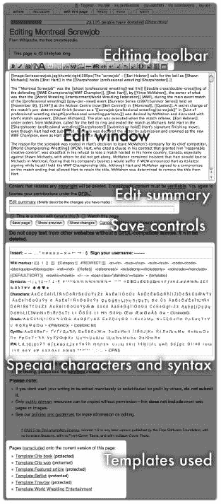
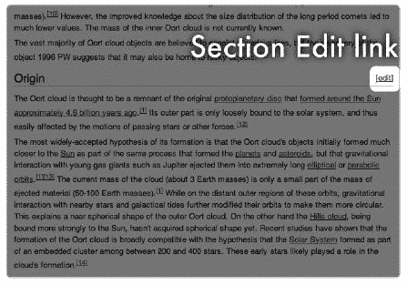
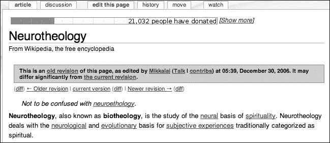
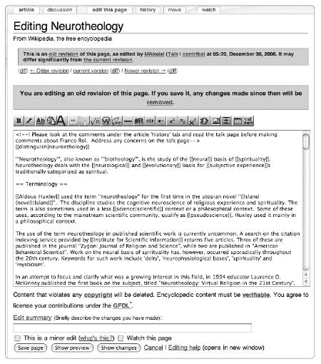
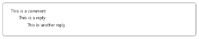
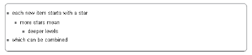
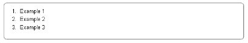

# 第五章 基本编辑

编辑维基页面是维基百科所有活动的核心，从撰写文章到参与社区讨论。在这里，维基百科不仅仅是一个参考工具。位于维基百科文章上方的“编辑此页”标签邀请每个人来贡献。

编辑维基页面并不困难。无论你对校对、研究写作、事实核查，还是修复破坏行为感兴趣，你都不应该有任何困难找到可以改进和扩展的文章。本章描述了编辑现有页面的基本机制——打开和理解编辑窗口，以及使用维基语法来格式化文本。我们还将讨论如何进行主要和次要的编辑，如何撤销编辑以纠正错误，以及页面是如何被保护的。本章中的信息是理解下一五章中描述的更高级编辑技术的基础。

# 编辑页面

“编辑”一词指的是对维基页面所做的单个更改：修改页面并保存页面的行为。编辑的范围从纠正一个错别字到从头开始重写一整篇文章；你可以通过一次编辑更改页面上任何数量的文本。换句话说，你有权限根据你的意愿修改任何文章。你如何使用这种编辑权限自然会反映在你身上。

通过编辑，你成为了一名维基百科编辑。你会在网站上找到各种各样的编辑，从那些只是尝试系统的人到那些实际上全职在维基百科工作的人。这种自由形式的编辑过程与其他出版形式中发现的编辑层形成对比。不过，你应该意识到，任何编辑都有一些期望：显然，维基百科不希望编辑破坏页面或项目。编辑社区有价值观和规范，这些价值观和规范深深植根于强大的传统之中，编辑也应该是优秀的同事。

要编辑一篇文章，只需在页面顶部选择“编辑此页”标签，通过在源文本框中输入更改来修改文本（这个框被称为“编辑窗口”），在提供的字段中添加编辑摘要，然后点击“保存页面”按钮来创建页面的新版本，这个新版本立即对所有人可见。编辑随后会在“最近更改”中记录，其他正在编辑文章的人可以立即看到。

当你点击“保存页面”时，不仅你的保存版本可以立即在线查看，而且它还会永久存储在页面历史记录中，与你的名字或 IP 地址相关联，并可通过“历史”标签查看。如果有人随后对该页面进行了额外的修订，新的修订将显示为新的“实时”文章，但你的版本将由维基百科保留，任何人都可以在任何时候通过查看页面历史记录来访问它。

**贡献者与编辑者**

在维基百科上，术语*贡献者*和*编辑者*通常可以互换使用。每位编辑都充当贡献者，反之亦然；术语*编辑者*可以大致等同于“使用“编辑此页”标签的人”。传统的出版角色，如作者、插图画家、编辑（进行实质性修改）、校对员（修正语法和风格）和校对员（修正错别字），可以由任何参与者担任。许多贡献者随着时间的推移成为专家，并选择主要在一个领域或网站上的结构化项目中工作。

编辑并保存后，页面会立即自动更新。（如果这没有发生，您很可能是在经历由服务器过载引起的文章缓存伪影。如果需要，通过在 Firefox、Internet Explorer 和大多数其他浏览器中按 CTRL-F5 来清除浏览器缓存。）

## 理解编辑窗口

选择“编辑此页”标签时出现的显示由几个部分组成（见图 5-1）。在顶部，一个编辑工具栏显示用于轻松添加常见语法和格式的按钮。编辑窗口紧随其后；此窗口为您提供您正在编辑的页面的*维基文本*或源文本的单个未分割视图。在这里，您可以更改文本、格式或两者都更改。维基文本使用特殊的标记语言（*维基语法*）进行格式化，该语言在本章的后半部分进行描述。

在编辑窗口下方，您会发现编辑摘要字段和三个按钮，允许您查看或保存您的更改。在页面底部，您会发现几个其他语法选项以及特殊字符菜单。当您编辑时，您会在编辑窗口中更改文章的文本。然而，首先您需要了解典型文章的结构。

### 阅读文章维基文本

在编辑窗口中花点时间定位自己。源文本的第一句话是什么？它们可能不是文章的实际第一句话，这有时会让新编辑感到困惑。相反，您可能会在文章本身之前看到一些格式化语法。

要理解您所看到的内容，请考虑典型文章的不同层次，如第四章中所述。实际文章内容通常位于两层维基文本之间。在源文本的开始处，但在实际文章的第一句话之前，您可能会看到一些结构化信息：清理模板、帽子注释、图像链接或以表格形式呈现数据的方框信息。在滚动过这些信息以及文章文本之后，您会在页面底部找到另一层维基文本；这些信息包括类别、存根模板以及可能还有互链链接。您可以暂时忽略这一层。

维基格式的第一层可能会让人感到最困惑。但你可以直接滚动到文章的开始处和你要进行更改的地方。换句话说，在基本编辑中，你可以简单地忽略格式，改进内容。

自然地，并非所有文章都包含这些元素；许多文章只包含底层维基文本，而没有顶层文本。如果你对某个语法或格式有疑问，你总是可以比较源文本与*渲染页面*（即，文章在“文章”标签页上显示的样子）。你可能发现，在两个不同的浏览器标签或窗口中打开你想要编辑的文章副本很有帮助；使用一个窗口进行编辑，另一个窗口作为你编辑前文章外观的提醒。



**图 5-1. 编辑窗口视图**

### 使用编辑窗口工具

在编辑窗口上方是*编辑工具栏*——一组提供各种维基语法的按钮（图 5-2). 将你的光标悬停在每个按钮上，以了解它的功能。像文字处理器的选项菜单一样，这些按钮可以非常有助于节省时间，如果你记不起特定维基语法的确切格式，它们也非常有用。要使用这些按钮，将光标放在你想要语法出现的位置的编辑窗口中。然后点击相应的按钮，语法就会出现在页面上。（在接下来的几章中，将逐个描述每条语法。）


**图 5-2. 编辑工具栏**

在编辑窗口下方，你会看到一个关于 GFDL 和编辑摘要字段的警告。这是为了总结你的更改，以便其他正在编辑该页面的编辑人员受益。尽管这不是强制性的，但在任何编辑后添加简短摘要都是良好的礼仪。只需键入你更改的简要描述。我们在第四章中描述了编辑摘要；参见附录 C 中的一些常见术语，以及第六章中关于如何使用编辑摘要与其他编辑人员进行沟通的更多信息。

接下来是三个按钮：保存页面、显示预览和显示更改：

+   保存页面会保存你的工作并立即发布页面的新版本。

+   显示预览允许你在保存更改之前预览页面。你还可以点击显示预览来尝试和测试更改的效果，当你不确定要使用确切的语法时——但请注意不要意外保存！一旦你编辑了一个页面，我们强烈建议在保存之前预览你的编辑，特别是如果你是维基标记的新手，或者在做一些使用复杂语法的陌生操作时。

+   显示更改将显示你的未保存版本和当前版本之间的源代码差异，这在无法确切知道你的更改将如何影响页面，或者无法记住你做了哪些更改时非常有用！

如果你决定不进行任何操作，而不是保存页面，请点击浏览器的前进按钮，或者点击显示更改按钮旁边的取消链接。页面或版本历史将不会进行任何更改。

如果你需要编辑帮助，你会在编辑摘要字段下方找到一个链接。点击编辑帮助链接将在另一个窗口中打开帮助文档；在你熟悉如何标记页面之前，请将帮助文档保留在单独的浏览器窗口或标签页中。在编辑摘要字段上方和下方，你会找到一些关于可验证性、GFDL 和侵犯版权的简要但重要的信息——如果你已经阅读了本书的第一部分，这些信息应该是熟悉的。

在按钮下方，你还会看到许多维基标记和特殊符号。这种显示是为了方便访问常见的或复杂的语法和字符。要将这些字符之一添加到你的文本中，例如带重音的字母，请将光标放在编辑窗口中的适当位置。然后点击你想要添加的字符，它就会出现在文本中。

在此下方和 GFDL 的最后一项说明下方，你会找到一个列表，列出了你在编辑的页面（如果有的话）上使用（或*包含*）的模板。要单独查看这些模板之一，只需点击模板名称即可转到模板页面。

如果你喜欢键盘快捷键，你可以使用它们来导航维基百科的各个部分以及编辑页面。例如，在 Internet Explorer 中按 ALT-S-ENTER 将保存页面（或在 Mozilla Firefox 中按 ALT-SHIFT-S），而按 ALT-V-ENTER（或 ALT-SHIFT-V）相当于点击显示更改按钮。更多快捷键的描述可以在[[Wikipedia:Keyboard shortcuts]]中找到；快捷键取决于你的浏览器和你选择的皮肤。

**自定义编辑窗口**

默认情况下，编辑窗口显示 25 行文本，每行 80 个字符宽。如果您有一个大屏幕，将编辑窗口设置得更宽更长可能会有所帮助；如果您正在使用较小的设备进行编辑，您可能希望使窗口更小。如果您已登录，可以在用户偏好设置中更改编辑窗口设置。点击页面右上角的“我的偏好设置”链接，选择“编辑”选项卡，并在“编辑框尺寸”中输入新的行数和列数。您还可以在此设置其他编辑选项；例如，您可以选择通过双击页面来打开编辑窗口，如果您是一个快速编辑者，这可以节省时间。

在编辑非常长的文档时，很容易失去原文的位置，因此一次只编辑一篇文章的一个部分。要仅编辑文章中的一个部分，请点击出现在文章任何章节标题右侧的编辑链接（图 5-3）。编辑窗口中只显示您正在工作的章节的维基文本。



**图 5-3. 章节标题带编辑链接**

**沙盒**

为了获得编辑经验，请访问[[维基百科：沙盒]]。正如其名所示，沙盒是一个用于在不更改真实文章的情况下进行试验的专用页面。如果您想测试您的维基标记并且不确定保存后看起来会怎样，沙盒也是一个不错的选择。沙盒会定期清理，因此您不需要担心您的测试会持续存在。（正因为如此，沙盒不是一个开始您希望保留的工作的好地方；有关如何设置您自己的个人沙盒，请参阅起草文章。）

## 主要编辑与次要编辑

*次要编辑*是编辑者认为不需要其他编辑者审查的编辑。典型的次要编辑包括拼写或语法修正、添加单个内部链接、修正标点符号或进行小的格式或呈现更改。尽管大多数次要编辑只更改少量文本，但并非所有小编辑都是次要的。例如，将文章中的一个日期从 1776 年更改为 1667 年，虽然改动很小，但不是次要编辑。次要编辑不应实质上改变文章的意义，也不应成为辩论的主题。

已注册并登录的用户在保存页面时，可以通过勾选“这是一个次要编辑”复选框来将编辑标记为次要。这样的编辑将在页面历史中用粗体小写*m*标记。次要编辑的目的是允许其他人从编辑列表（如个人关注列表和最近更改）中过滤出简单的拼写或格式修正。如果您的关注列表中出现次要编辑，您通常不需要麻烦去检查它。

小编辑应有一个编辑摘要，就像任何其他更改一样。一般来说，如果更改需要长的编辑摘要，则编辑不是小的。随着经验的积累，你会对其他人认为的小编辑有一个感觉。在小的编辑描述下进行重大削减或插入可能引起争议的内容被认为是恶劣的（就像完整的编辑摘要比过于简略的好），因此在不将编辑称为小编辑时，要谨慎行事。如果你对编辑是否属于小编辑有疑问，不要勾选该框。登录用户可以在用户偏好设置编辑标签页上选择默认标记所有编辑为小编辑，但我们建议不要这样做：迟早这可能会因为错误地标记重大编辑而给你带来麻烦。

**重大编辑**包括所有其他编辑。任何影响文章意义的更改都是重大的（不是小的），即使编辑只是一个单词。可以这样想：重大编辑是对所有相关编辑的一个标志，表明这些修改应该被检查。

## 处理重大编辑任务

维基百科的编辑人员被鼓励**大胆行动**：[[维基百科:大胆行动]]是一条编辑指南，也是网站上最古老的口号之一。有时文章写得不好，零散的修改是不够的——需要彻底的变革。在这种情况下，大胆行动是当务之急。然而，编辑人员可以并且应该采取措施，确保他们能够顺利且可接受地完成真正重大的编辑工作。

我们强烈建议将大型编辑工作分解成小阶段。这不同于狂热地保存；你不应该每隔几秒就保存一次，除非你的互联网连接真的很差。每隔几分钟保存一次工作是比较合理的，因为长时间不保存编辑窗口可能会导致会话错误信息。在做出重大更改时，将维基文本复制到文字处理文档作为备份也可以防止保存错误。

在实施重大编辑之前，你应该首先在文章讨论页面上认真考虑讨论拟议的更改，提出问题“有人介意吗？”等待一段时间（至少几天）以获取任何回应。在编辑时，将大编辑分成一系列较小的编辑，并解释清楚。理想情况下，所有重大的重写都应分步骤进行，每一步都清晰明了。其他在该网站上工作的人随后能够指出，例如，他们不喜欢或不理解你所做的更具体的地方。

**编辑冲突**

当两个编辑同时尝试编辑和保存同一页面时，可能会意外地发生编辑冲突。如果发生这种情况，你将在页面顶部收到编辑冲突通知，并且无法保存你的更改。不要慌张！首先，将你的更改文本复制到一个文字处理文档中，以免丢失。要查看包含你的更改的 wikisource，你必须滚动到页面下方的两个窗口中的较低一个（上方的窗口包含另一个编辑的冲突文本）。然后你可以通过点击浏览器中的后退按钮取消编辑。接下来，刷新页面并查看上一个版本的最后差异，以查看发生了什么变化。重新编辑页面，整合你的更改和前一个编辑的工作；不要简单地粘贴你的版本在顶部。编辑冲突仅在流量大的页面上才会发生。但是，警告你，如果你两次保存页面，可能认为第一次“保存页面”点击没有工作，你可能会与自己发生冲突！注意，编辑冲突与两个编辑无法就更改达成一致的*编辑战*不同。

我们还建议在较长的文章中逐节工作。如果一篇混乱或未结构化的文章中没有章节，或者需要添加新章节，首先添加这个章节结构。你可以通过将材料分类到章节中，然后逐个编辑每个章节并添加参考文献来跟随这个编辑。

一旦你完成了编辑过程，写一个总体、最终的编辑总结来记录这些更改。包括一个最终总结是良好的礼仪，并将有助于确保特别重大的编辑能够得到其他正在编辑该文章的编辑的良好接受。即使他们不同意，他们也会看到你正在努力与他人合作，目标是就文章达成共识。将任何更长的评论放在讨论页面上。有关构建文章和进行重大更改的更多建议，请参阅第六章。

**工作正在进行中**

系统的方法可能意味着需要在一个较长的时期内对文章进行工作。如果你更喜欢这种方式来编辑，请在页面顶部输入`{{inuse}}`，这将创建一个模板消息，表明文章正在*建设中*。只是别忘了完成编辑后将其删除！你还可以在讨论页面上留下一个备注，详细说明你的编辑计划。其他编辑会耐心地让你完成编辑。

## 修复错误和其他恢复原因

如果你意外地保存了一个包含错误的页面版本，或者你的编辑没有按照预期的方式工作，不要担心！因为每个文章的所有版本都被保存了，你可以随时*恢复*页面到之前的版本。仅通过编辑，你永远不可能犯下无法修复的错误。任何页面都可以恢复到任何旧版本，包括第一个版本——最初的发布。然而，标准的良好做法是在必要时仅恢复到*最新良好版本*：在不良更改之前页面的版本。

要恢复文章，从编辑历史中选择一个旧版本，然后按照以下说明恢复那个较旧的已保存版本。

**浏览旧版本**

你可能会发现使用单选按钮和比较页面历史记录中的版本功能来找出你想要恢复的确切版本很有帮助。继续比较页面旧版本和当前版本，直到找到你想要的版本。在页面历史记录显示中，最新的版本始终在最上面。在查看差异时，右侧是较新的版本。有关在页面撤销破坏和编辑摘要和微小编辑页面上的页面历史记录排序的提示。

一旦你找到了想要设置为当前版本的页面版本，请选择它：从页面历史记录中，点击链接的日期和时间来查看该版本的页面。如果你正在比较两个版本，请点击你想要编辑的版本的“修订版本为（日期和时间）”标题。你应该会得到一个警告信息，提示你正在查看文章的旧修订版本（见图 5-4)。

接下来，选择文章顶部的“编辑此页面”标签。旧版本的文本将在编辑窗口中显示。你现在会看到一个警告信息，提示你正在编辑旧版本（见图 5-5)。你将忽略这些警告。

要将页面恢复到旧版本，你不需要对文本进行任何更改——你只需重新保存页面。在你检索到你想要恢复的版本文本后，向下滚动，添加一个适当的编辑摘要（“恢复原因……”）然后点击保存页面，无需进行其他任何更改。你刚才查看的版本将变成最新的版本，任务完成！



**图 5-4. 当查看页面旧版本时，会显示一条警告信息。**



**图 5-5. 当编辑页面旧版本时，会显示一条警告信息。**

### 注意

*使用预览功能！在保存更改之前按下显示预览按钮，可以避免大多数自我恢复和编辑错误*。

撤销到以前的版本也是撤销大多数破坏行为的方式。如果你看到一篇被破坏的文章，转到编辑历史记录，找到最后一个好的版本，这通常只是次最新版本，然后将其撤销回该版本。注意不要通过这种方式丢失任何“好的”信息或更改。将几个较早的版本与你的最新保存版本进行比较，以确保所有破坏行为都被移除，所有好的内容都被保留。有时破坏行为可能跨越两个或三个编辑，通常是由同一编辑进行的。务必添加适当的编辑摘要；“rvv 破坏”很常见。

如果你已登录，你可以以类似的方式撤销大多数编辑。转到页面历史记录，比较两个版本。你正在查看的两个页面中最新的版本将在右侧的编辑链接旁边显示一个撤销链接。点击撤销链接将自动用该版本替换插入的文本（或替换已删除的文本）。点击保存页面按钮以完成撤销编辑。

撤销链接在移除明显的破坏行为或修复最新修订中的错误时最有用。在使用此链接进行其他操作时要谨慎；尽管任何更改都可以撤销，但在页面历史记录的中间版本中来回切换时，犯错并无意中撤销好的更改是很容易发生的。

**过度使用撤销**

从统计学的角度来看，现在高达 20%的维基百科编辑都被撤销了。这很大程度上是由于热门文章的破坏行为。然而，撤销不应被用来试图赢得争论或将自己的观点强加到文章上。为了强调这一点，已经创建了一个官方的“三次撤销规则（3RR）”，这意味着任何一个人在 24 小时内对同一篇文章进行三次撤销（除破坏控制外）已经足够了。在实践中，持有不同意见的编辑应该讨论问题，并在讨论页面上达成共识，而不是在文章中相互撤销更改。一个好的经验法则是，在转到讨论页面上并就你的版本提出合理的论据之前，只撤销一次。参见[[Wikipedia:Three-revert rule]]（快捷键 WP:3RR）。试图规避 3RR 会受到严厉的批评，并且用户可能会因为过度撤销同一篇文章而被封禁。这项政策在很大程度上防止了*编辑战*，即两个或更多编辑在一段时间内不断插入和删除相同内容的争议。

## 谁可以编辑什么？

大多数维基百科页面都可以由任何人编辑，无论他们是否使用账户登录。少数例外情况是不允许编辑的页面，包括一些系统生成的页面和几个永久受限的关键页面，例如网站的一般免责声明[[Wikipedia:General disclaimer]]和主页。

除了这些，在任何给定时间，一小部分其他页面都会因为行政措施称为“保护”而关闭编辑。这通常是一种临时措施，通常是由页面上的破坏性编辑激增所引发的。保护有两种形式：完全保护和半保护。受保护的页面应该在页面顶部使用灰色条模板消息清楚地标识。如果你发现你无法编辑常规文章，那么页面可能已经被保护；而不是“编辑此页”标签，你会看到一个“查看源代码”标签。

一个**完全受保护**的页面只能由网站管理员编辑，并且实际上会在一段时间内停止流通。这种临时保护在当今几乎总是对文章内容进行无法解决的编辑战的一种反应，而且相当罕见。例如，[[伯特·雷诺兹]]在关于演员出生地的严重争议后受到了保护。以下是两个编辑在讨论页面上争议的样本：

> 如 JSDA 上面所提到的，兰辛，密歇根现在在他的“官方网站”上被列为他的出生地。你如何解释这一点？？？你打算继续炒作吗？而且正如我之前提到的，他声称自己来自南方是可以的，但这不是事实。再次提供网站链接。[伯特·雷诺兹](http://Reynolds.com) Lugnut215 00:47，2007 年 7 月 6 日（UTC）
> 
> 很明显，制作这个页面的人只是在重复网上找到的事实，而没有进行事实核查。因为这里还有一个“谎言”出现在个人常见问题解答中...总之，在他的电视采访中，当被问及他的出生地时，他说的是乔治亚州的韦克斯。他在大约 10 次不同的采访中都这么说过，而且没有一次电视采访中他说过密歇根州。Rogue Gremlin 03:33，2007 年 7 月 7 日（UTC）

只有那些证明非常具有争议性的论点，在两个人或更多人之间发生大量编辑战，才会导致保护。保护允许通过讨论和事实核查来解决内容争议，而不是来回更改文章本身。

另一方面，**半保护**的页面可以被绝大多数已登录用户编辑。未登录用户（从 IP 地址编辑的匿名编辑）或账户在最近四天内创建的编辑不能编辑。半保护现在对于新闻头条中的主题页面非常常见，例如，那些成为短暂媒体风暴中心的名人。这些文章会吸引不良编辑，而半保护可以过滤掉大部分破坏性编辑。

在这些情况下，当媒体对该主题的吸引力减弱时，通常会移除保护。一些其他页面在高度可见或容易受到持续破坏时是半保护的，并且这些页面可能需要更长时间的保护；例如，关于当前美国总统的文章就经常受到破坏。其他文章也可能受到半保护，因为它们经常被学生破坏（一些关于小学和中学的文章尤其容易受到攻击）。一些非常可见的页面组件，如高使用模板，也被保护以防止破坏；有时这会通过称为 *级联保护* 的机制自动完成，其中构成完全受保护页面的组件，如主页，也被保护。

因此，半保护妥协了纯粹维基原则中的 *任何人都可以编辑任何内容*，但保护基本上是由于维基百科本身的突出地位而必要的。管理员负责保护页面并审查页面的保护状态。您可以在 [[Wikipedia:Protection policy]]（快捷键 WP:PROT）中了解更多信息。[[Wikipedia:List of indefinitely protected pages]]（快捷键 WP:PERMPROT）列出了长期受保护的页面。您可以在文章的讨论页面上讨论任何半保护案例，该页面不会被保护。如果您觉得某篇文章需要半保护——例如，如果它每天吸引几十起破坏事件——请在 [[Wikipedia:Requests for page protection]]（快捷键 WP:RFPP）中添加注释，管理员将查看并决定如何处理。

**进一步阅读**

[`en.wikipedia.org/wiki/Wikipedia:How_to_edit_a_page`](http://en.wikipedia.org/wiki/Wikipedia:How_to_edit_a_page) 基本语法和编辑页面的说明摘要

[`en.wikipedia.org/wiki/Wikipedia:Keyboard_shortcuts`](http://en.wikipedia.org/wiki/Wikipedia:Keyboard_shortcuts) 编辑维基百科的键盘快捷键

[`en.wikipedia.org/wiki/Help:Minor_edit`](http://en.wikipedia.org/wiki/Help:Minor_edit) 关于小编辑的信息

[`en.wikipedia.org/wiki/Wikipedia:Be_bold`](http://en.wikipedia.org/wiki/Wikipedia:Be_bold) 更新页面的“大胆行事”指南

[`en.wikipedia.org/wiki/Wikipedia:Protection_policy`](http://en.wikipedia.org/wiki/Wikipedia:Protection_policy) 保护政策

[`en.wikipedia.org/wiki/Wikipedia:Sandbox`](http://en.wikipedia.org/wiki/Wikipedia:Sandbox) 沙盒，用于实验编辑

# 语法

维基百科使用一种特殊的标记语言来格式化页面；这种语法被统称为 *wikisyntax, wiki markup* 或简单地称为 *wikitext*。它为维基页面提供样式，并决定文本在屏幕上的显示方式。这种语法适用于所有使用 MediaWiki 软件的所有维基（尽管它不能在其他软件使用的维基上工作）。

**关于模板的简要说明**

随着时间的推移，维基百科已经转向使用模板或特殊页面元素（如导航元素或信息框）来向读者展示结构化信息和消息，这些元素可以包含在其他页面上。您可以通过在标记中的外观来识别模板：放置在其他页面上的模板在源文本中表现为双大括号内的模板名称，如`{{message}}`或`{{mystatsbox}}`。您现在可以简单地编辑这些模板。在接下来的几章中，我们将介绍一些有用的模板，用于格式化和设计页面。如果您想使用其中一个模板，只需在页面上按照给出的花括号语法键入，并根据需要替换任何变量文本（使用预览按钮查看保存页面前的效果）。要了解更多关于模板及其直接编辑方法的信息，请参阅第九章。

您不需要了解 HTML，即标准的网页标记语言，就可以成为一名熟练的维基百科编辑。基本的标记非常简单，既可以用于简单的格式化任务——例如文本是否将呈现缩进、斜体或粗体——也可以用于更复杂的任务——例如显示图像或数学公式以及编写可在多个页面上重复使用的模板。这里涵盖的内容足以开始编辑和写作。如果您在工作过程中需要额外的参考，维基语法在[[帮助：编辑]]和[[帮助：维基文本示例]]中得到了广泛的记录。

## 文本标记基础

在这里，我们介绍您需要了解的关于标记的第一件事。

### 粗体和斜体

文本可以通过在其两侧放置三个撇号来呈现粗体，如下所示：

```
'''bold text goes here'''
```

在标准的维基百科文章风格中，粗体文本始终用于在首段中突出文章主题。在文章中应非常谨慎地使用粗体文本以表示强调。

通过使用两个撇号来使文本斜体：

```
''italic text goes here''
''A Farewell to Arms''
```

斜体用于作品的标题，以及用于强调。

您可以通过使用五个撇号来使文本同时呈现粗体和斜体：

```
'''''a highlighted title'''''
```

当文章涉及特定作品时，粗体和斜体文本适用于突出文章的主题。例如，在关于《战争与和平》的文章的第一句话中，书的标题将以粗体和斜体呈现。

下划线和删除线文本不常用。通过使用`<u>`和`</u>`标签来创建下划线文本。在文章中，斜体文本比下划线文本更受欢迎。删除线文本在讨论页面的线程讨论中很方便，可以撤回之前说过的话（如果其他编辑已经回复了它，简单地删除可能会让人困惑）。通过使用`<s>`和`</s>`标签来包含删除线文本。

### 缩进、行和段落换行

在维基百科上，通过简单的*换行符*（或如果你足够老，使用过打字机的话，是*回车符*）创建行和段落断行。通过留一个空行来创建段落之间的空间，这将显示为源代码中的输入。

要产生缩进行，请在要缩进的行前放置一个冒号（:）。使用两个冒号（::）将产生缩进两步的行，依此类推。例如，

```
:This is a comment
::This is a reply
:::This is another reply
```

产生类似于图 5-6 的格式。



**图 5-6. 维基百科上的缩进**

缩进文本在讨论页面上很常见，当你想要产生更易读的线程式讨论时使用。缩进也用于文章中，用于设置引文、数学或计算机代码示例，但不需要缩进段落的开头。

**显示引文**

要在文章中显示引文，使用缩进作为快速解决方案。对于较长的引文，你可以将引文包裹在`<blockquote>`和`</blockquote>`标签中，这将通过缩进两边来更吸引人地显示引文。你还可以使用模板`{{cquote|*`quotation text goes here}}`*`，这将使引文居中并添加一些图形引号到文本中。别忘了为引文引用参考文献！更多引文模板可以在[[分类:引文模板]]中找到。

### 编号和项目符号列表

列表在维基百科上很常见，既可以单独使用，也可以用于文章的“参见”和“外部链接”等部分。在文章中，项目符号比普通散文更常用；项目符号可以提高可读性，但会牺牲一些排版优雅性。

要创建项目符号列表，请为每个新项目使用一个星号：

```
* Example 1
* Example 2
* Example 3
```

要缩进项目符号列表中的项目，请使用更多的星号：

```
* each new item starts with a star
** more stars mean
*** deeper levels
* which can be combined
```

这将产生类似于图 5-7 的列表。



**图 5-7. 项目符号列表**

你还可以使用星号和冒号同时缩进文本：

```
* Example 1
:* Example 2
::* Example 3
```

这将产生相同的效果，在讨论页面上常见。

要创建有序编号列表，请使用井号（#）。（为确保顺序编号，不要使用空行分隔列表项。）例如，

```
# Example 1
# Example 2
# Example 3
```

产生类似于图 5-8 的列表。



**图 5-8. 编号列表**

对于缩进级别，使用更多的井号。使用更多的井号将重新开始该级别的编号，但只要你不分隔列表项，你就可以继续每个级别的编号。例如，

```
# List item A1
## List item B1
## List item B2
### List item C1
# List item A2
```

产生类似于图 5-9 的列表。


**图 5-9. 更复杂的编号列表**

## 内部链接和外部链接

链接是在第三章中引入的，作为浏览和发现维基百科的关键。添加链接到文章非常简单，通过添加适当的内部链接来*维基化*页面是开始使用维基百科最容易且最有帮助的任务之一。链接构建了维基百科文章的超文本网络，并将维基百科融入网络。相应地，维基百科有两种类型的链接：指向其他维基百科页面的内部链接和指向其他网站的链接。

### 内部链接

通过将你想链接的页面名称用双方括号括起来，在维基百科上创建一个指向另一个页面的内部链接（也称为*维基链接*）：

```
[[Article name]]
```

当你保存页面时，文章名称将作为蓝色下划线术语出现在文章文本中；点击该链接将带你去到你所链接的页面。

你用来创建链接的文章名称是页面 URL 中/*wiki*/之后的部分。因此，[[*文章名称*]]链接到[`en.wikipedia.org/wiki/Article_name`](http://en.wikipedia.org/wiki/Article_name)。

内部链接不应包含下划线：[[*文章名称*]]等同于[[*文章名称*]]，在文章文本中，下划线是不受欢迎的。文章名称的第一个字母会自动大写，所以[[wikipedia]]和[[Wikipedia]]会导向同一个地方。

要显示与链接本身不同的链接文本，请在页面名称和要显示的文本之间使用管道字符（|）：

```
[[*`Article name|display name`*]]
```

例如，如果你输入这个：

```
[[Mickey Mouse|Walt Disney's Mickey]]
```

*沃尔特·迪士尼的米老鼠*将在文本中显示，并链接到米老鼠的文章。

管道字符也被称为*竖线*，通常可以在标准（QWERTY）键盘的反斜杠键上找到。

确保任何替代或显示文本都有意义，并且不会打断文章的流畅性；使用描述性文本而不是“点击此处”或“此链接”，这些不应出现在文章中。

#### 红链接

你也可以链接到一个尚不存在的页面。要这样做，只需将你认为应该存在的页面名称用双方括号括起来。一个指向不存在页面的链接将显示为红色而不是蓝色；因此，这些链接被称为*红链接*。点击一个红链接将带你去到一个屏幕，在那里你可以创建新页面。红链接有助于维基百科的成长。红链接可能会让读者失望；但它挑战编辑者创建所需的文章。

红色链接也可以像常规内部链接一样使用管道字符。偶尔，你会发现两个或更多值得文章的主题共享一个名称，但只有一个已经是实际的文章。在这种情况下，为第二个主题创建一个红色链接。例如，如果你正在撰写一篇关于 1850 年布鲁克林市长的 Samuel Smith 的文章，你不想链接到已经存在的关于[[Samuel Smith (chemist)]]（Scotchgard 的共同发明者）或其他 dozen 个 Samuel Smith 的文章。在这种情况下，你可能会创建一个指向[[Samuel Smith (Brooklyn Mayor)|Samuel Smith]]的红色链接，这对于读者来说比链接到错误的历史人物更不具误导性，同时也更有可能引发关于政治家的文章的创建。

如果维基百科上没有关于某个特定主题的文章，如果该网站应该有这样一个文章，创建一个请求文章的红色链接是合适的。只有当主题本身值得有一篇文章时，才创建红色链接。例如，某位作者的粉丝经常将参考书目中的所有标题维基化，这意味着每一部作品都值得有自己的文章。对此可能会有不同的看法。然而，其他人引入的红色链接只有在文章中过度链接明显，或者你可以有力地论证关于该主题的百科全书式文章不能或不应被撰写时，才应该被删除。偶尔文本会被错误地链接，此时可以删除链接，同时保持文本完整。一般来说，如果你开始删除红色链接，你是在表达一个观点，即提议的增长对该网站来说将是负面的，除非在一些明显的情况下，其他人可能会质疑你决定这样做的能力。

#### 内部链接的技巧

在内部链接后立即输入且没有空格的文本将显示为链接的一部分。这个技巧对于将链接变成复数单词很有用。例如，如果你想链接到文章 [[Horse]] 但需要在文本中使用单词 *horses*，只需简单地输入：

```
[[horse]]s
```

### 注意

*这个技巧仅适用于文本字符，与撇号不兼容*。

要链接到主文章命名空间之外的其他命名空间，包括完整的命名空间名称：例如，链接到 [[User:Phoebe]] 以访问用户 Phoebe 的用户页面。如果你不希望前缀显示为链接的一部分，可以使用管道字符和替代文本。或者，对于带有前缀的页面，要创建一个不包含前缀（无需重新输入文章名称）的链接，你可以在链接末尾使用管道字符，后面不跟任何内容：

```
[[User:Phoebe|]]
```

输入此内容将在文本中生成一个名为 *Phoebe* 的链接。在管道字符后插入空格可以完全隐藏链接。

要链接到分类页面（而不是将页面放入分类中），在链接前使用冒号。例如，

```
[[:Category:Dogs]]
```

页面上将显示一个链接到[[分类:狗]]。如果没有初始冒号，则不会显示任何文本；相反，页面将被放入该分类中，并且分类名称将出现在页面底部。

内部链接在几乎所有情况下都适用，您可以将它们包含在图片标题和模板文本中。

#### 内部链接政策

文章中的 wikilink 有一个类似金发碧眼政策的规则：不多也不少。添加过多的 wikilink（过度链接）通常是由新手过度热情造成的。这里的基本思想是：每篇文章中最多链接一个术语，通常在第一次出现时链接。以下是从引言部分摘录的样式：

> "'汤姆和杰瑞'"是一对[[动画|动画]] [[猫]]（"汤姆"）和[[老鼠]]（"杰瑞"）组合，他们构成了一个成功的系列[[米高梅]]舞台[[短片]]的基础，这些短片由动画师[[威廉·汉纳]]和[[约瑟夫·巴伯拉]]（后来成为[[汉纳-巴伯拉制作公司|汉纳-巴伯拉]]的知名人士）创作、[[编剧|编写]]和[[电影导演|执导]]。从 1940 年到 1957 年，[[好莱坞]]的[[米高梅卡通工作室]]制作了一百一十四部"汤姆和杰瑞"卡通。这些短片因其赢得了七个[[奥斯卡最佳动画短片奖|奥斯卡最佳短片（卡通）奖]]而闻名，与[[沃尔特·迪士尼]]的"[[疯狂交响曲]]"并列，成为获奖最多的舞台动画系列。

管道链接[[动画|动画]]足以说明动画：*动画师、动画*（在*动画单元*中），以及*动画*的第二次使用不需要链接。[[[米高梅]]]和[[米高梅卡通工作室]]是不同的文章（[[米高梅卡通工作室]]可能是一个重定向，但实际上不是），因此它们都得到了链接。文章后面的*猫*和*老鼠*不需要链接。

在包含多个部分的较长文章中，有时会放宽只链接一次的规则。如果读者需要滚动很长的距离才能找到 wikilink，重复链接会更友好。

应链接什么？您不需要链接每个普通名词：*树*并不总是需要链接，如果这棵树没有什么特别之处。现代时间的每年都有一个页面，但*1966*并不需要在它出现时总是成为一个 wikilink。一个经验法则是为具有某些历史重要性的事件保留日期链接。一般来说，链接到您能找到的最具体的概念：在伦敦或巴黎添加链接与链接到一个大城市特定的邻里或郊区相比，对文章的价值很小；读者几乎肯定对伦敦有所了解，但他们可能不知道[[肯辛顿]]相对于[[白金汉宫]]在哪里。

避免拆分单一概念。它应该是[[芝加哥罗马天主教大主教区]]，而不是[[罗马天主教]][[大主教区]][[芝加哥]]。如果一个单一概念可以作为独立主题，即使文章尚未编写，也应将其作为单个内部链接。有时您可能需要更改不自然的语法：将*波尔教授和爱因斯坦教授*维基化为*教授 [[尼尔斯·波尔]]* *和教授 [[阿尔伯特·爱因斯坦]]*非常有意义，但这时您应该思考为什么使用*教授*这个词。知道爱因斯坦是教授有什么有用的吗？最终以*[[尼尔斯·波尔]]和[[阿尔伯特·爱因斯坦]]*结束实际上要好得多。

不要引入*自链接*——指向同一文章的链接。如果它们仅由文章标题组成，这些链接很容易被发现：在这种情况下，软件会将它们显示为粗体，而不是链接。通常，自链接发生在编辑者无意中链接到一个重定向到您正在链接的文章的页面时。例如，在文章[[罗穆卢斯和雷穆斯]]中，名字*雷穆斯*不应该被链接，因为[[雷穆斯]]直接重定向回[[罗穆卢斯和雷穆斯]]。唯一例外的情况是，当您链接到同一文章的另一个部分时，如章节和标题中所述。

**在引入维基链接时进行检查**

有时自链接的问题只有在检查链接时才会出现；无论如何，这是一个好习惯，因为维基链接并不总是指向您期望的地方。

### 外部链接

要链接到外部网站，您可以将 URL（带有*http://*前缀）直接粘贴到维基页面上：

```
http://www.google.com
```

它将显示为可点击的超链接。

您也可以用单方括号括起链接：

```
[http://www.google.com]
```

URL 将显示为方括号中的数字，如下所示：[1]。随着更多链接被添加到页面，数字将自动按顺序增加。

显示外部链接的首选方法是为其添加标签。为了为外部链接生成替代文本，请在 URL 和您希望显示的文本之间留一个空格。例如：

```
[http://www.google.com Google's search engine]
```

将在文本中显示*谷歌的搜索引擎*作为链接。不要为外部链接使用管道字符。

#### 外部链接政策

维基百科文章通常包括一个名为*外部链接*的章节，通常放置在文章的末尾附近，应包括指向与文章相关的维基百科以外的网页的链接。

**优先使用内部链接**

不要用外部链接代替内部链接。如果维基百科没有关于某个概念或实体的文章，创建一个红链接而不是创建指向外部网站的链接；任何外部链接都可以用作参考。

维基百科有几项关于包含哪些外部链接的指南。欢迎包含的网站类型包括与文章主题直接相关的页面（例如，关于公司的文章的公司主页），包含进一步描述或准确且与主题相关的调查的信誉良好的来源页面，由于版权或细节密度（例如，职业运动员统计数据或完整电影字幕）而无法添加到文章中的信息页面，或任何其他可能增加读者对主题理解但又不适合包含在文章中的相关内容（例如，采访）。如果外部页面被用作文章中信息的来源，它应被列为参考资料并放置在文章的参考文献部分，而不是外部链接部分。外部链接中的网站应提供比来源引用提供的信息更多的额外信息。

虽然一些外部链接是受欢迎的，但维基百科不是包含与每个主题相关的综合外部链接列表的地方——维基百科不是一个目录。通常，商业页面或仅存在用于销售产品的网站不包括在内；关于电视的文章不应包含指向销售电视机的公司的链接列表（这种链接包含通常被视为垃圾邮件并予以移除）。一般来说，你应该记住，维基百科不是为了自我推广；网站管理员和网页作者不应添加指向他们工作的网站的链接或为。

**Nofollow**

维基百科使用*nofollow*标签，这意味着在搜索引擎计算排名时，它们不会考虑一个网站是否从维基百科链接。从搜索引擎优化的角度来看，将网站包含在维基百科文章中没有好处。这个决定是为了阻止热情的网站管理员试图利用维基百科来提升他们的网站。

如果你从一篇文章中移除了一个链接，请注意作者是否将其用作参考资料，无论是作为文本中的内联链接还是外部链接或参考文献部分中的链接。如果你正在尝试决定一个链接是否有用，请检查页面历史记录以查看谁添加了链接以及他们是否提供了添加链接的解释。移除链接是一件棘手的事情；如果你不确定，你总是可以在讨论页面上发一条快速消息。

有些整个网站不应该被链接。维基媒体维护了一个*黑名单*，这些网站被整合到 MediaWiki 软件中。如果在页面上包含这些网站的链接，你将无法保存该页面；相反，你会收到一条消息，提示你删除违规链接（即使你最初没有添加该链接，你也可能会偶尔收到这条消息，例如，如果链接在黑名单后没有被删除）。黑名单上的绝大多数网站是色情网站和一直被“垃圾邮件”骚扰的网站（通常是通过在许多无关的文章中放置链接，有时是自动的）。正如 Meta wiki 上对该列表的解释所说，“垃圾邮件黑名单主要存在于控制维基媒体基金会项目的广泛垃圾邮件。它旨在作为跨多个项目传播的垃圾邮件的最后手段，由多个个人或 IP 地址追查。”参见[[Wikipedia:Spam blacklist]]以提出任何建议或上诉决定。除了这个限制之外，任何侵犯他人版权的网站（例如非法发布的作品副本）也不应该被链接。

非英语语言的网站链接多少有些不被鼓励，但这取决于主题。如果一个主题与德国、德语使用者或德语有关，那么链接到德语网站通常是可行的。在其他情况下，你可能希望包含非英语网站的链接，例如当该网站覆盖的材料在网络上没有英语版本，或者该主题的权威信息通常以那种语言发布，或者该网站显然是学术性和重要的。

一个有用的技巧是在链接前加上语言图标模板，例如`{{de icon}}`，这会警告读者（在这种情况下）该网站是德语的。许多语言的模板可以在[[Category:Language icons]]中找到。

**攻击网站**

一个长期存在的争议是关于一个定义模糊的术语*攻击网站*，它指的是包含页面或孤立的有攻击性文本、偏见批评甚至诽谤的网站。实际上，攻击网站是一个宣传网站。维基百科不希望链接到这样的网站，尽管一些批评性内容可能从文章中链接到，而且一些与组织相关的网站即使其内容可能冒犯也会被提及。至于是否可以链接到提供链接到更糟糕材料的网站的无害部分尚未确定。这些问题通常是通过参考维基百科的使命来编纂一部百科全书以及链接是否与该使命有关来决定的。在提供信息的同时，避免链接到可能冒犯的内容之间存在某种权衡。为了骚扰其他编辑而链接到网站是完全禁止的（[[Wikipedia:Harassment]]，快捷键 WP:HARASS，是一个处理站内骚扰的指南）。

## 段落和标题

段落将文章划分为可读的部分。它们还有其他用途，例如在讨论页面上划分对话。一个段落划定了子主题，并也用于定义页面上的可编辑单元。您可以通过添加一个井号（#）和段落名称来创建指向特定段落的内部链接；外部链接到段落也有效，但段落名称必须使用下划线而不是空格。

您可以点击并打开页面上的任何部分进行单独编辑，除了最上面的部分（引言部分）。按照惯例，页面不是从章节标题开始，而是从文章的第一句话开始。按章节编辑页面在几个方面更方便：它节省了过多的滚动，并在编辑摘要中产生一个自动前缀。

段落是通过使用等号来产生的，如下所示：

```
==Section==
===Subsection===
====Sub-subsection====
```

虽然您可以使用一个等号，但仅使用一个会产生与自动生成的页面标题大小相同的标题，并且不建议用于文章。章节标题是粗体的，因此您不需要添加其他格式（实际上，这样做不起作用）。标题不应使用大写字母，除非普通英语这样做：煎蛋，而不是煎蛋。您可以在标题中包含维基链接，甚至外部链接。这看起来有些难看，而且在文章中不建议这样做。章节标题会出现在文章的目录中。

如果一篇文章有四个或更多章节，将自动生成一个*目录（ToC）*；这个目录包含指向现有章节的链接。目录为读者提供了轻松导航长文章的方法。您可以通过点击隐藏链接来隐藏目录。

**格式化目录**

你可以通过在页面主体中包含特殊语法`__NOTOC__`来完全从文章中删除目录。你还可以使用特殊模板（例如，以字母表顺序显示为 A-Z 列表）来格式化或修改目录，如第九章中所述。

为了更清晰的写作风格，你应该在编辑组织不良的文章时引入节区（作为第一步好方法）。扩展和改变文章现有的节区结构也可以帮助澄清文本。《{{sections}}》模板是用于请求引入节区的清理信息；参见[[帮助:节区]]（快捷键 WP:SECT）以获取更多详细建议。

### 在节区之间进行链接

页面的节区作为锚点，可以被链接到。例如，

```
[[Lion#cubs]]
```

是指向文章[[狮子]]中 Cubs 节区的内部 wikilink。在文章中，你肯定会这样使用这样的链接：

```
[[Lion#cubs|lion cub]]
```

以便得到一个读作*狮子幼崽*的 wikilink，但会直接带你到[[狮子]]文章的幼崽节区。此链接的完整 URL 为：

```
http://en.wikipedia.org/wiki/Lion#cubs
```

这会直接带你到该节区。

有时，你可能想要从节区引导读者到另一篇文章，例如，当一个主题的最高级别文章，如[[美国历史]]，提供了一个广泛主题的概述，该主题由几篇更专业的文章更详细地阐述。在这种情况下，[[美国历史]]中关于内战时期的节区将读者引导到主要文章[[美国历史 (1849–1865)]]以获取更多信息。

这些链接通常由模板生成，例如

```
{{main|*`page name`*}}
```

这会引导读者到该主题的主要文章，并显示一条消息说*主要文章：页面名称*。

另一个模板是

```
{{details|*`page name`*}}
```

这会创建一个显示*更多信息，请参阅页面名称*的消息。

一个相关的模板，

```
{{see|*`page name`*}}
```

显示为*更多信息：页面名称*。

简单地将模板放置在你想要链接的节区的开头。在每种情况下，将*`页面名称`*替换为你想要链接到的页面的名称。

从节区链接到其他文章在构建维基百科作为超文本时发挥着主要组织作用。这种结构被广泛用于在高级文章中放置邀请以探索其他文章的细节。

**超文本不是散文**

由于基于文章是独立散文的错误前提，一些对维基百科的批评已经出现。这种观点是，例如，[[美国历史]]实际上代表了维基百科在主题上所能提供的内容——读者会通读全文，孤立地看待这篇文章。但这篇文章也存在，是为了提供对其他文章的访问。尽管传统百科全书中的长篇文章可能会以这种方式进行评估，但维基百科的设计是为了在许多相互链接的文章之间冲浪。

## 移除格式和隐藏注释

有时您可能想在页面上显示维基语法，而不让它实际作为标记使用。例如，您可能想在讨论页面上讨论格式问题或为其他编辑器编写带有示例的帮助页面。

做这件事最简单的方法是使用 `<nowiki>` 标签，它会忽略维基标记并重新格式化文本，通过删除换行符和多个空格。要使用 `<nowiki>`，请将您想要显示带有标记的文本包裹在 `<nowiki>` 和 `</nowiki>` 之间。您在这些标签之间放置的语法将按您输入的方式显示。

`<pre>` 和 `</pre>` 标签类似，只是它们不会重新格式化换行符或多个空格。

您还可以生成固定宽度的文本，它阻止换行符和空格被重新格式化，但仍然解释维基语法。只需在行首放置一个前置的单个空格缩进。这会创建一个带有虚线框的文本，其格式与页面上的其他部分不同。您通常只在文章中偶尔看到这种格式，但它非常适合显示计算机代码片段。当格式化文本的行首意外留下空格时，您也会看到这种格式。

可以使用 *`<!-- comment text -->`* 标签在页面上留下隐藏注释：*`comment text`* 替换为您想要留下的注释或备注。标签之间的文本在渲染的页面上不会显示，但在其他人编辑页面时会在维基源中显示。 

通常，在页面的原始文本中留下注释是不恰当的；针对读者或编辑的内容应留在讨论页面上。然而，页面维基文本中的注释可能很有用，例如作为特定模板使用情况的说明或作为快速草稿的自用笔记。注释标签很少使用，不应与讨论页面上留下的注释、作为评分页面一部分有时存在的单独注释页面或请求评论过程混淆。

**进一步阅读**

[`en.wikipedia.org/wiki/Wikipedia:Build_the_web`](http://en.wikipedia.org/wiki/Wikipedia:Build_the_web) 内部链接指南

[`en.wikipedia.org/wiki/Wikipedia:External_links`](http://en.wikipedia.org/wiki/Wikipedia:External_links) 外部链接指南

[`en.wikipedia.org/wiki/Help:Wikitext_examples#Links`](http://en.wikipedia.org/wiki/Help:Wikitext_examples#Links) 添加链接的基本示例

[`en.wikipedia.org/wiki/Help:Link`](http://en.wikipedia.org/wiki/Help:Link) 关于链接所有方面的详细帮助页面

列表和部分

[`en.wikipedia.org/wiki/Help:List`](http://en.wikipedia.org/wiki/Help:List) 列表语法帮助

[`en.wikipedia.org/wiki/Wikipedia:List_guideline`](http://en.wikipedia.org/wiki/Wikipedia:List_guideline) 在维基百科上使用列表的指南

[`en.wikipedia.org/wiki/Help:Section`](http://en.wikipedia.org/wiki/Help:Section) 使用和编辑章节及目录的帮助

[`en.wikipedia.org/wiki/Wikipedia:Manual_of_Style#Invisible_comments`](http://en.wikipedia.org/wiki/Wikipedia:Manual_of_Style#Invisible_comments) 在文本中留下评论的指南

# 摘要

维基百科页面可以被每个人快速直接地编辑，无论他们是否登录维基百科。在页面新版本上线并替换旧版本之前，没有进行任何形式的审核。只有少数页面以某种方式受到保护，免受编辑。你可以通过点击“编辑此页”标签来访问编辑窗口，开始编辑。当你编辑页面时出现的源代码被称为维基文本或维基源。

对于维基文本的大多数标记，你可以在需要时学习。了解格式化文本的基本知识和维基文本的分层方法将对你大有裨益，使快速编辑成为可能。理解列表和标题也有助于你组织文章并参与讨论页面。
