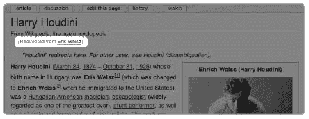
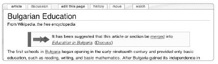

# 第八章. 构建和修复维基百科的网页

在第三章中，我们描述了许多浏览维基百科的方法。例如，读者可以通过页面之间的链接或通过相关文章的类别来探索维基百科。如果一个维基百科的区域已经工作了一段时间，这些浏览之旅就会顺利。但维基百科的内容并不是一开始就完美链接或分类的，新文章需要与现有内容整合。文章需要精心照料和关注，才能在网站的其他部分中完全可用。

本章转向维基百科上的网页构建技术。你可以像处理超文本一样添加、修改和修复维基百科。我们将介绍六个构建导航结构、链接文章和维护文章组织概念。这些概念在之前的章节中已经提到，但在这里我们将它们作为编辑工具来介绍。

首先，我们将介绍如何将一个页面标题重定向到另一个页面以及如何构建消歧义页面，这两者都有助于读者导航、避免重复并更有效地搜索网站。然后，我们将关注如何将文章组合、拆分或移动到更好的标题，以符合风格指南并使它们对读者更有用。在下一节中，我们将讨论类别和分类，这有助于读者导航相似的主题并帮助编辑维护页面集合。最后，我们将回顾解决与这些主题相关的社区流程中出现的问题的流程。

# 重定向和消歧义

重定向和消歧义页面，如第一章什么是维基百科？中所述，在维基百科的内部连接中扮演着重要的角色。*重定向*页面直接将读者从一篇文章标题引导到另一篇文章标题，并在存在多个可能的页面标题时使用。*消歧义*页面通过指向所有被该术语或类似术语引用的文章来阐明关键词的使用。

## 重定向

如果你访问[[诺玛·简·莫顿森]]这篇文章，你将被自动带到名为[[玛丽莲·梦露]]的文章。

尽管读者看不到，但确实存在一个名为 Norma Jeane Mortenson 的页面，但不是一个常规的文章页面。相反，这个页面是一个特殊且非常简短的页面，它只包含指向另一个目标页面的指针。这个页面是一个*重定向*，维基百科的索引条目相当于“关于诺玛·简·莫顿森，请参阅玛丽莲·梦露”。

重定向可以从任何页面设置到任何其他页面。重定向通常用于人名、地名或事物的名称变体和常见拼写错误。尽管文章只能在一个标题下存在，但重定向会自动将读者带到他们可能搜索的任何可想象标题的实际文章。重定向使查找和搜索内容变得更加容易，因为它们也会出现在搜索结果中。

维基百科有大量的重定向。截至 2007 年中期，该网站的重定向页面比文章页面多，大约在 5%到 10%之间。历史人物，由于他们的名字、头衔和多种拼写方式，是重定向的丰富来源。其他重要的来源是对其他语言中名字和术语的罗马化。例如，英语没有一种标准的写阿拉伯名字的方式：*Mohammed, Mohammad*和*Mohamed*都是写先知名字的接受方式。所有这些可能的拼写都会重定向到实际的标题（目前是[[Muhammad]]），从而节省了读者确定使用哪种拼写变化的麻烦。

作为其使命的一部分，维基百科必须管理这个庞大的重定向和消歧系统。许多参考工具都面临这个问题。例如，2007 年《经济学人》杂志上一篇文章讨论了政府情报机构在解决名字变化问题时面临的问题：

> “我们最大的问题之一一直是名字的变化，”迈克尔·舒尔说，他是 1996 年至 1999 年美国中央情报局奥萨马·本·拉登小组的负责人。舒尔先生说分析是“令人筋疲力尽的”，特别是对于阿拉伯名字，因为它涉及到手动编制被认为值得追踪的变化列表。^([23])

维基百科的编辑们知道舒尔先生的感觉。名字对参考工具很重要，但名字很复杂。以前的参考工具和印刷百科全书通过开发*参见*参考来处理这个问题，以引导读者从一个术语到另一个术语在索引中；维基百科，由于没有印刷索引，有一个自动的——并且更加全面的——解决方案。

当两个页面内容相同时，重定向也很有帮助，正如在 Merging Articles 中“合并文章”部分后面所述。当两个页面合并时，结果是其中一个页面标题的复合文章和一个从另一个页面来的重定向。

### 创建和编辑重定向

你可以轻松地创建新的重定向。首先创建一个新文章，使用你想要成为重定向的标题，如第六章中所述。然后在页面上只输入以下文本：

```
#REDIRECT [[*`title of page to redirect to`*]]
```

例如，如果你想将页面[[Goldfishes]]重定向到文章[[Goldfish]]（尽管文章标题惯例使用名词的单数形式，但读者可能会使用复数进行搜索），你将创建页面[[Goldfishes]]并输入以下文本：

```
#REDIRECT [[goldfish]]
```

然后添加一个适当的编辑摘要（*rdr*是*redirect*的常见缩写）并点击保存。现在，如果读者试图访问页面[[Goldfishes]]，他们将被引导到[[Goldfish]]。作为额外的好处，如果页面[[Goldfishes]]的链接也出现在另一篇文章中，当读者点击该链接时，他们将被带到[[Goldfish]]。

你不需要创建一个全新的页面来创建重定向。如果页面 [[Goldfishes]] 已经存在，你可以通过替换任何现有文本为重定向代码并点击保存将其转换为重定向。但请注意；如果页面上已经有文章，你可能想要将其移动到更好的标题或与现有页面合并，正如在 Merging Articles 中的"合并、拆分和移动"部分所述。

如果出现问题（或者你改变了主意），你总是可以编辑重定向。重定向，就像你对网站所做的任何其他更改一样，可以被撤销。但如何操作呢？

假设 [[Erik Weisz]] 是对 [[Harry Houdini]] 的重定向，遵循维基百科关于使用表演者最常用的艺名来命名文章的惯例。如果你点击[[Erik Weisz]]的链接，你将被重定向到[[Harry Houdini]]；但不要沮丧！当你从一个重定向页面访问文章时，你会注意到重定向页面的标题显示在页面标题下方，显示了你是如何到达那里的 (图 8-1).



**图 8-1. 页面标题下的重定向标题—Harry Houdini，从 Erik Weisz 重定向**

点击链接的页面标题 *(从 Erik Weisz 重定向)* 以访问重定向页面本身 (图 8-2).


**图 8-2. Erik Weisz 的重定向页面**

当你访问实际的重定向页面时，你会看到一个特殊的 URL，类似于 [`en.wikipedia.org/wiki/Erik_Weisz?redirect=no`](http://en.wikipedia.org/wiki/Erik_Weisz?redirect=no)。在 URL 中页面标题后添加 `?redirect=no` 可以防止页面自动重定向。

你可以像编辑其他页面一样编辑这个重定向页面，无论是更改重定向目标，还是删除重定向并开始一个新文章。你还可以检查重定向页面的页面历史记录，以确保在创建重定向时没有意外丢失高质量的内容。

这里有一些查看和编辑重定向的原因：

+   在页面标题处创建一个完整文章来替换重定向到另一个页面。（这通常发生在关于类似或相关项目的文章都重定向到一个中心页面时；关于每个项目的专业文章最终可能会被编写。）

+   将重定向更改为指向另一个页面（例如，如果重定向并不完全正确或存在拼写错误）。

+   如果在创建重定向之前页面包含内容，撤销重定向的创建，以便你可以恢复早期版本（例如，如果重定向是意外创建的或恢复原始文章很重要）。

+   从文章的早期版本（在创建重定向之前）复制内容到其他页面（你可以通过浏览重定向页面的历史记录来找到以前的版本）。

### 重定向的限制

重定向并不总是必要的。例如，除非你打算立即撰写该文章，否则你不应该创建一个重定向到尚不存在文章的重定向。在这种情况下创建重定向是有害的：它创建了一个无用的死胡同，并且将重定向页面的标题变成了蓝链，而红链可能会吸引想要撰写文章的作者的注意。出于类似的原因，当文章被删除时，指向它们的重定向也应该被删除。

在创建文章中部分的定向时，你也应该小心。例如，

```
#REDIRECT [[Ice cream#vanilla]]
```

这是重定向页面的文本，用于[[香草冰淇淋]]；它将你带到页面[[冰淇淋]]的香草部分。特定部分的定向是有用的，但它们并不稳健。这个重定向很容易被编辑者重新命名部分为*香草风味*（维基百科在部分级别上没有让你发现“链接到此”的方法）。因此，*风格指南*建议在重定向到它时留下一个隐藏的注释，例如，在部分标题下方（参见 WP:MOS#Section management）。

一个反复出现的理论是，你不应该将链接管道到重定向标题。换句话说，一些维基百科人认为[[奥维尔·赖特|第一次载人飞行的飞行员]]比[[莱特兄弟|第一次载人飞行的飞行员]]更差，因为[[奥维尔·赖特]]重定向到[[莱特兄弟]]。然而，如果有一天莱特兄弟被赋予了单独的文章，那么指向奥维尔的管道链接将是一个更好的选择。只要你不创建双重重定向，你就可以创建指向重定向的链接。一些案例在[[维基百科:重定向]]中进行了深入讨论。一般来说，目的是帮助读者而不是分散他们的注意力。

最后，两个技术问题限制了重定向的创建。

**双重重定向**

避免创建一个指向重定向的重定向：数据库软件无法进行两次转发。你可以通过点击“链接到此”来检查双重重定向；例如，如果你通过移动页面创建了一个重定向，请检查“链接到此”以查看旧标题。作为页面移动者，你有责任更新任何重定向以指向新标题。

**跨命名空间的重定向**

从一个命名空间重定向到另一个命名空间是令人困惑的，因为命名空间的全局目标就是分离不同类型的内容。除了少数例外，重定向应保持在单个命名空间内。如果列表页面被类别取代，可以从列表页面（在主要文章命名空间中）创建到类别（在类别命名空间中）的重定向。用户可以将他们的用户页面重定向到他们的用户讨论页面（从用户命名空间到用户讨论命名空间）。一个 Wikipedia: 命名空间帮助页面可以重定向到帮助命名空间中的现有帮助页面。主命名空间中的文章不应重定向到其他命名空间。更多内容，请参阅[[Wikipedia:跨命名空间重定向]]（快捷键 WP:CNR）。

## 区分页面

区分页面，俗称*帽子页面*，是维基百科的成功故事之一。它们被分配的角色相当谦逊。许多短语或单个英语单词是模糊的，因为它们有多种含义。以“桥牌”一词为例。除了是允许你跨越河流或其他障碍的结构外，“桥牌”还可以是一种纸牌游戏、一项牙科工作或一艘船的指挥所。鉴于所有这些含义，指向[[桥牌]]文章的维基链接可能会经常将读者引向错误的文章。解决方案是为每个含义创建几个不同标题的文章，并附带一个专门的页面来链接到它们，以便为读者区分。

### 注意

*维基百科在其早期历史中创造了“区分”一词，因为该网站需要一个用于表示执行此功能的页面的单词*。

如果只有两三篇文章可能混淆，可以使用轻量级的区分形式*帽子注解*（见第四章)，它们在两三篇文章之间来回指引用户。对于具有更多含义的术语，专门的区分页面效果更好。

在这种情况下，区分页面位于[[桥牌 (区分)]], 该页面列出了可能与“桥牌”一词相关的可能文章。截至 2008 年 1 月，该页面包括以下文章的链接：

+   [[桥牌 (牙科)]], 用于替换缺失牙齿的固定义齿

+   [[船桥 (船舶)]], 船只指挥的区域

+   [[桥牌 (纸牌游戏)]], 现代纸牌游戏；有关其他可能指代“桥牌”的纸牌游戏，请参阅[[桥牌 (纸牌游戏区分)]]

+   [[船桥 (音乐)]], 连接歌曲两部分的间奏曲

+   [[桥牌 (结构)]], 建造以便交通路线可以跨越障碍的结构

但页面上仅以 *Bridge* 命名的文章是什么？在这种情况下，[[Bridge (structure)]] 重定向到 [[Bridge]] 文章；在维基百科上，*bridge* 的默认含义是结构。该默认页面上的一个帽子注解会将读者指向如果他们寻找使用该术语不同含义的文章的区分页面。(图 8-3 显示了出现在 [[Bridge]] 文章上的帽子注解。)


**图 8-3. Bridge 文章上的帽子注解，指向相关的区分页面**

然而，区分页面可以通过多种方式创建。如果一个术语没有明确的默认含义，主文章可能充当区分页面。例如，如果你访问 [[Subway]]，你会发现它是一个区分页面，引导到使用这些含义的 *subway* 文章（以及其他文章）：

+   [[Subway (rail)]], 地下铁路，也称为地铁、地下、U-Bahn

+   [[Subway (underpass)]], 地下通道，通常是一个隧道

在区分页面上，描述不需要详尽。它们不作为它们链接到的文章的摘要；它们只是指向一个术语的不同可能含义，并需要仅澄清这些含义之间的区别。保持描述简短：对于一个演员来说，“美国电影演员”可能就足够了；你不需要包括他出演的电影。对于区分几个人的页面，包括他们的职业、国籍和出生及逝世日期（对于像乔治·威廉姆斯这样的人来说，提供日期尤为重要，因为六位美国政治家都有这个名字）。

### 区分关于人物的条目

维基百科有数十万篇传记（约占所有文章的 20%）。因此，为区分姓名制定了特殊指南。维基百科以可能最初看起来不清楚的方式处理这个复杂领域，如果你正在创建或更新这些类型的页面。注意页面上的模板，不要低估传记中涉及的问题。

**更整洁的帽子注解**

*标题注解*是文章顶部的小文本信息。当只有两篇文章可能引起混淆，或者需要引导读者到消歧义页面时，它们非常有用。维基百科使用标准的标题注解模板，如`{{for}}, {{otheruses}}`, 和 `{{distinguish}}`。这些模板向页面添加标准化的信息，这可能比编写自己的信息更容易（也完全可接受）。有关标题注解模板和常见信息的详细信息，请参阅[[维基百科:标题注解]]（快捷键 WP:HAT）。术语*标题注解*是维基百科特有的，是为了避免歧义而创造的，因为在法律工作中使用的是*脚注*（与*标题注解*相反）。

许多*完整的正确姓名*需要消歧义：John Smith、Thomas Adams 和 Juan González 都是需要消歧义页面来区分同名个体的常见姓名示例。但维基百科也列出了仅按姓氏的文章。例如，[[爱尔兰姓氏类别]]包含大约 200 个页面，每个页面都专注于一个爱尔兰起源的单个姓氏。如果你访问[[Nolan]]，你会找到一个关于爱尔兰、英国、美国、加拿大和其他 Nolan 的广泛的文章列表。

因此，*姓氏页面*非常类似于消歧义页面：*Nolan*指的是许多人。有时这些姓氏页面会在标题中包含*(姓氏)*。例如，[[Cooper]]是一个基本的消歧义页面，列出了许多被称为*Cooper*的地方、一些著名的名为*Cooper*的人，以及指向[[Cooper (职业)]], 该页面是关于制作桶的职业。因为*Cooper*是一个非常常见的英文名字，维基百科还有一个单独的页面[[Cooper (姓氏)]], 列出有关具有该名字的人的文章。这个页面存在于[[列表：Cooper 姓氏的人]]的位置。

关于人物的两种其他类型的页面存在：按给定名字的列表和家庭历史。

给定名字的处理方式与姓氏不同。如果你搜索[[John (given name)]], 你会在[[Given names category]]中找到这个页面。列出关于所有以 John 为名字的人的文章将没有用处。相反，你会发现*Juan*是西班牙语的对等词——换句话说，这篇文章是关于这个名字本身的。基本的页面[[John]]是一个消歧义页面，列出了仅以 John 著称的历史人物，例如签署大宪章的英国国王。使用`{{Given name}}`模板对这些页面进行分类。

这些主题在网络上非常受欢迎。我们在第一章中提到，维基百科认为大多数家族历史都是不加区分的，并且只有在家族的历史达到显著性的标准时才会包括在内——并且仅限于特定家族的文章（不是一般姓氏），例如 [[Bancroft family]]，直到 2007 年是《华尔街日报》的所有者。家族文章应放置在 [[Category:Families]] 及其子类别中。那篇 Bancroft 文章属于类别 [[Category:American families]] 和 [[Category:Business families]]。

### 消歧义模板

与其他文章一样，消歧义页面被标记为模板，以识别它们为消歧义页面并将它们分类到不同的类别中。以下是所有内容按模板分解的方式：

+   `{{disambig}}` 是通用的消歧义模板。例如，[[Tom Thumb (disambiguation)]] 列出了关于民间传说的角色、铁路机车、由彼得·塞勒斯主演的电影、德克萨斯州达拉斯的杂货商以及一些漫威漫画超级英雄的文章。换句话说，杂项列表是直接的消歧义页面。

+   `{{hndis}}` 是人名模板。此模板适用于例如 [[Bill Gates (disambiguation)]]，它不仅列出了微软的比尔·盖茨，还包括参加了克朗代克淘金热的“Swiftwater”比尔·盖茨以及各种更常以威廉·盖茨的名字为人所知的人。

+   `{{surname}}` 是姓氏页面模板。*风格指南*（快捷键 WP:MOSDAB，子节 *Given names or surnames*）描述了姓氏页面与消歧义页面的区别。

+   `{{geodis}}` 是用于消歧义地点名称的模板。

**进一步阅读**

重定向

[`en.wikipedia.org/wiki/Wikipedia:Redirect`](http://en.wikipedia.org/wiki/Wikipedia:Redirect) 创建重定向的风格指南

[`en.wikipedia.org/wiki/Help:Redirect`](http://en.wikipedia.org/wiki/Help:Redirect) 如何创建重定向的帮助页面

消歧义页面

[`en.wikipedia.org/wiki/Wikipedia:Disambiguation`](http://en.wikipedia.org/wiki/Wikipedia:Disambiguation) 创建消歧义页面的指南，包括页面命名约定

[`en.wikipedia.org/wiki/Wikipedia:Manual`](http://en.wikipedia.org/wiki/Wikipedia:Manual) of Style（消歧义页面）包含消歧义页面格式指南的风格指南页面

[`en.wikipedia.org/wiki/Wikipedia:WikiProject_Disambiguation`](http://en.wikipedia.org/wiki/Wikipedia:WikiProject_Disambiguation) WikiProject Disambiguation，用于清理消歧义页面

[`en.wikipedia.org/wiki/Wikipedia:Hatnote`](http://en.wikipedia.org/wiki/Wikipedia:Hatnote) 标题指南

* * *

^([23]) 查看“名字的含义” *《经济学人》*，访问日期：2007 年 3 月 8 日 ([`www.economist.com/search/displaystory.cfm?story_id=8766103`](http://www.economist.com/search/displaystory.cfm?story_id=8766103)).

# 合并、拆分和移动

在处理和整理单个文章时，包括确定每篇文章是否覆盖了适当的范围且不重复其他文章。如果两篇文章非常相似，可能需要将它们合并。另一方面，如果一篇文章变得过长且难以处理（或涵盖多个主题），可能需要将其拆分为多个文章。如果一篇文章应该出现在更合适的标题下，则需要将其移动。移动和合并都会从旧页面标题创建重定向，并将内容及修订历史复制到新页面标题。

## 合并文章

维基百科没有特殊的流程来确保新文章不重复旧文章（这就是为什么在第六章中我们建议在开始新文章之前检查同一主题的其他文章）。编写新文章的编辑负责确保没有重复的文章（可能使用略微不同的标题）存在。然而，如果编辑没有检查，并创建了一个重复的文章，其他编辑最终可能会发现重复。在这种情况下，他们很可能会将这两篇文章标记为合并的候选文章。

合并的目标是最终得到一篇优秀、连贯的文章，该文章综合了来自两篇文章的所有事实、概念和参考文献，而不重复材料。理想的合并结果会得到一篇更好的文章。合并过程中不应丢失任何内容；相反，所有相关事实都应最终出现在一篇文章中，而另一篇，即备选标题应将读者重定向到新的合并文章。

另一个更复杂的情况是，当需要将几个小的文章合并成一个更满意且范围更广的文章时。例如，关于乐队成员的文章可能需要合并到关于乐队的文章中，如果关于该音乐家的独立信息很少。有时，一个名词和它的反义词，或者两个相似术语，在单一文章中更有意义（例如，[[Supralapsarianism]] 和 [[Infralapsarianism]]）。这些情况通常需要更多的讨论，并且可能具有争议性。

一个好的合并是一个不急不躁、多步骤的过程，需要许多编辑。因为合并需要技巧，通常只有一个编辑会在所有感兴趣的编辑都同意后进行合并。这可能会因文章而异；对于只有一个标题拼写错误或两篇文章几乎完全相同的情况，异议不太可能。([[威廉·M·拉姆齐]]和[[威廉·米切尔·拉姆齐]]是这种重复的例子，其中关于同一个人的两篇文章被意外创建。)然而，如果你想要合并两个类似的概念，而另一位编辑想要在概念之间保持区别，可能会出现问题。例如，在数学中，分数和有理数分别在单独的文章中介绍——[[数学中的分数]]和[[有理数]]——尽管实际上分数是有理数。

### 如何合并文章

合并是一个手动过程，对于较长的文章来说可能相当复杂。假设你想自己进行合并，以下是需要遵循的步骤：

1.  确定你想要合并的文章。确保它们确实是重复的文章或需要以其他方式合并。

1.  使用特殊的合并模板标记要合并的每篇文章。在文章开头插入模板：

    ```
    {{merge|*`otherarticlename`*|date=January 2008}}
    ```

    其中*`otherarticlename`*是你想要与当前标记的文章合并的文章的标题，当前月份和年份出现在`date=`之后。

1.  将要合并的其他文章标记，用第一个文章的标题替换*`otherarticlename`*。这些模板会提醒读者和编辑可能存在合并。(图 8-4 显示了这篇文章顶部的此信息。)

    

    **图 8-4. 保加利亚教育文章中的合并信息模板，建议合并到名为保加利亚教育的文章中**

    在任何合并中，一篇文章将成为*目标文章*（*mergeto*页面），其中所有内容都将合并，另一篇文章将成为*重定向文章*（*mergefrom*页面），它将成为指向另一篇文章的重定向。如果你已经知道哪篇文章应该是哪一个，你可以使用更具体的模板：

    +   在重定向文章上使用`{{mergeto|`*`otherarticlename`*`|date=January 2008}}`

    +   在目标文章上使用`{{mergefrom|`*`otherarticlename`*`|date=January 2008}}`

    合并模板会将文章放入[[分类：待合并文章]]；添加日期意味着它们将按月分类排序。

1.  在每篇文章的讨论页面上添加注释，描述你认为为什么应该合并文章，如果原因不明显的话。

1.  在标记文章后，等待一周（对于不太知名的文章可能需要更长的时间），以便有文章观察列表的编辑对合并发表评论。目的是留出足够的时间，以防有人不同意合并。（如果您在此期间感到不耐烦，您可以在较旧的文章中找到大量的合并工作来做！）

1.  审查有关合并的任何评论；如果提出了强烈的反对意见，不要合并文章。

1.  如果您还没有决定，请选择目标文章和重定向文章。如果您不确定，请与相关讨论页面的其他编辑讨论以解决此事。

1.  同时编辑两篇文章（使用两个浏览器窗口或两个浏览器标签）。首先，将合并来源页面的文本复制到合并目标页面。确保包括所有参考文献、脚注、外部链接和参见（对于编辑，您可以先草拟合并文章并稍后保存，或者您可以使用后续编辑来清理工作）。在保存文章时，添加适当的编辑摘要，说明内容来源，例如“合并内容”，并包括您要合并的文章的标题。

1.  使用多次编辑来处理新合并页面的逻辑顺序。确定重复的程度，哪些部分需要删除或移动，以及是否需要开始新的部分。分阶段减少重复是最好的；通过合并重复部分对材料进行排序。最好逐个确定重复部分，而不是在最初合并文章时。

1.  磨练新文章的文本，并专注于可读性。尽量不删除内容，但专注于创建高质量的文章。不要丢失参考文献和脚注，并对任何有疑问的陈述进行引用。

1.  将合并来源文章上的文本替换为指向新目标（合并目标）文章的重定向。保存页面，在编辑摘要中说明正在合并的页面。

1.  如果两篇文章在事实上有分歧，请在目标文章的讨论页面上注明此信息。同时指出任何其他更改，如文本剪切或删除的图片。

1.  从重定向文章中检查“链接到此页”，以找到由合并可能创建的双重重定向；通过编辑它们将它们指向目标文章进行修复。

1.  当您完成时，从目标文章中删除合并标签，并在您的原始讨论页面上添加一个说明，指出合并已完成。

1.  为完成合并而祝贺自己！

对于包含多个文章的重大整合，您可以使用`{{multiplemergefrom|}}`模板。一次合并一篇文章；您仍然需要确定目标文章。

## 文章拆分

当一篇文章变得难以阅读和编辑时，应该将其拆分为多个文章。如果一篇文章涉及几个更适合独立文章的多样化主题，也应该拆分为多个文章。然而，如果结果文章会很小，不应该拆分。例如，关于一个作家的文章不应该拆分为关于他或她每本书的小文章；在这种情况下，一篇关于作者及其作品的长期文章，并从书名进行重定向，通常是最好的。

由于各种原因，非常长的文章是不受欢迎的：它们难以导航和阅读，在某些较老的浏览器和移动浏览器中，你无法编辑超过 32KB 文本的页面。在慢速互联网连接上，长文章也可能需要很长时间才能加载。*风格手册*在[[Wikipedia:Article size]]（快捷键 WP:SIZE）中处理这些问题。

当一篇文章包含太多关于狭窄子主题的细节时，你可能想要将其拆分。拆分是[[Wikipedia:Summary style]]的一个重要方面，这在第六章中提到。长文章通常应该遵循总结风格。文章的每一部分都应该总结主要主题点，并通过链接到填充详细信息的专门文章。

在程序上，拆分与合并类似。首先，在页面上发布`{{split}}`模板，可能是在你打算拆分为其独立文章的节的开头。在进行任何重大操作之前，在文章的讨论页面上添加一个备注。你应该通常等待编辑之间的任何评论和讨论。

如果需要将文本的一部分拆分为其独立文章：

1.  为新文章提供一个合适的标题。

1.  编辑旧文章以获取剪切和粘贴的维基文本，以保留任何格式。

1.  添加一个适当的编辑摘要，说明你正在拆分旧文章，并使用维基链接给出两个文章的名称，例如，*将[[阿拉斯加历史]]从[[阿拉斯加]]中拆分出来*。

1.  在你截取文本而不是留下空白的地方为旧文章添加一个总结，并为新文章添加一个维基链接。

以阿拉斯加历史为例，在主阿拉斯加文章中只需添加一到两段简短的段落，总结阿拉斯加历史的高潮。在“阿拉斯加历史”部分的顶部，包括一个链接到新的、更专业的文章，以及如下信息：*主要文章：[[阿拉斯加历史]]*。这条信息告诉读者，如果他们想了解更多关于阿拉斯加历史的信息，请点击链接进入该文章。使用模板`{{main|title}}`来生成整洁的信息。

## 移动页面

如果一篇文章位于错误的标题下，只要没有其他文章位于该标题下，你可以将其移动到新标题。移动是重命名页面的唯一方法。

移动页面简单但有几个含义。要移动页面，你必须登录并且拥有一个超过四天（截至 2008 年初）的账户。点击你想要重命名的页面顶部的“移动”标签。在出现的表单中，输入你希望文章拥有的新标题以及你将文章移动到新标题的原因。保持移动相关的讨论页面框选中。勾选“监视此页面”框以将其添加到你的个人监视列表。

典型的移动可能只是将[[PT Barnum]]移动到[[P. T. Barnum]]（在首字母缩写之间添加句点和空格）。页面移动通常用于修复标题样式（纠正标点符号、包括撇号类型或使用破折号作为长破折号是常见的修复）。

页面移动完成三个重要的事情：

+   改变文章标题

+   将页面历史移动到新标题

+   从旧标题创建到新标题的重定向

它们还可能导致其他三件事情：

+   将指向旧标题的重定向转换为双重重定向

+   如果新标题在其他页面上已被链接，请填写红色链接

+   预防未来重复

创建双重重定向是负面的，但其他两个是正面的。例如，如果你将一个标题选择不当的孤儿文章移动到一个更合理的标题，如果你在其他地方已经链接到那个新页面标题，你可能会因为你的细心工作而获得一串新的回链到该页面。断链突然变成了蓝链。

### 移动页面的限制

如果你试图移动一篇文章，而另一个文章已经使用了你选择的标题，你将无法将你的文章移动到那里。检查这两篇文章：它们是否应该合并？参见家务管理中的“当页面移动被阻止”部分，了解在该更复杂场景中应该怎么做。

你唯一可以移动一篇文章到现有页面的情况是，该页面是一个具有最少历史的重定向页面。

移动功能是重命名文章的唯一可接受方式，因为移动会将版本历史与文章本身一起转移。虽然您可以轻松地将文章内容复制粘贴到新页面，然后将旧页面重定向到新页面，但这样做是错误的。这样做会导致文章没有先前版本的记录，从而产生令人困惑的记录。这些所谓的“剪切粘贴移动”可以通过管理员通过历史合并过程进行修复；请参阅[[Wikipedia:如何修复剪切粘贴移动]]。在合并或拆分文章时，始终提供良好的编辑摘要，详细说明内容来源。

**修复双重重定向**

在您移动一篇文章后，您有责任通过检查旧文章的“链接到此页”来移除双重重定向。在您成功移动文章后，一条消息会提醒您检查双重重定向，并给出正确的文本使用方法。一个好的编辑不会忽视这项任务，即使网站上的机器人可能几天内就会处理这个问题。

### 撤销移动

页面移动可以被撤销。在移动文章后立即，如果您意识到自己犯了错误，您将有机会回滚。只有在原始移动文章之后没有进行编辑的情况下才能撤销。如果已经编辑，您可以通过回到原始标题来反转移动功能。如果这不可能，您将需要管理员的帮助。请参阅[[Wikipedia:如何重命名（移动）页面#撤销移动]]。

### 争议性标题更改

在维基百科上工作一段时间后，您会了解什么被认为是具有争议性的，什么不是。对于文章标题，基本规则是使用最常用的表达方式。标题不应更改以表达观点——无论是政治上的还是其他方面的。显然，如果新标题未能以中立的方式描述文章的内容，可能会出现问题。如有疑问，在移动文章之前，在文章的讨论页面上讨论新标题。

例如，考虑一下哪种类型的文章可能证明在标题中使用“大屠杀”一词是合理的：关于此类问题的频繁讨论已经发生，民族主义观点也介入其中。例如，关于[[Deir Yassin 大屠杀]]的使用“大屠杀”一词是有争议的，有些人希望将其更名为[[Deir Yassin 战役]]。在这种情况下，维基百科涉及具有争议性的历史，无法避免激烈的辩论。

维基百科在处理使用通用名称或标题的某些例外情况时，更倾向于正确而不是迎合大众，例如关于贵族的文章。但以[[J. D. Salinger]]文章为例，将其移动到[[Jerome David Salinger]]会导致不便，因为 J.D. Salinger 从不使用全名。尽管全名通常比首字母缩写更好，但在这种情况下，它们并不适用；Salinger 的首字母缩写充当一种笔名。（更多此类例子可以在[[List of people known by initials]]中找到。）

**进一步阅读**

合并文章

[帮助合并和移动页面](http://en.wikipedia.org/wiki/Help:Merging_and_moving_pages)

[按月份标记的文章合并类别](http://en.wikipedia.org/wiki/Category:Merge_by_month)

分割文章

[关于分割文章的《风格指南》部分](http://en.wikipedia.org/wiki/Wikipedia:Summary_style)

[需要分割的文章类别](http://en.wikipedia.org/wiki/Category:Articles_to_be_split)

[关于文章大小](http://en.wikipedia.org/wiki/Wikipedia:Article_size)

移动页面

[如何移动页面](http://en.wikipedia.org/wiki/Help:Moving_a_page)

# 分类

类别命名空间中的每一页都代表、列出，也许还定义了一个 *类别*，或相关页面的分组。类别将页面放置在相关主题的“容器”中。维基百科上的类别页面应该提供特定主题的概述。覆盖范围有多广？文章是如何组织的？你想要的主题是否在那里，但标题不是你的首选？是否有更适合你想要研究区域的子类别？

你在 Browsing by Categories 中学习了如何使用类别进行导航；在本节中，你将学习如何将它们作为编辑工具使用。

所有文章至少应属于一个类别；大多数文章属于多个类别。有些区域特别重要需要分类：例如，正在努力跟踪维基百科中所有在世人物的传记，文章数量已超过六位数。

当一篇文章属于一个或多个类别时，此信息将出现在文章底部自动生成的名为 *Categories* 的部分中。

**您可以更改皮肤**

不同的 *皮肤*——网站外观的格式，可以在你的偏好设置中更改（见第十一章)——在不同的位置显示类别。如果你经常在文章中引用类别，将皮肤更改为 *经典*，它将类别显示在页面顶部而不是底部，将节省你滚动以使用它们的麻烦。如果你已登录，请转到页面右上角的“我的偏好设置”。要更改回默认皮肤，请转到经典皮肤顶部的“偏好设置”并选择 Monobook（默认皮肤）。

点击任何类别链接将带你去该类别的首页。如第三章（见图 3-10 中所述），一个类别页面有四个部分：

+   类别的说明；这段文本（以及类别的讨论页面）是可编辑的，如果你点击“编辑此页面”，你会看到它。

+   列出该类别内的任何子类别；这些类别按字母顺序列出，但如果类别非常大，列表可能会分布在几个页面上。

+   一个链接到该类别文章的列表；这个列表是自动填充的。如果类别非常大，列表可能会分布在几个页面上；只有前 200 个链接会出现在第一页上。点击页面底部的“下一页 200”以查看下一页的条目。

+   在底部，你可以找到一个列表，列出你正在查看的类别所属的类别。这些类别可以通过编辑类别页面进行编辑。

**列表与类别**

关于是否应该使用类别或列表来排序文章的争论在维基百科上持续进行。由于类别是自动化的，与作为可编辑文章创建的列表相比，它们相对不够灵活。可编辑的能力意味着列表可以被注释和引用，这是列表在网站上持续存在的主要原因。

## 类别基础

你可以通过添加以下内容将页面分配给任何类别：

```
[[Category:*`categoryname`*]]
```

将页面添加到维基文本中。用实际的类别名称替换*`categoryname`*。

例如，要将文章[[波佐小丑]]添加到小丑类别，你需要在文章中编辑并添加文本[[Category:Clowns]]在页面底部。

通过添加类别标签将文章放入类别中会做两件事：

+   它会自动将文章列在适当的类别页面上。

+   它还在文章底部的类别列表中提供了一个链接到该类别页面。

尽管文章源文本中类别标签的位置与页面上“类别”框出现的位置之间没有联系，但一般惯例是将类别一起放置在源文本的末尾（尽管在维基链接之前），每行一个，这样就不会影响文本的其余部分，并且所有类别都在一个地方。（图 8-5

**图 8-5. 文章维基文本中列出的多个分类，位于页面末尾（在模板和跨语言链接之前），来自文章[[Exploding whale]]**

文章可以通过添加多个分类标签被包含在多个分类中。例如，对于一个已经去世的人，标准分类包括出生年份、逝世年份和职业。大多数文章自然地属于多个分类。

**大多数分类**

可以在特殊页面[[Special:Mostcategories]]中找到分类数量最多的页面。截至 2008 年 3 月，大量动物分类被添加到[[Red Fox]]，使其达到 96 个分类；其次是[[Black Rat]]。在此之前，分类数量最多的文章是[[Winston Churchill]]，有 67 个分类；这些包括[[Category:Knights of the Elephant]]，用于持有丹麦勋章的人，以及[[Category:Nobel laureates in Literature]]，从 1953 年开始，还有[[Category:Old Harrovians]]和[[Category:Members of the Queen's Privy Council for Canada]]。

要在维基文本中链接到分类而不对页面进行分类，请输入

```
[[:Category:Instruction]]
```

这样做对于文章中的“参见”部分很有用。如果你想在讨论页面上讨论一个分类，这也是至关重要的。如果你省略了第一个冒号，链接的文本将不会显示，并且页面将被归类在那个分类中。

## 分类和内容政策

就像维基百科上的其他所有内容一样，分类不是权威的。有时它们甚至可能是错误的或误导性的，这通常是由于一个诚实错误造成的。文章应该被放置在分类中仅仅是为了提供信息，而不是为了提出观点或支持有争议的立场。显然，如果关于某人的文章被放置在一个损害其声誉的分类中，那么这种分类应该在文章中得到充分的支持。没有人应该未经正当理由就随意将[[Category:Murderers]]添加到传记中。维基百科不允许其分类系统被用作评论内容的方式。

通常，任何添加分类到文章的人都应该遵循维基百科其他部分所遵循的相同基本政策，包括可验证性、无原创研究和中立观点。分类是文章信息内容的一部分，应该得到适当的处理：它们应该由参考文献（或者更确切地说，由文章文本中的陈述本身引用）支持，特别是如果分类是有争议的。（与列表相比，分类的一个缺点是：你可以添加来源来支持列表的包含，但你不能直接注释文章的分类。）

维基百科有许多关于分类文章的指南；[[Wikipedia:Categorization FAQ]]是找到它们的一个地方。另一个指南，[[Wikipedia:Categorization of people]]，解释了将人放入可能会影响其声誉的类别这一敏感主题。特别是对于关于在世人物的传记文章，在添加除非常正式和描述性的类别之外的其他类别时要谨慎。

## 创建新类别

你可以轻松地开始一个新的类别。如果你向一篇文章添加了类别，但该类别尚未存在，它将在文章的类别列表中显示为红色链接。要将其转换为蓝色链接，只需点击它（或访问[[Category:*新类别名称*]]，其中*新类别名称*是你想要创建的类别）并添加一些内容，例如对类别及其子类别的简要描述，到类别页面。任何你或其他人已经用你的新类别名称标记的页面将自动列在新类别页面上。

例如，可以通过向新页面[[Category:Poisoned apples]]添加以下文本来创建[[Category:Poisoned apples]]：

```
A poisoned apple is an apple that has been poisoned.
[[Category:Apples]]
[[Category:Fairytale objects]]
```

描述将出现在类别页面的顶部，添加类别将立即使*有毒苹果*成为苹果和童话物品类别的新子类别。

所有新的类别都应该列出其更广泛的类别，但包含描述是可选的；在这种情况下，描述并不非常有帮助。然而，在某些情况下，一个好的描述（可能链接到该主题的主要文章）将有助于普通读者，特别是对于不为人知的主题。

维基百科还有创建类别的命名和结构规范。例如，使用复数形式，如[[Category:Pigs]]，来表示类别。这个规范与文章标题规范不同，通常更喜欢使用单数形式。像[[Category:Vermont]]这样的专有名称，收集关于该州的文章，或者像[[Category:Greek mythology]]这样的集体标题也是常见的类别名称。

在创建新类别之前，请确保你想要的类别在变体名称下尚未存在（检查与你试图分类的文章类似的文章）。创建明显不必要的类别被认为是一种麻烦。

## 子类别

类别可以有子类别。任何人都可以通过简单地分类类别页面来创建或修改子类别。例如，你可以将[[Category:Piglets]]设为[[Category:Pigs]]的子类别；只需将[[Category:Piglets]]页面标记为[[Category:Pigs]]即可。使用子类别和超类别结构是浏览网站的好方法，这在第三章中进行了广泛讨论。

在这里，我们将讨论使用详细分类对文章进行分类的问题。详细的次子分类是好是坏？当然，包含太多文章的分类可能会难以管理；包含 200 多篇文章的分类需要多个页面。将文章细分为更多独特的分类可以帮助保持分类的可管理性。

在维基百科中，子分类在遵循的方案与主题内容自然且相关性明显时非常有用。例如，[[Category:Politicians with blue eyes]] 并没有帮助——谁会寻找这样的信息呢？但 [[Category:Canadian buskers]] 是 [[Category:Buskers]] 或 [[Category:Canadian musicians]] 的一个可接受的子分类。子分类应该为普通读者提供一种方便的导航方式，并也提供关于分类中包含的材料的信息。

按照一般但并非普遍的惯例，文章不应同时出现在一个分类和其子分类中。例如，[[Category:Beetles]] 在 [[Category:Insects]] 中对某些昆虫进行了更精确的分类。根据惯例，甲虫文章也不应同时出现在更广泛的 [[Category:Insects]] 中。因此，在搜索 [[Category:Insects]] 中关于 *所有* 维基百科昆虫文章时，你还需要搜索 [[Category:Beetles]] 以及其中的十几个子分类，以找到所有甲虫页面。遍历所有子分类是找到与更大分类（如昆虫）相关的所有文章的唯一全面方法；如果你在这种情况下访问了 [[List of insects]] 页面，你会发现在这个列表是一个重定向到 [[Category:Insects]] 的页面。虽然找到所有关于昆虫的维基百科文章可能是不合理的（因为该分类非常庞大），但为较小的话题创建极其详细的子分类可能会使一眼看到所有相关文章变得困难。另一方面，文章应始终放置在适用的最详细分类中：关于在新西兰发现的甲虫的文章应放在新西兰甲虫分类中，而不是更高级别的甲虫分类中。

**探索分类及其子分类**

维基百科有一种方式可以展示复杂分类的整体结构。特殊页面 [[Special:CategoryTree]] 会以可点击的树状结构显示一个分类的所有子分类。访问该页面并在提供的框中输入你想要检查的分类名称（必须在浏览器中启用 JavaScript）。这个工具可以轻松地看到不同子分类中的相关文章。你还可以通过使用标签 `<categorytree>`*`分类名称`*`</categorytree>` 在维基页面上包含一个可展开的分类树。访问页面并在提供的框中输入你想要检查的分类名称（必须在浏览器中启用 JavaScript）。这个工具可以轻松地看到不同子分类中的相关文章。你还可以通过使用标签 `<categorytree>`*`分类名称`*`</categorytree>` 在维基页面上包含一个可展开的分类树。使用此标签时，分类名称不需要括号。

## 分类项目

你可以在[[Wikipedia:WikiProject Categories/Current subprojects]]找到关于改进分类使用项目的许多信息。你还可以在[[Category:Wikipedia categorization]]找到概述。

一个长期存在的跨所有学科的分类项目是[[Wikipedia:WikiProject Stub sorting]]。该项目维护着存根文章的分类，其列表可以在[[Wikipedia:WikiProject Stub sorting/List of stubs]]找到。这些特殊分类应用于没有标准分类标签但带有模板的文章，这些模板将在下一章中讨论。

**进一步阅读**

[分类指南](http://en.wikipedia.org/wiki/Wikipedia:Categorization) 分类指南

[关于使用分类的常见问题](http://en.wikipedia.org/wiki/Wikipedia:Categorization_FAQ) 使用分类的常见问题

[关于人物分类的指南](http://en.wikipedia.org/wiki/Wikipedia:Categorization_of_people) 关于人物分类的指南

[处理分类的 Wiki 项目](http://en.wikipedia.org/wiki/Wikipedia:WikiProject_Categories) 处理分类的 Wiki 项目

[当前分类项目](http://en.wikipedia.org/wiki/Wikipedia:Categorization_projects_(current)) 当前分类项目

[处理分类的项目页面分类](http://en.wikipedia.org/wiki/Category:Wikipedia_categorization) 处理分类的项目页面分类

# 家务管理

现在你已经看到了如何使用六个工具进行超文本编辑，我们将讨论当你尝试应用本章中讨论的工具时可能出现的几个问题以及解决这些问题的方法。

## 当页面移动被阻止时

假设你想将文章 P 移动到标题 Q，但 MediaWiki 软件阻止了移动。P 和 Q 可能是关于相同主题的文章；那么你可能需要合并这些文章。

如果其他文章 Q 与 P 不同主题但使用了你为 P 想要使用的相同标题，那么你需要为主术语创建一个消歧义页面，并将其他文章移动到适当的标题，然后在新消歧义页面上链接到这些标题。例如，你可能想把[[Jolly Green Giant]]移动到[[Green Giant]]——但你可能会发现[[Green Giant]]已经被一个关于公司的页面占用。你可以将[[Green Giant]]页面移动到[[Green Giant (company)]], 将[[Jolly Green Giant]]移动到[[Green Giant (symbol)]]。然后你可以回到[[Green Giant]]页面——它将是一个从移动重定向到[[Green Giant (company)]]的重定向，并编辑它以成为一个指向两个文章的消歧义页面。关于绿色巨人的任何其他文章也可以列出。[[Jolly Green Giant]]页面将自动转换为重定向到[[Green Giant (symbol)]], 但你需要检查双重重定向，并为两个文章添加指向消歧义页面的帽子说明。这一系列操作将帮助这个维基百科的小角落对读者来说更有意义。

有时情况会更复杂。将页面移动到临时虚拟标题可能会有所帮助。当你完成时，你可以标记你创建的任何不必要的重定向，以便快速删除。有关更多指导，请参阅[[帮助：移动页面]]，以及[[Wikipedia:请求移动]]以请求管理员帮助移动页面。

## 默认含义

有时，关于一个不太重要的人物，比如来自动漫或漫画的人物，在关于一个同名的更重要人物的文章之前就已经创建了。在这种情况下，应该创建一个消歧义页面。然而，为了百科全书的好处，不太重要的人物不应该成为默认含义。例如，北欧神[[Thor]]必须比[[Thor (Marvel Comics)]]有优先权。这种类型的问题必须由理解阻止页面移动的人来解决。

移动标题最好是从一个更通用的标题到更具体的标题：例如从[[John Jones]]到[[John James Jones]]。这样就可以为[[John Jones]]创建一个消歧义页面。向上移动标题，或从标题中删除信息，有时可能会遇到问题。删除信息可能会使标题变得模糊，例如，将[[George W. Bush]]移动到[[George Bush]]。如果你从标题中删除信息，你可能会决定采用维基百科的默认含义：你可能会告诉全世界，John Jones 应该被读作 John James Jones。

换句话说，使标题更加信息丰富和针对主题的专业化。但不要添加像 Dr.这样的头衔、尊称或姓名后的荣誉学位，如缩写字母；这与维基百科的惯例相悖。将文章移动到更通用的标题应主要用于冗长的标题，例如将[[1930 年代至 1945 年日本政府、私营机构和团体列表]]移动到[[1930–1945 年日本机构列表]]。

## 避免使用消歧义页面

文章中的维基链接通常应指向确切的文章标题，而不是消歧义页面，因为具有多种可能含义的链接可能会让对主题不熟悉的读者感到困惑。将维基链接更改为指向精确文章而不是消歧义页面的过程称为*避免使用消歧义页面*。通常，这项工作是通过检查消歧义页面的“链接到此页”来完成的。

这里有一个来自[[Rectangle]]文章的例子。文章中的初始文本是

```
A [[square]] is a special kind of rectangle where all four sides have equal
length;
```

但[[Square]]是一个消歧义页面，其中包含对不时髦的人的[[Square (slang)]]含义。为了避免消歧义页面，将链接[[Square]]更改为以下内容：

```
A [[square (geometry)|square]] is a special kind of rectangle where all four
sides have equal length;
```

文本现在与之前相同，但维基链接的目标精确且正确。如果尚未创建使用该术语精确含义的文章，请使用红管链接而不是链接到消歧义页面（这可能会造成混淆）。红管链接也可能促使某人创建新文章。

**寻找消歧义工作**

要查找消歧义页面的列表，包括需要改进的消歧义页面，请尝试浏览[[Category:Disambiguation]]; 顶部的子类别按主题对消歧义页面进行排序。如果您想帮助清理需要清理的消歧义页面，请考虑加入消歧义 Wiki 项目：[[Wikipedia:WikiProject Disambiguation]]。有关具有传入链接的消歧义页面列表，请参阅[[Wikipedia:Disambiguation pages with links]]（快捷键 WP:DPL）。

## 控制类别排序

类别内的页面按页面标题的第一词字母顺序显示，但此顺序可以通过*排序键*进行修改。

[[Category:法国总统]]可能看起来相当普通（图 8-6

**图 8-6. [[Category:法国总统]]**

在一个类别中，您通常会期望文章 [[John Smith]] 在 *S* 类别下按 *Smith* 排序，而不是按 *J* 类别下的 *John* 排序。维基百科有两种方法可以实现这一结果：魔法词和排序键。这两种方法具有相同的效果——使类别列表将 [[John Smith]] 页面的文章视为其标题为 *Smith John*，但魔法词会影响页面所在的每个类别，而排序键一次只对一个类别起作用。每个都非常灵活。

默认排序的魔法词用法类似于模板：

```
{{DEFAULTSORT:}}
```

对于页面 [[John Smith]]，它将填写如下：

```
{{DEFAULTSORT:Smith, John}}
```

并放置在类别列表之上的 wikitext 中。为了将 [[Charles de Gaulle]] 列入 *G* 类别，模板将按以下方式填写：

```
{{DEFAULTSORT:Gaulle, Charles de}}
```

使用此模板会影响查尔斯·戴高乐可能被放置的每个类别页面（可能多达数十个）；文章将始终在 *G* 类别下排序。

要仅在一个类别中排序一篇文章，或根据类别变化排序，请使用 *排序键*，它是在文章文本中的类别链接后放置的管道字符后添加的：

```
[[Category:1900 births|Smith, John]]
```

如果您想将拿破仑三世列入 *B* 类别下的 *Bonaparte*，对于这个特定类别，请输入

```
[[Category:Presidents of France|Bonaparte, Louis-Napoleon]]
```

在页面 [[法国拿破仑三世]] 上；这将影响文章在 *法国总统* 类别中的排序方式。有关更多示例和解释，请参阅 [[Wikipedia:Categorization#Pipe tricks and sort keys]]。

尽管标题通常由纯文本组成，但它们可能以其他符号开头。当扩展到非字母数字字符进行类别排序时，使用的排序是 *ASCII 排序*，这是计算机字节码中使用的标准。以数字开头的文章标题排在以字母 *A* 开头的文章标题之前，以符号开头的文章标题总是排在这些之前，使用特定的符号顺序。以开括号开头的文章 [[(Like) Linus]]，关于 The Deftones 的演示，如果这两篇文章被放在同一个（不太可能）的类别中，将排在以 @ 开头的关于 [[@Home Network]] 的文章之前，后者是一个已停业的 ISP。

使用 ASCII 排序解释了关于法国总统类别页面的另一件事。列表从带有星号 (*) 的 [[法国共和国总统]] 开始。这是因为，在 [[法国共和国总统]] 文章中，类别标签的读法是

```
[[Category:Presidents of France|*]
```

星号是一种将文章带到列表顶部的工具，使其更加突出。这种方法通常用于突出显示类别中的主要文章——这篇文章将为读者提供一个关于整个主题的概述。在管道字符后面的空白是一个额外的细化，具有相同的效果，但类别页面上不包含星号。

## 重定向的类别和模板

在分类页面上的某些链接可能会以斜体显示。这是因为这些链接是重定向页面的链接。如果您点击链接，您将转到重定向指向的页面（而不是您期望的标题的文章）。

可能的解释是：重定向锚定在文章的一个部分，该分类对那个部分是正确的，但对整个文章来说可能很奇怪。例如，文章可能关于一个作者，而章节关于根据作者的书改编的电影：将作者的名字放在电影分类中是不正确的。

另一个如何使用此设备的例子可以通过法国总统的例子来说明。[查尔斯·路易·拿破仑·波拿巴](https://wiki.example.org/Charles_Louis-Napoléon_Bonaparte) 是重定向到 [[法国拿破仑三世]]。分类标签 [[Category:Presidents of France|Bonaparte]] 可以包含在重定向中，这样分类页面就会包含他在总统任期的正确名称，并按 *Bonaparte* 排序。

重定向页面上的模板主要用于标记可以成为独立文章的重定向。参见 [[Category:Redirect templates]]。

## 流程式决议

如果您知道去哪里寻求答案，您的问题可能有一个解决方案。

**分类删除**

麻烦且无用的分类以及需要重命名的分类（通常需要一致地应用惯例）通过一个流程来处理。前往 [[Wikipedia:Categories for discussion]]（快捷键 WP:CFD）申请删除、合并和重命名分类，或参与有关这些问题的讨论。这个过程大约需要一周时间。

**问题重定向**

前往 [[Wikipedia:Redirects for discussion]]（快捷键 WP:RFD）。

**关于默认含义的争议**

编辑员应该讨论关于默认含义的困难，并达成决议。如果未能达成，[[Wikipedia:Requested moves]]（快捷键 WP:RM）是讨论任何有争议的标题更改的地方。

**没有共识的合并**

大多数合并应该简单地标记并在各自的讨论页面上讨论，但提议的合并也可以在 [[Wikipedia:Proposed mergers]] 上列出以进行更广泛的讨论。如果没有共识，通常不应进行合并。

**有争议的标题更改**

当共识不明确时，前往 [[Wikipedia:Requested moves]]（快捷键 WP:RM）讨论移动。如果存在真正的分歧，这个页面可以用来整理有关移动的问题。只需添加请求以及简短的正当理由，并在几天内参考此页面。任何编辑都可以发表评论。

**修复剪切粘贴的重定向**

如果您需要在剪切粘贴操作后修复页面历史，请前往 [[Wikipedia:Cut and paste move repair holding pen]]（快捷键 WP:SPLICE）。

**进一步阅读**

[如何移动现有页面](http://en.wikipedia.org/wiki/Help:Moving_a_page#Moving_over_an_existing_page)

[维基百科：帮助：分类#排序顺序](http://en.wikipedia.org/wiki/Help:Category#Sort_order) 排序顺序指南

[维基百科：重定向模板分类](http://en.wikipedia.org/wiki/Category:Redirect templates) 重定向模板的分类

[维基百科：讨论分类](http://en.wikipedia.org/wiki/Wikipedia:Categories_for_discussion) 分类讨论

[维基百科：讨论重定向](http://en.wikipedia.org/wiki/Wikipedia:Redirects_for_discussion) 重定向讨论

[维基百科：提议合并](http://en.wikipedia.org/wiki/Wikipedia:Proposed_mergers) 按月份排序的提议合并

[维基百科：请求移动](http://en.wikipedia.org/wiki/Wikipedia:Requested_moves) 请求帮助移动的地方

[维基百科：如何修复剪切和粘贴移动](http://en.wikipedia.org/wiki/Wikipedia:How_to_fix_cut-and-paste_moves) 修复剪切和粘贴移动的指南

# 摘要

改善维基百科不仅限于编辑文本。本章讨论的技术补充了撰写文章这一更吸引人的业务。通过创建导航结构和整理现有内容，它们允许你更清晰地呈现网站内容给读者。

有两种特殊的页面类型——重定向页面和消歧义页面，它们被用来帮助读者在维基百科中导航。重定向页面是一种特殊的页面，当一篇文章存在多个可能的标题时，它会将读者从一个页面标题带到另一个页面。维基百科有数百万个重定向页面，所有这些都在帮助读者导航和搜索网站。另一方面，消歧义页面则汇集了具有相似标题的文章列表，这些标题可能会引起混淆。这些页面可以为任何具有多个含义的术语创建，也可以为可能指代多个人或家庭的常见个人和家庭名称创建。

编辑文章的一部分是确保每篇文章的范围是适当的。如果维基百科有两个或更多关于同一主题或内容非常相似的文章，这些文章可能需要合并。任何编辑都可以通过编辑文章并将它们的文本合并到其中一个页面上，然后将另一篇文章重定向到新的合并文章上来合并两个文章。如果一篇文章变得过长且难以管理，或者涉及多个不同的主题，这篇文章可能需要分成两个或更多单独的文章。任何编辑都可以通过创建一个新页面并将一些旧文章的内容复制到新页面上来完成这项工作。最后，一篇文章可能使用了错误标题，或者后来决定重命名文章。在这种情况下，该文章需要移动到新的标题。

最后，将文章归类到适当的类别是整理维基百科内容的基本部分，使读者和编辑更容易访问。任何人都可以帮助对页面进行分类。任何人也可以创建新的类别，但了解这个过程如何运作可以确保你的工作与现有方案保持一致。

对于所有这些编辑技巧，维基百科已经制定了许多详细说明如何操作的指南，并创建了几个社区流程来处理问题案例。
