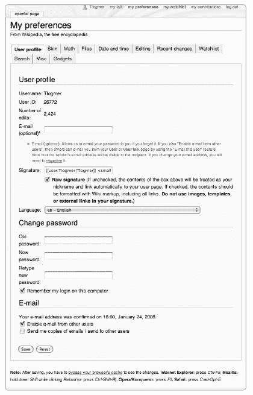

# 第十一章. 成为维基百科人

如果你已经创建了一个账户，编辑了几篇文章，并发现自己参与了维基百科的一些方面——无论是重写文章、撤销破坏行为，还是与其他用户讨论问题——你正在朝着成为维基百科人的方向迈进。*维基百科人*，当然，是那些使维基百科运转的个人——维基百科社区的成员。

维基百科的维基人，像任何大型在线社区一样，拥有流动而丰富的文化；他们甚至有自己的吉祥物，即*维基佩德* (图 11-1). 当你参与项目时，你会更好地了解这种文化。许多人发现自己手头有一些空闲时间，并决定在网站上做一些工作，但维基工作可以很愉快，甚至会上瘾，而编写百科全书文章最终会变得很有趣。在他们意识到之前，一些编辑被吸引并沉迷于维基百科。当你编辑文章时，你会了解到一些这些古怪而美好的人。

在本章中，我们将讨论如何创建账户（以及你在创建账户时需要考虑的一些事项），创建用户页面，个性化你在维基上的体验，并通过个人用户讨论页面与其他编辑交流。维基百科有不同的编辑账户类别，因为一些编辑成为了管理员，我们也将解释这个过程。


**图 11-1. 维基佩德，一个非官方吉祥物**

# 到达

有些人开始编辑，几天之内就知道维基百科很适合他们。其他人可能逐渐涉足其中，匿名进行校对，在创建账户并做更多工作之前。

如菲比所说：

> 我在 2003 年夏天鼓起勇气第一次编辑维基百科之前，已经阅读过有关维基百科的内容，并花了一些时间浏览。正是浏览让我决定开始编辑。在编辑之前，我仔细阅读了网站上的说明，而不是直接跳进去，但仍然需要保存几次才能正确使用语法。我编辑了[[珠宝]]，这个页面需要一些严重的修复。由于我多年来一直是一名业余珠宝匠，所以我感觉有资格从事这个页面的工作。尽管我对 HTML 和创建网页有一些经验，但我对维基编辑如此容易地显示出来感到惊讶。

如果你像其他人一样，发现自己在维基百科上定期工作，下一步合乎逻辑的步骤是创建一个账户（如果你还没有这样做）并自定义你的网站偏好设置。

## 注册账户

您不需要账户就可以编辑维基百科，但创建账户对所有贡献者都是推荐的。编辑有两个选项：他们可以注册账户并使用该用户名编辑，或者作为*匿名*或*IP 编辑*（指编辑未登录时通过 IP 号码显示的编辑方式）进行编辑。由于现在维基百科是一个非常公开和可见的地方，匿名编辑与选择用户名有一些影响，我们将在本章中回顾这些影响。如果您决定注册，您将遵循三个步骤来创建账户：选择一个合适的用户名，确保它是可用的，并填写一份简短的表格。

创建账户有几个原因。首先，它为您在网站上提供了一个与您的 IP 地址不同的*身份*。您将能够使用人们会记住的名字而不是一串数字来签署评论和讨论帖子。账户帮助您成为一个受信任的编辑，因为其他贡献者将用户名视为在网站上做有成效工作的承诺。其他人更有可能记住您，并且更愿意假设您的更改是好的。

第二，拥有用户名也使得与他人沟通和参与维基百科社区变得更加容易。如果您有账户，人们也可以通过“发送此用户电子邮件”功能向您发送电子邮件，而无需您向他们透露您的电子邮件地址。

第三，注册用户还可以获得一些编辑权限。在注册用户名后，您将能够创建新页面、将页面移动到新的标题，并上传图片。您还可以编辑*半保护*页面（参见第五章以了解这些页面的解释）。最后，拥有账户可以访问网站的用户特定功能，例如选择显示选项和偏好设置，以及维护您感兴趣的页面的自动化监视列表。

**自动确认**

当您首次注册账户时，您将能够创建新文章，但您仍有一些限制：您将无法移动页面或处理半保护文章。经过四天和十次编辑后，这些限制将自动解除。这被称为*自动确认*，并于 2005 年作为反破坏措施实施，部分原因是因为*页面移动破坏*（将好文章移动到不适当的标题）非常普遍。

### 隐私

隐私问题对任何使用互联网的人来说都很重要。关于是否在编辑时隐藏真实身份存在各种观点。然而，你应该知道，维基百科的用户名比大多数互联网论坛的用户名更为公开。维基百科的内容——包括用户页面和带有用户名的文章历史——被数百个其他网站镜像和存档。如果你担心隐私，意识到无论你选择什么用户名，它都肯定会出现在搜索引擎结果中，并且如果你在用户页面上或其他地方透露了真实姓名，它将与你相关联。

如果你希望在网站上保持绝对匿名，最佳的保护隐私方式是创建一个化名的账户，并在登出时永远不要编辑网站。实际上，未登录的所谓匿名编辑并不是最匿名的方式；在许多情况下，从 IP 地址编辑并不能保证你的身份完全未知。为了最大程度地保护隐私，选择一个之前未在线使用过的全新化名。

维护贡献者的隐私是维基百科上的一个重要问题。官方隐私政策已在第三章中提及，但在此我们讨论了每个人在参与网站时应了解的内容。基本要点如下：

+   维基百科尊重任何人在匿名（未登录）或化名（通过账户）的情况下贡献内容的权利。

+   维基百科不提倡或反对在网站上使用真实姓名。

+   匿名编辑者的 IP 地址会被显示。

+   在用户页面上披露个人详细信息既不建议也不反对成年人这样做。然而，未成年人被建议**不要**发布关于自己的身份识别信息。

+   用户意外披露个人详细信息以及意外登出时的 IP 地址，可以通过*监督*过程从页面历史中删除。这是一个可能半永久性地删除页面特定编辑的过程，并且仅在特殊情况下进行。监督请求提交给拥有监督权限的小组编辑。更多信息请参阅[[Wikipedia:Oversight]]。

+   揭露其他用户的个人详细信息违反了维基百科的规范和价值观，被视为骚扰（见 WP:HARASS）。换句话说，永远不要发布关于其他人的个人详细信息，即使你确信这些信息已经是公开知识。

+   在极少数情况下，登录用户的 IP 地址可能被用于调查问题用户。这些调查是通过 CheckUser 工具进行的，该工具仅限于一小群受信任的编辑，并且结果永远不会公开。更多信息请参阅[[Wikipedia:Checkuser]]和用户级别下的“用户和管理员”。

重复一遍，如果您担心您的隐私，第一步是创建一个账户，如果您担心匿名性，请使用化名。

### "匿名"编辑

无论何时您在不登录账户的情况下编辑维基百科，您的 IP 地址都会显示在页面历史记录和最近更改中。*IP 地址*是您的计算机用来向网络标识自己的地址。由于 IP 编号的所有者通常可以通过 whois 搜索和其他更高级的方法轻松追踪，因此 IP 编辑不是匿名的。匿名编辑透露的信息量各不相同。IP 地址并不总是标识单个计算机；*动态*IP 地址，如许多互联网服务提供商和无线热点使用的，可能仅揭示所使用的互联网提供商。

如果您在未登录的情况下编辑，您可能会泄露与您账户的其他编辑相近的 IP 编号；在流量较小的文章中，其他人可能会将两件事联系起来。如果您担心这一点，您可以使用除默认的 Monobook 以外的皮肤，仅作为对此可能性的警告；然后网站未登录的视图将与登录时看到的视图非常不同（有关如何做到这一点，请参阅自定义皮肤和安装扩展）。

登录还有其他原因：不仅账户名称比 IP 地址更私密（如果您对匿名性很重要），而且像学校、公司网络或代理服务器这样的共享 IP 地址经常因破坏行为而被封锁，这往往会影响同一网络上的许多无辜的编辑。然而，如果您有账户并且处于良好状态，并且您受到了这样的封锁影响，您可以要求修改封锁，使其仅适用于匿名编辑。

**维基百科扫描器**

创建了一个公共工具，该工具关联了多年来（超过 3000 万，从 2002 年开始）的 IP 编号编辑与公司和教育机构的 IP 地址范围。这个名为 WikiScanner 的工具是由加州理工学院的 Virgil Griffith 构建的；您可以在[`wikiscanner.virgil.gr/`](http://wikiscanner.virgil.gr/)找到它。因此，您可以发现匿名编辑并将它们与它们的来源相匹配。这意味着，正如几篇报纸文章在 2007 年高兴地指出，可以检查政治家办公室使用的 IP 地址范围，看看从那里编辑的人是否以违反 NPOV 的方式更改了该政治家的文章——这种情况偶尔会发生。

### 用户名和真实姓名

当您创建账户时，您必须选择一个用户名。这个用户名可以是您的真实姓名或化名。不要随意做出这个选择。您可以使用您的真实姓名、首字母缩写或名字的首字母或姓氏作为专业的方式来展示自己。许多人编辑网站时都使用他们的真实姓名（包括本书的作者）。根据一个人的名字有多常见，贡献可以更容易地追溯到个人，例如，这可以提供证实声称的专业知识的一种方式。另一方面，选择化名的优点是它提供了一定程度的真实匿名性。化名在网站上完全可接受并且广泛使用。无论您选择什么名字，如果您做出重大贡献，您就会以这个名字为人所知。选择一个您在严肃讨论和辩论中感到舒适的用户名。

维基百科为用户名制定了一些常识性指南，旨在最小化协作工作中的干扰。用户名不能是骚扰性的、误导性的、混淆的、促销性的或冒犯性的。这些品质的构成最终由审核新账户的管理员决定；如果用户名违反了这些指南，管理员将禁止使用，并要求编辑选择其他名称。"骚扰性"的用户名是指旨在打扰他人的名称，例如包含对特定用户的攻击。 "误导性"意味着模仿另一个知名人士或维基百科编辑，而"混淆性"则意味着视觉上令人困惑（例如只有一和零）。 "促销性"的用户名是指旨在推广或与商业或团体相同的名称；因此，不要使用您公司的名称作为用户名。最后，"冒犯性"的用户名是指其他人可能会觉得非常冒犯，以至于无法进行积极的协作编辑的名称；任何侮辱性陈述或使用粗俗语言的名字通常都会被排除在外。

此外，英语维基百科的用户名不应包含非西文字符，这可能会让英语使用者难以阅读和识别。最后，用户名不能是一个完整的电子邮件地址。

注意，用户名遵循与文章页面名称相同的规则。它们是区分大小写的——user:Thomas jefferson 与 user:Thomas Jefferson 不相同——名称的第一个字母总是大写，尽管您可以通过自定义签名使其显示为小写，如稍后在 "设置您的签名"（设置您的签名 下的“设置你的签名”部分中详细说明。

如果你正在考虑创建第二个账户以编辑，同时保持你的原始账户——不要这么做。虽然拥有两个账户并不完全违反网站规则，但违反关于 sockpuppetry 规则的可能性相当高。

*sockpuppet* 是一个已经拥有账户的维基编辑者使用的第二个用户名。维基百科的政策禁止使用多个账户来误导他人；例如，创建另一个账户来支持你在争论中的立场或在一个投票中多次投票。维基百科账户不应用作面具，那些这样做的人通常会失去编辑权。

你也不应该要求其他人为你创建账户；由其他编辑控制的账户被称为 *meatpuppet*。使用多个账户来操纵或欺骗网站上的他人是不可接受的。潜在的 sockpuppet 通过 [[Wikipedia:Suspected sock puppets]]（快捷键 WP:SSP）或 [[Wikipedia:Requests for checkuser]]（快捷键 WP:RFCU）进行追踪。这两个过程是为了确定 sockpuppet 是否被使用。在某些情况下，出于无辜的原因运行额外的账户是可以接受的；这些情况在 [[Wikipedia:Sock puppetry]]（快捷键 WP:SOCK）下有详细说明。

另一个需要避免的陷阱是共享密码。不要让其他人使用您的账户。拥有多个用户的账户可能会被封锁，并且“角色”账户，如企业或团体账户，是被禁止的。

### 用户名是否已被占用？

在尝试注册用户名之前，您不必确保该用户名可用：系统会告诉您该用户名是否已被占用。因此，关于浏览用户名的这一部分是可选的，但阅读它可能会节省您一些挫败感，或者可能在稍后的某个时刻有用，比如在提出更名请求时。如果您想知道某个特定的名字是否已被占用，维基百科提供了一些方法来找出答案，而不仅仅是尝试注册该名字。

您可以先查看用户是否在[[User:Nameofuser]]设置了用户页面。这种方法远非万无一失，因为注册用户没有义务设置用户页面，而且很多人都没有设置。另外，如果您正在寻找的名字很独特，您可以使用搜索引擎在整个网站上搜索它，这很快就能完成。

检查名字是否已被注册的更好、更系统的方法是访问[[Special:Contributions]]页面。在 IP 地址或用户名字段中输入您要查找的用户名。如果该用户名做出了任何贡献，它们将显示在这个页面上。然而，注册的名字通常很少使用，所以没有找到贡献历史并不意味着该名字未被占用。但您可以找出名字是否已被注册：在[[Special:Contributions]]页面上输入您感兴趣的名称后，查看直接位于*来自维基百科，自由百科全书*下的名字链接。如果该名字已被注册，它将显示为蓝色或红色链接。蓝色链接会带您到用户页面。红色链接表示用户页面尚未设置，但名字已被注册。如果名字变灰，则表示该名字未被注册。

最后，如果您想浏览用户名列表，您可以访问[[Special:Listusers]]，这是一个所有注册用户名的长列表。其中大多数是一次性账户，由破坏者注册，或者注册后从未使用。然而，这个列表的一个有用之处是，您可以在“显示用户从”文本框中输入一个用户名，然后查看所有以您输入的字母开头的注册用户。

**管理员名单**

特殊页面[[Special:Listusers]]也可以用来获取所有也是管理员的编辑者的名单（尽管这不会帮助您确定哪些管理员在网站上活跃）。只需选择“组别：管理员”而不是“组别：所有”即可获得管理员名单。您可以在[[Wikipedia:List of administrators]]找到按最近几个月活跃编辑排序的管理员名单。

### 创建账户

一旦您选择了想要注册的名字，创建账户就很简单了。只需在屏幕右上角点击“登录/创建账户”，然后点击“*没有账户？*”旁边的“创建一个”链接。按照出现的表单说明（图 11-2 的确认电子邮件；点击电子邮件中的链接是使用您的电子邮件地址的必要步骤。

完成这些步骤后，您就完成了！现在您可以使用新的用户名进行编辑，创建新页面，创建用户页面，并设置您的偏好和观察列表（本章中均有描述）。如果您在自己的电脑上编辑，登录时可以勾选“记住我”选项，这样每次编辑时就不需要再次登录。

## 设置您的偏好

您可以作为注册并登录的用户设置多项偏好。一旦登录，只需点击页面右上角的“我的偏好”链接，即可设置和重置任何选项。这些包括您点击“最近更改”时看到的设置、日期和时间的显示方式、您的搜索偏好、编辑窗口的工作方式，甚至图像的显示方式。您还可以自定义您的**皮肤**，这将改变网站的视觉外观。


**图 11-2. 创建账户表单**

**关于密码的注意事项**

安全的密码应包含字母和数字，并避免使用词典中的单词。如今，通常应该选择具有这种安全程度的密码。尽管选择安全的密码不是**必需**的，但维基百科强烈推荐这样做。维基百科的密码可能短至三个字符，但出于安全考虑，通常应该更长。

如果您在网站上活跃了很长时间或成为了一个突出的编辑，偶尔更改您的密码。管理员密码是密码破解者眼中的诱人目标，2007 年早期发生了一起紧急撤消管理员权限的事件，当时有几个账户被黑客入侵。这种情况虽然不常见，但通过使用安全的密码完全可以预防！

点击“我的偏好设置”将带您到[[特殊:偏好设置]]，在那里显示了一个选项菜单（图 11-3). 每个选项卡都引导到一个您可以自定义的选项集。



**图 11-3. 我的偏好设置窗口**

一些偏好设置，如以下所述，应具有高优先级：

**启用电子邮件**

如果您在注册网站时没有提供电子邮件地址，您可以在“我的偏好设置”页面的第一个选项卡（用户资料）中提供。 （您将需要回复确认电子邮件。）如果您提供了电子邮件地址并勾选了“启用其他用户”框，任何人都可以通过左侧侧边栏上的“通过电子邮件发送此用户”链接从网站向您发送电子邮件，但您的电子邮件地址不会被公开，那些给您发邮件的人将看不到它。提供电子邮件地址不应导致垃圾邮件问题。尽管关于内容的讨论最好发布在讨论页面上，但离站机密通信最好通过电子邮件进行，因为任何留在讨论页面上的消息都是公开的。尽管如此，管理员并不总是启用此选项，因此这绝对不是必需的。您也可以在用户资料选项卡下更改您的电子邮件地址；如果您这样做，每次都会收到一封电子邮件，要求您验证您的账户。只需点击电子邮件中的链接即可完成验证。

**密码和验证**

我们已经提到，提供一个有效的电子邮件地址是如果您忘记密码时*唯一*的找回方式。您也可以在任何时候在用户资料选项卡下重置您的密码。

**重置时钟**

精确的时间戳出现在维基百科的各个地方——在编辑历史记录中，在讨论页面的签名中等等。要将时间更改为您所在的时区，请转到“我的偏好设置”并点击“日期和时间”选项卡。在那里，您可以从浏览器中填写时间或设置特定的时区。您还可以选择日期的显示方式。默认情况下，时间戳指的是协调世界时（UTC）时区。从所有实际目的来看，UTC 是格林尼治标准时间，这可能是作为选项的困惑之处。设置您的时区偏好意味着所有时间戳都将相对于您所在的本地时间显示。

其他设置，如这些，并不那么关键，您可以在方便的时候修改它们：

**设置编辑窗口的大小**

在“我的偏好设置”中的“编辑”选项卡允许您在点击“编辑此页面”时自定义编辑窗口的大小。例如，如果您在大屏幕显示器上编辑，您可能希望将默认的 25 行和 80 列文本调整到更大的尺寸。要这样做，只需在此处输入新数字并点击保存。相反，如果您使用的是小型笔记本电脑或手持设备进行编辑，您几乎肯定希望将编辑窗口调小。

此页面的其他选项可以帮助您找到适合您作为编辑偏好的工具。例如，如果您在浏览维基百科时经常编辑页面，尝试开启双击编辑页面功能，这样每次您双击一个可编辑的维基百科页面时都会打开一个编辑窗口。如果您是编辑新手（或正在尝试训练自己），尝试开启在输入空白编辑摘要时提示我选项。

**特殊搜索**

在搜索标签页下，您可以自定义默认搜索的命名空间，如果您经常在项目命名空间中搜索材料，这可能很有帮助。虽然您始终可以像在第三章中描述的那样更改每次想要搜索的命名空间，但您可以通过在这里进行自定义来节省一些时间。

**显示**

您还可以设置某些元素的显示方式：选择您在“文件”标签页上查看图片和在“数学”标签页上查看数学方程式的方式。例如，如果您从手持设备上阅读维基百科，您可能希望将默认缩略图大小设置为尽可能小。

### 设置您的签名

您可以通过在讨论页面上使用四个波浪号来修改签名在生成时的标准显示方式。标准签名包括您的用户名，链接到您的用户页面，以及一个链接到您的讨论页面，并显示编辑的时间和日期：

```
Phoebe (talk) 01:47, 30 September 2007 (EDT)
```

您可以使用维基语法和 HTML 来自定义您的签名。在“我的偏好”中的“用户资料”标签页上，在签名框中输入您想要的代码，然后勾选“原始签名”框。例如，将以下代码放入签名框中，勾选“原始签名”框，然后保存：

```
[[user:myname|myname the great]] -- [[user_talk:myname|talk to me!]]
```

意味着您将在使用 ~~~~ 签名页面时插入以下内容：

```
myname the great -- talk to me! 01:47, 30 September 2007
```

如果您在讨论和项目页面上浏览，您会看到许多这样的签名，有些只是简单地通过添加链接到讨论页面或贡献进行了定制，有些则使用了与默认不同的字体和颜色。生成这些签名的代码在页面的维基文本中可见。

虽然以这种方式成为一位色彩斑斓的角色可能很有吸引力，但彩虹签名和非常规脚本并不是真正原创的想法，而且使用大量额外代码生成的签名实际上对其他编辑者来说可能适得其反。谁愿意在一个已经签了十几次名之后还要在讨论页面上导航额外的维基语法？花哨的签名并不是一个让人认真对待的方式——最好将定制保持到最低限度。坚持使用文本，不要使用图片，并记住过于侵入性的签名只会让其他人感到烦恼——甚至不要考虑使用闪烁标签！页面[[Wikipedia:Signatures]]（快捷键 WP:SIG）讨论了使用和定制签名的指南。

### 定制皮肤和安装扩展

媒体 Wiki 页面的整体外观、布局和风格由*皮肤*或 CSS 文件决定，这些文件用于美化网站。用户可以选择并更改皮肤。默认情况下，维基百科使用的是*Monobook*皮肤，如果你未登录，你将看到的就是这个皮肤。这是世界上大多数人认为的维基百科的外观和感觉。默认皮肤也包含在每个 MediaWiki 安装中，因此你会在整个互联网上看到它。如果你对网站的外观没有明确偏好，继续使用 Monobook 通常是个好主意，因为 Monobook 在帮助页面描述中有所体现，并且也会随着新网站功能的更新而保持更新。

### 注意

*如果屏幕上的文本太小，大多数浏览器允许你更改文本大小或缩放视图以提高可读性。在 Firefox 中按 CTRL-+可以使窗口中的所有文本变大*。

在编写这本书时，我们引用了 Monobook 皮肤中页面上的标签和链接。你可以选择的其它皮肤渲染页面略有不同；并非所有链接在所有皮肤中都是可见的，它们的放置也可能不同。要切换到另一个皮肤，只需登录，点击“我的偏好”，然后在“皮肤”标签中选择你想要的皮肤。如果你不喜欢，你总是可以改回来！

皮肤还可以以其他方式自定义，许多人也开发了他们自己的皮肤。你可以在展示区看到一些，在 Meta 的用户样式画廊（见“进一步阅读”在用户页面、监视列表和编辑次数）。

你还可以通过自定义自己的 JavaScript 或 CSS 文件来修改你在维基百科上的体验。除此之外，这还允许你安装许多已经开发的扩展和其他修改，或*用户脚本*。每个皮肤的 JavaScript 文件都位于你的用户空间中的*nameofskin.*js*；因此，你可以找到 Monobook，默认皮肤的 JavaScript 文件，位于*yourusername*/monobook.js*。你必须有一个账户并登录才能利用脚本和修改。

**弹出窗口**

一个流行的扩展名为*弹出窗口*。当你将鼠标悬停在内部链接上时，这允许你看到文章的预览（包括文本的第一段或如此以及页面上的第一张图片）。弹出窗口还提供了一个包含一系列快速选项的菜单，例如查看文章的历史记录或最后的差异——这对于破坏巡查非常有用。弹出窗口最初是由用户 Lupin 开发的。你可以通过访问“我的偏好”中的“小工具”标签并勾选启用它们的框来轻松安装弹出窗口。你还可以通过自定义你的*monobook.js*文件来安装它们，该文件位于*username*/monobook.js*。更多详情请参阅[[Wikipedia:Popups]]。

脚本的范围从在侧边栏添加您自己的自定义链接，[[Wikipedia:Tools/Navigation shortcuts]]，到在页面顶部添加额外的自定义标签。您可以在 [[Wikipedia:WikiProject User scripts/Scripts]] 找到脚本列表和有关安装它们的更多信息。其他自定义工具也可以在“我的偏好”中的“小工具”标签页中找到。

**进一步阅读**

创建账户

[`en.wikipedia.org/wiki/Wikipedia:Why_create_an_account`](http://en.wikipedia.org/wiki/Wikipedia:Why_create_an_account) 创建用户账户的好处概述，以及创建账户表单的链接

[`en.wikipedia.org/wiki/Wikipedia:Username`](http://en.wikipedia.org/wiki/Wikipedia:Username) 官方的用户名政策以及指南和如何处理用户名的概述

[`en.wikipedia.org/wiki/Wikipedia:Changing_username`](http://en.wikipedia.org/wiki/Wikipedia:Changing_username) 请求更改用户名的页面

[`en.wikipedia.org/wiki/Special:Listusers`](http://en.wikipedia.org/wiki/Special:Listusers) 自动生成的所有注册账户的列表

[`meta.wikimedia.org/wiki/Right_to_vanish`](http://meta.wikimedia.org/wiki/Right_to_vanish) 关于消失权的合格信息

设置偏好

[`meta.wikimedia.org/wiki/Help:Preferences`](http://meta.wikimedia.org/wiki/Help:Preferences) 关于用户偏好设置，包括皮肤

[`en.wikipedia.org/wiki/Wikipedia:Signatures#Customizing_your_signature`](http://en.wikipedia.org/wiki/Wikipedia:Signatures#Customizing_your_signature) 关于自定义您的签名

[`en.wikipedia.org/wiki/Wikipedia:Tools`](http://en.wikipedia.org/wiki/Wikipedia:Tools) 使用维基百科的各种工具

[`meta.wikimedia.org/wiki/Gallery_of_user_styles`](http://meta.wikimedia.org/wiki/Gallery_of_user_styles) 媒体 Wiki 用户开发的皮肤画廊（用于使用维基百科，以及在其他网站上使用 MediaWiki）

[`meta.wikimedia.org/wiki/Help:User_style`](http://meta.wikimedia.org/wiki/Help:User_style) 您可以自定义的 CSS 和 Javascript（适用于高级用户）

[`meta.wikimedia.org/wiki/Skins`](http://meta.wikimedia.org/wiki/Skins) 创建您自己的皮肤的说明

# 用户页面、关注列表和编辑次数

如果您有用户名，您将有一个以 [[User:*您的用户名*]] 形式的用户页面。在这里，您可以发布有关您自己的信息，以供其他编辑者参考，以及为自己记录的笔记（例如，您经常使用的项目页面列表）。请注意，用户页面不是个人网页：维基百科不是 MySpace。维基百科对用户页面有一些常识性指南，如此处所述；否则，您可以自由发布您想要的任何内容。

如果你从未编辑过你的用户页面，它将显示为一个红色链接。尽管这在某种程度上是受到尊重的，但未编辑你的用户页面不会激发人们对你在维基百科上承诺的信心。建议至少添加一些信息到你的用户页面。对于真的不想有用户页面的用户，一个选项是将他们的用户页面重定向到他们的用户讨论页面（在[[user_talk:*你的用户名*]]）。这意味着当你签署讨论页面的信息时，你的用户名将显示为蓝色链接，但点击它的人将被引导到你的讨论页面留言。

你添加到用户页面的内容由你自己决定。列出你的兴趣和专长当然很有帮助——或者至少是你想在维基百科上从事的工作。例如，告知其他编辑，如果你的编辑是在你知识渊博的领域，或者只是作为一个爱好。这将帮助其他有相同想法的编辑找到你。你还可以在你的用户页面上列出你在网站上所做的工作：你撰写或参与的文章等。这种自夸的清单不仅帮助你跟踪你所做的工作，还向他人展示了你所取得的成就和你主要的编辑兴趣所在。在你的用户页面上展示你对工作的自豪感是恰当的！

许多编辑者也列出了他们所使用的语言——这是一个对国际项目有礼貌的举动。如果你是多语言的，可能会有人请求你帮助翻译。维基百科有一系列标准化的语言模板，就是为了这个目的。它们包含语言代码（如*en*或*fr*）和一个从 1 到 4 的数字以及*native*。这些数字表示熟练程度：*1*表示你是一个初学者，而*native*表示这种语言是你的母语。这些语言模板可以在[[Wikipedia:Babel]]（快捷键 WP:BABEL）找到。

## 用户页面内容

维基人的方式是在网站上重视自发性，而不是正式性。然而，当你开始在用户页面上发布大量信息时，你应该采取深思熟虑的方法。记住这三个概念：隐私，我们已经在前面提到过；权威，我们在第二章中详细讨论过；以及中立性。

本书作者愉快地在维基百科上使用他们的真实姓名——你可以通过谷歌立即发现这一点。在维基百科上发布的任何内容都可能变得*非常*公开，如果你使用真实姓名，你的用户页面可能会开始在谷歌搜索结果中上升，关于你的名字。如果你添加照片、位置或任何其他关于自己的可识别信息，尤其是如果你不希望你的身份在维基百科上与其他在线存在或公共角色相联系，请记住这一点。为了强调这一点，搜索*查尔斯·马修斯*——一个相当常见的名字——现在会直接链接到一位作者在搜索引擎前几个结果中的个人用户页面。此外，如果你对参与网站的管理方面感兴趣，这可能会引起争议。任何披露都可能吸引网络跟踪者；在少数情况下，管理员的对手已经追踪到现实生活中的信息，如电话号码。除非你参与有争议的行为，否则这种情况不太可能发生；然而，与任何在线论坛一样，这种可能性是一个真正的担忧。在这种情况下，维基百科本身能做的非常有限。

学术领域的资格增加了编辑的声誉。你应在你的用户页面上提及这项资格吗？列出艺术史博士学位不会让你立即被识别。它也不应该为你的艺术史编辑提供支持，以对抗那些认为他们已经发现了错误的人；然而，那些不相信你的艺术文章编辑的人可能会更倾向于在插入他们的更正之前检查自己的事实。许多编辑将编辑维基百科视为一项专业活动，不亚于在其他百科全书或值得他人尊重的学术作品中工作。如果你在您的领域内知名或被认可为专家，证明这一点的方法之一就是使用你的真实姓名作为用户名，并在你的用户页面上使用专业语气。你可以使用化名来减少你的真实姓名的突出度，但不要在你的用户页面上隐瞒你的真实姓名。

当你考虑发布你的隶属关系时，比如政治或宗教，你工作的公司，或你追求的任何活动，就会有一套不同的考虑因素。在某些更具争议性的领域编辑之前，这可以被视为*声明利益*。如果你这样做，你的编辑将受到其他编辑更严格的审查，以确保严格的中立性。自我认知在这里很有帮助。尽管你对某个政党有承诺，但你真的可以在编辑政治文章时保持中立，那么你的良好编辑声誉将会增长。然而，如果你真的无法对你工作的公司保持中立（许多人会认为这很难），那么如果你编辑关于该公司的文章，你的声明可能会使情况变得更糟。然而，公正的人会始终给你一些诚实信用，即使你是公开的党派成员。

### 指南

维基百科对您可以在用户页面上发布的内容有一些限制。指南在[[维基百科:用户页]]（快捷键 WP:UP）。例如，您不能将用户页面用于博客、活动家运动或其他仅仅将其视为免费网络空间的方式。用户页面旨在帮助维基百科编辑的社区，以对抗性的方式使用它们（例如，不喜欢用户的黑名单）是错误的。

您的用户页面也不是提出不满的正确地方，因为其他人没有权利在那里回复您（尽管他们可能在您的用户讨论页面上留言）。按照惯例，没有您的邀请，其他人不应编辑您的用户页面，尽管对它的明显破坏可能被其他人撤销。

**用户框和框战**

在英语维基百科的历史上，有一件不太引人注目的事件发生在 2006 年初，这是一场关于现场政策一个明显小事的巨大争议。*用户框（boxen，对那些对其在项目中的核心地位持怀疑态度的人来说）是设计用来放置在用户页面上以帮助各种类型自我识别的小矩形模板*。“这个用户是天蝎座”是一个无害的例子。但“这个用户喜欢色情”或“这个用户支持 2008 年的参议员约翰·麦凯恩竞选总统”呢？或者关于讽刺语言框“这个人不懂胡说八道（或相当困难地理解）”呢？或者“这个用户是 wiccan？”这些都是真实例子。问题是这些是否对网站有帮助，在某些情况下是否具有煽动性，以及是否应该允许它们存在。

最初的用户框是之前提到的语言模板，但用户框的风潮在 2005 年底新编辑大量涌入后迅速崭露头角。一旦这种风潮流行起来，就出现了针对宗教、政治、粗俗和性等所有问题的用户框。这些用户框成为了一场热烈的争论的焦点，本质上关于言论自由；问题是维基百科是用户的一个自由论坛，还是需要一个监管的工作环境。

已经创建了成千上万个用户框，删除那些明显只是为了测试维基百科允许自由表达和自我认同的程度而创建的用户框花费了一些时间，并且关于一些用户框发生了很多争论（包括一个显著的管理员编辑冲突案例）。最终，通过一些关于命名空间的决策解决了这场辩论；现在保存在用户命名空间（而不是模板命名空间）中的用户框现在不那么“官方”了。然而，关于用户页面可能包含的内容（无论是否框起来）的争论仍然存在。然而，维基百科不是一个专门的讨论论坛，普遍共识是，网站上的自我认同应该有助于项目，而不是被视为一个目的本身。有关争议的平静描述和可能想要使用的用户框列表，请参阅[[维基百科:用户框]]（快捷键 WP:BOX）。[[维基百科:WikiProject 用户框]]已经接管了这个曾经有争议的领域。

这些指南适用于用户空间，包括子页面。用常识来说，这些指南意味着任何有利于项目的内容都可以发布；其他内容则不应发布。

### 用户讨论页面

拥有一个用户页面就会有一个用户讨论页面。这是其他人可以留下关于你的工作、你正在撰写的文章等内容的地方。一个典型的用户讨论页面会积累来自其他编辑关于文章内容、正在进行的项目和贡献的笔记和问题；来自用户所属的 Wiki 项目的通知；以及偶尔的投诉和节日问候。你用户讨论页面上的早期消息可能很可能是自动生成的或由模板创建的。请别将此视为维基百科的典型情况：人类互动是被重视的。在维基百科社交生活中非常重要的讨论页面上的通用互动将在第十二章中进一步描述，但这里也适用基本的规则*友好相处*。

### 注意

*如果你有一个具体问题但还不知道在网站上哪里可以找到答案，你可以在你的用户讨论页面上添加* *`{{helpme}}`* *模板。你应该会在你的讨论页面上收到一个活跃编辑的回复*。

大多数用户讨论页面使用传统的简单结构，其中每条信息都作为一个新的部分（在信息标题周围使用两个等号，==，以产生部分标题）。新信息添加在底部。如果对话产生了几个来回回复，为了可读性，任何进一步的评论都应该缩进，以产生类似文章讨论页面的线程讨论。最后，所有信息都应该用四个波浪号（~~~~）签名，以插入评论者的用户名和日期。正如在阅读和参与讨论页面中的“讨论页面”所描述的，每次你在你的讨论页面上收到信息时，下次你登录时，一个橙色的通知框（见图 4-6)会自动弹出，让你知道（当你通过访问你的讨论页面“检查你的信息”时，这个通知就会消失）。

你有权保持你的用户讨论页面整洁：如果你收到很多信息，定期将页面存档到子页面（见起草文章中关于用户子页面的描述和[[Wikipedia:用户页面]]上的指示）。虽然忽略你讨论页面上留下的任何令人讨厌的信息是最好的，但你也可以删除它们，尽管删除关于内容的合法讨论通常不是一个好主意。

如果你有一个问题或评论要留给其他用户，请随意前往他的或她的用户讨论页面留言。你应该有礼貌（显然），但不必过分谄媚。一个好的起点是假设维基百科是一个工作环境——所以说出你需要说的话，保持相当的商业风格。对于某些讨论，你可能考虑请求进行电子邮件交流。你联系的用户在阅读后（甚至是在阅读之前）可以自由删除你的信息。这不是一个需要引起争议的问题。

当你在其他用户的讨论页面上开始讨论时会发生什么取决于你联系的用户。从逻辑上讲，在[[用户讨论:BeanStalkJack]]上开始的线程将在这里继续，[[用户:BeanStalkJack]]将回复为他留下的信息。你也可以要求对话在你自己的用户讨论页面上继续：只需在签名前加上“请在我的用户讨论页面上回复”即可。如果不这样做，你将不得不监控[[用户讨论:BeanStalkJack]]以获取任何答案。在继续之前，你可能点击“监视”标签；然后你只需要记住查看你的监视列表。一些用户仍然会在你的用户页面上回复。

您经常有选择在哪里进行因文章编辑而产生的讨论。您应该在文章的讨论页面上写些什么，还是最好去编辑者的用户讨论页面上？在文章的讨论页面上，所有相关的人都可以发表意见，所以如果您对文章有一般性的担忧，请在这里发表。如果您想就编辑者的某个工作方面或关于特定编辑的问题进行交流，那么请在该编辑者的用户讨论页面上发表。

## 关注列表

您的*关注列表*定义了您在庞大的维基百科网站上的个人角落。它显示了一组您特别选择关注的页面子集的最新更改。使用关注列表意味着您可以轻松扫描您感兴趣的页面或文章的编辑列表，而无需逐个访问这些页面。通过维护关注列表，您可以帮助打击破坏行为，同时保持网站整洁，并监控您最感兴趣的话题。您的关注列表是私密的——只有您才能访问它。

当您登录时，您可以通过点击右上角“我的偏好”链接旁边的“我的关注列表”来访问您的关注列表。

关注列表显示（图 11-4

**图 11-4. 登录用户的观察列表**

### 注意

*当您观察一个页面时，您也在观察其相关的讨论页面；因此，如果您观察一篇文章，对文章或其讨论页面所做的任何更改都将被列出*。

观察列表在大小上没有限制，但随着时间的推移，列表往往会增长，您对页面的兴趣可能只是暂时的。例如，在用户讨论页面的讨论中，您可能会观察发生活跃辩论的页面。但是当它结束时，您可能不再有进一步的理由被提醒所有更改，因此您可能希望从观察列表中删除该页面。默认情况下，您创建的任何页面都会添加到您的观察列表中；您可以从“我的偏好”下的观察列表标签页选择其他选项。


**图 11-5. 特定差异中更改的字节数，在观察列表中指示**


**图 11-6. 文章顶部的观察标签页**

**观察列表和相关更改**

观察列表易于使用，但它们完全是私人的。如果您想为联合项目或公共待办事项列表创建一个整洁的共享观察列表，或者如果您想一起观察相关的一组页面，您可以使用相关更改功能。在您的用户空间中创建一个子页面，其中包含您感兴趣的文章的链接列表。从该页面（在工具箱左侧的侧边栏中）点击“相关更改”将显示这些页面的任何更改（尽管不是它们的讨论页面）。如果您想包含不会公开显示的链接，请在 [[*主题*]] 旁边添加一个像 [[Talk:*主题*|]] 这样的链接；该链接不会显示在页面上，因为它没有连接到任何替换文本，但相关更改会记录该更改。

## RSS 通知

您还可以创建关于特定页面编辑的其他类型的通知或警报。如果您只对少数页面感兴趣，这将很有帮助。

要创建任何页面的更改的 RSS 源或 Atom 源（RSS 的替代品），请按照以下步骤操作：

1.  前往您感兴趣的页面，并点击文章顶部的“历史”标签。

1.  现在，查看左侧边栏菜单中的“工具箱”。

1.  您将看到两个用于源选项的链接（在“相关更改”下）：RSS 和 Atom。您可以将这些链接添加到任何其他源一样添加到源阅读器中。

该源将显示为差异页面（图 11-7

**图 11-7. 对页面[[树列表]]所做的更改的 RSS 源**

检查一个编辑的贡献历史可以告诉你他或她最近在做什么。但这个显示方式对于确定某人的总编辑次数来说不方便，尤其是如果该编辑已经编辑了数千次以上。你可以通过检查“我的偏好”来监控自己的编辑次数；计数显示在用户名下方。要检查另一个贡献者的编辑次数，除了[[Special:Contributions]]（它提供了编辑列表但未提供总数）之外，你还可以使用几个自动工具来为特定用户名计数编辑次数。这些工具可以在[[Wikipedia:WikiProject edit counters]]找到。一个注意事项是，这些编辑计数器作为娱乐工具提供，而不是作为关键项目工具，它们往往会离线或不可预测地撤回。要查看顶级贡献者，维基百科有一个列表，该列表更新但不总是定期更新，在[[Wikipedia:List of Wikipedians by number of edits]]（快捷键 WP:WBE）。这个列表目前可以让你了解大约 3,000 名顶级编辑的编辑次数；截至 2008 年，你需要至少有 5,000 次编辑才能出现在这个列表上。

编辑次数很重要，因为这个指标是典型的用于在选举中赋予编辑投票权（例如，在过去的几年里，维基媒体基金会董事会成员的选民必须在一个维基媒体维基上至少有 400 次编辑），因此，拥有一定的编辑次数可能在只有社区成员可以参与的选举中获得投票权。此外，管理员候选人的编辑次数和模式也备受争议（尽管没有特定的数字要求，但在“管理员”部分描述的“管理员请求”中，通常需要低至数千次或更多的编辑次数才能通过），换句话说，编辑次数是衡量一个人作为维基百科编辑经验的一个指标。

编辑次数虽然有些用处，但并不完全。尽管编辑次数与编辑维基百科的经验相关，但这种相关性是粗略的。不要因为某人找不到预览按钮就对他产生更好的看法。原始的编辑次数是粗略的，缺乏区分——无论是修正错别字还是撤销破坏行为，都与添加深思熟虑的内容或参考文献同等对待，尽管任何真正感兴趣的人都可以，当然，抽样查看一个账户的贡献并得出关于编辑工作质量的更好结论。历史上，最投入的个人编辑，通常编辑，每月贡献的峰值约为 3,000 次编辑，或每天 100 次。这个速度需要充分利用空闲时间，并且没有维基百科之外的生活，这种速度不一定可持续。

原始编辑计数工具的作者指出，*编辑计数症*，或对编辑计数概念的病态迷恋，可能是致命的。编辑计数症通常是*维基百科狂热症*的症状，这是一种更糟糕的疾病。唯一确定的疗法是更多地关注您编辑的质量而不是数量。您已被警告；前往 [[维基百科：维基百科狂热症测试]] (快捷键 WP:WHT) 获取幽默的诊断。

**进一步阅读**

[维基百科：用户页](http://en.wikipedia.org/wiki/Wikipedia:User_page) 用户页指南

[维基百科：用户框](http://en.wikipedia.org/wiki/Wikipedia:Userboxes) 用户框指南

[维基百科：讨论页](http://en.wikipedia.org/wiki/Wikipedia:Talk_page) 阅读讨论页面的介绍（包括用户讨论页面）

[维基百科：讨论页指南](http://en.wikipedia.org/wiki/Wikipedia:Talk_page_guidelines) 在讨论页面上工作（包括用户讨论页面）的基本原则和指南

[维基百科：帮助：监视页面](http://en.wikipedia.org/wiki/Help:Watching_pages) 使用监视列表和不同的监视列表选项的帮助

[从维基百科获取 RSS 订阅的说明](http://en.wikipedia.org/wiki/Wikipedia:RSS) 以及您可以从网站的哪些区域获取 RSS 订阅

[维基百科：WikiProject_edit_counters](http://en.wikipedia.org/wiki/Wikipedia:WikiProject_edit_counters) 获取将计算另一位贡献者总编辑次数的编辑计数器的地方

[维基百科：特殊：贡献](http://en.wikipedia.org/wiki/Special:Contributions) 您可以在此页面上获取任何 IP 地址或用户名做出的贡献列表

[维基百科：按编辑次数排序的维基人列表](http://en.wikipedia.org/wiki/Wikipedia:List_of_Wikipedians_by_number_of_edits) 拥有最高编辑次数的维基人列表（仅列出约 3,000 个个体）

[维基百科：编辑计数症](http://en.wikipedia.org/wiki/Wikipedia:Editcountitis) 对编辑计数症的恐怖疾病的描述

[维基百科：维基百科狂热症](http://en.wikipedia.org/wiki/Wikipedia:Wikipediholic) 如何诊断维基百科狂热症的描述

# 用户和管理员

如果您正在编辑但未登录，在某种程度上，您在网站上是一个二等公民。对于政策指南的轻微违规，预期会得到较少的容忍。话虽如此，每个从账户编辑的人都应该被视为平等，*作为编辑*。尽管编辑在网站上有不同的头衔，但在决定文章中应该包含什么和不应该包含什么时，没有人有任何实际增加的权力。

特别是，网站管理员（或*系统操作员*）不应该利用他们更强的技术能力来对内容施加影响。这是一个基本观点，但很容易被误解。管理员通常是经验丰富的编辑，他们自然会更好地了解系统，并且可能会更擅长管理关于政策和其应用的讨论。这并不意味着经验丰富的编辑所说的话就优于一个完全的新手所能提供的。从其一开始，维基百科就试图通过一个非常扁平的用户结构来维持，没有编辑的等级制度，在文章的贡献中这一理想得以持续。然而，维基百科确实有一些不同技术权限的账户类型，这些将在下面详细说明。

## 用户级别

在维基百科上，大多数任务都可以由任何人执行，无论这个人是否登录。定义了少量用户访问级别，这些级别具有越来越广泛的权限；这些在[[Wikipedia:User access levels]]中详细说明。请注意，这些是*功能*上的区别，并不是编辑在网站上的重要性或他们在贡献内容中所扮演角色的指示。[[Category:Wikipedia functionaries]]为在网站上具有特定角色的个人提供了一些分类，这些分类可能与维基百科访问级别无关。

**IP 地址**

没有创建账户或登录现有账户的访客仍然可以执行大多数操作，包括最重要的任务：编辑文章和帮助维护维基百科。

**已登录用户**

已注册用户可以执行 IP 地址所能执行的所有操作。他们还可以上传文件、创建新文章，一旦他们达到*自动确认*阈值（在拥有账户四天后），他们可以移动页面和编辑半受保护页面。绝大多数维基百科的贡献者，无论是专职的还是偶尔的，都属于这一类别。

**管理员**

英语维基百科有超过 1,500 名管理员（被称为*管理员*或*系统操作员*）。关于他们的主要页面，[[Wikipedia:Administrators]]（快捷键 WP:ADMIN），列出了他们相当多样的权力和责任。我们将在本章后面详细介绍这些内容。管理员通常被期望对网站有更多的了解，并且比普通用户更了解维基百科的运作方式。他们通常是很好的、乐于助人的人，可以询问程序和编辑争议中的帮助。管理员代表维基百科编辑社区，因为他们几乎在所有情况下都是被选出的志愿者，他们抽出时间来巡逻网站。他们还承担了那些不了解或不关心网站、其运作方式和使命的人的许多不良行为的重担。

**机器人**

机器人是一个可以执行一些常规任务的自动化程序或脚本。*机器人* 也是仅用于启用大量自动化编辑的账户状态。启用了机器人状态的已批准账户的编辑不会显示在最近更改中。尽管这种状态，像所有除普通用户之外的状态一样，只能由官僚授予，但机器人是由一个非正式的 *机器人批准小组* 批准的，该小组由感兴趣的机器人程序员组成。更多信息和所有当前活跃和批准的机器人的列表可以在 [[Wikipedia:Bots]] 找到。

其他状态类别列在下面仅供参考。相对而言，非常少的编辑属于这些类别。

**官僚**

拥有 *官僚* 状态的用户可以将其他用户转变为管理员（但不能移除管理员状态），更改用户名，以及标记和取消标记机器人账户。所有这些更改都记录在 [[特殊:日志/权限]]（或 2004 年 12 月 24 日之前的 [[Wikipedia:Bureaucrat log]]）。官僚是通过称为 *请求官僚职位 (RfB)* 的过程创建的，这个过程与请求管理员职位的过程类似。官僚是由其他官僚（或尚未拥有官僚职位的项目的管理员）创建的。维基百科的官僚数量远少于管理员（并且 RfB 的请求很少）；不到 30 位编辑是官僚。因此，官僚，就像接下来讨论的其他类别中的人一样，构成了一个由少数受信任的用户组成的小组。

**监督和 CheckUser**

这两种特殊技术权限通常仅在非常规情况下使用。拥有 *监督* 权限的用户可以隐藏所有用户（而不是删除整个页面）的页面修订。这些修订可以暂时由其他拥有监督权限的用户访问和审查。监督操作的日志对所有监督者可见，他们通常是仲裁委员会（在第十四章中描述）的成员（第十四章）。拥有 *CheckUser* 权限的用户可以检索用户名使用的 IP 地址，也可以检索使用特定 IP 或 IP 范围的用户的全部编辑；这有助于打击高度破坏性的恶作剧和 sockpuppet 滥用。

CheckUser 操作的日志对所有 Checkusers 可见。Checkusers 通常由仲裁委员会任命；管理员和一些其他全球项目人员也可以担任 Checkusers。政策和更多信息可以在 [[Wikipedia:Oversight]] 和 [[Wikipedia:CheckUser]] 分别找到；使用 CheckUser 的请求可以在 [[Wikipedia:Requests for checkuser]] 提出。

**管理员**

管理员拥有跨项目的权力；他们可以在任何维基媒体基金会 wiki 上充当管理员或官僚。他们通常不在英语维基百科上活跃。管理员的存在特别是为了帮助那些可能还没有自己管理员的小型维基媒体 wiki；参见第十七章。

**开发者**

开发者拥有最高程度的技术访问权限（实际上有多个级别，但这些级别对用户来说并不真正可见）。他们可以直接更改 MediaWiki 软件和维基媒体 wiki 农场及数据库。这些人总的来说并不在维基百科上执行管理职能；他们是少数受信任的用户，他们参与 MediaWiki 开发和技术管理。

## 管理员

*管理员*，通常被称为 *sysops*（系统操作员）或简称为 *admins*，有时也被称为 *janitors*，是编辑权限被提升的编辑。有志成为其中一员吗？你最好知道这涉及到什么。*janitor* 这个昵称有其存在的理由。在编辑或政策决策方面，管理员在正式权力上并没有多少额外的影响力。相反，他们倾向于做非常杂乱的清理工作，撤销破坏性编辑，关注最近更改，留意破坏性用户，并删除垃圾页面。

管理员权力授予那些通过称为管理员请求（RfA）的程序证明自己经验丰富且值得信赖的编辑。管理员职位最初被设计为一种临时措施，以减少主页上的破坏行为；随着社区的壮大，它成为授予经验丰富用户额外权限的有用方式，以便他们能够完成必要的工作。

那他们的超级能力是什么呢？管理员可以封禁破坏性编辑者或 IP 地址进行编辑。这并不是轻率之举，为了获得编辑优势而这样做将会引起丑闻。这种权力需要正确理解网站政策和习俗。

此外，管理员能够从公共视图中删除页面，并且可以查看已删除页面的历史记录。他们还可以删除上传的文件，编辑受保护的页面（例如主页）以及保护或解除页面的保护。他们可以保护页面不被移动（或移动受保护的页面），并在 MediaWiki 命名空间中编辑页面，这会改变网站的外观和感觉。大多数这些事情都有正式的程序，包括封禁、删除和界面更改，管理员应遵循这些程序。管理员对其行为负责，当他们的权力被冷静质疑时，应合理回应。

管理员是一个职责，而不是一种奖励。成为管理员的唯一原因是你想帮助完成需要这些特定权力的任务。维基百科有许多非常有价值和受尊敬的贡献者，他们不是，也不打算成为管理员。成为管理员也会让你暴露在一定的可见性和争议中，这可能不是你所希望的；通常，管理任务涉及做一些其他人可能不希望你去做的事情，比如删除他们所写的文章。一般来说，成为可能的管理员候选人应该是在对维基进行了大量工作之后才会期待的事情，而不是你应该特别追求的事情。管理员没有固定的服务期限，也没有特定的职责分配。很少情况下，管理员可能会失去他们的管理员身份，但通常只有在严重的问题被提出，并且仲裁委员会对此作出裁决的情况下才会发生。

**没什么大不了的**

你经常会听到关于管理员职位的一个说法，那就是它**没什么大不了的**。这意味着人们不应该担心谁能够成为管理员而谁不能；任何有经验且愿意帮忙的受信任用户都应该能够成为管理员。这句话来自吉米·威尔士在 2003 年社区规模较小的时候发送的一封电子邮件：

> 我只是想说我成为系统操作员**没什么大不了的**。我想我可能会随意地让一些已经在这里待了一段时间的人成为系统操作员。我想消除围绕这个职位的“权威”光环。这仅仅是一个技术问题，即赋予系统操作员的权力并不是给予每个人的。我不喜欢这里有一种明显的感受，那就是被授予系统操作员身份是一件非常特别的事情。

几年后，管理员职位变得更加重要（成为管理员的门槛提高了），但每周仍然会添加几个管理员。

## 向管理员寻求帮助

任何人都可以合法地请求管理员帮助，无论是政策问题、技术问题还是被其他编辑困扰时。你可以在[[Wikipedia:List of administrators]]（快捷方式 WP:LA）找到管理员的全名单。查看这一点实际上是一种远见的行为。在网站上早期工作时，注意那些在你感兴趣领域活跃的管理员。如果紧急出现困难问题，你可以通过阅读他们的贡献历史（考虑到可能的时间编码差异）来检查特定用户是否当前在线，然后在他们的用户讨论页面上留言。或者你可以发送电子邮件给那些在其用户页面上启用了邮件的管理员。最后，你可以前往[[Wikipedia:Requests for administrator attention]]，那里有各种问题的各种求助地点的长名单，或者前往[[Wikipedia:Administrators' noticeboard]]，这是一个仅用于请求和管理员通知的讨论页。这有一个优点，即当时活跃的任何管理员都会看到你的请求。

你在请求帮助时显然会表现得很有礼貌，所以下一个关键点很简单：保持连贯并给出背景信息。在请求干预时，你必须清楚地描述有争议的问题，以便其他人能够理解当前的问题。

## 成为管理员

请求管理员权限（快捷方式 WP:RFA）是请求管理员权限的正式流程，并在公开论坛上进行。任何拥有账户的人都可以请求管理员权限；只需前往 RfA 页面并提名自己或（更好）让其他人提名你。其他人会在一周的时间内对你的申请进行评论并提问。许多标准都会被讨论，主要与申请人对管理员政策的了解有关，但没有任何官方地位。显然，你需要是站点的良好用户，但这并不排除少数严肃的候选人。可能最好的了解这个过程的方式是回顾一些最近的辩论；你可以在[[Wikipedia:Successful adminship candidacies]]找到存档。一旦你有了账户，你就可以对其他申请人的申请发表评论。

**帮助，我在学习网站时被封锁了！**

有时维基百科的新编辑发现自己被禁止编辑，因为他们正在网站上学习曲线，犯了一些错误。如果你遇到这种情况，你肯定不是唯一的一个。这样的封锁应该是短暂的（最可能持续 24 小时），目的是从中学习并超越它。你的声誉不会受到影响。例如，如果你违反了三次撤销规则，你可能会被封锁，尽管你可能觉得警告会更有帮助，而且不太可能让你在未来遵守它。

但不要花太多时间在这点上。这是黄金法则：如果你被临时封禁，你可能会使情况变得更糟，而不是变得更好。“明天再来”是最好的建议。维基百科对那些迅速从失误中恢复过来的人非常宽容。有关封禁如何工作的更多信息，请参阅第十四章。

在你的提名结束后，一名官僚将评估评论并决定是否提升你；通常需要 75%的支持率。在尝试成为管理员之前，你应该至少有几个月编辑网站的经验，也许在各个命名空间中有几千次编辑。在管理员工作的领域，如删除破坏性内容、参与删除文章、或特别帮助处理有争议的文章等方面也有经验是推荐的。其他人将评估你对主要政策的掌握，以及你在困难条件下的冷静。拥有厚脸皮是有用的，而保持冷静的头脑则更为重要。

RfA 于 2003 年 6 月正式成为维基百科的一个独立区域；在此之前，管理员请求是在邮件列表上提出的。甚至在正式化到这种程度之前，吉米·威尔士就非常自由地将管理员权限授予任何在网站上“常规”且知名的人。

**进一步阅读**

[`en.wikipedia.org/wiki/Wikipedia:User_access_levels`](http://en.wikipedia.org/wiki/Wikipedia:User_access_levels) 不同类型的用户访问级别

[`en.wikipedia.org/wiki/Wikipedia:Bots`](http://en.wikipedia.org/wiki/Wikipedia:Bots) 关于机器人的信息

[`lists.wikimedia.org/pipermail/wikipedia-l/2001-October/000625.html`](http://lists.wikimedia.org/pipermail/wikipedia-l/2001-October/000625.html) 2001 年 10 月吉米·威尔士宣布主页将锁定并临时赋予管理员权限的消息

[`en.wikipedia.org/wiki/Wikipedia:Administrators`](http://en.wikipedia.org/wiki/Wikipedia:Administrators) 关于成为管理员的信息以及官方管理员政策

[`en.wikipedia.org/wiki/Wikipedia:Requests_for_administrator_attention`](http://en.wikipedia.org/wiki/Wikipedia:Requests_for_administrator_attention) 一个发布请求帮助管理员的场所

[`en.wikipedia.org/wiki/Wikipedia:Requests_for_adminship`](http://en.wikipedia.org/wiki/Wikipedia:Requests_for_adminship) 管理员请求，潜在管理员在此得到确认

# 摘要

来到维基百科通常比较随意。以下是一些基本步骤：注册一个账户，在“我的偏好”中选择几个选项，然后开始创建你的用户页面。你可以在实际编辑之间的休息时间处理其余的事情。

慢慢地深入参与其中，无论是系统本身还是（不幸的是）与之抗争。该网站由社区管理，为社区服务。在下一章中，我们将讨论这个社区的文化以及维基百科编辑者的动机，公共讨论论坛，在那里你可以与其他编辑者交流，以及参与网站社区方面的某些内幕和外情。
