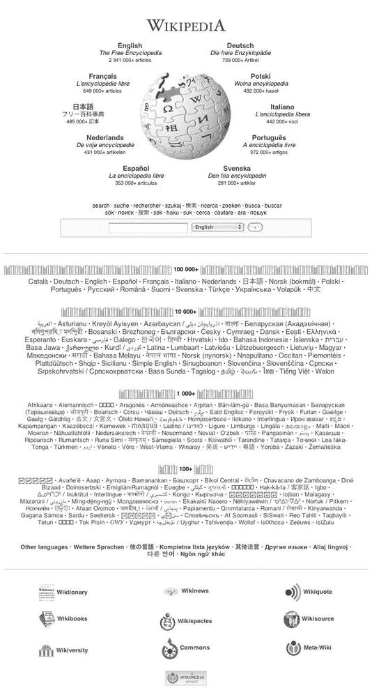

# 第十五章。200 种语言和计数

到目前为止，我们主要集中在英语版本的维基百科上，但已经创建了超过 250 种语言的维基百科，每种语言都代表着其自身的独立社区和独特的内容集合。一个常见的假设是，其他维基百科的文章基本上是从英语翻译过来的，但这完全是一种误导：这些网站都创建了他们自己的内容，翻译只扮演了很小的角色。总体而言，维基媒体项目被认为是当今互联网上最全面的多语言和全球性项目之一.^([32])

英语维基百科是最大的网站，但其他维基百科也非常庞大：其他 15 种语言版本的维基百科拥有超过 10 万篇文章。这些非常活跃的网站通常增长率很高，并且在技术上具有创新性。如果你访问[`wikipedia.org/`](http://wikipedia.org/) (图 15-1)，你会看到它作为通往其他语言版本维基百科的门户。

在本章中，我们将探讨对于已经成为真正国际化和互联互通项目的维基百科来说，全球化意味着什么。其他语言的维基百科是什么样的，你如何参与其中？我们还将讨论与英语维基百科相关的语言问题，包括显示外语字符，从全球视角撰写主题，以及添加指向其他语言版本维基百科的链接。

# 语言和脚本

项目的一个非常早期的目标就是使维基百科多语言；吉米·威尔士在 2001 年初首次提出创建德语版本的维基百科。到 2001 年 5 月，在英语维基百科成立后的几个月内，已经在加泰罗尼亚语、中文、德语、法语、希伯来语、意大利语、西班牙语、日语、俄语、葡萄牙语和世界语中启动了维基百科。

如下文所述，“语言的尾巴”中继续添加新的语言版本。截至 2008 年中，最大的维基百科是英语（230 万篇文章），德语（75.5 万篇文章），法语（66.5 万篇文章），波兰语（50.5 万篇文章）和日语（49.4 万篇文章）。然而，仅凭规模不应被视为唯一的衡量标准。例如，中文维基百科经常引起媒体关注，部分原因是中国政府继续部分限制中国境内对该网站的访问（作为所谓的中国防火长城的一部分）。尽管如此，中文维基百科拥有超过 17.8 万篇文章，其中大部分由台湾、香港以及东亚以外的许多中国编辑撰写。

维基百科至少有 77 种语言版本，超过 10,000 篇文章，155 种语言版本超过 1,000 篇文章。当一个维基百科达到 1,000 篇文章时，它通常有一个一致的方法、一个自我更新的社区和基本政策结构。剩余的网站刚刚开始，只有少数文章和活跃的贡献者，下一节将解释。

## 语言的长尾效应

以维基百科通常乐观的方式，许多语言版本的维基百科已经启动，但到目前为止，只有几百篇文章。这些网站有什么作用？没有人能称它们为全面的百科全书资源。事实是，它们只是刚开始的维基——就像 2001 年或 2002 年的英语维基百科一样。如果你足够流利地使用其中一种语言，以至于可以做出贡献，那么在较小的维基百科上工作可以非常有趣。你会发现，用户数量较少的小网站的文化与拥有众多习俗、规则以及（显然）已经撰写了更多文章的巨型英语维基百科非常不同。即使在小型维基百科上，文章也大多是新写的，而不是翻译，而是用那种特定语言新创作的作品。



**图 15-1. [Wikipedia.org](http://Wikipedia.org) 门户页面，显示所有语言**

有时候，其他语言的维基百科很小，因为它们非常新，或者因为说这种语言的人不多，因此潜在的贡献者基础很小。或者，维基百科可能存在于广泛使用的语言中，这些语言在互联网上没有强大的存在，例如泰卢固语，它是印度次大陆上第三大使用的语言，也是世界上前十五大使用的语言之一（图 15-2

**图 15-2. [`te.wikipedia.org`](http://te.wikipedia.org) 的泰卢固语维基百科首页，2008 年 4 月**

维基百科所代表的语言范围非常广泛。维基百科存在于构建语言（具有国际主义目标的*世界语* [eo] 和 *沃拉普克* [vo]）以及重要的已故语言（*拉丁语* [la] 和 *古教会斯拉夫语* [cu]），这些语言没有母语使用者。33]（双字母代码是语言标识代码，在语言之间的链接中解释）。当一个小语种的母语使用者很少时，语言保护的问题并不是维基媒体基金会的明确目标。但另一方面，向世界上所有的人提供免费信息，无论他们的语言是什么，这当然是一个目标，许多小语种的维基百科代表了该语言的*唯一*在线参考作品。在某些情况下，维基百科可能是特定语言的*唯一百科全书*！尽管存在这种多样性，但维基媒体已经支持的 250 多种语言远远不能代表世界上所有活跃的语言。*Ethnologue*的创作者，一个语言的标准参考工作，也是 ISO 语言识别标准的维护者之一，建议世界上语言的总数更接近于 5,000。

因此，仍在提出和启动新的语言版本。这如何运作？关键要求是你可以提供潜在活跃用户群体的证据。新的维基百科将需要活跃的志愿者来提供内容，并监视维基以防止垃圾邮件和破坏行为。维基百科有一个开始新语言项目的程序，所有新的请求都必须由网站开发者批准，他们可以创建项目。在第十七章中讨论的维基媒体维基百科*Meta*有一个专门的页面来提出这些请求。一旦提交了请求，新的语言版本委员会或*langcom*将审查该请求。必须有人能够流利地使用该语言，并承诺为新项目翻译 MediaWiki 界面（包括标签、按钮和关键页面的文本）。你可以在[`incubator.wikimedia.org/`](http://incubator.wikimedia.org/)查看（并参与）一些处于翻译过程中的新项目。

**克林贡战争**

从 2004 年到 2005 年，存在一个使用虚构《星际迷航》宇宙中克林贡种族语言的克林贡语维基百科。经过一番辩论，吉米·威尔士决定关闭该网站，并在 2005 年的维基曼尼亚现场立即执行了这一决定。正如 Meta 上克林贡语维基百科历史的页面所述，“克林贡项目的存在是分裂性的，导致了关于与其他语言，尤其是与其他人工语言的公平性和平等性的根深蒂固的辩论……由于克林贡词汇是封闭和不完整的，工作受到了限制。”内容最终在 2006 年 12 月转移到了由维基亚托管的新网站[`klingon.wikia.com`](http://klingon.wikia.com)，截至 2008 年 7 月，它有 161 篇文章。

## 在其他语言中参与

在其他语言的维基百科上编辑的挑战可能很有趣，也很有价值，即使你对所涉及的语言只有最基本的知识。所有维基百科都使用相同的 MediaWiki 引擎，所以按钮、导航链接和图标都有熟悉的功能，无论它们的标签是什么。

帮助的一种方式是关注一个小型维基百科的内容。只需记住，在缓慢增长的维基百科上，时不时地检查最近更改，你就可以帮助将垃圾邮件和低质量贡献保持在最低限度。要采用维基百科，你实际上只需要熟悉到足以识别肯定无益的更改的 Wikipedia 标准。看到新的编辑将帮助你指导新编辑者到多语言元页面，并识别优秀的新编辑者。*wikipedia-L*邮件列表用于讨论任何语言的通用维基百科相关问题的讨论。

在这个时候，你必须为每个你希望工作的新语言项目创建一个账户。这种情况随着 2008 年中*单用户登录*的引入而改变，有时也称为*统一登录*，用户可以使用它将他们的现有账户链接到所有维基媒体项目（有关更多信息，请参阅维基媒体共享上的“项目账户和单用户登录”）。然而，所有维基百科都应该允许匿名编辑，这可能更容易，如果你只是想做一些更改。如果你未登录时编辑，在尝试保存时要注意*强制预览*：点击你认为可能是显示预览按钮的地方。

在其他语言中添加编辑摘要怎么样？各个项目对此可能有不同的规定。例如，在波兰维基百科中，编辑摘要是强制性的；否则，除非你登录，否则你将无法保存。在葡萄牙维基百科上，如果你没有登录，在保存编辑之前你必须填写一个验证码框。如果你准备好了这些偶尔的额外正式程序，实际上在其他语言的维基百科上编辑是非常容易的。

记住，政策、指南和社区实践在不同语言社区之间可能有很大的差异。尽管一些基本原则——如 NPOV、礼貌和 GFDL 许可——对所有维基媒体项目都是基本的，但具体程序的执行是由项目社区决定的。你经常会发现，较小的项目规则和指南较少，辩论往往比受到更多外部关注的较大项目更加深思熟虑。

## 脚本支持

随着语言种类的全面，书写系统也全面：希腊文、西里尔文、阿拉伯文、希伯来文、表意文字以及其他不太熟悉的文字。甚至使用基本罗马字母的语言也可能使用重音和其他变音符号。各种书写系统也被用于并整合到英语维基百科版本中，例如，用于给出专有名词的原形。图 15-3 展示了文章[[莫汉达斯·卡拉姆昌德·甘地]]中的一个例子，该文章在引言部分使用了古吉拉特文和梵文脚本，以及国际音标发音符号。

**大使馆**

你可以在[[维基百科:本地大使馆]]找到说各种语言并愿意帮助解答那些语言问题的人的名单。这个页面是*大使馆系统*的一部分，每个维基百科都有一个为说其他语言访客的特殊地方。特定的语言维基百科被描述，访客可以提问或请求帮助。你可以在[`meta.wikimedia.org/wiki/Wikimedia_Embassy`](http://meta.wikimedia.org/wiki/Wikimedia_Embassy)找到所有大使馆的列表。这个列表包含了每个大使馆的链接，以及在该维基百科上使用其他语言并愿意提供帮助的贡献者名单。

如果你没有安装必要的字体，这些脚本中的任何一个都可能在你的网络浏览器中无法正确显示。如果你查看没有字体支持的文本，你可能会看到小方块或问号而不是正确的字符。如果是这种情况，你需要下载并安装正确的字体。[帮助:多语言支持]收集了有关字体支持的信息和一些建议。这个页面有一个图表，你可以比较一些常见问题字体（如东亚字符集）的图片与你在电脑上看到的内容。Firefox 网络浏览器提供了相对较好的多语言支持，大多数较新的操作系统也是如此，包括 Windows Vista。


**图 15-3. 英文维基百科关于甘地（Mahatma Ghandi）的文章的第一段，该文章使用了三种不同字体的语言（英语、梵文和古吉拉特语），以及 IPA 符号**

操作系统对语言的支持当然仍然是由发达世界的需求驱动的，这意味着许多不太广泛使用的脚本，例如某些印度语系的脚本，通常不会被您的浏览器或操作系统原生支持。通常需要下载的字符集包括本地语言使用的字符集。要找到这些字体，该语言的维基百科版本可以是一个很好的资源；使用非拉丁字体的维基百科通常在其主页上有一个关于如何获取查看这些字体所需字体的帮助页面。例如，要查看[[Cherokee]]文章中用原生脚本正确渲染的切罗基语，您必须下载一个特殊的字体；切罗基语维基百科上的帮助页面[`chr.wikipedia.org/`](http://chr.wikipedia.org/)提供了如何找到适当字体的详细信息。

在撰写文章时，如果您没有带有所需字符的键盘，您会发现许多类型的脚本，例如西里尔文和汉字，可以从其他文档成功复制并保存到维基百科页面上。（这是因为*Unicode 字符编码*，或[[UTF-8]]。）包括 Windows、Mac OS X 和许多 Linux 发行版在内的大多数操作系统还允许您在虚拟上更改键盘布局，这样您就可以直接用另一种语言输入。例如，在 Windows XP 中，您可以通过控制面板下的区域和语言选项来完成此操作。[[Help:Multilingual support (Indic)]]页面提供了为几个操作系统输入印度语系字符的完整说明；这些说明也适用于其他字符集。

**显示象形文字**

如果需要，您可以在维基百科文章中显示埃及象形文字！有关此特殊基于图像的字体，请参阅[[Help:WikiHiero syntax]]；要使用它，只需将您想要显示的字符的代码放在`<hiero>`和`</hiero>`标签之间即可。

最后，位于主编辑窗口下方（在 Understanding the Edit Window 中描述的“理解编辑窗口”）的编辑框，可以轻松访问许多带重音和变音符号的字符，以及希腊语、西里尔语和 IPA 字母表。只需单击这些字符之一，即可将其插入到文章中。

**进一步阅读**

[`wikipedia.org`](http://wikipedia.org) 通向所有语言版本的维基百科的门户

[`stats.wikimedia.org/`](http://stats.wikimedia.org/) 统计网站提供了关于所有项目每个语言的条目和用户数量的信息

[`meta.wikimedia.org/wiki/Wikimedia_Embassy`](http://meta.wikimedia.org/wiki/Wikimedia_Embassy) 语言之间的使团系统

[`incubator.wikimedia.org`](http://incubator.wikimedia.org) 新语言维基百科的启动地

[`meta.wikimedia.org/wiki/Requests_for_new_languages`](http://meta.wikimedia.org/wiki/Requests_for_new_languages) 请求新语言版本的页面

[`www.ethnologue.com/`](http://www.ethnologue.com/) 世界上语言的百科全书资源

[`en.wikipedia.org/wiki/Help:Multilingual_support`](http://en.wikipedia.org/wiki/Help:Multilingual_support) 多语言脚本支持的帮助

* * *

^([32]) 字节级研究每年发布一份全球化成绩单，该成绩单通常将维基百科在全球范围内排名第二，仅次于谷歌，对于“公司如何成功开发面向国际市场的网站”这一指标。参见 [`bytelevel.com/news/reportcard2008.html`](http://bytelevel.com/news/reportcard2008.html)。

^([33]) "Veni, Vidi, Wiki: Latin Isn't Dead On 'Vicipaedia'" (*华尔街日报*, 2007 年 9 月 29 日)；参见 [`online.wsj.com/public/article/SB119103413731143589.html`](http://online.wsj.com/public/article/SB119103413731143589.html)。

# 语言之间的链接

*维基间链接* 或 *跨语言链接* 是指向其他语言版本的维基百科中同一主题文章的链接。这些特殊链接在“语言”侧边栏中显示，如第三章所述（第三章 ("无处不在的侧边栏" 在 无处不在的侧边栏）。这些指向其他语言维基百科的链接出现在该语言的本土拼写下（例如 *Français*）并按该语言的两位或三位字母代码排序（例如 *fr* 或 *ja*）。点击链接将带您到其他语言维基百科中相应的文章。

任何页面，不仅仅是文章，都可以进行 *维基间链接*。例如，如果您既有俄语的也有英语的用户页面，您可以在您的英语用户页面上添加指向俄语版本页面的维基间链接，反之亦然。许多帮助和社区页面存在多种语言版本，并以这种方式相互链接。如果您想在另一种语言中找到等效项目或政策，这些链接非常有帮助；例如，如果您想找到德语的口语文章，只需访问英语口语维基百科项目，该项目有一个指向德语维基百科页面的维基间链接，WikiProjekt Gesprochene Wikipedia。

编辑必须逐篇文章添加到其他语言的链接，以便它们显示出来。这些链接使用特殊的语言代码创建。这些代码大多是两个字母（少数是三个字母），并且基于国际标准[[ISO 639]]，该标准对语言进行分类。如果没有 ISO 代码，将开发并使用特殊代码；例如，简单英语维基百科（一种用更简单的英语编写的维基百科）使用前缀*simple*（根据[[Wikipedia:Multilingual coordination]]）。这些前缀也出现在每个版本的维基百科 URL 中：因此[`en.wikipedia.org/`](http://en.wikipedia.org/)是英语维基百科。所有现有维基百科语言及其对应代码的表格可以在 Meta 网站上找到，地址为[[meta:List of Wikipedias]]。这些代码也非正式地用于项目，以指代各种语言维基百科；你可能看到*en:WP*或*enWP*用来表示英语维基百科，*de:WP*用来表示德语维基百科，*ru:WP*用来表示俄语维基百科，等等。

一旦你找到了你想要链接的两篇文章，并且知道它们的相应标题和语言代码，创建链接就很简单了。编辑一篇文章，然后滚动到文本的末尾。跨语言链接被放置在文章文本的底部。

链接的形式如下：[[*语言代码*:*本地语言中的文章名称*]]。例如，如果你正在处理英文文章[[Cat]]，并且你想链接到法语文章[[Chat]]，你将添加以下链接

```
[[fr:chat]]
```

在英语文章的末尾。保存页面后，左侧边栏将显示带有文本*Français*的链接；如果你点击它，你将被带到[`fr.wikipedia.org/wiki/Chat`](http://fr.wikipedia.org/wiki/Chat)上的法语文章。同样，要链接到德语文章，你将输入

```
[[de:Hauskatze]]
```

这将在侧边栏的“Deutsch”下为你提供一个链接到[`de.wikipedia.org/wiki/Hauskatze`](http://de.wikipedia.org/wiki/Hauskatze)。

按照惯例，跨语言链接被放置在页面类别标签下方，每个链接占一行。在页面上排列跨语言链接最流行的顺序是按代码字母顺序排列。

**损坏的跨语言链接**

确保你链接的是正确的文章。特别是对于有多种含义的概念，找到确切的对应项有时可能很困难——注意不要链接到错误的概念。还要小心链接到消歧义页面，这些页面可能存在于一个维基百科中，但不在另一个维基百科中。显然，并非所有文章都存在于所有语言中；由于英语维基百科是最大的，它通常有其他语言没有的文章，但你可能会对较小维基百科的覆盖范围感到惊讶。如果你创建的跨语言链接看起来没有指向任何地方，请检查你是否错误地输入了标题。

为了完整，你还应该访问其他语言的条目，为第一篇文章添加一个语言间链接（例如，页面[[Hauskatze]]也应该链接到英语[[Cat]]）。在创建语言间链接时，在编辑摘要中添加简单的*+en:*或*interwiki*。你还可以找到更多指向该文章的语言间链接，以添加到你正在工作的原始文章中。今天，机器人自动执行了许多这种缺失的语言间链接。

要链接到另一个语言页面而不显示为语言间链接，请使用相同的语法，但在语言前缀前放置一个冒号，就像你正在链接到一个类别名称一样。在英语维基百科页面上键入[[:fr:chat]]将显示为浅蓝色链接，就像你写的那样，链接到[`fr.wikipedia.org/wiki/Chat`](http://fr.wikipedia.org/wiki/Chat)，但链接不会出现在左侧边栏上。一些重要的基本原则仍然适用：“优先使用内部链接”意味着不要使用链接到其他语言维基百科来替换英语文章中的红链，“寻求外部参考”意味着你不应该依赖另一个维基百科在文章中提供重要事实。翻译本身不足以作为验证，其他维基百科页面——无论语言如何——都不应作为来源。

**进一步阅读**

[`en.wikipedia.org/wiki/Wikipedia:Multilingual_coordination`](http://en.wikipedia.org/wiki/Wikipedia:Multilingual_coordination) 多语言协调，多语言项目的介绍

[`meta.wikimedia.org/wiki/List_of_Wikipedias`](http://meta.wikimedia.org/wiki/List_of_Wikipedias) 所有维基百科列表，包括语言代码（在 Wiki 列中）。无论链接到哪个项目（维基百科、维基词典等），语言代码都是相同的。

[`en.wikipedia.org/wiki/Wikipedia:Interlanguage_links`](http://en.wikipedia.org/wiki/Wikipedia:Interlanguage_links) 关于语言间链接的帮助

# 全球关注的英语

英语维基百科拥有一个全球性的编辑社区，作为编辑，你将经常与来自许多时区的人进行合作。英语维基百科的典型贡献者可能是一位来自英语国家（如美国、加拿大、英国、澳大利亚等）的母语者，但许多编辑既不是母语者，也不在这些地方。结识来自世界各地的人是参与维基百科的一个好处。由于编辑相对匿名，你通常不知道你的维基朋友来自哪里，甚至他们的国籍。为了克服文化差异，请记住在线礼貌互动的指南，并且不要过度依赖地区俚语或网络术语，因为并非所有人都能理解。

维基百科中贡献者的多样性也体现在全球主题的广泛性上。显著性与文化或语言无关；地理特征、重要人物和其他显著的地区性主题应明确包含在维基百科中，无论它们在哪里或与世界有何关联。

**简单英语维基百科**

*简单英语*维基百科是英语维基百科的一个独立项目。这个维基百科旨在提供简化英语的文章，并设计用于学习英语的人和儿童。整个界面已被重写以使用更简单的语言，例如，随机页面链接是显示任何页面链接。大多数文章都是从英语维基百科版本“翻译”成更短、更简单的文章。这些文章反过来又可以为使用其他语言的人提供资源。简单英语是那些对教授或学习英语作为第二语言感兴趣的人的理想项目。简单英语维基百科位于[`simple.wikipedia.org/`](http://simple.wikipedia.org/)，截至 2008 年中，大约有 33,000 篇文章。

几个维基项目也专注于世界的特定区域。例如，维基项目印度专注于撰写关于印度的文章，审查现有的关于印度的文章，并支持一个为对印度相关主题感兴趣的编辑者提供的社区门户。处理地理主题的维基项目列表可以在[[Wikipedia:WikiProject Council/Directory/Geographical]]找到。

其他维基项目专注于将其他维基百科中的有用或有趣的文章翻译成英语（其他语言维基百科有类似的项目，专注于将文章翻译成当地语言）。在英语中进行翻译协调的地方是[[Wikipedia:Translation]]。翻译提出了双重挑战：写出既好又好的维基百科内容。

非英语母语者用英语撰写的文章中常常出现风格问题。对这些文章的清理工作有助于使有价值的内容得以呈现。在根据第四章中提出的标准评估文章，或在删除辩论中，考虑到文章可能是由对该主题有专长的非母语者所写。

当用英语撰写关于非英语国家地区的主题的文章时，来源可能会出现问题。例如，找到英文来源材料可能会困难得多。检查维基间的链接以在其他语言维基百科上找到相关文章，对于寻找来源和更多信息可能会有所帮助。

虽然引用非英语来源并不理想，但你可以这样做。你可以使用特殊的模板来识别其他语言中的来源；例如，在链接到意大利网站之前放置可选模板 `{{it icon}}` 会提醒读者该来源是意大利语（语言代码与之前提到的相同标准 ISO 代码相同）。引用非维基百科母语的来源比完全不引用来源要好。尽量找到英语语言来源，这样读者可以更容易地验证你的事实。（如果不同语言的来源不一致，这可以是有用的信息，并应包含在内。）

**进一步阅读**

[`en.wikipedia.org/wiki/Wikipedia:WikiProject_Council/Directory/Geographical`](http://en.wikipedia.org/wiki/Wikipedia:WikiProject_Council/Directory/Geographical) 关于地理区域和地点的维基项目

[`en.wikipedia.org/wiki/Wikipedia:Translation`](http://en.wikipedia.org/wiki/Wikipedia:Translation) 请求和协调从外语维基百科到英文维基百科的翻译的地方

# 摘要

虽然英语仍然是最大的单一维基百科社区，但所有语言维基百科中的文章总数中，用英语写的不到四分之一。其他语言加在一起，其增长速度是英语维基百科的两倍。

每个语言版本的维基百科都包含许多原创文章和独特的主题。这些网站吸引了社区，发展出自己的程序和习俗，并在时间中持续存在。对应文章的交叉链接（维基间链接）将每个维基百科都纳入了一个更大的网络。要真正感受到全球维基百科的氛围，请在这些社区中花些时间。
