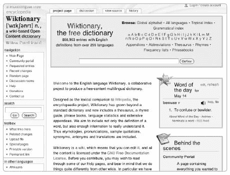
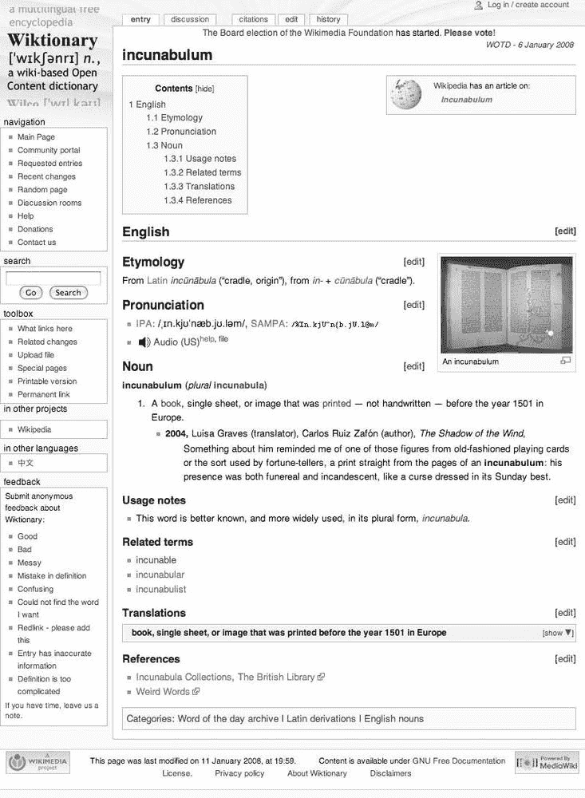
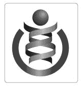
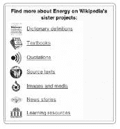

# 第十六章. 维基共享资源和其他姐妹项目

除了维基百科之外，维基媒体基金会还运行了其他几个项目，以生产免费内容参考材料。在维基媒体内部通常被称为*姐妹项目、兄弟项目*或简单地称为*项目*，目前有九个维基媒体项目：维基百科、维基词典、维基新闻、维基教科书、维基源、维基语录、维基物种、维基大学和维基共享资源。每个项目处理不同类型的内容，从教科书到图片，每个项目都有独立的志愿者团队在专门的维基上工作，通常有多个语言版本。维基媒体基金会还协调所有项目运行的 MediaWiki 软件。通常被认为是第十个姐妹项目的 MediaWiki 软件开发过程将在下一章中详细介绍。下一章还将描述的 Meta-Wiki 网站，作为所有项目和语言的协调站点。志愿者使用类似于维基百科的维基模式为所有维基媒体项目制作内容，所有项目的内容都根据 GFDL 或另一个免费许可证进行许可。

这些不同的维基项目相互补充。目的是将不同类型的内容分开，例如词典定义、百科全书文章和档案材料，同时允许项目之间按主题进行交叉链接。例如，你可以在维基语录中添加与亚伯拉罕·林肯相关的引语，而维基百科上的[[亚伯拉罕·林肯]]文章可以链接到这些引语库，而不是试图将它们全部包含在内。由于涉及超过 500 个网站——九个姐妹项目，每个项目都有大量的语言版本——因此需要一个系统化的命名系统来支持链接。我们将在“项目之间的链接和内容复制”中解释这是如何工作的，请参阅项目之间的链接和内容复制。

所有这些项目都使用 MediaWiki 维基软件，因此您不需要学习新的编辑过程来为它们做出贡献；您只需要了解一些不同的命名空间和页面结构约定。然而，不要期望每个项目都会像现在的维基百科那样有完整的发展，因为这些项目是在不同时间开始的，并且以它们自己的（有时是悠闲的）速度发展。此外，您不应该假设维基百科文化（尤其是英语维基百科文化）会自动转移到这些其他项目上。每个项目，以及每个项目的每个语言版本，都可以被视为一个独立的社区。每个社区都有自己的政策和处理诸如删除辩论和管理员晋升等流程的变体。当您开始参与时，注意并学习每个新项目的规范。但每个项目都有一些熟悉的功能：帮助页面和社区门户以及村庄水井的某种变体，用于讨论和协调项目。就像在维基百科上一样，这些都是开始学习更多的好地方。维基媒体项目还共享一些关键价值观。在与其他编辑互动时，礼貌和假定善意始终很重要，并且在所有项目中，版权侵犯都是*绝对不可接受的*。当然，所有项目都向任何人开放编辑。只需找到您想要工作的任务并开始编辑，无论是匿名还是使用用户账户登录。

**项目账户和单用户登录**

在过去，每次编辑不同的维基媒体项目时，都需要创建一个新的账户，这偶尔会导致不同项目上出现同名的人。截至 2008 年中期，单用户登录正在实施，使得您可以在所有维基媒体账户中“全局”注册您的账户。只需在您的本地项目上注册您的名字。然后，要“声明”它用于其他项目，请访问您本地项目的[[特殊:MergeAccount]]，或者在登录后点击偏好设置下的“管理您的全局账户”。一旦合并您的账户，您选择的用户名将被保留供您在任何维基媒体项目上使用，使您能够一次性登录和退出所有维基媒体项目。为了避免与其他维基上的用户发生命名冲突，您可能需要选择一个独特的用户名或使用您的全名。

在本章中，我们将依次描述每个姐妹项目。默认许可证是 GFDL；然而，我们将指出何时可能适用其他许可证。随后，我们将描述如何将这些项目链接在一起（以及从英语维基百科链接到它们）以及如何在它们之间移动内容。最后，我们将简要讨论非维基媒体维基。

# 维基媒体共享资源

| 成立时间：2004 年 9 月 7 日 | 短前缀：commons |
| --- | --- |
| 范围：免费图片和其他媒体 | 语言：跨语言项目，许多语言都有欢迎页面 |
| URL: [`commons.wikimedia.org/`](http://commons.wikimedia.org/) |   |


**图 16-1. Commons 的英文主页**

在所有姐妹项目中，我们首先突出显示维基媒体 Commons（图 16-1 上的 "项目账户和单用户登录"），才能上传文件。如果您创建了一个新账户，过程与在维基百科上创建账户类似（在第十一章中描述）。

**地图**

地图是任何参考资料的重要组成部分。Commons 组织地图的一种方式是通过 Commons 大图集，[`commons.wikimedia.org/wiki/Atlas`](http://commons.wikimedia.org/wiki/Atlas)，它管理着世界各国的各种地图（滚动到大图集页面底部可以看到收集的所有地点的地图列表）。这本身就是一个巨大的资源。在英语维基百科上，WikiProject Maps 项目，在[`en.wikipedia.org/wiki/Wikipedia:WikiProject_Maps`](http://en.wikipedia.org/wiki/Wikipedia:WikiProject_Maps)上，负责协调地图的使用。

### 包含指南

上传到 Commons 的所有图像和其他媒体都必须符合其他维基媒体项目的包含指南。对于对任何维基媒体项目可能没有用处的媒体文件，因此超出了 Commons 的范围。请注意，该网站不是一个个人图像托管服务；你的生日派对快照不属于这里！

此外，Commons 上的所有内容都必须是完全免费的许可；*合理使用*的图像，如你有时在英语维基百科上看到的，是不可接受的。所有内容都必须任何人出于任何目的都可以再利用，包括商业用途。Commons 接受的许可包括以下几种：

+   公共领域图像，这些图像发布时没有任何限制。某些由美国政府和其他机构创作的作品自动进入公共领域，但任何个人也可以将作品发布到公共领域。

+   Creative Commons 的免费许可，包括 CC-BY 和 CC-BY-SA，这两者都要求注明原作者，但允许商业性再利用。Creative Commons 许可也是“copyleft”许可，具有与 GFDL 相似的功能；更多详情请参阅[[Commons:Choosing a license]]和[`creativecommons.org/`](http://creativecommons.org/)。Creative Commons 的 CC-NC 和 CC-ND 许可不被 Commons 接受；如果你不准备允许商业性再利用，那么 Commons 可能不适合你。

+   GFDL 许可，可能因为整个 GFDL 许可必须与图像一起重新打印，所以可能阻止商业性再利用。

Commons 不接受某些图像类型，包括版权软件的截图、版权作品的扫描（如书籍或专辑封面），或电视节目的屏幕截图。当然，任何其他不属于你自己的版权作品也是不可接受的。[[Commons:Licensing]]提供了完整的故事，包括多个非美国司法管辖区的一些法律信息。

Commons 接受多种文件类型。首选的文件类型包括 JPEG 用于摄影，SVG 用于插图，以及 Ogg 用于音频和视频；[[Commons:File types]]提供了更多信息。对于音频和视频，MP3、WAV 等不是免费格式，因此不可接受。

### 上传图像

将图片或媒体文件上传到共享区与在维基百科上上传文件类似（参见第九章）。您可以通过左侧边栏上的链接访问上传表单。一系列的步骤将引导您完成这个过程，或者您也可以直接从第一页跳转到上传表单。

1.  选择图片的来源；如果您创建了这张图片，只需说明即可。

1.  选择合适的许可协议，如前文所述。

1.  选择一个合适的描述性文件名。*不要*简单地使用您数码相机的文件名；选择一个有帮助的名字。图片和文件上传后不能重命名，尽管您可以上传图片的新版本。如果您不小心选择了与现有文件相同的名字，会出现警告，并会要求您确认您确实想要上传新版本。

1.  添加适当的描述。如果您创建了这张图片，它是什么？在哪里和什么时候拍摄的？您的名字或用户名是什么？请记住，这段文字将帮助其他用户找到您的图片。

对于批量上传，请参阅[[共享区:工具]]，其中列出了许多用于快速上传多个文件的工具，以及其他有用的工具，如实验性搜索引擎。

如果您想贡献媒体但不知道如何开始，请尝试[[共享区:图片请求]]。如果您正在寻找为维基百科文章寻找完美的图片，您也可以在这里提出请求。请求通常是为特定地点的图片，因此您可以在拍照之前查看是否有任何请求是您附近地点的图片。

### 注意

*您可以在[[共享区:认识我们的摄影师]]阅读一些在共享区有才华的摄影师的简介*。

### 分类

一旦上传了图片，您需要对其进行分类。良好的分类使得在共享区中查找图片变得容易。任何人都可以帮助进行这个排序过程；您不需要有账户。[[共享区:第一步/排序]]有更多关于排序和分类过程的信息。

如果您有一张新图片，已经对其进行了具体描述，并已上传，下一步是将它放入适当的类别。通常，将图片放入尽可能狭窄的类别中。例如，一个回形针的图片属于[[类别:回形针]]，这比[[类别:紧固件]]或[[类别:办公设备]]更好。根据主题和其他元级类别（例如，适用的许可协议）对所有图片进行分类。

[[Category:Topics]]是 Commons 上主题的最高类别；就像在维基百科上一样，您可以从这里钻入子类别（这个过程在第三章和第八章)中完全描述）。找到适当类别的另一种方法是检查与您自己的图像相似的其他图像，看看它们是如何分类的。例如，尝试搜索您图像的主题，看看 Commons 是否已经有一个画廊页面；然后研究这个页面上的图像是如何分类的。

您可以将图像添加到类别和适当的画廊页面中（图 16-2

**图 16-2. 一个照片画廊**

**进一步阅读**

[`commons.wikimedia.org/`](http://commons.wikimedia.org/) 维基媒体 Commons

[`commons.wikimedia.org/wiki/Commons:Featured_pictures`](http://commons.wikimedia.org/wiki/Commons:Featured_pictures) Commons 的最佳图片

[`commons.wikimedia.org/wiki/Commons:Licensing`](http://commons.wikimedia.org/wiki/Commons:Licensing) 关于许可信息

[`commons.wikimedia.org/wiki/Commons:Contributing_your_own_work`](http://commons.wikimedia.org/wiki/Commons:Contributing_your_own_work) 如何将您自己的作品贡献给 Commons

[`commons.wikimedia.org/wiki/Commons:First_steps`](http://commons.wikimedia.org/wiki/Commons:First_steps) Commons 的教程和介绍

[`commons.wikimedia.org/wiki/Commons:Help_Desk`](http://commons.wikimedia.org/wiki/Commons:Help_Desk) 在 Commons 上提问的地方

# 其他姐妹项目

除了 Wikimedia Commons，Wikipedia 还有七个额外的姐妹项目。从维基百科编辑者的角度来看，这些项目与百科全书的工作关系较远。这些项目作为在 GFDL 许可下的参考网站，涵盖了不同类型的内容。例外的是 Wikinews，它现在使用的是 Creative Commons 许可。六个项目有与 Wikipedia 相同的多语言版本，除了 Wikispecies，它维护一个单一网站。你可以把 MediaWiki 软件开发视为另一个姐妹项目，明显的区别在于它存在是为了开发和分发一个程序，而不是内容。

## Wiktionary

| 成立时间：2002 年 12 月 12 日 | 语言：截至 2008 年初，有 9 种语言（fr, en, vi, tr, ru, io [这是 ido，一种人造语言的代码]，zh, el, ta）超过 10 万个条目；另外 23 种语言超过 1 万个条目；总共 172 种语言 |
| --- | --- |
| 范围：词典定义 |   |
| 网址：[`wiktionary.org/`](http://wiktionary.org/) |   |
| 简短前缀：wikt |   |



**图 16-3. 英文 Wiktionary 主页**

如果你的兴趣更偏向于词典学而非百科全书，你应该访问 *Wiktionary* (图 16-3)，这是一个基于维基的免费词典。与关于某个主题的完整文章不同，Wiktionary 提供简洁的单词定义。Wiktionary 的范围与 Wikipedia 相重叠：在 Wikipedia 中有文章的术语也可能在 Wiktionary 中被定义。例如，Wikipedia 的鱼类文章讨论了鱼类的类型、它们在哪里可以找到、捕鱼方法等等，而 Wiktionary 的定义会告诉你英文中的 *鱼* 可以是名词或动词，鱼是一种生活在水中的冷血动物，如何发音等等。截至 2008 年中，英文 Wiktionary 有超过 878,000 个条目，尽管其中许多是通过机器人从公共领域词典中导入的。

对于维基百科编辑者来说，Wiktionary 既是进一步了解两个项目中出现的术语的资源，也是可以移动那些仅仅是简短词典定义而不适合作为 Wikipedia 文章的文章的地方。

维基词典是一个多语言词典（也是同义词词典和短语手册），并具有独特的内容政策。单词必须是*证实的*和*惯用的*（也就是说，单词应该在使用中，短语应该是常用的习语），提交内容应该是中立的且可验证的。尽管英文维基词典中的定义和描述仅使用英文，但可以包括任何和所有语言的单词：维基词典不仅定义英文单词，还作为法英词典、西班牙英词典等。因此，该网站可以是一个查找不熟悉的外国单词的优秀场所；截至 2008 年，英文维基词典中包含了 104 种语言的单词。此外，在查看条目时，左侧边栏中的“在其他语言中”链接将带您到相同英文单词的其他语言定义（类似于维基百科），并且通常这些条目也会链接到该单词的本地等效词。其他语言的翻译也可能出现在条目的底部。

与大多数其他词典不同，维基词典在定义中包含补充数据，包括发音的音文件、图片、链接到其他项目（通常是维基百科）、翻译以及其他信息，如用法说明和参考文献（图 16-4 显示了 incunabulum 条目中的这些元素）。复合词、习语和缩写都是可接受的；有当前使用参考的新词也可以包括（当然，虚构的词将被删除）。特色条目在主页上突出显示为每日一词；对于英文维基词典，还有这些有趣单词的 RSS 订阅。



**图 16-4. incunabulum 一词的良好维基词典条目**

维基词典于 2001 年 4 月由拉里·桑格在*Wikipedia-L*邮件列表上提出，就在维基百科推出后的三个月。^([34]) 网站于 2002 年 12 月 12 日以英文上线；2004 年 3 月 29 日，首个非英语维基词典在法语和波兰语中启动。现在已有超过 200 种语言的维基词典，其中超过 100 种拥有超过 100 个定义。一个名为*Omegawiki*的外部项目，由几位维基词典编纂者发起，正在将维基词典中的数据组合成一个包含所有语言的单一词典。

**进一步阅读**

[`wiktionary.org/`](http://wiktionary.org/) 所有维基词典的门户

[`en.wiktionary.org/wiki/Wiktionary:Welcome,_newcomers`](http://en.wiktionary.org/wiki/Wiktionary:Welcome,_newcomers) 英文维基词典的介绍，链接到社区门户和其他帮助页面

[`en.wiktionary.org/wiki/Wiktionary:Criteria_for_inclusion`](http://en.wiktionary.org/wiki/Wiktionary:Criteria_for_inclusion) 维基词典收录标准

[`en.wiktionary.org/wiki/Category:Phrasebook`](http://en.wiktionary.org/wiki/Category:Phrasebook) 在维基词典中定义的多种语言的短语

[`en.wiktionary.org/wiki/Wiktionary:Word_of_the_day`](http://en.wiktionary.org/wiki/Wiktionary:Word_of_the_day) 每日一词页面，突出维基词典的最佳内容——每日一词也可以通过电子邮件发送给您

[`www.omegawiki.org/`](http://www.omegawiki.org/) OmegaWiki 项目

## 维基新闻

| 成立时间: 2004 年 12 月 3 日 | 简称: n |
| --- | --- |
| 范围: 新闻报道 | 语言: 总计 23 种 |
| 网址: [`wikinews.org/`](http://wikinews.org/) |   |


**图 16-5. 英文维基新闻主页**

*维基新闻* 是一个致力于新闻和公民新闻的维基网站（图 16-5 维基新闻门户

[`meta.wikimedia.org/wiki/Wikinews`](http://meta.wikimedia.org/wiki/Wikinews) 所有维基新闻版本的统计数据

[`en.wikinews.org/wiki/Wikinews:Introduction`](http://en.wikinews.org/wiki/Wikinews:Introduction) 英文维基新闻的介绍

## 维基教科书

| 成立时间：2003 年 7 月 10 日 | 简短前缀：b |
| --- | --- |
| 范围：免费教科书 | 语言：总共 121 种，其中 14 种（en, de, fr, pt, hu, es, it, jp, pl, sq [阿尔巴尼亚语]，nl, he, fi, 和 vi）拥有超过 1,000 个图书模块 |
| 网址：[`wikibooks.org/`](http://wikibooks.org/) |   |

*维基教科书* 是一个用于创建免费内容教科书和手册的维基（图 16-6 显示了其标志）。这些书籍从如何做到教科书，用于学习数学、计算机科学或语言等科目，到来自世界各地的食谱烹饪书。维基教科书仅用于教科书、注释文本、教学指南和手册等教学作品；小说和许多类型的非虚构作品不包括在内。原始研究也不被接受；维基教科书不是出版原始研究或结果的地方。版权过期的源文本更适合放在维基源，除非是专为学习设计的注释文本。像所有项目一样，所有维基教科书的材料都应该有中立的观点；但与维基百科不同，撰写如何做某事或学习某个过程的最佳方式的大量描述是完全可接受的。


**图 16-6. Wikibooks 标志**

Wikibooks 没有固定的受众，与旨在吸引广泛基础的 Wikipedia 不同。虽然许多书籍是为成人学习者设计的，但书籍可能面向任何受众，包括儿童。在 Wikibooks 上有一个特别的项目叫做 *Wikijunior*，这是一系列为儿童编写的非虚构书籍。Wikijunior 项目已经用 8 种语言创建，其中 25 本英文 Wikijunior 书籍已完成或正在进行中。该项目最初于 2004 年由贝克基金会提供特别资助，以帮助支持儿童书籍的开发。其他 Wikibooks 可能是技术性或专业性的作品。

Wikibooks 使用 *模块*，即书籍的简短部分（类似于短章节），作为网站的主要结构。每本书在维基上都有一个单独的主页，每个模块都作为该页面的子页面构建。一个特殊的视觉评分系统（图 16-7。


**图 16-7. Wikibook 开发阶段的集合**

扩展主题讨论或如何做某事的说明可能从 Wikipedia 移动到 Wikibooks。反过来，Wikibooks 上的书籍可以链接到相关的 Wikipedia 文章以获取背景信息，当需要时，Commons 中的图片可用于说明 Wikibooks。

Wikibooks 网站存在超过 100 种语言中，其中 47 个网站拥有超过 100 个模块。该项目最初于 2003 年开始，是为了响应创建教科书的请求；2006 年，Wikiversity（在 项目之间链接和内容复制 中描述）作为一个独立项目分离出来。

**进一步阅读**

[`wikibooks.org/`](http://wikibooks.org/) Wikibooks 门户

[`en.wikibooks.org/wiki/Wikibooks:Departments`](http://en.wikibooks.org/wiki/Wikibooks:Departments) 按内容排序的英文 Wikibooks

[`en.wikibooks.org/wiki/Wikibooks:Featured_books`](http://en.wikibooks.org/wiki/Wikibooks:Featured_books) 英文 Wikibooks 的最佳内容

[`en.wikibooks.org/wiki/Wikijunior`](http://en.wikibooks.org/wiki/Wikijunior) Wikijunior，儿童书籍

[`meta.wikimedia.org/wiki/List_of_Wikibooks`](http://meta.wikimedia.org/wiki/List_of_Wikibooks) 所有 Wikibooks 版本的列表

## Wikiquote

| 成立时间：2003 年 7 月 10 日 | 简短前缀：q |
| --- | --- |
| 范围：引言 | 语言：总共 89 种语言，其中 48 种语言拥有超过 100 篇文章，7 种语言（en、de、it、pl、sk、pt 和 ru）拥有超过 10,000 篇文章 |
| 网址：[`wikiquote.org/`](http://wikiquote.org/) |

*Wikiquote* 旨在收集著名人物和作品的引言 (图 16-8 展示了其标志)。引言可以来自已发表的著作，如书籍和电影，也可以包括谚语、隽语和格言。例如，在 [`en.wikiquote.org/`](http://en.wikiquote.org/) 的 [[类别：谚语]] 上，你可以找到许多语言的谚语，既有直译也有英文对应版本。引言和格言按主题或作者排列；例如，Wikiquote 有一个名为“爱情”的页面，其中包含与爱情主题相关的引言，还有一个收集塞缪尔·贝克特引言的页面。


**图 16-8. Wikiquote 标志**

应尽可能将引言追溯到它们最初出现的作品，并且它们应仅来自著名人物或作品。与所有维基媒体维基一样，应包括链接到维基百科和其他地方的相关文章。许多关于著名作品和作者的维基百科文章也包括一些引言，但如果许多著名引言来自同一个人，它们应主要包含在 Wikiquote 页面上，并从维基百科文章中添加适当的跨语言链接。

Wikiquote 于 2003 年启动。截至 2007 年底，Wikiquote 版本已创建 89 种语言，其中 46 种语言拥有超过 100 篇文章。英语 Wikiquote 有超过 14,000 页。英语 Wikiquote 还有一个每日引言特色功能，每天显示一条新的著名引言；你甚至可以通过电子邮件接收这些引言。

**进一步阅读**

[`wikiquote.org/`](http://wikiquote.org/) 所有 Wikiquote 的门户

[`meta.wikimedia.org/wiki/Wikiquote#List_of_Wikiquotes`](http://meta.wikimedia.org/wiki/Wikiquote#List_of_Wikiquotes) 所有 Wikiquote 版本的列表

[`en.wikiquote.org/wiki/Category:Proverbs`](http://en.wikiquote.org/wiki/Category:Proverbs) 多种语言的谚语

[`en.wikiquote.org/wiki/Wikiquote:Quote_of_the_day`](http://en.wikiquote.org/wiki/Wikiquote:Quote_of_the_day) 英语 Wikiquote 每日引言页面

## Wikisource

| 成立时间：2003 年 11 月 24 日 | 简称：s |
| --- | --- |
| 范围：主要来源 | 语言：总共 55 种语言，其中 10 种（en、fr、es、zh、de、it、pt、ru、pl、th）拥有超过 10,000 页 |
| 网址：[`wikisource.org/`](http://wikisource.org/) |   |

*Wikisource* 是一个包含公共领域（因此不受版权保护）或根据 GFDL 发布的原始文档和初级文本的集合。(图 16-9 展示了其标志。)该项目作为一个重要作品的免费图书馆。文本可能包括（但不限于）小说、非小说、信件、演讲、历史文件、宪法文件和法律。也欢迎翻译，尽管原文语言的文本应发送到相应的语言 Wikisource。文本必须在此处之前已出版才能被包括在内；Wikisource 不托管*虚荣出版*的书籍或其贡献者生产的文档。可以包括口语或音频版本；您可以在[[s:Category:口语作品]]中浏览这些内容。


**图 16-9. Wikisource 标志**

通常，由于文本足够古老，不再受版权保护，因此在美国文本属于公共领域。这些文本最初可能已经被释放到公共领域，例如美国政府生产的材料（例如，联邦法院意见和军事新闻）。许多 Wikisource 上的文本来自现有的数字图书馆和扫描项目，如 Project Gutenberg。从头开始数字化免费文本当然也是可接受的。文本可能被扫描，然后使用光学字符识别（OCR）软件转换为可编辑的数字格式。使用 OCR 产生的文本确实需要校对。

**如何协作编辑文本？**

即使 Wikisource 由参与者不撰写的先前发布的文本组成，仍需要做大量工作。任务包括校对上传的文本、将文本转换为 MediaWiki 格式、分类和上传不完整的文本（因为将长文档转录到维基上可能是一项大工程）。其他可能性包括寻找公共领域文本、检查提交的版权状态以及制作文本的音频版本（如有声书）；您可以在[[s:帮助:音频]]中找到创建有声书的指南，以及更多开放的任务在[[s:社区门户]]。

Wikisource 最初设想为存储有用的历史或其他重要公共领域文本的方式，既作为维基百科的补充，也是其自身的档案馆。例如，美国宪法的维基百科文章可能链接到 Wikisource 上的宪法全文。这为想要了解更多关于该主题的读者提供了宝贵的补充。Wikisource 与其他免费文本项目（如 Project Gutenberg）有一些共同之处，但 Wikisource 的重点在于历史和文化上重要的材料。

该项目最初于 2003 年以 *Project Sourceberg* 的名义开始，是对 *Project Gutenberg* 名称的戏仿（这也是为什么标志是一个躺在水中的大冰山）。维基源存在于 55 种语言中，其中 50 种语言拥有超过 100 篇源文本。

**进一步阅读**

[`wikisource.org/`](http://wikisource.org/) Wikisource 门户

[`en.wikisource.org/wiki/Wikisource:Community_Portal`](http://en.wikisource.org/wiki/Wikisource:Community_Portal) 英文 Wikisource 社区门户

[`meta.wikimedia.org/wiki/Wikisource#List_of_Wikisources_by_size`](http://meta.wikimedia.org/wiki/Wikisource#List_of_Wikisources_by_size) 所有 Wikisources 的列表

## Wikispecies

| 成立时间：2004 年 9 月 13 日 | 短前缀：wikispecies |
| --- | --- |
| 范围：物种的系统生物学数据库 | 语言：背景语言为英语，物种名称为拉丁语，一些支持页面，以及多语言的地方命名 |
| 网址：[`species.wikimedia.org/`](http://species.wikimedia.org/) |   |

*Wikispecies* 是关于活物种信息的集合。（图 16-10 显示了其标志。）它旨在创建一个关于所有物种（包括动物界、植物界、真菌界、细菌界、古菌界和原生生物界）的全面免费内容目录，并针对科学家而非普通公众。页面包括生物的科学名称和分类，沿 *林奈分类法* 或标准等级生物分类排列。

Wikispecies 并非旨在与 Wikipedia（其中可能存在关于许多物种的文章）竞争，而是通过提供分类信息来补充它。科学家和其他人需要能够编辑的全面分类数据库，这是 2004 年创建该网站的原因之一。与其他项目一样，维基百科、维基共享资源和 Wikispecies 可以相互链接，以便为物种提供全面的参考，包括百科全书信息、图片和完整的分类列表。为了贡献，编辑者可以（在众多任务中）搜索图片以添加到物种列表中，添加参考文献，并填补缺失的物种。



**图 16-10. Wikispecies 标志**

只有一个 Wikispecies 网站，但该网站为各种语言提供了几十个门户页面。此外，每个物种名称都被翻译成当地语言（包括英语，这使得 Wikispecies 成为查找不熟悉的拉丁名称的有用之处）。

**进一步阅读**

[`species.wikimedia.org/`](http://species.wikimedia.org/) Wikispecies 网站

[`species.wikimedia.org/wiki/Help:Contents`](http://species.wikimedia.org/wiki/Help:Contents) Wikispecies 的帮助页面

[`meta.wikimedia.org/wiki/Wikispecies`](http://meta.wikimedia.org/wiki/Wikispecies) 关于 Wikispecies 及其创建原因

[`en.wikipedia.org/wiki/Wikispecies`](http://en.wikipedia.org/wiki/Wikispecies) 来自维基百科的 Wikispecies 文章，其中还包含指向其他相关项目的链接

## Wikiversity

| 成立时间：2006 年 8 月 15 日 | 简称：v |
| --- | --- |
| 范围：教育材料 | 语言：9 种（en, fr, de, es, it, pt, cs, el, ja），加上一个多语言网站 |
| 网址：[`wikiversity.org/`](http://wikiversity.org/) |   |


**图 16-11. 英文 Wikiversity 主页**

*Wikiversity* 是一个创建和使用免费学习材料和活动的社区，旨在发展致力于学习、教学、研究和服务的社区（见 图 16-11). 其主要目标是创建和托管针对所有年龄段和所有语言的免费内容、多媒体学习材料、资源和课程，并围绕这些材料开发协作学习项目和社区。

Wikiversity 上的资源包括教学辅助工具、课程计划、课程、指向站外资源的链接和阅读清单，这些都可以组合起来创建关于一个主题的资源网络。Wikiversity 上的学习小组使用这些材料进行讨论和活动，维基百科以外的教育工作者可以在 GFDL 条件下用于自己的目的。Wikiversity 参与者还可以表达他们的个人学习目标，Wikiversity 社区合作开发学习活动和项目以满足这些目标；鼓励通过编辑 Wikiversity 页面进行学习的项目也受到欢迎。

Wikiversity 使用 Portal 和 School 命名空间组织其内容；*门户* 提供了一种浏览一系列相关主题的方式，而 *学校*（如化学学校）则提供与特定主题相关的课程。欢迎与其他项目建立联系——例如在维基百科或维基教科书中进一步阅读。

Wikiversity 是最新的正式维基媒体项目。尽管它最初于 2003 年在维基教科书中启动，但将 Wikiversity 作为独立项目创建的正式提案直到 2005 年才由维基媒体基金会董事会投票通过。Wikiversity 于 2006 年 8 月 15 日作为一个独立项目（处于测试阶段）正式开始，以英文 Wikiversity 为起点。截至 2008 年中旬，已创建了 10 种语言的 Wikiversity。

**进一步阅读**

[`wikiversity.org/`](http://wikiversity.org/) Wikiversity 的门户页面

[`en.wikiversity.org/wiki/Wikiversity:Welcome,_newcomers`](http://en.wikiversity.org/wiki/Wikiversity:Welcome,_newcomers) 关于 Wikiversity 的目标

* * *

^([34]) 请参阅[`lists.wikimedia.org/pipermail/wikipedia-l/2001-April/000076.html`](http://lists.wikimedia.org/pipermail/wikipedia-l/2001-April/000076.html)以获取关于维基词典站点的原始提案。

# 在项目和复制内容之间的链接

在适当的情况下，鼓励在姐妹项目之间建立链接。例如，如果维基百科有关于某个术语的文章，该术语也在维基词典中有定义，那么应该在两个地方都包含指向对方的链接。来自著名人物的引言，如果该人物也是维基百科的主题，可能会出现在维基语录中，或者关于文章主题的如何操作书籍可能会出现在维基教科书中。文章主题也可能首先出现在维基百科以外的其他项目中：维基新闻上报道的当前事件可能会很好地发展成维基百科的文章。像跨语言链接一样，这些跨站链接只应指向等效主题上的现有文章。

此外，就像不同语言版本的同个项目之间的链接一样，项目之间的跨站链接使用特殊的代码来识别项目。这些代码在之前描述个别项目的框中给出；它们是 *commons, wikt, b, s, q, wikispecies*, 和 *v*。这些前缀可以与语言代码结合，使用一致的命名方案产生双重前缀：例如，*de:wikt:* 是指德语维基词典的双重前缀。

## 如何创建链接

你可以通过两种方式在维基媒体项目之间建立链接。第一种是使用常规的文本内链接，带有全名或缩写名，类似于跨语言链接。

这些标准链接可能简单地采取以下形式

```
[[*`nameofproject:nameofpage`*]]
```

其中 *nameofproject* 是你想要链接到的维基媒体项目的名称（维基百科、维基大学、维基共享资源等），而 *nameofpage* 是你想要链接到该页面的页面标题。这很简单且直观：[[Wikiquote:Lord Byron]] 是与拜伦相关的引言页面。请注意，没有包含关于你链接到的维基语录的语言版本的指示；如果你没有指定语言，链接将转到与链接来源相同语言的等效项目。例如，如果你在英语维基百科上包含拜伦的链接，点击它将带你到英语维基语录的拜伦页面。毕竟，大多数时候你想要达到的就是这个效果。

项目名称也可以采用之前提到的快捷方式缩写。因为维基百科的快捷方式是简单地 *w*，所以你可以使用如下形式的链接从另一个项目链接到维基百科的页面：

```
[[w:*`nameofpage`*]]
```

如果你想要链接到另一个项目的另一语言版本，请使用双重前缀——项目代码与语言代码的组合，前面有一个冒号。例如，

```
[[:es:wikt:fish]]
```

将您从任何项目带到西班牙语 Wiktionary 中的 *fish* 条目，在这个例子中，它包含对英语单词的西班牙语解释以及到西班牙语对应词—*pez* 的链接。冒号约定是必要的，原因与我们解释的 第十五章 相同：没有冒号意味着链接被移动到侧边栏作为语言链接。

这些链接可以像常规维基链接一样进行管道处理，例如，您可以设置链接以如下方式显示：

```
[[w:*`nameofpage`*|read more about this on Wikipedia]]
```

定义了快捷方式，我们按项目逐一列出，并在 [[Wikipedia:Interwikimedia links]] 中详细说明了这些快捷方式。

链接到姐妹项目的第二种方式是使用为该目的设置的专用模板。在 Wikipedia 上，这是提供此类链接的首选方式。使用模板的优点是生成的链接将放置在与所链接项目的标志和某些说明性文本分开的框中。当它们包含在文章中时，您通常会在文章的底部看到这些模板，在进一步阅读或外部链接部分，尽管它们可以出现在文章的任何位置；例如，一个链接到 Wikiquote 的模板可能出现在 Wikipedia 文章的引言部分。

这些模板在 [[Wikipedia:姐妹项目]] 中有详细说明。除了少数特殊模板外，它们链接到对您输入的参数名称（通常是文章名称）的搜索，而不是直接链接到具有该确切标题的页面；这样，如果姐妹项目中没有找到标题匹配项，将显示全文匹配项。

Wikipedia 有用于链接所有姐妹项目的个别模板。还有一个用于一次性链接所有项目的单独模板，可用于非常常见的话题，该话题可能在 Wikipedia 上有文章，在 Wiktionary 上有定义，在 Commons 上有媒体，在 Wikibooks 或 Wikiversity 上有引用等。此模板位于 [[模板:Sisterlinks]]。要使用它，请将其放置在一个带有单个参数的页面上，该参数是您想要搜索的页面名称（通常是文章名称）：

```
{{sisterlinks|energy}}
```

这将生成一个信息框 (图 16-12)，其中包含链接，用于在 Wiktionary、Wikibooks、Commons、Wikinews、Wikiquote 和 Wikiversity 中搜索术语 *能量*。



**图 16-12. 姐妹链接模板**

用来在项目之间链接的个别模板相当直观。所有模板都应该使用要链接的页面的名称作为参数。以下是一些模板：

```
{{Wikipedia}}
{{Wiktionary}}
{{Wikinews}}
{{Wikibooks}}
{{Wikiquote}}
{{Wikisource}}
{{Wikispecies}}
{{Wikiversity}}
{{Commons}}
```

您可以使用

```
{{MediaWiki}}
{{Meta}}
```

用于链接到 MediaWiki 维基和 Meta-Wiki。这两个维基主要有助于链接跨项目的帮助页面和文档。

注意，当从一个语言版本的维基百科链接到另一个语言版本的维基百科时，不需要（实际上也无法使用）维基百科模板；使用语言代码就足够了。这些模板有许多变体，用于链接到其他项目中的类别；您可以在[[Category:Interwiki link templates]]找到所有模板。

## 在项目之间移动内容

有时，可能会有人将一些不属于维基百科但适合姐妹项目的页面添加到维基百科上。例如，词典定义不适合维基百科——但在维基词典中会非常好。这些页面是复制到其他项目的候选者。术语“*transwiki*”适用于将内容从一个维基转移到另一个维基的操作。这个术语适用于需要转移到另一个维基媒体项目的任何命名空间中的页面；例如，技术帮助页面可能需要转移到 MediaWiki，而基金会范围内的页面可能需要转移到 Meta 网站。

需要移动的页面可以用*transwiki 模板*标记；这些模板与其他模板类似，可以在[[Category:Transwiki templates]]找到。这些模板将页面标记为自动转移到其他项目。

**进一步阅读**

[`en.wikipedia.org/wiki/Wikipedia:Interwikimedia_links`](http://en.wikipedia.org/wiki/Wikipedia:Interwikimedia_links) 提供了维基间前缀、快捷方式和模板的图表

[`en.wikipedia.org/wiki/Wikipedia:Sister_projects`](http://en.wikipedia.org/wiki/Wikipedia:Sister_projects) 详细介绍了姐妹项目模板

[`en.wikipedia.org/wiki/Wikipedia:Template_messages/Moving#Copying_to_other_projects`](http://en.wikipedia.org/wiki/Wikipedia:Template_messages/Moving#Copying_to_other_projects) 常用 transwiki 模板列表，用于放置在其他项目中表现更好的文章上

# 其他维基

自从 20 世纪 90 年代中期最初开发以来，维基已经成为各种应用中常用的工具，无论是私人还是公共的，并且已经创建了众多与维基媒体基金会无关的有趣的维基社区。这些维基可能比维基百科更深入地探讨某个主题领域，或者提供一个可以进行评论和评论的地方，这可能会违反维基百科的内容政策。如果您想要从事的工作似乎与维基百科或任何姐妹项目都不太匹配，那么尝试寻找另一个非维基媒体维基吧。大多数这些公共维基网站都鼓励读者参与，您可能会找到一个适合您的文化和风格。

### 注意

*虽然 wiki 经常被用作缩写来指代维基百科，但实际上这是不正确的；wiki 只是一个特定类型网站的通用术语。尽管维基百科是最著名的 wiki 之一，但它绝对不是唯一的！*

例如，许多电视节目和电子游戏的粉丝社区都建立了维基。一些维基具有特定的政治倾向，或旨在记录特定的项目或软件。存在一些大型维基，旨在建立全球旅行指南（如[`wikitravel.org/`](http://wikitravel.org/))或收集每个主题领域的全面指南（如[`wikihow.org/`](http://wikihow.org/))。一个运动正在兴起，旨在为个人城镇和社区建立维基，并为居民和游客收集有用的信息。一些维基甚至提供了构建百科全书想法的变体。许多这些网站是商业性的，而其他可能是不盈利的；许多使用开放内容许可证。可以在[`www.wikindex.com/`](http://www.wikindex.com/)找到维基网站目录。维基百科本身也提供了[[维基列表]]，按类型排序。其他维基网站可能在技术和社交方面与维基媒体网站和维基百科非常不同，但本书中提出的基本思想，即尊重编辑和互动，应适用于每个维基。

**维基亚**

维基亚是一家位于加利福尼亚州圣马特奥的商业维基托管服务（*维基农场*），它托管了关于广泛主题的维基，包括粉丝社区。维基百科的创始人吉米·威尔士和曾担任维基媒体基金会董事会的安吉拉·比斯利于 2004 年共同创立了维基亚。维基亚公司独立于维基媒体基金会。维基亚与维基媒体基金会共享对 MediaWiki 软件和 GFDL 许可证的依赖（除了记忆阿尔法，一个星际迷航维基，它使用 Creative Commons 许可证）。维基亚网站通常通过广告来支持。有关更多信息，请参阅[`wikia.com/`](http://wikia.com/)。

## 创建自己的维基

对于许多兴趣，可能已经存在一个维基社区。如果你有一个新的维基媒体项目的想法，请参阅下一章了解如何提出提案。然而，新的维基媒体项目是缓慢开始的，对于大多数特定的维基想法，加入现有的项目或创建自己的项目可能是最好的选择。你是否有兴趣创建一个用于自己目的的维基？你应该考虑几个因素。例如，你是否愿意并且能够自己承担技术维护？你愿意为软件和托管支付多少费用？最重要的是，你为什么要建立维基？考虑维基是否旨在为特定项目的少数合作者或作为一个更大的社区网站。你的潜在受众和编辑者是谁？

建立维基社区不仅仅是安装软件。即使是简单的在线社区也需要一些结构和目标。如果您只有少数编辑者，跟上垃圾邮件和破坏活动可能是一个问题。您可以在网上找到许多有关如何开始可行的维基社区的指导；维基图书上的文章[`en.wikibooks.org/wiki/Wiki_Science/How_to_start_a_Wiki`](http://en.wikibooks.org/wiki/Wiki_Science/How_to_start_a_Wiki)是一个很好的起点。

**新项目创建流程**

维基百科、维基新闻、维基引言或维基词典项目的新语言版本在*维基媒体孵化器*（[`incubator.wikimedia.org/`](http://incubator.wikimedia.org/)）进行测试。在这里，可以在项目上线之前尝试一个新版本，并翻译关键页面。任何人都可以帮助进行这个初步过程。

## 维基软件

如下一章所述，MediaWiki 可免费下载，但其他维基软件包以及提供付费维基托管的公司也可用。维基百科自然有一个关于许多维基软件包的列表，即[[维基软件列表]]。这些软件包的比较可以在[[维基软件比较]]或有用的维基矩阵网站[`wikimatrix.org/`](http://wikimatrix.org/)找到。

**进一步阅读**

寻找其他维基

[`en.wikipedia.org/wiki/Wikipedia:Alternative_outlets`](http://en.wikipedia.org/wiki/Wikipedia:Alternative_outlets) 不适合维基百科的材料的其他渠道列表

[`en.wikipedia.org/wiki/List_of_wikis`](http://en.wikipedia.org/wiki/List_of_wikis) 按主题排列的维基网站列表

[`www.wikindex.com/`](http://www.wikindex.com/) 网上维基的巨大索引，从大到小，显示了每个维基的相对活动水平

开始您的自己的维基

[`en.wikibooks.org/wiki/Wiki_Science:How_to_start_a_Wiki`](http://en.wikibooks.org/wiki/Wiki_Science:How_to_start_a_Wiki) "如何开始一个维基"，来自维基图书

[`en.wikipedia.org/wiki/Comparison_of_wiki_software`](http://en.wikipedia.org/wiki/Comparison_of_wiki_software) 比较各种维基软件包的图表

[`wikimatrix.org/`](http://wikimatrix.org/) 提供有关数十种维基软件包的信息并提供比较

# 摘要

在本章中，我们已经介绍了除了维基百科之外，旨在生产免费内容、基于维基的参考材料的八个维基媒体项目：维基词典、维基新闻、维基图书、维基引言、维基源、维基物种、维基大学和维基媒体共享。这些项目提供互补内容，您可以在不同项目之间链接页面，提供关于一个主题的全面参考资源。

这篇关于由维基媒体运营的姐妹项目的调查为我们的最后一章奠定了基础。由于许多可编辑网站使得如此多样化的活动成为可能，这些项目需要一个中央支持结构，这由维基媒体基金会提供。
