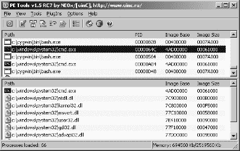
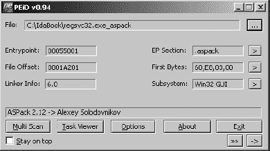

# 第一部分。IDA 简介

# 第一章。汇编简介


你可能想知道一本专门介绍 IDA Pro 的书会有什么内容。虽然显然是以 IDA 为中心，但这本书并不打算成为*IDA Pro 用户手册*。相反，我们打算使用 IDA 作为讨论逆向工程技术的工具，这些技术对于分析各种软件非常有用，从易受攻击的应用程序到恶意软件。在适当的时候，我们将提供在 IDA 中执行与当前任务相关的特定操作的详细步骤。因此，我们将对 IDA 的功能进行较为曲折的探索，从检查文件时的基本任务开始，到高级使用和定制 IDA 以解决更复杂的逆向工程问题。我们并不试图涵盖 IDA 的所有功能。然而，我们确实涵盖了你在解决逆向工程挑战时最可能发现有用的功能。这本书将帮助使 IDA 成为你工具库中最强大的武器。

在深入研究 IDA 的任何具体内容之前，了解汇编过程的一些基本知识以及回顾一些可用于编译代码逆向工程的其他工具将是有用的。虽然这些工具中没有哪一个提供 IDA 的全部功能，但每个工具都针对 IDA 功能的具体子集，并为特定 IDA 功能提供了宝贵的见解。本章的其余部分致力于理解汇编过程。

# 汇编理论

任何花时间研究编程语言的人可能都了解过各种语言代系，但这里总结了这些内容，以便那些可能一直在睡觉的人了解。

**第一代语言**

这些是最基本的语言形式，通常由一和零或一些简写形式，如十六进制组成，只有二进制忍者才能阅读。在这个层面上，事情很混乱，因为通常很难区分数据和指令，因为它们看起来几乎完全相同。第一代语言也被称为*机器语言*，在某些情况下称为*字节码*，而机器语言程序通常被称为*二进制*。

**第二代语言**

也称为*汇编语言*，第二代语言仅通过查找表即可接近机器语言，通常将特定的位模式或操作码（opcodes）映射到简短但易于记忆的字符序列，称为*助记符*。偶尔，这些助记符实际上有助于程序员记住与它们相关的指令。*汇编器*是程序员用来将他们的汇编语言程序翻译成适合执行的目标机器语言的工具。

**第三代语言**

这些语言通过引入程序员用作程序构建块的键词和结构，进一步提高了自然语言的表达能力。第三代语言通常是平台无关的，尽管使用它们编写的程序可能由于使用了特定操作系统的独特功能而具有平台依赖性。常引用的例子包括 FORTRAN、COBOL、C 和 Java。程序员通常使用编译器将他们的程序翻译成汇编语言，甚至直接翻译成机器语言（或某些粗略的等效物，如字节码）。

**第四代语言**

这些工具存在，但与本书无关，因此不会进行讨论。

# 反汇编的“是什么”

在传统的软件开发模型中，编译器、汇编器和链接器单独使用或组合使用来创建可执行程序。为了逆向工作（或进行逆向工程），我们使用工具来撤销汇编和编译过程。不出所料，这样的工具被称为*反汇编器*和*反汇编器*，它们基本上做了它们名字暗示的事情。反汇编器撤销汇编过程，因此我们应该期望输出是汇编语言（因此输入是机器语言）。反汇编器旨在在给定汇编语言甚至机器语言作为输入时产生高级语言输出。

在竞争激烈的软件市场中，“源代码恢复”的承诺总是具有吸引力，因此，可用的反汇编器的开发仍然是计算机科学中的一个活跃的研究领域。以下只是几个说明反汇编困难的原因：

**编译过程是有损的**。

在机器语言级别，没有变量或函数名，变量类型信息只能通过数据的使用方式来确定，而不是通过显式的类型声明。当你观察到 32 位数据正在传输时，你需要做一些调查工作来确定这 32 位代表一个整数、一个 32 位的浮点值还是一个 32 位的指针。

**编译是一个多对多的操作**。

这意味着源程序可以以多种不同的方式翻译成汇编语言，机器语言也可以以多种不同的方式翻译回源代码。因此，编译一个文件然后立即反汇编它可能会产生与输入文件截然不同的源文件是很常见的。

**反汇编器非常依赖于语言和库**。

使用设计用于生成 C 代码的反汇编器处理由 Delphi 编译器生成的二进制文件可能会产生非常奇怪的结果。同样，将编译的 Windows 二进制文件通过一个对 Windows 编程 API 一无所知的反汇编器处理可能不会产生任何有用的结果。

**为了准确反汇编二进制文件，需要几乎完美的反汇编能力**。

在反汇编阶段出现的任何错误或遗漏几乎肯定会传播到反编译代码中。

Hex-Rays，目前市场上最复杂的反编译器，将在第二十三章中回顾。

# 反汇编的“为什么”

反汇编工具的目的通常是为了在源代码不可用时方便理解程序。使用反汇编的常见情况包括以下这些：

+   恶意软件分析

+   封闭源软件的安全漏洞分析

+   封闭源软件的互操作性分析

+   分析编译器生成的代码以验证编译器性能/正确性

+   调试时显示程序指令

后续章节将更详细地解释每种情况。

## 恶意软件分析

除非你正在处理基于脚本的蠕虫，恶意软件作者很少会提供他们作品的源代码。没有源代码，你将面临一个非常有限的选项集，以发现恶意软件的确切行为。恶意软件分析的两个主要技术是动态分析和静态分析。*动态分析*涉及在精心控制的环境中（沙盒）允许恶意软件执行，同时使用任何数量的系统仪器工具记录其行为的每一个可观察方面。相比之下，*静态分析*试图通过阅读程序代码来理解程序的行为，在恶意软件的情况下，这通常由反汇编列表组成。

## 漏洞分析

为了简化起见，让我们将整个安全审计过程分为三个步骤：漏洞发现、漏洞分析和利用开发。无论你是否拥有源代码，这些步骤都适用；然而，当你只有二进制文件时，所需的努力水平会大幅增加。这个过程的第一步是在程序中发现一个可能可利用的条件。这通常是通过使用模糊测试等动态技术来完成的，但也可以通过静态分析来完成（通常需要更多的努力）。一旦发现问题，通常需要进行进一步的分析，以确定问题是否可利用，如果是的话，在什么条件下可利用。

反汇编列表提供了理解编译器如何选择分配程序变量的详细程度。例如，可能有用的是知道程序员声明的 70 字节字符数组在编译器分配时被四舍五入到 80 字节。反汇编列表还提供了唯一的方法来确定编译器如何选择对所有全局或函数内声明的变量进行排序。在尝试开发利用程序时，理解变量之间的空间关系通常是至关重要的。最终，通过使用反汇编器和调试器一起，可以开发出利用程序。

## 软件互操作性

当软件仅以二进制形式发布时，竞争对手很难创建可以与之互操作的软件或提供该软件的插件替代品。一个常见的例子是为仅支持一个平台的硬件发布的驱动代码。当供应商缓慢支持或更糟糕的是拒绝支持其硬件与替代平台的使用时，可能需要大量的逆向工程工作来开发支持该硬件的软件驱动程序。在这些情况下，静态代码分析几乎是唯一的补救措施，并且通常必须超出软件驱动程序来理解嵌入式固件。

## 编译器验证

由于编译器（或汇编器）的目的是生成机器语言，因此通常需要优秀的拆解工具来验证编译器是否按照任何设计规范完成其工作。分析师还可能对寻找优化编译器输出的额外机会感兴趣，从安全角度来看，确定编译器本身是否已被破坏到可能在其生成的代码中插入后门的程度。

## 调试显示

可能最常见的使用拆解器的方式是在调试器中生成列表。不幸的是，嵌入在调试器中的拆解器往往相当简单。它们通常无法进行批量拆解，有时在无法确定函数边界时甚至拒绝拆解。这就是为什么最好将调试器与高质量的拆解器一起使用，以便在调试过程中提供更好的情境意识和上下文。

* * *

^([1]) *模糊测试*是一种漏洞发现技术，它依赖于为程序生成大量唯一的输入，希望其中之一会导致程序以可检测、分析并最终可利用的方式失败。

# 拆解的“如何”

现在你已经熟悉了拆解的目的，是时候继续了解这个过程是如何实际运作的了。考虑一个典型的令拆解者感到畏惧的任务：*将这些 100KB 的数据区分开来，区分代码和数据，将代码转换为汇编语言以供用户显示，并且在过程中请勿遗漏任何细节*。我们可以在末尾添加任何数量的特殊要求，例如要求拆解器定位函数、识别跳转表和识别局部变量，从而使拆解器的任务变得更加困难。

为了满足我们的所有需求，任何反汇编器在导航我们提供的文件时都需要从各种算法中进行选择。生成的反汇编列表的质量将直接与所使用算法的质量以及它们的实现程度有关。在本节中，我们将讨论目前用于反汇编机器代码的两个基本算法。在介绍这些算法时，我们还将指出它们的不足，以便为你的反汇编器似乎失败的情况做好准备。通过了解反汇编器的限制，你将能够手动干预以改善反汇编输出的整体质量。

## 基本反汇编算法

首先，让我们开发一个简单的算法，用于接受机器语言作为输入并产生汇编语言作为输出。通过这样做，我们将了解自动化反汇编过程背后的挑战、假设和妥协。

**步骤 1**

反汇编过程的第一步是确定要反汇编的代码区域。这并不一定像看起来那么简单。指令通常与数据混合，区分两者很重要。在最常见的情况下，反汇编可执行文件时，文件将符合可执行文件的通用格式，例如在 Windows 上使用的通用可执行文件（PE）格式或许多基于 Unix 系统的通用可执行链接格式（ELF）。这些格式通常包含机制（通常以分层文件头的形式），用于定位包含代码和进入该代码的入口点^([2])。

**步骤 2**

给定一条指令的初始地址，下一步是读取该地址（或文件偏移量）中包含的值，并执行表查找以将二进制操作码值与其汇编语言助记符匹配。根据正在反汇编的指令集的复杂性，这可能是一个简单的过程，也可能涉及几个额外的操作，例如理解可能修改指令行为的任何前缀以及确定指令所需的任何操作数。对于具有可变长度指令的指令集，例如英特尔 x86，可能需要检索额外的指令字节才能完全反汇编单个指令。

**步骤 3**

一旦取回指令并解码了所需的操作数，其汇编语言等效物将被格式化并作为反汇编列表的一部分输出。可能可以选择多种汇编语言输出语法。例如，x86 汇编语言的两种主要格式是英特尔格式和 AT&T 格式。

X86 汇编语法：AT&T 与英特尔

用于汇编源代码的两种主要语法是 AT&T 和 Intel。尽管它们是第二代语言，但它们在语法上差异很大，从变量、常量和寄存器访问到段和指令大小覆盖，再到间接和偏移量。AT&T 汇编语法的特点是使用%符号作为所有寄存器名称的前缀，使用$作为文字常量（也称为*立即操作数*）的前缀，以及其操作数顺序，其中源操作数作为左手操作数，目标操作数位于右侧。使用 AT&T 语法，将四个加到 EAX 寄存器的指令将读取为：`add $0x4,%eax`。GNU 汇编器（Gas）和许多其他 GNU 工具，包括 gcc 和 gdb，都使用 AT&T 语法。

Intel 语法与 AT&T 不同，因为它不需要寄存器或文字前缀，并且操作数顺序相反，即源操作数位于右侧，目标操作数位于左侧。使用 Intel 语法的相同加法指令将读取为：`add eax,0x4`。使用 Intel 语法的汇编器包括 Microsoft 汇编器（MASM）、Borland 的 Turbo 汇编器（TASM）和 Netwide 汇编器（NASM）。

**步骤 4**

在输出一个指令之后，我们需要前进到下一个指令并重复之前的步骤，直到我们反汇编了文件中的每个指令。

存在着各种算法来确定反汇编的开始位置，如何选择下一个要反汇编的指令，如何区分代码和数据，以及如何确定最后一个指令已经被反汇编。两种主要的反汇编算法是*线性扫描*和*递归下降*。

## 线性扫描反汇编

线性扫描反汇编算法采用了一种非常直接的方法来定位要反汇编的指令：一个指令结束，另一个指令开始。因此，面临的最困难的决定是哪里开始。通常的解决方案是假设程序中标记为代码的部分（通常由程序文件的头部指定）包含的是机器语言指令。反汇编从代码部分的第一字节开始，以线性方式通过该部分，逐个反汇编指令，直到达到部分的末尾。没有努力去通过识别非线性指令（如分支）来理解程序的控制流。

在反汇编过程中，可以维护一个指针来标记当前正在反汇编的指令的开始。作为反汇编过程的一部分，计算每个指令的长度，并用于确定下一个要反汇编的指令的位置。具有固定长度指令集（例如 MIPS）的反汇编相对容易，因为定位后续指令是直接的。

线性扫描算法的主要优势是它提供了对程序代码段的全面覆盖。线性扫描方法的其中一个主要缺点是它未能考虑到数据可能与代码混合在一起的事实。这在示例 1-1 中表现得尤为明显，该示例展示了使用线性扫描反汇编器反汇编的函数输出。这个函数包含了一个 switch 语句，并且在这个例子中，编译器选择使用跳转表来实现 switch。此外，编译器还选择在函数本身中嵌入跳转表。位于`401250`的`jmp`语句引用了一个以`401257`开始的地址表。不幸的是，反汇编器将`401257`视为一条指令，并错误地生成了相应的汇编语言表示：

示例 1-1. 线性扫描反汇编

```
40123f:    55                       push   ebp
  401240:    8b ec                    mov    ebp,esp
  401242:    33 c0                    xor    eax,eax
  401244:    8b 55 08                 mov    edx,DWORD PTR [ebp+8]
  401247:    83 fa 0c                 cmp    edx,0xc
  40124a:    0f 87 90 00 00 00        ja     0x4012e0
 401250:    ff 24 95 57 12 40 00     jmp    DWORD PTR [edx*4+0x401257]
 401257:    e0 12                    loopne 0x40126b
  401259:    40                       inc    eax
  40125a:    00 8b 12 40 00 90        add    BYTE PTR [ebx-0x6fffbfee],cl
  401260:    12 40 00                 adc    al,BYTE PTR [eax]
  401263:    95                       xchg   ebp,eax
  401264:    12 40 00                 adc    al,BYTE PTR [eax]
  401267:    9a 12 40 00 a2 12 40     call   0x4012:0xa2004012
  40126e:    00 aa 12 40 00 b2        add    BYTE PTR [edx-0x4dffbfee],ch
  401274:    12 40 00                 adc    al,BYTE PTR [eax]
  401277:    ba 12 40 00 c2           mov    edx,0xc2004012
  40127c:    12 40 00                 adc    al,BYTE PTR [eax]
  40127f:    ca 12 40                 lret   0x4012
  401282:    00 d2                    add    dl,dl
  401284:    12 40 00                 adc    al,BYTE PTR [eax]
  401287:    da 12                    ficom  DWORD PTR [edx]
  401289:    40                       inc    eax
  40128a:    00 8b 45 0c eb 50        add    BYTE PTR [ebx+0x50eb0c45],cl
  401290:    8b 45 10                 mov    eax,DWORD PTR [ebp+16]
  401293:    eb 4b                    jmp    0x4012e0
```

如果我们从`401257`开始，以小端格式检查连续的 4 字节组作为值，我们会看到每个值代表一个指向附近地址的指针，而这个地址实际上是各种跳转（`004012e0`、`0040128b`、`00401290`等）的目的地。因此，位于`401257`的`loopne`指令根本不是一条指令。相反，它表明线性扫描算法未能正确地区分嵌入的数据和代码。

线性扫描被包含在 GNU 调试器（gdb）、微软的 WinDbg 调试器和`objdump`实用程序中的反汇编引擎所使用。

## 递归下降反汇编

递归下降采用不同的方法来定位指令。递归下降关注控制流的概念，根据指令是否被其他指令引用来决定是否应该反汇编指令。为了理解递归下降，根据指令如何影响 CPU 指令指针对指令进行分类是有帮助的。

### 顺序流程指令

顺序流程指令将执行传递给紧随其后的指令。顺序流程指令的例子包括简单的算术指令，如`add`；寄存器到内存传输指令，如`mov`；以及栈操作，如`push`和`pop`。对于此类指令，反汇编过程与线性扫描相同。

### 条件分支指令

条件分支指令，如 x86 的 `jnz`，提供两条可能的执行路径。如果条件评估为真，则执行分支，并且指令指针必须更改以反映分支的目标。然而，如果条件为假，执行将以线性方式继续，可以使用线性扫描方法来反汇编下一个指令。由于在静态上下文中通常无法确定条件测试的结果，递归下降算法会反汇编两条路径，通过将目标指令的地址添加到稍后要反汇编的地址列表中，延迟反汇编分支目标指令。

### 无条件分支指令

无条件分支不遵循线性流程模型，因此递归下降算法会以不同的方式处理它们。与顺序流程指令一样，执行只能流向一个指令；然而，该指令不必立即跟随分支指令。实际上，正如示例 1-1 所示，无条件分支后不需要指令立即跟随。因此，没有必要反汇编无条件分支后的字节。

递归下降反汇编器将尝试确定无条件跳转的目标，并将目标地址添加到尚未探索的地址列表中。不幸的是，某些无条件分支可能会给递归下降反汇编器带来问题。当跳转指令的目标依赖于运行时值时，可能无法通过静态分析确定跳转的目的地。x86 指令 `jmp eax` 就展示了这个问题。`eax` 寄存器仅在程序实际运行时才包含值。由于在静态分析期间寄存器不包含值，我们无法确定跳转指令的目标，因此也无法确定反汇编过程的继续位置。

### 函数调用指令

函数调用指令的操作方式与无条件跳转指令非常相似（包括反汇编器无法确定如 `call eax` 这样的指令的目标），并且还有一个额外的期望，即函数完成后执行通常会返回到调用指令之后的指令。在这方面，它们与条件分支指令相似，因为它们生成两条执行路径。调用指令的目标地址被添加到列表中以便延迟反汇编，而调用指令之后的指令以类似于线性扫描的方式反汇编。

如果程序在从被调用函数返回时没有按预期行为，递归下降可能会失败。例如，函数中的代码可以故意操纵该函数的返回地址，使得在完成时，控制权返回到与反汇编器预期不同的位置。以下是一个简单的错误列表示例，其中函数`foo`在返回调用者之前简单地将 1 加到返回地址上。

```
foo                 proc near
  FF 04 24          inc     dword ptr [esp]  ; increments saved return addr
  C3                retn
foo                 endp
; -------------------------------------
bar:
  E8 F7 FF FF FF    call    foo
  05 89 45 F8 90    add   eax, 90F84589h
```

因此，控制实际上并没有传递到调用`foo`之后的处的`add`指令。下面是一个适当的反汇编示例：

```
foo                 proc near
  FF 04 24          inc     dword ptr [esp]
  C3                retn
foo                 endp
; -------------------------------------
bar:
  E8 F7 FF FF FF    call    foo
  05                db    5 ;formerly the first byte of the add instruction
  89 45 F8          mov   [ebp-8], eax
  90                nop
```

此列表更清楚地显示了程序的实际流程，其中函数`foo`实际上返回到`mov`指令，如图所示 。重要的是要理解，线性扫描反汇编器也会失败地正确反汇编此代码，尽管原因略有不同。

### 返回指令

在某些情况下，递归下降算法会耗尽可跟随的路径。一个函数返回指令（例如 x86 的`ret`）不会提供关于下一个要执行指令的信息。如果程序实际上正在运行，则会从运行时栈的顶部取一个地址，并且执行将从该地址恢复。反汇编器没有访问栈的优势。相反，反汇编会突然停止。正是在这一点上，递归下降反汇编器转向它为延迟反汇编而保留的地址列表。从这个列表中移除一个地址，并从这个地址继续反汇编过程。这就是赋予反汇编算法其名称的递归过程。

递归下降算法的一个主要优点是其区分代码和数据的能力优于其他算法。作为一个基于控制流的算法，它不太可能错误地将数据值反汇编为代码。递归下降的主要缺点是无法跟随间接代码路径，例如跳转或调用，这些路径使用指针表来查找目标地址。然而，通过添加一些启发式方法来识别指向代码的指针，递归下降反汇编器可以提供非常完整的代码覆盖率和出色的代码与数据识别。示例 1-2 显示了在之前示例 1-1 中显示的相同 switch 语句上使用的递归下降反汇编器的输出。

示例 1-2。递归下降反汇编

```
0040123F   push ebp
00401240   mov  ebp, esp
00401242   xor  eax, eax
00401244   mov  edx, [ebp+arg_0]
00401247   cmp  edx, 0Ch             ; switch 13 cases
0040124A   ja   loc_4012E0           ; default
0040124A                             ; jumptable 00401250 case 0
00401250   jmp  ds:off_401257[edx*4] ; switch jump
00401250 ; ---------------------------------------------------
00401257 off_401257:
00401257   dd offset loc_4012E0  ; DATA XREF: sub_40123F+11r
00401257   dd offset loc_40128B  ; jump table for switch statement
00401257   dd offset loc_401290
00401257   dd offset loc_401295
00401257   dd offset loc_40129A
00401257   dd offset loc_4012A2
00401257   dd offset loc_4012AA
00401257   dd offset loc_4012B2
00401257   dd offset loc_4012BA
00401257   dd offset loc_4012C2
00401257   dd offset loc_4012CA
00401257   dd offset loc_4012D2
00401257   dd offset loc_4012DA
0040128B ; ---------------------------------------------------
0040128B
0040128B loc_40128B:             ; CODE XREF: sub_40123F+11j
0040128B                         ; DATA XREF: sub_40123F:off_401257o
0040128B   mov  eax, [ebp+arg_4] ; jumptable 00401250 case 1
0040128E   jmp  short loc_4012E0 ; default
0040128E                         ; jumptable 00401250 case 0
```

注意，跳转目标表已经被识别并相应地格式化。IDA Pro 是最著名的递归下降反汇编器的例子。理解递归下降过程将帮助我们识别 IDA 可能产生非最佳反汇编的情况，并允许我们制定策略来提高 IDA 的输出。

* * *

^([2]) *程序入口点*简单地是指操作系统在程序加载到内存后传递控制权的指令地址。

^([3]) CPU 被描述为大端或小端，这取决于 CPU 是首先保存多字节值的最重要字节（大端）还是首先存储最不重要的字节（小端）。

# 摘要

在使用反汇编器时，对反汇编算法的深入理解是否是必要的？不是。它有用吗？是的！在与工具斗争时，你肯定不希望花费时间。IDA 的许多优点之一是，与其他大多数反汇编器不同，它为你提供了很多机会来引导和覆盖其决策。最终结果是，最终产品，一个准确的反汇编，将远远优于其他任何可用的东西。

在下一章中，我们将回顾各种现有工具，这些工具在许多逆向工程场景中非常有用。虽然这些工具与 IDA 没有直接关系，但许多工具都受到了 IDA 的影响，并且它们有助于解释 IDA 用户界面中可用的广泛信息显示。

# 第二章。逆向工程和反汇编工具


在掌握了一些反汇编背景知识之后，在我们开始深入研究 IDA Pro 的具体细节之前，了解一些用于逆向工程二进制文件的其他工具将是有用的。许多这些工具在 IDA 之前就已经存在，并且继续用于快速查看文件以及双重检查 IDA 的工作。正如我们将看到的，IDA 将这些工具的许多功能整合到其用户界面中，以提供一个单一的、集成的逆向工程环境。最后，尽管 IDA 包含一个集成的调试器，但在这里我们不会介绍调试器，因为第二十四章、第二十五章和第二十六章都专门讨论了这个主题。

# 分类工具

当首次遇到一个未知文件时，回答简单的问题，如“这是什么？”通常很有用。尝试回答该问题的第一规则是*永远不要*依赖文件扩展名来确定文件实际上是什么。这也是第二个、第三个和第四个经验法则。一旦你成为“文件扩展名没有意义”这一观点的拥护者，你可能希望熟悉以下一个或多个实用工具。

## file

`file` 命令是一个标准实用工具，包含在大多数 *NIX 风格的操作系统以及 Windows 的 Cygwin^([4]) 或 MinGW^([5]) 工具中。`File` 通过检查文件中的特定字段来尝试识别文件类型。在某些情况下，`file` 识别常见的字符串，如 *#!/bin/sh*（一个 shell 脚本）或 *<html>*（一个 HTML 文档）。包含非 ASCII 内容的文件会带来一些挑战。在这种情况下，`file` 尝试确定内容是否似乎遵循一个已知的文件格式。在许多情况下，它会搜索特定的标签值（通常称为魔数^([6]))，这些值被认为是特定文件类型的独特标识。下面的十六进制列表显示了用于识别一些常见文件类型的几个魔数示例。

```
Windows PE executable file
00000000   `4D 5A` 90 00  03 00 00 00  04 00 00 00  FF FF 00 00  `MZ`..............
00000010   B8 00 00 00  00 00 00 00  40 00 00 00  00 00 00 00  ........@.......

Jpeg image file
00000000   `FF D8` FF E0  00 10 `4A 46  49 46` 00 01  01 01 00 60  ......`JFIF`.....`
00000010   00 60 00 00  FF DB 00 43  00 0A 07 07  08 07 06 0A  .`.....C........

Java .class file
00000000   `CA FE BA BE`  00 00 00 32  00 98 0A 00  2E 00 3E 08  .......2......>.
00000010   00 3F 09 00  40 00 41 08  00 42 0A 00  43 00 44 0A  .?..@.A..B..C.D.
```

`file` 能够识别大量文件格式，包括几种 ASCII 文本文件类型以及各种可执行和数据文件格式。`file` 执行的魔数检查受一个 *magic 文件* 中包含的规则的约束。默认的 magic 文件因操作系统而异，但常见位置包括 */usr/share/file/magic*，*/usr/share/misc/magic* 和 */etc/magic*。请参阅 `file` 的文档以获取有关 magic 文件的更多信息。

CYGWIN 环境

Cygwin 是一套为 Windows 操作系统提供的工具，它提供了一个 Linux 风格的命令 shell 和相关程序。在安装过程中，用户可以从大量的标准包中进行选择，包括编译器（gcc、g++）、解释器（Perl、Python、Ruby）、网络工具（`nc`、`ssh`）等。一旦安装了 Cygwin，许多为 Linux 编写的程序就可以在 Windows 系统上编译和执行。

在某些情况下，`file` 可以区分给定文件类型内的变体。以下列表展示了 `file` 能够识别的不仅仅是几种 ELF 二进制文件的变体，还包括有关二进制文件是如何链接（静态或动态）以及二进制文件是否被剥离的信息。

```
idabook# `file ch2_ex_*`
ch2_ex.exe:                  MS-DOS executable PE  for MS Windows (console)
                             Intel 80386 32-bit
ch2_ex_upx.exe:              MS-DOS executable PE  for MS Windows (console)
                             Intel 80386 32-bit, UPX compressed
ch2_ex_freebsd:              ELF 32-bit LSB executable, Intel 80386,
                             version 1 (FreeBSD), for FreeBSD 5.4,
                             dynamically linked (uses shared libs),
                             FreeBSD-style, not stripped
ch2_ex_freebsd_static:       ELF 32-bit LSB executable, Intel 80386,
                             version 1 (FreeBSD), for FreeBSD 5.4,
                             statically linked, FreeBSD-style, not stripped
ch2_ex_freebsd_static_strip: ELF 32-bit LSB executable, Intel 80386,
                             version 1 (FreeBSD), for FreeBSD 5.4,
                             statically linked, FreeBSD-style, stripped
ch2_ex_linux:                ELF 32-bit LSB executable, Intel 80386,
                             version 1 (SYSV), for GNU/Linux 2.6.9,
                             dynamically linked (uses shared libs),
                             not stripped
ch2_ex_linux_static:         ELF 32-bit LSB executable, Intel 80386,
                             version 1 (SYSV), for GNU/Linux 2.6.9,
                             statically linked, not stripped
ch2_ex_linux_static_strip:   ELF 32-bit LSB executable, Intel 80386,
                             version 1 (SYSV), for GNU/Linux 2.6.9,
                             statically linked, stripped
ch2_ex_linux_stripped:       ELF 32-bit LSB executable, Intel 80386,
                             version 1 (SYSV), for GNU/Linux 2.6.9,
                             dynamically linked (uses shared libs), stripped
```

剥离二进制可执行文件

去除二进制文件中的符号是移除二进制文件中符号的过程。二进制目标文件包含符号，这是编译过程的结果。其中一些符号在链接过程中被用于解决文件之间的引用，以创建最终的执行文件或库。在其他情况下，符号可能存在以提供用于调试器的额外信息。在链接过程之后，许多符号不再需要。传递给链接器的选项可以导致链接器在构建时移除不必要的符号。或者，可以使用名为 `strip` 的实用程序从现有二进制文件中移除符号。虽然去除符号的二进制文件将比未去除符号的对应文件更小，但去除符号的二进制文件的行为将保持不变。

`file` 和类似的实用程序并非万无一失。一个文件可能仅仅因为偶然带有某种文件格式的标识符而被错误识别。您可以通过使用十六进制编辑器修改任何文件的第一个四个字节为 Java 魔数序列：`CA FE BA BE` 来亲自看到这一点。`file` 实用程序将错误地将新修改的文件识别为 *编译的 Java 类数据*。同样，只包含两个字符 `MZ` 的文本文件将被识别为 *MS-DOS 可执行文件*。在任何逆向工程工作中，一个好的做法是在您将输出与多个工具和手动分析相关联之前，不要完全信任任何工具的输出。

## PE Tools

PE Tools^([7]) 是一套用于分析 Windows 系统上运行进程和可执行文件的工具集合。图 2-1 显示了 PE Tools 提供的主要界面，该界面显示活动进程列表并提供对所有 PE Tools 实用程序的访问。



图 2-1. PE 工具实用程序

从进程列表中，用户可以将进程的内存映像导出到文件，或者使用 PE 嗅探器实用程序来确定用于构建可执行文件的编译器，或者可执行文件是否被任何已知的混淆工具处理。工具菜单提供了类似的分析磁盘文件选项。用户可以使用嵌入的 PE 编辑器实用程序查看文件的 PE 标头字段，该实用程序还允许轻松修改任何标头值。在尝试从该文件的混淆版本中重建有效的 PE 时，通常需要修改 PE 标头。

二进制文件混淆

*混淆*是指任何试图掩盖某事物真正含义的尝试。当应用于可执行文件时，混淆是指任何试图隐藏程序真实行为的尝试。程序员可能出于多种原因采用混淆。常见的例子包括保护专有算法和掩盖恶意意图。几乎所有形式的恶意软件都利用混淆来阻碍分析。有许多工具可供程序作者使用，以生成混淆程序。混淆工具和技术及其对逆向工程过程的影响将在第二十一章中进一步讨论。

## PEiD

PEiD^([8]) 是另一个 Windows 工具，其主要目的是识别用于构建特定 Windows PE 二进制的编译器以及识别用于混淆 Windows PE 二进制的任何工具。图 2-2 显示了使用 PEiD 识别用于混淆 Gaobot^([9])蠕虫变体的工具（在本例中为 ASPack）。



图 2-2. PEiD 工具

PEiD 具有许多与 PE Tools 重叠的附加功能，包括总结 PE 文件头、收集有关运行进程的信息以及执行基本反汇编。

* * *

^([4]) 请参阅 [`www.cygwin.com/`](http://www.cygwin.com/)。

^([5]) 请参阅 [`www.mingw.org/`](http://www.mingw.org/)。

^([6]) *魔数*是一些文件格式规范所要求的特殊标记值，其存在表示符合此类规范。在某些情况下，选择魔数的原因可能带有幽默感。在 MS-DOS 可执行文件头中的`MZ`标记代表 Mark Zbikowski 的缩写，他是 MS-DOS 的原始架构师之一，而与 Java *.class* 文件关联的众所周知的魔数`0xcafebabe`被选择，因为它是一串易于记忆的十六进制数字。

^([7]) 请参阅 [`petools.org.ru/petools.shtml`](http://petools.org.ru/petools.shtml)。

^([8]) 请参阅 [`peid.info/`](http://peid.info/)。

^([9]) 请参阅 [`securityresponse.symantec.com/security_response/writeup.jsp?docid=2003-112112-1102-99`](http://securityresponse.symantec.com/security_response/writeup.jsp?docid=2003-112112-1102-99)。

# 摘要工具

由于我们的目标是逆向工程二进制程序文件，我们需要更复杂的工具来提取文件初步分类后的详细信息。本节讨论的工具，由于必要性，对它们处理的文件格式有更深入的了解。在大多数情况下，这些工具理解一个非常具体的文件格式，并且这些工具被用来解析输入文件以提取非常具体的信息。

## nm

当源文件被编译成对象文件时，编译器必须嵌入有关任何全局（外部）符号位置的信息，以便链接器在将对象文件组合成可执行文件时能够解析对这些符号的引用。除非指示从最终可执行文件中删除符号，否则链接器通常会将符号从对象文件中传递到生成的可执行文件中。根据 man 页面，`nm` 工具的目的是“列出对象文件中的符号”。

当使用 `nm` 检查一个中间对象文件（一个 *.o* 文件而不是可执行文件）时，默认输出会显示文件中声明的任何函数和全局变量的名称。以下是 `nm` 工具的示例输出：

```
idabook# `gcc -c ch2_example.c`
idabook# `nm ch2_example.o`
         U __stderrp
         U exit
         U fprintf
00000038 T get_max
00000000 t hidden
00000088 T main
00000000 D my_initialized_global
00000004 C my_unitialized_global
         U printf
         U rand
         U scanf
         U srand
         U time
00000010 T usage
idabook#
```

在这里，我们可以看到 `nm` 列出了每个符号以及一些关于符号的信息。字母代码用于指示所列符号的类型。在这个例子中，我们可以看到以下字母代码，我们将现在解释它们：

| **`U`** | 一个未定义的符号，通常是一个外部符号引用。 |
| --- | --- |
| **`T`** | 定义在文本节中的符号，通常是一个函数名。 |
| **`t`** | 定义在文本节中的局部符号。在一个 C 程序中，这通常等同于一个静态函数。 |
| **`D`** | 一个初始化的数据值。 |
| **`C`** | 一个未初始化的数据值。 |

### 注意

用来表示全局符号的大写字母代码，而用来表示局部符号的小写字母代码。关于字母代码的完整解释可以在 `nm` 的 man 页面中找到。

当使用 `nm` 来显示可执行文件中的符号时，会显示更多一些的信息。在链接过程中，符号被解析为虚拟地址（如果可能的话），这使得当运行 `nm` 时可以获得更多信息。以下是使用 `nm` 在可执行文件上截取的示例输出：

```
idabook# `gcc -o ch2_example ch2_example.c`
idabook# `nm ch2_example`
         <. . .>
         U exit
         U fprintf
080485c0 t frame_dummy
08048644 T get_max
0804860c t hidden
08048694 T main
0804997c D my_initialized_global
08049a9c B my_unitialized_global
08049a80 b object.2
08049978 d p.0
         U printf
         U rand
         U scanf
         U srand
         U time
0804861c T usage
idabook#
```

在这一点上，一些符号（例如 `main`）已经被分配了虚拟地址，一些新的符号（例如 `frame_dummy`）由于链接过程而被引入，一些（例如 `my_unitialized_global`）已经改变了它们的符号类型，还有一些由于继续引用外部符号而仍然是未定义的。在这种情况下，我们正在检查的二进制文件是动态链接的，未定义的符号在共享 C 库中定义。有关 `nm` 的更多信息，可以在其关联的 man 页面中找到。

## ldd

当创建一个可执行文件时，必须解析该可执行文件引用的任何库函数的位置。链接器有两种解析库函数调用的方法：*静态链接*和*动态链接*。提供给链接器的命令行参数决定了使用哪种方法。一个可执行文件可以是静态链接的、动态链接的，或者两者都是。¹⁰]

当请求静态链接时，链接器将应用程序的对象文件与所需库的副本组合在一起以创建可执行文件。在运行时，无需定位库代码，因为它已经包含在可执行文件中。静态链接的优点是（1）它导致函数调用略微更快，以及（2）二进制文件的分发更容易，因为无需对用户系统上库代码的可用性做出假设。静态链接的缺点包括（1）生成的可执行文件更大，以及（2）当库组件发生变化时，升级程序更加困难。由于每次库发生变化时都必须重新链接，因此程序更新更加困难。从逆向工程的角度来看，静态链接使问题变得复杂。如果我们面临分析静态链接二进制文件的任务，就没有简单的方法来回答“哪些库被链接到这个二进制文件中？”和“这些函数中哪个是库函数？”等问题。第十二章将讨论在逆向工程静态链接代码时遇到的挑战。

动态链接与静态链接的不同之处在于，链接器无需复制任何所需的库。相反，链接器只需将任何所需库的引用（通常是*.so*或*.dll*文件）插入到最终的执行文件中，通常导致可执行文件更小。当使用动态链接时，升级库代码要容易得多。由于维护单个库副本，并且许多二进制文件引用该副本，因此用新版本替换单个过时的库可以立即更新所有使用该库的二进制文件。使用动态链接的一个缺点是它需要一个更复杂的加载过程。所有必要的库都必须定位并加载到内存中，而不是加载一个包含所有库代码的静态链接文件。动态链接的另一个缺点是，供应商必须分发自己的可执行文件以及该可执行文件所依赖的所有库文件。在系统不包含所有必需的库文件的情况下尝试执行程序将导致错误。

以下输出演示了创建程序动态和静态链接版本的过程，生成的二进制文件的大小，以及`file`如何识别这些二进制文件：

```
idabook# `gcc -o ch2_example_dynamic ch2_example.c`
idabook# `gcc -o ch2_example_static ch2_example.c --static`
idabook# `ls -l ch2_example_*`
-rwxr-xr-x  1 root  wheel    6017 Sep 26 11:24 ch2_example_dynamic
-rwxr-xr-x  1 root  wheel  167987 Sep 26 11:23 ch2_example_static
idabook# `file ch2_example_*`
ch2_example_dynamic: ELF 32-bit LSB executable, Intel 80386, version 1
        (FreeBSD), dynamically linked (uses shared libs), not stripped
ch2_example_static:  ELF 32-bit LSB executable, Intel 80386, version 1
        (FreeBSD), statically linked, not stripped
idabook#
```

为了使动态链接正常工作，动态链接的二进制文件必须指明它们依赖的库以及从每个库中需要的特定资源。因此，与静态链接的二进制文件不同，确定动态链接二进制文件依赖的库相当简单。`ldd` (*列出动态依赖*) 实用程序是一个简单的工具，用于列出任何可执行文件所需的动态库。在以下示例中，使用 `ldd` 确定 Apache 网络服务器依赖的库：

```
idabook# `ldd /usr/local/sbin/httpd`
/usr/local/sbin/httpd:
        libm.so.4 => /lib/libm.so.4 (0x280c5000)
        libaprutil-1.so.2 => /usr/local/lib/libaprutil-1.so.2 (0x280db000)
        libexpat.so.6 => /usr/local/lib/libexpat.so.6 (0x280ef000)
        libiconv.so.3 => /usr/local/lib/libiconv.so.3 (0x2810d000)
        libapr-1.so.2 => /usr/local/lib/libapr-1.so.2 (0x281fa000)
        libcrypt.so.3 => /lib/libcrypt.so.3 (0x2821a000)
        libpthread.so.2 => /lib/libpthread.so.2 (0x28232000)
        libc.so.6 => /lib/libc.so.6 (0x28257000)
idabook#
```

`ldd` 实用程序在 Linux 和 BSD 系统上可用。在 OS X 系统上，可以使用带有 `–L` 选项的 `otool` 实用程序实现类似的功能：`otool -L` *`filename`*。在 Windows 系统上，可以使用 Visual Studio 工具套件中的 `dumpbin` 实用程序列出依赖库：`dumpbin /dependents` *`filename`*。

## objdump

虽然 `ldd` 相对专业，但 `objdump` 非常灵活。`objdump` 的目的是“显示对象文件中的信息。”^([11]) 这是一个相当广泛的目标，为了实现它，`objdump` 响应大量（30+）的命令行选项，这些选项针对从对象文件中提取各种信息。`objdump` 可以用来显示与对象文件相关的以下数据（等等）：

**段头信息**

程序文件中每个段的摘要信息。

**私有头信息**

程序内存布局信息以及其他由运行时加载器所需的信息，包括由 `ldd` 产生的所需库列表。

**调试信息**

从程序文件中提取任何嵌入的调试信息。

**符号信息**

以类似于 `nm` 实用程序的方式转储符号表信息。

**反汇编列表**

`objdump` 对标记为代码的文件部分执行线性扫描反汇编。当反汇编 x86 代码时，`objdump` 可以生成 AT&T 或 Intel 语法，并将反汇编内容捕获为文本文件。这样的文本文件称为反汇编 *死列表*，虽然这些文件当然可以用于逆向工程，但它们难以有效地导航，甚至更难以以一致且无错误的方式修改。

`objdump` 是 GNU binutils^([12]) 工具套件的一部分，可在 Linux、FreeBSD 和 Windows（通过 Cygwin）上找到。`objdump` 依赖于二进制文件描述符库（libbfd），这是 binutils 的一个组件，用于访问对象文件，因此能够解析由 libbfd 支持的文件格式（ELF 和 PE 等等）。对于 ELF 特定的解析，还有一个名为 `readelf` 的实用程序可用。`readelf` 提供了与 `objdump` 大多数相同的功能，两者之间的主要区别在于 `readelf` 不依赖于 libbfd。

## otool

`otool` 最容易描述为类似于 `objdump` 的实用工具，用于解析关于 OS X Mach-O 二进制文件的信息。以下列表展示了 `otool` 如何显示 Mach-O 二进制文件的动态库依赖关系，从而执行类似于 `ldd` 的功能。

```
idabook# `file osx_example`
osx_example: Mach-O executable ppc
idabook# `otool -L osx_example`
osx_example:
        /usr/lib/libstdc++.6.dylib (compatibility
 version 7.0.0, current version 7.4.0)
        /usr/lib/libgcc_s.1.dylib (compatibility version 1.0.0, current version 1.0.0)
        /usr/lib/libSystem.B.dylib (compatibility
 version 1.0.0, current version 88.1.5)
```

`otool` 可以用来显示与文件头和符号表相关的信息，以及执行文件代码段的反汇编。有关 `otool` 功能的更多信息，请参阅相关的手册页面。

## dumpbin

`dumpbin` 是微软 Visual Studio 工具套件中包含的命令行实用工具。像 `otool` 和 `objdump` 一样，`dumpbin` 能够显示与 Windows PE 文件相关的广泛信息。以下列表展示了 `dumpbin` 如何以类似于 `ldd` 的方式显示 Windows 计算器程序的动态依赖关系。

```
$ `dumpbin /dependents calc.exe`
Microsoft (R) COFF/PE Dumper Version 8.00.50727.762
Copyright (C) Microsoft Corporation.  All rights reserved.

Dump of file calc.exe

File Type: EXECUTABLE IMAGE

  Image has the following dependencies:

    SHELL32.dll
    msvcrt.dll
    ADVAPI32.dll
    KERNEL32.dll
    GDI32.dll
    USER32.dll
```

`dumpbin` 的附加选项提供了从 PE 二进制文件的不同部分提取信息的能力，包括符号、导入函数名称、导出函数名称和反汇编代码。有关 `dumpbin` 的更多信息，请参阅微软开发者网络（MSDN）。^([13])

## c++filt

允许函数重载的语言必须有一种机制来区分函数的许多重载版本，因为每个版本都有相同的名称。以下 C++示例显示了名为 `demo` 的几个重载版本的函数原型：

```
void demo(void);
void demo(int x);
void demo(double x);
void demo(int x, double y);
void demo(double x, int y);
void demo(char* str);
```

通常情况下，在目标文件中不允许存在两个同名函数。为了允许函数重载，编译器通过结合描述函数参数类型序列的信息来为重载函数生成唯一的名称。为具有相同名称的函数生成唯一名称的过程称为*名称混淆*。^([14]) 如果我们使用 `nm` 从前面 C++代码的编译版本中导出符号，我们可能会看到如下内容（过滤以关注 `demo` 的版本）：

```
idabook# `g++ -o cpp_test cpp_test.cpp`
idabook# `nm cpp_test | grep demo`
0804843c T _Z4demoPc
08048400 T _Z4demod
08048428 T _Z4demodi
080483fa T _Z4demoi
08048414 T _Z4demoid
080483f4 T _Z4demov
```

C++标准没有定义名称混淆方案的标准，这留给编译器设计者开发自己的方案。为了解读这里显示的 `demo` 的混淆版本，我们需要一个理解我们编译器（在这种情况下是 g++）名称混淆方案的工具。这正是 `c++filt` 工具的目的。`c++filt` 将每个输入词视为混淆名称，然后尝试确定生成该名称的编译器。如果名称看起来是一个有效的混淆名称，它将输出名称的解混淆版本。当 `c++filt` 识别不出一个词为混淆名称时，它将简单地输出该词而不做任何更改。

如果我们将前面示例中的 `nm` 结果通过 `c++filt` 传递，就有可能恢复解混淆的函数名称，如下所示：

```
idabook# `nm cpp_test | grep demo | c++filt`
0804843c T demo(char*)
08048400 T demo(double)
08048428 T demo(double, int)
080483fa T demo(int)
08048414 T demo(int, double)
080483f4 T demo()
```

需要注意的是，混淆名称包含关于函数的额外信息，这些信息是 `nm` 通常不提供的。这种信息在逆向工程情况下可能非常有用，在更复杂的情况下，这些额外信息可能包括有关类名或函数调用约定的数据。

* * *

^([10]) 关于链接的更多信息，请咨询 John R. Levine 的著作 *链接器和加载器*（旧金山：Morgan Kaufmann，2000 年）。

^([11]) 请参阅 [`www.sourceware.org/binutils/docs/binutils/objdump.html#objdump/`](http://www.sourceware.org/binutils/docs/binutils/objdump.html#objdump/)。

^([12]) 请参阅 [`www.gnu.org/software/binutils/`](http://www.gnu.org/software/binutils/)。

^([13]) 请参阅 [`msdn.microsoft.com/en-us/library/c1h23y6c(VS.71).aspx`](http://msdn.microsoft.com/en-us/library/c1h23y6c(VS.71).aspx)。

^([14]) 关于名称混淆的概述，请参阅 [`en.wikipedia.org/wiki/Name_mangling`](http://en.wikipedia.org/wiki/Name_mangling)。

# 深度检查工具

到目前为止，我们已经讨论了基于对文件内部结构最少了解进行文件粗略分析的工具。我们也看到了能够根据对文件结构的非常详细的知识从文件中提取特定数据点的工具。在本节中，我们将讨论旨在独立于被分析文件类型提取特定类型信息的工具。

## strings

有时询问有关文件内容的一般性问题是有用的，这些问题不一定需要任何特定于文件结构的知识。这样一个问题就是：“这个文件是否包含任何嵌入的字符串？”当然，我们首先必须回答“究竟什么构成了一个字符串？”让我们松散地定义一个 *字符串* 为可打印字符的连续序列。这个定义通常会被扩展以指定最小长度和特定的字符集。因此，我们可以指定搜索所有至少由四个连续 ASCII 可打印字符组成的序列，并将结果打印到控制台。对这种字符串的搜索通常不会受到文件结构的任何限制。你可以在 ELF 二进制文件中搜索字符串，就像你可以在 Microsoft Word 文档中搜索字符串一样。

`strings` 工具专门设计用于从文件中提取字符串内容，通常不考虑这些文件的格式。使用 `strings` 的默认设置（至少四个字符的 7 位 ASCII 序列）可能会得到如下结果：

```
idabook# `strings ch2_example`
/lib/ld-linux.so.2
__gmon_start__
libc.so.6
_IO_stdin_used
exit
srand
puts
time
printf
stderr
fwrite
scanf
__libc_start_main
GLIBC_2.0
PTRh
[^_]
usage: ch2_example [max]
A simple guessing game!
Please guess a number between 1 and %d.
Invalid input, quitting!
Congratulations, you got it in %d attempt(s)!
Sorry too low, please try again
Sorry too high, please try again
```

不幸的是，虽然我们看到了一些看起来可能是程序输出的字符串，但其他字符串似乎是函数名和库名。我们应该小心不要对程序的行为得出任何结论。分析师常常陷入根据 `strings` 输出推断程序行为的陷阱。记住，二进制文件中字符串的存在并不能表明该字符串以任何方式被该二进制文件使用。

关于 `strings` 的使用的一些注意事项：

+   当在可执行文件上使用 `strings` 时，重要的是要记住，默认情况下，只有文件的可加载、初始化部分会被扫描。使用 `-a` 命令行参数可以强制 `strings` 扫描整个输入文件。

+   `strings` 命令无法提供字符串在文件中的具体位置信息。使用 `-t` 命令行参数可以让 `strings` 打印出每个找到的字符串的文件偏移量信息。

+   许多文件使用替代字符集。使用 `-e` 命令行参数可以让 `strings` 搜索宽字符，如 16 位 Unicode。

## 反汇编器

如前所述，有几种工具可以生成类似 dead listing 风格的二进制对象文件反汇编。PE、ELF 和 Mach-O 二进制文件分别可以使用 `dumpbin`、`objdump` 和 `otool` 进行反汇编。然而，这些工具都无法处理任意块的二进制数据。你偶尔会遇到不符合广泛使用文件格式的二进制文件，在这种情况下，你需要能够从用户指定的偏移量开始反汇编过程的工具。

以下是对此类 *流反汇编器* 的 x86 指令集的两个示例：`ndisasm` 和 `diStorm`。^([15]) `ndisasm` 是 Netwide Assembler (NASM) 包含的一个实用工具。^([16]) 以下示例说明了如何使用 `ndisasm` 反汇编由 Metasploit 框架生成的 shellcode。^([17])

```
idabook# `./msfpayload linux/x86/shell_findport CPORT=4444 R > fs`
idabook# `ls -l fs`
-rw-r--r-- 1 ida ida 62 Dec 11 15:49 fs
idabook# `ndisasm -u fs`
00000000  31D2              xor edx,edx
00000002  52                push edx
00000003  89E5              mov ebp,esp
00000005  6A07              push byte +0x7
00000007  5B                pop ebx
00000008  6A10              push byte +0x10
0000000A  54                push esp
0000000B  55                push ebp
0000000C  52                push edx
0000000D  89E1              mov ecx,esp
0000000F  FF01              inc dword [ecx]
00000011  6A66              push byte +0x66
00000013  58                pop eax
00000014  CD80              int 0x80
00000016  66817D02115C      cmp word [ebp+0x2],0x5c11
0000001C  75F1              jnz 0xf
0000001E  5B                pop ebx
0000001F  6A02              push byte +0x2
00000021  59                pop ecx
00000022  B03F              mov al,0x3f
00000024  CD80              int 0x80
00000026  49                dec ecx
00000027  79F9              jns 0x22
00000029  52                push edx
0000002A  682F2F7368        push dword 0x68732f2f
0000002F  682F62696E        push dword 0x6e69622f
00000034  89E3              mov ebx,esp
00000036  52                push edx
00000037  53                push ebx
00000038  89E1              mov ecx,esp
0000003A  B00B              mov al,0xb
0000003C  CD80              int 0x80
```

流反汇编的灵活性在许多情况下都很有用。一种场景涉及分析计算机网络攻击，其中网络数据包可能包含 shellcode。流反汇编器可以用来反汇编包含 shellcode 的数据包部分，以便分析恶意负载的行为。另一种情况涉及分析无法找到布局参考的 ROM 图像。ROM 的某些部分将包含数据，而其他部分将包含代码。流反汇编器可以用来反汇编被认为可能是代码的那些图像部分。

* * *

^([15]) 请参阅 [`www.ragestorm.net/distorm/`](http://www.ragestorm.net/distorm/)。

^([16]) 请参阅 [`nasm.sourceforge.net/`](http://nasm.sourceforge.net/)。

^([17]) 请参阅 [`www.metasploit.com/`](http://www.metasploit.com/)。

# 摘要

本章讨论的工具并不一定是同类中的最佳选择。然而，它们确实代表了那些希望逆向工程二进制文件的人通常可以获得的工具。更重要的是，它们代表了激发 IDA 大部分开发工作的工具类型。在接下来的章节中，我们将讨论这些工具。对这些工具的了解将大大增强你对 IDA 用户界面以及 IDA 提供的众多信息显示的理解。

# 第三章。IDA Pro 背景


交互式反汇编器专业版，更广为人知的是*IDA Pro*或简称*IDA*，是位于比利时列日市的 Hex-Rays 公司的一个产品。IDA 背后的编程天才伊尔法克·古尔法诺夫，更广为人知的是*伊尔法克*。IDA 的生命始于十多年前，作为一个基于 MS-DOS 的控制台应用程序，这在很大程度上有助于我们了解 IDA 用户界面的本质。在众多方面，IDA 的非 GUI 版本适用于所有 IDA 支持的平台^([19])，并且继续使用从原始 DOS 版本派生出的控制台风格界面。

在本质上，IDA 是一个递归下降反汇编器；然而，大量的努力已经投入到开发逻辑中，以增强递归下降过程。为了克服递归下降的一个较大缺陷，IDA 采用大量启发式技术来识别在递归下降过程中可能未被发现的其他代码。在反汇编过程本身之外，IDA 还竭尽全力不仅区分数据反汇编和代码反汇编，而且确定那些数据反汇编所代表的确切数据类型。虽然你在 IDA 中看到的代码是汇编语言，但 IDA 的一个基本目标就是尽可能接近源代码地描绘一幅图景。IDA 竭尽全力对生成的反汇编进行注释，不仅包括数据类型信息，还包括派生变量和函数名称。这些注释最大限度地减少了原始十六进制代码的数量，并最大化了向用户展示的符号信息量。

# Hex-Rays 对盗版的立场

作为 IDA 用户，你应该意识到几个事实。IDA 是 Hex-Rays 的旗舰产品；因此，它非常关注 IDA 的未经授权的分发。在过去，公司已经看到了 IDA 盗版版本发布和销售下降之间的直接因果关系。IDA 的前出版商 DataRescue 甚至将海盗的名字贴在了其耻辱柱上^([20])。因此，IDA 利用几种反盗版技术来遏制盗版并执行许可限制。

需要注意的第一种技术：每个 IDA 副本都会被水印，以便将其唯一地与其购买者联系起来。如果 IDA 的副本出现在 warez 网站上，Hex-Rays 有追踪该副本回到原始购买者的能力，然后该购买者将被列入未来销售的 blacklist。在 Hex-Rays 的 IDA 支持论坛上找到与“泄露”的 IDA 副本相关的讨论并不罕见。

IDA 使用的另一种技术来强制执行其许可政策涉及在本地网络中扫描运行 IDA 的额外副本。当启动 IDA 的 Windows 版本时，会在端口 23945 上广播一个 UDP 数据包，并且 IDA 等待响应以查看是否在同一子网上存在运行在相同许可证密钥下的 IDA 的其他实例。将响应的数量与许可证适用的座位数进行比较，如果网络中找到的副本太多，IDA 将拒绝启动。但是请注意，使用单个许可证在单台计算机上运行多个 IDA 实例是允许的。

许可证执行的最终方法集中在使用与每个购买者关联的密钥文件。启动时，IDA 会搜索有效的*ida.key*文件。如果找不到有效的密钥文件，IDA 将立即关闭。密钥文件还用于确定升级 IDA 副本的资格。本质上，*ida.key*代表您的购买收据，您应该妥善保管它以确保您有资格进行未来的升级。

* * *

^([18]) 多年来，IDA 由 DataRescue 进行市场推广；然而，在 2008 年 1 月，Ilfak 将 IDA 的市场营销和销售转移到了他自己的公司，Hex-Rays。

^([19]) 当前支持的平台是 Windows、Linux 和 OS X。

^([20]) 恶名昭彰的网站已迁移到 Hex-Rays 网站：[`www.hex-rays.com/idapro/hallofshame.html`](http://www.hex-rays.com/idapro/hallofshame.html)。

# 获取 IDA Pro

首先要明确的是，IDA 不是免费软件。Hex-Rays 的人部分通过 IDA 的销售谋生。对于希望熟悉其基本功能的人来说，IDA 有一个有限功能的免费软件版本，但它并不与最新版本保持同步。在附录 A 中更详细地讨论了免费软件版本，它是 IDA 5.0（当前版本为 6.1）的简化版。除了免费软件版本外，Hex-Rays 还分发当前版本的有限功能演示版。如果任何地方关于逆向工程讨论的狂热评论不足以说服您购买副本，那么花些时间使用免费软件或演示版本肯定有助于您认识到 IDA 及其附带客户支持是值得拥有的。

## IDA 版本

自 6.0 版本起，IDA 在 Windows、Linux 和 OS X 上提供图形用户界面（GUI）和控制台版本。IDA 利用 Qt 跨平台 GUI 库在所有三个平台上提供一致的用户界面。从功能角度来看，IDA Pro 提供两种版本：标准版和高级版。这两个版本的主要区别在于它们支持的处理器架构数量。快速查看支持的处理器列表^([23]) 可以看出，标准版（截至本文撰写时约为 540 美元）支持超过 30 个处理器系列，而高级版（价格几乎是标准版的两倍）支持超过 50 个。高级版还支持其他架构，包括 x64、AMD64、MIPS、PPC 和 SPARC 等。

## IDA 许可证

当您购买 IDA 时，有两种许可选项可用。从 Hex-Rays 网站上可以看到：^([24)) “命名许可证与特定最终用户相关联，并且可以在该特定最终用户使用的任何多台计算机上使用，”而“计算机许可证与特定计算机相关联，并且只要任何时候只有一个用户活跃，就可以由不同的最终用户在该计算机上使用。”请注意，尽管单个命名许可证使您有权在您喜欢的任何多台计算机上安装软件，但您是唯一可以运行这些 IDA 副本的人，并且对于单个许可证，IDA 在任何给定时间只能在一台计算机上运行。

### 注意

与许多专有软件的软件许可不同，IDA 的许可特别授予用户逆向工程 IDA 的权利。

## 购买 IDA

在 6.0 版本之前，IDA 购买包括 Windows GUI 版本以及 Windows、Linux 和 OS X 的控制台版本。从 6.0 版本开始，购买者必须明确指定他们希望在哪个操作系统上运行 IDA 的副本。每个 IDA 6.*x* 版本的副本仅包括指定操作系统的控制台和基于 Qt 的 GUI 版本。对于其他操作系统的额外许可证以较低的价格提供。您可以通过 IDA 销售网页上列出的授权分销商或直接通过 Hex-Rays 通过传真或电子邮件购买 IDA。购买的副本可以通过 CD 发送或下载，并且使购买者有权获得一年的支持和升级。除了 IDA 安装程序外，CD 分发还包含各种额外内容，如 IDA 软件开发工具包（SDK）和其他实用程序。选择下载其购买的 IDA 副本的用户通常只会收到安装程序包，并需要单独下载其他组件。

Hex-Rays 因其在某些国家的盗版经验而众所周知，会根据这些国家的经验限制对这些国家的销售。它还维护一个违反 IDA 许可协议的用户黑名单，并且可能拒绝与这些用户及其雇主进行交易。

## 升级 IDA

IDA 帮助菜单中包含一个检查可用升级的选项。此外，IDA 将根据您密钥文件中的到期日期自动发出警告，通知您的支持期即将到期。升级过程通常涉及将您的 *ida.key* 文件提交给 Hex-Rays，然后 Hex-Rays 将验证您的密钥，并提供有关如何获取升级版本的详细信息。如果您发现您的 IDA 版本太旧，不符合升级资格，请务必利用 Hex-Rays 为过期密钥持有者提供的降低升级价格。

### 警告

如果未能对您的密钥文件进行严格控制，可能会导致未经授权的用户请求您的升级，从而阻止您升级您的 IDA 版本。

作为对升级任何版本 IDA 的最后一点说明，我们强烈建议您备份现有的 IDA 安装，或将升级安装到完全不同的目录，以避免丢失您可能已修改的任何配置文件。您将需要编辑升级版本中的相应文件，以重新启用您之前所做的任何更改。同样，您还需要移动、重新编译或以其他方式获取您可能正在使用的任何自定义 IDA 插件的最新版本（有关插件和插件安装过程，请参阅第十七章“第十七章. IDA 插件架构”）。

* * *

^([21]) 请参阅 [`www.hex-rays.com/idapro/idadownfreeware.htm`](http://www.hex-rays.com/idapro/idadownfreeware.htm)。

^([22]) 请参阅 [`www.hex-rays.com/idapro/idadowndemo.htm`](http://www.hex-rays.com/idapro/idadowndemo.htm)。

^([23]) 请参阅 [`www.hex-rays.com/idapro/idaproc.htm`](http://www.hex-rays.com/idapro/idaproc.htm)。

^([24]) 请参阅 [`www.hex-rays.com/idapro/idaorder.htm`](http://www.hex-rays.com/idapro/idaorder.htm)。

# IDA 支持资源

作为 IDA 用户，当您有与 IDA 相关的问题时，可能会想知道您可以去哪里寻求帮助。如果我们做得足够好，这本书在大多数情况下就足够了。当您发现自己需要额外的帮助时，以下是一些流行的资源：

**官方帮助文档**

IDA 随附菜单激活的帮助系统，但它主要是对 IDA 用户界面和脚本子系统的概述。对于 IDA SDK，没有可用的帮助，当您有像“我该如何做 *x*？”这样的问题时，也没有太多帮助。

**Hex-Rays 的支持页面和论坛**

Hex-Rays 提供了一个支持页面^([25])，其中包含指向各种与 IDA 相关资源的链接，包括可供授权用户访问的在线论坛。用户会发现 Ilfak 和其他核心 Hex-Rays 程序员是论坛的频繁贡献者。论坛也是 SDK 非官方支持的良好起点，因为许多经验丰富的 IDA 用户愿意根据他们的个人经验提供帮助。

关于 SDK 的使用问题通常以“阅读包含文件”来回答。IDA 的官方支持不包括在 IDA 的购买中；然而，Hex-Rays 提供了一项年度支持计划，年费为 10,000 美元（没错：10K）。熟悉 SDK 的一个极好资源是 Steve Micallef 所著的“IDA 插件编写（C/C++）”。^([26])

**OpenRCE.org**

在 [`www.openrce.org/`](http://www.openrce.org/) 存在一个充满活力的逆向工程社区，其中包含许多与 IDA 新颖用途相关的文章以及活跃的用户论坛。与 Hex-Rays 的论坛类似，OpenRCE.org 吸引了大量的经验丰富的 IDA 用户，他们通常非常愿意分享如何解决你可能在 IDA 中遇到的几乎所有问题的建议。

**RCE 论坛**

在 [`www.woodmann.com/`](http://www.woodmann.com/) 的 Reverse Code Engineering (RCE) 论坛中，有无数篇与 IDA Pro 使用相关的帖子。然而，论坛的焦点远不止 IDA Pro 的使用，它广泛覆盖了许多对二进制逆向工程师有用的工具和技术。

**IDA 宫殿**

尽管它曾遇到寻找永久居所的问题，IDA 宫殿^([27]) 是一个专门用于托管与 IDA 相关资源的网站。访问者可以期待找到与 IDA 使用相关的各种论文链接，以及扩展 IDA 功能的脚本和插件。

**Ilfak 的博客**

最后，Ilfak 的博客^([28]) 经常包含详细说明如何使用 IDA 解决各种问题的帖子，从一般的反汇编到调试和恶意软件分析。此外，其他 Hex-Rays 团队成员的帖子经常详细介绍了 IDA 的最新功能以及正在开发中的功能。

* * *

^([25]) 请参阅 [`www.hex-rays.com/idapro/idasupport.htm`](http://www.hex-rays.com/idapro/idasupport.htm)。

^([26]) 请参阅 [`www.binarypool.com/idapluginwriting/idapw.pdf`](http://www.binarypool.com/idapluginwriting/idapw.pdf)。

^([27]) 请参阅 [`old.idapalace.net/`](http://old.idapalace.net/)。

^([28]) 请参阅 [`www.hexblog.com/`](http://www.hexblog.com/)。

# 您的 IDA 安装

当你从收到闪亮的新 IDA 光盘的初始兴奋中平静下来，开始安装 IDA 的任务时，你会发现光盘包含名为 *utilities* 和 *sdk* 的目录，分别包含各种附加实用程序和 IDA 软件开发套件。这些将在本书的后续部分详细讨论。在光盘的根目录中，你可以找到一个安装二进制文件。对于 Windows 用户，这个二进制文件是一个传统的 Windows 安装程序可执行文件。对于 Linux 和 OS X 用户，安装二进制文件是一个压缩的 *.tar* 文件。

## Windows 安装

在 Windows 上安装 IDA 非常简单。IDA 的 Windows 安装程序需要一个密码，该密码随 CD 提供或如果您下载了 IDA 的副本，将通过电子邮件提供。启动 Windows 安装程序会引导您通过几个信息对话框，其中只有一个需要您思考。如图 图 3-1 所示，您将有机会指定安装位置或接受安装程序建议的默认位置。无论您选择默认位置还是指定其他位置，在此书余下的部分，我们将把您选择的安装位置称为 `<IDADIR>`。在您的 IDA 目录中，您将找到您的密钥文件 *ida.key* 以及以下 IDA 可执行文件：

+   *idag.exe* 是 IDA 的 Windows 原生 GUI 版本。从版本 6.2 开始，此文件将不再随 IDA 一起提供。

+   *idaq.exe* 是 IDA 的 Windows Qt GUI 版本（版本 6.0 及以后）。

+   *idaw.exe* 是 IDA 的 Windows 文本模式版本。


图 3-1. 选择您的安装位置

随着 IDA 版本 6.0 中 Qt 跨平台 GUI 库的引入，IDA 的原生 Windows 版本 (*idag.exe*) 已被弃用，并且从版本 6.2 开始将不再随 IDA 一起提供。

## OS X 和 Linux 安装

在 OS X 或 Linux 上安装时，请将相应的存档文件使用 `gunzip` 和 `untar` 命令解压缩到您选择的任何位置。在 Linux 系统上，它可能看起来像这样：

```
# `tar -xvzf ida61l.tgz`
```

在 OS X 系统上，它可能看起来像这样：

```
# `tar -xvzf ida61m.tgz`
```

在任何情况下，您都将有一个名为 *ida* 的顶级目录，其中包含所有必需的文件。

对于 OS X 和 Linux，GUI 版本的名称是 *idaq*，控制台版本的名称是 *idal*。控制台版本的外观与 IDA 的 Windows 控制台版本非常相似，如图 图 3-2 所示。Linux 用户可能需要验证（使用 `ldd`）IDA 所需的所有共享库是否都可用。特别是有一个插件，IDAPython，它期望找到已安装的 Python 2.6 版本。您可能需要升级您的 Python 安装或创建必要的符号链接以满足 IDA 的要求。


图 3-2. IDA Pro 的控制台版本

## IDA 和 SELinux

如果您是启用了 SELinux 的 Linux 用户，您可能会发现当尝试加载您想要的处理器模块时，IDA 会抱怨“无法将可执行堆栈作为共享对象启用”。可以使用 `execstack` 命令按模块修复此问题，如下所示：

```
execstack -c <IDADIR>/procs/pc.ilx
```

## 32 位 vs. 64 位 IDA

使用 IDA 高级版本的用户会注意到，他们有两个版本的每个 IDA 可执行文件，例如 *idag.exe* 和 *idag64.exe* 或 *idaq* 和 *idaq64*。版本之间的区别在于 *idax64* 能够反汇编 64 位代码；然而，所有的 IDA 可执行文件本身都是 32 位代码。因此，在 64 位平台上运行 IDA 的用户需要确保 IDA 所需的任何支持软件都提供 32 位版本。例如，如果 64 位 Linux 用户希望使用 IDAPython 进行脚本编写，他们必须确保已安装 32 位版本的 Python。有关混合 32 位和 64 位软件的详细信息，请参阅操作系统的文档。

## IDA 目录布局

在开始使用 IDA 之前，对 IDA 安装内容的即时熟悉绝对不是必需的。然而，由于我们目前关注的是您的新 IDA 安装，让我们先看看基本布局。随着您使用书中稍后介绍的 IDA 更高级功能，对 IDA 目录结构的理解将变得更加重要。以下是 IDA 安装中每个子目录的简要描述（对于 Windows 和 Linux 用户，这些位于 *<IDADIR>* 下；对于 OS X 用户，这些位于 *<IDA-DIR>/idaq.app/Contents/MacOS* 下）：

**cfg**

*cfg* 目录包含各种配置文件，包括基本的 IDA 配置文件 *ida.cfg*，GUI 配置文件 *idagui.cfg*，以及文本模式用户界面配置文件 *idatui.cfg*。IDA 中一些更有用的配置功能将在第十一章（第十一章. 自定义 IDA）中介绍。

**idc**

*idc* 目录包含 IDA 内置脚本语言 IDC 所需的核心文件。使用 IDC 脚本将在第十五章（第十五章. IDA 脚本）中更详细地介绍。

**ids**

*ids* 目录包含符号文件（在 IDA 术语中称为 *IDS 文件*），描述可能被加载到 IDA 中的二进制文件引用的共享库的内容。这些 IDS 文件包含摘要信息，列出了从给定库导出的所有条目。这些条目描述了函数所需的类型和参数数量，函数的返回类型（如果有），以及函数使用的调用约定。

**加载器**

*加载器* 目录包含在文件加载过程中使用的 IDA 扩展，用于识别和解析已知文件格式，如 PE 或 ELF 文件。IDA 加载器将在第十八章（第十八章. 二进制文件和 IDA 加载器模块）中更详细地讨论。

**插件**

*插件* 目录包含为 IDA 提供额外（在大多数情况下是用户定义）行为的 IDA 模块。IDA 插件将在第十七章（第十七章. IDA 插件架构）中更详细地讨论。

**进程**

**procs**目录包含由安装的 IDA 版本支持的处理器模块。处理器模块在 IDA 中提供机器语言到汇编语言的翻译功能，并负责生成在 IDA 用户界面中显示的汇编语言。IDA 处理器模块将在第十九章（第十九章。IDA 处理器模块）中更详细地讨论。

**sig**

**sig**目录包含 IDA 用于各种模式匹配操作现有代码的签名。正是通过这种模式匹配，IDA 能够识别代码序列为已知的库代码，这可能在分析过程中为你节省大量时间。这些签名是使用 IDA 的快速库识别和识别技术（FLIRT）生成的，这将在第十二章（第十二章。使用 FLIRT 签名识别库）中更详细地介绍。

**sig**

**til**目录包含 IDA 使用的类型库信息，用于记录特定编译库的数据结构布局。在第十三章（第十三章。扩展 IDA 的知识）中将进一步讨论自定义 IDA 类型库。

# 关于 IDA 用户界面的思考

IDA 的 MS-DOS 血统至今依然明显。无论你使用的是哪种界面（文本或 GUI），IDA 都广泛使用快捷键。虽然这并不一定是个坏事情，但如果你认为自己在文本输入模式中，却发现几乎每个按键都会导致 IDA 执行某个快捷键动作，这可能会产生意外的结果。例如，在使用 GUI 时，如果你将光标定位以进行更改，并期望你输入的任何内容都会出现在光标位置（IDA 不是你母亲用的文字处理器）。

从数据输入的角度来看，IDA 几乎所有的输入都通过对话框进行，所以如果你试图在 IDA 中输入任何数据，务必确保你看到了一个可以输入数据的对话框。唯一的例外是 IDA 的十六进制编辑功能，它仅通过十六进制视图窗口可用。

值得记住的一个最后要点是：**在 IDA 中没有撤销操作**！如果你不小心按下了会触发快捷键动作的键，不要浪费时间在 IDA 的菜单系统中寻找撤销功能——你找不到。同样，你也不会找到一个命令历史列表来帮助你确定你刚才做了什么。

# 摘要

在处理完这些琐碎的细节之后，是时候转向使用 IDA 来完成一些有用的任务了。在接下来的几章中，你将了解到如何使用 IDA 进行基本文件分析，学习如何解释 IDA 的数据显示，以及如何操作这些显示来加深你对程序行为的理解。
