# 第二部分. 基本 IDA 使用

# 第四章. 开始使用 IDA


我们是时候真正开始使用 IDA 了。本书的剩余部分将致力于 IDA 的各种功能和如何利用它们来满足你的逆向工程需求。在本章中，我们首先介绍当你启动 IDA 时呈现给你的选项，然后描述当你打开二进制文件进行分析时究竟发生了什么。最后，我们将快速概述用户界面，为后续章节奠定基础。

为了标准化，本章和本书剩余部分中的示例将以 Windows Qt GUI 界面呈现，除非示例需要特定版本的 IDA（例如 Linux 调试的示例）。

# 启动 IDA

每次你启动 IDA 时，都会看到一个显示你的许可信息摘要的启动屏幕。一旦启动屏幕消失，IDA 将显示另一个对话框，提供三种进入其桌面环境的方式，如图图 4-1 所示。


图 4-1. 启动 IDA

如果你不想看到欢迎信息，请随意取消勾选对话框底部的“启动时显示”复选框。如果你勾选了复选框，未来的会话将开始得就像你点击了“Go”按钮一样，你将被直接带到空的 IDA 工作空间。如果在某个时候你渴望看到欢迎对话框（毕竟，它方便地让你返回到最近使用的文件），你需要编辑 IDA 的注册表键，将`DisplayWelcome`值设置回*`1`*。或者，选择 Windows ▸ 重置隐藏消息将恢复*所有*之前隐藏的消息。

### 注意

当安装在 Windows 上时，IDA 创建以下注册表键：`HKEY_CURRENT_USER\Software\Hex-Rays\IDA`^([29])。IDA 本身可以配置的许多选项（而不是编辑配置文件之一）都存储在这个注册表键中。然而，在其他平台上，IDA 将这些值存储在一个二进制数据文件*($HOME/.idapro/ida.reg)*中，这个文件不易编辑。

图 4-1 中显示的三个选项提供了不同的方法进入 IDA 桌面。这里回顾这三个启动选项：

**新建**

选择“新建”将打开一个标准的文件打开对话框来选择要分析的文件。在文件选择之后，将显示一个或多个额外的对话框，允许你在文件加载、分析和显示之前选择特定的文件分析选项。

**Go**

“Go”按钮终止加载过程，并导致 IDA 以空工作区打开。在此阶段，如果您想打开一个文件，您可以将二进制文件拖放到 IDA 桌面上，或者您可以使用文件菜单中的选项之一来打开文件。文件 ▸ 打开命令将显示之前描述的文件打开对话框。默认情况下，IDA 使用一个*已知扩展名*过滤器来限制文件对话框的视图。请确保您修改或清除过滤器（例如选择所有文件），以便文件对话框正确显示您想要打开的文件.^([30]) 以这种方式打开文件时，IDA 会尝试自动识别所选文件的类型；然而，您应该仔细注意加载对话框，以查看哪些加载器已被选中来处理该文件。

**Previous**

当您希望打开位于“Previous”按钮下方直接下面的最近文件列表中的一个文件时，应使用“Previous”按钮。最近使用的文件列表由 IDA 的 Windows 注册表键的`History`子键（或在非 Windows 平台上为*ida.reg*）中的值填充。历史列表的最大长度最初设置为 10，但可以通过编辑*idagui.cfg*或*idatui.cfg*（见第十一章中所示的加载对话框。IDA 生成一个潜在文件类型的列表，并在对话框顶部显示该列表。此列表代表最适合处理所选文件的 IDA 加载器。列表是通过按顺序执行 IDA 的*loaders*目录中的每个文件加载器来创建的，以找到任何识别新文件的加载器^([31])。请注意，在图 4-2 中，Windows PE 加载器（*pe.ldw*）和 MS-DOS EXE 加载器（*dos.ldw*）都声称可以识别所选文件。熟悉 PE 文件格式的读者对此不会感到惊讶，因为 PE 文件格式是 MS-DOS EXE 文件格式的扩展形式。列表中的最后一个条目，二进制文件，将始终存在，因为它是 IDA 加载它不识别的文件的默认设置，这为加载任何文件提供了最低级别的加载方法。当提供多个加载器的选择时，除非您拥有与 IDA 的判断相矛盾的具体信息，否则简单地接受默认选择不是一个坏的开端策略。


图 4-2. IDA 加载新文件对话框

有时，二进制文件将是加载列表中出现的唯一条目。在这种情况下，隐含的信息是没有任何加载器能识别所选文件。如果你选择继续加载过程，请确保根据你对文件内容的理解选择处理器类型。

处理器类型下拉菜单允许你在反汇编过程中指定应使用哪个处理器模块（来自 IDA 的*procs*目录）。在大多数情况下，IDA 将根据从可执行文件头中读取的信息选择正确的处理器。当 IDA 无法正确确定与打开的文件关联的处理器类型时，你需要在继续文件加载操作之前手动选择处理器类型。

当选择与 x86 系列处理器一起的二进制文件输入格式时，加载段和加载偏移字段才处于活动状态。由于二进制加载器无法提取任何内存布局信息，因此在此处输入的段和偏移值将组合形成加载文件内容的基址。如果在初始加载过程中忘记指定基址，可以使用“编辑 ▸ 段落 ▸ 重置程序”命令在任何时候修改 IDA 图像的基址。

内核选项按钮提供了访问配置 IDA 将用于增强递归下降过程的特定反汇编分析选项的权限。在绝大多数情况下，默认选项提供了最佳的反汇编效果。IDA 的帮助文件提供了有关可用内核选项的更多信息。

处理器选项按钮提供了访问适用于所选处理器模块的配置选项的权限。然而，并非每个处理器模块都一定有处理器选项。处理器选项的帮助有限，因为这些选项非常高度依赖于所选处理器模块以及模块作者的编程能力。

剩余的选项复选框用于对文件加载过程进行更精细的控制。IDA 的帮助文件中进一步描述了每个选项。这些选项并不适用于所有输入文件类型，在大多数情况下，你可以依赖默认选择。可能需要修改这些选项的具体情况将在第二十一章中介绍。

## 使用二进制文件加载器

当你选择使用二进制加载器时，你需要准备好做比平时更多的处理工作。由于没有文件头信息来指导分析过程，这就需要你自己介入并执行那些更强大的加载器通常会自动完成的任务。可能需要使用二进制加载器的情况包括分析 ROM 镜像和可能从网络数据包捕获或日志文件中提取的利用负载。

当 x86 处理器模块与二进制加载器配对时，将显示图 4-3 所示的对话框。由于没有可识别的文件头部可供 IDA 协助，用户必须指定代码应被视为 16 位还是 32 位模式代码。IDA 可以区分 16 位和 32 位模式的其它处理器包括 ARM 和 MIPS。

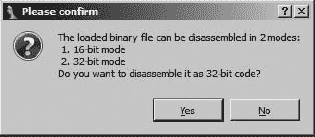

图 4-3. x86 模式选择

二进制文件不包含有关其内存布局的信息（至少 IDA 不知道如何识别的信息）。当选择 x86 处理器类型时，必须在加载对话框的加载段和加载偏移量字段中指定基本地址信息，如前所述。对于所有其他处理器类型，IDA 将显示图 4-4 所示的内存布局对话框。为了方便起见，你可以创建一个 RAM 部分、一个 ROM 部分或两者都创建，并指定每个部分的地址范围。输入文件选项用于指定应加载输入文件的哪个部分（默认为整个文件），以及文件内容应映射到的地址。

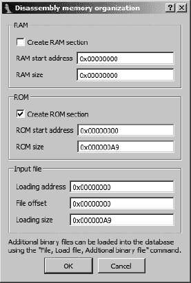

图 4-4. 内存组织对话框

图 4-5 展示了二进制加载的最后一步——这是一个温和的提醒，表明你需要做一些工作。信息强调了这样一个事实，即 IDA 没有可用的头部信息来帮助它区分二进制文件中的代码字节和数据字节。此时，你会被提醒指定文件中的一个地址作为入口点，通过告诉 IDA 将该地址的字节（字节）转换为代码（C 是强制 IDA 将该字节视为代码的热键）。对于二进制文件，IDA 在你花费时间至少识别一个字节为代码之前，不会执行任何初始反汇编。

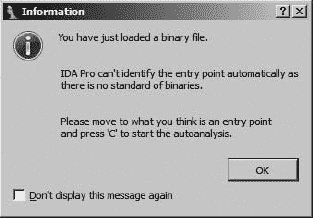

图 4-5. 二进制文件加载

* * *

^([29]) 旧版本的 IDA 使用`HKEY_CURRENT_USER\Software\Datarescue\IDA`。

^([30]) 在非 Windows 系统中，可执行文件完全没有文件扩展名并不罕见。

^([31]) IDA 加载器将在第十八章中进一步讨论。

# IDA 数据库文件

当您对加载选项满意并点击“确定”关闭对话框时，加载文件的实际工作就开始了。此时，IDA 的目标是将选定的可执行文件加载到内存中，并分析相关部分。这将在四个文件中创建一个 IDA 数据库，每个文件都有一个与所选可执行文件匹配的基本名称，其扩展名为 .*id0*、.*id1*、.*nam* 和 .*til*。.*id0* 文件包含 B 树风格数据库的内容，而 *.id1* 文件包含描述每个程序字节的标志。.*nam* 文件包含与 IDA 名称窗口中显示的命名程序位置相关的索引信息（在第五章中进一步讨论）。最后，.*til* 文件用于存储有关特定数据库的本地类型定义的信息。这些文件的格式是 IDA 专有的，并且它们在 IDA 环境之外不易编辑。

为了方便，每当您关闭当前项目时，这四个文件都会存档，并且可选地压缩成一个 IDB 文件。当人们提到 IDA 数据库时，他们通常指的是 IDB 文件。未压缩的数据库文件通常是原始输入二进制文件大小的 10 倍。当正确关闭数据库时，您的工作目录中不应出现具有 *.id0*、*.id1*、*.nam* 或 *.til* 扩展名的文件。它们的存在通常表明数据库没有正确关闭（例如，当 IDA 崩溃时），并且数据库可能已损坏。

加载器警告

一旦加载器开始分析文件，它可能会遇到需要额外用户输入才能完成加载过程的情况。这种情况的一个例子是带有 PDB 调试信息的 PE 文件。如果 IDA 确定可能存在*程序数据库（PDB）*文件，您将被询问是否希望 IDA 查找并处理相应的 PDB 文件，如该消息所示：

> IDA Pro 确定输入文件与调试信息链接。您是否希望在本地符号存储和 Microsoft 符号服务器中查找相应的 PDB 文件？

加载器生成信息消息的第二个例子出现在混淆程序，如恶意软件中。混淆技术通常对文件格式规范处理得很快，这可能会给期望良好结构化文件的加载器带来问题。了解这一点后，PE 加载器对导入表进行一些验证，如果导入表似乎没有按照惯例格式化，IDA 将显示以下消息：

> 导入段似乎已被破坏。这可能意味着文件被打包或以其他方式修改，以使其分析更加困难。如果您想以原始形式查看导入段，请清除“制作导入部分”复选框后重新加载。

本错误示例及其处理方法将在第二十一章中介绍。

重要的是要理解，一旦为给定的可执行文件创建了数据库，IDA 就不再需要访问该可执行文件，除非你打算使用 IDA 的集成调试器来调试可执行文件本身。从安全的角度来看，这是一个很好的特性。例如，当你分析恶意软件样本时，你可以将相关的数据库在分析师之间传递，而不必传递恶意可执行文件本身。据知，没有已知案例表明 IDA 数据库被用作恶意软件的攻击向量。

在本质上，IDA（Interactive Disassembler）不过是一个数据库应用程序。新的数据库会自动从可执行文件中创建并填充。IDA 提供的各种显示仅仅是数据库的视图，以对软件逆向工程师有用的格式揭示信息。用户对数据库所做的任何修改都会反映在视图中，并随数据库一起保存，但这些更改对原始的可执行文件没有任何影响。IDA 的力量在于它包含用于分析和操作数据库内数据的工具。

## IDA 数据库创建

一旦你选择了要分析的文件并指定了你的选项，IDA 就会启动数据库的创建过程。在这个过程中，IDA 将控制权转交给选定的加载模块，该模块的职责是从磁盘加载文件，解析可能识别的任何文件头信息，创建包含代码或数据的各种程序部分，这些代码或数据在文件头中指定，最后在返回控制权给 IDA 之前，识别代码中的特定入口点。在这方面，IDA 加载模块的行为与操作系统加载模块的行为非常相似。IDA 加载器将根据程序文件头中的信息确定虚拟内存布局，并据此配置数据库。

加载器完成后，IDA 内部的反汇编引擎接管并开始逐个传递地址给选定的处理器模块。处理器模块的职责是确定该地址上指令的类型、该地址上指令的长度以及从该地址继续执行的位置（例如，当前指令是顺序的还是分支的？）。当 IDA 确信它已经找到了文件中的所有指令时，它将对指令地址列表进行第二次遍历，并要求处理器模块为每个指令生成汇编语言版本以供显示。

在此反汇编之后，IDA 会自动对二进制文件进行额外的分析，以提取对分析师可能有用的额外信息。用户可以期待在 IDA 完成其初始分析后，以下信息中的一些或全部被纳入数据库：

**编译器识别**

了解用于构建软件的编译器通常很有用。识别所使用的编译器可以帮助我们理解二进制文件中使用的函数调用约定，以及确定二进制文件可能链接的库。当文件被加载时，IDA 会尝试识别用于创建输入文件的编译器。如果编译器可以被识别，输入文件将扫描该编译器已知使用的样板代码序列。这些函数将以颜色编码，以减少需要分析的代码量。

**函数参数和局部变量识别**

在每个已识别的函数（调用指令的目标地址）中，IDA 会详细分析栈指针寄存器的行为，以便识别位于栈内的变量访问，并理解函数栈帧的布局。^([[32)] 基于这些变量作为函数中的局部变量或作为函数调用过程中传递给函数的参数的使用，自动生成这些变量的名称。

**数据类型信息**

利用对常见库函数及其所需参数的了解，IDA 在数据库中添加注释，以指示参数传递到这些函数的位置。这些注释通过提供信息节省了分析师大量时间，这些信息否则需要从各种应用程序编程接口（API）参考中检索。

## 关闭 IDA 数据库

无论何时关闭数据库，无论是完全关闭 IDA 还是简单地切换到不同的数据库，都会出现保存数据库对话框，如图 4-6 所示。

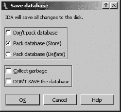

图 4-6. 保存数据库对话框

如果这是新创建数据库的初始保存，新数据库的文件名将从输入文件名中派生，将输入扩展名替换为 *.idb* 扩展名（例如，*example.exe* 生成名为 *example.idb* 的数据库）。当输入文件没有扩展名时，将添加 *.idb* 以形成数据库的名称（例如，*httpd* 生成 *httpd.idb*）。以下列表总结了可用的保存选项及其相关影响：

**不要打包数据库**

此选项仅将更改刷新到四个数据库组件文件，并关闭桌面，而**不**创建 IDB 文件。在关闭数据库时，**不推荐**使用此选项。

**打包数据库（存储）**

选择存储选项会将四个数据库组件文件存档为一个单一的 IDB 文件。任何之前的 IDB 文件都将被覆盖，而无需确认。存储选项不使用压缩。一旦创建 IDB 文件，四个数据库组件文件将被删除。

**打包数据库（Deflate）**

Deflate 选项与 Store 选项相同，只是数据库组件文件是在 IDB 存档内压缩的。

**收集垃圾**

请求垃圾回收会导致 IDA 在关闭数据库之前删除任何未使用的内存页面。选择此选项与 Deflate 一起使用，以创建尽可能小的 IDB 文件。除非磁盘空间非常紧张，否则通常不需要此选项。

**不要保存数据库**

你可能会想知道为什么有人会选择不保存他的工作。实际上，这个选项是唯一一种方法来丢弃自上次保存以来对数据库所做的更改。当选择此选项时，IDA 会简单地删除四个数据库组件文件，而不会触及任何现有的 IDB 文件。使用此选项是你在使用 IDA 时获得撤销或恢复功能的最接近方式。

## 重新打开数据库

当然，重新打开一个现有的数据库并不涉及火箭科学，^([33]) 因此你可能想知道为什么这个主题会被涵盖。在正常情况下，返回到现有的数据库工作非常简单，只需使用 IDA 的文件打开方法之一选择数据库。数据库文件在第二次（以及随后的）打开时打开得更快，因为没有分析要执行。作为额外的奖励，IDA 会将你的 IDA 桌面恢复到关闭时的状态。

现在是坏消息的时候了。信不信由你，IDA 有时会崩溃。无论是由于 IDA 本身的错误还是由于你安装的一些前沿插件中的错误，崩溃都会使打开的数据库处于可能损坏的状态。一旦你重新启动 IDA 并尝试重新打开受影响的数据库，你很可能会看到图 4-7 和图 4-8 中显示的其中一个对话框。

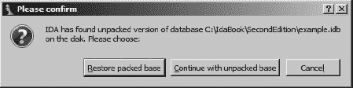

图 4-7. 数据库恢复对话框

当 IDA 崩溃时，IDA 没有机会关闭活动数据库，中间数据库文件也不会被删除。如果你不是第一次使用特定的数据库，你可能会遇到同时存在 IDB 文件和可能损坏的中间文件的情况。IDB 文件代表数据库的最后一个已知良好状态，而中间文件包含自上次保存操作以来可能进行的任何更改。在这种情况下，你将有机会选择恢复到保存版本或继续使用打开的、可能损坏的版本，如图 图 4-7 所示。选择“继续使用未打包的基”并不能保证你将恢复你的工作。未打包的数据库可能处于不一致的状态，这会提示 IDA 提供如图 图 4-8 所示的对话框。在这种情况下，IDA 本身建议你考虑从打包数据中恢复，所以如果你选择使用修复后的数据库，请务必小心。

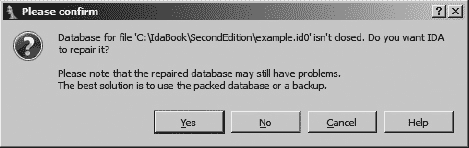

图 4-8。数据库修复对话框

当活动数据库从未保存，因此在崩溃时只留下中间文件时，当你再次尝试打开原始可执行文件时，IDA 会立即在 图 4-8 中提供修复选项。

* * *

^([32]) 栈帧的讨论在 第六章 中进一步展开。

^([33]) 除非你恰好正在打开 *rocket_science.idb*。

# IDA 桌面简介

考虑到你可能会花大量时间盯着 IDA 桌面，你将想要花些时间熟悉其各种组件。图 4-9 展示了一个默认 IDA 桌面的概览。文件分析期间桌面行为将在下一节中讨论。

在这个简介视图中感兴趣的区域包括以下内容：

1.  *工具栏区域*  包含与 IDA 最常用操作相对应的工具。使用“视图”▸“工具栏”命令可以将工具栏添加到或从桌面中移除。使用拖放，你可以重新定位每个工具栏以满足你的需求。图 4-9 展示了 IDA 的基本模式工具栏，其中包含一行工具按钮。使用“视图”▸“工具栏”▸“高级模式”可以获取高级模式工具栏。高级模式工具栏包含三行完整的工具按钮。

    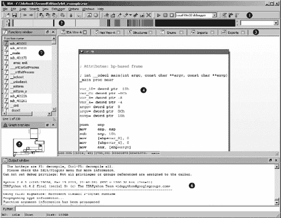

    图 4-9。IDA 桌面

1.  水平颜色带是 IDA 的 **概览导航器** ，也称为 **导航带**。导航带展示了加载文件的地址空间线性视图。默认情况下，二进制文件的整个地址范围都被表示。您可以通过在导航带内任何位置右键单击并选择可用的缩放选项来放大或缩小地址范围。不同的颜色代表不同类型的文件内容，例如数据或代码。一个小的 **当前位置指示器**（默认为黄色）指向与在反汇编窗口中显示的当前地址范围相对应的导航带地址。将鼠标光标悬停在导航带的任何部分上都会显示一个工具提示，描述二进制中的该位置。单击导航带会将反汇编视图跳转到二进制中的选定位置。导航带中使用的颜色可以通过选项 ▸ 颜色命令进行自定义。将导航带从 IDA 桌面拖离会产生一个分离的概览导航器，如图 图 4-10 所示。图 图 4-10 还显示了当前位置指示器（位于位置  左侧的半长向下箭头）和一个 **颜色键**，通过功能组识别文件内容。

    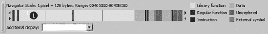

    图 4-10. 概览导航器

1.  回到 图 4-9，为每个当前打开的数据显示提供了 **标签** 。数据显示包含从二进制中提取的信息，并代表对数据库的各种视图。您的大部分分析工作可能将通过与可用的数据显示的交互来完成。图 4-9 显示了三个可用的数据显示：IDA-View、函数和图形概览。通过视图 ▸ 打开子视图菜单可以获得更多数据显示，并且此菜单也用于恢复任何已关闭的显示，无论是故意还是意外关闭的。

1.  *反汇编视图*  是主要的数据显示。反汇编视图有两种显示风格：图形视图（默认）和列表视图。在图形视图中，IDA 在任何给定时间显示单个函数的流程图风格图形。当与 *图形概览* 结合使用时，您可以通过对函数结构的视觉分解来了解函数的流程。当 IDA-View 窗口处于活动状态时，空格键在图形视图样式和列表视图样式之间切换。如果您希望将列表视图设置为默认视图，您必须在“图形”选项卡中取消选中“默认使用图形视图”，通过“选项”▸“常规”菜单进行，如图 图 4-11 所示。

    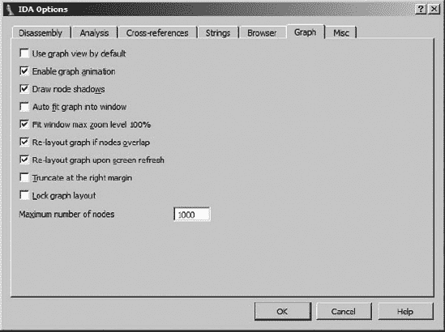

    图 4-11。IDA 图形选项

1.  在图形视图中，通常很难一次将整个函数图放入显示区域。仅在图形视图活动时才提供的 *图形概览* ，提供了一个基本图形结构的缩略图。一个虚线矩形指示图形视图中当前显示的内容。在图形概览中单击将相应地重新定位图形视图。

1.  *输出窗口*  是您可以预期找到由 IDA 生成的任何信息消息的地方。在这里，您可以找到有关文件分析阶段进度的状态消息，以及由用户请求的操作产生的任何错误消息。输出窗口大致相当于控制台输出设备。

1.  *函数窗口*  完善了 IDA 的默认显示窗口，将在 第五章 中进一步讨论。

# 初始分析期间的桌面行为

在对新打开的文件进行初始自动分析期间，IDA 桌面内发生大量活动。您可以通过在分析过程中观察各种桌面显示来了解这种分析。您可能观察到的桌面活动包括以下内容：

+   打印到输出窗口的进度消息

+   为反汇编窗口生成的初始位置和反汇编输出

+   随着分析进展，函数窗口的初始填充，然后定期更新

+   随着二进制新区域被识别为代码和数据，代码块被进一步识别为函数，最后，使用 IDA 的模式匹配技术将函数特别识别为库代码，导航带的转换

+   当前位置指示器在导航带中遍历以显示当前正在分析的区域

以下输出是 IDA 在对新打开的二进制文件进行初始分析期间生成的消息的示例。请注意，这些消息构成了分析过程的故事，并提供了对 IDA 在该分析期间执行的操作顺序的见解。

```
Loading file 'C:\IdaBook\ch4_example.exe' into database...
  Detected file format: Portable executable for 80386 (PE)
    0\. Creating a new segment  (00401000-0040C000) ... ... OK
    1\. Creating a new segment  (0040C000-0040E000) ... ... OK
    2\. Creating a new segment  (0040E000-00411000) ... ... OK
  Reading imports directory...
    3\. Creating a new segment  (0040C120-0040E000) ... ... OK
  Plan  FLIRT signature: Microsoft VisualC 2-10/net runtime
  autoload.cfg: vc32rtf.sig autoloads mssdk.til
  Assuming __cdecl calling convention by default
  main() function at 401070, named "_main"
  Marking typical code sequences...
  Flushing buffers, please wait...ok
  File 'C:\IdaBook\ch4_example.exe' is successfully loaded into the database.
  Compiling file 'C:\Program Files\IdaPro\idc\ida.idc'...
    Executing function 'main'...
  Compiling file 'C:\Program Files\IdaPro\idc\onload.idc'...
  Executing function 'OnLoad'...
  IDA is analysing the input file...
 You may start to explore the input file right now.
  ------------------------------------------------------------------------------
  Python 2.6.5 (r265:79096, Mar 19 2010, 21:48:26) [MSC v.1500 32 bit (Intel)]
  IDAPython v1.4.2 final (serial 0) (c) The IDAPython Team
  <idapython@googlegroups.com>
  ------------------------------------------------------------------------------
  Using FLIRT signature: Microsoft VisualC 2-10/net runtime
  Propagating type information...
  Function argument information has been propagated
 The initial autoanalysis has been finished.
```

两个特别有用的进度消息是“你现在可以开始探索输入文件了”  和“初始自动分析已完成” 。第一条消息通知你 IDA 在分析方面已经取得了足够的进展，你可以开始浏览各种数据显示。导航并不意味着更改，你应该等待分析阶段完成后才对数据库进行任何更改。如果在分析阶段完成之前尝试更改数据库，分析引擎可能会稍后修改你的更改，或者你甚至可能阻止分析引擎正确执行其任务。第二条消息相当直观，表明你不需要在桌面数据显示中期待更多的自动更改。此时，你可以安全地对数据库进行任何你喜欢的更改。

# IDA 桌面技巧与窍门

IDA 提供了大量的信息，其桌面可能会变得杂乱。以下是一些关于如何充分利用桌面的一些技巧：

+   你为 IDA 贡献的屏幕空间越多，你将越快乐。利用这个事实来证明购买一个超大型显示器（或两个）的合理性！

+   不要忘记使用“视图 ▸ 打开子视图”命令来恢复你意外关闭的数据显示。

+   “窗口 ▸ 重置桌面”命令提供了一种快速恢复桌面原始布局的有用方法。

+   使用“窗口 ▸ 保存桌面布局”命令来保存当前桌面配置的布局，这些布局可能特别有用。使用“窗口 ▸ 加载桌面布局”命令可以快速恢复到保存的布局。

+   唯一可以更改显示字体的窗口是“反汇编窗口”（无论是图形还是列表视图）。字体设置通过“选项 ▸ 字体”命令进行。

# 报告 bug

就像任何软件一样，IDA 有时会包含一些偶尔的 bug，如果你认为你在 IDA 本身中发现了 bug，你期望从 Hex-Rays 得到什么？首先，Hex-Rays 拥有你可以遇到的反应最快的支持系统之一。其次，如果你在提交支持请求后一天内收到 Ilfak 本人的回复，请不要感到惊讶。

提交错误报告有两种方法。您可以发送电子邮件到 support@hex-rays.com，或者如果您不想使用电子邮件，您也可以在 Hex-Rays 公告板上的错误报告论坛上发帖。在两种情况下，您都应该验证您能否重现您的错误，并准备好向 Hex-Rays 提供涉及问题的数据库文件的副本。请记住，Hex-Rays 仅提供额外费用的 SDK 支持。对于与您已安装的插件相关的错误，您需要联系插件的作者。对于与您正在开发的插件相关的错误，您需要利用 IDA 用户可用的支持论坛，并希望得到其他用户的帮助性回复。

# 摘要

熟悉 IDA 工作空间将大大增强您使用 IDA 的体验。在没有与您的工具斗争的情况下，逆向工程二进制代码就已经足够困难了。您在初始加载阶段所做的选择以及 IDA 随后进行的自动分析为所有后续分析奠定了基础。在这个阶段，您可能对 IDA 为您完成的工作感到满意，对于简单的二进制文件，自动分析可能就是您所需要的。另一方面，如果您想知道是什么让 IDA 的*交互性*如此之强，那么您现在就可以更深入地了解 IDA 众多数据显示的功能了。在接下来的章节中，您将了解到每个主要显示，您将在什么情况下发现每个显示有用，以及如何利用这些显示来增强和更新您的数据库。

# 第五章。IDA 数据显示


到目前为止，您应该对将二进制文件加载到 IDA 并让 IDA 施展魔法同时品尝您最喜欢的饮料有些信心。一旦 IDA 的初始分析阶段完成，就是您接管的时候了。您熟悉 IDA 显示的最好方法之一就是简单地浏览 IDA 填充有关您二进制文件数据的各种选项卡子窗口。随着您对 IDA 的舒适度提高，您逆向工程会议的效率和效果也会提高。

在我们深入探讨 IDA 的主要子显示之前，了解一些关于 IDA 用户界面的基本规则是有用的：

**IDA 中没有撤销操作**。

如果由于意外按键导致您的数据库出现问题，您需要自己将显示恢复到之前的状态。

**几乎所有操作都有一个相关的菜单项、热键和工具栏按钮**。

记住，IDA 工具栏高度可配置，热键到菜单操作的映射也是如此。

**IDA 在鼠标右键点击时提供良好的上下文相关菜单操作**。

虽然这些菜单并没有提供在特定位置允许执行的所有操作的详尽列表，但它们确实作为你将要执行的最常见操作的良好提醒。

考虑到这些事实，让我们开始介绍主要的 IDA 数据显示。

# 主要的 IDA 显示

在默认配置下，IDA 在为新二进制文件加载和分析阶段创建七个（截至版本 6.1）显示窗口。这些显示窗口中的每一个都可以通过立即显示在导航带下方的一组标题标签访问（如前所述的图 4-9)。三个立即可见的窗口是 IDA-View 窗口、函数窗口和输出窗口。无论它们是否默认打开，本章中讨论的所有窗口都可以通过“视图 ▸ 打开子视图”菜单打开。请记住这个事实，因为不小心关闭显示窗口是相当容易的。

esc 键是 IDA 中所有快捷键中比较有用的一种。当反汇编窗口处于活动状态时，esc 键的功能类似于网络浏览器的后退按钮，因此在导航反汇编显示（导航将在第六章中详细说明）时非常有用。不幸的是，当任何其他窗口处于活动状态时，esc 键的作用是关闭窗口。有时，这正是你想要的。在其他时候，你可能会立刻希望那个关闭的窗口能回来。

## 反汇编窗口

也称为 IDA-View 窗口，反汇编窗口将是您操作和分析二进制文件的主要工具。因此，熟悉反汇编窗口中信息呈现的方式非常重要。

反汇编窗口提供了两种显示格式：默认的基于图形的视图和以文本为导向的列表视图。大多数 IDA 用户倾向于偏好其中一种视图，而最适合你需求的视图通常取决于你如何偏好可视化程序的流程。如果你偏好使用文本列表视图作为默认的反汇编视图，你可以通过使用“选项 ▸ 一般”对话框在“图形”选项卡上关闭“默认使用图形视图”来更改默认设置。每当反汇编视图处于活动状态时，你可以通过使用空格键在任何时候轻松地在图形和列表视图之间切换。

### IDA 图形视图

图 5-1 展示了一个在图形视图中显示的非常简单的函数。图形视图在某种程度上让人联想到程序流程图，因为一个函数被分解成基本块^([34))，这样你可以可视化函数从一块到另一块的控制流。

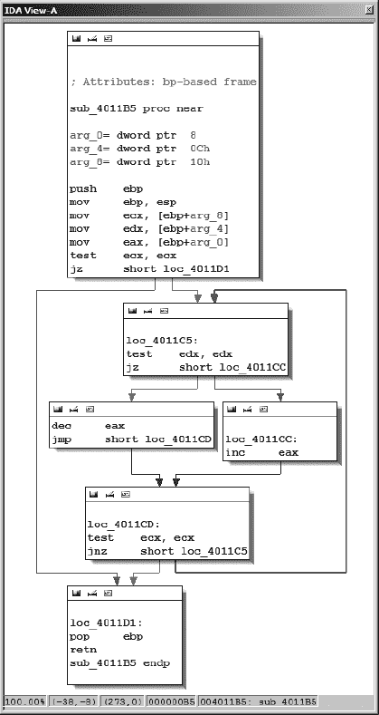

图 5-1. IDA 图形视图

在屏幕上，你会注意到 IDA 使用不同颜色的箭头来区分函数块之间的各种类型的数据流^([35])。以条件跳转结束的基本块会根据测试的条件生成两种可能的数据流：默认情况下，*是边*箭头（是的，分支被采取）是绿色的，而*否边*箭头（不，分支没有被采取）是红色的。以只有一个潜在后继块结束的基本块使用默认为蓝色的*正常边*来指向下一个要执行的基本块。

在图形模式下，IDA 一次显示一个函数。对于使用滚轮鼠标的用户，可以通过 ctrl-滚轮组合进行图形缩放。键盘缩放控制需要使用 ctrl-+来放大或 ctrl- −来缩小（使用数字键盘上的+和-键）。大型或复杂的函数可能会导致图形视图变得极其杂乱，使得图形难以导航。在这种情况下，可以使用图形概览窗口（见图 5-2)来提供一些情境感知。概览窗口始终显示图形的完整块结构，以及一个虚线框，该框指示当前在反汇编窗口中查看的图形区域。可以拖动虚线框穿过概览窗口，快速重新定位图形视图到图形上的任何所需位置。

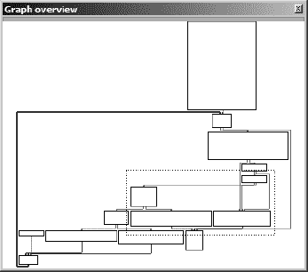

图 5-2. 图形概览窗口

使用图形显示时，有几种方法可以操纵视图以满足你的需求：

**平移**

首先，除了使用图形概览窗口快速重新定位图形外，你还可以通过点击并拖动图形视图的背景来重新定位图形。

嘿，这里是不是缺少了什么？

当使用图形视图时，可能会觉得关于每条反汇编指令的信息似乎更少。这是因为 IDA 选择隐藏关于每条反汇编指令的许多更传统信息（例如虚拟地址信息），以最小化显示每个基本块所需的空间。你可以通过从选项 ▸ 通用中的*反汇编*选项卡中选择，来选择显示每条反汇编指令的附加信息。例如，要为每条反汇编指令添加虚拟地址，我们启用*行前缀*，将图形从图 5-1 转换为图 5-3 所示的图形。

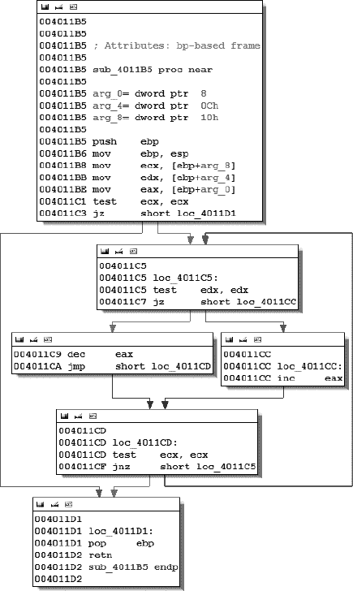

图 5-3. 启用行前缀的图形视图

**重新排列块**

可以通过单击所需块的标题栏并将其拖动到新位置来将图中的单个块拖动到新位置。请注意，IDA 仅对移动的块关联的任何边缘进行最小重路由。您可以通过将顶点拖动到新位置来手动重路由边缘。在按住 shift 键的同时双击边缘内的所需位置可以引入新的顶点。如果您在任何时候希望将图形的默认布局恢复为默认布局，可以通过右键单击图形并选择“布局图形”来实现。

**分组和折叠块**

可以将块分组，无论是单独还是与其他块一起，并且可以折叠以减少显示中的杂乱。折叠块是跟踪您已经分析过的块的特别有用的技术。您可以通过右键单击块的标题栏并选择“分组节点”来折叠任何块。

**创建额外的反汇编窗口**

如果您想同时查看两个函数的图形，您只需使用“视图”▸“打开子视图”▸“反汇编”打开另一个反汇编窗口。第一个打开的反汇编窗口标题为“IDA View-A”。随后的反汇编窗口标题为“IDA View-B”、“IDA View-C”等等。每个反汇编都是独立的，在另一个窗口中查看文本列表的同时查看一个窗口中的图形或在三个不同的窗口中查看三个不同的图形是完全可接受的。

请记住，您对视图的控制不仅限于这些示例。额外的 IDA 图形功能在第九章中有介绍，而关于操作 IDA 图形视图的更多信息可以在 IDA 帮助文件中找到。

### IDA 文本视图

以文本为主的反汇编窗口是用于查看和操作 IDA 生成的反汇编的传统显示方式。文本显示呈现程序的整个反汇编列表（与图形模式中一次显示一个函数相反）并提供查看二进制数据区域的唯一方式。图形显示中可用的所有信息都以某种形式在文本显示中可用。

图 5-4 显示了与图 5-1 和图 5-3 中显示的相同函数的文本视图列表。反汇编以线性方式呈现，默认情况下显示虚拟地址。虚拟地址通常以`[节名称]:[虚拟地址]`格式显示，例如`.text:004011C1`。


图 5-4。IDA 文本视图

显示的左侧部分，如图  所示，被称为 *箭头窗口*，用于表示函数中的非线性流程。实线箭头表示无条件跳转，而虚线箭头表示条件跳转。当跳转（条件或无条件）将控制权转移到程序中的较早地址时，使用粗重的线条（实线或虚线）。这种程序中的反向流程通常表明存在循环。在 图 5-4 中，循环箭头从地址 `004011CF` 流向 `004011C5`。

在  中的声明（也存在于图形视图中）代表 IDA 对函数堆栈帧布局的最佳估计。36] IDA 通过对堆栈指针和函数内使用的任何堆栈帧指针的行为进行详细分析来计算函数堆栈帧的结构。堆栈显示在 第六章 中进一步讨论。

在  中的注释（分号引入注释）是 *交叉引用*。在这种情况下，我们看到代码交叉引用（与数据交叉引用相对），这表明另一个程序指令将控制权转移到包含交叉引用注释的位置。交叉引用是 第九章 的主题。

在本书的剩余部分，我们将主要使用文本显示来举例。只有在它可能提供显著更多清晰度的情况下，我们才会使用图形显示。在 第七章 中，我们将介绍如何操作文本显示以清理和注释汇编的细节。

## 函数窗口

函数窗口用于列出 IDA 在数据库中识别的每个函数。函数窗口条目可能看起来如下：

```
malloc              .text                00BDC260 00000180 R . . . B . .
```

这一行特别指示，`malloc` 函数可以在虚拟地址 `00BDC260` 的二进制文件的 `.text` 部分找到，长度为 384 字节（十六进制 180），返回给调用者（`R`），并使用 EBP 寄存器（`B`）来引用其局部变量。用于描述函数的标志（如上例中的 `R` 和 `B`）在 IDA 的内置帮助文件中描述（或通过右键单击一个函数并选择属性。标志在结果属性对话框中显示为可编辑的复选框）。

与其他显示窗口一样，双击函数窗口中的条目会导致汇编窗口跳转到所选函数的位置。

## 输出窗口

IDA 工作区底部的输出窗口补充了在新文件打开时可见的默认窗口集。输出窗口作为 IDA 的输出控制台，是查找 IDA 正在执行的任务信息的地方。例如，当首次打开二进制文件时，会生成消息来指示 IDA 在任何给定时间处于分析哪个阶段以及 IDA 正在执行哪些操作以创建新数据库。随着你与数据库一起工作，输出窗口用于输出你执行的各种操作的状态。可以通过在窗口的任何位置右键单击并选择适当的操作来复制输出窗口的内容或将内容全部清除。输出窗口通常是显示你为 IDA 开发的任何脚本和插件输出的主要方式。

* * *

^([34]) 基本块是执行，没有分支，从开始到结束的最大指令序列。因此，每个基本块都有一个单一的入口点（块中的第一条指令）和一个单一的出口点（块中的最后一条指令）。基本块中的第一条指令通常是分支指令的目标，而基本块中的最后一条指令通常是分支指令。

^([35]) IDA 使用术语*流*来表示从给定指令继续执行的方式。*正常*（也称为*普通*）流表示指令的默认顺序执行。*跳转*流表示当前指令跳转（或可能跳转）到非顺序位置。*调用*流表示当前指令调用子程序。

^([36]) 栈帧（或激活记录）是在程序运行时栈中分配的一块内存，其中包含传递给函数的参数和在函数内声明的局部变量。栈帧在函数进入时分配，在函数退出时释放。栈帧在第六章中有更详细的讨论。

# 二级 IDA 显示

除了拆解、函数和输出窗口之外，IDA 在你的 IDA 桌面打开了许多其他标签页窗口。这些标签页位于导航栏下方（参见在图 4-9)）。这些窗口用于提供对数据库的替代或专用视图。这些显示的效用取决于你正在分析的二进制文件的特征以及你在 IDA 中的技能。其中一些窗口足够专业化，需要在后面的章节中提供更详细的介绍。

## 十六进制视图窗口

在这种情况下，十六进制视图的名称有些误导，因为 IDA 的十六进制视图窗口可以配置为显示各种格式，并且充当十六进制编辑器。默认情况下，十六进制视图窗口提供标准十六进制转储程序内容，每行 16 字节，并显示 ASCII 等效值。与反汇编窗口一样，可以同时打开多个十六进制视图。第一个十六进制窗口标题为*十六进制视图-A*，第二个*十六进制视图-B*，下一个*十六进制视图-C*，依此类推。默认情况下，第一个十六进制窗口与第一个反汇编窗口同步。当反汇编视图与十六进制视图同步时，在一个窗口中滚动会导致另一个窗口滚动到相同的位置（相同的虚拟地址）。此外，当在反汇编视图中选择一个项目时，相应的字节在十六进制视图中会被突出显示。在图 5-5 中，反汇编视图的光标位于地址`0040108C`，这是一个调用指令，导致构成指令的五个字节在十六进制窗口中被突出显示。


图 5-5. 同步十六进制和反汇编视图

在图 5-5 中同样显示的是十六进制显示上下文菜单，当你在十六进制显示的任何位置右键单击时都会出现此菜单。这个上下文菜单是您指定要使用哪个（如果有的话）反汇编视图与特定的十六进制显示同步的地方。取消选择同步选项允许十六进制窗口独立于任何反汇编窗口进行滚动。选择编辑菜单选项将十六进制视图转换为十六进制编辑器。一旦完成编辑，您必须提交或取消更改才能返回到查看模式。数据格式菜单项允许您从各种显示格式中选择，例如 1、2、4 或 8 字节十六进制；有符号十进制；或无符号十进制整数以及各种浮点格式。列菜单选项允许您更改显示中使用的列数，而文本选项允许您打开或关闭文本转储。

在某些情况下，您可能会发现十六进制窗口只显示问号。这是 IDA 告诉你它不知道哪些值可能占据给定的虚拟地址范围的方式。当程序包含一个 bss^([37])部分时，这种情况就会发生，这部分通常在文件中不占用空间，但由加载程序扩展以适应程序的静态存储需求。

## 导出窗口

导出窗口列出了文件中的入口点。这包括程序在头文件中指定的执行入口点，以及任何为其他文件使用而导出的函数和变量。导出函数通常可以在共享库中找到，例如 Windows DLL 文件。导出条目按名称、虚拟地址列出，如果适用，还可以按序号列出。^([38]) 对于可执行文件，导出窗口始终至少包含一个条目：程序的执行入口点。IDA 将此入口点命名为`start`。典型的导出窗口条目如下：

```
LoadLibraryA                          7C801D77 578
```

与许多其他 IDA 窗口一样，双击导出窗口中的条目将使反汇编窗口跳转到与该条目关联的地址。导出窗口还提供了类似于命令行工具`objdump` (`-T`)、`readelf (-s`)和`dumpbin` (`/EXPORTS`)的功能。

## 导入窗口

导入窗口是导出窗口的对应窗口。它列出了正在分析的二进制文件所导入的所有函数。导入窗口仅在二进制文件使用共享库时才相关。静态链接的二进制文件没有外部依赖，因此没有导入。导入窗口中的每一项都列出了导入项（函数或数据）的名称以及包含该项的库的名称。由于导入函数的代码位于共享库中，因此每一项中列出的地址是指相关导入表条目的虚拟地址。^([39]) 下面展示了导入窗口条目的一个示例：

```
0040E108  GetModuleHandleA         KERNEL32
```

双击此导入将使反汇编窗口跳转到地址`0040E108`。在十六进制视图中，此内存位置的 内容将是`?? ?? ?? ??`。IDA 是一个静态分析工具，它无法知道程序执行时将进入此内存位置的地址。导入窗口还提供了类似于命令行工具`objdump` (`-T`)、`readelf` (`-s`)和`dumpbin` (`/IMPORTS`)的功能。

关于导入窗口的一个重要要点是，它仅显示二进制文件希望由动态加载器自动处理的符号。那些二进制文件选择使用`dlopen/dlsym`或`LoadLibrary/GetProcAddress`等机制自行加载的符号将不会在导入窗口中列出。

## 结构窗口

结构窗口用于显示 IDA 确定的二进制文件中使用的任何复杂数据结构的布局，例如 C 结构体或联合体。在分析阶段，IDA 会咨询其庞大的函数类型签名库，试图将函数参数类型与程序中使用的内存进行匹配。如图图 5-6 所示的结构窗口表明，IDA 认为程序使用了`sockaddr`^([40])数据结构。

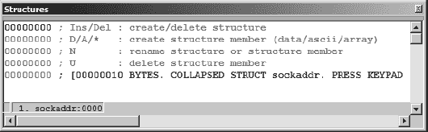

图 5-6. 结构窗口

IDA 得出这一结论可能有多种可能的原因。其中一个可能的原因是，IDA 观察到对 C 库`connect`^([41])函数的调用以建立新的网络连接。双击数据结构（在本例中为`sockaddr`）的名称会导致 IDA 展开该结构，从而允许您查看结构的详细布局，包括各个字段名称和大小。

结构窗口的两个主要用途是（1）提供标准数据结构布局的便捷参考，以及（2）在您在程序中发现自定义数据结构时，提供创建自己的数据结构的方法，以便将其用作内存布局模板。结构定义和在反汇编中的应用将在第八章（第八章. 数据类型和数据结构)) 编译器创建*bss*部分来存放程序的所有未初始化的静态变量。由于这些变量没有分配初始值，因此不需要在程序的文件映像中为它们分配空间，因此该部分的尺寸在程序的一个头文件中记录。当程序执行时，加载器分配所需的空间并将整个块初始化为零。

^([38)) 在共享库中可以使用导出序号来通过数字而不是名称使函数可访问。使用序号可以加快地址查找过程，并允许程序员隐藏他们函数的名称。导出序号在 Windows DLL 中使用。

^([39]) 导入表为加载器提供了空间，以便在加载所需的库并且知道这些函数的地址后存储导入函数的地址。单个导入表条目包含一个导入函数的地址。

^([40]) `sockaddr`结构是 C 标准库中的一个数据类型，通常用于表示网络连接中的一个端点。`sockaddr`变量可以用来存储 IP 地址和端口号，作为建立与远程计算机的 TCP 连接的过程的一部分。

^([41]) `int connect(int sockfd, const struct sockaddr *serv_addr, socklen_t addrlen);`

# 三级 IDA 显示

我们将要讨论的最后一个窗口是 IDA 默认不打开的窗口。每个这些窗口都可以通过视图 ▸ 打开子视图访问，但它们通常提供的信息可能不是你立即需要的，因此最初被放在一边。

## 字符串窗口

字符串窗口是 IDA 内置的 `strings` 工具的等价物，并且还包含更多功能。在 IDA 5.1 及更早版本中，字符串窗口作为默认桌面的一部分打开；然而，从版本 5.2 开始，字符串窗口不再默认打开，尽管它仍然可以通过视图 ▸ 打开子视图 ▸ 字符串来访问。

字符串窗口的目的是显示从二进制文件中提取的字符串列表以及每个字符串所在的地址。就像在名称窗口中双击名称一样，在字符串窗口中双击任何列出的字符串会导致反汇编窗口跳转到所选字符串的地址。当与交叉引用（第九章 所示，设置字符串窗口用于指定 IDA 应扫描的字符串类型。IDA 默认扫描的字符串类型是至少五个字符长度的 C 风格、空终止、7 位 ASCII 字符串。每次你通过点击确定关闭设置字符串窗口时，IDA 将根据新设置重新扫描数据库中的字符串。有两个设置选项值得特别提及：


图 5-7。设置字符串窗口

如果你预计会遇到除 C 风格字符串之外的内容，你应该重新配置设置字符串窗口以选择适当的字符串类型进行搜索。例如，Windows 程序通常使用 Unicode 字符串，而 Borland Delphi 二进制文件使用具有 2 字节长度的 Pascal 风格字符串。每次你通过点击确定关闭设置字符串窗口时，IDA 将根据新设置重新扫描数据库中的字符串。有两个设置选项值得特别提及：

**仅显示已定义的字符串**

此选项限制字符串窗口仅显示由 IDA 自动创建或由用户手动创建的命名字符串数据项。选择此选项后，所有其他选项都将被禁用，并且 IDA 不会自动扫描额外的字符串内容。

**忽略指令/数据定义**

此选项导致 IDA 在指令和现有数据定义中扫描字符串。使用此选项允许 IDA（1）查看可能嵌入在二进制代码部分且被错误地转换为指令的字符串，或者（2）查看可能格式化为除字符串之外的内容（如字节数组或整数）的数据中的字符串。此选项还会生成许多*垃圾*字符串，这些字符串恰好由五个或更多 ASCII 字符组成，无论它们是否可读。使用此选项的效果类似于使用带有`-a`开关的`strings`命令。

图 5-8 演示了如果字符串设置配置不当，IDA 不一定显示二进制中的所有字符串。在这种情况下，未选择忽略指令/数据定义。


图 5-8. 未检测到的字符串数据示例

结果是，位于`.rdata:0040C19C`位置的字符串（“请猜一个介于 1 和%d 之间的数字。”）未被检测到。这里的教训是要确保你在所有可能找到它们的地方寻找你期望遇到的所有类型的字符串。

## 名称窗口

名称窗口，如图图 5-9 所示，提供了二进制中所有全局名称的总结列表。*名称*不过是对程序虚拟地址给出的符号描述。IDA 最初在文件初始加载期间从符号表和签名分析中推导出名称列表。名称可以按字母顺序或虚拟地址顺序（升序或降序）排序。名称窗口对于快速导航到程序列表中的已知位置非常有用。双击名称窗口中的任何条目将立即跳转到反汇编视图以显示所选名称。


图 5-9. 名称窗口

显示的名称既有颜色编码也有字母编码。编码方案总结如下：

| **F** | 一个普通函数。这些是 IDA 不识别为库函数的函数。 |
| --- | --- |
| **L** | 这是一个库函数。IDA 通过使用签名匹配算法来识别库函数。如果某个库函数没有签名，该函数将被标记为普通函数。 |
| **I** | 导入的名称，最常见的是从共享库中导入的函数名称。与库函数的区别在于，导入的名称没有代码，而库函数的主体将在反汇编中存在。 |
| **C** | 命名的代码。这些是 IDA 认为不属于任何函数的程序指令位置。当 IDA 在程序的符号表中找到一个名称，但从未看到对应程序位置的`call`时，这是可能的。 |
| **D** | 数据。命名的数据位置通常代表全局变量。 |
| **A** | 字符串数据。这是一个包含符合 IDA 已知字符串数据类型之一（如以空字符终止的 ASCII C 字符串）的字符序列的数据位置。 |

在浏览反汇编代码时，你会注意到有许多在“名称”窗口中没有列出名称的命名位置。在反汇编程序的过程中，IDA 为所有直接引用的位置生成名称，无论是作为代码（分支或调用目标）还是作为数据（读取、写入或取地址）。如果一个位置在程序的符号表中命名，IDA 将采用符号表中的名称。如果没有给定程序位置的符号表条目，IDA 将为反汇编生成一个默认名称。当 IDA 选择命名一个位置时，该位置的虚拟地址将与一个表示正在命名的位置类型的前缀结合。将虚拟地址纳入生成的名称确保所有生成的名称都是唯一的，因为两个位置不能共享相同的虚拟地址。此类自动生成的名称不会在“名称”窗口中显示。用于自动生成名称的一些更常见的前缀包括以下这些：

| **`sub_`****``*`xxxxxx`*``** | 地址 *`xxxxxx`* 的子程序 |
| --- | --- |
| **`loc_`****``*`xxxxxx`*``** | 地址 *`xxxxxx`* 的指令位置 |
| **`byte_`****``*`xxxxxx`*``** | 位置 *`xxxxxx`* 的 8 位数据 |
| **`word_`****``*`xxxxxx`*``** | 位置 *`xxxxxx`* 的 16 位数据 |
| **`dword_`****``*`xxxxxx`*``** | 位置 *`xxxxxx`* 的 32 位数据 |
| **`unk_`****``*`xxxxxx`*``** | 位置 *`xxxxxx`* 的未知大小数据 |

在本书的整个过程中，我们将展示 IDA 在为程序数据位置选择名称时应用的更多算法。

## 段窗口

Segments 窗口显示了二进制文件中存在的段的总览列表。请注意，IDA 所说的*段*在讨论二进制文件结构时通常被称为*节*。不要将这种使用*段*的方式与实现分段内存架构的 CPU 相关的内存段混淆。窗口中显示的信息包括段名、起始和结束地址以及权限标志。起始和结束地址表示程序节在运行时将被映射到的虚拟地址范围。以下列表是来自 Windows 二进制文件的 Segments 窗口内容的示例：

```
Name   Start    End      R W X D L Align  Base
 Type   Class  AD es   ss   ds   fs       gs
UPX0   00401000 00407000 R W X . L para   0001 public CODE   32
 0000 0000 0001 FFFFFFFF FFFFFFFF
UPX1   00407000 00408000 R W X . L para   0002 public CODE   32
 0000 0000 0001 FFFFFFFF FFFFFFFF
UPX2   00408000 0040803C R W . . L para   0003 public DATA   32
 0000 0000 0001 FFFFFFFF FFFFFFFF
.idata 0040803C 00408050 R W . . L para   0003 public XTRN   32
 0000 0000 0001 FFFFFFFF FFFFFFFF
UPX2   00408050 00409000 R W . . L para   0003 public DATA   32
 0000 0000 0001 FFFFFFFF FFFFFFFF
```

在这种情况下，我们可能会很快怀疑这个特定的二进制文件有问题，因为它使用非标准的段名，并且有两个可写可执行的段，这表明可能存在自修改代码的可能性（关于这一点，请参阅第二十一章）。IDA 知道段的大小并不表示 IDA 知道段的内容。由于各种原因，段在磁盘上通常比在内存中占用的空间要少。在这种情况下，IDA 会显示 IDA 已确定可以从磁盘文件填充的部分的值。对于段的其他部分，IDA 会显示问号。

双击窗口中的任何条目，将反汇编视图跳转到所选段的起始位置。右键单击条目提供了一个上下文菜单，您可以从该菜单添加新段、删除现有段或编辑现有段的属性。这些功能在逆向工程非标准格式的文件时特别有用，因为二进制文件的段结构可能没有被 IDA 加载器检测到。

Segments 窗口的命令行对应项包括`objdump`（`-h`）、`readelf`（`-S`）和`dumpbin`（`/HEADERS`）。

## 签名窗口

IDA 利用一个庞大的签名库来识别已知的代码块。签名用于识别常见的编译器生成的启动序列，以尝试确定可能用于构建给定二进制的编译器。签名还用于将函数分类为编译器插入的已知库函数，或作为静态链接结果添加到二进制中的函数。当 IDA 为您识别库函数时，您可以更多地专注于 IDA 未识别的代码（这可能比逆向工程`printf`的内部工作原理对您更有趣）。

签名窗口用于列出 IDA 已经与打开的二进制文件匹配的签名。以下是一个来自 Windows PE 文件的示例：

```
File      State     #func  Library name
vc32rtf   Applied   501    Microsoft VisualC 2-8/net runtime
```

这个例子表明，IDA 已经应用了`vc32rtf`签名（来自`<IDADIR>/sigs`），针对二进制文件进行处理，从而能够识别出 501 个库函数。这意味着你将不需要对这 501 个函数进行逆向工程！

在至少两种情况下，你可能需要知道如何对你的二进制文件应用额外的签名。在第一种情况下，IDA 可能无法识别用于构建二进制文件的编译器，从而导致无法选择适当的签名进行应用。在这种情况下，你可能希望强制 IDA 应用一个或多个你认为 IDA 应该尝试的签名。第二种情况涉及为可能没有包含在 IDA 中的库创建自己的签名。一个例子可能是为 FreeBSD 8.0 中随附的 OpenSSL 库的静态版本创建签名。DataRescue 提供了一套工具包，可以生成由 IDA 的签名匹配引擎使用的自定义签名。我们将在第十二章中介绍自定义签名的生成。无论你为什么想要应用新的签名，按下插入键或在签名窗口内右键单击都将提供“应用新签名”选项，此时你可以从 IDA 安装所知的所有签名列表中进行选择。

## 类型库窗口

与签名窗口在概念上相似的是类型库窗口。类型库代表了 IDA 从大多数流行编译器包含的头文件中积累的对预定义数据类型和函数原型的知识。通过处理头文件，IDA 能够理解常见库函数期望的数据类型，并相应地注释你的反汇编代码。同样，从这些头文件中，IDA 也能理解复杂数据结构的尺寸和布局。所有这些类型信息都被收集到 TIL 文件（`<IDADIR>/til`）中，并在分析任何二进制文件时应用。与签名一样，在 IDA 能够选择适当的 TIL 文件集进行加载之前，它必须首先能够推断出程序使用的库。你可以通过按插入键或在类型库窗口内右键单击并选择“加载类型库”来请求 IDA 加载额外的类型库。类型库的详细信息将在第十三章中介绍。

## 函数调用窗口

在任何程序中，一个函数既可以调用其他函数，也可以被其他函数调用。实际上，构建一个显示调用者和被调用者之间关系的图是一项相当简单的任务。这样的图被称为*函数调用图*或*函数调用树*（我们将在第九章中演示如何让 IDA 生成这样的图）。有时，我们可能对查看程序的整个调用图不感兴趣；相反，我们可能只对知道给定函数的即时邻居感兴趣。为了我们的目的，如果我们说 Y 是 X 的邻居，那么 Y 直接调用 X 或者 X 直接调用 Y。

函数调用窗口提供了对这个邻居问题的答案。当你打开函数调用窗口时，IDA 确定光标所在函数的邻居，并生成类似于图 5-10 所示的显示。

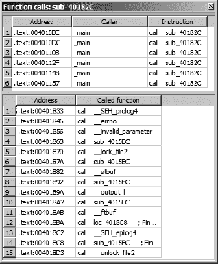

图 5-10. 函数调用窗口

在这个例子中，我们看到名为`sub_40182C`的函数在`_main`和`_main`中从六个不同的位置被调用，而`_main`又依次调用了 15 个其他函数。在函数调用窗口中双击任何一行会立即将反汇编窗口跳转到选定的调用或被调用函数（或调用者和被调用者）。IDA 交叉引用（xrefs）是生成函数调用窗口的底层机制。交叉引用将在第九章中更详细地介绍。

## 问题窗口

问题窗口是 IDA 通知你它在反汇编二进制文件时遇到的任何困难以及它如何处理这些困难的方式。在某些情况下，你可能能够操作反汇编来帮助 IDA 克服问题，而在其他情况下你可能不能。你可能会在即使是简单的二进制文件中遇到问题。在许多情况下，简单地选择忽略问题不是一个坏策略。为了纠正许多问题，你需要比 IDA 更好的理解二进制文件，对于我们大多数人来说，这可能不太可能发生。以下是一些问题示例：

```
Address          Type       Instruction
.text:0040104C   BOUNDS     call    eax
.text:004010B0   BOUNDS     call    eax
.text:00401108   BOUNDS     call    eax
.text:00401350   BOUNDS     call    dword ptr [eax]
.text:004012A0   DECISION   push    ebp
.text:004012D0   DECISION   push    ebp
.text:00401560   DECISION   jmp     ds:__set_app_type
.text:004015F8   DECISION   dd 0FFFFFFFFh
.text:004015FC   DECISION   dd 0
```

每个问题都有以下特征：（1）问题发生的位置地址，（2）遇到的问题类型，以及（3）问题位置处的指令。在这个例子中，我们看到一个 `BOUNDS` 问题和一个 `DECISION` 问题。当 `call` 或 `jump` 的目标无法确定（如本例中，因为 IDA 未知 `eax` 的值）或似乎位于程序虚拟地址范围之外时，就会发生 `BOUNDS` 问题。`DECISION` 问题通常根本不是问题。`DECISION` 通常表示 IDA 选择将字节反汇编为指令而不是数据的位置，即使该地址在递归下降指令遍历过程中从未被引用（参见第一章）。有关问题类型及其处理建议的完整列表可在内置的 IDA 帮助文件中找到（参见主题 *问题列表*）。

# 摘要

初看之下，IDA 提供的显示数量可能会让你感到不知所措。你可能发现，在足够熟悉之前，坚持使用主要显示是最容易的。无论如何，你当然不应该觉得有义务使用 IDA 抛给你的所有功能。并非每个窗口在每种逆向工程场景中都会有用。

除了本章中提到的窗口外，在你努力掌握 IDA 的过程中，你将面临大量的对话框。我们将随着书中剩余部分的相关性介绍关键对话框。最后，除了默认的反汇编视图图之外，我们选择在本章中不涵盖图形。IDA 菜单系统将图形区分为一个独立的显示类别，与本章讨论的子视图不同。我们将在第九章（第九章. 跨引用和图形）中解释这一选择的原因，该章专门讨论图形。

在这个阶段，你应该开始熟悉 IDA 用户界面了。在下一章中，我们将开始关注你如何通过操作反汇编来增强对其行为的理解，以及如何使你的生活使用 IDA 更为便捷。

# 第六章. 反汇编导航


在本章和接下来的章节中，我们将介绍赋予 IDA Pro 中“交互”核心的东西，简而言之，就是导航和操作的便捷性。本章的重点是导航；具体来说，我们展示了 IDA 如何以逻辑方式方便地在反汇编中移动。到目前为止，我们已经展示了在基本层面上 IDA 只是将许多常见逆向工程工具的功能组合到一个集成的反汇编显示中。静态反汇编列表除了滚动上下之外，没有固有的导航能力。即使是最优秀的文本编辑器，这些“死列表”也很难导航，因为它们所能提供的最好的东西通常只是集成式的、类似`grep`风格的搜索。正如您将看到的，IDA 的数据库基础提供了卓越的导航功能。

# 基本 IDA 导航

在您使用 IDA 的初始体验中，您可能会很高兴只使用 IDA 提供的导航功能。除了提供您从使用文本编辑器或文字处理器中习惯的标准搜索功能之外，IDA 还开发和显示了一个全面的交叉引用列表，其行为类似于网页上的超链接。最终结果是，在大多数情况下，导航到感兴趣的位置只需要双击即可。

## 双击导航

当一个程序被反汇编时，程序中的每个位置都会被分配一个虚拟地址。因此，我们可以通过提供我们感兴趣访问的位置的虚拟地址来在程序中导航到任何地方。不幸的是，在我们脑海中维护地址目录并不是一个简单任务。这个事实促使早期的程序员为他们希望引用的程序位置分配符号名称，这使得事情变得容易得多。对程序地址分配符号名称并不像对程序操作码分配助记指令名称；通过使它们更容易记住，程序变得更容易阅读和编写。

如我们之前讨论的，IDA 在分析阶段通过检查二进制的符号表或根据二进制中位置的引用自动生成名称来生成符号名称。除了其符号目的之外，在反汇编窗口中显示的任何名称都是一个潜在的导航目标，类似于网页上的超链接。这些名称与标准超链接之间的两个区别是（1）名称永远不会以任何方式突出显示以指示它们可以被跟随，以及（2）IDA 需要双击来跟随，而不是超链接所需的单击。我们已经看到了在函数、导入和导出等子窗口中使用名称的例子。回想一下，对于这些窗口中的每一个，双击一个名称都会使反汇编视图跳转到引用的位置。这是双击导航工作的一个例子。在下面的列表中，每个标记为  的符号代表一个命名的导航目标。双击其中的任何一个都会导致 IDA 将显示重新定位到所选位置。

```
.text:0040132B loc_40132B:                   ; CODE XREF: sub_4012E4+B^j
.text:0040132B       cmp     edx, 0CDh
.text:00401331       jg      short loc_40134E
.text:00401333       jz      loc_4013BF
.text:00401339       sub     edx, 0Ah
.text:0040133C       jz      short loc_4013A7
.text:0040133E       sub     edx, 0C1h
.text:00401344       jz      short loc_4013AF
.text:00401346       dec     edx
.text:00401347       jz      short loc_4013B7
.text:00401349       jmp     loc_4013DD   ; default
.text:00401349                              ; jumptable 00401300 case 0
.text:0040134E ; ----------------------------------------------------------
.text:0040134E
.text:0040134E loc_40134E:                   ; CODE XREF: sub_4012E4+4D^j
```

为了导航目的，IDA 将另外两个显示实体视为导航目标。首先，交叉引用（如图  所示）被视为导航目标。交叉引用通常格式化为名称和十六进制偏移量。在前面列表中`loc_40134E`右侧的交叉引用指的是`sub_4012E4`起始处`4D[16]`或`77[10]`字节之外的位置。双击交叉引用文本将使显示跳转到引用位置（在本例中为`00401331`）。交叉引用将在第九章中更详细地介绍。

在导航方面，第二种获得特殊处理的显示实体是使用十六进制值。如果一个显示的十六进制值代表二进制中的有效虚拟地址，那么双击该值将重新定位反汇编窗口以显示所选的虚拟地址。在下面的列表中，双击任何由  指示的值将跳转显示，因为每个值都是给定二进制中的有效虚拟地址，而双击任何由  指示的值将没有任何效果。

```
.data:00409013       db    4
.data:00409014       dd 4037B0h
.data:00409018       db    0
.data:00409019       db  0Ah
.data:0040901A       dd 404590h
.data:0040901E       db    0
.data:0040901F       db  0Ah
.data:00409020       dd 404DA8h
```

关于双击导航的最后一项说明是 IDA 输出窗口，它通常用于显示信息消息。当导航目标，如之前所述，作为消息中的第一个项目出现时，双击消息将使显示跳转到指示的目标。

```
Propagating type information...
  Function argument information has been propagated
  The initial autoanalysis has been finished.
 40134e is an interesting location
 Testing: 40134e
 loc_4013B7
 Testing: loc_4013B7
```

在刚刚显示的输出窗口摘录中，由  指示的两个消息可以使用来导航到各自消息开头指示的地址。双击任何其他消息，包括 ![httpatomoreillycomsourcenostarchimages854101.png] 中的消息，将不会执行任何操作。

## 跳转到地址

有时，您可能确切知道想要导航到的地址，但在反汇编窗口中没有可用的名称来提供简单的双击导航。在这种情况下，您有几个选择。第一个，也是最原始的选择，是使用反汇编窗口的滚动条向上或向下滚动显示，直到所需的地点出现在视图中。这通常只有在您要导航到的位置是按虚拟地址知道的时才可行，因为反汇编窗口是按虚拟地址线性组织的。如果您只知道一个命名的位置，例如名为 `foobar` 的子程序，那么通过滚动条导航就变成了一种类似大海捞针的搜索。在这种情况下，您可能选择按字母顺序对函数窗口进行排序，滚动到所需的名称，然后双击该名称。第三个选项是使用 IDA 的搜索功能之一，这些功能通常通过搜索菜单提供，这通常涉及在请求 IDA 执行搜索之前指定一些搜索条件。在搜索已知位置的情况下，这通常是过度的。

最终，到达已知的反汇编位置最简单的方法是使用图 6-1 中显示的地址跳转对话框。


图 6-1. 地址跳转对话框

地址跳转对话框可以通过“跳转 ▸ 跳转到地址”访问，或者在反汇编窗口处于活动状态时使用 G 快捷键。将此对话框视为“转到”对话框可能有助于您记住相关的快捷键。要导航到二进制中的任何位置，只需指定地址（可以是名称或十六进制值）并点击“确定”，这将立即将显示跳转到所需位置。对话框中输入的值将被记住，并在后续使用时通过下拉列表提供。此历史功能使得返回之前请求的位置变得相对容易。

## 导航历史

如果我们将 IDA 的文档导航功能与网络浏览器的功能进行比较，我们可以将名称和地址等同于超链接，因为每个都可以相对容易地跟随以查看新位置。IDA 与传统的网络浏览器共享的另一项功能是基于你导航反汇编的顺序的前进和后退导航概念。每次你导航到反汇编中的新位置时，你的当前位置都会附加到历史列表中。有两个菜单操作可用于遍历此列表。首先，Jump ▸ 跳转到上一个位置将反汇编重新定位到历史列表中的最新条目。其行为在概念上与网络浏览器的*后退*按钮相同。相关的快捷键是 esc，这是你可以记住的最有用的快捷键之一。然而，警告你，当除了反汇编窗口之外的任何窗口处于活动状态时使用 esc 会导致活动窗口关闭。（你可以通过 View ▸ Open Subviews 重新打开你意外关闭的窗口。）当你跟随了多层函数调用链并决定想要导航回反汇编中的原始位置时，后退导航非常方便。

Jump ▸ 跳转到下一个位置是与该操作对应的操作，它以类似于网络浏览器*前进*按钮的方式将反汇编窗口向前移动历史列表。为了完整性起见，此操作的关联快捷键是 ctrl-enter，尽管它通常不如使用 esc 进行后退导航有用。

最后，两个更有用的工具栏按钮，如图 6-2 所示，提供了熟悉的浏览器风格的前进和后退行为。每个按钮都关联一个下拉历史列表，它允许你立即访问导航历史中的任何位置，而无需在整个列表中追踪你的步骤。


图 6-2. 前进和后退导航按钮

# 栈帧

由于 IDA Pro 是一个低级分析工具，许多其功能和显示都期望用户对编译语言的低级细节有一定了解，这些细节大多集中在生成机器语言和管理高级程序使用的内存的具体细节上。因此，本书不时会涵盖一些编译程序的理论，以便理解相关的 IDA 显示。

其中一个低级概念是栈帧。*栈帧*是在程序运行时堆栈内分配的内存块，专门用于函数的特定调用。程序员通常将可执行语句组合成称为*函数*（也称为*过程*、*子程序*或*方法*）的单位。在某些情况下，这可能使用户使用的语言的要求。在大多数情况下，将程序构建成这样的功能单元被认为是良好的编程实践。

当函数未执行时，它通常需要的内存很少或不需要。但是，当函数被调用时，它可能需要内存，原因有几个。首先，函数的调用者可能希望以参数（参数）的形式将信息传递给函数，并且这些参数需要存储在函数可以找到它们的地方。其次，函数在执行任务时可能需要临时存储空间。这种临时空间通常是通过程序员通过声明局部变量来分配的，这些局部变量可以在函数内部使用，但在函数完成后无法访问。

编译器利用栈帧（也称为*活动记录*）使函数参数和局部变量的分配和释放对程序员来说是透明的。编译器在将控制权传递给函数本身之前，插入代码将函数的参数放入栈帧中，此时编译器插入代码以分配足够的内存来存储函数的局部变量。由于栈帧的构建方式，函数应返回的地址也存储在新的栈帧中。使用栈帧的一个令人愉快的结果是递归成为可能，因为每个递归调用函数都有自己的栈帧，从而清晰地隔离了每个调用与其前一个调用。以下步骤详细说明了函数被调用时发生的操作：

1.  调用者将函数所需的所有参数放入由被调用函数使用的调用约定（参见调用约定）指定的位置。如果参数放在运行时堆栈上，此操作可能会导致程序堆栈指针发生变化。

1.  调用者将控制权传递给被调用的函数。这通常通过像 x86 的`CALL`或 MIPS 的`JAL`这样的指令来完成。返回地址通常被保存在程序堆栈或 CPU 寄存器中。

1.  如果需要，被调用的函数会采取步骤配置一个帧指针^([42])并保存调用者期望保持不变的任何寄存器值。

1.  被调用的函数为其可能需要的任何局部变量分配空间。这通常是通过调整程序堆栈指针来在运行时堆栈上预留空间来完成的。

1.  被调用的函数执行其操作，可能生成一个结果。在执行操作的过程中，被调用的函数可能会访问调用函数传递给它的参数。如果函数返回一个结果，这个结果通常会被放置到一个或多个特定的寄存器中，调用者可以在函数返回后检查这些寄存器。

1.  一旦函数完成其操作，为局部变量保留的栈空间就会被释放。这通常是通过逆转第 4 步中执行的操作来完成的。

1.  为调用者保存的任何寄存器值（在第 3 步中保存）都会恢复到其原始值。这包括恢复调用者的帧指针寄存器。

1.  被调用的函数将控制权返回给调用者。典型的指令包括 x86 的`RET`指令和 MIPS 的`JR`指令。根据使用的调用约定，此操作还可能用于清除程序栈中的一个或多个参数。

1.  一旦调用者恢复控制，它可能需要从程序栈中移除参数。在这种情况下，可能需要进行栈调整，以将程序栈指针恢复到第 1 步之前的值。

第 3 步和第 4 步在函数进入时通常都会执行，因此它们一起被称为函数的*序言*。同样，第 6 步到第 8 步在函数结束时经常执行，因此它们共同构成了函数的*尾声*。除了代表函数主体的第 5 步之外，所有这些操作都构成了调用函数时的开销。

## 调用约定

在对栈帧有一个基本理解的基础上，我们可以更仔细地看看它们是如何结构的。以下示例参考了 x86 架构以及与常见的 x86 编译器（如 Microsoft Visual C/C++或 GNU 的 gcc/g++）相关的行为。创建栈帧最重要的步骤之一是调用函数将函数参数放置到栈上。调用函数必须按照被调用函数期望找到的方式存储参数；否则，可能会出现严重问题。函数通过选择并遵循特定的调用约定来声明它们期望接收参数的方式。

*调用约定*确切地规定了调用者应将函数所需的任何参数放置在何处。调用约定可能要求参数放置在特定的寄存器中、程序堆栈上，或者同时在寄存器和堆栈上。与参数在程序堆栈上传递的时间同等重要的是确定谁负责在调用函数完成后从堆栈上移除它们。一些调用约定规定调用者负责从堆栈上移除它放置的参数，而其他调用约定规定被调用函数将负责从堆栈上移除参数。遵守公开的调用约定对于维护程序堆栈指针的完整性至关重要。

### C 调用约定

大多数 C 编译器用于 x86 架构的默认调用约定被称为*C 调用约定*。C/C++程序可以使用`_cdecl`修饰符强制编译器在默认调用约定可能已被覆盖时使用 C 调用约定。从现在起，我们将此调用约定称为`cdecl`调用约定。`cdecl`调用约定指定调用者将函数的参数按从右到左的顺序放置在堆栈上，并且调用者（而不是被调用者）在调用函数完成后从堆栈上移除参数。

将参数按从右到左的顺序放置在堆栈上的一个结果是，当函数被调用时，函数的最左端（第一个）参数将始终位于堆栈的顶部。这使得无论函数期望多少参数，第一个参数都很容易找到，并且这使得`cdecl`调用约定非常适合用于可以接受可变数量参数的函数（如`printf`）。

要求调用函数从堆栈中移除参数意味着你经常会看到在调用函数返回后立即调整程序堆栈指针的指令。对于可以接受可变数量参数的函数，调用者非常适合进行这种调整，因为调用者确切地知道它选择了多少参数传递给函数，并且可以轻松地进行正确的调整，而调用函数事先永远不知道它可能接收多少参数，并且很难进行必要的堆栈调整。

在以下示例中，我们考虑对具有以下原型的函数的调用：

```
void demo_cdecl(int w, int x, int y, int z);
```

默认情况下，此函数将使用`cdecl`调用约定，期望四个参数按从右到左的顺序压入，并要求调用者清理堆栈上的参数。编译器可能会生成如下调用此函数的代码：

```
; demo_cdecl(1, 2, 3, 4);   //programmer calls demo_cdecl
 push   4           ; push parameter z
  push   3           ; push parameter y
  push   2           ; push parameter x
  push   1           ; push parameter w
  call   demo_cdecl  ; call the function
 add    esp, 16     ; adjust esp to its former value
```

从  开始的四个 `push` 操作导致程序栈指针（ESP）净变化为 16 字节（在 32 位架构上为 `4 * sizeof(int)`），在从 `demo_cdecl` 返回后通过  进行撤销。如果 `demo_cdecl` 被调用 50 次，每次调用之后都会进行类似的调整。以下示例也遵循 `cdecl` 调用约定，同时消除了调用者每次调用 `demo_cdecl` 后显式清理栈上参数的需求。

```
; demo_cdecl(1, 2, 3, 4);   //programmer calls demo_cdecl
   mov   [esp+12], 4   ; move parameter z to fourth position on stack
   mov   [esp+8], 3    ; move parameter y to third position on stack
   mov   [esp+4], 2    ; move parameter x to second position on stack
   mov   [esp], 1      ; move parameter w to top of stack
   call   demo_cdecl  ; call the function
```

在这个例子中，编译器在函数前导部分为 `demo_cdecl` 的参数在栈顶预分配了存储空间。当 `demo_cdecl` 的参数放置在栈上时，程序栈指针没有变化，这消除了在 `demo_cdecl` 调用完成后调整栈指针的需求。GNU 编译器（gcc 和 g++）利用这种技术将函数参数放置到栈上。

注意，两种方法都会导致在函数调用时栈指针指向最左边的参数。

### 标准调用约定

在这个例子中，“标准”一词有点名不副实，因为它是一个微软为其自己的调用约定创建的名称，该约定在函数声明中使用 `_stdcall` 修饰符，如下所示：

```
void _stdcall demo_stdcall(int w, int x, int y);
```

为了避免对“标准”一词的任何混淆，我们将在此书余下的部分中将此调用约定称为 `stdcall` 调用约定。

与 `cdecl` 调用约定一样，`stdcall` 要求函数参数以从右到左的顺序放置在程序栈上。使用 `stdcall` 的区别在于，被调用的函数负责在函数完成后清理函数参数从栈上。为了执行此操作，函数必须确切知道栈上有多少个参数。这仅适用于接受固定数量参数的函数。因此，像 `printf` 这样的可变参数函数无法使用 `stdcall` 调用约定。例如，`demo_stdcall` 函数期望有三个整数参数，在栈上总共占用 12 字节（在 32 位架构上为 `3 * sizeof(int)`）。x86 编译器可以使用 `RET` 指令的特殊形式，同时从栈顶弹出返回地址并将 12 加到栈指针上以清理函数参数。在 `demo_stdcall` 的情况下，我们可能会看到以下指令用于返回给调用者：

```
ret 12     ; return and clear 12 bytes from the stack
```

使用`stdcall`的主要优势是消除了在每个函数调用后清理栈上参数的代码，这导致程序稍微小一些，稍微快一些。按照惯例，Microsoft 为从共享库（DLL）文件导出的所有固定参数函数使用`stdcall`约定。如果你试图生成函数原型或任何共享库组件的二进制兼容替代品，这是一个需要记住的重要点。

### x86 的 fastcall 约定

`stdcall`约定的一个变体，`fastcall`调用约定通过 CPU 寄存器而不是程序栈传递最多两个参数。Microsoft Visual C/C++和 GNU gcc/g++（版本 3.4 及以后）编译器在函数声明中识别`fastcall`修饰符。当指定`fastcall`时，传递给函数的前两个参数将分别放置在 ECX 和 EDX 寄存器中。任何剩余的参数都按右到左的顺序放置在栈上，类似于`stdcall`。同样，与`stdcall`类似，`fastcall`函数在返回调用者时负责从栈中移除参数。以下声明演示了`fastcall`修饰符的使用。

```
void fastcall demo_fastcall(int w, int x, int y, int z);
```

编译器可能会生成以下代码来调用`demo_fastcall`：

```
; demo_fastcall(1, 2, 3, 4);   //programmer calls demo_fastcall
   push   4              ; move parameter z to second position on stack
   push   3              ; move parameter y to top position on stack
   mov    edx, 2         ; move parameter x to edx
   mov    ecx, 1         ; move parameter w to ecx
   call   demo_fastcall  ; call the function
```

注意，从`demo_fastcall`的调用返回时不需要进行栈调整，因为`demo_fastcall`负责在返回调用者时清除参数`y`和`z`。重要的是要理解，由于有两个参数通过寄存器传递，即使函数有四个参数，调用函数只需要从栈中清除 8 个字节。

### C++调用约定

C++类中的非静态成员函数与标准函数不同，因为它们必须提供指向用于调用该函数的对象的`this`指针。用于调用该函数的对象的地址必须由调用者提供，因此在调用非静态成员函数时作为参数提供。C++语言标准没有指定`this`应该如何传递给非静态成员函数，因此不同编译器在传递`this`时使用不同的技术并不令人惊讶。

Microsoft Visual C++提供了`thiscall`调用约定，它将`this`传递到 ECX 寄存器，并要求非静态成员函数像`stdcall`一样清理堆栈上的参数。GNU `g++`编译器将`this`视为任何非静态成员函数的隐含第一个参数，并在所有其他方面表现得像使用了`cdecl`约定。因此，对于`g++`编译的代码，`this`在调用非静态成员函数之前放在堆栈顶部，调用者负责在函数返回后从堆栈中移除参数（将始终至少有一个）。编译后的 C++的附加功能将在第八章中讨论。

### 其他调用约定

完全覆盖每个现有的调用约定需要一本专著。调用约定通常是语言、编译器和 CPU 特定的，当你遇到由不太常见的编译器生成的代码时，可能需要进行一些研究。然而，有一些情况值得特别提及：优化代码、自定义汇编语言代码和系统调用。

当函数被导出供其他程序员使用（例如库函数）时，它们遵循众所周知的调用约定非常重要，这样程序员可以轻松地与这些函数接口。另一方面，如果一个函数仅用于程序内部，那么该函数使用的调用约定只需要在该函数的程序内部知晓。在这种情况下，优化编译器可能会选择使用不同的调用约定以生成更快的代码。可能发生这种情况的实例包括使用 Microsoft Visual C++的`/GL`选项和使用 GNU gcc/g++的`regparm`关键字。

当程序员费心使用汇编语言时，他们可以完全控制参数如何传递到他们创建的任何函数。除非他们希望使他们的函数可供其他程序员使用，汇编语言程序员可以自由地以他们认为合适的方式传递参数。因此，在分析自定义汇编代码时，你可能需要格外小心。自定义汇编代码通常在混淆例程和 shellcode 中遇到。

*系统调用*是一种特殊类型的函数调用，用于请求操作系统服务。系统调用通常在用户模式到内核模式之间实现状态转换，以便操作系统内核处理用户请求。系统调用启动的方式因操作系统和 CPU 而异。例如，Linux x86 系统调用可能使用`int 0x80`指令或`sysenter`指令启动，而其他 x86 操作系统可能仅使用`sysenter`指令或不同的中断号。在许多 x86 系统上（Linux 除外），系统调用参数放置在运行时栈上，并在启动系统调用之前将系统调用号放置在 EAX 寄存器中。Linux 系统调用接受其参数在特定寄存器中，有时在内存中（当参数多于可用寄存器时）。

## 局部变量布局

与规定参数传递方式的调用约定不同，没有约定强制规定函数局部变量的布局。在编译函数时，编译器面临的一个任务是计算函数局部变量所需的空间量。另一个任务是确定这些变量是否可以分配在 CPU 寄存器中，或者是否必须在程序栈上分配。这些分配的确切方式对函数的调用者以及可能被调用的任何函数都无关紧要。最值得注意的是，通常无法通过检查函数的源代码来确定函数的局部变量布局。

## 栈帧示例

考虑以下在基于 32 位 x86 的计算机上编译的函数：

```
void bar(int j, int k);   // a function to call
void demo_stackframe(int a, int b, int c) {
   int x;
   char buffer[64];
   int y;
   int z;
   // body of function not terribly relevant other than
   bar(z, y);
}
```

我们计算局部变量所需的最小栈空间为 76 字节（三个 4 字节整数和一个 64 字节缓冲区）。此函数可以使用`stdcall`或`cdecl`，栈帧看起来将相同。图 6-3 显示了`demo_stackframe`调用的一种可能的栈帧实现，假设没有使用帧指针寄存器（因此栈指针 ESP 充当帧指针）。此栈帧将在`demo_stackframe`的入口处设置，使用一行前导代码：

```
sub   esp, 76     ; allocate sufficient space for all local variables
```

偏移列指示引用栈帧中任何局部变量或参数所需的基址+位移地址。

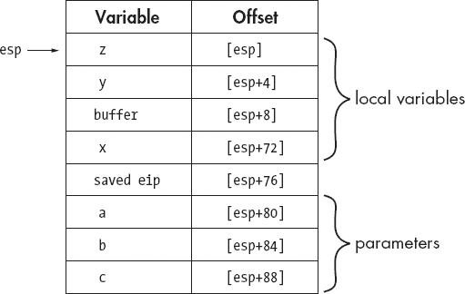

图 6-3. 基于 ESP 的栈帧

生成利用栈指针计算所有变量引用的函数需要编译器付出更多努力，因为栈指针频繁变化，编译器必须确保在引用栈帧内的任何变量时始终使用正确的偏移量。考虑在 `demo_stackframe` 函数中对 `bar` 的调用，其代码如下：

```
 push   dword [esp+4]     ; push y
 push   dword [esp+4]     ; push z
  call   bar
  add    esp, 8              ; cdecl requires caller to clear parameters
```

在  处的 `push` 指令正确地根据 图 6-3 中的偏移量将局部变量 `y` 压入栈中。乍一看， 处的 `push` 指令似乎错误地再次引用了局部变量 `y`。然而，因为我们处理的是基于 ESP 的帧，且  处的 `push` 修改了 ESP，所以每当 ESP 发生变化时，图 6-3 中的所有偏移量都必须临时调整。在  之后，局部变量 `z` 的新偏移量变为 `[esp+4]`，正如  处的 `push` 指令中所正确引用的那样。在检查使用栈指针引用栈帧变量的函数时，必须注意栈指针的任何变化，并相应地调整所有未来的变量偏移量。使用栈指针引用所有栈帧变量的一个优点是，所有其他寄存器都可用于其他目的。

一旦 `demo_stackframe` 完成执行，它需要返回调用者。最终将使用 `ret` 指令从栈顶弹出所需的返回地址到指令指针寄存器（在本例中为 EIP）。在返回地址弹出之前，需要从栈顶移除局部变量，以便在执行 `ret` 指令时栈指针能够正确地指向保存的返回地址。对于这个特定的函数，其结束部分变为

```
add     esp, 76     ; adjust esp to point to the saved return address
ret                 ; return to the caller
```

通过为帧指针分配一个寄存器并添加一些在函数入口配置帧指针的代码，可以简化计算局部变量偏移量的工作。在 x86 程序中，EBP（扩展基指针）寄存器通常被专门用于作为栈帧指针。默认情况下，大多数编译器生成的代码会使用帧指针，尽管通常存在指定应使用栈指针的选项。例如，GNU gcc/g++ 提供了 `-fomit-frame-pointer` 编译器选项，该选项生成的函数不依赖于固定的帧指针寄存器。

为了使用专门的帧指针查看 `demo_stackframe` 的栈帧结构，我们需要考虑这个新的前导代码：

```
 push    ebp        ; save the caller's ebp value
 mov     ebp, esp   ; make ebp point to the saved register value
 sub     esp, 76    ; allocate space for local variables
```

在的`push`指令保存了调用者当前使用的 EBP 值。遵循 Intel 32 位处理器 System V 应用程序二进制接口的函数^([43])允许修改 EAX、ECX 和 EDX 寄存器，但必须保留调用者所有其他寄存器的值。因此，如果我们想使用 EBP 作为帧指针，我们必须在更改它之前保存当前的 EBP 值，并且在返回调用者之前必须恢复 EBP 的值。如果需要代表调用者保存其他寄存器（例如 ESI 或 EDI），编译器可以选择在保存 EBP 的同时保存它们，或者它们可以选择在分配局部变量之后延迟保存。因此，在堆栈帧中没有标准的位置用于保存已保存的寄存器。

保存 EBP 之后，它可以改变以指向当前的堆栈位置。这是通过的`mov`指令实现的，该指令将当前堆栈指针的值复制到 EBP 中。最后，就像在非 EBP 基于的堆栈帧中一样，在分配了局部变量的空间。结果堆栈帧布局如图 6-4 所示。

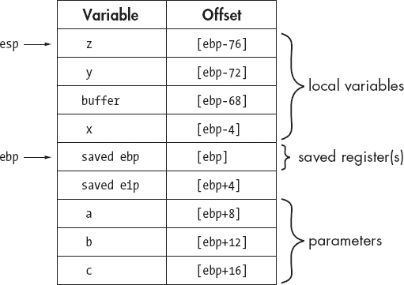

图 6-4. 基于 EBP 的堆栈帧

使用专门的帧指针，所有变量偏移量都是相对于帧指针寄存器计算的。通常情况下（尽管并非总是如此），正偏移量用于访问函数参数，而负偏移量用于访问局部变量。在使用专门的帧指针的情况下，栈指针可以自由更改，而不会影响帧内任何变量的偏移量。函数`bar`的调用现在可以如下实现：

```
 push   dword [ebp-72]       ; push y
  push   dword [ebp-76]       ; push z
  call   bar
  add    esp, 8               ; cdecl requires caller to clear parameters
```

在的`push`之后栈指针的变化对后续`push`中对局部变量`z`的访问没有影响。

最后，函数完成后，使用帧指针需要稍微不同的结尾，因为调用者的帧指针必须在返回之前恢复。在恢复旧帧指针的旧值之前，必须从栈中清除局部变量，但这一点通过当前帧指针指向旧帧指针的事实变得容易。在利用 EBP 作为帧指针的 x86 程序中，以下代码代表了一个典型的结尾：

```
mov    esp, ebp      ; clears local variables by reseting esp
pop    ebp           ; restore the caller's value of ebp
ret                  ; pop return address to return to the caller
```

这种操作如此常见，以至于 x86 架构提供了`leave`指令作为完成相同任务的简写方式。

```
leave                ; copies ebp to esp AND then pops into ebp
ret                  ; pop return address to return to the caller
```

虽然其他处理器架构使用的寄存器和指令的名称肯定会不同，但构建栈帧的基本过程将保持不变。无论架构如何，你都应该熟悉典型的序言和尾声序列，这样你就可以快速转向分析函数内部更有趣的代码。

## IDA 栈视图

栈帧显然是一个运行时概念；没有栈和没有正在运行程序，栈帧就无法存在。虽然这是真的，但这并不意味着你在使用 ID 等工具进行静态分析时应该忽略栈帧的概念。为每个函数设置栈帧所需的全部代码都包含在二进制文件中。通过仔细分析这段代码，我们可以在函数未运行时对其栈帧结构获得详细的理解。实际上，IDA 的一些最复杂分析正是为了确定 IDA 反汇编的每个函数的栈帧布局。在初始分析期间，IDA 会不遗余力地通过记录每次`push`或`pop`操作以及可能改变栈指针的算术操作（如添加或减去常量值）来监控函数执行过程中栈指针的行为。这次分析的首要目标是确定分配给函数栈帧的局部变量区域的确切大小。其他目标包括确定在给定函数中是否使用了专用帧指针（例如，通过识别`push ebp/mov ebp, esp`序列）以及识别函数栈帧内所有变量的内存引用。例如，如果 IDA 在`demo_stackframe`的主体中注意到以下指令：

```
mov    eax, [ebp+8]
```

它会理解函数的第一个参数（在这种情况下是`a`）被加载到 EAX 寄存器中（参见图 6-4）。通过仔细分析栈帧结构，IDA 可以区分访问函数参数（位于保存的返回地址下方）和访问局部变量（位于保存的返回地址上方）的内存引用。IDA 还采取额外的步骤来确定栈帧中哪些内存位置被直接引用。例如，虽然图 6-4 中的栈帧大小为 96 字节，但我们可能只会看到七个变量被引用（四个局部变量和三个参数）。

理解函数的行为通常归结于理解函数操作的数据类型。在阅读反汇编列表时，你将有机会了解函数操作的数据，那就是查看函数栈帧的分解。IDA 为任何函数的栈帧提供两种视图：总结视图和详细视图。为了理解这两种视图，我们将参考以下使用 gcc 编译的 `demo_stackframe` 版本。

```
void demo_stackframe(int a, int b, int c) {
   int x = c;
   char buffer[64];
   int y = b;
   int z = 10;
   buffer[0] = 'A';
   bar(z, y);
}
```

在这个例子中，局部变量 `x` 和 `y` 分别从参数 `c` 和 `b` 初始化。局部变量 `z` 使用常量值 10 初始化，64 字节局部数组 `buffer` 的第一个字符初始化为字母 `'A'`。这个函数对应的 IDA 反汇编代码如下。

```
.text:00401090 ; ========= S U B R O U T I N E ===========================
    .text:00401090
    .text:00401090 ; Attributes: bp-based frame
    .text:00401090
    .text:00401090 demo_stackframe proc near      ; CODE XREF: sub_4010C1+41↓p
    .text:00401090
   .text:00401090 var_60          = dword ptr −60h
    .text:00401090 var_5C          = dword ptr −5Ch
    .text:00401090 var_58          = byte ptr −58h
    .text:00401090 var_C           = dword ptr −0Ch
    .text:00401090 arg_4           = dword ptr  0Ch
    .text:00401090 arg_8           = dword ptr  10h
    .text:00401090
    .text:00401090                 push    ebp
    .text:00401091                 mov     ebp, esp
    .text:00401093                 sub     esp, 78h
    .text:00401096                 mov     eax, [ebp+arg_8]
      .text:00401099                mov     [ebp+var_C], eax
    .text:0040109C                mov     eax, [ebp+arg_4]
    .text:0040109F                mov     [ebp+var_5C], eax
    .text:004010A2                mov     [ebp+var_60], 0Ah
    .text:004010A9                mov     [ebp+var_58], 41h
    .text:004010AD                 mov     eax, [ebp+var_5C]
    .text:004010B0                mov     [esp+4], eax
    .text:004010B4                 mov     eax, [ebp+var_60]
    .text:004010B7                mov     [esp], eax
    .text:004010BA                 call    bar
    .text:004010BF                 leave
    .text:004010C0                 retn
    .text:004010C0 demo_stackframe endp
```

在我们开始熟悉 IDA 的反汇编符号时，这个列表中有许多要点需要涵盖。我们从  开始，注意到 IDA 根据对函数前导的分析认为这个函数使用 EBP 寄存器作为帧指针。在  我们了解到 gcc 在栈帧中为局部变量分配了 120 字节（78h 等于 120）的空间。这包括为在  处的 `bar` 函数传递两个参数而分配的 8 字节，但这仍然远大于我们之前估计的 76 字节，并表明编译器有时会通过额外的字节填充局部变量空间，以确保栈帧中的特定对齐。从  开始，IDA 提供了一个总结的栈视图，列出了在栈帧中直接引用的每个变量，以及变量的大小和从帧指针的偏移距离。

IDA 根据变量相对于保存的返回地址的位置来分配变量名称。局部变量位于保存的返回地址之上，而函数参数位于保存的返回地址之下。局部变量名称是通过使用`var_`前缀与表示变量相对于保存的帧指针的字节距离的十六进制后缀结合来派生的。在这个例子中，局部变量`var_C`是一个 4 字节（dword）变量，位于保存的帧指针之上 12 字节（`[ebp-0Ch]`）。函数参数名称是通过使用`arg_`前缀与表示从最高参数的相对距离的十六进制后缀结合来生成的。因此，最顶部的 4 字节参数将被命名为`arg_0`，而后续的参数将被命名为`arg_4`、`arg_8`、`arg_C`等等。在这个特定的例子中，`arg_0`没有被列出，因为该函数没有使用参数`a`。由于 IDA 未能定位到 `[ebp+8]`（第一个参数的位置）的任何内存引用，`arg_0`在总结栈视图中没有被列出。快速扫描总结栈视图可以发现，由于程序代码中不存在对这些位置的直接引用，IDA 未能为许多栈位置命名。

### 注意

IDA 将自动为那些在函数内部直接引用的栈变量生成名称。

IDA 的汇编列表与我们之前执行的栈帧分析之间的重要区别在于，在汇编列表中我们看不到类似于 `[ebp-12]` 的内存引用。相反，IDA 用与栈视图中的符号及其相对于栈帧指针的相对偏移相对应的符号名称替换了所有常量偏移。这与 IDA 生成高级汇编的目标相一致。处理符号名称比处理数字常数要简单得多。实际上，正如我们稍后将看到的，IDA 允许我们将任何栈变量的名称更改为我们想要的任何名称，这使得名称更容易记住。总结栈视图充当从 IDA 生成的名称到其对应的栈帧偏移的映射。例如，在汇编中出现的内存引用 `[ebp+arg_8]`，可以使用 `[ebp+10h]` 或 `[ebp+16]` 代替。如果您更喜欢数字偏移，IDA 会乐意向您展示。在处的`arg_8`上右键单击，会显示图 6-5 中所示的相关上下文菜单，其中包含几个更改显示格式的选项。


图 6-5. 选择一个替代显示格式

在这个例子中，由于我们有可用的源代码进行比较，我们可以使用反汇编中可用的各种线索将 IDA 生成的变量名映射回原始源代码中使用的名称。

1.  首先，`demo_stackframe`函数接受三个参数：`a`、`b`和`c`。它们分别对应于变量`arg_0`、`arg_4`和`arg_8`（尽管`arg_0`在反汇编中缺失，因为它从未被引用过）。

1.  局部变量`x`是从参数`c`初始化的。因此`var_C`对应于`x`，因为它是从`arg_8`初始化的，如所示。

1.  同样，局部变量`y`是从参数`b`初始化的。因此，`var_5C`对应于`y`，因为它是从`arg_4`初始化的，如所示。

1.  局部变量`z`对应于`var_60`，因为它初始化为 10，如所示。

1.  64 字节的字符数组`buffer`从`var_58`开始，因为`buffer[0]`被初始化为*A*（ASCII 0x41），如所示。

1.  在调用`bar`时，两个参数被移动到堆栈中，而不是推送到堆栈。这在当前版本的 gcc（版本 3.4 及以后）中很典型。IDA 识别这个约定，并选择不为堆栈帧顶部的两个项目创建局部变量引用。

除了总结堆栈视图之外，IDA 还提供了一个详细的堆栈帧视图，其中对分配给每个堆栈帧的每个字节都进行了记录。通过双击与给定堆栈帧相关联的任何变量名可以访问详细视图。双击前一个列表中的`var_C`将显示图 6-6 中所示的堆栈帧视图（按 Esc 键关闭窗口）。


图 6-6. IDA 堆栈帧视图

由于详细视图考虑了堆栈帧中的每一个字节，它占用的空间比只列出引用变量的摘要视图大得多。在图 6-6 中显示的堆栈帧部分总共占用 32 字节，这仅代表整个堆栈帧的一小部分。请注意，没有直接在函数内部引用的字节没有被分配名称。例如，参数`a`对应于`arg_0`，在`demo_stackframe`中从未被引用。由于没有内存引用进行分析，IDA 选择不对堆栈帧中相应的字节进行操作，这些字节占用偏移量`+00000008`到`+0000000B`。另一方面，`arg_4`在反汇编列表中的处被直接引用，其内容被加载到 32 位 EAX 寄存器中。基于移动了 32 位数据的事实，IDA 能够推断出`arg_4`是一个 4 字节量，并将其标记为这样（`db`定义 1 字节的存储；`dw`定义 2 字节的存储，也称为*字*；`dd`定义 4 字节的存储，也称为*双字*）。

在图 6-6 中显示的两个特殊值是“ `s`”和“ `r`”（每个都以一个前置空格开头）。这些伪变量是 IDA 对保存的返回地址（“ `r`”）和保存的寄存器值（在本例中，“ `s`”仅代表 EBP）的特殊表示。这些值包含在堆栈帧视图中以保持完整性，因为堆栈帧中的每一个字节都被考虑在内。

栈帧视图提供了对编译器内部工作原理的详细观察。在图 6-6 中可以清楚地看到，编译器在保存的帧指针“`s`”和局部变量`x`(`var_C`)之间插入了 8 个额外的字节。这些字节占据了栈帧中的`−00000001`到`−00000008`的偏移量。此外，对总结视图中列出的每个变量的偏移量进行一些数学运算，可以发现编译器为`var_58`中的字符缓冲区分配了 76 个字节（而不是源代码中的 64 个字节）。除非你恰好是编译器编写者或者愿意深入研究 gcc 的源代码，否则你所能做的就是推测为什么以这种方式分配这些额外的字节。在大多数情况下，我们可以将这些额外的字节归因于对齐的填充，并且通常这些额外的字节对程序的行为没有影响。毕竟，如果一个程序员请求 64 个字节并得到了 76 个字节，程序的行为应该没有不同，尤其是程序员不应该使用超过请求的 64 个字节。另一方面，如果你恰好是漏洞开发者并且了解到可以溢出这个特定的缓冲区，那么你可能会对这样一个事实非常感兴趣：直到你提供了至少 76 个字节，也就是编译器所认为的缓冲区的有效大小，才可能发生任何有趣的事情。在第八章中，我们将回到栈帧视图及其在处理更复杂的类型，如数组和结构体时的用途。

* * *

^([42]) 栈帧指针是一个指向栈帧内部位置的寄存器。栈帧内的变量通常通过它们与栈帧指针指向的位置的相对距离来引用。

^([43]) 见[`www.sco.com/developers/devspecs/abi386-4.pdf`](http://www.sco.com/developers/devspecs/abi386-4.pdf)。

# 搜索数据库

IDA 使您能够轻松导航到已知的内容，并设计了许多数据显示来总结特定类型的信息（名称、字符串、导入等），使它们也易于查找。然而，提供了哪些功能来帮助您在数据库中进行更通用的搜索？如果您花时间查看搜索菜单的内容，您会发现一个长长的选项列表，其中大部分会将您带到某个类别的下一个项目。例如，搜索 ▸ 下一个代码会将光标移动到包含指令的下一个位置。您还可能希望熟悉跳转菜单上的选项。对于这些选项中的许多，您将看到一个可以选择的位置列表。例如，跳转 ▸ 跳转到函数会弹出一个包含所有函数的列表，让您可以快速选择一个并导航到它。虽然这些预定义的搜索功能可能经常很有用，但两种通用搜索类型值得更详细的讨论：文本搜索和二进制搜索。

## 文本搜索

IDA 的文本搜索相当于在反汇编列表视图中进行子串搜索。文本搜索通过搜索 ▸ 文本（快捷键：alt-T）启动，打开如图 图 6-7 所示的对话框。一些自解释的选项规定了要执行搜索的具体细节。如图所示，允许使用 POSIX 风格的正则表达式。*标识符*搜索的名称有些误导。实际上，它限制搜索只查找整个单词，并且可以匹配汇编行上的任何整个单词，包括操作码助记符或常量值。对 `401116` 的标识符搜索将无法找到名为 `loc_401116` 的符号。

选择*查找所有匹配项*会导致搜索结果在一个新窗口中打开，允许轻松导航到任何单个匹配项。最后，可以使用 ctrl-T 或搜索 ▸ 下一个文本重复之前的搜索以定位下一个匹配项。

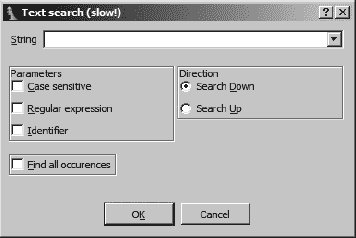

图 6-7. 文本搜索对话框

## 二进制搜索

如果你需要搜索特定的二进制内容，例如已知的字节序列，则文本搜索不是答案。相反，你需要使用 IDA 的二进制搜索功能。虽然文本搜索搜索反汇编窗口，但二进制搜索将只搜索十六进制视图窗口的内容部分。可以搜索十六进制转储或 ASCII 转储，具体取决于如何指定搜索字符串。使用“搜索 ▸ 字节序列”或 alt-B 启动二进制搜索。图 6-8 显示了二进制搜索对话框。要搜索一系列十六进制字节，搜索字符串应指定为两个十六进制值的空间分隔列表，例如`CA FE BA BE`，这提供了与搜索`ca fe ba be`相同的行为，尽管有“区分大小写”选项可用。

要搜索嵌入的字符串数据（实际上是在搜索十六进制视图窗口的 ASCII 转储部分），你必须用引号包围搜索字符串。使用 Unicode 字符串选项来搜索搜索字符串的 Unicode 版本。

“区分大小写”选项可能会引起混淆。对于字符串搜索来说，这相当直接；如果没有选择“区分大小写”，则搜索“hello”将成功找到“HELLO”。如果你执行了十六进制搜索并且没有勾选“区分大小写”，事情会变得有点有趣。如果你对`E9 41 C3`进行不区分大小写的搜索，当你发现搜索匹配`E9 61 C3`时可能会感到惊讶。这两个字符串被认为是匹配的，因为 0x41 对应于字符*A*，而 0x61 对应于*a*。所以，即使你指定了十六进制搜索，0x41 也被认为是等同于 0x61 的，因为你没有指定区分大小写的搜索。


图 6-8. 二进制搜索对话框

### 注意

在进行十六进制搜索时，确保如果你想要将搜索限制为精确匹配，则指定“区分大小写”。如果你正在搜索特定的操作码序列而不是 ASCII 文本，这一点非常重要。

使用 ctrl-B 或“搜索 ▸ 下一个字节序列”来搜索二进制数据的后续匹配。最后，没有必要在十六进制视图窗口内进行二进制搜索。IDA 允许你在反汇编视图活动时指定二进制搜索条件，在这种情况下，成功的搜索将跳转到与指定搜索条件匹配的底层字节的位置。

# 摘要

本章的目的是为你提供有效导航反汇编所需的最基本技能。你与 IDA 的大多数交互将涉及我们迄今为止讨论的操作。在安全掌握导航之后，下一个合乎逻辑的步骤是学习如何修改 IDA 数据库以适应你的特定需求。在下一章中，我们将开始探讨如何通过理解二进制的内容和行为来添加新知识，从而对反汇编进行最基本的更改。

# 第七章. 反汇编操作


导航之后，IDA 的下一个最重要的功能设计是为了让你能够修改反汇编代码以适应你的需求。在本章中，我们将展示由于 IDA 的底层数据库特性，你对反汇编所做的更改可以轻松传播到 IDA 的所有子视图中，以保持反汇编的一致性视图。IDA 提供的一项最强大的功能是能够轻松地操作反汇编代码，以添加新信息或重新格式化列表以适应你的特定需求。当这样做有意义时，IDA 会自动处理全局搜索和替换等操作，并将重新格式化指令和数据以及反之的操作变得简单，这些功能在其他反汇编工具中不可用。

### 注意

记住：在 IDA 中没有撤销操作。在你开始操作数据库时，请记住这一点。你所能得到的最佳选择是经常保存数据库，并回滚到最近保存的数据库版本。

# 名称和命名

到目前为止，我们在 IDA 反汇编中遇到了两类名称：与虚拟地址（命名位置）相关的名称和与栈帧变量相关的名称。在大多数情况下，IDA 将自动根据之前讨论的指南生成所有这些名称。IDA 将这些自动生成的名称称为*占位名称*。

不幸的是，这些名称很少暗示位置或变量的预期用途，因此通常不会增加我们对程序行为的理解。当你开始分析任何程序时，你将想要操纵反汇编列表的第一种和最常见的方法之一是将默认名称更改为更有意义的名称。幸运的是，IDA 允许你轻松地更改任何名称，并处理在整个反汇编中传播所有名称更改的所有细节。在大多数情况下，更改名称就像单击你想要更改的名称（这将突出显示名称）并使用 N 快捷键打开名称更改对话框一样简单。或者，右键单击要更改的名称通常会出现一个上下文相关的菜单，其中包含一个重命名选项，如图 图 6-5 所示。名称更改过程在栈变量和命名位置之间略有不同，这些差异将在以下各节中详细说明。

## 参数和局部变量

与栈变量关联的名称是反汇编列表中最简单的名称形式，主要是因为它们与特定的虚拟地址无关，因此永远不会出现在名称窗口中。与大多数编程语言一样，这些名称被认为是基于给定栈帧所属的函数的作用域受限。因此，程序中的每个函数可能都有自己的名为 `arg_0` 的栈变量，但没有任何函数可以有多个名为 `arg_0` 的变量。用于重命名栈变量的对话框如图 图 7-1 所示。


图 7-1. 重命名栈变量

一旦提供了新的名称，IDA 会负责更改当前函数上下文中旧名称的所有出现。将 `var_5C` 的名称更改为 `y` 用于 `demo_stackframe` 将导致此处显示的新列表，其中包含在  的更改。

```
.text:00401090 ; =========== S U B R O U T I N E =========================
.text:00401090
.text:00401090 ; Attributes: bp-based frame
.text:00401090
.text:00401090 demo_stackframe proc near      ; CODE XREF: sub_4010C1+41↓p
.text:00401090
.text:00401090 var_60          = dword ptr −60h
.text:00401090 y             = dword ptr −5Ch
.text:00401090 var_58          = byte ptr −58h
.text:00401090 var_C           = dword ptr −0Ch
.text:00401090 arg_4           = dword ptr  0Ch
.text:00401090 arg_8           = dword ptr  10h
.text:00401090
.text:00401090                 push    ebp
.text:00401091                 mov     ebp, esp
.text:00401093                 sub     esp, 112
.text:00401096                 mov     eax, [ebp+arg_8]
.text:00401099                 mov     [ebp+var_C], eax
.text:0040109C                 mov     eax, [ebp+arg_4]
.text:0040109F                 mov     [ebp+y], eax
.text:004010A2                 mov     [ebp+var_60], 0Ah
.text:004010A9                 mov     [ebp+var_58], 41h
.text:004010AD                 mov     eax, [ebp+y]
.text:004010B0                 mov     [esp+4], eax
.text:004010B4                 mov     eax, [ebp+var_60]
.text:004010B7                 mov     [esp], eax
.text:004010BA                 call    bar
.text:004010BF                 leave
.text:004010C0                 retn
.text:004010C0 demo_stackframe endp
```

如果你希望恢复给定变量的默认名称，请打开重命名对话框并输入一个空名称，IDA 将为你生成默认名称。

## 命名位置

重命名命名位置或将名称添加到未命名的位置与更改栈变量名称略有不同。访问名称更改对话框的过程相同（快捷键 N），但情况很快就会改变。图 7-2 显示了与命名位置关联的重命名对话框。

此对话框会告诉你确切地命名了哪个地址，以及可以与该名称相关联的属性列表。最大名称长度仅从 IDA 的配置文件中的一个值（*<IDADIR>/cfg/ida.cfg*）中回显。你可以使用比这个值更长的名称，这会导致 IDA 弱弱地提醒你已超出最大名称长度，并建议为你增加最大名称长度。如果你选择这样做，新的最大名称长度值将仅（弱弱地）在当前数据库中强制执行。你创建的任何新数据库将继续受配置文件中包含的最大名称长度的约束。

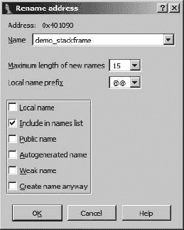

图 7-2. 重命名位置

以下属性可以与任何命名位置相关联：

**局部名称**

局部名称的范围限制在当前函数内，因此局部名称的唯一性仅在给定函数内强制执行。像局部变量一样，两个不同的函数可能包含相同的局部名称，但单个函数不能包含两个相同的局部名称。存在于函数边界之外的位置的命名位置不能指定为局部名称。这包括代表函数名称以及全局变量的名称。局部名称最常见的使用是为函数内跳转的目标提供符号名称，例如与分支控制结构相关联的名称。

**包含在名称列表中**

选择此选项会在名称窗口中添加一个名称，这可以使名称更容易找到，当你希望返回时。默认情况下，自动生成的（虚拟）名称永远不会包含在名称窗口中。

**公共名称**

公共名称通常是二进制文件（如共享库）导出的名称。IDA 的解析器通常在将文件头解析到数据库中时发现公共名称。你可以通过选择此属性强制将符号视为公共。通常，这除了在反汇编列表和名称窗口中添加公共注释外，对反汇编几乎没有影响。

**自动生成名称**

这个属性似乎对反汇编没有可察觉的影响。选择它不会导致 IDA 自动生成名称。

**弱名称**

弱符号是一种仅在找不到相同名称的公共符号来覆盖它时使用的特殊公共符号。将符号标记为弱符号对汇编器有一定的意义，但在 IDA 反汇编中意义不大。

**无论如何创建名称**

如前所述，函数内部不允许两个位置具有相同的名称。同样，任何函数外部（全局作用域内）的位置也不允许具有相同的名称。这个选项有些令人困惑，因为它的行为取决于你尝试创建的名称类型。

如果你正在编辑全局范围内的名称（如函数名称或全局变量），并且尝试分配数据库中已使用的名称，IDA 将显示冲突名称对话框，如图 图 7-3 所示，自动生成一个唯一的数字后缀以解决冲突。无论你是否选择了“无论如何创建名称”选项，都会显示此对话框。

如果你在函数内部编辑局部名称，并尝试分配一个已使用的名称，默认行为是简单地拒绝尝试。如果你决心使用给定的名称，你必须选择“无论如何创建名称”以强制 IDA 为局部名称生成一个唯一的数字后缀。当然，解决任何名称冲突的最简单方法是选择一个尚未使用的名称。


图 7-3. 名称冲突对话框

## 寄存器名称

第三种常被忽视的名称类型是寄存器名称。在函数的范围内，IDA 允许重命名寄存器。当编译器选择在寄存器中分配变量而不是在程序堆栈上，而你希望使用比 *EDX* 更适合其用途的名称来引用变量时，重命名寄存器可能很有用。寄存器重命名的工作方式与在其他位置重命名相同。使用 N 快捷键，或右键单击寄存器名称并选择 **重命名** 以打开寄存器重命名对话框。当你重命名寄存器时，实际上是在为当前函数的持续时间提供一个别名，以引用寄存器（IDA 甚至在函数开头使用 `alias = register` 语法来表示这个别名）。IDA 会负责将寄存器名称的所有实例替换为你提供的别名。无法重命名用于不属于函数的代码中的寄存器。

# 在 IDA 中的注释

IDA 中的另一个有用功能是能够在数据库中嵌入注释。注释是在分析程序时为自己留下关于进度笔记的特别有用的方式。特别是，注释有助于以更高级的形式描述汇编语言指令序列。例如，你可能选择使用 C 语言语句编写注释来总结特定函数的行为。在随后的函数分析中，注释将有助于比重新分析汇编语言语句更快地刷新你的记忆。

IDA 提供了多种注释样式，每种样式都适合不同的目的。可以使用从“编辑”▸“注释”中可用的选项将注释与反汇编列表中的任何一行相关联。快捷键或上下文菜单提供了对 IDA 注释功能的另一种访问方式。为了帮助您理解 IDA 的注释功能，我们参考以下对函数 `bar` 的反汇编：

```
.text:00401050 ; =============== S U B R O U T I N E
=======================================
.text:00401050
.text:00401050 ; void bar(int j, int k);
.text:00401050 ; Attributes: bp-based frame
.text:00401050
.text:00401050 
bar       proc near               ; CODE XREF: demo_stackframe+2A,p
.text:00401050
.text:00401050 arg_0     = dword ptr  8
.text:00401050 arg_4     = dword ptr  0Ch
.text:00401050
.text:00401050   push   ebp
.text:00401051   mov   ebp, esp
.text:00401053   sub   esp, 8
.text:00401056  The next three lines test j < k
.text:00401056   mov   eax, [ebp+arg_0]
.text:00401059   cmp   eax, [ebp+arg_4]
.text:0040105C   jge   short loc_40106C ;
 Repeating comments get echoed at referencing locations
.text:0040105E   mov   [esp], offset aTheSecondParam ;
 "The second parameter is larger"
.text:00401065   call  printf
.text:0040106A   jmp   short locret_40108E ; jump to the end of the function
.text:0040106C ; -------------------
--------------------------------------------------------
.text:0040106C
.text:0040106C loc_40106C:                             ; CODE XREF: bar+C·j
.text:0040106C   mov   eax, [ebp+arg_0] ;
 Repeating comments get echoed at referencing locations
.text:0040106F   cmp   eax, [ebp+arg_4]
.text:00401072   jle   short loc_401082
.text:00401074   mov   [esp], offset aTheFirstParame ;
 "The first parameter is larger"
.text:0040107B   call  printf
.text:00401080   jmp   short locret_40108E
.text:00401082 ; -----------------------
----------------------------------------------------
.text:00401082
.text:00401082 loc_401082:                             ; CODE XREF: bar+22·j
.text:00401082   mov   [esp], offset aTheParametersA ;
 "the parameters are equal"
.text:00401089   call  printf
.text:0040108E
.text:0040108E locret_40108E:                          ; CODE XREF: bar+1A·j
.text:0040108E                                         ; bar+30·j
.text:0040108E   leave
.text:0040108F   retn
.text:0040108F bar  endp
```

IDA 的大多数注释都以前缀分号 (;) 开头，以表明该行剩余部分应被视为注释。这与许多汇编器使用的注释风格相似，在许多脚本语言中相当于 #-style 注释，在 C++ 中相当于 //-style 注释。

## 常规注释

最直接的注释是 *常规注释*。常规注释放置在现有汇编行的末尾，如前一个列表中的  所示。在反汇编的右侧边缘右键单击或使用冒号 (:) 快捷键来激活注释输入对话框。如果您在注释输入对话框中输入多行，常规注释将跨越多行。每一行都将缩进以与反汇编的右侧对齐。要编辑或删除注释，您必须重新打开注释输入对话框并相应地编辑或删除所有注释文本。默认情况下，常规注释以蓝色文本显示。

IDA 本身大量使用常规注释。在分析阶段，IDA 插入常规注释来描述正在为函数调用推入的参数。这仅在 IDA 有被调用函数的参数名称或类型信息时发生。这些信息通常包含在类型库中，这在 第八章 和 第十三章 中讨论过，但也可能手动输入。

## 可重复注释

一个 *可重复的注释* 是一种只输入一次但可能在反汇编的许多位置自动出现的注释。前一个列表中的位置  展示了一个可重复的注释。在反汇编列表中，可重复注释的默认颜色是蓝色，这使得它们与常规注释难以区分。在这种情况下，重要的是行为而不是外观。可重复注释的行为与交叉引用的概念相关联。当一个程序位置引用包含可重复注释的第二个位置时，与第二个位置关联的注释会在第一个位置被回显。默认情况下，回显的注释以灰色文本显示，使得重复的注释与其他注释可区分。可重复注释的热键是分号 (;)，这使得很容易混淆可重复注释和常规注释。

在前一个列表中，请注意， 处的注释与  处的注释相同。 处的注释被重复，因为  处的指令 (`jge short loc_40106C`) 引用了  (`0040106C`) 的地址。

在显示重复注释的位置添加的常规注释会覆盖重复注释，因此只会显示常规注释。如果您在  处输入了常规注释，那么从  继承的可重复注释将不会在  处显示。如果您随后删除了  处的常规注释，可重复注释将再次显示。

与字符串相关联的重复性注释的变体。每当 IDA 自动创建一个字符串变量时，就会在所有引用该字符串变量的位置添加一个虚拟重复性注释。我们称之为“虚拟”，因为用户无法编辑该注释。虚拟注释的内容设置为字符串变量的内容，并在整个数据库中像可重复注释一样显示。因此，任何引用字符串变量的程序位置都会显示字符串变量的内容作为重复注释。标注为  的三个注释展示了由于字符串变量的引用而显示的此类注释。

## 前后行

*前后行* 是全行注释，出现在给定反汇编行的前面（前）或后面（后）。这些注释是 IDA 中唯一不带分号字符前缀的注释。前一个列表中的  显示了一个前行注释的例子。您可以通过比较行的地址与该行之前或之后指令的地址来区分前行和后行。

## 函数注释

*函数注释* 允许您将注释分组显示在函数反汇编列表的顶部。一个函数注释的示例在  中展示，其中已经输入了函数原型。您可以通过首先突出显示函数名称（）在函数顶部，然后添加一个常规或可重复注释来输入函数注释。可重复的函数注释在调用注释函数的任何位置都会被回显。当您使用第八章中讨论的“设置函数类型”命令时，IDA 会自动生成函数原型风格的注释。

# 基本代码变换

在许多情况下，您会对 IDA 生成的反汇编列表感到非常满意。在某些情况下，您可能不会。随着您分析的类型文件越来越远离由常用编译器生成的普通可执行文件，您可能会发现您需要更多地控制反汇编分析和显示过程。如果您发现自己正在分析混淆代码或使用 IDA 所不熟悉的自定义（未知于 IDA）文件格式的文件，这尤其正确。

IDA 便利的代码变换包括以下内容：

+   将数据转换为代码

+   将代码转换为数据

+   将一系列指令指定为函数

+   更改现有函数的起始或结束地址

+   更改指令操作数的显示格式

您对这些操作的使用程度取决于广泛的因素和个人偏好。一般来说，如果一个二进制文件非常复杂，或者 IDA 不熟悉用于构建二进制文件的编译器生成的代码序列，那么 IDA 在分析阶段可能会遇到更多问题，您将需要手动调整反汇编代码。

## 代码显示选项

你可以对反汇编列表进行的 simplest 变换涉及自定义 IDA 为每条反汇编行生成的信息量。每条反汇编行都可以被视为 IDA 所指的部件集合，不出所料，这些部件被称为 *反汇编行部件*。标签、助记符和操作数总是存在于反汇编行中。您可以通过在反汇编选项卡上的“选项 ▸ 通用”中，选择为每条反汇编行选择额外的部件，如图 图 7-4 所示。


图 7-4. 反汇编行显示选项

上右角的 *显示反汇编行部件* 部分提供了几个选项来定制反汇编行。对于 IDA 的文本反汇编视图，默认选中了行前缀、注释和可重复注释。每个选项在此都有描述，并在随后的列表中展示。

**行前缀**

行前缀是每条反汇编行的`section:address`部分。取消选择此选项会导致行前缀从每条反汇编行中移除（在图形视图中默认设置）。为了说明此选项，我们在下一个列表中已禁用行前缀。

**栈指针**

IDA 对每个函数进行广泛的分析，以跟踪程序栈指针的变化。这种分析对于理解每个函数的栈帧布局至关重要。选择栈指针选项会导致 IDA 在每个函数执行过程中显示栈指针的相对变化。这可能在识别调用约定中的差异（例如，IDA 可能不理解特定函数使用 `stdcall`）或对栈指针的异常操作时很有用。栈指针跟踪显示在  下的列中。在这个例子中，在第一条指令之后栈指针改变了四个字节，在第三条指令之后总共改变了 0x7C 字节。当函数完成时，栈指针恢复到其原始值（相对变化为零字节）。每当 IDA 遇到函数返回语句并检测到栈指针值不为零时，会标记错误条件并将指令行以红色突出显示。在某些情况下，这可能是故意试图阻碍自动化分析。在其他情况下，可能是一个编译器使用了 IDA 无法准确分析的前置和后置代码。

**注释和可重复注释**

取消选择这两个选项之一将抑制显示相应的注释类型。如果您希望清理反汇编列表，这可能很有用。

**自动注释**

IDA 可以自动注释某些指令类型。这可以作为关于特定指令行为的提醒。对于像 x86 的 `mov` 这样的简单指令不会添加注释。 中的注释是自动注释的示例。用户注释优先于自动注释；在这种情况下，如果您想查看 IDA 对某行的自动注释，您必须删除您添加的任何注释（常规或可重复的）。

**错误指令** **`<BAD>`** **标记**

IDA 可以标记处理器合法但某些汇编器可能无法识别的指令。与非法指令（而不是未记录的）相比，未记录的 CPU 指令可能属于此类。在这种情况下，IDA 将将指令反汇编为一系列数据字节，并将未记录的指令作为以 `<BAD>` 开头的注释显示。目的是生成大多数汇编器都可以处理的反汇编。有关 `<BAD>` 标记的使用信息，请参阅 IDA 帮助文件。

**操作码字节数**

大多数反汇编器都能够生成显示生成的机器语言字节与从中派生出的汇编语言指令并排的列表文件。IDA 允许你通过将十六进制显示与反汇编列表显示同步来查看与每个指令相关的机器语言字节。你可以选择性地通过指定 IDA 应为每个指令显示的机器语言字节数量来查看与汇编语言指令混合的机器语言字节。

当你正在拆解具有固定指令大小的处理器代码时，这相当直接，但对于像 x86 这样的变长指令处理器来说，这要困难一些，因为指令的大小可能从一两个字节到十几个字节不等。无论指令长度如何，IDA 都会在反汇编列表中为这里指定的字节数保留显示空间，将反汇编行的剩余部分推到右边，以适应指定的指令字节数量。以下反汇编中指令字节数量已设置为 5，可在下的列中看到。处的加号符号表示，根据当前设置，指定的指令太长而无法完全显示。

```

000 55                   push    ebp
004 89 E5                mov     ebp, esp
004 83 EC 78             sub     esp, 78h        ; Integer Subtraction
07C 8B 45 10             mov     eax, [ebp+arg_8]
07C 89 45 F4             mov     [ebp+var_C], eax
07C 8B 45 0C             mov     eax, [ebp+arg_4]
07C 89 45 A4             mov     [ebp+var_5C], eax
07C C7 45 A0 0A 00+     mov     [ebp+var_60], 0Ah
07C C6 45 A8 41          mov     [ebp+var_58], 41h
07C 8B 45 A4             mov     eax, [ebp+var_5C]
07C 89 44 24 04          mov     [esp+4], eax
07C 8B 45 A0             mov     eax, [ebp+var_60]
07C 89 04 24             mov     [esp], eax
07C E8 91 FF FF FF       call    bar             ; Call Procedure
07C C9                   leave                   ; High Level Procedure Exit
000 C3                   retn                    ; Return Near from Procedure
```

你可以通过调整图 7-4 右下角显示的缩进值和边距来进一步自定义反汇编显示。对这些选项的任何更改都仅影响当前数据库。每个这些选项的全局设置存储在主配置文件*<IDADIR>/cfg/ida.cfg*中。

## 格式化指令操作数

在反汇编过程中，IDA 会就如何格式化与每个指令关联的操作数做出许多决定。最大的决定通常围绕如何格式化各种整数常量，这些常量被各种指令类型广泛使用。这些常量可以表示跳转或调用指令中的相对偏移量、全局变量的绝对地址、用于算术运算的值或程序员定义的常量。为了使反汇编更易于阅读，IDA 尽可能地使用符号名称而不是数字。在某些情况下，格式化决策是基于正在反汇编的指令的上下文（例如调用指令）；在其他情况下，决策是基于使用的数据（例如访问全局变量或堆栈帧中的偏移量）。在许多其他情况下，常量被使用的确切上下文可能不清楚。当这种情况发生时，相关的常量通常格式化为十六进制常量。

如果你不是世界上少数几个吃、睡、呼吸十六进制的人之一，那么你将欢迎 IDA 的操作数格式化功能。在反汇编中右键单击任何常数都会打开一个类似于图 7-5 所示的上下文相关菜单。


图 7-5. 常数的格式化选项

在此情况下，菜单选项允许将常数（`41h`）重新格式化为十进制、八进制或二进制值。由于此示例中的常数位于 ASCII 可打印范围内，因此还提供了一个选项，可以将值格式化为字符常数。在所有情况下，菜单都会显示如果选择特定选项将替换操作数文本的确切文本。

在许多情况下，程序员会在源代码中使用命名常数。这些常数可能是`#define`语句（或其等效项）的结果，或者它们可能属于一组枚举常数。不幸的是，当编译器完成源代码后，就不再可能确定源代码是否使用了符号常数或字面量、数值常数。IDA 维护了一个与许多常见库（如 C 标准库或 Windows API）关联的命名常数的大型目录。此目录可通过任何常数值相关的上下文相关菜单上的“使用标准符号常数”选项访问。选择图 7-5 中的常数`0Ah`的此选项将打开图 7-6 所示的符号选择对话框。


图 7-6. 符号选择对话框

对话框是从 IDA 的内部常数列表中填充的，根据我们尝试格式化的常数的值进行过滤。在这种情况下，我们看到 IDA 知道等同于值`0Ah`的所有常数。如果我们确定该值是在创建 X.25 风格的网络连接时使用的，那么我们可能会选择 AF_CCITT，并最终得到以下反汇编行：

```
.text:004010A2                 mov     [ebp+var_60], AF_CCITT
```

标准常数的列表是确定特定常数是否可能与已知名称相关联的有用方法，并且可以节省大量时间阅读 API 文档以寻找潜在匹配项。

## 函数操作

在初始自动分析完成后，你可能会有许多原因想要操作函数。在某些情况下，例如当 IDA 未能定位到函数调用时，函数可能不会被识别，因为没有明显的方法可以到达它们。在其他情况下，IDA 可能无法正确地定位函数的结束，需要你手动干预来纠正反汇编。如果编译器将函数拆分到几个地址范围，或者在优化代码的过程中，编译器合并两个或更多函数的共同结束序列以节省空间，IDA 可能难以定位函数的结束。

### 创建新函数

在某些情况下，可以在没有函数存在的地方创建新函数。可以从不属于任何函数的现有指令创建新函数，或者可以从 IDA 未以任何其他方式定义的原始数据字节创建新函数（例如双字或字符串）。你通过将光标放在新函数要包含的第一个字节或指令上，然后选择编辑 ▸ 函数 ▸ 创建函数来创建函数。如果需要，IDA 会尝试将数据转换为代码。然后它向前扫描以分析函数的结构并搜索返回语句。如果 IDA 可以定位到函数的合适结束，它将生成一个新的函数名，分析堆栈帧，并以函数的形式重构代码。如果它无法定位函数的结束或遇到任何非法指令，则操作失败。

### 删除函数

你可以使用编辑 ▸ 函数 ▸ 删除函数来删除现有函数。如果你认为 IDA 在自动分析中出错，你可能想要删除函数。

### 函数块

函数块通常出现在由 Microsoft Visual C++编译器生成的代码中。块是编译器移动执行频率较低的代码块的结果，以便将频繁执行的块挤压到不太可能被交换出去的内存页中。

当函数以这种方式拆分时，IDA 会尝试通过跟随指向每个块的跳转来定位所有相关的块。在大多数情况下，IDA 能够很好地定位所有块，并在函数的标题中列出每个块，如下面的部分函数反汇编所示：

```
.text:004037AE ChunkedFunc     proc near
.text:004037AE
.text:004037AE var_420         = dword ptr −420h
.text:004037AE var_41C         = dword ptr −41Ch
.text:004037AE var_4           = dword ptr −4
.text:004037AE hinstDLL        = dword ptr  8
.text:004037AE fdwReason       = dword ptr  0Ch
.text:004037AE lpReserved      = dword ptr  10h
.text:004037AE
.text:004037AE ; FUNCTION CHUNK AT .text:004040D7 SIZE 00000011 BYTES
.text:004037AE ; FUNCTION CHUNK AT .text:004129ED SIZE 0000000A BYTES
.text:004037AE ; FUNCTION CHUNK AT .text:00413DBC SIZE 00000019 BYTES
.text:004037AE
.text:004037AE                 push    ebp
.text:004037AF                 mov     ebp, esp
```

通过双击与块关联的地址，可以轻松访问函数块，如图所示 。在反汇编列表中，函数块由注释表示，这些注释界定它们的指令并引用所属函数，如下列所示：

```
.text:004040D7 ; START OF FUNCTION CHUNK FOR ChunkedFunc
.text:004040D7
.text:004040D7 loc_0040C0D7:                   ; CODE XREF: ChunkedFunc+72↑j
.text:004040D7                 dec     eax
.text:004040D8                 jnz     loc_403836
.text:004040DE                 call    sub_4040ED
.text:004040E3                 jmp     loc_403836
.text:004040E3 ; END OF FUNCTION CHUNK FOR ChunkedFunc
```

在某些情况下，IDA 可能无法定位与函数关联的每个块，或者函数可能被错误地识别为块而不是作为独立的函数。在这种情况下，你可能需要创建自己的函数块或删除现有的函数块。

您可以通过选择属于该块的范围地址来创建新的函数块，这些地址必须不属于任何现有函数，并选择“编辑”▸“函数”▸“追加函数尾部”。此时，您将需要从一个包含所有定义函数的列表中选择父函数。

### 注意

在反汇编列表中，函数块被称为函数块。在 IDA 菜单系统中，函数块被称为函数尾部。

您可以通过将光标定位在要删除的块内的任何一行，并选择“编辑”▸“函数”▸“删除函数尾部”来删除现有的函数块。此时，您将需要确认您的操作，然后再删除所选块。

如果函数块带来的麻烦比它们的价值大，您可以在首次将文件加载到 IDA 时取消选择“创建函数尾部加载器”选项，以请求 IDA 不要创建函数块。此选项是可以通过内核选项（参见第四章）在初始文件加载对话框中访问的加载器选项之一。如果您禁用函数尾部，您可能注意到的主要区别是，原本包含尾部的函数现在包含跳转到函数边界之外的区域的跳转。IDA 使用红色线条和箭头在左侧的汇编窗口中突出显示此类跳转。在对应函数的图形视图中，此类跳转的目标不会显示。

### 函数属性

IDA 将其识别的每个函数关联到多个属性。如图图 7-7 所示的函数属性对话框可以用来编辑这些属性中的许多。这里解释了可以修改的每个属性。

**函数名称**

改变函数名称的另一种方法。

**起始地址**

函数中第一条指令的地址。IDA 通常在分析期间或从创建函数操作期间使用的地址自动确定此地址。

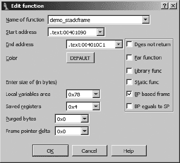

图 7-7。函数编辑对话框

**结束地址**

函数中最后一条指令之后的地址。在大多数情况下，这是函数返回指令之后的地址。在大多数情况下，此地址在分析阶段或作为函数创建的一部分自动确定。在 IDA 难以确定函数真正结束的情况中，您可能需要手动编辑此值。请记住，此地址实际上不是函数的一部分，而是位于函数的最后一条指令之后。

**局部变量区域**

这代表分配给局部变量的栈字节数（参见图 6-4)。在大多数情况下，这个值是根据函数内栈指针的行为自动计算的。

**保存的寄存器**

这是用于保存寄存器的字节数（参见图 6-4)，代表调用者的行为。IDA 认为保存的寄存器区域位于保存的返回地址之上，并且位于与函数相关的任何局部变量之下。一些编译器选择在函数的局部变量之上保存寄存器。IDA 认为保存此类寄存器所需的空间属于局部变量区域，而不是专门的保存寄存器区域。

**已清除的字节**

已清除的字节显示函数返回到其调用者时从栈中移除的参数字节数。对于`cdecl`函数，此值始终为零。对于`stdcall`函数，此值表示通过栈传递的任何参数消耗的空间（参见图 6-4)。在 x86 程序中，当 IDA 观察到返回指令的`RET N`变体使用时，可以自动确定此值。

**帧指针增量**

在某些情况下，编译器可能会调整函数的帧指针，使其指向局部变量区域的中间位置，而不是局部变量区域底部的保存帧指针。从调整后的帧指针到保存帧指针的距离称为*帧指针增量*。在大多数情况下，任何帧指针增量都会在分析函数时自动计算。编译器利用栈帧增量作为速度优化。增量目的是将尽可能多的栈帧变量保持在帧指针 1 字节有符号偏移（-128..+127）的范围内。

可用的附加属性复选框可用于进一步描述函数。与其他对话框中的字段一样，这些复选框通常反映了 IDA 的自动分析结果。以下属性可以打开和关闭。

**不返回**

函数不会返回到其调用者。当调用此类函数时，IDA 不会假设执行会继续跟随相关的调用指令。

**远函数**

用于在分段架构中将函数标记为远函数。函数的调用者调用函数时需要指定一个段和一个偏移值。使用远调用的需要通常是由程序中使用的内存模型决定的，而不是由架构支持分段的事实决定的，例如，在 x86 上使用*大*（与*平坦*相对）内存模型。

**库函数**

将函数标记为库代码。库代码可能包括编译器包含的支持例程或属于静态链接库的函数。将函数标记为库函数会导致函数使用分配的库函数着色显示，以区分非库代码。

**静态函数**

除了在函数的属性列表中显示静态修饰符外，不做任何事情。

**基于 BP 的帧**

表示该函数使用帧指针。在大多数情况下，你可以通过分析函数的前导部分自动确定这一点。如果分析未能识别出在给定函数中使用帧指针，你可以手动选择此属性。如果你手动选择此属性，请确保相应地调整保存的寄存器大小（通常增加保存的帧指针的大小）和局部变量大小（通常减少保存的帧指针的大小）。对于基于帧指针的帧，使用帧指针的内存引用格式化为使用符号栈变量名而不是数值偏移。如果未设置此属性，则假定栈帧引用相对于栈指针寄存器。

**BP 等于 SP**

一些函数在进入函数时会将帧指针配置为指向栈帧的顶部（与栈指针一起）。在这种情况下，应设置此属性。这本质上等同于拥有一个与局部变量区域大小相等的帧指针增量。

### 栈指针调整

如我们之前提到的，IDA 会尽力跟踪函数中每条指令对栈指针的更改。IDA 在这样做时达到的准确性对函数栈帧布局的准确性有显著影响。当 IDA 无法确定一条指令是否改变了栈指针时，你可能需要手动指定栈指针调整。

这种情况的最直接例子发生在当一个函数调用另一个使用`stdcall`调用约定的函数时。如果被调用的函数位于 IDA 没有知识的共享库中（IDA 附带许多常见库函数的签名和调用约定知识），那么 IDA 将不知道该函数使用`stdcall`，并且无法考虑到在返回之前被调用的函数已经修改了栈指针。因此，IDA 将反映一个不准确的栈指针值，直到函数结束。以下函数调用序列，其中`some_imported_func`位于共享库中，展示了这个问题（注意栈指针行部分选项已被打开）:

```
.text:004010EB   01C      push     eax
    .text:004010F3   020      push     2
    .text:004010FB   024      push     1
   .text:00401102   028      call    some_imported_func
    .text:00401107   028      mov     ebx, eax
```

由于 `some_imported_func` 使用 `stdcall`，它在返回时会清理三个参数从栈中，在  处的正确栈指针值应该是 `01C`。修复这个问题的方法之一是将手动栈调整与  处的指令关联起来。可以通过突出显示需要调整的地址，选择编辑 ▸ 函数 ▸ 更改栈指针（快捷键 alt-K），并指定栈指针变化的字节数，在这种情况下是 12。

尽管前面的例子有助于说明一个观点，但针对这个问题有一个更好的解决方案。考虑这种情况，`some_imported_func` 被多次调用。在这种情况下，我们需要在每个调用 `some_imported_func` 的位置进行我们刚才所做的栈调整。显然，这可能会非常繁琐，我们可能会遗漏某些东西。更好的解决方案是教育 IDA 了解 `some_imported_func` 的行为。因为我们处理的是一个导入函数，当我们尝试导航到它时，我们最终会到达该函数的导入表条目，该条目看起来可能如下所示：

```
.idata:00418078   ; Segment type: Externs
.idata:00418078   ; _idata
.idata:00418078         extrn some_imported_func:dword ; DATA XREF: sub_401034↑r
```

即使这是一个导入函数，IDA 允许你编辑与其行为有关的一块信息：与该函数关联的清除字节数。通过编辑此函数，你可以指定它在返回时从栈中清除的字节数，IDA 将将你提供的信息传播到调用该函数的每个位置，立即纠正那些位置的栈指针计算。

为了提高其自动分析能力，IDA 结合了高级技术，通过解决与栈指针行为相关的线性方程组来尝试解决栈指针差异。因此，你可能甚至没有意识到 IDA 对 `some_imported_func` 等函数的细节没有任何先验知识。有关这些技术的更多信息，请参阅 Ilfak 的博客文章，标题为“IDA Pro 中的单纯形法”在 [`hexblog.com/2006/06/`](http://hexblog.com/2006/06/)。

## 将数据转换为代码（反之亦然）

在自动分析阶段，字节有时会被错误地分类。数据字节可能被错误地分类为代码字节并反汇编成指令，或者代码字节可能被错误地分类为数据字节并以数据值格式化。这种情况可能由许多原因造成，包括一些编译器将数据嵌入到程序的代码部分，或者一些代码字节从未直接作为代码引用，而 IDA 选择不将其反汇编。特别是混淆程序往往会模糊代码段和数据段之间的区别。

无论你希望重新格式化反汇编的原因是什么，这样做都是相当简单的。重新格式化任何内容的第一个选项是移除其当前格式（代码或数据）。可以通过右键单击要取消定义的项目并从结果上下文相关菜单中选择“取消定义”（也可以选择“编辑”▸“取消定义”或使用快捷键 U）来取消定义函数、代码或数据。取消定义项目会导致底层字节以原始字节值的列表形式重新格式化。可以通过使用点击并拖动操作来选择在执行取消定义操作之前的一组地址，从而取消定义大区域。以下是一个简单的函数列表示例：

```
.text:004013E0 sub_4013E0      proc near
.text:004013E0                 push    ebp
.text:004013E1                 mov     ebp, esp
.text:004013E3                 pop     ebp
.text:004013E4                 retn
.text:004013E4 sub_4013E0      endp
```

取消定义此函数将产生这里显示的一系列未分类的字节，我们可以选择以几乎任何方式重新格式化：

```
.text:004013E0 unk_4013E0      db  55h ; U
.text:004013E1                 db  89h ; ë
.text:004013E2                 db 0E5h ; s
.text:004013E3                 db  5Dh ; ]
.text:004013E4                 db 0C3h ; +
```

要反汇编一系列未定义的字节，右键单击要反汇编的第一个字节，并选择“代码”（也可以选择“编辑”▸“代码”或使用快捷键 C）。这将导致 IDA 反汇编所有字节，直到遇到一个已定义的项目或非法指令。可以通过使用点击并拖动操作来选择在执行代码转换操作之前的一组地址，从而将大区域转换为代码。

将代码转换为数据的互补操作要复杂一些。首先，无法使用上下文菜单将代码转换为数据。可用的替代方案包括“编辑”▸“数据”和 D 快捷键。将指令批量转换为数据的最简单方法是在适当格式化数据之前，首先取消定义所有要转换为数据的指令。基本数据格式化将在下一节中讨论。

# 基本数据转换

正确格式化的数据在理解程序行为方面可能和正确格式化的代码一样重要。IDA 从各种来源获取信息，并使用许多算法来确定在反汇编中格式化数据的最佳方式。一些示例可以说明如何选择数据格式。

1.  可以从寄存器使用方式推断数据类型和/或大小。观察到从内存加载 32 位寄存器的指令意味着相关的内存位置持有 4 字节的数据类型（尽管我们可能无法区分 4 字节整数和 4 字节指针）。

1.  函数原型可以用来为函数参数分配数据类型。IDA 维护了一个大型函数原型库，专门用于此目的。分析函数传递的参数，试图将参数与内存位置关联起来。如果可以揭示这种关系，则可以将数据类型应用于相关的内存位置。考虑一个只有一个参数的函数，该参数是指向 CRITICAL_SECTION（Windows API 数据类型）的指针。如果 IDA 可以确定传递给此函数调用的地址，那么 IDA 可以将该地址标记为 CRITICAL_SECTION 对象。

1.  对字节序列的分析可以揭示可能的类型。这正是当对二进制文件进行字符串内容扫描时发生的情况。当遇到长序列的 ASCII 字符时，可以合理地假设它们代表字符数组。

在接下来的几节中，我们将讨论一些基本的数据转换，这些转换可以在你的反汇编中执行。

## 指定数据大小

修改数据的最简单方法就是调整其大小。IDA 提供了一系列数据大小/类型指定符。最常遇到的指定符是`db`、`dw`和`dd`，分别代表 1 字节、2 字节和 4 字节的数据。改变数据项大小的第一种方法是通过显示在图 7-8 中的“选项 ▸ 设置数据类型”对话框。

此对话框分为两部分。对话框的左侧包含一列按钮，用于立即更改当前选中项的数据大小。对话框的右侧包含一列复选框，用于配置 IDA 所说的“数据转盘”。请注意，左侧的每个按钮都对应右侧的一个复选框。数据转盘是一个循环列表，包含仅那些复选框被选中的数据类型。修改数据转盘的内容不会立即影响 IDA 显示。相反，数据转盘上的每个类型都会列在当你右键点击数据项时出现的上下文相关菜单中。因此，将数据重新格式化为数据转盘列表中的类型比重新格式化为未列出的类型要容易。考虑到图 7-8 中选定的数据类型，右键点击数据项将为你提供将该项重新格式化为字节、字或双字数据的机会。


图 7-8. 数据类型设置对话框

数据转盘的名称来源于与之关联的数据格式化快捷键的行为：D。当你按下 D 键时，当前选中的地址处的项目将被重新格式化为数据转盘列表中的下一个类型。在之前指定的三项列表中，当前格式化为`db`的项目将切换到`dw`，格式化为`dw`的项目将切换到`dd`，格式化为`dd`的项目将切换回`db`，以完成转盘的循环。在非数据项（如代码）上使用数据快捷键会导致该项目被格式化为转盘列表中的第一个数据类型（在这种情况下为`db`）。

在数据类型之间切换会导致数据项增长、缩小或保持相同大小。如果一个项的大小保持不变，那么唯一可观察的变化就是数据格式的方式。如果您减小一个项的大小，例如从`dd`（4 字节）减小到`db`（1 字节），任何额外的字节（本例中为 3 个字节）将变为未定义。如果您增加一个项的大小，IDA 会抱怨后续的字节已经定义，并间接地询问您是否希望 IDA 取消定义下一个项以扩展当前项。在这种情况下遇到的提示信息是“直接转换为数据？”此消息通常意味着 IDA 将取消定义足够数量的后续项以满足您的请求。例如，当将字节数据（`db`）转换为双字数据（`dd`）时，必须消耗 3 个额外的字节来形成新的数据项。

可以为描述数据的任何位置指定数据类型和大小，包括栈变量。要更改栈分配变量的大小，请通过双击要修改的变量打开详细栈帧视图；然后像任何其他变量一样更改变量的大小。

## 字符串操作

IDA 识别大量字符串格式。默认情况下，IDA 搜索并格式化 C 风格的空终止字符串。要强制数据转换为字符串，请使用“编辑”▸“字符串”菜单上的选项来选择特定的字符串样式。如果从当前选定的地址开始的字节形成一个所选样式的字符串，IDA 将这些字节组合成一个单字符串变量。在任何时候，您都可以使用 A 快捷键以默认字符串样式格式化当前选定的位置。

有两个对话框负责字符串数据的配置。第一个，如图 7-9 所示，通过“选项”▸“ASCII 字符串样式”访问，尽管在这个例子中，ASCII 有点名不副实，因为这里理解了更广泛的字符串样式。

与数据类型配置对话框类似，左侧的按钮用于在当前选定的位置创建指定样式的字符串。只有当当前位置的数据符合指定的字符串格式时，才会创建字符串。对于*字符终止*字符串，可以在对话框底部指定最多两个终止字符。对话框右侧的单选按钮用于指定与字符串快捷键（A）使用关联的默认字符串样式。

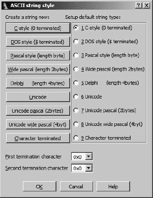

图 7-9. 字符串数据配置

用于配置字符串操作的第二个对话框是“选项 ▸ 一般”对话框，如图 7-10 所示，其中“字符串”选项卡允许配置额外的字符串相关选项。虽然您也可以使用可用的下拉框在此处指定默认字符串类型，但大多数可用选项都涉及字符串数据的命名和显示，而不管它们的类型如何。当选择“生成名称”选项时，对话框右侧的“名称生成”区域才会可见。当关闭名称生成时，字符串变量将以以 `asc_` 前缀开始的虚拟名称命名。


图 7-10. IDA 字符串选项

当启用名称生成时，名称生成选项控制 IDA 如何为字符串变量生成名称。当未选择“生成序列名称”（默认选项）时，指定的前缀将与从字符串中取出的字符结合，生成一个不超过当前最大名称长度的名称。此类字符串的示例如下：

```
.rdata:00402069 aThisIsACharact db 'This is a Character array',0
```

名称中使用首字母大写形式，并且在形成名称时省略了在名称中不合法的字符（如空格）。选择“标记为自动生成”选项会使生成的名称以不同的颜色（默认为深蓝色）显示，与用户指定的名称（默认为蓝色）不同。保留大小写强制名称使用字符串中出现的字符，而不是将它们转换为首字母大写形式。最后，生成序列名称会使 IDA 通过附加数字后缀（从“Number”开始）来序列化名称。生成的后缀中数字的位数由“宽度”字段控制。如 图 7-10 所配置，将生成的第一个三个名称将是 `a000`、`a001` 和 `a002`。

## 指定数组

从高级语言生成的反汇编列表的一个缺点是它们提供的关于数组大小的线索非常少。在反汇编列表中，如果数组中的每个项目都在其自己的反汇编行中指定，则指定数组可能需要大量的空间。以下列表显示了跟随命名变量 `unk_402060` 的数据声明。仅列表中的第一个项目被任何指令引用的事实表明，它可能是数组中的第一个元素。数组中的其他元素通常不是直接引用，而是通过更复杂的索引计算来偏移数组起始位置进行引用。

```
.rdata:00402060 unk_402060      db    0    ; DATA XREF: sub_401350+8↑o
.rdata:00402060                            ; sub_401350+18↑o
.rdata:00402061                 db    0
.rdata:00402062                 db    0
.rdata:00402063                 db    0
.rdata:00402064                 db    0
.rdata:00402065                 db    0
.rdata:00402066                 db    0
.rdata:00402067                 db    0
.rdata:00402068                 db    0
.rdata:00402069                 db    0
.rdata:0040206A                 db    0
```

IDA 提供了将连续的数据定义组合成单个数组定义的功能。要创建一个数组，选择数组的第一个元素（我们选择了`unk_402060`），然后使用“编辑”▸“数组”来启动显示在图 7-11 中的数组创建对话框。如果在给定位置已定义了数据项，则在右键单击该项目时将可用数组选项。要创建的数组类型由作为数组第一个元素选择的项目关联的数据类型决定。在这种情况下，我们正在创建一个字节数组。


图 7-11. 数组创建对话框

### 注意

在创建数组之前，请确保通过更改数组中第一个元素的尺寸来选择适当的数组元素大小。

以下是对创建数组时有用字段的描述：

**数组元素宽度**

此值表示单个数组元素的大小（在这种情况下为 1 字节），并且由启动对话框时选择的数据值的大小决定。

**最大可能大小**

此值自动计算为在遇到另一个定义的数据项之前可以包含在数组中的最大元素数（不是字节）。指定更大的大小可能是可能的，但将需要后续的数据项未定义，以便将它们吸收到数组中。

**元素数量**

这是您指定数组确切大小的位置。数组占用的总字节数可以计算为元素数量 × 数组元素宽度。

**每行项目**

指定要在每条反汇编行上显示的元素数量。这可以用来减少显示数组所需的空间。

**元素宽度**

此值仅用于格式化目的，并控制当多个项目在同一行上显示时的列宽。

**使用“dup”构造**

此选项将使相同的数据值组合成单个项目，并带有重复指定符。

**有符号元素**

指定数据是以有符号或无符号值的形式显示。

**显示索引**

使数组索引以常规注释的形式显示。如果您需要在大型数组中定位特定的数据值，这很有用。选择此选项还将启用“索引”单选按钮，以便您可以选择每个索引值的显示格式。

**创建为数组**

不检查这一点似乎与对话框的目的相悖，并且通常会被选中。如果您只是想指定一些连续的项目而不将它们组合成数组，请取消选中。

接受图 7-11 中指定的选项，将产生以下紧凑的数组声明，它可以被读取为一个名为`byte_402060`的字节(`db`)数组，包含重复`416`次(`1A0h`)的值`0`。

```
.rdata:00402060 byte_402060     db 1A0h dup(0)     ; DATA XREF: sub_401350+8↑o
.rdata:00402060                                    ; sub_401350+18↑o
```

结果是，416 行的反汇编代码被压缩成了一行（很大程度上归功于`dup`的使用）。在下一章中，我们将讨论在栈帧内创建数组。

# 摘要

与上一章一起，本章涵盖了 IDA 用户可能需要执行的最常见操作。通过使用数据库修改，您可以将自己的知识与 IDA 在分析阶段传授的知识结合起来，生成更有用的数据库。与源代码一样，有效使用名称、分配数据类型和详细注释不仅可以帮助您记住您已分析的内容，而且将极大地帮助那些可能需要使用您的工作的其他人。在下一章中，我们将继续深入探讨 IDA 的功能，通过查看如何处理更复杂的数据结构，例如由 C 的`struct`表示的数据结构，并继续检查编译的 C++的一些低级细节。

# 第八章：数据类型和数据结构


理解二进制程序行为的关键低垂之果在于对程序调用的库函数进行分类。调用`connect`函数的 C 程序正在创建网络连接。调用`RegOpenKey`的 Windows 程序正在访问 Windows 注册表。然而，为了理解这些函数是如何以及为什么被调用，还需要进行额外的分析。

发现函数的调用方式需要学习传递给函数的参数。在`connect`调用的例子中，除了知道函数正在被调用这一简单事实之外，了解程序连接的确切网络地址非常重要。理解传递给函数的数据是逆向工程函数签名（函数所需的参数的数量、类型和顺序）的关键，因此指出了在汇编语言级别理解数据类型和数据结构操作的重要性。

在本章中，我们将探讨 IDA 如何向用户传达数据类型信息，数据结构如何在内存中存储，以及如何访问这些数据结构中的数据。将特定数据类型与变量关联的最简单方法是通过观察变量作为我们了解其用途的函数的参数的使用。在分析阶段，IDA 会尽最大努力根据变量与 IDA 具有原型的函数的使用来注释数据类型。当可能时，IDA 会尽可能使用从函数原型提升的正式参数名称，而不是为变量生成默认的占位符名称。这可以在以下对`connect`函数调用的反汇编中看到：

```
.text:004010F3                 push    10h             ; namelen
.text:004010F5                 lea     ecx, [ebp+name]
.text:004010F8                 push    ecx             ; name
.text:004010F9                 mov     edx, [ebp+s]
.text:004010FF                 push    edx             ; s
.text:00401100                 call    connect
```

在这个列表中，我们可以看到每个`push`操作都附带了被推入的参数名称（来自 IDA 对函数原型的了解）。此外，为对应参数的两个局部栈变量![httpatomoreillycomsourcenostarchimages854061.png]命名。在大多数情况下，这些名称将比 IDA 可能生成的占位符名称提供更多信息。

IDA 从函数原型传播类型信息的能力不仅限于 IDA 类型库中包含的库函数。只要您已明确设置函数的类型信息，IDA 就可以从数据库中的任何函数传播正式参数名称和数据类型。在初始分析时，IDA 将占位符名称和通用类型`int`分配给所有函数参数，除非通过类型传播它有理由这样做。在任何情况下，您必须通过使用“编辑”▸“函数”▸“设置函数类型”命令、右键单击函数名称并在上下文菜单中选择“设置函数类型”或使用 Y 快捷键来设置函数的类型。对于下面的函数，这会导致显示图 8-1 中的对话框，您可以在其中输入函数的正确原型。

```
.text:00401050 ; ======== S U B R O U T I N E =========================
.text:00401050
.text:00401050 ; Attributes: bp-based frame
.text:00401050
.text:00401050 foo     proc near      ; CODE XREF: demo_stackframe+2A↓p
.text:00401050
.text:00401050 arg_0   = dword ptr  8
.text:00401050 arg_4   = dword ptr  0Ch
.text:00401050
.text:00401050         push    ebp
.text:00401051         mov     ebp, esp
```

如下所示，IDA 假设返回类型为`int`，根据使用的`ret`指令类型正确地推断出使用了`cdecl`调用约定，结合我们修改后的函数名称，并假设所有参数类型为`int`。因为我们尚未修改参数名称，所以 IDA 只显示它们的类型。


图 8-1. 设置函数的类型

如果我们将原型修改为`int __cdecl foo(float f, char *ptr)`，IDA 将自动为函数插入原型注释![httpatomoreillycomsourcenostarchimages854061.png]，并更改反汇编中的参数名称![httpatomoreillycomsourcenostarchimages854063.png]，如下所示。

```
.text:00401050 ; ======== S U B R O U T I N E =========================
.text:00401050
.text:00401050 ; Attributes: bp-based frame
.text:00401050
.text:00401050 ; int __cdecl foo(float f, char *ptr)
.text:00401050 foo     proc near      ; CODE XREF: demo_stackframe+2A↓p
.text:00401050
.text:00401050 f       = dword ptr  8
.text:00401050 ptr     = dword ptr  0Ch
.text:00401050
.text:00401050         push    ebp
.text:00401051         mov     ebp, esp
```

最后，IDA 将此信息传播到所有新修改函数的调用者，从而改进了所有相关函数调用的注释，如下所示。注意，参数名称 `f` 和 `ptr` 已经作为注释传播出去！在调用函数中，并用于重命名之前使用虚拟名称的变量！

```
.text:004010AD         mov     eax, [ebp+ptr]
.text:004010B0         mov     [esp+4], eax    ; ptr
.text:004010B4         mov     eax, [ebp+f]
.text:004010B7         mov     [esp], eax      ; f
.text:004010BA         call    foo
```

返回到导入的库函数，通常 IDA 已经知道函数的原型。在这种情况下，你可以通过将鼠标悬停在函数名称上轻松地查看原型。^([44]) 当 IDA 不知道函数的参数序列时，它至少应该知道函数是从哪个库导入的（参见导入窗口）。当这种情况发生时，你学习函数行为的最佳资源是任何相关的手册页或其他可用的 API 文档（如 MSDN 在线^([45])）。当所有其他方法都失败时，请记住这句谚语：*谷歌是你的朋友*。

在本章剩余部分，我们将讨论如何在程序中识别数据结构的使用，如何解码这些结构的组织布局，以及如何使用 IDA 在数据结构使用时提高反汇编的可读性。由于 C++类是 C 结构的复杂扩展，本章以对反汇编 C++程序进行逆向工程讨论结束。

# 识别数据结构的使用

虽然原始数据类型通常与 CPU 寄存器或指令操作数的大小自然匹配，但如数组和解构等复合数据类型通常需要更复杂的指令序列来访问它们包含的各个数据项。在我们可以讨论 IDA 提高使用复杂数据类型代码可读性的功能之前，我们需要回顾一下这种代码的外观。

## 数组成员访问

在内存布局方面，数组是最简单的复合数据结构。传统上，数组是包含相同数据类型连续元素的连续内存块。数组的大小很容易计算，因为它是由数组中元素的数量和每个元素的大小相乘得到的。使用 C 表示法，以下数组的最低字节消耗量

```
int array_demo[100];
```

计算如下

```
int bytes = 100 * sizeof(int);
```

通过提供一个索引值来访问单个数组元素，这个索引值可以是变量或常量，如下所示，这些数组引用：

```
 array_demo[20] = 15;  //fixed index into the array
  for (int i = 0; i < 100; i++) {
     array_demo[i] = i;  //varying index into the array
  }
```

假设为了举例，`sizeof(int)` 是 4 字节，那么在  的第一次数组访问中，访问了数组中位于 80 字节处的整数值，而第二次数组访问在  中访问了数组中偏移量为 0、4、8、... 96 字节的连续整数。第一次数组访问的偏移量可以在编译时计算为 `20 * 4`。在大多数情况下，第二次数组访问的偏移量必须在运行时计算，因为循环计数器 `i` 的值在编译时是不固定的。因此，对于循环的每次迭代，都必须计算乘积 `i * 4` 以确定数组中的确切偏移量。最终，访问数组元素的方式不仅取决于所使用的索引类型，还取决于数组在程序内存空间中的分配位置。

### 全局分配的数组

当数组在程序的全球数据区（例如 `.data` 或 `.bss` 部分）内分配时，编译器在编译时已知数组的基址。固定的基址使得编译器能够计算使用固定索引访问的任何数组元素的固定地址。考虑以下使用固定和可变偏移量访问全局数组的简单程序：

```
int global_array[3];

int main() {
   int idx = 2;
   global_array[0] = 10;
   global_array[1] = 20;
   global_array[2] = 30;
   global_array[idx] = 40;
}
```

该程序反汇编为以下内容：

```
.text:00401000 _main           proc near
.text:00401000
.text:00401000 idx             = dword ptr −4
.text:00401000
.text:00401000                 push    ebp
.text:00401001                 mov     ebp, esp
.text:00401003                 push    ecx
.text:00401004                 mov     [ebp+idx], 2
.text:0040100B                mov     dword_40B720, 10
.text:00401015                mov     dword_40B724, 20
.text:0040101F                mov     dword_40B728, 30
.text:00401029                 mov     eax, [ebp+idx]
.text:0040102C                mov     dword_40B720[eax*4], 40
.text:00401037                 xor     eax, eax
.text:00401039                 mov     esp, ebp
.text:0040103B                 pop     ebp
.text:0040103C                 retn
.text:0040103C _main           endp
```

虽然这个程序只有一个全局变量，但 、 和  中的反汇编行似乎表明存在三个全局变量。在  处计算偏移量（`eax * 4`）似乎是唯一暗示存在名为 `dword_40B720` 的全局数组的线索，而这个名称与在  处找到的全局变量相同。

根据 IDA 分配的虚拟名称，我们知道全局数组由从地址 `0040B720` 开始的 12 个字节组成。在编译过程中，编译器使用了固定的索引（0、1、2）来计算数组中相应元素的实际地址（`0040B720`、`0040B724` 和 `0040B728`），这些地址通过全局变量在 、 和  中引用。使用上一章中讨论的 IDA 的数组格式化操作（编辑 ▸ 数组），可以将 `dword_40B720` 格式化为一个包含三个元素的数组，如下面的列表所示。请注意，这种特定的格式化突出了数组偏移量的使用：

```
.text:0040100B                 mov     dword_40B720, 10
.text:00401015                 mov     dword_40B720+4, 20
.text:0040101F                 mov     dword_40B720+8, 30
```

在此示例中有两点需要注意。首先，当使用常量索引访问全局数组时，相应的数组元素将作为全局变量出现在相应的汇编中。换句话说，汇编将几乎不提供存在数组的证据。第二点是，使用变量索引值将我们引导到数组的起始位置，因为当计算偏移量加到它上面以计算要访问的实际数组位置时，基址将被揭示（如所示）。在的计算提供有关数组的一个额外重要信息。通过观察数组索引乘以的量（本例中为 4），我们了解到数组中单个元素的大小（尽管不是类型）。

### 堆栈分配的数组

如果数组作为堆栈变量分配，数组访问会有何不同？直观上，我们可能会认为它必须不同，因为编译器在编译时无法知道绝对地址，因此肯定即使是使用常量索引的访问也必须在运行时进行一些计算。然而，在实践中，编译器几乎将堆栈分配的数组与全局分配的数组同等对待。

考虑以下使用小型堆栈分配数组的程序：

```
int main() {
   int stack_array[3];
   int idx = 2;
   stack_array[0] = 10;
   stack_array[1] = 20;
   stack_array[2] = 30;
   stack_array[idx] = 40;
}
```

在编译时，`stack_array`的分配地址是未知的，因此编译器无法像全局数组示例中那样在编译时预先计算`stack_array[1]`的地址。通过检查此函数的汇编列表，我们可以了解堆栈分配的数组是如何被访问的：

```
.text:00401000 _main           proc near
.text:00401000
.text:00401000 var_10          = dword ptr −10h
.text:00401000 var_C           = dword ptr −0Ch
.text:00401000 var_8           = dword ptr −8
.text:00401000 idx             = dword ptr −4
.text:00401000
.text:00401000                 push    ebp
.text:00401001                 mov     ebp, esp
.text:00401003                 sub     esp, 10h
.text:00401006                 mov     [ebp+idx], 2
.text:0040100D                mov     [ebp+var_10], 10
.text:00401014                mov     [ebp+var_C], 20
.text:0040101B                mov     [ebp+var_8], 30
.text:00401022                 mov     eax, [ebp+idx]
.text:00401025                mov     [ebp+eax*4+var_10], 40
.text:0040102D                 xor     eax, eax
.text:0040102F                 mov     esp, ebp
.text:00401031                 pop     ebp
.text:00401032                 retn
.text:00401032 _main           endp
```

与全局数组示例一样，此函数似乎有三个变量（`var_10`、`var_C`和`var_8`），而不是三个整数的数组。根据在、和![httpatomoreillycomsourcenostarchimages854093.png]使用的常量操作数，我们知道看似局部变量引用实际上是对`stack_array`的三个元素的引用，其中第一个元素必须位于内存地址最低的局部变量`var_10`处。

要理解编译器如何解析对数组其他元素的引用，可以考虑编译器在处理对`stack_array[1]`的引用时所经历的过程，该引用位于数组中 4 个字节的位置，或者位于`var_10`位置之后的 4 个字节。在栈帧中，编译器选择在`ebp - 0x10`处分配`stack_array`。编译器明白`stack_array[1]`位于`ebp - 0x10 + 4`，这简化为`ebp - 0x0C`。结果是 IDA 将其显示为局部变量引用。总体效果是，与全局分配的数组类似，使用常量索引值往往隐藏了栈分配数组的存在。只有数组访问处的才暗示`var_10`是数组中的第一个元素，而不是一个简单的整数变量。此外，处的反汇编行也有助于我们得出数组中单个元素大小为 4 个字节的结论。

栈分配数组和全局分配数组在编译器中处理得非常相似。然而，我们可以从栈示例的反汇编中提取一些额外信息。根据`idx`在栈中的位置，我们可以得出结论，以`var_10`开始的数组最多包含三个元素（否则会覆盖`idx`）。如果你是漏洞开发者，这可以在确定在溢出并开始损坏后续数据之前，你可以将多少数据放入数组中时非常有用。

### 堆分配数组

堆分配数组使用动态内存分配函数，如`malloc`（C）或`new`（C++）进行分配。从编译器的角度来看，处理堆分配数组的主要区别是编译器必须根据内存分配函数返回的地址值生成所有对数组的引用。为了进行比较，我们现在看一下以下函数，它在程序堆中分配了一个小数组：

```
int main() {
   int *heap_array = (int*)malloc(3 * sizeof(int));
   int idx = 2;
   heap_array[0] = 10;
   heap_array[1] = 20;
   heap_array[2] = 30;
   heap_array[idx] = 40;
}
```

在研究后续的反汇编代码时，你应该注意到与前面两个反汇编代码的一些相似之处和不同之处：

```
.text:00401000 _main      proc near
.text:00401000
.text:00401000 heap_array      = dword ptr −8
.text:00401000 idx             = dword ptr −4
.text:00401000
.text:00401000            push    ebp
.text:00401001            mov     ebp, esp
.text:00401003            sub     esp, 8
.text:00401006           push    0Ch             ; size_t
.text:00401008            call    _malloc
.text:0040100D            add     esp, 4
.text:00401010            mov     [ebp+heap_array], eax
.text:00401013            mov     [ebp+idx], 2
.text:0040101A            mov     eax, [ebp+heap_array]
.text:0040101D           mov     dword ptr [eax], 10
.text:00401023            mov     ecx, [ebp+heap_array]
.text:00401026           mov     dword ptr [ecx+4], 20
.text:0040102D            mov     edx, [ebp+heap_array]
.text:00401030           mov     dword ptr [edx+8], 30
.text:00401037            mov     eax, [ebp+idx]
.text:0040103A            mov     ecx, [ebp+heap_array]
.text:0040103D           mov     dword ptr [ecx+eax*4], 40
.text:00401044            xor     eax, eax
.text:00401046            mov     esp, ebp
.text:00401048            pop     ebp
.text:00401049            retn
.text:00401049 _main      endp
```

数组的起始地址（由`malloc`返回并存储在 EAX 寄存器中）被存储在局部变量`heap_array`中。在本例中，与先前的例子不同，每次访问数组时，都需要先读取`heap_array`的内容以获取数组的基址，然后才能将偏移量值添加到计算数组中正确元素的地址。`heap_array[0]`、`heap_array[1]`和`heap_array[2]`的引用分别需要 0、4 和 8 字节的偏移量，如、和所示。与先前的例子最相似的操作是中`heap_array[idx]`的引用，其中数组中的偏移量继续通过将数组索引乘以数组元素的大小来计算。

堆分配的数组有一个特别好的特性。当数组的总大小和每个元素的大小都可以确定时，计算分配给数组的元素数量就变得很容易。对于堆分配的数组，传递给内存分配函数的参数（在本例中是传递给`malloc`的`0x0C`）代表分配给数组的总字节数。将这个值除以元素的大小（在本例中为 4 字节，如从、和中的偏移量观察到的）将告诉我们数组中的元素数量。在先前的例子中，分配了一个包含三个元素的数组。

关于数组的使用的唯一确定结论是，当变量用作数组的索引时，数组最容易识别。数组访问操作需要将索引乘以数组元素的大小，然后将结果偏移量加到数组的基址上。不幸的是，正如我们将在下一节中展示的，当使用常量索引值来访问数组元素时，它们几乎不能表明数组的存在，并且看起来与用于访问结构成员的代码非常相似。

## 结构成员访问

在这里泛指为*结构*的 C 风格结构是异构数据集合，它允许将不同数据类型的项组合成一个单一复合数据类型。结构的一个主要特点是结构内的数据字段是通过名称而不是通过索引来访问的，就像数组一样。不幸的是，字段名称被编译器转换为数值偏移量，所以在查看反汇编代码时，结构字段访问看起来与使用常量索引访问数组元素非常相似。

当编译器遇到结构定义时，编译器会维护一个字段消耗的字节数的累计总和，以确定每个字段在结构中的偏移量。以下结构定义将用于接下来的示例：

```
struct ch8_struct {   //Size     Minimum offset     Default offset
   int field1;        //  4             0                  0
   short field2;      //  2             4                  4
   char field3;       //  1             6                  6
   int field4;        //  4             7                  8
   double field5;     //  8             11                 16
};                //Minimum total size: 19   Default size: 24
```

分配结构所需的最小空间由结构内部每个字段分配所需空间的总和决定。然而，你绝不应该假设编译器会使用分配结构所需的最小空间。默认情况下，编译器会尝试将结构字段对齐到允许最有效读写这些字段的内存地址。例如，4 字节整数字段将对齐到 4 的倍数偏移量，而 8 字节双精度浮点数将对齐到 8 的倍数偏移量。根据结构的组成，满足对齐要求可能需要插入填充字节，导致结构的实际大小大于其组成部分字段的总和。之前显示的示例结构的默认偏移量和结果结构大小可以在“默认偏移”列中查看。

可以通过使用编译器选项请求特定成员对齐来将结构压缩到所需的最小空间。Microsoft Visual C/C++ 和 GNU gcc/g++ 都将 `pack` 预处理指令识别为控制结构字段对齐的一种方式。GNU 编译器还识别 `packed` 属性作为控制结构对齐的一种方式。请求结构字段为 1 字节对齐会导致编译器将结构压缩到所需的最小空间。对于我们的示例结构，这会产生“最小偏移”列中找到的偏移量和结构大小。请注意，某些 CPU 在数据根据其类型对齐时性能更好，而其他 CPU 如果数据没有对齐到特定边界可能会生成异常。

考虑到这些事实，我们可以开始探讨编译代码中结构是如何处理的。为了进行比较，值得注意的是，与数组一样，结构成员的访问是通过将结构的基本地址加上所需成员的偏移量来完成的。然而，虽然数组偏移量可以在运行时从提供的索引值计算得出（因为数组中的每个项目都有相同的大小），结构偏移量必须预先计算，并且将在编译代码中以固定偏移量的形式出现在结构中，看起来几乎与使用常量索引的数组引用相同。

### 全局分配的结构

与全局分配的数组一样，全局分配的结构地址在编译时是已知的。这允许编译器在编译时计算结构每个成员的地址，从而消除了在运行时进行任何数学运算的需要。考虑以下访问全局分配结构的程序：

```
struct ch8_struct global_struct;

int main() {
   global_struct.field1 = 10;
   global_struct.field2 = 20;
   global_struct.field3 = 30;
   global_struct.field4 = 40;
   global_struct.field5 = 50.0;
}
```

如果这个程序使用默认的结构对齐选项进行编译，当我们反汇编它时，我们可以期待看到以下内容：

```
.text:00401000 _main           proc near
.text:00401000                 push    ebp
.text:00401001                 mov     ebp, esp
.text:00401003                 mov     dword_40EA60, 10
.text:0040100D                 mov     word_40EA64, 20
.text:00401016                 mov     byte_40EA66, 30
.text:0040101D                 mov     dword_40EA68, 40
.text:00401027                 fld     ds:dbl_40B128
.text:0040102D                 fstp    dbl_40EA70
.text:00401033                 xor     eax, eax
.text:00401035                 pop     ebp
.text:00401036                 retn
.text:00401036 _main           endp
```

此反汇编中没有进行任何数学运算来访问结构的成员，在没有源代码的情况下，不可能确定是否使用了结构。由于编译器在编译时已经完成了所有偏移量的计算，这个程序看起来引用了五个全局变量，而不是单个结构中的五个字段。你应该能够注意到与之前关于使用常量索引值的全局分配数组的例子之间的相似之处。

### 栈分配的结构

与栈分配的数组（见栈分配的数组。结构体在指定的偏移量包含以下字段：

+   一个位于偏移量 0 的 4 字节(`dword`)字段 

+   一个位于偏移量 4 的 2 字节(`word`)字段 

+   一个位于偏移量 6 的 1 字节字段 

+   一个位于偏移量 8 的 4 字节(`dword`)字段 

+   一个位于偏移量 16（10h）的 8 字节(`qword`)字段 

根据浮点指令的使用，我们可以进一步推断出`qword`字段实际上是一个`double`。将相同的程序编译成使用 1 字节对齐的结构体，得到的反汇编如下：

```
.text:00401000 _main           proc near
.text:00401000
.text:00401000 heap_struct     = dword ptr −4
.text:00401000
.text:00401000                 push    ebp
.text:00401001                 mov     ebp, esp
.text:00401003                 push    ecx
.text:00401004                 push    19              ; size_t
.text:00401006                 call    _malloc
.text:0040100B                 add     esp, 4
.text:0040100E                 mov     [ebp+heap_struct], eax
.text:00401011                 mov     eax, [ebp+heap_struct]
.text:00401014                 mov     dword ptr [eax], 10
.text:0040101A                 mov     ecx, [ebp+heap_struct]
.text:0040101D                 mov     word ptr [ecx+4], 20
.text:00401023                 mov     edx, [ebp+heap_struct]
.text:00401026                 mov     byte ptr [edx+6], 30
.text:0040102A                 mov     eax, [ebp+heap_struct]
.text:0040102D                 mov     dword ptr [eax+7], 40
.text:00401034                 mov     ecx, [ebp+heap_struct]
.text:00401037                 fld     ds:dbl_40B128
.text:0040103D                 fstp    qword ptr [ecx+0Bh]
.text:00401040                 xor     eax, eax
.text:00401042                 mov     esp, ebp
.text:00401044                 pop     ebp
.text:00401045                 retn
.text:00401045 _main           endp
```

程序的唯一变化是结构体的大小变小（现在为 19 字节）以及调整了偏移量以适应每个结构体字段的重新对齐。

无论在编译程序时使用何种对齐方式，找到程序堆中分配和操作的结构体是确定给定数据结构大小和布局的最快方法。然而，请注意，许多函数不会立即访问结构体的每个成员来帮助你理解结构的布局。相反，你可能需要跟踪结构体指针的使用，并在指针解引用时记录使用的偏移量。这样，你最终能够拼凑出结构的完整布局。

### 结构体数组

一些程序员会说，复合数据结构的美丽之处在于它们允许你在较大的结构体内部嵌套较小的结构体，从而构建任意复杂的结构。在其他可能性中，这种能力允许有结构体数组、结构体嵌套以及作为成员的结构体包含数组。关于数组和结构体的先前的讨论，在处理这些嵌套类型时同样适用。例如，考虑以下简单程序中的结构体数组，其中`heap_struct`指向五个`ch8_struct`项的数组：

```
int main() {
     int idx = 1;
     struct ch8_struct *heap_struct;
     heap_struct = (struct ch8_struct*)malloc(sizeof(struct ch8_struct) * 5);
    heap_struct[idx].field1 = 10;
  }
```

访问位于  的`field1`所需的操作包括将索引值乘以数组元素的大小，在这种情况下是结构体的大小，然后加上所需字段的偏移量。相应的反汇编在此处显示：

```
.text:00401000 _main           proc near
.text:00401000
.text:00401000 idx             = dword ptr −8
.text:00401000 heap_struct     = dword ptr −4
.text:00401000
.text:00401000                 push    ebp
.text:00401001                 mov     ebp, esp
.text:00401003                 sub     esp, 8
.text:00401006                 mov     [ebp+idx], 1
.text:0040100D                push    120              ; size_t
.text:0040100F                 call    _malloc
.text:00401014                 add     esp, 4
.text:00401017                 mov     [ebp+heap_struct], eax
.text:0040101A                 mov     eax, [ebp+idx]
.text:0040101D                imul    eax, 24
.text:00401020                 mov     ecx, [ebp+heap_struct]
.text:00401023                mov     dword ptr [ecx+eax], 10
.text:0040102A                 xor     eax, eax
.text:0040102C                 mov     esp, ebp
.text:0040102E                 pop     ebp
.text:0040102F                 retn
.text:0040102F _main           endp
```

反汇编显示从堆中请求了 120 字节 ()。在  处，数组索引乘以 24，然后加到  处数组的起始地址上。为了生成  处引用的最终地址，不需要额外的偏移。从这些事实中，我们可以推断出数组项的大小（24），数组中的项目数（`120 / 24 = 5`），以及每个数组元素中偏移量为 0 的 4 字节（`dword`）字段的事实。这个简短的列表没有提供足够的信息来得出关于每个结构中剩余 20 字节如何分配给额外字段任何结论。

* * *

^([44]) 将鼠标悬停在 IDA 显示中的任何名称上，会显示一个工具提示风格的弹出窗口，显示目标位置最多 10 行的反汇编代码。在库函数名称的情况下，这通常包括调用库函数的原型。

^([45]) 请参阅 [`msdn.microsoft.com/library/`](http://msdn.microsoft.com/library/)。

# 创建 IDA 结构

在上一章中，我们看到了 IDA 的数组聚合功能如何通过将长数据声明列表折叠成单行反汇编来简化反汇编列表。在接下来的几节中，我们将探讨 IDA 提高操作结构代码可读性的功能。我们的目标是远离如 `[edx + 10h]` 这样的结构引用，转向更易读的如 `[edx + ch8_struct.field5]`。

每当你发现程序正在操作一个数据结构时，你需要决定是否要将结构字段名称纳入你的反汇编中，或者你是否能够理解列表中散布的所有数字偏移。在某些情况下，IDA 可能会识别出作为 C 标准库或 Windows API 部分定义的结构的使用。在这种情况下，IDA 可能了解结构的精确布局，并能将数字偏移转换为更符号化的字段名称。这是理想的情况，因为它让你有更少的工作要做。一旦我们更了解 IDA 如何处理结构定义，我们就会回到这个场景。

## 创建一个新的结构（或联合）

当程序似乎使用 IDA 没有布局知识的结构时，IDA 提供了指定结构组成并将新定义的结构纳入反汇编的功能。IDA 中的结构创建发生在结构窗口内（见图图 8-2）。任何结构都不能被纳入反汇编，直到它首先在结构窗口中列出。任何 IDA 已知且被程序识别为使用的结构将自动在结构窗口中列出。


图 8-2. 结构窗口

在分析阶段，结构的使用可能未被识别的原因有两个。首先，尽管 IDA 可能了解特定结构的布局，但可能信息不足，无法使 IDA 得出程序使用该结构的结论。其次，该结构可能是一个 IDA 一无所知的非标准结构。在这两种情况下，问题都可以克服，并且在这两种情况下，解决方案都始于结构窗口。

结构窗口中的前四行文本作为对窗口内可能进行的操作的持续提醒。我们主要关心的操作包括添加、删除和编辑结构。使用插入键启动添加结构，这将打开如图图 8-3 所示的创建结构/联合对话框。

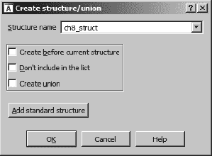

图 8-3. 创建结构/联合对话框

为了创建一个新的结构，您必须首先在结构名称字段中指定名称。前两个复选框确定新结构将在结构窗口中显示的位置或是否显示。第三个复选框“创建联合”指定您是定义结构还是 C 样式联合^([46])。对于结构，大小是每个组件字段大小的总和，而对于联合，大小是最大组件字段的大小。添加标准结构按钮用于访问 IDA 当前所知的所有结构数据类型列表。此按钮的行为在使用标准结构中进行了讨论。使用标准结构。一旦指定了结构名称并点击“确定”，结构窗口中就会创建一个空的结构定义，如图图 8-4 所示。


图 8-4. 空结构定义

必须编辑此结构定义以完成结构布局的定义。

## 编辑结构成员

为了向你的新结构中添加字段，你必须使用字段创建命令 D、A 以及数字键盘上的星号键 (*)。最初，只有 D 命令是有用的，而且不幸的是，它的行为高度依赖于光标的位置。因此，建议按照以下步骤向结构中添加字段。

1.  要向结构中添加新字段，请将光标定位在结构定义的最后一行（包含 `ends` 的那一行）上，然后按 **D** 键。这将导致在结构末尾添加一个新字段。新字段的大小将根据数据轮盘上首先选择的大小设置（第七章）。字段的名称最初将是 `field_`*`N`*，其中 *`N`* 是从结构开始到新字段开始（例如 `field_0`）的数字偏移量。

1.  如果你需要修改字段的大小，你可以通过首先确保光标位于新字段名称上，然后通过重复按 D 键来循环通过数据轮盘上的数据类型，以选择字段的正确数据大小。或者，你可以使用选项 ▸ 设置数据类型来指定数据轮盘上不可用的数据大小。如果字段是一个数组，右键单击名称并选择**数组**以打开数组指定对话框 (第七章).

1.  要更改结构字段的名称，请单击字段名称并使用 N 快捷键，或右键单击名称并选择**重命名**；然后为字段提供新名称。

以下有用的提示可能在你定义自己的结构时有所帮助。

+   字段的字节偏移量在结构窗口的左侧以八位十六进制值显示。

+   每次你添加或删除结构字段或更改现有字段的大小，结构的新 `sizeof` 将会在结构定义的第一行中反映出来。

+   你可以向结构字段添加注释，就像你可以向任何反汇编行添加注释一样。右键单击（或使用快捷键）你想要添加注释的字段，然后选择可用的注释选项之一。

+   与结构窗口顶部的说明相反，只有当 U 键是结构中的最后一个字段时，它才会删除结构字段。对于所有其他字段，按下 U 键仅取消定义字段，这会移除名称但*不会*移除分配给字段的字节。

+   你负责在结构定义中正确对齐所有字段。IDA 不会区分打包或未打包的结构体。如果你需要填充字节来正确对齐字段，那么你有责任添加它们。填充字节最好添加为适当大小的虚拟字段，一旦添加了额外的字段，你可以选择取消定义或不取消定义。

+   在结构体中间分配的字节只能通过首先取消定义相关的字段，然后选择编辑 ▸ 缩小结构类型来删除未定义的字节。

+   可以通过选择将跟随新字节的字段，然后使用编辑 ▸ 扩展结构类型来在所选字段之前插入指定数量的字节，将字节插入到结构体的中间。

+   如果你知道结构体的大小但不知道布局，你需要创建两个字段。第一个字段应该是一个`size-1`字节的数组。第二个字段应该是一个 1 字节的字段。创建第二个字段后，取消定义第一个（数组）字段。结构体的大小将被保留，你可以在以后更容易地回来定义字段及其大小，当你对结构体的布局了解更多时。

通过重复应用这些步骤（添加字段、设置字段大小、添加填充等），你可以创建`ch8_struct`（未打包版本）的 IDA 表示，如图 8-5 所示。

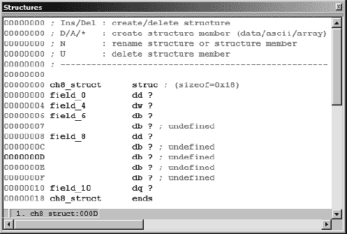

图 8-5. 手动生成的`ch8_struct`定义

在这个例子中，已经包含了填充字节以实现正确的字段对齐，并且字段已经被重命名为与前面例子中使用的一致。请注意，每个字段和结构体的整体大小（24 字节）与前面例子中看到的值相匹配。

如果你觉得结构定义在你的结构体窗口中占用的空间太多，你可以通过选择结构体中的任何字段并按数字键盘上的减号键（–）来折叠定义成一个单行摘要。一旦结构体完全定义并且需要很少的进一步编辑，这很有用。`ch8_struct`的折叠版本如图 8-6 所示。

IDA 已经知道的大多数结构体将以单行方式显示，因为预计它们不需要被编辑。折叠显示提供了一个提示，你可以使用数字键盘上的加号键（+）来展开定义。或者，双击结构体的名称也会展开定义。


图 8-6. 一个折叠的结构定义

## 栈帧作为特殊结构

你可能会注意到结构定义看起来与与函数相关联的详细栈帧视图有些相似。这不是偶然的，因为 IDA 在内部将两者同等对待。两者都代表可以细分为命名组件字段的连续字节块，每个字段都与结构中的数字偏移量相关联。微小的区别在于，栈帧使用基于帧指针或返回地址的正负字段偏移量，而结构使用从结构开始的正偏移量。

* * *

^([46]) 一个*联合体*与结构类似，因为它可能由许多命名字段组成，每个字段类型不同。两者之间的区别在于，联合体内的字段直接重叠，因此联合体的大小等于最大字段的大小。

# 使用结构模板

在你的反汇编中，有几种方式可以利用结构定义。首先，你可以通过将数字结构偏移量，如`[ebx+8]`，转换为符号引用，如`[ebx+ch8_struct.field4]`，来重新格式化内存引用，使其更易读。后者提供了更多关于所引用内容的信息。由于 IDA 使用层次化表示法，可以清楚地知道正在访问的结构类型以及该结构中的哪个字段。这种应用结构模板的技术通常在结构通过指针引用时使用。第二种使用结构模板的方式是提供可以应用于栈和全局变量的额外数据类型。

为了理解结构定义如何应用于指令操作数，将每个定义视为类似枚举常量的集合是很有帮助的。例如，图 8-5 中的`ch8_struct`定义可以用伪 C 语言表示如下：

```
enum {
   ch8_struct.field1 = 0,
   ch8_struct.field2 = 4,
   ch8_struct.field3 = 6,
   ch8_struct.field4 = 8,
   ch8_struct.field5 = 16
};
```

给定这样的定义，IDA 允许你将操作数中使用的任何常量值重新格式化为等效的符号表示。图 8-7 展示了正在进行此类操作的示例。内存引用`[ecx+10h]`可能表示对`ch8_struct`中的`field5`的访问。

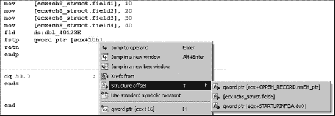

图 8-7. 应用结构偏移

在此情况下，通过右键单击 10h 可用的结构偏移选项提供了三种格式化指令操作数的替代方案。这些替代方案来自包含偏移量为 16 的字段的结构的集合。

作为单独格式化内存引用的替代方案，栈和全局变量可以格式化为整个结构体。要将栈变量格式化为结构体，通过双击要格式化为结构体的变量打开详细栈帧视图，然后使用**编辑** ▸ **结构变量**（alt-Q）显示与图 8-8 中所示类似的已知结构列表。


图 8-8. 结构选择对话框

选择一个可用的结构体会将栈中相应数量的字节组合成相应的结构类型，并将所有相关内存引用重新格式化为结构引用。以下代码是我们之前检查的栈分配结构示例的摘录：

```
.text:00401006                 mov     [ebp+var_18], 10
.text:0040100D                 mov     [ebp+var_14], 20
.text:00401013                 mov     [ebp+var_12], 30
.text:00401017                 mov     [ebp+var_10], 40
.text:0040101E                 fld     ds:dbl_40B128
.text:00401024                 fstp    [ebp+var_8]
```

回想一下，我们得出结论，`var_18`实际上是 24 字节结构中的第一个字段。这个特定解释的详细栈帧如图图 8-9 所示。

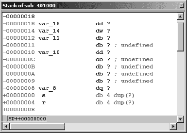

图 8-9. 格式化前的栈分配结构

选择`var_18`并将其格式化为`ch8_struct`（编辑 ▸ 结构变量），将`var_18`开始的 24 字节（`ch8_struct`的大小）合并成一个变量，从而得到图 8-10 中所示的重新格式化后的栈显示。在这种情况下，将结构模板应用到`var_18`将生成一个警告消息，表明在将`var_18`转换为结构体的过程中将销毁一些变量。根据我们之前的分析，这是可以预料的，所以我们只需确认警告以完成操作。

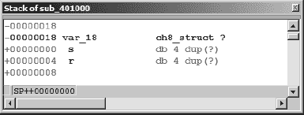

图 8-10. 格式化后的栈分配结构

重新格式化后，IDA 能够理解任何对分配给`var_18`的 24 字节块的内存引用都必须指向结构体内部的字段。当 IDA 遇到这样的引用时，它会尽力将内存引用解析为结构变量内定义的字段之一。在这种情况下，反汇编会自动重新格式化以包含结构布局，如下所示：

```
.text:00401006                 mov     [ebp+var_18.field1], 10
.text:0040100D                 mov     [ebp+var_18.field2], 20
.text:00401013                 mov     [ebp+var_18.field3], 30
.text:00401017                 mov     [ebp+var_18.field4], 40
.text:0040101E                 fld     ds:dbl_40B128
.text:00401024                 fstp    [ebp+var_18.field5]
```

在反汇编中使用结构符号的优势是提高了反汇编的可读性。在重新格式化后的显示中使用字段名提供了对原始源代码中实际数据操作方式的更准确反映。

格式化全局变量为结构体的过程几乎与用于堆变量的过程相同。为此，选择变量或标记结构体开始的地址，并使用**编辑** ▸ **结构变量**（alt-Q）来选择适当的结构类型。仅对于未定义的全局数据（不是堆数据）而言，你可以使用 IDA 的上下文相关菜单，并选择结构选项来查看和选择要应用于选定地址的可用结构模板。

# 导入新结构

在使用了一段时间 IDA 的结构创建和编辑功能后，你可能可能会渴望一种更简单的方法来做事情。幸运的是，IDA 确实提供了一些关于新结构的快捷方式。IDA 能够解析单个 C（不是 C++）数据声明，以及整个 C 头文件，并自动为在那些声明或头文件中定义的任何结构体构建 IDA 结构表示。如果你恰好有你要反汇编的二进制文件的源代码，或者至少有头文件，那么通过让 IDA 直接从源代码中提取相关结构，你可以节省很多时间。

## 解析 C 结构声明

通过使用视图 ▸ 打开子视图 ▸ 本地类型命令，可以打开一个本地类型子视图窗口。本地类型窗口显示已解析到当前数据库中的所有类型的列表。对于新数据库，本地类型窗口最初为空，但窗口提供了通过`插入`键或从上下文菜单中选择插入选项来解析新类型的 capability。结果类型条目对话框如图 8-11 所示。

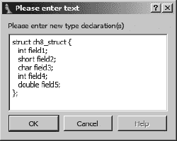

图 8-11. 本地类型条目对话框

解析新类型时遇到的错误将在 IDA 输出窗口中显示。如果类型声明成功解析，类型及其相关声明将列在本地类型窗口中，如图 8-12 所示。

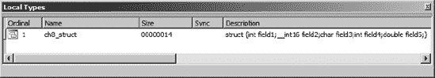

图 8-12. 本地类型窗口

注意，IDA 解析器使用默认的结构成员对齐为 4 字节。如果你的结构需要不同的对齐方式，你可以包含它，并且 IDA 将识别`pragma pack`指令来指定所需的成员对齐。

添加到本地类型窗口的数据类型不会立即通过结构窗口可用。有两种方法可以将本地类型声明添加到结构窗口。最简单的方法是在所需的本地类型上右键单击并选择**同步到 idb**。或者，当每个新类型被添加到标准结构列表中时，新类型可以按照使用标准结构中所述的方式导入到结构窗口。

## 解析 C 头文件

要解析头文件，使用**文件**▸**加载文件**▸**解析 C 头文件**来选择你想要解析的头文件。如果一切顺利，IDA 会返回消息：“编译成功”。如果解析器遇到任何问题，你会收到错误通知。任何相关的错误消息都会在 IDA 输出窗口中显示。

IDA 会将所有成功解析的结构添加到当前数据库中本地类型列表和标准结构列表的末尾。当新结构具有与现有结构相同的名称时，现有结构定义将被新结构布局覆盖。除非你选择显式添加，否则新结构不会出现在结构窗口中，正如上述关于本地类型的描述，或在使用标准结构中所述。

在解析 C 头文件时，以下要点值得注意：

+   内置解析器不一定使用与你的编译器相同的默认结构成员对齐方式，尽管它确实遵守`pack`指令。默认情况下，解析器创建 4 字节对齐的结构。

+   解析器理解 C 预处理器`include`指令。为了解析`include`指令，解析器会搜索包含正在解析的文件的目录以及选项▸编译器配置对话框中列出的任何`Include`目录。

+   解析器只理解 C 标准数据类型。然而，解析器也理解预处理器`define`指令以及 C 的`typedef`语句。因此，如果解析器在使用之前遇到了适当的`typedef`，则`uint32_t`之类的类型将被正确解析。

+   当你没有源代码时，你可能发现使用文本编辑器快速定义结构布局并解析生成的头文件或将其声明粘贴为新本地类型，比使用 IDA 繁琐的手动结构定义工具更容易。

+   新结构仅在当前数据库中可用。你必须为每个你希望使用结构的附加数据库重复结构创建步骤。我们将在本章后面讨论 TIL 文件时讨论简化此过程的某些步骤。

通常，为了最大限度地提高成功解析头文件的机会，您将希望尽可能通过使用标准 C 数据类型和最小化使用`include`文件来简化结构定义。记住，在 IDA 中创建结构最重要的东西是确保布局正确。正确的布局在很大程度上取决于每个字段的正确大小和结构的正确对齐，而不是每个字段的精确类型。换句话说，如果您需要将所有`uint32_t`替换为`int`以正确解析文件，您应该立即这样做。

# 使用标准结构

如前所述，IDA 识别与各种库和 API 函数相关的大量数据结构。当数据库最初创建时，IDA 会尝试确定与二进制文件相关的编译器和平台，并加载从相关库头文件中派生的结构模板。当 IDA 在反汇编过程中遇到实际的结构操作时，它会将适当的结构定义添加到结构窗口中。因此，结构窗口表示适用于当前二进制文件的已知结构的子集。除了创建自己的自定义结构外，您还可以通过从 IDA 已知结构类型列表中选取，将额外的标准结构添加到结构窗口中。

添加新结构的流程是从结构窗口内部按下插入键开始。图 8-3 展示了创建结构/联合对话框，其中之一是添加标准结构按钮。点击此按钮可以访问与当前编译器（在分析阶段检测到）和文件格式相关的结构主列表。这个结构主列表还包含任何由于解析 C 头文件而添加到数据库中的结构。图 8-13 中显示的结构选择对话框用于选择要添加到结构窗口中的结构。


图 8-13. 标准结构选择

您可以使用搜索功能根据部分文本匹配来定位结构。对话框还允许前缀匹配。如果您知道结构名称的前几个字符，只需输入它们（它们将出现在对话框底部的状态栏中），列表显示将跳转到第一个具有匹配前缀的结构。选择一个结构会将该结构和任何嵌套结构添加到结构窗口中。

作为使用标准结构的一个例子，考虑这样一个情况：你希望检查与 Windows PE 二进制文件关联的文件头。默认情况下，当数据库首次创建时，文件头不会被加载到数据库中；然而，如果你在初始数据库创建期间选择手动加载选项，文件头可以被加载。加载文件头确保只有与这些头关联的数据字节将存在于数据库中。在大多数情况下，头不会被以任何方式格式化，因为典型的程序不会直接引用它们自己的文件头。因此，分析器没有必要将结构模板应用到头中。

在对 PE 二进制文件的格式进行了研究之后，你会了解到 PE 文件以一个名为`IMAGE_DOS_HEADER`的 MS-DOS 头结构开始。此外，`IMAGE_DOS_HEADER`中包含的数据指向`IMAGE_NT_HEADERS`结构的地址，该结构详细说明了 PE 二进制文件的内存布局。选择加载 PE 头，你可能会看到以下类似的不格式化数据反汇编。熟悉 PE 文件结构的读者可能会认出文件中的前两个字节是 MS-DOS 的魔数`MZ`。

```
HEADER:00400000 __ImageBase     db  4Dh ; M
HEADER:00400001                 db  5Ah ; Z
HEADER:00400002                 db  90h ; É
HEADER:00400003                 db    0
HEADER:00400004                 db    3
HEADER:00400005                 db    0
HEADER:00400006                 db    0
HEADER:00400007                 db    0
HEADER:00400008                 db    4
HEADER:00400009                 db    0
HEADER:0040000A                 db    0
HEADER:0040000B                 db    0
HEADER:0040000C                 db 0FFh
HEADER:0040000D                 db 0FFh
HEADER:0040000E                 db    0
HEADER:0040000F                 db    0
```

由于此文件在此处进行了格式化，你需要一些 PE 文件参考文档来帮助你理解每个数据字节。通过使用结构模板，IDA 可以将这些字节格式化为`IMAGE_DOS_HEADER`，使数据变得更有用。第一步是添加标准的`IMAGE_DOS_HEADER`，如上所述（你可以在此时添加`IMAGE_NT_HEADERS`结构）。第二步是将从`__ImageBase`开始的字节转换为`IMAGE_DOS_HEADER`结构，使用**编辑** ▸ **结构变量**（alt-Q）。这会导致以下显示的重新格式化：

```
HEADER:00400000 __ImageBase IMAGE_DOS_HEADER
 <5A4Dh, 90h, 3, 0, 4, 0, 0FFFFh, 0, 0B8h, \
HEADER:00400000                               0, 0, 0, 40h, 0, 0, 0, 0, 0, 80h>
HEADER:00400040 db 0Eh
```

如你所见，文件中的前 64（0x40）字节已被折叠成一个单一的数据结构，类型在反汇编中注明。然而，除非你拥有关于这个特定结构的百科全书式知识，否则每个字段的含义可能仍然有些晦涩。然而，我们可以通过扩展结构来进一步进行这个操作。当结构化数据项被展开时，每个字段都会用结构定义中相应的字段名进行标注。可以使用数字键盘上的加号键（+）展开折叠的结构。最终的列表版本如下：

```
HEADER:00400000 __ImageBase     dw 5A4Dh                ; e_magic
HEADER:00400000                 dw 90h                  ; e_cblp
HEADER:00400000                 dw 3                    ; e_cp
HEADER:00400000                 dw 0                    ; e_crlc
HEADER:00400000                 dw 4                    ; e_cparhdr
HEADER:00400000                 dw 0                    ; e_minalloc
HEADER:00400000                 dw 0FFFFh               ; e_maxalloc
HEADER:00400000                 dw 0                    ; e_ss
HEADER:00400000                 dw 0B8h                 ; e_sp
HEADER:00400000                 dw 0                    ; e_csum
HEADER:00400000                 dw 0                    ; e_ip
HEADER:00400000                 dw 0                    ; e_cs
HEADER:00400000                 dw 40h                  ; e_lfarlc
HEADER:00400000                 dw 0                    ; e_ovno
HEADER:00400000                 dw 4 dup(0)             ; e_res
HEADER:00400000                 dw 0                    ; e_oemid
HEADER:00400000                 dw 0                    ; e_oeminfo
HEADER:00400000                 dw 0Ah dup(0)           ; e_res2
HEADER:00400000                dd 80h                  ; e_lfanew
HEADER:00400040                 db  0Eh
```

不幸的是，`IMAGE_DOS_HEADER`的字段并没有特别有意义的名称，因此我们可能需要查阅 PE 文件参考来提醒自己，`e_lfanew`字段表示可以找到`IMAGE_NT_HEADERS`结构的文件偏移量。将所有之前的步骤应用到地址`00400080`（数据库中的 0x80 字节）以创建一个`IMAGE_NT_HEADER`，可以得到这里部分显示的格式化结构：

```
HEADER:00400080                 dd 4550h                ; Signature
HEADER:00400080                 dw 14Ch                 ; FileHeader.Machine
HEADER:00400080                
dw 5                    ; FileHeader.NumberOfSections
HEADER:00400080                 dd 4789ADF1h            ; FileHeader.TimeDateStamp
HEADER:00400080                 dd 1400h                ; File
Header.PointerToSymbolTable
HEADER:00400080                 dd 14Eh                 ; FileHeader.NumberOfSymbols
HEADER:00400080                 dw 0E0h                 ; File
Header.SizeOfOptionalHeader
HEADER:00400080                 dw 307h                 ; FileHeader.Characteristics
HEADER:00400080                 dw 10Bh                 ; OptionalHeader.Magic
HEADER:00400080                 db 2                    ; Optional
Header.MajorLinkerVersion
HEADER:00400080                 db 38h                  ; Optional
Header.MinorLinkerVersion
HEADER:00400080                 dd 800h                 ; OptionalHeader.SizeOfCode
HEADER:00400080                 dd 800h                 ; Optional
Header.SizeOfInitializedData
HEADER:00400080                 dd 200h                 ; Optional
Header.SizeOfUninitializedData
HEADER:00400080                 dd 1000h                ; Optional
Header.AddressOfEntryPoint
HEADER:00400080                 dd 1000h                ; OptionalHeader.BaseOfCode
HEADER:00400080                 dd 2000h                ; OptionalHeader.BaseOfData
HEADER:00400080                dd 400000h
              ; OptionalHeader.ImageBase
```

幸运的是，在这种情况下，字段名称有某种程度的实际意义。我们很快就能看到该文件由五个部分组成 ![http://atomoreilly.com/source/no_starch_images/854061.png] 并且应该加载到虚拟地址 `00400000` ![http://atomoreilly.com/source/no_starch_images/854063.png]。使用键盘上的减号键（−）可以将展开的结构返回到折叠状态。

# IDA TIL 文件

IDA 中的所有数据类型和函数原型信息都存储在 TIL 文件中。IDA 随带许多主要编译器和 API 的类型库信息，这些信息存储在 *<IDADIR>/til* 目录下。类型窗口（视图 ▸ 打开子视图 ▸ 类型库）列出了当前加载的 *.til* 文件，并用于加载您可能希望使用的其他 *.til* 文件。类型库会根据分析阶段发现的二进制文件的属性自动加载。在理想情况下，大多数用户将永远不会需要直接处理 *.til* 文件。

## 加载新的 TIL 文件

在某些情况下，IDA 可能无法检测到用于构建二进制文件的具体编译器，这可能是由于二进制文件经历了某种形式的混淆。当这种情况发生时，您可以通过在类型窗口中按插入键并选择所需的 *.til* 文件来加载额外的 *.til* 文件。当加载新的 *.til* 文件时，文件中包含的所有结构定义都将添加到标准结构列表中，并且类型信息将应用于二进制文件中具有匹配原型的任何函数。换句话说，当 IDA 获得有关函数性质的新知识时，它会自动应用这一新知识。

## 分享 TIL 文件

IDA 还使用 *.til* 文件来存储您在结构窗口中手动创建或通过解析 C 头文件创建的任何自定义结构定义。这些结构存储在与它们创建的数据库关联的专用 *.til* 文件中。此文件与数据库的基名相同，并具有 *.til* 扩展名。对于名为 *some_file.idb* 的数据库，相关的类型库文件将是 *some_file.til*。在正常情况下，您将永远不会看到此文件，除非您偶然在 IDA 中打开了数据库。回想一下，*.idb* 文件实际上是一个存档文件（类似于 *.tar* 文件），用于在组件未使用时保存数据库的组件。当数据库打开时，组件文件（*.til* 文件是其中之一）将被提取为 IDA 的工作文件。

关于如何在数据库之间共享*.til*文件的讨论可以在[`www.hex-rays.com/forum/viewtopic.php?f=6&t=986`](http://www.hex-rays.com/forum/viewtopic.php?f=6&t=986)找到.^([47]) 提到了两种技术。第一种技术有些非官方，涉及将*.til*文件从公开数据库复制到您的 IDA *til*目录中，然后可以在任何其他数据库中通过类型窗口打开它。从数据库中提取自定义类型信息的一种更官方的方法是生成一个 IDC 脚本，该脚本可以用于在任何其他数据库中重新创建自定义结构。可以使用“文件”▸“生成文件”▸“将类型信息导出到 IDC 文件”命令生成此类脚本。然而，与第一种技术不同，这种方法仅导出结构窗口中列出的结构，可能不包括从 C 头文件中解析的所有结构（而*.til*文件复制技术将包括）。

Hex-Rays 还提供了一个名为`tilib`的独立工具，用于在 IDA 之外创建*.til*文件。该实用程序作为*.zip*文件提供给注册用户，可通过 Hex-Rays IDA 下载页面获取。安装过程简单，只需将*.zip*文件内容提取到*<IDADIR>*。`tilib`实用程序可以用来列出现有*.til*文件的内容或通过解析 C（不是 C++）头文件创建新的*.til*文件。以下命令将列出 Visual Studio 6 类型库的内容：

```
C:\Program Files\IdaPro>tilib -l til\pc\vc6win.til
```

创建一个新的*.til*文件涉及命名要解析的头文件和要创建的*.til*文件。命令行选项允许您指定额外的包含文件目录，或者，作为替代，之前解析过的*.til*文件，以便解决头文件中包含的任何依赖。以下命令创建了一个包含`ch8_struct`声明的新的*.til*文件。生成的*.til*文件必须在将其移动到*<IDADIR>/til*之前，IDA 才能使用它。

```
C:\Program Files\IdaPro>tilib -c -hch8_struct.h ch8.til
```

`tilib`实用程序包含大量其他功能，其中一些在`tilib`发行版中包含的 README 文件中有详细说明，而其他一些则可以通过不带参数运行`tilib`来简要了解。在版本 6.1 之前，`tilib`仅作为 Windows 可执行文件分发；然而，它生成的*.til*文件与 IDA 的所有版本兼容。

* * *

^([47]) 此链接仅对注册用户可用。

# C++逆向工程入门指南

C++类是 C 结构体的面向对象扩展，因此用编译后的 C++代码的功能来总结我们对数据结构的讨论在逻辑上是合理的。C++的复杂性足够大，以至于对这一主题的详细覆盖超出了本书的范围。在这里，我们试图涵盖这一主题的要点以及微软的 Visual C++和 GNU 的 g++之间的一些差异。

需要记住的一个重要观点是，对 C++语言的扎实、基本理解将极大地帮助您理解编译后的 C++。例如，继承和多态这样的面向对象概念在源级别就已经很难学好。在没有理解源级别的情况下尝试在汇编级别深入这些概念，肯定会是一次令人沮丧的练习。

## this 指针

`this`指针是在所有非静态 C++成员函数中可用的一个指针。每当调用这样的函数时，`this`都会初始化为指向用于调用该函数的对象。考虑以下函数调用：

```
//object1, object2, and *p_obj are all the same type.
object1.member_func();
object2.member_func();
p_obj->member_func();
```

在对`member_func`的三个调用中，`this`分别取值为`&object1`、`&object2`和`p_obj`。最容易将`this`视为传递给所有非静态成员函数的一个隐藏的第一个参数。如第六章所述，Microsoft Visual C++使用`thiscall`调用约定，并将`this`传递到 ECX 寄存器。GNU g++编译器将`this`处理得就像它是非静态成员函数的第一个（最左边的）参数一样，并在调用函数之前将用于调用函数的对象的地址推送到栈顶。

从逆向工程的角度来看，在函数调用之前将地址移动到 ECX 寄存器可能是两个事物的指示。首先，文件是用 Visual C++编译的。其次，该函数是成员函数。当相同的地址传递给两个或更多函数时，我们可以得出结论，这些函数都属于同一类层次结构。

在函数内部，在初始化 ECX 之前使用 ECX 意味着调用者必须已经初始化了 ECX，并且可能是函数是成员函数的迹象（尽管该函数可能简单地使用`fastcall`调用约定）。此外，当观察到成员函数将`this`传递给其他函数时，可以推断出这些函数也是同一类的成员。

对于使用 g++编译的代码，对成员函数的调用不太明显。然而，任何不以指针作为其第一个参数的函数肯定可以排除是成员函数。

## 虚函数和 vtable

虚函数提供了在 C++程序中实现多态行为的手段。对于每个包含虚函数的类（或通过继承的子类），编译器生成一个包含指向该类中每个虚函数指针的表。这样的表被称为*vtables*。此外，每个包含虚函数的类都额外有一个数据成员，其目的是在运行时指向适当的 vtable。这个成员通常被称为*vtable 指针*，并在类内作为第一个数据成员分配。当在运行时创建对象时，其 vtable 指针被设置为指向适当的 vtable。当该对象调用虚函数时，通过在对象的 vtable 中查找来选择正确的函数。因此，vtables 是促进虚函数调用运行时解析的底层机制。

一些例子可能有助于阐明 vtables 的使用。考虑以下 C++类定义：

```
class BaseClass {
public:
   BaseClass();
   virtual void vfunc1() = 0;
   virtual void vfunc2();
   virtual void vfunc3();
   virtual void vfunc4();
private:
   int x;
   int y;
};

class SubClass : public BaseClass {
public:
   SubClass();
   virtual void vfunc1();
   virtual void vfunc3();
   virtual void vfunc5();
private:
   int z;
};
```

在这个例子中，SubClass 从 BaseClass 继承。BaseClass 包含四个虚函数，而 SubClass 包含五个（来自 BaseClass 的四个加上新的`vfunc5`）。在 BaseClass 中，`vfunc1`由于其声明中使用了`= 0`而是一个*纯虚函数*。纯虚函数在其声明类中没有实现，*必须*在子类中重写，类才被认为是具体的。换句话说，没有名为`Base-Class::vfunc1`的函数，并且直到子类提供了实现，不能实例化对象。SubClass 提供了这样的实现，因此可以创建 SubClass 对象。

乍一看，BaseClass 似乎包含两个数据成员，而 Sub Class 有三个数据成员。然而，请记住，任何包含虚函数的类，无论是显式包含还是通过继承包含，也包含一个 vtable 指针。因此，实例化的 BaseClass 对象实际上有三个数据成员，而实例化的 SubClass 对象有四个数据成员。在每个情况下，第一个数据成员是 vtable 指针。在 SubClass 中，vtable 指针实际上是继承自 BaseClass，而不是专门为 SubClass 引入的。图 8-14 显示了简化后的内存布局，其中动态分配了一个单个的 SubClass 对象。在对象的创建过程中，编译器确保新对象的 vtable 指针指向正确的 vtable（在这种情况下是 SubClass 的）。


图 8-14. 一个简单的 vtable 布局

注意，SubClass 的 vtable 包含指向属于 BaseClass 的函数的两个指针（`BaseClass::vfunc2`和`BaseClass::vfunc4`）。这是因为 SubClass 没有重写这些函数，而是从 BaseClass 继承它们。同时展示了纯虚函数条目的典型处理。由于纯虚函数`BaseClass::vfunc1`没有实现，因此没有地址可以存储在 BaseClass vtable 槽中的`vfunc1`。在这种情况下，编译器会插入一个错误处理函数的地址，通常被称为`purecall`，理论上不应该被调用，但通常在它被意外调用时会终止程序。

vtable 指针的存在的一个后果是，在 ID 中操作类时必须考虑它。回想一下，C++类是 C 结构的扩展。因此，可以选择使用 ID 的结构定义功能来定义 C++类的布局。对于包含虚函数的类，必须记住在类中包含 vtable 指针作为第一个字段。vtable 指针也必须在对象的总大小中考虑。这在使用`new`^([48])运算符动态分配对象时最为明显，其中传递给`new`的大小值包括类（以及任何超类）中显式声明的所有字段占用的空间，以及 vtable 指针所需的任何空间。

在以下示例中，动态创建了一个 SubClass 对象，并将其地址保存在一个 BaseClass 指针中。然后将该指针传递给一个函数（`call_vfunc`），该函数使用该指针调用`vfunc3`。

```
void call_vfunc(BaseClass *b) {
   b->vfunc3();
}

int main() {
   BaseClass *bc = new SubClass();
   call_vfunc(bc);
}
```

由于`vfunc3`是一个虚函数，编译器必须确保在这种情况下调用`Sub-Class::vfunc3`，因为指针指向一个 Sub-Class 对象。以下`call_vfunc`的反汇编版本演示了如何解析虚函数调用：

```
.text:004010A0 call_vfunc      proc near
.text:004010A0
.text:004010A0 b               = dword ptr  8
.text:004010A0
.text:004010A0                 push    ebp
.text:004010A1                 mov     ebp, esp
.text:004010A3                 mov     eax, [ebp+b]
.text:004010A6                mov     edx, [eax]
.text:004010A8                 mov     ecx, [ebp+b]
.text:004010AB                mov     eax, [edx+8]
.text:004010AE                call    eax
.text:004010B0                 pop     ebp
.text:004010B1                 retn
.text:004010B1 call_vfunc      endp
```

vtable 指针从处的结构中读取并保存到 EDX 寄存器中。由于参数`b`指向一个 SubClass 对象，这将是指向 SubClass vtable 的地址。在处，vtable 被索引以将第三个指针（在这种情况下是`SubClass::vfunc3`的地址）读入 EAX 寄存器。最后，在处调用虚函数。

注意，在处的 vtable 索引操作看起来非常像结构引用操作。实际上，它们没有区别，可以定义一个结构来表示类的 vtable 布局，然后使用定义的结构使反汇编更易于阅读，如下所示：

```
00000000 SubClass_vtable struc ; (sizeof=0x14)
00000000 vfunc1          dd ?
00000004 vfunc2          dd ?
00000008 vfunc3          dd ?
0000000C vfunc4          dd ?
00000010 vfunc5          dd ?
00000014 SubClass_vtable ends
```

这种结构允许将 vtable 引用操作重新格式化为以下形式：

```
.text:004010AB                 mov     eax, [edx+SubClass_vtable.vfunc3]
```

## 对象生命周期

理解对象创建和销毁的机制可以帮助揭示对象层次结构和嵌套对象关系，以及快速识别类的构造函数和析构函数函数。^[[49]

对于全局和静态分配的对象，构造函数在程序启动期间以及在进入`main`函数之前被调用。栈分配对象的构造函数在其声明的函数中对象进入作用域时被调用。在许多情况下，这将是进入声明的函数时立即发生。然而，当一个对象在块语句中声明时，如果它被进入，其构造函数直到进入该块时才被调用。当程序在程序堆中动态分配对象时，其创建是一个两步过程。在第一步中，`new`运算符被调用以分配对象的内存。在第二步中，调用构造函数以初始化对象。Microsoft 的 Visual C++与 GNU 的 g++之间一个主要的不同之处在于，Visual C++确保在调用构造函数之前`new`的结果不是 null。

当构造函数执行时，以下序列的操作发生：

1.  如果类有一个超类，则调用超类构造函数。

1.  如果类有任何虚函数，vtable 指针被初始化为指向类的 vtable。请注意，这可能会覆盖在超类中初始化的 vtable 指针，这正是期望的行为。

1.  如果类有任何自身是对象的数据成员，则调用每个此类数据成员的构造函数。

1.  最后，执行了代码特定的构造函数。这是代表程序员指定的构造函数的 C++行为的代码。

构造函数不指定返回类型；然而，由 Microsoft Visual C++生成的构造函数实际上在 EAX 寄存器中返回`this`。无论如何，这是一个 Visual C++实现细节，并不允许 C++程序员访问返回值。

析构函数的调用基本上是相反的顺序。对于全局和静态对象，析构函数在`main`函数终止后由清理代码调用。栈分配对象的析构函数在对象超出作用域时被调用。堆分配对象的析构函数通过`delete`运算符在释放分配给对象的内存之前立即调用。

析构函数执行的动作与构造函数执行的动作相似，只是它们按大致相反的顺序执行。

1.  如果类有任何虚函数，对象的 vtable 指针将恢复为指向相关类的 vtable。如果子类在其创建过程中覆盖了 vtable 指针，则需要这样做。

1.  程序员指定的析构函数代码执行。

1.  如果类有任何自身是对象的数据成员，则将执行每个此类成员的析构函数。

1.  最后，如果对象有一个超类，则会调用超类析构函数。

通过理解何时调用超类构造函数和析构函数，可以沿着调用其相关超类函数的链来追踪一个对象的继承层次结构。关于 vtable 的最后一个观点是它们在程序中的引用方式。只有在类构造函数(s)和析构函数中，才会直接引用类的 vtable。当你定位到一个 vtable 时，可以利用 IDA 的数据交叉引用功能（见第九章所示的对话框选择的，该对话框通过选项 ▸ 改写名称访问。

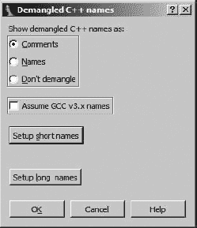

图 8-15。改写名称显示选项

三个主要选项控制是否将改写名称显示为注释、是否改写名称本身，或者根本不进行改写。将改写名称显示为注释会导致类似以下显示：

```
.text:00401050 ; protected: __thiscall SubClass::SubClass(void)
  text:00401050 ??0SubClass@@IAE@XZ  proc near
  ...
  .text:004010DC           
call  ??0SubClass@@IAE@XZ  ; SubClass::SubClass(void)
```

同样，将改写名称显示为名称会导致以下结果：

```
 .text:00401050 protected: __thiscall SubClass::SubClass(void) proc near
  ...
  .text:004010DC             call    SubClass::SubClass(void)
```

其中  代表了反汇编函数的第一行，而  代表了对该函数的调用。

使用“假定 GCC v3.x 命名”复选框来区分 g++ 版本 2.9.*x* 和 g++ 版本 3.*x* 及以后的混淆方案。在正常情况下，IDA 应该自动检测 g++ 编译的代码中使用的命名约定。设置短名称和设置长名称按钮提供了对解混淆名称格式的精细控制，这些选项在 IDA 的帮助系统中都有文档说明。

因为混淆名称包含了关于每个函数签名的很多信息，它们减少了理解传递给函数的参数数量和类型所需的时间。当在二进制文件中可用混淆名称时，IDA 的解混淆能力可以立即揭示所有混淆名称的函数的参数类型和返回类型。相比之下，对于任何未使用混淆名称的函数，你必须进行耗时的分析，以确定函数的签名，分析函数的输入和输出数据。

## 运行时类型识别

C++ 提供了运算符，允许在运行时确定（`typeid`）和检查（`dynamic_cast`）对象的类型。为了便于这些操作，C++ 编译器必须在程序二进制中嵌入类型信息，并实现程序，以便可以确定多态对象的类型，无论可能解引用的指针类型如何。不幸的是，与名称混淆一样，运行时类型识别（RTTI）是编译器实现细节，而不是语言问题，并且没有标准的方法来让编译器实现 RTTI 功能。

我们将简要地看看 Microsoft Visual C++ 和 GNU g++ 的 RTTI 实现之间的相似之处和不同之处。具体来说，这里提供的唯一细节是关于如何定位 RTTI 信息，以及如何从那里学习与该信息相关的类的名称。希望对 Microsoft 的 RTTI 实现有更详细讨论的读者应参考本章末尾列出的参考文献。特别是，这些参考文献详细说明了如何遍历类的继承层次结构，包括在多重继承中使用时如何追踪该层次结构。

考虑以下简单的程序，它使用了多态性：

```
class abstract_class {
public:
   virtual int vfunc() = 0;
};

class concrete_class : public abstract_class {
public:
   concrete_class();
   int vfunc();
};

void print_type(abstract_class *p) {
   cout << typeid(*p).name() << endl;
}

int main() {
   abstract_class *sc = new concrete_class();
   print_type(sc);
}
```

`print_type` 函数必须正确打印出指针 `p` 所指向的对象的类型。在这种情况下，根据在 `main` 函数中创建了一个 `concrete_class` 对象的事实，可以轻易地意识到应该打印出`concrete_class`。我们在这里回答的问题是：`print_type`，更具体地说 `typeid`，是如何知道 `p` 指向的对象的类型？

答案出奇地简单。由于每个多态对象都包含一个指向虚函数表的指针，编译器利用这一事实，通过将类类型信息与类虚函数表一起定位。具体来说，编译器将一个指针放置在类虚函数表之前。这个指针指向一个包含用于确定拥有虚函数表的类名称的信息的结构。在 g++代码中，这个指针指向一个`type_info`结构，它包含指向类名称的指针。在 Visual C++中，这个指针指向一个 Microsoft `RTTICompleteObjectLocator`结构，它反过来又包含一个指向`TypeDescriptor`结构的指针。`TypeDescriptor`结构包含一个字符数组，指定了多态类的名称。

重要的是要认识到，只有在使用`typeid`或`dynamic_cast`运算符的 C++程序中才需要 RTTI 信息。大多数编译器提供选项来禁用在不需要 RTTI 的二进制文件中生成 RTTI；因此，如果你发现 RTTI 信息缺失，请不要感到惊讶。

## 继承关系

如果你深入探究一些 RTTI 实现，你会发现解开继承关系是可能的，尽管你必须理解编译器对 RTTI 的特殊实现才能做到这一点。此外，当程序没有使用`typeid`或`dynamic_cast`运算符时，RTTI 可能不存在。在没有 RTTI 信息的情况下，可以采用哪些技术来确定 C++类之间的继承关系？

确定继承层次结构的最简单方法是观察在创建对象时调用的超类构造函数的调用链。这种技术的最大障碍是内联构造函数的使用，其使用使得无法理解实际上已经调用了超类构造函数。

确定继承关系的另一种方法涉及分析和比较虚函数表。例如，在比较图 8-14 中显示的虚函数表时，我们注意到 SubClass 的虚函数表包含与 BaseClass 虚函数表中出现的两个相同的指针。我们可以很容易地得出结论，BaseClass 和 SubClass 必须在某种程度上相关联，但哪个是基类，哪个是子类？在这种情况下，我们可以单独或组合应用以下指南，以尝试了解它们之间的关系。

+   当两个虚函数表包含相同数量的条目时，这两个相应的类*可能*存在继承关系。

+   当类 X 的虚函数表包含的条目多于类 Y 的虚函数表时，类 X*可能*是类 Y 的子类。

+   当类 X 的虚表包含在类 Y 的虚表中也能找到的条目时，以下关系之一必须存在：X 是 Y 的子类，Y 是 X 的子类，或者 X 和 Y 都是共同超类 Z 的子类。

+   当类 X 的虚表包含在类 Y 的虚表中也能找到的条目，并且类 X 的虚表至少包含一个不在类 Y 的相应虚表条目中出现的`purecall`条目时，则类 Y 是类 X 的子类。

虽然上述列表远非详尽无遗，但我们可以使用这些指南来推断 BaseClass 和 SubClass 在图 8-14 中的关系。在这种情况下，最后三条规则都适用，但最后一条规则特别引导我们仅根据虚表分析得出结论，即 SubClass 继承自 BaseClass。

## C++逆向工程参考资料

关于逆向工程编译后的 C++主题的进一步阅读，请参阅以下优秀参考资料：

+   Igor Skochinsky 的文章“Reversing Microsoft Visual C++ Part II: Classes, Methods and RTTI”，可在[`www.openrce.org/articles/full_view/23`](http://www.openrce.org/articles/full_view/23)找到。

+   Paul Vincent Sabanal 和 Mark Vincent Yason 的论文“Reversing C++”，可在[`www.blackhat.com/presentations/bh-dc-07/Sabanal_Yason/Paper/bh-dc-07-Sabanal_Yason-WP.pdf`](http://www.blackhat.com/presentations/bh-dc-07/Sabanal_Yason/Paper/bh-dc-07-Sabanal_Yason-WP.pdf)找到。

虽然这些文章中的许多细节仅适用于使用 Microsoft Visual C++编译的程序，但许多概念同样适用于使用其他 C++编译器编译的程序。

* * *

^([48]) 在 C++中，`new`运算符用于动态内存分配，这与 C 语言中使用`malloc`的方式类似（尽管`new`是 C++语言的一部分，而`malloc`只是一个标准库函数）。

^([49]) *类构造函数*是一个在创建对象时自动调用的初始化函数。相应的*析构函数*是可选的，当对象不再在作用域内或类似情况下会被调用。

^([50]) 在 C++中，*函数重载*允许程序员为几个函数使用相同的名称。唯一的要求是，每个重载函数的版本必须与每个其他版本在参数类型序列和/或数量上有所不同。换句话说，每个函数原型必须是唯一的。

^([51]) 在 C/C++程序中，被声明为`inline`的函数会被编译器当作宏处理，函数的代码会在显式函数调用处展开。由于汇编语言调用语句的存在是函数被调用的明显迹象，因此内联函数的使用往往隐藏了函数被使用的事实。

# 摘要

你几乎可以在所有非最简单程序中遇到复杂的数据类型。了解如何在复杂的数据结构中访问数据，以及如何识别指向这些复杂数据结构布局的线索，是逆向工程的基本技能。IDA 提供了一系列专门针对处理复杂数据结构需求的功能。熟悉这些功能将大大提高你理解正在操作哪些数据以及花更多时间理解数据和为什么被操作的能力。

在下一章中，我们在讨论 IDA 的基本功能的基础上，讨论交叉引用和绘图，然后再继续探讨 IDA 使用的更高级功能，这些功能使它区别于其他逆向工程工具。

# 第九章。交叉引用和绘图


在逆向工程二进制文件时，人们通常会问一些更常见的问题，例如“这个函数是从哪里被调用的？”和“哪些函数访问了这些数据？”这些问题以及其他类似问题旨在对程序中各种资源的引用进行编目。以下两个例子有助于说明这类问题的有用性。

考虑这种情况：你发现了一个包含可溢出栈分配缓冲区的函数，这可能导致程序被利用。由于该函数可能深埋在一个复杂的应用程序中，你的下一步可能是确定如何精确地访问该函数。除非你能让它执行，否则该函数对你来说毫无用处。这引出了问题“哪些函数调用了这个有漏洞的函数？”以及关于那些函数可能传递给有漏洞函数的数据性质的其他问题。在回溯潜在的调用链以找到可以影响以正确利用你发现的溢出的问题时，这种推理必须继续。

在另一种情况下，考虑一个包含大量 ASCII 字符串的二进制文件，其中至少有一个字符串让你感到可疑，例如“执行拒绝服务攻击！”这个字符串的存在是否表明该二进制文件实际上执行了拒绝服务攻击？不，它仅仅表明该二进制文件恰好包含那个特定的 ASCII 序列。你可能推断出，在发起攻击之前，该消息以某种方式显示出来；然而，你需要找到相关的代码来验证你的怀疑。在这里，关于“这个字符串在哪里被引用？”的问题将帮助你快速追踪使用该字符串的程序位置。从那里，也许它能帮助你定位任何实际的拒绝服务攻击代码。

IDA 通过其广泛的交叉引用功能帮助回答这些类型的问题。IDA 提供了多种机制来显示和访问交叉引用数据，包括图形生成功能，它提供了代码与数据之间关系的直观表示。在本章中，我们将讨论 IDA 提供的交叉引用信息类型、访问交叉引用数据的工具以及如何解释这些数据。

# 交叉引用

我们首先指出，IDA 中的交叉引用通常简单地称为 *xrefs*。在本文本中，我们仅在它用于指代 IDA 菜单项或对话框的内容时使用 *xref*。在其他所有情况下，我们将坚持使用术语 *交叉引用*。

在 IDA 中，交叉引用分为两大类：代码交叉引用和数据交叉引用。在每个类别中，我们将详细说明几种不同类型的交叉引用。每个交叉引用都与方向的概念相关联。所有交叉引用都是从地址到地址的。*从* 和 *到* 地址可以是代码地址或数据地址。如果你熟悉图论，你可以选择将地址视为有向图中的 *节点*，交叉引用为该图中的 *边*。图 9-1 提供了关于图术语的快速复习。在这个简单的图中，三个节点  通过两条有向边  连接。

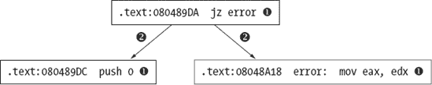

图 9-1. 基本图组件

注意，节点也可以被称为 *顶点*。有向边使用箭头绘制，以指示允许穿越边的方向。在 图 9-1 中，可以从上节点到下节点中的任何一个节点进行旅行，但不可能从下节点中的任何一个节点到上节点进行旅行。

代码交叉引用是一个非常重要的概念，因为它们有助于 IDA 生成 *控制流图* 和 *函数调用图*，这些内容我们将在本章后面进行讨论。

在我们深入交叉引用的细节之前，了解 IDA 在反汇编列表中如何显示交叉引用信息是有用的。图 9-2 显示了包含交叉引用作为常规注释（图右侧）的反汇编函数（`sub_401000`）的标题行。


图 9-2. 基本交叉引用

文本 `CODE XREF` 表示这是一个代码交叉引用，而不是数据交叉引用 (`DATA XREF`)。后面跟着一个地址，例如 `_main+2A`，表示交叉引用的起始地址。请注意，这比例如 `.text:0040154A` 这样的地址形式更具描述性。虽然这两种形式表示的是相同的程序位置，但交叉引用中使用的格式提供了额外的信息，即交叉引用是从名为 `_main` 的函数内部进行的，具体在 `_main` 函数的 0x2A（42）字节处。地址后面总是跟着一个上箭头或下箭头，表示相对于引用位置的方向。在 图 9-2 中，下箭头表示 `_main+2A` 的地址高于 `sub_401000`，因此你需要向下滚动才能到达它。同样，上箭头表示引用位置位于较低的内存地址，需要向上滚动才能到达它。最后，每个交叉引用注释都包含一个单字符后缀，用于标识正在进行的交叉引用类型。每个后缀将在我们详细说明 IDA 的所有交叉引用类型时进行描述。

## 代码交叉引用

代码交叉引用用于指示指令将控制权转移到另一条指令或可能转移到另一条指令。指令转移控制的方式在 IDA 中被称为 *流程*。IDA 区分三种基本流程类型：*普通*、*跳转*和*调用*。跳转和调用流程根据目标地址是近地址还是远地址进一步细分。远地址仅在使用分段地址的二进制文件中遇到。在下面的讨论中，我们将使用以下程序的反汇编版本：

```
int read_it;            //integer variable read in main
int write_it;           //integer variable written 3 times in main
int ref_it;             //integer variable whose address is taken in main

void callflow() {}      //function called twice from main

int main() {
   int *p = &ref_it;    //results in an "offset" style data reference
   *p = read_it;        //results in a "read" style data reference
   write_it = *p;       //results in a "write" style data reference
   callflow();          //results in a "call" style code reference
   if (read_it == 3) {  //results in "jump" style code reference
      write_it = 2;     //results in a "write" style data reference
   }
   else {               //results in an "jump" style code reference
      write_it = 1;     //results in a "write" style data reference
   }
   callflow();          //results in an "call" style code reference
}
```

程序包含将测试 IDA 所有交叉引用功能的操作，如注释文本所述。

*普通流程* 是最简单的流程类型，它表示从一条指令到另一条指令的顺序流程。这是所有非分支指令（如 `ADD`）的默认执行流程。除了指令在反汇编中的顺序外，普通流程没有特殊的显示指示符。如果指令 A 有到指令 B 的普通流程，那么指令 B 将立即跟在指令 A 的反汇编列表中。在下面的列表中，除了  和  之外的所有指令都有一个与其直接后继指令关联的普通流程：

示例 9-1. 交叉引用源和目标

```
.text:00401010 _main           proc near
  .text:00401010
  .text:00401010 p               = dword ptr −4
  .text:00401010
  .text:00401010                 push    ebp
  .text:00401011                 mov     ebp, esp
  .text:00401013                 push    ecx
  .text:00401014                mov     [ebp+p], offset ref_it
  .text:0040101B                 mov     eax, [ebp+p]
  .text:0040101E                mov     ecx, read_it
  .text:00401024                 mov     [eax], ecx
  .text:00401026                 mov     edx, [ebp+p]
  .text:00401029                 mov     eax, [edx]
  .text:0040102B                mov     write_it, eax
  .text:00401030                call    callflow
  .text:00401035                cmp     read_it, 3
  .text:0040103C                 jnz     short loc_40104A
  .text:0040103E                mov     write_it, 2
  .text:00401048                jmp     short loc_401054

 .text:0040104A ; -------------------------------------------------------------
  .text:0040104A
  .text:0040104A loc_40104A:                         ; CODE XREF: _main+2C↑j
  .text:0040104A                mov     write_it, 1
  .text:00401054
  .text:00401054 loc_401054:                         ; CODE XREF: _main+38↑j
  .text:00401054                call    callflow
  .text:00401059                 xor     eax, eax
    .text:0040105B                 mov     esp, ebp
  .text:0040105D                 pop     ebp
  .text:0040105E                retn
  .text:0040105E _main           endp
```

用于调用函数的指令，如处的 x86 `call`指令，分配了一个*调用流程*，表示控制流转移到目标函数。在大多数情况下，也会为`call`指令分配普通流程，因为大多数函数会返回到`call`之后的地址。如果 IDA 认为函数不会返回（在分析阶段确定），则不会为该函数的调用分配普通流程。调用流程通过在目标函数（流程的目的地址）处显示交叉引用来标记。此处显示了`callflow`函数的相应反汇编代码：

```
.text:00401000 callflow        proc near               ; CODE XREF: _main+20↓p
.text:00401000                                         ; _main:loc_401054↓p
.text:00401000                 push    ebp
.text:00401001                 mov     ebp, esp
.text:00401003                 pop     ebp
.text:00401004                 retn
.text:00401004 callflow        endp
```

在此示例中，在`callflow`地址处显示了两个交叉引用，以指示该函数被调用两次。交叉引用中显示的地址显示为调用函数中的偏移量，除非调用地址有一个关联的名称，在这种情况下使用该名称。这两种地址形式都用于此处显示的交叉引用中。通过使用`p`后缀（想想*P*代表*Procedure*）来区分函数调用产生的交叉引用。

每个无条件和有条件分支指令都分配了一个*跳转流程*。有条件分支也分配了普通流程，以考虑分支不被采取时的控制流。无条件分支没有关联的普通流程，因为在这种情况下分支总是被采取。在处的虚线线断是用于指示两个相邻指令之间不存在普通流程的显示设备。跳转流程与在跳转目标处显示的跳转样式交叉引用相关联，如图所示。与调用样式交叉引用一样，跳转交叉引用显示引用位置（跳转的源）的地址。跳转交叉引用通过使用`j`后缀（想想*J*代表*Jump*）来区分。

## 数据交叉引用

数据交叉引用用于跟踪数据在二进制文件中的访问方式。数据交叉引用可以与 IDA 数据库中与虚拟地址关联的任何字节相关联（换句话说，数据交叉引用永远不会与栈变量相关联）。最常遇到的三种数据交叉引用类型用于指示何时读取位置、何时写入位置以及何时获取位置地址。此处显示了与先前示例程序相关联的全局变量，因为它们提供了多个数据交叉引用的示例。

```
.data:0040B720 read_it       dd ?                    ; DATA XREF: _main+E↑r
.data:0040B720                                       ; _main+25↑r
.data:0040B724 write_it      dd ?                    ; DATA XREF: _main+1B↑w
.data:0040B724                                      ; _main+2E↑w ...
.data:0040B728 ref_it        db    ? ;               ; DATA XREF: _main+4↑o
.data:0040B729               db    ? ;
.data:0040B72A               db    ? ;
.data:0040B72B               db    ? ;
```

*读取交叉引用* 用于指示正在访问内存位置的 内容。读取交叉引用只能从指令地址起源，但可以引用任何程序位置。全局变量 `read_it` 在 示例 9-1 中标记的位置  被读取。此列表中显示的关联交叉引用注释确切地表明了 `main` 中哪些位置引用了 `read_it`，并且根据使用 `r` 后缀可以识别为读取交叉引用。对 `read_it` 执行的第一个读取操作是将 32 位读取到 ECX 寄存器中，这使得 IDA 将 `read_it` 格式化为 dword (`dd`)。一般来说，IDA 尽可能多地获取线索，以确定变量的大小和/或类型，这些线索基于它们如何被访问以及它们如何作为函数的参数使用。

全局变量 `write_it` 在 示例 9-1 中标记的位置  被引用。相关的 *写入交叉引用* 被生成并显示为 `write_it` 变量的注释，指示修改变量内容的程序位置。写入交叉引用使用 `w` 后缀。同样，IDA 根据事实，32 位 EAX 寄存器被复制到 `write_it` 中，确定了变量的大小。请注意，显示在 `write_it` 上的交叉引用列表以省略号 ( 上方) 结尾，表示对 `write_it` 的交叉引用数量超过了当前显示的交叉引用限制。此限制可以通过在选项 ▸ 通用对话框的交叉引用选项卡上的“显示的 xrefs 数量”设置中修改。与读取交叉引用一样，写入交叉引用只能从程序指令起源，但可以引用任何程序位置。一般来说，针对程序指令字节的写入交叉引用表明是自修改代码，这通常被认为是不良的编程习惯，并且在恶意软件中使用的去混淆例程中经常遇到。

第三种数据交叉引用类型，即 *偏移量交叉引用*，表明正在使用位置的地址（而不是位置的 内容）。全局变量 `ref_it` 的地址在 示例 9-1 中的位置  被取用，导致在前面列表中的 `ref_it` 处出现偏移量交叉引用注释（后缀 `o`）。偏移量交叉引用通常是代码或数据中指针操作的结果。例如，数组访问操作通常通过向数组的起始地址添加偏移量来实现。因此，大多数全局数组中的第一个地址通常可以通过偏移量交叉引用的存在来识别。因此，大多数字符串数据（在 C/C++ 中字符串是字符数组）是偏移量交叉引用的目标。

与只能从指令位置起源的读取和写入交叉引用不同，偏移量交叉引用可以来自指令位置或数据位置。一个可以从程序的数据部分起源的偏移量示例是任何指针表（如虚表），它从表中的每个位置生成到那些位置所指向位置的偏移量交叉引用。如果你检查来自 第八章 的 `SubClass` 类的虚表，其反汇编代码如下所示，你可以看到这一点：

```
.rdata:00408148 off_408148  dd offset SubClass::vfunc1
(void) ; DATA XREF: SubClass::SubClass(void)+12↑o
.rdata:0040814C          dd offset BaseClass::vfunc2(void)
.rdata:00408150          dd offset SubClass::vfunc3(void)
.rdata:00408154          dd offset BaseClass::vfunc4(void)
.rdata:00408158          dd offset SubClass::vfunc5(void)
```

在这里，你可以看到在函数 `SubClass::SubClass(void)` 中使用了虚表地址，该函数是类的构造函数。函数 `SubClass::vfunc3(void)` 的头文件，如这里所示，显示了将函数与虚表链接的偏移量交叉引用。

```
.text:00401080 public: virtual void __thiscall SubClass::vfunc3(void) proc near
.text:00401080                                      ; DATA XREF: .rdata:00408150↓o
```

这个例子演示了 C++ 虚拟函数的一个特性，当与偏移量交叉引用结合时变得非常明显，即 C++ 虚拟函数永远不会直接调用，也不应该是调用交叉引用的目标。相反，所有 C++ 虚拟函数至少应该通过一个虚表条目来引用，并且始终应该是至少一个偏移量交叉引用的目标。记住，重写虚拟函数不是强制性的。因此，虚拟函数可以出现在多个虚表中，如 第八章 中讨论的那样。回溯偏移量交叉引用是轻松定位程序数据部分中 C++ 虚表的技巧之一。

## 交叉引用列表

理解了什么是交叉引用之后，我们现在可以讨论如何在 IDA 中访问所有这些数据的方式。如前所述，在特定位置可以显示的交叉引用注释数量受配置设置的限制，默认值为 2。只要对位置的交叉引用数量不超过此限制，那么处理这些交叉引用就相当直接。将鼠标悬停在交叉引用文本上会在工具提示样式中显示源区域的反汇编，而双击交叉引用地址会将反汇编窗口跳转到交叉引用的源。

查看位置所有交叉引用的完整列表有两种方法。第一种方法是打开与特定地址关联的交叉引用子视图。通过将光标定位在一个是或多个交叉引用的目标地址上，并选择“查看”▸“打开子视图”▸“交叉引用”，你可以打开给定位置的完整交叉引用列表，如图 9-3 所示，它显示了变量`write_it`的完整交叉引用列表。


图 9-3. 交叉引用显示窗口

窗口的列表示交叉引用源的方向（向上或向下），交叉引用的类型（使用之前讨论的类型后缀），交叉引用的源地址，以及源地址处的相应反汇编文本，包括可能存在的任何注释。与其他显示地址列表的窗口一样，双击任何条目会将反汇编显示重新定位到相应的源地址。一旦打开，交叉引用显示窗口将保持打开状态，并且可以通过显示在反汇编区域上方每个其他打开子视图标题标签旁边的标题标签访问。

访问交叉引用列表的第二种方式是突出显示你感兴趣了解的名称，并选择“跳转”▸“跳转到 xref”（快捷键 ctrl-X）以打开一个对话框，该对话框列出所有引用所选符号的位置。如图 9-4 所示的对话框在外观上几乎与图 9-3 中显示的交叉引用子视图相同。在这种情况下，对话框是通过使用 ctrl-X 快捷键并选择`write_it`（`.text:0040102B`）的第一个实例来激活的。

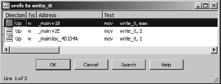

图 9-4. 跳转到交叉引用对话框

这两个显示的主要区别在于行为。作为一个模态对话框，^([52]) 图 9-4 Figure 9-4 中的显示有按钮可以与之交互并终止对话框。此对话框的主要目的是选择引用位置并跳转到该位置。双击列表中的任何一个位置将关闭对话框并将反汇编窗口重新定位到所选位置。对话框与交叉引用子视图之间的第二个区别是，前者可以通过热键或上下文相关菜单从任何符号实例打开，而后者只能在将光标定位在交叉引用的目标地址上并选择视图 ▸ 打开子视图 ▸ 交叉引用时打开。另一种思考方式是，对话框可以在任何交叉引用的源处打开，而子视图只能在交叉引用的目的地打开。

交叉引用列表的有用性之一可能是快速定位调用特定函数的所有位置。许多人认为使用 C 语言的`strcpy`^([53])函数是危险的。使用交叉引用，找到对`strcpy`的所有调用就像找到对`strcpy`的任何一次调用一样简单，使用 ctrl-X 热键调出交叉引用对话框，然后逐个处理每个调用交叉引用。如果您不想花时间在二进制文件中找到使用`strcpy`的位置，甚至可以添加包含文本*strcpy*的注释并激活交叉引用对话框。^([54])

## 函数调用

通过选择视图 ▸ 打开子视图 ▸ 函数调用，可以获得一个专门处理函数调用的交叉引用列表。图 9-5 Figure 9-5 显示了生成的对话框，该对话框在上半部分窗口中列出调用当前函数（在打开视图时由光标位置定义）的所有位置，在下半部分窗口中列出当前函数的所有调用。


图 9-5. 函数调用窗口

在这里，每个列出的交叉引用都可以用来快速将反汇编列表重新定位到相应的交叉引用位置。仅考虑函数调用交叉引用，我们可以考虑比从地址到地址的简单映射更抽象的关系，并考虑函数之间的关系。在下一节中，我们将展示 IDA 如何利用这一点，通过提供几种类型的图表来帮助您解释二进制文件。

* * *

^([52]) 在您继续与底层应用程序的正常交互之前，必须关闭模态对话框。无模式对话框可以在您继续与应用程序的正常交互时保持打开状态。

^([53]) `C strcpy` 函数将字符源数组（包括相关的空终止字符）复制到目标数组，而不会检查目标数组是否足够大以容纳所有来自源数组的字符。

^([54]) 当符号名称出现在注释中时，IDA 将该符号视为反汇编指令中的操作数。双击符号将重新定位反汇编窗口，并可用右键点击的上下文相关菜单。

# IDA 图表功能

由于交叉引用关联一个地址到另一个地址，如果我们想为我们的二进制文件制作图表，它们是一个自然的选择点。通过限制自己到特定的交叉引用类型，我们可以推导出许多有用的图表来分析我们的二进制文件。首先，交叉引用作为我们图表中的边（连接点的线条）。根据我们希望生成的图表类型，单独的节点（图表中的点）可以是单个指令、称为 *基本块* 的指令组，或整个函数。IDA 有两个不同的图表功能：一个是利用捆绑的图表应用程序的外部图表功能，另一个是集成、交互式的图表功能。这两个图表功能将在以下章节中介绍。

## IDA 外部（第三方）图表

IDA 的外部图表功能利用第三方图表应用程序来显示 IDA 生成的图表文件。对于 6.1 版本之前的 Windows 版本，IDA 随附一个名为 `wingraph32` 的捆绑图表应用程序。^([55]) 对于 IDA 6.0 版本，非 Windows 版本的 IDA 默认配置为使用 dotty^([56)) 图表查看器。从 IDA 6.1 版本开始，所有版本的 IDA 都随附并配置为使用 `qwingraph`^([57)) 图表查看器，这是一个 `wingraph32` 的跨平台 Qt 版本。虽然 Linux 用户仍然可以看到 dotty 配置选项，但它们默认被注释掉。IDA 使用的图表查看器可以通过编辑 *<IDADIR>/cfg/ida.cfg* 中的 GRAPH_VISUALIZER 变量来配置。

每次请求外部样式图形时，都会生成图形的源并将其保存到临时文件中；然后启动指定的第三方图形查看器以显示图形。IDA 支持两种图形规范语言，即图描述语言^([58）(GDL)和由 graphviz^([59）项目使用的 DOT^([60）语言。IDA 使用的图形规范语言可以通过编辑 *<IDADIR>/cfg/ida.cfg* 中的 `GRAPH_FORMAT` 变量来配置。此变量的有效值是 `DOT` 和 `GDL`。您必须确保此处指定的语言与您在 `GRAPH_VISUALIZER` 中指定的查看器兼容。

可以从“视图 ▸ 图形”子菜单生成五种类型的图形。可用的外部模式图形包括以下几种：

+   函数流程图

+   整个二进制的调用图

+   符号交叉引用的图

+   从符号到交叉引用的图

+   定制的交叉引用图

对于其中的两种，流程图和调用图，IDA 能够生成并保存 GDL（非 DOT）文件，以便独立于 IDA 使用。这些选项可以在“文件 ▸ 生成文件”子菜单中找到。如果您的配置图形查看器允许您保存当前显示的图形，则可能可以保存其他类型图形的规范文件。处理任何外部图形时都存在一些限制。首先，外部图形不是交互式的。显示的外部图形的操纵受您选择的图形查看器功能限制（通常只有缩放和平移）。

基本块

在计算机程序中，一个*基本块*是由一个或多个指令组成的集合，这些指令从块的开头有一个单一的入口，从块的末尾有一个单一的出口。一般来说，除了最后一个指令外，基本块内的每个指令都将控制权传递给块内的一个精确的*后继*指令。同样，除了第一个指令外，基本块内的每个指令都从块内的一个精确的*前驱*指令接收控制权。为了确定基本块的目的，通常忽略函数调用指令将控制权转移到当前函数之外的事实，除非已知被调用的函数无法正常返回。基本块的一个重要行为特征是，一旦基本块中的第一条指令被执行，该块剩余的部分将保证执行完成。这可以在程序的运行时仪器中起到重要作用，因为不再需要在程序中的每个指令上设置断点，甚至不需要单步执行程序以记录哪些指令已执行。相反，可以在每个基本块的第一条指令上设置断点，并且每当遇到一个断点时，其相关块中的每个指令都可以标记为已执行。Pedram Amini 的 PaiMei 框架的 Process Stalker 组件正是以这种方式运行的。

### 外部流程图

当光标位于一个函数内时，选择“视图”▸“图形”▸“流程图”（快捷键 F12）可以生成并显示一个外部流程图。流程图显示的是最接近 IDA 集成图形反汇编视图的外部图形。这些流程图并不是你在入门编程课程中学到的那些。相反，这些图可能更准确地被称为“控制流图”，因为它们将函数的指令分组到基本块中，并使用边来指示从一个块到另一个块的流动。

图 9-6 显示了相对简单函数的流程图的一部分。正如你所看到的，外部流程图在地址信息方面提供得非常少，这可能会使得将流程图视图与其对应的反汇编列表相关联变得困难。


图 9-6. 外部流程图

流程图图是通过跟踪函数中每个指令的常规和跳转流动得到的，从函数的入口点开始。

### 外部调用图

函数调用图对于快速了解程序内部函数调用的层次结构非常有用。调用图是通过为每个函数创建一个图节点，然后根据一个函数到另一个函数的调用交叉引用的存在来连接函数节点生成的。为单个函数生成调用图的过程可以看作是通过对从初始函数调用的所有函数进行递归下降来实现的。在许多情况下，一旦达到库函数，就可以停止向下遍历调用树，因为通过阅读与库相关的文档来了解库函数的操作比尝试逆向工程函数的编译版本要容易得多。实际上，在动态链接的二进制文件的情况下，由于这些函数的代码不包含在动态链接的二进制文件中，因此不可能向下遍历库函数。在生成图时，静态链接的二进制文件提出了不同的挑战。由于静态链接的二进制文件包含了已链接到程序的所有库的代码，相关的函数调用图可能会变得非常大。

为了讨论函数调用图，我们使用以下简单的程序，该程序除了创建一个简单的函数调用层次结构外，不做任何其他事情：

```
#include <stdio.h>

void depth_2_1() {
   printf("inside depth_2_1\n");
}

void depth_2_2() {
   fprintf(stderr, "inside depth_2_2\n");
}

void depth_1() {
   depth_2_1();
   depth_2_2();
   printf("inside depth_1\n");
}

int main() {
   depth_1();
}
```

在使用 GNU gcc 编译动态链接的二进制文件后，我们可以要求 IDA 通过“视图”>“图形”>“函数调用”生成函数调用图，这应该会产生与图 9-7 中显示的图相似的图。在这种情况下，我们略微截断了图的左侧，以便提供更多细节。图中的圆形区域显示了与`main`函数相关的调用图。


图 9-7. 外部函数调用图

警惕的读者可能会注意到，编译器已经将`puts`和`fwrite`的调用分别替换为`printf`和`fprintf`，因为它们在打印静态字符串时更有效。请注意，IDA 使用不同的颜色来表示图中不同类型的节点，尽管这些颜色不能以任何方式配置。^([62])

考虑到前一个程序列表的简单性，为什么图看起来比应有的拥挤了两倍？答案是编译器，就像几乎所有编译器一样，已经插入了负责库初始化和终止以及正确配置参数以便将控制权传递给`main`函数的包装代码。

尝试为相同的程序生成静态链接版本的结果是图 9-8 中显示的糟糕混乱。 

图 9-8 中的图演示了一般外部图的行为，即它们最初总是按比例缩放以显示整个图，这可能导致非常杂乱的显示。对于这个特定的图，WinGraph32 窗口底部的状态栏指示有 946 个节点和 10,125 条边在 100,182 个位置交叉。除了演示静态链接二进制的复杂性之外，这个图几乎无法使用。无论怎样缩放和滚动，都无法简化这个图，而且除此之外，除了通过读取每个节点的标签外，没有简单的方法可以轻松定位到特定的函数，如`main`。在你足够放大以能够读取与每个节点关联的标签之前，只有几十个节点可以显示在屏幕上。


图 9-8. 静态链接二进制中的函数调用图

### 外部交叉引用图

对于全局符号（函数或全局变量），可以生成两种交叉引用图：符号的交叉引用（查看 ▸ 图表 ▸ 交叉引用到）和从符号的交叉引用（查看 ▸ 图表 ▸ 交叉引用从）。要生成交叉引用到图，通过回溯所有指向所选符号的交叉引用，执行递归上升，直到达到没有其他符号引用的符号。在分析二进制文件时，可以使用交叉引用到图来回答“必须调用哪些序列才能到达这个函数？”的问题。图 9-9 展示了使用交叉引用到图来显示到达`puts`函数的路径。


图 9-9. 交叉引用到图

类似地，交叉引用到图可以帮助你可视化所有引用全局变量的位置以及到达这些位置所需的函数调用链。交叉引用图是唯一能够包含数据交叉引用信息的图。

为了创建交叉引用从图，通过跟随从所选符号的交叉引用执行递归下降。如果符号是函数名，则只跟随函数的调用引用，因此全局变量的数据引用不会显示在图中。如果符号是一个初始化的全局指针变量（意味着它实际上指向某个东西），则跟随相应的数据偏移交叉引用。当你从函数中绘制交叉引用时，有效行为是以所选函数为根的函数调用图，如图 9-10 所示。

不幸的是，当使用复杂的调用图绘制函数时，同样存在杂乱的图形问题。


图 9-10. Xrefs From 图

### 自定义交叉引用图

自定义交叉引用图，在 IDA 中称为*用户交叉引用图表*，在生成交叉引用图以满足您的需求方面提供了最大的灵活性。除了将符号的交叉引用和从符号的交叉引用组合到单个图中之外，自定义交叉引用图还允许您指定最大递归深度以及应包含或排除在结果图中的符号类型。

查看 ▸ 图形 ▸ 用户交叉引用图表将打开显示在图 9-11 中的图形自定义对话框。在指定的地址范围内出现的每个全局符号都作为结果图中的一个节点出现，该图是根据对话框中指定的选项构建的。在最常见的情况下，从单个符号生成交叉引用时，起始地址和结束地址是相同的。如果起始地址和结束地址不同，则生成的结果图将包括在指定范围内出现的所有非局部符号。在极端情况下，起始地址是数据库中的最低地址，而结束地址是数据库中的最高地址，结果图退化到整个二进制的函数调用图。

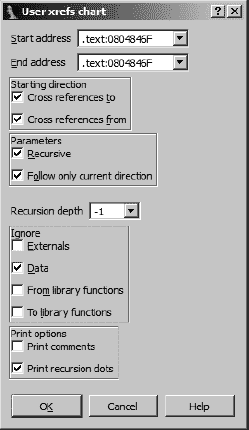

图 9-11. 用户交叉引用图对话框

在图 9-11 中选择的选项代表所有自定义交叉引用图的默认选项。以下是对每组选项目的的描述：

**起始方向**

选项允许您决定是否从所选符号搜索交叉引用，到所选符号，或两者都搜索。如果所有其他选项都保留在默认设置，将起始方向限制为交叉引用会导致 Xrefs To 风格的图形，而将方向限制为交叉引用则生成 Xrefs From 风格的图形。

**参数**

递归选项启用从所选符号的递归下降（Xrefs From）或上升（Xrefs To）。仅跟随当前方向强制任何递归只在一个方向上发生。换句话说，如果选择此选项，并且发现节点 B 可以从节点 A 访问，则递归下降到 B 会添加只能从节点 B 访问的附加节点。指向节点 B 的新发现的节点将不会添加到图中。如果您选择取消选择仅跟随当前方向，那么当选择两个起始方向时，每个添加到图中的新节点将在*到*和*从*两个方向上递归。

**递归深度**

此选项设置最大递归深度，对于限制生成的图形大小很有用。设置为-1 会导致递归尽可能深，并生成最大的图形。

**忽略**

这些选项指定将排除哪些类型的节点从生成的图形中。这是限制结果图形大小的另一种方法。特别是，忽略库函数的交叉引用可以导致静态链接二进制文件中的图形大大简化。关键是确保 IDA 尽可能多地识别库函数。库代码识别是第十二章的主题。

**打印选项**

这些选项控制图形格式的两个方面。打印注释会导致任何函数注释包含在函数的图形节点中。如果选择打印递归点，并且递归会超过指定的递归限制，则显示包含省略号的节点，以指示可以进一步递归。

图 9-12 显示了在我们的示例程序中使用默认选项和递归深度为 1 为函数`depth_1`生成的自定义交叉引用图。


图 9-12。用户函数`depth_1`的引用图

用户生成的交叉引用图是 IDA 中可用的最强大的外部模式图形功能。外部流程图在很大程度上已被 IDA 的集成基于图形的反汇编视图所取代，而剩余的外部图形类型只是用户生成的交叉引用图的预定义版本。

## IDA 的集成图形视图

在 5.0 版本中，IDA 引入了一个长期期待的基于图形的交互式反汇编视图，该视图紧密集成到 IDA 中。如前所述，集成图形模式提供了对标准文本式反汇编列表的替代接口。在图形模式下，反汇编函数以类似于外部风格流程图的控制流图形式显示。由于使用了面向函数的控制流图，因此在图形模式下一次只能显示一个函数，并且图形模式不能用于任何函数之外的指令。对于需要同时查看多个函数或需要查看不属于函数的指令的情况，您必须回到基于文本的反汇编列表。

我们在第五章中详细介绍了图形视图的基本操作，但在此处我们重申几个要点。在文本视图和图形视图之间切换是通过按空格键或在反汇编窗口的任何位置右键单击并选择适当的文本视图或图形视图来完成的。在图形视图中平移的最简单方法是单击图形视图的背景并按适当方向拖动图形。对于大型图形，您可能会发现使用图形概览窗口平移更容易。图形概览窗口始终在反汇编窗口当前显示的图形部分周围显示一个虚线矩形。在任何时候，您都可以单击并拖动虚线矩形来重新定位图形显示。因为图形概览窗口显示整个图形的缩略图，所以使用它进行平移消除了在反汇编窗口中平移大型图形时需要不断释放鼠标按钮并重新定位鼠标的需求。

在图形模式和文本模式下操作反汇编之间没有显著差异。双击导航继续按您预期的方式工作，导航历史记录列表也是如此。每次您导航到不在函数内（例如全局变量）的位置时，显示将自动切换到文本模式。一旦您导航回函数，图形模式将自动恢复。访问堆变量与文本模式相同，总结堆视图显示在显示函数的根基本块中。通过双击任何堆变量可以访问详细的堆栈帧视图，就像在文本模式中一样。所有在文本模式中格式化指令操作数的选项仍然可用，并且在图形模式中以相同的方式访问。

与图形模式相关的用户界面主要变化涉及处理单个图形节点。显示了简单的图形节点及其相关的标题栏按钮控件。

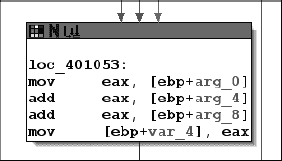

图 9-13. 典型的扩展图形视图节点

从左到右，节点标题栏上的三个按钮允许您更改节点的背景颜色、分配或更改节点的名称，以及访问节点的交叉引用列表。给节点上色是一种有用的方式，可以提醒自己已经分析过该节点，或者简单地使其从其他节点中脱颖而出，可能是因为它包含特别感兴趣的代码。一旦您为节点分配了颜色，该颜色也将用作文本模式下相应指令的背景颜色。要轻松去除任何上色，右键单击节点标题栏并选择**将节点颜色设置为默认**。

在图 9-13 的标题栏中间按钮用于为节点基本块的第一条指令的地址分配一个名称。由于基本块通常是跳转指令的目标，许多节点可能已经因为被跳转交叉引用而分配了一个虚拟名称。然而，基本块在未分配名称的情况下开始也是可能的。考虑以下代码行：

```
.text:00401041               jg      short loc_401053
.text:00401043               mov     ecx, [ebp+arg_0]
```

在处的指令有两个潜在的后续指令，`loc_401053`和处的指令。因为它有两个后续指令，必须终止一个基本块，这导致成为新基本块中的第一条指令，即使它没有被显式地作为跳转的目标，因此没有分配虚拟名称。

在图 9-13 的标题栏最右侧按钮用于访问指向节点的交叉引用列表。由于在图形模式下默认不显示交叉引用注释，这是访问和导航到任何引用节点的最简单方式。与之前讨论的交叉引用列表不同，生成的节点交叉引用列表还包含一个普通流程进入节点的条目（由类型`^`指定）。这是必需的，因为在图形视图中，给定节点的前驱节点不总是显而易见的。如果您希望在图形模式下查看正常的交叉引用注释，请转到“选项”▸“常规”下的交叉引用标签，并将显示的 xrefs 选项设置为非零值。

图形中的节点可以自行或与其他节点一起**分组**，以减少图形中的部分杂乱。要分组多个节点，请按住 Ctrl 键点击要分组的每个节点的标题栏，然后右键点击任何选定节点的标题栏并选择**分组节点**。您将被提示输入一些文本（默认为组中的第一条指令）以在折叠节点中显示。图 9-14 显示了将图 9-13 中的节点分组并更改节点文本为“折叠节点演示”的结果。

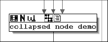

图 9-14. 典型的折叠（分组）图视图节点

注意，标题栏现在有两个额外的按钮。从左到右顺序，这些按钮允许你展开（展开）分组节点并编辑节点文本。展开一个节点只是将组内的节点展开到其原始形式；它不会改变节点或节点现在属于一个组的事实。当组展开时，前面提到的两个新按钮被移除，并替换为单个“折叠组”按钮。可以使用“折叠组”按钮或通过右键单击组中任何节点的标题栏并选择“隐藏组”来轻松地再次折叠展开的组。要完全移除应用于一个或多个节点的分组，必须右键单击折叠节点的标题栏或参与未展开的节点之一，并选择**取消分组节点**。此操作的一个副作用是，如果组当时是折叠的，则会展开组。

* * *

^([55]) Hex-Rays 在 [`www.hex-rays.com/idapro/freefiles/wingraph32_src.zip`](http://www.hex-rays.com/idapro/freefiles/wingraph32_src.zip) 提供了 `wingraph32` 的源代码。

^([56]) dotty 是图形可视化工具，它是图形可视化项目的一部分。

^([57]) Hex-Rays 在 [`www.hex-rays.com/idapro/freefiles/qwingraph_src.zip`](http://www.hex-rays.com/idapro/freefiles/qwingraph_src.zip) 提供了 `qwingraph` 的源代码。

^([58]) GDL 参考信息可在 [`www.absint.com/aisee/manual/windows/node58.html`](http://www.absint.com/aisee/manual/windows/node58.html) 找到。

^([59]) DOT 参考信息可在 [`www.graphviz.org/doc/info/lang.html`](http://www.graphviz.org/doc/info/lang.html) 找到。

^([60]) 请参阅 [`www.graphviz.org/`](http://www.graphviz.org/)。

^([61]) 请参阅 [`pedram.redhive.com/code/paimei/`](http://pedram.redhive.com/code/paimei/)。

^([62]) 本章中展示的图形已在 IDA 之外进行编辑，以去除节点着色，以提高可读性。

# 摘要

图形是分析任何二进制文件的有力工具。如果你习惯于以纯文本格式查看反汇编代码，那么可能需要一些时间来适应使用基于图形的显示。在 IDA 中，通常只需要意识到在文本显示中可用的所有信息在图形显示中仍然可用；然而，格式可能有所不同。例如，交叉引用在图形显示中变成了连接基本块的边。

选择合适的图形来查看在优化图形分析的使用中起着重要作用。如果你想知道某个特定函数是如何被调用的，那么你可能对函数调用或交叉引用图感兴趣。如果你想知道某个特定指令是如何被到达的，那么你可能对控制流图更感兴趣。

用户过去在使用 IDA 的图形功能时遇到的某些挫败感，直接归因于`wingraph32`应用程序及其相关图形的不灵活性。这些问题部分通过引入基于图形的解汇编模式得到了解决。然而，IDA 主要是一个解汇编器，图形生成并不是其主要目的。对专门基于图形分析工具感兴趣的读者可能希望调查专为该目的设计的应用程序，例如由 Halvar Flake 的公司 Zynamics 生产的 BinNavi，^([63])，以及^([64])。

* * *

^([63]) 请参阅 [`www.zynamics.com/binnavi.html`](http://www.zynamics.com/binnavi.html)。

^([64]) 注意，Zynamics 于 2011 年 3 月被谷歌收购。

# 第十章 IDA 的多面性


多年来，Windows GUI 版本一直是 IDA 中的明星。自从 IDA 版本 6.0 发布以来，这种情况已经不再如此，因为 Linux 和 OS X 用户现在可以享受适用于其平台的 IDA GUI 版本。然而，这个新版本并没有改变这样一个事实：使用 IDA 有几种替代方法。IDA 的原始版本实际上是一个 MS-DOS 控制台应用程序，而控制台版本至今仍可在所有平台上使用。凭借内置的远程调试功能，IDA 是一个强大的多平台分析和调试工具。

除了其交互式功能之外，IDA 在其所有版本中都提供批量处理模式，以方便大量文件的自动化处理。有效使用 IDA 进行批量处理的关键是了解每个版本能做什么和不能做什么，并选择适合您需求的 IDA 版本。在本章中，我们将讨论 IDA 的控制台版本以及如何充分利用 IDA 的批量处理功能。

# 控制台模式下的 IDA

所有 IDA 控制台版本的核心是一个名为*TVision*的 Borland 开发的控制台 I/O 库，它已被移植到多个平台，包括 Windows、Linux 和 Mac OS X 等。Hex-Rays 在其 IDA 下载页面上向付费 IDA 客户提供其当前 TVision 移植的源代码。^([65])

在所有平台上使用通用库可以保持控制台版本的用户界面一致。然而，在平台之间迁移时，有一些不便之处需要处理，例如鼠标支持程度、调整大小以及将快捷键传递给 IDA 应用程序的能力。我们将在以下针对特定平台的章节中讨论一些问题，并在可能的情况下提供解决方案。

## 控制台模式的共同特性

如“控制台模式”这个术语所暗示的，IDA 的基于文本版本都是在某种终端或壳中运行的。这些控制台对调整大小和使用鼠标的支持程度可能不同，这会导致你需要学会适应的限制。这些限制的类型取决于你使用的平台和终端程序。

控制台用户界面包括一条菜单栏，位于显示窗口的顶部行，用于显示菜单选项和状态，以及一条位于显示窗口底部行的常用操作栏，类似于基于文本的工具栏。可用的操作可以通过热键激活，或者当支持时，通过点击鼠标。几乎在 GUI 版本中可用的每个命令在控制台版本中以某种形式可用，并且大多数热键关联也得到了保留。

IDA 显示窗口占据了上菜单栏和下命令栏之间的空间。然而，一个常见的限制，无论你使用的是哪种终端程序，当屏幕限制在约 80 x 25 个字符且没有图形时，显示空间就很小。因此，IDA 的控制台版本默认只打开两个显示窗口：反汇编窗口和消息窗口。为了近似 GUI 版本中找到的标签显示窗口，IDA 使用 TVision 库的重叠窗口功能来处理文本窗口，并将 F6 键（代替窗口标题标签）分配为在可用的打开窗口之间循环。每个窗口按顺序编号，窗口 ID 显示在窗口的左上角。

当你的控制台支持鼠标操作时，你可以通过点击并拖动显示窗口的右下角到期望的大小来调整 IDA 显示窗口的大小。要重新定位显示窗口，你点击并拖动显示窗口的顶部边框。如果没有鼠标支持，你可以通过 Window ▸ Resize/Move (ctrl-F5) 来移动和调整单个显示窗口的大小，然后使用箭头键来移动，使用 shift-arrow 键来调整活动窗口的大小。如果你的终端程序可以使用鼠标调整大小，IDA 会识别新的终端大小，并相应地扩展（或缩小）以填充它。

没有图形功能时，集成基于图形的反汇编模式不可用，且在反汇编列表窗口的左侧边栏中不显示控制流箭头。然而，GUI 版本中所有可用的子视图在控制台版本中也都可用。与 GUI 版本一样，大多数子视图可以通过视图 ▸ 打开子视图菜单访问。可用的显示方式中一个主要区别是，没有作为独立子视图的十六进制转储。相反，您可以使用选项 ▸ 转储/正常视图（ctrl-F4）在反汇编和十六进制转储之间切换。为了同时打开反汇编和十六进制视图，您必须打开第二个反汇编窗口（视图 ▸ 打开子视图 ▸ 反汇编）并将新视图切换为十六进制转储。不幸的是，没有方法将新的十六进制转储与现有的反汇编视图同步。

支持鼠标操作后，在反汇编中导航的方式与 GUI 版本基本相同，双击任何名称都会跳转到相应的地址。或者，将光标置于名称上并按回车键，显示会跳转到相应的命名位置（这在 GUI 版本中也同样适用）。当光标位于栈变量名称上时按回车键，会打开关联函数的详细栈帧视图。在没有鼠标支持的情况下，菜单的工作方式与许多其他控制台应用程序类似，采用 alt-*x*的菜单导航方法，其中*x*是当前屏幕上高亮的字符。

## Windows 控制台特定内容

Windows *cmd.exe*（Windows 9*x*系列的*command.exe*）终端并不非常灵活，但 IDA 的控制台版本对其支持相当好。IDA 的 Windows 控制台版本命名为 *idaw.exe*，而 GUI 版本命名为 *idag.exe*。64 位二进制文件（通过 IDA 的高级版本提供）的相应版本分别命名为 *idaw64.exe* 和 *idag64.exe*。

为了使 IDA 的鼠标支持在 Windows 中工作，您必须确保您运行 IDA 的终端中已禁用快速编辑模式。要将快速编辑模式配置为终端属性之一，右键单击终端的标题栏并选择**属性**；然后在选项选项卡上取消选择**快速编辑模式**。您必须在启动 IDA 之前完成此操作，因为当 IDA 运行时，该更改不会被识别。

与在 X Windows 下运行的 Linux 终端不同，*cmd.exe*不能通过鼠标放大窗口来扩展。仅在 Windows 中，IDA 的控制台版本提供了窗口 ▸ 设置视频模式菜单选项，将*cmd.exe*调整到六种固定终端尺寸之一，最大为 255 x 100。

虽然在反汇编窗口中没有提供图形模式，但 IDA 的外部图形选项是可用的。从视图 ▸ 图形菜单中选择将导致 IDA 启动配置的图形查看器（如`qwingraph`）以显示结果图形。对于 IDA 的 Windows 版本，可以同时打开多个图形，并在图形打开时继续使用 IDA。

## Linux 控制台特定内容

Linux 版本的 IDA 控制台版本被称为*idal*（或分析 64 位二进制文件时使用的*idal64*）。在 IDA 6.0 之前，Linux 和 OS X 的控制台版本被包含在您的 IDA 发行版的标准组件中。因此，当您将这些控制台版本复制到您的 Linux 或 OS X 平台时，您还必须复制您的 IDA 密钥文件（*ida.key*），以确保您的控制台版本能够正常运行。请注意，这要求您至少在 Windows 机器上安装一次 IDA，即使您从未打算运行 Windows 版本。在类 Unix 系统中，您可以选择将您的密钥文件复制到*$HOME/.idapro/ida.key*。如果您不创建它，IDA 将在您第一次启动 IDA 时自动创建 IDA 个人设置目录（*$HOME/.idapro*）。

IDA 6.*x*的安装过程要简单得多。因为 IDA 6.*x*是为特定平台购买的，所以您平台上的安装程序会负责将 GUI 版本、控制台版本和您的 IDA 密钥文件安装到合适的位置。

Linux 版本的基本导航与 Windows 控制台版本中的导航相似；本节中讨论了几个 Linux 特有的问题。用户对 Linux 终端程序的选择与他们对 Linux 发行版的总体选择一样多样化。IDA 包含一个名为*tvtuning.txt*的文件，其中提供了一些关于如何配置各种终端类型的详细信息，包括远程 Windows 终端客户端，如 SecureCRT 和 PuTTY。

当您使用 Linux 终端程序时，您将面临的最大挑战之一是确保您的快捷键序列能够完全传递到 IDA，而不是被终端程序本身捕获。例如，alt-F 会打开 IDA 的文件菜单还是您的控制台文件菜单？处理这个问题的两种选择是找到一种终端程序，其快捷键序列不会与 IDA 重叠（或者可以配置为不重叠），或者编辑 IDA 的配置文件以将命令重新映射到您的终端未使用的快捷键。如果您选择重新映射快捷键，您可能希望更新每台您使用 IDA 的计算机上的快捷键映射，这样您就不必记住每个位置上生效的是哪种映射。您还可能发现与使用默认映射的其他 IDA 用户交互很困难。

如果你选择使用标准的 Linux 文本显示，你的 IDA 控制台尺寸将是固定的，你的鼠标支持将取决于你使用 GPM（Linux 控制台鼠标服务器）。如果你没有使用 GPM 进行鼠标支持，那么在启动 IDA 时，你应该指定 TVision 的 `noGPM` 选项，如下所示：

```
# TVOPT=noGPM ./idal [file to disassemble]
```

在控制台模式下，颜色选择相当有限，你可能需要调整你的颜色设置（选项 ▸ 颜色），以确保所有文本都可见，并且不会与背景混合。有四个预定义的颜色方案可供选择，你可以自定义用于反汇编各个部分的颜色（16 种选择）。

如果你正在运行 X，那么你可能在运行 KDE 的 `konsole`、Gnome 的 `gnome-terminal`、直接的 `xterm`，或者终端的其他变体。除了 `xterm` 之外，大多数终端都提供自己的菜单和相关的快捷键，这些快捷键可能与 IDA 的快捷键分配重叠或不重叠。因此，`xterm` 对于运行 IDA 来说不是一个坏的选择，尽管它可能不是最视觉上吸引人的。KDE 的 `konsole` 是我们首选的 Linux 控制台，因为它提供了最佳的外观、最少的快捷键冲突和最平滑的鼠标性能。

为了解决围绕各种 X Windows 控制台中键盘和鼠标使用的一些问题，Jeremy Cooper 开发了 TVision 库的本地 X11 端口^([66])。使用这个修改后的 TVision 版本，你可以在一个自己的 X 窗口中启动 IDA，而不是消耗整个控制台。编译 Cooper 的 TVision 端口会产生一个用于 `idal` 的共享 TVision 库 libtvision.so 的替代品。在安装新库后，当你尝试运行 IDA 时，可能会收到一个错误消息，表明无法加载 VGA 字体。如果发生这种情况，你需要安装一个 VGA 字体，并让 X 服务器知道它在哪。一个合适的 VGA 字体可以在 [`gilesorr.com/bashprompt/xfonts/`](http://gilesorr.com/bashprompt/xfonts/)（下载 `vga` 和 `sabvga`）找到。使用本地 X11 端口的另一个有趣特性是，你可以将 X11 窗口转发到另一台机器。因此，你可以在 Linux 上运行 IDA，但将 X11 窗口（当然是通过 `ssh`）转发到 Mac。

对于使用 Hex-Rays 提供的 TVision 库远程访问基于 Linux 的 IDA 安装，我们建议你配置你的终端软件以模拟 xterm（有关更多信息，请参阅 *tvtuning.txt* 和你的终端仿真器的文档）然后根据 *tvtuning.txt* 中的说明启动 IDA。例如，你必须指定 `TVOPT=xtrack`，以便在使用 SecureCRT 作为终端仿真器时，鼠标可以与 IDA 一起工作。

你当然可以选择导出你的 `TVOPT` 设置，从而消除每次启动 IDA 时都需要指定它们的需要。有关 TVision 可用选项的完整概述，请参阅 TVision 源分布中的 *linux.cpp*。

在 Linux 上，只有在您在窗口环境中运行 IDA 并且已将`GRAPH_VISUALIZER`变量在*ida.cfg*中配置为指向合适的图形渲染程序时，才能从控制台版本访问外部图形视图^([67])。IDA 6.0 之前的版本只能使用 GDL 生成图形。您可以安装一个 GDL 查看器，如 aiSee^([68))，并通过编辑 IDA 的主配置文件*<IDADIR>/cfg/ida.cfg*来配置 IDA 以启动新应用程序。配置选项`GRAPH_VISUALIZER`指定用于查看 IDA 的 GDL 图形（所有传统模式图形）的命令。默认设置可能如下所示：

```
GRAPH_VISUALIZER        = "qwingraph.exe -remove -timelimit 10"
```

`remove`选项请求`qwingraph`删除输入文件，这在显示临时文件时很有用。`timelimit`选项指定尝试生成美观图形所需的时间（秒数）。如果在此时间内无法整齐地布局图形，`qwingraph`将切换到“快速且丑陋”^([69])布局算法。从 IDA 6.0 开始，`GRAPH_VISUALIZER`选项被包含在一个条件块中，为 Windows 和非 Windows 平台提供单独的设置。如果您在非 Windows 平台上编辑*ida.cfg*，请确保您正在编辑文件的正确部分。如果您已安装了 aiSee 之类的 GDL 查看器，则需要编辑`GRAPH_VISUALIZER`以指向您选择的查看器。对于 aiSee 的典型安装，这可能会导致以下结果：

```
GRAPH_VISUALIZER  = "/usr/local/bin/aisee"
```

注意，始终最好指定 GDL 查看器的完整路径，以确保当 IDA 尝试启动它时能够找到。最后，由于`qwingraph`是开源软件，因此 IDA 旧版本的用户可以自由地从 Hex-Rays 下载`qwingraph`的源代码（见第九章)，构建它，并将其集成到他们的 IDA 安装中。

## OS X 控制台特定信息

IDA 的 OS X 控制台版本与 Linux 版本同名（*idal*和*idal64*）。与 Linux 和 Windows 控制台版本一样，OS X 版本依赖于 TVision 库来支持控制台 I/O。

Mac 键盘的布局与 PC 键盘不同，这在运行 IDA 的 Mac 版本时带来了一些挑战，主要是因为 Mac 的 option/alt 键在处理应用程序菜单时不像 PC 的 alt 键那样工作。

尝试运行 IDA 的明显选择是 Mac 的终端应用程序。当使用终端启动 IDA 时，请确保将选项键配置为 IDA 中的 alt 键。这样做允许键盘访问 IDA 的 alt 键快捷方式，例如所有主要的 IDA 菜单（例如，alt-F 用于文件菜单）。如果您不选择此选项，您将不得不使用 esc 键代替 alt；因此，esc-F 会弹出文件菜单。由于 esc 在 IDA 中具有后退或关闭窗口的功能，这种方法不推荐使用。图 10-1 显示了终端检查器对话框，该对话框通过在终端活动时选择 Terminal ▸ Preferences 访问。选择 **使用选项键作为 meta 键** 复选框，使选项键的行为类似于 alt 键。

Terminal 的一个潜在替代方案是 iTERM，^([70])，它允许选项键的 alt 功能并启用鼠标支持。另一个许多开发者似乎喜欢的终端是 gnome 终端，它已被移植^([71]) 到 OS X 上的 X11。由于这需要安装 XCODE 和 X11，我们不会更多地提及其存在。使用默认的 Terminal 或 iTERM 应该对大多数用户来说足够了。

在 OS X 上运行 IDA 的另一种方法是安装 X11（作为可选包包含在您的 OS X 安装盘中）和 Jeremy Cooper 修改的 TVision 库（libtvision.dylib for OS X），以便将 IDA 作为原生 X11 应用程序运行。您可能希望将 */usr/X11R6/bin* 添加到您的系统 PATH 中（在 */etc/profile* 中编辑 PATH），以便更容易访问与 X11 相关的二进制文件。


图 10-1. Mac OS X 终端键盘设置对话框

在此配置中，可以从 xterm 启动 IDA，并且它将在自己的窗口中执行，具有完整的鼠标功能。然而，选项/alt 键的问题仍然存在，因为 X11 将此键视为 *Mode_switch* 并未能将键传递给 IDA。幸运的是，X11 允许您通过使用 `xmodmap` 工具来重新映射键。一个解决方案是在您的家目录中创建（或编辑）一个名为 *.Xmodmap* 的文件（例如 */Users/idabook/.Xmodmap*），包含以下命令：

```
clear Mod1
keycode 66 = Alt_L
keycode 69 = Alt_R
add Mod1 = Alt_L
add Mod1 = Alt_R
```

默认的 X11 启动脚本（*/etc/X11/xinit/xinitrc*）包含在每次启动 X11 时读取 *.Xmodmap* 的命令。如果您已经创建了您自己的 *.xinitrc* 文件，该文件覆盖了默认的 *xinitrc*，您应该确保它包含以下命令之类的命令；否则，您的 *.Xmodmap* 文件将不会被处理。

```
 xmodmap $HOME/.Xmodmap
```

最后，您需要修改 X11 的默认设置，以防止系统覆盖您修改的键映射。图 10-2 显示了 X11 首选项对话框。


图 10-2. X11 Preferences on OS X

为了防止系统覆盖您的键盘映射，您必须取消选中中间选项：**跟随系统键盘布局**。一旦您做出此更改，重新启动 X11，您的修改后的键盘设置应生效，使 alt 键可用于访问 IDA 的菜单。您可以通过使用 `xmodmap` 打印当前键盘修饰符列表来验证 X11 是否识别 alt 键，如下所示：

```
idabook:~ idabook$ xmodmap
  xmodmap:  up to 2 keys per modifier, (keycodes in parentheses):

  shift       Shift_L (0x40),  Shift_R (0x44)
  lock        Caps_Lock (0x41)
  control     Control_L (0x43),  Control_R (0x46)
 mod1        Alt_L (0x42),  Alt_R (0x45)
  mod2        Meta_L (0x3f)
  mod3
  mod4
  mod5
```

如果 `mod1` 没有列出 `Alt_L` 和 `Alt_R`，如图所示 ，则您的键盘映射尚未更新，在这种情况下，您应重新运行前面代码中列出的 `xmodmap` 命令 。

* * *

^([65]) 请参阅 [`www.hex-rays.com/idapro/idadown.htm`](http://www.hex-rays.com/idapro/idadown.htm).

^([66]) 请参阅 [`simon.baymoo.org/universe/ida/tvision/`](http://simon.baymoo.org/universe/ida/tvision/).

^([67]) 请参阅 IDA Graphing。

^([68]) GDL 查看器 aiSee 可用于许多平台，并且对非商业用途免费。您可以在 [`www.aisee.de/`](http://www.aisee.de/) 找到它。

^([69]) 请参阅 `wingraph32` 或 `qwingraph` 源分布中的 `timelm.c`。

^([70]) 请参阅 [`iterm.sourceforge.net/`](http://iterm.sourceforge.net/).

^([71]) 请参阅 [`www.macports.org/`](http://www.macports.org/).

# 使用 IDA 的批处理模式

IDA 的所有版本都可以以批处理模式执行，以便方便自动化处理任务。使用批处理模式的主要目的是启动 IDA，运行特定的 IDC 脚本，并在脚本完成后终止。在批处理模式执行期间，有多个命令行选项可用于控制执行的处理。

IDA 的 GUI 版本在执行时不需要控制台，这使得它们很容易集成到几乎任何类型的自动化脚本或包装程序中。在批处理模式下运行时，IDA 的 GUI 版本不会显示任何图形组件。运行 Windows 控制台版本 (*idaw.exe* 和 *idaw64.exe*) 会生成完整的控制台显示，批处理完成后会自动关闭。可以通过将输出重定向到空设备（*cmd.exe* 中的 NUL，cygwin 中的 */dev/null*）来抑制控制台显示，如下所示：

```
C:\Program Files\Ida>idaw -B some_program.exe > NUL
```

IDA 的批处理模式由以下列出的命令行参数控制：

+   `-A` 选项使 IDA 以自主模式运行，这意味着不会显示需要用户交互的对话框。（如果您从未点击过 IDA 的许可协议，则尽管有此开关，许可协议对话框仍会显示。）

+   `-c` 选项会导致 IDA 删除与命令行上指定的文件关联的任何现有数据库，并生成一个全新的数据库。

+   `-S` 选项用于指定 IDA 在启动时应该执行哪个 IDC 脚本。要执行 *myscript.idc*，语法是 `-Smyscript.idc`（`S` 和脚本名称之间没有空格）。IDA 在 *<IDADIR>/idc* 目录中搜索命名的脚本。如果您已正确安装 IDAPython，您也可以在这里指定一个 Python 脚本。

+   `-B` 选项调用批处理模式，相当于在执行时向 IDA 提供了 `-A -c -Sanalysis.idc`。随 IDA 一起提供的 *analysis.idc* 脚本简单地等待 IDA 分析命令行上指定的文件，然后输出反汇编的汇编列表（*.asm 文件），并关闭 IDA 以保存和关闭新创建的数据库。

`-S` 选项是批处理模式的关键，因为只有当指定的脚本导致 IDA 终止时，IDA 才会终止。如果脚本没有关闭 IDA，则所有选项简单地组合起来以自动化 IDA 启动过程。有关 IDC 脚本编写的讨论请见 第十五章。

由于 IDA 的 Linux 和 OS X 版本使用的 TVision 库存在限制，批处理执行必须在 TTY 控制台中完成。这使得输出重定向和后台处理等简单操作变得不可能。幸运的是，TVision 的最新版本识别 `TVHEADLESS` 环境变量，允许控制台输出（`stdout`）被重定向，如下所示：

```
# TVHEADLESS=1 ./idal -B input_file.exe > /dev/null
```

为了在后台执行完全脱离控制台，需要额外重定向 `stdin` 和 `stderr`。

Ilfak 在他的一篇博客文章中讨论了批处理模式：[`hexblog.com/2007/03/on_batch_analysis.html`](http://hexblog.com/2007/03/on_batch_analysis.html)。在众多内容中，他详细介绍了如何超越调用单个脚本，并讨论了如何在批处理模式下执行 IDA 插件。

# 摘要

虽然 IDA 的 GUI 版本仍然是功能最全面的版本，但控制台模式替代方案和批处理功能为 IDA 用户提供了在 IDA 的自动化分析能力周围创建复杂分析解决方案的巨大灵活性。

到目前为止，我们已经涵盖了 IDA 的所有基本功能，现在是时候转向更高级的功能了。在接下来的几章中，我们将介绍一些 IDA 更有用的配置选项，并展示一些旨在提高 IDA 二进制分析能力的附加实用程序。
