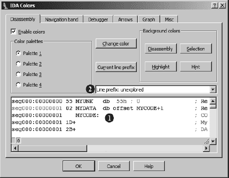
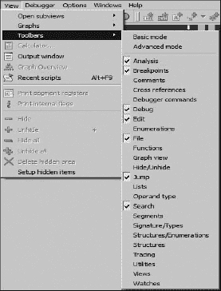
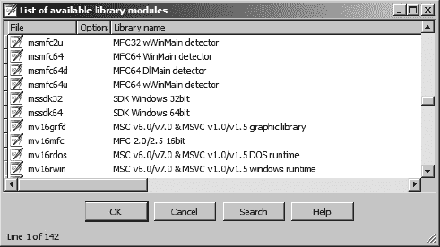
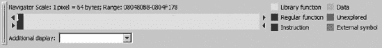
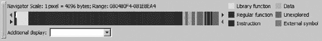
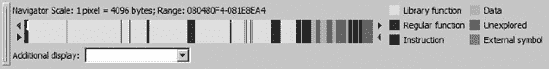
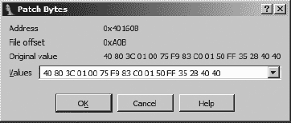
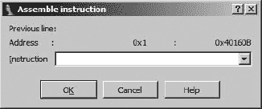
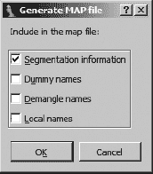

# 第三部分. 高级 IDA 使用

# 第十一章. 定制 IDA


在使用 IDA 一段时间后，你可能已经开发了一些你希望每次打开新数据库时都作为默认设置的偏好设置。你更改的一些选项可能已经从会话传递到会话，而其他选项似乎每次加载新数据库时都需要重置。在本章中，我们将探讨你可以通过配置文件和菜单访问的选项来修改 IDA 行为的各种方式。我们还将检查 IDA 存储各种配置设置的位置，并讨论数据库特定设置和全局设置之间的差异。

# 配置文件

IDA 的大部分默认行为由各种配置文件中的设置控制。大部分配置文件存储在*<IDADIR>/cfg*目录中，一个值得注意的例外是插件配置文件，它位于*<IDADIR>/plugins/plugins.cfg*（*plugins.cfg*将在第十七章中介绍）。虽然你可能注意到主配置目录中有许多文件，但大多数文件是由处理器模块使用的，并且仅在分析特定 CPU 类型时适用。三个主要的配置文件是*ida.cfg*、*idagui.cfg*和*idatui.cfg*。适用于 IDA 所有版本的选项通常可以在*ida.cfg*中找到，而*idagui.cfg*和*idatui.cfg*分别包含针对 GUI 版本和文本模式版本的 IDA 的特定选项。

## 主要配置文件：ida.cfg

IDA 的主要配置文件是*ida.cfg*。在启动过程的早期，该文件被读取以分配各种文件扩展名的默认处理器类型，并调整 IDA 的内存使用参数。一旦指定了处理器类型，文件就会被第二次读取以处理额外的配置选项。*ida.cfg*中包含的选项适用于 IDA 的所有版本，无论使用的是哪种用户界面。

在*ida.cfg*中值得关注的一般选项包括内存调整参数（`VPAGESIZE`）、是否创建备份文件（`CREATE_BACKUPS`）以及外部图形查看器的名称（`GRAPH_VISUALIZER`）。

有时在处理非常大的输入字段时，IDA 可能会报告没有足够的内存来创建新的数据库。在这种情况下，增加`VPAGESIZE`然后重新打开输入文件通常足以解决问题。

许多控制反汇编行格式的选项也包含在 *ida.cfg* 文件中，包括通过“选项”▸“常规”可访问的许多选项的默认值。这些包括显示的指令字节数的默认值（`OPCODE_BYTES`）、指令应缩进的距离（`INDENTATION`）、是否应显示每个指令的堆栈指针偏移（`SHOW_SP`），以及与反汇编行一起显示的最大交叉引用数（`SHOW_XREFS`）。其他选项控制图形模式下的反汇编行格式。

全局选项指定了命名程序位置（与堆栈变量相对）的最大名称长度，该选项包含在 *ida.cfg* 文件中，并称为 `MAX_NAMES_LENGTH`。此选项默认为 15 个字符，当您输入的名称超过当前限制时，IDA 会生成一个警告信息。默认长度保持较小，因为一些汇编器无法处理超过 15 个字符的名称。如果您不打算将 IDA 生成的反汇编代码再次通过汇编器运行，那么您可以安全地提高此限制。

用户分配的名称中允许使用的字符列表受 `NameChars` 选项控制。默认情况下，此列表允许字母数字字符和四个特殊字符 `_$?@`。如果您在为位置或堆栈变量分配新名称时遇到 IDA 对您希望使用的字符的抱怨，那么您可能需要向 `NameChars` 集合中添加额外的字符。例如，如果您想使点 (`.`) 字符在 IDA 名称中使用合法，则需要修改 `NameChars` 选项。您应避免在名称中使用分号、冒号、逗号和空格字符，因为这些字符可能会引起混淆，因为这些字符通常被认为是各种反汇编行部分的分隔符。

最后两个值得注意的选项会影响 IDA 解析 C 头文件时的行为（参见第八章）。`C_HEADER_PATH` 选项指定了 IDA 将搜索以解决 `#include` 依赖的目录列表。默认情况下，列出了 Microsoft Visual Studio 常用的目录。如果您使用不同的编译器或您的 C 头文件位于非标准位置，您应该考虑编辑此选项。`C_PREDEFINED_MACROS` 选项可以用来指定 IDA 将无论是否在解析 C 头文件时遇到它们，都将包含的默认预处理器宏列表。此选项提供了一种有限的解决方案，用于处理可能定义在您无法访问的头文件中的宏。

*ida.cfg*的第二部分包含针对各种处理器模块的特定选项。此文件部分中可用的唯一文档是以注释的形式（如果有）与每个选项相关联。在*ida.cfg*中指定的处理器特定选项通常决定了 IDA 初始文件加载对话框中`处理器选项`部分的默认设置。

处理*ida.cfg*的最后一步是搜索一个名为*<IDADIR>/cfg/idauser.cfg*的文件。如果存在，^([72))，则该文件被视为*ida.cfg*的扩展，文件中的任何选项都将覆盖*ida.cfg*中的相应选项。如果您不习惯编辑*ida.cfg*，则应创建*idauser.cfg*并将您希望覆盖的所有选项添加到其中。此外，*idauser.cfg*提供了将自定义选项从一个 IDA 版本转移到另一个版本的最简单方法。例如，使用*idauser.cfg*，您每次升级 IDA 副本时无需重新编辑*ida.cfg*。相反，只需在升级时将现有的*idauser.cfg*复制到新的 IDA 安装目录即可。

## GUI 配置文件：idagui.cfg

专门针对 IDA GUI 版本的配置项位于它们自己的文件中：*<IDADIR>/cfg/idagui.cfg*。此文件大致分为三个部分：默认 GUI 行为、键盘热键映射以及文件扩展配置（用于文件▸打开对话框）。在本节中，我们将讨论一些更有趣的选项。有关完整选项列表，请参阅*idagui.cfg*，其中大多数选项都附有描述其目的的注释。

IDA 的 Windows GUI 版本允许使用`HELPFILE`选项指定一个辅助帮助文件。在此处指定的任何文件都不会替换 IDA 的主帮助文件。此选项的预期目的是提供可能适用于特定逆向工程情况的相关补充信息。当指定了补充帮助文件时，按 Ctrl-F1 将导致 IDA 打开指定的文件并搜索与光标下单词匹配的主题。如果没有找到匹配项，则将您带到帮助文件的索引。例如，除非您计算自动注释，否则 IDA 不会提供有关反汇编中指令助记符的任何帮助信息。如果您正在分析 x86 二进制文件，您可能希望在命令行上有一个 x86 指令参考。如果您能找到一个恰好包含每个 x86 指令主题的帮助文件，^([73))，那么任何指令的帮助信息都只需一个热键即可获得。关于补充帮助文件的唯一注意事项是，IDA 仅支持较旧的 WinHelp 风格帮助文件 (*.hlp*)。IDA 不支持作为辅助帮助文件使用编译的 HTML 帮助文件 (*.chm*)。

### 注意

Microsoft Windows Vista 及以后的版本不提供对 32 位 WinHelp 文件的本地支持，因为 *WinHlp32.exe* 文件不随这些操作系统一起提供。有关更多信息，请参阅 Microsoft 知识库文章 917607^([74])。

关于使用 IDA 常见的问题之一是：“我如何使用 IDA 修补二进制文件？” 简而言之，答案是“你不能”，但我们将在 第十四章 中推迟讨论这个问题的细节。你可以用 IDA 修补数据库来修改指令或数据，几乎可以按照你想要的方式。一旦我们讨论了脚本（第十五章 中讨论。

你 IDA 工作区底部的单行输入框被称为 IDA 命令行。你可以使用 `DISPLAY_COMMAND_LINE` 选项来控制是否显示此字段。默认情况下，命令将被显示。如果你屏幕空间紧张，并且你预计不需要输入单行脚本，那么关闭此功能可以帮助你在 IDA 显示中恢复一小部分空间。请注意，此命令行不允许你像在命令提示符中输入一样执行操作系统命令。

*idagui.cfg* 的热键配置部分用于指定 IDA 动作与热键序列之间的映射。在许多情况下，热键重新分配很有用，包括通过热键提供额外的命令、将默认序列更改为更容易记忆的序列，或者更改可能与操作系统或您的终端应用程序使用的其他序列冲突的序列（主要适用于 IDA 的控制台版本）。

几乎所有 IDA 通过菜单项或工具栏按钮提供的选项都列在本节中。不幸的是，命令的名称往往不与 IDA 菜单上使用的文本相匹配，因此可能需要一些努力来确定确切的配置文件选项映射到特定的菜单选项。例如，跳转 ▸ 跳转到问题的命令等同于 *idagui.cfg* 中的 `JumpQ` 选项（该选项恰好与其热键：ctrl-Q 相匹配）。此外，虽然许多命令都有匹配的注释来描述其目的，但许多命令完全没有描述，因此你必须根据配置文件中的名称来确定命令的行为。一个可能有助于你弄清楚配置文件动作与哪个菜单项相关联的技巧是在 IDA 的帮助系统中搜索该动作。此类搜索的结果通常会导致描述动作对应菜单项的描述。

以下几行展示了 *idagui.cfg* 中的示例热键分配。

```
"Abort"                =      0               // Abort IDA, don't save changes
"Quit"                 =      "Alt-X"         // Quit to DOS, save changes
```

第一行是 IDA 的 `Abort` 命令的热键分配，在这种情况下没有分配热键。未引用的值 `0` 表示没有为命令分配热键。第二行显示了 IDA 的 `Quit` 动作的热键分配。热键序列指定为一个命名键序列的引号字符串。*idagui.cfg* 中存在许多热键分配的示例。

*idagui.cfg* 文件的最后一部分将文件类型描述与其关联的文件扩展名相联系，并指定了哪些文件类型将在文件 ▸ 打开对话框中的“文件类型”下拉列表中列出。配置文件中已经描述了大量的文件类型；然而，如果你经常使用配置文件中没有的文件类型，你可能需要编辑文件类型列表，将你的文件类型添加到列表中。`FILE_EXTENSIONS` 选项描述了 IDA 所知的所有文件关联。以下是一般文件类型关联的示例。

```
CLASS_JAVA,  "Java Class Files",                           "*.cla*;*.cls"
```

该行包含三个以逗号分隔的组件：关联的名称（`CLASS_JAVA`）、描述和文件名模式。文件名模式中允许使用通配符，并且可以通过分号分隔来指定多个模式。第二种类型的文件关联允许将几个现有的关联组合成一个单独的分类。例如，以下行将所有名称以 `EXE_` 开头的关联组合成一个名为 `EXE` 的单个关联。

```
EXE,         "Executable Files",                           EXE_*
```

注意，在这种情况下，模式指定符没有被引号括起来。我们可以定义自己的文件关联如下：

```
IDA_BOOK,    "Ida Book Files",                             "*.book"
```

我们可以为关联选择任何我们喜欢的名称，只要它尚未被使用；然而，仅仅将新的关联添加到 `FILE_EXTENSIONS` 列表中并不足以使该关联出现在文件 ▸ 打开对话框中。`DEFAULT_FILE_FILTER` 选项列出了将在文件 ▸ 打开对话框中出现的所有关联的名称。为了完成此过程并使我们的新关联可用，我们需要将 `IDA_BOOK` 添加到 `DEFAULT_FILE_FILTER` 列表中。

与 *idauser.cfg* 文件类似，*idagui.cfg* 中的最后一行包含一个指令，用于包含一个名为 *<IDADIR>/cfg/idauserg.cfg* 的文件。如果您不习惯编辑 *idagui.cfg*，那么您应该创建 *idauserg.cfg* 并添加您希望覆盖的所有选项。

## 控制台配置文件：idatui.cfg

对于 IDA 控制台版本的用户来说，*idatui.cfg* 是 *idagui.cfg* 的对应文件。这个文件在布局和功能上与 *idagui.cfg* 非常相似。在众多方面中，热键的指定方式与 *idagui.cfg* 中完全相同。由于这两个文件非常相似，我们在这里只详细说明它们之间的差异。

首先，`DISPLAY_PATCH_SUBMENU` 和 `DISPLAY_COMMAND_LINE` 选项在控制台版本中不可用，并且不包括在 *idatui.cfg* 中。控制台版本中使用的文件 ▸ 打开对话框比 GUI 版本中使用的对话框简单得多，因此 *idagui.cfg* 中可用的所有文件关联命令在 *idatui.cfg* 中都缺失。

另一方面，一些选项仅适用于 IDA 的控制台版本。例如，您可以使用 `NOVICE` 选项让 IDA 以初学者模式启动，在这种模式下，它会禁用一些更复杂的功能，以便更容易学习。初学者模式的一个显著区别是几乎完全缺乏子视图。

控制台用户更有可能依赖于热键序列的使用。为了便于自动化常见的热键序列，控制台模式的 IDA 提供了键盘宏定义语法。在 *idatui.cfg* 中可以找到几个示例宏；然而，放置您开发的任何宏的理想位置是 *<IDADIR>/cfg/idausert.cfg*（*idauserg.cfg* 的控制台版本）。默认 *idatui.cfg* 中包含的一个示例宏可能看起来如下（在实际的 *idatui.cfg* 中，此宏已被注释掉）：

```
 MACRO   "Alt-H"        // this sample macro jumps to "start" label
  {
          "G"
          's' 't' 'a' 'r', 't'
          "Enter"
  }
```

`宏`定义通过`MACRO`关键字引入，后跟要关联的快捷键 ，宏序列本身在花括号中指定，为键名字符串或字符的序列，这些键名字符串或字符本身也可以代表快捷键序列。前一个示例宏，通过按 alt-H 激活，使用 G 快捷键打开转到地址对话框，逐个字符地将标签*start*输入到对话框中，然后使用回车键关闭对话框。请注意，我们不能使用“start”语法来输入符号名称，因为这将被视为快捷键名称并导致错误。

### 注意

宏和初学者模式在 IDA 的 GUI 版本中不可用。

关于配置文件选项的最后一项说明，重要的是要知道，如果 IDA 在解析配置文件时遇到任何错误，它会立即终止并显示错误消息，尝试描述问题的性质。只有在错误条件被纠正后，才能启动 IDA。

* * *

^([72]) 此文件不随 IDA 一起提供。如果用户希望 IDA 能够找到它，他们必须自己生成此文件。

^([73]) Pedram Amini 对这个 WinHelp32 文件深信不疑：[`pedram.redhive.com/openrce/opcodes.hlp`](http://pedram.redhive.com/openrce/opcodes.hlp)。

^([74]) 请参阅 [`support.microsoft.com/kb/917607`](http://support.microsoft.com/kb/917607)。

# IDA 的其他配置选项

IDA 有大量的其他选项，必须通过 IDA 用户界面进行配置。在第七章（第 7.反汇编操作）中讨论了格式化单个反汇编行的选项。通过选项菜单可以访问额外的 IDA 选项，在大多数情况下，您修改的任何选项仅适用于当前打开的数据库。这些选项的值在关闭数据库时存储在相关的数据库文件中。IDA 的颜色（选项 ▸ 颜色）和字体（选项 ▸ 字体）选项是此规则的例外，因为它们是全局选项，一旦设置，在所有未来的 IDA 会话中都将保持有效。对于 IDA 的 Windows 版本，选项值存储在 Windows 注册表中的`HKEY_CURRENT_USER\Software\Hex-Rays\IDA`注册表键下。对于非 Windows 版本的 IDA，这些值存储在您的家目录中，以名为`$HOME/.idapro/ida.reg`的专有格式文件中。

在注册表中保存的另一条信息是你可以选择“不再显示此对话框”选项的对话框。此消息偶尔以复选框的形式出现在某些你可能不想在未来看到的 informational message dialogs 的右下角。如果你选择此选项，将在 `HKEY_CURRENT_USER\Software\Hex-Rays\IDA\Hidden Messages` 注册键下创建一个注册表值。如果在以后的时间你想再次显示隐藏的对话框，你需要删除此注册键下的相应值。

## IDA 颜色

IDA 显示中几乎每个项目的颜色都可以通过 图 11-1 中显示的“选项 ▸ 颜色”对话框进行自定义。



图 11-1. 颜色选择对话框

解码标签页控制解码窗口中每行各个部分的颜色。解码窗口中可以出现的文本类型示例在示例窗口中给出 。当你选择示例窗口中的某个项目时，该项目类型会在  中列出。使用更改颜色按钮，你可以将任何你希望的颜色分配给任何你希望的项目。

颜色选择对话框包含用于分配导航栏、调试器、文本解码视图左侧边距中的跳转箭头以及图形视图中各种组件颜色的标签页。具体来说，图形标签页控制图形节点的着色、它们的标题栏以及连接每个节点的边，而解码标签页控制图形视图中解码文本的着色。杂项标签页允许自定义 IDA 消息窗口中使用的颜色。

## 自定义 IDA 工具栏

除了菜单和快捷键之外，IDA 的 GUI 版本提供了超过二十多个工具栏上的大量工具栏按钮。工具栏通常停靠在 IDA 菜单栏下方的工具栏区域。使用“查看 ▸ 工具栏”菜单可以访问两个预定义的工具栏布局：基本模式，它启用了 IDA 的七个工具栏，以及高级模式，它启用了所有 IDA 工具栏。可以单独拆分、拖动和重新定位工具栏到屏幕上的任何位置以适应个人喜好。如果你发现你不需要特定的工具栏，你可以通过“查看 ▸ 工具栏”菜单将其从显示中完全删除，该菜单在 图 11-2 中显示。

此菜单也会在你在 IDA 显示的停靠区域内任何位置右键单击时出现。关闭主工具栏将从停靠区域移除所有工具栏，这在需要最大化分配给反汇编窗口的屏幕空间时很有用。你对工具栏布局所做的任何更改都将与当前数据库一起保存。打开第二个数据库将恢复到在第二个数据库上次保存时生效的工具栏布局。打开新的二进制文件以创建新的数据库将恢复基于 IDA 当前默认工具栏设置的工具栏布局。



图 11-2. 工具栏配置菜单

如果你选择了一个你喜欢的工具栏布局并希望将其设置为默认，那么你应该使用 Windows ▸ 保存桌面来保存当前的桌面布局为默认桌面，这将打开显示在图 11-3 中的对话框。


图 11-3. 保存反汇编桌面对话框

每次你保存桌面配置时，都会要求你为该配置提供一个名称。当选择默认复选框时，当前桌面布局将成为所有新数据库的默认布局，以及如果你选择 Windows ▸ 重置桌面将返回的桌面。要恢复到你的自定义桌面之一，选择**Windows** ▸ **加载桌面**并选择你希望加载的命名布局。保存和恢复桌面在涉及使用不同尺寸和/或分辨率的多个显示器的情况下特别有用（这在使用不同坞站或连接到投影仪进行演示的笔记本电脑中可能很常见）。

# 摘要

当你刚开始使用 IDA 时，你可能会对它的默认行为和默认 GUI 布局感到非常满意。随着你对 IDA 的基本功能越来越熟悉，你一定会找到将 IDA 定制到你个人喜好的方法。虽然无法在一个章节中提供 IDA 提供的每个可能选项的完整覆盖，但我们已经尝试提供指向那些选项可能被找到的主要位置的指针。我们还尝试突出显示那些你可能在 IDA 体验的某个时刻想要操作的最有可能的选项。发现更多有用的选项留作好奇读者的探索任务。

# 第十二章。使用 FLIRT 签名进行库识别


到此，是时候开始超越 IDA 更明显的功能，并开始探索“初始自动分析完成后”要做的事情了^([75))。在本章中，我们讨论了识别标准代码序列的技术，例如静态链接二进制文件中包含的库代码或编译器插入的标准初始化和辅助函数。

当你开始逆向工程任何二进制文件时，你最不想做的事情就是浪费时间逆向工程那些你可以通过阅读手册页、阅读一些源代码或进行一点网络研究就能轻易了解其行为的库函数。静态链接二进制文件所提出的挑战在于它们模糊了应用程序代码和库代码之间的区别。在静态链接的二进制文件中，整个库与应用程序代码结合形成一个单一的庞大可执行文件。幸运的是，我们有可用的工具，使 IDA 能够识别并标记库代码，从而让我们将注意力集中在应用程序中的独特代码上。

# 快速库识别和识别技术

快速库识别和识别技术，更广为人知的是 FLIRT^([76))，它包括 IDA 用来识别代码序列作为库代码所采用的一系列技术。FLIRT 的核心是模式匹配算法，它使 IDA 能够快速确定反汇编的函数是否与 IDA 已知的许多签名之一相匹配。《<IDADIR>/sig》目录包含与 IDA 一起提供的签名文件。大多数情况下，这些是随常见 Windows 编译器一起提供的库，尽管也包括一些非 Windows 签名。

签名文件使用一种自定义格式，其中大部分签名数据被压缩并包裹在一个 IDA 特定的头部中。在大多数情况下，签名文件的名称并不清楚地表明与之关联的签名是从哪个库生成的。根据它们的创建方式，签名文件可能包含一个库名称注释，描述其内容。如果我们查看从签名文件中提取的前几行 ASCII 内容，这个注释通常会被揭示出来。以下 Unix 风格的命令^([77)) 通常会在输出的第二行或第三行中揭示注释：

```
# strings *`sigfile`* | head -n 3
```

在 IDA 中，有两种方式可以查看与签名文件关联的注释。首先，你可以通过“查看”▸“打开子视图”▸“签名”访问应用于二进制文件的签名列表。其次，所有签名文件的列表作为手动签名应用过程的一部分显示，该过程通过“文件”▸“加载文件”▸“FLIRT 签名文件”启动。

* * *

^([75]) 当 IDA 完成对新加载的二进制文件的自动处理时，它会在输出窗口生成此消息。

^([76]) 请参阅[`www.hex-rays.com/idapro/flirt.htm`](http://www.hex-rays.com/idapro/flirt.htm)。

^([77]) 在第二章中讨论了`strings`命令，而`head`命令用于仅查看其输入源的最初几行（例如示例中的三行）。

# 应用 FLIRT 签名

当首次打开二进制文件时，IDA 会尝试将特殊签名文件应用于二进制文件的入口点，这些签名文件被称为启动签名。结果证明，由各种编译器生成的入口点代码足够独特，匹配入口点签名是识别可能用于生成给定二进制文件的编译器的一种有用技术。

MAIN VS. _START

回想一下，程序的人口点是第一条将要执行的指令的地址。许多长期从事 C 语言编程的开发者错误地认为这是名为`main`的函数的地址，而实际上并非如此。程序的文件类型，*而不是*创建程序所使用的语言，决定了向程序提供命令行参数的方式。为了解决加载器呈现命令行参数的方式与程序期望接收它们的方式（例如通过`main`的参数）之间的任何差异，必须在将控制权传递给`main`之前执行一些初始化代码。IDA 将此初始化指定为程序的入口点，并标记为`_start`。

此初始化代码还负责在允许`main`运行之前必须执行的所有初始化任务。在 C++程序中，此代码负责确保在执行`main`之前调用全局声明的对象的构造函数。同样，在`main`完成后插入清理代码，以便在程序实际终止之前调用所有全局对象的析构函数。

如果 IDA 识别出用于创建特定二进制的编译器，那么相应的编译器库的签名文件将被加载并应用于二进制的其余部分。IDA 随附的签名通常与专有编译器相关，例如 Microsoft Visual C++ 或 Borland Delphi。背后的原因是这些编译器随附的二进制库数量是有限的。对于开源编译器，如 GNU gcc，相关库的二进制变体数量与编译器支持的操作系统数量一样多。例如，FreeBSD 的每个版本都附带一个独特的 C 标准库版本。为了进行最佳模式匹配，需要为库的每个版本生成签名文件。考虑收集每个 Linux 发行版中每个版本所附带的 *libc.a*^([78]) 的所有变体是多么困难。这根本不切实际。部分差异是由于库源代码的变化导致的编译代码不同，但巨大的差异也源于不同的编译选项的使用，例如优化设置和使用不同的编译器版本来构建库。最终结果是，IDA 为开源编译器库提供的签名文件非常少。好消息，正如你很快就会看到的，是 Hex-Rays 提供了工具，允许你从静态库中生成自己的签名文件。

那么，在什么情况下你可能需要手动将签名应用于你的数据库之一？偶尔 IDA 正确识别出构建二进制的编译器，但没有相关编译器库的签名。在这种情况下，你可能需要没有签名地生活，或者你需要获取二进制中使用的静态库的副本并生成自己的签名。有时，IDA 可能简单地无法识别编译器，这使得确定应应用于数据库的签名变得不可能。这在分析混淆代码时很常见，其中启动例程被充分混淆，以至于无法识别编译器。因此，首先需要做的是在有任何希望匹配库签名之前，足够地去除二进制的混淆。我们将在 第二十一章 中讨论处理混淆代码的技术。

无论出于什么原因，如果你希望手动将签名应用于数据库，你可以通过 File ▸ Load File ▸ FLIRT Signature File 来完成，这将打开显示在 图 12-1 中的签名选择对话框。



图 12-1. FLIRT 签名选择

文件列反映了 IDA 的 *<IDADIR>/sig* 目录中每个 *.sig* 文件的名字。请注意，没有方法可以指定 *.sig* 文件的替代位置。如果您生成自己的签名，它们需要与每个其他的 *.sig* 文件一起放入 *<IDADIR>/sig* 目录中。库名称列显示每个文件中嵌入的库名称注释。请记住，这些注释的描述性仅取决于签名创建者（这可能是您自己！）选择的程度。

当选择库模块时，对应 *.sig* 文件中包含的签名会被加载并与数据库中的每个函数进行比较。一次只能应用一组签名，因此如果您想对一个数据库应用多个不同的签名文件，您需要重复此过程。当找到一个与签名匹配的函数时，该函数会被标记为库函数，并且根据匹配到的签名自动重命名。

### 警告

只有使用 IDA 虚拟名称命名的函数才能自动重命名。换句话说，如果您已经重命名了一个函数，并且该函数后来与一个签名匹配，那么该函数不会因为匹配而重命名。因此，在分析过程的早期尽可能早地应用签名对您是有益的。

回想一下，静态链接的二进制模糊了应用程序代码和库代码之间的区别。如果您有幸拥有一个没有符号剥离的静态链接二进制文件，您至少会有有用的函数名（如可信的程序员选择创建的那样）来帮助您在代码中导航。然而，如果二进制文件已被剥离，您可能会有一百多个函数，所有这些函数都有 IDA 生成的名称，这些名称无法表明函数的功能。在这两种情况下，只有当有签名可用时，IDA 才能识别库函数（未剥离的二进制文件中的函数名称不提供足够的信息让 IDA 确定性地将函数识别为库函数）。图 12-2 显示了静态链接二进制的概览导航器。


图 12-2. 没有签名的静态链接

在这个显示中，没有识别出库函数，因此您可能会发现自己需要分析比实际需要的更多代码。在应用适当的签名集后，概览导航器会像图 12-3 所示那样转换。



图 12-3. 应用了签名的静态链接二进制

如你所见，Overview Navigator 提供了特定一组签名有效性的最佳指示。当匹配的签名比例很大时，大量代码将被标记为库代码并相应地重命名。在图 12-3 的例子中，实际的应用特定代码很可能集中在 navigator 显示的左侧远端部分。

在应用签名时有两个要点值得记住。首先，即使在与未剥离的二进制文件一起工作时，签名也是有用的，在这种情况下，你使用签名更多的是帮助 IDA 识别库函数，而不是重命名这些函数。其次，静态链接的二进制文件可能由几个独立的库组成，需要应用几组签名才能完全识别所有库函数。随着每次额外的签名应用，Overview Navigator 的更多部分将被转换以反映库代码的发现。图 12-4 显示了这样一个例子。在这个图中，你可以看到一个静态链接了 C 标准库和 OpenSSL^([79])加密库的二进制文件。



图 12-4. 应用了第一个几个签名后的静态二进制

具体来说，你可以看到在为该应用程序中使用的 OpenSSL 版本应用适当的签名后，IDA 标记了一个小带（地址范围的左侧较亮的带）为库代码。静态链接的二进制文件通常是通过首先取应用程序代码，然后附加所需的库来创建结果的可执行文件。根据这个图，我们可以得出结论，OpenSSL 库右侧的内存空间很可能被额外的库代码占用，而应用程序代码最有可能位于 OpenSSL 库左侧非常狭窄的带中。如果我们继续对图 12-4 中显示的二进制文件应用签名，我们最终会到达图 12-5 的显示。



图 12-5. 应用了几个签名后的静态二进制

在这个例子中，我们为 *libc*、*libcrypto*、*libkrb5*、*libresolv* 以及其他库应用了签名。在某些情况下，我们根据二进制文件中的字符串选择签名；在其他情况下，我们根据它们与二进制文件中已存在的其他库的紧密关系选择签名。结果显示在导航带中间仍然有一个深色带，在导航带最左边的边缘有一个较小的深色带。需要进一步分析以确定这些剩余的非库部分的二进制文件性质。在这种情况下，我们会发现中间较宽的深色带是某个未识别库的一部分，而左边的深色带是应用程序代码。

* * *

^([78]) *libc.a* 是在 Unix 风格系统上用于静态链接二进制文件的 C 标准库版本。

^([79]) 请参阅 [`www.openssl.org/`](http://www.openssl.org/).

# 创建 FLIRT 签名文件

正如我们之前讨论的，对于 IDA 来说，为现有的每个静态库提供签名文件是不切实际的。为了向 IDA 用户提供创建他们自己的签名所需的工具和信息，Hex-Rays 分发了快速库获取识别工具集 (FLAIR)。FLAIR 工具对授权客户在 IDA 分发 CD 上或通过 Hex-Rays 网站下载提供^([80])。像其他几个 IDA 扩展一样，FLAIR 工具以 Zip 文件的形式分发。Hex-Rays 并不一定在每个 IDA 版本中都发布 FLAIR 工具的新版本，因此您应该使用不超过您 IDA 版本的最新 FLAIR 版本。

FLAIR 工具的安装只需提取相关 Zip 文件的文件内容即可，尽管我们强烈建议您创建一个专门的 *flair* 目录作为目标，因为 Zip 文件没有组织成顶层目录。在 FLAIR 分发中，您将找到几个构成 FLAIR 工具文档的文本文件。特别感兴趣的文件包括这些：

**readme.txt**

这是对签名创建过程的顶层概述。

**plb.txt**

此文件描述了静态库解析器 *plb.exe* 的使用。库解析器在 创建模式文件 中有更详细的讨论。

**pat.txt**

此文件详细说明了模式文件的格式，它是签名创建过程的第一步。模式文件也在 创建模式文件 中有描述。

**sigmake.txt**

此文件描述了使用`*sigmake.exe*`从模式文件生成`*.sig`文件的使用方法。请参阅创建签名文件以获取更多详细信息。

其他值得注意的顶级内容包括`*bin*`目录，其中包含所有 FLAIR 工具的可执行文件，以及`*startup*`目录，其中包含与各种编译器及其相关输出文件类型（PE、ELF 等）相关联的常见启动序列的模式文件。在版本 6.1 之前，FLAIR 工具区域仅适用于 Windows；然而，生成的签名文件可以与所有 IDA 变体（Windows、Linux 和 OS X）一起使用。

## 签名创建概述

创建签名文件的基过程似乎并不复杂，因为它归结为四个听起来简单的步骤。

1.  获取你希望为其创建签名文件的静态库的副本。

1.  利用 FLAIR 解析器之一为库创建一个模式文件。

1.  运行`*sigmake.exe*`来处理生成的模式文件并生成签名文件。

1.  通过将其复制到`*<IDADIR>/sig*`来在 IDA 中安装新的签名文件。

不幸的是，在实践中，只有最后一步像听起来那么简单。在接下来的几节中，我们将更详细地讨论前三个步骤。

## 识别和获取静态库

签名生成过程的第一步是找到你希望为其生成签名的静态库的副本。这可能会因为各种原因而带来一些挑战。第一个障碍是确定你实际上需要哪个库。如果你正在分析的二进制文件尚未去符号，你可能很幸运，在反汇编中实际有函数名可用，在这种情况下，网络搜索可能会提供几个可能的候选者的线索。

去掉符号的二进制文件在提供其来源方面并不十分乐意。由于缺少函数名，你可能发现一个好的`strings`搜索可以产生足够独特的字符串，从而允许进行库识别，例如以下内容，这是一个明显的线索：

```
OpenSSL 1.0.0b-fips 16 Nov 2010
```

版权声明和错误字符串通常足够独特，因此你还可以使用网络搜索来缩小候选者范围。如果你选择从命令行运行`strings`，请记住使用`-a`选项强制`strings`扫描整个二进制文件；否则，你可能会错过一些可能有用的字符串数据。

对于开源库，你可能会发现源代码很容易获得。不幸的是，虽然源代码可能有助于你理解二进制文件的行为，但你不能用它来生成你的签名。可能可以使用源代码构建你自己的静态库版本，然后在该版本中用于签名生成过程。然而，很可能会在构建过程中的变化导致生成的库与你要分析的库之间有足够的不同，以至于你生成的任何签名都不会非常准确。

最佳选项是尝试确定所讨论的二进制文件的精确来源。我们这里指的是确切的操作系统、操作系统版本和发行版（如果适用）。有了这些信息，创建签名的最佳选项是从一个配置相同的系统中复制相关的库。自然地，这导致下一个挑战：给定一个任意的二进制文件，它在什么系统上创建的？一个很好的第一步是使用`file`实用程序来获取有关所讨论的二进制文件的一些初步信息。在第二章中，我们看到了`file`的一些示例输出。在几个案例中，这个输出足以提供可能的候选系统。以下是从`file`输出的一个非常具体的例子：

```
$ `file sample_file_1`
sample_file_1: ELF 32-bit LSB executable, Intel 80386, version 1 (FreeBSD),
statically linked, for FreeBSD 8.0 (800107), stripped
```

在这种情况下，我们可能会直接转向一个 FreeBSD 8.0 系统，并首先追踪*libc.a*。然而，以下例子有些模糊不清：

```
$ `file sample_file_2`
sample_file_2: ELF 32-bit LSB executable, Intel 80386, version 1 (GNU/Linux),
statically linked, for GNU/Linux 2.6.32, stripped
```

我们似乎已经缩小了文件的来源到一个 Linux 系统，考虑到有大量的 Linux 发行版，这并没有说太多。转向`strings`，我们发现以下内容：

```
GCC: (GNU) 4.5.1 20100924 (Red Hat 4.5.1-4)
```

在这里，搜索已经缩小到带有 gcc 版本 4.5.1 的 Red Hat 发行版（或衍生版）。在用 gcc 编译的二进制文件中，这样的 GCC 标签并不罕见，而且幸运的是，它们在剥离过程中幸存下来，并且对`strings`可见。

请记住，`file`实用程序并不是文件识别的全部。以下输出演示了一个简单的情况，其中`file`似乎知道正在检查的文件类型，但输出相当不具体。

```
$ `file sample_file_3`
sample_file_3: ELF 32-bit LSB executable, Intel 80386, version 1 (SYSV),
dynamically linked (uses shared libs), stripped
```

这个例子是从一个 Solaris 10 x86 系统取出的。在这里，`strings`实用程序可能有助于确定这一事实。

## 创建模式文件

在这个阶段，你应该已经有一到多个库，你希望为它们创建签名。下一步是为每个库创建一个模式文件。模式文件是通过使用适当的 FLAIR 解析器工具创建的。与可执行文件一样，库文件是根据各种文件格式规范构建的。FLAIR 为几种流行的库文件格式提供了解析器。正如 FLAIR 的*readme.txt*文件中详细说明的，以下解析器可以在 FLAIR 的*bin*目录中找到：

**plb.exe/plb**

OMF 库解析器（通常由 Borland 编译器使用）

**pcf.exe/pcf**

COFF 库解析器（通常由 Microsoft 编译器使用）

**pelf.exe/pelf**

ELF 库解析器（在许多 Unix 系统上找到）

**ppsx.exe/ppsx**

Sony PlayStation PSX 库解析器

**ptmobj.exe/ptmobj**

TriMedia 库解析器

**pomf166.exe/pomf166**

Kiel OMF 166 对象文件解析器

要为给定的库创建一个模式文件，请指定与库格式相对应的解析器、您希望解析的库的名称以及应生成的结果模式文件的名称。对于来自 FreeBSD 8.0 系统的 *libc.a* 的副本，您可能使用以下命令：

```
$ `./pelf libc.a libc_FreeBSD80.pat`
libc.a: skipped 1, total 1089
```

在这里，解析器报告了解析的文件（*libc.a*）、跳过的函数数量（1）^([81）和生成的签名模式数量（1089）。每个解析器接受一组略有不同的命令行选项，这些选项仅在解析器的用法说明中进行了文档化。不带参数执行解析器将显示该解析器接受的命令行选项列表。*plb.txt* 文件包含有关 *plb* 解析器接受的选项的更详细信息。该文件是很好的基本信息来源，因为其他解析器也接受其中描述的许多选项。在许多情况下，只需指定要解析的库和要生成的模式文件就足够了。

模式文件是一个文本文件，其中每行包含一个表示解析库中函数的提取模式。以下展示了之前创建的模式文件中的几行：

```
57568B7C240C8B742410FC8B4C2414C1E902F3A775108B4C241483E10
3F3A675 1E A55D 003E :0000 _memcmp
0FBC442404740340C39031C0C3...................................... 00
 0000 000D :0000 _ffs
57538B7C240C8B4C2410FC31C083F90F7E1B89FAF7DA83E20389CB29D389D1F3
 12 9E31 0032 :0000 _bzero
```

单个模式的格式在 FLAIR 的 *pat.txt* 文件中描述。简而言之，模式的第一个部分列出了函数的初始字节序列，最多 32 字节。考虑到由于重定位条目而可能变化的字节，这些字节使用两个点表示。当函数小于 32 字节（如前代码中的 `_ffs`）时，也使用点来填充模式至 64 个字符^([82])。在最初的 32 字节之后，记录了额外的信息，以在签名匹配过程中提供更高的精度。编码到每个模式行中的额外信息包括对函数部分计算出的 CRC16^([83]) 值、函数的字节数以及函数引用的符号名称列表。一般来说，引用许多其他符号的较长的函数会产生更复杂的模式行。在之前生成的 *libc_FreeBSD80.pat* 文件中，一些模式行的长度超过 20,000 个字符。

几位第三方程序员创建了旨在从现有的 IDA 数据库生成模式的工具。其中之一是 IDB_2_PAT，^([84])，这是一个由 J.C. Roberts 编写的 IDA 插件，能够从现有数据库中为一个或多个函数生成模式。如果你预计将在其他数据库中遇到类似的代码，但没有访问创建被分析二进制文件的原版库文件的权限，这类工具非常有用。

## 创建签名文件

一旦为某个库创建了一个模式文件，签名创建过程的下一步就是生成一个适合与 IDA 一起使用的 *.sig* 文件。IDA 签名文件的格式与模式文件有显著不同。签名文件使用一种专有二进制格式，旨在最小化表示模式文件中所有信息的空间需求，并允许对签名与实际数据库内容进行高效匹配。关于签名文件结构的详细描述可在 Hex-Rays 网站上找到.^([85])

FLAIR 的 *sigmake* 工具用于从模式文件创建签名文件。通过将模式生成和签名生成分为两个不同的阶段，签名生成过程完全独立于模式生成过程，这允许使用第三方模式生成器。在最简单的形式中，签名生成是通过使用 *sigmake* 解析 *.pat* 文件并创建 *.sig* 文件来实现的，如下所示：

```
$ `./sigmake libssl.pat libssl.sig`
```

如果一切顺利，将生成 *.sig* 文件并准备好安装到 *<IDADIR>/sig*。然而，这个过程很少如此顺利。

### 注意

`sigmake` 文档文件 *sigmake.txt* 建议签名文件名应遵循 MS-DOS 8.3 的命名长度约定。但这并不是一个严格的要求。当使用较长的文件名时，签名选择对话框中仅显示基本文件名的第一个八个字符。

签名生成通常是一个迭代过程，因为在这一阶段必须处理 *碰撞*。碰撞发生在两个函数具有相同模式的情况下。如果以某种方式未解决碰撞，则在签名应用过程中无法确定实际匹配的是哪个函数。因此，`sigmake` 必须能够将每个生成的签名解析为确切的一个函数名。当这不可能实现时，基于一个或多个函数存在相同模式的情况，`sigmake` 拒绝生成 *.sig* 文件，并生成一个 *排除文件* (*.exc*)。使用 `sigmake` 和新的 *.pat* 文件（或一组 *.pat* 文件）的典型第一次尝试可能产生以下结果。

```
$ ./sigmake libc_FreeBSD80.pat libc_FreeBSD80.sig
libc_FreeBSD80.sig: modules/leaves: 1088/1024, COLLISIONS: 10
See the documentation to learn how to resolve collisions.
```

所指的文档是`*sigmake.txt*`，它描述了`sigmake`的使用和冲突解决过程。实际上，每次执行`sigmake`时，它都会搜索一个可能包含有关如何解决`sigmake`在处理命名模式文件时可能遇到的任何冲突信息的排除文件。如果没有这样的排除文件，并且发生冲突，`sigmake`将生成这样的排除文件而不是签名文件。在前面的例子中，我们会找到一个新创建的名为`*libc_FreeBSD80.exc*`的文件。当首次创建时，排除文件是文本文件，详细说明了`sigmake`在处理模式文件时遇到的冲突。必须编辑排除文件以向`sigmake`提供有关如何解决冲突模式的指导。编辑排除文件的一般过程如下。

当由`sigmake`生成时，所有排除文件都以以下几行开始：

```
;--------- (delete these lines to allow sigmake to read this file)
; add '+' at the start of a line to select a module
; add '−' if you are not sure about the selection
; do nothing if you want to exclude all modules
```

这些行的目的是在您成功生成签名之前提醒您如何解决冲突。最重要的事情是删除以分号开始的四行，否则`sigmake`将在后续执行中无法解析排除文件。下一步是通知`sigmake`您希望解决冲突的愿望。以下是从`*libc_FreeBSD80.exc*`中提取的一些行：

```
_index   00 0000 538B4424088A4C240C908A1838D974074084DB75F531C05BC3..............
_strchr  00 0000 538B4424088A4C240C908A1838D974074084DB75F531C05BC3..............
_rindex  00 0000 538B5424088A4C240C31C0908A1A38D9750289D04284DB75F35BC3..........
_strrchr 00 0000 538B5424088A4C240C31C0908A1A38D9750289D04284DB75F35BC3..........
_flsl    01 EF04 5531D289E58B450885C0741183F801B201740AD1E883C20183F80175F65D89D0
_fls     01 EF04 5531D289E58B450885C0741183F801B201740AD1E883C20183F80175F65D89D0
```

这些行详细说明了三个不同的冲突。在这种情况下，我们被告知函数`index`与`strchr`不可区分，`rindex`与`strrchr`具有相同的签名，而`flsl`与`fls`冲突。如果您熟悉这些函数中的任何一个，这个结果可能不会让您感到惊讶，因为冲突的函数基本上是相同的（例如，`index`和`strchr`执行相同的操作）。

为了让您能够掌控自己的命运，`sigmake`期望您在每个组中指定不超过一个函数作为相关签名的正确函数。如果您想使名称在数据库中匹配相应签名时被应用，可以通过在名称前加上加号字符（`+`）来选择一个函数；如果您只想在数据库中匹配相应签名时添加注释，则使用减号字符（`-`）。如果您不想在数据库中匹配相应签名时应用任何名称，则不需要添加任何字符。以下列表表示为之前提到的三个冲突提供有效解决方法的一种可能方式：

```
+_index   00 0000 538B4424088A4C240C908A1838D974074084DB75F531C05BC3..............
_strchr  00 0000 538B4424088A4C240C908A1838D974074084DB75F531C05BC3..............
_rindex  00 0000 538B5424088A4C240C31C0908A1A38D9750289D04284DB75F35BC3..........
_strrchr 00 0000 538B5424088A4C240C31C0908A1A38D9750289D04284DB75F35BC3..........
_flsl    01 EF04 5531D289E58B450885C0741183F801B201740AD1E883C20183F80175F65D89D0
-_fls     01 EF04 5531D289E58B450885C0741183F801B201740AD1E883C20183F80175F65D89D0
```

在这种情况下，我们选择在第一个签名匹配时使用名称`index`，在第二个签名匹配时什么都不做，并在第三个签名匹配时添加关于`fls`的注释。在尝试解决冲突时，以下几点是有用的：

1.  要执行最小化冲突解决，只需删除排除文件开头的四行注释即可。

1.  永远不要在冲突组中的多个函数前添加 `+/-`。

1.  如果冲突组中只有一个函数，*不要* 在该函数前添加 `+/-`；只需让它保持原样。

1.  `sigmake` 的后续失败会导致数据（包括注释行）被附加到任何现有的排除文件中。在重新运行 `sigmake` 之前，应该删除这些额外数据并更正原始数据（如果数据是正确的，`sigmake` 不会在第二次尝试时失败）。

一旦您对排除文件进行了适当的更改，您必须保存文件并使用最初使用的相同命令行参数重新运行 `sigmake`。第二次运行时，`sigmake` 应该能够定位并遵守您的排除文件，从而成功生成一个 *.sig* 文件。`sigmake` 的成功运行可以通过没有错误消息和存在 *.sig* 文件来识别，如下所示：

```
$ `./sigmake libc_FreeBSD80.pat libc_FreeBSD80.sig`
```

在成功生成签名文件后，您可以通过将其复制到您的 *<IDADIR>/sig* 目录来使它可供 IDA 使用。然后您的新签名可以通过文件 ▸ 加载文件 ▸ FLIRT 签名文件来使用。

注意，我们故意省略了可以提供给模式生成器和 `sigmake` 的所有选项。有关可用选项的概述请参阅 *plb.txt* 和 *sigmake.txt*。我们将注意的唯一选项是 `sigmake` 中使用的 `-n` 选项。此选项允许您在生成的签名文件中嵌入描述性名称。此名称在签名选择过程中显示（参见 图 12-1)，并且在整理可用签名列表时非常有帮助。以下命令行将名称字符串“FreeBSD 8.0 C 标准库”嵌入到生成的签名文件中：

```
$ ./sigmake -n"FreeBSD 8.0 C standard library" libc_FreeBSD80.pat libc_FreeBSD80.sig
```

作为替代，可以使用排除文件中的指令指定库名称。然而，由于在所有签名生成情况下可能不需要排除文件，因此命令行选项通常更有用。有关更多详细信息，请参阅 *sigmake.txt*。

## 启动签名

IDA 还识别一种称为 *启动签名* 的特殊签名形式。当二进制文件首次加载到数据库中时，会应用启动签名，以尝试识别用于创建二进制文件的编译器。如果 IDA 能够识别用于构建二进制文件的编译器，那么在二进制文件的初始分析过程中，将自动加载与识别的编译器相关的附加签名文件。

由于在文件首次加载时编译器类型是未知的，启动签名根据正在加载的二进制文件的文件类型进行分组和选择。例如，如果正在加载 Windows PE 二进制文件，那么将加载特定于 PE 二进制文件的启动签名，以确定用于构建相关 PE 二进制文件的编译器。

为了生成启动签名，`sigmake` 处理描述由各种编译器生成的启动例程^([86)) 的模式，并将生成的签名分组到一个单一类型的签名文件中。FLAIR 分发的 *startup* 目录包含 IDA 使用的启动模式，以及用于从这些模式创建相应启动签名的脚本 *startup.bat*。请参阅 *startup.bat* 以获取使用 `sigmake` 为特定文件格式创建启动签名的示例。

在 PE 文件的情况下，你会在启动目录中注意到几个 *pe_*.pat* 文件，这些文件描述了几个流行的 Windows 编译器使用的启动模式，包括用于 Visual Studio 模式的 *pe_vc.pat* 和用于 Cygwin/gcc 模式的 *pe_gcc.pat*。如果你希望为 PE 文件添加额外的启动模式，你需要将它们添加到现有的 PE 模式文件之一，或者创建一个以 `pe_` 前缀的新模式文件，以便启动签名生成脚本能够正确地找到你的模式并将它们纳入新生成的 PE 签名中。

最后关于启动模式的一个注意事项是它们的格式，不幸的是，它与为库函数生成的模式略有不同。这种差异在于启动模式行能够将模式与额外的签名集相关联，如果与模式匹配，也应应用这些签名集。除了包含在 *startup* 目录中的示例启动模式之外，启动模式的格式在 FLAIR 提供的任何文本文件中都没有文档说明。

* * *

^([80)) 当前版本是 *flair61.zip*，可在以下链接获取：[`www.hex-rays.com/idapro/ida/flair61.zip`](http://www.hex-rays.com/idapro/ida/flair61.zip)。要访问下载，需要 Hex-Rays 提供的用户名和密码。

^([81]) plb 和 pcf 解析器可能会根据提供给解析器的命令行选项和正在解析的库的结构跳过一些函数。

^([82)) 每字节两个字符，显示 32 个字节的内容需要 64 个十六进制字符。

^([83)) 这是一个 16 位循环冗余校验值。用于模式生成的 CRC16 实现包含在 FLAIR 工具分发的 *crc16.cpp* 文件中。

^([84)) 请参阅 [`www.openrce.org/downloads/details/26/IDB_2_PAT`](http://www.openrce.org/downloads/details/26/IDB_2_PAT)。

^([85]) 请参阅 [`www.hex-rays.com/idapro/flirt.htm`](http://www.hex-rays.com/idapro/flirt.htm)。

^([86)) 启动例程通常被指定为程序的入口点。在 C/C++程序中，启动例程的目的是在将控制权传递给 `main` 函数之前初始化程序的环境。

# 摘要

自动库代码识别是一个基本功能，它可以显著减少分析静态链接二进制文件所需的时间。凭借其 FLIRT 和 FLAIR 功能，IDA 不仅使这种自动代码识别成为可能，而且还允许用户从现有的静态库中创建自己的库签名，从而使其可扩展。熟悉签名生成过程对于预期会遇到静态链接二进制文件的人来说是一项基本技能。

# 第十三章。扩展 IDA 的知识


到现在为止，应该已经很清楚，高质量的反汇编远不止是从字节序列中派生出的助记符和操作数列表。为了使反汇编变得有用，重要的是要使用从各种 API 相关数据处理中获取的信息来增强反汇编，例如函数原型和标准数据类型。在第八章中，我们讨论了 IDA 处理数据结构的方法，包括如何访问标准 API 数据结构和如何定义自己的自定义数据结构。在本章中，我们继续通过检查 IDA 的`idsutils`和`loadint`实用程序的使用来扩展 IDA 的知识。这些实用程序可在您的 IDA 分发 CD 上找到，或者通过 Hex-Rays 下载站点下载。^([[87)]]

# 增强函数信息

IDA 从两个来源获取其关于函数的知识：类型库 (*.til*) 文件和 IDS 实用程序 (*.ids*) 文件。在初始分析阶段，IDA 使用存储在这些文件中的信息来提高反汇编的准确性，并使反汇编更易于阅读。它是通过包含函数参数名称和类型以及与各种库函数相关联的注释来实现的。

在第八章中，我们讨论了类型库文件作为 IDA 存储复杂数据结构布局的机制。类型库文件也是 IDA 记录关于函数调用约定和参数序列信息的手段。IDA 以几种方式使用函数签名信息。首先，当一个二进制文件使用共享库时，IDA 无法知道那些库中的函数可能采用哪种调用约定。在这种情况下，IDA 试图将库函数与类型库文件中关联的签名进行匹配。如果找到匹配的签名，IDA 可以理解函数使用的调用约定，并根据需要调整栈指针（回想一下，`stdcall`函数会自行清理栈）。函数签名的第二种用途是使用注释来注释传递给函数的参数，这些注释表明在调用函数之前哪个参数被推入栈中。注释中包含的信息量取决于 IDA 能够解析的函数签名中包含的信息量。以下两个签名都是合法的 C 声明，尽管第二个提供了对函数的更多洞察，因为它除了数据类型外还提供了形式参数名称。

```
LSTATUS _stdcall RegOpenKey(HKEY, LPCTSTR, PHKEY);
LSTATUS _stdcall RegOpenKey(HKEY hKey, LPCTSTR lpSubKey, PHKEY phkResult);
```

IDA 的类型库包含大量常见 API 函数的签名信息，其中包括 Windows API 的大部分内容。这里展示了调用`RegOpenKey`函数的默认反汇编示例：

```
.text:00401006   00C      lea     eax, [ebp+hKey]
.text:00401009   00C      push    eax            ; phkResult
.text:0040100A   010      push    offset SubKey   ; "Software\\Hex-Rays\\IDA"
.text:0040100F   014      push    80000001h      ; hKey
.text:00401014   018      call    ds:RegOpenKeyA
.text:0040101A 00C       mov     [ebp+var_8], eax
```

注意，IDA 在右侧边栏添加了注释 ，指明在调用`RegOpenKey`之前的每条指令中正在推送哪个参数。当函数签名中可用正式参数名称时，IDA 会尝试更进一步，并自动命名与特定参数对应的变量。在前面的示例 中的两个情况下，我们可以看到 IDA 已经根据与`RegOpenKey`原型中正式参数的对应关系命名了一个局部变量（`hKey`）和一个全局变量（`SubKey`）。如果解析的函数原型只包含类型信息而没有正式参数名称，那么前面示例中的注释将命名相应参数的数据类型而不是参数名称。对于`lpSubKey`参数，由于该参数恰好指向一个全局字符串变量，并且字符串内容正在使用 IDA 的重复注释功能显示，因此参数名称没有以注释的形式显示。最后，请注意，IDA 已将`RegOpenKey`识别为`stdcall`函数，并在返回时自动调整了堆栈指针 。所有这些信息都是从函数的签名中提取的，IDA 也会在适当的导入表位置将此信息作为注释显示在反汇编中，如下所示：

```
.idata:0040A000 ; LSTATUS __stdcall RegOpenKeyA(HKEY hKey,
 LPCSTR lpSubKey, PHKEY phkResult)
.idata:0040A000                 extrn RegOpenKeyA:dword ; CODE XREF: _main+14p
.idata:0040A000                                         ; DATA XREF: _main+14r
```

显示函数原型的注释来自包含 Windows API 函数信息的 IDA .*til* 文件。

在什么情况下你可能希望生成自己的函数类型签名？^([88]) 当你遇到一个与 IDA 没有函数原型信息的库动态或静态链接的二进制文件时，你可能希望为该库中包含的所有函数生成类型签名信息，以便为 IDA 提供自动注释你的反汇编的能力。此类库的例子可能包括常见的图形或加密库，这些库不是标准 Windows 分发的部分，但可能在广泛使用。OpenSSL 加密库就是这样一个库的例子。

正如我们能够在第八章中向数据库的本地 .*til* 文件添加复杂的数据类型信息一样，我们可以通过让 IDA 通过“文件”▸“加载文件”▸“解析 C 头文件”来解析一个或多个函数原型，将函数原型信息添加到同一个 .*til* 文件中。同样，你也可以使用 *tilib.exe*（见第八章）来解析头文件并创建独立的 *.til* 文件，这些文件可以通过将它们复制到 *<IDADIR>/til* 中而全局可用。

当你恰好可以访问源代码，并允许 IDA（或*tilib.exe*）为你解析时，这一切都很好。不幸的是，比你想象的更常见的情况是，你无法访问源代码，但你仍然希望得到相同的高质量反汇编。如果你没有源代码来教育 IDA，你该如何进行？这正是 IDS 工具或`idsutils`的目的。IDS 工具是一组用于创建.*ids*文件的三个实用程序。我们首先讨论什么是.*ids*文件，然后转向创建我们自己的.*ids*文件。

手动覆盖清除的字节数

使用`stdcall`调用约定的库函数可能会对 IDA 的栈指针分析造成破坏。由于缺乏任何类型库或*.ids*文件信息，IDA 无法知道导入的函数是否使用了`stdcall`约定。这一点很重要，因为 IDA 可能无法正确跟踪没有调用约定信息的函数调用过程中的栈指针行为。除了知道一个函数使用了`stdcall`之外，IDA 还必须确切知道函数在完成时从栈中移除了多少字节。缺乏关于调用约定的信息，IDA 会尝试使用一种称为*单纯形法*的数学分析技术自动确定函数是否使用了`stdcall`。^([89]) 另外，用户也可以手动干预来指定自己清除的字节数。图 13-1 显示了用于导入函数的特定形式的函数编辑对话框。


图 13-1. 编辑导入的函数

您可以通过导航到给定函数的导入表条目并编辑该函数来访问此对话框（编辑 ▸ 函数 ▸ 编辑函数，或 alt-P）。请注意，此特定对话框的功能有限（与图 7-7 中的编辑函数对话框相比）。因为这是一个导入的函数条目，IDA 无法访问函数的编译体，因此没有关于函数堆栈结构的关联信息，也没有函数使用 `stdcall` 约定的直接证据。缺乏此类信息，IDA 将清除字节字段设置为 −1，表示它不知道函数在返回时是否清除任何字节。在这种情况下，要覆盖 IDA，请输入清除字节的正确值，IDA 将将提供的信息纳入其堆栈指针分析中，无论关联函数何时被调用。对于 IDA 已知函数行为的情况（如图 13-1 所示），清除字节字段可能已经填写。请注意，此字段永远不会因单纯形方法分析而填写。

## IDS 文件

IDA 使用 .*ids* 文件来补充其对库函数的了解。一个 .*ids* 文件通过列出库中包含的每个导出函数来描述共享库的内容。每个函数的详细信息包括函数的名称、其关联的序号，^([90])函数是否使用 `stdcall`，如果是，函数在返回时清除多少字节，以及在反汇编中引用函数时显示的可选注释。实际上，.*ids* 文件实际上是压缩的 .*idt* 文件，其中 .*idt* 文件包含每个库函数的文本描述。

当可执行文件首次加载到数据库中时，IDA 确定该可执行文件依赖的共享库文件。对于每个共享库，IDA 在*<IDADIR>/ids*层次结构中搜索相应的.*ids*文件，以获取可执行文件可能引用的任何库函数的描述。重要的是要理解.*ids*文件不一定包含函数签名信息。因此，IDA 可能无法仅基于.*ids*文件中包含的信息提供函数参数分析。然而，当.*ids*文件包含有关函数使用的调用约定和函数从堆栈中清除的字节数的正确信息时，IDA 可以执行准确的堆栈指针会计。在 DLL 导出混淆名称的情况下，IDA 可能能够从混淆名称中推断出函数的参数签名，在这种情况下，当.*ids*文件被加载时，此信息变得可用。我们将在下一节中描述.*idt*文件的语法。在这方面，.*til*文件在反汇编函数调用方面包含更有用的信息，尽管生成.*til*文件需要源代码。

## 创建 IDS 文件

IDA 的`idsutils`工具用于创建.*ids*文件。这些工具包括两个库解析器，*dll2idt*用于从 Windows DLLs 中提取信息，以及*ar2idt*用于从 ar 风格的库中提取信息。在这两种情况下，输出都是一个文本.*idt*文件，每行包含一个导出函数，将导出函数的序号映射到函数的名称。.*idt*文件的语法非常直接，在`idsutils`提供的*readme.txt*文件中有描述。在.*idt*文件中的大多数行都用于根据以下方案描述导出函数：

+   导出条目以一个正数开始。这个数字代表导出函数的序号。

+   序号后面跟着一个空格，然后是一个`Name`指令，形式为`Name=`*`function`*，例如，`Name=RegOpenKeyA`。如果使用特殊的序号零，则`Name`指令用于指定当前.*idt*文件中描述的库的名称，例如在这个例子中：

    ```
    0 Name=advapi32.dll
    ```

+   可以使用可选的`Pascal`指令来指定一个函数使用`stdcall`调用约定，并指示函数返回时从堆栈中移除多少字节。以下是一个示例：

    ```
    483 Name=RegOpenKeyA Pascal=12
    ```

+   可以将可选的`Comment`指令附加到导出条目中，以指定在反汇编中每次引用函数时显示的注释。一个完成的导出条目可能看起来像以下这样：

    ```
    483 Name=RegOpenKeyA Pascal=12 Comment=Open a registry key
    ```

此外，可选指令在 `idsutils` 的 *readme.txt* 文件中描述。`idsutils` 解析工具的目的尽可能自动化地创建 .*idt* 文件。创建 .*idt* 文件的第一步是获取你希望解析的库的副本；下一步是使用适当的解析工具解析它。如果我们想为与 OpenSSL 相关的库 *ssleay32.dll* 创建 .*idt* 文件，我们会使用以下命令：

```
$ `./dll2idt.exe ssleay32.dll`
Convert DLL to IDT file. Copyright 1997 by Yury Haron. Version 1.5
File: ssleay32.dll   ... ok
```

在这种情况下，成功的解析会产生一个名为 *SSLEAY32.idt* 的文件。输入文件名和输出文件名之间的大小写差异是由于 *dll2idt* 根据 DLL 本身包含的信息推导输出文件名。以下展示了生成的 .*idt* 文件的前几行：

```
ALIGNMENT 4
;DECLARATION
;
0 Name=SSLEAY32.dll
;
121 Name=BIO_f_ssl
173 Name=BIO_new_buffer_ssl_connect
122 Name=BIO_new_ssl
174 Name=BIO_new_ssl_connect
124 Name=BIO_ssl_copy_session_id
```

注意，解析器无法确定一个函数是否使用 `stdcall` 以及如果是的话，从堆栈中清除了多少字节。任何 `Pascal` 或 `Comment` 指令的添加都必须在创建最终的 .*ids* 文件之前手动使用文本编辑器执行。创建 .*ids* 的最终步骤是使用 *zipids* 工具压缩 .*idt* 文件，然后将生成的 .*ids* 文件复制到 *<IDADIR>/ids*。

```
$ `./zipids.exe SSLEAY32.idt`
File: SSLEAY32.idt   ... {219 entries [0/0/0]}          packed
$ cp SSLEAY32.ids ../Ida/ids
```

在这一点上，IDA 在加载链接到 *ssleay32.dll* 的任何二进制文件时都会加载 *SSLEAY32.ids*。如果你选择不将新创建的 .*ids* 文件复制到 *<IDADIR>/ids*，你可以通过 File ▸ Load File ▸ IDS File 在任何时间加载它们。

使用 .*ids* 文件的一个附加步骤允许你将 .*ids* 文件链接到特定的 .*sig* 或 .*til* 文件。当你选择 .*ids* 文件时，IDA 使用名为 *<IDADIR>/ida/idsnames* 的 IDS 配置文件。此文本文件包含允许以下操作的行：

+   将共享库名称映射到相应的 .*ids* 文件名。这允许 IDA 在共享库名称不能干净地映射到 MS-DOS 风格的 8.3 文件名时定位正确的 .*ids* 文件，如下所示：

    ```
    libc.so.6     libc.ids      +
    ```

+   将 .*ids* 文件映射到 .*til* 文件。在这种情况下，IDA 在加载指定的 .*ids* 文件时自动加载指定的 .*til* 文件。以下示例会在加载 *SSLEAY32.ids* 时加载 *openssl.til*（有关语法细节，请参阅 `idsnames`）：

    ```
    SSLEAY32.ids    SSLEAY32.ids      +   openssl.til
    ```

+   将 .*sig* 文件映射到相应的 .*ids* 文件。在这种情况下，IDA 在将命名的 .*sig* 文件应用于反汇编时加载指定的 .*ids* 文件。以下行指示 IDA 在用户应用 *libssl.sig* FLIRT 签名时加载 *SSLEAY32.ids*：

    ```
    libssl.sig      SSLEAY32.ids      +
    ```

在 第十五章 中，我们将探讨 `idsutils` 提供的库解析器的脚本化替代方案，并利用 IDA 的函数分析功能生成更详细的 .*idt* 文件。

* * *

^([87]) 查看 [`www.hex-rays.com/idapro/idadown.htm`](http://www.hex-rays.com/idapro/idadown.htm)。需要有效的 IDA 用户名和密码。

^([88]) 在这个例子中，我们使用术语*签名*来指代函数的参数类型（s）、数量和顺序，而不是匹配编译函数的代码模式。

^([89]) 简单形法（simplex method）的使用，如 IDA 版本 5.1 中介绍的那样，在 Ilfak 的博客文章中有描述：[`www.hexblog.com/2006/06/`](http://www.hexblog.com/2006/06/).

^([90]) 序列号是一个与每个导出函数关联的整数索引。使用序列号允许通过整数查找表而不是通过较慢的字符串比较函数名来定位函数。

# 使用 loadint 增强预定义注释

在 第七章 中，我们介绍了 IDA 的 *自动注释* 概念，当启用时，会导致 IDA 显示描述每个汇编语言指令的注释。以下列表显示了此类注释的两个示例：

```
.text:08048654                 lea     ecx, [esp+arg_0] ; Load Effective Address
.text:08048658                 and     esp, 0FFFFFFF0h ; Logical AND
```

这些预定义注释的来源是文件 *<IDADIR>/ida.int*，其中注释首先按 CPU 类型排序，其次按指令类型排序。当自动注释开启时，IDA 会搜索与反汇编中每个指令关联的注释，并在它们存在于 *ida.int* 中时在右侧显示。

`loadint`^([91]) 工具提供您修改现有注释或向 *ida.int* 添加新注释的能力。与其他我们讨论过的附加工具一样，`loadint` 在 `loadint` 分发中包含的 *readme.txt* 文件中有文档说明。`loadint` 分发还包含所有 IDA 处理器模块的预定义注释，形式为多个 .*cmt* 文件。修改现有注释是一个简单的过程，包括定位与您感兴趣的处理器相关的注释文件（例如，*pc.cmt* 用于 x86），修改您希望修改的任何注释的文本，运行 *loadint* 重新创建 *ida.int* 注释文件，最后将生成的 *ida.int* 文件复制到您的 IDA 主目录中，下次启动 IDA 时将加载它。重建注释数据库的简单运行如下所示：

```
$ `./loadint comment.cmt ida.int`
Comment base loader. Version 2.04\. Copyright (c) 1991-2011 Hex-Rays

17566 cases, 17033 strings, total length: 580575
```

您可能希望进行的更改示例包括修改现有注释或为没有分配注释的指令启用注释。例如，在 *pc.cmt* 文件中，一些更常见的指令被注释掉，以防止在自动注释开启时生成过多的注释。以下是从 *pc.cmt* 中提取的行，展示了 x86 `mov` 指令默认不生成注释：

```
NN_ltr:                 "Load Task Register"
//NN_mov:               "Move Data"
NN_movsp:               "Move to/from Special Registers"
```

如果您希望为 `mov` 指令启用注释，您将取消中间行的注释，并按之前详细说明的方式重建注释数据库。

在 `loadint` 的文档中有一个隐藏的注释指出，*loadint* 必须能够定位到与你的 IDA 发行版一起提供的文件 *ida.hlp*。如果你收到以下错误信息，你应该将 *ida.hlp* 复制到你的 *loadint* 目录中，然后重新运行 *loadint*。

```
$ `./loadint comment.cmt ida.int`
Comment base loader. Version 2.04\. Copyright (c) 1991-2011 Hex-Rays
Can't initialize help system.
File name: 'ida.hlp', Reason: can't find file (take it from IDA distribution).
```

或者，你可以使用 `loadint` 的 `-n` 开关来指定 `<IDADIR>` 的位置，如下面的命令行所示：

```
$ ./loadint -n <IDADIR> comment.cmt ida.int
```

文件 *comment.cmt* 作为 `loadint` 过程的主输入文件。该文件的语法在 `loadint` 文档中描述。简而言之，*comment.cmt* 创建从处理器类型到关联注释文件的映射。各个处理器特定的注释文件反过来指定从特定指令到每个指令的关联注释文本的映射。整个过程由几组枚举（C 风格枚举）常量控制，这些常量定义了所有处理器类型（在 *comment.cmt* 中找到）和每个处理器的所有可能的指令（在 *allins.hpp* 中找到）。

如果你想要为全新的处理器类型添加预定义的注释，这个过程比简单地更改现有注释要复杂一些，并且与创建新处理器模块的过程（见 第十九章）相当紧密相关。在不深入处理器模块的情况下，为全新的处理器类型提供注释需要你首先在 *allins.hpp* 中创建一个新的枚举常量集（与你的处理器模块共享），为感兴趣的指令集中的每个指令定义一个常量。其次，你必须创建一个注释文件，将每个枚举指令常量映射到其关联的注释文本。第三，你必须为你的处理器类型定义一个新的常量（再次，与你的处理器模块共享），并在 *comment.cmt* 中创建一个条目，将你的处理器类型映射到其关联的注释文件。完成这些步骤后，你必须运行 *loadint* 来构建一个新的注释数据库，该数据库包含你的新处理器类型及其关联的注释。

* * *

^([91]) 当前版本是 *loadint61.zip*。

# 摘要

虽然 `idsutils` 和 `loadint` 可能看起来对你来说并不立即有用，但一旦你开始超出 IDA 更常见的使用案例，你就会学会欣赏它们的性能。对于相对较少的时间投入，创建单个 .*ids* 或 .*til* 文件可以在你未来项目中遇到那些文件描述的库时节省你无数小时。请记住，IDA 无法为所有存在的库提供描述。本章中涵盖的工具的预期目的是在你偏离 IDA 的常规路径时，为你提供灵活性，以解决 IDA 库覆盖的空白。

# 第十四章. 修补二进制文件和其他 IDA 限制


新手或潜在 IDA 用户最常问的问题之一是“我如何使用 IDA 来修补二进制文件？”简单的回答是“你不能。”IDA 的预期目的是通过提供最佳的反汇编功能来帮助您理解二进制文件的行为。IDA 并非设计来让您轻松修改正在检查的二进制文件。不愿意接受“不”作为答案的顽固修补者通常会接着问“编辑 ▸ 补丁程序菜单是什么？”和“文件 ▸ 生成文件 ▸ 创建 EXE 文件”有什么作用？”在本章中，我们将讨论这些明显的异常情况，看看我们是否能说服 IDA 至少在开发二进制程序文件的补丁方面提供一些帮助。

# 声名狼藉的补丁程序菜单

首次在第十一章中提到，编辑 ▸ 补丁程序菜单是 IDA 图形界面版本中的一个隐藏功能，必须通过编辑 *idagui.cfg* 配置文件来启用（补丁菜单在 IDA 控制台版本中默认可用）。图 14-1 显示了编辑 ▸ 补丁程序子菜单中的选项。


图 14-1. 补丁程序子菜单

每个子菜单项都让您觉得您将能够以可能有趣的方式修改二进制文件。实际上，这些选项提供的是三种不同的修改数据库的方法。实际上，这些菜单项，可能比其他任何菜单项都更能清楚地说明 IDA 数据库和创建数据库的二进制文件之间的区别。一旦创建数据库，IDA 从不引用原始二进制文件。考虑到其真实行为，这个菜单项更恰当地命名为 *修补数据库*。

然而，并非一切都已失去，因为图 14-1 中的菜单选项确实提供了观察您可能对原始二进制文件进行更改后效果的最简单方法。在本章的后面部分，您将学习如何导出您所做的更改，并最终使用这些信息来修补原始二进制文件。

## 修改单个数据库字节

编辑 ▸ 补丁程序 ▸ 修改字节菜单选项用于编辑 IDA 数据库中的一个或多个字节值。图 14-2 显示了相关的字节编辑对话框。



图 14-2. 修改字节对话框

对话框显示从当前光标位置开始的 16 字节值。您可以更改显示的字节的一部分或全部，但如果不关闭对话框、将光标重新定位到数据库中的新位置并重新打开对话框，则不能更改超过第 16 个字节。请注意，对话框显示您正在更改的字节的虚拟地址和文件偏移量值。此文件偏移量值反映了字节在原始二进制文件中的十六进制偏移量。如果确实希望为原始二进制文件开发修补程序，那么 IDA 保留数据库中每个字节的原始文件偏移量信息将是有用的。最后，无论对数据库中的字节进行了多少更改，对话框的“原始值”字段始终显示加载到数据库中的原始字节值。没有自动化的功能可以撤销更改到原始字节值，尽管可以创建一个 IDA 脚本来执行此任务。

在 IDA 5.5 中，通过引入一个功能更强大的十六进制视图窗口（见第五章显示了 IDA 的单词修补对话框，它一次只能修补一个 2 字节的单词。


图 14-3. 单词修补对话框

与字节修补对话框一样，虚拟地址和文件偏移量都会显示。需要记住的一个重要点是，单词值使用底层处理器的自然字节顺序来显示。例如，在 x86 反汇编中，单词被视为小端值，而在 MIPS 反汇编中，单词被视为大端值。在输入新的单词值时请记住这一点。与字节修补对话框一样，“原始值”字段始终显示从原始二进制文件加载的初始值，无论单词值可能使用单词修补对话框进行了多少次修改。与字节编辑一样，在 IDA 的十六进制视图窗口中进行编辑可能更容易。

## 使用汇编对话框

从 Patch 程序菜单中可访问的最有趣的选项可能是 Assemble 选项（编辑 ▸ Patch 程序 ▸ Assemble）。不幸的是，这个功能并非对所有处理器类型都可用，因为它依赖于当前处理器模块中存在内部汇编器功能。例如，已知 x86 处理器模块支持汇编，而 MIPS 处理器模块则不支持汇编。当汇编器不可用时，您将收到一个错误消息，内容为：“抱歉，此处理器模块不支持汇编器。”

Assemble 选项允许您输入汇编语言语句，这些语句将使用内部汇编器进行汇编。生成的指令字节随后将被写入当前屏幕位置。图 14-4 显示了用于指令输入的 Assemble 指令对话框。



图 14-4. Assemble 指令对话框

您可以一次将一条指令输入到指令字段中。IDA 的 x86 处理器模块的汇编器组件接受与 x86 反汇编列表中使用的相同语法。当您点击“确定”（或按回车键）时，您的指令将被汇编，相应的指令字节将被输入到数据库中，从地址字段中显示的虚拟地址开始。内部 IDA 汇编器允许您在指令中使用符号名称，只要这些名称存在于程序中。例如，`mov [ebp+var_4], eax`和`call sub_401896`这样的语法是合法的，汇编器将正确解析符号引用。

输入指令后，对话框保持打开状态，准备接受在之前输入指令的虚拟地址立即之后的新的指令。当您输入额外的指令时，对话框在先前的指令字段中显示之前输入的指令。

当输入新指令时，您必须注意指令对齐，尤其是在您要输入的指令长度与替换的指令不同时。当新指令比替换的指令短时，您需要考虑如何处理旧指令留下的多余字节（插入 NOP^([92])指令是一个可能的选项）。当新指令比替换的指令长时，IDA 将覆盖后续指令所需的字节，以适应新指令。这可能是也可能不是您想要的行为，这就是为什么在使用汇编器修改程序字节之前进行仔细规划是必要的。一种看待汇编器的方式是将其视为处于覆盖模式的文字处理器。没有简单的方法在不覆盖现有指令的情况下打开空间来插入新指令。

重要的是要记住，IDA 的数据库修补功能仅限于小型、简单的修补，这些修补可以轻松地适应数据库中的现有空间。如果你有一个需要大量额外空间的修补，你需要找到在原始二进制文件中分配但未被使用的空间。这种空间通常以填充的形式存在，由编译器插入，以使二进制文件的各个部分对齐到特定的文件边界。例如，在许多 Windows PE 文件中，各个程序部分必须从文件偏移量为 512 字节的倍数的位置开始。当一个部分不消耗 512 字节的偶数倍空间时，该部分必须在文件中进行填充，以保持下一个部分的 512 字节边界。以下是从反汇编的 PE 文件中的几行展示了这种情况：

```
.text:0040963E     ; [00000006 BYTES: COLLAPSED FUNCTION
 RtlUnwind. PRESS KEYPAD "+" TO EXPAND]
.text:00409644                    align 200h
.text:00409644     _text           ends
.text:00409644
.idata:0040A000     ; Section 2\. (virtual address 0000A000)
```

在这种情况下，IDA 正在使用对齐指令  来指示该部分被填充到从地址 `.text:00409644` 开始的 512 字节（`200h`）边界。填充的上限是下一个 512 字节的倍数，即 `.text:00409800`。填充区域通常由编译器填充为零，并在十六进制视图中非常突出。在这个特定的二进制文件中，文件内部有空间可以插入多达 444（0x1BC = 409800h – 409644h）字节的修补程序数据，这将覆盖`.text`部分末尾的一些或全部零填充。你可能可以将函数修补到这个二进制区域的某个位置，执行新插入的程序指令，然后跳回原始函数。

注意，二进制文件中的下一个部分，即`.idata`部分，实际上直到地址 `.idata:0040A000` 才开始。这是由于内存（而非文件）对齐限制的结果，该限制要求 PE 部分以 4Kb（一个内存页）边界开始。理论上，应该可以在内存范围 `00409800-0040A000` 中注入额外的 2,048 字节修补数据。这样做困难之处在于，可执行文件的磁盘映像中不存在对应这个内存范围的字节。为了使用这个空间，我们需要执行比简单覆盖原始二进制文件部分更复杂的操作。首先，我们需要在现有`.text`部分的末尾和`.idata`部分的开始之间插入一个 2,048 字节的 数据块。其次，我们需要调整 PE 文件头中`.text`部分的大小。最后，我们需要调整`.idata`和 PE 头中所有后续部分的位置，以反映所有后续部分现在都位于文件中 2,048 字节更深的位置。这些更改可能听起来并不复杂，但它们需要一些细节关注和良好的 PE 文件格式知识。

* * *

^([92]) *NOP*代表*无操作*，是一种常用于在程序中填充空间的指令。

# IDA 输出文件和补丁生成

IDA 中更有趣的菜单选项之一是“文件”▸“生成文件”菜单。根据此菜单上的选项，IDA 可以生成 MAP、ASM、INC、LST、EXE、DIF 和 HTML 文件。其中许多听起来很有趣，因此以下各节将分别描述每个选项。

## IDA 生成的 MAP 文件

*.map*文件描述了二进制文件的整体布局，包括组成二进制文件的节的信息以及每个节中符号的位置。在生成*.map*文件时，您将被要求输入您希望创建的文件名以及您希望在*.map*文件中存储的符号类型。图 14-5 显示了 MAP 文件选项对话框，其中您可以选择要包含在*.map*文件中的信息。



图 14-5. MAP 文件生成选项

*.map*文件中的地址信息使用*逻辑地址*表示。逻辑地址使用段号和段偏移来描述符号的位置。以下列出的简单*.map*文件的前几行显示了。在这个列表中，我们展示了三个段和许多符号中的前两个。`_fprintf`的逻辑地址表明它位于第一个（`.text`）段的字节偏移`69h`处。

```
Start         Length     Name                   Class
 0001:00000000 000008644H .text                  CODE
 0002:00000000 000001DD6H .rdata                 DATA
 0003:00000000 000002B84H .data                  DATA

  Address         Publics by Value

 0001:00000000       _main
 0001:00000069       _fprintf
```

由 IDA 生成的 MAP 文件与 Borland 的 Turbo Debugger 兼容。*.map*文件的主要目的是在调试可能已被删除的二进制文件时帮助恢复符号名称。

## IDA 生成的 ASM 文件

IDA 可以从当前数据库生成一个*.asm*文件。一般思路是创建一个可以通过汇编器运行的文件，以重新创建底层二进制文件。IDA 试图转储足够的信息，包括结构布局等，以便成功汇编。您是否能够成功汇编生成的*.asm*文件取决于许多因素，其中最重要的是您的汇编器是否理解 IDA 使用的语法。

目标汇编语言语法由“选项”▸“常规”菜单下的“分析”选项卡中的目标汇编器设置确定。默认情况下，IDA 会生成一个代表整个数据库的汇编文件。然而，您可以通过点击和拖动或使用 shift-up 箭头或 shift-down 箭头滚动并选择您希望转储的区域来限制列表的范围。在 IDA 的控制台版本中，您将使用`锚点`（alt-L）命令在所选区域的开始设置一个锚点，然后使用箭头键来扩展区域的大小。

## IDA 生成的 INC 文件

INC（包含）文件包含数据结构和枚举数据类型的定义。这本质上是将结构窗口的内容以适合汇编器消费的形式导出的一个转储。

## IDA 生成的 LST 文件

LST 文件不过是 IDA 反汇编窗口内容的文本文件转储。你可以通过选择要转储的地址范围来缩小生成列表的范围，正如之前为 ASM 文件所描述的那样。

## IDA 生成的 EXE 文件

虽然这是最有前途的菜单选项，但遗憾的是它也是最不健全的。简而言之，它对大多数文件类型不起作用，你可能会收到一个错误消息，指出，“不支持此类输出文件。”

虽然这对于修补器来说是一个理想的功能，但通常从 IDA 数据库中重新生成可执行文件是非常困难的。你在一个 IDA 数据库中看到的信息主要由组成原始输入文件的段的内容组成。然而，在许多情况下，IDA 并不处理输入文件的每个部分，当文件被加载到数据库中时，某些信息会丢失，这使得从数据库中生成可执行文件成为不可能。这种损失的最简单例子是，IDA 默认不加载 PE 文件的资源（`.rsrc`）部分，这使得从数据库中恢复资源部分成为不可能。

在其他情况下，IDA 处理原始二进制文件的信息，但并不以原始形式使其易于访问。例如，包括符号表、导入表和导出表，这些需要相当大的努力才能正确重建，以便生成一个功能性的可执行文件。

为 IDA 提供 EXE 生成能力的一个尝试是 Atli Mar Gudmundsson 的 pe_scripts^([93)). 这些是一套用于处理 PE 文件的 IDA 脚本。其中有一个脚本名为*pe_write.idc*，其目标是从一个现有的数据库中转储一个可工作的 PE 镜像。如果你打算修补 PE 文件，使用脚本的正确事件顺序如下：

1.  将所需的 PE 文件加载到 IDA 中。确保你在加载对话框中取消选中**创建导入部分**选项。

1.  运行包含的*pe_sections.idc*脚本，将原始二进制文件中的所有部分映射到新数据库中。

1.  对数据库进行任何所需的更改。

1.  执行*pe_write.idc*脚本，将数据库内容转储到新的 PE 文件中。

使用 IDC 进行脚本编写是第十五章的主题。

## IDA 生成的 DIF 文件

IDA DIF 文件是一个明文文件，列出了在 IDA 数据库中已修改的所有字节。如果你的目标是基于对 IDA 数据库所做的更改修补原始二进制文件，这是最有用的文件格式。文件格式相当简单，如这里示例的*.dif*文件所示：

```
This difference file is created by The Interactive Disassembler

dif_example.exe
000002F8: 83 FF
000002F9: EC 75
000002FA: 04 EC
000002FB: FF 68
```

该文件包含一行头部注释，随后是原始二进制文件的名称，然后是文件中已更改的字节列表。每一行更改指定了更改字节的文件偏移量（不是虚拟地址），原始字节的值以及数据库中当前字节的值。在这个例子中，*dif_example.exe* 的数据库在原始文件中的四个位置被修改，对应于字节偏移量 `0x2F8`–`0x2FB`。编写一个程序来解析 IDA *.dif* 文件并将更改应用到原始二进制文件以生成修补版本的二进制文件是一个简单任务。此类实用程序可在本书的配套网站上找到。94]

## IDA 生成的 HTML 文件

IDA 利用 HTML 提供的标记功能来生成彩色反汇编列表。一个由 IDA 生成的 HTML 文件本质上是一个带有 HTML 标签的 LST 文件，以产生一个与实际 IDA 反汇编窗口颜色相似的列表。不幸的是，生成的 HTML 文件不包含任何超链接，这会使导航文件比使用标准文本列表更容易。例如，一个有用的功能是添加所有名称引用的超链接，这将使跟踪名称引用变得像跟随链接一样简单。

* * *

^([93]) 查看 [`www.hex-rays.com/idapro/freefiles/pe_scripts.zip`](http://www.hex-rays.com/idapro/freefiles/pe_scripts.zip)。

^([94]) 查看 [`www.idabook.com/chapter14/ida_patcher.c`](http://www.idabook.com/chapter14/ida_patcher.c)。

# 摘要

IDA 不是一个二进制文件编辑器。每次您考虑使用 IDA 修补二进制文件时，请记住这一点。然而，它是一个特别好的工具，可以帮助您输入和可视化潜在更改。通过熟悉 IDA 的全部功能，并将 IDA 可以生成的信息与适当的脚本或外部程序结合，二进制修补变得容易可行。

在接下来的章节中，我们将介绍许多扩展 IDA 功能的方法。对于任何希望充分利用 IDA 功能的人来说，基本的脚本技能和对 IDA 插件架构的理解是必不可少的，因为它们为您提供了在任何您觉得 IDA 缺乏功能的地方添加行为的能力。
