# 第六部分。IDA 调试器

# 第二十四章。IDA 调试器


IDA 最广为人知的是反汇编器，它显然是用于对二进制文件进行静态分析的最佳工具之一。鉴于现代反静态分析技术的复杂性，将静态分析工具和技术与动态分析工具和技术相结合以利用两者的优点并不罕见。理想情况下，所有这些工具都应集成在一个单一包中。当 Hex-Rays 在 IDA 4.5 版本中引入调试器时，它实现了这一举措，并巩固了 IDA 作为通用逆向工程工具的角色。随着 IDA 每个后续版本的发布，其调试功能得到了改进。在其最新版本中，IDA 能够对多种不同平台上的本地和远程调试进行操作，并支持多种不同的处理器。IDA 还可以配置为充当 Microsoft 的 WinDbg 调试器的前端，从而实现 Windows 内核调试。

在接下来的几章中，我们将介绍 IDA 调试器的基本功能，使用调试器协助进行代码混淆分析以及远程调试 Windows、Linux 或 OS X 二进制文件。虽然我们假设读者对调试器的使用有一定了解，但我们将在介绍 IDA 调试器功能的过程中回顾调试器的一般基本功能。

# 启动调试器

调试器通常用于执行以下两项任务之一：检查与崩溃进程相关的内存映像（核心转储）以及在非常受控的方式下执行进程。典型的调试会话从选择要调试的进程开始。这通常有两种方法。首先，大多数调试器能够*附加*到正在运行的进程（假设用户有权限这样做）。根据所使用的调试器，调试器本身可能能够显示一个可供选择的过程列表。如果没有这种能力，用户必须确定他希望附加的进程的 ID，然后命令调试器附加到指定的进程。调试器附加到进程的确切方式因操作系统而异，超出了本书的范围。当附加到现有进程时，无法监控或控制进程的初始启动序列，因为所有启动和初始化代码在您有机会附加到进程之前就已经完成。

使用 IDA 调试器附加到进程的方式取决于是否打开了数据库。当没有打开数据库时，调试器▸附加菜单是可用的，如图图 24-1 所示。


图 24-1. 连接到任意进程

可用的选项允许选择不同的 IDA 调试器（远程调试在第二十六章中介绍）。选项取决于您在哪个平台上运行 IDA。选择本地调试器会导致 IDA 显示一个可以附加的运行进程列表。图 24-2 显示了此类列表的一个示例。

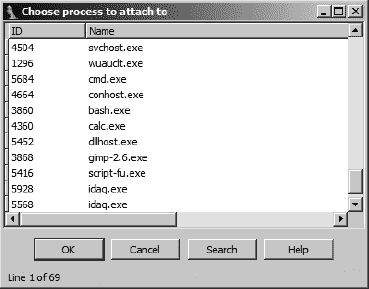

图 24-2. 调试器进程选择对话框

一旦选择了进程，调试器将通过获取运行进程的内存快照来创建一个临时数据库。除了运行进程的内存映像外，临时数据库还包含由进程加载的所有共享库的部分，这导致数据库比您可能习惯的要大得多且更杂乱。以这种方式连接到进程的一个缺点是，IDA 由于加载器从未处理相应的可执行文件映像，并且从未执行过二进制的自动分析，因此对进程的解汇编信息较少。实际上，一旦调试器连接到进程，二进制中将被解汇编的唯一指令是指令指针引用的指令以及从它流出的指令。连接到进程会立即暂停进程，让您有机会在恢复进程执行之前设置断点。

另一种连接到正在运行的进程的方法是在尝试连接到正在运行的进程之前，在 IDA 中打开相关的可执行文件。在打开数据库的情况下，调试器菜单将呈现出完全不同的形式，如图 24-3 所示。


图 24-3. 打开数据库时的调试器菜单

如果您没有看到这个菜单（或者一个非常相似的菜单），那么您可能还没有指定用于当前打开文件类型的调试器。在这种情况下，选择“调试器 ▸ 选择调试器”将根据当前文件类型显示一个合适的调试器列表。图 24-4 显示了典型的调试器选择对话框。


图 24-4. 调试器选择对话框

你可以通过勾选对话框底部的复选框来将你的选择设置为当前文件类型的默认调试器。当前的默认调试器（如果有），会在复选框上方注明。一旦你选择了调试器，你可以在任何时间通过“调试”▸“切换调试器”菜单来更改调试器。

当选择“调试器”▸“附加到进程”时，IDA 的行为将根据在活动数据库中打开的文件类型而有所不同。如果文件是可执行文件，IDA 将显示与数据库中打开的文件同名的所有进程列表。如果 IDA 找不到具有匹配名称的进程，它将显示所有正在运行的进程列表，并留给你选择要附加的正确进程。在任何情况下，你可以附加到显示的任何进程，但 IDA 无法保证该进程是以与打开的 IDA 数据库中加载的相同二进制映像启动的。

当当前打开的数据库是一个共享库时，IDA 的行为会有所不同。在 Windows 系统上，IDA 会过滤显示的进程列表，只显示那些加载了相应*.dll*文件的进程。例如，如果你目前在 IDA 中分析*wininet.dll*，那么当你选择“调试器”▸“附加到进程”时，你将只会看到那些当前已加载*wininet.dll*的进程。在 Linux 和 OS X 系统上，IDA 没有这种过滤能力，会显示你可以附加权限的每一个进程。

作为附加到现有进程的替代方案，你可以选择在调试器控制下启动一个新的进程。在没有打开数据库的情况下，可以通过“调试器”▸“运行”来启动一个新的进程。当打开数据库时，可以通过“调试器”▸“启动进程”或“调试器”▸“运行到光标”来启动一个新的进程。使用前者会导致新进程执行，直到它遇到断点（你需要在选择“调试器”▸“启动进程”之前设置）或直到你选择使用“调试器”▸“暂停进程”来暂停进程。使用“调试器”▸“运行到光标”会自动在启动新进程之前在当前光标位置设置断点。在这种情况下，新进程将执行，直到当前光标位置被达到或直到遇到更早的断点。如果执行永远不会达到当前光标位置（或任何其他断点），进程将继续运行，直到被强制暂停或终止（“调试器”▸“终止进程”）。

在调试器控制下启动进程（而不是附加到现有进程），是唯一一种监控进程所采取的每一个动作的方法。在进程启动前设置断点，可以让你密切监控进程的整个启动序列。控制启动序列对于被混淆的程序尤为重要，因为你在反混淆例程完成后，进程开始正常操作之前，通常会希望立即暂停进程。

从打开的 IDA 数据库启动进程的另一个优点是，IDA 在启动进程之前会对进程映像进行初始的自动分析。这导致与将调试器附加到现有进程时获得的反汇编质量显著提高。

IDA 的调试器能够进行本地和远程调试。对于本地调试，你只能调试将在你的平台上运行的二进制文件。IDA 的本地调试器没有仿真层，无法执行来自其他平台或 CPU 类型的二进制文件。对于远程调试，IDA 随带了一些调试服务器，包括 Windows 32/64、Windows CE/ARM、Mac OS X 32/64、Linux 32/64/ARM 和 Android 的实现。调试服务器旨在与你要调试的二进制文件一起执行。一旦你启动了远程调试服务器，IDA 就可以与服务器通信，在远程机器上启动或附加到目标进程。对于 Windows CE ARM 设备，IDA 通过 ActiveSync 与远程设备通信，并在远程安装调试服务器。IDA 还能够与 GNU 调试器（gdb）的 `gdbserver` 组件（^[216）或与链接了合适的 gdb 远程桩的程序通信（^[218）。最后，对于 Symbian 设备的远程调试，你必须安装和配置 Metrowerk 的 App TRK（^[219），以便 IDA 能够通过串行端口与设备通信。在任何情况下，IDA 只能作为 x86、x64、MIPS、ARM 和 PPC 处理器上运行的调试器前端。远程调试在第二十六章中讨论。

与任何其他调试器一样，如果你打算使用 IDA 的调试器来启动新进程，原始的可执行文件必须存在于调试主机上，并且原始的二进制文件将以运行 IDA 的用户的完整权限执行。换句话说，仅仅加载了你希望调试的二进制文件的 IDA 数据库是不够的。如果你打算使用 IDA 调试器进行恶意软件分析，这一点非常重要。如果你未能正确控制恶意软件样本，你很容易感染调试目标机器。IDA 会在你选择“调试器”▸“启动进程”（或“调试器”▸“使用打开的数据库附加到进程”）时尝试提醒你这种可能性，它会显示一个调试器警告消息，内容如下：

> 你将启动调试器。调试程序意味着其代码将在你的系统上执行。
> 
> 小心恶意程序、病毒和木马！
> 
> 备注：如果你选择“否”，调试器将被自动禁用。
> 
> 你确定要继续吗？

在此警告下选择“否”会导致调试器菜单从 IDA 菜单栏中移除。只有当你关闭活动数据库时，调试器菜单才会被恢复。

强烈建议你在沙盒环境中进行任何恶意软件的调试。相比之下，第二十一章中讨论的 x86 模拟器插件既不需要原始的二进制文件存在，也不会在执行模拟的机器上执行二进制文件的任何指令。

* * *

^([216]) 请参阅 [`www.sourceware.org/gdb/current/onlinedocs/gdb/Server.html#Server`](http://www.sourceware.org/gdb/current/onlinedocs/gdb/Server.html#Server)。

^([217]) 请参阅 [`www.gnu.org/software/gdb/`](http://www.gnu.org/software/gdb/)。

^([218]) 请参阅 [`www.sourceware.org/gdb/current/onlinedocs/gdb/Remote-Stub.html#Remote-Stub`](http://www.sourceware.org/gdb/current/onlinedocs/gdb/Remote-Stub.html#Remote-Stub)。

^([219]) 请参阅 [`www.tools.ext.nokia.com/agents/index.htm`](http://www.tools.ext.nokia.com/agents/index.htm)。

# 基本调试器显示

无论你如何启动调试器，一旦你的目标进程在调试器控制下暂停，IDA 就会进入调试模式（与正常反汇编模式相反），你将看到几个默认的显示。默认的调试器显示在图 24-5 中。


图 24-5. IDA 调试器显示

如果你习惯于使用其他 Windows 调试器，如 OllyDbg^([220])或 Immunity Debugger^([221]),你第一个可能的想法可能是屏幕上显示的信息不多。这主要是由于 IDA 默认的字体大小实际上是可读的。如果你发现自己怀念其他调试器中使用的微字体，你可以通过选项 ▸ 字体菜单轻松更改这些设置。如果你对调试器窗口的特定布局情有独钟，你也可以使用保存的 IDA 桌面（Windows ▸ 保存桌面）。

如图 24-5 所示，调试器工具栏取代了反汇编工具栏。其中包含了许多标准（从调试的角度来看）的工具，包括进程控制工具和断点操作工具。

IDA View-EIP  反汇编窗口是调试器激活时的默认反汇编列表窗口。它还恰好与指令指针寄存器的当前值同步。如果 IDA 检测到一个寄存器指向反汇编窗口内的内存位置，则在该寄存器的名称显示在左侧边缘，与寄存器指向的地址相对。在 图 24-5 中，EIP 指向的位置在 IDA View-EIP 中被标记出来（注意，在本例中 EDX 也指向相同的位置）。默认情况下，IDA 用红色突出显示断点，用蓝色突出显示将要执行的下一个指令（指令指针指向的指令）。与调试器相关的反汇编是通过与标准反汇编模式中使用的相同反汇编过程生成的。因此，IDA 的调试器可能提供了在调试器中可以找到的最好的反汇编功能。此外，如果您从打开的 IDA 数据库启动调试器，IDA 能够根据启动调试器之前进行的分析来描述所有可执行内容。由于 IDA 在启动调试器之前没有机会分析相关的 *.dll* 文件，因此 IDA 能够反汇编进程加载的任何库代码的能力将受到一定程度的限制。

Stack View  窗口是另一种标准反汇编视图，主要用于显示进程运行时栈的数据内容。所有指向栈位置的寄存器在通用寄存器  视图中都会被标记出来（例如，在本例中为 EBP）。通过使用注释，IDA 尽力为栈上的每个数据项提供上下文信息。当栈项是一个内存地址时，IDA 会尝试将该地址解析为函数位置（这有助于突出显示函数被调用的位置）。当栈项是一个数据指针时，会显示关联数据项的引用。其他默认显示包括十六进制视图 ，它提供标准的内存十六进制转储，模块  视图，显示当前进程图像中加载的模块列表，以及线程  视图，显示当前进程中的线程列表。双击任何列出的线程会导致 IDA View-EIP 反汇编窗口跳转到所选线程中的当前指令，并更新通用寄存器视图以反映所选线程中寄存器的当前值。

“通用寄存器”窗口（如图 24-6 所示）显示 CPU 通用寄存器的当前内容。可以从调试器菜单打开显示 CPU 段、浮点或 MMX 寄存器内容的额外窗口。


图 24-6. 通用寄存器显示

在“通用寄存器”窗口中，寄存器内容显示在相关寄存器名称的右侧，随后是每个寄存器内容的描述。CPU 标志位显示在最右侧的列中。右键单击寄存器值或标志位可以访问“修改”菜单项，允许您更改任何寄存器或 CPU 标志的内容。菜单选项提供快速访问将值置零、切换值、增加值或减少值的功能。切换值对于更改 CPU 标志位特别有用。右键单击任何寄存器值还可以提供访问“打开寄存器窗口”菜单项。选择“打开寄存器窗口”会导致 IDA 在所选寄存器所持有的内存位置打开一个新的反汇编窗口。如果您意外关闭了 IDA View-EIP 或 IDA View-ESP，请使用适当寄存器上的“打开寄存器窗口”命令重新打开丢失的窗口。如果寄存器看起来指向一个有效的内存位置，那么该寄存器值右侧的直角箭头控制将处于活动状态，并以黑色突出显示。单击活动箭头将打开一个以相应内存位置为中心的新反汇编视图。

“模块”窗口显示所有加载到进程内存空间中的可执行文件和共享库的列表。双击列表中的任何模块将打开该模块导出的符号列表。图 24-7 显示了*kernel32.dll*的内容示例。符号列表提供了一个轻松追踪加载库中函数的方法，如果您想在那些函数的入口处设置断点。

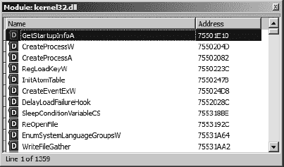

图 24-7. 模块窗口及其相关模块内容

可以通过使用各种调试器菜单选择来访问额外的调试器显示。有关调试器操作的显示将在下一节“进程控制”中讨论。除了调试器特定的显示外，所有传统的 IDA 子视图，如函数和段，都可以通过“视图”▸“打开子视图”命令访问。

* * *

^([220]) 查看 [`www.ollydbg.de/`](http://www.ollydbg.de/).

^([221]) 查看 [`www.immunityinc.com/products-immdbg.shtml`](http://www.immunityinc.com/products-immdbg.shtml)。

# 进程控制

任何调试器最重要的特性可能是能够紧密控制——如果需要的话，还可以修改——正在调试的进程的行为。为此，大多数调试器提供了一些命令，允许在将控制权返回给调试器之前执行一个或多个指令。这些命令通常与断点一起使用，允许用户指定在到达指定的指令或满足特定条件时中断执行。

在调试器控制下基本执行进程是通过使用各种单步、继续和运行命令来完成的。由于它们使用频率很高，因此熟悉与这些命令相关的工具栏按钮和快捷键序列是有帮助的。图 24-8 显示了与进程执行相关的工具栏按钮。


图 24-8. 调试器进程控制工具

下面的列表描述了这些命令的行为：

| **继续** 继续执行暂停的进程。执行将继续，直到遇到断点、用户暂停或终止执行，或者进程自行终止。 |
| --- |
| **暂停** 暂停正在运行的过程。 |
| **终止** 终止正在运行的过程。 |
| **进入** 仅执行下一个指令。如果下一个指令是函数调用，则在目标函数的第一个指令处中断。因此得名“进入”，因为执行会进入被调用的任何函数。 |
| **单步执行** 仅执行下一个指令。如果下一个指令是函数调用，则将调用视为单个指令，在函数返回时中断。因此得名“单步执行”，因为执行是跨过函数而不是像进入那样通过函数。如果在函数调用之前遇到断点，则执行可能会在函数调用完成之前中断。当函数的行为已知且不感兴趣时，单步执行非常有用，可以节省时间。 |
| **运行到返回** 继续执行当前函数，直到该函数返回（或遇到断点）才停止。当您已经看到了足够多的函数内容，希望从中退出，或者不慎进入了一个本想跳过的函数时，此操作非常有用。 |
| **运行到光标处**会在执行达到当前光标位置（或遇到断点）时停止进程的执行。此功能在无需在每个希望暂停的位置设置永久断点的情况下运行大块代码时非常有用。请注意，如果光标位置被绕过或根本无法到达，程序可能不会暂停。 |

除了工具栏和快捷键访问外，所有执行控制命令都可以通过调试器菜单访问。无论进程在单步执行后或遇到断点后是否暂停，每次进程暂停时，所有与调试器相关的显示都会更新，以反映进程暂停时的状态（CPU 寄存器、标志、内存内容）。

## 断点

*断点*是调试器与进程执行和中断（暂停）紧密相关的功能。断点被设置为在程序中非常具体的地点中断程序执行。从某种意义上说，断点是对“运行到光标处”概念的更永久扩展，一旦在给定地址设置断点，执行到达该位置时，无论光标是否保持在那个位置，都会中断执行。然而，虽然只有一个执行可以运行的光标，但可以在程序的所有地方设置许多断点，到达任何一个都会中断程序的执行。在 IDA 中设置断点是通过导航到希望执行暂停的位置并使用 F2 快捷键（或右键单击并选择添加断点）来实现的。设置断点的地址会用红色（默认情况下）的带状区域突出显示在整个反汇编行上。可以通过按两次 F2 来切换断点，以关闭断点。可以通过“调试器”▸“断点”▸“断点列表”查看程序中当前设置的断点的完整列表。

默认情况下，IDA 使用*软件断点*，这是通过将断点地址处的操作码字节替换为软件断点指令来实现的。对于 x86 二进制文件，这是`int 3`指令，它使用操作码值`0xCC`。在正常情况下，当执行软件断点指令时，操作系统会将控制权传递给任何可能正在监控中断进程的调试器。如第二十一章中所述，混淆代码可能会利用软件断点的行为，试图阻碍任何附加调试器的正常操作。

作为软件断点的替代，一些 CPU（例如 x86，实际上是 386 及其后续版本）提供了对*硬件辅助断点*的支持。硬件断点通常通过使用专用 CPU 寄存器来配置。对于 x86 CPU，这些寄存器被称为 DR0–7（调试寄存器 0 到 7）。可以使用 x86 寄存器 DR0–3 指定最多四个硬件断点。剩余的 x86 调试寄存器用于为每个断点指定额外的约束。当硬件断点启用时，不需要在调试的程序中替换特殊指令。相反，CPU 本身会根据调试寄存器中的值决定是否中断执行。

一旦设置了断点，就可以修改其行为的各个方面。除了简单地中断进程之外，调试器通常还支持*条件断点*的概念，允许用户指定在断点实际被认可之前必须满足的条件。当达到这样的断点并且关联的条件未满足时，调试器会自动恢复程序的执行。一般想法是，预期条件将在未来的某个时刻得到满足，只有在感兴趣的条件下得到满足时，程序才会被中断。

IDA 调试器支持条件断点和硬件断点。为了修改断点的默认（无条件、基于软件）行为，你必须在设置断点之后编辑它。为了访问断点编辑对话框，你必须右键单击现有的断点并选择编辑断点。图 24-9 显示了结果断点设置对话框。

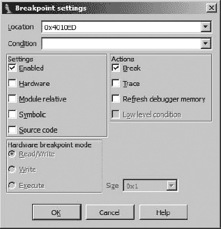

图 24-9. 断点设置对话框

位置框指示正在编辑的断点地址，而启用复选框指示断点当前是否处于活动状态。一个被禁用的断点无论与断点关联的条件如何，都不会被认可。硬件复选框用于请求将断点在硬件而不是软件中实现。

### 警告

关于硬件断点的注意事项：尽管 x86 架构在任何给定时间只支持四个硬件断点，但截至本文撰写时（IDA 版本 6.1），IDA 仍然会愉快地允许你指定超过四个硬件断点。然而，只有其中四个会被认可。任何额外的硬件断点都将被忽略。

当指定硬件断点时，您必须使用硬件断点模式单选按钮来指定断点行为是在执行时中断、在写入时中断，还是在读取/写入时中断。后两种类别（在写入时中断和在读取/写入时中断）允许您创建在访问特定内存位置（通常是数据位置）时触发的断点，无论访问发生时正在执行什么指令。如果您更关注程序访问数据的时间，而不是数据访问的来源，这非常有用。

除了为您的硬件断点指定模式外，您还必须指定大小。对于执行断点，大小必须是 1 字节。对于写入或读取/写入断点，大小可以设置为 1、2 或 4 字节。当大小设置为 2 字节时，断点的地址必须是字对齐的（2 字节的倍数）。同样，对于 4 字节断点，断点地址必须是双字对齐的（4 字节的倍数）。硬件断点的大小与其地址结合，形成一个字节范围，在此范围内断点可能被触发。以下是一个示例来帮助解释。考虑在地址`0804C834h`设置的 4 字节写入断点。这个断点将由对`0804C837h`的 1 字节写入、对`0804C836h`的 2 字节写入和对`0804C832h`的 4 字节写入触发，以及其他情况。在这些情况下，`0804C834h`到`0804C837h`范围内的至少 1 个字节被写入。有关 x86 硬件断点行为的更多信息，请参阅*英特尔 64 和 IA-32 架构软件开发者手册，第 3B 卷：系统编程指南，第二部分*。^[[222])

通过在断点设置对话框的条件字段中提供表达式来创建条件断点。条件断点是调试器的功能，而不是指令集或 CPU 功能。当断点被触发时，调试器的任务是评估任何相关的条件表达式，并确定程序是否应该暂停（条件满足）或者执行应该简单地继续（条件不满足）。因此，可以为软件断点和硬件断点指定条件。

IDA 断点条件使用 IDC（而不是 Python）表达式指定。计算结果非零的表达式被认为是真的，满足断点条件并触发断点。计算结果为零的表达式被认为是假的，未能满足断点条件，并且不会触发相关的断点。为了帮助创建断点表达式，IDA 在 IDC（再次，不是 Python）中提供了特殊的寄存器变量，以便在断点表达式中直接访问寄存器内容。这些变量以寄存器本身命名，包括`EAX`、`EBX`、`ECX`、`EDX`、`ESI`、`EDI`、`EBP`、`ESP`、`EFL`、`AX`、`BX`、`CX`、`DX`、`SI`、`DI`、`BP`、`SP`、`AL`、`AH`、`BL`、`BH`、`CL`、`CH`、`DL`和`DH`。这些寄存器变量仅在调试器活动时才可访问。

很遗憾，没有变量可以直接访问处理器标志位。为了访问单个 CPU 标志，你需要调用`GetRegValue`函数来获取所需标志位的值，例如`CF`。如果你需要有关有效寄存器和标志名称的提醒，请参考“常规寄存器”窗口的左侧和右侧的标签。这里显示了几个示例断点表达式：

```
EAX == 100             // break if eax holds the value 100
ESI > EDI              // break if esi is greater than edi
Dword(EBP-20) == 10    // Read current stack frame (var_20) and compare to 10
GetRegValue("ZF")      // break if zero flag is set
EAX = 1                // Set EAX to 1, this also evaluates to true (non-zero)
EIP = 0x0804186C       // Change EIP, perhaps to bypass code
```

关于断点表达式需要注意的两点是：IDC 函数可以被调用以访问进程信息（只要函数返回一个值），以及赋值可以用作在进程执行过程中特定位置修改寄存器值的一种手段。Ilfak 本身就演示了这种技术，作为覆盖函数返回值的例子。^([[223)]

在“断点设置”对话框中可以配置的最后断点选项被分组到对话框右侧的“操作”框中。断点复选框指定当达到断点时程序执行是否实际上应该暂停（假设任何相关条件为真）。创建一个不会中断的断点可能看起来有些不寻常，但如果你只想在每次到达指令时修改特定的内存或寄存器值而不需要同时暂停程序，这实际上是一个有用的功能。选择“跟踪”复选框会在每次断点被触发时记录一个跟踪事件。

## 跟踪

跟踪提供了一种记录在进程执行期间发生的特定事件的方法。跟踪事件记录到固定大小的跟踪缓冲区，并且可以选择记录到跟踪文件。有两种跟踪风格：指令跟踪和函数跟踪。当启用*指令跟踪*（调试器 ▸ 跟踪 ▸ 指令跟踪）时，IDA 记录由指令更改的地址、指令以及任何寄存器（除了 EIP）的值（其他寄存器）。指令跟踪可能会显著减慢调试过程，因为调试器必须单步执行进程以监控和记录所有寄存器的值。"函数跟踪"（调试器 ▸ 跟踪 ▸ 函数跟踪）是指令跟踪的一个子集，其中仅记录函数调用（以及可选的返回）。函数跟踪事件不记录任何寄存器值。

三种个人跟踪事件类型也可用：写入跟踪、读写跟踪和执行跟踪。正如其名称所暗示的，每个都允许在指定地址发生特定操作时记录跟踪事件。这些个人跟踪均使用非破坏性断点，并将`trace`选项设置为。写入和读写跟踪使用硬件断点实现，因此受到之前提到的硬件断点相同限制的影响，其中最重要的是在任何给定时间点不能超过四个硬件辅助断点或跟踪。默认情况下，执行跟踪使用软件断点实现，因此程序内可以设置的执行跟踪数量没有限制。

图 24-10 显示了用于配置调试器跟踪操作的跟踪选项（调试器 ▸ 跟踪 ▸ 跟踪选项）对话框。

在此处指定的选项仅适用于函数和指令跟踪。这些选项对单个跟踪事件没有影响。跟踪缓冲区大小选项指定了任何给定时间可以显示的最大跟踪事件数。对于给定的缓冲区大小*n*，仅显示最近的*n*个跟踪事件。命名日志文件会导致所有跟踪事件附加到该命名文件。指定日志文件时不会提供文件对话框，因此您必须自己指定日志文件的完整路径。可以输入 IDC 表达式作为停止条件。该条件在通过每个指令进行跟踪之前进行评估。如果条件评估为真，则立即暂停执行。此表达式的效果是作为一个条件断点，它不依赖于任何特定位置。


图 24-10. 跟踪选项对话框

当勾选“标记具有相同 IP 的连续跟踪事件”选项时，来自同一指令的连续跟踪事件会被标记为等号。当在`x86`程序中使用`REP`^([224])前缀时，可能会出现连续事件来自同一指令地址的例子。为了使指令跟踪显示每个重复的指令地址，必须也选择“如果 IP 相同则记录”选项。如果没有选择此选项，带有`REP`前缀的指令每次遇到时只列一次。以下列表显示了使用默认跟踪设置的部分指令跟踪：

```
Thread   Address             Instruction    Result
   ------   -------             -----------    ------
  00000150
 .text:sub_401320+17 rep movsb      ECX=00000000 ESI=0022FE2C EDI=0022FCF4
   00000150 .text:sub_401320+19 pop esi        ESI=00000000 ESP=0022FCE4
```

注意，`movsb`指令![httpatomoreillycomsourcenostarchimages854061.png]只列了一次。

在以下列表中，已选择“如果 IP 相同则记录”，导致`rep`循环的每次迭代都被记录：

```
Thread   Address             Instruction   Result
------   -------             -----------   ------
000012AC .text:sub_401320+17 rep movsb     ECX=0000000B
 ESI=0022FE21 EDI=0022FCE9 EFL=00010206 RF=1
000012AC .text:sub_401320+17 rep movsb     ECX=0000000A ESI=0022FE22 EDI=0022FCEA
000012AC .text:sub_401320+17 rep movsb     ECX=00000009 ESI=0022FE23 EDI=0022FCEB
000012AC .text:sub_401320+17 rep movsb     ECX=00000008 ESI=0022FE24 EDI=0022FCEC
000012AC .text:sub_401320+17 rep movsb     ECX=00000007 ESI=0022FE25 EDI=0022FCED
000012AC .text:sub_401320+17 rep movsb     ECX=00000006 ESI=0022FE26 EDI=0022FCEE
000012AC .text:sub_401320+17 rep movsb     ECX=00000005 ESI=0022FE27 EDI=0022FCEF
000012AC .text:sub_401320+17 rep movsb     ECX=00000004 ESI=0022FE28 EDI=0022FCF0
000012AC .text:sub_401320+17 rep movsb     ECX=00000003 ESI=0022FE29 EDI=0022FCF1
000012AC .text:sub_401320+17 rep movsb     ECX=00000002 ESI=0022FE2A EDI=0022FCF2
000012AC .text:sub_401320+17 rep movsb     ECX=00000001 ESI=0022FE2B EDI=0022FCF3
000012AC .text:sub_401320+17 rep movsb     ECX=00000000
 ESI=0022FE2C EDI=0022FCF4 EFL=00000206 RF=0
000012AC .text:sub_401320+19 pop esi       ESI=00000000 ESP=0022FCE4
```

最后，在以下列表中，已启用“标记具有相同 IP 的连续跟踪事件”选项，导致特殊的标记突出显示指令指针在连续的指令之间没有改变：

```
Thread   Address             Instruction  Result
------   -------             -----------  ------
000017AC .text:sub_401320+17 rep movsb    ECX=0000000B ESI=0022F
E21 EDI=0022FCE9 EFL=00010206 RF=1
=        =                   =            ECX=0000000A ESI=0022FE22 EDI=0022FCEA
=        =                   =            ECX=00000009 ESI=0022FE23 EDI=0022FCEB
=        =                   =            ECX=00000008 ESI=0022FE24 EDI=0022FCEC
=        =                   =            ECX=00000007 ESI=0022FE25 EDI=0022FCED
=        =                   =            ECX=00000006 ESI=0022FE26 EDI=0022FCEE
=        =                   =            ECX=00000005 ESI=0022FE27 EDI=0022FCEF
=        =                   =            ECX=00000004 ESI=0022FE28 EDI=0022FCF0
=        =                   =            ECX=00000003 ESI=0022FE29 EDI=0022FCF1
=        =                   =            ECX=00000002 ESI=0022FE2A EDI=0022FCF2
=        =                   =            ECX=00000001 ESI=0022FE2B EDI=0022FCF3
=        =                   =            ECX=00000000 ESI=0022FE2C
 EDI=0022FCF4 EFL=00000206 RF=0
000017AC .text:sub_401320+19 pop esi      ESI=00000000 ESP=0022FCE4
```

我们将要提到的关于跟踪的最后两个选项是“在调试器段上跟踪”和“在库函数上跟踪”。当选择“在调试器段上跟踪”时，只要执行流程转到 IDA 最初加载的任何文件段之外的程序段，指令和函数调用跟踪就会被临时禁用。最常见的例子是调用共享库函数。选择“在库函数上跟踪”会临时禁用在 IDA 被识别为库函数的函数（可能通过 FLIRT 签名匹配）中的函数和指令跟踪。链接到二进制文件中的库函数不应与通过共享库文件（如 DLL）访问的库函数混淆。这两个选项默认都是启用的，这有助于在跟踪时提高性能（因为调试器不需要进入库代码），同时显著减少生成的跟踪事件数量，因为指令通过库代码的跟踪可以迅速填满跟踪缓冲区。

## 堆栈跟踪

*堆栈跟踪*是当前调用栈的显示，或者说是为了执行到达二进制文件中的特定位置而执行的函数调用序列。图 24-11 显示了使用“调试器”>“堆栈跟踪”命令生成的示例堆栈跟踪。


图 24-11. 一个示例堆栈跟踪

栈跟踪的最上面一行列出了当前正在执行的函数的名称。第二行指示调用了当前函数的函数及其调用地址。后续的行指示每个函数被调用的点。调试器能够通过遍历栈并解析它遇到的每个栈帧来创建栈跟踪显示，它通常依赖于帧指针寄存器（x86 中的 EBP）的内容来定位每个栈帧的基址。当找到栈帧时，调试器可以提取指向下一个栈帧（保存的帧指针）以及保存的返回地址的指针，这些返回地址用于定位用于调用当前函数的调用指令。IDA 的调试器不能跟踪不使用 EBP 作为帧指针的栈帧。在函数（而不是单个指令）级别上，栈跟踪对于回答“我是如何到达这里的？”或更准确地说，“什么函数调用序列导致了这个特定的位置？”这样的问题是有用的。

## 手表

在调试一个进程时，你可能希望持续监控一个或多个变量中的值。而不是要求你在每次进程暂停时都导航到所需的内存位置，许多调试器允许你指定应显示其值的内存位置列表。这样的列表被称为*监视列表*，因为它们允许你在程序执行期间监视指定内存位置的内容变化。监视列表仅仅是一种导航便利；它们不会像断点一样导致执行暂停。

由于它们关注数据，监视点（被指定为要监视的地址）通常设置在二进制的栈、堆或数据部分。在 IDA 调试器中设置监视点是通过右键单击感兴趣的内存项并选择添加监视来完成的。确定确切要设置监视的地址可能需要一些思考。确定全局变量的地址比确定局部变量的地址要容易一些，因为全局变量在编译时被分配并分配了固定的地址。另一方面，局部变量在运行时才存在，即使如此，它们也只有在它们声明的函数被调用之后才存在。当调试器处于活动状态时，一旦你进入了一个函数，IDA 就能够报告该函数内局部变量的地址。图 24-12 显示了将鼠标悬停在名为`arg_0`的局部变量（实际上是一个传递给函数的参数）上的结果。


图 24-12. 调试器解析局部变量地址

双击活动函数内的局部变量会导致 IDA 将主 IDA 视图窗口跳转到该局部变量的地址。到达变量的地址后，您可以使用“添加监视”的上下文菜单选项在该地址上添加监视，尽管您需要手动将该地址输入到监视地址对话框中。如果您花时间命名内存位置，当您将相同的菜单选项应用于名称而不是地址时，IDA 将自动添加监视。

您可以通过“调试器” ▸ “监视” ▸ “监视列表”访问当前所有有效的监视列表。您可以通过在监视列表中突出显示所需的监视并按 DELETE 键来删除单个监视。

* * *

^([222]) 请参阅 [`www.intel.com/products/processor/manuals/`](http://www.intel.com/products/processor/manuals/)。

^([223]) 请参阅 [`www.hexblog.com/2005/11/simple_trick_to_hide_ida_debug.html`](http://www.hexblog.com/2005/11/simple_trick_to_hide_ida_debug.html) 和 [`www.hexblog.com/2005/11/stealth_plugin_1.html`](http://www.hexblog.com/2005/11/stealth_plugin_1.html).

^([224]) `REP` 前缀是一个指令修饰符，它会导致某些 x86 字符串指令（如 `movs` 和 `scas`）根据 ECX 寄存器中的计数重复执行。

# 自动化调试任务

在 第十五章 到 第十九章 中，我们介绍了 IDA 脚本和 IDA SDK 的基础知识，并在二进制文件的静态分析中展示了这些功能的有用性。在调试器中启动进程并在更动态的调试环境中工作并不会使脚本和插件变得不那么有用。脚本和插件提供的自动化功能的一些有趣用途包括分析调试过程中可用的运行时数据、实现复杂的断点条件以及实施绕过反调试技术的措施。

## 脚本化调试操作

在使用 IDA 调试器时，第十五章 中讨论的所有 IDA 脚本功能仍然可以访问。可以从文件菜单启动脚本，将其与热键关联，并从 IDA 脚本命令行调用。此外，用户创建的 IDC 函数可以从断点条件和跟踪终止表达式中引用。

基本脚本函数提供了设置、修改和枚举断点的功能，以及读取和写入寄存器和内存值的能力。内存访问由 `DbgByte`、`PatchDbgByte`、`DbgWord`、`PatchDbgWord`、`DbgDword` 和 `PatchDbgDword` 函数提供（类似于第十五章中描述的 `Byte`、`Word`、`Dword` 和 `Patch`*`XXX`* 函数）。通过以下函数可以实现寄存器和断点的操作（请参阅 IDA 帮助文件以获取完整列表）。

**`long GetRegValue(string reg)`**

返回之前讨论过的指定寄存器（如 EAX）的值。在 IDC 中，也可以通过在 IDC 表达式中使用所需的寄存器名称作为变量来轻松访问寄存器值。

**`bool SetRegValue(number val, string name)`**

设置指定名称的寄存器值，例如 EAX。如果你使用 IDC，也可以通过在赋值语句的左侧使用所需的寄存器名称直接修改寄存器值。

**`bool AddBpt(long addr)`**

在指定的地址添加软件断点。

**`bool AddBptEx(long addr, long size, long type)`**

在指定的地址添加指定大小和类型的断点。类型应该是 *idc.idc* 或 IDA 帮助文件中描述的 `BPT_`*`xxx`* 常量之一。

**`bool DelBpt(long addr)`**

删除指定地址处的断点。

**`long GetBptQty()`**

返回程序中设置的断点数量。

**`long GetBptEA(long bpt_num)`**

返回指示断点设置的地址。

**`long/string GetBptAttr(long addr, number attr)`**

返回与指定地址处的断点相关联的属性。返回值可能是一个数字或一个字符串，具体取决于请求的属性值。属性使用 *idc.idc* 或 IDA 帮助文件中描述的 `BPTATTR_`*`xxx`* 值之一指定。

**`bool SetBptAttr(long addr, number attr, long value)`**

将指定断点的指定属性设置为指定的值。不要使用此函数设置断点条件表达式（请使用 `SetBptCnd`）。

**`bool SetBptCnd(long addr, string cond)`**

将断点条件设置为提供的条件表达式，该表达式必须是一个有效的 IDC 表达式。

**`long CheckBpt(long addr)`**

获取指定地址的断点状态。返回值表示是否存在断点、断点是否禁用、断点是否启用或断点是否激活。一个激活的断点是在调试器也激活时启用的断点。

以下脚本演示了如何在当前光标位置安装自定义的 IDC 断点处理函数：

```
#include <idc.idc>
/*
 * The following should return 1 to break, and 0 to continue execution.
 */
static my_breakpoint_condition() {
   return AskYN(1, "my_breakpoint_condition activated, break now?") == 1;
}

/*
 * This function is required to register my_breakpoint_condition
 * as a breakpoint conditional expression
 */
static main() {
   auto addr;
   addr = ScreenEA();
   AddBpt(addr);
   SetBptCnd(addr, "my_breakpoint_condition()");
}
```

`my_breakpoint_condition` 的复杂度完全由您决定。在这个例子中，每次遇到断点时，都会弹出一个对话框询问用户是否希望继续执行过程或暂停在当前位置。`my_breakpoint_condition` 返回的值被调试器用来确定是否应该尊重或忽略断点。

从 SDK 和通过使用脚本都可以对调试器进行程序控制。在 SDK 中，IDA 使用事件驱动模型，并在特定调试事件发生时向插件提供回调通知。不幸的是，IDA 的脚本功能并不便于在脚本中使用事件驱动范式。因此，Hex-Rays 引入了一系列脚本函数，允许在脚本中对调试器进行同步控制。使用脚本驱动调试器的基本方法是在脚本中启动调试器操作，然后等待相应的调试器事件代码。请注意，对同步调试器函数的调用（在脚本中您能做的所有事情）会阻塞所有其他 IDA 操作，直到调用完成。以下列表详细说明了可用于脚本的几个调试扩展：

**`long GetDebuggerEvent(long wait_evt, long timeout)`**

等待在指定秒数内（-1 表示无限期等待）发生调试器事件（由 `wait_evt` 指定）。返回一个事件类型代码，指示接收到的事件类型。使用 `WFNE_`*`xxx`*（WFNE 表示等待下一个事件）标志的组合来指定 `wait_evt`。可能的返回值在 IDA 帮助文件中有文档说明。

**b****`ool RunTo(long addr)`**

运行过程直到达到指定的位置或遇到断点。

**`bool StepInto()`**

单步执行过程，进入任何函数调用。

**`bool StepOver()`**

单步执行过程，跳过任何函数调用。如果遇到断点，此调用可能提前终止。

**`bool StepUntilRet()`**

运行直到当前函数调用返回或遇到断点。

**`bool EnableTracing(long trace_level, long enable)`**

启用（或禁用）生成跟踪事件。`trace_level` 参数应设置为在 *idc.idc* 中定义的 `TRACE_`*`xxx`* 常量之一。

**`long GetEvent`***`XXX`***`()`**

有许多函数可用于检索与当前调试事件相关的信息。其中一些函数仅适用于特定的事件类型。您应该测试 `GetDebuggerEvent` 的返回值，以确保特定的 `GetEvent`*`XXX`* 函数是有效的。

在导致进程执行的每个函数之后必须调用 `GetDebuggerEvent`，以便检索调试器的事件代码。如果不这样做，可能会阻止后续尝试单步执行或运行进程。例如，以下代码片段将只单步执行调试器一次，因为 `GetDebuggerEvent` 没有在 `StepOver` 调用之间被调用以清除最后的事件类型。

```
StepOver();
StepOver();    //this and all subsequent calls will fail
StepOver();
StepOver();
```

执行操作的正确方式是在每个调用之后跟随一个对 `GetDebuggerEvent` 的调用，如下例所示：

```
StepOver();
GetDebuggerEvent(WFNE_SUSP, −1);
StepOver();
GetDebuggerEvent(WFNE_SUSP, −1);
StepOver();
GetDebuggerEvent(WFNE_SUSP, −1);
StepOver();
GetDebuggerEvent(WFNE_SUSP, −1);
```

对 `GetDebuggerEvent` 的调用允许即使在选择忽略 `GetDebuggerEvent` 的返回值的情况下，执行也能继续。事件类型 `WFNE_SUSP` 表示我们希望等待导致被调试进程挂起的事件，例如异常或断点。你可能已经注意到没有函数可以简单地恢复挂起进程的执行。^([225]) 然而，通过在 `GetDebuggerEvent` 的调用中使用 `WFNE_CONT` 标志，可以实现相同的效果，如下所示：

```
GetDebuggerEvent(WFNE_SUSP | WFNE_CONT, −1);
```

这个特定的调用在首先通过从当前指令继续执行来恢复执行后，等待下一个可用的挂起事件。

提供了额外的函数来自动启动调试器和附加到正在运行的进程。有关这些函数的更多信息，请参阅 IDA 的帮助文件。

下面展示了用于收集每个执行指令地址的统计信息的简单调试器脚本的示例（假设调试器已启用）：

```
static main() {
     auto ca, code, addr, count, idx;
    ca = GetArrayId("stats");
     if (ca != −1) {
        DeleteArray(ca);
     }
     ca = CreateArray("stats");
    EnableTracing(TRACE_STEP, 1);
    for (code = GetDebuggerEvent(WFNE_ANY | WFNE_CONT, −1); code > 0;
            code = GetDebuggerEvent(WFNE_ANY | WFNE_CONT, −1)) {
       addr = GetEventEa();
       count = GetArrayElement(AR_LONG, ca, addr) + 1;
       SetArrayLong(ca, addr, count);
     }
     EnableTracing(TRACE_STEP, 0);
    for (idx = GetFirstIndex(AR_LONG, ca);
            idx != BADADDR;
            idx = GetNextIndex(AR_LONG, ca, idx)) {
        count = GetArrayElement(AR_LONG, ca, idx);
        Message("%x: %d\n", idx, count);
     }
    DeleteArray(ca);
  }
```

脚本开始时！[](httpatomoreillycomsourcenostarchimages854061.png)会检查是否存在名为`stats`的全局数组。如果找到，则删除该数组并重新创建，以便我们可以从一个空数组开始。接下来！[](httpatomoreillycomsourcenostarchimages854063.png)，在进入循环！[](httpatomoreillycomsourcenostarchimages854093.png)以驱动单步执行过程之前，启用单步跟踪。每次生成调试事件时，都会检索相关事件的地址！[](httpatomoreillycomsourcenostarchimages854095.png)，从全局数组中检索与该地址关联的当前计数并增加！[](httpatomoreillycomsourcenostarchimages854099.png)，并用新的计数更新数组！[](httpatomoreillycomsourcenostarchimages854101.png)。请注意，指令指针用作稀疏全局数组的索引，这可以节省在某种其他数据结构中查找地址的时间。一旦过程完成，就会使用第二个循环！[](httpatomoreillycomsourcenostarchimages854103.png)来检索并打印所有具有有效值的数组位置的值。在这种情况下，只有那些从其中检索指令的地址的数组索引才会具有有效值。脚本通过删除用于收集统计信息的全局数组来完成！[](httpatomoreillycomsourcenostarchimages854133.png)。

```
401028: 1
40102b: 1
40102e: 2
401031: 2
401034: 2
401036: 1
40103b: 1
```

通过对前面的示例进行轻微修改，可以收集有关在进程生命周期内执行了哪些类型指令的统计信息。以下示例显示了在第一个循环中所需的修改，以收集指令类型数据而不是地址数据：

```
for (code = GetDebuggerEvent(WFNE_ANY | WFNE_CONT, −1); code > 0;
          code = GetDebuggerEvent(WFNE_ANY | WFNE_CONT, −1)) {
        addr = GetEventEa();
       mnem = GetMnem(addr);
       count = GetHashLong(ht, mnem) + 1;
       SetHashLong(ht, mnem, count);
     }
```

而不是尝试对单个操作码进行分类，我们选择按助记符！[](httpatomoreillycomsourcenostarchimages854061.png)分组指令。因为助记符是字符串，我们利用全局数组的哈希表功能来检索与给定助记符关联的当前计数！[](httpatomoreillycomsourcenostarchimages854063.png)，并将更新的计数！[](httpatomoreillycomsourcenostarchimages854093.png)保存回正确的哈希表条目。此修改后的脚本的示例输出如下：

```
add:   18
and:   2
call:  46
cmp:   16
dec:   1
imul:  2
jge:   2
jmp:   5
jnz:   7
js:    1
jz:    5
lea:   4
mov:   56
pop:   25
push:  59
retn:  19
sar:   2
setnz: 3
test:  3
xor:   7
```

在第二十五章中，我们将重新探讨使用调试器交互功能作为辅助去混淆二进制文件的手段。

## 使用 IDA 插件自动化调试器操作

在第十六章中，你了解到 IDA 的 SDK 为开发各种可集成到 IDA 并完全访问 IDA API 的编译扩展提供了强大的功能。IDA API 提供了 IDC 中所有可用功能的超集，调试扩展也不例外。API 的调试扩展在`<SDKDIR>/dbg.hpp`中声明，包括迄今为止讨论的所有 IDC 函数的 C++对应版本，以及完整的异步调试器接口功能。

对于异步交互，插件通过挂钩`HT_DBG`通知类型（见*loader.hpp*）来获取调试器通知。调试器通知在`dbg.hpp`中找到的`dbg_notification_t`枚举中声明。

在调试器 API 中，与调试器交互的命令通常以成对定义，一个函数用于同步交互（如脚本），另一个函数用于异步交互。一般而言，函数的同步形式命名为`COMMAND()`，其异步对应版本命名为`request_COMMAND()`。`request_`*`XXX`*版本用于将调试器操作排队以供后续处理。一旦你完成异步请求的排队，你必须调用`run_requests`函数来启动请求队列的处理。随着你的请求被处理，调试器通知将被发送到任何通过`hook_to_notification_point`注册的回调函数。

使用异步通知，我们可以开发一个来自上一节的地址计数脚本的异步版本。第一个任务是确保我们挂钩和取消挂钩调试器通知。我们将在插件的`init`和`term`方法中这样做，如下所示：

```
//A netnode to gather stats into
 netnode stats("$ stats", 0, true);

int idaapi init(void) {
   hook_to_notification_point(HT_DBG, dbg_hook, NULL);
   return PLUGIN_KEEP;
}

void idaapi term(void) {
   unhook_from_notification_point(HT_DBG, dbg_hook, NULL);
}
```

注意，我们还选择声明了一个全局 netnode ，我们将用它来收集统计数据。接下来，我们考虑当插件通过其分配的热键激活时，我们希望插件执行什么操作。我们的示例插件`run`函数如下所示：

```
void idaapi run(int arg) {
     stats.altdel();   //clear any existing stats
    request_enable_step_trace();
    request_step_until_ret();
    run_requests();
  }
```

由于我们在本例中使用异步技术，我们必须首先提交一个请求来启用步骤跟踪 ，然后提交一个请求来恢复调试的进程的执行。为了简化，我们将只对当前函数收集统计数据，因此我们将发出一个请求，直到当前函数返回 。在我们的请求正确排队后，我们将通过调用`run_requests`来启动当前请求队列的处理 。

剩下的工作就是通过创建我们的`HT_DBG`回调函数来处理我们期望接收的通知。这里展示了一个只处理两个消息的简单回调：

```
int idaapi dbg_hook(void *user_data, int notification_code, va_list va) {
     switch (notification_code) {
       case dbg_trace:  //notification arguments are detailed in dbg.hpp
           va_arg(va, thid_t);
          ea_t ea = va_arg(va, ea_t);
           //increment the count for this address
          stats.altset(ea, stats.altval(ea) + 1);
           return 0;
       case dbg_step_until_ret:
           //print results
          for
(nodeidx_t i = stats.alt1st(); i != BADNODE; i = stats.altnxt(i)) {
               msg("%x: %d\n", i, stats.altval(i));
           }
           //delete the netnode and stop tracing
          stats.kill();
          request_disable_step_trace();
          run_requests();
           break;
     }
  }
```

对于每条执行的指令，我们直到关闭跟踪之前都会接收到 `dbg_trace` 通知 。当接收到跟踪通知时，从 args 列表  中检索跟踪点的地址，然后用于更新适当的 netnode 数组索引 。当进程遇到 `return` 语句并离开我们开始的函数时，会发送 `dbg_step_until_ret` 通知 。这个通知是我们的信号，表明我们应该停止跟踪并打印我们收集到的任何统计信息。在销毁 netnode  并请求禁用跟踪  之前，使用循环  遍历 `stats` netnode 的所有有效索引值。由于此示例使用异步命令，禁用跟踪的请求被添加到队列中，这意味着我们必须发出 `run_requests`  以处理队列。关于与调试器同步交互与异步交互的重要警告是，在处理异步通知消息时，您绝对不应该调用函数的同步版本。

使用 SDK 与调试器的同步交互方式与脚本调试器非常相似。与我们在前几章中看到的许多 SDK 函数一样，调试器相关函数的名称通常与相关脚本函数的名称不匹配，因此您可能需要花费一些时间在 *dbg.hpp* 中查找所需的函数。脚本和 SDK 之间名称差异最大的是 SDK 的 `GetDebuggerEvent` 版本，在 SDK 中称为 `wait_for_next_event`。脚本函数和 SDK 之间的另一个主要区别是，SDK 中不会自动为您声明对应于 CPU 寄存器的变量。要从 SDK 访问 CPU 寄存器的值，您必须使用 `get_reg_val` 和 `set_reg_val` 函数分别读取和写入寄存器。

* * *

^([225]) 实际上，有一个名为 `ResumeProcess` 的宏，定义为 `GetDebuggerEvent(WFNE_CONT|WFNE_NOWAIT, 0)`。

# 摘要

IDA 可能不是调试器市场的最大份额，但它的调试器功能强大，并且与 IDA 的反汇编功能无缝集成。尽管调试器的用户界面，就像任何调试器一样，需要一些初始的适应，但它提供了用户在基本调试器中所需的所有基本功能。其优点包括脚本和插件功能，以及 IDA 反汇编显示的熟悉用户界面和其分析能力的强大。统一的反汇编器/调试器组合为执行静态分析、动态分析或两者的组合提供了一个坚实的工具。

# 第二十五章。反汇编器/调试器集成


像 IDA 这样的集成反汇编器/调试器组合应该是一个强大的工具，用于操作二进制文件，并在逆向工程过程中无缝地应用静态和动态技术。如果你理解每个工具的特性和局限性，以及它们组合时的表现，这一点是成立的。

在本章中，我们将讨论一些关于 IDA 静态方面与其动态方面交互的重要观点，并探讨可以使用 IDA 调试器来克服恶意分析中某些反调试（和反反汇编）技术的技术。在这方面，重要的是要记住，在恶意分析中，通常的目标不是运行恶意软件，而是获得足够质量的反汇编，以便静态分析工具可以接管。回想一下第二十一章中提到的，有许多专门设计来防止反汇编器正确执行的技术。面对这些反反汇编技术，调试器只是达到目的的一种手段。通过在调试器控制下运行混淆程序，我们将尝试获得一个去混淆的程序版本，然后我们更喜欢使用反汇编器来分析它。

# 背景

在继续之前，了解一些关于调试器辅助去混淆的背景信息可能是有用的。众所周知，一个混淆程序必须在开始其预期业务之前先去混淆自己。以下步骤提供了一个基本且有些简化的指南，用于二进制文件的动态去混淆。

1.  使用调试器打开一个混淆程序。

1.  在去混淆例程的末尾搜索并设置一个断点。

1.  从调试器启动程序，等待断点触发。

1.  利用调试器的内存转储功能将进程的当前状态捕获到文件中。

1.  在进程执行任何恶意操作之前终止它。

1.  对捕获到的进程图像进行静态分析。

大多数现代调试器都包含足够的功能来执行上述任务。OllyDbg^([226]) 是一个非常流行的仅适用于 Windows 的调试器，常用于此类工作。步骤 2 并不一定像听起来那么简单。可能需要结合多种工具，包括在反汇编器（如 IDA）中花费一些时间，或者在去混淆算法结束前进行大量的单步执行，才能正确地识别去混淆算法的结束。在许多情况下，去混淆的结束是由一种行为而不是特定的指令标记的。这种行为可能是一个指令指针值的巨大变化，表明跳转到了去混淆代码之外的某个位置。例如，在 `UPX` 打包的二进制文件的情况下，你只需要观察指令指针的值小于程序入口点地址，就可以知道去混淆已经完成，程序已经跳转到了新去混淆的代码。用通用术语来说，这个过程被称为 *原始入口点（OEP）识别*，OEP 是程序在没有被混淆的情况下开始执行时的地址。

更为复杂的是，一些现代混淆器能够将输入的可执行文件转换成等效的字节码程序，然后由混淆器生成的自定义虚拟机执行.^([227]) 使用此类虚拟化混淆器保护的可执行文件不能按照传统的期望来分析，即恢复原始二进制文件或定位原始入口点。这是由于原始的 x86（或其他处理器）指令没有嵌入到混淆的二进制文件中，因此无法恢复。

如果你不够小心，步骤 3 可能会变得很危险。无论如何，在允许恶意软件无阻碍地运行之前，你应该总是三思而后行，希望你已经正确设置了断点或断点条件。如果程序成功绕过你的断点（s），它可能会在你意识到发生了什么之前执行恶意代码。因此，在调试器控制下尝试去混淆恶意软件时，应该始终在一个你不怕出错的沙盒环境中进行。

步骤 4 可能需要一些努力，因为内存转储通常在调试器中受支持，而整个进程图像转储可能不受支持。Gigapede 的 OllyDump^([228]) 插件为 OllyDbg 添加了进程转储功能。请记住，从内存中转储的图像包含运行进程的内容，并不一定反映磁盘文件中静态二进制文件的原始状态。然而，在恶意软件分析中，目标通常是创建一个正确结构的图像文件，以便将其加载到反汇编器中进行进一步分析。

从混淆进程重构二进制图像的复杂部分之一是恢复程序的导入函数表。作为混淆过程的一部分，程序的导入表通常也会被混淆。因此，去混淆过程还必须注意将新去混淆的进程链接到所有必要的共享库和函数，以便正确执行。通常，这个过程留下的唯一痕迹是在进程内存图像中的某个位置的导入函数地址表。在将去混淆的进程图像导出到文件时，通常会采取步骤尝试在导出的进程图像中重建一个有效的导入表。为了做到这一点，导出图像的头部需要被修改，以指向一个新的导入表结构，该结构必须正确反映原始去混淆程序的所有共享库依赖关系。自动化此过程的流行工具是 MackT 开发的 ImpREC^([229])（导入重建）实用程序。与进程导出一样，请记住，在恶意软件分析中，提取独立的可执行文件可能不是你的主要目标，在这种情况下，重建有效的头部和导入表的重要性不如知道哪些函数已被解析以及这些函数的地址存储在哪里。

* * *

^([226]) 请参阅 [`www.ollydbg.de/`](http://www.ollydbg.de/).

^([227]) 关于此类混淆器之一 VMProtect 的讨论，请参阅 Rolf Rooles 在 [`www.usenix.org/event/woot09/tech/full_papers/rolles.pdf`](http://www.usenix.org/event/woot09/tech/full_papers/rolles.pdf) 发表的“解包虚拟化混淆器”。

^([228]) 请参阅 [`www.woodmann.com/collaborative/tools/index.php/OllyDump`](http://www.woodmann.com/collaborative/tools/index.php/OllyDump).

^([229]) 请参阅 [`www.woodmann.com/collaborative/tools/index.php/ImpREC`](http://www.woodmann.com/collaborative/tools/index.php/ImpREC).

# IDA 数据库和 IDA 调试器

我们需要首先理解，当你开始（和结束）调试会话时，调试器是如何处理你的数据库的。调试器需要一个进程映像来工作。调试器通过附加到现有进程或从可执行文件创建新进程来获取进程映像。IDA 数据库不包含有效的进程映像，在大多数情况下，也无法从数据库中重建有效的进程映像（如果可以的话，那么“文件 ▸ 生成文件 ▸ 创建 EXE 文件”可能就简单实现了）。当你从 IDA 启动调试器会话时，反汇编器端会通知调试器端原始输入文件的名称，调试器使用该名称来创建并附加到新进程。提供给调试器的信息包括反汇编格式、符号名称、数据格式以及你输入到数据库中的任何注释。一个需要理解的重要点是，你应用到数据库中的任何补丁（字节内容的变化）都不会反映在正在调试的进程中。换句话说，不可能将更改补丁应用到数据库中，并期望在启动调试器时观察到这些更改的效果。

同样，情况也相反。当你完成一个过程的调试并返回到反汇编模式时，默认情况下，数据库中反映的唯一变化将是外观上的（例如重命名的变量或函数）。任何内存变化，如自我修改的代码，都不会被拉回到数据库供你分析。如果你希望将任何内容，如新解密的代码，从调试器迁移回你的反汇编数据库，IDA 将允许你通过“调试器 ▸ 捕获内存快照”命令来完成。结果确认对话框如图 25-1 所示。

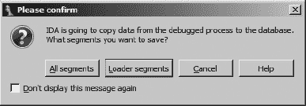

图 25-1. 内存快照确认对话框

默认选项是将运行进程的加载器段复制到数据库中。“加载器段”是指由创建当前数据库时使用的 IDA 加载器模块加载到数据库中的段。在加密程序的情况下，这些段中可能包含被加密的数据，因此在反汇编器中几乎不可能分析。这些正是你希望从运行进程映像中复制回以利用在调试器控制下运行的进程执行的解密工作的段。

选择“所有段”会导致所有由调试器创建的段被复制回数据库。这些段包括为支持该过程而加载的所有共享库的内容，以及与过程相关的其他段，如栈和堆的内容。

当调试器用于连接到一个没有关联数据库的现有进程时，由于文件不是由 IDA 的加载器加载的，因此没有调试器段会被标记为加载器段。在这种情况下，您可以选择将所有可用的段捕获到一个新的数据库中。或者，您可以选择编辑段属性，将一个或多个段指定为加载器段。可以通过首先打开段窗口（视图 ▸ 打开子视图 ▸ 段）来编辑段属性。任何标记为加载器段的段将在程序分段窗口的 L 列中包含一个*L*。右键单击感兴趣的段并选择编辑段将打开图 25-2 中显示的段属性对话框。

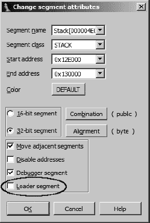

图 25-2. 带有加载器段复选框的段编辑对话框

选择加载器段复选框将段标记为加载器段，并允许它与其他所有加载器段一起复制到数据库中。

当您从打开的数据库创建一个进程，并在进行内存快照之前添加额外的加载器段时，段属性对话框也非常有用。例如，如果一个混淆进程将原始代码提取到堆（或内存映射块）中分配的内存块，您将希望在快照内存之前将该内存块标记为加载器段；否则，去混淆代码将不会复制回您的数据库。

# 调试混淆代码

我们多次提到，在调试器中加载一个混淆程序，让它运行直到混淆过程完成，然后对程序在去混淆状态下的内存进行快照，这似乎是获取程序去混淆版本的一个好策略。相对于调试，控制执行可能是更恰当的思考方式，因为我们实际上只是在观察代码运行状态，并在适当的时候进行内存快照。调试器只是恰好是我们完成这项任务的工具。至少这是我们希望的情况。在第二十一章中，我们讨论了几种混淆器用来防止我们获得程序清晰视图的反反汇编和反调试技术。现在是时候看看 IDA 的调试器如何帮助我们绕过这些技术了。

对于本章，我们将假设我们处理的混淆程序在二进制文件的有兴趣部分使用了某种形式的加密或压缩。获取该代码清晰图像的难度完全取决于在混淆过程中使用的任何反分析技术的复杂性以及可以开发的绕过这些技术的措施。然而，在我们开始之前，这里有一些在调试环境中处理恶意软件时应遵守的规则：

1.  保护你的网络和主机环境。始终在沙盒环境中工作。

1.  在初步分析时，尽可能使用单步执行。这可能很繁琐，但这是你防止程序逃离控制的最佳防御手段。

1.  在执行任何允许执行多个指令的调试器命令之前，始终三思而后行。如果你没有妥善计划，你正在调试的程序可能会遇到恶意代码部分。

1.  当可能时，使用硬件断点。在混淆代码中设置软件断点很困难，因为解混淆算法可能会修改你插入的断点指令或对代码区域计算校验和。^[[230]

1.  在首次检查程序时，最好让调试器处理程序生成的所有异常，这样你可以做出明智的决定，决定哪些异常传递给程序，哪些异常由调试器继续捕获。

1.  准备好经常重新启动调试，因为一个错误的步骤可能会让你走向失败的道路（例如，如果你允许进程检测到调试器）。详细记录安全运行的地址，以便你在重新启动进程时可以快速恢复。

通常情况下，当你第一次开始处理一个特定的混淆程序时，你应该始终采取非常谨慎的态度。在大多数情况下，你的主要目标应该是获取程序的解混淆版本。通过学习在需要设置断点之前你能走多远来加快解混淆过程应该是次要目标，而且这最好是在你第一次成功解混淆一个程序之后作为后续练习来保存。

## 启动进程

无论你使用 IDA 研究恶意可执行文件花费了分钟还是数小时，你可能会希望在第一次在调试器中启动它时尽快控制它。控制进程的最简单方法之一是在进程的入口点设置断点，这是在操作完成创建进程内存映像后执行的第一条指令。在大多数情况下，这将是由标签 `start` 标记的符号；然而，在某些情况下则不是。例如，PE 文件格式允许指定 TLS^([231]) 回调函数，这些函数旨在为每个线程本地的数据进行初始化和销毁任务，并且这些 TLS 回调函数在控制权传递到 `start` 之前就会被调用。

恶意软件作者对 TLS 回调函数非常了解，并已利用这些函数在程序的主入口点代码有机会运行之前执行代码。希望任何分析恶意软件的人都会忽略 TLS 回调的存在，从而导致无法理解正在分析的程序的真正行为。IDA 正确解析 PE 文件头，并识别出 PE 文件中包含的任何 TLS 回调，将这些函数添加到二进制文件的入口点列表中。图 25-3 显示了包含 TLS 回调的可执行文件的 Exports 窗口。图 25-3。


图 25-3. 显示 TLS 回调函数的 Exports 窗口

关于 TLS 回调的底线是识别它们的存在，然后在每个 TLS 回调函数的开始处设置断点，以确保你在为时已晚之前控制住进程。

许多调试器提供选项来指定（如果有的话）在初始进程创建后何时（如果有的话）暂停调试器，IDA 也不例外。图 25-4 显示了 IDA 的调试器设置对话框（调试器 ▸ 调试器选项）的一部分。


图 25-4. 调试器暂停事件

每个可用的选项都提供了在特定事件发生时自动暂停正在调试的进程的机会。以下列表总结了这些事件：

| **在调试开始时停止** 此选项提供了在进程创建后暂停调试器的最早机会。例如，在 Windows 7 上，这将在 `ntdll.dll` 中的 `RtlUserThread-Star``t` 函数的开始处暂停进程。这将暂停执行，在包括 TLS 回调函数在内的任何程序代码执行之前。 |
| --- |
| **在进程入口点停止** 当程序入口点被达到时，会使调试器暂停执行。这通常与你在 IDA 数据库中名为 `start`（或其等效名称）的符号相对应。在此事件发生之前，任何 TLS 回调函数都已经执行完毕。 |
| **在线程开始/退出时停止** 每当新线程开始或现有线程终止时，都会暂停调试器。在 Windows 系统中，当此事件触发时，调试器将在 *kernel32.dll* 中某个位置暂停。 |
| **在库加载/卸载时停止** 每当加载新库或卸载现有库时，都会暂停调试器。在 Windows 系统中，当此事件触发时，调试器将在 *kernel32.dll* 中某个位置暂停。 |
| **在调试消息停止** 每当进程使用调试打印功能输出消息时，都会暂停执行。在 Windows 系统中，这对应于对 `OutputDebugString` 的调用，并且执行将在 *kernel32.dll* 中暂停。 |

理解在每个调试器事件中进程可能暂停的位置对于防止你正在调试的进程执行超出你的预期非常重要。一旦你确定你将以可预测的方式控制进程，你就可以继续使用调试器进行一些工作了。

## 简单解密和解压缩循环

当我们说 *简单的解密和解压缩循环* 时，我们指的是没有使用嵌套混淆技术，并且你可以确定所有可能的退出点的循环。当你遇到这样的循环时，通过在所有可能的退出点设置断点并允许循环执行来通过它们是最简单的方法。考虑单步执行这样的循环一两次，以便了解它们；然后相应地设置断点。在循环之后立即设置断点时，你应该确保你设置断点的地址处的字节在循环过程中不会改变；否则，软件断点可能无法触发。如有疑问，请使用硬件断点。

如果你的目标是开发一个完全自动化的去混淆过程，你需要开发一个算法来识别去混淆过程何时完成。当满足此条件时，你的自动化解决方案可以暂停进程，此时你可以获取内存快照。对于简单的去混淆例程，识别去混淆阶段的结束可能就像注意指令指针或执行特定指令的值发生的大变化一样简单。例如，以下列表显示了混淆的 Windows 可执行文件的 `UPX` 解压缩例程的开始和结束：

```
UPX1:00410370 start proc near
   UPX1:00410370 pusha
    UPX1:00410371 mov     esi, offset off_40A000
    UPX1:00410376 lea     edi, [esi-9000h]
    UPX1:0041037C push    edi
    ...
    UPX1:004104EC pop     eax
   UPX1:004104ED popa                            ; opcode 0x53
    UPX1:004104EE lea     eax, [esp-80h]
    UPX1:004104F2
    UPX1:004104F2 loc_4104F2:                       ; CODE XREF: start+186↓j
    UPX1:004104F2 push    0
    UPX1:004104F4 cmp     esp, eax
    UPX1:004104F6 jnz     short loc_4104F2
    UPX1:004104F8 sub     esp, 0FFFFFF80h
   UPX1:004104FB jmp     loc_40134C
```

这个例程的几个特征可以用来自动识别其完成。首先，例程从程序入口点开始，将所有寄存器推入堆栈 ![http://atomoreilly.com/source/no_starch_images/854061.png]。在程序解压缩后，例程的末尾发生弹出所有寄存器的互补操作 ![http://atomoreilly.com/source/no_starch_images/854063.png]。最后，控制权转移到新解包的程序 ![http://atomoreilly.com/source/no_starch_images/854093.png]。因此，自动化解压缩的一种策略是逐步跟踪程序，直到当前指令是 `popa`。因为逐步跟踪很慢，所以示例 25-1 中显示的 IDC 脚本采取了稍微不同的方法：扫描 `popa` 指令，然后运行程序到 `popa` 的地址：

示例 25-1. 简单 UPX 解包脚本

```
#include <idc.idc>

    #define POPA 0x53

    static main() {
       auto addr, seg;
       addr = BeginEA();   //Obtain the entry point address
       seg = SegName(addr);
      while (addr != BADADDR && SegName(addr) == seg) {
         if (Byte(addr) == POPA) {
            RunTo(addr);
             GetDebuggerEvent(WFNE_SUSP, −1);
             Warning("Program is unpacked!");
            TakeMemorySnapshot(1);
             return;
            }
         addr = FindCode(addr, SEARCH_NEXT | SEARCH_DOWN);
       }
       Warning("Failed to locate popa!");
    }
```

示例 25-1 中的脚本设计为在 IDA 数据库中启动，在启动调试器之前，并假设您之前已使用“调试器”>>“选择调试器”选择了一个调试器。该脚本负责启动调试器和获取新创建进程的控制权。这个脚本依赖于 UPX 的一些非常特定的功能，因此不适合用作通用去混淆脚本。然而，它确实演示了一些可能在后续工作中使用到的概念。该脚本依赖于解压缩例程位于程序段末尾的事实（通常命名为 `UPX1`），以及 `UPX` 没有使用任何反汇编同步技术的事实。

混淆混淆器

UPX 是目前使用中较受欢迎的混淆工具之一（可能是因为它是免费的）。然而，它的流行并不使其成为一个特别有效的工具。其有效性的主要缺点之一是 UPX 本身提供了一个命令行选项，可以将 UPX 打包的二进制文件恢复到其原始形式。因此，一个 cottage industry 已经发展起来，开发防止 UPX 自解包的工具。因为 UPX 在解包二进制文件之前会对压缩的二进制文件进行一些完整性检查，所以简单的更改会导致完整性检查失败，而不会影响压缩二进制文件的操作，这使得 UPX 的自解包功能失效。一种这样的技术涉及将默认 UPX 段名称更改为除 UPX0、UPX1 和 UPX2 之外的其他名称。因此，在您开发的任何解包脚本中避免将这些段名称硬编码进去是有用的。

脚本依赖于这些事实来逐条指令向前扫描，每次一个指令 ![http://atomoreilly.com/source/nostarch/images/854061.png]，从程序入口点开始，只要下一个指令位于相同的程序段内 ![http://atomoreilly.com/source/nostarch/images/854063.png]，并且直到当前指令是 `popa` ![http://atomoreilly.com/source/nostarch/images/854093.png]。一旦找到 `popa` 指令，调试器就会被调用 ![http://atomoreilly.com/source/nostarch/images/854095.png] 来执行直到 `popa` 指令地址的过程，此时程序已经被解压缩。最后一步是获取内存快照 ![http://atomoreilly.com/source/nostarch/images/854099.png]，将解混淆后的程序字节拉回到我们的数据库以进行进一步分析。

对于自动化解包，一个更通用的解决方案是利用这样一个事实：许多解混淆例程被附加到二进制文件的末尾，并在解混淆完成后跳转到原始入口点，该入口点在二进制文件中发生得要早得多。在某些情况下，原始入口点可能位于完全不同的程序段中，而在其他情况下，原始入口点简单地位于解混淆代码使用的任何地址之前。Python 脚本 示例 25-2 提供了一种更基本的方法来运行一个简单的解混淆算法，直到它跳转到程序的原始入口点：

示例 25-2. 通用尝试运行直到遇到 OEP

```
start = BeginEA()
  RunTo(start)
   GetDebuggerEvent(WFNE_SUSP, −1)
  EnableTracing(TRACE_STEP, 1)
   code = GetDebuggerEvent(WFNE_ANY | WFNE_CONT, −1)
   while code > 0:
     if GetEventEa() < start: break
      code = GetDebuggerEvent(WFNE_ANY | WFNE_CONT, −1)
  PauseProcess()
   GetDebuggerEvent(WFNE_SUSP, −1)
  EnableTracing(TRACE_STEP, 0)
  MakeCode(GetEventEa())
   TakeMemorySnapshot(1)
```

与 示例 25-1 中的脚本类似，这个脚本应该从反汇编器而不是调试器启动，并且再次假设已经选择了调试器。脚本处理启动调试器和获取新创建进程所需控制权的细节。这个特定的脚本有两个假设：即入口点之前的所有代码都是混淆的，并且在将控制权转移到入口点之前的地址之前没有发生恶意行为。脚本首先启动调试器，并在程序入口点暂停 ![http://atomoreilly.com/source/nostarch/images/854061.png]。接下来，程序启用单步跟踪 ![http://atomoreilly.com/source/nostarch/images/854063.png] 并循环测试每个生成事件的地址 ![http://atomoreilly.com/source/nostarch/images/854093.png]。一旦事件地址在程序入口点地址之前，就假设解混淆已完成，进程被暂停 ![http://atomoreilly.com/source/nostarch/images/854095.png] 并且单步跟踪被禁用 ![http://atomoreilly.com/source/nostarch/images/854099.png]。最后，为了保险起见，脚本确保当前指令指针位置的字节格式化为代码 ![http://atomoreilly.com/source/nostarch/images/854101.png]。

当您通过去混淆代码进行单步调试时，遇到图 25-5 中显示的警告并不罕见。


图 25-5. 调试器指令指针警告

这个警告表明指令指针指向了 IDA 认为是数据的项目，或者指令指针指向了之前已反汇编指令的中间部分。当单步执行使用反汇编不同步技术的代码时，经常会遇到这种警告。它也经常在程序跳转到曾经是数据现在是代码的区域时遇到，例如在程序去混淆之后。回答“是”会导致 IDA 重新格式化相关字节作为代码，这应该是正确的做法，因为指令指针表明这是下一个要取来执行的项目。

注意，由于使用了步骤跟踪，示例 25-2 中的脚本将比 示例 25-1 中的脚本慢得多。然而，以牺牲执行速度为代价，我们获得了一些优势。首先，我们能够指定一个与任何特定地址无关的终止条件。单独使用断点时这是不可能的。其次，这个脚本对任何试图使反汇编器不同步的尝试都具有免疫力，因为指令边界完全是基于指令指针的运行时值而不是静态反汇编分析来确定的。在介绍脚本调试功能的公告中^([232])，Hex-Rays 展示了一个执行通用解包器任务的脚本，其鲁棒性要高得多。

## 导入表重建

一旦二进制文件被去混淆，就可以开始对该二进制文件进行分析。虽然我们可能永远不会意图执行去混淆的程序（实际上，如果直接将快照拉入 IDA 数据库，我们无法执行该程序），但一个程序的导入表通常是了解程序行为的一个宝贵资源。

在正常情况下，IDA 能够在创建初始数据库时，作为文件加载过程的一部分解析程序的导入表。不幸的是，在混淆程序中，IDA 在加载时看到的唯一导入表属于程序的解混淆组件。这个导入表通常只包含完成解混淆过程所需的最基本的函数。最复杂的混淆器可能会生成空的导入表，在这种情况下，解混淆组件必须包含加载库和自行解析所需函数的所有必要代码。

至于被混淆的二进制文件，在大多数情况下，其导入表也被混淆，并在解混淆过程中以某种形式重建。重建过程通常依赖于新解混淆的数据来执行自己的库加载和函数地址解析。对于 Windows 程序，这几乎总是涉及到对`LoadLibrary`函数的调用，以及重复调用`GetProcAddress`来解析所需的函数地址。

更复杂的导入表重建例程可能会使用自定义查找函数代替`GetProcAddress`，以避免触发对`GetProcAddress`本身的任何断点设置。这些例程还可能用哈希值代替字符串来识别请求的是哪个函数的地址。在罕见的情况下，导入表重建器甚至可能绕过`LoadLibrary`，在这种情况下，重建例程必须实现该函数的自己的自定义版本。

导入表重建过程的净结果是通常是一个函数地址表，在静态分析环境中，这些地址几乎都没有什么意义。如果我们对某个进程进行内存快照，我们可能得到的最好结果就像以下部分列表：

```
UPX1:0040A000 dword_40A000    dd 7C812F1Dh        ; DATA XREF: start+1↓o
UPX1:0040A004 dword_40A004    dd 7C91043Dh        ; DATA XREF: sub_403BF3+68↑r
UPX1:0040A004                                     ; sub_405F0B+2B4↑r ...
UPX1:0040A008                 dd 7C812ADEh
UPX1:0040A00C dword_40A00C    dd 7C9105D4h        ; DATA XREF: sub_40621F+5D↑r
UPX1:0040A00C                                     ; sub_4070E8+F↑r ...
UPX1:0040A010                 dd 7C80ABC1h
UPX1:0040A014 dword_40A014    dd 7C901005h        ; DATA XREF: sub_401564+34↑r
UPX1:0040A014                                     ; sub_4015A0+27↑r ...
```

这块数据表示了一组紧密相邻的 4 字节值，这些值在程序中的多个位置被引用。问题是这些值，例如 `7C812F1Dh`，代表了在调试过程中映射的库函数的地址。在程序本身的代码部分，我们会看到类似以下的函数调用：

```
UPX0:00403C5B               call    ds:dword_40A004
UPX0:00403C61                 test    eax, eax
UPX0:00403C63                 jnz     short loc_403C7B
UPX0:00403C65                call    sub_40230F
UPX0:00403C6A                 mov     esi, eax
UPX0:00403C6C                call    ds:dword_40A058
```

注意，其中两个函数调用（ 和 ）指的是重建的导入表的内容，而第三个函数调用  指的是数据库中存在的函数体。在理想的世界里，重建的导入表中的每一项都应该以包含其地址的函数命名。

在对去混淆过程进行内存快照之前，最好解决此问题。如图所示，如果我们从调试器内部查看相同的内存范围，我们会得到一个完全不同的画面。由于调试器可以访问每个引用函数所在的内存区域，因此调试器能够显示地址（例如 `7C812F1Dh`）及其对应的符号名称（在这种情况下为 `kernel32_GetCommandLineA`）。

```
UPX1:0040A000 off_40A000 dd offset kernel32_GetCommand
LineA ; DATA XREF:UPX0:loc_40128F↑r
UPX1:0040A000                                               ; start+1↓o
UPX1:0040A004 off_40A004 dd offset ntdll_RtlFreeHeap        ; DATA XREF:
 UPX0:004011E4↑r
UPX1:0040A004                                               ; UPX0:0040120A↑r ...
UPX1:0040A008 off_40A008 dd offset kernel32_GetVersionExA   ; DATA
 XREF: UPX0:004011D4↑r
UPX1:0040A00C dd offset ntdll_RtlAllocateHeap               ; DATA
 XREF: UPX0:004011B3↑r
UPX1:0040A00C                                               ; sub_405E98+D↑r ...
UPX1:0040A010 off_40A010 dd offset kernel32_GetProcessHeap  ; DATA
 XREF: UPX0:004011AA↑r
UPX1:0040A014 dd offset ntdll_RtlEnterCriticalSection ; DATA XREF: sub_401564+34↑r
UPX1:0040A014                                         ; sub_4015A0+27↑r ...
```

值得注意的是，此时调试器采用的命名方案与我们习惯的略有不同。调试器将所有从共享库导出的函数名称前缀为关联库的名称，后跟一个下划线。例如，*kernel32.dll* 中的函数 `GetCommandLineA` 被分配名称 `kernel32_GetCommandLineA`。这确保了如果两个库导出相同的名称，将生成唯一的名称。

我们需要克服前面列表中导入表的两个问题。首先，为了使函数调用更易于阅读，我们需要根据引用的函数为导入表中的每个条目命名。如果条目被正确命名，IDA 将自动从其类型库中显示函数签名。只要我们有名字可以分配，命名每个导入表条目相对容易。这导致第二个问题：获取正确的名称。一种方法是从调试器生成的名称中解析，去掉库名称，并将剩余的文本作为导入表条目的名称。这种方法唯一的问题是库名称和函数名称都可能包含下划线字符，这使在某些情况下难以确定较长名称字符串中函数名称的确切长度。认识到这个困难，尽管如此，这种方法仍然是随 IDA 一起提供的 *renimp.idc* 导入表重命名脚本（位于 *<IDADIR>/idc*）所采用的方法。

为了使此脚本正确执行，必须在调试器活动时运行它（以便它能够访问已加载的库名称），并且我们必须能够定位去混淆二进制文件中的重建导入表。确定重建导入表将位于何处的一种策略是跟踪对 `GetProcAddress` 的调用，并注意结果存储到内存中的位置。示例 25-3 展示了 UPX 用于调用 `GetProcAddress` 并存储结果的代码。

示例 25-3. UPX 代码用于解析和存储导入函数地址

```
UPX1:00408897           call    dword ptr [esi+8090h]
UPX1:0040889D             or      eax, eax
UPX1:0040889F             jz      short loc_4088A8
UPX1:004088A1            mov     [ebx], eax
UPX1:004088A3            add     ebx, 4
```

在处发生对`GetProcAddress`的调用，结果存储在处的内存中。在处记录`ebx`寄存器中的值将告诉我们导入表的位置。在处，`ebx`寄存器向前推进四个字节，为函数解析循环的下一迭代做准备。

一旦我们找到了重建的导入表，*renimp.idc*要求我们通过从表头到表尾的点击和拖动操作突出显示表的内容。*renimp.idc*脚本遍历选择区域，获取引用函数的名称，移除库名称前缀，并相应地命名导入表条目。执行此脚本后，之前显示的导入表转换为以下导入表：

```
UPX1:0040A000 ; LPSTR __stdcall GetCommandLineA()
UPX1:0040A000 GetCommandLineA dd offset kernel32_GetCommandLineA
UPX1:0040A000                                         ; DATA XREF: UPX0:loc_40128F↑r
UPX1:0040A000                                         ; start+1↓o
UPX1:0040A004 RtlFreeHeap dd offset ntdll_RtlFreeHeap ; DATA XREF: UPX0:004011E4↑r
UPX1:0040A004                                         ; UPX0:0040120A↑r ...
UPX1:0040A008 ; BOOL __stdcall GetVersionExA(LPOSVERSIONINFOA lpVersionInformation)
UPX1:0040A008 GetVersionExA dd offset kernel32_GetVersionExA ; DATA
 XREF: UPX0:004011D4↑r
UPX1:0040A00C RtlAllocateHeap dd offset ntdll_RtlAllocateHeap ; DATA
 XREF: UPX0:004011B3↑r
UPX1:0040A00C                                         ; sub_405E98+D↑r ...
UPX1:0040A010 ; HANDLE __stdcall GetProcessHeap()
UPX1:0040A010 GetProcessHeap dd offset kernel
32_GetProcessHeap ; DATA XREF: UPX0:004011AA↑r
UPX1:0040A014 RtlEnterCriticalSection dd offset ntdll_RtlEnterCriticalSection
UPX1:0040A014                                         ; DATA XREF: sub_401564+34↑r
UPX1:0040A014                                         ; sub_4015A0+27↑r ...
```

我们看到脚本已经完成了每个导入表条目的重命名工作，但 IDA 为 IDA 所知的每个函数类型添加了函数原型。请注意，如果从每个函数名称中移除了库名称前缀，则不会显示任何类型信息。当函数所在的模块名称包含下划线时，`*renimp.idc*`脚本可能无法正确提取导入函数名称。`ws2_32`网络库是一个著名的例子，其名称恰好包含下划线。在`*renimp.idc*`中，对`ws2_32`的特殊处理发生；然而，任何名称包含下划线的其他模块都可能导致`*renimp.idc*`错误地解析函数名称。

当单个指令负责存储所有解析的函数地址时，例如示例 25-3 中 UPX 所做的那样，可以采用重命名导入表条目的另一种方法。如果可以识别出这样的指令，例如列表中的处的指令，那么我们可以利用 IDA 中断点条件使用 IDC 语句指定的这一事实。在这种情况下，我们可以在地址`004088A1`处设置一个条件断点，并使条件表达式调用我们定义的函数。在这里，我们命名该函数为`createImportLabel`，并定义如下：

```
static createImportLabel() {
   auto n = Name(EAX);
   auto i = strstr(n, "_");
   while (i != −1) {
      n = n[i+1:];
      i = strstr(n, "_");
   }
   MakeUnkn(EBX,DOUNK_EXPAND);
   MakeDword(EBX);
   if (MakeNameEx(EBX,n,SN_NOWARN) == 0) {
      MakeNameEx(EBX,n + "_",SN_NOWARN);
   }
   return 0;
}
```

此函数首先查询由 EAX 引用的名称。回想一下，EAX 包含对`GetProcAddress`的调用结果，因此应该指向某个 DLL 中的函数。接下来，函数循环以截断名称，只保留原始名称中找到的最后一个下划线之后的那个部分。最后，通过一系列函数调用，将目标位置（由 EBX 引用）正确格式化为一个 4 字节数据项，并给该位置应用一个名称。通过返回零，函数通知 IDA 该断点不应被尊重，结果是执行继续而不会暂停。

在第二十四章中，我们讨论了如何在 IDA 的调试器中指定断点条件。将用户定义的函数作为断点处理程序安装并不像设置和编辑断点以及将`createImportLabel()`作为断点条件那样简单直接。虽然这正是我们希望在此情况下输入的条件，但问题是，从 IDA 的角度来看，`createImportLabel`是一个未定义的函数。解决这个问题的方法是创建一个包含我们的函数以及一个简单的`main`函数的脚本文件（IDC 按定义），该`main`函数看起来如下所示：

```
static main() {
   AddBpt(ScreenEA());
   SetBptCnd(ScreenEA(), "createImportLabel()");
}
```

将光标放在你想要设置断点的指令上，然后运行此脚本（文件 ▸ 脚本文件），结果是在每次命中时调用`createImportLabel`的条件断点。`AddBpt`函数  在指定位置（在这种情况下是光标位置）添加一个断点，而`SetBptCnd`函数  向现有的断点添加一个条件。条件被指定为一个字符串，包含每次断点命中时评估的 IDC 语句。有了这个断点，一旦反混淆完成，我们就不必费心在进程的内存空间中定位表，就可以拥有一个带有标签的导入表。

另一种获取名称信息的方法是搜索与函数地址关联的文件头，然后解析这些头文件中描述的导出表以找到引用的函数名称。这本质上是在给定函数地址的情况下对函数名称的反向查找。基于这个概念编写的脚本（*RebuildImports.idc/RebuildImports.py*）可在本书的网站上找到。这两个脚本中的任何一个都可以替代*renimp.idc*执行，几乎得到相同的结果。*renimp.idc*在处理包含下划线字符的模块名称时遇到的问题被避免了，因为函数名称是直接从进程地址空间中存在的导出表中提取的。

正确命名每个导入表条目的效果会传递到反汇编本身，如下面的自动更新的反汇编列表所示：

```
UPX0:00403C5B call    ds:RtlFreeHeap
UPX0:00403C61 test    eax, eax
UPX0:00403C63 jnz     short loc_403C7B
UPX0:00403C65 call    sub_40230F
UPX0:00403C6A mov     esi, eax
UPX0:00403C6C call    ds:RtlGetLastWin32Error
```

每个重命名导入表条目的名称都会传播到所有调用导入函数的位置，这使得反汇编代码更加易于阅读。值得注意的是，你在调试器内进行的工作中的任何格式更改都会自动应用到数据库视图中。换句话说，你不需要仅仅为了捕获所做的格式更改而采取内存快照。内存快照的目的是将进程地址空间中的内存内容（代码和数据）迁移回 IDA 数据库。

## 隐藏调试器

防止使用调试器作为去混淆工具的一种流行方法是*调试器检测*。混淆工具的作者就像你一样明白调试器对于撤销他们的工作是有用的。作为回应，他们通常会采取措施防止他们的工具在检测到调试器的情况下运行。我们在第二十一章中讨论了几种调试器检测方法。正如第二十一章中提到的，Nicolas Falliere 的文章“Windows Anti-Debug Reference”^([233])对许多针对 Windows 的检测调试器存在的技术进行了很好的总结。你可以通过使用一个简单的脚本来启动你的调试器会话并自动配置一些断点来对抗这些检测技术。虽然可以使用 Python 来对抗这些技术中的一些，但我们将最终使用条件断点，这只能使用 IDC 来指定。因此，以下示例代码都是用 IDC 编写的。

为了从脚本中启动调试会话，我们首先编写以下代码：

```
auto n;
   for (n = 0; n < GetEntryPointQty(); n++) {
      auto ord = GetEntryOrdinal(n);
      if (GetEntryName(ord) == "TlsCallback_0") {
         AddBpt(GetEntryPoint(ord));
         break;
      }
   }
   RunTo(BeginEA());
   GetDebuggerEvent(WFNE_SUSP, −1);
```

这些语句检查 TLS 回调函数的存在，如果找到则设置断点，然后启动调试器，在等待操作完成之前请求在入口点地址处中断（严格来说，我们还应该测试`GetDebuggerEvent`的返回值）。一旦我们的脚本恢复控制，我们就有一个活动的调试器会话，我们想要调试的进程及其依赖的所有库都会映射到内存中。

我们将绕过的第一个调试器检测是进程环境块（PEB）中的 `IsDebugged` 字段。这是一个 1 字节字段，如果进程正在被调试，则设置为值 1，否则为 0。该字段位于 PEB 的 2 字节处，因此我们只需要找到 PEB 并修补适当的字节为值 0。这也恰好是 Windows API 函数 `IsDebuggerPresent` 测试的字段，因此在这种情况下我们一石二鸟。如果我们知道我们已经停止在程序入口点而不是 TLS 回调中，那么定位 PEB 就变得相当简单，因为 EBX 寄存器在进程进入时包含对 PEB 的指针。如果进程停止在 TLS 回调函数中，那么我们需要一种更通用的方法来找到 PEB。我们将采取类似于在 shellcode 和混淆器中经常使用的方法。基本思想是定位当前的 *线程信息块（TIB）*^([234]) 并跟随一个嵌入的指针找到 PEB。以下代码定位 PEB 并执行适当的修补：

```
auto seg;
   auto peb = 0;
   auto tid = GetCurrentThreadId();
   auto tib = sprintf("TIB[%08X]", tid); //IDA naming convention
   for (seg = FirstSeg(); seg != BADADDR; seg = NextSeg(seg)) {
      if (SegName(seg) == tib) {
         peb = Dword(seg + 0x30); //read PEB pointer from TIB
         break;
      }
   }
   if (peb != 0) {
      PatchDbgByte(peb + 2, 0);  //Set PEB!IsDebugged to zero
   }
```

注意，`PatchDbgByte` 函数是在 IDA 5.5 版本中引入的。当与 IDA 5.5 之前的版本一起使用时，`PatchByte` 将会工作，但如果指定的地址存在于数据库中，它也会修改（修补）数据库。

Falliere 文章中提到的另一种反调试技术涉及测试 PEB 中名为 `NtGlobalFlags` 的另一个字段中的几个位。这些位与进程堆的运行相关，当进程正在被调试时设置为 1。假设变量 `peb` 从上一个示例中保持设置，以下代码从 PEB 中检索 `NtGlobalFlags` 字段，重置有问题的位，并将标志存储回 PEB。

```
globalFlags = Dword(peb + 0x68) & ~0x70; //read and mask PEB.NtGlobalFlags
PatchDword(peb + 0x68, globalFlags);     //patch PEB.NtGlobalFlags
```

Falliere 文章中提到的几种技术依赖于系统函数在调试进程时返回的信息差异，与未调试进程时返回的信息差异。文章中提到的第一个函数是 `NtQueryInformationProcess`，位于 `ntdll.dll` 中。使用此函数，进程可以请求有关其 `ProcessDebugPort` 的信息。如果进程正在被调试，则结果非零；如果未调试，则结果应为零。避免以这种方式检测的一种方法是在 `NtQueryInformationProcess` 上设置断点，然后指定一个断点条件函数来过滤掉 `ProcessDebugPort` 请求。为了自动定位此指令，我们采取以下步骤：

1.  查找 `NtQueryInformationProcess` 的地址。

1.  在 `NtQueryInformationProcess` 上设置断点。

1.  添加一个断点条件来调用我们将命名的函数 `bpt_NtQueryInformationProcess`，该函数将在每次调用 `NtQuery-InformationProcess` 时执行。

为了找到`NtQueryInformationProcess`的地址，我们需要记住在调试器中该函数将被命名为`ntdll_NtQueryInformationProcess`。配置必要的断点的代码如下：

```
func = LocByName("ntdll_NtQueryInformationProcess");
   AddBpt(func);
   SetBptCnd(func, "bpt_NtQueryInformationProcess()");
```

剩下的工作是为我们实现一个断点函数，该函数将使调试器对询问进程保持隐藏。`NtQueryInformationProcess`的原型如下所示：

```
NTSTATUS WINAPI NtQueryInformationProcess(
      __in       HANDLE ProcessHandle,
     __in       PROCESSINFOCLASS ProcessInformationClass,
     __out      PVOID ProcessInformation,
      __in       ULONG ProcessInformationLength,
      __out_opt  PULONG ReturnLength
  );
```

通过在`ProcessInformationClass`参数中提供一个整数查询标识符来请求进程信息 。信息通过由`ProcessInformation`参数指向的用户提供的缓冲区返回 。调用者可以通过传递枚举常量`ProcessDebugPort`（值为 7）来查询给定进程的调试状态。如果进程正在由用户空间调试器调试，则通过提供的指针传递的返回值将非零。如果进程没有被调试，则返回值将为零。以下是一个始终将`ProcessDebugPort`返回值设置为零的断点函数示例：

```
#define ProcessDebugPort 7
  static bpt_NtQueryInformationProcess() {
     auto p_ret;
   if (Dword(ESP + 8) == ProcessDebugPort) {//test ProcessInformationClass
       p_ret = Dword(ESP + 12);
       if (p_ret) {
          PatchDword(p_ret, 0);  //fake no debugger present
        }
       EIP = Dword(ESP);   //skip function, just return
       ESP = ESP + 24;     //stdcall so clear args from stack
       EAX = 0;            //signifies success
     }
     return 0;  //don't pause at the breakpoint
  }
```

请记住，每次调用`NtQueryInformationProcess`时都会调用此函数。进入时，栈指针指向保存的返回地址，该地址位于`NtQueryInformationProcess`的五个参数之上。断点函数首先检查`ProcessInformation-Class`的值以确定调用者是否请求`ProcessDebugPort`信息 。如果调用者请求`ProcessDebugPort`，函数将继续通过检索返回值指针 ，检查它是否非空 ，并最终将返回值存储为零 ，使其看起来没有调试器附加。为了跳过函数的其余部分，然后通过读取保存的返回地址  修改 EIP，之后调整 ESP 以模拟`stdcall`返回 。"NtQueryInformationProcess"返回一个 NTSTATUS 代码，在返回之前将其设置为 0（成功）。

Falliere 文章中提到的另一个函数是`NtSetInformation-Thread`，它也位于`ntdll.dll`中。此函数的原型如下所示：

```
NTSTATUS NtSetInformationThread(
   IN HANDLE  ThreadHandle,
   IN THREADINFOCLASS  ThreadInformationClass,
   IN PVOID  ThreadInformation,
   IN ULONG  ThreadInformationLength
);
```

反调试技术涉及在`ThreadInformationClass`参数中传递`ThreadHideFromDebugger`的值，这将导致线程从调试器中分离。绕过此技术涉及与上一个示例相同的基本设置。结果设置代码如下：

```
func = LocByName("ntdll_NtSetInformationThread");
AddBpt(func);                  //break at function entry
SetBptCnd(func, "bpt_NtSetInformationThread()");
```

相关的断点函数如下所示：

```
#define ThreadHideFromDebugger 0x11
  static bpt_NtSetInformationThread() {
    if
 (Dword(ESP + 8) == ThreadHideFromDebugger) {//test ThreadInformationClass
       EAX = 0;        //STATUS_SUCCESS
       EIP = Dword(ESP); //just return
       ESP = ESP + 20;   //simulate stdcall
     }
     return 0;
  }
```

在进入时，我们测试`ThreadInformationClass`参数的值 ，如果用户指定了`ThreadHideFromDebugger`，则绕过函数体。绕过函数体是通过设置我们期望的返回值  并通过从堆栈中读取保存的返回地址来修改指令指针 。我们通过调整 ESP 20 个字节来模拟`stdcall`返回 。

我们将要讨论的最后一个函数，其作为反调试技术的使用也在 Falliere 的文章中讨论过，是来自`kernel32.dll`的`OutputDebugStringA`。此函数的原型如下所示：

```
void WINAPI OutputDebugStringA(
   __in_opt  LPCTSTR lpOutputString
);
```

在此示例中，`WINAPI`是`_stdcall`的同义词，用于指定`OutputDebugStringA`使用的调用约定。严格来说，此函数没有返回值，如其原型中指定的`void`返回类型；然而，根据文章，当没有调试器附加到调用进程时，此函数“返回”1，如果调用进程附加了调试器，则“返回”作为参数传递的字符串的地址。在正常情况下，返回值的`_stdcall`函数将返回值放在 EAX 寄存器中。由于`OutputDebugStringA`返回时 EAX 必须持有某个值，因此可以认为这是函数的返回值；然而，由于官方返回类型是`void`，没有文档或保证说明在这种情况下 EAX 可能实际持有的值。这种特定的反调试技术仅依赖于函数观察到的行为。解决观察到的返回值变化的一种方法是确保在`OutputDebugStringA`返回时 EAX 包含 1。以下 IDC 代码实现了这种技术：

```
func = LocByName("kernel32_OutputDebugStringA");
  AddBpt(func);
  //fix the return value as expected in non-debugged processes
  //also adjust EIP and ESP
 SetBptCnd(func, "!((EAX = 1) && (EIP = Dword(ESP)) && (ESP = ESP + 8))");
```

此示例使用与前面示例相同的技巧来自动定位`OutputDebugStringA`函数的结尾。然而，与前面的示例相比，当遇到断点时需要完成的工作足够简单，可以指定在 IDC 表达式中 （而不是需要一个专用函数）。在这种情况下，断点表达式修改（注意这是赋值而不是比较）EAX 寄存器，以确保函数返回时它包含 1，并调整 EIP 和 ESP 以绕过函数。断点条件被否定，以导致在所有情况下跳过断点，因为布尔*与*表达式的结果始终预期不为零。

一段脚本(*HideDebugger.idc*)，它将本节中展示的所有元素组合成一个有用的工具，可以同时启动调试会话并实施对抗反调试尝试的措施，可在本书的网站上找到。有关隐藏调试器存在的信息，请参阅 Ilfak 的博客，他在博客中介绍了几种隐藏技术.^([235])

* * *

^([230]) 请记住，调试器插入的软件断点指令会导致校验和计算的结果不是预期的结果。

^([231]) 有关线程局部存储 (TLS) 回调函数的更多信息，请参阅 PE 文件格式规范[`msdn.microsoft.com/en-us/windows/hardware/gg463119.aspx`](http://msdn.microsoft.com/en-us/windows/hardware/gg463119.aspx)。

^([232]) 请参阅[`www.hex-rays.com/idapro/scriptable.htm`](http://www.hex-rays.com/idapro/scriptable.htm)。

^([233]) 请参阅[`www.symantec.com/connect/articles/windows-anti-debug-reference/`](http://www.symantec.com/connect/articles/windows-anti-debug-reference/)。

^([234]) 这也被称为*线程环境块 (TEB)*。

^([235]) 请参阅[`www.hexblog.com/2005/11/simple_trick_to_hide_ida_debug.html`](http://www.hexblog.com/2005/11/simple_trick_to_hide_ida_debug.html)、[`www.hexblog.com/2005/11/stealth_plugin_1.html`](http://www.hexblog.com/2005/11/stealth_plugin_1.html)和[`www.hexblog.com/2005/11/the_ultimate_stealth_method_1.html`](http://www.hexblog.com/2005/11/the_ultimate_stealth_method_1.html)。

# IdaStealth

尽管上一节中讨论的*HideDebugger*脚本对于演示与调试器的某些基本程序性交互和库函数钩子的一些基础知识很有用，但已知反调试技术的总数和这些技术的复杂性表明，需要比简单脚本提供的更强大的反反调试功能。幸运的是，IdaStealth 插件旨在满足我们对强大调试器隐藏功能的需求。由 Jan Newger 编写的 IdaStealth 是 Hex-Rays 2009 插件编写大赛的获奖作品。该插件是用 C++编写的，并提供源代码和二进制形式。

| **名称** | IDAStealth |
| --- | --- |
| **作者** | Jan Newger |
| **分发** | C++源代码和二进制 |
| **价格** | 免费 |
| **描述** | Windows 调试器隐藏插件 |
| **信息** | [`www.newgre.net/idastealth/`](http://www.newgre.net/idastealth/) |

IDAStealth 的二进制组件包括一个插件和一个辅助库，这两个组件都需要安装到*<IDADIR>/plugins*目录下。在首次激活时，IDAStealth 会显示如图图 25-6 所示的配置对话框。

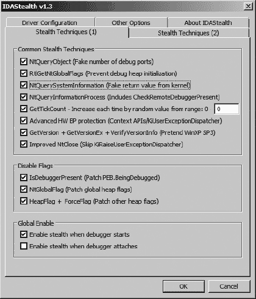

图 25-6. IDAStealth 配置对话框

几个选项卡充满了选项，允许你决定你想采用哪些反反调试技术。一旦激活，IDAStealth 将实现几乎所有已知的调试器检测技术的规避技术，包括在 Falliere 文章中讨论的以及由之前开发的*HideDebugger.idc*脚本解决的问题。

# 处理异常

有时，程序期望处理在执行过程中产生的任何异常。正如我们在第二十一章中看到的，混淆程序往往会故意生成异常，作为反控制流技术和反调试技术的手段。不幸的是，异常通常表明存在问题，而调试器的目的是帮助我们定位问题。因此，调试器通常希望处理程序运行时发生的所有异常，以帮助我们找到错误。

当一个程序期望处理自己的异常时，我们需要防止调试器拦截这些异常，或者至少，一旦异常被拦截，我们需要一种方法让调试器能够根据我们的意愿将异常转发给进程。幸运的是，IDA 的调试器具有在异常发生时传递单个异常或自动传递指定类型所有异常的能力。

自动异常处理通过“调试器”>>“调试器选项”命令进行配置；生成的对话框如图图 25-7 所示。


图 25-7. 调试器设置对话框

除了允许配置多个事件以自动停止调试器以及将多个事件自动记录到 IDA 的消息窗口外，调试器设置对话框还用于配置调试器的异常处理行为。点击“编辑异常”按钮将打开如图图 25-8 所示的异常配置对话框。

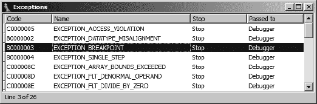

图 25-8. 异常配置对话框

对于调试器所知的每种异常类型，对话框列出了操作系统特定的异常代码、异常的名称、调试器是否会停止进程（`停止/否`），以及调试器是否会处理异常或自动将异常传递给应用程序（`调试器/应用程序`）。异常的主列表和每种异常的处理默认设置包含在`*<IDADIR>/cfg/exceptions.cfg*`中。此外，配置文件还包含在调试器执行进程时发生特定类型异常时要显示的消息。可以通过使用文本编辑器编辑`exceptions.cfg`来更改调试器的默认异常处理行为。在`exceptions.cfg`中，`stop`和`nostop`值用于指示当发生特定异常时，调试器是否应该挂起进程。

异常处理也可以通过编辑异常配置对话框中的单个异常来在会话级别（即，当你打开特定数据库时）进行配置。要修改调试器对特定异常类型的处理行为，请在异常配置对话框中右键单击所需的异常，然后选择**编辑**。图 25-9 显示了生成的异常编辑对话框。

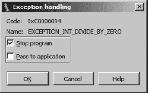

图 25-9. 异常编辑对话框

有两种选项，对应于`*exceptions.cfg*`中的两个可配置选项，可以为任何异常进行配置。首先，可以指定当发生指定类型的异常时，调试器是否应该停止进程，或者是否应该继续执行。请注意：如果同时选择让调试器处理异常，允许进程继续可能会导致无限循环的异常生成。

第二个配置选项允许你决定是否应该将给定的异常类型传递给正在调试的应用程序，以便应用程序有机会使用自己的异常处理器来处理异常。当应用程序的正确操作依赖于执行这些异常处理器时，你应该选择将相关的异常类型传递给应用程序。这在分析如 tElock 实用程序（该实用程序注册了自己的异常处理器）生成的混淆代码时可能需要（如第二十一章混淆代码分析中所述）。

除非你已配置 IDA 继续执行并将特定异常类型传递给应用程序，否则 IDA 将在异常发生时暂停执行并向你报告。如果你选择继续程序的执行，IDA 将显示如图图 25-10 所示的异常处理对话框。

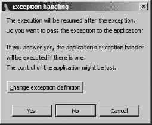

图 25-10. 异常处理对话框

在此阶段，你可以选择更改 IDA 处理给定异常类型的方式（更改异常定义），将异常传递给应用程序（是），或者允许 IDA 消耗异常（否）。将异常传递给应用程序允许应用程序使用任何配置的异常处理程序来处理异常。如果你选择否，IDA 将尝试继续执行，除非你已纠正导致异常的条件，否则这很可能会失败。

当你在单步执行代码时，如果 IDA 判断你即将执行的指令将产生异常，例如 `int 3`、`icebp` 或 `popf` 指令将设置跟踪标志，就会出现特殊情况。在这种情况下，IDA 会显示如图 图 25-11 所示的对话框。


图 25-11. 异常确认对话框

在大多数情况下，运行选项是最合适的选择，它会导致应用程序在调试器未附加时看到它期望的行为（如对话框中所述）。在处理此对话框时，你只是在确认即将生成异常。如果你选择运行，很快你就会收到异常已发生的通知，当你继续执行时，你将看到如图 图 25-10 所示的异常处理对话框，以决定如何处理异常。

确定应用程序如何处理异常需要我们知道如何跟踪异常处理程序，而这又需要我们知道如何定位异常处理程序。Ilfak 在一篇题为“跟踪异常处理程序”的博客文章中讨论了跟踪 Windows SEH 处理程序。236] 基本思想是通过遍历应用程序已安装的异常处理程序列表来定位任何有趣的异常处理程序。对于 Windows SEH 异常，这个列表的头部指针可能作为线程环境块（TEB）中的第一个 dword 找到。异常处理程序列表是一个标准的链表数据结构，它包含指向链中下一个异常处理程序的指针以及指向应该被调用来处理任何生成的异常的函数的指针。异常从列表中的一个处理程序传递到另一个处理程序，直到一个处理程序选择处理异常并通知操作系统进程可以继续正常执行。如果安装的任何异常处理程序都不选择处理当前的异常，操作系统将终止进程，或者当进程正在调试时，通知调试器在调试的进程中发生了异常。

在 IDA 调试器下，TEB（线程环境块）被映射到名为`TIB[`*`NNNNNNNN`*`]`的 IDA 数据库部分，其中*`NNNNNNNN`*是线程识别号的八位十六进制表示。以下列表显示了此类部分中第一个 dword 的一个示例：

```
TIB[000009E0]:7FFDF000 TIB_000009E0_ segment byte public 'DATA' use32
  TIB[000009E0]:7FFDF000 assume cs:TIB_000009E0_
  TIB[000009E0]:7FFDF000 ;org 7FFDF000h
 TIB[000009E0]:7FFDF000 dd offset dword_22FFE0
```

前三行显示了关于段的摘要信息，而第四行包含了该部分的第一个 dword，表明第一个异常处理程序记录可能在地址`22FFE0h`（`off-set dword_22FFE0`）找到。如果没有为这个特定的线程安装任何异常处理程序，TEB 中的第一个 dword 将包含值`0FFFFFFFFh`，表示已达到异常处理程序链的末尾。在这个例子中，检查地址`22FFE0h`处的两个 dword 显示以下内容：

```
Stack[000009E0]:0022FFE0 
dword_22FFE0 dd 0FFFFFFFFh     ; DATA XREF: TIB[000009E0]:7FFDF000↓o
Stack[000009E0]:0022FFE4              dd offset loc_7C839AA8
```

第一个 dword包含值`0FFFFFFFFh`，表示这是链中的最后一个异常处理程序记录。第二个 dword包含地址`7C839AA8h`（`offset loc_7C839AA8`），表示应该调用`loc_7C839AA8`处的函数来处理在进程执行过程中可能出现的任何异常。如果我们对跟踪此进程中的任何异常处理感兴趣，我们可能从在地址`7C839AA8h`处设置断点开始。

因为遍历 SEH 链相对简单，对于调试器来说，一个有用的特性就是显示当前线程安装的 SEH 处理器的链。有了这样的显示，应该可以轻松地导航到每个 SEH 处理器，此时你可以决定是否在处理器中插入一个断点。不幸的是，这是 OllyDbg 中可用但 IDA 调试器中不可用的另一个特性。为了解决这个不足，我们开发了一个 SEH Chain 插件，当从调试器内部调用时，将显示为当前线程安装的异常处理器的列表。这个显示的例子在图 25-12 中展示。


图 25-12. SEH 链显示

此插件使用 SDK 的`choose2`函数显示一个非模态对话框，列出当前的异常处理器链。对于每个安装的异常处理器，显示异常处理器记录的地址（两个双字列表记录）和相应异常处理器的地址。双击一个异常处理器会将活动反汇编视图（IDA View-EIP 或 IDA View-ESP）跳转到 SEH 处理器函数的地址。此插件的全部目的就是简化定位异常处理器的过程。SEH Chain 插件的源代码可以在本书的网站上找到。

异常处理过程的另一方面是异常处理器如何将控制权（如果它选择这样做）返回到发生异常的应用程序。当操作系统调用异常处理器函数时，该函数被授予访问在异常发生时设置的 CPU 寄存器内容的权限。在处理异常的过程中，该函数可以选择在将控制权返回给应用程序之前修改一个或多个 CPU 寄存器的值。这个过程的目的是为异常处理器提供足够的机会修复进程的状态，以便进程可以继续正常执行。如果异常处理器确定进程应该继续执行，操作系统会收到通知，并且进程的寄存器值会通过异常处理器所做的任何修改来恢复。如第二十一章中所述，一些反逆向工程工具利用异常处理器通过修改异常处理阶段中保存的指令指针的值来改变进程的执行流程。当操作系统将控制权返回给受影响的过程时，执行从修改后的指令指针指定的地址继续。

在他关于跟踪异常的博客文章中，Ilfak 讨论了这样一个事实：Windows SEH 异常处理程序通过 `ntdll.dll` 函数 `NtContinue`（也称为 `ZwContinue`）将控制权返回给受影响的过程。由于 `NtContinue` 可以访问进程的所有保存寄存器值（通过其参数之一），因此可以通过检查 `NtContinue` 内部的保存指令指针值来确定进程将确切地在哪里恢复执行。一旦我们知道进程将恢复执行的位置，我们就可以设置一个断点，以避免执行操作系统代码，并在进程恢复执行时尽早停止它。以下步骤概述了我们需要遵循的过程：

1.  定位 `NtContinue` 并在其第一条指令上设置一个非停止断点。

1.  向此断点添加一个断点条件。

1.  当断点被触发时，通过从堆栈中读取 `CONTEXT` 指针来获取保存寄存器的地址。

1.  从 `CONTEXT` 记录中检索进程的保存指令指针值。

1.  在检索到的地址上设置断点，并允许执行继续。

使用与调试器隐藏脚本类似的过程，我们可以自动化所有这些任务，并将它们与调试会话的启动相关联。以下代码演示了在调试器中启动进程并在 `NtContinue` 上设置断点：

```
static main() {
   auto func;
   RunTo(BeginEA());
   GetDebuggerEvent(WFNE_SUSP, −1);
   func = LocByName("ntdll_NtContinue");
   AddBpt(func);
   SetBptCnd(func, "bpt_NtContinue()");
}
```

这段代码的目的是简单地设置一个在 `NtContinue` 入口处的条件断点。断点的行为是通过 IDC 函数 `bpt_NtContinue` 实现的，如下所示：

```
static bpt_NtContinue() {
    auto p_ctx = Dword(ESP + 4);            //get CONTEXT pointer argument
    auto next_eip = Dword(p_ctx + 0xB8);    //retrieve eip from CONTEXT
    AddBpt(next_eip);                  //set a breakpoint at the new eip
    SetBptCnd(next_eip, "Warning(\"Exception return hit\") || 1");
          return 0;           //don't stop
  }
```

此函数定位进程的保存寄存器上下文信息指针 ，从 `CONTEXT` 结构的偏移 `0xB8` 处检索保存的指令指针值 ，并在该地址上设置断点 。为了使用户清楚地知道执行为什么停止，添加了一个始终为真的断点条件来向用户显示消息 。我们选择这样做是因为断点不是由用户明确设置的，用户可能不会将事件与异常处理程序的返回相关联。

这个例子代表了一种处理异常返回的简单方法。可以在断点函数 `bpt_NtContinue` 中添加更复杂的逻辑。例如，如果你怀疑异常处理程序正在操作调试寄存器的内容，可能是为了防止你设置硬件断点，你可能选择在将控制权返回给被调试的进程之前，将调试寄存器的值恢复到已知的好值。

* * *

^([236]) 查看 [`www.hexblog.com/2005/12/tracing_exception_handlers.html`](http://www.hexblog.com/2005/12/tracing_exception_handlers.html)。

# 摘要

除了在追踪软件中的错误方面的明显用途外，调试器还可以作为有效的逆向工程工具。对于恶意软件和混淆代码分析，能够利用单个应用程序进行静态和动态分析的能力可以节省宝贵的时间和生成数据所需的努力，这些数据可以用第二个工具进行分析。鉴于今天可用的调试器种类繁多，IDA 的调试器可能不是追踪应用程序运行时问题的理想选择。然而，如果您预计需要对应用程序进行任何逆向工程，或者您只是希望在调试过程中参考高质量的反汇编代码，IDA 的调试器可能很好地满足您的需求。在 第二十六章 中，我们通过介绍 IDA 调试器的更多高级功能来结束本书，包括远程调试和 Linux 以及 OS X 上的调试。

# 第二十六章. 其他调试器功能


在过去的两章中，我们已经介绍了调试器的大部分基本功能，包括脚本调试器操作，以及其在去混淆代码中的实用性。在本章中，我们通过探讨使用 IDA 进行远程调试、使用 Bochs x86 模拟器^([237]) 作为调试平台，以及 Appcall^([238]) 功能来扩展 IDA 脚本功能，包括任何使用进程及其相关库定义的函数，来完善我们对调试器的讨论。

# 使用 IDA 进行远程调试

IDA 的所有版本都配备了旨在方便远程调试会话的服务器组件。此外，IDA 能够与使用 `gdb_server` 或内置 gdb 检测棒的远程 gdb 会话进行接口。远程调试的主要优势之一是能够将 GUI 调试器界面用作任何调试会话的前端。在大多数情况下，除了初始设置和建立与远程调试服务器的连接之外，远程调试会话与本地调试会话几乎没有区别。

## 使用 Hex-Rays 调试服务器

远程调试首先在将要调试进程的计算机上启动适当的调试服务器组件。IDA 提供以下服务器组件：

| **`win32_remote.exe`** 服务器组件在 Windows 计算机上执行，用于调试 32 位 Windows 应用程序 |
| --- |
| **`win64_remotex64.exe`** 服务器组件在 64 位 Windows 计算机上执行，用于调试 64 位 Windows 应用程序（仅限 IDA Advanced） |
| **`wince_remote_arm.dll`** 服务器组件上传到 Windows CE 设备（通过 ActiveSync） |
| **`mac_server`** 在 OS X 计算机上执行的服务器组件，用于调试 32 位 OS X 应用程序 |
| **`mac_serverx64`** 在 64 位 OS X 计算机上执行的服务器组件，用于调试 64 位 OS X 应用程序（仅 IDA 高级版） |
| **`linux_server`** 在 Linux 计算机上执行的服务器组件，用于调试 32 位 Linux 应用程序 |
| **`linux_serverx64`** 在 64 位 Linux 计算机上执行的服务器组件，用于调试 64 位 Linux 应用程序（仅 IDA 高级版） |
| **`armlinux_server`** 基于 ARM 计算机执行的服务器组件，用于调试 ARM 应用程序 |
| **`android_server`** 在 Android 设备上执行的服务器组件，用于调试 Android 应用程序 |

为了在任何平台上执行远程调试，您需要在该平台上执行适当的服务器组件。不需要在远程平台上安装 IDA 的完整版本。换句话说，如果您打算使用 IDA 的 Windows 版本作为您的调试客户端，并且您希望远程调试 Linux 应用程序，除了正在调试的二进制文件外，您还需要复制并执行到 Linux 系统上的唯一文件是 *linux_server*^([239])

无论您打算在哪个平台上运行服务器，服务器组件接受三个命令行选项，如下所示：

| **`-p<`****``*`端口号`*``****`>`** 用于指定服务器监听的备用 TCP 端口。默认端口是 23946。请注意，在 `-p` 和端口号之间不应输入空格。 |
| --- |
| **`-P<`****``*`password`*``****`>`** 用于指定客户端连接到调试服务器时必须提供的密码。请注意，在 `-P` 和提供的密码之间不应输入空格。 |
| **`-v`** 将服务器置于详细模式。 |

没有选项可以限制服务器监听的 IP 地址。如果您希望限制传入的连接，您可以使用适用于您的调试平台的主机防火墙规则来实现。一旦启动了服务器，IDA 可以从任何支持的操作系统执行，并用作向调试服务器提供客户端界面的工具；然而，服务器在任何给定时间只能处理一个活动的调试会话。如果您希望维护多个同时进行的调试会话，您必须在多个不同的 TCP 端口上启动多个调试服务器实例。

从客户端的角度来看，远程调试是通过在“调试器”▸“进程选项”命令中指定服务器主机名和端口来启动的，如图 26-1 所示。此操作必须在启动或附加到您打算调试的进程之前执行。

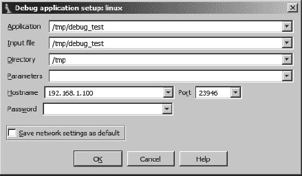

图 26-1. 调试器进程选项对话框

此对话框中的前四个字段适用于本地和远程调试会话，而主机名、端口和密码字段仅适用于远程调试会话。此对话框的字段总结如下。

| **应用程序** 您希望调试的应用程序二进制文件的完整路径。对于本地调试会话，这是一个本地文件系统中的路径。对于远程调试会话，这是调试服务器上的路径。如果您选择不使用完整路径，远程服务器将搜索其当前工作目录。 |
| --- |
| **输入文件** 用于创建 IDA 数据库的文件的完整路径。对于本地调试会话，这是一个本地文件系统中的路径。对于远程调试会话，这是调试服务器上的路径。如果您选择不使用完整路径，远程服务器将搜索其当前工作目录。 |
| **目录** 进程应启动的工作目录。对于本地调试，此目录必须在本地文件系统中存在。对于远程调试，这是一个调试服务器上的目录。 |
| **参数** 用于指定在启动进程时传递给进程的任何命令行参数。请注意，此处不尊重 shell 元字符（如`<`, `>`, 和 `&#124;`）。任何此类字符都将作为命令行参数传递给进程。因此，无法在调试器下启动进程，并让该进程执行任何类型的输入或输出重定向。对于远程调试会话，进程输出显示在启动调试服务器的控制台。 |
| **主机名** 远程调试服务器的计算机名或 IP 地址。对于本地调试会话，请留空此字段。 |
| **端口** 远程调试服务器监听的 TCP 端口号。 |
| **密码** 远程调试服务器期望的密码。请注意，输入到此字段的数据不会被屏蔽，使得任何可以观察您显示的人都可以查看密码。此外，此密码以纯文本形式传输到远程服务器，使得任何可以拦截您的网络数据包的人都可以观察到。 |

初看起来，图 26-1 中的“应用程序”和“输入文件”字段似乎相同。当你打开在 IDA 数据库中的文件与你在远程计算机上希望运行的可执行文件相同时，这两个字段将持有相同的值。然而，在某些情况下，你可能希望调试一个在 IDA 数据库中分析库文件（如 DLL）。由于库文件不是独立的可执行文件，因此无法直接调试库文件。在这种情况下，你需要将“输入文件”字段设置为库文件的路径。而“应用程序”字段必须设置为使用你希望调试的库文件的应用程序名称。

连接到远程 gdb 服务器的步骤几乎与附加到远程 IDA 调试服务器的步骤相同，只有两个小的例外。首先，连接到`gdb_server`不需要密码，其次，IDA 允许通过调试器设置对话框中的“设置特定选项”按钮指定 gdb 特定的行为。图 26-2 显示了 GDB 配置对话框。

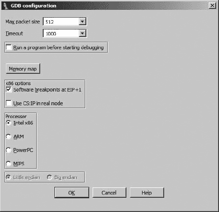

图 26-2. GDB 配置对话框

值得注意的是，IDA 无法知道`gdb_server`运行的计算机的架构，并且你有义务指定一个处理器类型（默认为 Intel x86）以及该处理器的字节序。目前 IDA 能够为 x86、ARM、PowerPC 和 MIPS 处理器提供调试接口。

## 附加到远程进程

如果你打算连接到远程调试服务器上的运行进程，存在多种不同的场景。首先，如果你在 IDA 中没有打开数据库，你可以选择“调试器”▸“附加”并从 IDA 的可用调试器列表中选择。如果你选择 IDA 的远程调试器之一，你会看到一个配置对话框，如图 26-3 所示。


图 26-3. 远程调试器配置

一旦你提供了适当的连接参数并点击“确定”，IDA 将从远程调试服务器获取并显示进程列表，允许你选择并附加到特定的进程。

在第二种情况下，你可能已经在 IDA 中打开了一个二进制文件，并希望将其附加到远程进程。在这种情况下，你可能需要选择一个调试器（如果之前没有为打开的文件类型指定调试器）或切换调试器类型（如果当前未选择远程调试器）。一旦选择了调试器，你必须提供远程调试器服务器的主机名和密码信息，如图 图 26-1 所示，此时你可以使用调试器 ▸ 附加到进程来附加到远程进程。

## 远程调试期间的异常处理

在 第二十五章 中，我们讨论了 IDA 调试器对异常的处理以及如何修改调试器的异常处理行为。在远程调试会话期间，调试器的默认异常处理行为由客户端机器上的 *exceptions.cfg* 文件决定（即你实际运行 IDA 的机器）。这允许你通过调试器设置对话框（见图 25-4）（见 图 25-4）修改 *exceptions.cfg* 并重新加载更改，而无需访问远程服务器。

## 在远程调试期间使用脚本和插件

在远程调试会话期间，仍然可以使用脚本和插件来自动化调试任务。你选择的任何脚本或插件都将运行在客户端机器上的 IDA 中。然后 IDA 将处理与远程进程交互所需的任何操作，例如设置断点、查询状态、修改内存或恢复执行。从脚本的角度来看，所有行为都将与本地调试会话一样。唯一需要注意的是确保你的脚本和插件针对的是目标进程运行的架构，而不是 IDA 客户端运行的架构（除非它们恰好相同）。换句话说，如果你在 Linux 上以远程调试客户端的身份运行 IDA 的 Windows 版本，不要期望你的 Windows 调试器隐藏脚本能对你有所帮助。

* * *

^([237]) 查看 [`bochs.sourceforge.net/`](http://bochs.sourceforge.net/)。

^([238]) 查看 [`www.hexblog.com/?p=112`](http://www.hexblog.com/?p=112)。

^([239]) 注意，与 IDA 一起分发的 **_server* 二进制文件依赖于多个共享库。你可以使用 `ldd`（或在 OS X 上使用 `otool -L`）来列出这些依赖项。

# 使用 Bochs 进行调试

Bochs 是一个开源的 x86 模拟环境。Bochs 能够全系统模拟 x86 计算机系统，包括对常见 I/O 设备和自定义 BIOS 的模拟。Bochs 提供了基于模拟的虚拟化软件（如 VMware Workstation）的替代方案。Hex-Rays 开发团队的 Elias Bachaalany 负责将 Bochs 与 IDA 集成，以提供基于模拟的传统调试的替代方案.^([240]) Windows 版本的 IDA 附带并安装了兼容的 Bochs 版本，而希望使用 Bochs 的非 Windows 用户必须确保他们的系统上安装了 2.4.2 或更高版本的 Bochs。

安装了 Bochs 后，IDA 在打开 IDA 中的 x86 二进制文件时，会提供本地 Bochs 调试器的选择。Bochs 的可用性为在非 Windows 系统上对 Windows 应用程序进行本地调试提供了机会，因为应用程序将被模拟而不是作为本地进程执行。由于它是一个模拟器，Bochs 的配置选项与更传统的调试器有所不同。关于 Bochs，最重要的理解之一是它可以以三种不同的模式运行：磁盘镜像模式、IDB 模式和 PE 模式。模式的选取是通过 Bochs 特定的调试器配置对话框来完成的，如图图 26-4 所示。


图 26-4. Bochs 调试器选项对话框

每种可用的模式在执行模拟的质量和类型方面提供了截然不同的保真度。

## Bochs IDB 模式

从底层开始工作，IDB 是 Bochs 最基本的一种模式。在 IDB 模式下，Bochs 所知晓的唯一代码就是包含在您的数据库中的代码。内存区域被映射到 Bochs 中，并通过从数据库复制字节来填充。根据 Bochs 选项对话框中的设置，提供可配置的堆栈空间，IDA 将自行决定堆栈的分配位置。如果定义了名为`ENTRY`的数据库符号，则模拟执行开始（意味着指令指针最初定位）在该符号处。如果没有`ENTRY`符号，IDA 会检查是否在打开的数据库中当前选定了某个地址范围，并使用该范围的起始点作为调试器的入口点。如果没有选择，则将当前光标位置作为初始指令指针值。在 IDB 模式下运行时，请记住，Bochs 没有关于任何操作系统支持的概念，例如共享库或典型进程地址空间内任何知名结构的定位。只要代码不引用可能存在于数据库之外的内容，就可以逐步执行 PE 文件、ELF 文件、Mach-O 文件或原始机器代码块（如漏洞载荷）。IDB 可能的一种用途是执行单个函数，以了解其行为，而不需要构建完整的进程或磁盘镜像。

## Bochs PE 模式

PE 模式提供了在接近进程级别进行调试的机会。当选择并激活 PE 模式时，IDA 的 Bochs 控制模块（一个 IDA 插件）接管并表现得就像您实际启动一个本机 Windows 进程时的 Windows 进程加载器一样。PE 模式进程接收进程（PEB）和线程（TEB）环境块，以及模拟实际进程中创建的堆栈。

Bochs 插件还会将（不执行任何代码）许多常见的 Windows 库加载到模拟进程的地址空间中，以便正确处理进程所做的任何库调用。Bochs 在调试器启动时加载的确切库集合是可配置的，并在 *<IDADIR>/plugins/bochs/startup.idc* 中指定。任何库都可以直接加载，或者指定为要模拟的。如果一个库被标记为要模拟，那么 Bochs 插件将自动挂钩该库导出的每个函数，并将执行重定向到 Bochs 拦截函数（有关更多详细信息，请参阅 *startup.idc* 和 IDA 帮助系统）。这种模拟技术为用户提供了一种可扩展的方式来定义任何库函数的自定义行为。对于任何由 IDA 模拟的库，你可以在其中定义自定义行为的相应脚本文件。对于任何库，例如 *foolib.dll*，Bochs 插件会在 *<IDADIR>/plugins/bochs* 目录中搜索一个相关的脚本，名为 *api_foolib.idc* 或 *api_foolib.py*。IDA 随带 *<IDADIR>/plugins/bochs/api_kernel32.idc*，它提供了一个此类文件结构的良好示例以及为许多函数实现自定义行为的示例。

在 PE 模式下，能够挂钩库函数和定义自定义实现非常重要，因为共享库需要执行的所有繁重工作都没有操作系统层来处理。例如，通过为像 `VirtualAlloc` 这样的函数提供一个基于脚本的替代行为，如果无法与操作系统通信则该函数会失败，可以（在一定程度上）让被模拟的过程相信它作为一个实际进程在运行。创建此类基于脚本的行为的目标是向被模拟的进程提供它在与实际库函数通信时预期会看到的响应，而这些库函数反过来又与实际操作系统通信。

如果你在一个非 Windows 平台上使用 IDA，你可以通过将所需的库（如 *startup.idc* 中指定的）从 Windows 系统复制到你的 IDA 系统上，并编辑 *startup.idc* 以指向包含所有复制库的目录，充分利用 Bochs 的 PE 模式。以下列表显示了一个示例所需的更改。

```
// Define additional DLL path
// (add triple slashes to enable the following lines)
/// path /home/idauser/xp_dlls/=c:\winnt\system32\
```

当在 Bochs 下启动一个进程时，如果你使用 PE 模式，你会注意到的一个区别是 IDA 不会打开一个警告对话框来提醒你，在调试器控制下启动可能恶意的过程的风险。这是因为唯一创建的进程是 Bochs 模拟器进程，而你正在调试的所有代码都被 Bochs 模拟器视为代表它要模拟的代码的数据。从你正在调试的二进制文件中永远不会创建任何本地进程。

## Bochs 磁盘镜像模式

Bochs 调试器的第三种操作模式被称为磁盘镜像模式。除了 IDA 能够利用 Bochs 之外，Bochs 本身也是一个完整的 x86 系统仿真器。使用 Bochs 提供的`bximage`工具创建硬盘镜像是完全可能的；使用 Bochs 和所需的操作系统安装介质在磁盘镜像上安装操作系统；最终使用 Bochs 在仿真环境中运行你的客户操作系统。

如果你使用 IDA/Bochs 的主要目标是理解单个进程的行为，那么磁盘镜像模式可能不适合你。在完全仿真的操作系统中隔离和观察单个进程的执行并不是一件容易的事情，需要详细理解操作系统以及它是如何管理和处理进程与内存的。你可能发现 IDA/Bochs 在分析系统 BIOS 和引导代码时很有用，这些代码在操作系统代码接管之前相对容易追踪。

在磁盘镜像模式下，你无法将可执行文件镜像加载到 IDA 中。相反，IDA 附带了一个识别 Bochs 配置（*boch-src*）文件的加载器.^([241）*bochsrc*文件用于描述当 Bochs 作为全系统仿真器使用时的硬件执行环境。IDA 的默认*bochsrc*文件位于*<IDADIR>/cfg/bochsrc.cfg*。除了其他用途外，*bochsrc*文件用于指定系统 BIOS、视频 ROM 和磁盘镜像文件的位置。IDA 的*bochsrc*加载器提供最基础的加载服务，仅读取正在加载的 Bochs 配置文件中指定的第一个磁盘镜像文件的第一扇区，然后选择 Bochs 调试器用于新数据库。关于在主引导记录开发场景中使用 IDA/Bochs 的讨论可以在 Hex-Rays 博客上找到.^([242））

* * *

^([240)]) 请参阅 Recon 2011 中的“设计一个最小的操作系统以在 Bochs 中仿真 32/64 位 x86 代码片段、shellcode 或恶意软件”([`www.recon.cx/`](http://www.recon.cx/))。

^([241)]) 请参阅 [`bochs.sourceforge.net/doc/docbook/user/bochsrc.html`](http://bochs.sourceforge.net/doc/docbook/user/bochsrc.html) 了解`bochsrc`文件格式的信息。

^([242]) 请参阅 [`www.hexblog.com/?p=103`](http://www.hexblog.com/?p=103)。

# Appcall

调试器的 Appcall 功能有效地扩展了 IDC 或 IDAPython 的能力，使得活动进程中的任何函数都可以从脚本中调用。这种功能有无限多的用途，包括将额外的内存映射到进程地址空间（通过调用`VirtualAlloc`或类似函数）以及将新的库注入正在调试的进程（通过调用`LoadLibrary`或调用进程内的函数以执行你更愿意手动执行的任务，例如解码数据块或计算哈希值）。

为了使用 Appcall，你希望调用的函数必须加载到正在调试的进程地址空间中，并且 IDA 必须知道或被告知函数的原型，以便正确地打包和拆包参数。你做出的任何 Appcall 都将在保存线程状态（基本上是与线程相关的所有寄存器）的上下文中进行。一旦 Appcall 完成，IDA 将恢复线程状态，调试器准备像没有发生 Appcall 一样继续执行。

让我们看看一个使用 Appcall 在当前（Windows）进程地址空间中分配 4096 字节内存块的示例。在这种情况下，我们希望调用的 Windows API 函数名为 `VirtualAlloc`，其原型如下所示：

```
LPVOID WINAPI VirtualAlloc(LPVOID lpAddress, SIZE_T dwSize,
                           DWORD flAllocationType, DWORD flProtect);
```

如果我们用 C 语言编写，使用 Appcall 的调用可能看起来像以下这样：

```
VirtualAlloc(NULL, 4096, MEM_COMMIT | MEM_RESERVE, PAGE_READWRITE);
```

一旦所有常量都得到解决，这个函数调用最终将转换为以下形式：

```
VirtualAlloc(0, 4096, 0x3000, 4);
```

请记住，当 Windows 进程正在调试时，IDA 会将每个库函数的名称前缀为所属库的名称。因此，当调试器处于活动状态时，`VirtualAlloc` 将被命名为 `kernel32_VirtualAlloc`，如下所示：

```
kernel32.dll:766B2FB6 ; ====== S U B R O U T I N E ========
kernel32.dll:766B2FB6
kernel32.dll:766B2FB6 ; Attributes: bp-based frame
kernel32.dll:766B2FB6
kernel32.dll:766B2FB6 kernel32_VirtualAlloc proc near
```

由于 IDA 的类型库对名为 `kernel32_VirtualAlloc` 的函数一无所知，因此不会显示类型信息。由于 Appcall 需要知道函数的类型签名，我们必须使用 `Set Function Type` 命令将信息添加到数据库中。只要我们指定的签名允许 IDA 正确地将我们的参数传递给要调用的函数，就不需要精确的类型签名。在这种情况下，我们提供以下签名：

```
kernel32.dll:766B2FB6 ; Attributes: bp-based frame
kernel32.dll:766B2FB6
kernel32.dll:766B2FB6 ; int __stdcall kernel32_VirtualAlloc(int, int, int, int)
kernel32.dll:766B2FB6 kernel32_VirtualAlloc proc near
```

到目前为止，我们已经准备好使用 Appcall 为我们的进程分配更多内存。使用 IDC，这非常简单，因为我们只需要像调用 IDC 函数一样调用该函数。在 IDA 命令行中输入函数调用并使用 `Message` 函数显示结果，将得到以下输出：

```
IDC>Message("%x\n", kernel32_VirtualAlloc(0, 4096, 0x3000, 4));
3c0000
```

在这种情况下，结果是地址 `0x3c0000` 处为进程分配了一个新的 4096 字节块。为了使新的内存块在 IDA 中显示，我们必须使用“调试器”▸“刷新内存”命令或等待 IDA 在与其他调试器操作结合时执行刷新。

在 Python 中执行 Appcall 的语法略有不同，它使用了在 `idaapi` 模块中定义的 `Appcall` 变量。然而，需要有一个具有指定类型签名的命名函数的要求仍然存在。在 Python 中执行时，对 `VirtualAlloc` 的相同 Appcall 将如下所示：

```
Python>Message("%x\n" % Appcall.kernel32_VirtualAlloc(0, 4096, 0x3000, 4))
3d0000
```

有关 Appcall 及其使用的更多信息示例，可以在 Hex-Rays 博客上找到.^([243])

* * *

^([243]) 查看 [`www.hexblog.com/?p=113`](http://www.hexblog.com/?p=113).

# 摘要

不论是通过 Hex-Rays 开发团队的努力还是通过用户贡献，IDA 的调试器持续发展。跟踪所有这些变化的最佳地点是 Hex-Rays 博客 ([`www.hexblog.com/`](http://www.hexblog.com/))，Hex-Rays 开发者经常预览即将出现在 IDA 未来版本中的新功能。跟踪用户贡献的扩展需要更多的努力。偶尔，有趣的 IDA 扩展会在 IDA 支持论坛中宣布，但你同样有可能在各个逆向工程论坛（如 [`www.openrce.org/`](http://www.openrce.org/)）中看到它们，或者它们被提交到 Hex-Rays 的年度插件编写大赛中，或者在执行网络搜索时偶然发现。

IDA 的调试器功能全面且可扩展。它具备本地和远程功能，同时还能作为多个流行调试器（如 gdb 和 WinDbg）的前端，IDA 为众多流行平台提供了一个一致的调试接口。鉴于可以编写扩展脚本或构建编译后的调试器插件，调试器的功能极限不断被扩展。在当前的调试器中，IDA 的调试器可能拥有最活跃的开发活动，并得益于其所有核心开发者都是自身成就卓著的反汇编工程师这一事实，他们既在个人层面也在职业层面都对使调试器成为一个强大且实用的工具有着浓厚的兴趣。
