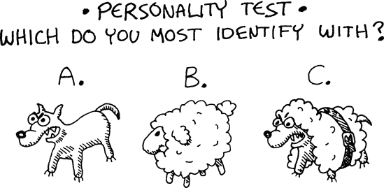
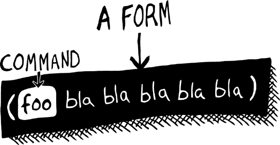
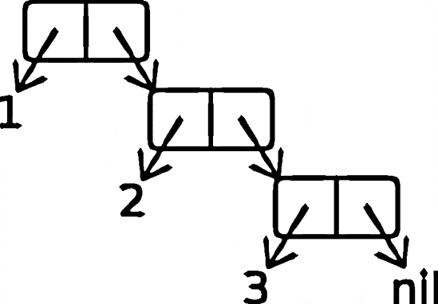

# 第一部分：Lisp 是力量


# 第一章：Lisp 入门

本章从介绍 Lisp 的各种方言开始。然后我们将简要讨论 ANSI Common Lisp，这是我们将在本书中使用的方言。最后，你将开始安装和测试 CLISP，这是 ANSI Common Lisp 的实现，它将允许你运行你将要创建的所有 Lisp 游戏！

# Lisp 方言

任何遵循 Lisp 核心原则的语言都被认为是 Lisp 方言。由于这些原则非常简单，所以毫不奇怪，实际上已经创建了数百种 Lisp 方言。实际上，由于许多初学者将创建自己的 Lisp 方言作为练习，因此可能存在成千上万的未完成 Lisp 正在沉睡在地球上各个硬盘驱动器上被长期遗弃的目录中。然而，Lisp 社区的绝大多数人使用两种 Lisp：ANSI Common Lisp（通常缩写为 CL）和 Scheme。

在这本书中，我们将专门讨论 ANSI Common Lisp 方言，这是两者中稍微更受欢迎的一个。尽管如此，你从阅读这本书中获得的大部分知识也将与 Scheme 相关（尽管函数名称在方言之间可能略有不同）。

## 两种 Lisp 的故事

ANSI Common Lisp 和 Scheme 之间存在一些深层次的哲学差异，它们吸引了不同性格的程序员。一旦你更深入地了解 Lisp 语言，你就可以决定你更喜欢哪种方言。没有绝对的对错之分。

为了帮助你做出决定，我为你创建了一个以下的人格测试：



如果你选择了 A，你喜欢你语言中的原始力量。你并不介意你的语言因为许多实用主义的妥协而显得有些丑陋，只要你能写出紧凑的代码。ANSI Common Lisp 是最适合你的语言！ANSI Common Lisp 的根源可以追溯到古老的 Lisp 方言，它建立在数百万程序员的辛勤工作之上，使其功能极其丰富。当然，由于无数历史事件，它有一些巴洛克式的函数名称，但这个 Lisp 真正能在正确的黑客手中翱翔。

如果你选择了 B，你喜欢干净、优雅的语言。你对基本的编程问题更感兴趣，并且乐于在美丽的草地上消磨时光，思考你代码的美丽，偶尔写一篇关于理论计算问题的研究论文。Scheme 是适合你的语言！它是在 1970 年代中期由 Guy L. Steele 和 Gerald Jay Sussman 创建的，涉及对理想 Lisp 的深入思考。Scheme 中的代码通常稍微冗长一些，因为 Schemers 更关心他们代码中的数学纯粹性，而不是创建尽可能短的程序。

如果你选择了 C，你是一个想要拥有一切的人：ANSI CL 的力量和 Scheme 的数学美。在这个时候，没有 Lisp 方言完全符合要求，但这种情况可能会在未来改变。一种可能适合你的语言（尽管在 Lisp 书中提出这种说法是亵渎的）是 Haskell。它不被认为是 Lisp 方言，但它的追随者遵循 Lisper 中流行的范式，如保持语法统一，支持原生列表，并大量使用高阶函数。更重要的是，它具有极端的数学严谨性（甚至比 Scheme 还要严格），这使得它能够在干净利落的外表下隐藏非常强大的功能。它本质上是一只披着羊皮的狼。像 Lisp 一样，Haskell 是一种任何程序员都应进一步调查的语言。

## 新兴的 Lisp

正如刚才提到的，目前还没有一个真正的 Lisp 方言同时具备 ANSI Common Lisp 的强大功能和灵活性以及 Scheme 的优雅性。然而，一些新的竞争者可能在不久的将来获得两者的最佳结合。

一个显示出希望的新 Lisp 是 Clojure，这是由 Rich Hickey 开发的方言。Clojure 建立在 Java 平台之上，允许它直接利用许多成熟的 Java 库。此外，Clojure 包含一些巧妙且经过深思熟虑的特性，以简化多线程编程，这使得它成为编程看似无处不在的多核 CPU 的有用工具。

另一个有趣的挑战者是 Arc。它是一种真正的 Lisp 语言，主要由知名的 Lisper 保罗·格雷厄姆开发。Arc 仍处于早期开发阶段，对其相对于其他 Lisp 的改进程度意见分歧很大。此外，其开发进展缓慢，可能要过一段时间才能有人说出 Arc 是否可能成为一个有意义的竞争者。

在结语中，我们将浅尝 Arc 和 Clojure。

## 用于脚本编写的 Lisp 方言

一些 Lisp 方言被用于脚本编写，包括以下这些：

+   Emacs Lisp 用于在流行的（并且总体上很棒）Emacs 文本编辑器内部进行脚本编写。

+   Guile Scheme 在几个开源应用程序中用作脚本语言。

+   Script-Fu Scheme 与 GIMP 图像编辑器一起使用。

这些方言是主要 Lisp 分支的较老版本的分支，通常不用于创建独立的应用程序。然而，它们仍然是完全值得尊重的 Lisp 方言。

## ANSI Common Lisp

1981 年，为了应对语言众多方言的令人眼花缭乱的数目，不同 Lisp 社区的成员起草了一个名为 Common Lisp 的新方言规范。1986 年，经过进一步的调整，这种语言被转化为 ANSI Common Lisp 标准。许多较老版本的 Lisp 的开发者修改了他们的解释器和编译器以符合这个新标准，这成为了最流行的 Lisp 版本，并且至今仍然是。

### 注意

在本书中，术语**Common Lisp**指的是 ANSI 标准定义的 Common Lisp 版本。

Common Lisp 的一个关键设计目标是创建一个**多范式语言**，这意味着它支持许多不同的编程风格。你可能听说过**面向对象编程**，这在 Common Lisp 中可以做得相当不错。其他你可能之前没有听说过的编程风格包括**函数式编程、泛型编程**和**领域特定语言编程**。这些在 Common Lisp 中都有很好的支持。随着我们继续阅读本书，你将学习到这些风格以及其他风格。

# CLISP 入门

有许多优秀的 Lisp 编译器可用，但其中一个特别容易入门：CLISP，一个开源的 Common Lisp。CLISP 易于安装，可在任何操作系统上运行。

其他流行的 Lisp 包括 Steel Bank Common Lisp (SBCL)，这是一个比 CLISP 更强大的快速 Common Lisp，也是开源的；Franz, Inc 的强大商业 Lisp Allegro Common Lisp；LispWorks；Clozure CL；和 CMUCL。Mac 用户可能想考虑 LispWorks 或 Clozure CL，这些在他们的机器上运行起来会更容易。然而，就我们的目的而言，CLISP 是最好的选择。

### 注意

从第十二章开始，我们将使用一些被认为是非标准的 CLISP 特定命令。然而，在此之前，任何 Common Lisp 的实现都可以用于运行本书中的示例。

## 安装 CLISP

你可以从[`clisp.cons.org/`](http://clisp.cons.org/)下载 CLISP 安装程序。它可以在 Windows PC、Mac 和 Linux 变种上运行。在 Windows PC 上，你只需运行安装程序。在 Mac 上，有一些额外的步骤，这些步骤在网站上都有详细说明。

在基于 Debian 的 Linux 机器上，你应该会发现 CLISP 已经存在于你的标准源中。只需在命令行中输入**`apt-get install clisp`**，CLISP 就会自动安装。

对于其他 Linux 发行版（Fedora、SUSE 等），你可以使用 CLISP 网站上列出的“Linux 软件包”下的标准软件包。经验丰富的 Linux 用户可以从源代码编译 CLISP。

## 启动 CLISP

要运行 CLISP，从你的命令行输入**`clisp`**。如果一切顺利，你会看到以下提示：

```
$ `clisp`
  i i i i i i i       ooooo    o        ooooooo   ooooo   ooooo
  I I I I I I I      8     8   8           8     8     o  8    8
  I  \ `+' /  I      8         8           8     8        8    8
   \  `-+-'  /       8         8           8      ooooo   8oooo
    `-__|__-'        8         8           8           8  8
        |            8     o   8           8     o     8  8
  ------+------       ooooo    8oooooo  ooo8ooo   ooooo   8

Copyright (c) Bruno Haible, Michael Stoll 1992, 1993
Copyright (c) Bruno Haible, Marcus Daniels 1994-1997
Copyright (c) Bruno Haible, Pierpaolo Bernardi, Sam Steingold 1998
Copyright (c) Bruno Haible, Sam Steingold 1999-2000
Copyright (c) Sam Steingold, Bruno Haible 2001-2006

[1]>
```

与所有 Common Lisp 环境一样，CLISP 启动后会自动将你放入一个**读取-评估-打印循环**（REPL）。这意味着你可以立即开始输入 Lisp 代码。

通过输入**`(+ 3 (* 2 4))`**来试一试。你会在表达式下方看到打印出的结果：

```
[1]> `(+ 3 (* 2 4))`
11
```

这显示了 REPL 的工作方式。你输入一个表达式，然后 Lisp 会立即评估它并返回结果值。当你想要关闭 CLISP 时，只需输入**`(quit)`**。

现在你已经在电脑上安装了 CLISP，你就可以开始编写 Lisp 游戏了！

# 你学到了什么

在这一章中，我们讨论了 Lisp 的不同方言和安装 CLISP。在过程中，你学习了以下内容：

+   Lisp 有两个主要的方言：Common Lisp 和 Scheme。两者都有很多优点，但在这本书中，我们将重点关注 Common Lisp。

+   Common Lisp 是一种多范式语言，这意味着它支持许多不同的编程风格。

+   CLISP 是一个易于设置的 Common Lisp 实现，这使得它成为 Lisp 新手的绝佳选择。

+   你可以直接在 CLISP 的 *REPL* 中输入 Lisp 命令。


# 第二章 创建你的第一个 Lisp 程序

既然我们已经讨论了一些 Lisp 的哲学思想，并且有一个运行的 CLISP 环境，我们就准备好编写一些实际的 Lisp 代码，形式为一个简单的游戏。

# 猜数字游戏

我们将要编写的第一个游戏几乎是想象中最简单的游戏。它是经典的猜数字游戏。

在这个游戏中，你从 1 到 100 中选择一个数字，然后电脑必须猜出它。

以下展示了如果你选择数字 23，游戏玩法可能的样子。电脑首先猜测 50，然后每次连续猜测，你输入`(smaller)`或`(bigger)`，直到电脑猜出你的数字。

```
> `(guess-my-number)`
50
> `(smaller)`
25
> `(smaller)`
12
> `(bigger)`
18
> `(bigger)`
21
> `(bigger)`
23
```

要创建这个游戏，我们需要编写三个函数：`guess-my-number`、`smaller`和`bigger`。玩家只需从 REPL 中调用这些函数。正如你在上一章中看到的，当你启动 CLISP（或任何其他 Lisp）时，你会看到一个 REPL，你输入的命令将在这里被*读取*，然后*评估*，最后*打印*。在这种情况下，我们正在运行`guess-my-number`、`smaller`和`bigger`这些命令。

在 Lisp 中调用函数时，你需要在其周围加上括号，以及你希望传递给函数的任何参数。由于这些特定的函数不需要任何参数，我们在输入时只需将它们的名称用括号括起来即可。

让我们思考这个简单游戏背后的策略。经过一番思考，我们得出以下步骤：

1.  确定玩家数字的上限和下限（大和小）。由于范围在 1 到 100 之间，最小的可能数字是 1，最大的数字是 100。

1.  在这两个数字之间猜一个数字。

1.  如果玩家说数字更小，降低大限。

1.  如果玩家说数字更大，提高小限。


通过遵循这些简单的步骤，每次猜测都将可能数字的范围减半，电脑可以快速缩小范围，找到玩家的数字。

这种类型的搜索被称为**二分搜索**。正如你可能知道的，这种二分搜索在计算机编程中经常被使用。例如，你可以遵循这些相同的步骤，以高效地找到给定有序值表中的特定数字。在这种情况下，你只需跟踪表中最大和最小的行，然后以类似的方式快速定位到正确的行。

# 在 Lisp 中定义全局变量

当玩家调用构成我们游戏的功能时，程序需要跟踪小和大限制。为了做到这一点，我们需要创建两个名为 `*small*` 和 `*big*` 的全局变量。

## 定义小变量和大变量

在 Lisp 中，全局定义的变量被称为**顶层定义**。我们可以使用 `defparameter` 函数来创建新的顶层定义：

```
> `(defparameter *small* 1)`
*SMALL*
> `(defparameter *big* 100)`
*BIG*
```

函数名 `defparameter` 有点令人困惑，因为它实际上与参数没有什么关系。它所做的只是让你定义一个**全局变量**。

我们发送给 `defparameter` 的第一个参数是新变量的名称。围绕 `*big*` 和 `*small*` 名称的星号——亲切地称为**耳罩**——是完全任意和可选的。Lisp 将星号视为变量名称的一部分，并忽略它们。Lispers 喜欢以这种方式标记所有全局变量，作为一种约定，以便于区分它们，这些将在本章后面讨论。

### 注意

虽然在严格的技术意义上耳罩可能是“可选的”，但我建议你使用它们。如果你在 Common Lisp 新闻组中发布任何代码，并且你的全局变量缺少耳罩，我无法保证你的安全。

## 另一个全局变量定义函数的替代方案

当你使用 `defparameter` 设置全局变量的值时，任何先前存储在变量中的值都将被覆盖：

```
> `(defparameter *foo* 5)`
FOO
> `*foo*`
5
> `(defparameter *foo* 6)`
FOO
> `*foo*`
6
```

如你所见，当我们重新定义变量 `*foo*` 时，其值会发生变化。

你可以使用另一个用于声明全局变量的命令，称为 `defvar`，它不会覆盖全局变量的先前值：

```
> `(defvar *foo* 5)`
FOO
> `*foo*`
5
> `(defvar *foo* 6)`
FOO
> `*foo*`
5
```

一些 Lisp 程序员在定义全局变量时更喜欢使用 `defvar` 而不是 `defparameter`。然而，在这本书中，我们将仅使用 `defparameter`。

### 注意

当你在其他地方阅读关于 Lisp 的内容时，你也可能会看到程序员在提到 Common Lisp 中的全局变量时使用术语**动态变量**或**特殊变量**。这是因为 Common Lisp 中的全局变量有一些特殊的能力，我们将在未来的章节中讨论。

# 基本 Lisp 礼仪

与其他语言相比，Lisp 中调用命令和代码格式化的方式有些奇怪。首先，你需要用括号包围命令（及其参数），就像 `defparameter` 函数一样：

```
> `(defparameter *small* 1)`
*SMALL*
```

没有括号，命令将不会被调用。

此外，当 Lisp 读取你的代码时，会完全忽略空格和换行符。这意味着你可以以任何疯狂的方式调用这个命令，结果相同：

```
> `(               defparameter`
           `*small* 1)`
*SMALL*
```

由于 Lisp 代码可以以如此灵活的方式格式化，Lispers 有很多关于格式化命令的约定，包括何时使用多行和缩进。我们将松散地遵循本书中代码示例中的一些常见缩进约定。然而，我们更感兴趣的是编写游戏而不是讨论源代码缩进规则，所以我们不会在本书中花费太多时间在代码布局规则上。

# 在 Lisp 中定义全局函数

我们的`guess-my-number`游戏让计算机响应玩家请求开始游戏，以及请求更小或更大的猜测。为此，我们需要定义三个全局函数：`guess-my-number`、`smaller`和`bigger`。我们还将定义一个用于以不同数字重新开始游戏的函数，称为`start-over`。在 Common Lisp 中，函数使用`defun`定义，如下所示：

```
(defun *`function_name`* (*`arguments`*)
  ...)
```

首先，我们指定函数的名称和参数。然后我们跟上组成函数逻辑的代码。

## 定义`guess-my-number`函数

我们要定义的第一个函数是`guess-my-number`。这个函数使用`*big*`和`*small*`变量的值来生成玩家的数字猜测。定义看起来像这样：

```
> `(defun guess-my-number ()`
      `(ash (+ *small* *big*) −1))`
 GUESS-MY-NUMBER
```

函数名`guess-my-number`后面的空括号`()`表示这个函数不需要任何参数。

虽然你不需要在 REPL 中输入代码片段时担心缩进或换行符，但你必须确保正确放置括号。如果你忘记了一个括号或将其放在错误的位置，你很可能会得到一个错误。

每当我们在这个 REPL 中运行这样的代码片段时，输入表达式的结果值将被打印出来。Common Lisp 中的每个命令都会生成一个返回值。例如，`defun`命令只是返回新创建函数的名称。这就是为什么我们在调用`defun`后在 REPL 中看到函数名称被重复输出。

这个函数做什么？如前所述，在这个游戏中，计算机的最佳猜测将是两个极限之间的一个数字。为了实现这一点，我们选择两个极限的平均值。然而，如果平均数最终变成一个分数，我们希望使用接近平均的数字，因为我们只猜测整数。

我们在`guess-my-number`函数中实现这一点，首先加上代表高限和低限的数字，然后使用算术移位函数`ash`将极限的总和减半并缩短结果。代码`(+ *small* *big*)`将这两个变量相加。因为加法发生在另一个函数调用中，，所以得到的总和随后传递给`ash`函数。

在 Lisp 中，包围`ash`函数和加法(`+`)函数的括号是强制性的。这些括号告诉 Lisp，“我想调用这个函数。”

内置的 Lisp 函数`ash`查看一个以二进制形式表示的数字，然后将其二进制位向左或向右移动，丢弃在过程中丢失的任何位。例如，数字 11 以二进制形式表示为 1011。我们可以使用`ash`将这个数字的位向左移动，通过将`1`作为第二个参数使用：

```
> `(ash 11 1)`
22
```

这产生了 22，这在二进制中是 10110。我们可以通过将`-1`作为第二个参数传递来将位向右移动（并去掉末尾的位）：

```
> `(ash 11 −1)`
5
```

这产生了 5，这在二进制中是 101。

通过在`guess-my-number`中使用`ash`函数，我们不断地将可能的数字搜索空间减半，以快速缩小到正确的最终数字。如前所述，这个过程称为*二分搜索*，是计算机编程中的一个有用技术。在 Lisp 中，ash 函数通常用于此类二分搜索。

让我们看看调用我们新函数时会发生什么：

```
> `(guess-my-number)`
50
```

由于这是我们第一次猜测，调用此函数时看到的输出告诉我们一切按计划进行：程序选择了数字 50，正好位于 1 和 100 之间。

当用 Lisp 编程时，你会编写许多不会在屏幕上显式打印值的函数。相反，它们会简单地返回函数体中计算出的值。例如，假设我们想要一个只返回数字 5 的函数。我们可以这样编写这个函数：

```
> `(defun return-five ()`
     `(+ 2 3))`
```

因为函数体中计算出的值等于 5，调用`(return-five)`将只返回 5。

这就是`guess-my-number`的设计方式。我们在屏幕上看到这个计算结果（数字 50），并不是因为函数导致数字显示，而是因为这是 REPL 的一个特性。

### 注意

如果你之前使用过其他编程语言，你可能记得必须写一些像`return...`这样的东西来返回一个值。在 Lisp 中，这并不是必要的。函数体中计算出的最终值会自动返回。

## 定义`smaller`和`bigger`函数

现在我们将编写我们的`smaller`和`bigger`函数。像`guess-my-number`一样，这些是通过`defun`定义的全局函数：

```
 > `(defun smaller ()`
      `(setf *big* (1- (guess-my-number)))`
      `(guess-my-number))`
  SMALLER
  > `(defun bigger ()`
      `(setf *small* (1+ (guess-my-number)))`
     `(guess-my-number))`
  BIGGER
```

首先，我们使用`defun`开始定义一个新的全局函数`smaller`。因为这个函数没有参数，所以括号是空的![http://atomoreilly.com/source/nostarch/images/783564.png]。

接下来，我们使用 `setf` 函数来更改全局变量 `*big*` 的值 ![http://atomoreilly.com/source/nostarch/images/783562.png]。由于我们知道数字必须小于上一次猜测，它现在可能的最大值是比那次猜测少一个。代码 `(1- (guess-my-number))` 计算这个值：它首先调用我们的 `guess-my-number` 函数以获取最新的猜测，然后使用 `1-` 函数，该函数从结果中减去 1。

最后，我们希望 `smaller` 函数显示一个新的猜测。我们通过在函数体中将 `guess-my-number` 的调用作为最后一行来实现这一点 ![http://atomoreilly.com/source/nostarch/images/783560.png]。这次，`guess-my-number` 将使用更新后的 `*big*` 值，导致它计算下一个猜测。函数的最终值将自动返回，导致由 `guess-my-number` 生成的新的猜测（`smaller` 函数返回的）。

`bigger` 函数的工作方式完全相同，只是它提高了 `*small*` 的值。毕竟，如果您调用 `bigger` 函数，您是在说您的数字比上一次猜测大，所以现在可能的最小值（即 `*small*` 变量所代表的值）是比上一次猜测多一个。函数 `1+` 简单地将 1 加到 `guess-my-number` 返回的值上。

在这里，我们看到我们的函数正在发挥作用，我们的猜测数字是 56：

```
> `(bigger)`
75
> `(smaller)`
62
> `(smaller)`
56
```

## 定义 `start-over` 函数

为了完成我们的游戏，我们将添加 `start-over` 函数来重置我们的全局变量：

```
(defun start-over ()
   (defparameter *small* 1)
   (defparameter *big* 100)
   (guess-my-number))
```

如您所见，`start-over` 函数会重置 `*small*` 和 `*big*` 的值，然后再次调用 `guess-my-number` 函数以返回一个新的起始猜测。无论您想用不同的数字开始全新的游戏，都可以调用此函数来重置游戏。

# 在 Lisp 中定义局部变量

对于我们的简单游戏，我们已经定义了全局变量和函数。然而，在大多数情况下，您可能希望将定义限制在单个函数或代码块中。这些被称为 *局部* 变量和函数。

要定义局部变量，请使用 `let` 命令。一个 `let` 命令具有以下结构：

```
 (let (*`variable declarations`*)
   ...body...)
```

`let` 命令中的第一件事是一系列变量声明 ![http://atomoreilly.com/source/nostarch/images/783564.png]。这是我们声明一个或多个局部变量的地方。然后，在命令的主体中（并且仅在此主体中），我们可以使用这些变量 ![http://atomoreilly.com/source/nostarch/images/783562.png]。以下是一个 `let` 命令的示例：

```
 > `(let ((a 5)`
         `(b 6))`
     `(+ a b))`
  11
```

在这个例子中，我们分别为变量 `a` ![http://atomoreilly.com/source/nostarch/images/783564.png] 和 `b` ![http://atomoreilly.com/source/nostarch/images/783562.png] 声明了值 `5` 和 `6`。这些都是我们的变量声明。然后，在 `let` 命令的主体中，我们将它们相加 ![http://atomoreilly.com/source/nostarch/images/783560.png]，得到显示的值 `11`。

当使用 let 表达式时，你必须用括号包围声明的变量列表。此外，你必须用另一组括号包围每一对变量名和初始变量。

### 注意

尽管缩进和换行完全是任意的，因为 `let` 表达式中的变量及其值形成了一种简单的表格，常见的做法是将声明的变量垂直对齐。这就是为什么在先前的例子中 `b` 直接位于 `a` 之下的原因。

# 在 Lisp 中定义局部函数

我们使用 `flet` 命令来定义局部函数。`flet` 命令具有以下结构：

```
 (flet ((*`function_name`* (*`arguments`*)
          ...function body...))
   ...body...)
```

在 `flet` 的顶部，我们声明一个函数（在前两行）。然后这个函数将在主体中对我们可用 ![http://atomoreilly.com/source/nostarch/images/783560.png]。函数声明由函数名、该函数的参数 ![http://atomoreilly.com/source/nostarch/images/783564.png]，以及函数体 ![http://atomoreilly.com/source/nostarch/images/783562.png]，我们在其中放置函数的代码。

以下是一个示例：

```
 > `(flet ((f (n)`
             `(+ n 10)))`
     `(f 5))`
  15
```

在这个示例中，我们定义了一个单独的函数 `f`，它接受一个参数 `n` ![http://atomoreilly.com/source/nostarch/images/783564.png]。函数 `f` 然后将 `10` 添加到这个变量 `n` ![http://atomoreilly.com/source/nostarch/images/783562.png]，它已经传入。然后我们用数字 `5` 作为参数调用这个函数，导致返回值 `15` ![http://atomoreilly.com/source/nostarch/images/783560.png]。

与 `let` 一样，你可以在 `flet` 的作用域内定义一个或多个函数。

单个 `flet` 命令可以一次声明多个局部函数。只需在命令的第一部分添加多个函数声明：

```
 > `(flet ((f (n)`
            `(+ n 10))`
          `(g (n)`
            `(- n 3)))`
    `(g (f 5)))`
  12
```

在这里，我们声明了两个函数：一个名为 `f` ![http://atomoreilly.com/source/nostarch/images/783564.png] 和一个名为 `g` ![http://atomoreilly.com/source/nostarch/images/783562.png]。在 `flet` 的主体中，我们可以引用这两个函数。在这个例子中，主体首先用 `5` 调用 `f` 得到 15，然后调用 `g` 减去 `3`，最终结果为 `12`。

要使函数名在定义的函数中可用，我们可以使用 `labels` 命令。它在基本结构上与 `flet` 命令相同。以下是一个示例：

```
 > `(labels ((a (n)`
              `(+ n 5))`
            `(b (n)`
               `(+ (a n) 6)))`
    `(b 10))`
  21
```

在这个例子中，局部函数 `a` 将 `5` 加到一个数字上 。接下来，声明了函数 `b` 。它调用了函数 `a`，然后将其结果加上 `6` 。最后，使用值 `10` 调用了函数 `b` 。由于 10 加 6 加 5 等于 21，数字 21 成为整个表达式的最终值。需要使用 `labels` 而不是 `flet` 的特殊步骤是函数 `b` 调用函数 `a` 的地方 。如果我们使用了 `flet`，函数 `b` 就不会“知道”函数 `a`。

`labels` 命令允许你从一个局部函数调用另一个局部函数，并允许函数调用自身。这在 Lisp 代码中很常见，被称为 *递归*。（你将在未来的章节中看到许多递归的例子。）

# 你已经学到的内容

在本章中，我们讨论了定义变量和函数的基本 Common Lisp 命令。在这个过程中，你学习了以下内容：

+   要定义一个全局变量，使用 `defparameter` 命令。

+   要定义一个全局函数，使用 `defun` 命令。

+   使用 `let` 和 `flet` 命令分别定义局部变量和函数。

+   函数 `labels` 类似于 `flet`，但它允许函数调用自身。调用自身的函数被称为 *递归函数*。

# 第三章。探索 Lisp 代码的语法

如你所学，Lisp 命令必须以一种相当不寻常的方式输入，每个命令周围都有括号。在本章中，我们将探讨 Lisp 为什么会这样工作。

要理解为什么任何语言——无论是编程语言还是人类语言——看起来都有一定的样子，我们需要从语言学领域的两个概念开始：语法和语义。

# 语法和语义

这里是英语语言中的一个典型句子：

| 我的狗吃了我的作业。 |
| --- |

这个句子具有英语句子正确的语法。文本的 *语法* 代表了它需要遵循的基本规则，才能成为一个有效的句子。以下是一些遵循英语语言规则的句子规则，该文本遵守：

+   句子以标点符号结束。

+   句子包含主语和谓语。

+   句子由英语字母表中的字母组成（与埃及象形文字或苏美尔楔形文字相反）。

然而，句子不仅仅有语法。我们还关心句子的实际意义。当我们谈论句子的 *语义* 时，我们指的是它的意义。

例如，以下是一些语义大致相同的句子：

| 我的狗吃了我的作业。 |
| --- |
| 我拥有的狗吃掉了我的学校作业。 |
| Der Hund hat meine Hausarbeit gefressen. |

前两句只是用英语表达相同内容的不同方式。第三句是德语，但它仍然与第一两句具有相同的意义和语义。

在编程语言中，这两种想法之间的区别同样存在。例如，这里是一行有效的 C++ 代码：

```
((foo<bar>)*(g++)).baz(!&qux::zip->ding());
```

这行代码遵循 C++ 语法的规则。为了说明我的观点，我在其中加入了很多独特的 C++ 语法，这使它与其他语言区分开来。如果你将这一行代码放入另一种具有不同语法的编程语言程序中，它可能无效并引发错误。

当然，这段 C++ 编程代码也有其意义。如果我们把这一行代码放入一个 C++ 程序中（在适当的环境中），它会使你的电脑 *执行* 一些操作。程序执行的操作是程序的 *语义*。通常，可以编写在不同的编程语言中具有相同语义的程序；也就是说，程序在这两种语言中都会做同样的事情。

所有这些归结起来就是，大多数编程语言具有相似的语义能力。然而，基本的 Lisp 代码与任何其他主要编程语言的代码都不同，因为它具有远为简单的语法。*拥有简单的语法是 Lisp 语言的一个定义性特征*。

# Lisp 语法的基本构建块

从上一节中疯狂的一行 C++ 代码中，你可以得到这样的想法：C++ 有很多奇怪的语法——用于表示命名空间、解引用指针、执行类型转换、引用成员函数、执行布尔操作等等。

如果你编写一个 C++ 编译器，你需要做很多艰苦的工作，以便编译器能够读取这段代码并遵守许多 C++ 语法规则，在你能够理解代码之前。

编写 Lisp 编译器或解释器要容易得多。Lisp 编译器或解释器中读取代码的部分（Lisper 实际上称之为 *reader*）比 C++ 或任何其他主要编程语言都要简单。拿一段随机的 Lisp 代码：

```
(defun square (n)
     (* n n))
```

这个函数声明，它创建了一个简单的平方数字的函数，仅由括号和符号组成。实际上，你可以将其视为由括号分隔的一堆嵌套列表。

Lisp 只有一种组织代码片段的方式：它使用括号将代码组织成 *列表*。

所有基本的 Lisp 代码都使用这种简单的类似列表的语法：


但我们可以将这些列表放入哪些类型的事物呢？嗯，除了其他列表，我们还可以将符号、数字和字符串放入我们的代码中。在这里，我们将探讨你在 Lisp 中将使用的这些基本构建块，或者说数据类型。（我们将在后面的章节中讨论许多其他 Common Lisp 数据类型。）

## 符号

*符号*是 Lisp 中的基本数据类型，被广泛使用。Lisp 中的符号是一个独立的单词。Common Lisp 符号通常由字母、数字和像`+ - / * = < > ? ! _`这样的字符组成。一些有效的 Lisp 符号示例有`foo`、`ice9`、`my-killer-app27`，甚至`—<<==>>—`。

Common Lisp 中的符号是*不区分大小写*的（尽管大多数 Lisper 避免使用大写）。为了说明这一点，我们将使用一个名为`eq`的函数，它让我们看到两个符号是否相同：

```
> `(eq 'fooo 'FoOo)`
T
```

如你所见，这个函数返回了`T`，这告诉我们 Lisp 认为这两个符号是相同的。（现在忽略符号前面的引号。这将在我们讨论*数据模式*时解释。）

## 数字

Lisp 支持浮点数和整数。当你写一个数字时，是否存在小数点决定了你的数字被视为浮点数还是整数。在 Common Lisp 中，数字 1 和 1.0 是两个不同的实体。

例如，如果你使用大多数数学函数同时带有整数和浮点数，整数将会变成“中毒”，并返回一个浮点数。以下是一个具体的例子：

```
> `(+ 1 1.0)`
2.0
```

注意，返回的数字`2.0`中的小数点表示它是一个浮点数。

Lisp 可以用数字做一些惊人的事情，尤其是与其他大多数语言相比。例如，这里我们使用函数`expt`来计算 53 的 53 次方：

```
> `(expt 53 53)`
2435684816502271213247760652010472551853345312868564084450513087957
6720609150223301256150373
```

这不酷吗？大多数语言在涉及如此大的数字的计算中都会崩溃。

最后，你应该知道，如果你除以两个整数，可能会发生一些奇怪的事情：

```
> `(/ 4 6)`
2/3
```

除法函数正在将 4 除以 6。但出乎意料的是，它并没有返回一个分数（0.66666...），而是返回了一个有理数，用两个整数之间的除号表示。所以`2/3`的结果代表了一个单一的有理数，这是在数学上编码这种分数的理想方式。

注意，如果我们的计算中有浮点数，我们会得到不同的答案：

```
> `(/ 4.0 6)`
0.6666667
```

与前面的例子一样，带有小数点的数字（`4.0`）使我们的数字“中毒”，给出了一个分数作为结果。

如果你不是数学爱好者，这可能对你没有太大帮助，但至少你现在知道，当你编码时看到这种事情时发生了什么。你也可以放心，当你稍后在另一个计算中使用这个数字时，Lisp 会正确处理这个数字。Lisp 很聪明。

## 字符串

Lisp 是最后一个基本构建块是字符串。虽然从理论角度来看，字符串并不是 Lisp 的基础，但任何与人类通信的程序通常都需要字符串，因为人类喜欢用文本进行交流。

在 Lisp 中表示字符串时，用双引号包围字符。例如，`"Tutti Frutti"`是一个有效的字符串。

我们可以使用一个名为 `princ` 的函数来显示字符串：

```
> `(princ "Tutti Frutti")`
 Tutti Frutti
 "Tutti Frutti"
```

注意，在 REPL 中打印我们的文本会导致文本出现两次。首先，我们看到由 `princ` 命令引起的实际打印。然而，由于 REPL 总是显示输入表达式的评估结果，所以我们看到我们的字符串被重复显示。这是因为 `princ` 函数也返回一个值，恰好是源字符串。

字符串也可以包含所谓的*转义字符*。如果你想让字符串包含双引号或反斜杠，你需要在这些字符前加上反斜杠。例如，这个字符串包含两个转义引号：

```
> `(princ "He yelled \"Stop that thief!\" from the busy street.")`
He yelled "Stop that thief!" from the busy street.
```

如你所见，两个引号前的反斜杠告诉 Lisp 这些是在字符串中的字面引号，就像显示的字符串中的任何其他字符一样。

* * *

^([1]) 如同在第二章中讨论的那样，在读取-评估-打印循环（或 REPL）中，我们输入的函数将被读取，然后评估，最后打印出来。

# Lisp 如何区分代码和数据

当我们编写 Lisp 程序时，Lisp 是如何决定程序中的哪些部分是代码（要执行的内容）以及哪些部分只是数据？Lisp 的语法有一种特殊的方式来区分这两者。

Common Lisp 在读取你的代码时使用两种模式：*代码模式*和*数据模式*。你可以在编写 Lisp 代码时在这两种模式之间切换。

## 代码模式

每当你将某些内容输入到 Lisp REPL 中时，编译器会假设你正在输入一个你想要执行的命令。换句话说，Lisp 总是假设你在编写代码，并默认为代码模式。

正如我们已经讨论过的，Lisp 预期 Lisp 代码将以列表的形式输入。然而，代码应该是一种特殊类型的列表：*形式*。因此，当你处于代码模式时，就像你在开始输入到 REPL 时一样，你输入的命令需要以形式的结构来组织：



形式（form）简单来说是一个以特殊命令开头的列表——通常是函数的名称。

当读取一个形式时，Lisp 将列表中的所有其他项发送到该函数作为参数。例如，将以下内容输入到你的 REPL 中：

```
> `(expt 2 3)`
8
```

这计算了 2³ = 8。它是通过调用 `expt` 来实现的，该命令计算指数。这个命令是以 Lisp 的标准方式输入的：作为一个以函数名称开头的形式。

当 Lisp 读取此类命令的参数文本时，它通常假设这些参数也处于代码模式。以下是一个例子：

```
> `(expt 2 (+ 3 4))`
128
```

这个例子有两个嵌套的表单。Lisp 首先以代码模式查看整个表达式。它确定我们进入了 `expt` 命令的表单。然后 Lisp 查看这个命令的参数，这些参数也在代码模式下。这些参数中的一个 `(+ 3 4)` 是一个独立的表单。这个表单随后被执行，得到 `7`。之后，这个结果被传递给外部的 `expt` 表单，然后执行。

## 数据模式

如你所想，任何以数据模式编写的代码都被视为数据。这意味着计算机不会尝试“执行”它，这允许我们在代码中包含纯粹的数据信息。

让我们看看数据模式在实际中的应用。我们将输入与之前代码模式中相同的表单，只有一个区别：

```
> `'(expt 2 3)`
(expt 2 3)
```

这次，我们在列表前加了一个单引号。Lisp 并没有响应数字 1 和 2 的和，而是简单地重复我们的表达式。单引号告诉 Lisp 将随后的表单视为数据块——只是一个项目的列表。Lisp 然后打印出评估我们所输入内容的结果，即列表本身。它忽略了列表中的任何函数或变量，将所有内容视为数据。

在列表前放置一个引号，以便它们不会被评估为命令，这被称为 *引用*。通过使用引用，你可以告诉 Lisp，“接下来的这部分不是命令。它只是程序的数据块。”

# Lisp 中的列表

列表是 Lisp 中的一个关键特性。它们是所有 Lisp 代码（以及数据）的粘合剂。以任何基本的 Lisp 代码为例，如下所示：

```
(expt 2 3)
```

这段代码包含一个符号（`expt`）和两个数字，它们作为一个列表绑定在一起，由括号表示。


你可以将 Lisp 程序想象成一栋房子。如果你在 Lisp 中构建一栋房子，你的墙壁将由列表组成。砖块由符号、数字和字符串组成。然而，墙壁需要灰浆来粘合。同样，Lisp 中的列表由称为 *cons 单元* 的结构粘合在一起。

## cons 单元

Lisp 中的列表由 cons 单元组成。理解 cons 单元和列表之间的关系将帮助你更好地了解 Lisp 的工作原理。

cons 单元看起来是这样的：


它由两个小连接的盒子组成，这两个盒子都可以指向其他东西。一个 cons 单元可以指向另一个 cons 单元或另一种类型的 Lisp 数据。通过能够指向两个不同的事物，可以将 cons 单元链接成列表。实际上，Lisp 中的列表只是一个抽象的幻象——它们实际上都是由 cons 单元组成的。

例如，假设我们创建了列表 `(1 2 3)`。以下是这个列表在计算机内存中的表示方式：



它由三个 cons 单元组成。每个单元指向一个数字，以及列表的下一个 cons 单元。最后的 cons 单元指向`nil`，以终止列表。（如果你在其他编程语言中使用过链表，这个基本概念是相同的。）你可以将这种安排想象成你朋友的调用链：“当我知道这个周末有个派对时，我会给 Bob 打电话，然后 Bob 会给 Lisa 打电话，Lisa 会继续打……每个人在调用链中只负责一个电话，这个电话激活列表中的下一个调用。”

## 列表函数

在 Lisp 编程中，操作列表非常重要。在 Lisp 中有三个基本函数用于操作 cons 单元（以及列表）：`cons`、`car`和`cdr`。

### cons 函数

如果你想在你的 Lisp 程序中链接任何两份数据（无论类型如何），通常的做法是使用`cons`函数。当你调用`cons`时，Lisp 编译器通常会分配一小块内存，即 cons 单元，它可以存储两个被链接对象的引用。（通常，被链接的两个项目中的第二个将是一个列表。）例如，让我们将符号`chicken`链接到符号`cat`：

```
> `(cons 'chicken 'cat)`
(CHICKEN . CAT)
```

如你所见，`cons`返回一个单一的对象，即 cons 单元，由括号和两个连接项之间的点表示。不要将这个与普通列表混淆。中间的点使这个单元成为一个 cons 单元，仅将这两个项目链接在一起。

注意我们如何使用单个引号作为前缀来标记我们的两份数据，以确保 Lisp 将它们视为数据而不是尝试将它们作为代码来评估。

如果我们在列表的右侧附加符号`nil`而不是其他数据，会发生一些特殊的事情：

```
> `(cons 'chicken 'nil)`
(CHICKEN)
```

与我们的`cat`不同，这次输出中没有显示`nil`。这是因为有一个简单的原因：`nil`是一个特殊的符号，用于在 Lisp 中终止列表。话虽如此，Lisp 的 REPL 正在走捷径，只是说我们创建了一个包含一个项目的列表，即我们的`chicken`。它可以通过显式显示我们的 cons 单元并打印`(CHICKEN . NIL)`来显示结果。然而，因为这个结果偶然也是一个列表，所以它将显示列表表示法。

这里的教训是，Lisp 总是会不遗余力地“隐藏”cons 单元。当它能够这样做时，它会使用列表来显示你的结果。只有当没有其他方法可以显示你的结果时，它才会显示一个 cons 单元（在两个对象之间有一个点）。不要将这个与普通列表混淆。中间的点使这个单元成为一个 cons 单元，仅将这两个项目链接在一起。

之前的例子也可以这样写：

```
> `(cons 'chicken ())`
(CHICKEN)
```

空列表`()`在 Common Lisp 中可以与`nil`符号互换使用。将列表的终止符想象成空列表是有意义的。当你向一个空列表添加一只鸡时，你会得到什么？只是一个包含一只鸡的列表。`cons`函数还可以在列表的前面添加一个新项目。例如，要将`pork`添加到包含`(beef chicken)`的列表的前面，可以使用`cons`如下所示：

```
> `(cons 'pork '(beef chicken))`
(PORK BEEF CHICKEN)
```

当 Lisp 程序员谈论使用 `cons` 时，他们会说他们在 *连接* 东西。在这个例子中，我们将猪肉连接到一个包含牛肉和鸡肉的列表中。

由于所有列表都是由 cons 单元组成的，我们的 `(beef chicken)` 列表必须是由它自己的两个 cons 单元创建的，可能像这样：

```
> `(cons 'beef (cons 'chicken ()))`
(BEEF CHICKEN)
```

结合前两个例子，我们可以看到所有列表在作为 cons 单元查看时的样子。这就是 *真正* 发生的事情：

```
> `(cons 'pork (cons 'beef (cons 'chicken ())))`
(PORK BEEF CHICKEN)
```

事实上，这告诉我们当我们将三个元素的列表连接在一起时，我们得到一个包含三个元素的列表。数据永远不会被全部复制或删除。

REPL 将我们输入的项目作为列表回显给我们，`(pork beef chicken)`，但它也可以（尽管不太方便）将项目按我们输入的顺序回显：`(cons 'pork (cons 'beef (cons 'chicken ())))`。任何一种回应都是完全正确的。*在 Lisp 中，一串 cons 单元和列表是同一回事*。

### car 和 cdr 函数

列表只是由两个元素的单元组成的长时间链。

`car` 函数用于从单元的 *第一个* 插槽中获取内容：

```
> `(car '(pork beef chicken))`
PORK
```

`cdr` 函数用于从 *第二个* 插槽中获取值，或列表的剩余部分：

```
> `(cdr '(pork beef chicken))`
(BEEF CHICKEN)
```

你可以将 `car` 和 `cdr` 组合成新的函数，如 `cadr`、`cdar` 或 `cadadr`。这让你可以简洁地从复杂列表中提取特定数据。输入 `cadr` 与使用 `car` 和 `cdr` 相同——它从列表中返回第二个元素。（第二个 cons 单元的第一个插槽将包含该元素。）看看这个例子：

```
 > `(cdr '(pork beef chicken))`
  (BEEF CHICKEN)
 > `(car '(beef chicken))`
  BEEF
 > `(car (cdr '(pork beef chicken)))`
  BEEF
 > `(cadr '(pork beef chicken))`
  BEEF
```

我们知道 `cdr` 会移除列表中的第一个元素 。如果我们然后取这个缩短的列表并使用 `car`，我们将得到新列表中的第一个元素 。然后，如果我们同时使用这两个命令，我们将得到原始列表中的第二个元素 。最后，如果我们使用 `cadr` 命令，它给出的结果与同时使用 `car` 和 `cdr` 相同 。本质上，使用 `cadr` 命令就是想要列表中的第二个元素。

### 列表函数

为了方便，Common Lisp 在基本的三种函数——`cons`、`car` 和 `cdr` 的基础上构建了许多函数。其中一个有用的函数是 `list` 函数，它一次性完成创建所有 cons 单元的工作，并构建我们的列表：

```
> `(list 'pork 'beef 'chicken)`
(PORK BEEF CHICKEN)
```

记住，使用 `list` 函数创建的列表、通过指定单个 cons 单元创建的列表，或在数据模式下使用单引号创建的列表之间没有区别。它们都是同一类东西。


## 嵌套列表

列表可以包含其他列表。以下是一个例子：

```
'(cat (duck bat) ant)
```

这是一个包含三个项目的列表。该列表的第二个项目是`(duck bat)`，它本身也是一个列表。这是一个*嵌套列表*的例子。

然而，在底层，这些嵌套列表仍然只是由 cons 单元格组成的。让我们看看一个例子，其中我们从嵌套列表中提取项目。这里，第一个项目是`(peas carrots tomatoes)`，第二个项目是`(pork beef chicken)`：

```
 > `(car '((peas carrots tomatoes) (pork beef chicken)))`
  (PEAS CARROTS TOMATOES)
 > `(cdr '(peas carrots tomatoes))`
  (CARROTS TOMATOES)
 > `(cdr (car '((peas carrots tomatoes) (pork beef chicken))))`
  (CARROTS TOMATOES)
 > `(cdar '((peas carrots tomatoes) (pork beef chicken)))`
  (CARROTS TOMATOES)
```

`car`函数给我们列表中的第一个项目，在这个例子中是一个列表！。接下来，我们使用`cdr`命令从这个内部列表中移除第一个项目，留下(`CARROTS TOMATOES`)！。使用这些命令一起给出相同的结果！。最后，使用`cdar`给出与单独使用`cdr`和`car`相同的结果！。

如此例所示，cons 单元格允许我们创建复杂结构，我们在这里使用它们来构建嵌套列表。为了证明我们的嵌套列表仅由 cons 单元格组成，以下是我们可以使用`cons`命令创建此嵌套列表的方法：

```
> `(cons (cons 'peas (cons 'carrots (cons 'tomatoes ())))`
 `(cons (cons 'pork (cons 'beef (cons 'chicken ()))) ()))`
((PEAS CARROTS TOMATOES) (PORK BEEF CHICKEN))
```

这里有一些基于`car`和`cdr`的函数的更多示例，我们可以在我们的数据结构上使用：

```
> `(cddr '((peas carrots tomatoes) (pork beef chicken) duck))`
(DUCK)
> `(caddr '((peas carrots tomatoes) (pork beef chicken) duck))`
DUCK
> `(cddar '((peas carrots tomatoes) (pork beef chicken) duck))`
(TOMATOES)
> `(cadadr '((peas carrots tomatoes) (pork beef chicken) duck))`
BEEF
```

Common Lisp 已经为您定义了所有这些函数。您可以直接使用任何名为`c*r`的函数，最多可达四层深度。换句话说，`cadadr`已经为您准备好了使用，而`cadadar`（深度为五层）则没有（您需要自己编写该函数）。这些函数使得在 Lisp 中操作基于 cons 单元格的结构变得容易，无论它们可能多么复杂。


# 您学到了什么

在本章中，我们讨论了基本的 Lisp 语法。在这个过程中，您学习了以下内容：

+   Lisp 中的括号用于将语法量保持在最小。

+   列表是由 cons 单元格创建的。

+   您可以使用`cons`命令创建列表。

+   您可以使用`car`和`cdr`检查列表的各个部分。
