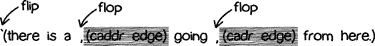
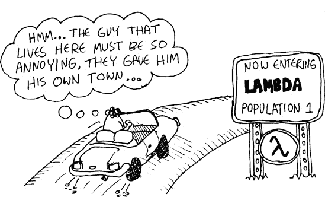
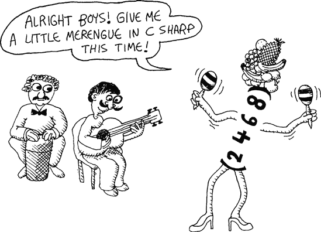
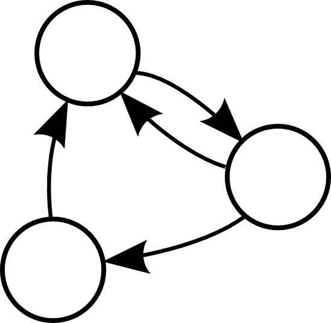
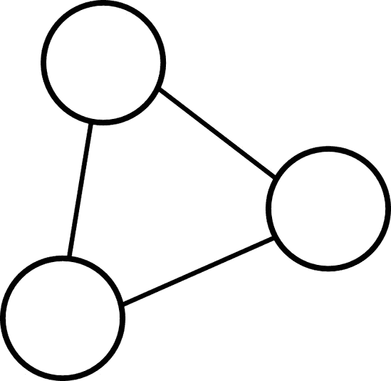
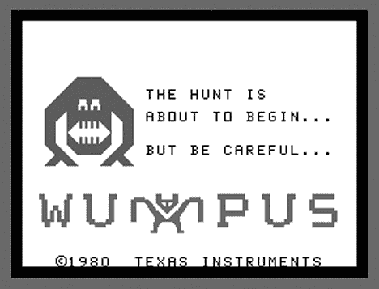
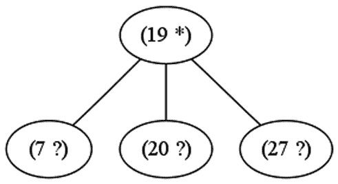
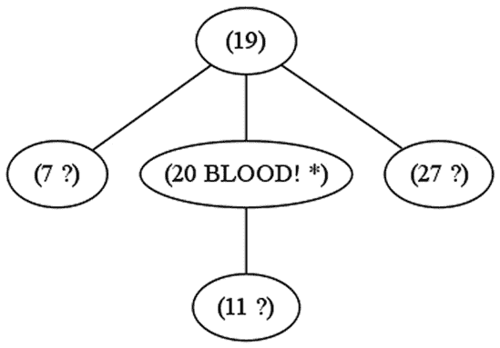
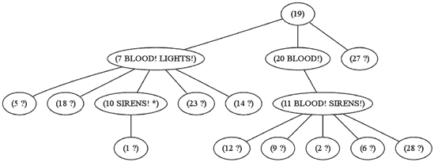
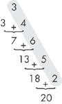

# 第二部分。Lisp 的对称性


# 第四章。使用条件做出决策

在前面的章节中，你学习了某些基本的 Lisp 命令，以及 Lisp 背后的某些哲学。在本章中，我们将详细探讨处理条件的命令。这些命令的优雅性表明，Lisp 不寻常的哲学和设计确实具有实际的好处。

# nil 和 () 的对称性

当我们观察 Lisp 命令和数据结构的工作方式时，有一件事特别引人注目：它们以每一种可能的方式都充满了对称性。这种对称性可以为你的 Lisp 代码带来一种其他语言无法拥有的优雅，而 Lisp 的简单语法是实现这种对称性的一个重要因素。

## 空等于假

由于 Lisp 哲学强烈强调使用列表来存储和处理信息，因此 Common Lisp 的设计倾向于使切片和切块此类列表变得容易的行为，这并不会让人感到惊讶。在 Common Lisp 中，关于列表的最深刻的设计决策是，它在评估条件时自动将空列表视为假值：

```
> `(if '()`
      `'i-am-true`
      `'i-am-false)`

I-AM-FALSE

> `(if '(1)`
      `'i-am-true`
      `'i-am-false)`

I-AM-TRUE
```

这个例子表明，当我们把空列表 `()` 传递给 `if` 形式时，它评估为假值，而包含项目的列表评估为真。

由于我们可以轻松地检测空列表，我们可以使用 *递归* 来处理列表。使用这种技术，我们可以从列表的前端取项目，并将列表的其余部分发送回同一个函数，直到列表为空。（检测空列表如此容易是一件好事，因为 Lisp 中有如此多的函数最终都会成为列表消耗者。）


让我们看看一个常见的列表消耗函数，它计算列表的长度。

```
> `(defun my-length (list)`
     `(if list`
         `(1+ (my-length (cdr list)))`
         `0))`

> `(my-length '(list with four symbols))`

4
```

这个函数是用经典 Lisp 风格编写的。它在从列表前端移除项目的同时递归地调用自己。以这种方式调用自己不仅在 Lisp 中是允许的，而且通常被强烈推荐。Lisp 中的列表是递归的（cons 的 cons 的 cons ...），因此消耗列表的行为自然映射到递归函数。

### 注意

递归调用自己有时会导致代码运行缓慢。在 第十四章 中，我们将使用一种特殊且可能更快的递归类型重写 `my-length` 函数。

## 空列表的四种伪装

不仅空列表评估为假，而且在 Common Lisp 中，它还是唯一的假值。*任何与空列表不等价的价值都将被视为真值*。这解释了为什么在先前的例子中，表达式 `'(1)` 被视为真。然而，Lisp 中还有一些其他表达式是唯一的空列表的伪装：


我们可以通过相互比较这些表中的表达式来看到它们是等价的：

```
 (eq '() nil)  ==> T
 (eq '() ())   ==> T
 (eq '() 'nil) ==> T
```

注意，表中唯一看起来正常的值是左侧比较中的引号列表。其他三个似乎都违反了我们之前章节中讨论的 Lisp 形式的规则。

前两个例子尤其令人困惑。它们缺少了告诉 Lisp 环境的引号，“嘿，这个项目是一份数据，而不是代码！”在 `nil` 的情况下，你可能会期望这实际上是一个可能具有某种任意值的变量的名称。在未引用的 `()` 的情况下，你根本无法知道会发生什么。括号看起来像是一种需要评估的代码形式，但 Lisp 形式始终有一个符号在开头，告诉它要做什么。当形式内部没有任何内容时，我们该怎么办？

事实上，Common Lisp 在幕后被设计成确保当你将这些值用于程序时，它们看起来都像空列表，这使得大多数 Lisp 条件语句可以以优雅的简洁性编写。例如，有一个名为 `nil` 的常量，它评估为自身，并允许你在第一种情况下省略引号！[](httpatomoreillycomsourcenostarchimages783564.png)。第二种情况！[](httpatomoreillycomsourcenostarchimages783562.png)是 Common Lisp 解析空形式时的自然结果。第三种情况！[](httpatomoreillycomsourcenostarchimages783560.png)是由于 Common Lisp 规范中的一个要求，即 `()` 和 `nil` 应该被同等对待。

虽然所有这些值都相同具有一定的美感，但并非每个 Lisp 程序员都同意这种观点。毕竟，假和空列表真的是同一种东西吗？其他流行 Lisp 方言（Scheme）的创造者对这个问题有不同的看法，他们更愿意将假和空列表的概念完全分开，尽管这会牺牲代码的简洁性。

# 条件语句：if 及其之后

既然你已经了解了 Lisp 如何处理真和假，那么让我们来看看 `if` 以及其他一些条件命令。

## 一次只做一件事的 if

`if` 命令可以在条件为真（例如，1 + 2 = 3）或假（例如，1 + 2 = 4）时执行不同的操作。

```
> `(if (= (+ 1 2) 3)`
      `'yup`
      `'nope)`

YUP

> `(if (= (+ 1 2) 4)`
      `'yup`
      `'nope)`

NOPE
```

`if` 命令还可以用来检查列表是否为空：

```
> `(if '(1)`
      `'the-list-has-stuff-in-it`
      `'the-list-is-empty)`

THE-LIST-HAS-STUFF-IN-IT

> `(if '()`
      `'the-list-has-stuff-in-it`
      `'the-list-is-empty)`

THE-LIST-IS-EMPTY
```

到目前为止，我们看到的唯一一种基于条件进行分支的命令是 `if` 命令：

```
> `(if (oddp 5)`
      `'odd-number`
      `'even-number)`

ODD-NUMBER
```

我们在这里所做的只是检查数字 5 是否为奇数，然后根据结果，在 `if` 形式中评估以下两个表达式之一。由于 5 是奇数，它评估了第一个这样的表达式，整个形式返回 `odd-number`。

在这个看似无害的小命令中，有很多事情正在发生——这些事情对于理解 Lisp 至关重要。以下是两个重要的观察：

+   只有 `if` 后面的一个表达式实际上会被评估。

+   在`if`语句中我们只能做一件事。

通常，当一个函数在 Lisp 中执行时，函数名后的所有表达式都会在函数本身评估之前被评估。然而，`if`并不遵循这些规则。为了看到这一点，考虑以下示例：

```
> `(if (oddp 5)`
    `'odd-number`
    `(/ 1 0))`

ODD-NUMBER
```

任何自重的、守法的 Lisp 函数都会在你尝试运行此代码时把你踢到路边，因为你正在除以零。

但`if`不仅仅是一个函数。它是一个*特殊形式*，这赋予它特殊的权限，例如不按正常方式评估所有参数的权利。这是有意义的，因为条件的目的就是运行某些东西但不运行其他东西。在这种情况下，它只是愉快地忽略了除以零的错误，因为它只适用于偶数部分的分支。Lisp 中的条件命令通常是特殊形式。


### 注意

一些条件命令可能是宏，它们类似于用户创建的特殊形式。作为特殊形式通常意味着一个命令是直接“嵌入”到语言中的。在第十六章（The Magic of Lisp Macros）中，你将学习如何自己编写这样的宏。

由于`if`语句内部只有一个表达式会被评估，所以在分支内部做两件或更多的事情是不可能的。

实际上，有一种巧妙的编程风格（称为*函数式编程*，我们将在第十四章中讨论），它认为这是一个好事。然而，对于你真的想做多项操作的情况，你可以使用一个特殊的命令`progn`，在单个表达式中插入额外的命令。使用`progn`，只有最后一个评估被作为整个表达式的值返回。例如，在下一个例子中，我们使用这个命令直接在我们的条件分支中设置一个特殊的全局变量。

```
> `(defvar *number-was-odd* nil)`

> `(if (oddp 5)`
      `(progn (setf *number-was-odd* t)`
             `'odd-number)`
      `'even-number)`

ODD-NUMBER

> `*number-was-odd*`

T
```


## 超越 if：when 和 unless 的替代方案

由于每次在`if`语句内想要做多项操作时使用`progn`都有些麻烦，Lisp 有其他几个包含隐式`progn`的命令。其中最基本的是`when`和`unless`：

```
> `(defvar *number-is-odd* nil)`
> `(when (oddp 5)`
        `(setf *number-is-odd* t)`
        `'odd-number)`

ODD-NUMBER

> `*number-is-odd*`

T

> `(unless (oddp 4)`
          `(setf *number-is-odd* nil)`
          `'even-number)`

EVEN-NUMBER

> `*number-is-odd*`

NIL
```

使用`when`时，当条件为真时，所有包含的表达式都会被评估。使用`unless`时，当条件为假时，所有包含的表达式都会被评估。这些命令的权衡是，当条件以相反的方式评估时，它们无法做任何事情；它们只是返回`nil`并什么都不做。

## 做一切命令：cond

但如果你是那种想要所有功能的程序员怎么办？也许你根本不想妥协，只想有一个能做所有事情的函数！Lisp 已经为你准备好了。


`cond` 形式是 Lisp 中进行分支的经典方式。通过大量使用括号，它允许隐式地使用 `progn`，可以处理多个分支，甚至可以连续评估多个条件。由于 `cond` 自 Lisp 石器时代以来一直存在，并且功能全面，许多 Lisp 程序员认为它是真正的 Lisp 条件。

这里有一个例子：

```
> `(defvar *arch-enemy* nil)`
 > `(defun pudding-eater (person)`
 `(cond ((eq person 'henry) (setf *arch-enemy* 'stupid-lisp-alien)`
                                   `'(curse you lisp alien - you ate my pudding))`
               `((eq person 'johnny) (setf *arch-enemy* 'useless-old-johnny)`
                                   `'(i hope you choked on my pudding johnny))`
               `(t                  '(why you eat my pudding stranger ?))))`

  > `(pudding-eater 'johnny)`
  (I HOPE YOU CHOKED ON MY PUDDING JOHNNY)
  > `*arch-enemy*`
  JOHNNY
  > `(pudding-eater 'george-clooney)`
  (WHY YOU EAT MY PUDDING STRANGER ?)
```


如您所见，`cond` 的主体使用括号层来分隔条件的不同分支。然后每个括号部分的第一个表达式包含使该分支激活的条件。在我们的例子中，我们有针对每种布丁小偷的不同分支：一个针对亨利 ，一个针对约翰尼 ，还有一个针对其他人 。我们使用 `eq` 来比较提供的名字与每个潜在的肇事者。

`cond` 形式中的条件总是从上到下进行检查，因此第一个成功的匹配将驱动行为。在这个例子中，最后一个分支  的条件为 `t`（表示真），这保证了至少最后一个分支将始终被评估。这是一个常见的 `cond` 习惯用法。

与 `when` 和 `unless` 一样，触发的分支可以包含多个命令，因为存在隐式的 `progn`。在这种情况下，前两个分支  设置了一个额外的 `*arch-enemy*` 变量，除了提供返回变量。

## 使用 case 进行分支

让我们看看最后一个 Lisp 命令：`case` 形式。通常使用 `eq` 函数作为条件，`case` 允许您提供一个要比较的值。使用 `case`，我们可以将前面的例子重写如下：

```
> `(defun pudding-eater (person)`
         `(case person`
              `((henry)   (setf *arch-enemy* 'stupid-lisp-alien)`
                         `'(curse you lisp alien - you ate my pudding))`
              `((johnny)  (setf *arch-enemy* 'useless-old-johnny)`
                         `'(i hope you choked on my pudding johnny))`
              `(otherwise '(why you eat my pudding stranger ?))))`
```

这个版本的代码对眼睛来说更容易接受。由 `case` 语句的每个部分处理的个人名称清晰可见——它不是隐藏在等式检查中。根据您使用的 Lisp 版本，这种 `case` 语句可能也更有效，尤其是在处理大量情况的长语句中。

### 警告

由于 `case` 命令使用 `eq` 进行比较，它通常仅用于基于符号值的分支。它不能用于基于字符串值的分支，以及其他情况。有关详细信息，请参阅 比较内容：eq、equal 和更多。

# 带条件的酷技巧

Lisp 的基本设计让你可以用几个简单的命令获得很多好处。具体来说，涉及 Lisp 中条件的两个反直觉技巧可以帮助你编写更干净的代码。第一个涉及到两个新的条件命令。第二个利用了 Lisp 对真和假的简单理解。

## 使用 Stealth Conditionals 和 and or

条件运算符 `and` 和 `or` 是简单的数学运算符，允许你以与使用加法和减法操作数字相同的方式操作布尔值。

例如，以下是我们可以如何使用 `and` 来检查三个数字是否都是奇数的方法：

```
> `(and (oddp 5) (oddp 7) (oddp 9))`

T
```

因为 5、7 和 9 都是奇数，整个表达式评估为真。

同样，我们可以使用 `or` 来检查一组数字中是否至少有一个是奇数：

```
> `(or (oddp 4) (oddp 7) (oddp 8))`

T
```

因为 7 是奇数，所以 `or` 命令仍然评估为真，尽管 4 和 8 都是偶数。

但 `and` 和 `or` 之间还有一些更有趣的东西，你可能只是通过查看这两个例子而不会注意到。到目前为止，这两个命令看起来像是完全普通的数学运算符；它们看起来不像 `if` 或 `cond` 这样的条件命令。然而，它们可以用于条件行为。

例如，以下是我们可以如何使用这些条件来设置全局变量，仅在数字是偶数时将其设置为真：

```
> `(defparameter *is-it-even* nil)`

*IS-IT-EVEN*

> `(or (oddp 4) (setf *is-it-even* t))`

T

> `*is-it-even*`

T
```

如果我们使用一个奇数做同样的事情，变量保持不变：

```
> `(defparameter *is-it-even* nil)`

*IS-IT-EVEN

> `(or (oddp 5) (setf *is-it-even* t))`

T

> `*is-it-even*`

NIL
```

这个例子说明了 Lisp 使用 *简化的布尔评估*。这意味着一旦 Lisp 确定列表中的一个 `or` 值为真，它就简单地返回真，而不会麻烦地评估剩余的语句。同样，一旦它确定列表中的一个 `and` 值为假，它就会停止，而不会麻烦地评估其余的语句。

虽然这看起来可能像是一个微不足道的、深奥的观察，但实际上在许多情况下可能非常有用。例如，想象一下，如果你想将文件保存到磁盘，但只有当文件被修改，并且只有当用户希望保存时才这样做。基本结构可以写成如下：

```
(if *file-modified*
    (if (ask-user-about-saving)
        (save-file)))
```

在这里，函数 `ask-user-about-saving` 会询问用户关于文件的情况，然后根据用户的意愿返回真或假。然而，由于在 Common Lisp 和大多数其他 Lisp 方言中，短路布尔评估保证用于布尔运算，我们可以这样写：

```
(and *file-modified* (ask-user-about-saving) (save-file))
```

仅当你超越布尔运算符作为简单数学运算符的典型用途时，才可能使用这种更简洁的样式来评估条件代码。这种形式在三个表达式之间具有优雅的对称性，这可能是某些 Lisp 程序员所喜欢的。然而，其他人可能会争辩说，你的代码的读者可能会轻易忽略 `(save-file)` 除了返回布尔值之外还做了其他事情的事实。需要一点时间来理解 `and` 和 `or` 实际上意味着的更广泛的概念。

编写此代码的第三种方法，它是在前两种方法之间的折衷，如下所示：

```
(if (and *file-modified*
         (ask-user-about-saving))
    (save-file)))
```

许多经验丰富的 Lisper 会认为这个版本比前两个版本更清晰，因为只有明确设计为返回布尔值的表达式才被视为条件的一部分。

## 使用返回不仅仅是真值的函数

现在，让我们看看 Lisp 简单思考真和假方式的另一个好处。正如我们之前讨论的，Common Lisp 中的任何值（除了`nil`的不同变体）都是真。这意味着在条件中常用的函数有返回*不仅仅是真值*的选项。

例如，Lisp 命令`member`可以用来检查列表中是否存在某个元素：

```
> `(if (member 1 '(3 4 1 5))`
      `'one-is-in-the-list`
      `'one-is-not-in-the-list)`

'ONE-IS-IN-THE-LIST
```

这看起来很简单。然而，再次强调，幕后发生了一些你可能没有预料到的事情。让我们单独运行`member`命令：

```
> `(member 1 '(3 4 1 5))`

(1 5)
```

这里到底发生了什么？为什么它返回`(1 5)`？

实际上，对此有一个完全合理的解释。每当 Lisper 编写一个返回真和假的函数时，她都会想，“除了 t 之外，我还能返回什么？”由于 Common Lisp 中所有非 nil 值都评估为真，返回其他值本质上是一种免费服务。`member`函数的实现者决定，某个疯狂的 Lisper 可能会看到列表尾部对于使用此函数的某些计算的价值。

### 注意

记住从第三章中提到的，列表`'(3 4 1 5)`与嵌套构造`(cons 3 (cons 4 (cons 1 (cons 5 nil))))`相同。这应该清楚地说明为什么`(cons 1 (cons 5 nil))`是`member`函数容易返回的值。

但为什么它不直接返回找到的值，而不是尾部？实际上，这本来是一个定义`member`函数的有用方法，因为它允许以这种方式将原始值传递给其他函数。不幸的是，有一个特定的边缘情况会破坏这个计划：

```
> `(if (member nil '(3 4 nil 5))`
      `'nil-is-in-the-list`
      `'nil-is-not-in-the-list)`

'nil-is-in-the-list
```

如您在此示例中看到的，即使我们搜索`nil`作为成员，`member`函数仍然给出正确答案！如果`member`函数实际上返回`nil`（换句话说，我们正在搜索的原始值），它将被评估为假，示例将错误地声明 nil 不在列表中。然而，由于`member`函数在找到的项目处返回列表的尾部，可以保证它始终是一个真值。成功发现所需值将始终返回至少包含一个值的列表，我们知道它始终评估为真。

一个真正受益于丰富返回值的函数是`find-if`，如下所示：

```
> `(find-if #'oddp '(2 4 5 6))`

5

> `(if (find-if #'oddp '(2 4 5 6))`
      `'there-is-an-odd-number`
      `'there-is-no-odd-number)`

'there-is-an-odd-number
```

`find-if` 函数实际上接受另一个函数作为参数，在这个例子中是 `oddp`。`find-if` 将找到列表中第一个使 `oddp` 返回 true 的值。在这种情况下，它将找到第一个（如果有）奇数。

你可以清楚地看到 `find-if` 如何扮演双重角色：要么作为匹配某些约束条件的值的检索器，要么作为条件中的真/假值。

### 注意

关于示例中 `oddp` 前面的奇怪井号 (`#`)，现在不用担心。我们将在第七章（Chapter 7. 超越基本列表）和第十四章（Chapter 14. 使用函数式编程提升 Lisp 的水平）中更详细地讨论 `find-if` 函数和其他所谓的更高阶函数。

然而，`find-if` 函数优雅的对称性有一个单一、微小、丑陋的瑕疵。如果我们再次尝试我们的边缘情况，搜索 `nil` 值，我们会得到一个相当令人失望的结果：

```
> `(find-if #'null '(2 4 nil 6))`

NIL
```

`null` 函数，对于任何 `nil` 值都返回 true，正确地找到了 `nil`。不幸的是，在这个令人烦恼的案例中，我们不想在条件语句中使用 `find-if`，因为正确找到的值仍然返回一个评估为 false 的结果。对称性已经被打破。

这些就是那些甚至让成熟的 Lispers 流泪的小事情。

# 比较东西：等式、等于以及其他

Lisp 中有很多美丽的对称性。不过，Lisp 中不那么美丽的一部分涉及比较事物的命令。

如果你想在 Lisp 中比较两个值以确定它们是否“相同”，你会发现一大堆不同的函数，这些函数都声称能完成这个任务。在这些函数中，`equal`、`eql`、`eq`、`=`、`string-equal` 和 `equalp` 是最常用的。Lisper 必须深入了解这些函数的细微差别，才能正确地比较值。


在我们开始剖析这种疯狂之前，让我给你介绍一下康拉德比较东西的经验法则。遵循这个法则，尽管你可能不会写出世界上最干净的 Lisp 代码，但你很可能能够在新 sgroup 上发布一些样本，而不会让更有经验的 Lispers 用火炬和长柄叉把你赶出小镇。


符号应该始终使用 `eq` 与其他符号进行比较：

```
> `(defparameter *fruit* 'apple)`

*FRUIT*

> `(cond ((eq *fruit* 'apple) 'its-an-apple)`
        `((eq *fruit* 'orange) 'its-an-orange))`

ITS-AN-APPLE
```

`eq` 函数是所有 Lisp 比较函数中最简单的，它也非常快。它实际上不适用于比较除符号以外的项，但如果你考虑到符号在 Lisp 中的核心作用，你会意识到这个函数是多么有用。经验丰富的 Lispers 可能会看不起用除 `eq` 之外的方式比较两个已知是符号的代码。

### 注意

`eq` 也可以用来比较连接（由 cons 命令创建的链接）。然而，它仅在连接直接与其自身比较，且由相同的 cons 调用创建时才返回 true 值。这意味着，两个看似完全相同的无关连接可能会在 eq 测试中失败。由于 `eq` 只能对 cons 单元进行自比较，因此对于初学者来说，使用 `eq` 与 cons 一起并不是特别有用。然而，对于高级 Lisp 用户来说，在某些情况下可能会想要使用 `eq` 来比较 cons。

如果你不是在处理两个符号，那么就使用 `equal`。这个命令会告诉你两个东西是否 `isomorphic`，即它们“看起来相同”。它适用于整个基本 Lisp 数据类型系列，如下所示：

```
;;comparing symbols
> `(equal 'apple 'apple)`

T

;;comparing lists
> `(equal (list 1 2 3) (list 1 2 3))`

T

;;Identical lists created in different ways still compare as the same
> `(equal '(1 2 3) (cons 1 (cons 2 (cons 3))))`

T

;;comparing integers
> `(equal 5 5)`

T

;;comparing floating point numbers
> `(equal 2.5 2.5)`

T

;;comparing strings
> `(equal "foo" "foo")`

T

;;comparing characters
> `(equal #\a #\a)`

T
```

如你所见，Lisp 中的大多数项目都可以有效地使用 `equal` 进行比较，包括字符串和字符（将在下一章中讨论）。

现在你对 Lisp 比较的最基本知识已经足够让你在下一个鸡尾酒会上混个脸熟，让我们来看看所有其他的比较命令。


`eql` 命令与 `eq` 命令类似，但与 `eq` 不同，它还处理数字和字符的比较：

```
;;comparing symbols
> `(eql 'foo 'foo)`

T

;;comparing numbers
> `(eql 3.4 3.4)`

T

;;comparing characters
> `(eql #\a #\a)`

T
```

`equalp` 命令基本上与 `equal` 命令相同，但它可以处理一些带有额外复杂性的困难比较情况。例如，它可以比较不同大小写的字符串，可以比较整数与浮点数：

```
;;comparing strings with different CAPS
> `(equalp "Bob Smith" "bob smith")`
T
;;comparing integers against floating point numbers
> `(equalp 0 0.0)`
T
```

剩余的比较命令只是针对特定数据类型的特殊化。否则，它们与 `equal` 类似。例如，等号（equal sign）函数处理数字，`string-equal` 处理字符串，`char-equal` 处理字符。

我希望你现在可以真正理解 Lisp 用户对比较的重视程度。

# 你学到的内容

在本章中，我们讨论了 Lisp 中条件的工作方式。在这个过程中，你学习了以下内容：

+   `nil`、`'nil`、`()` 和 `'()` 在 Common Lisp 中基本上是同一件事。

+   Lisp 使得检查空列表变得容易。这使得编写列表消耗者变得简单。

+   Lisp 条件，如 `if` 命令，仅在正确条件下才会评估 Lisp 代码。

+   如果你需要一个能够做所有事情的条件命令，那么你应该使用 `cond`。

+   在 Lisp 中比较东西很复杂，但如果你只是用 `eq` 来比较符号，用 `equal` 来比较其他所有东西，你就可以应付了。

# 第五章：构建文本游戏引擎

当你编写程序时，无论你使用哪种编程语言或你的程序做什么，它可能都需要处理文本。当然，总有一天我们可能都会在我们的头骨底部有以太网端口（到那时，100Mbps 以太网将完全被采用）。但在你能够直接通过连接与 MacBook 交换思想的那一天到来之前，你将不得不在软件中使用字母文本进行输入和输出。

计算机始终与文本保持一种脆弱的关系。尽管我们倾向于认为文本处理是计算机硬件和软件的中心任务（确实，8 位字节是现代计算机的标准设计元素，在很大程度上，这是由于它非常适合编码西文字符集），但事实的真相是，人类对*文本*的概念对计算机来说实际上是陌生的。

在本章中，你将学习如何使用 Lisp 来操纵文本。你将再次看到，Lispy 解决问题的方法允许你创建充满优雅和对称性的代码。为了展示这种方法，我们将做一些似乎不可避免地需要用文本思考的事情：构建一个简单的文本冒险游戏的引擎。然而，我们将以避免通过人为地将人类的文本概念强加于其设计来约束我们的代码的方式来做这件事。这将使我们能够编写专注于计算机优势的代码。

阅读本章时，请记住，处理文本并不是计算机的长处。这是一个必要的恶，最好将其保持在最低限度。

# 巫师的冒险游戏

在这个游戏中，你是一名巫师的学徒。你将探索巫师的房子。当我们完成游戏（在第十七章 Chapter 17 中）时，你将能够解决谜题并赢得一个魔法甜甜圈。

## 我们的游戏世界

这里是我们游戏世界的一张图片：


如你所见，我们可以访问三个不同的地点：客厅、阁楼和花园。玩家可以通过门和阁楼的梯子来在地方之间移动。

将这个游戏世界想象成一个简单的有向图，有三个节点（用椭圆表示）和四条边（用箭头表示）：


玩家可以通过沿着边在两个方向上移动节点之间。无论玩家在哪里，他们都可以与他们周围的各种物体互动。


## 基本要求

我们的游戏代码需要处理一些基本的事情：

+   环顾四周

+   走向不同的地点

+   拾起物体

+   对拾起的物体执行操作

在本章中，我们将解决这些要求中的前三个。为了在物体上执行更复杂的行为，我们将使用后面章节中介绍的更高级的 Lisp 技术。因此，我们的游戏引擎在完成第十七章之前将具有一定的局限性。

当在游戏世界中环顾四周时，你将能够从任何位置“看到”三种类型的事物：

+   基本风景

+   到其他地点的一条或多条路径

+   可以捡起并操纵的物体

让我们一次添加一个这些功能。

# 使用关联列表描述风景

我们冒险游戏中的世界非常简单，只包含三个位置。让我们首先创建一个顶层变量 `*nodes*`，以包含我们游戏中存在的位置的描述：

```
(defparameter *nodes* '((living-room (you are in the living-room.
                            a wizard is snoring loudly on the couch.))
                        (garden (you are in a beautiful garden.
                            there is a well in front of you.))
                        (attic (you are in the attic.
                            there is a giant welding torch in the corner.))))
```

这个变量包含了一个列表和三个位置的描述。本质上，`*nodes*` 变量基本上给我们提供了一种查找与查找键相关联的数据的方法。在这种情况下，键是地点的名称（`living-room`、`garden` 或 `attic`），而数据是那个地点的文本描述。这种结构被称为 *关联列表*，或简称为 *alist*（alist 在第七章超越基本列表中有更详细的介绍））。

关于这个 `*nodes*` 变量的定义有一件相当不寻常的事情：尽管它包含了我们游戏世界中各种位置的描述，但它实际上并不包含任何文本字符串。由于 Common Lisp 有字符串数据类型，我们本可以使用引号来编写描述。例如，我们可以写成 `"你在一个美丽的花园里。你面前有一个井。"` 而不是这样，我们使用更基本的数据类型——符号和列表——来编码这些信息。

我们为什么不直接使用字符串呢？正如我在本章开头提到的，文本操作并不是真正的计算基本概念。在这个游戏中，我们将以复杂的方式操作玩家与游戏世界交互时显示的消息。对于大多数现实世界的程序，你将生成的输出信息（如 HTML、PDF 或甚至更丰富的图形格式）可能比简单的文本复杂得多。

通过从一开始就确保你的源数据结构不受输出格式的假设影响，你的编码可以充分利用你的编程语言。由于在 Lisp 中最易操作的是符号和列表，大多数经验丰富的 Lisp 程序员在可能的情况下都会尝试在软件设计中专注于这些数据类型。因此，在我们的设计中我们将避免使用字符串。（在下一章中，我们将把这些列表和符号转换成正确格式的文本。）

### 注意

Common Lisp 并不强制你以这种方式使用列表和符号来表示字符串。如果更方便，你可以直接处理字符串。（你将在本书后面的例子中看到如何处理字符串，特别是在第十一章打印文本的 format 函数中。）使用列表和符号作为操作文本的中间件无疑是传统的 Lisp 技术。然而，它往往能产生非常优雅的代码，因为列表操作对于 Lisp 来说是如此基础。

# 描述位置

现在我们已经创建了我们游戏世界的 alist，我们需要创建一个命令来描述一个位置。为了完成这个任务，我们将使用 `assoc` 函数通过一个键来在列表中找到正确项：

```
> `(assoc 'garden *nodes*)`
(GARDEN (YOU ARE IN A BEAUTIFUL GARDEN. THERE IS A WELL IN FRONT OF YOU.))
```

使用 `assoc`，我们可以轻松地创建 `describe-location` 函数：

```
(defun describe-location (location nodes)
   (cadr (assoc location nodes)))
```

要使用此功能，我们需要传递一个位置和`*nodes*`列表：

```
> `(describe-location 'living-room *nodes*)`
(YOU ARE IN THE LIVING-ROOM. A WIZARD IS SNORING LOUDLY ON THE COUCH.)
```

为什么我们不直接从`describe-location`函数中引用`*nodes*`变量呢？因为这个函数是用*函数式编程*风格编写的。在这种风格中，一个函数将只引用函数本身中声明的参数或变量，并且除了返回一个值（在这种情况下是位置的描述）之外，不会做任何事情。

通过编写不直接引用“外部世界”中的变量且不执行任何除了返回值之外的操作的函数，你可以编写可以轻松隔离测试的代码。你应该尽可能以这种方式编写你的 Lisp 函数。（我们将在第十四章第十四章中更详细地讨论函数式编程风格。）


# 描述路径

现在我们已经有了每个位置的基本描述，我们还需要其他位置的路径描述。我们将创建第二个变量`*edges*`，它包含玩家可以在地图上移动到其他地点的路径。 （我们使用术语*edges*，因为这是连接图中节点的线的正确数学术语。）

```
(defparameter *edges* '((living-room (garden west door)
                                     (attic upstairs ladder))
                        (garden (living-room east door))
                        (attic (living-room downstairs ladder))))
```

使用这种结构，我们创建了一个`describe-path`函数，它使用我们的符号系统构建给定边的文本描述。

```
(defun describe-path (edge)
  `(there is a ,(caddr edge) going ,(cadr edge) from here.))
```

这个`describe-path`函数看起来相当奇怪——几乎更像是一段数据而不是一个函数。让我们试一试，然后弄清楚它是如何工作的。

```
> `(describe-path '(garden west door))`
(THERE IS A DOOR GOING WEST FROM HERE.)
```

这个函数基本上返回一个包含少量计算信息的片段数据。Lisp 的这个特性称为*准引用*，它允许我们创建包含少量 Lisp 代码嵌入的数据块。

## 如何使用准引用

要启用准引用，你必须使用反引号[`` ` ``]而不是单引号[`'`]在从代码模式切换到数据模式时。`describe-path`函数中就有这样一个反引号。

Lisp 中的单引号和反引号都将一段代码“翻转”成数据模式，但只有反引号可以使用逗号字符进行*取消引用*，从而翻转回代码模式。

用一点想象力，这应该对你来说是有意义的。毕竟，逗号看起来就像一个倒置的反引号，不是吗？下面是如何在`describe-path`函数中实现翻转的（代码模式的部分被阴影覆盖）：



Lisp 试图使列表操作尽可能简单。在这里，你可以看到我们的程序，它使用符号列表来存储我们的文本，现在可以利用准引用功能以非常简洁和清晰的方式构建句子。

## 描述多个路径

现在，让我们使用我们的 `describe-path` 函数来创建一个更高级的函数。由于一个位置可能从它那里有任意数量的路径退出，我们需要一个函数，可以通过查找我们的边数据结构来生成从给定位置的所有边的描述：

```
(defun describe-paths (location edges)
  (apply #'append (mapcar #'describe-path (cdr (assoc location edges)))))
```

这个函数使用了一些可能对不熟悉 Lisp 世界的人来说非常陌生的命令。许多编程语言会使用某种形式的 for-next 循环来遍历边，然后使用临时变量将每条路径的描述组合在一起。Lisp 使用一种更优雅的方法。让我们看看它是如何工作的：

```
> `(describe-paths 'living-room *edges*)`
(THERE IS A DOOR GOING WEST FROM HERE. THERE IS A LADDER GOING UPSTAIRS FROM HERE.)
```

`describe-paths` 函数执行以下步骤：

1.  找到相关边。

1.  将边转换为描述。

1.  合并描述。

让我们看看它是如何执行这些步骤的。

### 寻找相关边。

`describe-paths` 函数的第一部分相当直接。为了找到从客厅出发的相关路径和边，我们再次使用 `assoc` 在边的列表中查找位置：

```
> `(cdr (assoc 'living-room *edges*))`
((GARDEN WEST DOOR) (ATTIC UPSTAIRS LADDER))
```

### 将边转换为描述。

接下来，将边转换为描述。以下只是完成此任务的代码，单独展示：

```
> `(mapcar #'describe-path '((GARDEN WEST DOOR) (ATTIC UPSTAIRS LADDER)))`
((THERE IS A DOOR GOING WEST FROM HERE.)
 (THERE IS A LADDER GOING UPSTAIRS FROM HERE.))
```

Lisp 程序员经常使用 `mapcar` 函数。这个函数接受另一个函数和一个列表，然后将这个函数应用到列表的每一个成员上。以下是一个例子：

```
> `(mapcar #'sqrt '(1 2 3 4 5))`
(1 1.4142135 1.7320508 2 2.236068)
```

这个例子将 `sqrt`（平方根）函数和 `(1 2 3 4 5)` 列表传递给 `mapcar`。结果，该函数通过将 `sqrt` 应用到列表的每个成员并创建一个新列表，生成原始数字的平方根列表。

接受其他函数作为参数的函数，如 `mapcar`，非常有用，并且是 Lisp 的一个显著特征。这些函数被称为 *高阶函数*。

这里是另一个例子：

```
> `(mapcar #'car '((foo bar) (baz qux)))`
(foo baz)
```

这次，我们的源列表包含两个较小的列表。`car` 函数，它获取列表中的第一个项目，导致 `mapcar` 返回每个较小列表 `foo` 和 `baz` 的第一个项目。

你可能想知道我们传递给 `mapcar` 的函数名前为什么有 `#'` 符号。这个符号序列是 `function` 操作符的缩写。Lisp 读取器（你的 Lisp 环境中读取你输入代码的部分）会将前面的例子转换为以下更长的版本：

```
> `(mapcar (function car) '((foo bar) (baz qux)))`
(foo baz)
```

Common Lisp 要求你在直接将函数作为值引用时使用 `function` 操作符，因为函数的名称可能与程序中的其他命名项冲突，导致不可预测的错误。例如，想象如果我们向前面的例子添加更多内容，如下所示：

```
 > `(let ((car "Honda Civic"))`
    `(mapcar #'car '((foo bar) (baz qux))))`
  (foo baz)
```

在这个版本中，`car` 符号可能有两种不同的含义。`car` 的第一种含义是它是 Lisp 中内置的标准函数（在第三章第三章。探索 Lisp 代码的语法中介绍）。然而，我们也在创建一个名为 `car` 的局部变量 。由于我们在调用 `mapcar` 时在 `car` 前面加上了 `#'` ，所以我们不会混淆我们正在谈论的是哪个 `car`。

现在，让我们再次看看 `describe-paths` 函数：

```
(defun describe-paths (location edges)
  (apply #'append (mapcar #'describe-path (cdr (assoc location edges)))))
```

注意 `append` 和 `describe-path` 函数是如何作为值传递给 `apply` 和 `mapcar` 函数的，这些函数被设计用来接收和使用函数。

Common Lisp 对函数名和变量名的跟踪方式不同。它有多个 *命名空间*，包括一个用于变量和一个用于函数的。（我们将在第十六章第十六章。Lisp 宏的魔法中了解更多关于命名空间的内容。）另一种流行的 Lisp 方言 Scheme，在将函数用作值时，并不强制要求你用函数操作符标记函数。

换句话说，Scheme 只有一个命名空间用于函数和变量。例如，在 Scheme 中，你可以直接编写 `(map sqrt '(1 2 3 4 5))` 来生成从 1 到 5 的数字的平方根，而不会产生错误（`map` 是 `mapcar` 的 Scheme 版本）。由于这种设计，在 Scheme 中，一个变量和单独的函数不能在相同的代码块中可用。这个设计决策是 Scheme 的巨大好处（或诅咒）之一，这取决于你的观点。由于命名空间数量的这种差异，Scheme 有时被称为 *Lisp-1*，而 Common Lisp 有时被称为 *Lisp-2*。

### 加入描述

一旦我们使用 `mapcar` 生成所有路径和边的描述列表，我们需要将它们合并成一个单一的描述。我们通过 `append` 函数完成这个任务，它将几个列表合并成一个大的列表：

```
> `(append '(mary had) '(a) '(little lamb))`
(MARY HAD A LITTLE LAMB)
```

我们使用 `append` 函数将路径描述的列表合并成一个描述整个事物的列表，一次完成。问题是 `append` 需要所有传递给它的列表作为单独的参数。在 `describe-paths` 中，我们的列表是一个大列表，而不是可以作为参数传递的单独对象。实际上，我们甚至不知道从任何给定位置可能有多少条路径。

`apply` 函数解决了这个问题。你传递给它一个函数和一个对象列表，它假装列表中的项是单独的对象，并将它们作为这样的对象传递给指定的函数。例如，如果我们有一个嵌套列表 `'((mary had) (a) (little lamb))`，`apply` 函数将添加一小块胶带，使 `append` 函数能够与单个大列表一起工作：

```
> `(apply #'append '((mary had) (a) (little lamb)))`
(MARY HAD A LITTLE LAMB)
```

### 警告

由于`apply`函数将列表中的每个项目作为参数传递给`target`函数，当在包含数千项或更多项的非常大的列表上调用它时，你可能会遇到问题。你可以在 REPL 中检查`call-arguments-limit`变量的值，以查看函数允许的最大参数数量。（较新的 Lisp 方言通常设计为允许任何大小的参数列表，而没有人工限制。）

你可以看到`apply`如何使`describe-paths`函数能够构建一个长列表，描述从单个位置出发的所有路径。让我们使用这种方法来处理我们构建的路径描述列表：

```
> `(apply #'append '((THERE IS A DOOR GOING WEST FROM HERE.)`
                    `(THERE IS A LADDER GOING UPSTAIRS FROM HERE.)))`
(THERE IS A DOOR GOING WEST FROM HERE. THERE IS A LADDER GOING UPSTAIRS FROM HERE.)
```

现在我们已经查看完`describe-paths`函数的每个部分，让我们回顾一下它是如何工作的：

```
(defun describe-paths (location edges)
  (apply #'append (mapcar #'describe-path (cdr (assoc location edges)))))
```

该函数接受两个参数：当前玩家的位置以及游戏地图的边/路径的关联列表。首先，它使用`assoc`从边列表中查找正确的位置。由于`assoc`从关联列表中返回键和值，我们调用`cdr`来检索仅值。接下来，我们使用`mapcar`将`describe-path`函数映射到我们找到的每个边上。最后，通过应用`append`将描述所有路径的列表连接成一个长列表。

`describe-path`使用的编程风格对于 Lisp 代码来说非常典型。它涉及传递一个复杂的数据块并在几个步骤中对其进行操作，通常使用高阶函数。要成为一名熟练的 Lisp 程序员，你应该尝试习惯阅读以这种方式编写的代码。

# 描述特定位置的对象

为了创建帮助我们可视化游戏世界的最终代码片段，我们需要描述给定位置地板上的对象，玩家可以捡起并使用它们。

## 列出可见对象

要做到这一点，我们首先创建一个对象列表：

```
> `(defparameter *objects* '(whiskey bucket frog chain))`
*OBJECTS*
```


我们还可以创建第二个变量`*object-locations*`，以关联列表的形式跟踪每个对象的位置：

```
(defparameter *object-locations* '((whiskey living-room)
                                   (bucket living-room)
                                   (chain garden)
                                   (frog garden)))
```

接下来，我们编写一个函数来列出从给定位置可见的对象：

```
(defun objects-at (loc objs obj-locs)
   (labels ((at-loc-p (obj)
              (eq (cadr (assoc obj obj-locs)) loc)))
     (remove-if-not #'at-loc-p objs)))
```

`objects-at`函数使用`labels`命令声明了一个名为`at-loc-p`的新函数！[](httpatomoreillycomsourcenostarchimages783564.png)。 (记住，`labels`函数允许你在局部定义函数。) 由于`at-loc-p`函数不会在其他地方使用，我们可以在`objects-at`函数内部直接声明它，从而将其隐藏在程序中其他代码之外。

`at-loc-p`函数接受一个对象的符号，并根据该对象是否存在于位置`loc`返回`t`或`nil`。它是通过在`obj-locs`关联列表中查找对象来做到这一点的。然后，它使用`eq`来查看找到的位置是否与所讨论的位置匹配！[](httpatomoreillycomsourcenostarchimages783562.png)。

为什么我们把这个函数命名为 `at-loc-p`？当一个函数返回 `nil` 或一个真值时，这是 Common Lisp 的一个约定，在函数名称的末尾附加一个 `p`。例如，你可以通过调用 `(oddp 5)` 来检查数字 5 是否为奇数。这样的真/假函数被称为 *predicates*，这就是为什么我们使用字母 `p`。

列表最后一行的 `remove-if-not` 函数，正如你所预期的那样，会从列表中移除所有那些传入的函数（在这种情况下，`at-loc-p`）不返回 true 的项目。本质上，它返回一个过滤后的对象列表，包含那些 `at-loc-p` 返回 true 的项目。

下面是 `object-at` 函数的实际应用：

```
> `(objects-at 'living-room *objects* *object-locations*)`
(WHISKEY BUCKET)
```

## 描述可见对象

现在，我们可以编写一个函数来描述给定位置可见的对象：

```
(defun describe-objects (loc objs obj-loc)
  (labels ((describe-obj (obj)
               `(you see a ,obj on the floor.)))
    (apply #'append (mapcar #'describe-obj (objects-at loc objs obj-loc)))))
```

在这个列表中，`describe-objects` 首先创建了一个 `describe-obj` 函数！[](httpatomoreillycomsourcenostarchimages783564.png)。这个函数生成一个漂亮的句子，说明一个给定的对象在地板上，使用伪引用！[](httpatomoreillycomsourcenostarchimages783562.png)。函数的主要部分是调用 `objects-at` 来找到当前位置的对象，将 `describe-obj` 映射到这个对象列表上，并最终将这些描述追加到一个单独的列表中！[](httpatomoreillycomsourcenostarchimages783560.png)。

让我们尝试运行 `describe-objects`：

```
> `(describe-objects 'living-room *objects* *object-locations*)`
(YOU SEE A WHISKEY ON THE FLOOR. YOU SEE A BUCKET ON THE FLOOR)
```

完美！


# 描述一切

现在，我们将所有这些描述函数整合到一个简单的命令 `look` 中。因为这个命令将是玩家在游戏中四处张望时可以输入的实际命令，所以 `look` 需要知道玩家的当前位置。因此，我们需要一个变量来跟踪玩家的当前位置。让我们称它为 `*location*`：

```
(defparameter *location* 'living-room)
```

因为 `*location*` 的值初始化为 `living-room` 符号，它在游戏开始时出现，玩家将发现自己身处巫师的房子客厅里。在这个时候，我们可以编写一个 `look` 函数来描述我们所需要的一切，通过调用所有的描述函数来实现：

```
(defun look ()
  (append (describe-location *location* *nodes*)
          (describe-paths *location* *edges*)
          (describe-objects *location* *objects* *object-locations*)))
```

由于 `look` 函数使用全局变量名（如 `*location*`、`*nodes*` 等），玩家在查看世界时不需要传递任何奇怪的值。然而，这也意味着 `look` 函数不是函数式编程风格，因为在函数式编程风格中，函数只引用函数本身声明的参数或变量。`*location*` 及其类似物是全局变量，所以 `look` 函数不符合标准。

由于玩家的位置在游戏过程中会发生变化，`look` 在游戏中的不同时间会做**不同的事情**。换句话说，当你环顾四周时看到的物品会根据你的位置而变化。相比之下，函数式编程风格中的函数只要参数相同，总是返回相同的结果。我们之前创建的函数，如 `describe-location`、`describe-paths` 和 `describe-objects`，无论何时调用，只要它们的参数保持不变，总是返回相同的内容。

现在我们来看看使用 `look` 时我们看到的内容：

```
> `(look)`
(YOU ARE IN THE LIVING-ROOM OF A WIZARD’S HOUSE.
THERE IS A WIZARD SNORING LOUDLY ON THE COUCH.
THERE IS A DOOR GOING WEST FROM HERE.
THERE IS A LADDER GOING UPSTAIRS FROM HERE.
YOU SEE A WHISKEY ON THE FLOOR.
YOU SEE A BUCKET ON THE FLOOR)
```


# 在我们的世界中四处走动

现在我们可以看到我们世界中的事物了，让我们编写一些代码，以便我们可以四处走动。`walk` 函数（不是函数式风格）接受一个方向，并允许我们走到那里：

```
(defun walk (direction)
  (let ((next (find direction
                    (cdr (assoc *location* *edges*))
                    :key #'cadr)))
  (if next
      (progn (setf *location* (car next))
             (look))
      '(you cannot go that way.))))
```

首先，这个函数会在 `*edges*` 表中查找可用的行走路径，使用当前的位置 ![httpatomoreillycomsourcenostarchimages783562.png]。这是由 `find` 函数用来定位带有适当方向的路径 ![httpatomoreillycomsourcenostarchimages783564.png]。(`find` 在列表中搜索一个项目，然后返回找到的项目。)方向（如 `west`、`upstairs` 等）将位于每个路径的 `cadr` 中，因此我们需要告诉 `find` 将 `direction` 与列表中所有路径的 `cadr` 进行匹配。

我们可以通过向 `find` 传递一个 **关键字参数** ![httpatomoreillycomsourcenostarchimages783560.png] 来做到这一点。在 Common Lisp 中，许多函数（如 `find`）具有内置功能，可以通过在函数调用末尾传递特殊参数来访问。例如，以下代码在列表中找到第一个在 `cadr` 位置有符号 `y` 的项目：

```
> `(find 'y '((5 x) (3 y) (7 z)) :key #'cadr)`
(3 Y)
```

关键字参数有两个部分：

+   第一部分是名称（在这个例子中是 `:key`），它以冒号开头。（我们将在 第七章 中更详细地讨论这个冒号的意义。）

+   第二个是值，在这个例子中是 `#'cadr`。

在我们的 `walk` 函数中，我们以相同的方式使用关键字参数来根据给定的方向找到合适的路径。

一旦我们得到正确的路径，我们就将结果存储在变量 `next` 中！。然后 `if` 表达式检查 `next` 是否有值！（`next` 变量不是 `nil`）。如果 `next` 有值，`if` 就会调整玩家的位置，因为这是一个有效方向！。调用 `look` 函数！检索新位置的描述并将其作为值返回。如果玩家选择了一个无效方向，`look` 将生成一个警告而不是新描述！。

现在我们 `walk` 函数的样子如下：

```
> `(walk 'west)`
(YOU ARE IN A BEAUTIFUL GARDEN.
THERE IS A WELL IN FRONT OF YOU.
THERE IS A DOOR GOING EAST FROM HERE.
YOU SEE A CHAIN ON THE FLOOR.
YOU SEE A FROG ON THE FLOOR.)
```

方向前有一个引号，因为方向名需要以数据模式书写。强迫玩家在游戏命令中放置引号有点尴尬，但我们现在创建的界面是为了方便调试和开发。实际上，这几乎都不值得称为“界面”，因为我们只是直接将游戏命令输入到 REPL 中。在下一章中，我们将创建一个更漂亮的界面，使用定制的 REPL，它专为玩文本游戏而设计，将处理这个瑕疵。

### 注意

你可以使用 Lisp *宏* 在不需要在方向前加引号的 vanilla Lisp REPL 中创建命令，这样你就可以直接写 `(walk west)`，例如。你将在第十六章（第十六章。Lisp 宏的魔力）中了解更多关于宏的内容。

# 拾取物体

接下来，让我们创建一个命令来拾取我们世界中的物体。为此，我们修改了用于跟踪物体位置的变量 `*object-locations*`：

```
(defun pickup (object)
  (cond ((member object
                 (objects-at *location* *objects* *object-locations*))
         (push (list object 'body) *object-locations*)
           `(you are now carrying the ,object))
          (t '(you cannot get that.))))
```

`pickup` 函数使用 `member` 函数来检查 `object` 是否确实位于当前位置的地板上。（`member` 函数检查特定项目是否在项目列表中。）我们使用 `objects-at` 命令来生成当前位置的物体列表。

如果物体位于当前位置，我们使用 `push` 命令！将一个新项目推入 `*object-locations*` 列表中，包括项目和它的新位置。新位置将是 `body`，即玩家的身体。

`push` 命令！简单地将一个新项目添加到列表变量的列表前面。例如，以下示例将数字 `7` 添加到列表 `1 2 3` 中：

```
> `(defparameter *foo* '(1 2 3))`
*FOO*
> `(push 7 *foo*)`
(7 1 2 3)
> `*foo*`
(7 1 2 3)
```

这个 `push` 命令基本上是在 `setf` 之上构建的一个便利函数。例如，我们可以用 `(setf *foo* (cons 7 *foo*))` 来替换前面的 `push` 命令，并得到相同的结果。只是使用 `push` 更简单。

将一个新位置推送到我们的 `*object-locations*` 列表确实看起来有点奇怪。因为我们从未删除过对象的老位置，只是推送新的位置，这意味着 `*object-locations*` 可能会包含单个对象的多个条目，而这个列表现在为该对象存储了两个位置。幸运的是，我们用来在给定位置（在 `objects-at` 命令中）查找对象的 `assoc` 命令总是返回列表中找到的第一个项目。因此，使用 `push` 命令使得 `assoc` 命令表现得好像列表中给定键的值已经被完全替换。

使用 `push` 和 `assoc` 命令以这种方式一起使用，我们可以假装 alist 中的值在变化，同时仍然保留旧值。旧值只是被新值压制，从而保留所有旧值的历史。`push`/`assoc` 习语是 Lisper 常用的技术。

现在，让我们回到客厅并尝试拿起一个物品：

```
> `(walk 'east)`
(YOU ARE IN THE LIVING-ROOM OF A WIZARDS HOUSE. THERE IS A WIZARD SNORING
 LOUDLY ON THE COUCH. THERE IS A DOOR GOING WEST FROM HERE. THERE IS A LADDER
 GOING UPSTAIRS FROM HERE. YOU SEE A WHISKEY ON THE FLOOR. YOU SEE A BUCKET ON
 THE FLOOR.)
> `(pickup 'whiskey)`
(YOU ARE NOW CARRYING THE WHISKEY)
```

它成功了。我们现在携带了威士忌，这意味着我们现在可以在我们的世界中拿起东西了！

# 检查我们的库存

最后，让我们创建一个允许玩家查看他们携带的物品清单的函数：

```
(defun inventory ()
  (cons 'items- (objects-at 'body *objects* *object-locations*)))
```

这个库存函数使用 `objects-at` 函数检索请求位置上的对象列表。它搜索什么位置？如果你还记得，当一个对象被玩家拿起时，我们将其位置更改为 `'body'`：这是我们现在用来查询的位置。

让我们尝试一下这个 `inventory` 函数：

```
> `(inventory)`
(ITEMS- WHISKEY)
```

如你所见，我们现在只携带一个物品：我们刚刚捡起的威士忌瓶子。

就这样！我们现在有一个基本的文字冒险游戏引擎。我们可以用 `look` 来环顾四周；用 `walk` 在地方之间行走；用 `pickup` 拿起物品；用 `inventory` 检查我们的库存。

当然，我们实际上并没有一个真正的游戏，因为我们无法对找到的对象进行任何操作。我们将在第十七章（第十七章）中添加一个实际操作对象的机制。在下一章中，我们将专注于改进我们游戏的用户界面。尽管 REPL 非常适合我们的游戏原型设计，但添加一个定制的文本游戏界面将使游戏对玩家来说玩起来更加流畅。

# 你学到了什么

在本章中，我们为文字冒险游戏构建了一个简单的引擎。在这个过程中，你学习了以下内容：

+   游戏世界可以用一个数学图来表示，其中包括玩家可以访问的 `*nodes*`（节点）和这些地方之间的 `*edges*`（边）。

+   你可以将这些节点存储在一个名为 `*nodes*` 的 `*association list*`（关联列表）中。这个列表允许你通过节点的名称来查找节点/位置的性质。在我们的游戏中，我们存储的性质是每个节点/位置的描述。

+   你使用 `assoc` 函数在一个 alist 中查找一个键（在我们的例子中是位置名称）。

+   **伪引号**是一种技术，允许你将小块计算机代码插入到更大的数据块中。

+   一些 Lisp 函数接受其他函数作为参数。这些被称为**高阶函数**。`mapcar` 函数是 Common Lisp 中最受欢迎的高阶函数。

+   要替换 alist 中的值，你需要将新项目`push`到列表中。`assoc` 函数只会报告最新的值。

# 第六章. 与世界交互：Lisp 中的读取和打印

到目前为止，我们还没有编写任何直接与外界交互的代码。相反，所有由命令生成的结果都只是作为值返回，我们可以通过调用我们的 Lisp REPL 中的函数来看到这些值。

然而，代码不能整日坐在黑盒子里。在某个时候，它将需要与世界交互，因此它需要一个用户界面。幸运的是，Lisp 提供了许多帮助创建用户界面的工具。有针对不同 Common Lisp 版本的各种图形用户界面库，以及用于构建 Web 界面的库。实际上，我们将在第十三章构建 Web 服务器！中构建自己的玩具 Web 界面。

在本章中，我们将关注所有用户界面中最基本的，即**命令行界面**。


# 打印和读取文本

对于命令行界面，我们需要能够直接从屏幕打印文本并读取用户输入的文本的命令。执行此操作的两个命令恰当地是 `print` 和 `read`。正如你所期望的，这两个命令之间有很多对称性。

## 打印到屏幕

`print` 函数简单地允许你将内容打印到控制台：

```
> `(print "foo")`

 "foo"
 "foo"
```

不要被调用 `print` 函数导致 `"foo"` 被打印两次的事实所困惑。第一个 `"foo"`  是 `print` 函数**实际上打印的内容**。第二个 `"foo"`  存在是因为，正如你所知，REPL 总是打印输入的任何表达式的值。恰好 `(print "foo")` 的值是 `"foo"`，导致单词被显示两次。在本章接下来的示例中，我通常会省略 REPL 打印的额外最终值，以避免混淆。

`print` 函数是一种将 Lisp 值打印到屏幕的简单方法。然而，高级 Lisp 程序员通常更喜欢一个相关的函数，称为 `prin1`。为了理解两者之间的区别，让我们在 REPL 中尝试这两个函数：

```
> `(progn (print "this")`
         `(print "is")`
         `(print "a")`
         `(print "test"))`

"this"
"is"
"a"
"test"
```

`print` 函数会导致每个项目单独打印在一行上。现在，让我们尝试 `prin1`：

```
> `(progn (prin1 "this")`
         `(prin1 "is")`
         `(prin1 "a")`
         `(prin1 "test"))`
"this""is""a""test"
```

如您所见，`prin1` 不会将打印的项放在单独的行上。更准确地说，`print` 和 `prin1` 命令在各个方面都是相同的，除了 `print` 在打印值之前会开始新的一行。此外，`print` 还会在打印值的末尾放置一个空格字符。

因为 `prin1` 做得较少，它实际上是一个更简单、更基本的函数。它更灵活，因此通常在更严肃的 Lisp 代码中使用。在这本书中，我们将更频繁地使用 `print` 函数，但您应该了解 `prin1` 命令。

## 向用户问好

以下是一个简单的函数示例，名为 `say-hello`，您可以从 Lisp 提示符中调用它。它会询问用户的姓名，并以问候语作为回应。*当您运行程序时，请务必在您的姓名周围输入引号，即使这看起来可能有些奇怪*。

```
> `(defun say-hello ()`
      `(print "Please type your name:")`
      `(let ((name (read)))`
          `(print "Nice to meet you, ")`
          `(print name)))`
  SAY-HELLO.
  > `(say-hello)`
  "Please type your name:" `"bob"`
  "Nice to meet you,"
  "bob"
```

在 `say-hello` 函数的第一行中，我们打印了一条消息，询问用户输入他们的姓名 。然后，我们定义了一个名为 `name` 的局部变量，并将其设置为 `read` 函数返回的值 。`read` 函数将使 Lisp 等待用户在 REPL 中输入某些内容。只有当用户在提示符中输入了一些内容并按下回车键后，变量 `name` 才会被设置为结果。一旦我们知道用户的姓名，就会打印一条个性化的消息，问候用户 。

如您从这个简单的函数中可以看到，`print` 和 `read` 函数（几乎）完全符合您的预期。`print` 函数会在屏幕上打印一些内容。`read` 函数允许用户将一些内容输入到程序中。然而，这些函数中有一个明显的特性：显示和输入的每个值都被引号包围。

## 从 print 和 read 开始

当您需要在屏幕上打印某些内容时，您应该首先考虑使用 `print` 命令。如果您需要读取某些内容，您应该首先考虑使用 `read` 命令。其他打印命令可以让您创建之前的示例，而不需要多余的引号，但每当您在 Lisp 中进行输入或输出任务时，您都应该问自己，“`print` 或 `read` 能完成这项工作吗？”如果您始终以这两个函数作为起点，您将节省很多麻烦。

### 警告

如果使用不当，`read` 命令可能会很危险。有关详细信息，请参阅《read 和 eval 的危险》。

`print` 和 `read` 函数是用计算机的思维来考虑值的，而不是人类的思维。计算机喜欢被引号包围的文本字符串。它没有人类的头脑，因此当我们给它提供原始文本信息时，它无法理解我们的意图。然而，如果一个文本片段被引号包围，即使是愚蠢的老式计算机也能推断出我们传递给它的值可能是一串文本。

`print` 和 `read` 命令实际上将这种哲学推向了极致。在 Lisp 中几乎任何可想象的数据类型（除了实际函数和一些高级数据结构）都可以使用这些命令打印和读取，而不会有一点损失。你可能已经能够想象出一些这个特性会非常有价值的场景，比如将一些复杂和庞大的数据写入文件，然后在以后再次加载它。

作为简单的例子，以下代码与前面的函数有*完全相同*的设计，但令人惊讶的是，它可以读取和打印一个数字而不是字符串。注意程序如何在不使用引号的情况下打印和读取数字，因为 Lisp 只需看到其原始形式中的数字就能知道它是什么。

```
> `(defun add-five ()`
      `(print "please enter a number:")`
      `(let ((num (read)))`
          `(print "When I add five I get")`
          `(print (+ num 5))))`
ADD-FIVE
> `(add-five)`
"please enter a number:" `4`
"When I add five I get"
9
```

让我们看看当我们使用 `print` 来输出值时会发生什么的一些更多例子。

```
`(print '3)`     => 3      *`An integer`*
`(print '3.4)`   => 3.4    *`A float`*
`(print 'foo)`   => FOO
    *`A symbol. It may be printed in all caps, since Common`*
                          *`Lisp symbols are blind to letter case.`*
`(print '"foo")` => "foo"  *`A string`*
`(print '#\a)`   => #\a    *`A character`*
```

这些例子都非常无聊，因为 `print` 几乎只是打印出我们放入的内容。请注意，我们在每个值的前面都明确地放置了引号。它可以省略，在所有情况下都是隐式的，除了符号名称，因为符号也可以指代函数。

最后一个例子展示了如何在 Lisp 中输入字面字符。要创建一个 Lisp 字符，只需在实际字符前放置 `#\` 符号。Lisp 还为不可见字符定义了特殊的字面量。对于日常使用来说，最重要的是 `#\newline`、`#\tab` 和 `#\space`。

`read` 函数的输出表将和 `print` 函数的这张表一样无聊，以同样的对称方式。

### 注意

在上面的例子中，我提到 Common Lisp 符号对字母大小写是盲目的。虽然这对于大多数字符串来说是正确的，但实际上可以通过用垂直管道 `|` 包围符号来创建大小写敏感的符号。因此，符号 `|CaseSensitiveSymbol|` 将保留其大小写。被垂直管道包围的符号甚至可以包含标点符号。因此 `|even this is a legal Lisp symbol!|` 也是一个合法的 Lisp 符号！

## 以人类喜欢的方式读取和打印内容

当然，我们最初的 `say-hello` 函数在问候人们方面做得相当糟糕，即使它有一些有趣的特性。如果我们有更多可以使它对人类更友好的函数会更好。实际上，我们可以创建一个（非常对称的）小表格，总结我们想要的内容：


如你所见，Lisp 有一个命令可以以对人类有吸引力的方式打印数据片段。`princ`函数可以接受任何 Lisp 数据，并尝试以人类更喜欢的形式打印这些数据。它会做你可能会期望的基本事情：省略字符串上的引号，以原始形式打印字符等等。以下是一些示例：

```
`(princ '3)`     => 3
`(princ '3.4)`   => 3.4
`(princ 'foo)`   => FOO
`(princ '"foo")` => foo
`(princ '#\a)`   => a
```

这里是一个示例，展示如何`princ`一个具有特殊意义的字符：

```
> `(progn (princ "This sentence will be interrupted")`
         `(princ #\newline)`
         `(princ "by an annoying newline character."))`
This sentence will be interrupted
by an annoying newline character.
```

从本质上讲，`princ`可以用来打印任何你想要的字符输出。这与`print`有根本的不同。正如我们讨论过的，`print`命令的酷之处在于它以某种方式打印对象，使得它们总能被“读取”回它们的内部表示。然而，这意味着`print`不能用来生成任何任意的文本。另一方面，`princ`可以用来打印任何你想要的东西。

因此，尽管`princ`可以以人类更喜欢的形式打印内容，但它是一条单行道。一旦我们用`princ`打印了东西，只有类似人类的智能才能解读如何将这些内容转换回有意义的、适当的 Lisp 数据结构。由于计算机目前还无法做到这一点，这意味着我们心爱的对称性已经被打破。

当然，我们总是可以作弊并制定一些任意的规则来让计算机解释人类输入的内容。一种明显的方法是告诉计算机，“让用户输入他们想要的任何内容，直到他们按下回车键，然后将整个内容视为一个字符串。”在 Common Lisp 中执行此操作的功能称为`read-line`。然而，它没有`read`、`print`和`princ`函数的任何复杂性，因为它只知道字符和字符串。

带着这些新知识，我们终于可以完整地创建一个用于问候某人的函数，而不需要丑陋的引号或其他奇怪的东西：

```
> `(defun say-hello ()`
      `(princ "Please type your name:")`
      `(let ((name (read-line)))`
          `(princ "Nice to meet you, ")`
          `(princ name)))`
  SAY-HELLO
  > `(say-hello)`
  Please type your name: `Bob O'Malley`
  Nice to meet you, Bob O'Malley
```

这个版本的`say-hello`函数与我们的第一个版本类似。然而，当计算机请求用户输入他们的名字 ，现在它不再在文本字符串周围打印引号。同样的情况也适用于打印问候语 。此外，用户现在可以输入任何名字（包括包含空格和引号的名字），因为`read-line`命令  会捕获并返回直到按回车键之前输入的所有文本，而不会出现任何麻烦。

# Lisp 中代码与数据之间的对称性

你已经看到 Lisp 有非常优雅和对称的工具，可以将原始字符串数据从外部世界转换成 Lisp 语法表达式，反之亦然。但 Lisp 有更深层次的对称性。它可以将程序代码和数据互换使用。使用相同的数据结构来存储数据和程序代码的编程语言被称为 *同构的*。

在第三章中，我们讨论了代码模式和数据模式时，你看到了同构性的一个例子。在那个例子中，我们使用引号在两种模式之间切换：

```
`> '(+ 1 2)` ;data mode
(+ 1 2)
`> (+ 1 2)` ;code mode
3
```

在上一章中，我们通过在定义 `describe-path` 函数时使用伪引号，将这个概念又推进了一步。

但 Lisp 中的引号和伪引号功能在能力上有些有限。如果我们以某种方式从头生成一段 Lisp 代码并希望像代码一样执行它怎么办？例如，让我们将一段原始代码存储在一个变量中：

```
> `(defparameter *foo* '(+ 1 2))`
*FOO*
```

我们如何执行 `*foo*` 变量中的代码？我们需要一个更强大的命令来实现这一点。这就是 `eval` 命令：

```
> `(eval *foo*)`
3
```

由于 `eval` 命令既强大又简单，对初学者来说极具吸引力。你想编写一个具有自我修改代码的程序？那么 `eval` 将是你的最佳选择。实际上，这可能是过去人工智能（AI）爱好者如此热爱 Lisp 的主要原因。尝试编写一些使用 `eval` 命令的程序。你会发现这非常有趣。

然而，有经验的 Lisp 程序员很少使用 `eval`。在你积累了几千行 Lisp 代码之前，你真的不知道何时适当地使用这个极其强大的命令。通常，初学者会用 `eval` 命令代替定义 Lisp 宏。我们将在第十六章中讨论宏。

事实上，Lisp 中数据和代码的对称性几乎使 Lisp 成为同构性的典范。引号、伪引号、`eval` 命令和宏允许你在代码中利用这一特性。

### 警告

不当使用 `eval` 可能会带来安全风险。更多信息请参阅读取和评估的危险。

# 为我们的游戏引擎添加自定义界面

到目前为止，我们一直在使用 Lisp REPL 来输入我们的游戏命令。这对于我们的游戏原型设计来说效果非常好。但现在你已经了解了基本的 Common Lisp 输入和输出命令，我们可以开始构建我们自己的自定义文本游戏界面，这将更适合与玩家交互。

## 设置自定义 REPL

在 Lisp 中创建自己的 REPL 几乎可以说是轻而易举的。以下是我们游戏的一个简单自定义 REPL，它允许我们以与标准 REPL 完全相同的方式调用`look`命令：

```
> `(defun game-repl ()`
     `(loop (print (eval (read)))))`
GAME-REPL
> `(game-repl)`
`(look)`

(YOU ARE IN THE LIVING-ROOM. A WIZARD IS SNORING LOUDLY ON THE COUCH. THERE IS
 A DOOR GOING WEST FROM HERE. THERE IS A LADDER GOING UPSTAIRS FROM HERE. YOU
 SEE A WHISKEY ON THE FLOOR.)
```

如果这个关于`game-repl`的解释让你感到困惑，请打断我：首先它`read`s 一个命令，然后`eval`s 它，最后`print`s 它。你之前没有见过的唯一命令是`loop`（在第十章中详细介绍），正如你所期望的，它只是无限循环。在 CLISP 中，你需要按 ctrl-C 并输入`:a`才能退出无限循环。正如你所见，通过简单地调用`read`、`eval`、`print`和`loop`，很容易构建自己的 REPL。


当然，为了自定义我们 REPL 的行为，我们希望调用这些函数的自己的版本。此外，我们希望有一种更优雅的方式退出游戏。因此，让我们按照以下方式重新定义`game-repl`：

```
(defun game-repl ()
    (let ((cmd (game-read)))
        (unless (eq (car cmd) 'quit)
            (game-print (game-eval cmd))
            (game-repl))))
```

在这个版本中，我们首先使用局部变量`cmd`捕获玩家输入的命令。这样，我们可以拦截任何尝试调用`quit`并使用它来退出我们的`game-repl`。换句话说，我们希望 REPL 继续运行，除非用户输入了`quit`。否则，函数`eval`s 和`print`s，但使用我们即将编写的自定义版本。最后，`game-repl`函数递归地调用自身，只要我们没有在之前决定退出，它就会循环回。

## 编写自定义的`read`函数

我们`game-read`函数的目的是修复使标准 Lisp `read`函数不适合玩游戏的两个烦恼：

+   标准的 Lisp `read`强制我们在命令周围加上括号。正如任何老式文字冒险游戏玩家所知，我们应该能够只输入`look`而不加任何括号。为了实现这一点，我们可以简单地调用`read-line`并插入我们自己的括号。

+   使用`read`时，我们必须在所有函数命令前加上引号。我们应该能够输入`walk east`而无需在`east`前加引号。为此，我们将在事后在参数前加上引号。


这里是`game-read`的一个定义，它同时做了这两件事：

```
(defun game-read ()
    (let ((cmd (read-from-string
                     (concatenate 'string "(" (read-line) ")"))))
         (flet ((quote-it (x)
                         (list 'quote x)))
             (cons (car cmd) (mapcar #'quote-it (cdr cmd))))))
```

`read-from-string`命令的工作方式与`read`命令类似，但它允许我们从字符串中读取语法表达式（或任何其他基本 Lisp 数据类型），而不是直接从控制台读取。

我们使用的字符串是 `read-line` ![httpatomoreillycomsourcenostarchimages783562.png] 获取的字符串的一个修改版本。我们通过使用 `concatenate` 命令在其周围添加引号来修改它，该命令可以用于连接字符串，以及一些括号。结果是 `cmd` 变量将被设置为玩家请求的命令，并转换为 Lisp 语法表达式。例如，如果玩家输入 `walk east`，则 `cmd` 变量将被设置为表达式 `(walk east)`，它是一个包含两个符号的列表。

接下来，我们定义一个名为 `quote-it` 的局部函数 ![httpatomoreillycomsourcenostarchimages783560.png]，我们可以使用它来引用玩家在命令中的任何参数。它究竟是如何引用参数的呢？好吧，结果是单引号只是 Lisp 命令 `quote` 的简写。这意味着 `'foo` 和 `(quote foo)` 是相同的。我们可以通过将参数放入一个带有 `quote` 命令的列表中来引用原始参数。

记住，局部函数可以用 `labels` 或 `flet` 定义。由于我们在 `quote-it` 函数 ![httpatomoreillycomsourcenostarchimages783560.png] 中没有使用任何递归，我们可以使用更简单的 `flet` 命令。`game-read` 函数中的最后一行将 `quote-it` 应用到玩家命令中的每个参数。它是通过将 `quote-it` 映射到 `cmd` 变量的 `cdr` ![httpatomoreillycomsourcenostarchimages783554.png]（然后使用 `car` 将命令中的第一个单词重新附加到前面）来做到这一点的。

让我们尝试我们的新函数：

```
> `(game-read)`
`walk east`
(WALK 'EAST)
```

如您所见，`game-read` 函数能够添加括号和引号——这正是我们游戏所需要的！

### 注意

我们的定制读取器有一些限制，一个足够愚蠢的游戏玩家可能会将其暴露出来。玩家可以输入一个奇怪的字符串，如 `"(look"`，括号不匹配，这会在 `game-read` 命令中引发 Lisp 异常。就其本身而言，这并没有什么问题，因为标准的 `read` 命令在接收到混乱的输入时也会表现得奇怪。（在这种情况下，它会让你输入另一行输入，希望你会最终提供缺失的括号。）然而，我们的 `game-repl` 并没有正确处理这种情况，导致实际的 `game-repl` 崩溃。这就像你在玩 Zork，输入了一个如此恶心的命令，以至于它本身就把 Zork 游戏搞崩溃了。这种情况可以通过额外的异常处理来解决，如第十三章所述 Chapter 13。

## 编写游戏评估函数

现在我们已经创建了一个几乎完美的 Lisp 读取器，让我们思考一下我们如何可以改进`eval`命令。在游戏中使用`eval`的主要问题在于它允许你调用任何 Lisp 命令，即使这个命令与玩游戏无关。为了帮助保护我们的程序免受黑客攻击，我们将创建一个`game-eval`函数，它只允许调用某些命令，如下所示：

```
(defparameter *allowed-commands* '(look walk pickup inventory))

  (defun game-eval (sexp)
      (if (member (car sexp) *allowed-commands*)
          (eval sexp)
          '(i do not know that command.)))
```

`game-eval`函数使用`member`函数检查输入命令中的第一个单词是否在允许的命令列表中 。如果是，我们就使用标准的`eval`来执行玩家的命令 。通过检查玩家调用的命令是否在官方列表中，我们保护自己免受调用恶意命令的任何尝试。


### 警告

我们的`game-eval`函数并不能提供 100%的防黑客保护。有关详细信息，请参阅《read 和 eval 的危险》中的《read 和 eval 的危险》。

## 编写`game-print`函数

我们`game-repl`系统中的最后一块缺失的拼图是`game-print`函数。在我们游戏的 Lisp REPL 版本的所有限制中，有一个是最明显的：游戏中打印的所有文本描述都是大写的。

上次我检查的时候，在整个当前千年里，计算机已经能够显示大写和**小写**字符。通过编写我们自己的`game-print`函数，我们可以解决这个问题。

在我们逐步分析`game-print`函数的代码之前，让我们看看它的输出示例：

```
> `(game-print '(THIS IS A SENTENCE. WHAT ABOUT THIS? PROBABLY.))`
This is a sentence. What about this? Probably.
```

如您所见，`game-print`函数将我们的基于符号的写作转换为正确的大写文本。通过拥有这个函数，我们可以在最舒适的格式下将文本存储在我们的游戏引擎中：符号列表。这种格式使得操作文本更加容易。然后，在展示点，我们可以用展示细节装饰这些符号列表。

当然，在这个例子中，装饰非常简单。我们只是调整了大小写。但您已经可以看到将展示细节与数据模型分离的一些小好处。例如，如果我们把`describe-path`函数改为写出像“这里左边有一扇门。”这样的句子，就不需要做任何进一步的更改；程序会自动知道在句首大写*Left*。

然而，真正的益处在于当你想要使用更复杂的演示方法时，例如生成 HTML 代码。你可能想要为你的文本游戏添加自定义语义，以增强文本的外观，例如改变颜色、字体等。例如，你可以允许你的游戏描述包含诸如“你正被一个（红色邪恶恶魔）攻击”之类的短语。然后你只需在`game-print`函数中捕捉到关键词`red`，就可以将包含的文本以红色显示。我们将在第十七章中创建一个类似的 HTML 演示系统。


现在，我们准备查看`game-print`函数的代码：

```
(defun tweak-text (lst caps lit)
   (when lst
  (let ((item (car lst))
         (rest (cdr lst)))
   (cond ((eq item #\space) (cons item (tweak-text rest caps lit)))
         ((member item '(#\! #\? #\.)) (cons item (tweak-text rest t lit)))
         ((eq item #\") (tweak-text rest caps (not lit)))
           (lit (cons item (tweak-text rest nil lit)))
         ((or caps lit) (cons (char-upcase item) (tweak-text rest nil lit)))
         (t (cons (char-downcase item) (tweak-text rest nil nil)))))))

  (defun game-print (lst)
   (princ (coerce (tweak-text (coerce (string-trim "() "
                                                    (prin1-to-string lst))
                                       'list)
                               t
                              nil)
                   'string))
    (fresh-line))
```

`game-print`函数及其辅助函数比我们之前看到的函数要复杂一些。代码执行的第一部分是在`game-print`中，它将包含我们想要调整布局的文本的符号列表转换为字符串，使用的是 Lisp 的许多`print`变体之一的`prin1-to-string` 。`to-string`部分意味着这个函数不会将结果输出到屏幕上，而是仅将其作为字符串返回。`1`表示它将保持在单行上。标准的`print`命令在其输出前添加换行符，并在其后添加空格。`prin1`和`prin1-to-string`变体不会添加这些额外的字符。

接下来，`game-print`使用`coerce`函数将字符串转换为字符列表 。通过将我们的字符串强制转换为列表，我们可以将函数的更大目标简化为列表处理问题。这正是 Lisp 的舒适区。在这种情况下，我们正在创建一个由我们想要修复的文本组成的字符列表。

现在，我们可以将数据发送到`list-eater`函数`tweak-text` 。注意，在`game-print`函数的代码中使用的某些参数单独打印在一行上，以便于清晰。你可以通过查看缩进来轻松地看到哪些参数对应于哪个命令。例如，`t`和`nil`参数  属于`tweak-text`。

`tweak-text`函数会检查列表中的每个字符并根据需要修改它。在这个函数的顶部，我们定义了两个局部变量`item`和`rest`，我们通过从我们要调整的句子前端咬掉一个项目来获取它们 。然后，`tweak-text`函数使用`cond`来检查列表顶部的字符以不同的条件 。

它首先检查的条件是字符是否为空格字符。如果是，它就保持空格不变并处理列表中的下一个字符。如果字符是句号、问号或感叹号，我们就为字符串的其余部分开启`cap`参数（通过在递归调用中使用值`t`作为参数），以指示下一个符号是句子的开头，需要大写字母。

我们还跟踪是否遇到了引号。我们这样做是因为，不经常，符号列表不足以编码英文文本。例如，有一个逗号（逗号不允许在标准的 Common Lisp 符号中）或具有非标准大写的产品名称。在这些情况下，我们只需回退到使用文本字符串。以下是一个例子：

```
> `(game-print '(not only does this sentence`
 `have a "comma," it also mentions the "iPad."))`
Not only does this sentence have a comma, it also mentions the iPad.
```

我们的示例游戏实际上不需要回退功能。尽管如此，这个特性允许`game-print`函数处理许多基本的异常文本情况，这些情况可能在你尝试自己扩展游戏时遇到。我们告诉函数通过在递归调用中开启`lit`变量来将大写字母按字面意思处理。只要这个值被设置，`tweak-text`函数就会阻止大写字母规则（从开始）被触发。

`tweak-text`函数接下来检查下一个字符是否应该大写。如果是，我们在处理列表中的下一个项目之前，使用`char-upcase`函数将当前字符转换为大写（如果它还不是的话）。

如果没有满足其他条件，我们知道当前字符应该是小写的，我们可以使用`char-downcase`函数将其转换。

在`tweak-text`完成对字符列表中的文本进行纠正后，`game-print`函数将其强制转换成一个合适的字符串并`princ`它。`game-print`末尾的`fresh-line`函数确保屏幕上出现的下一个项目将从新的一行开始。

我们现在已经完成了将原始符号列表打印到屏幕上的任务，使用了一套适合冒险游戏引擎需求的装饰。

# 尝试我们的新游戏界面

我们现在已经完成了为我们的游戏引擎定制 REPL 所需的所有组件。只需调用`game-repl`函数，就可以探索我们的新游戏世界。记住，我们将在第十七章 Chapter 17 中扩展这个引擎，使其成为一个完整的游戏，并添加额外的命令。

```
> `(game-repl)`
`look`
You are in the living-room. A wizard is snoring loudly on the couch. There is
 a door going west from here. There is a ladder going upstairs from here. You
 see a whiskey on the floor. You see a bucket on the floor.
`walk west`
You are in a beautiful garden. There is a well in front of you. There is a
 door going east from here. You see a frog on the floor. You see a chain on
 the floor.
`pickup chain`
You are now carrying the chain
`scratch head`
I do not know that command.
`pickup chicken`
You cannot get that.
`walk east`
You are in the living-room. A wizard is snoring loudly on the couch. There is
 a door going west from here. There is a ladder going upstairs from here. You
 see a whiskey on the floor. You see a bucket on the floor.
`walk upstairs`
You are in the attic. There is a giant welding torch in the corner. There is a
 ladder going downstairs from here.
`inventory`
Items- chain
`walk china`
You cannot go that way.
`walk downstairs`
You are in the living-room. A wizard is snoring loudly on the couch. There is
 a door going west from here. There is a ladder going upstairs from here. You
 see a whiskey on the floor. You see a bucket on the floor.
`pickup bucket`
You are now carrying the bucket
`look`
You are in the living-room. A wizard is snoring loudly on the couch. There is
 a door going west from here. There is a ladder going upstairs from here. You
 see a whiskey on the floor.
`quit`
```

成功！我们现在拥有了一个极其灵活的文本游戏引擎。它可以在 Lisp REPL 中进行扩展和调试。它还提供了一个完全可定制的界面，为玩家提供无缝的文字冒险体验。在我们将其组装起来的过程中，你看到了一些令人费解的 Lisp 技术，这些技术使我们能够用最少的填充代码或其他开销构建这个引擎。


# `read` 和 `eval` 的危险

我们在创建定制的 Lisp REPL 时使用了 `eval` 和 `read` 命令。这些命令非常强大，但也非常危险。在不采取适当预防措施的情况下使用它们可能会允许黑客通过运行恶意命令来攻击你的软件。

例如，假设我们的程序需要一个名为 `format-harddrive` 的函数。这不是我们希望任何人都能够访问的函数，如果黑客设法诱骗我们的游戏 REPL 调用它，可能会非常危险。

在本章中我们创建的 `game-eval` 函数有一些粗略的安全措施，以防止玩家将 `format-harddrive` 作为游戏命令输入。如果我们尝试在我们的新游戏 REPL 中运行此命令，会发生以下情况：

```
> `(game-repl)`
`format-harddrive`
I do not know that command.
```

我们的 `game-eval` 函数只会运行批准列表中的命令。这为我们游戏提供了一种防火墙，使我们能够利用 Lisp 的功能来评估命令，同时防止玩家破解游戏。

然而，玩家还可以尝试更复杂的攻击手段。例如，他们可以输入 `walk (format-harddrive)`。幸运的是，我们的 `game-read` 函数通过使用 `quote-it` 将所有函数参数强制转换为数据模式。在 `game-read` 中使用 `quote-it`，实际执行的代码是 `(walk '(format-`harddrive))`。在 (`format-hardrive`) 前面的引号将恶意命令转换为数据模式，因此不会发生任何坏事。

一种会破坏我们程序的方法是使用 *reader macros*。这是一组高级功能，内置在 Common Lisp 的 `read` 命令中，为执行恶意计算机代码开辟了另一条途径。（记住在我们对游戏命令使用 `eval` 之前，它们首先会通过 `read`。）一个能够成功执行恶意代码的游戏命令示例是 `walk #.{format-harddrive}`。

底线是，你永远不能确定使用 `eval` 或 `read` 的 Lisp 程序完全安全，免受黑客攻击。在编写生产级 Lisp 代码时，你应该尽可能避免使用这两个命令。

# 你学到了什么

在本章中，我们创建了一个定制的 REPL 来增强我们的文本冒险游戏。在这个过程中，你学习了以下内容：

+   `print` 和 `read` 函数允许你通过控制台直接与用户进行通信。这两个函数以计算机友好的方式工作。

+   其他输入/输出函数不如 `read` 和 `print` 那么优雅，但更适合与人类交互。例如包括 `princ` 和 `read-line`。

+   一种*同构*编程语言以类似格式存储其程序代码和程序数据。Lisp 的引用、准引用、`eval` 和宏功能使其非常同构。

+   编写自己的自定义 REPL 很简单。

+   将你的内部 Lisp 数据转换为最适合你程序接口的格式很简单。这使得将表示细节与程序内部数据结构分开变得容易。

# 第 6.5 章。lambda：一个值得拥有自己章节的重要函数

在 Lisp 中，`lambda` 命令的重要性怎么强调都不过分。事实上，这个命令几乎就是 Lisp 存在的全部原因。

# lambda 的作用

简而言之，`lambda` 允许你创建一个没有命名的函数。例如，假设我们创建一个 `half` 函数，它接受一个数字并将其减半。到目前为止，我们是这样编写这样的函数的：

```
(defun half (n)
    (/ n 2))
```



结果表明，在 Lisp 中，函数实际上是我们可以查看和传递的值，就像它们是数字或列表一样。有经验的 Lisp 程序员会说，在 Lisp 中函数是*一等值*。正如你在第五章中看到的，你可以通过使用函数操作符来获取由单词 `half` 表示的函数：

```
> `#'half`
#<FUNCTION HALF ...>
```

`lambda` 命令只是让你在一步中完成这两件事。你可以定义一个函数然后获取它，而不必给你的函数命名：

```
> `(lambda (n) (/ n 2))`
#<FUNCTION :LAMBDA ...>
```

`lambda` 命令的第一个参数是一个参数列表，这与 `defun` 中使用的参数列表没有区别。其余的参数只是未命名函数体中的命令。

一旦你有一个代表你的未命名除半函数的值，你可以直接将其传递给其他 Common Lisp 命令，例如 `mapcar` 或 `apply` 命令。例如，我们可以这样做，优雅地将列表中的所有值除以二：

```
> `(mapcar (lambda (n) (/ n 2)) '(2 4 6))`
(1 2 3)
```

由于 `lambda` 命令的并非所有参数都会被评估，因此 `lambda` 本身实际上不是一个真正的函数。它是一种称为*宏*的东西。记得从第二章中提到的，在 Lisp 函数本身被评估之前，所有传递给 Lisp 函数的参数都会被评估。另一方面，宏具有特殊的功能，并允许打破这些规则。你将在第十六章中了解更多关于宏的内容。

此外，为了使事情更加复杂，`lambda` 实际返回的值是一个普通的 Lisp 函数——在这种情况下，是一个将数字减半的函数。当 Lisp 程序员谈论 lambda 函数——他们几乎从早餐、午餐和晚餐都在谈论——他们谈论的是使用 `lambda` 创建的函数。他们不是在谈论 `lambda` 宏本身，它不是一个函数。明白了吗？

`lambda` 让你的程序能够做非常复杂的事情。

`lambda` 形式允许你的编程代码实现概念上的飞跃。

尽管大多数编程语言试图保持函数和值的世界分开，但 Lisp 允许你根据需要连接这两个世界。例如，如果你想打包一个小型的临时函数并将其传递给程序的另一部分，`lambda` 就能完全满足你的需求。

你会发现大多数 Lisp 程序都非常重视这个命令。这本书中的剩余示例也是如此。

# 为什么 `lambda` 如此重要

能够像传递普通数据一样传递函数的能力非常宝贵。一旦你习惯了这样做，你就可以在程序设计中打开各种概念上的可能性。最终，你的程序将开始看起来与更多（我敢说）更平凡的编程语言（如 Java 或 C）的程序大不相同。这种依赖于传递函数作为值的编程风格被称为高阶 *函数式编程*。我们将在第十四章（Chapter 14）中更详细地探讨这种风格。

Lisp 程序员对 `lambda` 如此着迷的另一个更重要的原因是，实际上，在纯粹数学的意义上，`lambda` 实际上是唯一的 Lisp 命令！

回想一下，Lisp 在编程语言中很独特，因为它直接源于一个称为 *lambda 演算* 的数学概念。简而言之，lambda 演算是一种仅包含一个命令的理论编程语言：`lambda` 命令。通过只有一个这样的命令并使用特殊的代码转换，可以创建一个完全功能（尽管可能不实用）的编程语言。

关键点是，`lambda` 特殊形式是 Lisp 系统中最基本的命令，也是 Lisp 中其他函数的核心概念。事实上，它甚至是从 Lisp 本身的概念中起源的核心概念。

现在你已经对 `lambda` 有了一个基本的理解，你就可以处理一些更复杂的编程示例了，没有这个命令允许的匿名函数，这些示例将很难编写。

# 你所学到的东西

这本简短章节讨论了如何创建匿名函数。以下是主要要点：

+   通过使用 `lambda`，你可以创建一个不需要命名的函数。

+   许多 Lisp 函数接受函数作为参数。如果你使用这些函数，你就是在使用一种称为 *高阶函数式编程* 的技术。

# 第七章。超越基本列表

在本章中，我们将超越基本列表概念。我们将讨论特殊类型的列表，并编写一个将列表操作提升到新水平的游戏。

# 异常列表

如您在第三章中学习的那样，Lisp 中的列表是由 cons 单元构成的——这些小的数据结构允许您将两块数据链接在一起。列表中最后一个 cons 单元的右槽应该包含一个 `nil`。

通过连接几个 cons 单元，您可以创建任何长度的列表。例如，这就是我们如何使用 cons 单元创建包含数字 1、2 和 3 的列表：

```
(cons 1 (cons 2 (cons 3 nil)))
```



由于人类将一系列 cons 单元视为列表非常繁琐，Lisp 为打印此类列表提供了一种特殊、简化的语法。您可以通过在 REPL 中评估一系列 cons 单元来亲自查看这一点：

```
> `(cons 1 (cons 2 (cons 3 nil)))`
(1 2 3)
```

当 Lisp 在 REPL 中将我们的链式 cons 单元回显给我们时，它使用更简单的列表语法。重要的是要记住，*这种外观上的差异完全是表面的*。无论 Lisp 列表如何显示，本质上，它始终是一个 cons 单元的链。

## 点划线列表

那么，如果我们偏离经典的“cons 链”公式会发生什么？当打印列表时，Lisp 环境将如何处理这种情况？

假设我们尝试创建一个包含数字 1、2 和 3 的列表，如下所示：

```
(cons 1 (cons 2 3))
```

在这里，我们不是为列表中的第三个数字创建第三个 cons 单元，而是将其塞入前一个单元的右槽。如果我们将这个结构输入到 Lisp REPL 中，打印出来的响应会是什么样子呢？让我们试试：

```
> `(cons 1 (cons 2 3))`
(1 2 . 3)
```

为了表示列表中的最后一个项目没有在 `nil` 结尾的列表的正确位置找到，Lisp 在这个最后一个项目前放置一个点。这个点基本上是 Lisp 的说法：“我尝试使用列表符号打印你输入的这个结构，但列表中的最后一个项目没有包含我预期的通常的 `nil`；相反，它包含了 `3`。”

以非 `nil` 结尾的 Lisp 列表被称为*点划线列表*。在 Lisp 的领域中，点划线列表有点奇怪。就其本身而言，它们并不是 Lisp 编程中非常有用的工具。Lisp 程序员将数据存储在点划线列表中作为常规做法是非常不寻常的。然而，鉴于 cons 单元在 Lisp 中的普遍性，您将经常在一系列 cons 单元的末尾遇到非 `nil` 值。这就是为什么您应该熟悉点划线列表，即使您可能永远不会直接使用它们。

另一种思考这种点符号的方法是将其视为 `cons` 命令的替代语法，用于数据模式。实际上，如果我们想让自己生活得更艰难，我们甚至可以使用点符号创建常规的、正确的列表，如下所示：

```
> `'(1 . (2 . (3 . nil)))`
(1 2 3)
```

使用这种思维方式，点出现在点划线列表中，仅仅是因为 Lisp 被迫显示最终的 cons 单元，以保持其列表打印机制的连贯性。

## 对

在 Lisp 程序中，点划线列表的一个常见且实用的用途是优雅地表示对。例如，假设我们想要表示数字 2 和 3 的对。一种方法是将这两个数字连接起来：

```
> `(cons 2 3)`
(2 . 3)
```

实质上，我们在这里所做的只是创建一个长度为二的点划线列表。正如预期的那样，Lisp 使用点符号来显示这个对。

以这种方式在 Lisp 中创建对非常方便且高效。它方便，因为我们可以使用标准的 `car` 和 `cdr` 命令从对中提取成员。它相对高效，因为 Lisp 环境只需要分配一个 cons 单元来连接两个项目。

这些类型的对在 Lisp 程序中常用。例如，你可以使用它们来存储点或复杂数据结构中的键/值对。当我们讨论关联列表时，你将看到对的后一种用途。

## 循环列表

这里是我们用于第三章中说明构成列表 `'(1 2 3)` 的 cons 单元的图片：


现在假设我们创建了这个列表的一个奇怪变异体。让我们让第三个 cons 单元的 `cdr` 指向第一个 cons 单元，而不是 `nil`：


列表中的每个 cons 单元在理论上都存在于内存中的独立对象。由于单元格中的 `car` 和 `cdr` 插槽可以指向内存中的任何其他对象，因此 cons 单元可以指向列表的上游 cons 单元。我们称这种列表为 *循环列表*。

但在你尝试在任何 Common Lisp 环境中实验循环列表之前，你应该运行此命令：

```
(setf *print-circle* t)
```

将 `*print-circle*` 设置为 true 警告 Lisp，你计划在自引用数据结构上玩一些小把戏，并且它在打印屏幕上创建的任何怪物时需要格外小心。如果你不设置这个变量就打印循环列表，你无法预测会发生什么，但无论结果如何，都不会很美观（除非你在堆栈溢出和无限循环打印中找到了某种美）。

当你将 `*print-circle*` 设置为 true 时，Common Lisp 将使用更复杂的打印例程来打印数据结构。这些例程（默认情况下被禁用以提高性能）将检查你是否遇到了之前见过的 cons 单元，这样打印就不会导致无限循环。

那么你将如何创建一个循环列表？最直接的方法是使用 `setf` 命令在第一个参数中放入额外的内容，如下所示：

```
> `(defparameter foo '(1 2 3))`
FOO
> `(setf (cdddr foo) foo)`
#1=(1 2 3 . #1#)
```

在这个例子中，我们通过将简单列表末尾的 `nil` 替换为对列表本身的引用，创建了一个无限列表 `'(1 2 3 1 2 3 1 2 3 ...)`。

在`setf`命令的第一个参数中放置复杂表达式的能力，如本例所示，非常酷，我们将在第九章“第九章. 高级数据类型和泛型编程”中更详细地探讨它。

### 注意

CLISP（以及其他通用 Lisp）可以非常合理地处理循环列表的打印。某种方式，它必须解决列表的一部分引用另一部分的事实。正如你所见，它使用一种晦涩但相当巧妙的记法来链接表达式的自引用部分。然而，我相信你也能欣赏到，随着任何自引用数据的复杂性增加，Lisp 打印机为这类数据提供的打印结果可能对程序员来说难以理解。

## 关联列表

可以从 cons 单元创建的一个特别有用的数据结构是关联列表，或简称为*alist*。alist 由存储在列表中的键/值对组成。

按照惯例，如果一个键在列表中多次出现，则假定该键的第一个出现包含所需值。例如，以下是一个由比尔、丽莎和约翰订购的咖啡饮料的 alist 示例：

```
(defparameter *drink-order* '((bill . double-espresso)
                              (lisa . small-drip-coffee)
                              (john . medium-latte)))
```

要查找给定人员的订单，请使用`assoc`函数：

```
> `(assoc 'lisa *drink-order*)`
(LISA . SMALL-DRIP-COFFEE)
```

此函数从列表开头搜索所需键，然后返回键/值对。现在假设在取饮料订单之前，丽莎叫住你并选择将她的订单改为稍微奢侈一些的东西。你可以使用`push`函数更改她的订单：

```
> `(push '(lisa . large-mocha-with-whipped-cream) *drink-order*)`
((LISA . LARGE-MOCHA-WITH-WHIPPED-CREAM)
 (BILL . DOUBLE-ESPRESSO)
 (LISA . SMALL-DRIP-COFFEE)
 (JOHN . MEDIUM-LATTE))
```

此函数只是将新项目添加到现有列表的前面。

由于默认情况下，关联列表中键的第一个引用优先于对该键的后续引用，因此丽莎订购的小滴咖啡的订单被她最近的订单所取代：

```
> `(assoc 'lisa *drink-order*)`
(LISA . LARGE-MOCHA-WITH-WHIPPED-CREAM)
```

如你所见，alist 是跟踪任何可变键/值对集合的绝佳方式。alist 易于理解，易于使用 Lisp 函数操作，并且在打印出来时易于理解（毕竟，它们只是成对的列表）。

此外，一旦值存储在 alist 中，它将永远保留在那里，这使得审计任何数据的历史变得容易。例如，在我们的咖啡示例中，丽莎订购的滴咖啡订单即使在被替换后仍然可用。

然而，alist 确实有一个严重的限制：除非你处理的是非常短的列表（不到十项），否则它们不是存储和检索数据的高效方式。由于这种低效性，尽管 alist 通常是 Lisp 程序员工具箱中的第一个工具之一，但随着程序的成熟，它们可能被其他类型的数据结构所取代。（在第九章“第九章. 高级数据类型和泛型编程”中，我们将更详细地讨论基于列表的数据结构，如 alist 的性能限制。）

# 应对复杂数据

Cons 单元是表示各种类似列表结构的一个很好的工具。事实上，大多数 Lisp 程序员在面临不受性能限制的编程任务时，几乎都会完全依赖它们。因为由 cons 单元构成的结构的操作和可视化是 Lisp 设计的关键，这些结构使用起来非常方便，调试起来也很容易。

事实上，即使你有性能限制，由 cons 单元构成的结构通常也是一个很好的选择。Lisp 编译器通常可以将对 cons 单元的更改减少到单个汇编指令！

## 可视化树状数据

如第三章中所述，Lisp 程序中的数据（和代码）是用语法表达式表示的。在这个格式中，数据使用嵌套列表表示，通常在每个列表的前面使用 Lisp 符号来解释数据的结构。

例如，假设我们想在 Lisp 中表示房屋的组成部分：

```
(defparameter *house* '((walls (mortar (cement)
                                         (water)
                                         (sand))
                                 (bricks))
                         (windows (glass)
                                   (frame)
                                  (curtains))
                          (roof (shingles)
                                (chimney))))
```

这种数据结构非常优雅地捕捉了构成房屋的部件的层次性质。由于它是以 Lisp 语法表达式结构化的，我们可以看到构成层次级别的列表。此外，它遵循语法表达式的惯例，在每个列表的前面放置一个符号。例如，我们可以看到描述窗户的列表首先包含 Lisp 符号`windows` ![http://atomoreilly.com/source/nostarch/images/783564.png]，然后是三个项目，代表玻璃、框架，最后是窗帘 ![http://atomoreilly.com/source/nostarch/images/783562.png]。

正如你所见，具有层次结构和树状性质的数据可以非常自然地以这种方式表达。事实上，许多 Lisper 认为 XML（一种流行的表示层次数据的格式）某种程度上是对 Lisp 开创的语法表达式格式的重新发明。

然而，如果我们超越树状结构，存储在语法表达式中的数据可能会变得难以可视化，即使存储数据在 cons 单元中相对容易。例如，假设我们有一个存储在语法表达式中的数学图。这类图，其中任何任意节点都可能通过边连接到另一个节点，在计算机程序中通常难以可视化。即使是 Lisp 表示 cons 单元的优雅系统对于这类数据也帮助不大。接下来，我们将探讨可视化这类图的选项。

## 可视化图

在数学中，一个*图*由一些通过边连接的节点组成。这些节点或边可能还与额外的数据相关联。

这样的图表可以存储在 cons 单元格中，但它们很难可视化。我们在第五章中看到了这一点，当时我们将巫师之家的地图（由一个定向图组成）存储在两个 alists 中：一个包含节点信息，另一个包含边信息。为了本章，我将它们重命名为`*wizard-nodes*`和`*wizard-edges*`，如下所示：

```
(defparameter *wizard-nodes* '((living-room (you are in the living-room.
                                a wizard is snoring loudly on the couch.))
                               (garden (you are in a beautiful garden.
                                there is a well in front of you.))
                               (attic (you are in the attic. there
                                is a giant welding torch in the corner.))))
(defparameter *wizard-edges* '((living-room (garden west door)
                                            (attic upstairs ladder))
                               (garden (living-room east door))
                               (attic (living-room downstairs ladder))))
```

如你所见，从这些原始数据表中很难理解这个游戏世界的结构。不幸的是，具有图形状或包含超出简单树结构的其他属性的数据非常常见。如果有一个工具能够最优地安排这些数据以创建一个漂亮的图表，那岂不是很好？幸运的是，有一个出色的开源工具可以执行这项任务，你将在下一节尝试它。

# 创建图表

Graphviz 可以从你的数据生成图表。确实，你在第五章中看到了一个简单的 Graphviz 表示的巫师之家的示例：


Graphviz 是开源的，可以从 Graphviz 网站获取([`www.graphviz.org/`](http://www.graphviz.org/))。下载并安装后，创建图表很容易。首先，你将在你的电脑上创建一个名为*test.dot*的 DOT 文件，并输入以下信息：

```
digraph {
   a->b;
}
```

这定义了一个由节点 A 和 B 通过箭头连接的定向图。（DOT 文件格式中有许多语法选项可用，如 Graphviz 网站上的文档所述。）

现在，要从 DOT 文件生成图形位图，请在命令行中运行`neato`（Graphviz 工具之一），如下所示：

```
neato -Tpng -O test.dot
```

这应该在文件*test.dot.png*中创建一个看起来像这样的图片：


如你所见，Graphviz 使用简单。它甚至可以快速生成大型、复杂的图表，只有轻微的图形错误。（由于完美的图布局仍然是计算机科学中的一个未解问题，因此 Graphviz 的布局并不完美。然而，它们比你想象的要接近完美。）

现在你已经让 Graphviz 运行起来了，让我们创建一个命令库，这样我们就可以方便地用 Lisp 绘制图表。我们可以用这个来绘制我们冒险游戏世界的图表。

### 注意

本章示例中使用的图工具以不包含在 Common Lisp 标准中的方式进行某些系统调用。它们仅在 CLISP 环境中可用。代码需要一些修改才能在其他 Lisp 系统中运行。

## 生成 DOT 信息

为了创建一个图形绘制库，我们希望生成一个捕获图形所有细节的 Graphviz DOT 文件。为此，我们需要转换玩家可以访问的节点标识符，转换连接这些节点的边，并为每个节点和边生成标签。我们将使用代表巫师世界地图的节点来测试我们的库。

### 转换节点标识符

在将节点转换为 DOT 格式时，我们首先需要做的是将节点标识符转换为有效的 DOT 标识符。我们通过编写一个 `dot-name` 函数来完成此操作：

```
(defun dot-name (exp)
  (substitute-if #\_ (complement #'alphanumericp) (prin1-to-string exp)))
```

DOT 格式的节点只能包含字母、数字和下划线字符。为了确保我们使用的节点标识符是合法的，我们将任何禁止的字符更改为下划线。以下是 `dot-name` 函数的使用示例：

```
> `(dot-name 'living-room)`
"LIVING_ROOM"
> `(dot-name 'foo!)`
"FOO_"
> `(dot-name '24)`
"24"
```

此函数接受任何基本 Lisp 类型，然后我们可以使用 `prin1-to-string` 函数将其转换为字符串。我们可以处理生成的字符串并根据需要替换下划线。

### 注意

为了简化，我们的 `dot-name` 函数假设没有节点标识符仅在它们的非字母数字组件上有所不同。例如，如果我们有一个名为 `foo?` 的节点和另一个名为 `foo*` 的节点，`dot-name` 函数会将它们都转换为 `foo`，导致名称冲突。

`substitute-if` 函数根据测试函数的结果替换值：

```
> `(substitute-if #\e #'digit-char-p "I'm a l33t hack3r!")`
"I'm a leet hacker!"
```

此示例中的测试函数 `digit-char-p` 告诉我们字符串中的字符是否是数字。像这样的测试函数，它接受一个值并根据该值确定真值，通常被称为 *谓词*。

`substitute-if` 函数的另一个有趣特性是我们可以将其用于列表：

```
> `(substitute-if 0 #'oddp '(1 2 3 4 5 6 7 8))`
'(0 2 0 4 0 6 0 8)
```

在这里，列表中的所有奇数都被替换为数字 0。`substitute-if` 函数是 *泛型函数* 的一个例子——一个可以接受多个数据类型作为参数并相应处理的函数。（泛型编程在 第九章 中讨论。）

当我们在 `dot-name` 函数中使用 `substitute-if` 时，我们只替换那些非字母数字的字符。虽然 Common Lisp 中没有为我们提供测试这一点的谓词，但我们可以轻松地动态创建这个谓词。以下 `dot-name` 函数中的片段为我们创建了一个具有正确行为的谓词函数：

```
(complement #'alphanumericp)
```

Lisp 已经有一个谓词函数，可以告诉我们一个字符是否是字母数字，称为 `alphanumericp`。然而，我们只想替换那些 *不是* 字母数字的字符。我们可以通过将其传递给名为 `complement` 的高阶函数来创建 `alphanumericp` 的这个相反（或 *补集*）函数。

通过将此函数传递给 `substitute-if`，我们得到我们想要的行为，而无需使用 `defun` 将新函数污染顶层，仅为了将其提供给 `substitute-if`。

### 注意

Common Lisp 有一个名为 `substitute-if-not` 的函数，本可以在 `dot-name` 函数中使用它来代替 `substitute-if`，从而让我们在 `lambda` 函数中省略 `not`。然而，以 `not` 结尾的 Lisp 函数最好避免使用。它们可能会在未来版本的 ANSI Common Lisp 标准中被移除，这意味着它们被认为是过时的。

### 为图节点添加标签

现在我们已经可以调整节点标识符以使其适合 DOT，让我们编写另一个函数来生成节点绘制时应显示的标签。标签将包括节点名称和与节点链接的数据。但我们也需要确保我们不会在标签中放入过多的文本。以下是生成标签的代码：

```
 (defparameter *max-label-length* 30)

  (defun dot-label (exp)
    (if exp
     (let ((s (write-to-string exp :pretty nil)))
       (if (> (length s) *max-label-length*)
           (concatenate 'string (subseq s 0 (- *max-label-length* 3)) "...")
            s))
      ""))
```

`*max-label-length*`  是一个全局变量，它决定了标签的最大字符数。如果一个节点标签大于限制 ，它会被裁剪，并添加省略号来表示这一点 。`write-to-string` 函数  与我们之前使用的 `prin1-to-string` 函数类似——它将表达式写入字符串。

`:pretty` 参数是一个 *关键字参数* 的例子，某些 Lisp 函数使用它来让你选择你想要传递的参数。在 `write-to-string` 的情况下，它告诉 Lisp 不要改变字符串以使其更美观。如果没有这个参数，Lisp 会将新行或制表符放入转换后的字符串中，使其看起来更悦目。通过将 `:pretty` 关键字参数设置为 `nil`，我们告诉 Lisp 输出表达式而不添加任何装饰。（标签中包含新行可能会让 Graphviz 产生混淆，所以我们不想给 Lisp 任何提示。）

### 生成节点的 DOT 信息

现在我们可以为每个节点生成名称和标签，我们可以编写一个函数来接受节点 alst 并生成编码它们的 DOT 信息，如下所示：

```
(defun nodes->dot (nodes)
   (mapc (lambda (node)
            (fresh-line)
           (princ (dot-name (car node)))
            (princ "[label=\"")
           (princ (dot-label node))
            (princ "\"];"))
          nodes))
```

这个函数使用 `mapc` 遍历节点列表中的每个节点 ，然后 `princ` 将每个节点以 DOT 格式直接打印到屏幕上。`mapc` 是 `mapcar` 的一个稍微更高效的变体；区别在于它不返回转换后的列表。`nodes->dot` 函数使用我们创建的 `dot-name`  和 `dot-label`  函数来转换数据。

之后，当我们想要生成包含这些信息的文件时，我们将编写一个函数来从控制台获取这些数据。

使用控制台作为生成文件的中间件，而不是直接写入文件，这似乎有点奇怪，但实际上这是 Lisp 中的一种常见范式。这种方法的直接好处是我们可以在 REPL 中轻松调试代码，打印的行很容易看到。

现在，让我们尝试使用 `nodes->dot` 函数来生成巫师房子中节点的 DOT 信息：

```
>  `(nodes->dot *wizard-nodes*)`
LIVING_ROOM[label="(LIVING-ROOM (YOU ARE IN TH..."];
GARDEN[label="(GARDEN (YOU ARE IN A BEAUT..."];
ATTIC[label="(ATTIC (YOU ARE IN THE ATTI..."];
```

在这里，你可以看到巫师房子的节点以及每个节点附加的简略信息，以 DOT 格式显示。请注意，我们对 `nodes->dot` 函数返回的值不感兴趣——只对它在 REPL 中打印的信息感兴趣。Lispers 会说我们只对函数的 *副作用* 感兴趣。尽管 `mapc` 不返回列表，但它仍然导致代码遍历列表并生成与使用 `mapcar` 相同的打印输出，因此它生成与 `mapcar` 相同的副作用，但速度更快。

### 将边转换为 DOT 格式

下一步是生成连接我们的节点的边的 DOT 信息。这些将成为我们视觉图中的箭头。`edges->dot` 函数通过直接打印到控制台生成必要的数据。

```
(defun edges->dot (edges)
  (mapc (lambda (node)
          (mapc (lambda (edge)
                  (fresh-line)
                  (princ (dot-name (car node)))
                  (princ "->")
                  (princ (dot-name (car edge)))
                  (princ "[label=\"")
                  (princ (dot-label (cdr edge)))
                  (princ "\"];"))
                (cdr node)))
        edges))
```

让我们使用这个函数来生成巫师房子的边界的 DOT 信息：

```
> `(edges->dot *wizard-edges*)`
 LIVING_ROOM->GARDEN[label="(WEST DOOR)"];
  LIVING_ROOM->ATTIC[label="(UPSTAIRS LADDER)"];
  GARDEN->LIVING_ROOM[label="(EAST DOOR)"];
  ATTIC->LIVING_ROOM[label="(DOWNSTAIRS LADDER)"];
```

在这里，我们可以清楚地看到巫师房子中节点之间的关系，以 DOT 格式显示。例如，第一行  指出，玩家可以通过使用标签为 `(WEST DOOR)` 的边从 `LIVING_ROOM` 节点走到 `GARDEN` 节点。

### 生成所有 DOT 数据

为了完成我们的 DOT 数据生成，我们调用 `nodes->dot` 和 `edges->dot`，并用一些额外的装饰来结束，如下所示：

```
(defun graph->dot (nodes edges)
  (princ "digraph{")
  (nodes->dot nodes)
  (edges->dot edges)
    (princ "}"))
```

这个函数通过将我们的图定义为有向图 ，然后调用我们的 `nodes->dot`  和 `edges->dot`  函数来整合一切。

下面是我们新库创建的最终 DOT 信息，用于我们的巫师游戏：

```
> `(graph->dot *wizard-nodes* *wizard-edges*)`
digraph{
LIVING_ROOM[label="(LIVING-ROOM (YOU ARE IN TH..."];
GARDEN[label="(GARDEN (YOU ARE IN A BEAUT..."];
ATTIC[label="(ATTIC (YOU ARE IN THE ATTI..."];
LIVING_ROOM->GARDEN[label="(WEST DOOR)"];
LIVING_ROOM->ATTIC[label="(UPSTAIRS LADDER)"];
GARDEN->LIVING_ROOM[label="(EAST DOOR)"];
ATTIC->LIVING_ROOM[label="(DOWNSTAIRS LADDER)"];}
```

我们现在可以生成一个合适的 Graphviz DOT 文件，它捕捉了我们生成漂亮图片所需的巫师地图的所有细节。这包括玩家可以访问的节点、连接这些节点的边以及每个节点和边的标签。

## 将 DOT 文件转换为图片

要将 DOT 文件转换为实际的位图，我们捕获 DOT 文件数据，将其放入文件中，然后直接从系统命令行执行 `dot` 命令，如下所示：

```
 (defun dot->png (fname thunk)
  (with-open-file (*standard-output*
                     fname
                     :direction :output
                     :if-exists :supersede)
      (funcall thunk))
    (ext:shell (concatenate 'string "dot -Tpng -O " fname)))
```

这个函数在我们的图形绘制库中执行最关键的操作，使用了一些高级 Lisp 技术。

首先，为了使这个 `dot->png` 函数尽可能可重用，我们不直接调用 `graph->dot` 函数。相反，我们编写 `dot->png` 以接受一个 Thunk 。

### 使用 Thunks

在 Lisp 中，创建没有参数的小函数是很常见的。这些函数官方上被称为 *nullary functions*。然而，Lispers 经常创建这样的函数来描述他们不想立即运行的计算。在这种情况下，没有参数的函数通常被称为 *thunk* 或 *suspension*。在这种情况下，`dot->png` 函数需要的 Thunk 将是一个函数，当调用时，将 DOT 文件打印到控制台。

为什么 Thunk 在我们的 `dot->png` 函数中很有用？记住，对我们来说，最容易的方法是将 `graph->dot` 和其他 DOT 文件函数的结果直接打印到控制台进行编写和调试。当我们调用 `graph->dot` 时，它不会返回一个值，而是作为副作用在控制台打印出来。因此，我们不能直接将 `graph->dot` 的值传递给 `dot->png`。相反，我们传递 `graph->dot` 作为 Thunk。然后 `dot->png` 负责调用 `graph->dot`，捕获结果并将它们发送到文件。

由于使用计算机程序生成文本数据非常常见，这种特定的技术在 Lisp 代码中得到了广泛使用：首先，我们将内容直接打印到控制台；然后，我们将它包装在 Thunk 中；最后，我们将结果重定向到其他位置。

正如你在 第十四章 中所看到的，遵循函数式编程风格的 Lisp 程序员避免使用这种技术，因为在打印到控制台时需要副作用。

### 写入文件

函数 `with-open-file` 允许 `dot->png` 将信息写入文件 。为了让你了解这个函数的工作方式，这里有一个示例，它创建了一个名为 *testfile.txt* 的新文件，并将文本 “Hello File!” 写入其中：

```
 (with-open-file (my-stream
                   "testfile.txt"
                   :direction :output
                   :if-exists :supersede)
     (princ "Hello File!" my-stream))
```

在这个示例中，你可以看到传递给 `with-open-file` 的第一个项目  成为了一个特殊 Common Lisp 数据类型 *流* 的名称，它是通过 `with-open-file` 为我们创建的。

### 创建流

打印函数，如 `princ`，可以接受流作为可选参数。在这种情况下，这些打印函数不会打印任何内容到控制台，而是打印到流对象。

重要的是要理解 `with-open-file` 从流变量名创建一个流变量，就像 `let` 从变量名创建变量一样：

```
 (with-open-file (my-stream ...)
    ...*`body has my-stream defined`*...)

 (let ((my-variable ...))
    ...*`body has my-variable defined`*...)
```

因此，如果我们把 `my-stream` 这个名字放在 `with-open-file`  的第一个列表前面，这就像在 `let`  的开始定义 `my-variable`。在 `with-open-file`  的主体中，我们将有一个名为 `my-stream` 的变量可用，就像在 `let`  的主体中 `my-variable` 可用一样。

但现在不必太担心流的确切含义。我们将在 第十二章 中更详细地探讨它们。现在，你只需要知道流是可以连接到文件的对象，我们可以将其传递给函数（如 `princ`）以写入连接的文件。

### 理解关键字参数

`with-open-file` 命令也大量使用了关键字参数。让我们再次看看这个命令的先前的例子：

```
(with-open-file (my-stream
                   "testfile.txt"
                  :direction :output
                  :if-exists :supersede)
     (princ "Hello File!" my-stream))
```

关键字参数有两个部分：参数的名称和参数的值。参数的名称始终是一个以冒号开头的符号。这个例子中有两个关键字参数：`:direction` ，设置为 `:output`（我们只写入文件而不读取它），以及 `:if-exists` ，设置为 `:superseded`（如果已存在同名文件，则丢弃旧版本）。

`with-open-file` 有关键字参数，因为打开文件是一个复杂的操作，有许多神秘的选项可用。如果 `with-open-file` 只提供了常规参数来设置所有这些，那么每次调用 `with-open-file` 都会因为所有参数而变得长而繁琐。此外，人类很难查看长长的参数列表并记住每个参数的作用。

你可能已经注意到了，Common Lisp 中的符号有时以冒号开头。这包括关键字参数，它们总是以冒号开头。这是因为 Lisp 中的常规符号可以指向其他东西。例如，我们可以将变量 `cigar` 设置为 `5` 然后返回它：

```
> `(let ((cigar 5))`
     `cigar)`
5
```

然而，有时我们不想让一个符号指向其他东西。我们希望直接使用这个符号，并希望它有自己的含义。在 Common Lisp 中，以冒号开头的符号（不出所料，被称为 *关键字符号*）总是指代它自己：

```
 > `:cigar`
  :CIGAR
 > `(let ((:cigar 5))`
      `:cigar)`
  *** - LET: :CIGAR is a constant, may not be used as a variable
```

如你所见，关键字符号`:cigar`可以直接在 REPL 中评估，并且已经有一个值！。它的值是方便的`:cigar`。如果我们尝试将`:cigar`重新定义为其他内容，Common Lisp 不会允许我们这样做！。它是一个常量的事实是有用的，因为 Lisp 编译器可以潜在地对这种简单类型的符号进行比其他类型更多的优化。此外，我们可以在我们知道符号仅仅具有其自身意义的地方使用关键字符号来减少代码中的错误。有时一支雪茄就是一支雪茄。

### 捕获控制台输出

我们的`dot->png`以与示例中所示略有不同的方式将数据发送到文件：通过声明流的名字为`*standard-output*`（Common Lisp 中的一个特殊全局变量，它控制打印函数将输出发送到的默认位置）。因此，在 thunk 内部进行的任何打印都将被重定向到我们的 DOT 文件。

让我们再次查看我们的`dot->png`函数，以了解这一点：

```
(defun dot->png (fname thunk)
   (with-open-file (*standard-output*
                     fname
                     :direction :output
                     :if-exists :supersede)
     (funcall thunk))
    (ext:shell (concatenate 'string "dot -Tpng -O " fname)))
```

那么，`dot->png`函数究竟是如何导致我们的 DOT 数据被保存到文件而不是仅仅发送到控制台的呢？为了回答这个问题，你需要稍微锻炼一下你的大脑。同时，你还需要回忆我们在第二章中关于局部和动态变量的讨论。

记住，let 命令通常创建一个*词法*，或局部，变量。正如我们讨论过的，`with-open-file`创建的流变量类似于使用`let`创建变量。因此，它通常会导致为我们创建一个词法流变量。

然而，如果已经存在具有相同名称的动态变量，`let`将暂时覆盖动态变量的值到新值。`*standard-output*`就是这样一种动态变量。这意味着我们可以通过将其传递到`with-open-file`命令中来暂时覆盖`*standard-output*`的值！

在`with-open-file`的主体中，我们调用我们的 thunk，任何打印到控制台中的值现在将自动路由到我们的文件中，而不是控制台。令人惊讶的是（这是由 Common Lisp 中词法和动态变量的设计所实现的），这一点也适用于我们的`graph->dot`函数中的`princ`语句，尽管它们是从`dot->png`间接调用的。

## 创建我们图的图像

最后，我们需要一个函数来将这些部分连接起来，使我们能够轻松地从一些节点和边创建一个图：

```
 (defun graph->png (fname nodes edges)
   (dot->png fname
             (lambda ()
               (graph->dot nodes edges))))
```

此函数接受一个 DOT 文件名（作为变量 `fname`），以及图的节点和边 ，并使用它们来生成图。为此，它调用 `dot->png`  并创建适当的 thunk——一个 `lambda` 函数 。对于 thunk 来说，这是惯例，它不接受任何参数。

`graph->dot` 函数在 thunk 内部  作为 *延迟计算* 被调用。具体来说，如果我们直接调用 `graph->dot`，其输出将直接显示在控制台上。然而，在 thunk 内部，它将在 `dot->png` 函数的空闲时被调用，并且输出将被用来生成带有文件名的 DOT 文件，该文件名作为 `graph->png` 的第一个参数传入。

让我们尝试使用我们的新函数绘制巫师房子的图表！

```
(graph->png "wizard.dot" *wizard-nodes* *wizard-edges*)
```

调用此函数后，你现在应该看到一个名为 *wizard.dot.png* 的文件，这是巫师房子的地图图片：


这可能不是世界上最漂亮的图，但它信息量很大，并且非常容易理解。此外，代码非常灵活，对节点和边数据的依赖性很少。

在我们的工具库中有了这些工具后，我们现在可以轻松地从 Lisp 程序中的任何互连数据创建图表。当你需要处理复杂数据时，你会发现这项技术是一个非常有价值的调试工具。

# 创建无向图

在边上带有箭头的图称为 *有向图*：



但有时我们拥有无向数据，允许我们沿着边在两个方向上旅行。这种图比有向图更不繁忙，并且可能更容易理解：



以下代码通过新的函数扩展了我们的图表工具，使我们能够绘制无向图：

```
(defun uedges->dot (edges)
   (maplist (lambda (lst)
               (mapc (lambda (edge)
                      (unless (assoc (car edge) (cdr lst))
                         (fresh-line)
                         (princ (dot-name (caar lst)))
                         (princ "--")
                         (princ (dot-name (car edge)))
                         (princ "[label=\"")
                         (princ (dot-label (cdr edge)))
                         (princ "\"];")))
                     (cdar lst)))
             edges))

 (defun ugraph->dot (nodes edges)
   (princ "graph{")
    (nodes->dot nodes)
    (uedges->dot edges)
    (princ "}"))

 (defun ugraph->png (fname nodes edges)
    (dot->png fname
              (lambda ()
                (ugraph->dot nodes edges))))
```

这段代码与创建我们有向图的代码非常相似。让我们看看一些不同之处。

`uedges->dot` 函数与 `edges->dot` 函数非常相似 。然而，我们绘制的图可能包含多个节点之间的有向边，我们希望用一条单条无向边来替换。例如，在我们的巫师地图上，我们可以通过门向东走从花园到客厅。当然，我们也可以通过门向西走从客厅到花园。在我们的无向图中，我们希望合并这一点；本质上，我们只想说，“花园和客厅之间有一扇门。”

`uedges->dot` 函数通过使用 `maplist` 函数遍历边列表来擦除这样的重复边。这类似于 `mapcar` 函数，但函数内部接收的是整个列表的剩余部分，而不仅仅是列表中的当前项：

```
> `(mapcar #'print '(a b c))`
A
B
C
...
> `(maplist #'print '(a b c))`
(A B C)
(B C)
(C)
...
```

`maplist` 函数将列表中从当前项到末尾的所有内容发送给 `print` 函数。`uedges->dot`  然后使用从 `maplist` 获得的未来节点信息来检查节点目标是否出现在边列表中。实际的检查是通过 `assoc` 函数完成的，在剩余边列表中寻找当前边，计算为 `(cdr lst)` 。在这种情况下，它跳过该边，因此任何一对边中只打印一个。

`ugraph->dot`  函数与 `graph->dot` 函数类似，但在生成 DOT 数据时，它将图描述为只是一个图 ，而不是有向图。`ugraph->png` 函数  与 `graph->png` 函数基本相同，只是它调用 `ugraph->dot` 而不是 `graph->dot`。

我们设计了 `dot->png` 函数以接受不同的 thunks，以便它能与不同的 DOT 数据生成器一起工作。现在我们已经利用这种灵活性来生成这些函数，它们为无向图输出图片。例如，让我们尝试为巫师的房子生成一个无向图：

```
(ugraph->png "uwizard.dot" *wizard-nodes* *wizard-edges*)
```

在这里，`"uwizard.dot"` 是我们想要创建的 DOT 文件名。`*wizard-nodes*` 和 `*wizard-edges*` 变量包含描述巫师世界地图的节点和边的数据。此代码生成 *uwizard.dot.png* 文件，其外观如下：


现在你有了针对有向和无向图的完整工具集，将这些函数写入名为 *graph-util.lisp* 的文件中，这样你就可以从其他程序中访问它们。

# 你学到了什么

在本章中，我们讨论了列表的奇特类型，并为数学图创建了一个绘图库。在这个过程中，你学习了以下内容：

+   你可以在 Lisp 中创建以非 nil 值结尾的列表。这些列表在最后一个项目前有一个额外的点，被称为 *点列表*。

+   *对* 是当你将两个不是列表的项 cons 到一起时得到的结果。它们也可以被视为只包含两个项目的点列表。

+   *循环列表* 是指最后一个 cons 单元指向同一列表中较早的 cons 单元的列表。

+   *关联列表（alists）* 是对列表示。它们可以用来存储以键值对形式存在的数据。

+   Lisp 语法表达式非常适合存储和可视化类似列表和层次结构的数据。额外的工具可能有助于可视化更复杂的数据。

+   如果你的数据是以数学图的形式，使用 Graphviz 生成你的数据图片是有帮助的。

+   在 Lisp 程序中生成文本数据的一个常见技术是编写将文本打印到控制台以方便调试的函数，并将这些函数包装在 thunks 中。然后你可以将这些 thunks 发送到其他函数，这些函数捕获控制台输出并将文本路由到适当的目的地，例如写入文件。

# 第八章. 这不是你爸爸的 Wumpus

在上一章中，我们在一个简单的游戏中使用了数学图。然而，作为一个老派的极客，当我看到这些图时，我首先想到的是老游戏“猎杀 Wumpus”。当我九岁的时候，我想不出比坐在我的 TI-99/4A 前玩这个优秀游戏更有趣的事情了。

这里是原始标题屏幕：

在“猎杀 Wumpus”游戏中，你是一名猎人，在洞穴网络中寻找一个神秘的怪物——传说中的 Wumpus。在这个过程中，你还要应对蝙蝠和沥青坑。啊，那些日子真是美好！



但，不幸的是，那些日子已经一去不复返了。我们现在已经进入了一个新的千年，没有人会对这些粗糙的图形感到印象深刻。至于剧情，让我们说它按照现代标准听起来有点老套。我想我们都可以同意，猎杀 Wumpus 迫切需要一次翻新。这是一个相当大的挑战，但我认为我们可以应对。

因此，我向您展示……


# 大盗 Wumpus 游戏

在这个新的“猎杀 Wumpus”版本中，你是 Lisp 外星人。你和 Wumpus 刚刚抢劫了一家酒馆，并带着赃物逃跑了。然而，在逃跑过程中，Wumpus 决定背叛你，带着钱和你的车跑了。但在他开车离开之前，你设法在他肾脏上打了几枪。


现在你处于一个非常艰难的情况。你没有车，也没有钱，而且无法追踪你以前的犯罪伙伴。但你也没有选择。你有你的原则，所以你将去*猎杀 Wumpus*。你知道他受伤后不会走得太远。他很可能需要躲起来几天来恢复，这意味着他仍然会在拥堵城市中某个地方。问题是这个城镇的道路极其复杂，没有人能找到出路，尤其是像你这样的外地人。你如何在这个不可能的迷宫中找到 Wumpus 呢？


幸运的是，作为 Lisp 外星人，你总是带着你可靠的口袋电脑。使用 Lisp 和你的图工具，你完全装备好了来分析复杂的数据，比如拥堵城的道路和交叉口。当然，你有征服这个难以渗透的道路系统的工具。


独角兽已经是你犯罪的伙伴一段时间了，所以你非常了解他的行事风格。他总是在使用任何新的藏身之处之前，会仔细地侦察。而且由于他受伤了，任何距离他的藏身之处一两个街区（即一两个图边）的地方都应该有一些明显的迹象：他的血迹。

问题是他仍然有他可靠的 AK-47，而你只有一把手枪和一颗子弹。如果你想除掉他，你必须绝对确定你已经追踪到了他。你需要冲进他的藏身之处并立即射击他，而你只有一次机会来完成这个任务。


很不幸，你和独角兽并不是这个镇上唯一的罪犯。在拥堵城中最令人畏惧的匪帮是恐怖的萤火虫团伙。这些人是一群无情的绑架犯。如果你遇到他们，他们会绑架你，打你，抢你的东西，蒙上你的眼睛，然后把你从他们的车里踢出来，把你留在这个城镇的某个随机地方。

幸运的是，如果你知道留意他们发光的胸甲（因此得名），就可以避免他们。如果你看到一些闪烁的灯光，你就知道这些人离你现在的位置只有一条街的距离。此外，你知道这个团伙有 exactly three 个独立的团队，分别从三个不同的地点管理这个城市。


最后，你还需要应对警察。你知道他们可能已经在镇上设置了路障试图抓住你和独角兽。你应该仍然可以访问拥堵城的任何地方，但你需要小心你走的街道。（换句话说，如果你沿着错误的边走，警察就会抓住你。）不幸的是，你不知道可能有多少这样的路障。

正如你所见，找到独角兽并找回你的钱和车将会很困难。如果你认为自己足够像 Lisp 外星人，可以挑战独角兽，那么让我们编写这个游戏并追踪他吧！

# 定义拥堵城的边界

拥堵城的地图将是一个无向图，每个节点存储在变量 `*congestion-city-nodes*` 中的数据。每个节点可能的数据包括独角兽的存在、萤火虫团队和各种危险标志。

存储在 `*congestion-city-edges*` 中的边集将连接节点，与这些边相关联的数据将提醒我们任何警察路障的存在。我们使用 `defparameter` 在程序顶部声明这些和其他全局变量：

```
 (load "graph-util")

  (defparameter *congestion-city-nodes* nil)
  (defparameter *congestion-city-edges* nil)
  (defparameter *visited-nodes* nil)
 (defparameter *node-num* 30)
 (defparameter *edge-num* 45)
 (defparameter *worm-num* 3)
 (defparameter *cop-odds* 15)
```

我们首先使用 `load` 命令加载我们的图工具！[](httpatomoreillycomsourcenostarchimages783564.png)，这将评估 *graph-util.lisp*（我们在上一章中创建的）中的所有代码，因此图工具函数将可用。注意，拥堵城市将有 30 个位置！[](httpatomoreillycomsourcenostarchimages783562.png)（节点，使用 `*node-num*` 定义），45 条边！[](httpatomoreillycomsourcenostarchimages783560.png)（道路，使用 `*edge-num*` 定义），以及 3 个蠕虫团队！[](httpatomoreillycomsourcenostarchimages783554.png)（使用 `*worm-num*` 定义）。每条街道将有 1/15 的机会！[](httpatomoreillycomsourcenostarchimages783510.png)包含一个路障（使用 `*cop-odds*` 定义）。

## 生成随机边

接下来，我们创建一个随机边列表来连接所有节点：

```
 (defun random-node ()
    (1+ (random *node-num*)))

 (defun edge-pair (a b)
    (unless (eql a b)
      (list (cons a b) (cons b a))))

 (defun make-edge-list ()
   (apply #'append (loop repeat *edge-num*
                         collect (edge-pair (random-node) (random-node)))))
```

首先，我们声明 `random-node` 函数！[](httpatomoreillycomsourcenostarchimages783564.png)，它返回一个随机节点标识符。它使用 `random` 函数，该函数返回小于您传递给它的整数的随机自然数。由于我们将在用户界面中显示节点标识符，我们使用 `1+` 函数将节点编号编号为 1 到 30（上限，因为 `*node-num*` 变量设置为 `30`），而不是 0 到 29。

`make-edge-list` 函数！[](httpatomoreillycomsourcenostarchimages783560.png)生成实际的随机边列表。它使用 `loop` 命令循环 `*edge-num*` 次！[](httpatomoreillycomsourcenostarchimages783554.png)，然后收集所需的边数！[](httpatomoreillycomsourcenostarchimages783510.png)。我们将在下一节中更详细地了解 `loop` 命令。城市的图是无向的，因此这个函数使用辅助函数 `edge-pair`！[](httpatomoreillycomsourcenostarchimages783562.png)在随机选择的节点之间创建 *两个* 有向边。这一额外步骤一旦记住无向图与有向图相同，就像两个相反的有向边镜像每一条无向边一样，就很有意义了。（当我们在本章的后面将边构建到 alist 中时，这一步骤将确保列表正确形成。）


让我们在 CLISP REPL 中尝试使用 `make-edge-list` 函数：

```
> `(make-edge-list)`
((16 . 20) (20 . 16) (9 . 3) (3 . 9) (25 . 18) (18 . 25) (30 . 29)
 (29 . 30) (26 . 13) (13 . 26) (12 . 25) (25 . 12) (26 . 22) (22 . 26)
 (30 . 29) (29 . 30) (3 . 14) (14 . 3) (28 . 6) (6 . 28) (4 . 8) (8 . 4)
 (27 . 8) (8 . 27) (3 . 30) (30 . 3) (25 . 16) (16 . 25) (5 . 21) (21 . 5)
 (11 . 24) (24 . 11) (14 . 1) (1 . 14) (25 . 11) (11 . 25) (21 . 9) (9 . 21)
 (12 . 22) (22 . 12) (21 . 11) (11 . 21) (11 . 17) (17 . 11) (30 . 21) (21 . 30)
 (3 . 11) (11 . 3) (24 . 23) (23 . 24) (1 . 24) (24 . 1) (21 . 19) (19 . 21) (25 . 29)
 (29 . 25) (1 . 26) (26 . 1) (28 . 24) (24 . 28) (20 . 15) (15 . 20)
 (28 . 25) (25 . 28)
 (2 . 11) (11 . 2) (11 . 24) (24 . 11) (29 . 24) (24 . 29)
(18 . 28) (28 . 18) (14 . 15)
 (15 . 14) (16 . 10) (10 . 16) (3 . 26) (26 . 3) (18 . 9) (9 . 18) (5 . 12)
 (12 . 5) (11 . 18) (18 . 11) (20 . 17) (17 . 20) (25 . 3) (3 . 25))
```

您可以看到构成边的节点编号对。这个边对列表将形成拥堵城市道路系统的骨架。

## 使用循环命令进行循环

我们的`make-edge-list`函数使用了强大的`loop`命令，它可以用来遍历各种类型的数据。我们将在第十章中详细讨论`loop`。然而，我们的游戏使用了`loop`几次，所以让我们考虑一些简单的例子来阐明它是如何工作的。

使用`loop`可以做的方便事情之一是创建一个数字列表。例如，以下命令将创建一个包含 10 个 1 的列表：

```
> `(loop repeat 10`
        `collect 1)`
(1 1 1 1 1 1 1 1 1 1)
```

在`loop`命令中，我们指定要重复的次数，然后指定每次循环要收集的对象（在这种情况下，是数字 1）。

有时候，我们希望在循环过程中保持一个运行计数。我们可以使用以下语法来完成：

```
> `(loop for n from 1 to 10`
        `collect n)`
(1 2 3 4 5 6 7 8 9 10)
```

在这个例子中，我们说`n`应该从 1 循环到 10。然后我们`collect`每个`n`并将其作为列表返回。

实际上，我们可以在循环的`collect`部分放置任何 Lisp 代码。在以下示例中，我们在收集时添加了 100：

```
> `(loop for n from 1 to 10`
        `collect (+ 100 n))`
(101 102 103 104 105 106 107 108 109 110)
```

## 防止岛屿

现在我们可以生成随机边。当然，如果我们只是用随机边连接随机节点，由于随机性，我们无法保证整个拥堵城市的所有节点都连接在一起。例如，城市的某些部分可能形成一个岛屿，没有连接到主道路系统。


为了防止这种情况，我们将我们的边列表，找到未连接的节点，并使用以下代码将这些岛屿连接到城市网络的其他部分：

```
 (defun direct-edges (node edge-list)
   (remove-if-not (lambda (x)
                     (eql (car x) node))
                   edge-list))

 (defun get-connected (node edge-list)
   (let ((visited nil))
      (labels ((traverse (node)
                 (unless (member node visited)
                  (push node visited)
                  (mapc (lambda (edge)
                           (traverse (cdr edge)))
                         (direct-edges node edge-list)))))
        (traverse node))
      visited))

  (defun find-islands (nodes edge-list)
    (let ((islands nil))
     (labels ((find-island (nodes)
                 (let* ((connected (get-connected (car nodes) edge-list))
                        (unconnected (set-difference nodes connected)))
                   (push connected islands)
                  (when unconnected
                     (find-island unconnected)))))
        (find-island nodes))
      islands))

  (defun connect-with-bridges (islands)
   (when (cdr islands)
      (append (edge-pair (caar islands) (caadr islands))
              (connect-with-bridges (cdr islands)))))

 (defun connect-all-islands (nodes edge-list)
    (append (connect-with-bridges (find-islands nodes edge-list)) edge-list))
```

首先，我们声明一个名为`direct-edges`的实用函数 ![http://atomoreilly.com/source/nostarch/images/783564.png]，它找到边列表中所有从给定节点开始的边。它是通过创建一个新的列表，使用`remove-if-not` ![http://atomoreilly.com/source/nostarch/images/783562.png] 删除所有不在`car`位置包含当前节点的边来做到这一点的。

为了找到岛屿，我们编写了`get-connected`函数 ![http://atomoreilly.com/source/nostarch/images/783560.png]。这个函数接受一个边列表和一个源节点，并构建一个列表，其中包含与该节点连接的所有节点，即使需要跨越多个边。

找到连接节点的常用方法是启动一个`visited`列表 ![http://atomoreilly.com/source/nostarch/images/783554.png]，然后从源节点开始沿着连接节点进行搜索。新找到的节点使用`push`命令 ![http://atomoreilly.com/source/nostarch/images/783510.png] 添加到已访问列表中。我们还会遍历这个找到节点的所有子节点，使用`mapc` ![http://atomoreilly.com/source/nostarch/images/783544.png]。

如果我们遇到一个已经被访问过的节点，我们知道我们可以忽略它。一旦搜索完成，`visited`列表将包含所有连接的节点。

现在我们有一个用于查找连接节点的函数，我们可以使用它来创建一个函数，该函数将找到我们图中的所有岛屿。`find-islands`函数首先定义一个局部函数，称为`find-island` ![http://atomoreilly.com/source/nostarch/images/783556.png]。这个函数使用`connected`函数检查哪些节点连接到我们节点列表中的第一个节点。然后它使用`set-difference`函数从完整节点列表中减去这些节点。（`set-difference`接受两个列表，并返回第一个列表中但不在第二个列表中的所有项。）

任何剩余的节点都被认为是未连接的。如果存在任何未连接的节点 ![http://atomoreilly.com/source/nostarch/images/783566.png]，我们再次递归地调用`find-islands`函数以找到额外的岛屿。

一旦我们找到了所有岛屿，我们需要一种方法将它们连接起来。这是`connect-with-bridges`函数的工作。它返回一个额外的边列表，将这些岛屿连接起来。为此，它检查岛屿列表中是否存在`cdr` ![http://atomoreilly.com/source/nostarch/images/783498.png]。如果存在，这意味着至少有两个陆地，可以用桥梁连接。它使用`edge-pair`函数创建这个桥梁，然后对岛屿列表的尾部递归地调用自身，以防需要额外的桥梁。

最后，我们使用函数`connect-all-islands` ![http://atomoreilly.com/source/nostarch/images/783062.png] 将所有岛屿预防函数连接起来。它使用`find-islands`来找到所有陆地，然后调用`connect-with-bridges`来构建适当的桥梁。然后它将这些桥梁附加到初始边列表中，以产生一个最终、完全连接的陆地。

## 为拥堵城市构建最终边

为了完成拥堵城市的边，我们需要将边从边列表转换为 alist。我们还将添加警察路障，这些路障将随机出现在一些边上。对于这些任务，我们将创建`make-city-edges`、`edges-to-alist`和`add-cops`函数：

```
(defun make-city-edges ()
   (let* ((nodes (loop for i from 1 to *node-num*
                        collect i))
          (edge-list (connect-all-islands nodes (make-edge-list)))
          (cops (remove-if-not (lambda (x)
                                  (zerop (random *cop-odds*)))
                                edge-list)))
     (add-cops (edges-to-alist edge-list) cops)))

  (defun edges-to-alist (edge-list)
   (mapcar (lambda (node1)
              (cons node1
                   (mapcar (lambda (edge)
                              (list (cdr edge)))
                            (remove-duplicates (direct-edges node1 edge-list)
                                              :test #'equal))))
            (remove-duplicates (mapcar #'car edge-list))))

  (defun add-cops (edge-alist edges-with-cops)
   (mapcar (lambda (x)
              (let ((node1 (car x))
                    (node1-edges (cdr x)))
                (cons node1
                     (mapcar (lambda (edge)
                                (let ((node2 (car edge)))
                                 (if (intersection (edge-pair node1 node2)
                                                    edges-with-cops
                                                    :test #'equal)
                                      (list node2 'cops)
                                    edge)))
                              node1-edges))))
            edge-alist))
```

这些是《大盗乌普苏斯》中最繁琐的函数。让我们更仔细地看看它们。

### `make-city-edges`函数

首先，`make-city-edges`函数创建一个节点列表，使用一个`loop` ![http://atomoreilly.com/source/nostarch/images/783564.png]。（这只是一个从 1 到`*node-num*`的数字列表。）接下来，它通过调用`make-edge-list`和`connect-edge-list`函数 ![http://atomoreilly.com/source/nostarch/images/783562.png] 创建一个随机（但完全连接）的边列表。这个结果存储在`edge-list`变量中。然后它创建一个包含`cops` ![http://atomoreilly.com/source/nostarch/images/783560.png] 的随机边列表。我们使用`let*`命令定义这些变量，这使得我们可以引用先前定义的变量。

以下示例展示了使用 `let` 和 `let*` 定义变量之间的区别：

```
> `(let ((a 5)`
        `(b (+ a 2)))`
    `b)`
*** - EVAL: variable A has no value
> `(let* ((a 5)`
         `(b (+ a 2)))`
    `b)`
7
```

如您所见，`let` 不允许您引用其他已定义的变量（变量 `b` 不能引用 `a` 的值）。另一方面，当使用 `let*` 定义变量时，这种引用是允许的。对于我们的目的，使用 `let*` 允许我们的 `cops`  定义包含对 `edge-list` 的引用。

一旦我们创建了边列表并确定了警察的位置，我们需要将我们的边列表转换为 alist 并向其中添加警察 。边通过 `edges-to-alist` 函数转换为 alist，警察通过 `add-cops` 函数添加。

### 边到 alist 函数

`edges-to-alist` 函数将边列表转换为边 alist。例如，假设我们有一个以下城市，只有三个位置和两条连接这些位置的边：


我们会用边列表 `'((1 . 2) (2 . 1) (2 . 3) (3 . 2))' 来描述这一点。记住，每条边都是重复的，因为边是无向的，可以在两个方向上使用。如果我们用 alist 来描述同一个城市，那会是什么样子？

记住，alist 是一个列表，它允许我们查找一个键（在这个例子中，是我们城市中的三个节点之一）并找到与该键关联的信息（在这种情况下，是与它相连的道路列表）。对于这个小型城市，alist 将是 `'((1 (2)) (2 (1) (3)) (3 (2)))'。

为了构建这个 alist，`edges-to-list` 函数首先使用 `mapcar`  对边列表中找到的节点进行映射。为了构建节点列表，我们使用 `remove-duplicates` 函数，该函数从列表中删除重复项。默认情况下，`remove-duplicates` 使用 `eql` 函数来检查相等性，尽管它还允许你使用 `:test` 关键字参数选择不同的测试函数。由于我们在 `make-city-edges` 函数中检查的是 cons 对的相等性，我们将 `:test` 设置为 `#'equal` 。

在这个外部的 `mapcar`  中，我们使用另一个 `mapcar`  来映射所有指向该节点的 `direct-edges`。这些嵌套的 `mapcar` 函数共同允许 `edges-to-alist` 将城市的边转换为 alist。

### 添加警察函数

当我们编写 `make-city-edges` 函数时，我们随机标记了一些边以显示它们上面有警察！。我们现在将使用这个警察边的列表来标记我们 alist 中的包含警察的边。这是 `add-cops` 函数的工作。

要做到这一点，我们使用嵌套的`mapcar`命令映射每个节点内的边 ![httpatomoreillycomsourcenostarchimages783566.png]![httpatomoreillycomsourcenostarchimages783498.png]。然后我们使用`intersection`函数 ![httpatomoreillycomsourcenostarchimages783062.png]检查给定边是否有警察。（`intersection`函数告诉我们两个列表之间共享哪些项目。）

要确切了解`add-cops`函数正在做什么，再次想象我们的城市只有三个位置和两条街道将有所帮助。在这个例子中，其中一条街道上有警察：


由`add-cops`创建的此城市的生成 alist 将看起来像这样：

```
((1 (2)) (2 (1) (3 COPS)) (3 (2 COPS)))
```

这实际上是一个*嵌套*的 alist。外层 alist 是根据第一个节点组织的，内层 alist 是根据第二个节点组织的。

使用这种格式的边，我们可以通过调用`(cdr (assoc node1 edges))`轻松找到与给定节点相连的所有边。要检查给定边是否包含警察，我们可以调用`(cdr (assoc node2 (cdr (assoc node1 edges))))`，这将向下两级以获取与两个节点之间特定边链接的实际数据。（使用这种嵌套 alist 格式的另一个额外好处是它与我们的图库完全兼容——这是一个我们将很快利用的特性。）

# 构建拥堵城市的节点

现在，我们将为我们的城市中的节点构建一个 alist。这些节点可能包含 Wumpus 或萤火虫，或者它们可能包含各种线索，如血液、灯光或警报声。

我们游戏中的大多数线索都是基于另一个节点的邻近性，因此我们需要编写一些函数来告诉我们两个节点在图中的城市中是否相隔一个节点。`neighbors`函数通过边表的 alist 查找节点的邻居。如果第二个节点在该列表中，我们知道我们相隔一个节点。

```
(defun neighbors (node edge-alist)
 (mapcar #'car (cdr (assoc node edge-alist))))

(defun within-one (a b edge-alist)
 (member b (neighbors a edge-alist)))
```

首先，这个函数在边的 alist 中通过`neighbors`查找第一个节点（`a`）。然后它使用`member`来查看另一个节点（`b`）是否在这些节点中。

从两个节点距离处也可以看到 Wumpus 的血迹线索。我们可以为这样的两个节点编写第二个检查函数：

```
(defun within-two (a b edge-alist)
   (or (within-one a b edge-alist)
        (some (lambda (x)
               (within-one x b edge-alist))
             (neighbors a edge-alist))))
```

首先，我们检查我们是否在我们的目标节点内一个节点范围内 ![httpatomoreillycomsourcenostarchimages783564.png]，因为如果我们在一个节点内，我们也在两个节点内。接下来，我们提取所有一个节点范围内的节点 ![httpatomoreillycomsourcenostarchimages783560.png]（类似于我们在`within-one`函数中做的）。最后，我们检查这些新节点中是否有任何节点在一个节点范围内 ![httpatomoreillycomsourcenostarchimages783562.png]，这将使它们在原始节点两个节点范围内。

现在我们有了这些实用函数，让我们编写构建最终节点 alist 的函数（基本上，这是我们城市的最终地图。）以下是代码列表：

```
(defun make-city-nodes (edge-alist)
   (let ((wumpus (random-node))
         (glow-worms (loop for i below *worm-num*
                            collect (random-node))))
     (loop for n from 1 to *node-num*
         collect (append (list n)
                         (cond ((eql n wumpus) '(wumpus))
                               ((within-two n wumpus edge-alist) '(blood!)))
                         (cond ((member n glow-worms)
                                 '(glow-worm))
                               ((some (lambda (worm)
                                         (within-one n worm edge-alist))
                                       glow-worms)
                                 '(lights!)))
                         (when (some #'cdr (cdr (assoc n edge-alist)))
                            '(sirens!))))))
```

`make-city-nodes` 函数首先为乌普斯  和萤火虫  随机选择节点，然后使用 `loop`  运行节点编号。在运行节点时，它构建一个描述城市中每个节点的列表，`appended` 从各种来源 。通过使用 `append`，描述这些节点（且在 `append` 的主体内）的代码部分可以选择添加零、一个或多个项目到描述中，创建自己的子列表，包含零、一个或多个项目。

在列表的开头，我们放置节点名称，`n` 。如果乌普斯位于当前节点，我们添加单词 *乌普斯* （但用列表包裹，正如我们刚才描述的那样）。如果我们距离乌普斯两个节点以内，我们显示它的血迹 。如果节点有一个萤火虫团伙，我们显示它 ，如果萤火虫团伙在一个节点之外，我们显示它的灯光 。最后，如果从节点的边包含警察，我们表明可以听到警笛声 。

要检查警笛线索，我们只需获取 `(cdr (assoc n edges))` 的边，并查看这些节点中是否有 `cdr` 中的值。`'cops` 符号将附加到边的 `cdr` 上。由于我们在这个游戏中只有一条关于边的数据点，寻找 `cdr` 的存在是检查警察存在的一个充分的检查。例如，如果我们使用我们之前有警察的 alist 示例：

```
((1 (2)) (2 (1) (3 COPS)) (3 (2 COPS)))
```

你可以看到，如果列表中的边有警察，例如这里 ，`cdr` 将指向一个非 `nil` 的值。没有警察的边  将有一个 `cdr` 是 `nil`。


# 初始化《大盗乌普斯》新游戏

在处理完我们的图构建工具之后，我们可以编写一个简单的函数来初始化一个全新的《大盗乌普斯》游戏：

```
(defun new-game ()
    (setf *congestion-city-edges* (make-city-edges))
    (setf *congestion-city-nodes* (make-city-nodes *congestion-city-edges*))
   (setf *player-pos* (find-empty-node))
    (setf *visited-nodes* (list *player-pos*))
    (draw-city))
```

这里有两个新函数。一个，`find-empty-node` 函数 ，确保玩家在游戏开始时不会直接站在坏蛋身上。以下是该函数的代码：

```
(defun find-empty-node ()
   (let ((x (random-node)))
     (if (cdr (assoc x *congestion-city-nodes*))
         (find-empty-node)
          x)))
```

`find-empty-node` 函数相当简单。首先，它随机选择一个节点！[](httpatomoreillycomsourcenostarchimages783564.png)作为玩家的起始位置。然后检查它是否是一个完全空的节点！[](httpatomoreillycomsourcenostarchimages783562.png)。如果节点里有东西，它就简单地再次调用自己，尝试另一个随机位置！[](httpatomoreillycomsourcenostarchimages783560.png)。

### 警告

如果你决定修改游戏并使其充满坏人，你可能会陷入一个没有空节点的情况。在这种情况下，这个函数将永远搜索并锁定你的 Lisp REPL，因为我们没有添加任何检查来检测这种情况。

我们 `new-game` 命令中的另一个新函数是 `draw-city`，我们将在下一节中编写。

# 绘制我们城市的地图

我们终于准备好绘制我们新城市的地图了。我们使用标准的图形数据格式，因此编写这个函数轻而易举：

```
(defun draw-city ()
  (ugraph->png "city" *congestion-city-nodes* *congestion-city-edges*))
```

我们在上一章中创建了 `ugraph->png` 函数，作为我们的图形库的一部分。

现在从 REPL 中调用 `(new-game)`，并在你的网络浏览器中打开 *city.dot.png* 图片：


### 注意

由于我们用代码创建的每个城市地图都是唯一的，所以你的地图将完全不同于这张图片。

最后，我们可以惊叹于我们城市规划的结果！

## 从部分知识绘制城市

当然，在狩猎开始之前就已经知道猎物在哪里，狩猎起来会非常无聊。为了解决这个问题，我们想要一张只显示我们迄今为止访问过的节点的城市地图。为此，我们使用一个名为 `*visited-nodes*` 的全局列表，最初只设置为玩家的位置，但随着我们在城市中访问其他节点，我们将更新它。使用这个 `*visited-nodes*` 变量，我们可以计算一个更小的图，只包括我们已知的城市部分。

### 已知节点

首先，我们可以构建一个只包含已知节点的 alist：

```
(defun known-city-nodes ()
   (mapcar (lambda (node)
             (if (member node *visited-nodes*)
                  (let ((n (assoc node *congestion-city-nodes*)))
                   (if (eql node *player-pos*)
                        (append n '(*))
                        n))
                 (list node '?)))
            (remove-duplicates
               (append *visited-nodes*
                       (mapcan (lambda (node)
                                  (mapcar #'car
                                         (cdr (assoc node
                                                     *congestion-city-edges*))))
                                *visited-nodes*)))))
```

在 `known-city-nodes` 的底部，我们需要确定我们可以“看到”哪些节点，基于我们去过的地方。我们将能够看到所有已访问的节点！[](httpatomoreillycomsourcenostarchimages783510.png)，但我们还想要跟踪所有位于已访问节点一个节点范围内的节点！[](httpatomoreillycomsourcenostarchimages783544.png)。（我们将在稍后讨论 `mapcan` 函数。）我们使用类似于之前讨论的 `within-one` 函数的代码来计算“一个节点范围内”的人。

接下来，我们将对这个相关节点列表使用 `mapcar`，处理每个节点！[](httpatomoreillycomsourcenostarchimages783564.png)。如果当前节点被玩家占据，我们用星号标记它！[](httpatomoreillycomsourcenostarchimages783560.png)。如果节点尚未访问过！[](httpatomoreillycomsourcenostarchimages783562.png)，我们用问号标记它！[](httpatomoreillycomsourcenostarchimages783554.png)。

### 已知边

现在，我们需要创建一个 alist，其中不包含我们尚未到达的任何警察警报：

```
(defun known-city-edges ()
    (mapcar (lambda (node)
              (cons node (mapcar (lambda (x)
                                   (if (member (car x) *visited-nodes*)
                                       x
                                      (list (car x))))
                                 (cdr (assoc node *congestion-city-edges*)))))
            *visited-nodes*))
```

这个函数与 `known-city-nodes` 函数相似。值得注意的是这里的代码行 ，在这里我们从边缘列表中移除了 `cdr`，这样只有在包含警察的边缘的两端节点都被访问过时，地图上才会显示警察。

### `mapcan` 函数

在 `known-city-nodes` 中使用的 `mapcan` 函数是 `mapcar` 的一个变体。然而，与 `mapcar` 不同，`mapcan` 假设映射函数生成的值都是应该一起附加的列表。当列表中的项与您想要生成的结果之间不存在一对一关系时，这很有用。

例如，假设我们经营一家汉堡店，并出售三种类型的汉堡：单层汉堡、双层汉堡和双层芝士汉堡。要将汉堡列表转换为肉饼和芝士片的列表，我们可以编写以下函数：

```
> `(defun ingredients (order)`
     `(mapcan (lambda (burger)`
                `(case burger`
                   `(single '(patty))`
                   `(double '(patty patty))`
                   `(double-cheese '(patty patty cheese))))`
             `order))`
INGREDIENTS
> `(ingredients '(single double-cheese double))`
'(PATTY PATTY PATTY CHEESE PATTY PATTY)
```

### 仅绘制城市的已知部分

由于我们现在有可以生成节点和边已知信息的函数，我们可以编写一个将此信息转换为图片的函数，如下所示：

```
(defun draw-known-city ()
  (ugraph->png "known-city" (known-city-nodes) (known-city-edges)))
```

现在让我们重新定义 `new-game` 函数，以便在游戏开始时绘制已知的城市：

```
(defun new-game ()
    (setf *congestion-city-edges* (make-city-edges))
    (setf *congestion-city-nodes* (make-city-nodes *congestion-city-edges*))
    (setf *player-pos* (find-empty-node))
    (setf *visited-nodes* (list *player-pos*))
    (draw-city)
   (draw-known-city))
```

这个函数几乎与 `new-game` 的上一个版本完全相同，除了我们还创建了一个仅由城市的已知部分组成的绘图 。

现在，如果我们从 REPL 调用 `new-game` 函数，我们将得到一个名为 *known-city.dot.png* 的新图片，我们可以在浏览器中查看。它看起来可能像这样：



现在我们已经准备好在拥堵城市的地图上漫步了！

## 在镇上漫步

我们需要两个函数来在城市节点之间旅行：一个常规的 `walk` 函数和一个当我们认为我们找到了 Wumpus 并且我们想要用最后一颗子弹 `charge` 该位置时的函数。由于这两个函数非常相似，我们将让它们都将大部分工作委托给一个共同的 `handle-direction` 函数：

```
(defun walk (pos)
  (handle-direction pos nil))

(defun charge (pos)
  (handle-direction pos t))
```

这两个函数之间的唯一区别是它们传递给 `handle-direction` 的标志，该标志设置为 `nil` 或 `t`，具体取决于旅行的类型。

`handle-direction` 函数的主要任务是确保移动是合法的，它通过检查城市的边缘来实现这一点：

```
(defun handle-direction (pos charging)
    (let ((edge (assoc pos
                      (cdr (assoc *player-pos* *congestion-city-edges*)))))
      (if edge
         (handle-new-place edge pos charging)
         (princ "That location does not exist!"))))
```

首先，这个函数查找玩家可以从当前位置移动到的合法方向 。然后它使用玩家想要移动到的`pos`，并在可能的方向列表中查找它。一旦我们确定了一个方向是合法的（也就是说，具有该编号的节点与玩家的当前位置共享边），我们就需要找出玩家在前往这个新地方时等待的惊喜，使用我们接下来要创建的`handle-new-place`函数 。否则，我们显示一个有用的错误信息 。

现在让我们创建`handle-new-place`函数，该函数在玩家到达新地方时被调用：

```
(defun handle-new-place (edge pos charging)
   (let* ((node (assoc pos *congestion-city-nodes*))
          (has-worm (and (member 'glow-worm node)
                          (not (member pos *visited-nodes*)))))
     (pushnew pos *visited-nodes*)
     (setf *player-pos* pos)
     (draw-known-city)
     (cond ((member 'cops edge) (princ "You ran into the cops. Game Over."))
           ((member 'wumpus node) (if charging
                                       (princ "You found the Wumpus!")
                                       (princ "You ran into the Wumpus")))
           (charging (princ "You wasted your last bullet. Game Over."))
           (has-worm (let ((new-pos (random-node)))
                        (princ "You ran into a Glow Worm Gang! You're now at ")
                        (princ new-pos)
                        (handle-new-place nil new-pos nil))))))
```

首先，我们从节点列表中检索玩家正在前往的节点 。接下来，我们确定该节点是否包含萤火虫团伙 。如果他们已经在已访问的节点中，我们忽略这个团伙，因为他们只会攻击一次。

接下来，`handle-new-place`函数更新`*visited-nodes*` （将新位置添加到列表中）和`*player-pos*` 。然后它再次调用`draw-known-city` ，因为我们现在有一个我们知道的新地方。

接下来，它检查边缘是否有警察 ，然后检查 Wumpus 是否在那个位置 。如果玩家遇到 Wumpus，我们的`handle-new-place`函数需要知道我们是否正在向该位置进攻。如果我们正在向 Wumpus 进攻，我们就赢得了游戏。否则，Wumpus 会杀死我们，游戏结束。

另一方面，如果我们向一个不包含 Wumpus 的位置进攻，我们会浪费我们的唯一子弹，并且也会输掉游戏 。最后，如果该位置有一个之前未遇到的萤火虫团伙，跳转到随机的新位置，递归调用`handle-new-place` 。

我们的游戏现在完成了！

# 让我们狩猎一些 Wumpus 吧！

要玩我们的游戏，只需在 REPL 中输入我们创建的旅行命令（`walk`和`charge`），然后切换到浏览器并刷新*known-city.dot.png*来规划你的下一步。

例如，这是我们样本游戏中停止的地方：


由于我们没有线索，我们知道这些节点中的任何一个都是安全的访问。让我们尝试`(walk 20)`：



哎呀！这里出血了。这意味着无脑怪必须在两个节点之外！尽管只有一个节点之差，但仍然可以安全地(`walk 11`)：


哦，不！这些街道中的一条有警察路障。让我们用`(walk 20) (walk 19)`回溯，然后我们可以尝试`(walk 7)`：


真糟糕！现在我们附近有無腦怪和一些萤火虫。让我们随机射击并尝试`(walk 10)`：



嗯，这没有帮助，因为这条路有警察。然而，因为节点 10 只有一个未探索的街道，我们可以肯定地说，1 和 10 之间的街道上有警察。

你可以看到，要想成为“大盗无脑怪”大师，需要认真思考！记住，你可以通过使用`new-game`函数来开始一个新游戏，拥有新的地图。一旦你追踪到无脑怪，就可以使用`charge`函数攻击它。

如果你掌握了这个游戏的基本版本，可以尝试增加节点、边、警察和萤火虫的数量，以获得更大的挑战！

# 你学到了什么

在本章中，我们使用 Lisp 的图形工具制作了一个更复杂的游戏。在这个过程中，你学习了以下内容：

+   `loop`函数允许我们在各种类型的数据上循环。它将在第十章（第十章。使用 loop 命令循环`
#(NIL NIL NIL)
```

这创建了一个长度为 3 的数组。为了表明创建的值不仅仅是一个列表，Common Lisp 在数组前面加上了井号(#)。

要获取和设置数组中的项目，请使用`aref`函数。例如，以下是如何获取索引为 1 的项目：

```
> `(defparameter x (make-array 3))`
#(NIL NIL NIL)
> `(aref x 1)`
NIL
```

当然，我们的数组现在只是填充了`nil`，所以没有什么值得获取的。要将数组中的项目设置为更有趣的值，请使用`aref`与`setf`命令结合：

```
> `(defparameter x (make-array 3))`
#(NIL NIL NIL)
> `(setf (aref x 1) 'foo)`
FOO
> `x`
#(NIL FOO NIL)
> `(aref x 1)`
FOO
```

虽然`aref`通常是一个用来从数组中**获取**值的命令，但在这个例子中特别指出这种方式时，它允许我们在数组中**设置**值。这种使用`setf`和`aref`命令结合的能力展示了 Common Lisp 的一个特性：它对泛型编程的支持。让我们更仔细地看看`setf`命令，以了解更多关于这个特性是如何工作的。

## 使用泛型设置器

据说 Common Lisp 语言支持**泛型设置器**。这意味着在大多数情况下，从数据结构（无论是数组、列表、字符串还是其他）中**提取值**的代码与将数据放入相同数据结构的代码是相同的。`setf`命令可以与执行获取操作的函数一起使用，并且可以使用相同的函数来执行设置操作。

我们已经看到`aref`可以用来从数组中获取值，当与`setf`一起使用时，它可以用来在同一个数组中设置值。`setf`命令可以在 Common Lisp 中大多数从数据结构获取项的命令中以通用方式执行这个技巧。以下是一个涉及列表的例子：

```
> `(setf foo '(a b c))`
  (A B C)
  > `(second foo)`
  B
 > `(setf (second foo) 'z)`
  Z
  > foo
  (A Z C)
```

如你所预期，表达式`(second foo)`返回`B`。但是，当我们把`(second foo)`传递给`setf`命令![httpatomoreillycomsourcenostarchimages783564.png]时，它似乎知道`B`的来源，并且能够将表达式`(second foo)`当作一个普通变量来处理。基本上，`setf`命令会问自己，“我的第一个参数中的项最初是从哪里来的？”在这种情况下，值来自名为`foo`的列表中的第二个元素。因此，如果我们尝试`setf`这个位置，源变量`foo`将被修改。

事实上，`setf`的第一个参数是 Common Lisp 的一种特殊子语言，称为**泛型引用**。并不是每个 Lisp 命令都允许在泛型引用中使用，但你仍然可以放入一些相当复杂的内容：

```
> `(setf foo (make-array 4))`
  #(NIL NIL NIL NIL)
 > `(setf (aref foo 2) '(x y z))`
  (X Y Z)
  > `foo`
 #(NIL NIL (X Y Z) NIL)
 > `(setf (car (aref foo 2)) (make-hash-table))`
  #S(HASH-TABLE)
 > `(setf (gethash 'zoink (car (aref foo 2))) 5)`
  5
  > `foo`
  #(NIL NIL (#S(HASH-TABLE (ZOINK . 5)) Y Z) NIL)
```

这个例子展示了 Common Lisp 中`setf`的真正威力。在第一次使用中，我们将列表`(x y z)`作为第三个元素放入数组中![httpatomoreillycomsourcenostarchimages783564.png]。如果我们现在打印`foo`，我们可以看到它已经成功了![httpatomoreillycomsourcenostarchimages783562.png]。在第二次使用中，我们将`foo`数组中的第一个元素替换为一个哈希表![httpatomoreillycomsourcenostarchimages783560.png]。哈希表是我们将在哈希表中学习到的另一种高级数据类型。使用`setf`来做这件事非常简单，因为`setf`的第一个参数中的泛型引用可以是任意复杂的。

最后，我们将值 `5` 插入到这个哈希表中，键为 `zoink`！图片。`gethash` 函数允许你从哈希表中获取值，正如我们很快就会看到的。在这里，借助 `setf`，我们将数字 5 放入哈希表中。

我希望你能从这个例子中体会到 `setf` 在修改程序中的复杂数据结构时是多么有用。

`setf` 的另一个酷特性是你可以扩展通用引用语法以支持新的访问值方式。`setf` 是一种真正通用的修改值的方法，无论嵌套级别或使用的数据类型如何。

## 数组与列表

你现在已经看到了一些在 Lisp 中使用数组的示例。然而，要完全理解数组的好处，我们需要将它们与列表进行比较。

几乎可以用列表完成的所有事情也可以用数组完成。然而，当访问特定元素时，数组通常比列表快得多，所以区别在于性能。

例如，数组处理函数 `aref` 与列表处理函数 `nth` 非常相似，它允许你访问常规列表中特定位置的元素，而无需使用数组。以下是在列表上使用 `nth` 的一个示例：

```
> `(nth 1 '(foo bar baz))`
BAR
```

然而，只有在使用非常小的列表时才使用 `nth` 函数是有意义的。例如，如果列表 X 中有成千上万个项目，运行命令 `(nth 1000 x)` 会非常慢，因为 Lisp 列表是由 cons 单元的链构成的。因此，Lisp 找到列表中的第 1000 个元素的唯一方法是通过先遍历前 999 个对象。

相比之下，在大型数组上运行命令 `(aref x 1000)` 会直接访问第 1000 个元素，而不需要通过前 999 个元素进行计数。这意味着在大型数组上 `aref` 的执行速度会比在大型列表上执行 `nth` 命令要快得多。实际上，无论数组有多大，`aref` 调用都会非常快。即使你有一个包含十亿个元素的数组，检索最后一个元素也会非常快。唯一的真正限制因素是你的系统：你的计算机有多少 RAM 以及你的 Lisp 环境如何有效地利用它。


我们不仅能够快速访问数组值，还可以在任意特定位置更改值，通常比在列表上执行相同操作要快。

由于在大型数据结构中设置和获取特定值非常重要，请记住数组作为帮助你以最佳性能编写代码的工具。

# 哈希表

正如数组有点像列表一样，*哈希表* 有点像 *alists*，只不过它们还允许你更快地访问任意元素。

实际上，哈希表如此高效，有时甚至感觉像魔法。想想《银河系漫游指南》三部曲中的 Babel 鱼——某种不可思议的有用之物，它根本不应该存在。这就是为什么现在几乎所有现代语言都提供了哈希表数据类型。


## 使用哈希表

使用`make-hash-table`命令创建一个新的哈希表：

```
> `(make-hash-table)`
#S(HASH-TABLE ...)
```

与 alists 类似，哈希表使用查找键和值来存储项。我们可以使用`gethash`函数通过项的键从哈希表中检索项：

```
> `(defparameter x (make-hash-table))`
  #S(HASH-TABLE ...)
  > `(gethash 'yup x)`
 NIL ;
 NIL
```

到目前为止，我们的哈希表仍然是空的。这意味着当我们查找哈希表中的任何键时，例如本例中的`'yup`，我们将收到`NIL`作为答案 ![http://atomoreilly.com/source/nostarch/images/783564.png]。实际上，我们收到两个`NIL` ![http://atomoreilly.com/source/nostarch/images/783564.png]![http://atomoreilly.com/source/nostarch/images/783562.png]——`gethash`命令返回多个值，这在 Common Lisp 中是可以做到的（将在下一节讨论）。第一个返回值是哈希表中实际存储的值，第二个表示键是否在表中找到（在这种情况下，没有找到）。

就像数组一样，我们再次可以将用于引用数据元素的命令（在这种情况下，`gethash`）与`setf`命令结合起来，以便用数据填充我们的表：

```
> `(defparameter x (make-hash-table))`
  #S(HASH-TABLE ...)
 > `(setf (gethash 'yup x) '25)`
  25
  > `(gethash 'yup x)`
 25 ;
 T
```

在这个例子中，我们使用查找键`yup`将值`25`存储在哈希表中 ![http://atomoreilly.com/source/nostarch/images/783564.png]。然后，当我们查找表中的`yup`时，我们得到答案 25 ![http://atomoreilly.com/source/nostarch/images/783562.png]。我们还得到第二个值`t` ![http://atomoreilly.com/source/nostarch/images/783560.png]，这意味着，“是的，我在表中找到了这个键。”

记得我们讨论 alists 时，我们设置了一个包含咖啡饮品顺序的数据结构吗？这里就是那个相同的数据，但这次它是使用哈希表存储的：

```
> `(defparameter *drink-order* (make-hash-table))`
#S(HASH-TABLE ...)
> `(setf (gethash 'bill *drink-order*) 'double-espresso)`
DOUBLE-ESPRESSO
> `(setf (gethash 'lisa *drink-order*) 'small-drip-coffee)`
SMALL-DRIP-COFFEE
> `(setf (gethash 'john *drink-order*) 'medium-latte)`
MEDIUM-LATTE
```

现在访问任何人的饮料订单变得简单：

```
> `(gethash 'lisa *drink-order*)`
'small-drip-coffee ;
T
```

## 返回多个值

Common Lisp 允许你返回多个值作为结果。一些核心 Common Lisp 函数就是这样做的，包括你看到的`gethash`函数。另一个常用的执行此操作的函数是`round`函数，它将数字四舍五入：

```
> `(round 2.4)`
 2 ;
 0.4
```

正确调用此函数将我们的数字四舍五入到 2 ![http://atomoreilly.com/source/nostarch/images/783564.png]，但它还生成了第二个值，这是四舍五入操作的余数 ![http://atomoreilly.com/source/nostarch/images/783562.png]。这两个值都从这个函数调用中返回。

你也可以通过使用`values`函数在自己的代码中创建多个值。例如，我们可以编写一个`foo`函数，它返回两个不同的数字，3 和 7：

```
> `(defun foo ()`
      `(values 3 7))`
  FOO
  > `(foo)`
 3 ;
 7
```

这两个值都在 REPL 中打印出来，就像`round`函数一样。然而，Lisp 认为第一个值更重要，并且在后续计算中始终默认使用它。例如，我们可以在调用`foo`之后执行加法，如下所示：

```
> `(+ (foo) 5)`
8
```

在这种情况下，加法运算符只是忽略了`foo`返回的第二个值。

然而，有时你可能需要使用那个额外的返回值。你可以通过使用`multiple-value-bind`命令来实现：

```
> `(multiple-value-bind (a b) (foo)`
                       `(* a b))`
21
```

在这个例子中，我们将变量`a`和`b`绑定到`foo`返回的两个值（`3`和`7`）。使用`multiple-value-bind`调用我们的函数使我们能够使用函数返回的额外值，否则这些值会被忽略。

你可能会想知道是否可以直接从你的函数中返回一个列表，而不是使用多值特性。答案是，你可以。然而，使用多值特性可能会导致更优化和更简洁的代码。

在这本书中，我们不会大量使用多值。事实上，更近期的 Lisp 方言，如 Arc 和 Clojure，根本不支持多值。相反，它们只在需要返回多个值的情况下返回一个列表。

## 哈希表性能

与数组一样，无论你的哈希表包含多少项，访问和修改哈希表中的值只需要恒定的时间。例如，假设我们有一个只包含 10 个条目的哈希表。我们使用键访问表中的值，平均需要 1 毫秒。现在假设哈希表中有 1,000,000 个条目。由于哈希表的设计方式，我们仍然可以期望检索一个值只需要大约 1 毫秒。换句话说，无论表有多大，我们都可以在 1 毫秒的恒定时间内访问项。

想想这是多么令人难以置信！即使你的哈希表包含 1,000,000 个条目，`gethash`函数也能在恒定的时间内确定你想要的项的确切位置，即使你提供了那个键！

在这个基于大量数据的网络程序时代，哈希表能够以快速检索的方式存储大量值，这使得它们变得不可或缺。对于大多数在线存储系统来说，高效地存储键/值对是至关重要的。即使是存储大量在线数据的最新工具，如 Google 的 BigTable 或 Amazon 的 S3，也是围绕使用键快速检索值来构建的，这使得它们类似于哈希表。

然而，你不能总是期望哈希表提供最佳性能。原因如下：

**虚拟内存分页和缓存未命中：**

与数组一样，大的哈希表可能会导致操作系统开始将虚拟内存分页到硬盘上，从而降低性能。同样，它们可能会增加 CPU 内的缓存未命中次数。

**哈希冲突：**

内部，哈希表使用一个称为*哈希函数*的特殊函数，该函数将键转换为数字。这样的哈希函数可能导致*哈希冲突*。基本上，当两个键偶然被哈希函数转换为相同的数字时，就会发生哈希冲突。在这种情况下，哈希表仍然可以正确地工作，但性能会略有下降。在罕见的情况下，某些类型的键可能与哈希函数相互作用，增加冲突的数量，阻碍应用程序执行查找的能力，从而进一步降低性能。

**小表的不效率：**

对于非常小的表，哈希表所需的创建和查找时间可能使它们比简单的结构（如 alists）效率更低。只有在哈希表中包含大量数据时，哈希表的性能优势才明显。

**操作速度不一：**

在 Common Lisp 中，如果你创建了一个小的哈希表，然后填充它，你会发现偶尔添加新值会特别慢。这是因为`make-hash-table`函数被设计成最小化创建小哈希表的成本。然而，当你开始添加值使表变大时，Lisp 需要额外的时间来分配更多的内存，以便表可以容纳更多的项。这些额外的分配会导致表增长时偶尔的慢速插入。

哈希表并非总是最佳解决方案的最后一个原因是：它们并不像由 cons 单元构建的传统 Lisp 结构那样 Lispy。这意味着它们可能比 cons 单元更难调试，因为它们不能像在 Lisp REPL 中那样自然地读取和打印。因此，一个很好的经验法则是，在你构思新的代码片段时，尽量避免使用数组和哈希表。然后，如果性能最终成为问题，并且只有在那时，才谨慎地修改代码的关键部分，以利用数组和哈希表来解决任何性能问题。

## 使用哈希表加速《大盗乌姆普斯》

让我们看看哈希表能为你的代码带来哪些实际例子。在我们的最新游戏《大盗乌姆普斯》中，存在一个明显的低效问题，现在我们可以通过哈希表来纠正这个问题。

回想一下上一章的内容，我们知道《大盗乌姆普斯》使用节点和边组成的列表来表示城市的图。这意味着为了找到给定节点的连接，我们必须在列表中进行线性搜索。在《大盗乌姆普斯》中这不是什么大问题，因为拥堵城市没有很多交叉口。但如果我们有一个有千个节点和千个边的城市呢？让我们计时`get-connected`函数，看看我们会得到什么样的数字：

```
> `(setf *edge-num* 1000)`
1000
> `(setf *node-num* 1000)`
1000
> `(time (dotimes (i 100) (get-connected 1 (make-edge-list))))`
Real time: 57.699303 sec.
Run time: 57.687607 sec.
Space: 39566832 Bytes
GC: 43, GC time: 0.120005 sec.
```

`time`命令是一个 Lisp 实用程序，它输出有关代码块的各种有用的计时信息，而`dotimes`函数允许我们运行我们的代码 100 次，构建 100 个城市。使用这些命令，在我的电脑上运行这段代码大约需要一分钟。考虑到 CPU 在一分钟内可以处理多少亿条指令，这绝对是一个令人震惊的糟糕性能。

为了解决这个问题，我们将用哈希表替换此代码中的边列表，这样`get-connected`函数就能在常数时间内找到节点的连接。我们还将用访问表替换访问列表，这样函数可以快速判断一个节点是否已经被访问。

下面是使这一切发生的代码，它由我们之前函数的哈希版本组成：

```
 (defun hash-edges (edge-list)
   (let ((tab (make-hash-table)))
     (mapc (lambda (x)
              (let ((node (car x)))
               (push (cdr x) (gethash node tab))))
            edge-list)
     tab))
```

首先，我们需要`hash-edges`函数，它将我们的边列表转换为哈希表 。在函数开始时，我们创建一个新的哈希表并将其命名为`tab` 。然后，我们使用`mapc` 遍历表格。记住，`mapc`就像`mapcar`一样，只不过你会在只关心副作用而不关心生成最终列表的地方使用它。

对于每个节点，我们希望表格包含一个与它相连的节点列表。因此，当我们遍历列表时，我们将一个新的邻居推入当前起始节点的当前邻居列表 。我们可以像对常规 Lisp 变量值一样使用哈希表值的`push`命令。这再次利用了内置在 Common Lisp 中的通用变量系统，我们将在以通用方式处理数据中讨论，见以通用方式处理数据。

你可能想知道为什么我们不需要处理表中某个节点还没有值的情况。如果没有值存在，我们如何将某物推入表中的值？好吧，结果证明，因为`gethash`函数在表中找不到键时返回`NIL`，所以这段代码将简单地在新邻居上推入一个空列表，并在之前没有找到的地方在表中插入一个新的记录。这样，`push`命令神奇地做了“正确的事情”，无论节点是新的还是旧的。

最后，一旦我们的表格被填充，我们就将其作为结果返回 。它包含与原始边列表相同的数据。不同之处在于，我们现在可以以闪电般的速度找到拥堵城市中任何节点的邻居。

```
  (defun get-connected-hash (node edge-tab)
   (let ((visited (make-hash-table)))
      (labels ((traverse (node)
                (unless (gethash node visited)
                  (setf (gethash node visited) t)
                  (mapc (lambda (edge)
                           (traverse edge))
                         (gethash node edge-tab)))))
        (traverse node))
     visited))
```

现在我们准备编写`get-connected-hash`，它检索拥堵城市中与起始节点相连的所有节点！[](httpatomoreillycomsourcenostarchimages783564.png)。它的行为与`get-connected`相同，但通过哈希表进行了优化。

这个函数首先做的事情是创建一个已访问节点的哈希表！[](httpatomoreillycomsourcenostarchimages783562.png)。然后我们遍历拥堵城市的节点，从起始节点开始。每次我们访问一个新的节点时，我们会问自己是否以前访问过它。现在我们可以通过在`visited`表中查找当前节点来非常高效地回答这个问题！[](httpatomoreillycomsourcenostarchimages783560.png)。如果答案是未访问过，我们需要将这个节点标记为已访问！[](httpatomoreillycomsourcenostarchimages783554.png)，并通过`mapc`检查它的所有邻居——检查我们的边表！[](httpatomoreillycomsourcenostarchimages783510.png)。最后，我们返回我们的`visited`表，最终将包含与起始节点相连的所有节点！[](httpatomoreillycomsourcenostarchimages783544.png)。

现在我们可以使用这种新逻辑重新运行我们的测试：

```
> `(time (dotimes (i 100)`
                 `(get-connected-hash 1 (hash-edges (make-edge-list)))))`
Real time: 1.221269 sec.
Run time: 1.224076 sec.
Space: 33096264 Bytes
GC: 36, GC time: 0.10801 sec. :
```

如你所见，与计算图中连接需要一分钟相比，现在只需一秒钟就能完成同样的事情！这就是你必须知道如何使用哈希表的原因。

# Common Lisp 结构

*结构*是 Common Lisp 中的一种高级数据类型。结构和它们的属性可以是你代码中表示数据的有用方式。

## 与结构一起工作

结构可以用来表示具有属性的物体，就像你在使用`defstruct`命令的典型面向对象编程（OOP）语言中找到的那样，如下所示：

```
> `(defstruct person`
             `name`
             `age`
             `waist-size`
             `favorite-color)`
PERSON
```

根据该结构中的定义，一个`person`有四个属性（Lisper 们也称之为*slots*）：`name`、`age`、`waist-size`和`favorite-color`。

定义了这种结构后，我们可以使用`make-person`命令创建人的实例，这是`defstruct`为我们自动创建的一个特殊函数：

```
> `(defparameter *bob* (make-person :name "Bob"`
                                   `:age 35`
                                   `:waist-size 32`
                                   `:favorite-color "blue"))`
*BOB*
```

现在我们将`*bob*`输入到 REPL 中，我们看到我们的新人物被标记为具有`#S`前缀的结构。我们还看到该结构是`person`类型，以及它的每个属性（`name`、`age`、`waist size`和`favorite-color`）的值：

```
> `*bob*`
#S(PERSON :NAME "Bob" :AGE 35 :WAIST-SIZE 32 :FAVORITE-COLOR "blue")
```

我们可以通过调用另一个自动创建的函数`person-age`来确定鲍勃的年龄：

```
> `(person-age *bob*)`
35
```

我们还可以使用`setf`与这些命令一起更改鲍勃的年龄。（生日快乐，鲍勃！）

```
> `(setf (person-age *bob*) 36)`
36
```

Lisp 读取器还可以直接从人的打印表示中创建人，这是 Lisp 中打印/读取对称性的另一个绝佳例子：

```
 > `(defparameter *that-guy* #S(person :name`
 `"Bob" :age 35 :waist-size 32 :favorite-color "blue"))`
 `> (person-age *that-guy*)`
  35
```

在这里，我们创建了一个名为`*that-guy*`的新变量，并仅使用该人的打印表示形式来设置其值 。这个变量现在包含了一个真实的`person`结构，就像我们使用了`make-person`函数  一样。

正如你所见，`defstruct`是一个非常强大的命令，可以用来构建特殊函数，这些函数可以轻松创建新对象的实例并访问其属性。

## 何时使用结构

现在，许多主流程序员认为，在开发大型和健壮的应用程序时，面向对象是必需的。另一方面，许多 Lisper 认为，即使不采取纯面向对象的方法，也可以构建高质量的软件。

从第十四章开始，我们将探讨一些这些替代方法，包括高阶函数式编程和领域特定语言编程。Lisp 语言的设计使得利用这些替代方法比其他更面向对象的语言要容易得多。

不论如何，即使你不是在编写纯面向对象风格的软件，结构和它们的属性仍然可以证明是表示代码中数据的有用方式。例如，我们可以使用标准列表和自己的`make-person`函数来完成与`defstruct`创建`person`类相同的事情。毕竟，如果我们可以用列表自己创建一个像这样的人物，为什么还要麻烦使用结构呢：

```
> `(defun make-person (name age waist-size favorite-color)`
        `(list name age waist-size favorite-color))`
  MAKE-PERSON
  > `(defun person-age (person)`
        `(cadr person))`
  PERSON-AGE
  > `(defparameter *bob* (make-person "bob" 35 32 "blue"))`
  *BOB*
  > `*bob*`
 ("bob" 35 32 "blue")
  > `(person-age *bob*)`
  35
```

虽然这种方法可行，但它有几个缺点。首先，为了检查一个人的年龄或其他属性，我们需要编写许多容易出错的函数，从列表的正确位置提取属性。此外，我们临时对象的打印版本  非常难以理解。我们如何知道`BOB`是一个人？鲍勃的年龄是 35 岁还是 32 岁？常规列表并不适合编码具有多个属性的对象。

使用列表在现实世界中表示一个对象还存在另一个问题，那就是一个对象（如`person`对象）的属性可能会随时间改变。Lisp 中的列表在处理一旦创建列表就不再改变的信息时效果最佳。然而，当鲍勃 36 岁时，我们需要更改他的年龄属性。

计算机科学家将数据结构随时间部分变化称为 *变异*。在用 `defstruct` 创建的结构中更改特定属性值（变异属性）很容易，因此这些结构非常适合处理需要可变性的数据。因此，将 `person`（或任何随时间变化的对象）存储在结构中是有意义的。我们将在第十四章中更详细地讨论变异问题。

### 注意

`defstruct` 功能并不是创建 Common Lisp 中对象的唯一工具。例如，在本书的序言中，您将看到 Common Lisp 的 Common Lisp 对象系统（CLOS）允许您构建非常复杂基于对象系统。如果您想以强面向对象的方式编码，您可能会在 Common Lisp 中找到所有需要的面向对象语言功能。确实，CLOS 具有许多其他地方找不到的高级面向对象特性。正因为如此，CLOS 经常被用作研究面向对象思想的研究工具。

# 以通用方式处理数据

Common Lisp 提供了许多不同的数据类型，可用于编写优雅且高效的程序。但如果不加注意，拥有如此多的数据类型可能会导致代码丑陋且重复。

例如，假设我们想要添加存储为列表和数组的多组数字。由于列表和数组的行为不同，我们是否需要编写两个不同的加法函数——一个用于列表，另一个用于数组？如果能编写一段代码来处理这两种情况，而不关心数字的存储方式，那就太好了。

Common Lisp 拥有我们编写此类通用代码所需的所有功能，包括通用库函数、类型谓词、`defmethod` 和通用访问器。我们可以利用这些功能编写适用于多种类型数据的代码——包括内置类型以及我们可能使用 `defstruct` 创建的自定义类型——而无需在代码中重复使用多余的内容。

## 与序列一起工作

编写适用于任何类型参数的代码的最简单方法是将类型检查的工作交给别人。Common Lisp 库中包含了许多函数，可以通用地处理其参数中不同类型的数据，其中最常用的是 *序列函数*。序列函数在 Lisp 中对象序列的三个主要方式上通用：列表、数组和字符串。

您甚至没有意识到就已经看到了这些序列函数中的一个：`length` 函数。您可以使用 `length` 函数来检查所有三种序列类型的长度：

```
> `(length '(a b c))`
3
> `(length "blub")`
4
> `(length (make-array 5))`
5
```

没有通用的 `length` 函数，您需要使用三个不同的函数来确定字符串、数组和列表的长度。

### 注意

Common Lisp 有一个用于检查列表长度的特定函数，称为`list-length`。由于通用函数通常需要额外的类型检查来确定正确的行为，因此它们可能执行得较慢。`list-length`函数对于性能敏感的代码很有用，但大多数 Lisper 更喜欢在常规代码中使用通用的`length`函数。

### 序列搜索函数

一些序列函数允许你在序列中进行搜索：

+   `find-if`用于找到满足谓词的第一个值。

+   `count`用于找出某个对象在序列中出现的频率。

+   `position`告诉你一个项目在哪里。

+   `some`和`every`告诉你序列中的某些或所有值是否遵循特定的谓词。

这里有一些例子：

```
 > `(find-if #'numberp '(a b 5 d))`
  5
 > `(count #\s "mississippi")`
  4
 > `(position #\4 "2kewl4skewl")`
  5
 > `(some #'numberp '(a b 5 d))`
  T
 > `(every #'numberp '(a b 5 d))`
  NIL
```

在这些例子中，我们使用`find-if`来找到序列中的第一个数字，即数字 5 。我们使用`count`来找出字符`s`在`"mississippi"`中出现的次数 。我们使用`position`来找到字符 4 出现的位置。在这种情况下，它在第五个位置，从零开始计数 。我们使用`some`来查看序列中是否有任何项目是数字。确实有一个数字 。最后，我们使用`every`来查看列表中的每个项目是否都是数字，这显然不是情况 。

### 遍历序列的序列函数

一个特别有用的通用序列函数是`reduce`。`reduce`函数允许你遍历一个序列并将其简化为单个结果。在这里，我们使用`reduce`将列表中的项目相加：

```
> `(reduce #'+ '(3 4 6 5 2))`
20
```

这些数字的总和是 20。下面是一个图表，展示了这个例子中发生的具体情况：



在右侧，用灰色表示的是我们的列表。在左侧，你可以看到输入到加法函数（`+`）中的数字对以及计算出的中间结果。这表明加法函数始终接收一个中间结果以及列表中的下一个数字作为其参数。唯一的例外是在对加法函数的第一次调用中。由于开始时没有中间结果，当我们第一次调用加法函数时，我们将列表开头的数字 3 提升到我们的中间结果列中。因此，第一次调用加法函数时，它实际上直接接收了列表顶部的*两个项目*。

让我们来看一个稍微复杂一点的例子，这次我们使用自己的归约函数。我们要找到列表中的最大偶数：

```
 > `(reduce (lambda (best item)`
             `(if (and (evenp item) (> item best))`
                 `item`
               `best))`
            `'(7 4 6 5 2)`
           `:initial-value 0)`
  6
```

我们传递给`reduce`以从列表中提炼出答案的归约函数有两个参数 。第一个参数是我们迄今为止找到的最佳值——换句话说，是我们迄今为止找到的最大偶数。第二个参数是列表中的下一个数字。

我们的`reduce`函数需要返回新的最佳数字作为结果。因此，如果最新的数字比之前的最佳数字更好 ，我们就返回它 。否则，我们返回之前的最佳数字 。

记住，我们正在`reduce`的列表中的第一个数字将被用作起始值。如果这成问题，我们可以通过传递一个名为`:initial-value`的关键字参数来显式地传递一个初始值给`reduce`函数 。

为`reduce`函数指定一个初始值通常是必要的，否则可能会导致代码中出现 bug。在我们的例子中，它可能会错误地将列表前面的奇数视为最佳的大偶数。让我们看看如果我们省略初始值会发生什么。

```
> `(reduce (lambda (best item)`
            `(if (and (evenp item) (> item best))`
                `item`
              `best))`
          `'(7 4 6 5 2))`
7
```

是的，由于没有指定初始的`reduce`值，事情会变得非常糟糕。

`reduce`函数的另一个优点是它是通用的，正如所有这些序列函数一样。这意味着它可以以完全相同的方式`reduce`列表、数组或字符串，你可以使用`reduce`来编写对不同的序列类型之间的差异视而不见的函数。

之前我提到，能够编写一个可以同样好地求和列表或数组中的数字的单个函数将非常方便。现在我们可以编写这样的函数：

```
> `(defun sum (lst)`
     `(reduce #'+ lst))`
SUM
> `(sum '(1 2 3))`
6
> `(sum (make-array 5 :initial-contents '(1 2 3 4 5)))`
15
> `(sum "blablabla")`
Error: The value #\b is not of type NUMBER.
```


`sum`对数组和列表之间的区别毫无察觉；它对两者都有效。然而，由于加法对字符没有意义，当在字符串上使用`sum`函数时，它会返回一个错误。

另一个在序列上迭代的函数是`map`函数。这个函数的行为与`mapcar`相同。然而，与`mapcar`不同，`map`函数适用于所有序列类型，而不仅仅是列表。你通过传递一个额外的参数到`map`函数来指定从映射中返回的序列类型。

这里是`map`的一个例子：

```
 > `(map 'list`
         `(lambda (x)`
            `(if (eq x #\s)`
                 `#\S`
                 `x))`
         `"this is a string")`
 (#\t #\h #\i #\S #\  #\i #\S #\  #\a #\  #\S #\t #\r #\i #\n #\g)
```

在这个例子中，我们将字符串中的每个`s`字符转换为其大写版本。我们传递给`map`的映射函数简单地检查当前字符是否为`s`，如果是，则返回大写字母`S` 。

此计算的结果是一个字符列表 ![http://atomoreilly.com/source/nostarch/images/783560.png]。这是因为我们告诉 `map` 函数我们想要一个列表作为结果 ![http://atomoreilly.com/source/nostarch/images/783564.png]。如果我们要求一个 `string`，那么结果将是一个字符串。

### 两个重要的序列函数

`subseq` 函数允许您通过指定起始和结束点从较大的序列中提取子序列：

```
> `(subseq "america" 2 6)`
"eric"
```

如您所见，单词 `america` 从第二个字符开始，到第六个字符结束，包含了名字 `eric`。

`sort` 函数允许您传递一个任意函数用于排序。在这种情况下，我们只是使用了小于 (`<`) 函数：

```
> `(sort '(5 8 2 4 9 3 6) #'<)`
(2 3 4 5 6 8 9)
```

我们讨论的序列函数比之前还要多，但本章的示例将帮助您迈出良好的一步。

### 注意

要获取序列函数的完整列表，以及所有 Common Lisp 函数，请访问 *Common Lisp Hyperspec* [`www.snipurl.com/rz3h0`](http://www.snipurl.com/rz3h0)——这是对所有 Common Lisp 提供内容的详尽但令人畏惧的描述。

## 使用类型谓词创建自己的通用函数

Common Lisp，就像几乎所有其他 Lisp 一样，是一种动态类型语言。这意味着您的代码中的参数或变量可以持有任何类型的数据——符号、字符串、数字、函数或您想要放入其中的任何其他内容。实际上，相同的参数或变量甚至可以在运行程序的不同时间持有不同类型的数据。

因此，有一系列函数来告诉您变量中是否包含某种类型的数据是有意义的。例如，您可以使用 `numberp` 来检查是否有一个数字：

```
> `(numberp 5)`
T
```

您可能会最频繁使用的类型谓词是 `arrayp`、`characterp`、`consp`、`functionp`、`hash-table-p`、`listp`、`stringp` 和 `symbolp`。

您可以使用类型谓词来编写处理不同类型数据的通用函数。假设我们想要编写一个函数，允许我们添加数字或列表。这里是我们可能编写此类函数的一种方式：

```
> `(defun add (a b)`
     `(cond ((and (numberp a) (numberp b)) (+ a b))`
           `((and (listp a) (listp b)) (append a b))))`
ADD
> `(add 3 4)`
7
> `(add '(a b) '(c d))`
(A B C D)
```

在这个 `add` 函数中，我们使用谓词来检查传入的参数是否是数字或列表，然后相应地操作。如果没有给出两个数字或两个列表，它将简单地返回 `nil`。

虽然您可以使用类型谓词编写支持多种类型数据的函数，但大多数 Lisp 程序员不会这样编写 `add` 函数，以下是一些原因：

**适用于所有类型的单一、单一函数：**

这对于两种类型来说是可以的，但如果我们要处理十种或更多类型，我们的函数会迅速变成一个巨大的怪物。

**为适应新情况所需的修改：**

每当我们想要支持新的类型时，都需要更改 `add` 函数，这增加了破坏现有代码的可能性。理想情况下，我们希望独立处理每个新情况，而不触及已经工作的代码。

**难以理解：**

很难确切地看到主 `cond` 语句在做什么，以及类型是否都被正确路由到适当的位置。

**性能：**

生成的函数可能运行较慢。例如，如果 Lisp 解释器/编译器确定在追加时两个项目都是列表，它可能能够为追加两个列表创建更快的代码。然而，在我们的 `add` 函数的第一个尝试中，两个参数的类型从未真正完全明显。我们的编译器需要一些智慧才能从条件 `(and (listp a) (listp b))` 中判断出两个变量都保证是列表。如果我们明确地声明每种类型情况的参数类型，编译器的工作会更容易。

因为能够拥有一个在给定特定数据类型时执行不同操作的单一函数非常有用，所以 Common Lisp 命令 `defmethod` 允许我们定义多个版本的函数，每个版本都支持不同的类型。当该函数被调用时，Lisp 会检查调用时的参数类型，并自动选择正确的函数版本。根据参数类型在编译器/解释器中选择函数不同版本的正确术语是 *类型分派*。

下面是我们如何使用 `defmethod` 编写我们的 `add` 函数：

```
> `(defmethod add ((a number) (b number))`
     `(+ a b))`
ADD
> `(defmethod add ((a list) (b list))`
     `(append a b))`
ADD
> `(add 3 4)`
7
> `(add '(a b) '(c d))`
(A B C D)
```

如您所见，这个版本的 `add` 函数使用一个单独的函数处理每种类型的情况，并且可以添加新案例而无需修改现有代码。总体而言，代码更容易理解。此外，编译器可以看到参数的类型，并且可能能够利用这些知识编写更快的代码。

`defmethod` 函数类似于 `defun`，但它允许我们编写具有相同名称的多个函数。当使用 `defmethod` 时，我们可以在函数的参数列表中明确声明每个参数的类型，这样 Lisp 就可以使用这些类型声明来确定每种情况下正确的 `add` 版本。

如果你熟悉面向对象的世界，那么“方法”这个词可能对你有特殊的意义。由于这个新命令叫做 `defmethod`，它是否与面向对象有关？简而言之，是的。这个命令不仅可以与 Common Lisp 的内置类型一起使用，还可以与使用 `defstruct` 创建的结构一起使用。`defstruct` 和 `defmethod` 的组合基本上构成了一个简单的对象系统。

现在，我们将使用这个对象系统来编写一个游戏！

# 《兽人战斗游戏》

在《兽人战斗游戏》中，你是一名被 12 个怪物包围的骑士，正在进行一场生死之战。凭借你卓越的智慧和你的剑术技巧，你必须在与兽人、九头蛇和其他讨厌的敌人战斗中谨慎制定战略。一旦失误，你可能会在数量上处于劣势，无法在耗尽体力之前杀死他们。使用 `defmethod` 和 `defstruct`，让我们对这些害虫发起猛烈的攻击！


## 玩家和怪物的全局变量

我们将想要跟踪三个玩家统计数据：健康、敏捷和力量。当玩家的健康值达到零时，该玩家将死亡。敏捷将控制玩家在战斗单回合中可以执行多少次攻击，而力量将控制攻击的猛烈程度。随着游戏的进行，这些值都会发生变化，并以微妙的方式影响游戏玩法和策略。

```
(defparameter *player-health* nil)
(defparameter *player-agility* nil)
(defparameter *player-strength* nil)
```

我们将把我们的怪物存储在一个名为 `*monsters*` 的数组中。这个数组将是异构的，意味着它可以包含不同类型的怪物，无论是兽人、九头蛇还是其他任何东西。我们将使用 `defstruct` 创建我们的怪物类型。当然，我们仍然需要弄清楚如何以有意义的方式处理列表中的每种类型——这就是我们将使用 Lisp 的泛型功能的地方。

我们还将定义一个用于构建怪物的函数列表，我们将将其存储在变量 `*monster-builders*` 中。随着我们为每种类型的怪物编写代码，我们将创建一个构建每种类型怪物的函数。然后我们将每个怪物构建器推送到这个列表中。在这个列表中拥有所有构建器函数将使我们能够随意为我们的游戏创建随机怪物。

最后，我们将创建一个名为 `*monster-num*` 的变量来控制我们的骑士必须与多少个对手战斗。更改此变量可以增加（或减少）奥克之战的难度级别。

```
(defparameter *monsters* nil)
(defparameter *monster-builders* nil)
(defparameter *monster-num* 12)
```

## 主游戏函数

现在我们准备编写游戏的第一段实际代码，从驱动整个系统的整体函数开始。

首先，我们将定义一个名为 `orc-battle` 的函数。这个函数将初始化怪物并开始游戏循环，一旦战斗结束，它将确定胜利者并打印出适当的游戏结束消息。正如你所见，`orc-battle` 调用了许多辅助函数来完成实际工作：

```
(defun orc-battle ()
   (init-monsters)
    (init-player)
   (game-loop)
   (when (player-dead)
      (princ "You have been killed. Game Over."))
   (when (monsters-dead)
      (princ "Congratulations! You have vanquished all of your foes.")))
```

在顶部，我们调用怪物和玩家的初始化函数 。然后我们开始主游戏循环 。游戏循环将一直运行，直到玩家或怪物死亡。根据玩家  或怪物  是否死亡，我们将打印出游戏结束的消息。

接下来，我们将创建 `game-loop` 函数来处理游戏循环。这个函数处理一回合的战斗，然后递归地调用自身进行下一回合：

```
(defun game-loop ()
    (unless (or (player-dead) (monsters-dead))
     (show-player)
     (dotimes (k (1+ (truncate (/ (max 0 *player-agility*) 15))))
        (unless (monsters-dead)
          (show-monsters)
          (player-attack)))
      (fresh-line)
     (map 'list
           (lambda(m)
             (or (monster-dead m) (monster-attack m)))
           *monsters*)
     (game-loop)))
```

`game-loop` 函数处理怪物和玩家攻击的重复循环。只要战斗中的双方都还活着，该函数将首先在 REPL 中显示一些关于玩家的信息 。

接下来，我们允许玩家攻击怪物。`game-loop`函数使用玩家的敏捷性来调节在战斗的单轮中可以发起多少次攻击，使用一些调整因素将敏捷性转换为一个小的、合适的数字 。当游戏开始时，玩家每轮将有三次攻击。战斗的后期阶段可能会使这个数字减少到每轮一次攻击。

玩家攻击循环中计算出的敏捷因素  被传递到`dotimes`命令中，该命令接受一个变量名和一个数字*n*，并运行代码块*n*次：

```
> `(dotimes (i 3)`
      `(fresh-line)`
      `(princ i)`
      `(princ ". Hatchoo!"))`
0\. Hatchoo!
1\. Hatchoo!
2\. Hatchoo!
```

`dotimes`函数是 Common Lisp 的循环命令之一（循环将在第十章中更详细地介绍 Chapter 10）。

玩家攻击之后，我们允许怪物进行攻击。我们通过使用`map`函数遍历我们的怪物列表来实现这一点 。每种怪物都有一个特殊的`monster-attack`命令，只要怪物还活着，我们就会调用这个命令 。

最后，`game-loop`函数递归地调用自己，这样战斗就可以继续进行，直到一方或另一方被击败 。

## 玩家管理函数

我们需要的用于管理玩家属性（健康、敏捷和力量）的函数非常简单。以下是我们需要的初始化玩家、检查他们是否死亡以及输出他们属性的函数：

```
(defun init-player ()
    (setf *player-health* 30)
    (setf *player-agility* 30)
    (setf *player-strength* 30))

(defun player-dead ()
    (<= *player-health* 0))

(defun show-player ()
    (fresh-line)
    (princ "You are a valiant knight with a health of ")
    (princ *player-health*)
    (princ ", an agility of ")
    (princ *player-agility*)
    (princ ", and a strength of ")
    (princ *player-strength*))
```

`player-attack`函数让我们管理玩家的攻击：

```
(defun player-attack ()
    (fresh-line)
   (princ "Attack style: [s]tab [d]ouble swing [r]oundhouse:")
   (case (read)
    (s (monster-hit (pick-monster)
                      (+ 2 (randval (ash *player-strength* −1)))))
    (d (let ((x (randval (truncate (/ *player-strength* 6)))))
             (princ "Your double swing has a strength of ")
             (princ x)
             (fresh-line)
            (monster-hit (pick-monster) x)
             (unless (monsters-dead)
              (monster-hit (pick-monster) x))))
    (otherwise (dotimes (x (1+ (randval (truncate (/ *player-strength* 3)))))
                  (unless (monsters-dead)
                   (monster-hit (random-monster) 1))))))
```

首先，这个函数会打印出一些不同的攻击类型，玩家可以选择 。正如你所见，玩家有三个可能的攻击选择：刺击、双击和旋风斩。我们读取玩家的选择，然后在`case`语句中处理每种类型的攻击 。

刺击攻击是最凶猛的攻击，可以针对单个敌人进行。由于刺击是对单个敌人进行的，我们将首先调用`pick-monster`函数让玩家选择攻击目标 。攻击强度是从`*player-strength*`计算出来的，使用随机因素和一些其他的小调整来生成一个既好又不过于强大的攻击强度 。一旦玩家选择了一个怪物进行攻击并且攻击强度已经计算出来，我们就调用`monster-hit`函数来实施攻击 。

与刺击攻击不同，双击攻击较弱，但可以同时攻击两个敌人。攻击的另一个好处是，随着挥击的开始，骑士可以知道它将有多强——然后可以使用这个信息在中挥击时选择最佳攻击目标。双击攻击的这个额外功能为游戏增加了战略深度。否则，双击代码！[](httpatomoreillycomsourcenostarchimages783510.png)与刺击代码类似，打印一条消息并允许玩家选择攻击目标。在这种情况下，可以选择两个怪物！[](httpatomoreillycomsourcenostarchimages783544.png)。

最后的攻击，即旋风式挥击，是一种狂野、混乱的攻击，对敌人没有选择性。我们根据玩家的力量运行一个基于`dotimes`循环！[](httpatomoreillycomsourcenostarchimages783566.png)，然后多次攻击随机敌人。然而，每次攻击都非常弱，力量仅为 1！[](httpatomoreillycomsourcenostarchimages783498.png)。

这些攻击必须正确使用，在战斗的正确阶段使用，才能取得胜利。为了在`player-attack`函数中的攻击中增加一些随机性，我们使用了`randval`辅助函数来生成随机数。它定义如下：

```
(defun randval (n)
  (1+ (random (max 1 n))))
```

`randval`函数返回一个从 1 到*n*的随机数，同时确保无论*n*多小，至少返回数字 1。使用`randval`而不是仅使用`random`函数生成随机数，为游戏中的随机性提供了现实检查，因为 0 对于我们在计算中使用的一些值来说没有意义。例如，即使是力量最弱的玩家或怪物，攻击力量也应至少为 1。

`randval`中使用的`random`函数是 Lisp 中的标准随机值函数。它可以以几种不同的方式使用，尽管最常见的是通过传递一个整数*n*并接收一个从 0 到*n*−1 的随机整数：

```
> `(dotimes (i 10)`
     `(princ (random 5))`
     `(princ " "))`
1 2 2 4 0 4 2 4 2 3
```

## 玩家攻击的辅助函数

我们的`player-attack`函数需要两个辅助函数来完成其工作。首先，它需要一个`random-monster`函数来选择一个怪物作为混乱旋风攻击的目标，同时确保所选怪物尚未死亡：

```
(defun random-monster ()
   (let ((m (aref *monsters* (random (length *monsters*)))))
      (if (monster-dead m)
         (random-monster)
         m)))
```

`random-monster`函数首先从怪物数组中随机选择一个怪物，并将其存储在变量`m`中！[](httpatomoreillycomsourcenostarchimages783564.png)。由于我们希望选择一个活着的怪物进行攻击，如果我们意外选择了一个已死的怪物，我们会递归地再次尝试该函数！[](httpatomoreillycomsourcenostarchimages783562.png)。否则，我们返回所选怪物！[](httpatomoreillycomsourcenostarchimages783560.png)。

`player-attack`函数还需要一个允许玩家选择攻击目标的非随机攻击函数。这是`pick-monster`函数的工作：

```
(defun pick-monster ()
    (fresh-line)
   (princ "Monster #:")
   (let ((x (read)))
     (if (not (and (integerp x) (>= x 1) (<= x *monster-num*)))
          (progn (princ "That is not a valid monster number.")
                 (pick-monster))
         (let ((m (aref *monsters* (1- x))))
           (if (monster-dead m)
                (progn (princ "That monster is alread dead.")
                       (pick-monster))
               m)))))
```

为了让玩家选择一个怪物进行攻击，我们首先需要显示一个提示  并读取玩家的选择 。然后我们需要确保玩家选择了一个不太大也不太小的整数 。如果发生了这种情况，我们将打印一条消息并再次调用 `pick-monster` 让玩家重新选择。否则，我们可以安全地将选定的怪物放置在变量 `m` 中 。

玩家可能犯的另一个错误是攻击一个已经死亡的怪物。我们接下来检查这种情况，并再次允许玩家进行另一轮选择 。否则，玩家已经成功做出了选择，我们将返回所选的怪物作为结果 。

现在我们来处理我们的怪物。

## 怪物管理函数

我们将使用 `init-monsters` 函数来初始化存储在 `*monsters*` 数组中的所有敌人。这个函数将随机从 `*monster-builders*` 列表中选择函数，并使用 `funcall` 调用它们来构建怪物：

```
(defun init-monsters ()
    (setf *monsters*
         (map 'vector
               (lambda (x)
                (funcall (nth (random (length *monster-builders*))
                          *monster-builders*)))
              (make-array *monster-num*))))
```

首先，`init-monsters` 函数构建一个空数组来存储怪物 。然后它在这个数组上 `map` 以填充它 。在 `lambda` 函数中，你可以看到如何通过在我们的怪物构建者列表中 `funcall` 随机函数来创建随机怪物 。

接下来，我们需要一些简单的函数来检查怪物是否死亡。注意我们如何在 `*monsters*` 数组上使用 every 命令来查看 `monster-dead` 函数对于每个怪物是否为真。这将告诉我们整个怪物种群是否已经死亡。

```
(defun monster-dead (m)
  (<= (monster-health m) 0))

(defun monsters-dead ()
  (every #'monster-dead *monsters*))
```

我们将使用 `show-monsters` 函数来显示所有怪物的列表。这个函数将转而将部分工作委托给另一个函数，因此它实际上不需要了解太多关于不同怪物类型的信息：

```
(defun show-monsters ()
    (fresh-line)
    (princ "Your foes:")
   (let ((x 0))
     (map 'list
           (lambda (m)
               (fresh-line)
               (princ "   ")
              (princ (incf x))
               (princ ". ")
               (if (monster-dead m)
                  (princ "**dead**")
                   (progn (princ "(Health=")
                         (princ (monster-health m))
                          (princ ") ")
                         (monster-show m))))
           *monsters*)))
```

由于我们的玩家需要用数字选择怪物，因此我们将在遍历列表中的怪物时维护一个计数，变量为 `x` 。然后我们通过怪物列表 `map`，对每个怪物调用一个 `lambda` 函数，这将为每个怪物打印一些漂亮的文本 。我们使用 `x` 变量来打印出我们编号列表中每个怪物的编号 。在这个过程中，我们使用 `incf` 函数，它将在我们遍历列表时增加 `x` 的值。

对于死亡的怪物，我们不会打印太多关于它们的信息，只显示一个表示它们已经死亡的消息 ![http://atomoreilly.com/source/nostarch/images/783554.png]。对于活着的怪物，我们调用通用怪物函数，以针对每种不同类型的敌人以特殊方式计算健康值 ![http://atomoreilly.com/source/nostarch/images/783510.png] 和生成怪物描述 ![http://atomoreilly.com/source/nostarch/images/783544.png]。

## 怪物们

到目前为止，我们还没有看到任何真正赋予怪物生命的函数。让我们来解决这个问题。

首先，我们将描述一个通用怪物。

### 通用怪物

如你所预期，奥克、九头蛇和其他坏蛋都有一个共同点：一个健康计，它决定了它们在被击败之前可以承受多少次打击。我们可以将这种行为捕捉在 `monster` 结构体中：

```
(defstruct monster (health (randval 10)))
```

这种使用 `defstruct` 函数的方法利用了一个特殊功能：当我们声明结构体中的每个槽位（在这种情况下，`health`）时，我们可以在名称周围加上括号，并为该槽位添加一个默认值。但更重要的是，我们可以声明一个在创建新的 `monster` 时将被评估的表单。由于这个表单调用 `randval`，每个怪物将以不同的、随机的健康值开始战斗。

让我们尝试创建一些怪物：

```
> `(make-monster)`
#S(MONSTER :HEALTH 7)
> `(make-monster)`
#S(MONSTER :HEALTH 2)
> `(make-monster)`
#S(MONSTER :HEALTH 5)
```

我们还需要一个函数，当怪物被攻击时，它会减少怪物的健康值。我们将让这个函数输出一个消息，解释发生了什么，包括怪物死亡时显示的消息。然而，我们不会使用 `defun` 来创建这个函数，而是使用通用的 `defmethod`，这样我们就可以在骑士击败特定怪物时显示特殊消息：

```
(defmethod monster-hit (m x)
   (decf (monster-health m) x)
    (if (monster-dead m)
        (progn (princ "You killed the ")
              (princ (type-of m))
               (princ "! "))
        (progn (princ "You hit the ")
              (princ (type-of m))
               (princ ", knocking off ")
               (princ x)
               (princ " health points! "))))
```

`decf` 函数 ![http://atomoreilly.com/source/nostarch/images/783564.png] 是 `setf` 的一个变体，它允许我们从变量中减去一个量。`type-of` 函数让 `monster-hit` 假装它知道被击中的怪物的类型 ![http://atomoreilly.com/source/nostarch/images/783562.png] ![http://atomoreilly.com/source/nostarch/images/783560.png]。这个函数可以用来找出任何 Lisp 值的类型：

```
> `(type-of 'foo)`
SYMBOL
> `(type-of 5)`
INTEGER
> `(type-of "foo")`
ARRAY
> `(type-of (make-monster))`
MONSTER
```

目前，怪物的类型将始终是 `monster`，但很快我们将为每种怪物类型改变这个值。

我们还可以使用两种更通用的方法来创建怪物：`monster-show` 和 `monster-attack`。

`monster-attack` 函数实际上并没有做任何事情。这是因为我们所有的怪物攻击都将非常独特，因此定义一个通用攻击是没有意义的。这个函数只是一个占位符。

```
(defmethod monster-show (m)
  (princ "A fierce ")
  (princ (type-of m)))

(defmethod monster-attack (m))
```

现在我们已经有了一些通用怪物代码，我们终于可以创建一些真正的坏蛋了！

### 恶魔兽

奥克是一个简单的敌人。他可以用他的战锤发动强攻，但除此之外，他几乎无害。每个奥克都有一把具有独特攻击水平的战锤。奥克最好被忽略，除非你想要在战斗开始时从群体中淘汰那些具有异常强大战锤攻击的奥克。

要创建兽人，我们使用`defstruct`定义一个`orc`数据类型。在这里，我们将使用`defstruct`的另一个高级特性来声明`orc`包含`monster`的所有字段。

通过在我们的`orc`类型中包含`monster`类型的字段，`orc`将能够继承适用于所有怪物的字段，例如`health`字段。这类似于在 C++或 Java 等流行语言中通过定义一个泛型类然后创建其他更专门的类继承这个泛型类所能实现的效果。

一旦声明了结构，我们就将自动由`defstruct`生成的`make-orc`函数推送到我们的`*monster-builders*`列表中：

```
(defstruct (orc (:include monster)) (club-level (randval 8)))
(push #'make-orc *monster-builders*)
```

### 注意

注意这种方法是多么强大。我们可以创建任意数量的新怪物类型，而永远不会需要更改我们的基本兽人战斗代码。这只有在像 Lisp 这样的动态类型语言中才可能，这些语言支持函数作为一等值。在静态类型编程语言中，主要的兽人战斗代码需要一种硬编码的方式来调用每种新类型怪物的构造函数。使用一等函数，我们不需要担心这个问题。


现在，让我们为兽人专门化我们的`monster-show`和`monster-attack`函数。注意，这些函数的定义方式与之前版本相同，只是在参数列表中明确声明这些函数是针对兽人的：

```
(defmethod monster-show ((m orc))
    (princ "A wicked orc with a level ")
   (princ (orc-club-level m))
    (princ " club"))

  (defmethod monster-attack ((m orc))
   (let ((x (randval (orc-club-level m))))
         (princ "An orc swings his club at you and knocks off ")
         (princ x)
         (princ " of your health points. ")
         (decf *player-health* x)))
```

我们`orc`类型的独特之处在于每个兽人都有一个`orc-club-level`字段。这些针对兽人的`monster-show`和`monster-attack`版本会考虑这个字段。在`monster-show`函数中，我们显示这个俱乐部等级 ，以便玩家可以评估每个兽人带来的危险。

在`monster-attack`函数中，我们使用俱乐部等级来决定玩家被俱乐部击中的严重程度 。

### 恶意九头蛇


九头蛇是一个非常讨厌的敌人。它会用它的许多头攻击你，你需要砍掉这些头才能击败它。九头蛇的特殊能力是它可以在每一轮战斗中长出一个新的头，这意味着你希望尽早击败它。

```
(defstruct (hydra (:include monster)))
  (push #'make-hydra *monster-builders*)

  (defmethod monster-show ((m hydra))
    (princ "A malicious hydra with ")
   (princ (monster-health m))
    (princ " heads."))

  (defmethod monster-hit ((m hydra) x)
   (decf (monster-health m) x)
    (if (monster-dead m)
        (princ "The corpse of the fully decapitated and decapacitated
 hydra falls to the floor!")
       (progn (princ "You lop off ")
               (princ x)
               (princ " of the hydra's heads! "))))

  (defmethod monster-attack ((m hydra))
    (let ((x (randval (ash (monster-health m) −1))))
      (princ "A hydra attacks you with ")
      (princ x)
      (princ " of its heads! It also grows back one more head! ")
     (incf (monster-health m))
      (decf *player-health* x)))
```

处理九头蛇的代码与处理兽人的代码类似。主要区别在于九头蛇的健康值也充当了九头蛇头数的替代品。换句话说，有三个健康点的九头蛇也会有三个头。因此，当我们编写针对九头蛇的特定`monster-show`函数时，我们使用怪物的健康值来打印关于九头蛇头数的漂亮信息 。

与兽人相比，九头蛇的另一个不同之处在于，当玩家攻击兽人时，兽人并没有什么特别有趣的行为。正因为如此，我们不需要为兽人编写一个自定义的`monster-hit`函数；兽人只是简单地使用了我们为通用`monster`创建的通用`monster-hit`函数。

另一方面，当九头蛇被击中时，它会做出有趣的事情：它会失去头！因此，我们创建了一个特定的九头蛇`monster-hit`函数，每次打击都会移除头部，这相当于降低了九头蛇的生命值！。此外，我们现在可以打印一条关于骑士如何砍掉这些头部的戏剧性信息！

九头蛇的`monster-attack`函数与兽人的类似。一个有趣的不同之处在于，我们每次攻击都会增加生命值，这样九头蛇就能在每个回合长出新的头！

### 腐朽的粘液菌

粘液菌是一种独特的怪物。当它攻击你时，它会缠绕在你的腿上并使你失去行动能力，让其他坏蛋完成你的任务。它还可以向你脸上喷射粘液。在战斗中你必须迅速思考，决定是早点结束粘液菌以保持你的敏捷性，还是忽略它先专注于更凶猛的敌人。（记住，通过降低你的敏捷性，粘液菌会减少你在战斗后期回合中可以发动的攻击次数。）


```
(defstruct (slime-mold (:include monster)) (sliminess (randval 5)))
  (push #'make-slime-mold *monster-builders*)

  (defmethod monster-show ((m slime-mold))
    (princ "A slime mold with a sliminess of ")
    (princ (slime-mold-sliminess m)))

  (defmethod monster-attack ((m slime-mold))
   (let ((x (randval (slime-mold-sliminess m))))
         (princ "A slime mold wraps around your legs and decreases your agility by ")
         (princ x)
         (princ "! ")
        (decf *player-agility* x)
        (when (zerop (random 2))
           (princ "It also squirts in your face, taking away a health point! ")
          (decf *player-health*))))
```

粘液菌的`monster-attack`函数必须做一些特殊的事情，这允许它使玩家失去行动能力。首先，它使用粘液菌的粘性（在构建每个粘液菌时生成）来生成一个针对玩家的随机攻击，存储在变量`x`中！。与游戏中的大多数其他攻击不同，这种粘液菌攻击影响玩家的敏捷性，而不是他们的健康！

然而，如果粘液菌不能至少对玩家的健康造成一点伤害，或者战斗可能会尴尬地结束，玩家和粘液菌将永远冻结在原地。因此，粘液菌还有一个超级微弱的喷射攻击，在所有攻击的一半中发生！，但只会从玩家那里减去一个生命值！

### 狡猾的亡命徒

亡命徒是你所有敌人中最聪明的。他可以使用他的鞭子或弹弓，并试图削弱你的最佳资产。他的攻击并不强大，但每轮都会持续造成两个点的伤害。

```
(defstruct (brigand (:include monster)))
  (push #'make-brigand *monster-builders*)

  (defmethod monster-attack ((m brigand))
   (let ((x (max *player-health* *player-agility* *player-strength*)))
     (cond ((= x *player-health*)
             (princ "A brigand hits you with his slingshot,
 taking off 2 health points! ")
             (decf *player-health* 2))
           ((= x *player-agility*)
             (princ "A brigand catches your leg with his whip,
 taking off 2 agility points! ")
             (decf *player-agility* 2))
           ((= x *player-strength*)
             (princ "A brigand cuts your arm with his whip,
 taking off 2 strength points! ")
             (decf *player-strength* 2)))))
```


狡猾的强盗在发动攻击时，首先会查看玩家的健康、敏捷和力量，并选择这三个中的最大值作为攻击的重点！。如果几个属性的大小相等，强盗会选择健康作为攻击重点，其次是敏捷，然后是力量。如果健康是最大值，玩家会被弓箭射中！。如果敏捷是最大值，强盗会鞭打玩家的腿！。如果力量是最大值，强盗会鞭打玩家的手臂！。

我们现在已经完全定义了我们游戏中的所有怪物！

## 战斗吧！

要开始游戏，请在 REPL 中调用 `orc-battle`：

```
> `(orc-battle)`
You are a valiant knight with a health of 30, an agility of 30, and a strength of 30
Your foes:
   1\. (Health=10) A wicked orc with a level 5 club
   2\. (Health=3) A malicious hydra with 3 heads.
   3\. (Health=9) A fierce BRIGAND
   4\. (Health=3) A malicious hydra with 3 heads.
   5\. (Health=3) A wicked orc with a level 2 club
   6\. (Health=7) A malicious hydra with 7 heads.
   7\. (Health=6) A slime mold with a sliminess of 2
   8\. (Health=5) A wicked orc with a level 2 club
   9\. (Health=9) A fierce BRIGAND
   10\. (Health=2) A wicked orc with a level 6 club
   11\. (Health=7) A wicked orc with a level 4 club
   12\. (Health=8) A slime mold with a sliminess of 2
```

那个有七个头的九头蛇看起来相当难看——让我们先给它来一刺：

```
Attack style: [s]tab [d]ouble swing [r]oundhouse:`s`
Monster #:`6`
The corpse of the fully decapitated and decapacitated hydra falls to the floor!
Your foes:
   1\. (Health=10) A wicked orc with a level 5 club
   2\. (Health=3) A malicious hydra with 3 heads.
   3\. (Health=9) A fierce BRIGAND
   4\. (Health=3) A malicious hydra with 3 heads.
   5\. (Health=3) A wicked orc with a level 2 club
   6\. **dead**
   7\. (Health=6) A slime mold with a sliminess of 2
   8\. (Health=5) A wicked orc with a level 2 club
   9\. (Health=9) A fierce BRIGAND
   10\. (Health=2) A wicked orc with a level 6 club
   11\. (Health=7) A wicked orc with a level 4 club
   12\. (Health=8) A slime mold with a sliminess of 2
```

没有其他坏蛋能真正脱颖而出，所以我们将尝试一个旋风踢来降低一些整体的生命值：

```
Attack style: [s]tab [d]ouble swing [r]oundhouse:`r`
You hit the SLIME-MOLD,
 knocking off 1 health points! You hit the SLIME-MOLD, knocking off 1 health points!
 You hit the ORC, knocking off 1 health points! You lop off 1 of the hydra's heads!
 You lop off 1 of the hydra's heads! You lop off 1 of the hydra's heads! You hit the
 ORC, knocking off 1 health points! The corpse of the fully decapitated and decapaci
tated hydra falls to the floor! You hit the ORC, knocking off 1 health points! You hit
 the ORC, knocking off 1 health points! You hit the ORC, knocking off 1 health points!
Your foes:
   1\. (Health=9) A wicked orc with a level 5 club
   2\. (Health=2) A malicious hydra with 2 heads.
   3\. (Health=9) A fierce BRIGAND
   4\. **dead**
   5\. (Health=2) A wicked orc with a level 2 club
   6\. **dead**
   7\. (Health=4) A slime mold with a sliminess of 2
   8\. (Health=3) A wicked orc with a level 2 club
   9\. (Health=9) A fierce BRIGAND
   10\. (Health=2) A wicked orc with a level 6 club
   11\. (Health=6) A wicked orc with a level 4 club
   12\. (Health=8) A slime mold with a sliminess of 2
```

太棒了！甚至杀死了其中一个较弱的敌人。现在，我们有了满的敏捷性，每轮可以发动三次攻击。这意味着我们应该用最后的攻击来战略性地消灭一些更强大的坏蛋。让我们使用双击：

```
Attack style: [s]tab [d]ouble swing [r]oundhouse:`d`
Your double swing has a strength of 3
Monster #:8
You killed the ORC!
Monster #:10
You killed the ORC!
An orc swings his club at you and knocks off 5 of your health points. A hydra
 attacks you with 1 of its heads! It also grows back one more head! A
brigand catches your leg with his whip, taking off 2 agility points! An orc
 swings his club at you and knocks off 1 of your health points. A slime mold wraps
 around your legs and decreases your agility by 2! It also squirts in your face,
 taking away a health point! A brigand cuts your arm with his whip, taking off 2
 strength points! An orc swings his club at you and knocks off 1 of your health
 points. A slime mold wraps around your legs and decreases your agility by 1!
You are a valiant knight with a health of 21, an agility of 25, and a strength of 28
Your foes:
   1\. (Health=9) A wicked orc with a level 5 club
   2\. (Health=3) A malicious hydra with 3 heads.
   3\. (Health=9) A fierce BRIGAND
   4\. **dead**
   5\. (Health=2) A wicked orc with a level 2 club
   6\. **dead**
   7\. (Health=4) A slime mold with a sliminess of 2
   8\. **dead**
   9\. (Health=9) A fierce BRIGAND
   10\. **dead**
   11\. (Health=6) A wicked orc with a level 4 club
   12\. (Health=8) A slime mold with a sliminess of 2
```

他们已经让我们打得很好了，但我们还有很多战斗力。这场战斗还没有结束！

如您所见，如果您想在兽人战斗中生存下来，就需要谨慎的策略。希望您喜欢这款新游戏！

# 你学到了什么

在本章中，我们讨论了 Common Lisp 中更高级的数据结构。然后我们用这些来创建一个怪物战斗游戏。在这个过程中，你学到了以下内容：

+   数组与列表类似，但允许您更高效地访问特定偏移量的项。

+   哈希表与 alists 类似，但允许您更高效地查找与键关联的值。

+   在适当的位置使用数组和哈希表通常会使您的代码运行得更快。

+   唯一真正的方法是使用 `time` 命令来计时，以判断更改数据结构或算法是否使您的程序更快。

+   Common Lisp 有泛型函数，可以用于多种数据类型。其中最有用的是可以透明处理列表、数组和字符串的序列函数。

+   您可以使用 `defstruct` 命令在列表中创建具有属性的对象。
