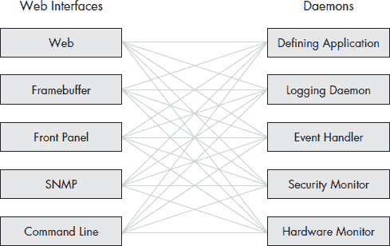
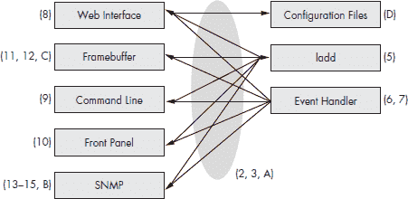

**设备架构**

我们将从对 Linux 设备架构的高层次概述开始我们的冒险。然后，我们将降低视角，从进程的角度来看待 Linux 设备。正如你很快就会看到的，从这个较低的角度来看，与本书中使用的组织和章节相匹配。

在本章中，我们将涵盖以下内容：

• UI 和守护进程

• Laddie 设备的架构

我们已经研究过从小型手持设备到大型、多吉字节、多处理器的网络服务器的各种 Linux 设备。这些设备中的大多数都具有非常相似的软件架构。

图 1-1 显示了我们在 Linux 设备中通常看到的软件堆栈。在这个堆栈的底部是嵌入式 Linux 内核。在内核之上是各种用户界面和常见服务，如网络管理和日志记录，而在顶部是定义设备的特定功能。

在设备方面，术语*用户界面（UI）*指的是用户通过它管理设备配置并查看其状态和统计信息的界面。没有屏幕和键盘是设备的标志，但不要被这蒙蔽了——所有设备都有 UI。当然，UI 越不明显，设备越好，但 UI 总是存在的。此外，网络设备通常具有 Web、SNMP 和命令行界面，而消费设备具有帧缓冲区和小型、字母数字 LCD 界面。

*图 1-1：Linux 设备软件堆栈*

**UI 和守护进程**

假设我们的 Linux 设备将拥有多个、同时运行的 UI，当我们从运行进程的角度来看这个设备时，我们得到的架构类似于图 1-2 所示。UI 程序与用户交互，接受命令和配置，并显示状态和统计信息。另一方面，守护进程与硬件、其他守护进程和 UI 交互，以提供设备的定义服务以及状态和统计信息。

*图 1-2：常见的设备架构*

***守护进程***

守护进程是启动 Linux 后通常立即启动的后台程序。守护进程的特点是它们没有像从 bash 命令行启动的程序那样的控制终端。让我们看看在典型设备上发现的守护进程类型。

**定义应用程序**

图表中的*定义应用程序*指的是提供设备独特功能的守护进程。例如，高级电话答录机的定义应用程序是实际接听电话并记录通话的守护进程。

**日志守护进程**

图 1-2 中显示的*日志守护程序*收集日志消息，要么将它们保存到磁盘，要么将它们路由到网络上的另一个主机。syslog 守护程序是大多数 Linux 系统上的默认日志守护程序。

**事件处理器**

*事件处理器*提供对事件的本地、主动响应。通常，日志守护程序和事件处理守护程序是同一个，就像在我们的示例设备上运行的 logmuxd 守护程序一样。

**安全监控器**

*安全监控器*控制对关键配置或资源的访问，例如身份验证凭证。安全监控器还应响应强制访问控制（MAC）违规。

**硬件监控器**

*硬件监控器*监视温度警报和磁盘驱动器问题。大多数基于 PC 的 Linux 设备将使用 lm_sensors 包来监控 CPU 和主板传感器，以及 smartd 守护程序来监控硬盘的温度和错误统计。硬件监控器可能将来自这些和其他来源的信息组合成一个关于设备健康状况的综合报告。

***用户界面***

当我们最初开始构建 Linux 设备时，我们认为设备的性质决定了它将拥有的 UI 类型。哎呀，我们错了。客户总是要求有多种管理设备的方式。智能手机需要帧缓冲区接口*和*通过蓝牙的 Web 接口。网络设备需要 Web 接口*和*SNMP 接口。当你查看图 1-2 时，不要想“哪一个？”而要思考“有多少？”

图 1-2 中展示的 UI（用户界面）并不是唯一可能的选择。例如，你可能需要一个在 Windows PC 上原生运行的界面，或者如果你正在构建网络设备，你可能想要将接口添加到 LDAP 或 RADIUS 认证服务器，或者网络的计费系统和数据库。图 1-2 展示了最常见的 UI 以及书中描述的 UI。

**Web 接口**

如果你的设备有网络接口，则必须要有*Web 接口*。你在这里有很多决定要做：你是否使用 JavaScript？后端是用 Perl、PHP、C 还是 Java 编写的？你使用哪个？你是否假设所有浏览器都支持层叠样式表？第八章关于 Web UI 的内容将帮助你评估所有这些问题的权衡。

**帧缓冲区接口**

*帧缓冲区接口*在电视机顶盒、如 TiVo 或 PVR、独立式自助终端和一些手持设备中很受欢迎。帧缓冲区硬件让你能够直接控制屏幕上的每个像素。这为你提供了很大的灵活性，但代价是必须管理屏幕上的每个像素。一些库和图形工具集，如 Simple DirectMedia Layer (SDL)，可以提供帮助。构建帧缓冲区接口的艺术在于选择正确的工具集。

**前面板**

*前面板接口*，无论是简单还是复杂，几乎出现在所有 Linux 设备上。一个简单的前面板可能只有几个灯和按钮，而一个更复杂的可能有一个字母数字液晶显示器（LCD）或真空荧光显示器。即使是简单的前面板也可能需要深入了解底层硬件。

**SNMP 接口**

我们听说，一个*SNMP 接口*是商业上可行的网络设备和爱好之间的区别。根据我们的经验，我们必须同意。如果你将其分解成小块，SNMP 并不太难。首先，你需要熟悉 SNMP 中使用的概念以及 Linux 中可用的 SNMP 命令。然后，你需要为你的 SNMP 接口可见的数据设计一个管理信息库（MIB），或称为模式。最后，你需要编写使 MIB 可供 SNMP 命令使用的软件。

**命令行界面**

*命令行界面*（CLIs）通常被用作网络设备的最后手段的控制接口。即使在整个网络断开的情况下，串行端口上的 CLI 仍然可用。CLI 还用作设备特定的脚本语言。

***进程间通信***

最后，您可能已经注意到了图 1-2 中线的全网状互连。不要让它吓到你。我们的观点是，任何 UI 都应该能够连接到任何守护进程。这个要求决定了在 UI 和守护进程之间使用的进程间通信（IPC）机制中要查找的许多功能。（我们将在第二章中对此有更多讨论。）

**Laddie 设备的架构**

本书中的示例设备是一个使用并行端口上的输入引脚从警报传感器接收输入的警报系统。用户界面包括网页、命令行、带键盘的 LCD、带红外遥控的帧缓冲区以及 SNMP。

我们设备上的守护进程包括警报系统守护进程和一个响应设备事件的守护进程。我们选择不实现图 1-2 中显示的所有守护进程，以便我们可以专注于描述如何构建和确保守护进程的一般方法。

当然，我们的示例设备包括 ladd（定义性应用程序）、事件处理程序以及一个实用程序，它使用所有 UI 通用的协议使常见的 Linux 配置文件可见。

图 1-3 显示了 Laddie 设备的架构，并将 UI、功能或守护进程映射到章节编号或附录，以便您可以看到全书如何将事物组合在一起。

*图 1-3：Laddie 设备的章节图*

我们限制了 UI 的功能，使它们作为教程更有用。只有网页界面是全功能的，并且代表了真实设备可能拥有的功能。

**摘要**

大多数 Linux 设备都拥有一个共同的架构：底层是 Linux 操作系统，顶层是定义性的应用程序，中间是常见的服务和 UI。我们讨论了包含各种守护进程和 UI 的一些原因，并将本书的章节映射到一个架构图中。

下一章将探讨 UI 和守护进程之间的 API，因为所选的 API 会影响 UI 和守护进程。
