使用运行时访问

本章为您提供了使用 RTA 库开发 Linux 设备的实用介绍。请将此视为您的“Hello, world!”示例。在本章中，我们将讨论以下内容：

• RTA 设备架构

• RTA 守护进程架构

• 告诉 RTA 关于您的列和表的信息

• 构建您的第一个 RTA 程序

• 一点 SQL

• RTA 内置表的简介

• RTA 表编辑器

**RTA 设备架构**

您可能还记得上一章中，在 UI 程序和守护进程之间放置一个定义良好的协议有多个原因。协议在 UI 和守护进程中都提供了简化的复杂性，在守护进程运行时提供对守护进程的访问，允许您独立地工作并测试 UI 和守护进程，并有助于提高安全性。协议的重要要求是协议的数据模型与您对数据的看法相匹配，您不必自己定义或编写协议，并且协议将对大多数 UI 编程语言可用。

我们在这本书中使用的数据模型是数据库。因为我们把我们的结构数组看作是数据表，所以 UI 程序（或 *客户端*）将守护进程中的数据视为数据库中的数据。虽然 UI 程序认为它们正在处理 PostgreSQL 数据库，但实际上它们是在与守护进程通信。这种安排导致了一种类似于图 3-1 所示的设备架构，其中帧缓冲区 UI 使用 libpq.so 中的 PostgreSQL C 语言绑定；Web UI 使用 pgsql.so 中的 PostgreSQL PHP 绑定；测试和调试 UI 使用命令行程序 psql。

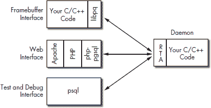

*图 3-1：使用 RTA 的示例设备*

在通过 Unix 或 TCP 套接字连接到守护进程后，如图 3-1 所示的 UI 可以显示守护进程中可用的配置、状态和统计信息。librtadb.so 库将守护进程的数据呈现为来自 PostgreSQL 数据库。此图显示了本书中使用的 PostgreSQL 客户端绑定，但还有许多其他语言绑定可用，包括 Java、Python、Tcl、Perl 和 Microsoft C++。

图 3-1 提供了该设备的全局视图。现在让我们看看 RTA 在守护进程内部是如何工作的。

**RTA 守护进程架构**

将 RTA 添加到您的守护进程相对简单，因为它通常只需要使用库中的两个例程。第一个例程，rta_add_table()，使您的守护进程中的一个表对客户端可见。第二个例程，dbcommand()，处理来自客户端的协议和 SQL 命令。图 3-2 阐述了一个提供 RTA 访问两个 UI 可见表的守护进程。

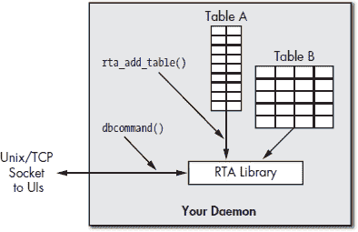

*图 3-2：使用 RTA 的守护进程*

dbcommand()例程不直接与客户端通信。您的程序必须创建一个监听 TCP 或 Unix 套接字，并且必须能够接受和管理来自 UI 或其他客户端的连接。一旦建立连接，应通过调用 dbcommand()将连接的所有数据传递给 RTA。dbcommand()例程解析来自客户端请求中的 SQL 命令；如果请求有效，它将执行 SQL 命令并返回一个包含要发送回客户端的任何数据的缓冲区。

如果 RTA 只能读取和写入您表中的值，那么它的实用性将非常有限。它的真正力量在于它能够在 UI 读取或写入您表中的值时调用例程。这些读取和写入*回调*类似于传统的数据库触发器。回调与列定义相关联，并且分别针对读取和写入进行指定。（我们将在下一节中更详细地描述回调。）

**向 RTA 告知您的列和表**

表是数据结构数组和链表的集合。您的数据结构中的每个成员被视为表中的一列，每个数据结构的实例被视为一行。从现在开始，当您看到术语*列*时，请考虑*我的数据结构中的成员*。为了使表对客户端可见，您需要以 RTA 可以理解的方式描述表。这意味着描述整个表，然后描述表中的每一列。

TBLDEF 结构描述了整个表；它包含一个指向由 COLDEF 结构组成的数组的指针，以定义数据表中的每一列。最初您可能会发现创建 COLDEFs 和 TBLDEFs 的过程既繁琐又乏味，但一旦您有一些经验，您会发现它既简单又机械。

***列***

RTA 的一个大优点是您不需要将数据在协议中序列化和反序列化。RTA 使用您程序中已经存在的数据。当然，您必须描述您的数据，以便 RTA 能够智能地访问它。表由列组成，我们需要描述表中的每一列。这就是 RTA 的 COLDEF 数据结构的目的。

您的数据结构中也可以有不是由 COLDEF 定义的成员。这些隐藏的列可能包括您不希望对 UI 可见的信息，或者如果显示给用户将没有意义的二进制数据。

COLDEF 包含关于您结构成员的九条信息。

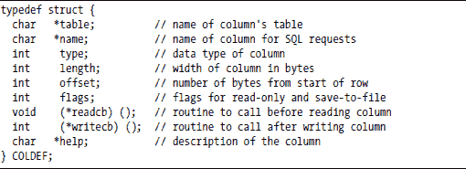

**表**

表字段指定了从 UI 程序中看到的表名。

**名称**

名称字段指定了列的名称。在选择或更新此列时使用此名称。

**类型**

列的类型用于语法检查和 SQL SELECT 输出格式化。当前定义的类型包括：

**length**

RTA 使用本地编译器数据类型以匹配您在结构中使用的数据类型。对于整数、长整型、浮点型和它们相关的指针类型，长度成员被忽略，但对于字符串和字符串指针，它具有意义，两者都应报告字符串中的字节数（包括终止的空字符）。

**offset**

偏移量是从数据结构开始到正在描述的结构成员的字节数。例如，使用具有 int、20 个字符的字符串和长整型的数据结构的表会将长整型的偏移量设置为 24（假设 int 是 4 字节）。

计算结构成员的偏移量是费时且容易出错的。gcc 编译器套件提供了 offsetof()宏来自动计算结构成员的偏移量。

**flags**

列有两个由标志成员指定的二进制属性。第一个属性指定列是否可以被覆盖或是否为只读。统计信息通常被标记为只读。如果标记为只读的列是 UPDATE 语句的主题，则生成错误。此属性的#define 是 RTA_READONLY。

第二个属性指定是否将写入此列的值保存到与表关联的配置文件中。应该从一次程序调用持续到下一次调用的值应使用#define RTA_DISKSAVE 属性标记。

标志字段是 RTA_DISKSAVE 和 RTA_READONLY 的按位或。

**readcb()**

如果定义了，每次列的值被使用时都会调用*读取回调*例程 readcb()。这对于计算量大但使用频率不高的值来说很方便。每次引用列时都会调用读取回调——如果你的 SQL 语句使用了列名两次，则读取回调会被调用两次。

读取回调传递五个参数：表名、列名、SQL 请求的文本、受影响的行指针以及零索引的行号。以下是一个读取回调的函数原型。

int readcb(char *tbl, char *col, char *sql, void *pr, int rowid);

读取回调在成功时返回零，如果回调中发生错误则返回错误代码。（有关错误代码的列表和回调的更多详细信息，请参阅附录 A。）请检查客户端的返回值以增强可靠性和安全性。

**writecb()**

*写回调*可以是驱动您应用程序的真正引擎。如果定义了，则在 UPDATE 中的所有列都已更改后调用写回调 writecb()。考虑以下 SQL 命令：

UPDATE ifcfg SET addr="192.168.1.1", mask = "255.255.255.0";

如果在 addr 上有写回调，它将在 addr 和 mask 都已更新后调用。RTA 在所有字段都已更新后执行写回调，以帮助保持一致性。

写回调传递六个参数：表名、列名、UPDATE 语句的文本、受影响的行的指针、零索引的行号以及一个指向在更改之前所做的行的副本的指针。（此参数在您想同时知道行的旧值和新值时非常有用。）旧行的副本在动态分配的内存中，在写回调返回后释放。以下是一个写回调函数的原型。

int writecb(char *tbl, char *col, char *sql, void *pr, int rowid, void *poldrow);

写回调在成功时返回零，在失败时返回非零值。在失败的情况下，行将恢复到其初始值，并向客户端返回一个 SQL 错误，触发动作异常。写回调允许您强制执行一致性，并可以为您的系统提供安全检查。

**帮助**

您的列帮助文本应包括对列如何使用的描述，列的任何限制或约束，以及由任何读取或写回调引起的副作用。（为您的列提供有意义的帮助文本，以便更容易维护和调试您的代码。）

***表格***

您通过调用 RTA 例程 rta_add_table()来告诉 RTA 关于您的每个表。rta_add_table()的单个参数是描述表的 TBLDEF 结构的指针。

TBLDEF 结构使用 10 条信息来描述您的表。其中最重要的是表名、结构数组的起始地址、每个结构的宽度（即每行的宽度）、行数以及指向描述表中列的 COLDEF 结构数组的指针。TBLDEF 结构中的大多数字段应该是自解释的。

**保存文件**

从一个启动到下一个启动保存配置数据的需求如此普遍，以至于 RTA 的作者包括了在数据更新时自动将表数据保存到文件中的功能。每个表有一个文件，文件名在 TBLDEF 结构中作为保存文件字符串指定。您可以通过向列定义中添加 RTA_DISKSAVE 标志来标记要保存的列。

保存文件包含一个 UPDATE 语句列表，每个表中的一行一个。当您使用 rta_add_table()调用初始化表时，从磁盘读取保存文件并将其应用于表。在列上使用 RTA_DISKSAVE 和表的保存文件组合消除了解析 XML 或 INI 文件以获取初始或保存配置值的需求。当然，如果您更喜欢使用 XML 或 INI，只需将保存文件指针设置为 null。

**迭代器**

*迭代器* 是你代码中的一个子程序，它遍历你表中行的链表或其他排列。迭代器让你可以将链表、B 树或几乎任何其他组织数据的方式视为数据在表中。

迭代函数使用三个参数调用：当前行的指针，来自 TBLDEF 的 void 指针 it_info，以及零索引的行号。函数返回下一行的指针。当 RTA 请求第一行时，当前行指针是 NULL，所需的行索引为零。当 RTA 请求列表中最后一行之后的行时，函数应返回 NULL。如果定义了迭代器，TBLDEF 中的地址和 nrows 成员将被忽略。以下是它的函数原型。

void iterator(void *cur_row, void *it_info, int rowid);

在使用迭代函数时有一个注意事项：如果你还没有为链表中的所有链接分配内存，加载保存文件可能会失败。（记住，保存文件是一系列 UPDATE 语句，并期望行已经存在。）幸运的是，有一个简单的方法可以解决这个问题。始终保留一个未使用的行，当该行被 UPDATE 语句写入时，让写回调分配另一行，这样你就可以领先一步处理 UPDATEs。第七章中介绍的 logmuxd 程序就使用了这种技术。

**构建您的第一个 RTA 程序**

现在我们将看看如何使用 RTA 来在运行程序中暴露一个表。为此，需要遵循以下五个基本步骤：

1.  定义问题。

1.  检查代码。

1.  安装 RTA。

1.  构建和链接。

1.  测试。

***定义问题***

我们希望将 UI 程序暴露给包含一个用户可编辑的字符串和两个整数的结构数组。其中一个整数，*zalarm*，由用户设置。另一个，*zcount*，在 zalarm 从一变为零或从零变为一时递增。每当发生转换时，我们都会向控制台打印一条消息。字符串，*zname*，被视为配置值，并在更新时保存在磁盘文件中。由于 zcount 是一个统计值，我们将其标记为只读。这个示例问题是在第五章中实际 Laddie 设备应用程序之前的一个先导。下面展示的代码也包含在本书的配套 CD 上的 myapp.c 文件中。

***检查代码***

这段代码示例应该能给你一个关于在 RTA 启用程序中可以期待什么的想法。

**包含、定义和内存分配**

首先，我们将查看代码：

zalarm 的转换是在写回调中检测到的。这里， 是它的前向引用。

我们需要为客户端的 SQL 命令文本和返回给客户端的响应分配缓冲区。在中，我们分别使用了 500 和 5,000 字节。这些值被选择以容纳我们预期使用的最大 SQL 语句和预期返回的最大结果。

在的结构定义是应用程序数据的核心。这个数据结构的一个实例对各种 UI 和客户端来说就像数据库中的一行。

我们在看到我们的表格中有五行。

**列定义**

这里是定义我们表格中列的 COLDEF 数组。COLDEF 中的信息来源于我们想要使其可见的数据结构以及我们的问题陈述。

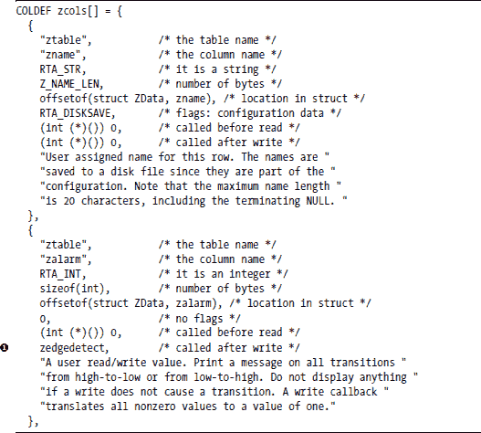

注意中 COLDEF 上 zedgedetect 写回调的定义。我们在该回调中执行 zalarm 的转换检测。

**表格定义**

在 TBLDEF 中，我们给出了表格的名称、起始地址、每行的大小、行数、指向此表格的 COLDEF 表的指针以及表格中的列数。保存文件/tmp/zsave.sql 将用于保存 RTA_DISKSAVE 列，在这种情况下，只有名称列。

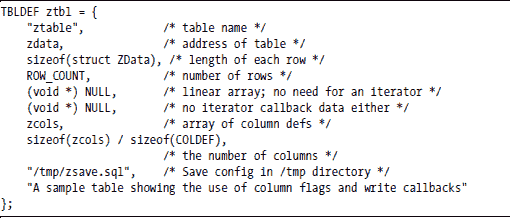

**main() 例程**

这是一段相当标准的代码。我们分配我们的套接字结构和其它局部变量，然后初始化表格值并使用 rta_add_table()告诉 RTA 关于我们的表格。

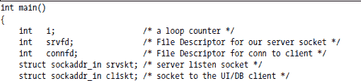

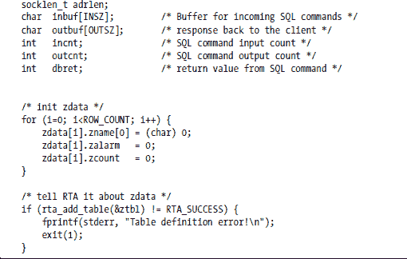

**设置监听套接字**

记住，每个 UI 程序都将我们的应用程序视为一个 PostgreSQL 数据库，我们必须接受来自这些客户端的 Unix 或 TCP 连接。因此，作为初始化的最后一步，我们设置了套接字以监听传入的客户端连接。我们的程序正在监听 TCP 端口 8888，因此我们需要告诉我们的 PostgreSQL 客户端使用此端口。

**注意**

*以下代码存在一些严重的缺陷（例如，阻塞 I/O、忽略错误条件以及乐观地假设套接字 I/O）。然而，我们的目标是通过尽可能缩短代码来使代码易于理解。*

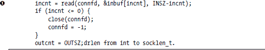

上面的 read()调用使用了阻塞 I/O。在实际应用中，我们希望接受连接并使用 select()或 poll()为我们进行多路复用。然而，在这个例子中，我们试图保持行数低。

**dbcommand() 调用**

以下调用是 RTA 真正工作的地方。我们将从客户端读取的 SQL 命令传递给 RTA 库，该库解析它、验证它、执行它，并将结果填充到 buf 中。我们根据 dbcommand()调用的结果切换，以确定是否应将结果发送回客户端或关闭连接。在正常情况下，PostgreSQL 客户端将进行有序关闭，dbcommand()调用将返回 RTA_CLOSE。

**写回调**

这是 UI/客户端程序设置 zalarm 列之后调用的子例程。对此更新的一个典型 SQL 命令可能是 UPDATE ztable SET zalarm = 0。

**注意**

*当刚开始学习使用回调时，您可能想在回调中添加一个打印语句来显示表、列、输入 SQL 和行号。*

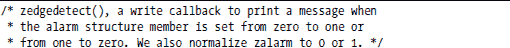

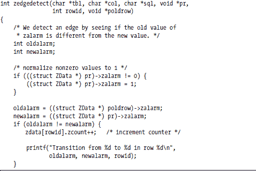

通过比较 zalarm 的旧值和新值来检测过渡。将行的旧值和新值都作为参数传递给例程。在这个例子中，我们总是返回成功。

return(0); /* 总是成功 */ }

**注意**

*提醒一下，如果写回调返回非零值，受影响的行将恢复到其旧值，客户端程序将接收到它发送的 SQL 命令的错误结果。*

***安装 RTA***

您可以在本书的配套 CD 和 RTA 项目网站上找到 RTA 包的副本（[`librta.org`](http://librta.org)）。请检查网站以获取最新版本。RTA 中的 SQL 解析器使用 yacc 和 lex 编写，因此如果您从源代码构建 RTA，您的开发系统将需要安装这两个工具。

RTA 的默认安装将.a 和.so 库放入/usr/local/lib 目录。如果您不想使用/usr/local/lib，您可以在安装之前编辑 makefile。

下载 RTA 包后，提取文件并构建库。下面的示例代码展示了如何操作。

***构建和链接***

现在在 rta-X.Y.Z 下创建一个测试目录，并将 myapp.c 复制到其中。接下来，使用以下命令构建应用程序：

# gcc myapp.c -o myapp -L/usr/local/lib -lrtadb

要编译和运行应用程序，我们需要告诉系统在运行时在哪里找到 RTA 库。您可以通过编辑/etc/ld.so.conf 并运行 ldconfig 或导出 LD_LIBRARY_PATH 环境变量来实现。如果编译成功，您应该可以使用以下命令运行应用程序：

# export LD_LIBRARY_PATH=/usr/local/lib

# ./myapp

就这些了！您的示例应用程序应该已经启动并运行，准备好响应 PostgreSQL 请求。

***测试***

在本节中，我们假设您已从 Linux 发行版或本书配套 CD 中安装了 PostgreSQL，并且 psql 命令已存在于您的路径上。如果一切顺利，您现在应该有一个运行中的应用程序，它假装是一个 PostgreSQL 数据库服务器。然而，我们的示例应用程序提供其内部表供各种 PostgreSQL 客户端使用。我们将首先使用的客户端是命令行工具，psql。

假设一切正常，打开另一个终端窗口并启动 psql，指定数据库服务器的主机和端口如下。（请记住，我们告诉应用程序在端口 8888 上监听。）

# psql -h localhost -p 8888

PostgreSQL 应该响应如下：

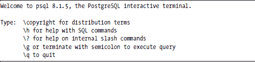

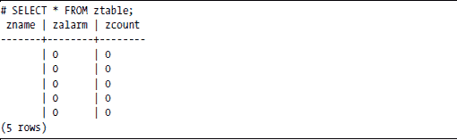

如果您的 SQL 命令没有显示上述表，您需要调试 RTA 安装。最常见的问题是客户端和 RTA 之间 PostgreSQL 协议版本不匹配。psql 客户端可能会给出警告，但它对使用较新客户端与较旧服务器相当宽容。如果您使用的是最新的 psql 客户端，这种情况可能发生。

检查 RTA 网站，看看您的 RTA 版本是否与您的 PostgreSQL 版本兼容。如果存在不匹配，请更新 RTA 或 PostgreSQL。本书的配套 CD 包含已知与 RTA 和 PostgreSQL 库兼容的版本。您还可以使用 netstat -natp 来验证应用程序是否真的在端口 8888 上监听。

在进入 SQL 教程之前，让我们尝试几个命令，看看应用程序如何响应。

# UPDATE ztable SET zalarm = 1;

UPDATE 5

#

这应该在您启动 myapp 时所在的控制台上打印出一个*转换*消息。（请注意，psql 会响应已更改的行数，因为我们没有指定更改哪一行，所以所有五行都被更新了。）

现在再次执行相同的命令。

# UPDATE ztable SET zalarm = 1;

UPDATE 5

#

这次不应该在控制台上打印任何消息，因为没有发生转换。

将 zalarm 设置回零应导致一个转换，并且转换的计数现在应该是 2。

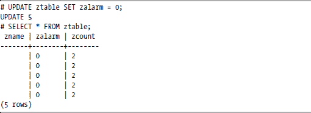

当您第一次启动./myapp 时，保存的表配置文件/tmp/zsave.sql 不存在。通过在一个标记为 RTA_DISKSAVE 的列上执行更新来创建它。

# UPDATE ztable SET zname = "row name";

UPDATE 5

#

您可以通过在/tmp/zsave.sql 上执行 cat 来验证上述内容。您应该看到以下内容：

UPDATE ztable SET zname = "row name" LIMIT 1 OFFSET 0

UPDATE ztable SET zname = "row name" LIMIT 1 OFFSET 1

UPDATE ztable SET zname = "row name" LIMIT 1 OFFSET 2

UPDATE ztable SET zname = "row name" LIMIT 1 OFFSET 3

UPDATE ztable SET zname = "row name" LIMIT 1 OFFSET 4

为了结束本节关于 RTA 的内容，让我们生成一些错误并查看相应的错误消息。

# UPDATE ztable SET zcount = 0;

错误：无法更新只读列 'zcount'

# UPDATE ztable SET zname = "abcdefghijklmnopqrstuvwxyz";

错误：'zname' 字符串太长

#

**一点 SQL**

结构化查询语言（Structured Query Language，简称 SQL）是操作数据库数据的一种标准方式。RTA 仅使用两个 SQL 命令：SELECT，用于从表中获取数据，和 UPDATE，用于向表中写入数据。RTA 的 SELECT 和 UPDATE 语法是标准 SQL 语法的子集，有一个小的扩展。

***SELECT***

SELECT 语句从表中读取值。RTA SELECT 语句的语法是：

SELECT column_list FROM table [where_clause] [limit_clause]

column_list 是一个以逗号分隔的列名列表或单个星号(*)以检索所有列。变量 table 是您要检查的表名。where_clause 指定要返回的行，limit_clause 告诉返回多少行。以下是一些简单的例子。

SELECT * FROM ztable

select * from ztable

SELECT zcount, zname FROM ztable

您可以以任何顺序指定列，并且可以多次请求相同的列。

**注意**

*SQL 解析器识别 SQL 保留字的大小写形式。在我们的示例中，我们使用大写字母来使保留字更加明显。*

此外，SQL 不需要在行尾使用分号，但 psql 命令行工具需要。

***UPDATE***

UPDATE 语句将值写入表中。RTA UPDATE 语句的语法是：

UPDATE table SET update_list [where_clause] [limit_clause]

update_list 是一个以逗号分隔的值赋值列表，格式如下：

column_name = value[, column_name = value...]

在上面的例子中，value 是一个字面值。让我们看看一些更多的例子。

UPDATE ztable SET zalarm = 44

UPDATE ztable SET zalarm = 0, zname = Terminator

UPDATE ztable SET zalarm = *1,* zname = "Mr. Terminator"

包含空格的字符串必须用单引号或双引号括起来。一种引号可以嵌套在另一种引号中。

UPDATE ztable SET zname = "Baker's Pride"

UPDATE ztable SET zname = 'Just say "no"'

***WHERE***

WHERE 子句指定要选择或更新的行，基于行中的数据。WHERE 可能是使用 SQL 的最大原因之一。WHERE 子句的形式是：

col_name rel_op value [AND col_name rel_op value ...]

支持的比较运算符包括等于、不等于、大于、小于、大于等于和小于等于。仅逻辑 AND 可用于连接列比较，并且值必须引用一个字面值。例如：

SELECT * FROM ztable WHERE zalarm != 0

UPDATE ztable SET zalarm = 1 WHERE zname = "Front Door"

***LIMIT***

LIMIT 子句可以限制选择的行数，并可以指定忽略第一个 OFFSET 行。LIMIT 子句的形式是：

[LIMIT limit [OFFSET offset]]

正常的 SQL 不支持“只给我第三行”的想法，但如果你试图管理嵌入式应用程序，这个功能很重要。LIMIT 和 OFFSET 子句允许你指定应该返回多少行，以及开始读取或写入之前应该忽略多少候选行。如果有 WHERE 子句，偏移量和限制只适用于匹配 WHERE 条件的行。例如：

UPDATE ztable SET zname = "Front Door" LIMIT 2

UPDATE ztable SET zname = "Back Door" LIMIT 3 OFFSET 2

UPDATE ztable SET zalarm = 1 LIMIT 2 OFFSET 1

SELECT zname FROM ztable LIMIT 4

UPDATE ztable SET zname = "Garage" LIMIT 1 OFFSET 2

SELECT * FROM ztable WHERE zalarm = 1 LIMIT 1

**注意**

*一种逐行遍历表的好方法是设置 LIMIT 为 1，并将 OFFSET 从 0 递增到行数减 1。*

你可能还记得我们说过，我们将 RTA_DISKSAVE 列存储在表定义中给出的保存文件中，并且我们希望将配置存储为 SQL 命令，以便我们可以通过 SQL 解析器运行它。你可以通过查看/tmp/zsave.sql 来看到一个关于 LIMIT 子句和保存文件的优秀示例。

# cat /tmp/zsave.sql

UPDATE ztable SET zname = "Front Door" LIMIT 1 OFFSET 0

UPDATE ztable SET zname = "Front Door" LIMIT 1 OFFSET 1

UPDATE ztable SET zname = "Garage" LIMIT 1 OFFSET 2

UPDATE ztable SET zname = "Back Door" LIMIT 1 OFFSET 3

UPDATE ztable SET zname = "Back Door" LIMIT 1 OFFSET 4

真正的 SQL 纯粹主义者阅读这篇文档可能会用鞋底猛击桌子，并喊道，“ORDER_BY 和 INSERT 和 DELETE 在哪里……和……和……？”它们都不在那里。记住，RTA 不是数据库——它是一个接口。我们只需要 SELECT 和 UPDATE。

**RTA 内置表的介绍**

RTA 库有几个内置表。附录 A 有完整细节，所以我们将在这里介绍它们。第一个表只有一行。

***rta_dbg***

rta_dbg 表允许你控制如何以及记录什么。你可以通过将 trace 设置为 1 来开启所有 SQL 的跟踪，并且你可以通过将 target 设置为 0、1、2 或 3 来分别将日志消息定向到既不是、syslog、stderr 或两者。你还可以为 syslog()指定优先级、设施和 ident 值。从 psql 中我们得到：

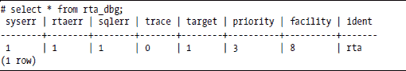

***rta_stat***

rta_stat 表包含与 RTA 调用相关的统计信息。它包含不同类型错误的计数、已打开到 RTA 中的连接数以及 SELECT 和 UPDATE 的数量。

***rta_tables***

rta _tables 元表是一个表定义结构的集合。为了将一个表添加到 RTA 中，你必须填写一个包含你的表描述的数据结构。表定义结构的集合本身在 RTA 中也是一个表。这是 RTA 的元表之一。

两个 RTA 元表在地址字段中为零，因为它们实际上是一个指针数组，所以它们使用迭代函数。元表中的所有列都被标记为只读，因为所有值都是从 rta_add_table()调用中设置的。

***rta_columns***

rta_columns 元表是一组列定义。所有表的列定义都收集到 rta_columns 表中。（该表实际上持有指向 COLDEF 结构的指针。）我们可以使用元表和 WHERE 子句来查看表中的列。

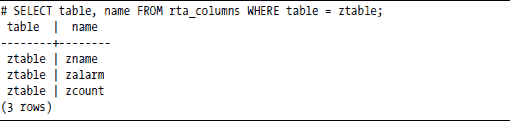

您认为如果我们结合 RTA 元表和 PHP 会得到什么？请继续阅读。

**RTA 表编辑器**

RTA 包有一个基于 web/PHP 的实用工具，称为*表编辑器*，它读取 RTA 元表，并允许您查看和编辑系统中的任何表。图 3-3 显示了允许您选择要查看或编辑的表的屏幕。图 3-3、3-4 和 3-5 中的截图是在我们处理 myapp.c 应用程序时从我们的开发系统中拍摄的。您可以通过启动本书的配套 CD 并使用另一台 PC 上的浏览器来查看[`192.168.1.11/rta/rta_tables.php?port=8885`](http://192.168.1.11/rta/rta_tables.php?port=8885)来看到类似的屏幕。

*图 3-3：RTA 表编辑器*

从顶部屏幕中选择一个表会打开一个包含所选表内容的网页。图 3-4 显示了示例程序的 ztable 显示。

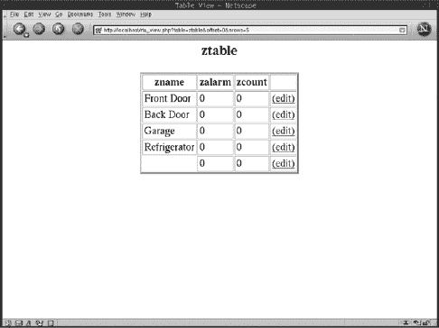

*图 3-4：一个示例表显示*

您可以从表显示中选择要编辑的行。图 3-5 显示了选择行号 3 后的视图。

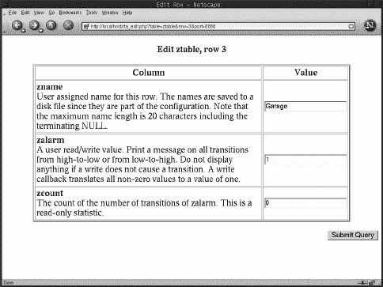

*图 3-5：一个示例行编辑屏幕*

RTA 表编辑器有一个 HTML 文件和四个 PHP 文件，可以放在任何支持 PHP 的 web 服务器上。实际上，web 服务器甚至不需要在运行应用程序的同一台机器上运行。

HTML 文件包含正在使用的 RTA 端口号列表。您为每个运行的 RTA 启用应用程序都有一个不同的端口号。在我们的开发机器上，我们有一个包含端口号和 RTA 应用程序名称的 HTML 表格，看起来像这样：

**总结**

本章介绍了如何使用 RTA 构建应用程序的细节，以便几种不同类型的 UI 程序可以管理它。您已经看到，您需要通过使用 TBLDEFs 和 COLDEFs 来描述它们，告诉 RTA 您想要使其可见的数据结构。

虽然这一切一开始可能看起来有些令人不知所措，但请坚持下去。经过一点练习，您会发现编写 TBLDEFs 和 COLDEFs 非常直接，主要是机械的。将 RTA 添加到您的守护进程中的额外努力，通过运行时访问配置、状态和统计信息得到了充分的补偿。

