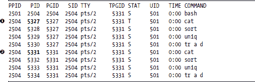
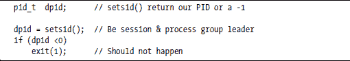
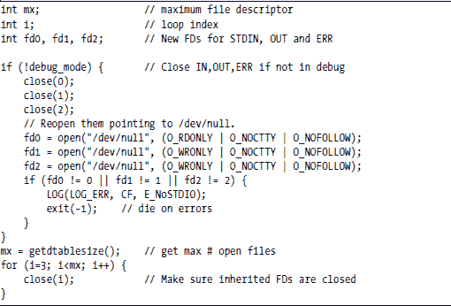
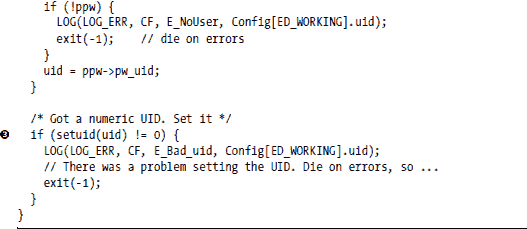
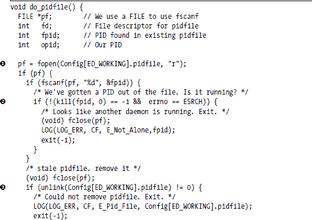
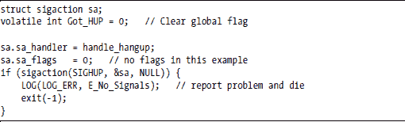
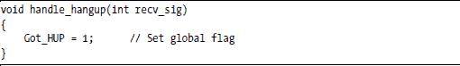

**构建和确保守护进程的安全**

几乎所有 Linux 设备的核心都是一个或多个守护进程，这些后台程序提供了网络或系统服务。您可以通过查看/etc/rc.d/init.d 目录或使用 ps ax 命令来显示您系统上正在运行的守护进程，以了解您 Linux 系统上可用的守护进程。

“守护进程”一词指的是在没有控制终端的情况下在后台运行的程序。守护进程也在它们自己的进程组中运行，以避免意外接收其他进程的信号。守护进程通常将标准输入、输出和错误重定向到/dev/null 或日志文件。许多守护进程使用进程 ID 文件（或 pidfile）来强制对资源的互斥访问；这防止了守护进程的多个副本同时运行。

本章向您展示如何构建和确保您在设备中使用的守护进程的安全。它分为三个主要部分。

+   如何构建守护进程

+   如何确保守护进程的安全

+   守护进程原型

**如何构建守护进程**

本节向您展示如何构建守护进程，并简要解释为什么每个步骤都是必要的。您的应用程序可能不需要列出所有步骤，您可能需要以不同的顺序执行它们以满足您的需求，但这将给您一个大致的概念。

1.  加载配置。

1.  进入后台。

1.  成为进程和会话领导者。

1.  设置工作目录。

1.  重定向 stdin、stdout 和 stderr。

1.  设置日志记录。

1.  设置组 ID 和用户 ID。

1.  检查 pidfile。

1.  设置 umask。

1.  设置信号处理器。

**注意**

*本章后面提供的示例守护进程包含了每个步骤的代码。以下的一些部分使用了来自示例守护进程的代码。*

***加载守护进程的配置***

当守护进程启动时，它需要加载一组控制其操作的参数。这通常意味着解析命令行上的选项并从配置文件中读取设置。

用于启动守护进程的命令行通常包含配置文件的位置、运行时使用的用户和组 ID，以及程序是否应该成为守护进程或保持为前台进程。一些守护进程允许您指定守护进程的工作目录，以及是否在启动前执行 chroot()。

配置信息有优先级。具体来说，编译内嵌的值总是首先加载，因为它们是在程序启动时加载的。接下来，加载配置文件中的配置值，覆盖编译内嵌的值。最后，加载命令行上的值，覆盖配置文件中的值。

集成的值应该更多地关注安全性而不是功能，因为攻击者可能会在入侵过程中删除或修改配置文件。作为安全预防措施，一些守护进程如果不能打开和加载配置文件则拒绝运行。

由于配置文件通常在命令行中指定，您的程序可能需要通过它进行两次遍历：一次获取配置文件，第二次在配置文件加载后再次解析命令行。在调试过程中，通常使用命令行参数，因此它们的值通常覆盖配置文件中的值。

**注意**

*请确保您的程序通过验证配置的一致性来进行合理性检查，并在发现任何问题时报告错误或退出。*

**进入后台**

一旦加载了配置，下一步是让进程（可选地）进入后台，在那里它可以与控制终端断开连接。这是通过调用 fork() 函数来创建子进程实现的。父进程应该在 fork 之后退出。

为了进入后台，子进程关闭了控制终端的文件描述符。结果是，我们有一个*后台进程*，它没有连接到控制终端。

您的代码可能看起来像这个示例，其中父进程进行 fork 并退出，留下子进程继续设置守护进程：

有两种情况你不应该将您的进程发送到后台：当调试时（因为您希望您的终端仍然是程序的控制器，以便您可以看到任何诊断消息，并在需要时杀死程序），以及当您希望程序死亡时自动重启它。在后一种情况下，守护进程应该保持在前台，以便在守护进程退出时（无论是优雅地退出还是由于某些错误）父进程将接收控制权。

以下示例 shell 脚本展示了如何自动重启守护进程。

两种常见的替代方案是向 /etc/inittab 添加您的守护进程并让 init 进程重启它，或者编写一个自定义监控程序来重启设备上的各种守护进程。/etc/inittab 方法可能节省内存和进程表中的几个条目，并且您不需要编写任何新软件。重启 mydaemon 的脚本可以用 /etc/inittab 中的单行替换。如果默认运行级别是 3，该行可能如下所示：

ap:3:respawn:/usr/local/bin/mydaemon

单词 *respawn* 告诉 init 程序在 mydaemon 死亡时重启它。

**成为进程和会话领导者**

Linux 内核将每个进程分配到一个进程组和一个会话，这两个都用于信号的分配。在一个*会话*中，所有进程通常都是从 xterm 窗口或从虚拟控制台登录启动的。在一个*进程组*中，所有进程都是在命令行管道中启动的。每个会话只有一个进程组，它从控制终端接收输入；这个进程组被称为*前台进程组*。

例如，打开一个 xterm 或登录到虚拟控制台，并输入以下命令：

cat | sort | uniq | tr a d &

cat | sort | uniq | tr a d

从另一个 xterm 或控制台，ps xj 的输出可能如下所示：

所有从第一个命令行开始的过程都将出现在一个进程组中，其中以中的 cat 进程（如上例中的 PID 5327）作为进程组长。

现在看看 ps xj 输出中的进程组 ID（PGID）列。每行命令中的所有程序都将 PGID 设置为启动命令行的 cat 命令的 PID。第一行的所有命令的 PGID 为 5327，第二行的所有命令的 PGID 为 5331。第二个命令，您没有将其放入后台的那个命令，是会话的前台进程组，因此它的 PID（5331）是会话组 ID（TPGID）。回想一下，会话组长（本例中的 5331）是从终端获取标准输入的进程（因此有终端进程组 ID，TPGID）的称呼。

为进程组和会话保留单独的 ID 的原因是，如果您杀死一个进程组，您希望内核向该组中的所有进程发送 TERM 信号。如果您想杀死会话中的进程，也是如此。

我们不希望守护进程接收到不是为其设计的信号，因此我们希望守护进程在其自己的会话和进程组中。以下代码展示了如何使用 setsid()使您的守护进程成为会话和进程组长：

作为练习，您可以尝试输入 ps jax 命令，并检查您系统上运行的守护进程的会话、进程组和前台进程组。您应该能够判断哪些进程属于不同的会话和进程组。

**注意**

*作为安全预防措施，在调用 setsid()之后进行另一个 fork()，并立即退出父进程，留下子进程继续作为守护进程。这样，守护进程的会话组长状态就被移除了，这样它就永远无法再获得控制终端。*

**设置工作目录**

守护进程传统上使用根目录，/，作为工作目录。这允许守护进程即使在大多数其他文件系统未挂载的情况下也能继续工作。使用根目录也使得将你的守护进程放入 chroot 监狱以增加安全性变得更容易。（Chroot 监狱在“如果可能的话，使用 Chroot”一节中描述，见第 59 页。）

一些守护进程允许你在配置文件或命令行中指定工作目录。无论你使用根目录、/tmp 目录还是配置文件中的值，你应该在指定守护进程的工作目录时慎重考虑。

使用 chdir()设置守护进程的工作目录。

***重定向 stdin、stdout 和 stderr***

为了将自己从控制终端中移除，守护进程通过关闭然后重新打开它们（通常到/dev/null 设备）来重定向 stdin、stdout 和 stderr 文件描述符。守护进程继承了父进程的所有打开的文件描述符。因此，许多守护进程会遍历所有可能的文件描述符并将每个都关闭。你可以在编译时从 OPEN_MAX 获取最大文件描述符数量，或者在运行时从 mx = getdtablesize();获取。

一旦关闭了所有打开的文件，重新打开 stdin、stdout 和 stderr 是一个好的做法；一些库会写入 stderr，因此 stderr 应该使用有效的文件描述符初始化。一些守护进程不是使用/dev/null，而是打开一个日志文件作为 stderr。

以下代码通过关闭它们然后重新打开到/dev/null 设备来重定向这三个文件描述符。该代码还关闭了从 getdtablesize()返回的最大文件描述符。

***设置日志记录***

你的守护进程应该报告错误和其他感兴趣的事件。当你正在处理守护进程时，你将想要看到调试信息，你可能还希望在守护进程运行时记录其活动。日志记录可以满足所有这些需求。

日志消息的三个常见目的地是 syslog、stderr 和日志文件。将调试信息指向 stderr、错误指向 syslog 以及将活动日志放入文件中是相当常见的。

**注意**

*如果你将日志文件保存到本地磁盘，你可能需要运行 crond 并让 logrotate 删除旧日志文件。务必将任何自定义日志文件添加到 logrotate 的配置中。*

如果你正在构建网络设备，你可能希望将错误和用法日志都发送到 syslog，然后配置 syslog 将日志消息发送到网络上的日志主机，而不是保存在本地磁盘文件中。这有助于最小化你的设备磁盘需求，并且由于所有日志消息都保存在一个主机上，使得分析消息变得更加容易。

许多守护进程允许你通过命令行上的参数设置调试日志的详细程度。例如，输入-d 5 可能会打开详细程度为 5 的调试输出。

在 Linux 中，调试级别的标准含义并不统一。一些守护进程有一个简单的开启/关闭选项，而另一些则使用介于 0 到 9 之间的级别。一些守护进程允许你在程序运行时通过发送 SIGUSR1 和 SIGUSR2 信号来开启和关闭调试，而一些守护进程则从配置文件中读取调试级别。

在一个有多个开发者的大型项目中，您可能希望为代码的不同部分设置不同的调试级别，以便每个开发者可以独立控制其代码中的日志记录。如果在程序运行时可以设置调试级别，那就更好了。（第六章更详细地介绍了日志记录，并展示了我们如何使用 RTA 在运行时修改调试级别。）

***设置组和用户 ID***

许多守护进程在启动时从 inittab 或 rc 脚本启动；其他守护进程由 cron 启动。因此，大多数守护进程以 root 用户 ID 启动，如果程序被破坏，这会带来安全风险。

为了限制程序被破坏时可能造成的损害，许多守护进程尽可能快地放弃 root 权限。例如，一个 web 服务器可能在绑定到 TCP 端口 80 后立即放弃 root 权限。

同样，如果可能的话，您的守护进程应该放弃 root 权限。但如果不是 root 用户，应该使用哪些用户 ID 和组 ID？许多应用程序会创建自己的用户和组。（快速查看/etc/passwd 和/etc/group 可以确认这一点。）如果您决定为您的守护进程创建用户，尽量保持用户 shell 为/bin/nologin。您的守护进程可以从配置文件或命令行中获取用户 ID 和组 ID。

您可以使用 setuid()系统调用来放弃 root 权限并成为另一个用户。其他可以更改用户 ID 的例程包括 seteuid()和 setreuid()，它们设置真实用户 ID 和有效用户 ID。您应该根据需要决定使用哪一个。

我们示例守护进程中的以下代码从 Config[]全局配置表中获取用户 ID（UID）名称，并调用 getpwnam()将名称转换为数值 UID。对 setuid()的调用为守护进程设置了 UID。我们设置组 ID（GID）的例程与此类似，使用 setgid()代替 setuid()。（LOG 宏将在后面解释。）

***检查 pidfile***

许多守护进程需要独占访问计算机资源，例如 TCP 端口或打印机。在这些情况下，不应同时运行两个守护进程实例，因为这两个实例都无法独占访问资源。最常见的方式是通过使用 pidfile 来保留访问权限。

*pidfile*是一个包含运行守护进程的进程 ID（PID）的文本文件，通常位于/var/run/*xxx*.pid，其中*xxx*是守护进程的名称。例如，您可能在/var/run 中看到以下内容：

当守护进程启动时，它会检查 pidfile 是否存在。如果文件不存在，守护进程会创建它并将自己的 PID 写入其中。如果文件存在，守护进程会检查文件中指定的进程是否仍在运行。然后它从文件中读取 PID 并调用 kill(0)向进程发送信号（这只是一个测试，kill(0)实际上不会终止正在运行的进程）。如果 kill()调用成功，这意味着文件中指定的进程正在运行并能接受信号，因此新的守护进程可以简单地退出（可选地记录事件）。无法原子性地检查和创建 pidfile，因此您必须使用 Linux 文件锁来确保另一个守护进程实例不会也创建 pidfile。本节后面给出的代码示例说明了如何使用文件锁。

作为安全预防措施，您可能希望配置您的设备，以便一个进程不允许杀死()另一个进程。为此，通过在/proc 目录中查找其 PID 来检查守护进程的存在。如果 pidfile 中指定的 PID 没有运行，新的守护进程将用其 PID 覆盖 pidfile 并继续。（您的守护进程还应验证具有匹配 PID 的进程是您的守护进程的实例，而不是某些其他程序，该程序偶然具有与 pidfile 中指定的 PID 匹配的 PID。）

过时的 pidfile 很麻烦，因此当您的守护进程退出时，它应该删除其 pidfile。编写一个删除 pidfile 的子例程，并使用 atexit()注册该子例程在程序终止时执行。您还可能希望修改 rc.sysinit 或其他初始化脚本，以从/var/run 中删除所有旧的 pidfile。

**注意**

*务必在启动守护进程之前，在引导序列的早期删除过时的 pidfile，以免系统初始化意外删除活动 pidfile。*

pidfile 的名称和位置通常在配置文件中；如果不在那里，它可以从命令行传入。能够在配置文件或命令行中指定 pidfile 使得在需要时（例如在调试期间）运行多个守护进程实例变得更容易。

下面的代码取自我们的示例守护进程，展示了一种自愿互斥 pidfile 的方法。我们获取 pidfile 的名称并尝试打开它。如果打开成功，我们从文件中读取 PID 并尝试向进程发送信号。如果 kill()调用成功，这意味着 pidfile 中指定的进程仍在运行，此实例应退出。如果 pidfile 存在，但指定的进程没有运行，pidfile 已过时，应将其删除。如果此守护进程实例是有效的，它将创建一个 pidfile，锁定它，并将 PID 写入其中。

**设置 umask**

umask 命令设置了当前 shell 中创建的文件的默认读写权限。通常，将守护进程的 umask 设置为 0 是一个好习惯，这会强制你明确设置你创建的任何文件的权限。

由于不需要保存 umask 的旧值，我们将返回值强制转换为 void：

(void) umask((mode_t) 000);

**设置信号处理程序**

*信号处理程序* 是一个与你的应用程序其余部分一起编译的函数。你不会直接调用该函数，而是使用信号或 sigaction 来告诉操作系统在信号到达时调用该函数。

设置守护进程的最后一步是配置信号处理程序。你的应用程序的要求决定了要捕获哪些信号以及如何处理它们。运行 man 7 signal 命令将给你一个关于你可能想要捕获的信号的想法。一些最常见的信号和操作如下：

**SIGHUP** 重新读取配置文件并适当地重新初始化。关闭并重新打开任何日志文件，以便 logrotate 有机会工作。

**SIGTERM**，**SIGQUIT** 守护进程优雅地关闭并退出。

**SIGUSR1** 切换调试模式开或关。

**SIGCHLD** 处理任何子进程的死亡。

在实现信号处理程序之前，你应该查阅 sigaction() 的手册页和你的最爱 Linux 编程书籍，但这个简单的示例可能有助于你开始：

处理信号的例程会接收到一个包含信号编号的整数。该例程的类型应该是 void。

**注意**

*信号处理程序中的代码不在你的程序的主执行路径中执行，并且由于信号可以在信号处理程序本身运行时发生，因此信号处理程序必须是可重入的。*

编写可重入的代码可能有点棘手，你可能想要考虑只是设置一个易失性标志，让主循环定期检查该标志，将实际的工作留到主循环中完成。该标志必须是易失性的，这样编译器就不会在主循环中优化掉对它的测试。如果你决定在信号处理程序中做更多的事情，比如设置标志，请确保你的信号处理程序中的所有 glibc 和系统调用都是可重入安全的。

**如何安全地配置守护进程**

本节将为你提供一些一般性指南，帮助你编写更安全的程序。然而，由于你的守护进程的安全性非常重要，不能仅使用本文档作为你安全信息的唯一来源，我们强烈建议你阅读本章末尾参考文献中列出的书籍。这里的信息实际上只是你需要考虑的点的概述。此外，本节不会告诉你如何安全地配置 Linux 内核或你的设备。

我们将把守护进程安全的话题分为三个部分：

+   设计一个安全的守护进程

+   编写安全的守护进程

+   在安全漏洞发生时限制损害

***设计安全的守护进程***

保护你的守护进程从你开始考虑其规范、架构和设计时开始。当你为你的守护进程奠定基础时，你拥有使你的应用程序更安全的最大能力。

我们所说的“安全”，是指守护进程应以可预测的方式对错误和恶意攻击做出响应。这意味着我们必须首先检测错误（和攻击），然后适当地处理它们。一种思考方式是，为每个可能的错误条件和攻击都制定一个计划。

**始终制定应急计划**

许多建筑物在电梯和楼梯旁边张贴逃生计划。逃生计划是一张在紧急情况下应采取的最佳路线图。当你设计你的守护进程时，考虑你将如何从每个可能出现的错误条件中恢复或逃生。在守护进程开发之后尽早为良好的逃生计划打下基础，会使你添加代码时更加轻松。

退出可能意味着核心转储和程序终止，或者可能意味着中止单个请求、关闭网络连接或执行其他错误恢复操作。如果在启动期间或配置更改期间检测到错误，或者由于任何原因你认为安全受到侵犯，则程序终止可能是合适的。例如，如果你的守护进程是一个处理客户端请求的网络服务器，那么当守护进程收到格式错误的请求时，关闭网络连接可能是合适的。

在实践中，拥有错误逃生计划通常意味着所有子例程都返回一个错误代码。无论子例程调用嵌套有多深，你都应能够将错误指示符传递到子例程返回链中。事件驱动或状态机驱动的程序可以使用标志或单独的状态来指示错误。

你的逃生应始终从描述错误位置和生成它的输入的日志消息开始。你可以有两个日志消息，一个用于检测错误，另一个在更高层次上报告你决定如何处理错误。

**限制权限**

当从头开始设计守护进程时，你可以详细指定其操作。你的规范和生成的代码应仅允许最简单的请求和配置数据子集。设定严格的标准将使你的守护进程更安全，并可能有助于消除微妙的错误。

例如，让我们考虑你可以对配置或其他内部文件名施加的限制。在 bash 提示符下输入以下内容（注意单引号和双引号的位置）:

难道这不令人惊讶吗？上面的命令是有效的。字符串 cd ..; cd ..; cd ..; cd etc; echo 'nameserver 1.2.3.4'>resolv.conf 是一个完全有效的 Linux 文件名。虽然 bash 必须将其视为一个有效的文件名，但你不需要这样做。考虑在规范中声明文件名仅限于字符 [_a-zA-Z/.]，但 .. 和 // 序列是无效的。此外，Linux 路径和文件名的最大长度在 limits.h 中定义为 PATH_MAX，通常设置为 4096 个字符。你可能希望将文件名长度限制为你的守护进程所需的最小长度。

文件名只是其中一个例子。考虑其他你可以用来加强你的守护进程规范的方法。

***编写一个安全的守护进程***

安全性只有在其链条中最薄弱的环节才是有效的。设计一个安全的守护进程是不够的。你还必须 *编写* 一个安全的守护进程。

**验证输入**

许多最近的 Linux 漏洞源于缓冲区溢出，这允许入侵者将可执行代码放置在堆栈上。对此类攻击最有效的防御是验证来自用户或任何非安全来源的所有输入。验证字符串长度，并确保字符串不包含任何非法字符。验证整数是否合理，相对于它们的用途，以及计数整数始终为正。

在分配其他资源之前，尽可能进行应用程序特定的检查。例如，确保 HTTP 请求格式正确，以及 SQL 语句有效。早期检查有助于防止在为请求分配了缓冲区、套接字或其他资源后尝试撤销请求的问题。

不要让任何格式不正确的输入进入你的守护进程。记住：如果它只有 99%正确，那么它仍然是错误的。

**检查所有返回代码**

为了增强安全性，你可以做的最好的事情之一就是检查所有返回代码，尤其是来自系统调用的返回代码。通常，这会感觉像是一项负担，但如果你已经设计了一个带有错误逃生计划的设计，你会发现测试每个返回代码并不需要太多的思考或努力。

**避免缓冲区溢出攻击**

一些库函数被认为是不安全的，因为它们没有限制它们将覆盖多少内存。例如，strcpy() 函数被认为是不安全的，而 strncpy() 函数被认为是安全的。

尽管如此，我们并不确信 strn 例程有多么安全，因为它们不能保证结果字符串是空终止的。最好的做法是在复制之前检查字符串的长度。让我们看看一些例子。

虽然它使用了更多的代码，但上面的方法保护了程序，并报告了可能是对程序攻击的一部分的源字符串。

还有一些其他函数族被认为是不安全的。具体来说，这些包括 strcat()、sprintf()、gets() 和 scanf()。

**其他安全软件**

即使你遵循最佳编码实践，你也可能想要以下软件提供的额外保护：

**IBM 的 ProPolice**：GNU 编译器集合（GCC）补丁，有助于防止缓冲区溢出

**StackGuard**：GCC 补丁，有助于防止缓冲区溢出

**Libsafe**：strcpy()和其他不安全函数的替代库

**grsecurity**：一种内核补丁，可以使堆栈不可执行（以及其他功能）

**Systrace**：一种内核补丁，可以限制你的守护进程可以做出的系统调用

我们强烈建议使用 grsecurity，并配置你的系统，以便代码永远不会从堆栈中执行。这个功能使用内存管理单元的硬件，不会影响你的程序性能。

**在发生违规时限制损害**

几乎每个主要的 Linux 应用程序都曾一度被发现存在漏洞。由于你的守护进程在某个时刻也可能发生同样的事情，你想要限制被破坏的守护进程可能对设备造成的风险量。

**防止库和路径攻击**

如果攻击者获得了对你的设备的访问权限，他们可能会首先设置 LD_LIBRARY_PATH 或 PATH 指向受损害的库和命令，然后运行你的守护进程。如果你的程序是 Set User ID (SUID) root，你的攻击者刚刚获得了对你的设备完全的 root 控制权。不要绝望。如果你发现守护进程被破坏，你可以做几件事情来限制灾难的发生。

首先，不要使用 root 的 SUID 运行你的应用程序。在设备上这样做比在多用户系统中更容易，因为在多用户系统中，像 passwd 和 X 服务器这样的程序必须以 SUID root 运行。最好是放弃 root 权限或以非特权用户身份运行。（你将在下一节中了解更多关于这个问题的细节。）

第二道防线是使用 gcc 调用中的`-static`选项来对你的守护进程进行静态构建。静态链接的可执行文件可能不会像你想象的那样增加你的可执行文件的大小，如果你使用 chroot 监狱，它实际上可能节省磁盘空间。静态链接的可执行文件通常也加载得更快。

防止库或路径攻击的另一种方法是忽略告诉你的程序在哪里查找共享对象库和系统命令的环境变量。如果你非常注重安全，可以使用 glibc 的 clearenv()函数来取消定义所有环境变量。你需要为使用 system()运行的任何命令提供完整的路径，但这可能是一个好主意。

**避免使用 root 权限**

攻击者想要 root 权限，以便他们可以控制你的设备。如果你以 root 身份运行你的守护进程，你使你的守护进程成为他们攻击的目标。尽可能避免使用 root 权限。创建一个新的用户（登录 shell 设置为/bin/nologin），并使用 setuid()和 setgid()切换到该用户。这种技术被大多数 Web 和数据库服务器使用。

另一种方法是修改你的 rc 初始化脚本，使用 sudo 启动你的守护进程以切换到适当的用户。例如，你的 rc 脚本可能以以下命令启动你的 webui 守护进程作为用户*wuser*：

sudo -l wuser webui

**放弃根权限并设置能力**

如果你必须拥有根权限来打开低于 1024 的网络端口或写入根拥有的文件，尽量放弃尽可能多的根权限。2.2 及以后的内核通过能力实现了这一点。*能力*是执行非常特定操作的独立权限。你的 SUID root 程序可以放弃单个能力并保留其他能力。

内核为每个程序跟踪三组能力：

**有效** 当前允许的内容

**允许** 进程可以使用的最大能力

**继承** 在 execve()过程中要传输的内容

设置能力的系统调用是 capset()。你也许还能使用 cap_set_proc()，它更具有可移植性。

能力在 Linux 中得到了很多活跃的开发。以下是一个示例，展示了你的守护进程如果可能的话应该放弃的超过 25 种能力。所有能力的列表可以从 man capabilities 的输出中获取。

内核本身尊重一组能力，在你的引导过程的最后一步，你可能想要限制内核能做什么。例如，如果你的内核使用模块，在系统引导结束时，你可能想要完全移除内核加载或卸载模块的能力。

**注意**

*能力的完整描述超出了我们在这里可以展示的范围。一个好的起点是在你的 Linux 系统上查看 man capabilities。*

**如果可能，使用 chroot**

在发生违规时限制损害的最古老和最可靠的技巧之一是在 chroot 监狱中运行守护进程。想法是将你的守护进程需要的所有文件放在一个目录子树中，然后告诉你的守护进程子树的顶部是文件系统的“根”。系统调用是 chroot()，这是在守护进程被突破时使真实文件系统其余部分不可见的好方法。

根用户拥有的进程突破 chroot 监狱相对容易，所以在 chroot()调用后一定要放弃根权限。构建 chroot 监狱的典型调用序列如下：

chdir("/var/app_jail");

chroot("/var/app_jail")

setuid(500);

在 chroot()调用之后，应用程序将只能看到 chroot()调用中指定的目录下的文件和目录。你需要关闭 chroot 监狱外目录的文件描述符，因为它们可能提供突破监狱的手段。

构建成功的 chroot 监狱的技巧在于限制监狱中的文件和设备数量。当然，你需要你守护进程的所有工作文件，但如果启动配置目录包含例如定位 chroot 监狱的位置，则不要包括它。如果你的程序是动态链接的，你需要包括/lib 目录以及你的程序使用的任何共享对象库。考虑进行应用程序的静态构建以避免添加/lib 目录的必要性。

标准库日志例程 syslog()假设可以访问/dev/log 的 Unix 套接字。在你的监狱中创建一个/dev 目录，并告诉系统日志守护进程 syslogd 使用-a 命令行选项监听额外的套接字。以下是如何启动 syslogd 以便它监听额外套接字的示例：

syslogd -a /var/app_jail/dev/log

chroot 监狱的一个常见替代方案是虚拟机。例如，VMware、VServer 和 User-mode Linux 等程序提供的隔离性比 chroot 监狱更好，但代价是更高的内存或 CPU 需求。

**原型守护进程**

本书包含一个可启动的 CD，可以将 PC 转换为基于 Linux 的设备。本书示例设备的编程工作由作者分担，我们每个人都编写了一些程序。为了使设备代码更容易阅读（以及更容易编写），我们决定从为每个程序构建一个共同的核心开始。

空守护进程的代码作为我们设备的代码的一部分提供，你可以从 CD 或从本书的网站上获取。我们试图构建空守护进程以反映上述部分学到的所有经验教训，欢迎你复制我们的空守护进程代码并按需使用。

**摘要**

在本章中，我们展示了典型守护进程的初始化步骤——例如，重定向 stdin、stdout 和 stderr，并进入后台。我们还介绍了一些你可能用来自我增强守护进程安全性的概念和技术。

**进一步阅读**

我们发现以下书籍在确定如何确保守护进程的安全性方面非常有用。

+   *Secure Programming for Linux and Unix HOWTO* by David A. Wheeler ([`www.dwheeler.com/secure-programs`](http://www.dwheeler.com/secure-programs), 2003)

+   *Real World Linux Security* by Bob Toxen (Prentice Hall, 2000)

+   *Network Security Hacks* by Andrew Lockart (O’Reilly, 2004)

+   *SSH, The Secure Shell: The Definitive Guide* by Daniel J. Barrett and Richard E. Silverman (O’Reilly, 2001)

+   *Linux Security* by Shadab Siddiqui (Premier Press, 2002)
