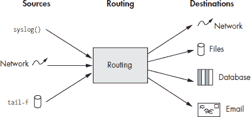
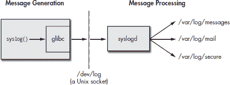
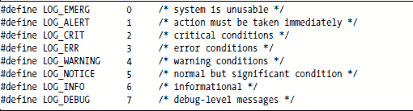
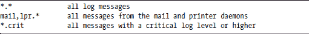
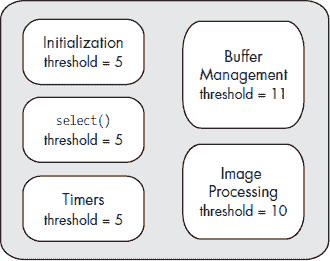
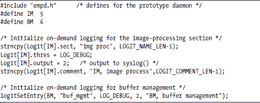

**日志记录**

*日志消息*是对感兴趣事件的异步报告。本章讨论了日志记录的一般概念，然后详细探讨了 syslog，Linux 上的默认日志系统。我们还描述了如何在守护进程运行时控制日志阈值。

我们将本章组织成以下部分：

+   你是否需要日志记录？

+   日志系统架构

+   syslog

+   按需日志记录

**你是否需要日志记录？**

在深入探讨日志记录的机制之前，让我们讨论一下为什么您可能想在您的设备上启用日志记录。

**系统运行时间**

日志记录的首要原因是提高您的设备系统的可用性。正确路由和显示如“CPU 风扇转速低于 1000 RPM”之类的日志消息可以帮助您的最终用户保持系统运行。对系统收集的日志消息进行回归或趋势分析可以帮助在服务中断之前识别问题。趋势分析在发现风扇、磁盘和电源供应的问题特别有用。

**安全**

如果您的设备连接到网络，它几乎肯定会在某个时候受到攻击。您可以使用日志消息来触发防火墙规则的变化，或者通知系统操作员或最终用户系统正在受到攻击。

**调试**

修复错误的第一个步骤是认识到存在错误。报告子程序输入或输出任何不一致性的日志消息对于查找错误非常有价值。您可以使用本章后面描述的按需日志记录来跟踪程序执行，并在检测到错误时记录子程序的输入和输出。

**与应用程序集成**

Laddie 是一个集成了日志记录和事件处理的应用的优秀例子。它简化了 ladd 守护进程的设计，使其仅通过日志消息报告所有警报转换。

您可能无法在一些具有有限连接性和有限磁盘空间的深度嵌入式 Linux 系统上使用日志记录。但对于大多数系统，日志记录将是您设备的一个真正资产。

**日志系统架构**

本节描述了一个“理想”日志系统的架构和特性。下一节将描述 syslog 并将其与下面提出的理想系统进行比较。

日志系统可以分为三个主要部分：一个用于收集日志消息，一个用于路由它们，一个用于交付它们（或启动其他操作）。图 6-1 展示了日志系统的架构。

让我们更详细地考虑这三个部分。

***消息来源***

理想的日志系统是来自设备任何位置的日志消息的汇总中心，并且它应该能够接受来自许多来源的消息，包括 Unix 套接字、UDP 和 TCP 套接字、命名管道，以及通过跟踪文件（tail -f 的输出）。

*图 6-1：设备中的日志消息流程*

日志系统的源代码应该有良好的文档记录和模块化，以便于添加新的消息类型源。系统的配置应该使得在系统运行时添加新源变得容易。

让我们更详细地讨论三种常见的消息源。

**Unix 套接字**

Syslog，Linux 上最受欢迎的日志系统，使用 Unix 套接字作为其消息收集点。面向流的通信通道，如 Unix 套接字，必须有分隔符来分隔消息。最常见的两个分隔符是一个空字符，syslog 使用它，以及一个回车符。

**网络套接字**

网络消息可能以 UDP 数据报或 TCP 连接的形式到达。一些应用程序接受 TCP 连接并将它们的日志消息广播到所有连接的套接字。日志系统应该能够接受 TCP 连接以及发起它们。如果日志消息将要穿越一个不安全的网络链路，系统应该使用 Stunnel 或 SSH 端口转发在传输过程中加密它们。

**跟踪文件**

许多应用程序直接将日志消息写入文件。如果你想捕获这些日志消息中报告的事件，你必须监视文件以获取新消息。tail -f 命令就是这样做。你通常看到这个命令字符串：

tail -f app_log_file | logger

只为了捕获应用程序的日志消息而创建两个进程似乎是一种浪费，一个好的日志系统应该将跟踪文件作为其核心功能的一部分来处理。

***消息路由***

路由部分确定每个消息的适当目标。路由标准因系统而异，但大多数系统包括基于事件重要性和源程序（如邮件、cron、内核和身份验证）进行路由的能力。一些系统包括识别并基于日志消息中的文本进行路由的过滤器。

在本章中，我们将*过滤器*定义为一系列路由规则及其各自关联的目标。路由规则及其关联的目标存储在配置文件中（或者在 Laddie 的情况下，存储在 RTA 表中）。如果系统支持（并且你使用）多个消息目标，则过滤器才有意义。

***消息目标***

一个日志系统通过将消息发送到目标来结束对消息的处理。以下将讨论一些常见的目标。虽然以下消息目标列表可能看起来相当长，但实际上还有许多未描述的可能目标。

**文件**

文件是日志消息最常用的目标。日志文件是接受的规范，可能是因为它们非常容易访问，可以进行定期的后处理分析。不幸的是，文件对许多没有硬盘的嵌入式系统来说是一个问题：RAM 是易失的，而闪存对于存档日志消息来说太昂贵了。对于无盘设备的选择是：大量过滤消息，只保存少量到闪存，将它们发送到网络上的服务器，或者根本不保存日志消息。

如果您将日志消息保存到文件中，可以使用 logrotate 定期删除最旧的文件，将最新的文件旋转到编号的存档中，并向消息来源的进程发送 SIGHUP 信号。SIGHUP 应该导致应用程序打开一个新的日志文件。

**命名管道**

命名管道是传递过滤后的日志消息到另一个程序的简单方法。辅助应用程序打开命名管道进行读取，然后等待日志消息到达时阻塞。当日志系统有消息要发送时，它会将消息写入命名管道，解除辅助应用程序的阻塞。确保您的辅助应用程序可以处理“损坏的管道”错误，因为如果日志系统重新启动，它们可能会发生。

命名管道和辅助应用程序对于太大或太复杂而无法包含在日志守护进程本身中的目标非常有用。命名管道是将日志系统绑定到特定于您的设备的自定义应用程序的绝佳方式。

命名管道的一个替代方案是*扇出*设备，这是一个内核模块和相关/dev 条目，充当一对一的多路复用器。与命名管道不同，扇出设备允许许多读者获取相同的信息（因此得名*扇出*）。本书的网站托管了扇出项目，包括源文件和更详细的文档。请访问[`www.linuxappliancedesign.com`](http://www.linuxappliancedesign.com/)获取更多信息。

**远程 UDP/syslog 主机**

如果您的设备是设计用于大型数据中心网络的网络设备，请确保包括将日志消息转发到网络中另一个主机的功能。syslogd 日志守护进程可以使用 UDP 接收和/或转发日志消息到其他主机。

**TCP 多路复用器**

如果您想将一些报告路由到其他程序，可以定义一个监听 TCP 套接字以接受连接。当消息到达多路复用器时，它会复制并发送到套接字上每个打开的 TCP 连接。

例如，在我们的 Laddie 设备中，我们有一个命令行界面（CLI），可以显示 Laddie 警报消息。¹ 当 CLI 用户输入开启日志的命令时，CLI 打开到 logmuxd（Laddie 的日志守护进程）的 TCP 连接，并将日志消息发送到另一端的 CLI 接受的每个 TCP 连接。（logmuxd 将在下一章中描述。）

**电子邮件**

很高兴通过电子邮件收到重要事件的报告，因为电子邮件无处不在，即使不是及时的。此外，电子邮件通常被用作传呼机和手机的入口（这样真正重要的灾难无论你藏在哪里都能找到你）。

**控制台**

将输出发送到/dev/console 或串行端口是调试的必要条件。一些大型网络中心仍然更喜欢通过物理安全且非共享的通道（如 RS-232 电缆）收集日志消息。

**数据库**

有些消息需要立即响应，但大多数时候你更感兴趣的是系统事件模式的趋势或变化。关系数据库是日志消息的理想存储库，因为它具有广泛排序和计数日志消息的工具。由于数据库在排序和计数时可能会消耗大量 CPU 周期，你可能希望将数据库放在网络上的其他位置，而不是在你的设备上。

**SNMP 陷阱**

大多数大型网络都有一台或多台专用网络管理工作站，运行 SNMP 管理器。这些网络的运营商通常坚持要求所有网络设备使用 SNMP 进行状态、配置和错误报告。

**system()**

调用 system()运行实用程序是另一个常见的目的地。虽然简单灵活，但这种方法比其他目的地使用更多的内存和 CPU 周期，不适合处理大量日志消息。

使用 system()几乎总是被认为是一个安全风险。我们提到 system()是为了完整性，但劝阻其使用。如果你必须运行外部命令，尽量使用 popen()代替 system()。我们在 Laddie 上通过使用附录 D 中描述的 RTA-to-file 实用程序来解决这个问题。

我们没有足够的空间来描述所有可能的目的地。例如，我们没有讨论传呼机、语音邮件或即时消息。

**syslog**

日志系统需要一个标准的方式来报告事件，日志消息的通用语言。对我们大多数人来说，这个标准就是 syslog。syslog 有几个优点。它是所有遗留 Linux 应用程序使用的首选事件报告机制，并且它广为人知且易于理解。与内核日志守护进程 klogd 结合使用，syslog 可以捕获您可能希望对设备用户可见的内核和其他系统日志消息。

本节描述了 syslog 的工作原理，如何在应用程序中使用它，以及如何配置其消息过滤器。我们提供了足够详细的说明，你应该不会在使用 syslog 作为日志系统基础时遇到任何麻烦。

***syslog 架构***

系统日志消息是通过调用 glibc C 库例程 syslog()在您的程序中生成的。然后，glibc 格式化消息并尝试将其写入 /dev/log，这是一个在 syslogd 启动时打开的 Unix 套接字。syslogd 从 /dev/log 读取消息并根据 /etc/syslog.conf 中定义的过滤器进行处理。图 6-2 显示了 syslog 的整体架构和消息流。

*图 6-2：使用 syslog 的消息流*

***使用 syslog***

几乎所有的 Linux 编程语言都有一个发送 syslog 消息的例程。下面显示的 C 库原型是大多数语言的典型代表。

void syslog(int priority, const char *format, ...);

*优先级*是日志级别、事件的紧急程度或严重性以及*设施*的组合，即生成消息的程序类型。² 大多数程序员在使用 syslog 例程时只指定日志级别。有八个日志级别，从紧急到调试的重要性依次递减。以下是从 syslog.h 中摘录的八个可用级别。

syslog()例程使用 printf 样式格式字符串，可以具有可变数量的参数。格式字符串中的文本应形成一个清晰、无歧义的事件描述，并且任何传递给格式字符串的参数应提供事件的更多详细信息。

当我们构建设备时，我们交付的部分内容是文档，我们文档的一部分是所有设备日志消息及其含义的列表。使用 grep 在源代码中生成此列表非常容易。日志消息列表对您的客户来说将非常有价值，并且生成它只需要您的一点点自律。

**注意**

*将您的设备中所有日志消息作为设备文档的一部分生成列表。*

您对发送到 syslogd 的内容的控制不仅限于消息的优先级和文本。特别是，您还可以使用可选的 openlog()例程来控制 syslog 设施、消息前缀以及是否在日志消息中包含进程 ID。openlog()调用语法是：

void openlog(const char *ident, int option, int facility);

ident 是一个短字符串，syslog 将其添加到每个日志消息的开头。如果您没有指定，ident 默认为调用 syslog()的程序名称。option 参数允许您控制诸如如果 /dev/log 不可用时该做什么以及是否包含调用程序的 PID 等问题。选项是以下一个或多个选项的按位或：

+   LOG_CONS—在无法写入 /dev/log 时将日志写入控制台

+   LOG_NDELAY—立即打开到 /dev/log 的套接字

+   LOG_ODELAY—在将消息写入 /dev/log 之前等待第一个消息打开套接字

+   LOG_PERROR—将日志写入标准错误以及 /dev/log

+   LOG_PID—在每个消息中包含 PID

设施旨在对应于发送日志消息的程序类型。如果没有调用 openlog()，则默认为 LOG_USER。syslog.h 中定义了 24 个标准设施；以下摘录显示了最常见的定义。请注意，值向上移动了三位，以保留低三位位用于日志级别。

虽然优先级和设施被 syslogd 用于路由，但它们的值不是保存文本的一部分；然而，您可以通过设置 syslogd 将不同优先级和设施值的消息保存到不同的文件中来推断保存的日志消息的优先级和设施。

***syslog 协议***

在介绍如何设置 syslogd 之前，让我们先考察用于发送 syslog 消息的协议。如前所述，syslogd 在/dev/log 上打开一个 Unix 数据报套接字，并在等待套接字上到达消息时阻塞。从应用程序传递给 syslogd 守护进程的信息包括一个设施、一个日志级别以及消息本身。守护进程使用设施和级别作为其唯一的过滤标准。

syslog 的原作者将优先级和设施组合成一个 32 位整数，其中优先级使用低三位位作为日志级别。组合的设施/级别是 ASCII 编码的，并在写入/dev/log 之前放在尖括号之间。

例如，假设您的程序将设施设置为 LOG_USER，并使用以下代码发送 INFO 日志消息。

如果我们在 syslogd 从其 Unix 套接字读取消息后立即查看该消息，我们会看到：

<14>Aug 2 13:18:31 my_prog: abc=2

注意 LOG_USER（8）和 LOG_INFO（6）是如何组合成<14>的。不需要换行符或其他终止字符，因为 syslog()在将消息写入/dev/log 套接字之前会添加一个空字符。如果您不包括换行符，syslogd 将在将消息写入日志文件之前添加一个。

***使用 syslogd 守护进程***

syslog 守护进程从/dev/log Unix 套接字读取消息，并根据它们的设施和日志级别路由消息。syslog 消息的目的地被称为*动作*，包括文件、命名管道、系统控制台（或其他 TTY 端口）、网络上的其他 syslogd 系统以及用户。

syslogd 的过滤器和动作定义在/etc/syslog.conf 中。配置文件通常每行一个目的地，包含所需目的地的设施和级别的列表。动作中的设施由逗号分隔，然后是一个点和一个日志级别。可以使用星号来表示所有设施或级别，指定一个日志级别意味着包括该级别及其所有更严重的级别。例如：

syslog 消息最常见的目的地包括文件、管道和网络上的其他日志守护进程。管道通过在目的地开始处给出管道符号 | 来指定。网络目的地以 at 符号 @ 开头。syslog.conf 的手册页提供了关于如何指定哪些设施和优先级被路由到哪些动作的更完整描述。将所有邮件日志路由到 /var/log/mail 以及将所有关键或更高优先级的打印假脱机程序和 FTP 日志路由到网络日志服务器的 syslog.conf 行如下：

回想一下，设施是作为从 syslog() 传递到 syslogd 的优先级整数的一部分，并且你可以定义自己的设施。这让你可以在 syslog 之上构建一个私有日志系统。你可以在 syslog.h 中添加新的设施整数和名称，然后重新构建 glibc 和 syslogd。然而，使用新的设施显式整数可能更容易。有 24 个预定义的设施，所以选择一个很大的数字，比如 1,000。使用这个设施发送 INFO 日志的代码可能看起来像以下这样：

syslog((1000<<3) | LOG_INFO, "an event occurred");

我们已经明确展示了位移和 OR 操作，以说明正在发生的情况。我们建议你使用等效的 LOG_MAKEPRI*(设施, 级别)* 宏。

继续以这个例子为例，假设你有一个程序正在监听名为 /usr/local/private_pipe 的命名管道上的新日志消息。你可以通过在 syslog.conf 中添加以下行并重新启动 syslogd 来配置 syslogd 以通过新设施发送所有日志。

桌面开发者可能对使用 syslog 进行事件处理的想法感到不适。但另一方面，Linux 桌面系统通常比设备有更多的 RAM 和 CPU 资源，因此它们可以承担 D-Bus 的（相对）高磁盘、内存和 CPU 负担。我们推荐使用 syslog，因为它简单、几乎所有编程语言都可用，并且内存和 CPU 负担小。

***syslogd 的限制、优点和替代方案***

默认的 syslogd 守护进程有一些限制。如前所述，它不保存消息级别或设施（尽管你可以通过基于它们的路由间接地获取它们）。Syslogd 不能基于正则表达式进行路由，它只接受来自 Unix 套接字的消息，并且它有一组相对有限的动作。一些程序员在设置调试和跟踪机制时发现级别的数量有限是一个问题。优点方面，syslogd 被普遍接受，并且经过彻底的调试、测试和安全验证。

日志记录器实用程序（我们在本章开头简要介绍过）允许您绕过 syslogd 的有限消息源。日志记录器将日志消息发送到 syslogd，从其命令行或其标准输入的每一行获取日志消息。如果您愿意，可以指定级别、设施和前缀字符串。有关更多详细信息，请参阅 logger 的 man 页面。您还可以将 netcat（一个用于从网络连接中读取和写入的简单实用程序）与日志记录器结合使用，以使用类似于以下命令的命令接受单个已接受的 TCP 连接的日志消息。

nc -l -p 2250 | logger

日志记录器实用程序允许您“监视”其他日志文件。例如，假设您希望将添加到 /usr/www/error.log 的每一行也发送到 syslog。以下命令行可以完成此操作。

tail -f /usr/www/error.log | logger

另一个值得提及的日志辅助程序是 klogd。由于 Linux 内核不使用 glibc，因此它不能使用 syslog() 发送内核日志消息。相反，内核日志消息可以通过系统调用 sys_syslog() 或从 /proc/kmsg 中可见的循环缓冲区获得。守护进程 klogd 将来自任一来源的内核日志消息转换为 syslog 消息。此外，klogd 将内核日志消息中的十六进制地址转换为它们的等效符号名称。要从十六进制地址获取符号，klogd 读取 System.map 文件中的内存映射。如果您在启动 klogd 之后加载或卸载内核模块，请确保使用命令 klogd -i 告诉 klogd 重新加载其符号表。

syslogd 的流行替代方案包括 nsyslog，它支持使用 SSL 的 TCP；minirsyslogd，这是一个可以处理极高流量量的最小化日志记录器；以及 syslog-ng，它可以基于正则表达式进行过滤，支持消息重写，并支持 TCP 源和目标。evlog 软件包在识别和响应日志消息方面表现最佳。有关这些替代方案的最新信息，可以通过在网络上搜索软件包名称来找到。

**按需日志记录**

如果您能动态控制程序中日志记录的详细程度，那岂不是很好？当然，您可以在启动程序时使用命令行上的 -v 开关，但这并不完全动态。此外，如果您能独立控制程序不同部分的日志级别，那也会很方便。这样，您就可以聚焦于研究特定的代码片段。本节描述了如何使用名为 Logit 的 RTA 表和 Laddie 设备的代码来独立控制程序不同部分的日志阈值，同时程序正在运行。图 6-3 阐述了为程序的不同部分提供不同日志阈值的理念。

这里是 Logit 表中行的定义：

*图 6-3：每个程序部分的独立日志控制*

理念是为代码的每个部分设置一个单独的日志阈值，并且只有当消息的级别在数值上低于该部分的日志阈值时才发送日志消息。我们 Logit 的实现有 12 行，前五行被 Laddie 原型守护进程内部使用。如果您愿意，可以轻松地更改 logit.c 中的 LOGIT_NROWS 以添加更多行。

让我们通过一个例子来操作。假设您想在代码的两个不同部分中添加按需日志控制，即图像处理（IM）和缓冲区管理（BM）。在初始化过程中，您的程序必须在 Logit 表中创建其条目。您可以直接这样做，或者可以使用包装函数 logitSetEntry()。下面的代码展示了这两种方法。

在以上初始化设置到位后，您现在可以添加可以通过在 Logit 表中提高或降低阈值来控制的日志消息。

在 Laddie 空守护进程头文件 empd.h 中定义的 LOG()宏，如果 LOG 调用中设置的阈值在数值上低于 Logit 中该代码部分的阈值，则会将消息发送到 syslog()或发送标准错误。例如，为了选择性地跟踪图像处理和缓冲区管理代码的操作，您可能有一些如下所示的几行代码。

LOG(LOG_DEBUG, IM, "深入图像处理");

LOG(DBG_2, BM, "释放缓冲区 ID=%d", buf_id);

文件 empd.h 定义了五个额外的日志级别（DBG_0 到 DBG_4），位于 LOG_DEBUG 之下，以便您能够更精确地控制调试消息的详细程度。

在以上所有设置到位后，您可以在程序的各个独立部分中启用和禁用日志消息。例如，禁用除 IM 部分之外所有日志记录的 SQL 命令可能如下所示：

UPDATE Logit SET thres = 0

UPDATE Logit SET thres = 10 WHERE sect = "IM"

**总结**

日志记录几乎可以添加到所有设备中，即使这些设备磁盘、内存和 CPU 功率有限。一个理想的日志系统具有许多日志消息的来源和目的地，并允许添加新的来源和目的地。

syslog 是 Linux 上的默认日志系统，有两个组件：一个发送日志消息的库例程和一个处理它们的守护进程。syslog()库例程在 Linux 上每个主要编程语言中都是可用的。syslog 守护进程 syslogd 根据消息的来源（设施）和报告事件的严重性（日志级别）来路由消息。在本章中，您学习了如何向 syslog 添加自己的设施，以便路由特定于您的设备的日志消息。

按需日志记录使我们能够动态控制应用程序不同部分的日志记录详细程度。虽然 RTA 使按需日志记录变得更容易，但它不是按需日志记录所必需的。

本章回顾了日志记录以及日志消息的收集和归档。下一章将描述一个能够识别日志消息中特定文本的日志系统，并根据具体情况重写和路由消息。

__________________

¹ *日志消息* 提供了事件报告。*警报* 是系统故障或可用性降低的系统状态。日志消息用于报告进入和退出警报状态的变化，这两个术语有时会被混淆。

² 很遗憾，syslog 和 syslog.conf 的文档并不完全一致。一个将 *优先级* 定义为设施和日志级别的按位或运算，而另一个将 *优先级* 定义为我们所说的日志级别。虽然本书内部一致，但在阅读其他 syslog 文档时请谨慎。
