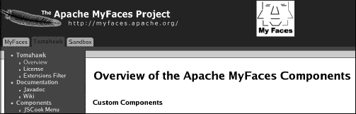
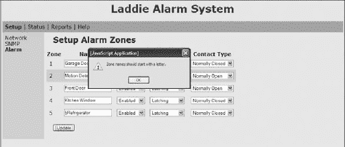
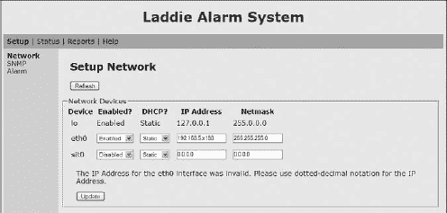
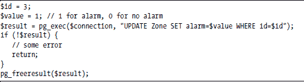
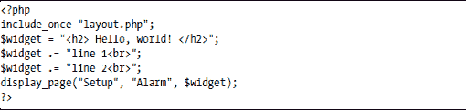
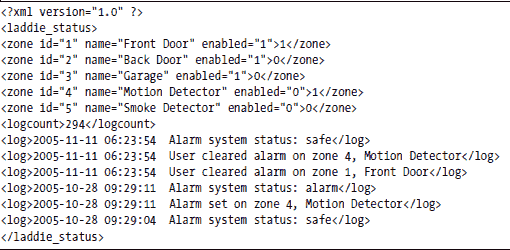
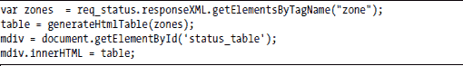
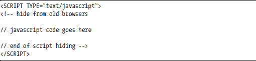

**设计网页界面**

网络浏览器已成为配置网络设备的首选用户界面，尤其是来自 Linksys 和 Netgear 等公司的家庭路由器。推动网络界面普及的动力在于它们易于使用且不需要专门的客户端软件。客户现在期望能够访问其设备的网络界面，因此，领先的家用网络设备制造商提供这些界面并不令人惊讶。

这是关于用户界面（UI）设计的几章中的第一章。本章涵盖一般性的网络 UI，特别是 Laddie 网络 UI 的开发。在随后的章节中，我们将探讨 Laddie 的其他 UI：第九章的 CLI 界面，第十章的前面板 LCD 界面，第十一章的 framebuffer 界面，以及第十二章的红外遥控器界面。所有这些 UI 都通过 PostgreSQL 协议与后端守护进程进行通信。

本章涵盖以下主题：

+   网络技术概述

+   为您的设备网页界面建立需求

+   选择 web 服务器

+   设计网页界面的外观和感觉

+   我们实现的重点

+   经验总结和未来改进

**网络基础**

网络浏览器使用*超文本传输协议（HTTP）*与 web 服务器通信，这是一个客户端-服务器协议。当网络浏览器（客户端）通过特定的统一资源定位符（URL）请求网页时，例如[`www.google.com`](http://www.google.com/)，通信便从浏览器（客户端）发起。当 web 服务器接收到这个请求后，它会检查请求的页面是否可用，如果可用，它就会将页面发送到浏览器。

由于 HTTP 协议是基于文本的，你可以使用 telnet 来模拟浏览器请求，如下所示：

telnet [www.google.com](http://www.google.com/) 80

一旦 telnet 会话连接成功，输入以下内容：

GET / HTTP/1.0

然后按两次回车（第二次回车产生的空行会导致 web 服务器响应 GET 请求）。返回的页面使用 HTML 格式化；下面是一个示例页面。（显然，如果你在浏览器中打开它，页面看起来会不同，因为浏览器会解释 HTML 标记并以人类可读的方式呈现。）请注意，页面的中间部分已被省略号（...）替换，以减小其大小。

***DNS 和 TCP***

网络协议 DNS（域名系统）和 TCP（传输控制协议）使得这种客户端-服务器交换成为可能。给定 URL（例如，[`www.google.com`](http://www.google.com/)），客户端使用 DNS 来确定服务器的 IP 地址。HTTP 使用 TCP 在客户端和服务器之间进行无错误的数据传输。

这些协议由互联网工程任务组（IETF）定义，它是权威的互联网标准机构。（有关 IETF 标准的更多信息，请参阅[`www.ietf.org`](http://www.ietf.org/); 有关 TCP/IP 的更多信息，请参阅查尔斯·M·科齐罗克的《TCP/IP 指南》，No Starch Press，2005 年。）

***Web 服务器***

Web 服务器查找并返回给定 URL 的网页。这个页面可能位于服务器的文件系统中，或在内存中，或者它可能在请求时动态生成。

***CGI***

*通用网关接口（CGI）*作为一种方式出现，允许 Web 服务器与专门设计的程序通信，该程序随后代表 Web 服务器生成网页。在 Unix 世界中，早期的 CGI 程序是用 bash、Perl 和 C 等语言编写的。今天，更常见的 Web 特定脚本语言如 PHP。此外，现代 Web 服务器如 Apache 可以配置为在 Apache Web 服务器相同的进程中运行 PHP 脚本，从而避免 CGI 通信机制。

***JavaScript***

JavaScript 已成为网页客户端编程语言的公认标准。JavaScript 代码嵌入在 HTML 页面中，网页中的标签告诉网页浏览器何时执行 JavaScript 函数。JavaScript 的主要优点之一是它提供了更响应的用户体验。JavaScript 的主要缺点之一是并非所有浏览器都支持它，而且那些支持它的也不一定按照标准方式支持。

***技术演变***

与客户端和服务器端的发展相结合，HTML 协议已经经历了许多修订，并扩展到包括 XHTML、CSS、XSL 和 XPath。

重要的是，网络技术仍在不断发展。这种发展给努力实现网页互操作性和持久性的开发者带来了挑战。因此，作为一名网络开发者，提前规划网络技术的变化是明智的。

**建立需求**

在为 Laddie 警报设备开发 Web 用户界面之前，我们确立了以下要求来指导其设计：

+   Web 界面应易于使用。

+   Web 界面应支持广泛的浏览器，包括基于文本的浏览器。

+   网页应随着设备状态的改变自动更新。

+   网页应遵守互联网标准，避免使用专有功能。

+   实现应与各种 Web 服务器兼容，以便在更好的 Web 服务器可用时可以替换设备 Web 服务器。

+   实现应该是简单的，以便可以轻松维护。

**选择 Web 服务器**

在构建您的设备时，您应该使用哪个 Web 服务器？在本节中，我们将回顾几个适合 Linux 设备的 Web 服务器。

***选择***

网络服务器有多种不同的类型。许多支持 CGI 接口，这使得网络服务器能够启动一个任意进程来代表网络服务器生成网页内容。

+   Apache 网络服务器可以与 PHP 解释器一起编译，这样 PHP 脚本就可以在 Apache 进程中解释。这种方法减少了进程间通信，并提高了响应时间。

+   lighttpd 网络服务器支持 FastCGI 接口。FastCGI 机制会启动多个 PHP 解释器，并在它们之间负载均衡 PHP 网页的请求。更多信息，请参阅 [`www.fastcgi.com`](http://www.fastcgi.com/).

+   GoAhead 网络服务器允许将网络服务器和所有网页打包成一个单一的可执行文件，这使得网络服务器可以在没有文件系统的情况下运行。

+   Linksys WRT54G 无线路由器中的网络服务器完全用 C 语言编写，并为每个网页包含手工编写的函数。

+   TUX 网络服务器在 Linux 内核中运行。

选择网络服务器时首先要考虑的可能就是许可证。如果你不想发布你的源代码修改，那么你应该避免使用带有 GPL 和 Apache 许可证的网络服务器。另一方面，如果你选择了一个成熟的网络服务器，如 Apache，那么你很可能不需要对其进行修改，因此你也不必担心需要发布源代码。

我们建议你抵制开发自己的网络服务器。选择现有的网络服务器并以服务器无关的方式开发网页更经济。这种方法的优点是，你不必花费开发资源来维护网络服务器，并且如果出现更好的网络服务器，你可以替换它。

***使用 PHP***

我们建议使用 PHP 作为生成动态网页的语言。虽然你可以用 C 语言编写较小的 CGI 程序，但如果使用编译型语言并且需要在设备部署后修改网页，你需要一个编译环境，这通常在部署的设备上不可用。

当你使用像 PHP 这样的解释型语言时，你可以轻松地修改和测试部署在设备上的网页。

PHP 是生成网页内容的良好语言，因为它受欢迎、成熟、拥有活跃的开发者社区，并且与 Apache、thttpd 和 lighttpd 等开源网络服务器很好地集成。即使对于不支持 PHP 的网络服务器，你仍然可以编写使用 PHP 的 CGI 程序。因此，你可以使用 PHP 与几乎任何网络服务器一起使用。正是出于这些原因，我们选择了 PHP 来开发 Laddie 网络用户界面。

***案例研究：Linksys WRT54G 无线路由器***

让我们考察 Linksys WRT54G 无线路由器所采用的方法。这个路由器中的 web 服务器是 micro_httpd 和 mini_httpd web 服务器的手工组合，并增强了生成网页动态内容的专用 C 函数。代码是 GPL 许可的，可以在 GPL 代码中心[`www.linksys.com`](http://www.linksys.com/)下获取。（micro_httpd 和 mini_httpd 都是由 Jef Poskanzer 编写的，可在[`www.acme.com`](http://www.acme.com/)获取。）

专用 C 函数负责生成网页的动态内容。因为这些函数被编译到 web 服务器中，所以不需要像 PHP 这样的脚本解释器。

例如，C 函数 dump_route_table()通过在匹配的标签对之间放置函数名，从网页中调用，如下所示：

<% dump_route_table(""); %>

这种标签机制类似于 PHP 所采用的方法，但在这里，该功能是用 C 语言实现的，并编译到 web 服务器中。

这种方法的优点是内存需求较小。然而，如前所述，这种方法的问题在于开发周期被延长，因为对专用 C 函数的任何更改都需要重新编译。

***案例研究：TUX Web 服务器***

与大多数其他在用户空间运行的 web 服务器不同，TUX web 服务器在 Linux 内核中运行。在内核空间运行允许 TUX 避免内核空间与用户空间之间的通信；因此，TUX 提供的服务器响应时间比其他 web 服务器更好。

TUX 支持静态和动态网页内容，但要支持动态内容，必须在用户空间运行另一个 web 服务器。TUX 通过自己响应静态网页请求并转发动态内容请求到 Apache 等用户空间 web 服务器来操作。正如你可能想象的那样，TUX 在支持动态网页方面并不提供速度优势。因此，对于主要动态生成内容的网站，额外的 TUX 配置可能不值得麻烦。

***Web 服务器的比较***

在上一节中，我们列出了从 Apache 到 TUX 的一系列 web 服务器。在本节中，我们将我们的重点缩小到仅比较支持 PHP 作为脚本语言的 web 服务器。由于空间原因，我们将 web 服务器集合限制为 Apache、Boa、BusyBox 的 httpd、Cherokee、GoAhead、lighttpd 和 thttpd。这些 web 服务器被选中是因为它们要么用于商业产品，要么是为嵌入式应用量身定制的。

比较 web 服务器的可能标准包括：

+   内存占用

+   可执行文件大小

+   性能

+   安全支持

+   持续维护和开发

+   调试支持

+   文档

+   成本

无论您如何权衡不同的标准，选择网络服务器都将需要妥协。例如，对于某些设备，内存占用量可能是关键的，但对于其他设备则不然。

而不是为您的设备推荐一个特定的网络服务器，我们已经编制了表 8-1，该表显示了在我们有限的集合中，各种网络服务器在每个领域的比较情况。在选择网络服务器时，您可以将此表作为起点。

您可以使用不同的网络服务器来处理开发的各个阶段。例如，您可以在开发阶段使用一个具有良好调试支持的网络服务器，然后在测试和部署期间切换到具有较小内存占用量的另一个网络服务器。如果您选择使用不同的网络服务器，请提前规划以确保您使用的是所有网络服务器都支持的功能。

**表 8-1：各种网络服务器的比较**

**关于表格数据**

让我们更详细地看看表 8-1。

**测试版本** 这是测试的网络服务器的软件版本。

**虚拟内存** 这是运行中的网络服务器消耗的虚拟内存（以千字节为单位）。虚拟内存是通过 Unix top 命令测量的，该命令在 SIZE 列下显示虚拟内存。对于产生多个进程的网络服务器，我们记录了最大值。在每个案例中，虚拟内存都是在性能测试期间记录的。（参见下一页上的“响应时间”。）

**可执行文件大小** 这是在使用大多数默认选项编译后，通过 strip 命令手动剥离的可执行文件的大小（以千字节为单位）。由于库有时是动态链接的，有时是静态链接的，因此这个指标并不像虚拟内存那样能很好地指示所需的内存量。

当程序是动态链接时，大部分代码可以在动态链接库中。当您查看可执行文件大小时，这些库中的代码将不会被考虑在内。因此，动态链接的可执行文件大小并不能很好地表明在可执行文件运行时（当所有库在加载时链接）所需的内存量。通常，重要的是程序运行所需的内存量，因为内存是宝贵的资源。

**响应时间** 这是指通过 httperf 工具（可在[`www.hpl.hp.com/research/linux/httperf`](http://www.hpl.hp.com/research/linux/httperf)获取）记录的访问 Laddie 的 status.php 页面的平均响应时间（以毫秒为单位）。进行此性能测试的动机是测量网络服务器对状态网页请求的响应速度。对于每个网络服务器，采取了以下步骤：

a. 网络服务器的软件是使用默认选项编译的，除了那些使它正确工作的选项之外。关于每个网络服务器如何配置的详细说明，可在本书配套 CD 上的/Code/src/web/INSTALL_WEB_SERVER.txt 中找到。我们使用了 PHP 版本 5.0.3。

b. 使用 strip 命令去除了生成的网络服务器可执行文件。

c. 运行了后端 Laddie 进程，ladd。

d. 以下命令被用来测量响应时间：

httperf --hog --server 192.168.1.11 --uri=/cgi-bin/status.php --num-conn 200 --rate 1

生成的动态状态页 status.php 的大小为 4546 字节。我们用于测试的服务器由一个运行 Linux Red Hat 9 的 2.4 GHz 英特尔赛扬处理器组成，其他进程处于空闲状态。客户端由一个运行 Linux Red Hat 9 的 1 GHz AMD Duron 处理器组成。服务器和客户端之间有 10 MHz 的 NIC，并通过 Linksys 交换机/路由器连接。

**支持 CGI** 这表示网络服务器是否支持通用网关接口（CGI）。

**支持 FastCGI** 这表示网络服务器是否支持 FastCGI，这是 CGI 的性能增强。有关 FastCGI 的文档可以在[`www.fastcgi.com`](http://www.fastcgi.com/)找到。

**支持进程内脚本** 这表示网络服务器是否支持内置的 PHP 解释器（或某些其他脚本解释器）。这种功能提供了更快的性能，因为它避免了 CGI 接口中的进程间通信。

**使用的服务器 API** 这是在响应时间性能测试期间使用的服务器 API 接口。服务器 API 是网络服务器和脚本之间的通信机制，例如 Apache、CGI 和 FastCGI。从表中可以看出，一些网络服务器只支持一个服务器 API，而其他网络服务器则支持多个。

**最后发布版本** 这是在撰写本文时软件最后一次发布的日期。这个值是软件是否积极维护的一个指标。在大多数情况下，我们测试的版本是最后一个发布的版本。然而，有一个例外——截至本文撰写时，thttpd 的最后一个版本是 2.25b，但我们测试的是 2.21b 版本，因为 2.21b 是最后一个支持进程内脚本的版本。

**调试** 这表示是否可以使用网络服务器调试脚本。在 Apache 和 PHP 的情况下，有一个名为 Zend Studio 的商业开发环境，允许您使用 Internet Explorer 调试 PHP 脚本。使用 Zend，您可以逐行执行 PHP 脚本并查看 PHP 变量。

**文档** 这是对文档是否明确指定网络服务器支持哪些功能和是否提供如何使用每个功能的说明的粗略衡量。

**成本** 这是将网络服务器分发给设备的货币成本。请注意，我们没有包括任何有货币成本的网络服务器。

**安全性** 这些是防止用户访问他们不应能够访问的文件的安全功能。最安全的网络服务器是那些强制通过配置文件进行访问的网络服务器。

**许可证** 这是网络服务器所拥有的软件许可证类型。Apache、BSD 和 GPL 许可证是众所周知的。GoAhead 许可证要求你在产品发货前通知 GoAhead，并在你的初始网页上显示 GoAhead 标志。

**考虑内存需求**

如果你的设备中内存不是问题，Apache 网络服务器将是一个不错的选择。Apache 的优点是它成熟的功能集、良好的开发工具（如 Zend Studio）和活跃的开发社区。

如果内存很紧张，那么 BusyBox 网络服务器可能是一个不错的选择；它是我们在测试的网络服务器中虚拟内存需求最小的。GoAhead 网络服务器的内存需求次之；然而，GoAhead 的缺点是它使用 Active Server Pages，这是一种微软技术，而不是 PHP，这是一种开源技术。（你仍然可以使用 CGI 机制在 GoAhead 中运行 PHP 脚本，但这不如使用内置 PHP 解释器的网络服务器那样无缝。）

**考虑响应时间**

在响应时间方面，排名前三的网络服务器是 thttpd、Apache 和 lighttpd。thttpd 和 Apache 都通过在同一个进程中运行 PHP 脚本来获得速度，这避免了其他网络服务器使用的进程间通信。thttpd 网络服务器的缺点是它一次只能服务一个请求，因此它将在之前的请求完成之前阻塞后续请求。这种行为对于某些网页来说可能没问题，但如果网页被编写为在一定时间内阻塞请求，或者直到状态改变才解除阻塞，那么这将成为一个问题。Laddie 中的一个网页就会因为状态改变而阻塞，因此这种网页行为排除了在 Laddie 设备中使用 thttpd 网络服务器。（我们将在第 125 页的“使用 Ajax 进行异步更新”部分讨论这个特定的网页。）

**我们的选择**

在我们开发 Laddie 的过程中，我们使用了 Apache 网络服务器，因为它提供了调试支持；而对于生产设备，我们选择了 lighttpd，因为它对内存的要求较小且速度快。我们在开发周期的后期才决定使用哪个网络服务器。我们之所以能够晚些时候做出这个决定，是因为我们已经将 PHP 脚本编写为可以在 Apache、CGI 和 FastCGI 下运行。

在他的关于嵌入式 Linux 的书中，Yaghmour 建议不要使用 Apache，因为它难以交叉编译（《嵌入式 Linux 系统构建》，Karim Yaghmour 著，O’Reilly，2003）。对于我们的设备来说，没有必要进行交叉编译，但如果你设备的 CPU 与开发机的 CPU 不同，你应该记住这一点。

**UI 设计**

在本节中，我们将回顾设计 UI 外观和感觉的各种方法，以及它们所需的权衡。在“实现”部分的第 118 页，我们将权衡这些权衡以做出实现决策。

***菜单系统***

菜单系统最重要的功能之一是它允许用户快速了解系统的功能。拥有许多顶层选项的菜单可能会让用户难以选择操作，因为选择太多。另一方面，拥有许多嵌套的菜单，虽然减少了顶层菜单的拥挤，但往往会增加找到操作所需的时间。

菜单系统可以分为那些顶层菜单沿着窗口左侧垂直运行的（见图 8-1），以及那些顶层菜单在窗口顶部附近水平运行的（见图 8-2）。虽然垂直菜单可能很有用，但随着菜单项数量的增加，它可能很快变得难以导航（注意图 8-1 中的滚动条）。水平菜单通常更优越，因为它可以更紧凑，因为二级菜单共享相同的区域。

*图 8-1：垂直菜单*

*图 8-2：水平菜单*

图 8-2 中垂直 MyFaces 菜单的一个缺点是，第二级菜单（例如，*Tomahawk*、*Documentation* 和 *Components*）不可选的事实在视觉上并不明显；它们看起来像第三级菜单，但行为不同。MyFaces 菜单可以通过使不可选择菜单项更明显来得到改进。例如，参见图 8-3 中显示的菜单。

*图 8-3：具有明显不可选择项的菜单*

***对话框***

我们关于对话框的建议很简单：避免使用它们。对话框会中断进程，因为用户必须点击按钮关闭对话框才能继续操作。艾伦·库珀反对使用对话框，因为它们会打断用户体验的流程，并且不会让用户更接近他们的目标（艾伦·库珀和罗伯特·莱曼著，《About Face 2.0：用户交互设计要素》， Wiley，2003 年）。

对话框的替代方案是将信息性消息放入网页本身。我们将在下一节中演示这一点。

***错误信息***

良好的错误信息可以极大地提高您网页用户界面的可用性。专家们普遍同意以下指导原则：

+   如果可能，使程序更智能，以避免特定的错误条件或从中恢复。

+   如果检测到不可恢复的错误，应提供明确的错误信息——也就是说，不要抑制错误。

+   错误信息应该是人类可读的。

+   错误信息应该详细。

+   错误信息应该建议如何解决问题。

+   错误信息应该接近有错误的字段。

+   有错误的字段应清楚地标识。

一些错误条件是由用户引起的（当用户在网页表单中输入错误值时），而另一些是由外部事件引起的（当设备磁盘变满时）。在设计你的设备网页时，考虑这些不同错误将如何被处理。

展示错误信息的一种方式是使用对话框（见图 8-4），但正如我们之前提到的，我们不建议这种方法。第二种方法是将在刷新的网页中插入错误信息（见图 8-5）。这种方法的一个显著特点是错误信息以表单字段的形式显示，这样用户可以立即重新输入他们的数据。

*图 8-4：错误对话框*

*图 8-5：行内错误信息*

第三种方法是在发生错误的地方注释标签，如图 8-6 所示。在这个例子中，通过显示标签为另一种颜色来显示错误。在这个图中，所有的字段标签都是黑色，除了*Lan IP*和*Control IP*，它们是红色的（它们在这里被圈出，因为它们看起来是灰色的）；这告诉你这些字段有问题。这种方法的一个问题是它未能提供详细的错误信息。虽然一些系统提供了带有信息的工具提示，但这样的机制通常不够明确，用户必须将鼠标悬停在标签上才能看到更多细节，这会让用户做不必要的操作。

*图 8-6：带注释的错误信息*

**使用 Ajax 提高响应性**

*Ajax (异步 JavaScript 和 XML)* 是一套技术，它使得网页的部分更新成为可能。由于只有网页的一部分被刷新，更新速度比整个网页刷新要快得多。此外，部分更新可能由用户事件（如鼠标点击和按键）触发。这种行为使得用户界面比传统网页更加响应。

例如，Gmail，谷歌的电子邮件服务，使用了 Ajax。当你撰写电子邮件并开始输入联系人的名字时，浏览器会对每个按键做出响应，随着你输入，匹配的列表会减少。这种响应性令人印象深刻。

图 8-7 展示了 Ajax 通信机制的工作示例。图中的交换是在用户在网页上的活动元素上鼠标悬停时（事件）开始的。当事件发生时，会触发 onmouseover 动作，并在浏览器中执行 JavaScript 代码。JavaScript 代码创建了一个带有服务器端脚本 URL 和 JavaScript 回调函数的 XMLHttpRequest 对象，然后浏览器在事件中将 XMLHttpRequest 对象发送到服务器。在服务器端，由 URL 指定的特定脚本在事件中以 XML 数据的形式做出响应。

*图 8-7：典型的 Ajax 序列。*

**注意**

*XML 的格式由客户端和服务器所熟知，因此当服务器发送 XML 数据时，客户端能够理解其格式。通常，XML 数据将包含要在浏览器网页的某些部分显示的更新信息。*

在客户端，网页浏览器接收 XML 数据并调用 JavaScript 回调函数。此回调函数从 XML 消息中提取数据，并使用 XML 文档对象模型（DOM）API 在事件中修改网页的某些部分。

鼠标移动并不是 Ajax 所支持的唯一事件，但它们是最受欢迎的，包括鼠标按钮点击、按键、文本选择和可编辑字段上的键盘焦点——并且随着每个浏览器的升级，还有更多事件被提供。

**实现**

在本节中，我们将讨论 Laddie 网页用户界面的实现。我们将展示一些网页用户界面的截图并讨论其工作原理。

网页用户界面至少支持以下网页浏览器：Internet Explorer（版本 5.0 及以上）、Netscape Navigator（版本 4.72 及以上）、Firefox（版本 1.0 及以上）、Safari（版本 1.0 及以上）、Opera（版本 5.0 及以上）和 Lynx（版本 2.8.2 及以上）。这些版本是通过与从[`browsers.evolt.org`](http://browsers.evolt.org/)获取的存档浏览器直接测试确定的。

**注意**

*与其他图形浏览器不同，Lynx 浏览器是基于文本的。*

***与守护进程接口***

Laddie 网页用户界面展示了几个运行中的守护进程的信息。正如你所知，这些守护进程使用 PostgreSQL 协议进行通信。在本节中，我们将讨论网页用户界面如何与 Laddie 警报守护进程 ladd 交互。一旦你理解了这种交互，你也会明白网页用户界面如何与其他守护进程交互。图 8-8 展示了用户请求网页并基于守护进程的状态动态生成网页的典型序列。

图表显示了运行在 Linux 设备上的带有 web 服务器和 ladd 警报守护进程的 Linux 设备。为了简单起见，我们展示了与 Apache 相同的方式，PHP 解释器在同一个进程中运行，但如果你使用 CGI 脚本，它可能作为不同的进程运行。

如前所述，该图显示了网页的典型请求-响应序列。首先，用户在事件  中请求特定的页面。web 服务器从文件系统中定位网页，因为 web 服务器在页面中发现了 PHP 标签，所以它调用了 PHP 解释器，该解释器解释 PHP 代码。在我们的例子中，特定的 PHP 代码包括 PHP 函数 pg_connect() 和 pg_exec()，这些函数在事件  和  中由 PHP 解释器调用。PHP 代码在事件  中生成网页，然后在新的事件  中将此新页面发送回浏览器。

*图 8-8：与守护进程接口*

**连接到守护进程**

如插图所示，在您能够读取和写入 ladd 守护进程之前，您必须使用 pg_connect() 函数建立连接，该函数在您使用 --with-pgsql 选项配置 PHP 时内置到 PHP 解释器中。pg_connect() 函数接受一个字符串参数，指定服务器的主机名（或 IP 地址）和端口号。在我们的例子中，服务器位于与 web 服务器相同的机器上，ladd 守护进程监听端口 8888。有关 pg_connect() 的更多信息，可以在 http://us2.php.net/pgsql 的 PHP 手册中通过搜索 *PostgreSQL Functions* 获取。

以下代码片段显示了如何打开到守护进程的连接：

**从守护进程读取**

一旦建立了连接，您就可以从 ladd 守护进程读取和写入。我们使用 pg_exec() 函数来完成这项操作。此函数请求执行给定的语句，在我们的例子中是一个 SELECT 语句。有关 pg_exec() 的更多详细信息，请参阅 PostgreSQL 函数文档 [`us2.php.net/pgsql`](http://us2.php.net/pgsql)。

以下 PHP 代码片段显示了如何读取警报状态：

在此示例中，SELECT 命令中的名称 id、name、enabled 和 alarm 是 ladd 守护进程中的 Zone RTA 表的列名。通常，不同的守护进程的 SELECT 命令将具有相同的形式，但列数和名称可能不同。pg_exec() 函数返回的对象句柄，然后用于使用 pg_NumRows() 提取行数和 pg_result() 提取每行的内容。

**注意**

*所有以 pg 开头的函数名都是 PostgreSQL PHP 库的一部分，并不特定于我们的守护进程。*

一旦从守护进程读取了信息，您就可以使用这些信息生成一个 HTML 页面。例如，我们会使用 $id、$name、$enabled 和 $alarm 的结果来生成一个 HTML 表格。

**写入守护进程**

要写入 ladd 守护进程并将警报区域 3 设置为警报状态，可以使用以下代码：

注意，你使用与从守护进程读取信息时相同的 pg_exec() 函数调用；区别在于 SQL 命令是 UPDATE 而不是 SELECT。前面的代码片段中的 SQL 命令指定更新 Zone 表中的报警列到 $value 值，但仅当 id 列与 $id 匹配时。

在前面的代码片段中，我们已将 $value 和 $id 变量设置为任意值，但通常 $id 和 $value 变量会从 HTML 表单中提取。

网页用户界面和 ladd 守护进程之间的交互足够简单。网页用户界面可以从 ladd 守护进程读取信息，也可以向 ladd 守护进程写入信息。网页用户界面以相同的方式与其他守护进程交互，因此关于这些交互没有新的东西需要学习。（交互之所以简单，是因为我们使用了一个已建立的协议 PostgreSQL，并且该协议的函数绑定对 PHP 程序来说是现成的。）

***报警状态页面***

图 8-9 显示了 Laddie 的报警状态页面。此页面允许你查看每个报警区域的状态，清除报警状态，以及设置报警状态（用于测试目的）。

*图 8-9：Laddie 状态页面*

报警状态可以显示为一个灰色水平条，或者在“状态”列下带有标签 *报警*。如果你实际使用这个界面，你可能会发现水平条比标签更容易阅读，因为它提供了一个快速的可视提示。在设计你的网页界面时，考虑一下你如何通过类似的视觉提示来快速传达信息。

与需要用户刷新页面来更新状态的传统网页不同，此状态页面在报警状态改变时自动更新。要观察这种自动更新行为，请启动两个浏览器并将它们指向报警状态页面。在一个浏览器中，通过点击清除和设置按钮来修改报警状态。如果你的两个浏览器都启用了 JavaScript，你应该在两个浏览器上看到页面更新。

你可以在本书的配套 CD 中的文件 /opt/laddie/htdocs/web/cgi-bin/status.php 中找到生成此网页的 PHP 代码。

***报警设置页面***

报警设置页面，如图 8-10 所示，允许你配置报警区域的名字。在设计这个页面时，我们考虑了两种用户界面设计方法：每个区域一个更新按钮和所有区域一个更新按钮。我们选择了单个按钮，因为它减少了配置所有区域所需的导航；你只需修改几个区域的参数并点击更新。

*图 8-10：Laddie 报警设置页面*

此网页允许用户输入每个警报区域的名称。现在我们将描述网页的工作原理，特别是如何处理显示的表格数据。在浏览器端，网页包含一个 HTML 表单，这是一种从用户那里接受输入并在用户按下提交按钮时将其发送到 web 服务器的机制。如果您查看网页的 HTML 源代码，您将看到以下行：

`<td> <input type=text name=Name_1 value="Garage Door" /> </td>`

输入标签告诉浏览器显示一个用于文本输入的字段。名称标签告诉浏览器如何命名该字段，而值标签告诉浏览器如何为该字段填充初始值。当用户点击提交按钮时，所有表单字段的名称和值都会发送到服务器。当服务器接收到此请求时，我们的 PHP 代码将提取区域名称并更新 Laddie 守护进程。

PHP 提供了一种简单的机制来提取字段值。例如，要提取名为 *Name_1* 的字段的值，您将使用以下 PHP 代码：

`$name = $_REQUEST["Name_1"];`

`_REQUEST` 变量是一个由 PHP 解释器填充的全局变量，而 `*Name_1*` 字符串对应于 HTML 表单中字段的名称。一旦在服务器上执行此语句，$name 变量将包含用户在浏览器中输入的文本。

对于表格表单，我们需要注意字段命名，因为 HTML 规范要求表单中的所有字段都必须具有唯一的名称。在 HTML 中命名此类表单字段的一种常见方法是在列名称后附加行号。例如，我们将行号 *1* 附加到 *Name*（使用下划线作为分隔符）以获得区域 1 的名称列的 *Name_1*。

生成此网页的 PHP 代码可在本书配套 CD 上的文件 /opt/laddie/htdocs/web/cgi-bin/setup_alarm.php 中找到。查看 displayZoneForm 函数。处理表单更新的 PHP 代码位于同一文件中。

***页面布局和菜单系统***

在本节中，我们将描述 Laddie 的网页布局和菜单系统。这个简单的方案由两个 PHP 文件处理。第一个文件，layout.php，将 Laddie 的两层菜单系统定义为二维数组（请参阅本书配套 CD 上的全局变量 $menu_system，位于 /opt/laddie/htdocs/web/cgi-bin/layout.php），并定义了 display_page() 函数。此函数在用户导航菜单时刷新页面。第二个文件，alarmstyle.css，控制颜色、字体和缩进（请参阅 CD 上的 /opt/laddie/htdocs/web/alarmstyle.css）。图 8-11 显示了一个示例网页；生成此网页的 PHP 代码如下。

*图 8-11：Laddie 的 “Hello, world!” 示例*

在调用 display_page()时，前两个参数是菜单结构（由 layout.php 中的全局变量$menu_system 定义）中的索引。在这个例子中，第一个参数"Setup"是顶级索引，而第二个参数是二级索引。第三个参数是一个 HTML 格式化的字符串，它将在主窗口中显示。在这个例子中，主窗口由标题 Hello, world!和两行组成。它是每个网页都不同的主窗口，通常这个内容是动态生成的，取决于系统的状态。

总结来说，页面布局的展示逻辑被封装在函数 display_page()中。关于如何使用 display_page()的另一个示例，请参阅 CD 上的/opt/laddie/htdocs/web/cgi-bin/help_contact_us.php。

***Webserver Independence***

PHP 与许多不同的 web 服务器协同工作，每个服务器与 PHP 解释器的交互方式略有不同。PHP 与 web 服务器交互的 API 称为 Server API。PHP 使用的 Server API 是在编译 PHP 时确定的，因此作为开发者，你可能在编写 PHP 脚本之前就已经知道了这一点。但如果你决定使用另一个 web 服务器呢？如果你没有提前规划，你可能需要修改大量代码才能使其与新 web 服务器兼容。

作为旁注，PHP 提供了 php_sapi_name()函数，可以编程地确定当前正在使用哪个 API。此函数返回许多可能的字符串之一，其中三个是*apache, cgi,* 和 *cgi-fcgi,* 分别对应 Apache、CGI 和 FastCGI。关于 Server API 的文档并不多，但尝试在 Google 上搜索它。

在设计阶段初期，我们决定编写我们的 PHP 脚本，以便它们可以与这三个 Server API 一起工作，因为我们调查的 web 服务器至少支持其中一个。这意味着我们的 PHP 脚本可以在支持这些 API 的任何 web 服务器上无需修改即可运行。这种服务器无关的方法提供了两个优点：它避免了将你锁定在特定的 web 服务器上（如果出现更好的服务器），并且允许你使用与你的设备中部署的 web 服务器不同的 web 服务器来开发脚本。

脚本输入参数由名称-值字符串定义。例如，一个输入参数可能具有名称*disp_id*和值为 51。脚本输入参数由调用脚本的 HTTP 请求提供；例如，以下请求将为脚本 wait_for_status.php 设置输入参数*disp_id*：

[`127.0.0.1/wait_for_status.php?disp_id=51`](http://127.0.0.1/wait_for_status.php?disp_id=51)

支持 Apache、CGI 和 FastCGI 的技巧在于，无论脚本在哪个环境中运行，都以相同的方式处理脚本输入参数。（输出没有问题，因为这三个 Server API 以相同的方式处理输出。）

对于 CGI 脚本，脚本输入参数是从 STDIN 中提取的，而对于 Apache 和 FastCGI 脚本，则是从 PHP 全局变量中提取的。实际上，Apache 和 FastCGI 的情况是相同的，所以只有两种情况，CGI 和 Apache。我们选择使用名为 read_params()的函数来抽象这两种情况。read_params()函数的实现处理了这两种情况的细节，但从调用者的角度来看，它提供了一种统一的方式来提取输入参数。

下面的 PHP 代码片段显示了如何使用该函数：

read_params()函数返回一个包含所有脚本输入参数的数组。调用脚本然后可以使用参数的名称（在设计时已知）检索特定的参数值。请注意，函数 array_key_exists 是 PHP 的一个内置函数，用于确定给定的索引是否存在于给定的数组中。

read_params()函数的实现可以在 CD 上的文件/opt/laddie/htdocs/web/cgi-bin/php_params.php 中找到。你还可以在/opt/laddie/htdocs/web/cgi-bin/setup_snmp.php 中找到其使用的另一个示例。

***使用 Ajax 进行异步更新***

考虑到图 8-9 所示的网页状态。网页应该如何响应警报状态的变化？

最好，网页应该自动更新，而不是要求用户反复点击浏览器的刷新按钮。一种方法是在固定频率下轮询服务器，例如，使用以下 Refresh HTML 元标签：

`<META HTTP-EQUIV="Refresh" CONTENT="5;URL=refreshed-page.html">`

另一种方法是使用 Ajax，这样网页只会在服务器状态发生变化时更新。Ajax 的缺点是它需要在网络浏览器中启用 JavaScript；如果用户禁用了 JavaScript，更新机制就会失效。另一方面，当使用 Ajax 时，网页会快速响应服务器状态的变化。

在第 117 页的“使用 Ajax 提高响应性”部分，我们描述了典型的 Ajax 交换是如何工作的。然而，请注意，这种典型的交换是由客户端发起的，而不是服务器。我们需要一种方法来修改 Ajax，以便浏览器能够响应服务器上的状态变化。

结果表明，我们可以修改 Ajax 交换，使系统表现得就像是由 web 服务器发起交换。这个技巧有两个方面。首先，将 onmouseover 事件替换为 onload 事件，这样一旦网页加载，就会立即发送 XMLHttpRequest。其次，编写 web 服务器脚本，使其在等待事件时阻塞。通过实现这种修改后的 Ajax 交换，每当服务器上发生特定事件时，网页都会更新。有经验的 Ajax 程序员会注意到还有另一种机制可以达到类似的效果，那就是在[`www.ajaxpatterns.org`](http://www.ajaxpatterns.org/)（以及相关的书籍《Ajax 设计模式》，作者 Michael Mahemoff，O'Reilly，2006）中记录的*HTTP 流模式*。我们的方法和 HTTP 流模式都有使用长连接的缺点，这可能会成为只允许有限并发连接的 web 服务器的难题。然而，对于我们的方法，我们可以控制请求等待服务器事件的时间，从而限制并发连接的数量。

在我们描述这个修改后的 Ajax 交换的细节之前，让我们先回顾一下整体情况。图 8-12 显示了用户请求新网页的序列，包括第一次完整页面更新和随后的部分页面更新。从时间上看，事件到在用户请求特定网页后迅速连续发生。此时，网页加载了最新的警报状态。当在事件发生警报状态变化时，会迅速触发事件到，此时网页会刷新为新的警报状态。这个后续序列会一直重复，直到用户离开网页。

**浏览器发送第一个 HTTP 请求**

从事件到的序列是标准的 HTML 请求响应交换。在步骤中，用户请求一个网页，服务器通过发送网页进行响应，在步骤中，浏览器显示页面。这些步骤对所有网页请求都会执行，无论网页是否包含 JavaScript。从事件到的剩余序列更有趣，我们将更详细地描述这个序列。

*图 8-12：外部事件的 Ajax 序列*

**浏览器发送第二个 HTTP 请求**

在客户端，当网页首次在事件加载时，会触发事件。特别是，会调用 GetCurrentStatus()函数。请通过启动本书的配套 CD 并使用浏览器访问 192.168.1.11 来查看 Zone Status 网页的 HTML 源代码。

Laddie 警报设备的默认 IP 地址是 192.168.1.11（默认子网掩码是 255.255.0.0）。当您将本书的 CD 插入计算机并重新启动时，您就可以通过在另一台计算机上的任何 Web 浏览器中键入 URL [`192.168.1.11`](http://192.168.1.11/) 来连接到 Web UI。如果默认 IP 地址与您的网络上的现有节点冲突，您可以使用以下步骤更改 Laddie 的 IP 地址。退出帧缓冲区界面（按 Q 退出），然后在 shell 提示符下，输入**root**作为用户并按 ENTER 键输入密码（没有密码）。然后输入**lynx**到命令提示符。在 lynx 中，您可以导航到网络设置页面并修改网络接口的 IP 地址。一旦您使用 lynx 更改了 IP 地址，您就可以在另一台计算机上的浏览器中重新输入 URL（使用您的新 IP 地址）。

如果您查看此网页的源代码，您将看到以下行：

<body onload="GetCurrentStatus()">

GetCurrentStatus()函数随后使用 URL wait_for_status.php 发起一个 XMLHttpRequest（在事件  上）。您将在本书配套 CD 上的文件/opt/laddie/web/cgi-bin/status.php 中看到以下代码：

这段代码指示浏览器发送一个带有 URL wait_for_status.php 的 HTTP GET 请求。它还指示浏览器在收到来自服务器的响应时调用回调函数 GotStatus()。

**服务器阻塞等待警报状态变化**

在服务器端，脚本 wait_for_status.php 被调用。此脚本在事件  上对端口 4444 进行阻塞读取。每当在事件  上的 ladd 守护进程中的警报状态发生变化时，logmuxd 守护进程会将一条消息写入端口 4444，在事件  上。写入端口的实际内容并不重要；重要的是，这条消息会在事件  上解除 PHP 线程的阻塞。

在上面的代码中注意，curr_id 与 URL 一起发送。这个变量防止浏览器在事件来得太快时丢失日志事件。这个变量像令牌一样在服务器和浏览器之间传递，并且它与日志事件的数量同步增加。如果浏览器中的 curr_id 值与服务器上的日志事件数量不匹配，PHP 线程将跳过在端口 4444 上的阻塞。这样，如果在 PHP 线程不在端口 4444 上阻塞的时间间隔内有新的日志事件，PHP 线程将继续执行。

**服务器以 XML 格式发送警报状态**

一旦阻塞读取返回，PHP 脚本从 ladd 警报守护进程（在事件  上）读取警报状态，并将数据组合成一个 XML 文档（在事件  上）。然后，web 服务器将此 XML 文档传递给浏览器（在事件  上）。一个示例 XML 文档如下所示：

**浏览器更新网页部分**

在客户端，浏览器接收 XML 文档，并从中生成一个 HTML 片段；它使用这个片段来更新网页（事件）。`status.php`中的`GotStatus()`函数有以下代码。

第一行从 XML 响应中提取区域数据，第二行生成专门用于 Laddie 状态页面的 HTML 片段，最后一行将 HTML 片段插入到显示的页面中。

**浏览器通过发送另一个 HTTP 请求重复操作**

然后，浏览器调用另一个 XMLHttpRequest，过程重复（在事件）。经过一小段时间延迟后，`GotStatus()`函数通过以下行调用`GetCurrentStatus()`：

setTimeout("GetCurrentStatus()", 2000);

你可以通过打开两个网络浏览器到状态页[`192.168.1.11`](http://192.168.1.11/)来查看这种行为是如何工作的。如果你在一个浏览器中改变一个报警区域的状态，你应该在另一个网络浏览器上看到这个状态的变化。

总结来说，我们展示了一种使用 Ajax 更新网页的技术，这里的更新是由服务器上的事件触发的，而不是客户端的事件。

**没有 JavaScript 的优雅降级**

当设计一个基于 Web 的设备时，你必须决定你将支持哪些网络浏览器。你是否支持像 Lynx 这样的非图形浏览器，还是你只支持功能齐全的浏览器？通过降低所需浏览器功能级别，你可以支持各种浏览器，但这是以增加开发工作量为代价的。在另一个极端，你可以规定使用特定的浏览器，这有利于使用专有功能，但存在一些客户可能不喜欢你的浏览器选择的风险。客户的反馈将非常有价值，可以帮助你做出这个决定。

我们选择支持广泛的浏览器，然后通过避免浏览器特定的代码来减少开发工作量。也就是说，我们避免了在所有主要浏览器上工作方式不同的代码。

特别值得关注的是支持没有 JavaScript 的浏览器的能力。JavaScript 的一个困难之处在于它可以被用户禁用，更糟糕的是，用户可能不知道它已经被禁用了。

支持有和没有 JavaScript 的浏览器的一种方法是将网站结构为两个“宇宙”——一个使用 JavaScript 的宇宙，另一个不使用。主页被编写成检测浏览器上是否启用了 JavaScript，然后重定向浏览器到相应的宇宙。不幸的是，如果用户禁用了 JavaScript 然后重新加载特定的页面，这个解决方案就不起作用了。解决方案是用户打开 JavaScript 然后重新访问主页。

我们采取了另一种方法，这种方法允许用户启用或禁用 JavaScript，然后简单地重新加载特定页面。这意味着每个网页都必须支持 JavaScript 版本和非 JavaScript 版本。在过去，这个问题可能很难解决，因为不支持 JavaScript 的浏览器会被 JavaScript 代码弄糊涂。但今天这个问题很容易解决，因为大多数浏览器（甚至那些不支持 JavaScript 的浏览器，如 Lynx）都理解 HTML 标签之间的所有 HTML 代码。

**隐藏 JavaScript**

隐藏 JavaScript 内容从浏览器中已知的工作模式适用于 Internet Explorer（版本 5.0 及以后）、Netscape Navigator（版本 4.72 及以后）、Firefox（版本 1.0 及以后）、Safari（版本 1.0 及以后）、Opera（版本 5.0 及以后）和 Lynx（版本 2.8.2 及以后）。

HTML 注释<!-- 和 -->被包括作为一个针对那些不理解<SCRIPT>标签的老旧浏览器的安全机制。同样，您可以使用<NOSCRIPT>和</NOSCRIPT>标签在 JavaScript 未启用时提供替代内容。

使用这些模式，每个网页都可以支持 JavaScript 和非 JavaScript 版本，因此用户可以更改浏览器的 JavaScript 设置并重新加载页面。因为用户不必找到并重新加载一些全局重定向页面，用户的体验大大简化。

**改进我们的设计**

在实现了 Web UI 之后，我们更有能力审查和改进我们的设计。有哪些领域可能需要改进？

当前设计的一个问题是，配置网络接口的逻辑包含在 setup_network.php 中，不幸的是，这个逻辑对其他 UI（如命令行界面 CLI）不可用。当我们最初实现网络设置页面时，我们没有预见这个配置逻辑会如此复杂，因此我们决定所有 UI 都会复制这个“简单”逻辑。事后看来，我们认为将网络配置逻辑纳入一个单一的管理器（特别是 networkd 守护进程）会改进设计。这样，CLI 用户界面就可以提供与网络设置网页相同的功能，而不必在 setup_network.php 中复制大量逻辑。

我们可以通过明确二级菜单和顶级菜单之间的关系来提高 Web UI 的可用性。这可以通过为顶级和二级菜单使用不同的颜色来实现，如图 8-2 所示。注意在这个图中，很容易看出二级项目*组件*属于一级菜单*Tomahawk*。

另一个改进是添加客户端的错误检查功能。通过添加 JavaScript 函数来检查表单字段的合法性，可以实现更响应式的用户界面。

我们可以通过添加一个提供网络连接和硬件健康诊断功能（如温度和风扇速度）的网页来增强功能。这种功能将允许管理软件远程监控设备以检测性能下降。

**资源**

以下资源将有助于进一步学习网页设计、Ajax、调试和测试。

**UI 设计** Alan Cooper 和 Robert Reimann 合著的《About Face 2.0：用户交互设计要素》（Wiley，2003 年）是一本关于 UI 设计的优秀书籍。

**JavaScript** 一本关于 JavaScript 的好参考书是 Danny Goodman 和 Michael Morrison 合著的《JavaScript 圣经，第 5 版》（Wiley，2004 年）。

**Ajax** 关于 Ajax 编程的维基百科页面是学习这种技术的起点，并包括 Ajax 的历史。见[`en.wikipedia.org/wiki/Ajax_(programming`](http://en.wikipedia.org/wiki/Ajax_(programming))。

**HTML 验证** 互联网联盟（W3C）提供了一个免费的 HTML 验证服务，网址为[`validator.w3.org`](http://validator.w3.org/)。同时，也提供 CSS 验证服务。

**Web 浏览器** 对于测试你的网页，较老的 Web 浏览器存档在[`browsers.evolt.org`](http://browsers.evolt.org/)。

**调试器** Zend Studio 调试器允许你使用微软的 Internet Explorer 和 Apache 网络服务器来调试 PHP 代码。使用这个浏览器，你可以逐步执行在 Apache 下运行的 PHP 代码。这是一个商业软件包，可在[`www.zend.com`](http://www.zend.com/)获取。

**摘要**

在本章中，我们讨论了基于 Linux 的设备的网页用户界面开发，特别是 Laddie 的网页用户界面。我们的目标并不是讨论所有的网络技术——关于这个主题，你将找到整本书。

本章强调了 Laddie 网页用户界面的相关特性：

+   对于不支持 JavaScript 的浏览器，网页用户界面能够优雅地降级，以便广泛的浏览器都能访问网页用户界面的功能。

+   当设备上的警报状态发生变化时，警报状态页面会自动更新：

    +   当警报被触发时，查看状态网页的每个浏览器都会自动刷新。

    +   当任何浏览器用于清除警报时，这种变化会在所有其他浏览器上反映出来。

在实现网页用户界面后，我们回顾了我们的设计并提出了一些未来的改进建议。特别是，我们建议将配置网络接口的逻辑从 PHP 移动到网络守护进程 networkd 中。这种重构的优势在于，其他用户界面，例如命令行界面 CLI，可以配置网络接口而无需在 PHP 中重复复杂的逻辑。其他改进包括重构菜单系统并添加 JavaScript 错误检查函数。
