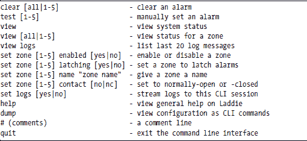
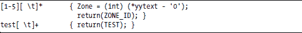
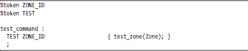

**设计命令行界面**

命令行界面（CLI）为您的客户提供了一种安全、低带宽、易于脚本化的方式来配置和管理您的设备。作为一名 Linux 开发者，您已经熟悉 bash，这是 Linux 最受欢迎的 CLI。

正如您不希望在没有 bash 命令行的情况下管理 Linux 服务器一样，您的客户可能也不希望在没有类似易于管理的 CLI 的情况下管理您的设备。

本章涵盖以下主题：

+   为什么你需要 CLI

+   CLI 类型

+   向用户提供 CLI 访问权限

+   Laddie CLI

+   测试命令的代码审查

**为什么你需要 CLI**

尽管 CLI 已经存在了一段时间，但它仍然是 Linux 设备最常请求的功能之一，尤其是那些将被安装在服务器室或网络操作中心的网络设备。让我们依次探讨在您的设备上拥有 CLI 的每个主要原因：

+   安全性

+   可用性

+   带宽

+   可脚本化

+   配置备份和恢复

***安全性***

许多服务提供商将拒绝将控制和状态协议放置在与用户数据相同线缆上的设备；他们更喜欢的设置是完全独立的物理通道，专门用于设备管理。历史上，这个独立通道是一个带有 CLI 的 RS-232 接口。RS-232 线路通过终端服务器或端口集线器路由到控制中心。

当一个设备有串行端口时，用户期望它也拥有字符或命令行界面。当然，你可以将 PPP 守护进程附加到串行端口上，使其成为网络接口，但这种做法很少见。较新的网络设备具有第二个（甚至第三个）以太网接口，以提供设备控制和状态所需的独立物理通道。专门用于安全控制和状态的独立局域网开始出现，但现有的网络管理系统（NMS）处理串行端口将使 CLI 和设备串行端口成为一段时间内的标准要求。

***可用性***

基于网络的 UI，如 Web 界面，要求在 UI 变得可访问之前网络必须正确配置并运行。问题是，如果网络配置出现问题，您可能会失去修复配置的所有能力。另一方面，串行端口不需要地址，因此在其上运行的 UI 始终可用。

由于网络配置错误导致不可用，还有一个流行的解决方案。许多设备都有一个隐藏的或难以触及的开关，如果在设备启动时保持关闭状态，则会将设备重置为其出厂默认配置。如果您不打算使用串行端口，您应该考虑有一个隐藏的开关或其他机制，以便用户可以重置设备的配置。

***带宽***

当您想要通过低带宽通道访问设备时，CLI 很有用。低带宽通道可能是一个慢速无线电链路，或者是一个通常快速但过载或失败的其它网络。如果您的设备需要在地理上分散但集中管理，低带宽功能也可能是有利的。

***脚本化能力***

命令行界面（CLI）的一个最大优点是它通常允许您将一系列命令行收集到一个文件中，或者称为*脚本*，并像用户交互式输入一样执行这些命令。这可以提供比网页或其他图形用户界面（UI）巨大的优势，后者难以自动化。脚本特别有助于帮助自动化重复或繁琐的任务。CLI 可以允许用户构建自己的命令，使用 CLI 中的命令作为其原语或基本操作。

并非所有 CLI 在脚本化能力上都是平等的。我们将在本章后面更多地讨论这个问题。

***配置备份和恢复***

作为设备开发者，您应该预见到的一个最大的问题是您的客户需要在软件升级过程中保留或迁移配置数据。我们以几种方式处理了这个问题，我们最糟糕的解决方案是给用户提供一个网页，他们可以在其中启动一个 FTP 传输，传输包含配置数据的二进制文件。这有几个原因造成了灾难。客户反对设置 FTP 站点以接受文件的麻烦，他们*真的*反对无法看到配置。

升级也是一个麻烦。我们必须编写和分发程序来读取二进制文件并将其转换为新软件所需的格式。注意版本号、找到一个运行转换器的地方，以及将新文件放回设备上，这真是一团糟。将配置保存为 XML 有所帮助，但这并没有太大的帮助。

真正解决问题的方法是为用户提供一个显示整个配置作为 CLI 命令列表的网页。我们的客户非常喜欢这个。他们可以一目了然地看到配置，备份配置就像访问网页并在浏览器中选择“另存为”一样简单。当然，我们还有一个匹配的网页表单，用户可以粘贴已保存配置的 CLI 命令，从而轻松恢复原始设置。例如，wget 工具允许自动化配置备份。您将在本章后面当我们回顾 Laddie CLI 命令时看到示例，该命令将 Laddie 的配置作为一系列 CLI 命令输出。

这种方法也使我们的升级变得更加容易。CLI 相对稳定，对其的更改几乎总是向后兼容的扩展。在采用这种方法之后，我们不再需要编写和分发程序来将配置文件的一个版本转换为下一个版本的文件。

将设备配置保存为 CLI 命令列表的脚本还有其他优点。我们的一位客户希望所有配置的主副本都存储在他的 NMS 中。他配置我们的设备使用 DHCP，并设置他的 DHCP 和 NMS 使用 wget 将适当的配置发送到我们的设备，一旦他从 DHCP 服务器收到 IP 地址。在一个实例中，他订购了 10 台新服务器，我们在发货前提供了这些新服务器的以太网 MAC 地址。在设备到达之前，他已经准备好了 10 台新服务器的配置供下载，所有新设备在初次通电后几分钟内就配置并运行起来了。

**CLI 类型**

大多数 Linux 系统上的默认 CLI 是 bash，但 bash 只是 CLI 的一种类型。还有其他类型可能更适合您的需求，并且您的 CLI 可能会根据您选择的类型从一种类型切换到另一种类型，以匹配手头的任务。让我们来看看不同类型的 CLI：句子、菜单和向导，以及两个 CLI 属性：状态性和 CLI 是否面向行或面向字符。

***句子***

句子 CLI 是最常见的 CLI 类型，它将设备中的动作和对象映射为动词和名词。考虑一个简单的 bash 命令：

rm -f backup.sxw

在这里，rm 是动词，-f 是副词，backup.sxw 是名词。这种类型成功的 CLI 的关键是选择那些能够很好地映射到客户对设备理解的动词和名词。

当然，您可以使用其他句子结构，如动词-副词-名词、动词-名词-形容词或名词-动词-形容词——这取决于您。目的是让阅读 CLI 行看起来像是一个句子。当客户、现场支持和工程师都使用与您的 CLI 相同的词汇和语法来描述配置时，您就会知道您已经做对了。

通常，你需要动词来查看状态或统计信息、更改配置和启动操作。例如，Laddie CLI 中的动词是 *查看、设置、测试* 和 *清除*。

句子 CLI 的主要优点是它是最容易和最可靠脚本的 CLI 类型。这种 CLI 的主要缺点是它有一个陡峭的学习曲线。为了有效地使用这种类型的 CLI，用户必须记住相当数量的词汇和语法。然而，在 CLI 中花费大量时间的用户通常更喜欢句子 CLI。

***向导***

一个 *巫师* 是一种界面类型，它会向用户提出一系列问题，通常在提问之前给出一些描述性文本。例如，以下内容可能是 Laddie 的向导配置的一部分。

如果有一个合理的默认值，你应该在问题的提示中显示它。惯例是在大写字母中显示默认值。你还应该允许用户在任何时候中断向导的问题序列。常见的中断序列包括 q 和 ctrl-C。在问题序列的末尾，你应该显示响应的摘要，并要求用户确认这些是他们或她想要的值。

这里有一个帮助用户和你的小贴士。你的网页界面有用户在点击 *提交* 按钮之前填写的表单字段。如果你正在构建一个向导，应该将网页表单中的相同字段映射到向导中。例如，如果网络配置的网页表单要求输入主机名、引导协议和默认网关，则网络向导应该要求输入主机名、引导协议和默认网关。这通过让用户将从一个界面（网页）到另一个界面（CLI）的培训转移过来帮助用户。这也帮助你，因为你的后端处理只需要处理一种类型的请求，无论请求的来源是什么。

向导是帮助新用户或偶尔使用用户通过配置的好方法。如果你需要同步更新向导中展示的所有字段，向导也非常有用。例如，你可能希望通过一次原子更新来更改静态 IP 地址及其关联的子网掩码。

由于向导仅用于收集配置信息，因此它们通常与其他提供更好脚本性和更容易访问系统状态的 CLI 类型结合使用。

***菜单***

菜单 CLI 在每个步骤都向用户提供一个定义良好的命令或选择列表。例如，如果我们给 Laddie 一个菜单 CLI，顶级菜单可能看起来像这样。

选择菜单中的一个项目可能会提示用户一个子菜单，或者将其放入一个向导中以收集配置信息。

菜单式 CLI 已经不再受欢迎，但如果预期 CLI 将很少使用或由未经培训的用户使用，它仍然是一个合适的选择。使用菜单式 CLI 几乎没有学习曲线。

菜单式 CLI 可以被脚本化，但脚本很脆弱，因为即使是菜单布局的微小变化也可能导致脚本损坏。

***状态式***

状态式 CLI 维护用户的位置感。例如，bash 是状态式的，因为它支持使用 cd 命令来操作当前工作目录的状态。另一个状态式 CLI 的好例子是图形包 gnuplot 中的帮助系统。然而，状态性可能更准确地描述为 CLI 的一个属性，而不是它们的一个独立类型，因为向导式、菜单式和句子式 CLI 都可以是状态式的。

如果你预期用户会在 CLI 中花费大量时间，状态式 CLI 是很不错的。它们通过提供上下文相关的帮助（即基于状态或位置的帮助）以及减少用户需要输入的字符数量来帮助用户。

状态式 CLI 需要更多的文档和培训来解释状态和状态操作，并且在脚本中可能会有些棘手，因为很容易忘记在脚本中设置状态。（我们中有多少人忘记在 bash 脚本的顶部添加 cd 命令？）

***字符界面与行界面***

正在流行起来的一种术语是 *字符界面*，它指的是将每个输入的字符视为一个单独的界面。相比之下，经典的行界面只在输入换行符时查看命令。编辑器 vi 有字符界面，而它的前身 ed 则具有经典的 CLI。另一个常见的字符界面例子是 bash，它具有自动补全和行编辑功能。

字符界面，例如 vi 中的界面，可以大大减少用户需要输入的字符数量，并且自动补全功能对于新用户和不常使用用户来说非常有帮助；然而，字符界面需要界面设计师和编码者投入大量的工作。

**为用户提供 CLI 访问权限**

一旦你有了 CLI，你需要让你的用户能够访问它。一种方法就是让他们登录，并从 bash 提示符启动 CLI。这可以使脚本编写更容易，但很少设备允许直接访问 Linux 登录。

可能最常见的一种访问方式是将 CLI 可执行文件的路径添加到 /etc/shells 文件中，并创建一个登录 shell 设置为 CLI 的用户。这种方式的优势是 CLI 在串行端口、telnet 和 SSH 上都可以同样访问。这是我们为 Laddie 采取的方法。

非常小的设备可能不支持登录。在这种情况下，你可以将 CLI 的标准输入和标准输出直接连接到串行端口。这里的网络安全模型是物理访问串行端口。

如我们将在下一节中看到的，CLI 即使仅用于配置备份并且只能从网页访问，也是有用的。

**Laddie CLI**

Laddie 的 CLI 使用动词-形容词-名词的方法；它不是状态性的，并且是面向行的，而不是面向字符的。我们的命令允许 CLI 用户查看状态、查看日志、设置配置和获取帮助。Laddie 的 CLI 并不完整，因为它不允许用户配置、查看或设置设备的网络、SNMP 或日志配置。

您可以通过多种方式访问 Laddie CLI。您可以无密码以用户 cli 身份 telnet 到 192.188.1.11，也可以以 root 身份 telnet 到 Laddie，然后在 bash 提示符下使用命令 cli 启动 Laddie 的 CLI。

***Laddie 命令摘要***

这里列出了所有的 Laddie CLI 命令及其语法和简要描述。

您已经熟悉 Laddie 的配置，因此我们不会对每个命令进行详细解释。然而，有一些命令值得特别提及。

***set logs on***

Laddie 的日志记录器的一个优点是您可以打开到它的 telnet 连接，并通过该连接接收日志消息。set logs 命令打开（或关闭）到记录器的连接以接收这些消息。一个示例会话可能会使这一点更加清晰。

注意，在执行 clear all 命令后没有显示任何日志消息，因为我们已经使用 set logs off 命令关闭了到记录器的连接。

系统按发生顺序打印日志消息，日志消息的输出可能会出现在正在输入的命令中间。这可能会令人烦恼，因此您可能建议您的用户打开两个 xterm 窗口，并在每个窗口中启动一个 CLI 会话，一个用于日志消息，另一个用于交互式命令。

日志消息出现在 CLI 会话中可能会对您的设备有所帮助。您的客户可以使用 CLI 将设备上的日志消息发送到他们的网络管理系统。此外，日志消息出现在 CLI 中对于尝试远程管理设备的人来说也是一个很大的帮助。

***dump***

dump 命令以 CLI 命令列表的形式显示 Laddie 的配置，这些命令可以反馈到 CLI 中。输出第一行是一个注释，用于标识显示的内容，更重要的是，显示的时间。尽管我们没有在顶部注释行中包含 CLI 版本号，但这样做会有所帮助。

一些 Linux 命令，如 setserial，也有一个选项可以以可反馈到命令的方式打印配置信息。

***帮助***

Laddie CLI 提供了一个帮助命令，让用户能够快速查看哪些命令可用。如果没有任何参数，帮助会提供其他帮助命令的建议。

帮助简介命令提供了 Laddie 报警系统的简要描述，而帮助命令则列出了所有 CLI 命令及其简要描述。

我们最初尝试使我们的帮助信息为“单源”——也就是说，我们尝试使帮助系统使用相同的源文件来为 CLI 帮助和网页帮助。虽然我们希望你在我们失败的地方取得成功，但我们发现每个接口的帮助文本正文之间存在太多差异，而且需要使用共享文件格式进行使用的代码和库太大、太复杂。我们的 CLI 帮助文本在一个文件中；它使用为 Laddie CLI 构建的文件格式。Laddie 的帮助文件格式相当简单，这为使用 OpenOffice.org 编写帮助文本并编写一个简单的输出过滤器将其转换为帮助文件格式留下了可能性。由于帮助文本是供最终用户阅读的，我们建议您将帮助文本的责任交给您团队中的技术作家。

**测试命令的代码审查**

我们使用 lex、yacc 和 RTA 实现了 Laddie CLI。Laddie 的动词-形容词-名词 CLI 词汇表由 lex 生成的解析器识别，CLI 的语法由 yacc 生成的 C 文件识别。关于 lex 或 yacc 的教程或 CLI 的完整代码审查超出了本书的范围，但我们可以概述我们的代码，并查看实现一个命令所使用的所有增量代码。如果你从未使用过它们，这次审查可能会是一个很好的 yacc 和 lex 的介绍，因为它会给你一种它们的力量和优雅的感觉。

代码被分成四个文件：main.c、syntax.y、token.l 和 commands.c。文件 main.c 包含 main() 例程，它是基于 select() 的，因为 CLI 需要监听用户输入和日志消息。文件 syntax.y 是一个 yacc 输入文件，其中包含 CLI 命令的语法。文件 token.l 是一个 lex 文件，其中包含 CLI 词汇中使用的关键字定义。文件 commands.c 包含实际实现命令的 C 代码。yacc 和 lex 都会生成 C 文件，这些文件被编译成 CLI。在源目录中输入 make 使用以下命令来转换、编译和链接四个源文件。

***CLI 词汇：token.l***

文件 token.l 包含一系列正则表达式，这些表达式定义了我们的 CLI 词汇表中的单词。lex 程序将 token.l 中的正则表达式转换为 C 程序，该程序实现了一个有限状态机，该状态机可以识别我们的词汇表中的单词。

Laddie 测试命令的格式为 test [区域 ID]，其中区域 ID 是一个介于 1 和 5 之间的数字。我们的 lex 输入文件 token.l 包含以下代码来定义区域 ID 和 CLI 动词 *test*。

[1-5] 表示一个介于 1 到 5（包括 5）之间的数字。[ \t] 表示空格或制表符。* 后跟 [ \t] 表示区域 ID 后可以有零个或多个空格或制表符。yytext 变量指向命令行中标记的起始位置，因此 (int) (*yytext - '0') 是作为整数的区域 ID。代码在返回 ZONE_ID 之前设置全局变量 Zone，以指示找到了有效的区域 ID。

lex 模式 test[ \t]+ 表示单词 *test* 后跟一个或多个空格或制表符。至少需要一个空格或制表符来分隔测试标记和区域 ID 标记。

***CLI 语法：syntax.y***

正如语法描述了一种语言中的有效句子一样，在语法文件 syntax.y 中定义的语法定义了我们的 CLI 中的有效命令行。yacc 将 syntax.y 中的语法转换为基于 C 的状态机，以识别有效的命令行。

测试命令的语法由以下行定义。

ZONE_ID 和 TEST 的标记定义被转换为 #define 语句并传递到 lex 文件 token.l 中。测试命令的语法定义需要一个 TEST 标记后跟一个 ZONE_ID 标记。如果命令行有一个有效的测试命令，则 C 子例程 test_zone() 将区域 ID 作为参数调用。

***C 代码***

在 commands.c 中的 C 子例程 test_zone() 是测试区域实际工作的地方；它将区域表中的警报字段设置为 1。test_zone() 子例程的完整内容如下所示。

update() 子例程是一个实用程序，它向 ladd 守护进程发送 PostgreSQL 更新命令。此例程的代码几乎与第五章中展示的 SQL 更新代码相同，因此我们在此不展示例程的代码。

***代码审查笔记***

根据我们的计算，添加测试命令的增量成本大约是 15 行代码。还不错。显然，yacc、lex 和 RTA 可以使构建 CLI 相当直接。事实上，危险可能在于添加大量 CLI 命令的倾向。别忘了每个新命令都会给用户带来更大的负担去学习该命令，这可能会因此减缓 CLI 的采用速度。

**总结**

在本章中，我们探讨了在您的设备中包含 CLI 的原因以及可用的 CLI 类型。我们展示了 Laddie 的 CLI 并对测试命令进行了最小化代码审查。

了解您不会想直接使用 Laddie CLI，我们 CLI 的程序员特别小心地记录了源代码，以便您能够轻松修改。此外，帮助系统也被构建得易于移植到您的设备上。

在下一章中，我们继续讨论 UI，通过介绍将按钮、发光二极管（LEDs）和简单的基于文本的液晶显示器（LCDs）集成到您的设备中的技术。虽然下一章不会将其称为 CLI，但我们认为 LCD 界面是一个具有字符界面的菜单系统。
