**构建前面板接口**

按钮和发光二极管（LED）以及小型字母数字显示屏如此常见，以至于我们几乎不再注意到它们。打印机、微波炉、电话以及 DVD 和 CD 播放器都使用按钮、LED 和 LCD 作为它们用户界面的一部分——你很可能也希望在你的设备前面板上拥有按钮和 LED。

在本章中，我们将描述如何构建一个前面板用户界面。首先，我们将讨论前面板上使用的硬件，然后通过回顾 Laddie 前面板用户界面的需求和设计，向您展示如何设计一个前面板的用户界面和菜单系统。

我们将前面板界面的覆盖分为以下几部分：

+   按钮、LED 和 LCD

+   设计前面板用户界面

+   Laddie 前面板

+   改进我们的设计

我们将首先查看前面板硬件的细节。（如果你对硬件或布线图感到不舒服，可以自由地浏览本章。）

**按钮、LED 和 LCD**

本节介绍了你将在设备前面板上找到的硬件类型，包括按钮、LED 和 LCD。

***按钮***

你的生产批量大小可能会决定你在设计中使用的硬件类型，尤其是在按钮方面。当你的设备作为大量生产的一部分被生产出来时，按钮通常会被直接安装在印刷电路板上。另一方面，小批量生产或原型通常使用预组装的组件或单个开关。

从电的角度来看，按钮仅仅是通常是常开状态的开关。每个按钮通常需要一个可以被你的处理器读取的数字输入线路。（第五章解释了如何使用输入线路来读取单个开关的状态。）

**键盘**

*键盘*是一组按钮，用于扫描闭合。扫描闭合可以减少你硬件中所需的输入和输出线路的总数。扫描键盘背后的想法是将开关分成行和列的阵列，然后逐行检查开关。键盘被描述为*n-by-m*，表示有*n*行和*m*列的开关阵列。每一行分配一个输出线路，每一列分配一个输入线路。一个 4-by-4 键盘上排列的 16 个开关将使用 CPU 的 8 个 I/O 线路，而不是 16 个。

当你有五个或六个以上的按钮时，使用键盘成为一种可行的选择。你可以使用微处理器来帮助键盘扫描和其他基于硬件的 I/O，但在成本敏感的设备中，你的基于 Linux 的代码可能需要执行所有的扫描和低级 I/O。一些片上系统处理器，如 Marvell 的 PXA270，在板上具有专门的硬件用于键盘扫描。

考虑图 10-1 所示的 2x2 键盘电路。上拉电阻将列线偏置到 V+，或逻辑 1，因此当没有开关关闭时，两个输入将读取逻辑 1。输出线上的两个二极管将一行与另一行隔离。为了扫描键盘，处理器将 0 伏特（逻辑 0）置于行 0，并将逻辑 1 置于行 1。处理器读取输入端口，如果输入 0 是逻辑 0，则它知道按钮 A（位于行 0，列 0）被按下。如果输入 1 是零，则它知道按钮 B（位于行 0，列 1）被按下。然后处理器将输出 0 设置为逻辑 1，将输出 1 设置为逻辑 0。现在如果输入 0 是零，它知道按钮 C（位于行 1，列 0）被按下，如果输入 1 是零，则它知道按钮 D（位于行 1，列 1）被按下。

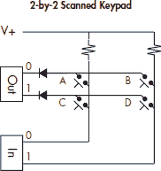

*图 10-1：2x2 键盘*

下面是扫描上述键盘的简单代码。

此代码很好地说明了事件序列，但如果你要扫描的行数超过几行，你可能想使用循环。

**开关抖动**

如果你将滚珠轴承扔到钢板上，它会弹起。开关的闭合也可以看作是两个金属部件相互碰撞。开关接触在闭合和打开时都会发生抖动。如果你扫描键盘太快，可能会错误地将抖动检测为新的开关闭合。开关抖动的时间取决于开关的物理特性，因此它们可能变化很大。你的开关制造商可以给你提供规格，但你应该确保自己测量抖动时间。避免开关抖动的一种方法是将键盘扫描速度放慢，但扫描速度放慢太多会使键盘显得迟钝。你可以通过保留最后几次扫描值的历史记录，并且仅在保存的值与当前值相同但不同时报告新的闭合，来使键盘更加灵敏并避免开关抖动。这是我们以下子程序中使用的技术，该子程序等待新的按键并返回键的 ASCII 值。

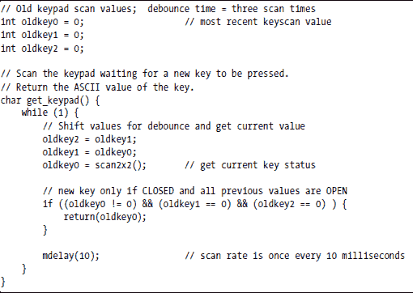

对于键盘的扫描速率保持恒定非常重要。可以在用户空间程序中进行键盘扫描，但你可能会发现扫描速率变化很大，并且程序使用的 CPU 比必要的多。如果你想在用户空间进行扫描，并希望获得准确的扫描时间，最好使用实时 Linux 内核，或者像我们在 Laddie 中做的那样：将键盘扫描放入简单的字符设备驱动程序中，以便 Linux 内核提供准确的扫描时间。

***LEDs***

使用 *发光二极管（LED）* 是从你的应用或设备向用户或开发者展示状态信息最直观、最容易、最便宜的方式之一。LED 有圆形或矩形的塑料封装，也有表面贴装芯片的形式。它们还有各种各样的颜色，红色、黄色和绿色是最受欢迎的。一些 LED 封装包含两个 LED 芯片，可以发出多种颜色；这些双色 LED 非常适合表示是或否的状态指示。如果你的应用需要 LED 易于可见，考虑使用边框或扩散器。在我们的警报应用中，我们使用带有边框的明亮 LED，这样当系统处于警报状态时，它就很容易被看到。

通常，每个 LED 都使用你的硬件的一个数字输出线。如果你有很多 LED（例如数字时钟上四位七段显示的 28 个段，例如），你可以像扫描键盘一样扫描 LED，如上所述。如果你需要扫描你的 LED，特别是如果它们是七段显示器，你应该使用设备驱动程序来确保扫描时序的精确性。

人眼会被运动所吸引，你可以在你的前面板设计中利用这一点。闪烁的 LED 比静态的 LED 更能吸引人的注意。颜色也可以给 LED 赋予意义，但色盲和各种颜色的文化关联使得过分依赖颜色来传达意义不是一个好主意。

一些流行的 LED 和 LED 硬件供应商包括：

+   Digi-Key, Inc. ([`www.digi-key.com`](http://www.digi-key.com/))

+   Jameco Electronics, Inc. ([`www.jameco.com`](http://www.jameco.com/))

+   Super Bright LEDs, Inc. ([`www.superbrightleds.com`](http://www.superbrightleds.com/))

***LCDs***

小型 *液晶显示器（LCD）* 是消费类设备的标准接口。你使用 LCD 的方式将取决于你的设备性质和客户的期望，但有几个原因说明为什么在设计时要包括 LCD：

**主要用户界面** 文本基础的 LCD 显示器可以是你的设备的主要用户界面。这通常是音频设备的情况，如卫星接收器和网络连接的音频播放器。

**可靠性** 网络设备通常需要安全访问配置和状态信息。虽然使用串行端口和 CLI 很常见，但高端网络设备通常在前面板上提供键盘和 LCD 进行配置。

**感知价值** 没有什么比 LCD（甚至更好的真空荧光显示器）更能区分一个米色的盒子与它的竞争对手，并让客户相信他们正在购买高端设备。

有两种常见的架构用于将 LCD 连接到电器。第一种是将 Linux 处理器直接驱动 LCD。这种架构适用于需要图形显示器的低成本、低功耗和高产量电器。这种架构的常见用途包括个人数字助理和手机。ARM 处理器家族的几个成员都支持片上 LCD 显示。例如，Cirrus Logic 的 EP9307 和 Atmel 的 AT91SAM926。第十一章描述了如何为内存映射图形显示器构建用户界面。

第二种常见的架构是 Linux 处理器通过连接到串行、并行或 USB 端口的控制器芯片来处理 LCD。这种架构适用于小批量生产和基于个人计算机主板的电器。

对于这种架构的 LCD，通常有一到四行文本，每行 10 到 40 个字符。这些显示器的最常见控制器芯片是广泛使用的 HD44780，最初来自日立，但现在可以从多个供应商处获得。基于 HD44780 的显示器通常具有并行输入，但许多都有提供串行或 USB 输入、键盘扫描和 LED 输出的子卡。一些带有子卡的显示器允许你在设备首次通电时编程闪存中的文本以显示。可编程的启动文本对于电器尤为重要，因为响应性对于成功的用户界面至关重要。带有子卡和闪存的显示器通常也具有可编程字符集，如果你想要显示标志或其他简单图形，这很有用。在本章后面当我们回顾 Laddie 的前面板硬件时，我们将有更多关于 HD44780 的讨论。

有几个网页和软件包支持 Linux 下的字母数字 LCD 显示器。两个你可能特别有用的网站是[`lcd4linux.sourceforge.net`](http://lcd4linux.sourceforge.net/)和[`lcdproc.org`](http://lcdproc.org/)。提供串行、并行或 USB 输入的字母数字 LCD 显示器可以从多个供应商处获得。以下是一些你可能想要考虑的供应商：

+   Scott Edwards Electronics, Inc. ([`www.seetron.com`](http://www.seetron.com/))

+   Crystalfontz America, Inc. ([`www.crystalfontz.com`](http://www.crystalfontz.com/))

+   Matrix Orbital, Inc. ([`www.matrixorbital.com`](http://www.matrixorbital.com/))

+   Cwlinux Limited ([`www.cwlinux.com`](http://www.cwlinux.com/))

+   Decade Engineering ([`www.decadenet.com`](http://www.decadenet.com/))

+   EarthLCD ([`store.earthlcd.com`](http://store.earthlcd.com/))

使用标准 I/O 端口并不会排除拥有图形显示器的可能性。例如，Decade Engineering 的 BOB-4 从串行端口接收命令和字符，并将输出到复合同步视频，而 EarthLCD 的 ezLCD 是一款具有 240×160 像素分辨率的彩色图形 LCD。

**设计前面板用户界面**

本节提供了一些关于如何构建前面板用户界面的技巧。我们将讨论为液晶显示屏构建菜单系统的各种方法，并提供一些想法，以便在用户开启设备后尽快使前面板响应。

***保持简单***

设备的主要目标是它能很好地完成一项任务。将你的产品称为设备意味着你承诺不会用用户不需要的功能和选项让他们感到不知所措。你的目标是使设备足够简单，以便新用户或非技术用户可以在几分钟内安装设备而无需阅读说明书。你可以通过设置合理的默认值并设计易于导航的 UI 来实现这一点。你仍然可以向技术熟练的用户提供所有配置选项，但你应该通过将其放入“高级选项”子菜单来隐藏这种复杂性。

你设备上最简单的用户界面应该是前面板上的按钮、LED 和 LCD。当你设计前面板时，考虑将一个按钮或 LED 分配给一个功能或状态。单按钮界面对于最常用的功能特别有用。

***尝试，失败，再尝试***

不要期望第一次就能设计出完美的前面板。准确预测哪种菜单流程和按钮标签对用户来说最直观是非常困难的。不要害怕通过向朋友和邻居展示你的设备原型并请他们导航菜单系统来消耗他们的好意。你可能需要构建和尝试几个前面板，才能为你的设备选择正确的那个。

我们发现了一些有助于这个领域的技巧。第一个是构建一个带有可互换纸面板的原型显示屏。安装纸面板，并请新用户执行特定任务。新用户导航菜单系统的速度和容易程度是我们选择 Laddie 最佳菜单布局的主要标准。图 10-2 显示了我们在原型设计 Laddie 前面板时使用的纸面板。

*图 10-2：带有纸面板的前面板*

另一种技术是认识到菜单系统是一个状态机，可以存储为表格。而不是在程序中硬编码状态和转换，构建一个包含状态、事件、下一个状态和要执行的处理过程的表格。然后将状态转换表存储在单独的文件中，并在 LCD UI 程序初始化时加载。

虽然没有什么能比使用真实的前面板硬件带来的用户反馈更好，但您可能会发现，您想从使用网页、Tcl/Tk 或使用 curses 库构建的字符界面来构建前面板的工作原型开始。您会欣赏在指定前面板硬件之前测试各种前面板设计的能力。前面板的网页或 Tcl/Tk 版本的一个优点是，您可以用它作为最终设备上的另一种类型的用户界面。例如，我们发现 Laddie 前面板的 curses 版本有时比 Laddie CLI 更容易使用且功能更强大，尽管两者都在 xterm 会话中运行。

Laddie 的前面板模拟器是用 curses、Tcl/Tk 和 JavaScript 结合 PHP 编写的。基于网页的前面板使用一个位于前面板硬件照片之上的图像映射。Tcl/Tk 版本如图 10-3 所示。

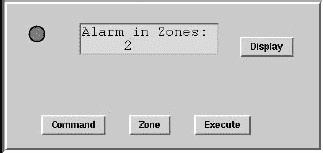

*图 10-3：使用 Tcl/Tk 实现的 Laddie 前面板*

***使用 LCD 菜单和模式***

如果您的设备有 LCD 显示屏，您可以在前面板用户界面中添加菜单和状态。在这个上下文中，*菜单*是一系列要选择的线性项目。这些项目可能是命令、配置设置或进入子菜单的路径。界面需要按钮，以便用户可以导航列表并选择所需的项目。为了避免构建一个像“迷宫一样曲折的通道，所有通道都一样”的菜单系统，最好用状态转换图来绘制菜单系统。尽量保持您的转换图正交，以便像上、下、左、右这样的方向有含义。许多 LCD 菜单系统将 LCD 显示屏视为一个窗口，可以看到状态转换图的一部分。一个为这种菜单结构制作的 Matrix Orbital LCD 组件如图 10-4 所示。

*图 10-4：一个典型的带有菜单导航按钮的前面板*

通过消除向上和向左按钮，并使向下和向右按钮从最后一个菜单选项回滚到第一个，您可以节省成本和前面板空间。当然，仍然需要某种类型的 Enter 按钮。

大多数基于 LCD 的用户界面在两种模式之一中运行：如果没有按按钮，则显示状态；如果按按钮，则显示菜单。例如，一些打印机有一个单行 LCD 显示屏，如果没有活动，则显示*Ready*；如果正在接收或打印，则显示*Printing*；如果按下任何按钮，则进入配置菜单。Laddie 有三种模式：一种用于显示状态，一种用于显示日志消息，一种用于显示配置更改和清除警报的菜单。

***迅速行动！***

经验法则表明，在打开设备后两秒内，前面板的用户界面应该能够正常工作。本节将讨论一些可以帮助你达到这一目标的常见技术。

**加快 Linux 引导速度**

有很多方法可以提高 Linux 的引导时间。一种技术是通过挂起和恢复来避免整个引导过程。一个*挂起*会将计算机的内存和状态复制到一个文件或磁盘分区。一个*恢复*会重新加载之前保存的内存。要在你的系统上设置挂起和恢复，构建一个带有软件挂起功能的内核，并将你的设备设置成你希望在开机后用户看到的那个状态。发出挂起命令（这可能是休眠、swsusp 或写入/proc，具体取决于你的系统）以将系统状态保存到交换分区。如果处理得当，交换分区上的挂起镜像实际上可以是你的设备上提供的软件。有一些可配置的脚本可以在挂起和恢复时运行，你可以修改这些脚本以重新启动网络连接和重置时钟。有关更多详细信息，请参阅[`www.suspend2.net`](http://www.suspend2.net/)上的*保持镜像模式*部分。务必阅读*保持镜像模式*部分的 HOWTO 部分。

软件挂起并不会提高内核本身的加载时间，但有一些技术可以实现这一点。例如，你可以构建一个没有模块支持且只包含所需的最小数量的设备驱动程序的内核。这可以减少加载模块所需的时间，并应该消除对初始 RAM 磁盘（initrd）的需求。如果你能够直接从 ROM 或闪存中执行内核，你可能甚至可以完全避免加载内核。这种技术被称为*原地执行（XIP）*。使用内核选项 quiet 来在引导过程中禁用 printk 消息可以节省几百毫秒。这些以及其他许多技术都在消费电子 Linux 论坛网站上进行了解释，网址为[www.celinuxforum.org](http://www.celinuxforum.org/)。

内核启动后，第一个运行的程序通常是/sbin/init，它执行/etc/rc.d/rc.sysinit 脚本。rc.sysinit 文件设置关键服务并启动其他 init 脚本。在消费类设备上，你可能需要用一到两个自定义脚本替换整个 init 脚本集。这可能是一项大量工作，但节省的时间可能非常可观。一个好的开始方法是使用内核选项 init=/bin/sh 引导系统，并逐个手动启动你的设备。尽可能快地运行按钮和 LED 用户界面，将非前面板程序推迟到初始化的末尾。如果可能，在后台启动程序，但要注意不要将必须在另一个程序启动之前完成的程序放入后台。Jimmy Wennlund 的 InitNG 包是一个流行的 init 脚本替代品，它针对更快的引导进行了优化。

如果上述技术不足以快速使前面板工作，你可能想在设计中添加一个微控制器。

**使用微控制器**

你可以使用微控制器来处理 UI 中的按钮、LED 和 LCD。微控制器是带有板上 RAM、ROM、CPU 和 I/O 的单芯片计算机。常见的微控制器包括 Microchip PIC 和 Atmel AVR。¹ 这些控制器是立即在启动后显示消息在 LCD 上以及使按钮和键盘响应的绝佳方式。让我们以 DVD 播放器为例。在开机后，用户通常会打开光盘托盘，插入光盘，关闭托盘，然后按播放。如果托盘机构直接连接到你的 Linux 系统，用户必须等待 Linux 启动才能开始上述过程。另一方面，如果你有一个微控制器处理托盘机构和打开按钮，你可以在 LCD 上立即显示*就绪*并使按钮可用。当用户打开托盘、加载光盘并按播放时，DVD 播放器的 Linux 部分可能已经完成了启动。当然，一旦 Linux 运行，它将想要直接控制托盘机构，将微控制器视为其外围设备之一。

**将主 CPU 用作微控制器**

添加微控制器会增加设备的成本、功耗和印刷电路板空间。一种替代方法是，在 Linux 启动时，从主 CPU 中划分出一部分作为微控制器使用。你可以修改引导加载程序来设置定时器中断，并使用中断处理程序提供前面板用户界面。你需要修改 Linux，使其在启动时不要触摸定时器或中断处理程序。一旦 Linux 运行，它可以接管定时器和中断，使前面板硬件只是它管理的另一个设备。这种技术描述了一种虚拟机（VM）的形式；随着它们的普及，你可能会发现 VM 提供了所有必要的钩子，可以作为 I/O 控制器使用。

**不要关闭**

使设备更响应的一种常见技术是永远不要关闭它。相反，你可以构建你的设备，当用户按下关机按钮时进入低功耗状态。低功耗状态可能包括降低 CPU 时钟速度并尽可能多地移除电源到外围设备。然而，你应该意识到，随着越来越多的消费者要求“关闭”意味着零功耗，这种方法已经不再受欢迎。

**提供反馈**

如果你不能快速响应，至少尝试给用户一个系统正在做什么的印象。不要害怕修改 Linux 内核以向 LCD 发送简化的启动状态消息。告诉用户正在发生的事情可以帮助他们忍受 Linux 的 10 到 20 秒的启动时间。

反馈不应仅限于启动过程。通过将以太网活动 LED 显示在前面板或让 LCD 显示旋转显示各种设备统计信息，为用户提供持续的反馈。务必清楚地、明确地指示错误条件。

**Laddie 前面板**

我们对 Laddie 前面板用户界面的要求是能够查看系统状态或日志消息，并且拥有管理系统的最小命令集。我们为 Laddie 的 LCD UI 设计了三种模式：状态、日志和菜单。*状态*显示报告是否有任何警报，*日志*模式显示最后两条日志消息，而*菜单*模式允许用户清除、测试、启用和禁用警报区域。有四个按钮用于导航菜单系统，一个闪烁的 LED 指示系统中的警报。

Laddie LCD UI 监听来自 logmuxd 的日志消息，并打开到警报守护进程（ladd）的 PostgreSQL/RTA 连接。到 ladd 的数据库连接用于配置更改和请求当前状态。图 10-5 中的图解说明了这些守护进程如何连接。

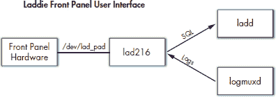

*图 10-5：Laddie 前面板 UI 架构*

我们的前面板使用并行端口来控制基于 HD44780 的 LCD（每行 16 个字符，共两行）和扫描一个 4 按钮、2x2 的键盘。框架由木材制成，一个纸制面板使得尝试不同的前面板标签变得容易。图 10-6 显示了一个显示区域 2 和 5 警报的前面板图片。

*图 10-6：Laddie 前面板的图片*

***Laddie LCD 菜单系统***

我们为 Laddie 前面板选择的菜单系统始终处于三种模式之一：状态、日志或菜单。如果你在阅读时能看到一个实际的操作，那么对 Laddie 菜单系统的描述可能更容易理解。如果你有一个运行 Laddie CD 的 PC，你可以使用位于 [`192.168.1.11/front_panel`](http://192.168.1.11/front_panel) 的基于 Web 的前面板模拟器。我们将只展示显示屏的文本，你可以想象它在实际显示屏上的样子。状态模式显示哪些区域（如果有）处于警报状态。

日志模式显示接收到的最后两条日志消息。警报系统日志消息由 logmuxd 重写和转发。它们包括事件发生的时间以及事件的描述。例如：

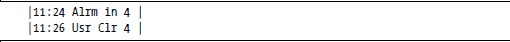

用户可以通过按 Display 按钮在状态和日志模式之间切换。程序启动时的默认模式是状态。

如果用户按下命令、区域或 Enter 按钮，显示屏将切换到菜单模式。进入菜单模式时，系统会保存先前的模式（状态或日志）。这使用户在退出菜单模式时可以返回到先前的模式。

菜单模式下显示的第一屏允许用户通过再按一个按钮来清除所有报警。显示内容为：

按下命令按钮的后续操作会在可用的命令之间循环。显示屏的顶部行不会改变；只有第二行会循环：

区域按钮将区域从 1 增加到 5，然后回到 1。

用户选择了一个命令和一个区域后，按下 Enter 按钮会将 SQL 命令发送到 LAD 守护进程以执行所需更改。发送命令后，菜单系统显示：

“命令已发送”信息显示约两秒钟，然后显示屏恢复到进入菜单模式之前保存的模式（状态或日志）。用户可以通过按显示屏按钮随时退出菜单模式，该按钮会恢复先前的模式（状态或日志）并回到该模式。此外，如果用户在约 10 秒内没有按任何按钮而放弃菜单会话，系统将超时并恢复到先前的显示（状态或日志）。

我们希望 Laddie 的简单菜单系统能给你一些关于在前面板菜单中包含什么的想法。

***Laddie 前面板硬件***

Laddie 前面板使用并行端口扫描 2x2 键盘，控制报警 LED，以及控制基于 HD44780 的 16 字符双行 LCD 显示屏。我们为键盘、LED 和数字显示屏提供了 Linux 2.6 字符设备驱动程序。

**原理图**

硬件原型前面板的接线图如图 10-7 所示。该电路的信号频率相对较低，因此可以使用绕线或点对点接线。没有任何组件值是关键的，显示的值应被视为指南，而不是要求。

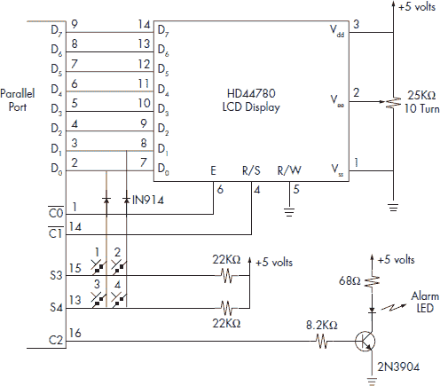

*图 10-7：Laddie 前面板原理图*

我们的原型使用第二个并行端口作为前面板。 (你可能记得，第一个并行端口被用于报警系统区域传感器。) 我们使用并行端口的数据线向显示屏输入字符。并行端口的两条控制线用于寄存器选择和写选通。并行端口的一条控制线控制报警 LED。两条数据线和两条状态线用于扫描四键键盘。根据你对扫描键盘工作原理的理解，你可能能够将五个区域开关添加到这个原理图中，将所有的 Laddie 硬件放在一个并行端口上。

**HD44780 显示控制器**

基于 HD44780 的字母数字显示器可以被视为一个迷你终端。像任何终端一样，你向它写入 ASCII 字符，它就会显示它们。这个终端的八位字符集包括可打印的 ASCII 字符，Katakana 字符集的一个子集，以及 16 个用户定义的字符。实际的字符集取决于你拥有的 HD4478 版本，但图 10-8 中显示的 Samsung KS0066U 的字符集相当典型。请注意，字符代码主要对应于 ASCII 码。例如，*A* 的代码是 0x41，这也是 *A* 的 ASCII 码。

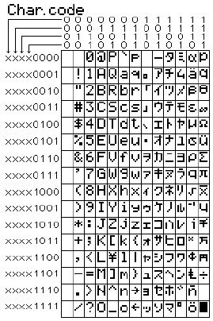

*图 10-8：典型的 HD44780 字符集*

**HD44780 命令集**

HD44780 显示器接受命令和字符。图 10-9 显示了 HD44780 的典型命令集。初始化命令可以清除显示，打开或关闭显示，并指定接口使用四位或八位。光标命令控制光标类型（块或下划线），光标是否可见，显示字符后光标或显示是否移动，以及移动是向左还是向右。其他命令允许你将光标移动到特定位置，以及读取和写入用户定义的字符发生器。

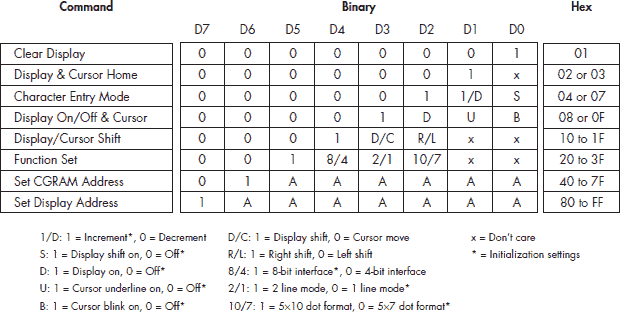

*图 10-9：HD44780 命令集*

我们对 HD44780 的初始化包括以下命令序列：

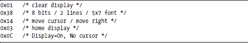

我们发现初始化后，我们使用的唯一命令是移动光标命令——我们只使用它将光标移动到顶部或底部行的第一列。

**向 Laddie 前面板发送命令和字符**

如果你想，你可以从 HD44780 读取状态和配置信息，但包括我们的设计在内的许多设计都将读/写引脚连接到地，使该部分只写。这节省了一个引脚（因为它不控制 R/W 线），并且维护任何必要的状态信息——例如光标位置——在控制软件中同样简单。

我们设计的 HD44780 有 10 个引脚连接到微处理器：八个数据线，一个引脚用于指定命令或字符数据（RS），以及一个用于通知 HD44780 新数据可用的选通引脚（E）。并行端口上的八个输出线直接连接到 HD44780 的八个数据引脚。如果你的硬件设计有更少的引脚，你可以配置该部分使用四线总线而不是八线总线。当然，这会将写入该部分所需的步骤数量加倍。

由于字符和命令都是 8 位长度，我们需要另一种方法来区分命令和数据。例如，考虑字节 0x20。这是空格还是配置命令？由于命令和字符都是 8 位，HD44780 使用另一个引脚，即 RS 引脚，来区分两者。你可以将 RS 引脚设置为 0 以表示命令，设置为 1 以表示字符数据。在设计设备驱动程序时需要决定的一个问题是如何控制这个引脚。

数据在 E 引脚从高到低的转换时传输到 HD44780。数据必须在 E 线变低之前至少有效半个微秒。实际的设置时间取决于 HD44780 的品牌及其振荡器频率。在我们的设备驱动程序中，我们使用 usleep()在将 E 线置低之前延迟两微秒。

相对于上面给出的原理图，写入 HD44780 的序列如下：

+   将字符或命令输出到数据寄存器。

+   将 RS 线置高或置低。

+   将 E 线置高。

+   等待两微秒。

+   将 E 线置低。

+   在写入下一个字节之前至少等待五毫秒。

HD44780 可能需要几个毫秒来执行某些命令。你可以读取显示的状态来告诉你何时写入下一个字节，或者你可以像我们一样，只需在写入之间至少等待五毫秒。确切的时间取决于你使用的 HD44780 版本。对于这本书，我们使用的是在二手市场上购买的显示器，因此我们不得不进行一些实验来找到正确的延迟。

**设计注意事项**

虽然基于 HD44780 的显示器可以被视为一个简单的 ASCII 终端，但在我们设计 API 和设备驱动程序时，我们需要做出一些决定。第一个决定是如何处理 RS 引脚。由于命令和显示字符都是 8 位长度，我们不能在同一个字节流中混合显示字符和命令。我们看到了三种解决这个问题的方法：我们可以使用 ioctl 发送命令，我们可以使用转义序列将命令隐藏在字符流中，或者我们可以为显示器使用两个不同的设备，一个用于字符，一个用于命令。我们选择使用转义序列。我们使用的 HD44780 没有 0x10 到 0x1F 范围内的显示字符，所以我们使用 0x10 作为 HD44780 命令的转义码，使用 0x11 作为控制前面板 LED 的命令的转义码。

我们在设计中的另一个考虑是如何处理写入之间的五毫秒延迟。我们本可以在写入之间放置一个 usleep(5000)，但这在更新我们显示屏上的所有 32 个字符时将是一个问题。（你可能还记得，编写设备驱动程序的全部原因是为了确保键盘的扫描速率。）我们通过将所有输出字节写入一个环形缓冲区，并在每次扫描键盘时从缓冲区中读取一个字节来处理五毫秒的延迟。这降低了我们输出字符的最大速率，但简单且有效。

我们编写的用于驱动我们显示屏的 Linux 设备驱动程序可在 CD 上找到。请在 front_panel 源文件下查找。

**进一步阅读**

HD44780 已经推出很长时间了，实际上已经不再可用。尽管如此，它为字母数字 LCD 显示屏设定了标准，并且 HD44780 兼容部件仍然可以从几家供应商那里获得。网络搜索将定位到几个 HD44780 兼容部件的数据表，包括我们使用的三星 KS0066U。

我们对 HD44780 的审查远未完成。如果你在考虑在你的设备上使用任何字母数字显示屏，你可能想利用我们使用的在线参考资料：

[**http://www.epemag.wimborne.co.uk/resources.htm**](http://www.epemag.wimborne.co.uk/resources.htm) 对 HD44780 的简单但完整的介绍

[**http://home.iae.nl/users/pouweha/lcd/lcd.shtml**](http://home.iae.nl/users/pouweha/lcd/lcd.shtml) 提供了 HD44780 接口的详细信息

[**http://www.eio.com/datashet.htm**](http://www.eio.com/datashet.htm) HD44780 兼容部件的数据表

***Laddie 前面板 UI***

在本章的前几节中，我们审查了 Laddie 前面板的需求、操作和硬件。在本节中，我们将查看实现前面板 UI 的软件。我们将讨论分为三个领域：前面板的软件、各种前面板模拟器以及两者共有的软件架构。让我们从共同的架构开始。

**UI 软件架构**

前面板软件使用事件驱动的状态机。事件包括按钮按下、定时器到期以及到达的日志消息，这些消息指示警报系统可能的状态变化。程序输出包括发送给 Laddie 守护进程的 SQL 命令、用于闪烁（或不闪烁）LED 的标志以及 LCD 上显示的文本。

*图 10-10：Laddie 前面板架构*

使用了几个状态变量。主要状态变量，命名为 State，没有想象力地表示了在 LCD 上显示的信息类型：状态、日志或菜单。还有用于简短 *命令已发送* 消息的状态，以及表示程序无法打开到 ladd 守护进程的 SQL 连接的状态。另一个状态变量 Curcmd 包含一个整数，指示当用户在菜单中时显示哪个命令。*命令* 按钮使 Curcmd 在五个可能的前面板命令之间循环。Zone 状态变量保存用于当前命令的区域号。Zone 按钮使 Zone 在五个可能的区域号之间循环。

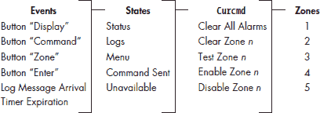

*图 10-11：前面板菜单系统中的事件和状态*

一旦你审查了前面板的操作，处理状态和事件处理的代码就相对容易阅读。状态机代码实现了两次——一次是用 C 语言为硬件和几个仿真器编写的，包括用 JavaScript 和 PHP 编写的基于 Web 的仿真器。

**lad216**

生成正确转义序列的 C 代码在 lad216 程序中。程序使用标准输入和输出，所以如果你构建了上面描述的硬件并安装了我们的 `/dev/lad_pad` 驱动程序，你可以使用以下命令将 lad216 程序与硬件连接起来：

lad216 </dev/lad_pad >/dev/lad_pad

代码分布在三个文件中：`main.c` 包含选择循环，`menu.c` 包含状态机，`lad216.c` 编码输出以在 lad_pad 硬件上显示。使用标准输入和输出使得将 lad216 连接到下面描述的各种前面板仿真器变得容易。

**前面板仿真器**

前面板仿真器是测试前面板设计而不实际构建它的好方法。与成品一起提供的前面板仿真器对于不想学习不同 UI 的最终用户来说尤其不错。

我们在为 Laddie 构建前面板仿真器方面有点过度，构建了一个使用 C 和 curses 的仿真器，一个使用 Tcl/Tk 和 X Window 系统的仿真器，以及一个使用 JavaScript 和 HTML 的仿真器。你可以根据你喜欢的编程语言选择要检查的仿真器。

curses 版本用 `cur216.c` 替换了 `lad216.c`，但仍然使用 `main.c` 和 `menu.c` 文件。你可以通过启动 Laddie CD 并通过 telnet 连接到设备来尝试 curses 前面板仿真器。`cur216` 可执行文件在默认路径中。

Tcl/Tk 版本，`x216.tcl`，基于 lad216 可执行文件，使用 Tcl/Tk 替换 lad_pad 硬件与 Tcl 等效。Laddie CD 不包括 X Window 系统，因此你无法在启动的 Laddie 设备上运行 `x216.tcl`。

你可以通过启动 Laddie 并将浏览器指向[`192.168.1.11/front_panel`](http://192.168.1.11/front_panel)来尝试基于网络的用户界面模拟器。index.html 文件应该打开一个窗口，显示我们实际的前端面板硬件的照片。按钮与图像映射相关联，并且以与真实系统上的按钮相同的方式操作。LED 可以是关闭状态的 LED 的静态图像，也可以是闪烁 LED 的动画 GIF 图像。LCD 的 HTML 使用 CSS 指定了一个相当大的等宽字体。

在网络模拟器中使用的技巧很简单，如果你自己构建一个前端面板的网络模拟器，可能会觉得它们很有用。为了说明这些技巧，让我们看看如何控制 LED 图像。在 HTML 中，我们指定图像的确切位置并给它一个名字，*led*。

JavaScript 代码使用 XMLHttpRequest()从与在设备上运行的 web 服务器相关联的 PHP 脚本请求警报状态。如果没有警报，返回的值是零。控制 LED 图像的 JavaScript 代码很简单。

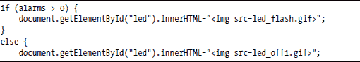

JavaScript 程序使用与上述描述完全相同的架构和状态机，并且它使用 XMLHttpRequest()而不是 select()来异步等待日志消息。在收到任何日志消息后，代码查询 ladd 以获取最新状态，并根据新的状态信息重新绘制网页。

**改进我们的设计**

Laddie 的前端面板可以通过几种方式改进。如果我们把 LCD 数据线从用于键盘扫描的两个输出线中分离出来，lad_pad 驱动程序可能会简化。分离它们将允许方便地使用一个第二定时器，专门用于 LCD 输出字符，这将使 LCD 对输出的响应更快。在驱动程序中的另一个改进是，如果字符没有发送到 LCD，可以从队列中取出多个字符。例如，如果字符是转义码或 LED 命令，就没有理由在字符之间等待 20 毫秒。

网络前端面板上的照片是我们构建的硬件。这有点反常。通常，你会在构建实际硬件之前先构建和测试基于网络模拟的版本。

基于网络的用户界面有一个更微妙的问题。它使用 XMLHttpRequest()等待到达的日志消息，并在收到一条消息后设置一个定时器以进行下一次请求。

setTimeout("GetLogMsg()", 100);

这种安排，无论计时器有多短，都会错过相邻到达的日志消息。你可以通过设置三个闹钟并一次性清除它们来看到这个问题的实际效果。日志显示将捕获清除第一个闹钟的日志，但会错过下一个两个中的一个或两个日志。主 Web 界面也有同样的问题，但通过编号日志消息来解决。在更新网页后，主 Web UI 中的 JavaScript 代码读取从 logmuxd 接收到的最后一条消息的 ID。如果网页中日志的 ID 不包含最新的日志消息，页面将使用最新的日志消息重新绘制。

**摘要**

在本章中，我们探讨了如何使用按钮、LED 和小型纯文本 LCD 构建有效的面板。我们了解到扫描键盘或 LED 阵列可以减少所需的 I/O 线数量，并且移动，如闪烁的 LED，可以吸引眼球并让用户知道设备正在运行。我们还注意到，你的设备被接受的程度可能取决于你多快让用户交互成为可能，以及用户如何容易地导航你的菜单系统。

我们审查了 Laddie 的前面板设计，包括其菜单系统、硬件、UI 软件以及各种前面板模拟器。我们的硬件设计包括一个 HD44780 显示屏和一个 2x2 键盘。我们 2.6 字符设备驱动程序 lad_pad 的源代码在 CD 上，可能是一个很好的内核模块的入门介绍。

UI 菜单系统被实现为一个状态机，并且实现了两次。第一次实现，使用 C 语言，使用标准输入和输出，以便它可以连接到 Tcl/Tk 模拟器或真实的面板。第二次实现使用 JavaScript 和图像映射来处理前面板按钮，并使用 XMLHttpRequest()接收异步日志消息。

__________________

¹ 你可以使用 Linux 工作站上的 C 语言编程 Atmel AVR。更多信息请见[www.avrfreaks.org](http://www.avrfreaks.org/)。

² 你可能需要设置终端类型，因为 telnet 不会为你设置。我在我的桌面上使用 xterm，所以当我 telnet 到 Laddie 设备时，我使用命令 export TERM=xterm 来设置终端类型。
