**设计缓冲区接口**

如果你决定向你的设备添加图形用户界面（GUI），你将面临以下挑战。一方面，你的设备图形硬件由低级命令控制，这些命令操作视频内存。另一方面，你的用户不想操作视频内存；他们想操作高级对象，如菜单和按钮。为了构建用户想要的界面，你将使用一组称为 *图形堆栈* 的软件层。

用于 Laddie 设备的图形堆栈如图 11-1 所示。Linux 缓冲区设备驱动程序为图形硬件的视频内存提供了一个低级但统一的接口。图形库提供了操作点、线、图像和文本的支持。GUI 工具包提供了小部件并管理设备 GUI 的用户输入。

在这里，我们将展示我们用来设计 Laddie 缓冲区帧 UI 的图形堆栈层。但首先，我们将简要回顾视频内存的工作原理，因为这会使本章的其余部分更容易理解。

*图 11-1：图形堆栈*

本章我们将涵盖以下主题：

+   视频内存的工作原理

+   Linux 缓冲区设备驱动程序

+   图形库

+   使用 Simple DirectMedia Layer 的“Hello, world!”

+   图形 UI 工具包

+   Laddie 缓冲区帧 UI

**视频内存的工作原理**

从编程的角度来看，图形硬件最重要的部分是视频内存。软件通过操作这个视频内存来创建图形图像，硬件则解释这个内存以在显示上渲染图像。在我们能够有效地显示文本或图形之前，我们需要了解视频内存中的字节是如何被解释的，以及它们是如何按顺序映射到显示上的。

***视频内存中字节的解释方式***

要理解硬件可以如何解释视频内存的不同方式，记住内存在历史上一直是一种昂贵的资源是有用的。许多最早的计算机不显示任意图形；相反，它们将视频内存的每个字节解释为单个字符（见图 11-2）。一个字符可能被绘制为一个 7x9 像素的图像，这将非常高效——一个字节可以表示 63 个像素，2KB 的内存可以支持 32 行，每行 64 个字符的显示。然而，只能渲染文本，并且一次只能显示 256 个不同的字符。

顺便提一下，我们可以将字符图形视为一种图像压缩形式。在可显示的文本“图像”中出现的重复像素模式数量少于 256，因此我们可以使用单个字节来编码每一个。所有其他像素模式出现的频率为零，因此根本不进行编码。

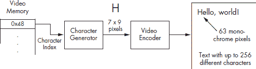

*图 11-2：字符图形*

通过增加内存，显卡可以为每个像素分配一个比特。这创建了*单色*图形，如图 11-3 所示。尽管这种方法在使用字符图形时需要大约八倍的记忆增加，但它消除了字符集的所有限制。它支持所有字体、样式和大小，甚至可以像罗马字符一样轻松地显示日文假名。

*图 11-3：单色图形*

如果我们为每个像素分配一个完整的字节，我们有一些选择。对于单色显示器，图形硬件可以设计成产生 256 种不同的强度（*灰度*）级别。这对于使用*抗锯齿*渲染文本是合适的，其中使用灰色阴影来软化锯齿边缘。

或者，我们可以使用每个像素的字节来表示 256 种不同的颜色之一。在这种方法中，称为*伪彩色*，图形硬件维护一个 256 个条目的颜色表，称为*调色板*或*颜色映射表*。调色板中的每种颜色通常由三个字节表示，每个字节分别代表红色、绿色和蓝色的强度级别。这种方法在图 11-4 中得到了说明。在这个例子中，显示图像中的第一个像素由值 0x3F 表示，它索引一个包含红色、绿色和蓝色强度级别的 3 字节条目，这些级别对应于一个带有绿色点缀的浅蓝色像素。

正如字符图形的情况一样，我们可以将伪彩色视为一种压缩形式，这是由节省内存的需求驱动的。要使用伪彩色显示图像，我们选择 256 种最重要的颜色，并用一个字节来表示每种颜色，忽略所有其他颜色。

使用更多的内存，我们可以为每个像素分配两个或三个字节，并直接表示红色、绿色和蓝色的强度级别，而不使用查找表。例如，使用两个字节（*高彩色*），我们可以为红色分配 5 位，绿色 6 位，蓝色 5 位。这可以在图像中支持超过 65 千种颜色，但仍然有限。例如，它只支持 2⁵ = 32 种不同的灰色阴影。

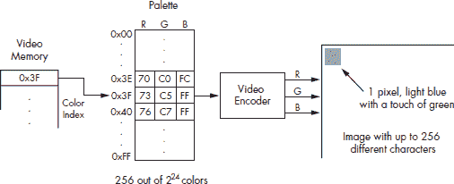

*图 11-4：伪彩色图形*

三字节的情况，每个颜色分别用一字节表示，如图 11-5 所示。这被称为*真彩色*，因为它能够以接近照片质量表示图像。

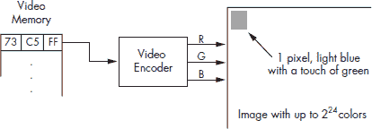

*图 11-5：真彩色图形*

***视频内存如何映射到显示**

如果显卡提供的视频内存大小（以像素为单位）与显示器相同，那么视频内存像素和显示器像素之间的映射就很简单：视频内存的第一个像素对应于显示器左上角的像素，接下来的像素从左到右、从上到下映射，就像我们阅读英文页面一样。用数学方式表达：

*像素在(x, y)处的地址 = 视频内存地址 + (y*xres + x)*pix_width*

其中*xres*（*x*分辨率）是行中的像素数，*pix_width*是像素中的字节数。

但内存不再是曾经的关键资源，现在图形硬件通常提供的视频内存比填充显示所需的要多。在利用这部分额外内存的一种方法中，我们可以将可用的视频内存视为对应于一个虚拟显示。可见的显示区域太小，无法一次性显示所有虚拟像素，但我们可以左右或上下平移可见显示，以显示我们感兴趣的虚拟显示的任何部分。这种情况在图 11-6 中得到了说明。如果我们想在可见显示中找到位置(*x*, *y*)处的像素的内存地址，我们必须考虑像素在虚拟显示中的位置。如果可见显示向右平移*xoffset*像素和向下平移*yoffset*像素，那么我们像素的虚拟位置是(*x*+*xoffset*, *y*+*yoffset*)。如果*line_length*是虚拟行的长度，那么，应用前面的公式，我们有一个内存地址为：

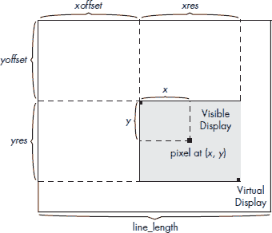

*图 11-6：虚拟和可见显示*

如果我们想在可见显示上渲染一个对象，我们可以使用这个公式来确定在视频内存中要操作哪些字节。在本章的剩余部分，我们将探讨允许我们在软件中有效操作视频内存的层。

**Linux 帧缓冲区设备驱动程序**

Linux 以与它提供对大多数其他设备访问相同的方式提供对视频内存（也称为*帧缓冲区*）的访问——通过设备文件。帧缓冲区设备文件是/dev/fb0，并且与其他文件一样，我们可以使用 open、read、write 和 close 系统调用来访问文件中的数据。你可以从它们的 man 页面（例如，执行 man 2 write）中了解更多关于这些系统调用的信息。大多数访问文件的系统调用都使用一个小整数，称为*文件描述符*。系统调用 open 是一个例外；它使用文件路径返回一个文件描述符。

***使用 open、read、write 和 close 操作帧缓冲区***

由于这种设备文件接口，使用一些简单的 Unix 命令来练习帧缓冲区变得很容易。在此阶段，我们建议你启动 Laddie CD 并亲自尝试这些命令。（你也可以在自己的系统上尝试这些示例。如果你需要帮助设置帧缓冲区，请参阅附录 C。）

启动 Laddie CD 后，等待帧缓冲区 UI 加载，然后按 ESC 键获取登录提示。使用空密码以 root 身份登录。现在执行以下命令：

在第一行中使用的`cat`命令调用了 open、read 和 close 系统调用来在单独的文件中复制帧缓冲区。第二行清除控制台显示。在第三行中，重定向调用了 open、write 和 close 系统调用来用原始内容替换控制台显示的内容。结果可能令人困惑，因为光标位置将不再与显示匹配（你可以使用另一个`clear`命令来清理显示）。然而，这个实验说明了，对于`cat`命令来说，帧缓冲区只是另一个文件。

如果你的图形适配器有大量的视频内存，第一个`cat`命令可能需要一段时间（并在/tmp 中产生一个大的文件）。如果第一个命令（`cat /dev/fb0 > /tmp/screen`）立即返回

cat: /dev/fb0: 没有这样的文件或目录

你需要使用`mknod`来创建`/dev/fb0`设备文件。通过运行以下命令来完成：

laddie:~# mknod /dev/fb0 c 29 0

如果命令`cat /dev/fb0 > /tmp/screen`产生错误

cat: /dev/fb0: 没有这样的设备

帧缓冲区设备驱动程序未成功加载。再次，如果需要帮助设置帧缓冲区设备，请参阅附录 C。

**注意**

*在本章的剩余部分，我们将假设你已经有一个正常工作的帧缓冲区。*

要实验像素数据与屏幕上显示内容之间的关系，尝试以下任何命令：

每个命令成功完成后（对于大帧缓冲区可能需要一段时间）你应该看到以下错误：

cat: 写入错误：设备空间不足

你看到这个错误是因为你试图将无限数量的位数据输入到有限内存中。每次实验后，输入命令`clear`以恢复控制台。

使用 ioctl 命令配置帧缓冲区

在我们迄今为止的实验中，我们操作了视频内存，而没有考虑像素数据的解释方式。图形硬件解释视频内存的方式由帧缓冲区配置数据决定，这还包括视频内存的物理地址、屏幕分辨率（虚拟和可见）、可见屏幕相对于虚拟屏幕的位置，以及本章范围之外的时间和其他信息。要访问视频模式，我们需要一个额外的系统调用 ioctl，它允许我们访问或修改设备的参数。

ioctl 系统调用需要一个设备文件描述符和一个表示请求的整数（有关详细信息，请参阅 ioctl 手册页）。在帧缓冲区的情况下，可能的 ioctl 命令列在`/usr/include/linux/fb.h`头文件中，包括以下命令：

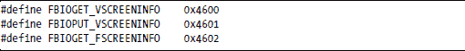

前两个 ioctl 请求允许我们检索或更新可变帧缓冲区参数，第三个请求允许我们检索固定帧缓冲区参数。可变参数总结在以下数据结构中（省略了一些字段），来自 fb.h 文件：

在很大程度上，从标识符中应该可以清楚地看出，这个数据结构中的字段如何对应于我们在第 170 页“视频内存工作原理”一节中讨论的概念。fb_bitfield 结构描述了当像素位直接用于指定颜色强度时（如在真彩色模式下）如何解释这些位。

对于 Laddie 设备，我们没有必要修改可变帧缓冲区数据。实际上，我们使用的 VESA 帧缓冲区驱动程序在系统启动后不支持轻松修改。如果您使用非 VESA 帧缓冲区并且需要在运行时修改其配置，请参阅 fbset 实用程序的文档。

固定帧缓冲区配置参数由以下数据结构提供（省略了一些字段），也在 fb.h 文件中：

我们将在这里使用的主要字段是 visual，它指定了像素的解释方式（例如，单色、伪彩色或真彩色），以及 line_length，当我们在视频内存和显示之间计算映射时需要它。

最后，以下 ioctl 请求允许我们检索或更新使用一种视频模式的调色板（颜色图例）。

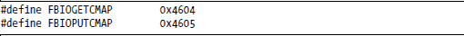

在下一节中，我们将展示如何更新颜色图例的示例。

到目前为止，我们可以确定像素数据的解释方式，因此我们也可以以有意义的方式更新帧缓冲区内存。我们可以使用 write 系统调用，就像 cat 实用程序一样，但每次帧缓冲区更新都进行系统调用太昂贵了。一个更好的方法是使用不同的系统调用：mmap。mmap 系统调用接受我们的帧缓冲区的文件描述符，将帧缓冲区内存映射到我们进程的虚拟地址空间，并返回指向该内存开始的指针。有了这种映射，更新帧缓冲区就像写入内存一样简单。

总结来说，为了有效地操作帧缓冲区，我们打开适当的设备文件，使用 ioctl 命令建立图形硬件配置，使用 mmap 提供对像素数据的简单访问，并为我们应用程序写入适当的像素数据。

***帧缓冲区的简单图形程序***

在本节的剩余部分，我们将通过编写一个简单的图形程序来展示 Linux 帧缓冲区接口。我们的程序 hazy_moon 将显示一个直径为 240 像素的磁盘，从顶部明亮的青色渐变到底部的模糊红色。我们心中的图片，以灰度渲染，如图 11-7 所示。我们的程序将展示颜色映射的使用，并快速直观地指示我们是否正确配置了帧缓冲区。

*图 11-7：模糊的月亮*

该程序的完整源代码位于 Laddie CD 上的 /Code/src/examples/hazy_moon 目录中。在阅读本节剩余内容之前，我们建议构建并运行该程序。启动 CD 并登录后，切换到程序目录，输入 **make**，然后输入 **./hazy_moon**。你应该会看到中间的磁盘以及围绕可见屏幕的浅蓝色边框。如果你看不到所有的边框线，尝试调整你显示器上图像的宽度和高度。要返回原始虚拟终端，使用 ctrl-alt-F1。如果图形虚拟终端的尺寸不是你预期的，尝试在 bash 提示符下输入 deallocvt 命令来释放未使用的终端资源，然后再次运行测试程序。

**注意**

*当使用 Laddie CD 时，您可以使用 vim 或 less 查看源文件。如果您不熟悉 vim 编辑器，可以使用命令* man vim *或* vimtutor *。*

现在我们将讨论 hazy_moon 程序的细节。第一个细节需要一点关于虚拟终端的工作知识。

**图形虚拟终端**

Linux 的一个优点和挑战是它使用帧缓冲区来处理文本控制台。这种使用帧缓冲区的方式是一个优点，因为它支持彩色文本和广泛的字体和字符集。然而，以这种方式使用帧缓冲区也带来挑战，因为在开发帧缓冲区应用程序时，很容易遇到 Linux 管理控制台的机制。

例如，一个将单行消息打印到控制台的程序可以修改可见显示相对于虚拟显示的位置；结果是显示的图形被该行的宽度所错位。或者，如果图形硬件配置为使用调色板，并且如果程序修改了用于在控制台显示文本的颜色，打印的消息可能难以阅读甚至看不见。

由于这些原因，最好为图形显示使用单独的虚拟终端。我们在 hazy_moon 程序中通过以下几行代码实现这一点。

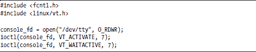

注意我们正在使用熟悉的 open 和 ioctl 系统调用，尽管在这种情况下，它不是用于 framebuffer。第一个调用（console_fd = open("/dev/tty", O_RDWR);）打开控制台设备；第二个调用（ioctl(console_fd, VT_ACTIVATE, 7);）请求切换到虚拟终端 7；第三个调用（ioctl(console_fd, VT_WAITACTIVE, 7);）等待切换完成。（我们选择虚拟终端 7，因为我们的系统使用 1 到 6 的终端作为控制台。）

**open**

现在我们使用 open 系统调用在 framebuffer 设备文件上，指定设备文件为读写。

fb_fd = open("/dev/fb0", O_RDWR);

函数 open 在错误时返回-1；否则，它返回一个整数文件描述符，我们将使用它来为该设备进行后续的系统调用。

**注意**

*open*系统调用返回一个错误值，应该被处理。我们在这里不会讨论错误处理，但你可以通过查看 hazy_moon.c 文件中的完整源代码来了解我们是如何处理错误的。

**ioctl**

使用 framebuffer 的文件描述符，我们可以进行 ioctl 调用以检索 framebuffer 的固定和可变配置数据。

在更新显示之前，hazy_moon 调用两个辅助例程来显示固定和可变数据。当你试图调试或简单地理解 framebuffer 应用程序时，这些信息可能很有用。

display_fb_fixed_info(&fixed_info);

display_fb_var_info(&var_info);

如果你之前运行过程序，当你从启动程序的虚拟终端返回时，你会看到这个输出。输出会特别显示，我们的显示屏幕是 640×480，每个像素有 8 位，我们的视觉类型是伪彩色。

以下代码首先使用辅助函数 new_fb_cmap 创建一个新的调色板，该函数定义在附带的文件 colormap.c 中。然后程序使用 ioctl 调用复制 framebuffer 中的当前值，并更新条目以提供从青色到深红色的渐变。最后，程序使用第二个 ioctl 调用使用新的调色板更新 framebuffer。

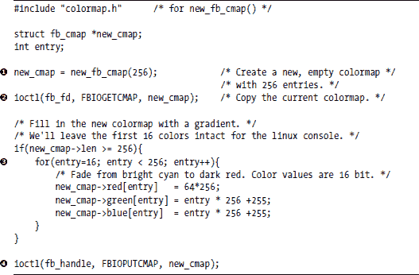

mmap 的第一个参数是 0，表示 mmap 将选择 framebuffer 映射的位置。fixed_info.smem_len 的值是 framebuffer 的长度。我们指定 framebuffer 可以读取或写入，使用 PROT_READ|PROT_WRITE，并使用 MAP_SHARED 来指示对这个内存区域的更改将传播到实际的 framebuffer。打开的 framebuffer 设备的文件描述符是 fb_fd，我们指定偏移量为 0，因为我们想映射整个 framebuffer。

如果这个调用成功（再次，请参阅 CD 上的源代码以了解错误处理），frame 将指向 framebuffer 内存的起始位置。

**写入像素数据**

既然我们已经有了颜色映射表和将像素放置在屏幕上的方法，我们可以编写一个简单的图形程序。以下代码将创建承诺的 240-by-240 像素的模糊月亮，以及围绕显示边界的单像素边界。

正如我们在图 11-6 中所示，可见显示可能只是可用帧缓冲区内存的一个子集。我们首先使用帧缓冲区设备的变量信息中的 xoffset、yoffset 和 line_length 值找到显示内存的起始位置，即 visible_frame。在接下来的代码中，我们计算相对于 visible_frame 的内存偏移量，因此不再需要 xoffset 或 yoffset。然而，每次我们计算多行偏移量时，都必须一致地使用 line_length。

**清理**

在这个阶段，我们可以清理并退出程序。

munmap(frame, fixed_info.smem_len);

free_fb_cmap(new_cmap);

这个程序旨在作为一个简单的演示；要构建一个有用的帧缓冲区接口，需要做更多的工作。例如，我们还没有讨论显示文本或响应键盘输入，我们也没有编写在屏幕变暗后恢复屏幕或消除左上角光标的代码。我们可以编写代码来解决这些问题，但实际上，这些问题已经被在帧缓冲区接口之上工作的图形库解决了。在下一节中，我们将考虑两个图形库的选择，并使用其中一个进行示例，即简单直接媒体库（Simple DirectMedia Library）。如果您还想花更多时间掌握帧缓冲区接口，请参阅头文件/usr/src/linux/include/linux/fb.h 以及目录/usr/src/linux/Documentation/fb 中的文档文件。

**图形库**

使用 Linux 帧缓冲区接口，我们将显示上像素操作的问题简化为写入内存的字节问题。但考虑一下我们想要操纵显示像素的一些方式：绘制指定厚度的线条，绘制边缘圆润且具有三维效果的窗口，传输图像，或者用给定的字体和大小绘制文本。这些都是非平凡的问题；这就是为什么我们需要图形库。有了合适的图形库，我们可以编写操作线条、窗口、图像和文本的程序，并让底层库决定如何处理像素。

在 Linux 中操作图形对象最常见的库是 Xlib。实际上，Xlib 不仅仅是一个图形库；它是客户端访问 X Window 显示服务器的接口。特别是，它还管理用户输入事件。由于其流行，在 X 之上构建 Linux 设备可能是一个不错的选择。Xlib 直接编程比较繁琐，但有了 X 系统，UI 开发者可以在几个竞争的 GUI 工具包（例如，被 KDE 桌面使用的 Qt，或被 Gnome 桌面使用的 GTK+）之间进行选择。或者，UI 开发者可以在设备上包含基于 X 的网页浏览器，并将 UI 作为一组网页提供。在任何这些情况下，设备的 UI 开发与 Linux 桌面上的 UI 开发几乎没有什么不同。

另一方面，X Window 系统复杂且提供了在设备上通常不需要的功能。由于 X 是网络导向的，它涉及 Xlib 和 Xserver 之间的一个额外网络层。X 集成了对多屏显示和多个客户端的支持，并且它还提供了不由客户端应用程序控制的窗口管理功能。这些是分布式网络环境中的不错特性，但它们的复杂性使得 X 成为内存和存储预算紧张的设备上的昂贵选择。如果你有资源限制但仍然想使用 X，你可能想调查 TinyX，它被描述为“专为特别小巧设计的 X 服务器家族”，详情请见[`XFree86.org`](http://XFree86.org)。关于 Xlib 的更多信息，请参阅 Adrian Nye 所著的《*Xlib 编程手册*》（O’Reilly，1994 年）。维基百科上也有关于 X 的几篇文章，例如[`en.wikipedia.org/wiki/Xlib`](http://en.wikipedia.org/wiki/Xlib)。

另一个图形库的选项是*简单直接媒体层（SDL）*，这是一个最初为开发和移植游戏而设计的多媒体库。像 Xlib 一样，SDL 是跨平台的，它管理用户输入以及图形。与 Xlib 不同，SDL 仅提供对管理窗口的最小支持。它具有小巧的体积；SDL 的库（包括用于 TrueType 字体的 SDL_ttf）大约占用 330KB，去除了未使用部分。

由于其简单性（我们不需要窗口支持），我们选择了 SDL 作为 Laddie 设备的图形库，我们将在下一节中通过一个简单的示例来展示这个库。关于 SDL 的更多详细信息，特别是关于多媒体支持，请参阅 John R. Hall 所著的《*Linux 游戏编程*》（No Starch Press，2001 年）。SDL 网站([`www.libsdl.org`](http://www.libsdl.org/))也提供了 SDL API 的良好文档。我们使用了 SDL_ttf 库作为 TrueType 字体的包装器，这又需要从[`www.freetype.org`](http://www.freetype.org/)获取 FreeType 包。有关文档链接，请见[`www.libsdl.org/projects/SDL_ttf`](http://www.libsdl.org/projects/SDL_ttf)。

**“使用 SDL 的‘Hello, world！’**

为了介绍 SDL，让我们通过一个简单的程序来显示*Hello, world!*，监控键盘，并在按下空格键时优雅地退出（见图 11-8）。

这个程序位于 Laddie 光盘上；在查看细节之前，我们建议构建并运行程序。启动 Laddie 光盘，在帧缓冲区用户界面加载后，通过按 ESC 键退出。

*图 11-8：“Hello, world!”使用 SDL*

**注意**

*重要的是确保帧缓冲区没有运行，因为它会干扰我们的当前示例。顺便说一句，如果你在启动光盘时帧缓冲区用户界面没有自动启动，你可能遇到了帧缓冲区的问题。在这种情况下，请参阅附录 C 以获取帮助。帧缓冲区用户界面显示如图 11-10 所示。*

以空密码登录 root，切换到 sdl_hello 目录，然后构建并运行程序。

laddie:~# cd /Code/src/examples/sdl_hello

laddie:~# make

laddie:~# ./sdl_hello

你应该看到图 11-8 所示的显示。当你按下空格键时，显示将消失，你将回到命令提示符。在本节的剩余部分，我们将展示如何实现 sdl_hello 程序。

我们程序使用一个主函数，包括五个步骤：初始化库、初始化帧缓冲区、创建一个*表面*（SDL 对像素矩形区域的术语）、显示表面和处理事件。正如我们之前的示例，我们这里不会展示错误处理。请参阅光盘上/Code/src/examples/sdl_hello 目录中的 sdl_hello 程序的源代码以获取示例错误处理代码。

***初始化库***

以下是我们示例程序中初始化 SDL 和 SDL_ttf 库的行。

SDL 支持多个子系统，包括 TIMER、AUDIO、VIDEO、CDROM 和 JOYSTICK，我们在调用 SDL_Init()时选择这些子系统。（在本章中，我们只会使用 VIDEO 子系统。）为了显示文本，我们初始化 SDL 对 TrueType 字体的支持。对 atexit()的调用提供了在程序退出时调用的函数（SDL_Quit 和 TTF_Quit）；它们确保 SDL 在程序结束时干净地退出。

***初始化帧缓冲区***

为了配置帧缓冲区的分辨率和每像素位数，我们使用函数 SDL_SetVideoMode。

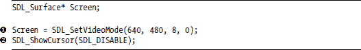

当所需的视频模式不可用时，SDL 将进行模拟；然而，我们将保持简单，并选择与大多数图形适配器原生兼容的模式：640 x 480，每像素 8 位。传递给 SDL_SetVideoMode 的最后一个参数提供了用于视频内存或系统内存、是否支持双缓冲以及是否支持 OpenGL 等功能的标志。对于我们的目的，默认设置就足够了。返回值， 屏幕具有 SDL_Surface 类型。这些表面代表像素的矩形集合，并具有高度、宽度、像素格式、扫描行长度、裁剪矩形，当然还有实际的像素数据。屏幕表面是特殊的，因为它直接对应于显示内存。但表面也可以代表任何图形对象，例如图像或文本。在本章的示例中，我们将从位图或通过渲染文本创建图形对象，但也可以创建一个空表面，然后直接操作其像素数据。

在设置视频模式后，我们 调用 SDL_ShowCursor 函数来隐藏光标，因为我们不使用鼠标进行输入。

***创建表面***

要创建一个文本对象，我们需要打开一个字体，然后将文本渲染到创建一个表面。

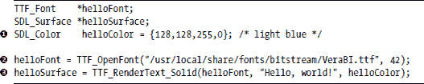

 TTF_OpenFont() 函数需要一个 TrueType 字体文件的路径名和字体大小。 TTF_RenderText_Solid() 函数使用一个字体、一个文本字符串和一个颜色来创建一个表面。一个 SDL 颜色由红色、绿色、蓝色和 alpha 通道的四个 16 位值组成。alpha 通道值用于混合半透明表面，在伪彩色图形中使用时不实用；我们在此章中不会进一步考虑它。

由于字体受版权保护，您在选择应用程序中的字体时需要考虑一些问题。对于 Laddie CD，我们选择了自由许可的 Bitstream Vera 字体，与 GNOME 基金会相关联（可在 [`www.gnome.org/fonts`](http://www.gnome.org/fonts) 获取）。这些包括等宽和比例间距字体、有衬线和无衬线、正常、斜体、粗体和粗斜体。这些字体可能已经安装在了您的系统中的 /usr/X11R6/lib/X11/fonts/truetype 目录下。

***显示表面***

显示渲染的文本与在 SDL 中显示任何其他对象没有区别：我们只需将表面（即屏幕表面）复制（传输）到屏幕上。

 SDL_BlitSurface 函数接受一个源表面，一个指定此表面子集的矩形（NULL 表示整个表面），一个目标表面，以及一个矩形，其*x*和*y*值指示源放置的位置。SDL_BlitSurface 函数根据目标更新部分填充目标矩形的宽度和高度值。我们使用这个矩形通过 SDL_UpdateRects 函数更新屏幕表面。

***处理事件***

到目前为止，我们已经显示了*Hello, world!*消息。现在我们需要监控键盘，并在按下空格键时退出。

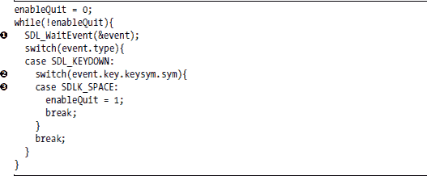

对于“Hello, world!”应用程序，这段代码可以简化，但以这种形式，它代表了使用 SDL 处理事件的通用方法。 SDL_WaitEvent 函数会挂起主线程，直到发生事件。事件变量具有联合类型，对应于十几个 SDL 事件，包括键盘、鼠标和用户定义的事件。SDL 还区分按键和按键释放。在键盘事件的情况下，我们可以使用 event.key.keysym.sym 字段来检查特定的键，它可以取如 SDLK_SPACE, SDL_TAB, SDLK_0, SDLK_a 等值。

**图形用户界面工具包**

虽然 SDL API 比帧缓冲区接口更容易使用，但它本身并不是开发 GUI 的方便库。SDL 支持事件处理和图形，但两者仅松散耦合。在构建 GUI 时，我们使用显示和输入机制固有连接的对象。例如，包括滚动条、下拉菜单和文本输入表单。GUI 工具包通过提供这些对象（*小部件*）的集合来支持 GUI 开发。图 11-9 说明了小部件、用户和底层应用程序之间的关系。

*图 11-9：一个典型、功能齐全的小部件*

用户输入事件（例如，鼠标移动或按键），通过初始化回调函数来更新小部件并控制底层应用程序。应用程序可以通过调用小部件的函数来控制小部件或与其交换数据。

除了提供小部件外，GUI 工具包还提供了一个管理它们的框架。该框架通常建立在窗口管理器之上。它路由事件，确定哪个小部件具有焦点，并确保重叠的小部件适当地显示。

Linux 上最流行的两个 GUI 工具包是 GTK+ ([www.gtk.org](http://www.gtk.org/)) 和 Qt ([`www.trolltech.com`](http://www.trolltech.com/))；如果你选择其中之一，你的决定可能取决于成本和许可。GTK+在更自由的 LGPL 许可证下发布，允许你将你的专有软件链接到 GTK+库。Qt 可能根据 GPL 许可，但这要求你的 GUI 应用程序也必须在 GPL 下发布。要在 Qt 上构建专有应用程序，你需要向 Trolltech 支付商业许可证费用。

如果你的应用程序将根据 GPL 许可，或者钱不是问题，还有其他差异需要考虑。GTK+是用 C 编写的，尽管它具有许多面向对象的功能。Qt 是用 C++编写的。它们都有广泛的用户基础：GTK+是 Gnome 桌面的基础，Qt 是 KDE 桌面的基础。

如果你在你的设备上没有使用 X，Qt 也支持 Linux 帧缓冲区。有人使用 DirectFB 对 GTK+的帧缓冲区后端进行了工作，DirectFB 也是在 LGPL 下发布的。有关更多信息，请参阅[`www.directfb.org/wiki/index.php/Projects:GTK_on_DirectFB`](http://www.directfb.org/wiki/index.php/Projects:GTK_on_DirectFB)。

快速轻量工具包（FLTK；[`www.fltk.org`](http://www.fltk.org/））是一个很有前景的选择，如果你希望比 GTK+占用更小的空间，但仍然愿意采用 X。FLTK 是为紧密、静态链接的应用程序设计的，并且其修改后的 LGPL 许可证允许在专有应用程序中进行静态链接。它使用 C++编写，并支持 Linux 以外的 Windows。

我们在这里不会进一步讨论流行的 GUI 工具包；它们在其他地方有很好的文档。实际上，对于 Laddie 设备，我们发现这些工具包提供了我们不需要的大量功能，并且由于它们面向鼠标和键盘，它们没有很好地匹配我们使用简单、手持遥控器的方法。在本节的剩余部分，我们将描述 STBmenu，这是一个基于 SDL 的薄层，我们考虑到机顶盒接口进行了开发。

***使用 STBmenu 构建简单的 UI***

除了拥有与遥控器自然协同工作的框架外，我们还看到了编写我们自己的 GUI 工具包的两个其他优点。我们认为这有助于说明 GUI 工具包是如何工作的（包括注释大约有 1,300 行，阅读起来并不费时），并且，遵循本书的哲学，我们想看看我们能在 UI 和底层应用程序之间实现多干净的分隔。

在此阶段，我们建议快速浏览一下 Laddie 帧缓冲 UI，以便了解 STBmenu 可以支持的 GUI 类型。正如我们在第 182 页的“使用 SDL 的‘Hello, world!’”一节中提到的，当你启动 Laddie CD 时，它会尝试自动启动 Laddie 帧缓冲 UI。（如果它没有启动，请参阅附录 C 了解设置帧缓冲的帮助信息。）如果你已经在运行 CD 并有命令提示符，请使用 fbmenuctl start 命令启动帧缓冲 UI。如果 UI 已经运行但不可见，请使用 ctrl-alt-F7 切换到适当的虚拟终端。

Laddie 帧缓冲 UI 由两个页面组成，如图 11-10 所示。我们将在下一章讨论远程控制；现在，请使用箭头键导航 UI，并使用回车键激活选择。使用设置和状态按钮在页面之间切换。当你进行更改时，请使用 ctrl-alt-F1 切换到命令提示符，并使用第九章中描述的 cli 工具检查结果。使用 cli 工具进行更改，并通过使用 ctrl-alt-F7 返回到帧缓冲 UI 来确认这些更改。（或者，你也可以使用网络上的另一台机器，使用第八章中描述的 Web 界面来检查结果。）

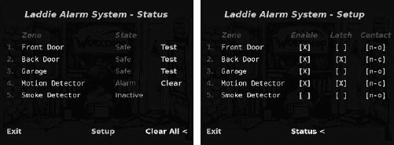

*图 11-10：Laddie 帧缓冲 UI*

**STBmenu 框架**

在对 Laddie 帧缓冲 UI 进行了一些实验后，你可能会注意到它与功能齐全的 GUI 之间的差异。Laddie 帧缓冲 UI 没有可以移动到屏幕上的窗口；它由一系列全屏页面组成。没有可以选中屏幕上任何点的自由浮动光标；相反，输入小部件的二维几何形状决定了箭头键如何切换焦点。最后，小部件的输入选项非常有限：只有一个，对应于按下 ENTER 键。

**注意**

*在实验 DVD 界面时，我们惊讶地发现，通过按箭头键到达你想要的图标就像解决一个谜题。STBmenu 框架的一个特性是，每个箭头键都保证可以遍历所有输入小部件。这看起来可能是一个微不足道的问题，但当你试图关闭一个不必要地吵醒邻居的家庭警报时，你不想被一个具有挑战性的 UI 所困扰。*

**STBmenu 小部件**

状态页面，如图 11-10 左侧所示，包含 25 个可见的小部件。其中 8 个是静态显示（标题、列标题和区域编号）；5 个显示可变文本（区域描述）；5 个显示警报状态；剩下的 7 个是按钮。（背景屏幕不是一个小部件。）图 11-11 展示了 STBmenu 小部件、用户和底层应用程序之间的关系。

*图 11-11：STBmenu 小部件*

将 STBmenu 小部件与图 11-9 所示的完整功能小部件进行比较，我们注意到几个简化之处。STBmenu 小部件只响应两种事件：Activate 和 Update。*Activate*事件调用小部件的单个回调函数，而*Update*事件告诉小部件重新绘制自己，因为它所表示的数据可能已更改。对于完整功能小部件，应用程序可以调用函数来配置小部件（例如，更改其大小或位置）并检索其输入数据（例如，输入的文本或滚动条位置）。然而，STBmenu 小部件在构建时就已经完全配置好了，并且只有在调用 Activate 回调函数时才会将数据传递给应用程序。对于完整功能小部件，应用程序可以调用函数来更改小部件的输出数据（例如，状态文本或仪表位置），但 STBmenu 小部件使用指向应用程序数据结构的静态指针来检索它们显示的数据。最后，STBmenu 小部件显示的数据类型限于整数和字符串。

因为没有用于配置 STBmenu 小部件或设置其显示数据的函数，所以底层应用程序的开发者不需要熟悉工具包。他们只需暴露显示的应用程序数据并提供适当的回调函数以处理用户输入。

下面总结了 STBmenu API。类构造函数用粗体表示，方法用斜体表示。

**Menu(nPages, width, height, bpp);**

*AttachPage(n, page)*;

SetCursor(page,row,col);

DisplayCurrentPage();

CursorLeft();

CursorRight();

CursorUp();

CursorDown();

Activate();

Update();*

**Page(nRows, nCols, background);**

*AttachWidget(row, col, xPos, yPos, widget)*;

**Font(fontPath, fontSize);

Surface(width, height, color);

Surface(font, color, text);

Surface(imagePath);

SurfaceArray(n, &surface,...);

Button(nfSurface, fSurface);

ButtonArray(n, &button,...);**

这里是 STBmenu 小部件：

**WIcon(font, color, text)和 WIcon(imagePath)**

显示由常量文本字符串或图像文件创建的静态图像。

**WText(font, color, text)**

显示一个可变文本字符串。

**WIconArray(surfaceArray, trackedIndex)**

显示一个数组中的静态图像，取决于应用程序索引变量。

**WButton(button, callback, data)**

显示一个由一个静态图像组成的按钮，当高亮显示时，以及当未高亮显示时。当激活时，调用带有指定数据的应用程序回调函数。

**WButtonArray(buttonArray, trackedIndex, callback, data)**

显示一个数组中的按钮，取决于应用程序索引变量。当激活时，调用带有指定数据的应用程序回调函数。

***“使用 STBmenu 的‘Hello, world!’”

在本节的剩余部分，我们将通过一个简单的示例来演示 STBmenu 工具包。此示例位于 Laddie CD 上的/Code/src/examples/stb_hello 目录中。此时，我们建议您返回 Laddie CD，并退出仍在运行的 Laddie 帧缓冲区 UI（请记住使用 ctrl-alt-F1 或 ctrl-alt-F7 在控制台之间切换，并使用箭头键和回车键在帧缓冲区菜单中导航）。然后切换到 stb_hello 目录，使用以下命令构建并运行示例。

laddie:~# cd /Code/src/examples/stb_hello

laddie:~# make

laddie:~# ./stb_hello

您应该看到图 11-12 所示的显示。

**图 11-12: 使用 STBmenu 的“Hello, world!”**

此示例实现了两个按钮小部件。您可以通过按键盘上的箭头键选择按钮，并使用回车键激活它们。当您激活 Hello 按钮时，它将*Hello, world!*打印到标准输出，您可以在关闭 UI 后通过激活退出按钮来验证。

在本节的剩余部分，我们将研究 stb_hello 示例的实现。

使用 STBmenu 构建 UI 涉及三个步骤：

1.  定义用于监控和控制应用程序所需的数据结构和回调函数。

1.  使用指向这些数据结构和回调函数的小部件构建 UI。

1.  使用 STBmenu 框架的方法处理事件。

我们将演示这两个按钮示例的这些步骤。

**定义数据结构和回调函数**

在这个简单的示例中，没有要监控的数据。控制包括打印消息或退出程序，它需要一个数据项和两个回调。

由 Hello 按钮（ Hello()回调）调用的回调函数将打印一条消息。由退出按钮（ QuitApplication()回调）调用的回调函数将 enableQuit 变量设置为 1。所有小部件回调都接受一个指向调用它们的窗口的指针作为参数。所有此类小部件都将具有 STBmenu 类型 InputClass，并且可能提供对回调有用的附加数据；然而，我们在这里没有使用该功能。

**构建 UI**

构建 UI 的第一步是声明一个菜单对象。

#include "STBmenu.h"

Menu* menu = new Menu(1, 640, 480, 8);

这必须在声明任何其他 UI 对象之前完成，因为它初始化了底层的 SDL 视频上下文。我们指定页数（1）、UI 屏幕的宽度（640）和高度（480）（以像素为单位），以及每像素的位数（8）。

接下来，我们声明并附加菜单对象的单个页面。

#define BLACK 0x000000

设置表面背景(640,480,BLACK);

Page page(2, 1, background);

menu->AttachPage(0, page);

对于一个真实的用户界面，我们可能希望有一个更有趣的背景，但为了快速示例，我们指定了一个黑色、640×480 像素的表面。然后我们声明页面，提供行数（2）、列数（1）和背景。我们使用 AttachPage()将页面附加到菜单对象，指定页面编号。

我们现在可以指定按钮小部件。以下是测试按钮的代码。

我们通过指定路径名和字体大小来声明一个 TrueType 字体。我们使用该字体构建两个表面，一个用于按钮未选中时（即，没有焦点）的青色文本，另一个用于按钮选中时的黄色文本和*<*符号。我们从两个表面构建一个按钮，指定无焦点的表面。最后，我们构建一个按钮小部件，指定按钮、回调函数以及回调函数可能需要的数据（在这种情况下为 NULL）。

构建按钮小部件后，我们将其附加到页面上。

page.AttachWidget(0, 0, 250, 200, wHello);

回想一下，我们声明了这个页面有两条行和一列。在附加小部件时，我们在页面内指定它们的行（0）和列（0），以及它们的绝对*x*（250）和*y*（200）像素位置。行和列将确定上、下、左、右光标输入如何选择各种按钮小部件。

退出按钮是类似于“Hello”小部件构建并附加的。您可以在光盘中的/Code/src/examples/stb_hello 目录下的示例代码中看到。

在构建了菜单、页面和小部件之后，我们现在可以显示菜单。

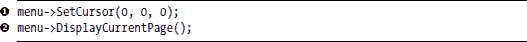

在这里， SetCursor() 方法指定了一个页面、行和列，用于最初高亮显示的小部件。在当前情况下，这是“Hello”按钮。 DisplayCurrentPage() 方法生成了图 11-12 所示的屏幕。

**处理事件**

我们程序的其他部分包括一个简单的事件循环。

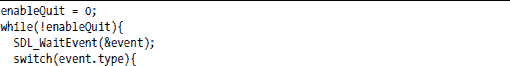

当接收到箭头键事件时，菜单的四个导航方法( CursorLeft(), CursorRight(), 等)用于更新高亮按钮。按回车键调用 Activate() 方法，该方法调用当前高亮按钮的回调函数。我们将在下一章学习如何使用红外遥控器代替键盘，但这段代码将不会改变，因为我们将使用红外接口生成 SDL 键盘事件。

每当发生事件时，我们使用 Update() 方法重新绘制任何已更改的小部件。

**Laddie 帧缓冲 UI**

正如我们在上一节中看到的，使用 STBmenu 的应用程序有两个义务：提供要显示的数据的指针，并提供 UI 输入的回调。图 11-13 说明了 Laddie 帧缓冲区 UI 如何满足这两个义务。

在用户端，键盘或遥控事件选择一个小部件，然后调用该小部件的激活方法。这个动作会在应用程序接口中调用一个回调，通过 RTA/ PostgreSQL 协议控制警报守护进程。在应用程序端，logmuxd 转发了指示 Laddie 警报守护进程状态已更改的事件。响应这些事件，UpdateZoneData 代码使用 RTA/PostgreSQL 协议更新警报守护进程区域数据的本地副本，并调用菜单的更新方法。这个动作会根据新的区域数据提示菜单的小部件重新绘制自己。

*图 11-13：使用 STBmenu 构建 Laddie 帧缓冲区 UI*

**注意**

*如果您是按照顺序之外的章节阅读本书，请参考第三章了解 RTA/PostgreSQL 协议的描述，第五章学习关于 alarm daemon ladd 的内容，以及第六章了解 logmuxd 的介绍。*

在“Hello, world!”示例中，我们看到了如何构建带有回调的控件。现在，以 Laddie 帧缓冲区 UI 为例，我们将演示如何构建显示应用程序数据的控件。

我们首先提供数据结构来捕捉 Laddie 警报守护进程的状态。

LaddZone 数据结构中的字段直接对应于在两个菜单页面上显示的字段。当至少有一个区域处于警报状态时， laddAlarm 变量不为零，并用于启用清除所有按钮。

回想第六章，事件处理器 logmuxd 可以被配置为通过管道路由事件。我们配置 logmuxd（使用目录/opt/laddie/logmuxd 中的文件 Filters.sql 和 FileDest.sql）将所有 Laddie 警报事件路由到管道/opt/laddie/fbmenu/laddevents。帧缓冲区 UI 的主线程使用 select()系统调用来等待通过此管道接收到的消息，然后使用警报守护进程的 RTA 接口更新 LaddZone 结构体的数组。

对于我们的 UI，我们将提供几个列的控件来显示 laddZones 警报数据。让我们只考虑状态页面中的状态列。正如我们在图 11-10 中看到的，这些控件根据每个区域的状态显示*不活动*、*安全*或*警报*指示。我们使用 WIconArray 控件，如下面的代码所示，来显示警报状态。

在这里，我们  声明三个表面，对应于三种报警状态，并使用适当的颜色。我们  从这些表面形成 SurfaceArray，并使用它来构建报警状态控件。在  声明 WIconArray 控件时，我们提供一个指向应用程序接口本地数据结构中整数值的指针。请注意，alarmState 表面的顺序对应于 laddZones[W].state 的可能值。

为了完成这个 UI，我们必须定义额外的控件来显示 laddZones 数组中剩余的数据，并在适当的时候通过回调更新 Laddie 报警守护进程。与“Hello, world!”示例一样，我们还需要将控件附加到页面上，并将页面附加到主菜单。我们尚未讨论的一个问题是如何在页面之间切换。幸运的是，这很简单。STBmenu 框架提供了一个 SetCursor 函数来选择页面和光标位置。因此，我们通过在每个页面上提供带有回调的按钮控件来切换页面，以将光标设置到对面的页面。

Laddie 缓冲区帧 UI 的事件处理程序与 stb_hello 示例略有不同。它不是等待 SDL 事件，而是使用 select 系统调用来等待来自 logmuxd 的 Laddie 报警守护进程事件。它使用 100 毫秒的超时时间，当完成或超时时，它使用 SDL_PollEvent 函数来检查按键。与 stb_hello 示例一样，我们只需要五个输入，所以我们监控并响应箭头键和 ENTER 键。在下一章中，我们将看到如何使用手持遥控器控制此 UI。

对于我们省略的细节，请参阅 Laddie CD 上的代码，位于目录 /Code/src/fbmenu。STBmenu 的代码包含在 /Code/src/stbmenu。

**总结**

如图 11-14 所示，构建一个设备的 GUI 需要使用几个层级。

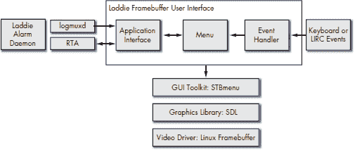

*图 11-14：Laddie 缓冲区帧 UI 和图形堆栈*

Linux 帧缓冲设备驱动程序提供了一个视频硬件的抽象层，这有助于配置视频模式和操作像素内存。有各种图形库可以使用这个设备驱动程序，这些库提供了操作图形对象和文本的支持。这些库通常还提供事件处理的支持。我们选择使用 Simple DirectMedia Layer（SDL）为 Laddie 设备，因为它得到了良好的支持，文档齐全，且轻量级。GUI 工具包提供了下一层；它们提供并管理小部件，这些小部件的输入事件和图形显示紧密耦合。对于 Laddie 设备，我们开发了一个轻量级的 GUI 工具包，STBmenu，它旨在与简单的手持遥控器一起使用，并且可以简化向现有应用程序添加 GUI 层的工作。为了支持这一点，我们还展示了如何使用 RTA/PostgreSQL 协议和 logmuxd 事件处理器将 Laddie 帧缓冲 UI 连接到 Laddie 警报守护进程。在下一章中，我们将通过添加远程控制支持来完成 Laddie 帧缓冲 UI。

__________________

¹ 例如，Richard Stones、Neil Matthew 和 Alan Cox 合著的《Linux 编程入门》（第 3 版，Wrox，2004 年）各包含一章关于 GTK+和 Qt 的内容。
