**红外遥控器**

遥控器已成为我们控制某些电器最自然的方式，如果你和我们一样，你偶尔会花几分钟时间试图找到遥控器，而不是试图操作某个设备的神秘前面板。在未来，我们预计将看到更多电器完全放弃前面板，转而使用简单遥控器的键盘。这里有一个经验法则：如果你正在制造一个人们坐在沙发上可能会享受的电器，请包括一个遥控器。

在本章中，我们将涵盖以下主题：

+   使用红外光进行通信

+   遥控器接收器的硬件

+   为 Laddie 设备安装和配置 LIRC

**使用红外光进行通信**

遥控器使用的红外（IR）光波长接近但大于可见光。因为它接近可见光，所以它沿直线传播并从表面上反射，但它不会穿透不透明物体。这限制了红外的应用范围。它适用于控制机顶盒，但不适用于打开车库门，如果发射器和接收器之间有一堵实墙。

大部分情况下，红外线不可见是一个好事。调试不可见的东西可能更困难，但当你晚上在基于 Linux 的 DVR 上观看电影时，知道你可以降低音量而不在屏幕上发出可见光是很不错的。

**注意**

*如果你希望看到遥控器的光线，也许是为了验证设备没有损坏，你可以用手机摄像头查看它。这些摄像头对红外线敏感，在我们实验过的相机上，它们将这种“颜色”显示为明亮的白色。*

***编码遥控器命令的协议***

为了传输信息，遥控器发射器和接收器必须使用相同的标准或*协议*来编码命令。遥控器协议指定以下三个事项：

+   如何表示一和零

+   如何将这些一和零组合或*封装*成消息

+   如何解释这些不同的消息

建造遥控设备的公司通常不会公开它们的协议，但逆向工程基本命令并不困难，互联网上有大量这方面的信息。作为一个例子，我们将考虑索尼为其一些电视使用的协议。如果你在互联网上做一些研究，你可能会看到这个协议被称为索尼集成遥控系统（SIRCS）协议。我们选择使用这个协议为 Laddie 设备，因为这个协议易于理解。它也易于生成：我们购买了一个通用遥控器（RCA RCU410）并将其编程为“索尼电视”（代码 002）。

此索尼电视协议使用脉冲编码数据编码。使用这种编码，一个比特由一个可变宽度的*脉冲*或光的存在表示，随后是一个恒定宽度的*空间*或光的不存在。根据我们使用手持遥控器进行的自身时间测量，零有一个 650 微秒的脉冲，一有一个 1,300 微秒的脉冲，每个脉冲后都跟一个 500 微秒的空间。这些编码在图 12-1 中展示。

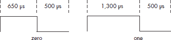

*图 12-1：索尼电视协议中的零和一*

索尼电视协议中的一个帧（再次强调，这是针对我们特定的遥控器测量的）以一个由单个 2,500 微秒脉冲和一个 500 微秒空间组成的头部开始。紧接着头部的是一个七位命令，然后是一个五位地址。命令和地址都使用最低有效位（lsb）首先传输。图 12-2 显示了 TV/Volume-命令的波形。

*图 12-2：索尼电视协议中的 TV/Volume-命令*

地址指定了一个设备（在我们的案例中，总是 0x01 用于电视），命令指定了该设备的输入。表 12-1 列出了索尼电视协议的一些命令代码。

**表 12-1：索尼电视协议中的设备地址和命令代码**

对于 Laddie 设备，我们使用 Channel+、Channel-、Volume+、Volume-和 Power 命令。当然，Laddie 设备实际上并没有频道或音量级别；我们只是简单地选择了这些作为 framebuffer 菜单导航的方便输入。

有许多其他的遥控器协议，每个都代表了一套工程权衡。例如，松下（Panasonic）的 REC-80 协议使用恒定宽度的脉冲，通过脉冲之间的空间长度来编码零和一。这种方法可以通过最小化遥控器发射光的时间来延长电池寿命。其他协议通过在按钮按下时发送一个短的“重复”命令来节省电池寿命，而不是像索尼电视协议那样重复发送整个命令。

**注意**

*要了解这些其他协议，请访问* [*http://sbprojects.com/knowledge/ir/ir.htm.*](http://sbprojects.com/knowledge/ir/)

***通过调制红外信号减少干扰***

到目前为止，我们一直将红外脉冲视为与稳定的激光束相对应。但考虑图 12-2，假设一个闪烁的灯泡生成一些红外脉冲，这些脉冲与消息中的某些空间重叠。显然，这种干扰可能会使接收器无法正确解释消息。解决方案是对红外脉冲进行调制。在调制的脉冲中，红外光实际上以固定的频率打开和关闭，通常在 30 到 60 千赫兹（千赫）之间。就像在拥挤的房间里辨认出一个声音一样，接收器可以使用这个频率作为签名来区分预期的信号和背景噪声。正因为这种调制，索尼电视协议的脉冲编码的零和一更准确地表示如图 12-3 所示。

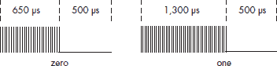

*图 12-3：索尼电视协议中的调制脉冲*

我们测量了我们的遥控器的调制频率大约为 40 千赫兹。因此，对于我们的遥控器，图 12-3 中的零“脉冲”实际上由 40,000 * 0.000650 = 26 个更短的脉冲组成。

***使用红外光控制电器***

现在我们已经看到红外光如何传递信息，我们可以设计一个系统来实现应用程序的遥控。图 12-4 展示了这样一个系统。

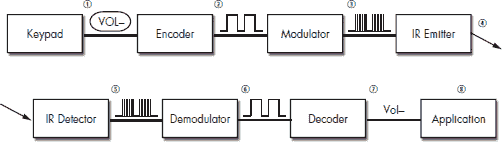

*图 12-4：一个完整的遥控系统*

在发射端，典型的手持遥控器执行以下步骤：

1.  它扫描一个*键盘*。

1.  它根据某种协议将输入编码为波形。

1.  它使用 30 到 60 千赫兹的频率对这个编码进行调制。

1.  它*发射*一个相应的红外光模式。

    在接收端，典型的红外接收器执行以下阶段：

1.  一个红外*检测器*将输入信号转换为电压波形。

1.  一个*解调器*移除 30 到 60 千赫兹的调制。

1.  一个*解码器*分析这个波形并确定相应的命令。

1.  一个*应用程序*会相应地响应这个输入。

**遥控接收器的硬件**

在本节中，我们将重点关注红外接收器硬件。设计遥控发射器超出了本章的范围，但我们的建议是采用与 Laddie 设备相同的方法：使用现成的通用遥控器。

***检测和调谐红外信号***

检测和调谐红外输入的两个阶段可以由一个单一的、商业的现成组件处理。图 12-5 显示了该组件的三个示例，均由夏普微电子公司生产。

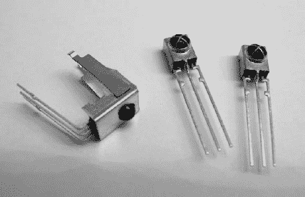

*图 12-5：红外检测/解调器*

对于 Laddie 设备，我们选择了 Sharp 的 GP1UV70QS 系列中的 40 kHz 单元（如图 12-5 右侧所示）。Vishay 的 TSOP17XX 系列也很受欢迎。这些部件都很容易与穿孔板或无焊面包板原型材料一起使用。每个都需要 5V 电源，并提供与解调红外波形相对应的输出（见图 12-4 的第 6 步）。在评估特定设备时，请确保解调频率适合你选择的协议。对于低功耗应用，你还需要比较不同设备的功耗要求。

这些设备没有标准的命名法。当你搜索信息时，可能会看到像“红外遥控接收器”、“遥控器用光电模块”或“遥控器用红外检测单元”这样的名称。在本章的剩余部分，我们将把它们称为*红外检测/解调器*，以强调它们提供的两个功能。

**构建一个简单的红外检测器**

如果你有一个示波器并且想看到解调之前的遥控信号，你可以构建图 12-6 所示的简单红外检测电路。你需要的只是一个电源（9V 电池就足够了）、一个适当值的电阻和一个光电晶体管。

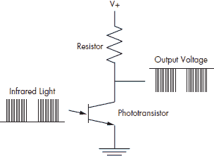

*图 12-6：一个简单的红外检测器*

你需要选择一个电阻，使得当遥控器关闭时输出电压大约是电源电压的一半。当我们尝试这样做时，我们使用了一个 100K 的电阻，并将遥控器紧紧地靠近探测器。我们使用 Radio Shack 红外光电晶体管（目录号 276-142）和另一个我们偶然拥有的未标识的光电晶体管都取得了良好的结果。输出将很弱，但对于示波器来说应该是足够的。顺便说一句，这个实验如果你需要确定一个不熟悉的协议的调制频率也是很有用的。

***解码遥控波形***

在上一节中，我们介绍了那些会对遥控红外信号做出响应并产生解调电压波形的现成设备。在设计利用这些设备的电路之前，我们需要决定如何解码该波形。解码可以分为两个步骤：*测量*组成波形的脉冲和间隔的时间以及*解释*这些时间序列以识别预期的信息。根据我们将哪些任务分配给外部硬件以及哪些任务分配给设备的处理器，我们有三种设计解码器的方法。在描述我们对 Laddie 设备所采取的方法之前，我们将简要讨论这三种方法。

**在外部硬件中进行测量和解释**

可以构建执行所有解码任务的接收器硬件：测量波形、确定相应的命令，然后将该命令作为一个或多个串行字节传输到设备处理器。图 12-7 说明了这种方法。在这里，接收器已经识别出 Volume-命令的波形，并生成了表示*下*的单个 ASCII 字符*D*。

*图 12-7：在外部硬件中解码波形*

网站 http://linuxtoys.org/xirrc/xirrc.html 描述了这种方法的一个例子，其中使用预先编程的 Microchip PIC 微控制器来解码索尼遥控命令并将命令字符传输到串行端口。

这种方法的局限性在于接收器只支持一种遥控协议。从积极的一面来看，这种方法使得向您的设备添加遥控变得极其简单。只需插入接收器，并在串行端口上监听命令即可。

**在硬件中测量并在设备上解释**

为了适应任何遥控协议，我们可以构建测量波形但将时序信息传递给设备处理器的接收器硬件。图 12-8 说明了这种方法，其中脉冲和空间的时序被编码为一系列字节，每个字节代表 50 微秒的时间增量。

*图 12-8：在外部硬件中测量波形时序*

由于设备得到了输入波形的完整表示，理论上它可以解码任何协议的波形。LIRC 网站提供了一个名为通用红外遥控收发器第二版(UIRT2)的协议链接，该协议详细说明了这种方法。它可在[`users.skynet.be/sky50985`](http://users.skynet.be/sky50985)找到。

作为相关的一个例子，Irman 遥控接收器，可在[`www.evation.com/irman/index.html`](http://www.evation.com/irman/index.html)找到，采用了一种创新的方法，通过创建六个字节的“伪随机”签名来编码任何遥控命令波形。Irman 基于这样的假设：来自给定遥控器的不同波形几乎总是具有不同的签名。因为这种技术适用于任何波形，这种类型的接收器可以与任何常见的遥控协议一起工作，但用户必须训练它来解释它推导出的签名。

作为第三个例子，LIRC 网站提到了 USB-IR-Boy 项目。该项目使用带有内置 USB 支持的廉价 Freescale MC68HC908JB8 微控制器来提供红外波形时序值。它还包括一个 Linux 设备驱动程序，通过/dev/usbirboy 设备文件使这些时序值可用。信息可在[`usbirboy.sourceforge.net`](http://usbirboy.sourceforge.net)找到。

**在设备上测量和解释**

解码波形的三种方法中，第三种因其简单的硬件要求而颇具吸引力。所有硬件需要做的只是为红外检测器/解调器供电，并将信号作为输入提供给设备的处理器。然而，这种方法确实对处理器提出了额外的要求。具体来说，处理器必须对输入信号每次从高到低或从低到高的转换做出响应，以便测量时间信息。尽管如此，由于硬件要求简单，我们还是选择了这种第三种方法用于 Laddie 设备。在下一节中，我们将详细讨论构建这种接收器的细节。

***Laddie 设备的红外遥控硬件***

如果您不擅长构建硬件，您可能需要寻找一个擅长的人，或者——这是我们的建议——不管怎样都自己动手做。这是一个很好的入门项目，因为它为您提供了对 Linux 项目的新控制方式。如果您有硬件可以实验，您会发现本章的其余部分更具教育意义。

要将我们的简单红外接收器集成到设备中，我们需要两样东西：为红外检测器/解调器供电的电源以及生成中断的输入。好消息是，典型的串行端口满足这两个要求。串行端口的输出引脚提供足够的电源，并且其数据载波检测（DCD）输入引脚生成中断。坏消息是，串行端口的输出电压在正侧从 3.7V 到 12V 不等，在负侧从-3.7V 到-12V 不等。此外，串行端口输入需要在这些相同的正负范围内摆动。然而，红外检测器期望一个干净的 5V 电源（对于某些部件，为 3.3V）；它输出 0V 到 5V 的信号（对于某些部件，为 0V 到 3.3V）。因此，如果您想使用串行端口输入，您将需要额外的电路来为检测器提供所需的电压，并将检测器输出转换为有效的串行端口电平。图 12-9 展示了这种类型的电路。

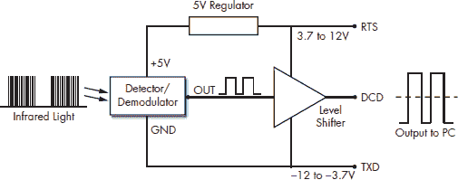

*图 12-9：简单红外接收器的框图*

在这里，我们假设串行端口已配置为保持请求发送（RTS）输出在高电压水平，而发送数据（TXD）输出在低电压水平。5V 稳压器为检测器提供所需的电压。电平转换器为 DCD 输入提供正确的电压水平。

**注意**

*如果您在网上查看所提供的红外接收器电路，您会发现一些采用更简单的方法，省略了电平转换器，并提供在 0V 和 5V 之间摆动的输出。这可能适用于您的计算机。如果不适用，或者如果您需要一个更稳健的解决方案，请采用我们这里选择的方法。*

图 12-10 显示了我们为 Laddie 红外接收器选择的原理图。

*图 12-10：用于 Laddie 设备的红外接收器原理图*

在这里，U1 是一个现成的红外检测/解调器，U2 是一个线性稳压器，为 U1 提供 5V，而晶体管/电阻电路是电平转换器，为串行端口提供适当的输出。二极管 D1 在 RTS 信号不正确初始化时保护电路，这可能导致它与 TXD 相对于负电压。表 12-2 提供了我们使用的具体零件及其大约成本。在我们列出多个零件的地方，你可以假设它们可以互换。在 Digi-Key ([`www.digikey.com`](http://www.digikey.com/)) 和 Jameco Electronics ([`www.jameco.com`](http://www.jameco.com/))，你 shouldn't have any trouble finding these parts.

**表 12-2：Laddie 设备红外接收器的零件清单**

图 12-11 展示了我们的几个原型。我们建议从无焊点面包板和 22 AWG 实心（非绞合）电线开始，如图左侧所示。你还需要一个 22 AWG 电线的剥线器和示波器进行调试。你想要使用烙铁的地方是将电线连接到 DB9 串行连接器。在左侧的图片中，DB9 连接器的两根电线为面包板边缘的条带提供电源和地。第三根电线通过串行电缆将 DCD 信号返回到计算机。

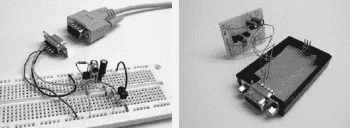

*图 12-11：红外遥控接收器的两个原型*

一旦你有一个工作电路，你可以使用穿孔板和塑料外壳构建更永久的东西。在右侧的图片中，只显示了外壳的一侧。我们在一侧钻了一个孔用于红外检测/解调器，并在另一侧切了一个孔用于 DB9 连接器。一块纸板将检测/解调器固定在位置。

当构建你的原型时，遵循以下步骤以确保电路正常工作：

1.  构建电路，但不要连接串行端口或红外检测/解调器。在 RTS 和 TXD 引脚的位置，使用 9V 电池供电。用电池的正极代替 RTS 输入，用负极代替 TXD 输入。

1.  验证稳压器输出和负电池端之间的电压为 5V。

1.  验证电路输出和负电池端之间的电压至少为 8V。（“电路输出”是你稍后将要连接到串行端口 DCD 引脚的点。）

1.  现在将 R1 的开口端连接到稳压器的 5V 输出，并验证电路输出和负电池端之间的电压为零伏。

1.  最后，通过添加红外检测/解调器并将计算机的串行端口连接起来，完成电路。

对你的红外接收器硬件的剩余测试需要 LIRC 软件。在下一节中，我们将介绍 LIRC 软件包，并描述我们如何将其集成到 Laddie 设备中。

**为 Laddie 设备安装和配置 LIRC**

LIRC 软件包可以从[`www.lirc.org`](http://www.lirc.org/)下载；它包括大量用于使用遥控器硬件控制用户应用程序的设备驱动程序、守护进程和工具。我们没有足够的空间在这里涵盖所有这些元素，但我们将展示构成此软件架构的层，并将详细描述适用于 Laddie 设备的特定设备驱动程序和守护进程。一旦你理解了这个子集，你应该会发现掌握你自己的设备所需的任何其他架构部分都很容易。

图 12-12 展示了 LIRC 软件架构在 Laddie 设备中的应用的高级视图。在图的右侧，我们展示了 LIRC 架构的元素如何对应我们之前关于红外接收器的更一般性讨论。

*图 12-12：LIRC 架构*

在内核空间中，设备驱动程序通过外部端口访问接收器硬件。对于我们的设备，该驱动程序由 LIRC 软件包提供，并使用中断在输入波形上执行波形定时。

**注意**

*正如你在第 203 页“解码遥控波形”部分所看到的，有些红外接收器在外部硬件中执行波形定时，甚至可能执行波形解释。对于这些接收器，内核设备驱动程序可能是一个通用的 Linux 串行驱动程序或 USB 驱动程序。*

在用户空间中，对于像我们这样的不在外部硬件中执行解释的系统，我们使用 lircd 守护进程。该守护进程访问一个配置文件，该文件描述了遥控器的命令协议，并分析设备驱动程序提供的定时信息以生成相应的命令。在某些情况下，用户应用程序将直接访问 lircd 守护进程的输出。Laddie 设备采用这种方法。对于没有考虑 lircd 守护进程的应用程序，有几个 LIRC 工具可用于处理 lircd 守护进程的输出，提供程序输入，执行适当的命令或模拟鼠标或键盘事件。我们将在第 218 页的“用于控制应用程序的 LIRC 工具”部分讨论这些工具。

在本章的剩余部分，我们将详细描述 LIRC 架构的元素，并展示我们如何为 Laddie 设备配置 LIRC。

***安装 LIRC 软件***

LIRC 软件包包含在本书的配套 CD 中，我们建议您在处理本章中的示例时使用 CD。然而，如果您未来需要设置自己的系统，我们将描述我们安装该软件包所采取的步骤。

我们从[`www.lirc.org`](http://www.lirc.org/)下载了版本 lirc-0.8.1，并使用以下命令安装：

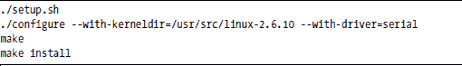

setup.sh 脚本要求我们做出关于安装的选择。在驱动程序配置（驱动程序：串行 io：0x3f8 中断：4）菜单下，我们选择了**自制（16x50 UART 兼容串行端口）**驱动程序，为基本地址和中断选择了**COM1（0x3f8，4）**，并禁用了所有驱动程序特定的选项。在软件配置菜单下，我们禁用了所有选项。然后我们选择了**保存配置并退出**。

LIRC 是一个允许你解码和发送许多（但不是所有）常用遥控器红外和其他信号的包。它包括解码接收信号的守护进程以及允许使用遥控器控制计算机的用户空间应用程序。

./configure --help 命令提供了一个长长的驱动程序选择列表，以及一个令人敬畏的长配置选项列表。对于我们的设备，默认值通常是合适的。我们只需要使用--with-kerneldir 选项提供 Linux 内核源树的位置，并使用--with-driver 选项指定串行驱动程序。

图 12-13 显示了 LIRC 包安装的代表组件如何适应 LIRC 软件架构。尽管 LIRC 包包括支持 X 窗口系统的实用程序，但我们在这里没有展示它们，因为 Laddie 设备不使用 X。

*图 12-13：LIRC 包的组件*

在深入细节之前，让我们先进行一次快速的上至下的浏览，并解释 LIRC 接收器是如何控制 Laddie 设备框架缓冲区 UI 的，这部分内容在第十一章中有详细描述。外部红外接收器硬件将遥控波形提供给串口的 DCD 引脚。在内核空间中，lirc_serial 设备驱动程序（LIRC 包中包含的许多驱动程序之一）监控这个引脚，并通过设备文件/dev/lirc 产生一个二进制的时间数据流。在用户空间中，lircd 守护进程分析来自/dev/lirc 设备文件的时间数据，以便在 Unix 套接字/dev/lircd 上提供一系列命令字符串。帧缓冲区 UI 直接连接到这个套接字，以便响应用户输入。

现在我们来详细说明我们之前省略的部分。在本节的剩余部分，我们将更仔细地查看 LIRC 软件架构的每一层。

***配置 lirc_serial 内核设备驱动程序***

lirc_serial 设备驱动程序实际上由两个内核模块实现，即 lirc_serial.ko 和 lirc_dev.ko，我们在安装软件时将它们放置在目录/lib/modules/2.6.10/misc/中。为了使用这些模块，我们必须执行三个额外的步骤：释放一个串行端口、创建一个设备文件，并将模块加载到内核中。我们创建了一个启动脚本 lircd 来执行这些步骤。我们在这里将回顾这些步骤；你可以在 CD 的/etc/rc.d/init.d 目录中看到完整的代码。

**释放串行端口**

对于 Laddie 设备的 IR 接收器输入端口，我们选择了 COM1(/dev/ttyS0)。Linux 内核通常在启动时将 COM1 至 COM4 作为串行端口启用；因此，我们需要为 LIRC 释放 COM1。为此，我们使用了 setserial 命令：

setserial /dev/ttyS0 uart none

通过将硬件类型（UART）设置为*none*，此命令禁用了指定的端口。

**注意**

*UART 代表通用异步接收发送器。UART 处理串行链路的底层实现，这样 CPU 只需关注提供要发送的字节和处理接收的字节即可。*

在本章的剩余部分，我们建议您使用 Laddie CD 启动 Laddie 设备，并跟随练习进行。启动 CD 后，退出 framebuffer UI（按 ESC 键），以空密码作为 root 用户登录。在 laddie:~#提示符下执行以下命令以验证 COM1 端口是否已正确配置：

**laddie:~#** setserial /dev/ttyS0

您应该看到以下输出：

/dev/ttyS0, UART: 未知，端口：0x03f8，中断：4

UART 类型未知，这意味着端口可用。

**创建设备文件**

您可能还记得，在前一章中我们使用了设备文件/dev/fb0 来公开 framebuffer 功能。同样，我们必须提供一个设备文件来公开 lirc_serial 功能。以下代码创建了一个字符设备文件/dev/lirc，主设备号为 61，次设备号为 0，这是 lirc 驱动程序所需的。

这表明该文件表示一个字符设备，该设备由 root 可读写，主设备号为 61，次设备号为 0。

**将 lirc_serial 模块加载到内核中**

在串行端口可用且设备文件就绪的情况下，我们能够使用 modprobe 命令加载 lirc_serial 设备驱动程序：

modprobe lirc_serial

要验证 lirc_serial 设备驱动程序是否已加载，请执行以下操作：

**laddie:~#** lsmod | grep lirc

您应该看到类似以下输出：

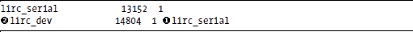

第一列显示已加载的模块；第四列显示依赖关系。在这里我们看到 lirc_serial 模块依赖于lirc_dev 模块。

**注意**

*如果我们想为 IR 接收器使用不同于 COM1 的端口，我们将在 modprobe 命令中为 lirc_serial 驱动程序提供额外的参数。要指定 COM2，我们将使用命令* modprobe lirc_serial irq=3 io=0x2f8*。COM3 和 COM4 的默认 irq 和 io 值分别为(4, 0x3e8)和(3, 0x2e8)。*

***测试 lirc_serial 驱动程序***

现在我们已经验证了 lirc_serial 驱动程序已正确加载，我们可以使用 Laddie CD 来测试我们之前构建的 IR 接收器硬件。我们将首先回顾我们想要测试的内容。

记住，我们 LIRC 接收器提供的信号看起来类似于图 12-14（至少在索尼电视音量- 命令的情况下）。

*图 12-14：索尼电视音量- 命令的波形*

lirc_serial 内核设备驱动程序的任务是测量该信号中的空间和脉冲的时间，并通过设备文件提供这些信息。这里显示的特定波形符合索尼电视协议，但 lirc_serial 驱动程序旨在与任何协议一起工作。驱动程序包括一个中断处理程序，每次 DCD 引脚状态改变时都会调用该处理程序。处理程序使用系统定时器测量脉冲和空间，然后通过 /dev/lirc 设备文件以 32 位字序列的形式发出此时间信息。在每个字中，位 0 到 23 指定空间或脉冲的长度（最大值为 0xFFFF FFFF）。位 24 对于空间为零，对于脉冲为一。位 25 到 31 总是零。为了测试 lirc_serial 设备驱动程序，我们希望验证在按下遥控器按钮时是否生成这些值。

在我们可以访问 /dev/lirc 设备文件之前，我们需要确保它没有被其他进程使用。当 Laddie CD 启动时，它会启动 lircd 守护进程以支持帧缓冲 UI。由于 lircd 守护进程访问 /dev/lirc，我们通过终止该进程来为我们的测试做准备。

在 Laddie 设备的命令提示符下执行以下命令：

**laddie:~#** laddie stop

**laddie:~#** kill $(pidof lircd)

在执行第一个命令后，您需要等待几秒钟，让 Laddie 应用程序停止。在第二个命令中，pidof 函数输出 lircd 进程的进程 ID。$(...) 构造提供此输出作为 kill 命令的参数，从而终止指定的进程。现在我们可以访问 /dev/lirc 设备文件以供我们自己的用途。

正如我们在上一章中看到的，我们可以使用 cat 命令通过设备文件访问提供的输出。现在我们不想简单地将 /dev/lirc 的输出猫到控制台，因为一些输出数据可能会被解释为控制字符，导致控制台最终处于不可用状态。我们可以做的一件事是将该输出通过 hexdump 工具进行管道传输，该工具将二进制数据转换为可打印的 ASCII 十六进制字符。

输入以下命令：

**laddie:~#** cat /dev/lirc | hexdump

现在，任何到达串行端口 COM1 的 DCD 引脚的脉冲将由 lirc_serial 设备驱动程序测量，通过 cat 命令通过 /dev/lirc 设备文件读取，并由 hexdump 以 ASCII 十六进制形式显示。要生成此类脉冲，将您的红外接收器连接到 COM1 端口，将遥控器对准红外检测器/解调器，并按下一个按钮。（在此阶段，遥控器的具体类型并不重要。）如果一切正常，您应该看到以下输出：

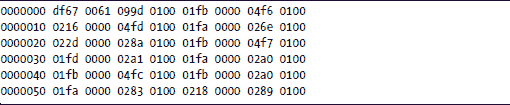

这是我们在编程用于索尼电视的通用遥控器上轻触音量-按钮时生成的输出。

如果你不确定你的红外接收器硬件是否工作正常（或者目前还没有红外接收器），你仍然可以通过在串口的 DCD 引脚上创建随机脉冲来测试 lirc_serial 设备驱动程序。一种方法是间歇性地将串口的 1 号引脚（DCD）连接到 7 号引脚（RTS）。如果这样做没有产生结果，尝试间歇性地将 1 号引脚连接到 3 号引脚（TXD）。如果你的计算机串口按照标准规格构建，即使错误地连接了引脚也不会有问题。然而，如果你刚刚购买了一台新潮的笔记本电脑，你可能想在朋友的 Linux 机器上先进行这个实验。

使用 cat /dev/lirc | hexdump 命令是一个很好的练习，因为它表明/dev/lirc 的输出仅仅是像文件一样可以读取的二进制数据。cat 和 hexdump 都不了解红外，但它们可以很好地显示数据。但是，hexdump 的输出不易阅读。幸运的是，LIRC 软件包包括一个实用程序，mode2，它理解 lirc_serial 驱动程序的输出，并且可以将其显示为脉冲和空间时序数据。

按下 ctrl-C 终止之前的命令，并执行以下命令：

**laddie:~#** mode2

现在，在按按钮的同时，将红外遥控器对准接收器。mode2 命令读取/dev/lirc 的输出，解析 23 位时序数据和单比特脉冲或空间指示器，并生成一系列脉冲和空间时序信息。例如，当我们用一个索尼电视音量-命令刺激我们的红外接收器时，我们从 mode2 观察到了以下空间和脉冲时序序列。

如果你参考第 198 页的“编码遥控器命令协议”，你会注意到这些时序值比理想化的波形所暗示的要嘈杂。第一个脉冲大约是 2,500 毫秒，对应于头部。其他脉冲大约是 1,300 或 650 毫秒，分别对应于 1 和 0。空间大约是 500 毫秒，但请注意对应于按键之间时间的较大初始空间值。拒绝与有效波形不对应的脉冲序列，并正确解释那些对应的脉冲序列是 lircd 守护进程的任务。当你完成 mode2 的实验后，按下 ctrl-C 终止实用程序。

到目前为止，我们已经确认 lirc_serial 设备驱动程序正在工作。在下一节中，我们将提供配置 lircd 守护进程的说明，该守护进程将使用此设备驱动程序输出。

**注意**

*如果您想编写一个直接使用 lirc_serial 设备驱动程序输出的程序，mode2 工具的源代码提供了一个如何访问 /dev/lirc 设备文件的示例。此源代码可在 [*http://www.lirc.org*](http://www.lirc.org/) 上找到，并且也包含在此书配套 CD 的 /usr/src/packages/ 目录中的 lirc-0.8.1.tar.bz2 压缩包中。*

***配置 lircd 守护进程***

LIRC 软件包中最聪明的一部分是 lircd 守护进程。这是分析来自 /dev/lirc 设备文件中的嘈杂时间值并生成一系列易于下游 LIRC 工具或用户应用程序解析的命令的部分。

为了使 lircd 守护进程能够解释来自 /dev/lirc 的定时数据，它必须理解遥控器协议。配置文件 /etc/lircd.conf 捕获此协议信息。以下是在 Laddie 设备上使用的 lircd.conf 文件，其中包含注释和删除了一些按钮条目以节省空间。

您不需要理解此文件中的条目即可使用 LIRC，但如果我们想手动编辑文件，我们在这里会做一些注释。*名称*可以是您喜欢的任何字符串，用于描述遥控器。*位*字段是数据位总数（在我们的情况下，是命令码位加上地址位）。*eps* 和 *aeps* 字段表示相对和绝对误差容限（在我们的情况下，是 30% 和 100 微秒）。*header*、*one* 和 *zero* 字段表示头部和数据位的脉冲和空间时间（以微秒为单位）。重复命令之间有一个大约 26,000 微秒的间隔，并且没有用于重复命令的切换位。请注意，这些字段反映了设备驱动程序实际测量的时间，可能不同于协议标准。*codes* 是各种命令的实际数据位序列。对于可能适用于其他遥控器的附加字段，您可以在 WinLIRC 网页上查看详细信息，网址为 winlirc.sourceforge.net/technicaldetails.html。

如果您的遥控器使用与我们的相同的协议，您应该能够在不更新 /etc/lircd.conf 文件的情况下控制 Laddie 设备。 （再次强调，我们使用的是 RCA RCU410 通用遥控器，编程为索尼电视，代码 002。）LIRC 网站还提供了许多遥控器的配置文件，但使用 LIRC irrecord 工具，从头开始生成这些文件也很容易。irrecord 工具通过监控 /dev/lirc 的输出并提示用户输入遥控器控制信号来创建配置文件。

现在我们来为您的遥控器创建一个配置文件。正如我们在测试 lirc_serial 设备驱动程序时提到的，在访问 /dev/lirc 之前，我们需要杀死 lircd 守护进程。如果您之前没有杀死 lircd，现在就做吧：

**laddie:~#** 杀死 $(pidof lircd)

要创建一个新的 lircd 配置文件，重命名或删除旧文件，然后运行 irrecord 命令：

**laddie:~#** mv /etc/lircd.conf /etc/lircd.conf.bak

**laddie:~#** irrecord /etc/lircd.conf

仔细阅读 irrecord 实用程序打印的说明。该实用程序将提示您按特定的顺序按下遥控器按钮，并且它还会要求您为要编程的按钮分配名称。由于您将使用遥控器来控制 Laddie 帧缓冲 UI，您需要提供 Laddie 设备所期望的按钮名称。您分配实际按钮的方式无关紧要，但您需要使用以下名称的大写字母：POWER、VOL+、VOL-、CH+和 CH-。如果您重新启动 irrecord 实用程序，请确保首先重命名或删除先前的/etc/lircd.conf 文件。一旦您对配置文件满意，您就可以测试 lircd 守护进程了。

**注意**

*如果您选择从[*http://www.lirc.org*](http://www.lirc.org/)下载适用于您遥控器的配置文件，您需要编辑它以确保按钮名称是 Laddie 设备所期望的。请记住，在您重新启动 Laddie CD 时，任何更新的配置文件都将被原始文件替换。*

***测试 lircd 守护进程***

要使用您的新 lircd 配置文件，请使用以下命令启动 lircd 守护进程：

**laddie:~#** lircd

此命令将立即完成而不会打印任何内容。要验证守护进程正在运行，请执行以下命令：

**laddie:~#** pidof lircd

并验证它返回一个整数。lircd 守护进程将从/dev/lirc 设备文件读取时序数据，并使用在/etc/lircd.conf 中指定的配置，以换行符分隔的 ASCII 字符串的形式在 Unix 套接字/dev/lircd 中提供按钮按下信息。

Unix 套接字与常规文件或设备文件不同。特别是，您不能使用 open()系统调用来访问它们；您必须使用 connect()。这意味着我们不能简单地使用 cat 来检查/dev/lircd 的输出，就像我们检查/dev/lirc 时那样。让我们编写一个简单的程序，socket_cat，它允许我们查看此输出。

**注意**

*如果您急于测试 lircd 守护进程并希望跳过此练习，您可以使用 LIRC 工具 irw，不带任何参数，以显示/dev/lircd 的输出。然而，程序 socket_cat 将帮助您了解 Laddie 设备的工作原理，因为它使用与 socket_cat 相同的方法来访问遥控器按钮的按下。*

如果您以前使用过套接字编程，以下程序将看起来很熟悉。我们使用函数 socket 创建一个未命名的、Unix 内部套接字。我们使用函数 connect 连接到命名套接字/dev/lircd。然后我们无限循环，将所有接收到的数据复制到标准输出。

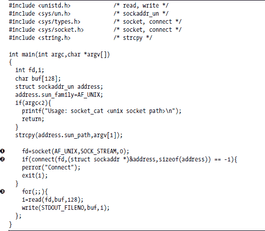

该程序位于 CD 上的/Code/src/examples/socket_cat.c。使用以下命令构建并运行程序：

**laddie:~#** cd /Code/src/examples/socketcat

**laddie:~#** make

**laddie:~#** ./socketcat /dev/lircd

然后按一下遥控器上的几个按钮。你应该会看到以下类似的输出。

0000000000000c90 00 VOL- /etc/lircd.conf

0000000000000490 00 VOL+ /etc/lircd.conf

0000000000000890 00 CH- /etc/lircd.conf

0000000000000090 00 CH+ /etc/lircd.conf

0000000000000a90 00 POWER /etc/lircd.conf

0000000000000a90 01 POWER /etc/lircd.conf

0000000000000a90 02 POWER /etc/lircd.conf

每个字符串包含一个 16 字符的十六进制命令代码、一个十六进制重复计数、一个命令字符串以及遥控器的名称（默认为 lircd 配置文件的名称）。注意，在这个序列的末尾，当持续按下电源按钮时，重复计数会增加。

16 字符的命令代码通常没有太大用处，因为所有相关信息都已被命令和遥控器的名称所捕获。然而，看到命令代码如何对应于输入波形是有趣的。例如，*0xc90*是我们在第 198 页的“编码遥控器命令的协议”中看到的索尼电视音量-命令的命令波形 12 位（从左到右）的十六进制表示。完成 socket_cat 后，按 ctrl-C 终止程序。

**注意**

*当按下遥控器按钮时，根据按钮和协议的不同，命令可以非常快地重复。对于 Laddie 帧缓冲区 UI，我们利用了与 lircd 输出相关的重复计数来忽略每个按钮按下关联的所有命令，除了第一个命令。*

***LIRC 应用程序控制工具***

如前一小节所示，编写一个通过/dev/lircd 套接字响应遥控器命令的程序很简单。但如果你想要使用遥控器来控制一个已经存在但设计时是为键盘输入而不是遥控器输入的程序，该怎么办呢？实际上，LIRC 软件包通过连接到/dev/lircd 套接字并产生许多程序预期的输出类型来解决这个问题。

ircat 工具是一个很好的例子，因为它是最简单的；当按下遥控器按钮时，它会将用户指定的、以换行符分隔的字符串打印到标准输出。如果你有一个从标准输入接收命令的程序，你可以通过将 ircat 的输出管道到你的程序来使用 LIRC 来控制它。要将遥控器按钮映射到适当的输出，配置文件/etc/lircrc。LIRC 软件包提供的 HTML 文档提供了关于此文件格式的详细信息。

类似地，LIRC 软件包提供了一个用于模拟键盘输入的 irpty 实用程序，一个用于调用系统调用的 irexec 实用程序，以及一个生成 X 事件的 irxevent 实用程序（适用于运行 X 的系统）。同样，这些操作根据/etc/lircrc 文件映射到遥控器按钮。所有这些实用程序都使用名为 lirc_client 库的 API 来访问/dev/lircd 套接字。ircat 工具的源代码提供了一个如何使用此库的简单示例。

最后，LIRC 软件包包含一个名为 lircmd 的守护进程，它使用遥控输入来模拟鼠标。该守护进程连接到/dev/lircd 套接字，并在管道/dev/lircm 上产生鼠标事件。配置文件/etc/lircmd.conf 选择 X 鼠标事件（例如，IntelliMouse）的协议，并指定远程命令如何映射到鼠标移动和按钮按下。必须更新 XF86Config 文件以包括/dev/lircm 作为输入设备。同样，LIRC HTML 文档提供了详细信息。

***控制 Laddie 设备***

对于 Laddie 设备，我们安装了 LIRC 软件包，并按照前几节所述配置了 lirc_serial 驱动程序和 lircd 守护进程。由于我们是从头开始构建 Laddie 设备的，所以我们不需要使用 LIRC 工具如 ircat 或 irpty；相反，我们编写了类似于 socket_cat 示例的代码，该代码直接访问/dev/lircd 套接字。

如前一章所述，Laddie 的帧缓冲区用户界面是基于 Simple DirectMedia Layer (SDL)库构建的。由于 SDL 包含它自己的事件处理器，特别是处理键盘按键，因此将远程控制事件集成进去是一件简单的事情。我们创建了一个单独的 lircHandler()线程来从/dev/lircd 套接字读取命令，解析这些命令，然后将适当的键盘事件推送到 SDL 事件队列。具体来说，我们通过模拟 SDL 按键事件来响应 Channel+/–和 Volume+/–遥控命令，分别对应向上、向下、向右和向左箭头键。我们通过模拟 SDL Enter 按键事件来响应遥控器的 Power 命令。在 Laddie 的 SDL 事件处理器中，我们通过调用 Laddie 菜单对象的导航命令来响应这些按键事件。这种使用/dev/lircd 输出控制 Laddie 帧缓冲区菜单的方法如图 12-15 所示。

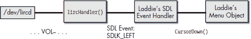

*图 12-15：控制 Laddie 帧缓冲区用户界面*

如果你想查看 lircHandler()线程的详细信息，你可以查看 CD 上的/Code/src/fbmenu/lirc_if.cc 文件。

如果你已经构建了本章中描述的 IR 接收器并且成功完成了练习，你应该能够使用它来控制 Laddie 帧缓冲区用户界面。我们为了做练习而停止了 Laddie 设备守护进程；你现在需要重新启动它们。使用以下命令执行此操作：

**laddie:~#** laddie start

这将需要几分钟时间，之后你应该能看到帧缓冲区用户界面。现在，当你使用 irrecord 创建 lircd.conf 文件时，尝试使用你编程的按钮。你应该能够浏览菜单按钮并切换菜单页面。

**摘要**

红外线是一种在设备处于视线范围内时控制设备的有用手段。为了有效，红外线必须由发射器以特征频率调制，并且这种调制必须由接收器去除。幸运的是，有商业设备可以轻松满足这些要求。对于红外接收器，我们介绍了红外检测/解调器，并展示了如何在简单的红外接收器电路中使用它们。对于红外发射器，我们推荐使用通用遥控器。

我们还描述了 Linux 红外遥控（LIRC）软件包作为一个控制设备的实用工具。此软件包提供用于测量和解释红外波形的设备驱动程序和守护进程，以及用于控制设备的实用程序。尽管我们没有讨论整个 LIRC 软件包，但我们确实描述了用于 Laddie 设备的软件包元素。我们希望这个红外通信概述以及 LIRC 软件包的示例应用将是你决定为自己的设备使用红外遥控的有用起点。

