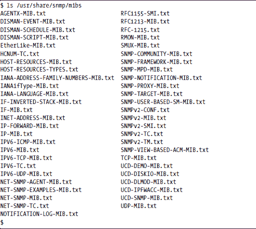
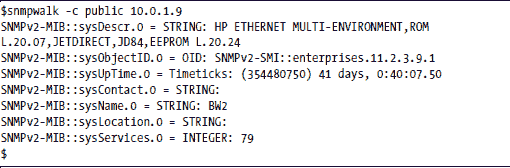
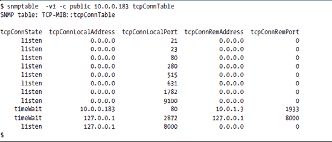
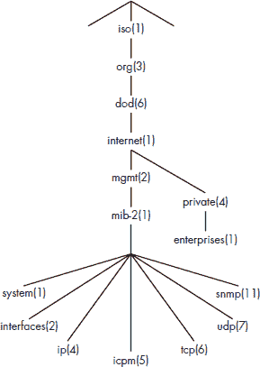
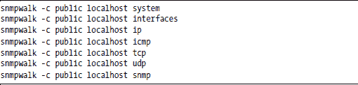
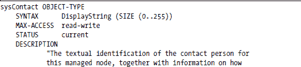
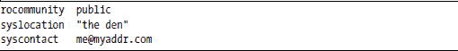
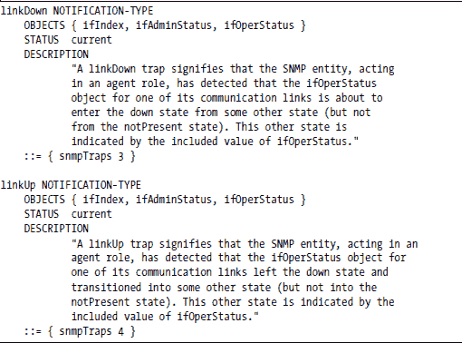
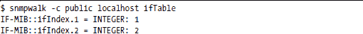

**SNMP 实践入门**

我们常说，业余爱好和商业网络设备之间的区别在于 SNMP。任何拥有大型网络的公司都会使用简单网络管理协议（SNMP）作为其网络和系统管理解决方案的一部分。没有你的设备上提供 SNMP 支持，你根本无法进入大型企业和电信运营商市场。

如果你的目标市场包括拥有大型网络的公司，而你对自己的 SNMP 知识不够自信，那么这一章节就是为你准备的。然而，如果你将针对家庭或小型商业市场（或者你的设备根本不联网），你可以安全地跳过这一章以及随后的 SNMP 章节。

本章将介绍 SNMP，并使您了解 SNMP 能做的一些事情。本章涵盖的主题包括：

+   SNMP 术语简介

+   查找软件

+   安装软件

+   启动代理

+   使用 SNMP 进行探索

+   使用 SNMP 写入值

+   SNMP 陷阱

**术语快速说明**

这里是对您理解本章内容所需的最基本概念和术语的快速浏览。要了解 SNMP 概念和术语的完整介绍，请参阅附录 B。

*SNMP*是一种设计用于在网络中读取和写入少量信息的协议，如单个数字和字符串。你不会使用 SNMP 进行大量数据，如文件传输。

在 SNMP 中，读操作称为 GET，而写操作称为 SET。SET 或 GET 操作的目标称为对象。*对象*就像数据库记录中的一个字段。

SNMP 将对象视为组织在一个称为*管理信息库（MIB）*的单个大数据库中。将 SNMP 视为设备信息的 API 可能有所帮助。它隐藏了对象检索的细节，并在一个有组织的分层命名空间下。每个系统上的 SNMP 代理提供这个 API。*代理*是一个在后台（守护进程）中监听 UDP 端口 161 上的 SNMP 请求的过程。在 API 之下，代理可能与内核或系统上运行的某些应用程序进程交互；它也可能从不同的来源读取几条信息，并应用数学公式来提供 MIB 中定义的值。MIB 中的对象也可能代表功能而不是数据；例如，将 MIB 对象设置为特定值可能会触发重启或服务的重新启动。

MIB 分层命名空间与 Unix 文件系统非常相似，但它使用数字而不是目录和文件名，并使用.字符而不是/目录分隔符。因此，文件路径可能看起来像这样：

/usr/sbin/ifconfig

MIB 中对象的名称（称为*对象标识符*，或*OID*）可能看起来像这样：

.1.3.6.1.2.1.1.1

MIB 文件描述了完整的 MIB 数据库的部分内容。通常，每个 MIB 文件描述一个 *MIB 模块*，它是整体数据库的一个子树。MIB 文件既可由人类阅读，也可由程序阅读。它们为人类记录了 MIB，并为程序提供了一种在数字字符串和人类可读名称之间进行转换的手段。尽管我们谈论 *MIB* 时指的是可由 SNMP 地址访问的宇宙，但 *MIB* 这个术语更常见的用法是指这些命名子树中的一个。例如，你可能会听到关于 *主机资源 MIB*、*HP 打印机 MIB* 或 *MIB-2* 的讨论。这些都是子树，但它们都在整体命名空间内可寻址。

在所有 MIB 中，最著名的是名为 *MIB-II* 的神秘名称。当 SNMP 首次创建时，IETF 的 SNMP 工作组定义了一组核心信息。这是第一个 MIB，或称 *MIB-I*。几年后，SNMP 工作组修订了这个核心集，它变成了 *MIB-II*。我们在这个章节中使用 *MIB-2*，而不是 MIB-II，以匹配定义此 MIB 的 MIB 文件中使用的名称。

一旦安装了正确的 MIB 文件（你稍后会看到如何做这件事），你就可以使用 snmptranslate 命令来为数字 ID 提供人类可读的名称（关于这一点稍后还会详细介绍）。例如：

$snmptranslate -Of .1.3.6.1.2.1.1.1

.iso.org.dod.internet.mgmt.mib-2.system.sysDescr

$

这应该足够你开始学习了。

**软件**

Net-SNMP 是一个优秀的免费软件包，包含了你在本章中需要的一切。Net-SNMP 将为你提供命令（snmpget、snmpset、snmpwalk、snmptrap）、一个 SNMP 代理和标准 MIB 文件。通常，命令和代理会在不同的系统上运行，但为了简单起见，你将在同一系统上运行它们。如果你有两个系统可用，你可以在两个系统上执行完整的安装；然后你可以在一个系统上运行 snmpget，例如，并在另一个系统上与代理通信。如果你使用两个系统，请记住在本章代码中更改所有 localhost 或 127.0.0.1 的实例，以匹配运行 SNMP 代理的系统名称或地址。

**安装 SNMP**

在安装之前，检查你的系统上是否已经安装了 Net-SNMP——许多常见的 Linux 发行版都提供了一些版本的 Net-SNMP。如果你有一个非常旧的 Linux 发行版（如 Red Hat 7.*x*），你可能会发现 UCD-SNMP；这是 Net-SNMP 的一个较旧版本或父版本。尽管它的行为与 Net-SNMP 非常相似，但差异足以让试图遵循本教程的人感到困惑；你应该将其删除，并按照这里的说明安装 Net-SNMP。如果你发现安装了其他包，在继续之前一定要将其删除。

即使 Net-SNMP 目前没有安装在你的系统上，它可能包含在你的 Linux 发行版中，所以检查你的光盘。不过，请注意，不同的 Linux 发行版可能已经修改了 Net-SNMP 以符合它们自己对默认文件位置的看法，并且可能包含不同的补丁。自然地，你的 Net-SNMP 版本越接近本章中使用的版本（版本 5.2.1），你的结果就越接近这里显示的结果。

***下载和安装***

如果 Net-SNMP 没有包含在你的 Linux 发行版中，你可以从 [`net-snmp.sourceforge.net`](http://net-snmp.sourceforge.net/) 下载它。你可以从 RPM（假设你正在运行基于 RPM 的发行版，如 Fedora）或源代码安装，但为了现在，让我们安装二进制的 RPM。顺便说一句，如果 rpm 抱怨缺少依赖项，你可能必须先处理它们，然后重试此命令。)

***检查安装***

现在测试它是否工作。首先，测试代理。

现在检查工具。使用哪个工具来找出它们安装的位置，然后列出该目录中以 *snmp* 开头的所有命令。

我们只会使用其中的一小部分命令，但一旦你掌握了基础知识，你可以自由探索其他命令。

现在让我们检查版本，以确保它是我们刚刚安装的版本，而不是潜伏在你路径上的某个旧版本。

$ snmpwalk --version

NET-SNMP 版本：5.2.1

$

***配置代理***

到目前为止，一切顺利——你已经有了客户端程序。现在你需要让代理程序运行，这样这些程序才有东西可以查询。

代理程序作为守护进程运行，默认情况下监听 UDP 端口 161 上的传入 SNMP 请求。它需要一些配置信息，它通常从 /etc/snmp 目录中的 snmpd.conf 文件中获取。（注意 snmpd.conf 中的 *d*；它表示 *daemon*——我们的代理。不要与稍后将要介绍的 snmp.conf 混淆。）Snmpd.conf 告诉代理如何验证传入的请求，将陷阱（SNMP 报警通知）发送到何处，等等。

Net-SNMP 提供了一个名为 snmpconf 的程序，它可以从一系列问题的答案中生成 snmpd.conf 文件，但由于你的需求非常简单，你可以手动生成配置。你的 snmpd.conf 文件应包含：

rocommunity 宏设置你的只读共同体字符串，现在你可以将其视为类似密码的东西。Net-SNMP 提供比这更精确的访问控制，但这超出了我们现在的需求。

syslocation 和 syscontact 行设置了 MIB-2 系统组中 sysLocation 和 sysContact 对象的值。当您只管理位于同一位置的一小套系统时，这些信息可能并不很有趣，但在拥有多个站点的庞大企业网络中，了解如何定位系统以及找出谁负责它可能非常有价值。（在本章稍后，您将看到如何使用 SNMP 查询通过网络访问此信息。）

将此 snmpd.conf 文件放入/etc/snmp 目录。上面的三行就是您开始所需的所有内容。

***启动代理**

启动代理，并将其放入后台。代理监听端口 161，因此您需要以 root 身份登录才能执行此命令：

/usr/sbin/snmpd -c /etc/snmp/snmpd.conf -C &

-c /etc/snmp/snmpd.conf 告诉代理使用给定的配置文件，而-C 告诉代理只使用此配置文件。

现在，您只需输入上述命令（作为 root），但在您的设备上，您希望 SNMP 代理与系统一起启动。

**使用 SNMP 探索**

现在，让我们将注意力转向客户端。snmpget、snmpwalk 和 snmpset 都是 SNMP 客户端命令，或者称为*SNMP 管理应用程序*。在 SNMP 术语中，*管理器*或*管理应用程序*用于客户端，而*代理*用于服务器端。代理在设备上提供数据，而 SNMP 管理器是请求设备信息的客户端。您不需要以 root 身份登录即可使用这些客户端命令。

让我们使用 snmpget 来测试我们的代理安装。

$ snmpget -v2c -c public localhost sysLocation.0

SNMPv2-MIB::sysLocation.0 = STRING: "my den"³

$

您已告诉 snmpget 使用 SNMPv2c（基于社区的 SNMP 版本 2）和社区字符串 public 向本地机器发送查询，请求 sysLocation 变量的值，该值您已在 snmpd.conf 文件中配置。sysLocation 名称后附加的.0 是 SNMP 表示您想要此变量的*实例*的方式。在面向对象的语言中，将 sysLocation 视为一个只有一个实例的类。如果这是一个位置（表）数组，则.0 将被变量的行号（.1、.2、.3 等）替换。行号始终从 1 开始，因此行索引和标量指示器之间不会混淆。

您需要告诉 snmpget 命令使用 SNMPv2c，因为它默认为 SNMPv3；您可以通过生成具有不同默认值的 snmp.conf 文件来更改它。您可以使用 snmpconf 生成文件，这次选择 snmp.conf（没有*d），但您也可以通过以下单个命令（以 root 身份运行）手动创建 snmp.conf 文件。

echo "defversion 2c" > /etc/snmp/snmp.conf

现在你可以停止在每个命令中输入-v2c 了。

如果你可以访问任何其他网络设备，你可以尝试查询它们。例如，这里是对 Apple AirPort 基站运行的 snmpwalk 命令：

显然，设备的 sysDescr.0（系统描述）将其识别为 Apple 基站。你也会认出这个设备的 sysLocation 和 sysContact 信息。这个设备提供的信息不多，但足以确定它是什么，在哪里，以及如果你发现它表现不佳，应该联系谁。当然，系统联系人和位置的可用性都依赖于该系统的管理员，他们会在目标设备上配置这些值。一个粗心的系统管理员可能让你没有太多可以工作的。

注意，对于这个查询，我们使用了 snmpwalk 而不是 snmpget，因为我们想看看这个设备可能提供哪些其他信息。snmpget 命令使用 SNMP GET 协议数据单元检索单个对象实例，而 snmpwalk 使用多个 SNMP GETNEXT PDUs 来“遍历”整个 MIB。你选择一个起点，snmpwalk 会请求下一个对象实例；代理返回该对象及其 OID，然后 snmpwalk 会请求新 OID 之后的下一个对象实例。最终，代理会响应说没有更多可以返回的信息，遍历结束。

***可读名称的 MIB 文件***

OIDs 的可读、易读名称（如*sysDescr*和*sysLocation*）取决于在你的客户端系统上注册了正确的 MIB 文件。在 Net-SNMP 的情况下，“注册”只是意味着将这些文件放在正确的目录中，并告诉 SNMP 命令（如 snmpget 和 snmpwalk）使用它们。你可以设置一些环境变量来自动完成这项工作。只需将这些行放入你的 shell 启动文件中（例如，.bashrc）：

export MIBS=ALL

export MIBDIRS=/usr/share/snmp/mibs

当你安装 Net-SNMP 时，它将一组标准 MIB 文件放置在/usr/share/snmp/mibs 中，如下面的列表所示。这些都是使用人类可读和机器可解析的语法编写的纯文本文件。

其中一些实际上描述了 MIB。其他是一些支持文件，它们定义了描述 MIB 的文件所需的信息，就像 C 语言中使用头文件一样。

没有这些 MIB 文件，Apple 基站系统组的显示将如下所示：

仅通过检查响应，你仍然可以了解很多关于设备的信息，但了解 OID 的含义会更好。

***网络打印机***

让我们尝试对另一种类型的设备进行另一个查询：

这次，管理员没有设置 sysContact 和 sysLocation。然而，我们至少可以确定正在使用的设备类型。一个线索在 sysDescr 字段中：*HP ETHERNET . . . JETDIRECT. . . .* 这是一个网络化的 HPJetdirect 打印机。

另一个线索，虽然对于一个新手来说很难读懂，但它在 *sysObjectID* 中——该字段中的 OID 表示设备的类型。这个 OID 以 enterprises 开头，表示下一个数字（11）是制造商的企业编号；您可以在 [`www.iana.org/assignments/enterprise-numbers`](http://www.iana.org/assignments/enterprise-numbers) 找到制造商企业编号的列表。在这里，您会发现 11 被注册给了惠普。如果您的系统上有正确的 MIB 文件，OID 的其余部分（.2.3.9.1）将确定设备的类型。

***snmptable 命令***

这个打印机的 SNMP 代理提供了比系统组多得多的信息，给我们一个机会展示另一个命令，snmptable。这个命令的行为与 snmpwalk 类似，但输出格式不同。我们在这里使用它来查看同一 HP Jetdirect 打印机的 TCP 连接表。

从这张表中，您可以查看打印机正在监听的 TCP 端口。您还可以看到有两个连接处于 *timeWait* 状态，一个是打印机（10.0.0.183，端口 80）与远程系统（10.0.1.3，端口 19333）之间的连接，另一个是本地系统自身两个 TCP 端口之间的连接。

***MIB-2: TCP 连接表***

现在我们将查看我们的系统。以下是本地系统的 TCP 连接表：

将其与 netstat 输出的我们的 TCP 监听习惯信息进行比较：

很明显，这是相同的信息，对吧？SNMP 允许您不仅在本地系统上，而且在网络上的其他系统上访问这些信息。

现在打开 Firefox，将浏览器指向 [`www.cnn.com`](http://www.cnn.com/)，然后再次查看 TCP 连接表：

表中已添加了几个连接，所有这些连接都是从本地系统的临时端口到几个远程系统的端口 80。这些是浏览器用来获取 CNN 主页各个部分的连接。

***MIB-2: UDP 表***

MIB-2 中另一个可能感兴趣的表是 UDP 表。

此表显示了系统上打开的 UDP 端口，即系统中某些应用程序正在监听的端口。（SNMP 代理本身正在端口 161 上监听。）为了参考，本系统的地址是 10.0.1.5。

将其与 netstat 输出进行比较。您必须以 root 用户运行 netstat 来获取程序名称。

***MIB-2 内容***

在 SNMP 中，术语*group*指的是 MIB 的一个子集，由一些以某种方式相关的对象或表组成。例如，MIB-2 的 UPD 和 TCP 组都是关于 UDP 和 TCP 流量的。Net-SNMP 代理可以构建以支持各种 MIB，但你可以始终期待找到 MIB-2 组 system、interfaces、ip、icmp、tcp、udp 和 snmp。这些并不是 MIB-2 中定义的所有组，但它们是任何 SNMP 代理最有可能支持的那些组。图 13-1 显示了 MIB-2 在整体 MIB 地址空间中的位置，并分解了组成 MIB-2 的一些组。同时注意 private.enterprises 分支的位置。那里你可以找到之前看到的 HP 打印机 MIB 对象。

*图 13-1: MIB-2*

尝试遍历这些组：

如果你愿意接受挑战，尝试比较上述命令的输出与 MIB 文件的内容。⁶这里列出的 snmpwalk 命令的输出将在每行输出的开头指示可以找到显示的对象定义的 MIB 文件。

SNMPv2-MIB::snmpInPkts.0 = Counter32: 5998

SNMPv2-MIB::snmpOutPkts.0 = Counter32: 5998

SNMPv2-MIB::snmpInBadVersions.0 = Counter32: 0

这些行表示你可以在 MIB 文件 SNMPv2-MIB.txt 中找到这些定义。为了帮助解释你在 MIB 文件中找到的内容，你可以阅读附录 B。

你还可能会发现你的 SNMP 代理被构建为包括主机资源 MIB、UCDavis MIB 和较新的 Net-SNMP MIB。尝试使用以下命令遍历这些 MIB：

snmpwalk -c public localhost enterprises ucdavis

snmpwalk -c public localhost enterprises netSnmp

可能会令你感兴趣的对象之一是你的代理的版本。

$snmpget -c public localhost versionTag.0

UCD-SNMP-MIB::versionTag.0 = STRING: 5.2.1

**使用 SNMP 写入值**

除了从代理读取信息外，SNMP 还可以用来设置远程系统上对象的值。让我们选择一个定义为具有读写访问权限的对象，并对其进行一些实验。

***设置 sysContact***

查看定义 MIB-2 中系统组的 MIB。记住，当我们访问系统组时，结果显示包含看起来像这样的行：

SNMPv2-MIB::sysContact.0 = STRING: me@myaddr.com

SNMPv2-MIB::sysName.0 = STRING: localhost.localdomain

SNMPv2-MIB::sysLocation.0 = STRING: "the den"

每行开头看到的是 SNMPV2-MIB 吗？这表示这些对象定义在 SNMPv2-MIB.txt 文件中。如果你查看该文件中这些对象的定义，你会看到以下片段：

您可以从这个片段中看到，MIB 文件定义了我们读取上述值的三个对象：sysContact、sysName 和 sysLocation。每个对象都描述为具有 DisplayString 语法、可读写访问权限和当前状态的对象类型。每个对象都有一个描述和以 :: = 开头的行，表示“定义为”。System 是 MIB-2 中的一个组，其 OID 为 { .1.3.6.1.2.1.1 }。MIB 文件中的这些行表明，这三个对象类型被定义为系统 (.1.3.6.1.2.1.1) 之后的对象 4、5 和 6，因此它们的 OID 为：

注意，这些是 OBJECT-TYPE 定义的对象标识符，而不是它们的实例。记住，如果您想使用 snmpget 读取实例的值，您需要在类型 OID 的末尾添加 .0。

足够阅读 MIB 文件了——我们只想找到一个可读写类型，以便我们可以尝试设置。让我们尝试设置 sysContact。

$ snmpset -c public localhost sysContact.0 s "me@myself.com"

snmpset: 未知主机（权限拒绝）⁸

$

代理拒绝请求。为什么？还记得您的配置文件吗？

您设置了一个只读的团体字符串，但没有设置可读写的团体字符串，因此您没有权限设置任何值。您必须配置一个可读写的团体名称。将以下行添加到您的 snmpd.conf 文件中，以配置可读写的团体字符串写入者：

rwcommunity writer

现在，您需要将此更改通知 SNMP 代理。向代理发送 SIGHUP 信号以使其重新读取其配置。您必须以 root 身份执行此操作：

杀死 snmpd 进程，发送 HUP 信号：

现在再次尝试运行 snmpset。

$ snmpset -c writer localhost sysContact.0 s "me@myself.com"

数据包错误。

原因：不可写入（该对象不支持修改）

失败的对象：SNMPv2-MB::sysContact.0

代理再次拒绝！这次，原因稍微不那么明显。如果对象值已在 snmpd.conf 文件中配置，Net-SNMP 代理将拒绝设置新值的请求。这不是 SNMP 标准的一部分，这只是 Net-SNMP 的工作方式。它假设您通过 snmpd.conf 文件配置了这些值，您可能不希望其他人远程更改它们。如果您想使这些值可写，您需要使用本地 snmpset 命令设置它们的值，而不是使用配置文件。

**注意**

*对此造成的误导表示歉意。我们的目的是强调 Net-SNMP 的这种不明显的行为，并可能为您节省一些时间。*

设置 sysName

现在您知道 sysContact 和 sysLocation 由于配置文件中的定义，您无法写入它们，尝试 sysName。您还没有为该值配置任何值。

$ snmpset -c writer localhost sysName.0 s "NewName"

SNMPv2-MIB::sysName.0 = STRING: NewName

snmpset 命令要求您使用读/写共同体字符串，并指定对象实例的名称、类型和新的值。s 表示您正在写入一个字符串值。这告诉 snmpset 命令如何格式化 SET 数据包。如果您写入了一个整型变量，类型将是 i。关于类型的完整列表，请阅读 snmpset 的 man 页面。当然，您设置的值的类型必须与您正在设置的对象的类型相匹配。

这是 sysContact、sysName 和 sysLocation 现在的样子：

$ snmpget -c public localhost sysContact.0 sysName.0 sysLocation.0

SNMPv2-MIB::sysContact.0 = STRING: me@myaddr.com

SNMPv2-MIB::sysName.0 = STRING: NewName

SNMPv2-MIB::sysLocation.0 = STRING: "the den"

$

**SNMP 陷阱**

除了响应 SET 和 GET 等 SNMP 请求外，网络中启用了 SNMP 的设备还可以发送本地事件的即时通知。这些通知要么作为 SNMP 陷阱发送，要么作为 informs 发送。*陷阱* 是不需要响应的报文。*informs* 相比陷阱是一个改进，因为它们期望一个确认响应，如果陷阱接收器没有及时确认，则会重新发送。超时和重试次数可以由陷阱发送者作为 snmptrap 命令的参数设置。

***使用 snmptrapd 接收陷阱**

您可以使用 snmptrapd 接收陷阱。在 Net-SNMP 的 5.2.1 版本中，这是我们本章中使用的版本，您只需打开一个单独的终端窗口并以 root 身份执行以下命令：

snmptrapd -Os -Le -f

然而，从 5.3 版本开始，snmptrapd 的安全性得到了加强，它不再默认接受任何共同体名称的陷阱。在后续版本中，您需要在 /etc/snmp 目录中创建一个 snmptrapd.conf 文件，并包含一行告诉它接受哪些共同体。我们将使用 *public*，因此我们的 snmptrapd.conf 文件将包含以下内容：

authCommunity log public

现在，您可以通过运行上面描述的 snmptrapd 命令来查看您接收到的陷阱。

此命令通常在后台运行，以便接收陷阱、格式化它们并将它们写入日志文件。但是，您在这里使用 -f 参数来告诉 snmptrapd 保持前台运行，并使用 -Le 参数将输出发送到 stderr。您还可以使用 -Os 参数来告诉 snmptrapd 只打印 OID 的最后一个符号部分，这将节省空间并使输出更易于阅读。

使用单独的命令窗口通过 snmptrap 命令发送陷阱。您需要以 root 身份运行 snmptrapd，因为它想要监听 UDP 端口 162。为了快速尝试，作为 root 运行以下任一命令：

snmptrap -c public localhost "" coldStart

或者

snmptrap -c public localhost "" .1.3.6.1.6.3.1.1.5.1

你可以将输出格式改为比我们下面显示的更易于阅读，但这将需要超出这里所需的格式化指令。snmptrapd 输出的默认格式如下：

2007-02-14 20:43:26 localhost.localdomain [127.0.0.1]:

sysUpTimeInstance = Timeticks: (4694125) 13:02:21.25

snmpTrapOID.0 = OID: cold Start

请记住，你正在使用 SNMPv2。发送 SNMPv1 陷阱的格式不同，而且稍微复杂一些。

coldStart 陷阱在技术上意味着网络管理软件已重新启动，配置没有变化。通常，这仅在运行代理的操作系统重新启动时发生，因此许多用户将 coldStart 视为重启指示器；然而，它也会在任何代理重新启动时发送。如果你在 snmpd.conf 文件中配置了陷阱目标并重新启动代理，你的 snmptrapd 将收到来自它的陷阱。试试看——将以下行添加到你的 snmpd.conf 文件中：

trap2sink localhost public

现在杀死代理并重新启动它，或者发送另一个 SIGHUP；snmptrapd 将指示它已收到 coldStart 陷阱。现在代理已经配置了陷阱目标，再次重新启动它。这次 snmptrapd 将显示以下内容：

2007-02-14 12:06:17 localhost.localdomain [127.0.0.1]:

sysUpTimeInstance = Timeticks: (33324) 0:05:33.24 snmpTrapOID.0 = OID:

nsNotifyShutdown

2007-02-14 12:06:37 localhost.localdomain [127.0.0.1]:

sysUpTimeInstance = Timeticks: (36) 0:00:00.36 snmpTrapOID.0 = OID: coldStart

snmpTrapEnterprise.0 = OID: netSnmpAgentOIDs.10

这有点混乱，但你可以通过查找时间戳来找到每个陷阱的开始。你将收到两个陷阱：nsNotifyShutdown 和 coldStart。代理在关闭时配置了陷阱目标，因此它发送了一个表示它即将离开的陷阱。当我们再次启动它时（在这个例子中的时间戳是 20 秒后）它发送了一个 coldStart。

与 coldStart 不同，nsNotifyShutdown 不是在 SNMP 规范中定义的陷阱，而是在 NET-SNMP-AGENT-MIB.txt 文件中定义的。它是 Net-SNMP 企业陷阱之一，这意味着它在 MIB 树中的 private.enterprises 部分下有 OID。这就是你在下一章开发自己的 MIB 时定义陷阱的地方。

**携带数据的陷阱：linkUp 和 linkDown**

你在这里看到的陷阱，coldStart 和 nsNotifyShutdown，不携带任何额外数据。它们只告诉你发生了关闭或启动。通用的陷阱 linkDown 和 linkUp 不同；它们包含在其定义的 OBJECTS 行中指定的额外信息：

每个陷阱定义中的 OBJECTS 行是将在陷阱中发送的参数列表。第一个是 ifIndex，它是 MIB-2 中接口部分接口表中的索引。其他参数定义了接口的管理和操作状态。试着在你自己的系统上查看这个表。由于 snmptable 命令显示时有点宽，所以这里提供了一个 ifTable 的 snmpwalk。

这个陷阱表明接口 2（你可以从上面的 ifTable 遍历中看到它是 eth0）在管理上是开启的，但在操作上是关闭的。由于这台机器只有一个以太网接口，你不太可能看到这种类型的陷阱（你不能从离线的接口发送陷阱），但当接口恢复时，你会看到 linkUp 陷阱。

到现在为止，你应该能够弄清楚如何发送产生这个输出的陷阱。试一试吧。

**总结**

本章让你领略了 SNMP 的功能。你已经在自己的计算机上安装、配置并启动了 Net-SNMP 代理。你使用 Net-SNMP 提供的 snmpget、snmpwalk 和 snmptable 命令探索了 SNMP 可以告诉你关于网络机器的哪些信息。你使用 SNMP 修改了系统中的一个设置（sysName）。你还发送和接收了一些陷阱。除了对无线接入点和网络打印机的简要探测外，我们只限于本地机器，以便即使不在网络上的读者也能有所乐趣地探索。

我们也将工具限制在 Net-SNMP 包自带的部分。标准协议的好处是，来自多个来源的软件可以互操作。你可以尝试查看来自其他来源的 MIB 浏览器。MIB 浏览器会为你遍历 MIB，并给出目标系统提供的 MIB 树的图形视图。你可以在[`www.mibble.org`](http://www.mibble.org/)找到一个这样的浏览器。

我们希望这一章能让你领略到 SNMP 对于网络管理员或 IT 专业人员是多么有用。SNMP 可以用来发现网络上的设备，根据其 IP 地址识别设备类型，甚至可以重新配置设备上的选项。这种观点在下一章设计自己的 MIB 时将非常有帮助。

__________________

¹ 互联网工程任务组（IETF）成立于 1986 年，是互联网的主要标准组织。参与是自愿的，对任何人开放。它的大部分工作是在*工作组（WGs）*中完成的，这些是针对某些特定主题感兴趣各方组成的临时小组。

² 在 CLI 章节的术语中，snmpconf 会被称作一个*向导*。

³ 如果您收到消息 Timeout: No Response from localhost，那么可能是有东西阻止了对端口 161 的 UDP 请求。检查您的防火墙设置和 /etc/hosts.deny 文件。如果您在 hosts.deny 文件中找到 ALL:ALL，请将其注释掉并再次尝试 snmpget。

⁴ SNMPv2c 被称为“基于社区的”，因为它保留了使用 SNMPv1 社区字符串（可以将其视为密码）进行认证。关于 SNMPv2 的新安全框架存在分歧，因此 SNMPv2c 在没有它的情况下发布。当它准备好时，新的安全框架在 SNMPv3 中发布。

⁵ 注意，MIB 对象是 sysLocation，但在 snmpd.conf 文件中的命令是 syslocation。这并没有什么意义；这只是实现者为了在配置文件中使用全部小写字母作为关键字的设计选择。

⁶ 如果您已经忘记了，MIB 文件位于目录 /usr/share/snmp/mibs 中。

⁷ 术语 *current* 表示它是在 MIB 中的一个活动类型，并且您可以期望得到它的值。

⁸ 您的错误信息可能因 Net-SNMP 的版本以及您是否使用 SNMPv1 或 SNMPv2 而有所不同，但无论如何您都会得到一个错误。

⁹ 您需要以 root 用户登录，因为命令将想要写入到 /var/net-snmp/ snmpapp.conf，这是持久数据存储。截至 Net-SNMP 5.3，它似乎想要在那里写入一个 SNMPv3 引擎 ID，尽管我们在这里并没有使用 SNMPv3。（SNMPv3 在本书中未涉及。）
