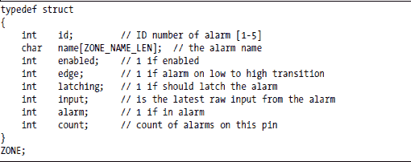
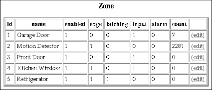
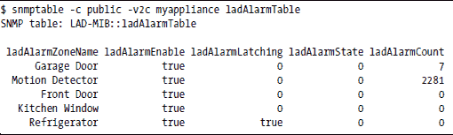
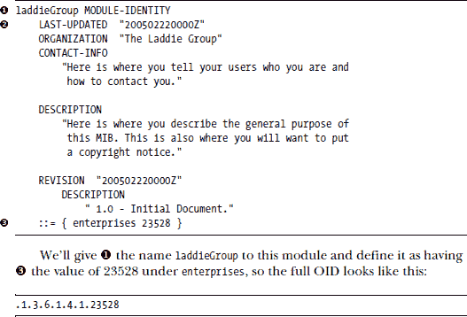
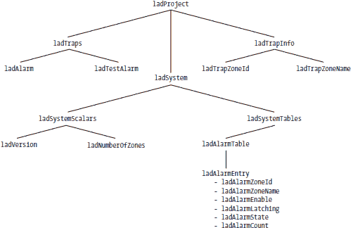
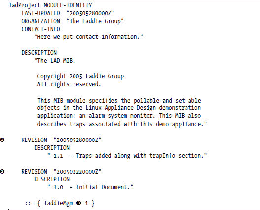
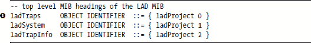
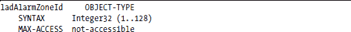
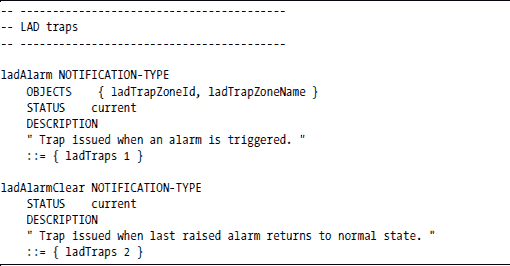
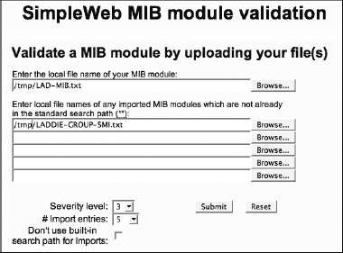

**设计 SNMP MIB**

如果您阅读了上一章，您已经对为什么可能需要 SNMP 接口以及它如何有用有一些了解。在本章和下一章中，您将看到如何将特定于设备的特定信息添加到这个接口中。像 Web、LCD 和 CLI 接口一样，SNMP 接口也将基于 Laddie 应用程序本身内的 RTA 表格中可用的信息。

本章主要关注 MIB 的设计和创建一个有效的 MIB 文件。这里涉及的主题包括：

+   申请企业编号

+   设计 MIB

+   创建 MIB 文件

+   验证 MIB

您将在下一章学习如何实现代理。

**我们的目标**

在第五章中，您看到了 Laddie 应用程序对 ZONE 结构的几个用户界面：帧缓冲区、CLI 和 Web。以下是 Laddie 源代码中的 ZONE 结构：

图 14-1 展示了在 RTA 表格编辑器中的样子。

*图 14-1：RTA 表格编辑器中的 ZONE 结构*

提前一点，这是我们完成设计和实现 MIB 后，相同信息在 SNMP 接口中的样子。

本章和下一章的任务是逐步向您展示如何从 ZONE 结构到上述 SNMP 接口，一步一步。当我们完成时，您应该了解如何在您自己的应用程序中做同样的事情，从本 MIB 中做大量的剪切和粘贴。

您可能已经注意到，我们没有在我们的 SNMP 视图中将*id*、*edge*和*input*列包括在内。这并非疏忽。根据接口的预期用途，这是由 MIB 设计者（或任何接口设计者）来决定的。在我们的情况下，我们决定*edge*和*input*信息过于特定于硬件，在这个接口中不是必要的。*id*列不是由我们的 SNMP 代理返回的，但将在需要访问特定行时用作警报表的索引。

**您的企业编号**

既然您的兴趣已经被激发，我们将通过为那些正在开始一个小公司以销售您的设备的人稍微绕道来制造悬念。您可能还记得上一章中当我们使用 SNMP 识别打印机时关于企业编号的简要讨论。每个 MIB 都需要锚定到整体命名空间，如果您正在设计一个私有 MIB，您需要自己的企业编号。这些由 IANA（互联网数字分配机构）分配。每个公司或组织只需要一个企业编号，因为 IANA 授予您管理您编号下树的主权。

从 IANA 获取企业号码可能需要一段时间，所以您应该尽早开始。一旦申请，IANA 会告诉您预计这个过程需要大约一个月。您可以在 IANA 处理您的请求的同时设计和实施您的 MIB。

这个过程本身相当简单。只需使用您喜欢的网络浏览器导航到 IANA 网站([`www.iana.org`](http://www.iana.org/))，然后在菜单中点击**申请表格**。在下一页，选择**私有企业号码（SNMP）**。您将看到一个在线表格需要填写。

在网页底部，有一个链接指向当前注册号码列表。您可能想查看一下，看看名单上都有谁。您会注意到一些相当容易辨认的名字在列表开头；这些公司从 SNMP 游戏一开始就参与其中。IBM 的号码是 2。思科有 9。惠普有 11。您可以向下滚动到底部，看看当前的最高号码是多少。您也可能认出编号为 23528 的条目。这是我们将在本章中开发的 Laddie MIB 所锚定的子树的开始。

当您开始申请时，您将被要求提供以下信息：

+   您的公司或组织名称

+   公司的地址

+   公司的电话号码

+   联系人的姓名

+   联系人的地址

+   联系人的电话号码

+   联系人的电子邮件地址

+   传真号码

当您查看当前列表时，您可能已经注意到，只有企业号码、公司名称、联系人姓名和联系人的电子邮件地址在网上列出。在这里使用除您的一般电子邮件地址以外的其他地址是个好主意，因为很可能会被垃圾邮件机器人收集。有一个单独的地址用于此目的，一个可以转发给未来负责您的 SNMP 工作的任何人的通用地址。

请在表单中输入您的信息，然后点击**提交申请**按钮。

**MIB 文件**

IANA 授予您管理自己的子树的权力，但您需要做好这项工作的质量。计划成功，不要将这个设备视为终点——留出扩展的空间。您可能希望在单独的文件中定义您的企业号码，这样您就可以放置所有 MIB 的共同信息。（顺便说一句，阅读其他人的 MIB 是一个非常好的主意。您会发现什么是有共同使用的，您可能会在途中找到您觉得吸引人的风格。）

在本章中，我们将创建以下两个文件：

**LADDIE-GROUP-SMI.txt**

这是我们将定义 Laddie 集团企业号码和我们的产品标识 OID 的文件。¹

**LAD-MIB.txt**

此文件将包含 Laddie 产品 MIB。此 MIB 将在 LADDIE-GROUP-SMI.txt 文件中定义的 OID 下锚定。

我们将使用 Net-SNMP 提供的实用程序来运行这些文件，以生成我们 MIB 实现的骨架代码。您还希望将这些文件放在任何将运行管理应用程序（snmpget、snmpset、snmpwalk 等）或解释陷阱和通知的系统上。

您使用的网络管理系统将定义您放置这些文件的位置。Net-SNMP 管理应用程序倾向于希望它们位于目录/usr/local/share/snmp/mibs 中，尽管您可以修改此设置，并且它取决于您使用的操作系统分发的偏好。对于我们的设备，我们将它们放在/opt/snmp/share/snmp/mibs 中。

**LADDIE-GROUP-SMI**

这是描述我们将使用以组织 Laddie 企业子树的顶层结构的文件。它包含我们的企业编号和产品标识 OID。这个文件很小，所以让我们看看整个文件，然后讨论其结构。（地址、电话号码和传真号码是假的，以保护鲍勃的隐私，但您会得到一般的概念。）

现在，让我们更详细地查看这个文件。我们首先展示 MIB 文件的一部分，然后讨论它。阅读的最佳方式是简要扫描 MIB 文本，然后参考 MIB 文本阅读描述。

LADDIE-GROUP-SMI DEFINITIONS ::= BEGIN

这行代码为 MIB 赋予一个名称，并告诉读者（无论是人类还是程序）这是我们对这个 MIB 定义的开始。在文件的底部寻找匹配的 END，以告诉读者所有定义何时完成。

IMPORTS 部分类似于 C 程序中的#include 部分——它告诉在哪里可以找到在此 MIB 中使用的但未在此定义的术语。我们包含了MODULE-IDENTITY 宏和enterprises 以供下面使用。

接下来，我们定义了 laddieGroup 模块：

LAST-UPDATED 和 REVISION 行中的奇怪字符串是一个时间戳，指定了最后更改或修订的年份、月份、日期、小时和分钟。"Z"代表 GMT（格林尼治标准时间），有时称为"Zulu Time"。小时和分钟通常是零，因为没有人真的关心修订是在哪个小时和分钟进行的。数字"200702220000Z"表示 2007 年 2 月 22 日。如果有分隔符，它看起来像这样：2007-02-22 00:00。

这是我们将在下一节中定义的 LAD-MIB 的锚点位置。

-- 产品在此处注册：

laddieProducts OBJECT IDENTIFIER ::= { laddieGroup 2 }

laddieAppliance OBJECT IDENTIFIER ::= { laddieProducts 1 }

laddieProducts 部分是我们定义识别我们的产品（或整个产品线，如果您真的很大）的 OID。在这里，我们为 Laddie 设备定义了一个 OID，我们将在 MIB-2² 中设置我们的设备的 sysObjectID 为此值。这将允许使用 snmpget 等 SNMP 工具轮询此盒子的某人确定这是一个 Laddie 设备。大型公司可能会将识别所有产品的 OID 放入一个单独的文件中。例如，思科有一个 CISCO-PRODUCTS 文件，它收集了所有这些 OID。目前，Laddie 只有一个产品 OID，所以我们不会为此麻烦。

END

这是我们一直在寻找的 END。这是 LADDIE-SMI-MIB.txt 文件的结尾，并结束了我们对它的讨论。

**创建 LAD-MIB**

在本节中，我们将创建我们的设备 MIB。为了更好地了解 MIB 组件之间的关系，请参考图 14-2 中 LAD-MIB 结构的插图。在跟随 MIB 文件的开发过程中，参考这张图片可能会有所帮助。

LAD-MIB 分为三个主要部分：

+   ladTraps，包含陷阱定义

+   ladTrapInfo，包含发送到陷阱的信息对象定义

+   ladSystem，包含可轮询对象定义

让我们开始详细的讲解。同样，我们将展示一行或多行，然后讨论我们所展示的内容。

我们将从 BEGIN 语句和我们的 MIB 名称定义开始：

LAD-MIB 定义 ::= BEGIN

希望这看起来很熟悉。如果不熟悉，请再次查看 LADDIE-GROUP-SMI.txt 文件的开头。BEGIN 行表示我们开始定义 LAD-MIB，这是我们为我们的设备 MIB 命名。

*图 14-2：LAD-MIB 结构*

接下来，我们将导入我们将从其他文件中使用的已定义的外部类型和宏：

第一组与 LADDIE-GROUP-SMI.txt 文件中我们之前讨论的相同，来自  SNMPv2-SMI。

下一个集合来自  SNMPv2-TC。字母 *TC* 代表 *文本约定*。SNMPv2-TC 主要是定义新、常用对象类型的文件。

来自 LADDIE-GROUP-SMI.txt 文件的  laddieMgmt OID 将成为我们设备 MIB 的整体命名空间中的起点。我们将通过在“模块定义”部分的代码部分中定义此组下的 laddieMgmt 来使用 laddieMgmt 作为我们到整体命名空间的链接。

SNMPv2-SMI 和 SNMPv2-TC MIB 定义包含在 Net-SNMP 软件包中。当您在第十三章中在系统上安装 Net-SNMP 时，这些文件可能被放置在 /usr/share/snmp/mibs 或 /usr/local/share/snmp/mibs 中。在那里寻找 SNMPv2-SMI.txt 和 SNMPv2-TC.txt 文件。

***模块定义***

我们首先定义一个模块，ladProject，以包含我们的设备 MIB。这是我们放置版权、修订历史、联系信息和模块包含的一般描述的地方。

模块-标识符部分就像一个长句。第一行和最后一行合在一起说明 ladProject 是一个模块，直接位于  laddieMgmt 之下，在命名空间中，并且其 OID 是 laddieMgmt.1。以下是数字形式的 OID：

.1.3.6.1.4.1.3382.1

在上一节中讨论了 LADDIE-SMI 之后，MODULE-IDENTITY 部分的其余部分应该相当清晰。你可能注意到我们在  和  行列出了两个 REVISION 子句。如果你将来对你的 MIB 进行修改，你需要添加修订子句来解释你所做的更改。惯例是将修订子句按逆时间顺序保留（也就是说，最近的更改出现在顶部）。这并不意味着你可以随意更改你的 MIB；如果你更改了任何已经定义在 MIB 中的内容（名称、OID 等），你只是会给你的客户造成混乱。然而，你可能发现有必要根据客户需求或帮助你管理将要添加到你的设备中的新功能来增强你的 MIB。你可以添加新的结构，但不要更改现有的结构！

显然，你的 LAST-UPDATED 时间戳将与你的最新修订条款相匹配，就像我们上面所做的那样。

下面的几行定义了我们稍后将要详细说明的部分：

将所有部分标题的 OID 一起放在顶部，就像我们在这里所做的那样，是我们认为可以帮助传达 MIB 其余部分结构的风格选择。我们明确表示将有一个用于定义陷阱的部分，一个用于系统信息（我们将在这里放置我们的警报表）的部分，以及一个用于我们只会与陷阱一起发送的非可轮询信息部分。

在 SNMP 中的编号通常从 1 开始，而不是 0，但你可能已经注意到我们在 ladProject.0 的 OID 上方给出了 ladTraps 部分 。我们这样做的原因可以追溯到 SNMPv2（SNMP 版本 2）的早期，当时正在制定与 SNMPv1（SNMP 版本 1）的兼容性。更多详情，你可能想阅读 *RFC 1908: Internet 标准网络管理框架版本 1 和版本 2 的共存*。

我们将继续审查我们的 MIB，从 ladSystem 部分开始，并将陷阱留到以后。这样我们就可以立即在 ladTrapInfo 部分讨论陷阱。

-- LAD 系统信息

ladSystemScalars OBJECT IDENTIFIER ::= { ladSystem 1 }

ladSystemTables OBJECT IDENTIFIER ::= { ladSystem 2 }

在这里，我们将 ladSystem 部分进一步细分为标量部分和表格部分。*标量* 是不是表格列的对象。经验告诉我们，为了防止随着时间的推移 MIB 发展过程中标量散布在表格之间，应该将标量和表格分开。

***版本和区域数量***

接下来，我们将在 ladSystemScalars 部分定义一些标量。

在这里，我们定义了两个对象（注意 OBJECT-TYPE 关键字）：ladVersion 和 ladNumberOfZones。SYNTAX 子句告诉我们 ladVersion 是一个 DisplayString，这意味着它表示为可显示（可打印）字符的字符串，ladNumberOfZones 是一个 32 位整数，其值范围从 1 到 128。如果你回顾一下本 MIB 开头部分的 IMPORT 部分，你会看到这两个语法都是从 SNMPv2-TC，即文本约定文件中导入的。

MAX-ACCESS 子句告诉我们这些对象都是只读的。我们将在本 MIB 后面遇到的一些对象将具有读-写、不可访问或可通知访问。*读-写* 意味着你既可以读取对象的值，也可以写入新的值。你不能读取或写入定义为 *不可访问* 的对象，但你可能将其用作表的索引。*可通知访问* 是我们定义随陷阱发送的信息，但除此之外不可轮询的方式。

这里需要记住的一个要点是，MAX-ACCESS 子句定义的是 *最大* 访问权限，而不是 *实际* 访问权限。你永远无法编写具有最大访问权限只读的对象，但你可能也无法编写具有最大访问权限为读写的对象。对对象的写入能力可能受到其他因素的限制。例如，在 Net-SNMP 中，你可能无法写入 snmpd.conf 文件中设置了值的任何对象，无论 MIB 文件中的 MAX-ACCESS 子句指示的是什么。

STATUS 子句表明这两个对象都是当前的，也就是说，它们是 MIB 版本中的有效对象。要从 MIB 中删除对象，你会将其状态标记为已弃用。这是一个全新的 MIB，所以没有什么是已弃用的。

DESCRIPTION 子句专门用于 MIB 的人类读者，而不是计算机程序。它应包含对象的简要描述。它还可能包含值的可能用途以及读者可能需要了解的任何注意事项。

每个部分的最后一行定义了 OID。The ::= 表示 *定义为.* 每个 OID 都描述为附加到前一个 OID 上。ladNumberOfZones 对象的 OID 与 ladSystemScalars 相同，只是在末尾附加了一个 *2*。它的完整数字 OID 看起来是这样的：

.1.3.6.1.4.1.23528.1.1.1.1.2

这串数字的前六个数字来自标准 MIB，可以读作：

.iso(1).org(3).dod(6).internet(1).private(4).enterprises(1)

下一个数字是 IANA 为我们分配的自己的企业号，23528。因此，在企业之后，OID 的其余部分继续

laddieGroup.laddieMgmt.ladProject.ladSystem.ladSystemScalars.ladNumberOfZones

见图 14-3，了解 OID 中每个数字与其描述性名称之间的对应关系。

*图 14-3：ladNumberOfZones 的 OID*

***警报表***

现在来看我们 MIB 的核心：警报表。这是我们在本章开头显示的表格，显示了区域和警报状态。以下是我们在 MIB 中定义此表的方式：

注意，我们上面有三个定义块：ladAlarmTable、ladAlarmEntry 和 LadAlarmEntry。SNMP 要求所有对象名称以小写字母开头（因此，ladAlarmTable、ladAlarmEntry）。然而，LadAlarmEntry 不是一个对象，而是表格条目语法的定义。通常的做法是用与表格条目相同的名称来定义表格的*语法*，但以大写字母开头（*l*adAlarmEntry 与*L*adAlarmEntry）。ladAlarmTableEntry 的语法是其他对象类型的序列（列表或数组），这些类型是表中的列。

在定义表格条目语法之后，我们将列出 SEQUENCE 子句中列出的每个列的详细定义：

这些对象中的每个 MAX-ACCESS 子句定义了其可能的使用方式。我们将 ladAlarmZoneId 设置为不可访问，因为我们只会用它来索引表以读取或写入其他值。请注意，ladAlarmEnable、ladAlarmLatching 和 ladAlarmState 是可读写，但 ladAlarmZoneName 是只读。我们希望能够使用 SNMP 命令启用或禁用警报，改变它们是否锁定，并通过将它们的状态设置为 false 来清除警报。然而，我们认为更改区域名称是静态配置，应该通过另一个接口完成，例如 Web 接口或 CLI。ladAlarmCount 是警报触发的次数历史记录，因此我们将其设置为只读。

我们在这里做出的 MAX-ACCESS 选择没有强制性。你可能会不同意其中的一些选择，并设计不同的 MIB。查看第 244 页“我们的目标”部分中区域结构的 SNMP 显示。如果我们把 ladAlarmZoneId 定义为可读的，你会在每行开始处看到行号，就在区域名称之前。我们还可以将计数字段定义为可写，这样你就可以定期将其重置为零；这将允许你在不保存旧值并从新值中减去它的情况下，看到警报在一段时间内触发的次数。这些选择属于设计者。

***陷阱***

现在让我们离开警报表，继续我们的陷阱：

我们包含了两个陷阱：一个用于检测到入侵时升起红旗，另一个用于告知一切恢复正常。这些看起来与上面的 OBJECT-TYPE 定义非常相似，但我们使用 NOTIFICATION-TYPE 来定义陷阱。

ladAlarm 陷阱定义中的 OBJECTS 子句说明了将随陷阱一起发送的其他信息。这通常被称为 varbind 列表，即 *var*iable *bind*ings。这些变量，它们解释了为什么发送陷阱，当陷阱发送时与陷阱绑定。

这些是我们 varbind 列表中对象的定义。这些对象的 MAX-ACCESS 设置为 accessible-for-notify，这意味着它们不能被轮询；它们仅仅是为了方便陷阱接收者而定义对象。这些对象只有在附加到陷阱时才有意义。

早期的 SNMP 文档（RFCs）在创建时考虑到了将 SNMP 流量保持在最低限度，以防止网络因额外流量而负担过重。陷阱的目的是仅仅引起对可能问题的注意；你应该轮询设备以获取有关错误的详细信息。然而，如今，一些网络管理员将陷阱日志用作设备上发生事件的记录。他们希望所有相关信息都随陷阱发送并由陷阱接收软件记录。

你还应注意，你的设备不要因为陷阱而变得过于健谈。Laddie 很可能不会出现这个问题，但如果你正在构建一个打算放置在主要企业、ISP 或运营商网络上的设备，你最好考虑这一点。如果你每分钟检查一次错误条件，并在某个度量值超过可接受阈值时生成一个陷阱，那么在周五晚上发现错误的设备到周一早上可能会发送大约 3,500 个陷阱，所有这些陷阱都报告了相同的问题。来自不同设备的任何其他问题都会在嘈杂中丢失。你可能只想在首次发现问题时报告一次问题，然后发送另一个陷阱以指示问题已得到纠正。

支持发送大量陷阱的论点是，SNMP 是设计上不可靠的。它使用 UDP 数据包来报告问题，假设任何重要的问题都会被注意到不止一次，因此单个陷阱的丢失不会成为问题。如果你不能确定你的陷阱已被接收，你最好继续发送它，直到有人注意到，对吧？嗯，这是一个方法。另一个方法是只使用 informs 而不是 traps。*Informs* 在 SNMPv2 中可用，本质上是一些内置可靠性的陷阱。Informs 期望从接收者那里收到确认消息，如果它们没有看到确认，它们会重试一定次数。如果你觉得这还不够好，那么如果你的设备没有得到一些关注，你可能需要考虑为重新发送陷阱制定一个较低的频率计划。

END

最后但同样重要的是，END 标记表示 MIB 的结束。

**验证您的 MIB**

现在 MIB 已经编写完成，我们需要对其进行有效性测试。MIB 必须不仅可读，而且可由机器解析。MIB 的语法必须与计算机程序的语法一样正确，否则使用 MIB 的应用程序将无法解释它。幸运的是，网上有多个免费的 MIB 验证器可用。您只需要一个浏览器和您的 MIB 文件。当然，这里讨论的任何在线资源在您阅读这本书时可能已经不可用，但我们在这里使用的是 SimpleWeb 网站上的资源，如图 14-4 所示。您可以在 [`wwwsnmp.cs.utwente.nl/ietf/mibs/validate`](http://wwwsnmp.cs.utwente.nl/ietf/mibs/validate) 找到它。它自 1997 年以来一直存在，由荷兰的 Twente 大学运营。

*图 14-4：SimpleWeb MIB 验证器*

我们使用过的另一个免费验证器是由 Muonics 提供的，可以在 [`www.muonics.com/Tools/smicheck.php`](http://www.muonics.com/Tools/smicheck.php) 找到。

确保您不要跳过验证步骤！如果您没有正确地得到您的 MIB 的语法，从现在开始将没有任何东西能为您工作。

**摘要**

在本章中，您已经看到了如何申请企业编号，开发 MIB，并验证该 MIB。困难的部分是尝试设计 MIB 结构以适应未来的变化。对于 Laddie，我们的任务相当简单，因为我们的整个 MIB 都围绕一个简单的 RTA 表，MIB 很可能不会随着时间的推移而有太大的变化。为真实设备开发 MIB 的设计师并不容易。我们建议考虑您可能需要的基本信息类型，无论您的产品未来朝哪个方向发展。例如，您可能需要：

+   配置信息

+   统计信息

+   历史信息

+   杂项运行时状态

+   性能指标

+   使用级别

+   服务或资源饱和水平

这可能有助于您构建 MIB 结构，使您在未来的需求中生活更加轻松。

__________________

¹ 用于识别产品的 OID 作为 MIB-2 中 sysObjectId 的值返回。

² 您可以在包含在 Net-SNMP 软件包中的 SNMPv2-MIB.txt 文件中找到定义的 sysObjectID。
