**RTA 参考**

*运行时访问（RTA）* 是一个库，它将程序的内部结构和数组以数据库表的形式显示出来。RTA 使用 PostgreSQL 协议的一个子集，并且与 C 和 PHP 的 PostgreSQL 绑定以及 PostgreSQL 命令行工具 psql 兼容。本附录包含了 RTA 包的定义、数据结构和函数原型。

本附录中摘自 RTA 的内容包括来自文件 rta.h 的摘录。我们尽可能使用 rta.h 的精确文本。本附录中材料的非技术性描述见第二章和第三章。

本附录涵盖：

+   RTA 概述

+   RTA 常量

+   数据结构

+   API 子例程

+   SELECT 和 UPDATE 语法

+   内部 RTA 表

+   调试配置

+   错误信息

+   回调例程

Linux 家电缺乏对状态和统计信息的实时访问，以及一旦启动就无法配置服务的能力。作为 Linux 用户，我们假设要配置应用程序，我们将能够使用 SSH 或 telnet 访问服务，使用编辑器修改/etc 配置文件，并使用 kill -1 命令终止进程——因此，实时状态和统计信息是 Linux 程序员甚至不会想到要求的功能。缺乏运行时访问对 SSH 不可用的网络设备提出了特别的挑战，无论是由于未安装还是不允许。

对于家电设计师来说，另一个挑战是可能需要多种用户界面。许多家电都集成了网络、命令行、SNMP 代理、前面板和帧缓冲区接口的组合。无论 UI 如何，为最终用户提供一致的视图是一项非同小可的任务。

**RTA 概述**

RTA 包通过提供对运行程序内部数据结构和数组的实时访问来解决上述挑战。我们只需付出最小的努力，就可以使用 RTA 将程序的数据结构作为 PostgreSQL 数据库中的 PostgreSQL 表来显示。

使用 RTA，结构定义也是表格行的定义，结构数组的集合将显示为表格。例如，下面的代码展示了 TCP 连接信息的数据结构定义。

tcpconn 结构描述了一个单独的连接。如果有多个连接，则需要这些结构的数组。这个数组可能被分配如下

struct tcpconn Conns[10];

上述结构数组可以被视为数据库表，数组中的每个结构作为一个行，结构中的每个成员作为一个列。RTA 允许您使用任何具有 PostgreSQL 绑定的编程语言查询这个 TCP 连接表。以下是对 Conns 表中数据进行操作的两个示例 SQL 语句：

SELECT lport, dport FROM Conns WHERE fd != -1;

UPDATE Conns SET dport = 0 WHERE fd = -1;

如果上述声明没有意义，请不要担心；在本附录的后面有一个关于 SQL 的简短教程。

添加数据库 API 提供了几个优点。首先，调试变得更加容易，因为你可以使用简单的 PostgreSQL 工具来查看你程序的大部分状态。PostgreSQL 数据库 API 还包括对 PHP、Tcl/Tk、Perl、C、Java、Visual C++和许多其他编程语言的绑定，这使得构建 UI 程序更加容易。

数据库 API 还可以帮助加快开发速度。当 UI 程序使用的表被仔细定义时，核心应用团队可以在 UI 开发者处理网页、向导和各个 UI 程序的 MIB 时构建应用程序。

为了使你的数组和结构对数据库 API 可用，你必须告诉 RTA 关于表（包括名称、起始地址、行数以及每行的长度）和列（包括关联表名称、列名称、列的数据类型以及当列被读取或写入时是否调用特殊函数*回调*）的信息。

**RTA 常量**

这里是从 rta.h 文件中摘录的，显示了描述 RTA 包内部大小限制的常量。你可以更改这些限制，但如果你这样做，请确保使用你的新设置重新编译 RTA 包。

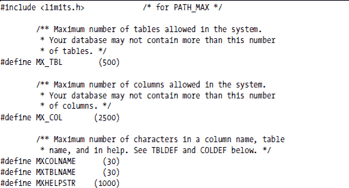

**数据结构**

回想一下，表中的每一列对应一个结构成员，表中的每一行对应一个数组元素。为了使 RTA 将你的结构数组视为表，你必须告诉 RTA 关于表的信息。你通过填写 COLDEF 结构来描述每一列，通过填写 TBLDEF 结构来描述每一表。以下是 rta.h 的摘录，它完全定义了与表和列相关的数据结构和常量。

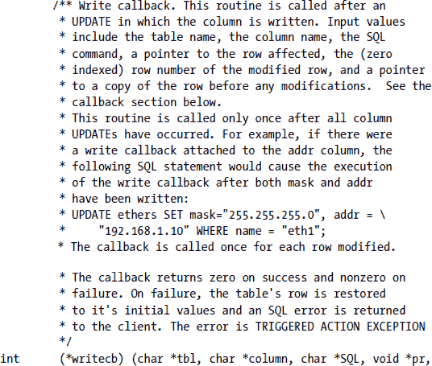

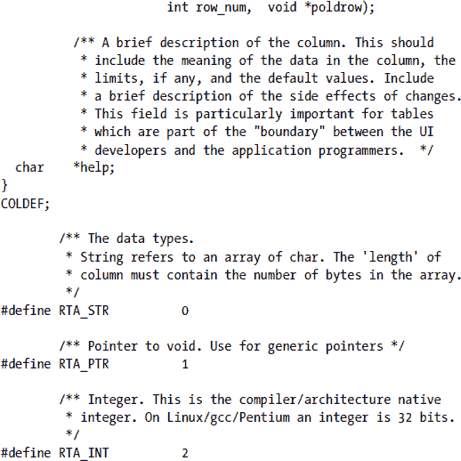

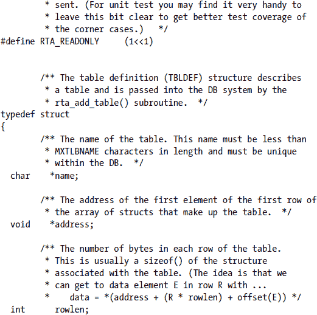

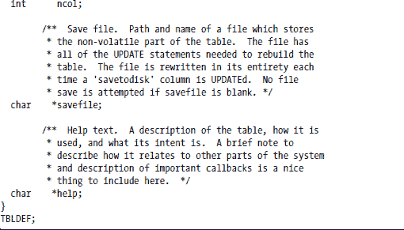

**API 子例程**

RTA API 中只有六个子例程。表 A-1 总结了它们。

**表 A-1：RTA PostgreSQL API 的子例程**

RTA 库中的子例程通常返回以下值之一。

***dbcommand()子例程***

你的设备中的主要应用程序接受来自 PostgreSQL 客户端的 TCP 连接，并通过 dbcommand()子例程将客户端的字节流（编码的 SQL 请求）传递给 RTA。然后，dbcommand()将字节流写入输入缓冲区以解析 SQL 命令。

如果输入缓冲区包含完整的命令，则将执行该命令，字符数变量（nin）将减少所消耗的字节数，并返回 RTA_SUCCESS。如果输入缓冲区中没有完整的命令，则返回 RTA_NOCMD，且不会从输入缓冲区中移除任何字节。

如果执行了命令，结果将被编码到 PostgreSQL 协议中，并放置在输出缓冲区（out）中。当调用子程序时，输入变量，输出字符数（nout），表示输出缓冲区中可用的空闲字节数。当子程序返回时，nout 变量将减少输出缓冲区中放置的响应的大小。如果输出缓冲区中可用的字节数不足以容纳 SQL 命令的响应，将生成错误消息。

下面的列表总结了 dbcommand() 子程序的输入缓冲区和字节。

下面的列表总结了 dbcommand() 子程序的返回值。

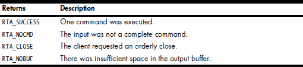

dbcommand() 子程序的原型如下所示。

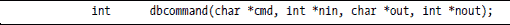

***rta_add_table() 子程序***

rta_add_table() 子程序将表注册为数据库接口的一部分，这为外部 PostgreSQL 客户端提供了访问表内容的能力。你需要为你的每个表调用 rta_add_table()。

注意，TBLDEF 结构必须静态分配。RTA 仅保留对表的指针，并不复制信息。这意味着你可以通过更改 TBLDEF 结构的内容来更改表定义的内容，这在需要为表分配更多内存并更改其行数和地址时非常有用。

当你在数据库中添加 RTA 表时，如果已存在具有相同名称的其他表或表未定义任何列，你将看到错误消息。

如果你指定了保存文件，保存文件中的 SQL 命令将作为 rta_add_table()调用的部分加载。有关更多详细信息，请参阅第 300 页上的“rta_load() 子程序”。

此列表总结了 rta_add_table() 子程序的输入。

此列表总结了 rta_add_table() 子程序的返回值。

rta_add_table() 子程序的原型如下所示。

***SQL_string() 子程序***

SQL_string() 子程序执行放置在空终止输入字符串 cmd 中的 SQL 命令。结果被编码到 PostgreSQL 协议中，并放置在输出缓冲区 out 中。当子程序被调用时，输入变量 nout 包含输出缓冲区 out 中可用的空闲字节数。当子程序返回时，nout 已通过放置在输出缓冲区中的响应大小递减。如果输出缓冲区中可用的字节数不足以容纳 SQL 命令的响应，将生成错误信息。

此子程序在更新表值以调用写回调时可能最有用。（输出缓冲区包含使用 PostgreSQL 协议编码的结果，可能不是直接很有用。）

以下列表总结了 SQL_string() 子程序的输入。

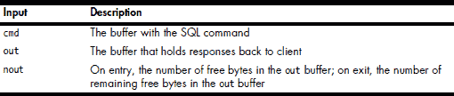

SQL_string() 子程序不返回任何内容。

SQL_string() 子程序的原型如下所示。

***rta_config_dir() 子程序

rta_config_dir() 子程序设置保存文件目录的默认路径。输入参数 configdir 指向的字符串被保存，并添加到具有保存文件的表的保存文件名称前。

在加载您的应用程序表之前，您应该调用 rta_config_dir() 子程序。此子程序旨在简化允许用户在命令行中指定配置目录的应用程序。

如果保存文件使用绝对路径（以 / 开头），则不会在配置目录前添加。

此列表总结了 rta_config_dir() 子程序的输入。

此列表总结了 rta_config_dir() 子程序的返回值。

以下显示了 rta_config_dir() 子程序的原型。

int rta_config_dir(char *configdir);

***rta_save() 子程序***

rta_save() 子程序将一个表保存到文件中，包括所有 savetodisk 列到指定的路径和文件。只有 savetodisk 列被保存。生成的文件是一个包含所需数据的 UPDATE 命令列表。表中每一行对应一个 UPDATE 命令。

rta_save() 子程序通过在目标文件相同的目录中打开一个临时（temp）文件来尝试防止保存文件损坏。子程序在 temp 文件中保存数据，然后自动调用 rename() 子程序将 temp 文件原子性地移动到保存文件。如果无法打开 temp 文件或无法使用 rename() 重命名 temp 文件，rta_save() 子程序将生成错误。

**注意**

*一般警告：请记住，任何磁盘 I/O 都可能导致程序短暂阻塞。因此，保存和加载表可能导致您的程序暂时阻塞。*

此列表总结了 rta_save() 子程序的输入。

此列表总结了 rta_save() 子程序的返回值。

rta_save()子程序的原型如下所示。

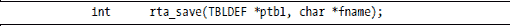

***rta_load()子程序***

rta_load()子程序从 UPDATE 命令的文件中加载数据表。文件格式是一系列 UPDATE 命令，每行一个命令。每次 UPDATE 发生时都会执行任何写回调。请注意，当您使用 rta_add_table()添加表时，会自动调用 rta_load()。以下总结了 rta_load()子程序的输入。

本列表总结了 rta_load()子程序的返回值。

rta_save()子程序的原型如下所示。

rta_save()子程序的原型如下所示。

**SELECT 和 UPDATE 语法**

下两节简要介绍了 RTA API 实现的两个 SQL 命令。RTA UPDATE 命令和 RTA SELECT 命令并不严格遵循它们的 PostgreSQL 等价物。RTA 不允许 JOIN 子句，WHERE 子句仅支持布尔 AND 运算符。没有锁或事务。

***SELECT 命令***

RTA SELECT 命令的原型如下所示。

SELECT column_list FROM table [where_clause] [limit_clause]

大多数 NCMDCOLS（如上定义）列可以在 column_list 或 WHERE 子句中指定。保留字*LIMIT*限制了返回的行数，与指定的数字相同。保留字*OFFSET*跳过指定的行数，并从下一行开始输出。

column_list 可以包含*（代表所有列的通配符），单个列名，或以逗号分隔的列名列表。

以下展示了 where_clause 语法的示例：

col_name = value [AND col_name = value ..]

在本例中，所有 col_name = value 对必须匹配，才能使行匹配。请注意，除了等于之外，您还可以使用其他五个比较运算符。以下列出了六个可用的比较运算符。

以下展示了 limit_clause 语法的示例：

LIMIT 5

您会发现 LIMIT 和 OFFSET 列非常有用，因为它们可以防止 dbcommand()输出缓冲区的缓冲区溢出。它们对于基于 Web 的 UI 也非常有用，用户希望一次查看一页数据。

有八个不能用作列名或表名的保留字。这些保留字是*AND*、*FROM*、*LIMIT*、*OFFSET*、*SELECT*、*SET*、*UPDATE*和*WHERE*。它们不区分大小写。

字符串可以包含以下任何字符：

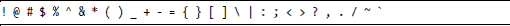

如果字符串包含双引号，则使用单引号将其括起来。下面的字符串用单引号括起来，因为字符串包含包围*Hi mom!*子串的双引号。

'标志说"嗨，妈妈！"'

使用双引号将嵌入单引号的字符串括起来。

下面展示了 SELECT 命令的示例。

***更新命令***

UPDATE 命令将值写入表。RTA UPDATE 命令的原型如下所示。

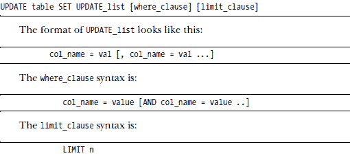

UPDATE 会调用受影响列的写回调。在调用回调之前，UPDATE_list 中的所有数据都被写入。

UPDATE 的 LIMIT 子句不是标准的 PostgreSQL，但此子句可以用于逐行遍历表。要更改表的第 wth 行，请使用如下所示的 LIMIT 子句。注意，*n* 是零索引。

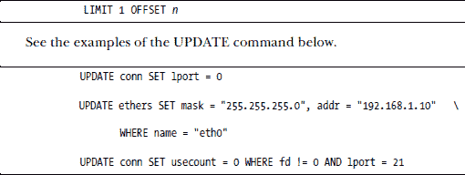

**内部 RTA 表**

当您使用 RTA 库时，您的应用程序将包含以下四个 RTA 表。

***rta_tables 表***

rta_tables 表提供了对所有内部和已注册表的 SQL 访问。表中的数据与使用 rta_add_table() 子程序注册的 TBLDEF 结构中的数据完全相同。此表是通用表编辑器，用于应用程序调试。rta_tables 表中的列如下所示，并对应于上述描述的 RTA_TABLE 数据结构中的字段。

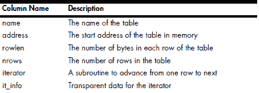

***rta_columns 表***

rta_columns 表列出了数据库中所有列的列定义。表中的数据与使用 rta_add_table() 子程序注册的 COLDEF 结构中的数据完全相同。此表用于通用表查看器和表编辑器应用程序，这些应用程序主要用于应用程序调试。

rta_columns 表中的列如下所示。

**调试配置**

RTA 包不生成任何用户级日志消息，只有调试消息。rta_dbgconfig 表指定了这些调试日志消息的处理。此表中的所有字段都是易变的。您需要在主程序中设置这些值以使它们看起来持久。请参阅下面的示例 SQL 字符串子程序。

SQL_string("UPDATE rta_dbgconfig SET target = 3")

rta_dbgconfig 表中的列如下所示。

**错误消息**

RTA 包中提供了两种类型的错误消息：SQL 请求消息和内部调试消息。

***SQL 请求错误***

SQL 请求消息包括作为 SQL 请求一部分返回的错误消息。以下列出了此类错误消息的六个。

错误：关系 '%s' 不存在

此回复表示在 SELECT 或 UPDATE 语句中请求的表不存在。%s 被请求的表名替换。

错误：属性 '%s' 未找到

此回复表示在 SELECT 或 UPDATE 语句中请求的列不存在。%s 被请求的列名替换。

错误：SQL 解析错误

此回复表示 SQL 请求格式不正确或 where 子句或 UPDATE 列表中数据类型不匹配。

错误：输出缓冲区已满

此回复表示对请求的响应大小超过了输出缓冲区的大小。（参见 dbcommand()和 out 和 nout 参数。）可以通过足够大的输出缓冲区或最好使用 LIMIT 和 OFFSET 来避免此错误。

错误：字符串长度超过 '%s'

此回复表示对字符串或字符串指针类型的列的 UPDATE 将超过列的宽度。%s 被列名替换。

错误：无法更新只读列 '%s'

此回复表示尝试更新标记为只读的列。%s 被列名替换。

***内部调试消息***

RTA 程序使用标准的 syslog()功能记录内部错误，该功能在所有 Linux 系统上可用。默认的 syslog()功能是 LOG_USER，但您可以通过在 rta_dbg 表中设置功能来更改默认设置。

您可以修改 syslogd 以进行后处理，例如从这些调试消息生成 SNMP 陷阱。RTA 程序以以下格式将所有内部调试错误消息发送到 syslog()：

rta[PID]：文件行号#：错误信息

RTA 程序将用进程 ID、源文件名和检测到错误的行号替换 PID、FILE 和 LINE#。

这里是用于生成调试和错误消息的定义。RTA 程序将在每个错误字符串的开始处替换%s %d，以表示检测到错误的文件名和行号。

**系统错误**

**RTA 错误**

**SQL 错误**

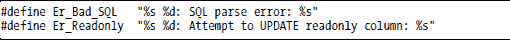

**跟踪消息**

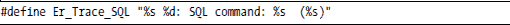

**回调例程**

如上所述，读取回调在列值使用之前执行，写入回调在所有列都已 UPDATE 之后调用。读取和写入回调在成功时返回零，在错误时返回非零值。

***读取回调***

读取回调有以下调用参数：

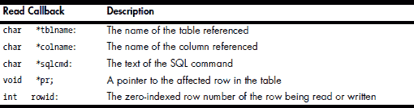

读取回调特别适用于计算总和和平均值等值。如果可能只在需要值时计算它们，则这些值不值得持续计算。

***写入回调***

写入回调最适合与配置更改相关联。因此，写入回调也是记录配置更改的好地方。

写入回调具有与读取回调相同的参数，额外增加了一个指向修改前行副本的指针。访问未修改行的副本对于检测行数据的更改非常有用。这很有用，因为一些 UI 可以在实际上没有更改的情况下生成一个更新操作。

回调在成功时返回零，在失败时返回非零值。在失败的情况下，表的行将恢复到其初始值，并向客户端返回一个 SQL 错误。返回的错误是触发动作异常。

写入回调有以下调用参数：

