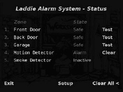

**LADDIE 设备可引导 CD**

伴随这本书的 CD 有两个用途。首先，它允许你通过将你的 x86 PC 变成一个工作设备来演示这本书中描述的技术。其次，它允许你尽可能详细地研究实现此设备的源代码。在本附录中，我们向你展示如何引导和运行 Laddie 设备 CD，并提供 CD 内容的导游。我们还提供了一个简单的例子，说明 CD 如何支持修改、重建和重新安装设备。

**运行 Laddie 设备**

Laddie CD 不需要你的机器运行特定的操作系统，你不需要安装任何东西，CD 也不会在你的硬盘上放置任何东西。实际上，你甚至不需要硬盘。CD 为根文件系统创建了一个 ramdisk，并通过链接回 CD，在这个上下文中运行 Laddie 设备。当你完成 CD 的使用后，只需将其取出并重新启动你的原始操作系统即可。你会发现没有任何变化。

为了运行 Laddie 设备，你需要一台基于 x86 的 PC，至少有 64MB 的系统内存，一个符合 VESA 规范的显卡（如果你希望运行帧缓冲用户界面），以及配置为从 CD-ROM 引导的 BIOS。

在本节中，我们将解释如何引导 CD，向您展示如何验证帧缓冲和 Web 界面是否正常工作，然后解释如何访问其他用户界面。我们还将解释如何关闭设备。

***引导 CD***

将 Laddie CD 放入驱动器中，重新启动你的计算机。如果 CD 成功引导，你会看到一个类似以下的消息：

在此阶段，你应该按 ENTER 键或等待六秒钟以继续引导序列。

商业设备通常会隐藏引导消息给用户。由于这是一个教育系统，我们希望你能看到它们。为特定硬件配置设计的商业设备也会更快地启动。但这个 CD 旨在与广泛的硬件配置一起工作，并为用户提供一个灵活的环境来实验和构建，因此这个过程会稍微长一些。特别是，启动脚本会加载系统识别的任何硬件的驱动程序，即使是 Laddie 设备不需要的硬件。

***导航帧缓冲用户界面***

一旦 CD 成功启动，系统将显示 Laddie 帧缓冲区用户界面的主屏幕（见图 E-1）。如果你看到这个屏幕，说明你已经成功运行了设备，你现在应该能够使用键盘的方向键和回车键来导航 Laddie 帧缓冲区用户界面。（如果你的键盘没有方向键，可以使用**i**向上，**j**向左，**k**向下，**l**向右。）

**注意**

*如果启动过程完成并且出现登录提示符而不是图 E-1 所示的屏幕，那么你的显卡可能不是 VESA 兼容的。在这种情况下，Laddie 设备仍然可以运行，但你将无法实验帧缓冲区界面。*

*图 E-1：Laddie 帧缓冲区用户界面*

***访问 Web 界面***

Laddie 设备以静态 IP 地址 192.168.1.11 启动。如果你的 PC 连接到 Laddie 操作系统识别的以太网卡所连接的局域网，该设备将提供网页，允许你监控和控制设备（见图 E-2）。你可以通过本地网络上的浏览器使用 URL [`192.168.1.11`](http://192.168.1.11/) 访问此 Web 界面。

*图 E-2：Laddie Web 界面*

**注意**

*你还可以使用基于文本的 Web 浏览器 Lynx 访问 Laddie 网页。在命令提示符中键入**lynx**，然后按照显示底部的说明进行导航。*

***实验 Linux Shell 和其他用户界面***

除了帧缓冲区和 Web 界面之外，Laddie 设备还支持命令行界面、前面板界面和 SNMP 界面。在尝试这些其他界面时，拥有一个 Linux shell 会很有用，这样你可以直接与操作系统交互。如果 Laddie 设备在网络上，你可以使用 telnet（即 telnet 192.168.1.11）访问登录 shell。要登录，输入用户名 root 和空密码。你还可以通过按 ctrl-alt-F1 从帧缓冲区用户界面切换到登录提示符。（如果你想稍后返回帧缓冲区界面，请按 ctrl-alt-F7。）

请参阅相应的章节，了解如何访问 CLI、前面板和 SNMP 界面。

***关闭 Laddie 设备***

Laddie 操作系统在系统运行时不会弹出 CD，因为它依赖于 CD 上的必要系统文件。要弹出 CD 并返回到原始操作系统，请在 Linux shell 中键入 reboot 重新启动计算机。当你看到 Laddie 引导提示符（如第 338 页上的“引导 CD”所示）时，按空格键中断自动引导，弹出 CD，然后按 CTRL-ALT-DEL 重新启动计算机以使用原始操作系统。

**探索 CD 内容**

如果您启动 Laddie 设备，然后从 Linux shell 中探索根文件系统，您会发现大多数顶级目录存在于 ramdisk 中，只有 /bin、/lib、/sbin 和 /usr 目录链接回 CD。特别是，与 Laddie 设备相关的所有目录都是可读写的，因此您可以使用 CD 来实验、重建和重新安装设备。

***Laddie 设备源代码***

Laddie 设备软件位于 /Code/src，并划分为与各种用户界面和服务对应的包。二进制文件和相关文件安装于 /opt/laddie。表 E-1 识别了 Laddie 设备组件的源代码和安装目录。

**表 E-1：Laddie 设备组件的源代码和安装目录**

除了这些组件外，/Code/src 目录还包含 buildapp 子目录，其中包含支持构建设备的脚本和文件。此子目录还包含一个 examples 子目录，其中包含我们在文本中讨论的示例程序。

在适当的位置，组件子目录包含 Makefiles。在 /Code/src 中还有一个顶级 Makefile，允许您使用以下命令构建和重新安装整个设备：

laddie:~# make

laddie:~# rm -rf /opt/laddie

laddie:~# make install

如果您想研究源代码，一个好的起点是 /Code/src/ladd 子目录中的警报代码。这是一个简单的应用程序，但它演示了空守护进程和 RTA 库。此服务的入口点位于 /Code/src/empd/main.c。main 函数在 ladd.c 中调用 appInit，它使用 RTA 发布警报区域表。

***Laddie 设备库***

Laddie 设备使用多个库。RTA 库源代码包含在 /usr/src/packages/rta-0.7.5.tgz 归档文件中，并安装于 /usr/local/lib 和 /usr/local/include。

PostgreSQL 客户端、lighttpd 守护进程和 SNMP 工具是经过良好文档记录的开源项目，我们已编译并安装，未应用任何补丁。我们使用的版本源代码位于 /usr/src/packages：

+   postgresql-base-8.0.1.tar.bz2

+   lighttpd-1.4.10.tar.gz

+   net-snmp-5.1.3.1.tar.gz

RTA 库和 PostgreSQL 客户端没有配置文件。lighttpd 守护进程使用配置文件 /etc/lighttpd.conf。PHP 的配置文件位于 /etc/php.ini。

***启动脚本***

为了在系统启动时启动设备，我们在 /etc/rc.d/init.d 目录中添加脚本。我们还从 /etc/rc.d/rc3.d 提供链接，以便这些脚本在运行级别 3 时被调用。Laddie 启动脚本包括 ladd、logmuxd、networkd、snmpd 和 tbl2filed。每个脚本还提供了在操作系统关闭时优雅地终止设备的功能。使用 fbmenuctl 脚本在启动时启动帧缓冲区用户界面，但由于控制台必须首先启动，所以我们从 /etc/inittab 文件中调用它。

为了方便测试，我们在 /opt/laddie/bin 中提供了 laddie 脚本。此脚本调用所有特定于设备的启动脚本。

***Linux From-Scratch 发行版和额外软件包***

如果这是一个真正的 Linux 设备，我们可能会选择一个更简单的 Linux 环境。例如，我们可能会使用更小的内核、BusyBox 工具和 uclibc 库。但我们的重点是嵌入式 Linux，我们觉得一个更通用的 Linux 环境有助于将重点放在设备架构上。

作为起点，我们使用了 Linux From Scratch ([`www.linuxfromscratch.org`](http://www.linuxfromscratch.org))，这是一个包含我们构建设备所需的大部分工具的发行版，并且不包括 X Window 系统（我们不需要）。所有重新构建 Laddie 设备所需的软件包都包含在 /usr/src/packages 目录中。大多数这些软件包都是根据 Linux From Scratch 文档中的说明安装的，该文档也包含在 usr/src/packages 目录中的 LFS-BOOK-6.0.pdf 文件中。额外的软件包包括以下内容：

请参阅 /usr/src/packages/HISTORY 文件以获取这些额外软件包的详细安装说明。

**重新构建 Laddie 设备**

为了快速展示 CD 的文件系统结构，让我们修改并重新安装 Laddie 设备的一部分。这不会是永久的；我们不会创建一个新的 CD。我们只需在警报守护进程的 .c 文件中添加一行，然后在 Linux shell 提示符下重新编译它，重新安装并运行它。

如果你想跟随操作，请使用 Laddie CD 启动一个 x86 PC 并打开一个 shell 控制台。请参阅第 338 页的“启动 CD”部分以获取说明。

**注意**

*本练习假设您可以使用 vi 编辑器。如果您不熟悉 vi，可以通过 CD 上提供的 vimtutor 快速熟悉它。*

1. 由于警报守护进程已经正在运行，请使用以下命令将其终止：

laddie:~# laddie stop

2. 然后使用以下命令进入警报守护进程源目录并打开 ladd.c 文件进行编辑：

laddie:~# cd /Code/src/ladd

laddie:~# vi ladd.c

3. 在文件末尾的 user_update() 函数中，找到以下行：

syslog(LOG_ALERT, "用户在区域 %d 上设置了警报，%s",

Zone[rowid].id, Zone[rowid].name);

4. 在这些行之后立即插入以下内容：

syslog(LOG_ALERT, "Hello, world! I've modified the alarm daemon!");

5. 保存文件然后退出 vi。使用以下命令构建和重新安装 ladd：

laddie:~# export DEF_APPDIR=/opt/laddie

laddie:~# make -e

laddie:~# make -e install

**注意**

*Laddie 设备组件使用环境变量 DEF_APPDIR 来指定安装位置。默认位置是更传统的 /usr/local，但我们使用 /opt/laddie 以便您更容易识别特定于设备的组件。-e 选项告诉 make 工具让环境变量覆盖 Makefiles 中出现的变量。* 

这将创建一个新的可执行文件并将其安装到 /opt/laddie/bin 目录下。然后通过输入以下命令启动警报守护进程：

laddie:~# laddie start

6. 按 ESC 退出帧缓冲区用户界面。然后使用以下命令监控系统日志：

laddie:~# cat /var/log/messages

日志消息通过 logmuxd 事件处理器被路由到 /var/log/messages 管道。使用 cat 命令，我们可以在控制台显示这些消息。该命令在发生事件之前不会做任何事情。

7. 要创建一个用户更新事件，使用 Ctrl-Alt-F2 切换到控制台 2，然后运行命令行界面：

laddie:~# cli

8. 使用以下命令创建一个更新事件：

清除所有内容

测试 1

退出

9. 现在，使用 Ctrl-Alt-F1 切换回原始控制台。如果重新安装成功，显示的日志消息将包含带有时戳的新“Hello, world!”消息条目。

10. 使用 Ctrl-C 终止日志显示。
