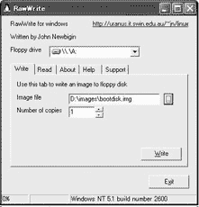
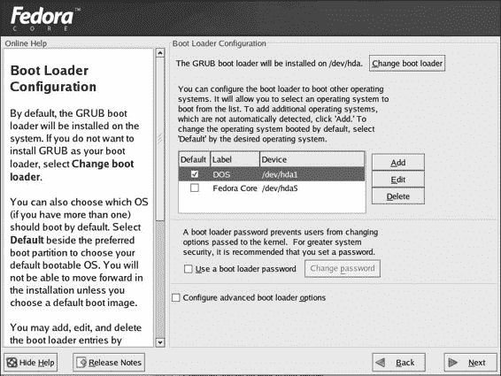
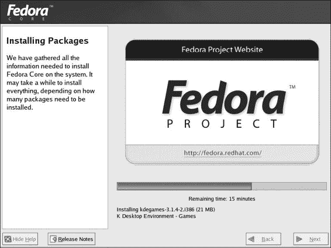
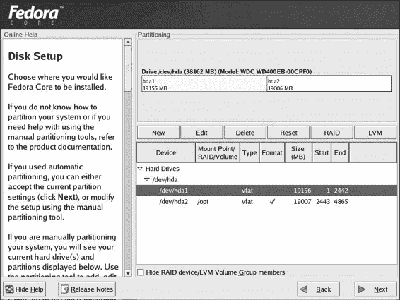
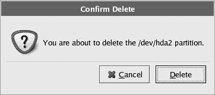
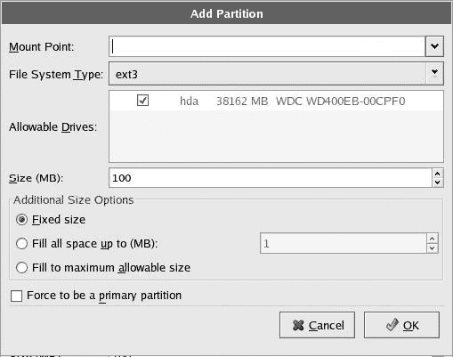
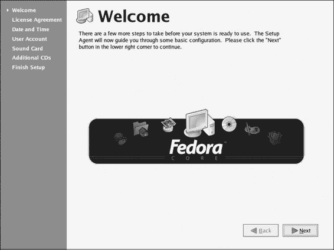

# 第二章：做出承诺

*在您的机器上安装 Linux*

如果您已经在您的机器上安装了 Fedora Core（甚至 Red Hat Linux 9），您可以跳过这一章，直接进入下一章。然而，如果您还没有安装 Fedora Core，并且已经准备好安装，那么您最好就留在原地继续阅读。在这一章中，我将引导您完成安装步骤，并回顾在您的机器上安装 Linux 之前需要做的所有事情。

## 保护您免受自己伤害

在开始安装 Fedora Core 之前，您必须确定 root 密码、用户账户名称和用户密码。您将在安装过程中被要求提供这些信息，所以在这里提前准备好会更好。

您可能会想知道这个“root”是怎么回事，所以我会解释。一般来说，Linux 要求您至少有两个账户：一个“root”账户和一个“user”账户。root 账户是自动存在的；您只需要想出一个密码。root 账户用于系统管理任务，例如安装程序或更改系统设置。

至于用户账户，您将在本章末尾的安装后过程中自行设置。您将决定自己的用户名和密码。用户账户是您用于日常计算任务的账户。

通常情况下，如果您所做的任何事情不是以某种方式更改系统设置，您应该使用您的用户账户。这是 Linux 保护您免受自己伤害的方式，这样在您日常使用电脑的过程中，您不会因为做任何愚蠢的事情而损坏系统。如果您搞砸了什么，它只会影响您个人数据；系统将保持完好。

使用您的 root 账户权限，您可以在任何时候创建额外的用户账户。假设您的家人想要使用您的电脑，但您不希望他们乱动您的文件，或者更糟糕的是，以某种方式破坏整个系统。您可以为自己创建一个账户，然后为您的女儿（Erika）、儿子（Jethro）和配偶（Pat）添加额外的账户。

在这个系统中，当其中任何一个人启动电脑时，他们只能登录到自己的账户，从那里他们将无法访问系统本身或任何其他人的账户中的文件。Jethro 无法阅读 Erika 的私人信件；Erika 无法发现 Jethro 在他的网络浏览器中保存了什么书签，您心爱的 Pat 也无法打开您的一个电子表格文件来了解您是如何挥霍家庭财富的——非常安全和方便。当然，因为您设置了电脑，因此也拥有对 root 账户的访问权限，您可以以 root 用户身份登录并进入他们的任何账户来查看发生了什么。这可能对他们不公平，但事情就是这样。

现在你已经理解了 root/user 的区别，决定一个 root 密码和一个用户密码。你每次登录时都会使用用户密码，所以请确保它是一个你不会忘记的，更重要的是，你每天都不介意输入的密码。虽然你不会经常使用 root 密码，但在做这本书中的项目时，你将会相当频繁地使用它。尽管如此，它应该是你可以记住的，因为它非常重要。

你还需要为自己想出一个用户名。它可能很简单，比如你的首字母（我的用户名是 *rg*）或者你最喜欢的热带鱼的名称，比如 *neontetra*。无论你选择什么，一旦你登录，它就会出现在你的桌面上，所以请确保它是一个你每天都不介意的用户名。每天都要看到“stinky 的家园”可能会有些烦恼，甚至尴尬。顺便说一句，你的用户名不能包含任何空格，并且必须全部小写。

一旦你决定了用户名和 root 以及用户密码，确保你将它们写在一张纸或一本书上，并在安装过程结束并熟悉了系统之前将其随身携带。之后，你可以将其存放在一个安全的地方——但不要忘记，就像我容易犯的错误一样，那个安全的地方在哪里。这些信息非常重要，随着时间的推移，很容易忘记这些事情，而这绝对是你不希望发生的。牢牢记住你的 root 密码是最重要的，因为没有它，你将无法安装软件包、添加用户，甚至更改你的打印机设置。

* * *

* * *

## 单启动还是双启动设置？

如果你机器上没有 Windows，你可以直接跳过这一部分。如果你在机器上安装了 Windows，你首先需要决定你是否想保留它。

在同一台机器上安装 Windows 和 Linux 并让它们愉快共存是可能的。在我自己的情况下，我最初就是从这样一个双启动设置开始的。然而，随着时间的推移，我发现我完全只使用 Linux 的那一部分。由于一个我根本不用的 Windows 系统占据了大量的磁盘空间，这似乎是对宝贵空间的浪费，所以我最终放弃了整个系统，转而选择了纯 Linux 的设置。我的感觉是，除非你有一些在 Linux 端不可用的真正需要的应用程序（可能是一些游戏），那么就选择纯 Linux 的设置，并忘记 Windows。Linux 已经拥有了你需要的大部分东西，而且由于 OpenOffice 可以读取和写入 MS Office 文件，如果你对此有所顾虑，你将足够地连接。

你可能正在想，如果你像我建议的那样，在安装 Linux 时丢弃你的 Windows 系统，如果你不喜欢 Linux 或者无法正确安装它，你可能不得不重新安装 Windows。这无疑会浪费相当多的时间和精力。然而，信不信由你，即使你的不理想情况成为现实，我的建议也有其优势。

你可能已经注意到，随着时间的推移，你的 Windows 系统变得有些混乱——它不再是以前那个敏捷的小猫了。菜单不像以前那样迅速弹出，启动时间比以前更长，你发现自己总是在说“这究竟是什么鬼！”随着神秘的事情越来越频繁地发生。

这只是事物的本质，而将整个系统重新安装回来是一个非常有效的让一切恢复正常的方法。所以即使你后来决定回到 Windows 系统，你也会对自己有所助益，因为它的运行应该会比之前更好。虽然一开始需要做更多的工作，但从长远来看，你会更加快乐。

相反，如果你选择同时运行 Windows 和 Linux，当你启动机器时，你会看到一个 Linux 启动选择屏幕，你可以从中选择继续启动 Linux 或选择 Windows。之后，启动过程将与你选择的系统正常进行。这种设置运行良好，所以你不必担心。

当然，为了创建一个双启动设置，你需要有两个硬盘（最好是）或者至少在一个硬盘上至少有两个分区。你打算安装 Fedora Core（非 Windows，或 *目标* 分区）的硬盘或分区也必须至少有 5 个千兆字节（GB）的大小。如果你没有这么大的单个分区可用，但有两个或三个可以使用的分区，那也行。如果你一个都没有，你可以在尝试安装 Fedora Core 之前安装另一个内部硬盘或者使用一些分区软件，如 Partition Magic，创建另一个分区。

你的目标分区或磁盘的状态将决定在安装过程中创建双启动系统对你意味着什么。例如，如果目标分区或磁盘只是未格式化的空闲空间，安装过程将与纯 Linux 安装非常相似。然而，如果目标硬盘或分区已经格式化为 DOS 文件系统，如 Fat16 或 Fat32，那么在安装过程中你将面临更多的工作。双启动安装过程将在本章后面的“双启动安装”部分中解释——阅读该部分以了解你是否会感到舒适地完成所需的工作。

* * *

* * *

## 预安装：你能从 CD 启动吗？

在继续安装之前，请确保您的计算机已设置为从光盘驱动器启动。如今的大多数机器都已设置为这样做，所以你可能不需要做任何特殊的事情。如果你不确定，也不想捣鼓，可以直接进入下一节中的安装步骤来查找。如果安装开始，你就可以继续了。另一方面，如果你突然在 Windows 中启动，你将需要做一些调整。

可能你唯一需要做的就是重新启动你的机器，然后按屏幕上指示的任意键以进入 BIOS 设置。这通常是 DELETE 或 F1，但并非所有机器都相同。如果屏幕上的信息过快，以至于你错过了，你可以查看用户手册以了解正确的键是什么。一旦进入 BIOS 设置，更改启动顺序，使光盘驱动器排在第一位。

在极其不可能的情况下，如果你的机器根本无法从 CD 启动，你必须创建一个 3.5 英寸的启动软盘。为此，你必须首先在 Windows 中启动你的机器。一旦你到达 Windows 桌面，插入 Fedora Core 安装盘 1，并查找并打开该 CD 上的**dosutils**文件夹。

在**dosutils**文件夹中，你会找到一个名为**rawritewin**的另一个文件夹。打开该文件夹，你会找到一个名为**rawwritewin**的实用程序（这不是打字错误：文件夹名称中有两个 w，但应用程序名称中有三个）。它的图标是一只小企鹅。双击企鹅，RawWrite 将如图图 2-1 所示打开。

(0201_0.jpg)

图 2-1：Windows 下的 RawWrite

要创建启动软盘，将一个 1.44MB 的软盘放入你的软盘驱动器中。在 RawWrite 窗口的**图像文件**输入框中，输入 D:\images\bootdisk.img（如果你的光盘驱动器不是 D 驱动器，请相应地更改此设置）或使用**...**按钮图形化地定位文件。完成这些后，点击**写入**按钮，RawWrite 将为你创建一个启动软盘。完成后，务必相应地标记磁盘。

* * *

* * *

## 动手做

让我们开始实际的 Linux 安装。将安装盘 1 放入你的光盘驱动器（如果你需要制作启动软盘，也请将其放入软盘驱动器）并将其他安装光盘和空白软盘放在你的电脑旁边。将这本书放在你的腿上，以便跟随，并准备行动。是时候动手了！

为了尽可能简化事情，我会要求你让我来做这里的船长。除非我特别要求你检查或自己决定某事，否则不要担心你要做什么。如果我问你做的任何选择听起来很奇怪，那是有原因的，所以不要担心。相信我。我将指导你以这种方式安装系统，这样你就可以完成这本书中的所有项目，让你远离麻烦，在你独立后给你更大的灵活性，并且希望让事情运行得比其他方式更快。我们将安装 KDE 桌面环境以及 GNOME，这样你将来也有机会使用 KDE。一旦你对所做的事情有了更多的了解，你将能够根据需要更改系统设置和添加或删除软件包。

当你查看以下步骤时，安装可能看起来像是一个漫长而繁琐的过程。其实不是。它比你想象的要快得多。安装步骤 1-23 总共花费我不到五分钟的时间来完成。当然，作为一个经常参考此文本的初学者，你可能需要更长的时间，但不要担心。总的来说，整个过程比 Windows XP 或 Mac OS X 的安装过程要快（我认为也更简单）。记住，在 XP 和 OS X 中，你只是安装了操作系统和一些捆绑的应用程序。在 Fedora Core Linux 安装中，你不仅安装了操作系统本身，还安装了你可能想要或需要的几乎所有应用程序。因此，你将一举完成很多事情。

在我们开始之前还有一件事。有些人安装系统时会有很多恐惧。这个过程让他们感到紧张，好像如果他们在某个地方点击了错误的东西，房子就会着火。不用说，没有必要有这样的担忧。只要你的数据已经备份，你就没问题。如果你第一次安装就搞砸了，那又怎样？重新开始即可。没有造成伤害，因为你没有什么可以伤害的。只需确保你给自己足够的时间来完成这个过程。不要在你必须上班或必须去市中心见朋友之前一个小时开始安装。匆忙会让人们做出奇怪的事情。给自己留出足够的时间，并且备份任何你可能会哀悼失去的数据。

话虽如此，让我们开始吧！

1.  **启动** 如果你还没有这样做，请将安装盘 1 放入驱动器（如果需要，放入软盘驱动器的启动软盘），并启动你的机器。

1.  **选择安装类型** 在滚动一些白色文本后，你将到达第一个半图形化屏幕。在这里，你选择要执行安装的类型。只需按下键盘上的回车键进行图形化安装。然后会有一些白色文本在屏幕上流动一段时间。

1.  **媒体检查** 如果您使用本书附带的光盘安装 Fedora，您将不会出现此步骤，因此请跳过到下一步。如果您使用从下载的磁盘镜像（ISO）烧录的光盘，您可以通过按 **回车键** 执行媒体检查，或者通过使用您的 **Tab 键或光标键** 高亮显示 **否** 按钮，然后按 **回车键** 来跳过它。无论如何，这都取决于您，尽管我个人不会麻烦自己。

您现在将看到一个带有“欢迎使用 Fedora Core”字样的蓝色屏幕。此屏幕将静置几秒钟，然后屏幕的下半部分将变黑，并填充一段滚动白色文本。几秒钟后，屏幕将完全变黑，但请不要慌张，因为这都是正常的，并且只会持续几秒钟。然后您将在屏幕中央看到一个 X，随后是一个带有蓝色背景的图形 Fedora Core 启动画面。这将在几秒钟后自行消失，之后您将看到第一个图形安装屏幕，“欢迎使用 Fedora Core”。

|  | 注意  | *如果您使用的是液晶平板显示器或旧式或不寻常的显示器，安装程序可能不知道如何处理它。在这种情况下，之前提到的黑色屏幕可能永远不会消失，或者您可能会看到一个满是扭曲垃圾的屏幕，您无法辨认。如果是这样，请重新启动您的机器，然后在步骤 2 中提到的半图形提示符后输入* linux lowres *，在* ***引导：*** *提示符后（“引导：”已经在屏幕上；您不需要输入它）并按* **回车键***。之后* 应该 *正常工作。如果它们没有正常工作，请重新启动您的机器，并在再次到达半图形提示符时，在* ***引导：*** *提示符后输入* linux nofb *并按* **回车键***。* |
| --- | --- | --- |

1.  **欢迎使用 Fedora Core** 直接点击 **下一步** 继续操作。

1.  **安装的默认语言** 选择您在安装过程中想要使用的语言，然后点击 **下一步**。您稍后还可以选择安装其他语言，所以不用担心这一点。

1.  **键盘配置** 选择您的键盘布局，如果默认设置正确，则接受默认设置，然后点击 **下一步**。

1.  **鼠标配置** 选择您的鼠标类型，如果默认设置正确，则接受默认设置，然后点击 **下一步**。

    |  | 注意  | *如果您使用的是双按钮触摸板，那么 2 Button Mouse (PS/2) 很可能是正确的选择。* |
    | --- | --- | --- |

1.  **显示器配置** 您很可能只有在安装程序无法确定您拥有的显示器类型时才会看到此屏幕。在这种情况下，它将选择 **未检测到的显示器**。如果是这样，请从 **通用** 组中选择一个设置。

1.  **升级检查** 如果您正在将 Fedora 安装到尚未安装 Linux 系统的硬盘上，您很可能不会看到此屏幕。如果看到了，请选择 **安装 Fedora Core**，然后点击 **下一步**。

1.  **安装类型** 选择**工作站**然后点击**下一步**。

1.  **磁盘分区设置** 应该选择**自动分区**作为默认设置。如果是这样，并且你没有设置双启动系统，请点击**下一步**。对于双启动系统，情况略有不同。如果你是在未格式化的分区或硬盘上安装 Fedora Core（即空闲空间），则可以继续到步骤 If。然而，如果你的目标分区或硬盘已经格式化，请选择**使用 Disk Druid 手动分区**，点击**下一步**，并遵循本章后面“双启动安装”部分中的步骤。完成这些后，你可以回到安装过程的第 11 步。

1.  **自动分区** 选择**从这台机器上删除所有 Linux 分区**并点击**下一步**。如果你想清除整个硬盘并使其仅用于 Linux，请选择**从这台机器上删除所有分区**。

    在此阶段，将弹出一个小的窗口询问你是否真的想这样做。点击**是**。这将随后弹出一个小的弹出窗口告诉你，你的引导分区可能不符合你机器的引导约束。只需点击**确定**。

1.  **磁盘分区** 通过点击**下一步**接受默认设置。

1.  **引导加载程序配置** 如果你没有设置双启动系统，请通过点击**下一步**接受默认设置。

    在双启动系统中，每次安装后启动时，你都会看到一个菜单，你可以从中选择启动到 Windows 或 Fedora。如果你什么都不做，引导加载程序将在几秒钟后自动将你引导到 Fedora。如果你希望引导加载程序在你不做任何事情的情况下自动将你引导到 Windows，请点击图 2-2 中显示的**DOS**旁边的复选框。

    

    图 2-2：在双启动系统中设置默认操作系统

1.  **网络配置** 通过点击**下一步**接受默认设置。请注意，如果安装程序找不到兼容的网络（以太网）卡，则此屏幕将不会出现。

1.  **防火墙配置** 点击**下一步**接受默认防火墙。这将保护你的系统免受入侵者。

1.  **语言支持选择** 如果你想设置一个多语言机器，你可以在这里添加额外的语言。你可以选择你喜欢的任意数量的额外语言。你将能够在你选择的任何语言中启动，之后系统界面、大多数应用程序，以及非常重要的帮助文件都将显示为所选语言（如果你对此感兴趣或关心，请阅读第十七章以获取更多信息）。如果你不想要多语言机器，接受默认语言，即安装语言。在任何情况下，通过点击**下一步**来完成你的选择。

    |  | 注意  | *正如您将在第十七章中发现的那样，在安装系统后，为大多数外语添加语言支持很容易。然而，如果您正在考虑安装对中文、日语或韩语的支持，现在这样做会更好，也更简单。* |
    | --- | --- | --- |

1.  **时区配置** 点击您住所附近最接近的黄色点（或者至少与您居住的地区在同一时区）然后点击**下一步**。

1.  **设置 root 密码** 在两个框中输入您决定的 root 密码，然后点击**下一步**。

1.  **软件包安装默认设置** 计算机将花费几秒钟来搜索软件包。一旦完成，选择**自定义要安装的软件包集合**，然后点击**下一步**。

1.  **自定义软件包选择** 在这一点上，您将添加一组程序和其他软件包，这些软件包不是默认的 Fedora 安装的一部分，但对于跟随本书中的项目是必要的，或者至少是有用的。当出现软件包组选择屏幕（如图 2-3 所示图 2-3）时，执行以下操作：

    

    图 2-3：选择要安装的程序和软件包

    1.  勾选**KDE 桌面环境**旁边的框。

    1.  滚动到声音和视频，并点击右侧的**详细信息**链接。将显示一个包含音频/视频软件包详细信息的窗口（参见下一页的图 2-4）。勾选**grip**和**xcdroast**旁边的框，然后点击**确定**。

        

        图 2-4：选择声音和视频软件包详细信息

    1.  最后，滚动到系统部分，并勾选**系统工具**旁边的框。

    当您完成所有这些步骤后，点击**下一步**。

1.  **即将安装** 只需点击**下一步**。

1.  **所需介质** 现在将出现一个小窗口，告诉您需要哪些安装光盘。只需点击**继续**，您的硬盘分区和格式化过程将开始。

1.  **软件包安装** 安装程序接下来将开始将系统和您所选的所有应用程序写入磁盘。您将看到一系列屏幕（都是图 2-5 的各种变体），其中一些包含俏皮的消息，您还将看到一个持续闪烁的蓝色进度条，显示任何给定时刻正在安装的内容。

    您可以坐下来观看这个进度流，去拿个三明治，或者去电视上看《绿色乡村》的重播。无论您选择做什么，请确保大约每十分钟回来检查一下，因为您将需要更换光盘。整个过程，根据您硬件的速度，应该不到 20 分钟。

    

    图 2-5：安装 Fedora Core

1.  **创建启动盘** 当系统和应用程序都安装完毕后，系统会询问你是否想要创建一个启动软盘。为了安全起见，你最好这样做，所以点击**下一步**。然后会弹出一个小窗口（见图 2-6），告诉你将软盘插入驱动器，所以请这样做。不管磁盘是否为空白（只要你愿意牺牲上面的任何数据）或者是否已格式化，都没有关系。将磁盘放入后，点击**制作启动盘**按钮，安装程序将开始擦除、格式化，然后写入你的启动盘。

    

    图 2-6：创建启动软盘

1.  **恭喜，安装完成** 这标志着主要安装过程的结束。你现在需要做的就是从各自的驱动器中取出 CD 和软盘，然后点击**重启**。务必标记那个软盘。

* * *

* * *

## 双启动安装

如果你已经决定在你的机器上保留 Windows 并在另一个分区或另一个内部硬盘上安装 Linux，那么你需要遵循之前第 10 步中提到的这些安装步骤。如果你是在机器上只安装 Linux 而没有 Windows，你可以忽略这一部分并继续，除非，当然，你只是对此感兴趣。

如我之前所述，为了创建双启动设置，你需要在你的机器上有一个额外的硬盘（首选）或者在至少愿意分配给 Linux 的分区（除了安装 Windows 的那个分区）上有 5GB 的空间（10GB 会更好）。如果你没有第二个硬盘或额外的分区，在尝试安装 Fedora 之前，你可能需要安装另一个硬盘或使用分区程序（如 Partition Magic）在你的现有硬盘上添加另一个分区。在继续之前，你不需要格式化或清除目标分区或磁盘；只需确保你有即可。再次提醒，你分配给 Linux 的分区或磁盘上的任何数据都将被永久删除。

以下步骤将为双启动安装准备你的磁盘。这可能会看起来很复杂，但实际上并不坏。只需按照指示进行，你应该不会有任何问题。一旦完成，你总是可以回去更改东西，所以不要过于紧张。这个过程相当宽容。

1.  **选择磁盘或分区** 在图 2-7 所示的屏幕上，您选择您的目标磁盘或分区。图中的磁盘布局当然取决于您的驱动器设置。通过点击列表中的分区名称或点击您的磁盘设置图形映射来选择您将用于 Linux 安装的目标分区或磁盘。您的 Windows 分区很可能是 hda1（对于 IDE 驱动器）或 sda1（对于 SCSI 驱动器），因此您的目标可能是 hda2，或者如果是单独的硬盘，可能是 sda2、hdb1 或 sdb。一旦您做出选择，点击屏幕右半部分中间的**删除**按钮，这将清除您所选分区或磁盘上的所有数据和格式。

    

    图 2-7：选择安装磁盘或分区

1.  **确认分区删除** 将弹出一个小的警告窗口，如图 2-8 所示。点击**删除**按钮以移除分区。如果您在执行此操作后认为已犯错误，无需担心，因为此时您的磁盘实际上并未改变。您仍然可以使用**后退**按钮从头开始。

    

    图 2-8：确认删除分区

1.  **选择空闲空间** 您的目标分区现在应显示为空闲空间。通过点击它来选择该空闲空间，然后点击**新建**按钮。随后将打开一个添加分区窗口，如图 2-9 所示页面 28。

    

    图 2-9：选择空闲空间并添加新分区

1.  **创建交换分区** 在添加分区窗口中，点击**文件系统类型**下拉菜单并选择**交换**。在**大小（MB）**框中，输入一个值，该值是您机器上随机存取存储器（RAM）大小的两倍。因此，如果您有 256MB 的 RAM，则输入 512，依此类推。完成此操作后，点击**确定**。

1.  **创建引导分区** 通过点击剩余的空闲空间来选择它，然后点击**新建**按钮。添加分区窗口将再次打开，但这次，在**挂载点**下拉菜单中，选择**/boot**。在**文件系统类型**下拉菜单中，选择**ext**。最后，在**大小**字段中，输入 1。完成操作后，点击**确定**。

1.  **确认创建引导磁盘** 将打开一个小警告窗口，告知您可能需要创建一个引导磁盘。您将在安装过程的最后进行此操作，以防万一，所以现在点击**继续**。

1.  **创建根分区** 通过点击选择剩余的空闲空间，然后点击**新建**按钮。再次，一个添加分区窗口（见下一页的图 2-10）将打开。对于**挂载点**设置，从下拉菜单中选择**/**。对于**文件系统类型**，从下拉菜单中选择**ext3**。最后，在**额外大小选项**部分选择**填充到最大允许大小**选项。完成所有操作后，点击**确定**。

    

    图 2-10：创建根分区

1.  **分区磁盘** 您刚刚创建的分区设置应该看起来像图 2-11 中所示的那样。（当然，您的可能看起来略有不同，这取决于您的硬件配置。）如果一切看起来都如预期，点击**下一步**。如果某些东西看起来不对劲，或者如果您出于某种奇怪的原因想要重新开始，请点击**后退**按钮并从头开始。

    

    图 2-11：完成的分区设置

1.  **返回主安装步骤** 您现在已经完成了双启动设置。返回到单启动安装过程并继续到步骤 11。

* * *

* * *

## 安装后步骤

一旦您完成了所有安装步骤并且计算机自动重启，您将看到引导加载程序屏幕。如果您只设置了 Linux 机器，只需按**回车键**（或者只需等待几秒钟）。如果您是双启动用户，使用光标键选择 Fedora Core，然后按**回车键**。不久，一个新欢迎屏幕（下一页的图 2-12 所示）将出现，引导您完成安装后的过程。幸运的是，这里只有很少的步骤，所以在这个阶段您不必过于担心。

图 2-12：安装后的欢迎屏幕

1.  **欢迎** 只需点击**下一步**继续。

1.  **许可协议** 仔细阅读协议，然后选择**是，我同意许可协议**并点击**下一步**。

1.  **日期和时间** 默认值应该在这里是正确的，所以，假设它们是正确的，点击**下一步**。如果不正确，您现在可以调整它们。

1.  **用户账户** 只需输入您决定的用户名（不带空格和大小写），您的真实姓名（名和姓），然后在下面的两个框中输入您为用户密码所决定的内容。完成所有这些后，点击**下一步**。

1.  **声卡** 在这里，您可以点击**测试声音**按钮来测试您的声卡。您将听到三个声音（每个扬声器分别一个，然后两个扬声器同时一个）。之后，一个窗口将弹出询问您是否听到了声音。点击**是**，窗口将消失。现在点击**下一步**。

1.  **额外的 CD** 您可能没有，所以点击**下一步**。

1.  **完成设置** 现在你需要做的就是点击 **下一步**。

现在你已经完成了所有操作，你的新 Linux 系统已经安装到你的机器上了。几分钟后，你将看到登录界面，所以想了解之后的操作，请继续阅读下一章。在那里见。阿罗哈。

* * *
