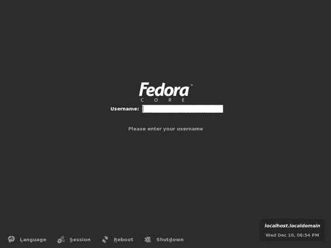
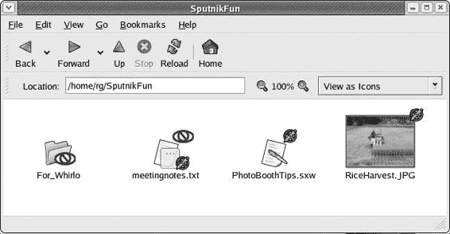
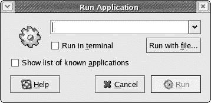
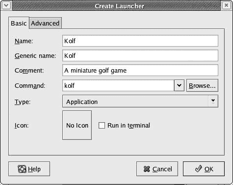
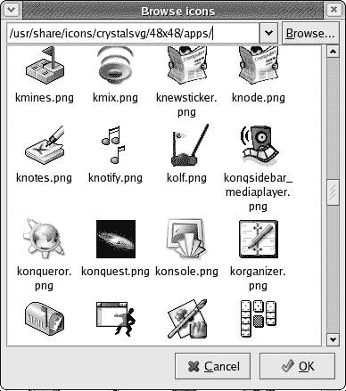
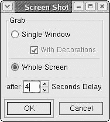

# 第三章：一个新的家

## 概览

*了解桌面*

现在你已经在你的机器上安装了 Fedora，并且准备就绪，跃跃欲试。每次启动 Fedora Core 时都会出现的登录界面就在那里等着你（参见下一页的图 3-1）。

图 3-1：Fedora Core 登录屏幕

没有必要让登录界面等待，所以只需输入你的用户名并按回车键。之后，你将在同一屏幕上被提示输入你的用户密码。输入它并再次按回车键。现在，在片刻之间，你将首次看到你在 Fedora 中的新桌面。

* * *

* * *

## 欢迎来到 GNOME 桌面

如我之前提到的，你的 Fedora 发行版包含两个图形桌面环境：GNOME 和 KDE。它们各自都有优点和缺点，因此都有各自的粉丝和批评者。然而，由于 GNOME 是 Fedora Core 的默认环境，而且我认为对于新 Linux 用户来说处理起来更容易，所以我们将在本书中几乎只关注它。

如果你想知道使用 GNOME 是否会错过什么，让我向你保证，你不会。你可以在 GNOME 中运行任何 KDE 应用程序，反之亦然。实际上，一旦你查看主菜单，你会看到在各个子菜单中列出了许多 KDE 应用程序（简称 *apps*）。大多数以 *K* 开头的应用程序都是 KDE 应用程序，例如 KAtomic 和 KBounce 游戏，以及 KPPP 互联网拨号器，我将在第 X 章讨论。如果你遵循了我在第二章中的指示，KDE 也已安装在你的机器上，一旦你完成这本书，你就可以自由使用它。

GNOME 桌面在图 3-2 中显示，正如你所见，它与你在 Windows 环境中可能习惯的界面并没有太大的不同。但不要完全被欺骗；尽管有相似之处，但它们的不同之处足以引起兴趣。你可能会立即注意到三个主要元素：桌面图标、屏幕底部的 GNOME 面板以及 GNOME 面板最左上角的“主菜单”按钮。我将在本章中重点关注这些元素。

图 3-2：GNOME 桌面

* * *

* * *

## 桌面图标

如你所见，桌面上有三个图标：*用户的主目录、从这里开始*和*回收站*。为了使事情简单，我们将从最容易的、无疑也是最熟悉的这些开始：回收站。

### *回收站*

桌面上的回收站并没有什么神秘之处……至少桌面回收站图标没有神秘之处。它的工作方式与其他操作系统相同。将不再需要或想要的文件拖到回收站图标上，垃圾桶就会填满。如果您想清空回收站，只需右键单击回收站图标，然后从弹出菜单中选择**清空回收站**。如果您不小心将不应该放入回收站的东西拖进去，您将会被告知您不能这样做。这一切都非常简单且熟悉，无论您来自何方。

### *从这里开始*

尽管这个图标的名称是 Nautilus，但您不必从它开始。实际上，您可以完全忽略它，因为它仅仅是一组可以从主菜单中更容易选择的系统偏好链接，但关于这一点稍后再说。

### *用户的主目录*

您自己桌面上的用户主图标不会显示“用户的主目录”。相反，它会用您的用户名来标记。例如，我的用户名是“rg”，所以我的桌面图标显示为“rg 的主目录”。如果您以 malachi 的身份登录，它将显示为“malachi 的主目录”，依此类推。这一切都非常合乎逻辑。当然，我无法猜测这本书每位读者的用户名，所以当提到这个图标时，我会坚持使用更通用的“用户的主目录”，或者简单地称为“主目录”，正如您很快就会发现的，我会经常这样做。

正如您将注意到的，主图标是一个文件夹上的房子（家）的图像。这应该告诉您，这是您的主文件夹——类似于 Windows 系统中的我的文档文件夹。所有您的文件都将保存在这里，所有您的下载都将下载到这里，所有您的音乐都将被转换到这里。这是您的领地，即使您在一台多用户机器上，除了您之外（假设您是唯一知道 root 密码的人）没有人能够随意翻看这里。

* * *

* * *

## Nautilus

如果您双击用户的主图标，将打开一个窗口显示文件夹的内容——它作为您在硬盘上用户文件夹的快捷方式。创建这个文件查看和文件组织系统的程序被称为 Nautilus。您可能以前没有把操作系统的文件管理器当作一个程序来考虑，但实际上它就是这样。

Nautilus 拥有许多值得提及的有趣特性。例如，Nautilus 有一个非常酷的特性，无疑受到了 Mac OS 9 的 WindowShade 特性的启发：双击任何 Nautilus 窗口的标题栏，窗口就会卷起，换句话说，卷入标题栏——这是一个在试图暂时移除一个窗口时非常有用的特性。还有很多这样的特性，所以我现在会指出一些，更多将在后面的章节中介绍。

### *Nautilus 作为图片查看器*

Nautilus 的一个非常方便的功能是它充当一种图片查看器和预览器。当你查看包含图形文件的文件夹内容时，Nautilus 会显示文件的缩略图（如图 图 3-3 所示）以及文件名。这使得你可以在不使用任何其他特殊图像软件的情况下查看你的图形文件。诚然，在操作系统领域，这个功能已经不再独特，但仍然很方便。

图 3-3：在 Nautilus 窗口中查看缩略图

然而，Nautilus 的独特之处在于，当你双击其中一个缩略图时，图像将以更大的尺寸在同一个窗口中打开，如图 图 3-4 所示。除此之外，你可以通过操作 + 和 – 放大镜按钮或通过右键单击该按钮区域并直接从弹出菜单中选择所需的缩放百分比来放大和缩小放大的图像。

图 3-4：在 Nautilus 窗口中查看放大的图像

在 Nautilus 中查看图像时，你不能以任何方式操作图像，但如果你想对图像进行任何更改，你只需右键单击它，然后在弹出菜单中选择 **打开方式** > **The Gimp**，这样就会在 GIMP 中打开文件——Linux 世界的 Photoshop（关于使用 GIMP 的更多内容将在本章和第十四章中介绍）。使用 GIMP，你可以做很多事情，比如改变图像的大小，调整色彩平衡、亮度和对比度，将图像从一种格式转换为另一种格式（例如从 .jpg 转换为 .png），在你的脸颊上喷绘一个美人痣，甚至在你的头上贴满小绿椒。确实非常酷。

### *使用 Nautilus 查看文本和 PDF 文件*

除了让你查看图形文件外，Nautilus 还允许你阅读文本文件的内容（那些以 .txt 文件格式保存的文件），同样不需要任何其他软件。例如，如果你有一些笔记，你将其保存为文本文件，你只需在 Nautilus 中双击文件的图标，其内容就会在 Nautilus 窗口中显示。Nautilus 甚至可以对 PDF 文件做同样的事情，充当简单的 PDF 预览器。

### *Nautilus 的侧边栏*

Nautilus 还有一个侧边栏功能，提供了各种选项。要查看侧边栏，请转到 Nautilus 窗口顶部的 **查看** 菜单并选择 **侧边栏**。现在你的 Nautilus 窗口将在其左侧显示一个主要空白的面板，上面印有你的用户名。除了用户名外，侧边栏还会显示你当前查看的文件夹中有多少文件和子文件夹，以及你最后一次在该文件夹中添加或删除任何文件或子文件夹的时间。如果这些还不够让你热血沸腾，还有更多。

如果你点击侧边栏中的 **信息** 菜单，你可以看到其他选项。其中最有用的可能是一个，Windows 用户应该会感到非常熟悉，那就是树选项。如果你从 **信息** 菜单中选择 **树**，你的整个硬盘布局的文件夹树就会在面板中显示出来（见图 3-5）。你可以在树中点击任何文件夹，其内容将在 Nautilus 窗口的主要部分显示出来。当你忙于在最终创建的各种子文件夹中寻找东西时，这非常方便。

图 3-5：在 Nautilus 侧边栏中使用树视图

### *Nautilus 中的书签*

Nautilus 的另一个非常实用的功能是它允许你创建书签。毫无疑问，你熟悉为常访问的网页创建书签，但为什么你想要在你的文件系统中创建书签呢？想象一下，你有一个经常需要使用的文件夹，但到达该文件夹需要过多的鼠标点击，而且所有这些点击都让你患上了腕管综合征。与其那样伤害自己，你只需点击一次到达那个文件夹，然后在 Nautilus 窗口的 **书签** 菜单中选择 **添加书签**。之后，无论何时你想回到那个深藏的文件夹，你只需点击书签菜单，那个文件夹就会在下拉列表中等待着你（见图 3-6）。

图 3-6：使用 Nautilus 书签菜单

### *在 Nautilus 中更改文件和文件夹权限*

当你在 Linux 世界中前行时，你会发现偶尔你会遇到一个文件或文件夹上有一个红色的斜杠圆圈符号，就像你在下一页的 图 3-7 中看到的那样。我把这个符号称为 *verboten*（在德语中意为 *禁止*）。这个符号可以出现在椭圆形中（意味着你没有权限读取该文件），或者中间有一个铅笔（意味着你没有权限修改该文件）。这是 Linux 尝试保护你的另一种方式，尽管在复制 CD 文件的情况下，它可能不清楚它是如何做到这一点的。

图 3-7：带有 verboten 符号的文件和文件夹

如果你想要更改文件或访问带有 *verboten* 符号的文件夹，在 Nautilus 窗口中这样做是可能的，前提是你被列为该文件或文件夹的所有者。要更改文件或文件夹权限，只需右键单击相关的文件或文件夹，然后从弹出菜单中选择 **属性**。一旦属性窗口打开，点击 **权限** 选项卡，你将看到文件或文件夹的所有者是谁以及你可以或不可以做什么（见图 3-8）。

图 3-8：在 Nautilus 属性窗口中更改权限

你可能会觉得这个权限问题有点令人困惑，但实际上理解起来非常简单。正如你在图 3-8 中可以看到，权限可以授予或拒绝给文件的*所有者*（即你本人），指定的*组*，或者*其他人*（其他所有人）。这些权限包括：

> **读取** 允许查看文件或文件夹的内容。
> 
> **写入** 允许更改文件或文件夹的内容。
> 
> **执行** 允许运行程序或脚本。

通常，你不需要过多担心设置你自己的文件权限，因为你确实是唯一可以访问你的用户账户的人。这个主要例外是当你从 CD 传输文件到硬盘时。在这种情况下，文件将是写保护的，这意味着你无法更改文件，直到你更改它们的权限。你最终会发现，尤其是在你尝试更改系统设置或安装额外的程序包时，有许多文件和文件夹被 root 权限保护，但你将在第九章中学习如何处理这种情况。

如果你正在处理一个从 CD 传输的文件夹或文件，并且因此有一个带有铅笔的红色*禁止*符号，你可以通过点击**所有者**行旁边的**写入**旁边的复选框来更改权限，以便你可以更改该文件。完成后，点击**关闭**按钮，你就可以继续了。

* * *

* * *

## 主菜单

在你屏幕的左下角有一个红色的帽子图标。这是主菜单，它是你访问系统上包含的大多数应用程序和实用程序的入口点。从某种意义上说，主菜单非常类似于 Windows 系统中的开始菜单，尽管它们并不完全相同。当你点击主菜单图标时，所有可用的应用程序和实用程序都会显示出来。

尽管这个菜单很重要，但实际上并没有太多可以解释的，尽管对菜单中每一项的完整解释都不适合放在这本书里。我个人觉得，浏览菜单中的各种项目以了解你可以用来工作或玩耍的内容很有趣。这有点像在圣诞袜的底部挖掘。我还会在其他章节中讨论一些这些菜单项，所以如果你不是寻宝的类型，就耐心等待。

然而，目前我将简要解释菜单底部的八项内容，因为其中许多内容非常重要：

> **帮助** 启动 GNOME 帮助文件查看器。
> 
> **主页文件夹** 打开你的用户的主文件夹。
> 
> **网络服务器** 允许你查看连接到本地网络的其他计算机。
> 
> **运行程序** 允许您通过输入程序的运行命令来启动程序。选择**运行程序**后，将打开一个对话框（参见图 3-9）。尝试输入 glines（应用程序的图标几乎会立即出现在左侧），然后点击**运行**。游戏“Lines”将开始。当然，我们现在太忙了，没有时间玩游戏，所以现在就退出程序吧。

图 3-9：运行应用程序对话框

> **搜索文件** 帮助您在系统中查找文件。要试一试，请选择**搜索文件**。搜索窗口将打开。在**查找位置**字段中，您的家目录将是默认的搜索位置。但是，如果您想搜索整个系统而不是仅限于您的家目录，请删除该框中除斜杠（**/**）之外的所有内容。现在，尝试定位我们在项目 3A-8 中将要使用的其中一个图标。在**文件名为**字段中，键入 kolf.png，然后点击**查找**。您的结果应该看起来像图 3-10 中的那样。

图 3-10：在“搜索文件”窗口中搜索 kolf.png 的结果

> **打开最近使用的文件** 显示最近打开文件的子菜单。
> 
> **锁屏** 启动您的屏保并锁定屏幕，这样在没有输入用户密码之前，没有人能够使用您的电脑。当您将要离开电脑几分钟，又不想让任何人随意操作时，这个功能非常方便。如果您喜欢，现在就可以试一试。
> 
> **注销** 打开一个窗口询问您是否要注销、关机或重启——就像 Windows XP 一样。我将在本章末尾对此进行更多说明。

* * *

* * *

## GNOME 面板

正如您所见，主菜单位于屏幕底部的面板上。这个面板是一个独立的应用程序或程序，称为 GNOME 面板（参见图 3-11）。在操作中，它有点像是 Windows 任务栏和 Mac OS X 托盘的结合；并且像这两个类似面板的应用程序一样，它可以被移动、隐藏、调整大小和自定义，比那两个还要更甚。

图 3-11：GNOME 面板

当您第一次看到 GNOME 面板时，您会注意到它上面有一组默认的图标。其中一些是程序启动器，允许您通过单次鼠标点击启动程序，而其他则是各种实用工具。以下是它们，从左到右排列：

> **主菜单** 访问您大部分应用程序、首选项、设置和其他配置工具的入口点。
> 
> **Mozilla** 您的网页浏览器。本质上，它是 Netscape 的变种。
> 
> **Ximian Evolution** 非常流行的 Linux 电子邮件程序、调度器和任务管理器。
> 
> **OpenOffice.org Writer** 与 Microsoft Word 兼容的文字处理器。
> 
> **OpenOffice.org Calc** 一个与 Microsoft Excel 兼容的电子表格应用程序。
> 
> **OpenOffice.org Impress** 一个与 Microsoft PowerPoint 兼容的演示文稿应用程序。
> 
> **GNOME 打印管理器** 一个提供访问您的打印队列、设置和打印作业的应用程序。
> 
> **工作区切换器** 一个允许您在虚拟桌面之间切换的应用程序（我将在第 3A 项目中详细介绍）。
> 
> **窗口列表** 您打开的窗口或应用程序的列表（非常类似于 Windows）。在图 3-11（#figure.DDU23）中，没有打开任何应用程序，因此列表中没有显示任何窗口。
> 
> **音量控制** 一个允许您调整系统整体音量的控件（Red Hat 9 用户将必须自己添加此控件）。
> 
> **Red Hat 网络警报通知工具** Up2date 的启动器，Up2date 是一个允许您通过 Red Hat Network 直接更新 Fedora Core 或 Red Hat Linux 系统的工具。您将在第十九章（DDU0140_split_000.html#836）中了解更多关于 Up2date 的信息，以及第十章（DDU0076_split_000.html#452）中关于 APT 的信息，APT 是 Up2date 的便捷替代品。
> 
> **时钟** 必要的桌面时钟和日历。

* * *

* * *

## 项目 3A：自定义 GNOME 面板

GNOME 面板不是一个静态的东西。您可以在其中添加启动器（程序快捷方式或别名）、实用工具，甚至娱乐项目，使其几乎能够完成您想要的任何事情，当然，在一定的限制内。在本项目的各个阶段，您将根据需要自定义面板，使您在使用本书的其余部分时更加方便。当然，您可以自由更改我要求您进行的任何自定义，但我建议您在完成本书的其余部分之后再进行更改——如果您现在更改设置，我的说明可能与您屏幕上显示的内容不匹配。一旦您完成本书，您就可以随心所欲地做任何事情。

本项目中的每个子项目都非常简单。大多数都只是两步点选操作，您应该能够轻松地完成。

### *3A-1：将显示桌面按钮添加到面板*

在 GNOME 面板中最初未显示的项目是显示桌面按钮。这是一个方便的实用工具，当点击时，会隐藏所有打开的窗口，以便您可以看到之前被遮挡的桌面。您可能会怀疑自己是否真的需要这个功能，但请相信我——您最终会需要并喜爱这个小巧的按钮。

要添加按钮，您只需执行以下操作：

1.  在音量控制器左侧的空白区域右键单击 GNOME 面板。

1.  在弹出菜单中，选择 **添加到面板** > **动作** > **显示桌面按钮**。

### *3A-2：将主文件夹启动器添加到面板*

即使在这本书中我不会要求你打开用户的主文件夹一百万次，你也会发现一个在 Nautilus 中打开主文件夹的启动器非常方便。一旦你将这个启动器添加到面板上，即使你打开了其他许多窗口并且看不到你的桌面，你也能始终打开主文件夹窗口。

这里是如何添加启动器的：

1.  右键点击面板右侧端靠近显示桌面图标左侧的任何空白区域。

1.  从弹出菜单中选择**添加到面板** > **从菜单启动器** > **主文件夹**。

### *3A-3: 从面板中删除程序启动器*

假设你在面板上有一个你并不特别需要的启动器。你如何才能摆脱它？作为一个例子，让我们删除 OpenOffice.org Impress 的启动器（别担心，你稍后总是可以把它放回去）。

这里是你要做的：

1.  右键点击 OpenOffice.org Impress 图标。

1.  从弹出菜单中选择**从面板中删除**。

### *3A-4: 将程序启动器添加到面板*

现在你已经为面板创建了一些额外的空间来操作，让我们添加一个新的程序启动器。因为我会在后面的章节中要求你大量使用 Linux 命令行终端，所以你现在要添加的程序就是它。为了使内容紧凑且简洁，我将会从现在开始只称它为终端。

这里是你要做的：

1.  右键点击工作区切换器右侧的空白区域。

1.  从弹出菜单中选择**添加到面板** > **从菜单启动器** > **系统工具** > **终端**。

### *3A-5: 在面板上移动图标*

你会注意到你的新终端启动器似乎孤零零地在那里，远离其他应用程序启动器。这看起来并不是一个合理的布局，所以你为什么不移动它。

这里是如何操作的：

1.  右键点击你刚刚在上一节中添加的终端启动器。

1.  从弹出菜单中选择**移动**。此时你的光标应该看起来像是一个瞄准器。

1.  将终端启动器拖动到 GNOME 打印管理器图标左侧的一个位置。其他启动器应该会自动为移动腾出空间。

### *3A-6: 在工作区切换器中减少桌面数量*

Linux 的一个真正酷的特性是它允许你使用虚拟桌面。与大多数操作系统只显示一个桌面不同，你可以查看并工作在多达 100 个独立的桌面中，你可以使用工作区切换器在它们之间切换。目前，你的工作区切换器应该显示四个方块，每个代表一个桌面。这使得图标有点宽，并且占据了面板上过多的空间。因为你很可能对虚拟桌面的概念还不太熟悉，我认为现在用两个来玩应该足够了——至少直到你在本章后面了解更多关于它们的信息。

这里是如何在工作区切换器中减少显示的桌面数量：

1.  右键点击工作区切换器图标。

1.  从弹出菜单中选择**首选项**。

1.  在首选项窗口的右侧，在它说**工作区数量**的地方，选择**2**，然后点击**关闭**按钮。

### *3A-7：将抽屉添加到面板*

我非常喜欢 GNOME 面板的一个特性是抽屉。抽屉是一个小弹出面板，是放置你不想因为空间考虑而放在 GNOME 面板上的启动器，也不出现在主菜单中，因此必须通过命令运行的理想位置。这类启动器对于快速打开大多数从源代码编译的程序以及几个 KDE 程序非常有用。当然，你可以放任何你想要的东西，包括常用的文件。

将抽屉添加到你的面板非常简单：

1.  右键点击主文件夹启动器左侧的任何空白区域。

1.  在弹出菜单中，选择**添加到面板** > **抽屉**。

### *3A-8：将程序启动器添加到抽屉*

你刚刚添加的抽屉在这个阶段当然是空的，所以让我们通过添加几个不在主菜单中出现的 KDE 游戏的启动器来充分利用它。其中一个游戏是 KBattleship，它是著名的战舰游戏的克隆版。另一个是迷你高尔夫游戏（也是我个人最喜欢的游戏之一），Kolf。

这里是你要做的：

1.  在你的面板上抽屉上方应该有一个带有向下箭头的标签页可见。如果箭头不可见，点击一次抽屉，它就会出现。

1.  右键点击标签页，从弹出菜单中选择**添加到面板** > **启动器**。将打开一个创建启动器窗口（见图 3-12）。

    

    图 3-12：在抽屉中创建启动器

1.  对于**名称**和**通用名称**，都输入 Kolf。

1.  在**注释**字段中，输入：迷你高尔夫游戏。

1.  在**命令**字段中，输入：kolf（不要使用大写字母）。

1.  点击写着**无图标**的大方块按钮。然后浏览图标窗口将打开（见图 3-13）。

    

    图 3-13：选择应用程序的图标

1.  在图标窗口的顶部，你应该能看到**/usr/share/pixmaps**。删除它，并输入/usr/share/icons/crystalsvg/48x48/apps/kolf.png，然后按回车键。Kolf 图标现在应该出现在创建启动器窗口中。

1.  最后，点击**确定**，启动器将出现在抽屉中。

要为“战舰”添加启动器，按照上面的步骤进行，但在**名称**和**通用名称**字段中，输入 KBattleship；在**描述**字段中，输入 A KDE Battleship clone；在**命令**字段中，输入 kbattleship（不要使用大写字母）；并为游戏图标的位置输入/usr/share/icons/kdeclassic/32x32/apps/kbattleship.png。

### *3A-9：将鱼添加到面板*

现在我们来到了这个项目可能看起来最无用的部分：在你的面板中添加一条名为 Wanda 的鱼。乍一看，Wanda 除了摆动尾巴和冒出几个气泡之外，几乎没有什么作用。然而，如果你点击她，会弹出一个窗口告诉你你正在运行哪个 Linux 内核，现在是什么时间，你已经登录了多久，以及当前有多少用户正在使用你的机器，这可能是有用的。

要看看 Wanda 在行动中的样子，尽管这个动作可能有限，请按照以下步骤操作：

1.  右键单击抽屉左侧的空白空间。

1.  从弹出菜单中，选择**添加到面板** > **娱乐** > **鱼**。

### *3A-10：将强制退出按钮添加到你的面板*

最后，为了使事情更加完整，让我们回到那些明显有用的领域，并在面板中添加一个**强制退出**按钮。**强制退出**按钮是一个非常实用的工具，它允许你快速轻松地处理无响应的窗口。是的，偶尔会发生这种情况：一个窗口突然拒绝执行任何操作。无论你想让它做什么，或者它本应该做什么，它只是坐在那里，就像它在罢工一样（也许它真的在罢工）。只需点击一下**强制退出**按钮，你的光标就变成了一个强大的手术工具，可以杀死你点击的窗口。然而，你不必担心，因为你可以立即重新运行这些应用程序，尽管在某些情况下，你可能首先需要重新启动。

你绝对不希望没有这个按钮，所以以下是将其添加到面板的方法：

1.  右键单击 Wanda 左侧的空面板空间。

1.  从弹出菜单中，选择**添加到面板** > **动作** > **强制退出**。

你现在已经完成了这个相当简单的项目。你或多或少地学会了面板定制的基础知识，在这个过程中，你创建了一个非常有用的面板配置。如果你按照我告诉你的方式做了所有事情，你的面板现在应该看起来像图 3-14 中的那样。

图 3-14：你新定制的 GNOME 面板

* * *

* * *

## 更多面板乐趣

除了你在上一个项目中刚刚完成的基本定制之外，你还可以做更多的事情来改变面板的外观和感觉。这些选项中的大多数都可以通过在面板的任何空白区域右键单击，然后选择**属性**来获得，这将打开面板属性窗口（参见图 3-15）。

图 3-15：GNOME 面板属性窗口

从这个窗口中，你可以改变面板的位置，改变其大小，改变其颜色，或者使其（但不是其上的启动器）不可见——非常酷。你还可以设置面板，使其在你不用它时自动消失，并在你将鼠标光标移到面板通常所在区域时重新出现。不要害怕尝试和玩耍——这是乐趣的一半！

### *Mac 用户可以感到宾至如归*

GNOME 面板程序的另一个酷炫功能是你可以将额外的面板添加到屏幕的其他部分。前 Mac 用户可以通过右键点击任何打开的面板空间并选择**添加面板**来创建一个相当像 Mac 的桌面，这将导致一个新的面板出现在屏幕顶部。按照默认设置，新的面板会显得有点宽，不太像 Mac 菜单栏，但你可以在面板属性窗口中减小其大小（29 或 30 像素应该可以解决问题）。

为了进一步使界面更像 Mac，你可以右键点击面板，在左上角添加一个菜单栏（选择**添加到面板** > **添加菜单栏**），在右上角添加一个窗口菜单（选择**添加到面板** > **实用工具** > **窗口菜单**），一个时钟（选择**添加到面板** > **附件** > **时钟**），旁边一对眼睛（选择**添加到面板** > **娱乐** > **眼睛**），以及一个便签工具（选择**添加到面板** > **附件** > **便签**）。这将给你一个类似 Mac OS 9/X 的混合菜单栏。通过在这里和那里做一些调整，Mac 用户可以很容易地创建一个看起来非常像 Mac OS X 的桌面环境（见图 3-16）。

图 3-16：类似于 Mac OS X 的桌面，屏幕顶部和右侧有面板

如果你好奇如何获得图 3-16 中显示的类似 Aqua 的窗口边框和控制，请翻到第五章。

* * *

* * *

## 虚拟桌面

现在是时候讨论 Linux 的一个相当独特且方便的功能了：虚拟桌面。而了解这个虚拟桌面业务最好的方式就是亲自尝试一下。

在你的 GNOME 面板中，点击 Wanda，你的主文件夹，以及 Mozilla。这样，你现在的桌面上或工作空间中就会打开三个窗口。现在看看你面板上的工作空间切换器图标。图标的上半部分应该是蓝色的；这是你当前的工作空间。点击图标的下半部分，即灰色的部分，你所有的打开窗口会突然消失。

实际上，并没有真正消失的东西——你只是在查看一个新的桌面。你所有的其他窗口仍然在之前的桌面上打开并运行。在这个第二个桌面上，你可以打开其他东西：转到主菜单，选择**游戏** > **AisleRiot**。AisleRiot 单人纸牌游戏将很快出现。

现在，你在两个不同的桌面上打开了窗口，你可以在这两个桌面之间切换。要做到这一点，只需转到你面板上的工作空间切换器并点击顶部的灰色框，这将带你回到你的原始桌面。一旦你这样做，底部的框将变成灰色，然后你可以点击它回到你的游戏桌面。

如你所想，这个功能除了帮助你避免杂乱之外，还有一些潜在的好处。想象一下，你正在 OpenOffice.org Writer 中键入一篇长文档。最终，你有点累了，决定通过玩 GNOME Mines 来放松一下。为此，你切换到另一个桌面，在那里打开并玩游戏。过了一会儿，当你注意到你的老板在办公室里四处走动时，你只需切换回第一个桌面，这样当他经过并问“忙吗，Boaz？”时，你看起来很忙。

呼吁！

* * *

* * *

## 项目 3B：截图

如果不告诉你如何参与看似是普通 Linux 用户最大热情的事情：截图，那就太不公平了。我不知道为什么企鹅主义者对截图如此着迷；可能是因为他们可以如此自定义他们的系统，或者可能只是因为从 Linux 内部截图如此容易。无论原因是什么，你遇到的任何个人 Linux 网页都可能至少有该用户桌面的几张截图。

现在你已经加入了摇摆的大军，你也可以加入这个乐趣，在这个过程中，向你的朋友和同事展示你找到的酷炫应用程序的图片，通过电子邮件向你的母亲展示某个菜单选择在哪里（正如我经常做的那样），或者在你完成第五章后，展示你对系统所做的酷炫自定义。

### *3B-1：全屏截图*

在 GNOME 中截图相当简单，有几种方法可以做到。要拍摄整个桌面的截图，只需按下键盘上的 PRTSCN（打印屏幕）或 PRTSCN-SYSRQ 键。然后，将打开一个“保存截图”窗口（如图 3-17 所示，下一页），默认情况下，会要求你将截图保存到你的家目录。如果你想将截图保存到另一个文件夹，只需在点击**保存**按钮之前选择不同的文件夹。

图 3-17：保存截图

与其使用键盘上的 PRTSCN 键，你可以在面板上添加一个截图按钮，它将执行相同的功能，尽管我认为这样做并没有太大的优势，除非你想要按钮提供的拍照感觉。无论如何，要添加按钮，只需在面板上的任何空白区域右键单击，然后选择**添加到面板** > **按钮** > **截图**。然后，当你想要截图时，你只需点击按钮即可。*咔嚓！*

### *3B-2：单窗口截图*

如果你只想截图单个窗口，而不是整个屏幕，过程几乎一样简单。首先，确保你的鼠标光标悬停在你想截图的窗口边界内，然后只需用一只手指按住 ALT 键，用另一只手指按下 PRTSCN 键。将打开“保存截图”窗口。

### *3B-3: 使用 GIMP 截图*

这些截图方法简单、有趣且容易，但它们确实有一个限制：它们不允许你在打开菜单时截图。如果你想截图桌面或任何打开菜单的窗口，你需要使用 GIMP。

幸运的是，使用 GIMP 截图也是一个非常简单的过程。首先，通过主菜单选择**图形** > **GIMP**来启动 GIMP。一旦老 GIMPster 打开，转到主 GIMP 窗口顶部的**文件**菜单（里面有所有工具的那个），然后选择**获取** > **截图**。

截图窗口将很快打开（见图 3-18）。一旦打开，选择**全屏**，并调整窗口底部的**秒数延迟**字段中的数字，以便在截图时给你足够的时间打开你想要的菜单。

图 3-18: 使用 GIMP 截图

当你准备好时，点击**确定**，迅速打开你想要截图的任何菜单，哇，就完成了。截图将很快在 GIMP 中打开，你可以随意处理它。

* * *

* * *

## 关闭

好吧，既然你对你的桌面环境这么熟悉，你可能想结束一天的工作并关闭你的机器。要这样做，只需转到主菜单并选择**注销**。将出现一个带有三个选项的小窗口：*注销*（默认）、*关闭*和*重启计算机*。选择**关闭**，然后点击**确定**，关闭过程将开始。然而，如果在点击**确定**后似乎没有发生任何事情，请同时按下 CTRL + ALT + BACKSPACE，这将带你回到登录屏幕（图 3-1 在第 32 页[DDU0025.html#87]）。一旦到达那里，点击屏幕底部的**关闭**。这将弹出一个小窗口询问你是否确定要关闭。只需点击**确定**，关闭过程将开始。

在关机过程中，您的屏幕将回到文本模式，您会在黑屏上看到一串白色文本和绿色的“Oks”，这是系统关闭其各个组件时的显示。当一切完成后，系统很可能会关闭您的电脑，在这种情况下，您就完成了。然而，在少数机器上，系统可能无法关闭您的电脑。如果您的情况是这样，您会知道，因为屏幕上的文本流会在“**Power down**”这个词处停止。如果您在屏幕上看到这些词，并且大约 15 秒内没有其他动作发生，那么只需手动按下电源按钮关闭机器即可。在那个时刻这样做是完全安全的。

* * *
